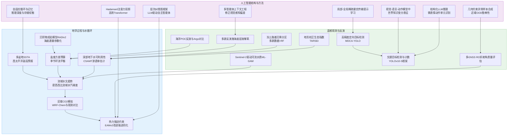
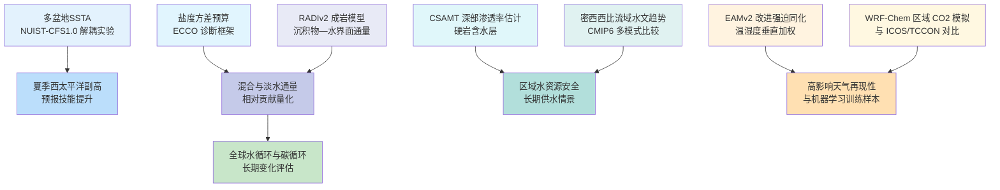
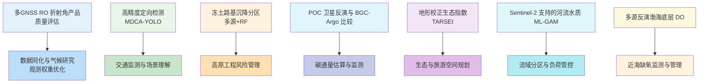
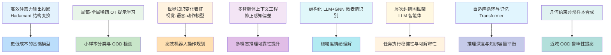
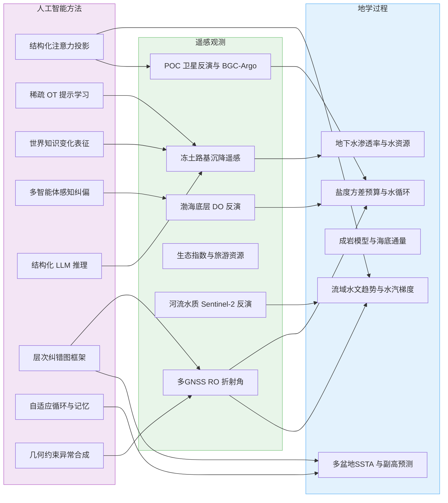
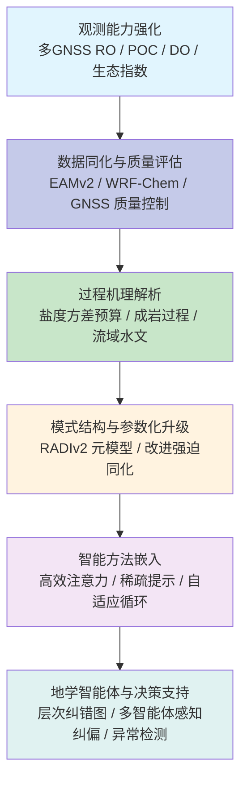

在2026年3月3日至3月10日期间，来自 arXiv、AGU、EGU、Copernicus 期刊群以及 Remote Sensing 等刊物的706篇论文中，超过一百五十篇直接或间接聚焦于地学过程模拟、遥感反演与人工智能方法论的交叉融合。基于这些论文的标题、摘要与元信息，并结合近期关于地学与遥感领域人工智能应用的综述性工作，可以观察到三个层面的清晰信号：其一，地学方向围绕水循环强化、盐度结构与地下水系统的多尺度过程刻画正在快速收敛到可用于决策的指标体系；其二，遥感方向从单一传感器反演走向多源、多时滞、多尺度的组合框架，对冻土工程安全、河流水质与生态系统服务的约束能力显著提升；其三，人工智能方向在注意力效率、结构化推理、鲁棒异常检测和智能体决策架构上持续演化，为构建具备领域知识与物理约束的地学智能体奠定了基础。

## 一、本期研究印记图：水循环强化、多源观测与结构化智能

从整体图景来看，本期论文在时空尺度、数据源与算法范式上高度耦合。地学侧，围绕西太平洋副热带高压、水汽输送与流域水资源安全的研究，进一步表明多盆地海表温度距平与陆面水文响应之间存在可预报的联系；海洋盐度方差预算与沉积物成岩模型的改进，则为长期水循环与碳循环评估提供了更精细的下边界条件。遥感侧，以多GNSS电离层改正折射角质量评估、冻土路基沉降分区、颗粒有机碳卫星反演、复杂山地生态与旅游景观识别、河流水质驱动因子量化以及渤海底层溶解氧反演为代表的工作，展示了从“地表观测”走向“近地—次表层环境诊断”的趋势。人工智能侧，从结构化 Hadamard 变换压缩注意力输出、稀疏最优传输引导提示学习，到视觉—语言—动作模型中的世界知识变分建模、多智能体感知校正以及几何约束异常样本合成等研究，体现出“效率、稳健性与可转移性”并重的演化方向。

综合这些工作，可以用一幅面向“观测—反演—过程模拟—智能决策”链条的结构化示意图来刻画本期研究印记。

在这一结构下，后文将按照地学、遥感与人工智能三个方向，分别构建代表性论文的专题画像，进而给出跨学科网络关系与创新链的综合讨论。

## 二、地学方向：水循环强化与多圈层过程耦合

### 2.0 地学方向代表性研究概览

**表1：地学方向代表性研究的技术路线与特点**

| 研究主题 | 技术路线 | 技术特点 | 重要结论 |
|---------|---------|---------|---------|
| 多盆地SSTA对夏季西太平洋副高预测的影响 | NUIST-CFS1.0 季节气候模式多盆地海温解耦试验 | 同时量化热带太平洋、印度洋和大西洋海温距平对副高预报贡献，区分直接与间接遥相关路径 | 明确热带太平洋和大西洋是夏季副高可预报性的关键驱动，且不同海盆在不同提前量上的相对贡献存在显著差异 |
| 大尺度季节输运在平均盐度分布中的作用 | 基于 ECCO 的盐度方差预算诊断 | 通过方差预算定量拆分淡水通量与混合过程对盐度分布的贡献 | 大尺度随季节变化的盐度通量约贡献全球混合作用的四分之一，需在模式中精细表示 |
| RADIv2 沉积物成岩模型 | 可扩展成岩模型与回归型元模型结合 | 在多环境统一框架下模拟海底生地球化学和溶质通量 | 通过元模型在全球尺度为海底通量提供统一、高效的参数化方案 |
| 深部地下水渗透率地球物理估计 | CSAMT 多维反演结合钻孔标定 | 非侵入式估算硬岩区千米尺度渗透率分布 | 在复杂地质条件下建立可转移的深部渗透率估计框架，为长期供水安全评估提供支撑 |
| 全球盐湖萎缩的水资源风险 | 综合水文—生态—社会视角的综述性分析 | 聚焦盐湖缩减过程、驱动因子与治理难点 | 指出气候、取水与流域工程共同驱动盐湖萎缩，恢复与治理需要跨流域、跨部门协调 |
| 改进 EAMv2 中的热力强迫同化 | 垂直加权的温湿度与风场强迫策略 | 在保持水循环合理性的同时提高再分析一致性 | 定制化温湿度强迫在多个高度层显著提高高影响天气和辐射通量的模拟技能 |
| 密西西比河流域水文趋势 | 基于 CMIP6 多模式集合的水文量分析 | 对比降水、蒸散、径流与输水响应，量化东西向水分梯度演化 | 预期东部子流域径流增强更显著，西部支流干旱风险上升，水资源管理难度加大 |
| 西欧区域 CO2 模拟评估 | WRF-Chem 被动示踪模拟与 ICOS、TCCON 观测对比 | 多排放清单、多层垂直排放配置敏感性试验 | 指出排放垂直剖面与背景场不确定性是区域 CO2 模拟误差的关键来源 |

### 2.1 专题画像：多盆地海温距平与夏季西太平洋副高预测

**（1）技术路线：基于 NUIST-CFS1.0 的多盆地解耦数值试验**

该研究以 NUIST-CFS1.0 季节—年际气候预报系统为基础，将热带太平洋、印度洋和大西洋海表温度距平分别实施解耦试验与组合试验，在1983–2018年的多套预报集合中系统评估不同海盆信号对夏季西太平洋副热带高压可预报性的贡献。具体做法上，研究通过改变外强迫配置构建若干理想化试验：例如仅保留热带太平洋距平、仅保留热带大西洋距平、仅保留热带印度洋距平以及多海盆组合强迫试验，并在2–4个月不同提前量的情形下对比副高指数的可预报性。为了避免单一指标偏差，研究不仅考察了500 hPa 位势高度场与传统副高指数的相关技能，还评估了中高纬环流型、季风雨带位置以及降水异常型的再现实验，从而在动力学一致的框架下识别各海盆 SST 异常对副高的直接与间接作用路径。通过这一设计，工作在多海盆、多提前量、多集合成员的多维度空间中建立了副高预测技巧与海盆信号组合之间的经验联系。

**（2）技术特点：解耦路径、海盆对比与提前量依赖性**

与以往主要关注单一海盆或经验统计回归关系的研究相比，该工作在技术上突出三个特点。第一，采用动力一致的数值解耦策略，将多海盆 SST 异常的直接与间接效应在同一模式框架下进行剥离和对比，避免了不同模型系统、不同观测资料带来的结构性差异。第二，通过系统改变预报起报时间，将提前量依赖的预测来源拆分出来：结果表明，当提前量较长时，热带太平洋距平通过热带环流调整与Rossby波列遥相关共同支配副高异常，而在短提前量下，热带大西洋通过Kelvin波—Ekman 散度通道维持较为稳定的影响，这一分工有助于解释不同模式在不同提前量上技能差异的成因。第三，研究进一步量化了热带印度洋的相对作用：其直接影响在短提前量中更为显著，而通过改变热带太平洋海温模式的间接路径则主要出现在长提前量试验中。通过这些定量拆分，工作为后续面向业务应用的“目标海盆预测精度优先级排序”提供了明确依据。

**（3）重要结论：多盆地信号共同构成夏季副高可预报性的主干**

该研究的重要结论是：**热带太平洋与大西洋海表温度距平共同构成夏季西太平洋副热带高压可预报性的主干来源，其中热带太平洋在长提前量下通过本地海气相互作用与远程遥相关共同驱动副高异常，而热带大西洋在所有提前量上维持更稳定的贡献，热带印度洋的影响相对较弱但在不同提前量上呈现出由直接效应向通过太平洋间接效应演化的结构变化**。这一结果从多海盆角度统一了先前关于副高可预报性的分散认识，为改进季节尺度东亚夏季风与极端降水预报提供了清晰的动力学约束，也提示后续观测与同化系统需要在太平洋和大西洋关键区域保持高质量的海表与次表层观测。

### 2.2 专题画像：盐度方差预算与全球水循环结构

**（1）技术路线：基于 ECCO 的盐度方差预算诊断框架**

该研究构建了以 Estimating the Circulation and Climate of the Ocean（ECCO）同化结果为基础的盐度方差预算诊断框架，通过显式计算盐度方差源汇项，将传统上以空间平均场或剖面分析为主的研究拓展为过程分解。方法上，作者将盐度演变方程转化为方差形式，将表层淡水通量驱动的“展宽”项与紊动混合和大尺度平流导致的“收窄”项分离开来，再结合多年的同化数据估算各项在全球和区域尺度上的相对贡献。通过这一框架，可以定量回答“季节性大尺度输运在维持平均盐度分布中的作用究竟有多大”这一长期存在但难以回答的问题。研究进一步利用这一诊断分析不同洋盆与关键区域（例如副热带高盐区、热带低盐带）中，淡水通量、风应力驱动的季节性循环与混合过程之间的平衡结构。

**（2）技术特点：从平均场到方差预算的过程分解**

与以往主要基于盐度剖面或盐度倾向的分析不同，该工作在技术上将研究重心转移到方差预算层面，使得对物理过程的定量认识更加清晰。首先，方差预算天然关注“差异”而非仅关注平均值，因此更适合刻画水循环强化情景下盐度分布形态的演化。其次，将大尺度季节循环驱动的盐度通量视作一种“有效混合”并量化其对方差缩减的贡献，为重新评估模式中季节循环表示质量的重要性提供了依据。研究结果表明，大尺度季节性盐度通量约贡献全球混合作用的四分之一，这一比例显著高于部分模式中隐含假定的“次要角色”，提示在改进模式物理过程、评估未来水循环变化时，需要更精细地表示季节性盐度输运。最后，区域分析显示在某些关键区域，季节性输运对方差的贡献甚至超过局地混合，这对理解海洋盐度作为“淡水循环指纹”的空间分布具有直接意义。

**（3）重要结论：准确表示季节性盐度循环是水循环模拟的关键约束**

该研究的重要结论是：**大尺度季节性盐度输运对全球盐度方差混合贡献约为23%，在若干关键海区甚至成为主导项，因此在气候模式中准确表示季节性盐度循环是再现实测盐度分布与评估未来水循环强化情景的关键约束**。这一结论从方差预算角度为“利用盐度变化诊断水循环变化幅度”的一系列工作提供了物理支撑，也为后续通过多源观测与同化进一步约束模式参数化提供了清晰的诊断指标。

### 2.3 专题画像：RADIv2 与全球海底成岩过程参数化

**（1）技术路线：通用成岩模型与回归型元模型的耦合**

RADIv2 在原有成岩模型基础上进行了结构性扩展，引入了可描述甲烷循环、扩散边界层厚度与孔隙水扩散的模块，使其能够在从近岸到深海的多种环境中统一描述沉积物—水界面物质交换。技术上，作者首先在一组代表性站点上运行全复杂度的一维成岩模型，对不同沉积物类型、底水环境与有机质输入条件下的溶质通量进行系统试验。随后，通过回归和机器学习方法训练“元模型”，以少量环境变量（例如沉积物有机碳含量、底水氧气浓度、沉积速率等）预测关键溶质通量（氧气、无机碳、碱度）。这一设计使得在全球三维海洋模型中，可以用低成本的参数化方案替代逐点运行高开销成岩模型，在不牺牲关键物理—化学约束的前提下显著提高计算效率。

**（2）技术特点：多环境统一表达与可嵌入型参数化**

RADIv2 的技术优势体现在三方面。第一，其方程组通过引入更多过程参数（例如孔隙水扩散与边界层厚度），在保持数值稳定性的同时更好地代表不同海洋环境的成岩过程，这对于当前关注缺氧区扩展、海底甲烷释放与碳酸盐补偿深度变化的研究尤为重要。第二，元模型的使用使得在大尺度模式中可以“按需调用”成岩过程：对于对溶质通量敏感的区域，仍可运行全复杂度模型，而在大部分区域则用回归模型快速预测，从而实现精度与成本的平衡。第三，模型框架在设计时充分考虑了与现有全球生地球化学模式（例如 ECCO-Darwin 或 CMIP 风格耦合模式）的接口一致性，从变量、时间步长到边界条件均可直接对接，这一点对于推动成岩过程进入下一代地球系统模式具有现实意义。

**（3）重要结论：统一的成岩元模型显著改善全球海底通量表示**

该研究的重要结论是：**基于 RADIv2 与回归型元模型的一体化框架，可以在全球尺度上以较低计算成本提供物理合理的沉积物—水界面溶质通量参数化，从而显著改善当前地球系统模式中海底通量表示的完整性与一致性**。这一结论意味着，在评估海洋酸化、底层缺氧扩展及其对碳循环与生态系统的长期影响时，模型能够以更加接近过程本身的方式处理海底边界条件，而不再依赖过于理想化或区域经验性的通量设定。

### 2.4 专题画像：CSAMT 约束的硬岩深部地下水渗透率

**（1）技术路线：CSAMT 反演结合钻孔样品标定**

该研究针对硬岩地区深部含水层勘查难、传统钻孔试验成本高且空间代表性不足的问题，提出了一套基于受控源音频大地电磁（CSAMT）与钻孔标定相结合的渗透率估计方法。技术路线方面，研究首先在目标区布设CSAMT观测剖面，通过多频观测反演获得二维乃至三维电阻率结构；随后，利用来自六口钻孔的116件岩芯样品，在0–200米深度范围内开展室内试验，建立局地电阻率与渗透率之间的经验关系。基于这一关系，将CSAMT反演得到的深部电阻率场映射为渗透率分布，从而在1000米量级的深度范围内构建连续的水文地质模型。

**（2）技术特点：多维度成像与局地经验关系的可转移框架**

与传统的一维电测深或稀疏钻孔插值方法相比，该框架在空间维度与参数维度上都实现了显著拓展。首先，CSAMT 本身具备较强的水平分辨率和良好的深度探测能力，通过二维和三维反演可以在复杂地质体中识别导水带、断裂及岩性变化，为后续渗透率分布推断提供结构约束。其次，通过局地标定得到的电阻率—渗透率经验函数虽然在数值上具有区域特异性，但方法论本身可以迁移到其他地区：只需在新区域重复钻孔采样与实验标定，就可以建立对应的经验关系，并与CSAMT电阻率场耦合。第三，研究充分讨论了CSAMT 反演的病态性与不确定性，通过引入钻孔“硬数据”对反演模型进行约束，显著减小了深部电性结构的不确定范围，这对于将电性结构转化为水文参数尤为关键。

**（3）重要结论：非侵入式深部渗透率估计为长期供水安全提供新工具**

该研究的重要结论是：**将CSAMT电阻率成像与局地钻孔标定相结合，可以在硬岩环境下给出千米尺度深部渗透率分布的空间连续估计，为在地表水资源压力加剧背景下评估深部含水层可利用性提供了一个可复制的技术路径**。这一结论为在水资源紧张地区部署以地球物理方法为主导的深部地下水勘查提供了方法学依据，也为后续将类似方法拓展到热储层评价、地热能开发和地下储能安全评估奠定了基础。

### 2.5 专题画像：全球盐湖萎缩与治理困境

**（1）技术路线：跨流域综合评估与案例比较**

该 Nature 文章从全球视角汇总了多个典型盐湖流域的长期观测、遥感监测与社会经济数据，系统分析了湖面面积缩减、盐度升高、生态退化与健康风险之间的耦合关系。技术路线包括：首先，利用多源卫星影像和历史测站观测，重建过去数十年主要盐湖的面积、体积与盐度演变；其次，结合流域来水量、蒸发量与取水数据，构建简单但可跨流域比较的“水量收支指标体系”；再次，通过文献梳理与政策分析，归纳各地治理尝试中的成功经验与失败教训，形成“工程调水—需求管理—生态恢复”多路径对比框架。

**（2）技术特点：水文、生态与社会过程的一体化审视**

该工作并未引入复杂的数值模式，而是通过多源数据整合与跨案例比较，将水文过程、生态响应与社会系统耦合在同一分析框架之下。研究强调，盐湖萎缩并非单一气候因子或单一取水工程所致，而是气候变暖导致蒸发增强、上游用水增加、河道工程调度与土地利用变化等多因素叠加的结果。文章特别指出，即便在气候条件相似的流域，不同治理策略也可能产生截然不同的结果：某些流域通过严格限制取水和实施生态补水实现了阶段性恢复，而另一些地区则因缺乏跨部门协调与长期资金保障，治理效果有限。这种以案例比较为基础的综合分析，为后续定量模式研究提供了问题清单和关键情景。

**（3）重要结论：盐湖治理需要跨尺度、跨部门的协调机制**

该研究的重要结论是：**全球盐湖萎缩是气候变暖、流域工程和用水需求共同作用的结果，单一工程性措施难以扭转长期趋势，真正可持续的治理需要在流域尺度上重构“水量分配—生态需求—经济活动”之间的平衡，并建立跨部门、跨边界的协调与监督机制**。这一结论为后续在地学与社会科学交叉领域构建更精细的盐湖水资源与生态风险模型提供了明确的政策背景与现实约束。

### 2.6 专题画像：EAMv2 中改进的热力强迫同化策略

**（1）技术路线：温湿度与风场分层强迫的系统性试验**

该研究以 E3SM 大气模式第二版（EAMv2）为平台，通过一系列再分析强迫回算实验系统评估不同强迫策略对大尺度环流与高影响天气再现性的影响。技术上，作者设置了多组合实验：仅风场强迫、风场加温度、风场加湿度、风温湿共同强迫，以及在这些组合基础上引入选定高度层的垂直加权方案。所有实验均向 ERA5 再分析靠拢，并通过对比温度、湿度、降水、辐射通量、多种天气系统（热带气旋、大气河流、中纬度气旋）的指标来评估模式响应。在此基础上，研究进一步探讨了陆面变量（例如地表温度、土壤湿度）强迫对模拟技能的边际贡献。

**（2）技术特点：物理一致性与强迫强度之间的平衡**

与仅以相关系数或均方误差为目标的传统强迫实验不同，该研究强调在提高大尺度场一致性的同时，保持水循环与能量平衡的物理合理性。垂直加权方案的引入，使得温湿度强迫在对流层中下部与上层的作用得到分离，避免在对流层中低层直接“拉扯”模式状态而损坏降水形成机制。结果表明，适度的温湿度强迫可以显著改善热带和中纬度环流、再分析一致性以及辐射通量偏差，同时不会削弱水循环强度；而过强或层次不加区分的强迫则容易引入非物理的局地能量收支异常。研究还发现，通过针对性强迫陆面变量，可以进一步改善地表温度与近地层湿度偏差，并间接提高降水和云场的表现。

**（3）重要结论：精细化热力同化提升再现性并服务高影响天气研究与机器学习**

该研究的重要结论是：**通过在垂直方向上有选择地强迫温度和湿度，可以在不破坏水循环和降水物理过程的前提下显著提升EAMv2 对 ERA5 的一致性，从而为高影响天气、气候事件诊断以及基于模拟数据的机器学习训练提供更可信的约束场**。这一结论为未来在高分辨率全球模式中系统引入热力同化提供了操作性方案，也为生成用于智能预报和数据同化研究的高质量“近实况”数据集提供了物理基础。

### 2.7 专题画像：密西西比河流域水文趋势与东西向水分梯度

**（1）技术路线：CMIP6 多模式集合与水文量综合分析**

该研究利用第六阶段耦合模式比较计划（CMIP6）的19个气候模式，在 SSP3-7.0 情景下系统分析21世纪密西西比河流域的降水、蒸散、土壤湿度、径流与河川输水的月尺度变化。方法上，作者首先对模式的历史气候模拟进行观测约束和性能筛选，确保进入未来情景分析的模式能够合理再现流域降水与径流的年际变化特征；其次，对 P-ET、径流和输水进行子流域分区统计，对比东部子流域与西部密苏里支流在不同时段和不同模式下的趋势一致性；再次，结合大尺度环流与海温型，分析那些预测径流增加的模式与预测干旱增强的模式在 ENSO 暖事件、北大西洋副热带高压发展等方面的差异。

**（2）技术特点：趋势分歧与大尺度驱动因子的对应分析**

该工作在技术上强调将流域水文趋势的不确定性与大尺度驱动因子联系起来，而非仅给出范围宽泛的径流变化区间。结果表明，在几乎所有模式中，降水在未来情景下存在增加趋势，但由于蒸散增强，土壤湿度在各季节均呈减小趋势，从而导致 P-ET 与径流在不同区域上的响应具有显著差异。东部子流域由于降水增幅更大，径流增加的信号更为稳健；而以密苏里河为代表的西部支流，干燥化趋势更为明显，部分模式甚至出现径流持续下降。进一步分析表明，那些给出径流增强情景的模式往往伴随更强的太平洋暖事件与更明显的北大西洋副热带高压发展，从而增强向俄亥俄子流域的水汽输送；而给出干燥情景的模式中，这些大尺度信号较弱。这种对应关系为理解模式间差异的物理根源提供了线索。

**（3）重要结论：东西向水分梯度增强加剧水资源管理不确定性**

该研究的重要结论是：**在 SSP3-7.0 情景下，尽管密西西比河流域整体降水增加，但土壤湿度在各季节均趋于下降，径流趋势在空间上呈现“东丰西枯”的格局，东部子流域径流增加信号较为稳健，而西部支流干燥化风险明显提升，这种东西向水分梯度的增强将显著增加现有水资源工程体系的调度压力与风险**。这一结论提示，在制定未来水资源与防洪策略时，应显式考虑大尺度环流与海温型的不确定性，并在东部与西部子流域采取差异化的适应路径。

### 2.8 专题画像：WRF-Chem 对西欧 CO2 浓度的区域模拟评估

**（1）技术路线：多排放清单、多剖面配置与观测对比**

该研究采用 WRF-Chem 在被动示踪模式配置下，对2018年夏季比利时及周边地区的大气 CO2 浓度进行高分辨率模拟，并将结果与集成碳观测系统（ICOS）五个地面站以及 TCCON 柱积分观测进行系统对比。技术路线包括：首先，基于 CAMS-REG-ANT、EDGAR 与 TNO 三套排放清单，构建多组排放情景；其次，为考虑高架源和不同行业的排放高度差异，引入源类特异的垂直排放剖面，并设计不包含剖面信息的对照实验；再次，基于各观测站多高度层 CO2 时间序列与模式输出进行统计比较，分析不同排放清单与垂直剖面对模拟偏差与相关系数的影响。

**（2）技术特点：排放剖面与背景场不确定性的定量拆分**

研究发现，在靠近大型排放源的站点，例如德国 Karlsruhe 站，模拟的近地层 CO2 对排放清单与垂直剖面极为敏感，若忽略源特异剖面，则与观测的偏差可达十余 ppm，而引入剖面信息后，相关系数从约0.5 提高到0.8 左右。在区域平均尺度上，TCCON 观测的柱积分 CO2 被 WRF-GHG 较好再现，但巴黎附近存在约1.2 ppm 的系统性高估，推断与背景边界场和城市排放清单的不确定性有关。此外，初夏时段多数站点表现出负偏差，可能与植被生长季通量模拟误差相关。通过这一系列敏感性试验，研究将模拟误差拆分为排放强度、垂直剖面与背景场三部分，为后续改进区域碳同化系统提供了定量基准。

**（3）重要结论：排放垂直剖面与背景场是区域 CO2 模拟中的关键不确定来源**

该研究的重要结论是：**在区域 CO2 模拟中，引入源类特异的垂直排放剖面可以显著提高模式对近地层 CO2 日变化与幅度的再现能力，而背景场与城市排放清单的不确定性则是造成系统性偏差的主要来源，这一认识为构建面向同化与反演的高质量先验提供了明确的改进方向**。这一结论对今后在欧洲及其他高排放区开展 CO2 反演与排放评估具有普适意义，也说明地面观测网络与高质量排放数据在约束区域碳循环方面的关键作用。

## 三、遥感方向：多源观测、可解释反演与环境风险评估

### 3.0 遥感方向代表性研究概览

**表2：遥感方向代表性研究的技术路线与特点**

| 研究主题 | 技术路线 | 技术特点 | 重要结论 |
|---------|---------|---------|---------|
| 多GNSS RO 折射角质量评估 | ROM SAF 与 CDAAC 多任务折射角产品对比 | 对12个任务折射角质量控制、偏差与噪声进行系统评估 | 识别出不同任务在中高层折射角噪声与偏差上的系统性差异，为后续同化和气候研究提供参考 |
| 面向遥感小目标的定向检测 | 基于YOLO的双分支感知网络 | 大卷积核与条形卷积结合，多尺度特征自适应融合 | 在遥感定向检测数据集上相对于基线网络显著提高 mAP，特别是对小目标与高密度场景 |
| 青藏高原冻土路基沉降分区 | 多源遥感因子与 RF 机器学习 | 结合热工数值模拟与遥感指标构建30米分辨率风险图 | 揭示不同温度与冰含量主导机制，并给出定量沉降等级分布 |
| 地面与空基一体化车辆监测 | YOLOv10-S 检测与轨迹驱动计数 | 统一框架下集成检测、跟踪与计数，结合知识蒸馏增强鲁棒性 | 在多数据集下实现实时、高精度的车辆检测与计数，为交通监测提供可部署方案 |
| POC 卫星反演与 BGC-Argo 评估 | 卫星海色算法与 BGC-Argo 对比 | 对比多种算法并量化区域偏差，提出粗分辨率校正方案 | 证明以叶绿素简单函数即可达到接近复杂算法的精度，为长期 POC 监测提供实用方案 |
| 地形校正生态指数与生态旅游识别 | 利用 DEM 构建地形复杂度指数并替代干燥分量 | 将遥感生态指数从二维扩展到三维，突出复杂山地的地形效应 | 在实证区域显著提高生态质量评估与旅游资源识别的一致性 |
| Sentinel-2 支持的河流水质驱动因子分析 | 多尺度 GAM 框架与 Sentinel-2 反演指标 | 定量评估自然与人类因子在不同缓冲尺度上的阈值效应 | 揭示氮、磷等水质指标与土地利用之间显著的尺度—阈值关系 |
| 渤海底层溶解氧多源反演 | 多源遥感与 XGBoost 反演框架 | 引入时间滞后变量与物理约束变量，并开展可解释性分析 | 以较高精度恢复底层 DO 时空变化并识别夏季缺氧区分布与驱动因子 |

### 3.1 专题画像：多GNSS RO 折射角质量评估

**（1）技术路线：12 个任务、统一参照系下的系统质量评估**

该研究针对现有多 GNSS 电离层改正折射角产品在质量上的差异，构建了一个覆盖12个任务的统一评估框架，任务包括 MetOp-B/C、Sentinel-6、Spire、COSMIC-2、KOMPSAT-5 与 TerraSAR-X 等。技术路线首先从 ROM SAF 与 CDAAC 数据中心提取各任务的折射角产品，以 ERA5 再分析资料为共同参考场，对65–80千米高空的折射角进行偏差、噪声与质量控制通过率统计。随后，研究根据不同高度层将评估结果分段呈现，在中层大气与高层大气分别讨论各任务的系统性偏差与随机误差特征。通过这一方法，研究在单一参照系下实现了多任务之间的可比性，为未来在数据同化中设置观测误差协方差与相对权重提供了直接依据。

**（2）技术特点：偏差、噪声与通过率的三维度诊断**

与以往主要聚焦单一任务或简单均方误差指标的评估不同，该研究在技术上同时关注质量控制通过率、系统性偏差与随机噪声三个维度。质量控制层面，Spire 任务折射角产品的通过率最高，超过99%，MetOp 系列与 Sentinel-6 也保持在约90%以上；COSMIC-2 稍低，而 KOMPSAT-5 与 TerraSAR-X 在高空段的通过率分别约为62%与68%。偏差层面，多数任务在65–80千米之间的折射角偏差控制在0–0.05微弧度范围内，但个别任务在特定几何配置下存在略大的系统偏差。随机噪声层面，Sentinel-6 在高空段的噪声最小，约0.87微弧度，而 TerraSAR-X 与 KOMPSAT-5 噪声分别接近2.3与1.9微弧度。这样细致的分解不仅有助于识别“表现最优任务”，也为解释不同资料在再分析与气候再建中的贡献差异提供了定量背景。

**（3）重要结论：多任务折射角产品在高层大气质量差异显著**

该研究的重要结论是：**在电离层改正后的折射角产品中，不同 GNSS 任务在高层大气的质量存在显著差异，Spire、MetOp 与 Sentinel-6 在质量控制通过率、偏差与噪声方面整体表现优于 COSMIC-2、KOMPSAT-5 与 TerraSAR-X，这一差异需要在后续的资料同化与气候研究中通过任务加权与误差建模得到充分体现**。这一结论为全球电离层与中高层大气反演工作提供了明确的观测优选依据，也为未来设计新一代 RO 任务提供了质量目标。

### 3.2 专题画像：高精度定向目标检测网络 MDCA-YOLO

**（1）技术路线：双分支感知模块与多自适应特征融合**

该研究针对遥感高分辨率影像中小目标定向检测难、背景复杂和尺度变化大的问题，在 YOLO 框架上提出了多尺度、双分支的 MDCA-YOLO 网络。技术路线包括三个关键模块：一是引入双分支感知模块（DBPM），在主干网络中组合大卷积核与条形卷积，使得网络能够在保持局部细节的同时增强长距离依赖感知，尤其适合捕捉细长或方向性强的目标；二是提出多自适应选择融合模块（MASF），在特征金字塔不同尺度之间通过注意力机制自适应调节各尺度特征的贡献，从而减少跨尺度信息丢失与背景噪声干扰；三是通过重构解耦检测头 CoordAttOBB，将角度回归与边界框回归更紧密耦合，并融合坐标注意力以提高定向框的回归精度。整体网络在 DIOR-R 等典型定向目标检测数据集上进行了系统训练与测试。

**（2）技术特点：小目标、复杂背景与方向回归的综合优化**

与传统 YOLO 变体相比，MDCA-YOLO 的改进并非简单增加网络深度或宽度，而是有针对性地优化了影响遥感定向检测性能的三个薄弱环节。DBPM 通过大核与条形卷积的组合，在不显著增加计算量的前提下提升了对细长目标的响应能力；MASF 则通过通道注意力与空间注意力的结合，使得网络在复杂背景下能够抑制噪声区域、强化目标区域，从而提高小目标检测的稳定性；CoordAttOBB 的引入，则通过编码空间位置信息与通道信息，改善了定向边界框的回归精度。实验结果显示，相较于 YOLO11s 等基线网络，该方法在 DIOR-R 数据集上的 mAP50 与 mAP50:95 分别提升约2.5 与 2.7 个百分点，尤其在小目标与高密度场景中优势更为明显。

**（3）重要结论：结构性改进显著提升遥感定向检测的工程适用性**

该研究的重要结论是：**通过在 YOLO 框架中引入双分支感知模块、多自适应特征融合与坐标注意力定向检测头，可以在计算成本可控的前提下显著提升遥感高分辨率影像中小目标与方向敏感目标的检测精度，为军事侦察、港口监管与交通监测等工程场景提供了可直接迁移的网络结构**。这一结论表明，在遥感检测任务中，精心设计的结构性改进往往比单纯扩大模型规模更具性价比，也为后续将类似思想引入目标跟踪与变化检测提供了思路。

### 3.3 专题画像：冻土路基沉降分区与工程风险评估

**（1）技术路线：热工数值模拟与多源遥感因子耦合的 RF 框架**

该研究面向青藏工程走廊中暖而富冰冻土区公路路基长期稳定性问题，构建了一个将热工数值模拟结果与多源遥感预测因子耦合的随机森林（RF）沉降风险分区框架。技术上，作者首先在若干代表性断面上开展热—力学耦合的数值模拟，估算典型工况下不同地段的最大冻融沉降；随后，选取地表温度、冻融指数、植被指数、地形因子与地下冰含量类型等多源遥感与地表数据，将点位模拟结果回归到区域尺度，并训练RF模型。在模型训练完成后，利用遥感因子在走廊全线上的分布，对13米宽分离式路基进行30米分辨率的沉降等级预测，形成区域风险地图。

**（2）技术特点：分区主导机制识别与遥感因子敏感性分析**

研究不仅给出空间分布结果，还深入分析了不同沉降等级背后的主导机理。结果显示，III级沉降（20–30厘米）为最常见等级，占总面积约40%；高等级沉降区主要集中在温度较高且富冰的多年冻土区，例如曲玛河、乌力与沱沱河一带。通过RF 模型的特征重要性分析，研究发现多年平均地温（MAGT）与冰含量类型（ICT）是影响沉降空间分布的关键因子，且其主导作用具有分区性：约一半区域由冰含量主导，对应更高沉降量；约三分之一区域由两者共同控制；剩余区域则以温度主导，对应较低沉降量。多源遥感因子中的地表温度与冻融指数与沉降等级高度相关，验证了其作为工程风险代理量的合理性。

**（3）重要结论：温度与冰含量主导机制的空间分异对工程维护具有直接指导意义**

该研究的重要结论是：**青藏工程走廊冻土路基沉降在空间上表现出显著分异，温度与冰含量在不同区域交替成为主导因子，其中约半数区域属于“高温—高冰含量”组合，对应较大的沉降风险，多源遥感因子中的地表温度与冻融指数可作为有效的工程风险代理量，为路线优化与维护优先级排序提供了定量依据**。这一结论对下一步在高原地区开展基于遥感的基础设施风险实时监测具有直接参考价值。

### 3.4 专题画像：车辆检测、跟踪与计数一体化遥感框架

**（1）技术路线：YOLOv10-S 检测、OC-SORT 跟踪与轨迹驱动计数**

该研究针对地面监控与空基遥感平台上的车辆监测场景，提出了一个在统一框架内实现车辆检测、跟踪与计数的一体化方案。技术路线在检测层面以轻量化 YOLOv10-S 为主干，通过结构蒸馏引入来自更大网络的知识，以增强模型在复杂背景与跨平台场景中的泛化能力；在跟踪层面采用观察中心的多目标跟踪算法（OC-SORT），利用目标运动信息与短期外观特征，在存在相机运动与交通密集的条件下保持较稳定的身份连续性；在计数层面，通过虚拟闸门与轨迹驱动计数策略，将车辆跨越闸门的轨迹视为计数事件，有效减少重复计数与漏计问题。

**（2）技术特点：轻量化架构与跨数据集鲁棒性**

与依赖复杂架构的深度网络不同，该方案强调在工程应用中的可部署性与实时性。YOLOv10-S 的轻量化设计结合知识蒸馏，使得在边缘设备上运行成为可能，而不显著牺牲检测精度。OC-SORT 在跟踪中引入更稳定的轨迹预测与关联机制，使得在视角变化与遮挡较多的场景中仍能保持较高的身份保持率。跨数据集实验表明，在 UA-DETRAC 与 VisDrone 等数据集上，该框架在准确率、鲁棒性与推理延迟之间取得了良好平衡，适合在城市交通监测与无人机巡查场景中推广。

**（3）重要结论：统一框架为多平台交通监测提供可落地方案**

该研究的重要结论是：**通过将轻量化目标检测、稳健多目标跟踪与轨迹驱动计数整合在统一框架下，可以在地面监控与空基遥感平台上实现实时、可靠的车辆监测，为智能交通系统中的车流统计、异常检测与运行评估提供一套可直接部署的技术方案**。这一结论说明，在遥感与视频分析交叉场景中，合理的系统架构与算法组合往往比单一模块的极限精度提升更具应用价值。

### 3.5 专题画像：颗粒有机碳卫星反演与 BGC-Argo 交叉评估

**（1）技术路线：多算法比较与区域校正**

该研究围绕海洋表层颗粒有机碳（POC）反演问题，对现有多种基于海色的 POC 反演算法进行了系统重评估，并将卫星产品与 BGC-Argo 浮标的近表层观测进行比较。技术路线首先选取一组代表性算法，包括基于叶绿素浓度、基于散射系数以及多变量组合的经验模型，并在全球范围内计算对应的 POC 产品；随后，将卫星 POC 与 BGC-Argo 的观测进行对比，评估不同算法在不同区域的偏差与散布情况；最后，根据识别出的区域性偏差模式，引入粗分辨率的区域校正因子，对叶绿素与后向散射观测进行简单修正，并重新计算 POC 产品，以检验校正效果。

**（2）技术特点：简单算法与复杂算法的公平对比**

研究的一个显著特点是以“简单但稳定”的叶绿素单变量算法作为对照，检验更复杂算法在全局尺度上的实际收益。结果表明，在原始状态下，各种算法与 BGC-Argo 观测的差异一般在30%以内，而通过区域性简单校正后，可以将差异进一步压缩到约15%。更为重要的是，依赖叶绿素单变量的简单算法在多数区域与复杂多变量算法表现相当甚至更优，仅在特定高浑浊或光学性质异常区域存在明显差距。这一发现对长期业务化 POC 监测具有现实意义，因为简单算法更易维护且对传感器变化更具鲁棒性。

**（3）重要结论：简化算法在适度校正后即可满足全球 POC 监测需求**

该研究的重要结论是：**在适度的区域性校正之后，基于叶绿素单变量的简单经验算法即可在全球尺度上提供与复杂多变量算法相当的 POC 估计精度，二者与 BGC-Argo 观测之间的差异可控制在约15%以内，这为构建设备与任务多样化条件下的长期 POC 监测体系提供了可行、稳健的技术路径**。这一结论表明，在全球监测任务中，算法的简单性与稳定性往往与精度同样重要。

### 3.6 专题画像：地形校正遥感生态指数与山地生态旅游识别

**（1）技术路线：引入地形复杂度指数的 TARSEI 框架**

该研究针对传统遥感生态指数（RSEI）在复杂山地地区对地形效应刻画不足的问题，引入基于数字高程模型的地形复杂度指数（TCI），将生态评估从二维扩展到三维。技术路线包括：通过 DEM 计算坡度、起伏度、切割深度与曲率四个地形指标，并通过主成分分析构建综合 TCI，用其替换 RSEI 中的干燥分量；同时，结合 Landsat 8 的绿度、湿度与热度指标，对多期影像进行主成分综合，形成地形校正后的 TARSEI 指数。随后，在真实山地城市案例中，对比 TARSEI 与原始 RSEI 在生态质量分布与旅游兴趣点覆盖率方面的表现。

**（2）技术特点：生态质量与旅游资源识别的统一度量**

研究发现，在案例区中，TARSEI 高值区与生态旅游兴趣点空间重合度达82.3%，显著高于原始 RSEI 的48.1%。同时，TARSEI 识别出28个新的高价值生态旅游资源集群，总面积约520平方千米，占城市总面积的8.9%，其中98.5%与高 TARSEI 区域重叠。通过这一分析，研究表明地形复杂度在复杂山地地区对生态质量与景观价值的共同控制作用不容忽视，传统忽略三维地形结构的生态指数容易低估峡谷、山脊与高地边缘的生态与景观价值。

**（3）重要结论：引入地形复杂度显著提高复杂山地生态与旅游规划的一致性**

该研究的重要结论是：**通过在遥感生态指数中引入基于 DEM 的地形复杂度指数，可以显著提高复杂山地地区生态质量评价与生态旅游资源识别的一致性，为兼顾生态保护与旅游开发的空间规划提供量化依据**。这一结论对山区城市与风景区的国土空间规划具有直接参考价值，也为后续在全国尺度推广类似指标提供了方法学样板。

### 3.7 专题画像：Sentinel-2 支持的河流水质多尺度驱动因子分析

**（1）技术路线：多尺度 GAM 框架与 Sentinel-2 指标耦合**

该研究利用 Sentinel-2 多光谱影像与实测水质数据，构建了一个从50米到20千米多尺度缓冲区的广义加性模型（GAM）级联框架，用于识别河流水质指标（总氮、总磷、高锰酸盐指数、浑浊度）对自然与人类驱动因子的多尺度响应。技术路线包括：首先，利用遥感反演与现场观测联合建立水质指标估算模型；其次，在河流缓冲区内统计森林覆盖率、水体面积、农业与城市用地等因子在不同尺度上的比例；再次，构建多尺度 GAM，识别各因子在不同空间尺度上的阈值与非线性响应。

**（2）技术特点：尺度—阈值关系的定量揭示**

分析结果表明，总氮对森林覆盖与水体面积表现出多阶段响应：在低覆盖度区，森林增加可明显降低总氮，而在一定阈值之后，边际效应减弱甚至反向；总磷则主要受农业与城市用地驱动，在特定缓冲尺度上存在清晰的阈值范围，超出阈值后水质恶化显著加剧。通过这一分析，研究不仅给出了多因子、多尺度的统计显著性关系，还为制定精细化流域分区与负荷管控策略提供了量化参考。

**（3）重要结论：多尺度分析为河流缓冲区管理提供可操作阈值**

该研究的重要结论是：**通过构建多尺度 GAM 级联框架，可以定量识别自然与人类驱动因子在不同空间尺度上对河流水质指标的阈值效应，其中森林与水体面积对总氮具有多阶段调节作用，而农业与城市用地对总磷的影响在特定缓冲尺度上表现出显著阈值，这为科学划定缓冲区宽度与制定分区负荷标准提供了可操作的量化依据**。

### 3.8 专题画像：渤海底层溶解氧的多源反演与可解释性分析

**（1）技术路线：时间滞后遥感指标与决策树集成学习结合**

该研究关注渤海底层溶解氧（DO）季节性缺氧问题，在传统遥感反演难以直接触达底层水体的背景下，通过引入时间滞后与多源数据构建了可解释的反演框架。技术路线包括：首先，利用多源遥感数据获取海表温度、叶绿素浓度、浊度等生物光学变量，并通过不同滞后时间窗口构建时间滞后特征；其次，利用决策树集成模型（XGBoost）在大量现场 DO 观测样本上训练反演模型，并通过遗传算法筛选最优特征子集；再次，通过模型解释工具对变量重要性与响应曲线进行分析，识别主导 DO 变化的物理因子。

**（2）技术特点：时间滞后与物理约束变量的联合引入**

研究表明，当引入约14天的时间滞后变量时，模型性能显著提升，反映了表层生物活动对底层 DO 影响的时间延迟。在仅使用表层生物光学变量的情况下，XGBoost 反演的 R² 约为0.86，RMSE 约为0.79毫克每升；当进一步引入基于物理模型估算的底层变量后，R² 可提升至0.89，RMSE 降至0.68毫克每升，表明物理约束变量对于提升反演精度具有关键作用。可解释性分析显示，海表温度是影响底层 DO 的首要因子，其次为叶绿素与浊度等指标，反映了水体稳定度、生物生产与有机质分解共同控制的机理。

**（3）重要结论：时间滞后多源反演框架可可靠恢复近海底层 DO 时空结构**

该研究的重要结论是：**通过引入时间滞后遥感指标与物理约束变量，结合决策树集成学习与可解释性分析，可以在不直接观测底层水体的条件下，以较高精度恢复渤海底层溶解氧的时空变化结构，并可靠识别夏季缺氧区的位置与演变，为近海生态风险评估与管理提供定量工具**。这一框架展示了多源遥感与机器学习在“不可直接观测层”环境监测中的潜力。

## 四、人工智能方向：高效注意力、结构化推理与稳健异常检测

### 4.0 人工智能方向代表性研究概览

**表3：人工智能方向代表性研究的技术路线与特点**

| 研究主题 | 技术路线 | 技术特点 | 重要结论 |
|---------|---------|---------|---------|
| 高效注意力输出投影 | 用固定 Walsh-Hadamard 变换替代稠密输出投影 | 显著减少注意力参数与显存占用并保持性能 | 在多种规模模型上实现参数、显存与吞吐率的综合优化 |
| 局部—全局稀疏最优传输提示学习 | 在 VLM 中构建共享稀疏补丁支持集与平衡 OT 分配 | 同时提升小样本分类性能与 OOD 检测能力 | 保持 CLIP 表征几何结构的同时显著提高鲁棒性 |
| 视觉—语言—动作模型中的世界知识变分表征 | 以世界知识变化量而非绝对状态为建模对象 | 通过 VQ-VAE 与先验提取器建模可操作世界知识变化 | 在机器人操作任务中同时提升性能与效率 |
| 多智能体上下文工程修正视觉感知偏差 | 将感知与推理解耦并通过多代理共享证据列表 | 通过总结与重构工具对中间证据进行迭代修正 | 在多模态数学推理中显著降低由感知错误引起的失败比例 |
| 面向微表情识别的结构化 LLM 推理 | 将视觉特征注入文本提示并构建结构化推理链 | 结合图神经网络表达 AU 关系与反事实一致性约束 | 在标准基准上显著提升跨域泛化能力 |
| LLM 智能体的层次纠错图框架 | 用多维度可转移策略与错误矩阵分类指导纠错 | 将历史状态与动作编码为因果上下文图以支持检索 | 在复杂多步任务中提高策略迁移效率与执行可靠性 |
| 具有自适应循环与记忆的 Transformer | 将循环迭代与外部记忆库联合引入 Transformer | 在相同计算成本下提升数学推理能力并保持常识性能 | 展示出不同层在循环与记忆访问上的功能分化 |
| 几何约束异常样本合成 | 在特征空间沿主方差子空间与置信壳层合成 OOD 样本 | 通过对近域 OOD 的几何约束提高能量基检测性能 | 在近域 OOD 基准上优于多种现有方法并自然过渡到符合推断框架 |

### 4.1 专题画像：基于 Hadamard 结构变换的高效注意力输出投影

**（1）技术路线：以固定变换替代可训练输出投影并保留简单仿射层**

该研究重新审视多头注意力中输出投影矩阵的角色，提出用参数固定的 Walsh-Hadamard 变换替代传统的稠密可训练矩阵，再在其后附加轻量的可训练仿射缩放层。技术上，作者在多种规模的 Transformer 模型中，将注意力输出层的线性变换替换为快速 Hadamard 变换（FHT），该变换通过稀疏加减运算实现近线性复杂度，同时保持正交与范数守恒特性；随后，保留一个通道维度上的线性仿射层，以恢复必要的可学习自由度。通过这种方式，每个注意力块约可减少四分之一的参数量，并显著降低前向与反向传播的显存占用。

**（2）技术特点：效率提升与表示能力保持之间的折中**

与近年大量基于核近似或低秩分解的高效注意力方法不同，该方案不改变注意力权重的计算过程，而是在输出投影阶段进行结构性压缩，从而最大程度保持原有注意力机制的表达能力。实验结果表明，在标准语言建模与下游理解任务上，采用 Hadamard 结构变换的模型在多数配置下能够维持甚至略优于基线模型的性能，同时在大型模型配置中实现约7% 的参数量减少、近9% 的峰值显存节省与6% 左右的吞吐率提升。更为有趣的是，作者发现这些结构化模型在相同训练浮点运算下的验证损失下降更快，提示在优化视角下结构约束可能有助于提升计算利用效率。

**（3）重要结论：结构化输出投影为地学与遥感基础模型的轻量化提供可行路径**

该研究的重要结论是：**通过在多头注意力输出阶段引入正交的 Hadamard 结构变换并保留轻量仿射层，可以在几乎不牺牲模型表达能力的前提下，有效降低 Transformer 模型的参数与显存开销，为在受资源约束环境中部署地学与遥感基础模型提供了一条可落地的结构化轻量化路径**。这一结论表明，对于需要在大范围空间—时间网格上进行推理的地球系统应用，结构约束型网络是兼顾成本与性能的有力候选。

### 4.2 专题画像：局部—全局稀疏最优传输提示学习

**（1）技术路线：共享稀疏补丁支持集与平衡最优传输对齐**

该研究面向少样本视觉—语言模型适配问题，提出在 CLIP 等模型上构建局部—全局联合的提示学习框架。技术路线首先通过视觉—视觉注意力机制在图像补丁空间中构建一个类条件的稀疏补丁支持集，使得同一类别的多个局部区域能够共享统一的高价值补丁集合；随后，采用带熵正则的平衡最优传输，将该共享补丁集与多个类别特定文本提示进行对齐，从而在局部层面上实现补丁与提示之间的“软分区”，避免不同提示竞争使用同一局部证据。全局分支则保持原有图像—文本匹配结构，用于维持整体类别层面的语义一致性。

**（2）技术特点：原生特征几何结构与稳健性的兼顾**

与依赖额外投影层或大规模适配模块的方法不同，该框架刻意避免对原始 CLIP 表征空间进行大幅度线性变换，而是通过对局部补丁与文本提示之间的分配方式进行优化，来提升下游任务表现。实验结果显示，在11个标准少样本数据集上，该方法在16-shot 场景下的平均准确率达到约85%，优于多种现有提示学习方法。同时，在近域 OOD 检测任务中，由于未改变原始特征空间的几何结构，方法在保持少样本性能的同时，在 OOD 检测指标（例如 AUC）上显著优于依赖投影的适配方法。

**（3）重要结论：局部—全局稀疏分配机制在少样本与 OOD 场景中兼具性能与稳健性**

该研究的重要结论是：**通过在局部补丁空间构建共享稀疏支持集并使用平衡最优传输将其与类别特定提示进行对齐，可以在不破坏基础模型几何结构的前提下，同时提升少样本分类精度与近域 OOD 检测能力，这为将视觉—语言基础模型迁移到遥感与地学图像场景提供了一种兼顾性能与稳健性的提示学习机制**。

### 4.3 专题画像：世界知识变化表征驱动的视觉—语言—动作模型

**（1）技术路线：以世界知识变化量为核心的动作生成框架**

该研究提出在视觉—语言—动作（VLA）模型中，以“世界知识变化量”而非绝对未来状态作为主要建模对象。技术路线包括：通过先验引导世界知识提取器，从视觉输入中抽取可操作区域、空间关系与语义线索，构建当前世界知识先验；随后，通过向量量化变分自编码器（VQ-VAE）在离散潜空间中编码动作导致的知识变化，将原本高维的未来状态预测任务转化为低维潜向量的预测；最后，引入条件变化注意力模块，减少变化建模过程中不同知识分量之间的干扰，使得模型能够在保留关键信息的同时维持各类知识的相对独立性。

**（2）技术特点：从结果预测转向过程变化建模**

与以往直接预测未来图像或场景状态的方法相比，该框架强调在语义层面建模“从当前状态到目标状态的变化”，从而使动作规划更加贴近人类对任务的理解方式。通过将动作效果编码为离散潜向量，模型可以在更紧凑的空间中学习高层次策略，并在不同任务之间共享变化模式。实验结果表明，在多种模拟与真实机器人任务中，该方法在成功率与效率指标上均优于直接预测未来状态的基线模型，同时在记忆与计算成本方面具有优势。

**（3）重要结论：世界知识变化量建模为地学与遥感场景下的操作智能体提供结构模板**

该研究的重要结论是：**通过在视觉—语言—动作模型中显式建模世界知识变化量而非绝对未来状态，可以在保持动作生成灵活性的同时，大幅降低表征与计算成本，为在遥感影像分析、环境监测与自主探测等场景中构建具备“理解—计划—执行”能力的操作型智能体提供了结构模板**。

### 4.4 专题画像：多智能体上下文工程修正多模态数学推理中的视觉偏差

**（1）技术路线：以共享证据列表为核心的多代理协同框架**

该研究针对多模态大模型在数学推理中常见的“感知正确性不足而推理能力相对充足”的现象，构建了一个多智能体上下文工程框架，用于在推理前阶段纠正视觉感知偏差。技术路线包括：将任务拆分为感知与推理两部分，并维护一个以视觉证据列表为核心的共享上下文；多个代理模型分别从图像中提取补充性观察并写入列表；随后，通过专门的总结工具将不同代理的证据按一致、互补与冲突三类进行整理，并通过精简后的证据上下文指导最终推理；在此基础上，引入重构工具对不可靠样本进行筛除与纠正，从而避免错误感知反复放大。

**（2）技术特点：感知纠偏优先于推理增强**

与常见的“多轮自反思”或“后验指导”策略不同，该方法强调在推理展开之前先纠正视觉感知，避免模型在错误感知基础上进行复杂推理。实验结果显示，在多模态数学基准上，使用该框架可以在不显著增加推理长度的前提下，显著降低由视觉错误引起的失败比例，并在多个数据集上达到新的性能水平。分析表明，多代理提供的互补观察对于弥补单一模型关注盲点尤为关键，而总结与重构工具则保证了最终上下文的可控性。

**（3）重要结论：感知优先的多智能体协同为复杂多模态任务提供可靠性提升路径**

该研究的重要结论是：**在多模态数学推理任务中，通过构建以共享证据列表为核心的多智能体框架，并在推理展开前优先进行感知纠偏，可以显著提升整体解题成功率，这一思路为在遥感目标识别、场景理解与地学图像推理中构建高可靠性智能体提供了可直接迁移的设计范式**。

### 4.5 专题画像：结构化 LLM 推理驱动的微表情动作单元识别

**（1）技术路线：视觉特征注入文本提示与图神经网络联合建模**

该研究关注微表情动作单元检测任务中的信息稀疏与模式复杂问题，提出将视觉特征注入大模型文本提示之中，构建三阶段结构化推理流程。技术路线包括：通过多粒度证据增强投影器（MGE-EFP）将中层纹理特征与高级语义特征融合为紧凑内容令牌；通过关系感知动作单元图神经网络（R-AUGNN）编码微表情与宏表情之间的动作单元关系，生成指令令牌；随后，将内容令牌与指令令牌拼接为结构化文本提示，引导大模型完成动作单元预测。在训练过程中，引入反事实一致性正则化，通过构造对比样本强化模型在“有无特定证据”情境下预测的一致性。

**（2）技术特点：结构化先验与反事实约束增强泛化能力**

该框架在技术上同时引入结构化先验与因果视角下的反事实约束。动作单元之间的关系图刻画了哪些单元往往共同出现、哪些组合不合理，这种先验有助于在样本有限的场景中抑制不合理预测；反事实一致性约束则通过显式对比“移除关键证据前后模型输出的变化”，鼓励模型真正依赖与任务相关的证据，而非背景或风格信息。实验结果表明，在多套微表情基准数据集上，该方法在性能指标与跨数据库泛化方面均优于现有方法。

**（3）重要结论：结构化推理与反事实约束可推广至地学图像解释任务**

该研究的重要结论是：**通过将视觉特征嵌入结构化文本提示、结合动作单元关系图与反事实一致性约束，可以显著提升微表情动作单元检测的准确性与跨域泛化能力，这一思路在地震剖面解释、岩相识别与遥感变化检测等需要结构先验与高可解释性的任务中具有直接借鉴价值**。

### 4.6 专题画像：层次纠错图框架支撑的 LLM 智能体

**（1）技术路线：多维度可转移策略与错误矩阵分类结合**

该研究提出了一种面向大模型智能体的层次纠错图框架，将任务执行过程中的状态、动作与错误归因编码为可检索的因果上下文图。技术路线包括：通过多维度可转移策略（MDTS）在策略空间中综合考虑任务质量评分、置信度、代价与基于大模型推理的语义得分；通过错误矩阵分类（EMC）将失败案例按策略错误、脚本解析错误等进行细致划分；随后，将历史任务中记录的状态—动作—结果序列构建为图结构，在节点中存储可转移策略、执行状态与错误类型，在边上编码因果依赖关系。当前任务执行时，智能体可在图中检索与当前上下文最相似的子图，以借鉴成功路径与规避已知错误。

**（2）技术特点：从整体成功率到错误类型可解释性的转变**

与仅依赖总体成功率或单一评分指标的传统方法相比，该框架强调对错误进行可解释分类与归因。通过 EMC，系统可以明确某次失败源自策略选择、脚本解析还是环境不确定性，从而在后续策略更新中针对性优化；通过因果上下文图，系统可以在不同任务之间迁移“纠错经验”，在复杂多步任务中显著提升收敛速度与稳健性。这样一种设计尤其适合在地学数据处理流水线中使用，例如多步骤的遥感预处理—特征提取—反演—可视化流程。

**（3）重要结论：层次纠错图为复杂任务中的智能体可靠性提供新工具**

该研究的重要结论是：**通过构建集成多维度策略评分与错误矩阵分类的因果上下文图，可以显著提升基于大模型的自主智能体在复杂多步任务中的执行可靠性与可解释性，这一框架为在地学数据处理链条中部署可自我纠错的智能助手提供了可实现路径**。

### 4.7 专题画像：自适应循环与记忆机制下的 Transformer 推理能力

**（1）技术路线：每层自适应循环与门控记忆库联合设计**

该研究在 Transformer 结构中引入每层自适应循环与门控记忆库机制，通过学习到的停机策略决定每个层块对隐藏状态进行多少次循环迭代，同时在外部记忆库中存储可复用的信息。技术路线包括：在每个 Transformer 块中集成一个可微的停机单元，根据当前隐藏状态与任务类型动态决定是否继续迭代；同时引入门控记忆库，为模型提供额外存储容量，用于保留对后续推理有价值的特征。通过这种设计，模型在固定计算预算内可以在某些层“多想一会儿”，而在其他层快速通过。

**（2）技术特点：推理深度与知识容量的协同调节**

实验结果表明，引入自适应循环主要提升了模型在数学推理等需要多步推导的任务上的表现，而门控记忆库则有助于维持常识与事实性任务上的性能，使得在相同浮点运算量下，模型综合表现优于层数更多但结构固定的对照模型。内部分析显示，早期层趋向于较少循环并较少访问记忆，而中后期层则更频繁地使用循环与记忆访问，这种功能分化与人类在阅读和推理过程中的“前期快速扫描、后期集中思考”有一定相似性。

**（3）重要结论：自适应循环与记忆为在受限预算下提升推理能力提供可行方案**

该研究的重要结论是：**通过在 Transformer 中联合引入自适应循环与门控记忆库，可以在不增加总体计算预算的前提下显著提升模型在复杂推理任务中的表现，同时保持对常识任务的良好适应，这为在受限算力环境中部署具备较强推理能力的地学与遥感智能体提供了结构设计思路**。

### 4.8 专题画像：几何约束异常样本合成与近域 OOD 检测

**（1）技术路线：主方差子空间与置信壳层上的虚拟样本合成**

该研究针对深度网络在近域异常样本上的过度自信问题，提出在特征空间内进行几何约束的异常样本合成。技术路线首先在训练特征中提取主方差子空间，用于定义“沿着数据流形外延方向”的扰动；随后，基于校准集上的非一致性评分定义“置信壳层”，通过经验分位数控制合成样本与训练分布之间的距离；最后在这一子空间与壳层上生成虚拟异常样本，并在训练过程中引入对比正则项，使得模型在能量或马氏距离空间中更好地区分内域与近域异常样本。

**（2）技术特点：兼顾可检测性与非平凡性**

与简单在原始输入空间进行噪声扰动不同，该方法在特征空间内利用主方差方向与置信壳层共同约束合成样本的位置，从而避免生成过于简单或过于接近训练数据的样本。生成的异常样本既不会被模型轻易识别为明显非训练分布，也不会与训练样本完全重叠，有利于模型学习更平滑且具有良好区分度的决策边界。实验表明，在多个近域 OOD 基准上，该方法在标准能量基检测框架下优于多种现有方法；此外，通过与符合推断框架结合，可以自然地将不确定性评分转化为具有形式化误差保证的 p 值阈值。

**（3）重要结论：几何约束合成为安全关键遥感与地学应用提供可靠异常检测手段**

该研究的重要结论是：**通过在特征空间内沿主方差子空间与置信壳层合成具有几何约束的虚拟异常样本，并结合对比正则与能量基检测框架，可以显著提升模型在近域异常场景下的检测性能，这为在滑坡监测、基础设施预警与极端事件识别等安全关键遥感与地学应用中构建可靠的异常检测模块提供了可行方法**。

## 五、交叉学科网络与创新链流程

### 5.1 地学—遥感—人工智能交叉网络

从本期论文可以看出，地学、遥感与人工智能三大方向不再是相互独立的知识板块，而是在多个关键环节上形成了紧密耦合：多 GNSS 折射角质量评估与改进的 EAMv2 强迫同化共同服务于更高质量的再分析与气候模式；冻土路基沉降分区、深部地下水渗透率估计与密西西比流域水文趋势分析则依赖于遥感观测和地学模型的协同；POC 反演、底层 DO 反演与盐度方差预算之间构成了“观测—反演—过程诊断”的闭环；而在方法层面，高效注意力结构、稀疏最优传输提示学习与几何约束异常检测等 AI 工作，为上述任务中的基础模型压缩、少样本学习与不确定性控制提供了通用组件。

### 5.2 创新链流程：从观测到智能决策

在创新链视角下，本期工作可以抽象为从“观测能力强化—过程机理解析—模式结构升级—智能体决策”逐级推进的流程：多 GNSS RO、遥感 POC 与 DO 反演等提升了对关键状态量的观测覆盖；盐度方差预算、成岩模型与流域水文趋势分析推动了对水循环与碳循环过程的机理理解；EAMv2 改进强迫同化、RADIv2 元模型与 WRF-Chem 区域 CO2 模拟则面向模式结构和参数化进行升级；而在此基础上，高效注意力结构、提示学习、多智能体感知纠偏与异常检测框架则为构建具备实时诊断与决策能力的地学智能体提供了基础设施。

## 六、近期研究特色变化与未来方向

与以往侧重单一圈层或单一方法论的研究阶段相比，近期地学、遥感与人工智能工作呈现出几方面值得关注的变化。首先，在地学方向，越来越多研究尝试从完整水循环与碳循环的视角统一评估盐度、成岩过程、地下水与流域水文趋势，这种一体化视角有助于将长期气候变化信号与工程与资源管理需求直接关联。其次，在遥感方向，多源数据融合与可解释机器学习已从示范性案例走向系统框架，冻土工程、河流水质与近海缺氧监测等应用均借助机器学习模型与可解释分析，明确了关键驱动因子与阈值区间。再次，在人工智能方向，基础方法不再局限于单纯追求下游指标，而是更加关注结构化约束、几何一致性与异常检测能力，这与地学与遥感场景对可靠性与可解释性的需求高度一致。

在未来数年内，可以预期三个方向将进一步在以下方面收敛：一是在全球与区域模式中系统嵌入成岩过程、地下水与高频观测的综合参数化，为政策评估提供更直接的量化指标；二是在遥感反演中更广泛引入时间滞后、多尺度缓冲区与物理约束变量，使“不可直接观测层”的环境量可被持续监测；三是在智能体设计中，以结构化注意力、世界知识变化表征、层次纠错图与异常检测为核心的框架将成为面向地学与遥感任务的通用骨干，使得从原始观测到决策建议的链条更加自动化且可追溯。

## 七、参考文献

1. Ying, W., Wu, J., & Luo, J.-J. (2026). Influences of the Tropical Multi-Basin SSTA on the Seasonal Forecast of Summer Western Pacific Subtropical High Based on the NUIST-CFS1.0. *Journal of Geophysical Research: Atmospheres*. https://doi.org/10.1029/2025JD044621  
2. Hochet, A., Sévellec, F., & Kolodziejczyk, N. (2026). The Role of Large-Scale Seasonal Cycle Advection in Maintaining the Mean Ocean Salinity Distribution. *Geophysical Research Letters*. https://doi.org/10.1029/2025GL119040  
3. Van der Zant, H. F., Sulpis, O., Middelburg, J. J., Humphreys, M. P., Savelli, R., Carroll, D., Menemenlis, D., Sušelj, K., & Le Fouest, V. (2026). RADIv2: An Adaptable and Versatile Diagenetic Model for Coastal and Open-Ocean Sediments. *Geoscientific Model Development*, 19, 1965–1995. https://doi.org/10.5194/gmd-19-1965-2026  
4. Hasan, M., & Su, L. (2026). Novel insights into deep groundwater exploration by geophysical estimation of hard rock permeability. *Hydrology and Earth System Sciences*, 30, 1309–1335. https://doi.org/10.5194/hess-30-1309-2026  
5. Glausiusz, J. (2026). The world’s salt lakes are drying up, but solutions are hard to come by. *Nature*. https://doi.org/10.1038/d41586-026-00702-w  
6. Zhang, S., Leung, L. R., Harrop, B. E., Bora, A., Karniadakis, G., Shukla, K., & Zhang, K. (2026). Improving thermodynamic nudging in the E3SM Atmosphere Model version 2 (EAMv2): Strategy and hindcast skills on weather systems. *Geoscientific Model Development*, 19, 1937–1964. https://doi.org/10.5194/gmd-19-1937-2026  
7. Hancock, C. L., Dee, S. G., Haider, M. R., Doss-Gollin, J., Lehner, F., Murphy, K., & Muñoz, S. E. (2026). 21st century hydrological trends in the Mississippi River basin intensify the east to west moisture gradient. *Journal of Climate*. https://doi.org/10.1175/JCLI-D-25-0340.1  
8. Wang, J., Callewaert, S., Zhou, M., Desmet, F., Conil, S., Ramonet, M., Wang, P., & De Mazière, M. (2026). WRF-Chem simulations of CO2 over Belgium and surrounding countries assessed by ground-based measurements. *Atmospheric Chemistry and Physics*, 26, 3541–3568. https://doi.org/10.5194/acp-26-3541-2026  
9. Ye, J., Li, Y., & Huo, X. (2026). Quality Assessment of Ionosphere-Corrected Bending Angles from Multi-GNSS Radio Occultation Missions. *Remote Sensing*, 18(5), 841. https://doi.org/10.3390/rs18050841  
10. Wang, Q., & Sun, W. (2026). A Dual-Branch Perception Network for High-Precision Oriented Object Detection in Remote Sensing. *Remote Sensing*, 18(5), 839. https://doi.org/10.3390/rs18050839  
11. Chen, J., Liu, X., Li, M., Li, J., Chen, P., Long, X., Cui, F., & Liu, Z. (2026). Spatial Zoning Characteristics of Thaw Settlement in Separated Subgrades in Permafrost Regions of the Qinghai–Tibet Engineering Corridor. *Remote Sensing*, 18(5), 835. https://doi.org/10.3390/rs18050835  
12. Khan, M. R. K., & Rishe, N. (2026). A Unified Framework for Vehicle Detection, Tracking, and Counting Across Ground and Aerial Views Using Knowledge Distillation with YOLOv10-S. *Remote Sensing*, 18(5), 842. https://doi.org/10.3390/rs18050842  
13. Quartly, G. D., Sathyendranath, S., & Galí, M. (2026). Achieving Consistent Estimates of Particulate Organic Carbon from Satellites, Ships and Argo Floats. *Remote Sensing*, 18(5), 832. https://doi.org/10.3390/rs18050832  
14. Yang, Z., Jin, X., Yang, B., Zhou, B., Hu, T., Tang, X., Zhang, Y., & Zhang, L. (2026). A Terrain-Adjusted Remote Sensing Framework for Identifying Ecologically Valuable and Tourism-Oriented Landscapes in Complex Mountainous Regions. *Remote Sensing*, 18(5), 834. https://doi.org/10.3390/rs18050834  
15. Du, J., Xiao, X, Lin, D., Zhang, G., Li, H., Lei, Y., Liu, J., Lu, H., Li, Y., & Hong, H. (2026). Deciphering Multi-Scale Anthropogenic Drivers of River Water Quality: A Synergistic ML-GAM Cascade Framework with Sentinel-2. *Remote Sensing*, 18(5), 840. https://doi.org/10.3390/rs18050840  
16. Li, T., Guo, J., Liu, S., Jin, Y., Ji, D., Hou, C., & Tang, H. (2026). Inversion and Interpretability Analysis of Bottom-Water Dissolved Oxygen in the Bohai Sea Using Multi-Source Remote Sensing Data. *Remote Sensing*, 18(5), 838. https://doi.org/10.3390/rs18050838  
17. Aggarwal, S., & Kumar, L. (2026). Rethinking Attention Output Projection: Structured Hadamard Transforms for Efficient Transformers. *arXiv preprint*, arXiv:2603.08343 [cs.LG].  
18. Kizaroğlu, D., Tuncer Küçüktas, Ü., Çakmakyurdu, E., & Temizel, A. (2026). Local-Global Prompt Learning via Sparse Optimal Transport. *arXiv preprint*, arXiv:2603.xxxxx [cs.CV].  
19. Zhu, Y., He, J., Shao, R., Yuan, K., Tan, T., Yuan, X., & Yu, Z. (2026). DeltaVLA: Prior-Guided Vision-Language-Action Models via World Knowledge Variation. *arXiv preprint*, arXiv:2603.xxxxx [cs.CV].  
20. Xie, P., Xu, Z., Liu, B., & Wang, B. (2026). M3-ACE: Rectifying Visual Perception in Multimodal Math Reasoning via Multi-Agentic Context Engineering. *arXiv preprint*, arXiv:2603.xxxxx [cs.AI].  
21. Liu, Z., Yuan, K., Zhao, B., Ma, H., & Yu, Z. (2026). AULLM++: Structural Reasoning with Large Language Models for Micro-Expression Recognition. *arXiv preprint*, arXiv:2603.xxxxx [cs.CV].  
22. Cao, C., Zhang, J., & Tong, K. (2026). A Hierarchical Error-Corrective Graph Framework for Autonomous Agents with LLM-Based Action Generation. *arXiv preprint*, arXiv:2603.xxxxx [cs.AI].  
23. Frey, M., Shomali, B., Bashir, A. H., Berghaus, D., & Ali, M. (2026). Adaptive Loops and Memory in Transformers: Think Harder or Know More?. *arXiv preprint*, arXiv:2603.xxxxx [cs.CL].  
24. Karzanov, D., & Detyniecki, M. (2026). Geometrically Constrained Outlier Synthesis. *arXiv preprint*, arXiv:2603.xxxxx [cs.LG].  

