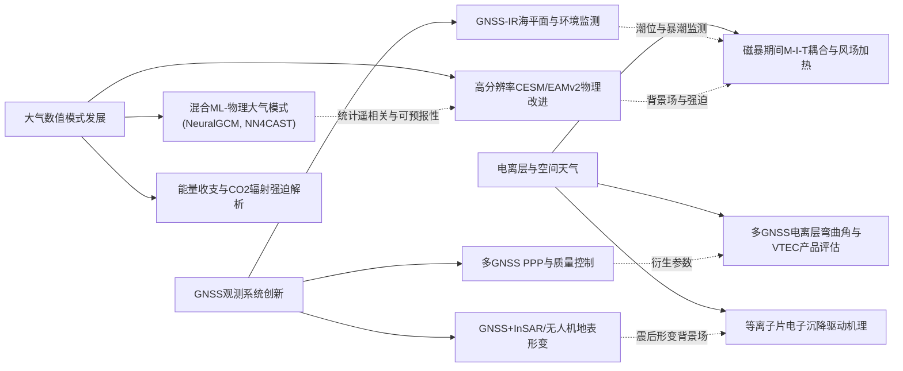
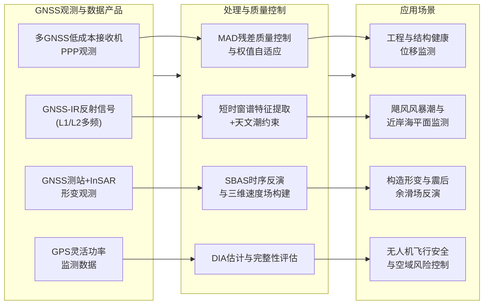
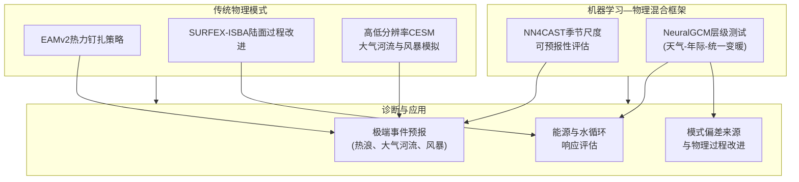
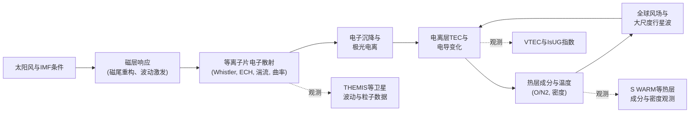
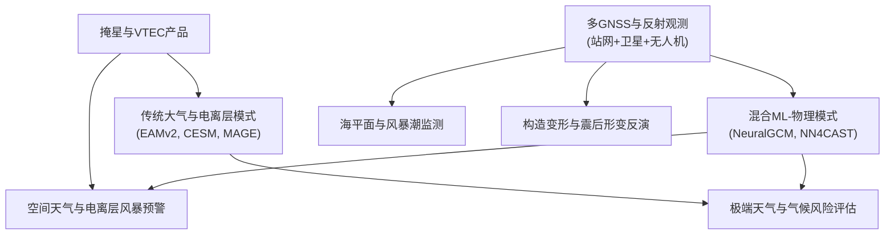

在精密定位、极端天气监测及空间环境预报快速发展的背景下，GNSS、大气与电离层研究呈现出明显的协同演进趋势。一方面，多GNSS与低成本接收机的快速普及，使得高时空分辨率的地表与近岸观测成为可能，GNSS干涉反射、GNSS+InSAR联合反演等新体制观测方法正逐步走向业务化；另一方面，传统地球系统模式在提高垂直与水平分辨率的同时，引入深度学习与混合智能方法，为突发平流层增温、大气河流与热浪等高影响天气过程提供了新的可预报性工具。在电离层与空间天气方向，基于多GNSS的电离层产品及复合磁暴个例分析，显著丰富了对磁层—电离层—热层耦合过程的认识。

本期综述选取近一周发表于遥感、气象、大地测量与空间物理等领域期刊的代表性工作，重点围绕GNSS精密定位与环境监测、大气数值模式与混合智能预报框架、电离层在强磁暴与高层大气条件下的响应特征三个方面展开分析。文章在通盘梳理观测手段与模式技术路线的基础上，归纳关键技术特点与定量结论，并通过结构化示意图刻画GNSS—大气—电离层之间的物质与能量耦合关系，为后续从工程应用与科学研究两个层面开展集成观测、模式发展与业务化预报提供参考。

## 一、本期研究印记图：从观测系统到地球空间环境耦合

近一周的GNSS、大气与电离层相关论文集中反映出几个突出的研究方向。GNSS方面，多源多频观测仍然是核心支撑：一类工作面向低成本接收机与工程应用，通过中位绝对偏差质量控制、灵活功率监测等方法，将精密单点定位的可靠性扩展到民用与近岸环境监测场景；另一类工作则将GNSS与InSAR、无人机等平台联合使用，在地震同震—震后形变、河冰运动与海平面暴潮等领域建立起“高时空分辨率+长时间序列”的综合观测体系。与此相应，GNSS干涉反射技术在飓风风暴潮过程中的短时海面高度变化监测方面表现出接近潮位仪精度的能力，显示出对沿海极端事件监测网络的重要补充价值。

大气方向的论文则围绕“高分辨率动力框架+新一代模式物理”的组合展开。一方面，Energy Exascale Earth System Model（EAMv2）、Community Earth System Model（CESM）等传统模式在热力钉扎、对流参数化、陆面蒸散发划分等关键物理过程中引入更精细的垂直分层与过程参数化，以提高突发平流层增温、极端风暴和大气河流事件的可预报性；另一方面，NeuralGCM、NN4CAST等机器学习—物理混合模式在季节尺度预测、遥相关诊断和统一变暖情景试验中展示出接近甚至优于传统地球系统模式的技巧分数。围绕地表强迫与能量收支平衡的研究，则通过解析模型与观测约束解释了二氧化碳表面辐射强迫与降水抑制之间的物理联系，并在短波各向异性反射的系统误差评估方面给出了定量结论。

在电离层方向，研究重心集中在强磁暴期间的电离层—等离子层响应与磁层粒子沉降机理。一部分工作利用全球VTEC图与新定义的IsUG指数，在2023年11月复合磁暴个例中刻画了正相与负相的时空演变，并将其与热层加热、O/N₂组成变化及大尺度传播扰动联系起来；另一部分工作基于MAGE等全耦合模式，分析了2024年10月强磁暴中世界时对磁层—电离层—热层耦合的影响，指出风场加热与极紫外辐射的时空分布足以在近昼夜节律上重塑极区电流、焦耳加热与粒子沉降的不对称性。与此同时，对热等离子片电子沉降主导机制的统计分析表明，宽带静电湍流与电子回旋谐波在“热”等离子片中占据主导，而场线曲率散射在冷等离子片中更为重要，这为建立统一的磁层—电离层能量沉降闭合框架提供了观测依据。

综合GNSS、大气与电离层三个方向，可以看出：高精度观测系统正在向多平台、低成本与近实时处理扩展；数值模式从单纯提高分辨率，演进到“高分辨率动力框架+可解释机器学习”的混合范式；在地球空间环境方面，磁暴期间的多层大气热力与成分响应通过TEC与弯曲角等GNSS衍生参数得到细致刻画，为空间天气业务与精密导航服务提供了更坚实的物理基础。下图以Mermaid图形式概括本期研究热点之间的内在联系。

## 二、GNSS方向：从低成本精密定位到多源环境监测

### 2.1 方向综述与代表性技术格局

本期GNSS相关论文覆盖了多GNSS精密单点定位质量控制、GNSS信号特性监测、GNSS-IR近岸海平面反演以及GNSS与InSAR联合反演构造形变等多个主题。低成本双频接收机在多星座精密单点定位中的性能不断逼近高端设备，通过引入中位绝对偏差驱动的残差质量控制、权值自适应与异常观测剔除，毫米级水平与厘米级垂向位移检测能力在工程监测与形变监控中已具备应用潜力。与此相呼应，针对GPS灵活功率信号的实时监测研究通过监督式特征更新框架，识别功率配置变化及潜在干扰风险，为民航与关键基础设施中的信号完整性评估提供了新思路。

利用GNSS反射信号的GNSS-IR技术，在强风暴潮情景下，通过短时窗谱特征提取与天文潮约束校正，显著削弱静水面假设带来的时间偏差，实现了对快速海平面变化的接近实时监测。与潮位仪对比表明，长时段监测精度可稳定在厘米量级，风暴潮期间的瞬变偏差控制在一成量级。另一方面，在陆地构造环境中，GNSS与Sentinel-1 SBAS时间序列联合反演，能够在分米级同震位移基础上分离震后浅部余滑场，并定量讨论黏弹响应的可能贡献，为解析板内走滑—正断层复合带的滑移分配提供了坚实约束。

从应用场景看，本期GNSS研究一方面沿着“低成本硬件+高精度算法”的路径，将精密定位与环境监测能力下沉到更广泛的工程与近岸观测网络中；另一方面通过与InSAR、潮位仪等传感器的协同，形成多时空尺度的一体化观测体系。这种趋势与国际上关于利用多GNSS与反射信号实现海平面监测、灾害预警和构造形变反演的主流方向高度一致，也为后续多源数据同化与智能预报系统提供了数据基础。

### 2.2 代表性研究技术路线与特点（表）

| 主题 | 技术路线要点 | 技术特点与优势 | 代表论文 |
| --- | --- | --- | --- |
| 低成本多GNSS精密单点定位质量控制 | 采用多星座观测与精密轨道钟差，构造残差序列并以中位绝对偏差作为鲁棒统计量，动态识别粗差与性能退化观测，调整观测权与收敛策略 | 显著抑制低成本接收机中的多路径与噪声影响，在不增加硬件成本的前提下提升解算稳定性与收敛速度，适用于连续监测场景 | Birinci & Saka (2026), GPS Solutions, 10.1007/s10291-026-02047-3 |
| UAV安全应用中的GNSS基于完整性分析 | 在多维模型失配情形下构建DIA估计器，对位置解与残差空间进行联合检验，评估导航解在复杂环境中的安全边界 | 系统性考虑电离层、对流层与多路径等多种误差源可能的模型失配，对无人机航迹规划与空域安全评估具有直接工程意义 | Ciuban et al. (2026), GPS Solutions, 10.1007/s10291-026-02029-5 |
| GNSS-IR监测风暴潮海平面变化 | 将短时窗谱特征提取与天文潮模型相结合，识别反射信号中与快速海平面变化一致的谱峰，并校正静水面假设引入的时间滞后 | 在高能风暴潮背景下保持厘米级到分分米级精度，兼具监测与短时预报能力，可在稀疏潮位站网络中提供有效补充 | Chang et al. (2026), Geophys. Res. Lett., 10.1029/2025gl120064 |
| GNSS+InSAR地震震后形变反演 | 利用SBAS时序InSAR提取2019–2022年间的视线向速度场，与GNSS测站三维速度联合反演多断层走滑与正断分量，分离同震与震后余滑 | 在空间上解析北、南支断层的走滑—正断滑移分配，并识别近断层厘米级震后浅部余滑，为地震危害评估与断层力学建模提供约束 | Banko & Pavasović (2026), Remote Sens., 10.3390/rs18050828 |
| GPS灵活功率实时监测 | 构建监督式特征更新框架，将时频特征与历史标签联合用于分类器更新，在线识别GPS灵活功率配置的变化与潜在干扰场景 | 不依赖昂贵专用监测设备，在现有接收机基础上即可实现对信号功率配置与异常辐射的持续监控，适合大范围台网部署 | Yang et al. (2026), GPS Solutions, 10.1007/s10291-026-02046-4 |

### 2.3 GNSS方向技术发展结构图（Mermaid）

### 2.4 专题画像：多GNSS低成本接收机精密单点定位质量控制

#### （1）技术路线：以中位绝对偏差为核心的鲁棒PPP质量控制

该研究围绕低成本双频GNSS接收机在多星座精密单点定位中的性能瓶颈展开，技术路线首先在观测端集成GPS、GLONASS、Galileo等多系统载波相位与伪距观测，并结合实时或后处理精密轨道与钟差产品构建无电离层线性组合。随后，在常规模型改正（电离层、对流层、天线相位中心、固体潮与极潮等）基础上，对解算残差构造时间序列，并以中位绝对偏差作为鲁棒统计量识别异常观测和环境退化段。通过对残差分布的实时评估，算法能够自适应调整观测权值与收敛时间窗，将多路径干扰、噪声增强与周跳未探测等问题转化为可控的质量标签。

在解算阶段，研究采用PPP-AR框架，对双频载波相位模糊度实施区域或全球级别的整数固定，并评估在不同星座组合和观测时长下的收敛性能与稳态精度。通过对多组静态与动态实验的对比，给出了低成本接收机在典型工程监测时长（数小时至一日）内可达到的水平与垂向精度范围，并进一步探讨了在观测环境较差、可见卫星数量受限时质量控制策略对整体稳定性的贡献。

#### （2）技术特点：在成本约束下逼近高端设备性能

与传统依赖高端测地型接收机与天线系统的PPP应用相比，该研究的显著特点在于通过统计学驱动的质量控制，将低成本硬件的噪声与多路径劣势在算法层面尽可能吸收与隔离。一方面，中位绝对偏差对极端粗差不敏感，使得单个异常观测不会显著拖累整体解算；另一方面，通过残差序列的结构分析，可以以及时发现观测环境变化（如遮挡、干扰或雨衰）并对相关历元赋予更低的权重，从而避免错误信息在参数估计中长期“残留”。这一思路与近年来国际上关于在低成本GNSS平台上通过鲁棒统计与自适应滤波提升定位质量的研究方向高度吻合。

从应用角度看，该方法不依赖额外的辅助传感器，也不需要复杂的现场标定，适合在大规模地表形变监测、桥梁与高层建筑健康监测以及边坡位移预警系统中部署。对于需要长期运行且维护成本受限的监测网络，这类以算法补偿硬件不足的方案具有明显经济性优势。同时，该方法也为后续将深度学习与物理模型结合的“智能PPP质量评估器”提供了可复用的特征与标签体系。

#### （3）重要结论：提升低成本GNSS在位移监测中的工程可用性

该研究给出的重要结论是：在合理设计的中位绝对偏差质量控制框架下，低成本多GNSS接收机在静态与缓慢形变监测中可以实现毫米级水平与厘米级垂向精度，且在多路径和噪声条件明显劣于测地型系统的情景下仍保持较高的解算稳定性。通过对比试验表明，质量控制模块显著缩短了收敛时间，并降低了因单个观测异常导致解算发散的风险，从而在工程应用中提高了系统的可靠性与可维护性。

在工程意义方面，这一结论意味着精密位移监测的入口门槛被进一步降低，更多中小型工程项目与基础设施可以在有限预算下引入高精度GNSS监测手段，为灾害预警与安全评估提供连续、可信的位移时间序列。同时，该研究中构建的残差统计与标签体系为后续接入机器学习模型提供了基础，可在未来与深度神经网络或图模型结合，进一步自动识别环境模式与误差模式，实现更智能的质量评估与异常检测。

### 2.5 专题画像：GNSS-IR监测飓风风暴潮海平面变化

#### （1）技术路线：短时窗谱特征与天文潮约束的联合反演

该研究针对传统GNSS-IR在快速海平面变化事件中受静水面假设限制、产生时间滞后的问题，提出以短时窗谱特征提取为核心的反演路线。具体而言，算法首先在近岸GNSS测站的反射信号中提取随卫星高度角变化的干涉条纹，并在数分钟尺度上滑动构造频谱，以获取与海面高度变化相关的主谱峰。随后，引入天文潮模型作为外部约束，将观测频谱与预报潮位曲线进行联合拟合，从而在保留潮汐主导变化的同时，放大风暴潮期间快速非周期分量的信号。

在时间配准方面，研究特别关注传统静水面假设带来的10–20分钟级别时间偏差，通过分析短时窗内谱峰的连续性与稳定性，重建更接近真实海平面变化的时间序列，并与潮位仪记录进行逐分钟对比。算法框架还包括质量控制模块，用于剔除受雨衰、强风浪或接收机硬件异常影响的观测段，从而保证长时间序列中的整体稳定性。

#### （2）技术特点：兼顾长期稳定性与极端事件灵敏度

该方法的突出特点在于同时兼顾平静海况下的长期监测精度与极端事件期间的快速响应能力。在平静条件下，算法通过与潮位仪对比验证，长期监测精度优于五厘米；在飓风诱发的风暴潮期间，即便反射信号的相干性受到风浪显著破坏，重建的海平面序列仍可在一成量级误差范围内跟踪实测水位。这种性能组合使得近岸GNSS站点能够在维持原有导航与大地测量功能的同时，兼作高频潮位监测与风暴潮预警节点。

与传统潮位站相比，GNSS-IR方案不需要在海中架设额外的测杆或浮标，易于在已有测站基础上推广；与专用海洋雷达或激光测高系统相比，其硬件成本与维护难度显著降低，更适合构建大范围、密集的沿海监测网络。此外，该方法所依赖的天文潮约束与短时窗谱分析思想也可移植到湖泊、水库等其他水体，为多类型水文环境监测提供统一框架。

#### （3）重要结论：近岸GNSS-IR是强化潮位与海洋灾害监测网络的有效途径

该研究的重要结论是：通过短时窗谱特征与天文潮约束的联合反演，近岸GNSS-IR能够在一年的持续观测中保持约厘米级精度，并在飓风风暴潮等极端事件期间维持约十厘米量级的监测误差，同时具备小时尺度的短期预测能力。结论表明，GNSS-IR不仅适合作为潮位仪的补充观测手段，还可以在潮位站布局受限或设备受损的情景下提供冗余观测，有助于在灾害发生时维持海平面监测网络的完整性。

从更广泛的海洋监测与灾害防御视角看，这一成果说明利用陆基GNSS台站即可构建覆盖广泛、成本可控的风暴潮监测体系，为沿海防洪标准修订、港口调度优化和风暴潮预警系统的改进提供了新的技术手段。未来若将该方法与海洋数值模式同化及机器学习短期预报模型结合，有望进一步提高风暴潮预报的时效性与空间分辨率。

### 2.6 专题画像：GNSS+InSAR联合反演地震震后余滑与构造变形

#### （1）技术路线：SBAS时间序列与GNSS速度场的联合反演

该研究以2020年Mw 6.4 Petrinja–Pokupsko地震为例，利用Sentinel‑1卫星在2019–2022年间的ASC/DESC轨道数据构建SBAS形变时间序列，并对干涉相位残差实施相干性与均方根阈值过滤以确保视线向速度场的质量。随后，将升轨与降轨视线向速度分解为水平与垂向分量，并在断层走向方向上旋转生成断层平行速度分量，同时剔除像素级同震位移，实现对震后缓慢形变的突出显示。

在反演阶段，研究构建块体—断层几何模型，将GNSS测站三维速度与InSAR派生的空间连续速度场联合纳入反问题框架。通过加权最小二乘反演与正则化约束，求解北支与南支走滑—正断分量的滑移速率分配，并利用敏感性分析探讨震后浅部余滑与可能的黏弹响应在速度场中的相对贡献。最后，将得到的滑移分布与独立的区域GNSS长期速度场对比，以评估2019–2022观测窗口内震后过程对长期构造背景场的扰动程度。

#### （2）技术特点：在有限观测窗口内刻画震后浅部余滑

相较于只依赖GNSS点位速度或单一InSAR视线向速度场的传统研究，该工作的重要特点在于充分发挥两类观测的互补优势。一方面，InSAR提供了高空间分辨率的视线向速度场，能够在断层附近解析厘米级的空间变化；另一方面，GNSS提供绝对三维位移基准，有助于纠正InSAR系统误差与长波形变趋势。通过联合反演，研究得以在不足四年的观测窗口内分离出震后浅部余滑模式，并量化断层不同分支的滑移速率差异。

此外，该研究明确指出，由于观测期内震后形变与潜在黏弹响应的叠加，无法仅凭本次InSAR时间序列稳健估计毫米每年级别的长期构造速率，因此引入独立区域GNSS结果仅作为构造背景示意而非反演约束。这种处理方式在方法学上保持了对观测与模型适用范围的清晰界定，也为后续引入更长时间序列或数值黏弹建模留出了空间。

#### （3）重要结论：多传感器联合反演显著提升断层滑移分配约束能力

研究表明，通过GNSS与SBAS‑InSAR的联合反演，可以在Pet r inja–Pokupsko断层带上解析出约二十厘米量级的同震位移跳变，并在其基础上识别出震后近断层±1.5厘米每年量级的浅部余滑条带。该研究的重要结论是：震后浅部余滑在空间上主要沿断层走向集中分布，对近断层危险性与未来事件的潜在加载过程具有不可忽视的贡献，而黏弹响应在当前观测长度下仍难以与余滑进行稳健区分，需要更长时间序列或专门的数值试验加以约束。

在构造地质与地震危险性分析层面，这一结论意味着对于类似走滑—正断复合断层系统，仅依赖震间GNSS速率或余震分布难以完整刻画应力重分配过程，多传感器联合反演的断层滑移分配图提供了更接近真实的力学边界条件。该结果可用于改进区域地震复发模型与地震风险评估，也为未来在其他构造环境中推广GNSS+InSAR联合反演提供了可借鉴的范式。

## 三、大气方向：高分辨率模式与混合智能预报框架

### 3.1 方向综述：从物理过程改进到机器学习—物理融合

大气相关论文集中于两个层面：一是传统地球系统模式在关键物理过程上的系统性改进，包括EAMv2中热力钉扎方案的垂直结构优化、SURFEX‑ISBA中干表层阻力参数化的引入、Whole Atmosphere Community Climate Model在突发平流层增温预报中垂直分层的加密等；二是机器学习—物理混合模式在跨时间尺度可预报性评估中的应用，如NeuralGCM在统一变暖情景中的层结响应与极端事件模拟、NN4CAST在季节尺度降水与海温异常预测中的解释性分析等。这些工作在方法上强调通过系统试验与层级测试构建可解释的评估框架，而非仅依赖技巧分数的单一指标。

在水循环与能量收支方面，一系列研究从解析模型与卫星辐射观测出发，量化了二氧化碳表面辐射强迫在不同气候态下的非单调行为，以及这种强迫对降水变化与大气能量平衡的影响；与此同时，对反射短波各向异性对宽视场辐射计能量不平衡估算误差的影响进行了系统模拟，指出在合理轨道配置与多星座组合下，该误差对长期趋势估计的影响可控制在每十年百分之零点几瓦每平方米的量级。

大气极端事件方面，关于大气河流的研究利用高、低分辨率CESM对比实验表明，低分辨率模式系统性低估大气河流的频次与强度，尤其对最强等级事件的贡献估计偏低，而高分辨率版本在极端事件再现能力上有显著改进。欧洲热浪研究则借助动力系统指标与天气型划分，揭示了热浪与大尺度环流之间关系的显著季节性变化，强调了阻塞高压与土地—大气反馈在热浪持续性中的作用。

### 3.2 代表性研究技术路线与特点（表）

| 主题 | 技术路线要点 | 技术特点与优势 | 代表论文 |
| --- | --- | --- | --- |
| EAMv2热力钉扎改进 | 在温度与比湿钉扎中引入垂直权重函数，弱化行星边界层与对流层顶附近的不合理强制，结合ERA5开展集合回报试验 | 有效减弱对水循环与降水过程的扰动，提高对热带气旋、大气河流与温带气旋的再现能力，为后续敏感性试验提供更物理合理的约束方式 | Zhang et al. (2026), Geosci. Model Dev., 10.5194/gmd-19-1937-2026 |
| 干表层阻力参数化 | 在SURFEX‑ISBA中引入土壤干表层阻力项，使土壤蒸发在干旱期受到额外限制，并在半干旱试验场利用通量观测进行标定 | 显著降低蒸散发高估，改善感热通量与净辐射模拟，使模型更好地再现灌溉农田与天然草地的能量平衡与水分再分配 | Martí et al. (2026), Geosci. Model Dev., 10.5194/gmd-19-1991-2026 |
| 突发平流层增温的垂直分辨率敏感性 | 通过比较70层与138层垂直分层模式，对单次突发平流层增温事件开展集合预报，分析行星波垂直传播与波—平均流相互作用 | 结果表明提高平流层部分垂直分辨率即可将可预报提前量从约五天扩展到十天，揭示了垂直分层在平流层—对流层耦合预报中的关键作用 | Xiao et al. (2026), Geophys. Res. Lett., 10.1029/2025gl120534 |
| AI辅助季节尺度可预报性评估 | 构建NN4CAST深度学习流程，从原始数据开始自动完成预处理、训练与技巧评估，并利用EOF等工具分析驱动因子 | 能够在同时考虑线性与非线性遥相关的条件下，对降水与海温异常的可预报性给出可解释的空间分布，为气候服务提供快速实验平台 | Galván Fraile et al. (2026), Geosci. Model Dev., 10.5194/gmd-19-1917-2026 |
| 混合机器学习—物理全球大气模式层级测试 | 构建针对天气、年际变率与统一变暖情景的三套试验，对NeuralGCM与物理模式在不同时间尺度上的响应进行系统对比 | 在保持类似全球温度与降水响应的同时，揭示出在中纬度气旋轨迹、遥相关响应与平流层变暖等过程中的偏差来源，为后续改进混合模式提供定量诊断 | Chen et al. (2026), AGU Advances, 10.1029/2025av002075 |

### 3.3 大气模式与AI预报框架结构图（Mermaid）

### 3.4 专题画像：EAMv2中热力钉扎策略的优化与评估

#### （1）技术路线：垂直加权钉扎与集合回报试验

该研究针对传统大气模式中直接对温度与比湿施加强钉扎往往干扰物理过程、引入虚假偏差的问题，提出基于垂直加权的热力钉扎策略。具体做法是在模式垂直坐标上定义一组高度依赖的权重函数，在边界层底部与对流层顶附近显著减弱钉扎强度，而在中层对流层中保持相对较强的约束，从而在总体上保持大尺度环流与再分析场的一致性，同时避免对湿对流发展与边界层湍流结构的过度干预。

在实验设计上，研究使用EAMv2构建多组集合回报试验，分别考虑仅风场钉扎、传统均匀热力钉扎与垂直加权热力钉扎等情形，并以ERA5再分析为目标场，对温度、风场、水汽通量与降水进行多变量技巧评估。多个高影响天气系统（例如热带气旋、大气河流与温带气旋）被选作个例，用以检验新策略在保持天气系统形态与降水分布方面的表现。

#### （2）技术特点：兼顾物理一致性与约束强度的平衡设计

与简单的“强钉扎一切变量”做法相比，该策略的特点在于以物理过程为导向，将钉扎视为一种对大尺度背景场的柔性约束，而非对各层变量的刚性强制。通过减弱边界层与对流层顶的约束，新策略显著减轻了对地表能量收支与对流层稳定度的非物理影响，使得水文循环与降水过程在仍然受再分析场约束的同时，具有更多自由度去发展符合模式内部物理参数化的结构。

从与再分析资料的对比结果看，垂直加权策略在保持温度与风场技巧接近甚至优于均匀钉扎方案的同时，显著改善了降水、蒸散发与长波辐射的偏差分布，特别是在热带海洋与季风区。此外，该策略与NeuralGCM等混合模式的训练需求高度契合，因为它为生成既接近观测又保留内部一致物理过程的约束模拟提供了可靠基础。

#### （3）重要结论：改进热力钉扎是提升约束模拟可信度的关键环节

该研究的重要结论是：在保持与ERA5再分析场高相关性的前提下，引入垂直加权的热力钉扎策略可以显著减弱对水循环与降水过程的非物理干扰，使EAMv2在约束模拟模式下对高影响天气系统的再现能力得到系统性提升。结果表明，相较于单纯加强钉扎强度，基于物理过程分析的垂直权重设计更有助于构建既可用于模式评估又可为机器学习训练提供“高质量地真值”的模拟数据集。

在应用层面，这一结论提示，在开展观测约束试验、再预报集合实验以及混合模式训练前，必须充分评估钉扎策略对模式内部物理过程的影响，避免将由不合理约束引发的偏差错误归因于模式物理本身。该研究提供的策略和诊断框架为多模式比较与下一代混合大气模式设计提供了可直接借鉴的路径。

### 3.5 专题画像：NN4CAST在季节尺度可预报性评估中的应用

#### （1）技术路线：从原始数据到技巧诊断的一体化深度学习流程

该研究提出的NN4CAST框架旨在为季节尺度气候预测提供一个统一的深度学习实验平台。技术路线从原始海温与大气再分析数据出发，构建自动化预处理模块，包括异常计算、空间重采样与时间平滑等步骤，然后通过卷积神经网络与循环单元的组合或基于注意力机制的结构，对目标变量（例如区域降水或海温异常）进行多步超前预测。框架还集成经验正交函数分析工具，用于从已训练网络的输入权重与中间特征中提取主要空间模态，帮助解释模型捕捉到的遥相关结构。

在试验设计中，研究针对热带大西洋春季海温与欧洲秋季降水两个典型区域，分别使用前一冬季太平洋海温异常与当季太平洋—大西洋海温模式作为输入，评估NN4CAST对线性ENSO—TNA遥相关与非线性ENSO—欧亚遥相关的刻画能力。通过与传统统计模型与动力模式集合预报的对比，量化深度学习方法在不同区域与时间尺度上的技巧优势与不足。

#### （2）技术特点：强调可解释性与驱动因子识别

与许多黑箱式短期天气预报神经网络不同，NN4CAST在设计上将可解释性作为核心目标之一。通过内置的经验正交函数与灵敏度分析模块，研究能够从训练好的网络中提取出主导输入特征的空间分布与时间演变，并与传统物理图像（如热带海温模态、遥相关波列等）进行对比。这种做法有助于判断网络是否真正学到了已知物理规律，或是依赖于数据集中某些偶然关联。

在结果分析中，研究指出，在以ENSO驱动的热带大西洋春季海温预测问题上，NN4CAST能够较好再现线性ENSO—TNA遥相关结构；而在更为非线性、非平稳的ENSO—欧亚秋季降水遥相关问题上，虽然网络展示出一定技巧优势，但在某些年代仍存在显著误差，从而提醒使用者在解释深度学习结果时，需要结合物理理解与独立资料进行交叉验证。

#### （3）重要结论：深度学习框架是探索季节尺度可预报性的重要补充工具

该研究的重要结论是：在经过合理设计与可解释性约束的前提下，深度学习框架可以在季节尺度上为不同区域的气候要素提供与传统动力模式相当甚至更高的技巧，同时能够利用经验正交函数等诊断工具揭示驱动因子的空间分布与相对重要性。这一结论表明，将深度神经网络视为一种“可调节的统计试验平台”，有助于快速测试不同潜在可预报信号（例如特定海温模态或陆面状态）对目标变量的贡献，为后续模式发展与观测网络优化提供定量参考。

从气候服务视角看，这一框架为业务部门在不增加大量计算资源的情况下，快速评估不同假设情景下的季节预测可行性提供了工具。未来若与物理模式集合预报结合，采用多源集成方法，有望在提高预测技巧的同时，显著增强预报不确定性评估的可信度。

## 四、电离层与空间天气方向：磁暴响应与多尺度耦合过程

### 4.1 方向综述：从GNSS产品质量到磁暴个例综合分析

电离层相关论文主要聚焦两条技术路线。一方面，对多GNSS电离层改正弯曲角产品进行了系统质量评估，使用ERA5作为参考，对多个射线折射测量任务在65–80公里高度的偏差与噪声特征进行对比，结果显示不同任务在中平流层以下的统计一致性较好，而在更高层的大气中依赖ERA5本身带来的不确定性显著增加。该工作强调了在将这类产品用于天气与气候研究时，需要谨慎处理高层大气的误差来源。

另一方面，多篇论文围绕近期强磁暴个例，利用全球VTEC图、IsUG指数、热层成分卫星观测与模型模拟，系统分析了电离层与热层的耦合响应机制。研究表明，即便在接近昼夜平分点的情形下，世界时对磁暴期间高纬极紫外辐照度的调制仍然可以通过风场与成分变化引发显著的南北半球不对称；而IsUG等指数则能够在复杂形态背景下以尺度无关的方式识别正相与负相演变，对空间天气监测与预警具有直接实用价值。

### 4.2 代表性研究技术路线与特点（表）

| 主题 | 技术路线要点 | 技术特点与优势 | 代表论文 |
| --- | --- | --- | --- |
| 多GNSS电离层改正弯曲角质量评估 | 收集多个卫星掩星任务的电离层改正弯曲角产品，并以ERA5资料为参考，分析65–80公里高度的偏差、噪声与标准差 | 系统比较不同任务间在中平流层及以上高度的统计一致性，为将这些产品用于再分析评估与气候研究提供了定量参考 | Ye et al. (2026), Remote Sens., 10.3390/rs18050841 |
| IsUG指数在复杂磁暴过程中的应用 | 基于全球VTEC图构建归一化电离层风暴尺度指数IsUG，并在2023年11月复合磁暴个例中分析正相与负相的时空演变 | 能够在不同类型驱动（CIR与CME叠加）下，统一描述电离层风暴的强度与空间结构，有利于业务化监测与自动识别 | Smirnov et al. (2026), J. Space Weather Space Climate, 10.1051/swsc/2026008 |
| 世界时对磁暴期间M‑I‑T耦合的影响 | 利用MAGE模式对2024年10月强磁暴开展模拟，比较不同世界时起暴情景下极区电流、焦耳加热与粒子沉降 | 揭示了极紫外辐照度日变化通过热层加热与成分变化调制磁层—电离层—热层耦合效率，对理解磁暴严重程度与起暴时刻之间的关系具有重要意义 | Ghag et al. (2026), AGU Advances, 10.1029/2025av002071 |
| 等离子片电子沉降驱动机制比较 | 基于THEMIS等卫星的等离子与波动观测，统计分析四类主要散射机制在不同等离子片状态下的出现频率与能谱特征 | 表明宽带静电湍流与电子回旋谐波在“热”等离子片中主导沉降，而场线曲率散射在冷等离子片中占优势，为统一的能量沉降参数化提供了观测基础 | Zhang & Artemyev (2026), Geophys. Res. Lett., 10.1029/2025gl120891 |

### 4.3 电离层与磁层耦合过程结构图（Mermaid）

### 4.4 专题画像：多GNSS电离层改正弯曲角产品质量评估

#### （1）技术路线：跨任务统计比较与高层大气误差诊断

该研究以来自ROM SAF与CDAAC的十二个卫星掩星任务的电离层改正弯曲角产品为对象，围绕质量控制通过率、65–80公里高度的系统偏差与噪声特征等指标开展系统对比。技术路线首先依据各任务提供的质量标记与曲线特征，统计通过质量控制的样本比例，并以Spire、MetOp‑B/C、Sentinel‑6、COSMIC‑2、KOMPSAT‑5与TerraSAR‑X等任务为代表分析差异；随后将弯曲角在指定高度范围内与ERA5再分析资料反演的折射率场进行对比，计算平均偏差与标准差。

在噪声分析方面，研究通过在65–80公里高度范围内对弯曲角进行高通滤波，得到反映随机噪声水平的残差序列，并给出不同任务在该高度段的噪声均方根值。组合高度层统计结果后，对中平流层以下与更高层大气的误差结构进行分层讨论，以识别观测系统与参考场双重误差源的相对贡献。

#### （2）技术特点：以业务使用为导向的产品级评估

与以往针对单一任务或理想化情景的电离层改正性能分析不同，该研究从“用户视角”出发，对多任务产品在统一质量控制与参考场下的表现进行了横向比较。通过统计质量控制通过率，可以直观了解不同星座与任务在实际业务环境中的有效样本占比；而对偏差与噪声的分层诊断则为将这些产品用于同化、再分析验证或气候研究提供了定量依据。

研究指出，在35–50公里高度段，MetOp‑B/C与Sentinel‑6等任务的标准差明显小于COSMIC‑2与TerraSAR‑X等任务，表明前者在中平流层折射率反演中具有更高稳定性；而在60公里以上高度，由于ERA5本身的不确定性增大，所有任务的统计结论只能视为参考。这种谨慎的解读框架有助于避免在高层大气研究中对掩星产品精度的过度乐观估计。

#### （3）重要结论：多任务掩星产品在中平流层以下高度具有良好一致性

该研究的重要结论是：在统一质量控制与参考场条件下，多数GNSS掩星任务在中平流层以下高度的电离层改正弯曲角产品表现出较好的系统一致性，偏差多处于零到百分之几微弧度范围内，标准差在35公里以下高度亦保持在较低水平。与此同时，在更高层大气中，参考场ERA5的不确定性与观测噪声叠加，使得产品间差异难以简单归因于单一任务性能。

这一结论在应用层面意味着，当前多GNSS掩星产品完全可以用于对再分析资料在对流层顶及中平流层高度的折射率与温度结构进行独立评估，同时也为构建更高质量的大气折射率再分析提供了观测支撑。但在涉及高层大气动力与成分的研究时，需要结合更专业的上层大气模型与独立观测，对ERA5与掩星产品的误差进行联合约束。

### 4.5 专题画像：IsUG指数对复合磁暴过程的刻画能力

#### （1）技术路线：基于全球VTEC图的归一化风暴尺度构建

该研究选择2023年11月4–5日包含两段活动期的复合磁暴个例，首先利用UP C 提供的全球电离层总电子含量图，构建以历史静稳条件为基准的VTEC异常场。随后，引入归一化的电离层风暴尺度IsUG指数，将每个栅格的VTEC异常按历史分布进行标准化，并按预设阈值划分不同等级的扰动强度区。

在分析过程中，研究将IsUG指数的时间演变与SYM‑H等传统磁暴指数、热层成分卫星观测以及电离层垂直廓线的变化进行比对，区分由CIR压缩驱动的中等活动与由两次CME叠加驱动的强活动期间正相与负相响应的差异。通过引入大尺度行进电离层扰动速度估计，进一步探讨热层加热与组成变化在负相形成中的主导作用。

#### （2）技术特点：统一刻画不同驱动机制下的电离层风暴

相较于仅依赖区域TEC异常或单一地面电离层台站的做法，IsUG指数的优势在于能够在全球尺度上以统一归一化标准刻画不同驱动机制下的电离层风暴。研究显示，在CIR主导的11月4日事件中，尽管正相期间VTEC显著增强，但后续并未发展出明显的负相；而在11月5日CME叠加的强磁暴中，IsUG指数清晰显示出大范围、持续的负异常，对应热层强加热与O/N₂显著下降。

这种分析框架使得复杂磁暴序列中的多个事件可以在同一指标空间中进行比较，有利于识别哪些驱动条件更容易引发严重负相以及相关的导航与通信扰动。对空间天气业务系统而言，引入IsUG等指数有望在现有Dst、Kp等传统磁暴指数之外，提供一个更直接反映电离层空间结构变化的监测量。

#### （3）重要结论：电离层风暴形态受热层加热与成分变化的强烈调制

该研究的重要结论是：在强CME驱动的磁暴中，强烈的高纬热层加热与O/N₂组成变化可以通过全球扰动风与行进电离层扰动引发显著的负相，而在CIR驱动的中等活动情景下，尽管初期存在正相增强，但负相并不一定发展。这一结论表明，磁暴驱动类型及其对热层的加热效率在决定电离层风暴最终形态方面具有关键作用。

从GNSS导航与电离层预报的角度看，这意味着仅凭传统磁暴指数难以充分评估电离层风暴对信号传播环境的具体影响，必须结合VTEC空间分布与如IsUG这类归一化指标，才能对可能出现的严重衰落、相位起伏与电离层不规则体进行更精细的风险评估。该研究为建立面向导航与通信应用的电离层风暴分类与预警体系提供了重要基础。

## 五、GNSS—大气—电离层交叉网络与创新链

结合本期GNSS、大气与电离层相关研究，可以构建一个从观测系统、数值模式到空间天气与环境应用的交叉创新链条。在观测层面，多GNSS低成本接收机、GNSS‑IR、卫星掩星与地基TEC网络共同构成大气—电离层廓线与海陆界面环境的立体观测网；在模式层面，高分辨率地球系统模式与NeuralGCM、NN4CAST等混合模式则为这些观测提供了物理解释与时空插值框架；在应用层面，从风暴潮监测、地震形变反演到空间天气风险评估，均依赖上述观测与模式的协同。

这种交叉网络的显著特征在于：一方面，GNSS衍生参数（例如电离层改正弯曲角、VTEC与GNSS‑IR高度）已不再局限于导航与大地测量，而是直接进入大气与空间环境研究核心；另一方面，机器学习—物理混合模式通过吸收大规模观测信息，逐步成为连接不同圈层过程的“算法胶水”，在统一变暖情景与极端事件情景下测试响应的一致性与稳健性。

## 六、近期研究特点与未来发展趋势

从时间序列视角看，近期GNSS相关研究在两个方向上持续深化：一是以低成本多GNSS接收机为平台，通过鲁棒质量控制与PPP‑AR等技术实现高精度位移与环境监测；二是将GNSS衍生量全面引入地震形变、海平面变化与电离层过程分析，在多传感器联合反演与空间天气诊断中扮演关键角色。未来，随着星座与信号的进一步丰富，以物理约束的机器学习算法进行多源GNSS数据同化与智能质量控制将成为重要趋势。

大气方向的研究则呈现出“高分辨率动力框架+可解释机器学习”的模式发展路径。一方面，传统模式在垂直分辨率、陆面过程与物理参数化上的改进仍在稳步推进，以提高对突发平流层增温、大气河流与热浪等极端事件的再现能力；另一方面，以NeuralGCM与NN4CAST为代表的混合模式已经在热浪与大气河流预报中展示出较高技巧，其在统一变暖情景下的响应特征也逐渐被系统评估。未来，如何在保持物理一致性的前提下进一步降低计算成本，并在长期气候外推中控制偏差，将是混合模式发展的关键问题。

在电离层与空间天气领域，多GNSS电离层产品质量评估与基于VTEC的风暴指数构建，正在为空间天气业务系统提供更丰富、结构化的观测指标。近期对强磁暴个例的综合分析强调了热层加热、组成变化与等离子片散射机制在决定电离层风暴形态中的重要性，也提示在空间天气预警中需要更精细地区分不同驱动类型。未来，随着上层大气与磁层三维观测能力的提升，将多源观测与耦合模式通过数据同化框架有机整合，构建统一的能量与物质输运闭合图景，是提高空间天气预报可信度与服务精度的必由之路。

## 七、参考文献

1. Birinci, S., & Saka, M. H. (2026). Enhancing multi‑GNSS precise point positioning performance of low‑cost receivers by implementing a MAD‑based quality control procedure. *GPS Solutions*. https://doi.org/10.1007/s10291-026-02047-3
2. Ciuban, S., Teunissen, P. J. G., & Tiberius, C. C. J. M. (2026). DIA‑Estimator and multidimensional model misspecifications: GNSS‑based positioning safety analysis for UAV. *GPS Solutions*. https://doi.org/10.1007/s10291-026-02029-5
3. Chang, X., Tan, Z., Liu, K., Li, Z., Sneeuw, N., Chen, Q., Li, D., Jin, T., & Jiang, W. (2026). Monitoring of the transient sea level variations associated with hurricane‑induced storm surges by GNSS‑IR. *Geophysical Research Letters*. https://doi.org/10.1029/2025gl120064
4. Banko, A., & Pavasović, M. (2026). Fault‑parallel postseismic afterslip following the 2020 Mw 6.4 Petrinja–Pokupsko earthquake from Sentinel‑1 SBAS time series. *Remote Sensing*. https://doi.org/10.3390/rs18050828
5. Yang, X., Liu, W., Peng, J., Ma, M., Ye, X., & Wang, F. (2026). A supervised feature update method for real‑time monitoring of GPS flex power. *GPS Solutions*. https://doi.org/10.1007/s10291-026-02046-4
6. Zhang, S., Leung, L. R., Harrop, B. E., Bora, A., Karniadakis, G., Shukla, K., & Zhang, K. (2026). Improving thermodynamic nudging in the E3SM atmosphere model version 2 (EAMv2): Strategy and hindcast skills on weather systems. *Geoscientific Model Development*. https://doi.org/10.5194/gmd-19-1937-2026
7. Martí, B., Groh, J., Canut, G., & Boone, A. (2026). Implementation of a dry surface layer soil resistance in two contrasting semi‑arid sites with SURFEX‑ISBA v9.0. *Geoscientific Model Development*. https://doi.org/10.5194/gmd-19-1991-2026
8. Xiao, H., Wang, L., Chen, X., Scaife, A. A., Hardiman, S. C., Dunstone, N. J., & Liang, Y. (2026). Finer vertical resolution improves the sudden stratospheric warming prediction through better representing planetary waves. *Geophysical Research Letters*. https://doi.org/10.1029/2025gl120534
9. Galván Fraile, V., Rodríguez‑Fonseca, B., Polo, I., Martín‑Rey, M., & Moreno‑García, M. N. (2026). Assessing seasonal climate predictability using a deep learning application: NN4CAST. *Geoscientific Model Development*. https://doi.org/10.5194/gmd-19-1917-2026
10. Chen, Z., Leung, L. R., Zhou, W., Lu, J., Lubis, S. W., Liu, Y., Chang, C.‑C., Harrop, B. E., Wang, Y., Yang, M., et al. (2026). Hierarchical testing of a hybrid machine learning‑physics global atmosphere model. *AGU Advances*. https://doi.org/10.1029/2025av002075
11. Ye, J., Li, Y, & Huo, X. (2026). Quality assessment of ionosphere‑corrected bending angles from multi‑GNSS radio occultation missions. *Remote Sensing*. https://doi.org/10.3390/rs18050841
12. Smirnov, A., Asamoah, E., Navas‑Portella, V., Kronberg, E., Lühr, H., Liu, Q., & Hernández‑Pajares, M. (2026). Global IsUG index maps for tracking ionospheric variability: A case study of the 4–5 November 2023 geomagnetic storm. *Journal of Space Weather and Space Climate*. https://doi.org/10.1051/swsc/2026008
13. Ghag, K., Lotko, W., Pham, K., Lin, D., Merkin, V., Raghav, A., & Wiltberger, M. (2026). Universal time influence on stormtime magnetosphere ionosphere coupling. *AGU Advances*. https://doi.org/10.1029/2025av002071
14. Zhang, X.‑J., & Artemyev, A. (2026). Comparative analysis of the primary drivers of plasma sheet electron precipitation. *Geophysical Research Letters*. https://doi.org/10.1029/2025gl120891

