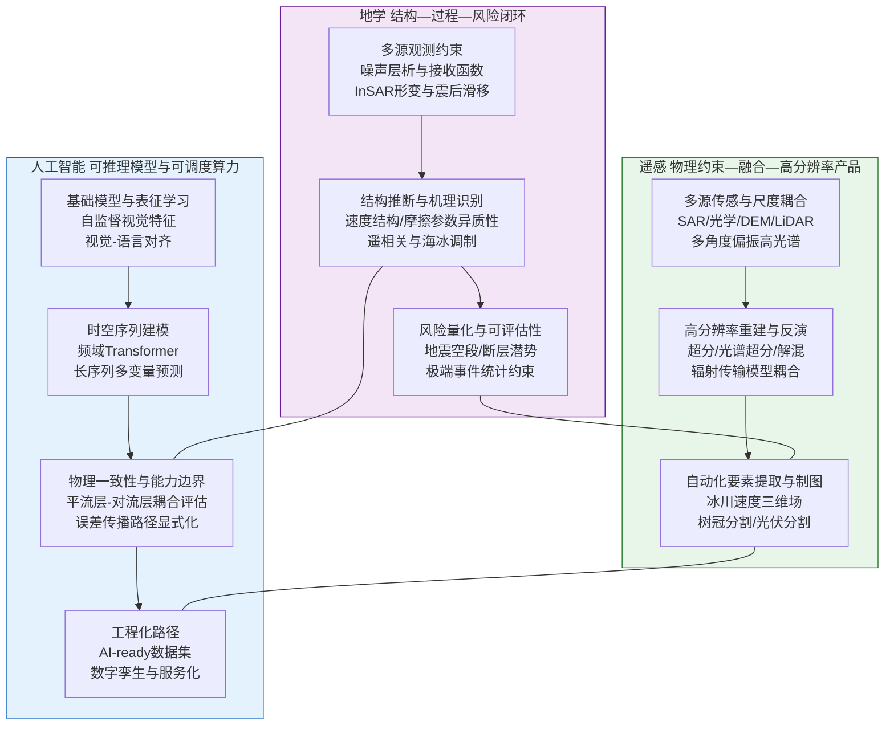
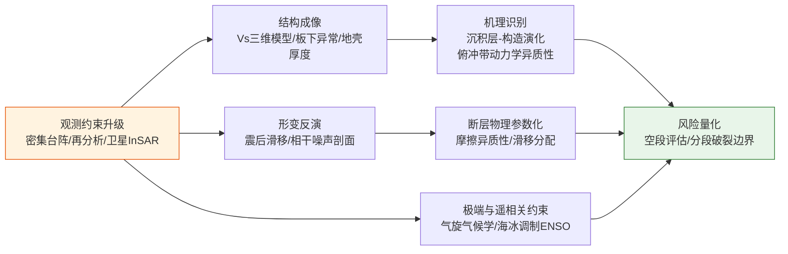
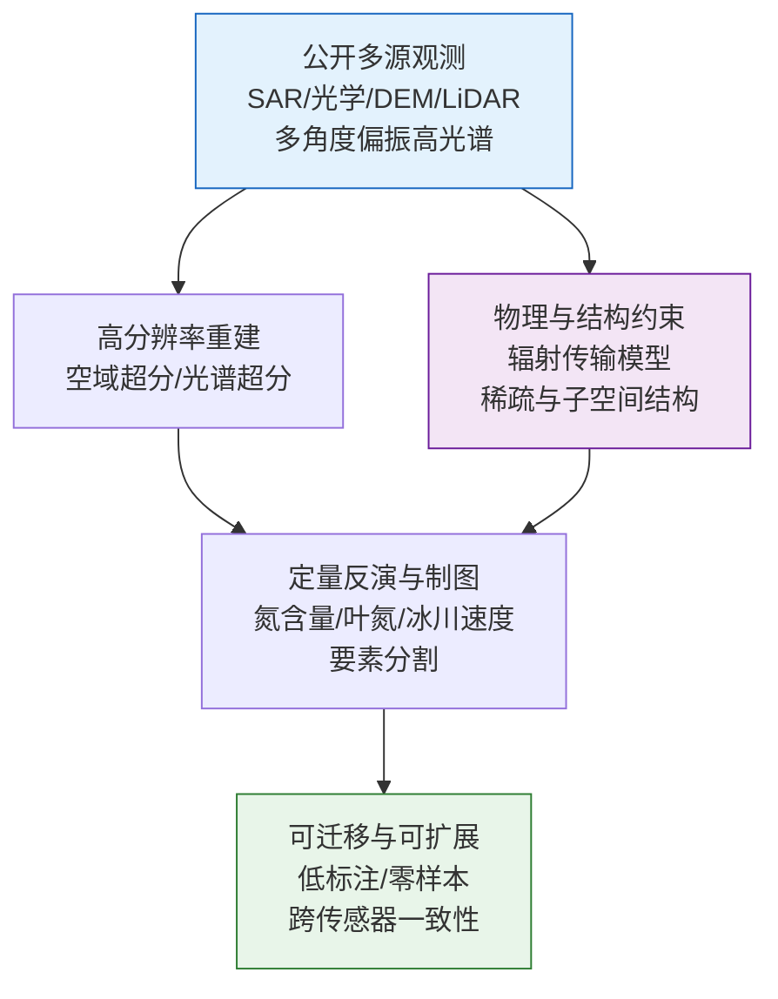
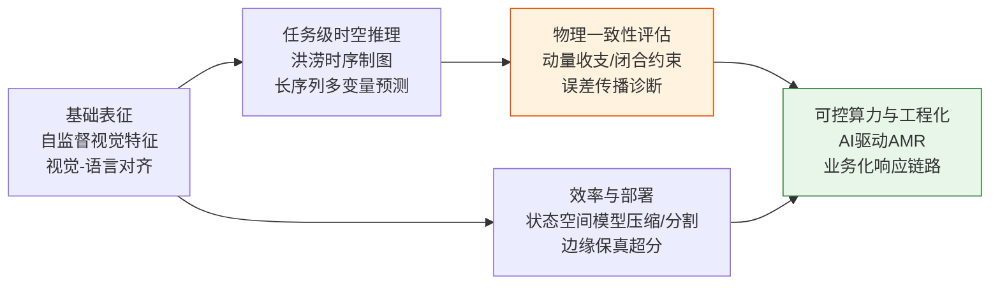
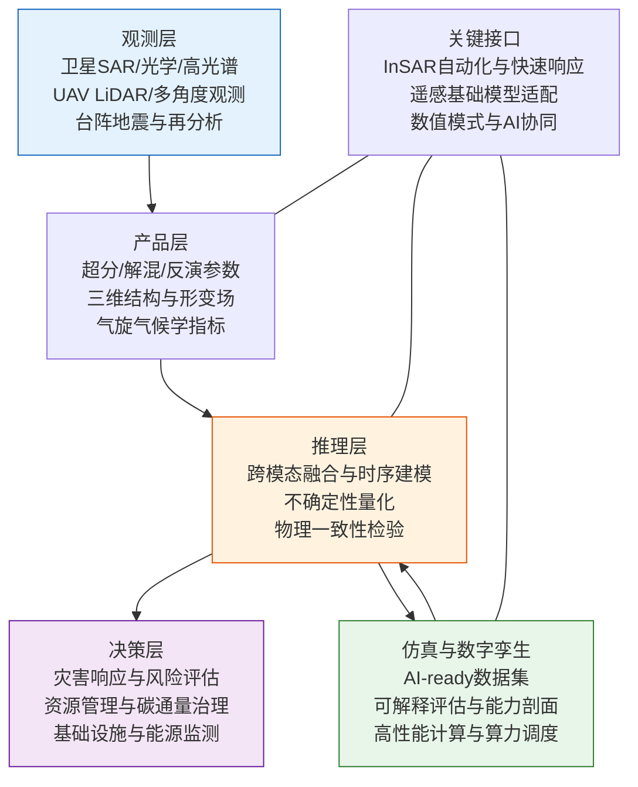

近一周（2026-03-10 至 2026-03-17）跨地学、遥感与人工智能的论文集中呈现出两类相互牵引的“硬约束”信号。其一是地学问题正在被更高密度、更高一致性的观测约束体系重塑，研究从“现象解释”转向“结构—过程—风险”的闭环推断，例如利用环境噪声层析构建盆地三维剪切波速度结构以约束地震空段风险，或在速率—状态摩擦框架内以InSAR反演定量刻画震后滑移与摩擦参数空间异质性。其二是遥感与人工智能在方法论上出现同向收敛，关键不再是“更深的网络”，而是“可控的训练成本、可解释的物理一致性与可工程化的端到端链路”，典型例子包括可解释的理论引导解混Transformer、面向大范围监测的零样本分割与多源时序融合洪涝制图，以及以状态空间模型降低长序列遥感压缩的时空复杂度。

从工程系统角度看，欧洲“Destination Earth（DestinE）”在2026年确认进入第三阶段并明确提出将数字孪生数据转化为高质量AI-ready数据集、推进AI地球系统模型的路线（2026年6月—2028年6月）[1]，为“观测—同化—仿真—推理—服务”的完整链路提供了制度化与算力基础。与此同时，以GraphCast为代表的AI天气预报模型已在中低层表现出显著优势，但其在平流层动力过程与波—平均流相互作用方面仍存在可测量的能力边界[2–3]，这一类“能力剖面评估”正在成为地球智能走向可用、可信的必要环节。

## 一、本期研究印记图（总览）

本期研究的结构性特征可概括为三条可复用的技术链路，并在“约束一致性”“算力可调度性”“跨模态对齐”三个维度上形成共同的评价尺度。其核心变化在于：传统以单任务为中心的算法堆叠，正被更强调端到端闭环的系统化范式所替代；地学侧的结构推断与风险评估不断向实时化与自动化推进；遥感侧则在超分、解混、变化与要素提取等任务上同时追求“高分辨率+低标注成本”；人工智能侧的研究重点从单纯追求点指标最优，转向对物理一致性、鲁棒性与误差传播路径的显式刻画。

## 二、地学方向（结构成像、断层物理与极端事件约束）

### 方向综述

本期地学方向的共同方法学特征是“以观测一致性为优先级”的结构解析与风险量化。其一，区域结构成像继续向高分辨率与多数据同化推进，噪声层析与宽带色散反演在密集台阵条件下给出盆地沉积层厚度、基底埋深与低速异常的三维约束，从而把地表构造与深部介质性质联系到地震空段与潜在破裂分段问题。其二，断层物理研究突出“摩擦异质性—滑移分配—危险度”的链条化建模：在速率—状态摩擦框架下，以InSAR时序反演震后形变并反演稳定滑移区的摩擦参数，定量解释余震与同震破裂的空间聚类，从机制上把可观测的形变场转译为可用于危险度评估的摩擦图谱。其三，气候与极端事件方向体现“长期统计约束+物理诊断”的融合，例如基于ERA5构建跨季节、跨海盆的海洋中高纬气旋气候学，从海冰损失与斜压性变化的耦合关系解释强度、路径与生命周期的系统性变化；同时，海冰与ENSO的相位组合被证明可显著放大或抑制北美冬季温度遥相关响应，提示季节预测需要纳入高纬边界条件的调制效应。

### 表1（代表性研究的技术路线与特点）

| 研究主题 | 技术路线 | 技术特点 | 重要结论 |
|:---|:---|:---|:---|
| 四川盆地三维地壳结构 | 环境噪声层析 + 宽带Rayleigh波色散反演 + 三维Vs成像 | 台阵密集约束沉积层厚度与低速异常 | 盆地西北缘低速沉积层可达约15 km，并识别与地震空段相关的深部低速异常 |
| 土耳其双震震后滑移与摩擦异质性 | Sentinel-1 InSAR时序 + ICA增强SBAS + 震后滑移反演 + 速率—状态摩擦估计 | 将形变场映射到摩擦参数空间分布 | 震后滑移主要位于速度强化区，同震破裂与余震聚集在低摩擦区或其邻近不稳定斑块 |
| 海洋中高纬气旋的85年演变 | ERA5（1940–2024）气旋气候学 + 季节分解 + 动力诊断 | 跨季节系统刻画海盆差异与机制 | 海冰损失与斜压性变化共同驱动北极气旋强度与轨迹的系统性重塑 |
| Sulawesi 海域地壳厚度与断裂几何 | OBS接收函数H–κ叠加 + 与速度结构/地震目录联合解释 | 海域观测填补构造空白 | Palu–Koro断裂可能为贯通型走滑断裂并延伸入Celebes海，对海底地震致海啸评估具有约束意义 |
| ENSO与西北极海冰对北美气候的协同影响 | 观测统计（1960–2025）+ 理想化AGCM实验 + 反馈诊断 | 相位组合机制分解 | 同相组合可使温度响应增强至ENSO单独作用的2–3倍，提示高纬边界对遥相关可预报性的重要性 |
| 喀斯特湖极端干旱下的碳脉冲释放 | 干湿转换事件观测 + 微生物群落—代谢耦合分析 | 过程机制与碳中性管理关联 | 极端干旱加速有机碳呼吸并抬升逸散，湿润期光合消耗二氧化碳但也可能为后续脉冲释放提供底物 |
| 日本俯冲带板下异质性与巨震分段 | 陆海台站联合走时反演 + 高分辨率P波层析 | 板下低速异常与分段关联 | 板下低速异常可能通过浮力、热与熔融影响巨震分段，2011年震源区下方存在异常间隙 |
| 鲜水河—小江断裂系地震矩预算 | 大地测量耦合反演 + 震例统计 + 规模律 + 物理约束概率框架 | 将耦合异质性纳入最大震级与复发评估 | 给出多段断裂最可能最大震级与复发间隔的概率约束，为区域危险度提供物理可解释底座 |

### 2.1 专题画像：四川盆地三维地壳结构与沉积层-地震空段约束（Geophysical Journal International，DOI 10.1093/gji/ggag102）

**（1）技术路线：从环境噪声色散到三维剪切波速度模型的结构闭环**

该研究以四川盆地及其邻区为对象，利用448个台站的环境噪声数据，反演3–60 s宽带Rayleigh波色散曲线，并据此构建上地壳至中地壳的三维剪切波速度结构。方法链条的关键在于：首先通过噪声互相关得到稳定的面波经验格林函数，再在多周期范围内反演空间色散，从而获得对沉积层与上地壳速度结构同时敏感的观测量。随后采用层析与反演把色散约束映射到三维Vs体，进一步用速度层位的系统差异对中生代、古生代与元古代地层的平均Vs给出标定，并将速度结构与盆地前陆演化阶段联系，形成“观测—结构—地质解释—灾害含义”的闭环。

**（2）技术特点：把沉积层厚度、基底埋深与深部低速异常同时纳入解释框架**

相较于仅给出平均速度剖面或单一界面深度的研究，该工作突出三点技术特征。其一是对盆地沉积层厚度的三维刻画，给出6–13 km的厚度变化并在西北缘识别可达约15 km的厚沉积低速层，从而为沉积填充与物源供给的长期演化提供可检验的结构约束。其二是对不同地层的平均Vs进行分层标定，使得“速度异常”可以更直接地转译为“地层性质与基底埋深”的地质含义，降低了跨学科解释的不确定性。其三是对深部低速异常与速度分段的识别，特别是在地震空段下方解析到的低速异常，为评估潜在孕震环境提供了深部结构证据，而不仅停留在地表断裂几何或历史地震统计层面。

**（3）重要结论：深部低速异常与速度分段为地震空段危险度提供结构证据**

该研究的重要结论是：**四川盆地西北缘存在可达约15 km的厚沉积低速层，且在特定地震空段下方识别到深部低速异常与沿断裂走向的速度分段结构，为区域孕震环境与未来地震危险度评估提供了关键深部约束**。这一结论的意义在于，它把“空段”这一经验性概念推进到可由三维介质性质支撑的结构层面，使得后续的危险度建模能够在分段尺度上引入更具物理含义的先验信息，并可与大地测量耦合、震源机制与InSAR形变等观测进一步联合验证。

### 2.2 专题画像：摩擦异质性控制震后滑移分配与地震危险度（Geophysical Research Letters，DOI 10.1029/2025gl119502）

**（1）技术路线：ICA增强的InSAR时序反演与速率—状态摩擦参数估计**

该研究聚焦2023年土耳其双震后的形变与滑移过程，利用两年Sentinel-1 SAR数据构建Small Baseline Subset（SBAS）InSAR时序，并引入独立成分分析（ICA）增强信号分离能力，从而在噪声、轨道误差与大气延迟混叠条件下稳定提取震后形变。随后研究在断层几何约束下反演震后滑移分布，并在速率—状态摩擦框架中估计后震稳定区的摩擦参数，选择拟合优度较高的区域作为参数可靠区间，以避免在模型不适用区域过度解释。整体链条把“可观测的形变时间序列”转译为“可用于危险度讨论的摩擦异质性地图”，并以滑移分配与余震聚类作为外部一致性检验。

**（2）技术特点：用摩擦参数空间异质性解释同震—余震—后震的空间组织**

该研究的技术特点在于明确将摩擦异质性作为滑移分配的主控因素来检验。结果显示震后滑移主要发生在速度强化（稳定滑移）区域，而同震破裂与余震更倾向于分布在低摩擦区或其邻近的不稳定斑块。这一对照关系提供了对断层“强—弱斑块”与脆—韧过渡深度变化的定量解释路径。进一步地，研究识别到深部震后滑移的向东迁移以及滑移行为的分段性，提示震后过程并非单一松弛，而是受摩擦空间结构与深部流变耦合共同控制。对危险度而言，速度强化区对破裂传播的阻尼作用在定量上被呈现出来，为解释破裂终止位置与余震带结构提供可检验的物理机制。

**（3）重要结论：速度强化区主导震后滑移并限制破裂传播，摩擦图谱可用于危险度约束**

该研究的重要结论是：**震后滑移在速度强化区占主导，而同震破裂与余震更集中于低摩擦区或其邻近不稳定斑块；摩擦异质性对滑移分配与破裂传播具有可量化的控制作用，可为大陆走滑断裂的危险度评估提供参数约束**。这一结论的影响在于，它为“从形变到危险度”的转换提供了可操作的中间层参数，并提示后续研究应把摩擦参数的不确定性、InSAR时序误差传播以及断层几何先验共同纳入同一概率框架，以提高跨事件、跨区域的可比性与可迁移性。

### 2.3 专题画像：1940–2024年海洋中高纬气旋的跨季节演变与海冰耦合机制（JGR: Atmospheres，DOI 10.1029/2025jd044894）

**（1）技术路线：ERA5长时序气旋气候学与动力诊断的耦合分析**

该研究构建了基于ERA5再分析资料的85年（1940–2024）海洋气旋气候学数据集，并在春夏秋冬四季分别对气旋发生频次、强度、路径长度、生命期与轨迹距离进行统计，进一步按海盆分区识别北大西洋、北太平洋与中央北冰洋的差异性趋势。为避免仅停留在统计层面，研究将趋势变化与从近地面到对流层上层的环流响应关联，重点讨论海冰损失背景下低层斜压性（Eady增长率）与上层位涡梯度变化对气旋加深与向极传播的调制作用，从而形成“气候态改变—动力可解释—统计可检验”的链路。

**（2）技术特点：把“季节盲区”纳入评估并提供海盆尺度的可比诊断指标**

该研究的突出特点是跨季节系统性分析，尤其对以往较少关注的春季北极气旋给出定量结论。研究不仅报告趋势，还给出具体的年代际变化率，例如春季北极气旋强度加深、生命期延长与路径增长的定量尺度，从而可作为模型评估与再分析对比的指标集合。此外，将海冰损失与低层斜压性增强、上层位涡梯度减弱联系起来，为“为何在某些季节与区域出现更深、更强的气旋”提供了统一的动力解释框架，使得跨海盆对比不再依赖局部经验解释。

**（3）重要结论：北极与中纬海洋气旋特征在多季节上被系统性重塑**

该研究的重要结论是：**长期气候变化正在跨季节重塑北半球海洋中高纬气旋的发生频次、强度与轨迹特征，海冰损失与垂直结构调整共同促成更强、更深的气旋及其向极传播能力增强**。这一结论对未来趋势研判具有直接意义：在海冰持续减少背景下，极区与中纬海洋的风暴风险可能呈现更强的季节外溢效应，进而影响海洋热盐输运、海气交换与沿岸基础设施风险评估。其工程意义在于为极区航运、海上能源设施与沿岸防灾提供长期变化的定量参照。

### 2.4 专题画像：Palu–Koro走滑断裂的海域地壳厚度突变与海啸风险约束（Solid Earth，DOI 10.5194/se-17-453-2026）

**（1）技术路线：海底地震仪接收函数H–κ叠加反演与多源证据联合解释**

该研究在Sulawesi区域部署九台海底地震仪（OBS），利用接收函数H–κ叠加方法反演地壳厚度，并与区域速度结构和地震目录联合解释，以约束Celebes海与邻近陆块之间的Moho深度差异及其与走滑断裂几何的关系。H–κ方法通过P波到S波转换相位的时间差与多次波信息同时约束地壳厚度与波速比，适合在台站数量有限但覆盖关键构造带的情况下获得稳健估计。研究进一步将Moho深度的突变与断裂附近的块体拼贴关系联系起来，以构造—介质属性的一致性来支撑断裂贯通性的推断。

**（2）技术特点：以海域观测补齐构造系统的关键缺口并强调断裂-俯冲耦合背景**

该研究的技术特点在于把海域观测纳入对“俯冲—走滑耦合系统”的整体认识。结果显示Celebes海下方Moho浅至约8 km，而邻近区域可达约25 km，且在Palu–Koro断裂附近存在显著的Moho深度突变，提示断裂两侧为不同地壳块体的拼贴界面。将这一结构证据与区域地震性结合，研究推断断裂可能为贯通型左旋走滑并延伸入Celebes海。相较于仅依赖陆上台阵或地表地质的推断，这一结果为海域破裂传播与海啸生成机制提供了更直接的结构先验。

**（3）重要结论：Moho突变与贯通型断裂几何对海底地震致灾评估具有约束意义**

该研究的重要结论是：**Palu–Koro断裂附近存在显著的地壳厚度突变，证据支持断裂为贯通型走滑并延伸入Celebes海；这一几何与介质结构约束对于评估海域地震破裂动力学与潜在海啸风险具有关键意义**。其影响在于为区域综合防灾提供了“可被进一步验证的结构假设”，后续可通过更密集的OBS观测、海底大地测量以及InSAR/光学形变提取进行交叉验证，并在数值破裂模拟中显式引入地壳厚度与介质对比以检验对滑移分布与海底形变的影响。

### 2.5 专题画像：ENSO与西北极海冰相位组合对北美冬季遥相关的调制（Journal of Climate，DOI 10.1175/jcli-d-25-0469.1）

**（1）技术路线：观测统计与理想化环流模式实验的互证**

该研究利用1960年10月至2025年1月的观测资料，分析ENSO与西北极海冰异常的相位组合对北美冬季地表气温响应的影响，并通过理想化大气环流模式（AGCM）实验验证因果链条。技术路线的关键在于把“两个边界条件源”的协同作用显式拆解为同相与反相两类组合，并在环流场中诊断PNA样式的增强或削弱，再进一步通过水汽—云反馈导致的下行长波辐射变化解释地表温度异常的放大机制，实现从统计关联到动力因果的过渡。

**（2）技术特点：将高纬海冰作为ENSO遥相关的可预报性调制因子进行量化**

该研究的技术特点是给出可量化的放大倍数与机制链条。结果显示在同相组合条件下，北美南加拿大与美国北部的冬季温度异常可达到ENSO单独作用的2–3倍，而反相组合则导致响应减弱且空间一致性变差。这种量化结论为季节预测与气候风险评估提供了可操作的条件分类。更重要的是，研究把增强响应归因于对流层环流的建设性干涉，进而加强热量与水汽向北美输送，并与辐射反馈共同作用，体现出热带—高纬耦合在可预报性中的结构性角色。

**（3）重要结论：海冰变化可显著调制ENSO遥相关强度，纳入高纬变率有助于提升季节预测**

该研究的重要结论是：**西北极海冰异常在与ENSO同相时可显著放大北美冬季温度遥相关响应，而反相组合削弱响应；海冰是ENSO遥相关的关键调制因子，持续海冰减少背景下其对热带—高纬联结与可预报性的影响将更加重要**。这一结论对未来趋势具有直接启示：季节预测系统需要把高纬边界条件的变率作为显式输入与不确定性来源，在集合预报框架中评估“相位组合”对风险分布的影响，从而把传统基于ENSO指数的单因子预警升级为面向耦合态的多因子预警。

### 2.6 专题画像：极端干旱驱动的喀斯特湖碳代谢加速与二氧化碳脉冲释放（HESS，DOI 10.5194/hess-30-1381-2026）

**（1）技术路线：事件尺度观测捕获与微生物群落—溶解碳代谢的耦合解析**

该研究以喀斯特湖泊为对象，抓取一次极端干旱事件及其后续相对湿润阶段，通过系统观测揭示溶解碳周转、微生物群落与二氧化碳通量之间的耦合关系。技术路线强调时间分段的过程追踪：在干旱期关注溶解有机碳呼吸增强与二氧化碳逸散速率升高，在湿润期关注光合对溶解无机碳的消耗与可利用有机碳生成。通过将群落结构变化与代谢路径的时序变化对应，研究提出脉冲释放的相位机制，即二氧化碳释放峰值并非必然发生在最干旱时段，而可能在湿润期结束后因新生成底物的快速再矿化而出现。

**（2）技术特点：将生物泵与水文气候极端事件联结到可管理的碳通量风险**

该研究的技术特点在于把喀斯特水体作为“动态碳库”来处理，而不是静态汇或源。通过区分溶解有机碳与溶解无机碳在干湿转换中的角色，研究形成了可以指导管理的过程解释：湿润期看似增强碳吸收，但同时可能积累更易分解的有机底物，使得后续干旱或水文骤变触发更强的逸散脉冲。该机制为区域尺度碳中和策略提供了“水文极端事件触发的通量风险”视角，提示仅依赖年平均通量可能低估短时高强度排放对年度预算的贡献。

**（3）重要结论：干旱加速呼吸并诱发干湿转换后的脉冲释放，碳中和管理需纳入事件尺度风险**

该研究的重要结论是：**极端干旱可显著加速溶解有机碳呼吸并提升二氧化碳逸散速率；湿润期增强的光合吸收与底物形成可能在湿润期结束后触发二氧化碳脉冲释放，从而使喀斯特湖泊在干湿转换背景下呈现显著的事件尺度排放风险**。其意义在于把碳通量管理从“平均态”推进到“事件态”，为制定面向干旱增多背景的区域碳中和策略提供了过程依据，并提示后续研究需要将微生物代谢参数、溶解碳库状态与水文驱动共同纳入可预测模型以量化脉冲贡献的不确定性。

### 2.7 专题画像：日本俯冲带板下低速异常与巨震分段的深部动力学约束（Geophysical Journal International，DOI 10.1093/gji/ggag087）

**（1）技术路线：陆海台网联合走时反演的高分辨率P波层析成像**

该研究利用日本陆上Hi-net与海底S-net的联合台网，整合本地地震与远震走时数据进行联合反演，构建下至约700 km深度的高分辨率P波速度结构。方法链条通过多类型射线路径提升对俯冲板片、地幔楔与板下介质的分辨率，并以速度异常与火山弧位置、慢地震分布等独立观测进行对照，从而对板下低速异常的空间形态、深度范围与潜在物理成因给出约束。

**（2）技术特点：揭示板下低速异常的双峰分布并连接慢地震与巨震破裂分段**

该研究的技术特点是将板下低速异常（SLVA）作为解释俯冲带分段与动力学异质性的关键结构单元。结果显示SLVA在约150–260 km深度呈现双峰分布，并与板界慢地震发生区相对应，提示温度、含水与熔融条件可能在该深度范围内显著变化。更重要的是，在2011年巨大地震主震震源与破裂区下方识别到SLVA“间隙”，为解释巨震分段提供了结构证据。通过浮力、热与熔融对界面耦合与应力积累的潜在影响，研究将深部结构异质性与浅部破裂行为联系到同一动力学框架中。

**（3）重要结论：板下低速异常可能通过热-熔融-浮力机制影响巨震分段与地震性**

该研究的重要结论是：**日本俯冲带存在显著的板下低速异常，其空间分布与慢地震活动相关，并在2011年巨震破裂区下方呈现异常间隙；板下低速异常可能通过浮力、热与熔融效应影响板片-地幔系统动力学，从而调制巨震分段及板内与板界地震性**。这一结论的意义在于为“为何同一俯冲带内部存在不同破裂模式与耦合强度”提供了深部结构层面的可检验解释，并提示未来需要通过多物理联合反演与热-流体-熔融耦合模拟来评估SLVA对界面摩擦与应力演化的定量影响。

### 2.8 专题画像：鲜水河—小江断裂系的概率地震矩预算与最大震级约束（Geophysical Journal International，DOI 10.1093/gji/ggag101）

**（1）技术路线：耦合反演、地震性与破裂动力学约束的概率框架集成**

该研究面向贯穿川滇人口密集区、长度约1000 km的鲜水河—小江断裂系，构建物理约束的概率评估框架。技术路线将大地测量反演得到的断层耦合分布、历史与仪器地震目录、经验震级—面积规模律，以及“蠕滑段作为破裂障碍”的动力学效应共同纳入，评估一系列可能破裂情景，并输出最可能最大震级与复发间隔的概率约束。该框架的关键在于把不同证据源的尺度差异与不确定性纳入统一的概率表达，避免仅依赖单一数据源导致的偏置。

**（2）技术特点：将耦合异质性显式转译为分段危险度与情景破裂概率**

该研究的技术特点是强调“耦合异质性”对最大震级与复发的调制作用。结果不仅给出断层级的最可能最大震级，还报告不同段落发生特定震级事件的概率更高的区段分布，从而把危险度从“总体水平”推进到“可定位”的分段层面。同时，研究引入蠕滑段对动态破裂的阻碍效应，使得破裂跨段传播的情景不再仅由几何连续性决定，而与介质与耦合条件共同决定，这为后续面向应急的多情景地震动模拟提供了可追溯的先验依据。

**（3）重要结论：最大震级与复发间隔的概率约束为区域危险度提供物理可解释底座**

该研究的重要结论是：**在综合耦合反演、地震性与动力学约束的概率框架下，鲜水河、小江等主要段落的最可能最大震级与复发间隔可被定量约束，并识别出更可能发生较大地震的高概率区段，从而为川滇地区地震危险度评估提供物理可解释的基础**。其影响在于为风险治理提供可操作的参数化输入，使得基础设施规划与应急预案可围绕“分段情景+概率权重”展开，同时也提示未来需要持续更新耦合反演与形变观测，以在时间维度上跟踪危险度参数的演化。

## 三、遥感方向（多源融合、物理一致性与高分辨率产品）

### 方向综述

本期遥感方向呈现三类显著趋势。第一类是“高分辨率产品的可获得性”被深度学习超分与多源融合显著提升，尤其在SAR与DEM等公开数据源上，通过超分生成与后续分类检测形成一体化流程，使得在缺乏商业高分数据时仍可实现对细微地表结构与浅埋特征的识别。第二类是“光谱维度的重建与定量反演”继续向物理一致性与结构可解释性收敛：一方面通过图正则与双路径交互实现光谱超分的失真抑制，另一方面以理论引导的Transformer解混将稀疏与子空间结构显式嵌入网络模块，降低黑箱性并给出机制级验证。第三类是“近地平台与机理模型耦合”的应用深化，无人机LiDAR与多光谱数据在单木尺度的结构与生化性状反演中，与辐射传输模型（N-PROSAIL）联用以提高可迁移性；而多角度偏振高光谱的引入则显示出对冠层结构、光照条件与背景干扰的鲁棒性优势，使农情反演从单角度经验模型走向更可控的观测-反演体系。

### 表2（代表性研究的技术路线与特点）

| 研究主题 | 技术路线 | 技术特点 | 重要结论 |
|:---|:---|:---|:---|
| 多源SAR/DEM超分用于考古识别 | Sentinel-1/ALOS PALSAR/DEM + ESRGAN类超分 + 深度分类检测 | 公开数据升维、穿透与地形互证 | 超分产品可增强浅埋人类活动特征可见性，并支持对未知结构的自动检出 |
| 光谱超分的图正则双路径交互网络 | 双分支交互残差模块 + 图正则 + 光谱连续性损失 | 抑制光谱失真、提升连续性 | 在模拟与真实数据上优于主流方法，缓解重建光谱扭曲 |
| 理论引导的可解释高光谱解混 | 稀疏率降低理论推导 + MSSA注意力 + ISTA迭代收缩模块 | 结构可解释、机制验证 | 在保持性能的同时实现层级信息压缩与稀疏化的可验证行为 |
| 多角度偏振高光谱反演水稻氮含量 | UAV多角度偏振高光谱 + 特征选择 + 智能优化的ELM | 观测几何鲁棒、精度稳定 | 多角度融合显著优于单角度，测试集R2可达约0.83 |
| Sentinel-1升降轨重建冰川三维速度 | 多轨SAR速度时序 + 几何重建 + Kalman滤波融合 | 异步观测一致化、时序连续 | 获得稳定连续的三维速度场以支持冰川—海洋耦合分析 |
| UAV LiDAR-多光谱与N-PROSAIL耦合单木性状反演 | 分割与结构参数提取 + 手持LiDAR校准 + RF与辐射传输耦合 | 单木尺度、机理约束 | 单木高度、冠幅与叶氮含量可实现可量化精度估计 |
| UAV SAR回波增强的相位补偿自适应滤波 | Chebyshev滤波 + 导航信息相位补偿 + 相干叠加 | 降采样下提升SNR与细节 | 在降低数据量的同时提升回波SNR并改善成像细节 |
| 基于CLIP的零样本光伏分割 | CLIP视觉-语言对齐 + 语义归因 + 置信度自适应细化 | 免训练、跨域泛化 | 在高分与中分数据上实现可用IoU并显著降低标注成本 |

### 3.1 专题画像：多源SAR与DEM超分增强的考古遗址识别（Remote Sensing，DOI 10.3390/rs18060854）

**（1）技术路线：公开SAR/DEM数据的超分生成与目标检出一体化**

该研究面向考古调查中“公开数据分辨率不足”的瓶颈，选择Sentinel-1、ALOS PALSAR等SAR数据以及DEM等地形数据，利用以ESRGAN为代表的深度超分方法生成空间细节增强的产品，再将超分SAR与超分DEM作为联合输入训练深度分类模型，用已知遗址位置作为监督信息，实现对潜在未知结构特征的自动检出。其技术链条强调多源互证：SAR对植被或沉积覆盖下的浅层结构具有一定敏感性，DEM则提供地形背景与微地貌约束，二者与超分生成结合使得“细微地表表达”在统一坐标框架中被增强与判别。

**（2）技术特点：以成本可控的公开数据构建高分辨率调查能力**

该研究的关键特点在于将“高分辨率能力”从昂贵的商业高分影像部分转移到算法与多源融合上，形成成本可控的调查路径。超分不仅提升视觉清晰度，更在后续分类模型中作为特征增强步骤，提高对浅埋人类活动痕迹与周边地貌背景差异的可分性。方法同时体现出可迁移潜力：当目标是识别具有微地貌表达的文化遗迹、古渠系或低起伏结构时，SAR与DEM的组合可在不同区域复用，只需在有限标注条件下进行迁移训练或阈值调整。

**（3）重要结论：超分多源产品可显著提升细微考古结构的可见性与自动检出能力**

该研究的重要结论是：**基于公开SAR与DEM的超分产品能够增强与考古遗存相关的细微地表与浅埋结构特征，并在与深度分类检出结合后实现对未知结构的有效发现，为成本可控的系统化考古调查提供技术路径**。其意义在于为“地貌—人类活动”微弱信号识别提供了可复制方案，并提示后续需要通过跨区域对比、伪影诊断与不确定性评估来界定超分生成对误检率与可解释性的影响边界。

### 3.2 专题画像：图正则双路径交互光谱超分网络降低光谱失真（Remote Sensing，DOI 10.3390/rs18060875）

**（1）技术路线：双分支特征交互与图结构正则共同约束光谱连续性**

该研究针对多光谱到高光谱的光谱超分重建中“光谱失真与不连续”的难题，提出图正则的双路径交互网络。核心思路是以两条并行分支分别学习互补表征，并通过交互残差模块实现跨分支信息交换，再以增强残差模块进行更深层融合。为抑制重建过程中的光谱扭曲，研究引入图结构正则与考虑光谱连续性的损失函数，使得相邻波段之间的结构关系在优化过程中被显式保持，从而从目标函数层面约束“物理上应当平滑变化的光谱形态”。

**（2）技术特点：把光谱连续性从经验后处理提升为端到端可学习约束**

该研究的技术特点在于将光谱连续性作为一等约束嵌入训练目标，而非仅依赖网络容量或后处理平滑。图正则为像素或特征之间的关系提供结构化约束，使得网络在重建细节时不易产生不一致的波段跳变。双分支交互则增强了对空间纹理与谱间相关的联合建模能力，有利于在保持空间细节的同时降低谱域伪影。这种设计与高光谱定量应用的需求一致，因为下游任务通常对波段间相对形态更敏感，光谱失真会在解混、反演与分类中放大误差。

**（3）重要结论：图正则与双路径交互可在模拟与真实数据上稳定降低光谱失真**

该研究的重要结论是：**通过双路径交互特征学习并引入图正则与光谱连续性损失，可以在模拟与真实数据上优于多种主流光谱超分方法，显著缓解重建过程中的光谱失真问题**。其意义在于为“高光谱能力的算法获取”提供了更可靠的质量控制手段，并为后续将光谱超分与物理反演、解混等任务级损失联合训练提供了可衔接的结构化约束接口。

### 3.3 专题画像：理论引导的可解释高光谱解混Transformer（Remote Sensing，DOI 10.3390/rs18060886）

**（1）技术路线：以稀疏率降低理论推导网络模块并进行机制级验证**

该研究针对高光谱解混中“性能与可解释性难兼顾”的问题，提出理论引导的解混Transformer框架SSTU-Net。其关键路线是从稀疏率降低（SRR）理论的一阶原理出发，将信息压缩与稀疏化的关键数学步骤直接映射为网络模块：多头子空间自注意力（MSSA）对应子空间结构的聚合与压缩，ISTA迭代收缩阈值化模块对应稀疏化与非负/稀疏约束的实现。研究不仅在合成与真实数据上评估性能，还设计结构可解释性验证实验，检查网络内部是否呈现理论预测的层级信息压缩、特征稀疏化与子空间正交化等行为。

**（2）技术特点：把“可解释性”从后验解释推进到结构可验证的机制一致性**

该研究的技术特点在于可解释性并非依赖注意力可视化或特征相关性分析，而是以“理论—结构—行为”三者一致性作为评价准则。模块由理论推导而来，使得每一部分的功能与优化目标之间具有可追溯映射；机制验证实验进一步将“模型在做什么”从叙述性解释变为可检验的定量行为。该路径与遥感定量应用的安全性需求高度一致，因为解混常作为土地覆盖成分估计、物质含量推断与变化监测的基础环节，黑箱误差会沿链路放大。

**（3）重要结论：理论引导框架在保持性能的同时提供可验证的内部机制**

该研究的重要结论是：**SSTU-Net在合成与真实高光谱数据上达到具有竞争力的解混性能，同时其内部呈现理论预测的层级信息压缩、稀疏化与子空间结构演化行为，从而为构建高性能且可信的遥感智能解混模型提供可复现范式**。其影响在于为“物理一致性与深度学习融合”的方法学提供了可迁移模板，后续可将该思路扩展到辐射传输反演、时序变化解混等更复杂场景，并在不确定性量化与跨域泛化方面引入更强的理论约束。

### 3.4 专题画像：多角度偏振高光谱反演水稻冠层氮含量的鲁棒建模（Remote Sensing，DOI 10.3390/rs18060876）

**（1）技术路线：UAV多角度偏振观测、特征选择与智能优化的极限学习机**

该研究以精准施肥为应用背景，采用无人机平台获取多角度偏振高光谱数据，针对单角度观测易受冠层结构、光照方向与背景反射干扰的弱点，引入多角度融合。方法上，研究先通过多种特征选择算法提取敏感波段或特征集合，再以鲸群优化与虫草优化等策略优化极限学习机（ELM）的输入权重与隐藏层偏置，并选择最优观测角组合进行模型构建。该链条体现出“观测设计—特征工程—模型优化”一体化的遥感反演范式。

**（2）技术特点：观测几何信息作为降低反演不确定性的有效自由度**

该研究的突出特点在于利用多角度偏振信息提升对氮含量的表征稳定性。多角度融合可在不同太阳-传感器几何条件下采样冠层散射与偏振响应，从而部分消除结构与背景引起的系统偏差。优化后的模型在训练与测试集上获得较高拟合度，并显示出显著优于未优化ELM与单角度建模的稳定性。这一结果提示，面向农情定量反演，增加观测角度与偏振维度可能比单纯提升模型复杂度更具成本效益。

**（3）重要结论：多角度偏振融合显著提升氮含量反演精度与稳定性**

该研究的重要结论是：**多角度偏振高光谱融合可显著提升水稻冠层氮含量反演的精度与稳定性，优化后的ELM模型在测试集上达到较高拟合度并优于单角度方案**。其意义在于为“低成本、可扩展”的田间快速诊断提供了观测与算法的联合路径，并提示后续可将该框架与物理辐射传输模型或跨季节迁移学习结合，以进一步提升跨年景、跨品种与跨区域的泛化能力。

### 3.5 专题画像：Sentinel-1升降轨融合与Kalman滤波实现冰川三维速度时序反演（Remote Sensing，DOI 10.3390/rs18060869）

**（1）技术路线：多轨SAR速度时序重建、几何分解与状态空间融合**

该研究针对海洋终止冰川三维速度场获取困难的问题，利用Sentinel-1升降轨SAR观测先分别反演二维速度时序，再根据两种视向几何关系重建三维速度分量。为提高时序稳定性并处理观测异步性，研究将冰川运动视作连续演化的状态变量，在Kalman滤波框架下融合多轨观测，得到时空连续且噪声抑制的三维速度场。随后对速度时序进行统计分析以识别季节性与地形影响，为冰川—海洋相互作用提供动力学量化输入。

**（2）技术特点：以状态空间方法提升多源异步遥感观测的一致性与可用性**

该研究的技术特点在于把多轨观测的异步与不确定性作为状态估计问题处理，而不是将不同轨道简单拼接。Kalman滤波提供了在观测噪声与先验约束之间进行动态权衡的机制，使得速度场在时间维度上更连续、在空间维度上更稳定。对海洋终止冰川而言，三维速度场可直接服务于冰量通量估计、浮冰舌稳定性与融化/崩解过程的约束，因此该方法链条具有明确的物理可解释输出与可复用性。

**（3）重要结论：多轨融合可获得稳定连续的三维速度场以支撑冰川动力学与海洋耦合研究**

该研究的重要结论是：**基于Sentinel-1升降轨速度时序的几何重建并结合Kalman滤波融合，可获得稳定且时序连续的冰川三维速度场，为量化冰川向海洋的冰量输出与过程耦合机制提供关键观测约束**。其影响在于为极区冰川监测提供了可工程化的通道，后续可与海表温度、海冰条件与潮汐等外部驱动联合分析，形成更完整的“观测—过程解释—风险评估”链路。

### 3.6 专题画像：UAV LiDAR-多光谱与N-PROSAIL耦合的单木结构与叶氮性状反演（Remote Sensing，DOI 10.3390/rs18060909）

**（1）技术路线：单木分割—结构参数提取—机理模型耦合反演的多环节链条**

该研究面向高原灌木林的精细化监测需求，利用无人机LiDAR与多光谱影像提取单木结构信息，并通过N-PROSAIL辐射传输模型与随机森林等方法联合反演叶氮含量。流程先在多尺度空间分析与层次聚类基础上进行分类与动态阈值分割以降低灌木干扰，再由分割结果提取树高与冠幅，并结合手持LiDAR建立胸径估计模型。最终将结构信息与光谱信息在机理模型约束下结合，实现结构与生化性状的协同估计。

**（2）技术特点：机理模型提供跨场景可迁移的物理约束，LiDAR降低几何不确定性**

该研究的技术特点体现在“几何—辐射”耦合。LiDAR为冠层几何与高度提供直接测量，显著降低仅凭光学数据推断结构时的不可辨识性；N-PROSAIL将叶片光学性质与冠层结构联系到反射率响应，为生化性状（如叶氮）反演提供物理约束，从而提升跨场景迁移潜力。研究给出的精度指标表明该链条在单木尺度具有可量化表现，为生态修复与种质资源调查提供了可操作技术路径。

**（3）重要结论：单木尺度结构性状与叶氮含量可在多源数据与机理约束下实现有效反演**

该研究的重要结论是：**在UAV LiDAR与多光谱数据支持下，结合辐射传输模型约束，可实现单木尺度的高度、冠幅与叶氮含量的有效反演并给出可量化精度，为自然林精细监测与生态管理提供技术底座**。其意义在于为“从像素到单木”的生态遥感能力提供可复用框架，并提示后续应在不同林型、不同光照与不同物候条件下进行系统验证，以明确模型参数敏感性与泛化误差来源。

### 3.7 专题画像：相位补偿与自适应滤波提升UAV SAR回波信噪比并降低数据量（Remote Sensing，DOI 10.3390/rs18060862）

**（1）技术路线：Chebyshev滤波、导航信息相位补偿与相干叠加的联合处理**

该研究针对高重复频率UAV SAR数据量激增与降采样导致回波SNR下降的矛盾，从回波处理链条入手提出相位补偿的参数调节Chebyshev滤波算法。方法先通过方位向Chebyshev滤波避免降采样谱混叠，再利用机载导航信息对脉冲间相位变化进行精确补偿，随后通过参数调节滤波与相干叠加将多脉冲合成为高SNR等效脉冲，最终形成新的二维回波矩阵进入后续成像处理。该链条实现“减量不减质”，兼顾内存占用与细节保真。

**（2）技术特点：把相位一致性作为压缩与增强的核心约束**

该研究的技术特点是强调相位一致性对相干处理的决定性作用。在高重复频率与复杂电磁环境下，传统处理对弱目标与复杂背景的提升有限；该方法通过相位补偿保障叠加的相干增益，并用滤波参数调节在噪声抑制与细节保留之间进行可控权衡，从而在降低数据量的同时提升SNR并改善细节。这对于资源受限平台的实时或准实时成像具有直接工程价值。

**（3）重要结论：在降采样条件下仍可提升回波SNR并改善成像细节，为大规模UAV SAR处理提供工程路径**

该研究的重要结论是：**通过结合相位补偿与自适应Chebyshev滤波及相干叠加，可在降低UAV SAR原始数据量的同时提升回波SNR并改善成像细节，为大规模数据处理与资源受限场景下的高质量成像提供可行路径**。其意义在于将“算法压缩”与“信号增强”统一到同一相干约束框架中，后续可进一步评估不同运动误差、导航精度与场景复杂度下的鲁棒性边界，并与端到端学习型成像方法形成互补。

### 3.8 专题画像：基于CLIP的遥感零样本光伏分割以降低像素级标注成本（Remote Sensing，DOI 10.3390/rs18060865）

**（1）技术路线：视觉-语言基础模型驱动的训练免分割链路**

该研究面向光伏设施的遥感分割任务，针对像素级标注成本高的问题，提出基于CLIP的零样本跨模态分割框架。方法利用CLIP的图文对齐能力实现知识迁移，在不进行下游训练的条件下生成光伏目标的激活响应。为提升细粒度细节，研究引入层级增强残差注意机制以强化特征表达；再通过跨模态语义归因模块利用图文对齐梯度生成更精确的激活图；最后以置信度感知的自适应阈值细化策略替代传统训练式去噪，直接输出二值分割结果。

**（2）技术特点：以跨模态语义归因实现“可解释的零样本定位”，并强调跨域泛化**

该研究的技术特点是把零样本分割从“粗粒度提示”推进到具有可解释归因路径的激活生成机制。跨模态语义归因使得模型输出可追溯到图文对齐的贡献区域，降低纯启发式阈值带来的不稳定。实验覆盖多种分辨率与多地域数据，显示一定跨域泛化能力，这对于大范围光伏设施普查具有现实意义。方法也提示了基础模型在遥感领域的域差异问题：通过特征增强与细化策略可以在一定程度上弥补遥感影像在预训练语料中的欠表征。

**（3）重要结论：零样本框架可在多分辨率场景下实现可用分割性能并显著降低标注依赖**

该研究的重要结论是：**利用CLIP的跨模态知识迁移并结合语义归因与置信度细化策略，可以在无需下游训练的条件下实现光伏目标的有效分割，在高分与中分数据上获得可用IoU水平，从而显著降低大范围监测对像素级标注的依赖**。其影响在于为环境与能源基础设施监测提供低成本自动化路径，同时也为后续将零样本分割与少样本校准、主动学习和不确定性筛选结合提供了可扩展接口。

## 四、人工智能方向（地球系统可推理模型、物理一致性与算力调度）

### 方向综述

本期人工智能方向的突出特征是“能力边界评估”与“物理一致性约束”的显式化。以GraphCast为代表的AI天气预报模型已被证明在许多地表与对流层下部变量上具有竞争力[2]，但在平流层动力学与向下传播的可预报性链条上仍存在可量化不足，相关评估工作直接指出其对波—平均流相互作用与动量收支约束的偏离。与此同时，AI与数值模拟的融合呈现工程化路线：AI驱动三维自适应网格加密在复杂地形山岳波模拟中可显著提升算力效率并抑制地形附近数值噪声，使“算力投放位置”成为可学习对象。面向遥感与灾害监测，Transformer与频域时序建模被用于多源多时相洪涝制图，并通过不确定性量化与跨事件泛化实验接近业务化要求。基础模型与状态空间模型则分别进入遥感图像理解与压缩：自监督视觉特征用于生成图像描述以降低领域标注依赖，状态空间模型通过线性复杂度长程建模为大幅面遥感图像压缩提供新的效率路径，其理论背景可追溯到选择性状态空间模型Mamba[6]与遥感基础模型综述所指出的“从单模态走向多模态”的总体趋势[4–5]。

### 表3（代表性研究的技术路线与特点）

| 研究主题 | 技术路线 | 技术特点 | 重要结论 |
|:---|:---|:---|:---|
| 多源洪涝时序制图的频域Transformer | Sentinel-1/2 + 迁移学习特征提取 + 跨模态融合 + FEDformer时序建模 | 长程依赖、时序一致性与不确定性量化 | 在独立事件上仍保持高IoU并给出高置信区间，适用于业务化洪灾响应 |
| GraphCast平流层-对流层耦合能力评估 | 多相位初始化实验 + SSW事件检验 + 动量收支诊断 | 能力边界可量化、物理一致性检查 | 平流层涡旋强度可至2周，但对SSW预测失败与动量收支不满足相关 |
| AI驱动三维自适应网格加密 | Fluidity-Atmosphere非结构网格 + LSTM驱动AMR准则 | 算力可调度、抑制数值噪声 | 相比固定网格显著提效并保持物理结构，可扩展至复杂地形模拟 |
| 长序列多变量对流层参数预测 | 501站点7年小时数据 + Transformer/CNN/RNN/MLP对比 | 多变量一致性、物理闭合检查 | 多变量优于单变量并保持物理关系一致性，1–3小时可达亚厘米级ZTD/ZWD预测 |
| 状态空间模型用于树冠精细分割 | Vision Mamba编码器 + MaskFormer解码器 + 部分监督损失 | 全局上下文与轻量化兼顾 | 在遮挡与密集冠层下显著提升边界精度并减少标注依赖 |
| 基础模型零样本分割 | CLIP跨模态对齐 + 语义归因 + 训练免细化 | 低标注成本、跨域泛化 | 在多分辨率数据上保持可用分割性能并显著降低训练需求 |
| 自监督特征驱动遥感图像描述 | DINOv3密集特征 + Transformer-LSTM解码 | 低标注依赖、语义生成 | 在多个数据集上提升BLEU/CIDEr等指标，降低域专用预训练需求 |
| 遥感红外超分的扩散与状态空间融合 | 扫描伪影抑制 + 边缘引导分支 + 复合损失 | 细节保真与效率兼顾 | 在多基准上优于主流方法并改善边缘与纹理恢复 |

### 4.1 专题画像：频域Transformer实现多源多时相洪涝淹没制图与不确定性量化（Remote Sensing，DOI 10.3390/rs18060895）

**（1）技术路线：迁移学习特征提取、跨模态融合与FEDformer频域时序建模**

该研究面向洪涝监测中的多源异构与时序一致性难题，提出TLE-FEDformer框架。方法首先利用预训练Xception骨干网络对Sentinel-1 SAR与Sentinel-2光学数据进行鲁棒特征提取，以迁移学习缓解标注不足；随后通过跨模态融合模块对齐SAR散斑与光学云污染带来的统计差异；最终引入FEDformer在频域进行分解与长程依赖建模，刻画洪涝发生、峰值、持续与退水等动态过程。研究在架构层面把“空间表征—模态对齐—时间建模”分为三段，并通过消融与敏感性分析验证各模块贡献。

**（2）技术特点：以时序一致性与不确定性量化接近业务化要求**

该研究的技术特点体现在两点。其一是强调时序一致性，洪涝制图不仅要在单时相上准确，还需在时间维度上对淹没过程连续刻画，避免由云、散斑或观测间隔导致的时间抖动。其二是引入Monte Carlo dropout进行不确定性量化，使得输出不只是二值图，而是包含置信信息的风险产品。研究报告在独立事件上的泛化测试仍保持高IoU水平，提示该框架具有跨事件迁移潜力，这对于实时灾害响应与损失评估至关重要。

**（3）重要结论：多源融合与频域时序建模可显著提升洪涝制图精度、稳定性与可迁移性**

该研究的重要结论是：**通过迁移学习特征提取、跨模态融合与FEDformer频域时序建模，可实现高精度且时间一致的洪涝淹没制图，并在独立事件上保持高IoU与稳定表现，同时提供不确定性量化以支持业务决策**。其意义在于把洪涝遥感从“事后制图”推进到“近实时可推理产品”，并为后续将水动力模型先验、地形约束与不确定性传播纳入端到端框架提供了可衔接接口。

### 4.2 专题画像：GraphCast在平流层-对流层耦合与SSW事件预测中的能力边界（JGR: Atmospheres，DOI 10.1029/2025jd044852）

**（1）技术路线：多相位初始化检验、SSW事件集合评估与动量收支诊断**

该研究针对AI天气预报模型在平流层过程中的表现开展系统评估，聚焦GraphCast对平流层涡旋强度、突发平流层增温（SSW）以及平流层异常向下传播的预测能力。研究在不同冬季位相与不同提前期初始化模型，比较其与物理数值模式的误差随高度增长特征，并将是否能在一周提前期预测SSW事件作为关键判据。为追溯误差来源，研究进一步检验GraphCast是否满足变换欧拉平均（TEM）动量收支关系，并比较其波活动通量与再分析的一致性，从而把“预测误差”关联到“动力学约束偏离”的具体环节。

**（2）技术特点：以可量化的物理一致性指标刻画AI天气模型的适用范围**

该研究的技术特点在于将评估从传统的点对点误差推进到动力学一致性层面。结果显示GraphCast可在约两周范围内预测平流层涡旋强度，但误差随高度快速增加且年际差异更大；更关键的是模型在一周提前期无法预测任何SSW事件。研究指出主要原因是其无法准确模拟平流层波—平均流相互作用并不满足TEM动量收支，即便波活动通量与再分析相近，动量闭合仍失败。这类诊断给出“为什么会失败”的机制解释，为改进模型结构与训练目标提供了方向。

**（3）重要结论：平流层动力过程仍是AI天气模型的关键短板，能力剖面评估应覆盖全大气柱**

该研究的重要结论是：**GraphCast在平流层-对流层耦合与SSW事件预测方面存在显著不足，其主要问题与无法满足关键动力学收支关系相关；AI天气预报模型的评估与改进需要覆盖整个大气柱并显式检验动力学一致性**。其影响在于为AI地球系统模型的可信应用划定边界：在需要平流层过程贡献可预报性的S2S尺度任务中，应谨慎使用或引入混合式校正；同时也为训练目标加入物理收支约束、引入分层建模或同化机制提供了明确的改进方向。GraphCast的基础能力与总体性能可参见Science的原始发表工作[2]。

### 4.3 专题画像：AI驱动三维自适应网格加密提升青藏高原山岳波模拟效率与精度（JGR: Atmospheres，DOI 10.1029/2025jd045585）

**（1）技术路线：非结构网格大气模式与LSTM驱动的自适应网格准则替代**

该研究针对传统地形跟随坐标在陡峭地形上导致网格扭曲、影响山岳波模拟的问题，在Fluidity-Atmosphere非结构网格框架内构建AI驱动自适应网格加密（AMR）方案。研究通过一系列理想化二维与三维实验对比固定网格、传统AMR与LSTM驱动AMR，随后在青藏高原真实情景中检验对山岳波生命周期的再现能力。LSTM的角色是以数据驱动方式预测需要加密的位置与程度，用以替代传统基于梯度阈值等启发式准则的网格适配规则，从而把“网格资源分配”转化为可学习决策。

**（2）技术特点：把算力投放位置作为可学习对象，并抑制地形附近的伪加密与数值噪声**

该研究的技术特点在于同时追求效率与物理结构保真。结果显示传统AMR与LSTM-AMR均能以较高效率再现山岳波动力学，但LSTM-AMR能够抑制地形附近的数值噪声并避免不必要的过度加密，从而减少伪细节带来的计算浪费。在真实模拟中，LSTM增强方案在垂直速度、位温与波传播方面均表现出更优一致性，并在高分辨率条件下相较固定网格获得显著效率增益。这说明AI可作为数值模拟的“资源调度器”，在保持物理正确性的前提下提升可用分辨率。

**（3）重要结论：LSTM驱动AMR在复杂地形上实现高效且准确的山岳波模拟，为下一代大气模拟提供可扩展路径**

该研究的重要结论是：**LSTM驱动的三维自适应网格加密可在青藏高原复杂地形上高效捕获山岳波关键结构并抑制数值噪声，相比固定网格与传统AMR同时获得显著效率提升与精度改善，为面向复杂地形的下一代大气模拟提供可扩展路径**。其意义在于为“物理模式+AI调度”提供可复用范式，后续可扩展到对流触发、边界层湍流与极端天气过程等更复杂条件，并与数字孪生系统中的算力管理需求形成自然衔接。

### 4.4 专题画像：长序列多变量深度学习联合预测对流层参数并保持物理一致性（GPS Solutions，DOI 10.1007/s10291-026-02054-4）

**（1）技术路线：全球501站点小时序列与多架构对比的多变量联合预测**

该研究针对对流层参数预报的多变量耦合特性，提出面向四个参数的多变量深度学习框架，并系统比较Transformer、CNN、RNN与MLP家族的九种长序列架构。训练数据覆盖501个全球分布站点的七年小时观测，输入为96小时历史序列，输出为24小时预报。研究通过将ZTD、ZWD、ZHD与PWV在同一模型中联合预测，利用变量间的统计与物理耦合提升预测稳定性，并以RMSE与全时段误差刻画性能，形成可复现的基准化评估。

**（2）技术特点：把物理闭合与比例关系作为预测一致性的显式检验指标**

该研究的技术特点是将“物理一致性”从隐含假设变为显式检验。研究检查PWV与ZWD比值关系、ZTD与ZWD短时耦合以及ZTD、ZHD、ZWD闭合偏差，报告违反率低于0.01%的量级，并指出部分Transformer模型在闭合上存在轻微不一致但偏差可约束到毫米级。这类检查为地球系统AI应用提供重要参考：在多变量预测场景中，仅追求单变量误差最小可能导致物理关系破坏，从而影响下游同化或工程应用的可信性。

**（3）重要结论：多变量联合预测优于单变量且能在短时段达到亚厘米级精度，同时需进一步引入显式物理约束**

该研究的重要结论是：**多变量深度学习联合预测在24小时尺度上系统优于单变量预测，并可在1–3小时范围实现对ZTD与ZWD的亚厘米级预报，同时总体保持关键物理关系一致性；进一步提升稳定性与物理真实感需要在模型中引入显式物理约束**。其意义在于为GNSS气象、精密定位与电离层-对流层改正提供更可靠的短临预报工具，也提示未来研究应把物理闭合项作为训练损失的一部分，而不仅作为后验诊断。

### 4.5 专题画像：Vision Mamba进入单木树冠分割并降低密集遮挡场景的计算负担（Remote Sensing，DOI 10.3390/rs18060860）

**（1）技术路线：双向状态空间编码器与MaskFormer解码器的树冠边界精细化**

该研究面向单木树冠勾勒（ITCD）的边界模糊、遮挡重叠与标注稀缺问题，提出CrownViM架构。方法采用双向状态空间模型作为编码器，通过线性复杂度的全局上下文建模替代高成本自注意力，并结合Context Clustering机制提升对局部-全局信息的交互；解码端采用MaskFormer以输出精细边界。为降低对完整掩膜标注的依赖，研究提出部分监督损失，使模型可在稀疏标注条件下学习边界与实例信息，从而更适配大范围森林监测的实际数据条件。

**（2）技术特点：以状态空间模型兼顾全局上下文与计算效率，面向碳储量评估的工程可扩展性**

该研究的技术特点是将状态空间模型引入遥感实例分割并强调复杂场景的可扩展性。遮挡重叠冠层需要全局上下文以区分边界归属，而传统卷积受感受野限制、Transformer又常面临计算开销；状态空间模型提供线性复杂度长程建模通道，有助于在大幅面高分影像上实现更可控的计算成本。研究报告的参数规模与精度提升表明该路线在“密集森林+有限算力”的场景下具有现实价值，并直接服务于单木级森林结构制图与碳储量量化。

**（3）重要结论：状态空间模型可在复杂遮挡场景中显著提升树冠边界分割精度并降低标注依赖**

该研究的重要结论是：**基于双向状态空间模型的树冠分割架构能够在遮挡与结构复杂场景中显著提升边界分割精度，同时通过部分监督损失降低对完整标注的依赖，为大范围森林精细制图与碳储量评估提供高效工具链**。其意义在于把“效率与精度”在遥感实例分割中同时作为主目标，为后续将状态空间模型与多模态输入（LiDAR+光学）或不确定性筛选结合提供方法基础。状态空间模型的通用理论背景可参见Mamba工作[6]。

### 4.6 专题画像：自监督DINOv3特征与混合解码器提升遥感图像描述能力（Remote Sensing，DOI 10.3390/rs18060846）

**（1）技术路线：自监督密集特征提取与Transformer-LSTM混合解码生成描述**

该研究聚焦遥感图像语义理解与灾害管理等应用中对“可读描述”的需求，提出编码—解码框架：编码端采用DINOv3自监督模型提取密集语义特征，解码端采用Transformer与LSTM混合结构，分别建模全局上下文与序列生成。该路线的关键在于降低对遥感领域大规模有标注预训练的依赖，利用自监督表征学习获取可迁移的语义特征，再通过序列解码将视觉信息转译为自然语言描述，从而服务于检索、摘要与人机协同分析。

**（2）技术特点：以自监督表征缓解领域标注瓶颈，并用结构设计稳定密集特征质量**

该研究的技术特点在于利用DINOv3的自监督学习能力在无需遥感专用标签的情况下获取高质量特征，并通过解码结构的混合设计提升描述连贯性与上下文一致性。研究报告在多个公开数据集上显著提升BLEU、CIDEr等指标，说明该路线在降低标注成本的同时仍能获得可用的语义生成能力。考虑到遥感场景类别多、尺度变化大、语义组合复杂，自监督与大规模预训练在此类任务上具有天然优势。DINOv3的公开技术说明与论文信息可参见其官方发布材料[7]。

**（3）重要结论：自监督特征可显著提升遥感图像描述性能并降低域专用预训练依赖**

该研究的重要结论是：**以DINOv3自监督特征作为编码端并结合Transformer-LSTM混合解码，可在遥感图像描述任务上取得显著指标提升，降低对域专用监督预训练的依赖，从而为灾害管理与大规模影像语义检索提供更可扩展的理解能力**。其意义在于为“遥感从分类走向叙事性理解”提供了可复用架构，也提示后续可在地理知识嵌入、事实一致性校验与不确定性提示方面进一步增强可靠性。

### 4.7 专题画像：扩散模型与状态空间UNet融合实现红外超分并强化边缘细节（Remote Sensing，DOI 10.3390/rs18060910）

**（1）技术路线：边缘引导扩散框架、扫描路径互补与复合损失约束**

该研究面向红外图像超分中常见的边缘过平滑、辐射对比失真以及状态空间模型引入的扫描伪影问题，提出EGDM-IRSR框架。核心设计包括多模态扫描机制，通过互补扫描路径并进行内容感知调制以减弱方向性伪影；引入边缘引导分支并使用可学习的方向感知卷积增强边缘恢复；同时以边缘—频率复合损失约束优化，使得模型在恢复纹理细节的同时保持边缘锐度与辐射对比度。该路线将扩散模型的生成优势与更高效的序列建模单元结合，以兼顾质量与效率。

**（2）技术特点：面向红外成像的“辐射保真+结构保真”双目标优化**

该研究的技术特点是将红外成像的物理属性与视觉属性同时作为优化目标。红外图像不仅需要看起来清晰，还需保持辐射对比关系以支撑温度或异常检测等任务。扩散框架在生成细节方面有优势，但容易引入对比失真；边缘引导与复合损失则提供了约束。另一方面，状态空间模型的扫描机制提升效率但可能带来方向伪影，多路径扫描与调制策略通过结构设计削弱这一副作用。这种“针对性结构+针对性损失”的组合体现出遥感场景中面向应用质量指标的模型设计思路。

**（3）重要结论：扩散与状态空间融合可在多基准上提升红外超分细节保真并抑制伪影**

该研究的重要结论是：**通过边缘引导扩散框架并结合状态空间UNet的高效建模与伪影抑制机制，模型在多项基准上优于现有方法，能够更好保留边缘与细节并改善视觉保真度**。其意义在于为红外遥感的精细目标识别与异常检测提供更高质量输入，同时也提示后续需要在辐射定量一致性、跨传感器迁移与不确定性提示方面进行更严格的验证，以避免生成式方法在关键场景中引入不可控偏差。

### 4.8 专题画像：遥感基础模型与多模态演进为“地球智能链路”提供通用底座（综述性证据）

**（1）技术路线：从单模态视觉表征走向跨模态与地理语义对齐的基础模型体系**

遥感基础模型的研究近年呈现由单模态视觉表征向多模态融合的系统演进。2025年的综述工作系统总结了遥感视觉与多模态基础模型在体系结构、训练方法、数据集与应用场景上的进展，并指出数据类型多样性、跨模态对齐与可扩展训练成本是部署的主要障碍[4]。2026年的综述进一步从“由单模态到多模态”的演化路径出发，强调基础模型在遥感海量异构数据管理与理解中的必要性，并给出面向入门与实践的训练与应用指南[5]。这一类证据表明，遥感智能正在形成类似自然语言与通用视觉领域的“预训练—对齐—适配”范式。

**（2）技术特点：基础模型的价值从点任务精度转向可复用表征、低标注适配与跨域泛化**

基础模型在遥感领域的独特价值并非仅体现在单任务SOTA，而是体现在可复用表征与低标注适配能力。多源遥感数据存在强域差异、强尺度变化与弱标注，这使得自监督预训练、跨模态对齐与少样本适配具有结构性优势。与此同时，基础模型也带来新的工程挑战，包括训练资源需求、数据治理与隐私约束、以及在地理场景中的事实一致性与可解释性要求。上述综述指出的挑战与机遇，为本期多个研究（零样本分割、遥感图像描述、多源时序制图）的方法选择提供了上位解释框架。

**（3）重要结论：基础模型与多模态对齐正在重塑遥感与地学的算法供给方式，并指向更系统化的数字孪生能力**

基于综述证据可归纳的关键结论是：**遥感基础模型正在从视觉走向多模态，并在低标注适配、跨域泛化与任务复用上提供通用底座；这一趋势与数字孪生系统对AI-ready数据与可推理模型的需求相互促进，正在重塑遥感与地学的算法供给方式**[1,4–5]。其意义在于为未来3–5年的研究路线提供可验证方向：基础模型将更深地嵌入观测处理、要素提取、同化与预测的全链路，研究评价也将从单任务指标扩展到跨任务一致性、物理约束满足度与不确定性可用性。

## 五、交叉学科网络图与创新链流程图（观测—推理—决策）

跨地学、遥感与人工智能的创新链可用“观测可获得性—可反演性—可推理性—可行动性”来描述其关键转折点。地学侧提供问题定义、过程机制与风险框架；遥感侧提供高时空分辨率的可观测量与可反演产品；人工智能侧提供跨模态表征、长序列推理与算力调度机制；数字孪生系统则提供把三者编排为可持续服务的基础设施与数据治理能力[1]。

在该链条中，InSAR自动化与快速响应能力是“从观测到行动”的关键门槛之一。LiCSAR等系统性自动处理工具展示了在Sentinel-1开放数据条件下对大范围形变监测与地震响应的可规模化生产方式[8]，而本期“物理感知GAN直接从单幅干涉图恢复同震位移场”的研究则进一步将传统多步骤处理链条压缩为端到端推理问题（见 4.2 与 2.2 的方法学呼应），共同推动灾后快速态势感知从“数小时—数天”向“分钟级”演进。

## 六、近期研究特色变化与未来发展趋势（可检验判断）

从本期论文分布与方法学共同性出发，可给出若干面向未来3–5年的可检验判断。

第一，地学风险评估将更依赖“深部结构约束+断层物理参数化”的组合，而不仅依赖地表断裂几何与历史地震统计。噪声层析与多源结构成像对沉积层厚度、低速异常与分段结构的约束，将更直接进入危险度的先验设定；速率—状态摩擦参数反演与耦合异质性概率框架将成为把形变与地震性联系到危险度的通用中间层。

第二，遥感定量反演的竞争焦点将从单一模型精度转向“物理一致性、标注成本与跨域泛化”三者的平衡。理论引导与机理约束的模型将更常见，尤其在解混、辐射传输反演与生态参数估计中；多角度、偏振与近地平台数据将作为降低不可辨识性的重要自由度，与基础模型的表征能力形成互补。

第三，地球系统AI将进入“能力剖面与物理收支约束并重”的阶段。GraphCast等模型的性能优势已得到验证[2]，但其在平流层动力过程与关键收支关系上的不足也已被清晰刻画[3]。未来的改进路径将更倾向于在训练目标中加入物理收支与闭合约束、在模型结构上引入分层过程表达，并将“何时可用、何处不可用”的能力剖面作为交付的一部分。

第四，数字孪生将推动“数据—模型—服务”的协同工程化，并进一步将地学与遥感研究的成果转化为可持续运行的能力。DestinE第三阶段明确提出将数字孪生数据转为AI-ready数据集并推进AI地球系统模型[1]，这意味着科研成果的评价将更重视可复现、可部署与可运维属性，例如数据治理、模型版本化、不确定性表达与计算资源调度策略。

## 参考文献

1. Destination Earth (DestinE). (2026-02-01). *Phase three of Destination Earth confirmed*. Destination Earth news. `https://destine.ecmwf.int/news/phase-three-of-destination-earth-confirmed/`
2. Lam, R., Sanchez-Gonzalez, A., Willson, M., et al. (2023). Learning skillful medium-range global weather forecasting. *Science, 382*(6677), 1416–1421. https://doi.org/10.1126/science.adi2336
3. Wu, Z. (2026). Assessing Subseasonal Predictions of Stratosphere‐Troposphere Coupling of GraphCast. *Journal of Geophysical Research: Atmospheres*. https://doi.org/10.1029/2025JD044852
4. Huang, Z., Yan, H., Zhan, Q., et al. (2025). A Survey on Remote Sensing Foundation Models: From Vision to Multimodality. *arXiv*. https://doi.org/10.48550/arXiv.2503.22081
5. Hong, D., Li, C., Li, X., Camps-Valls, G., & Chanussot, J. (2026). Foundation Models in Remote Sensing: Evolving from Unimodality to Multimodality. *arXiv*. https://doi.org/10.48550/arXiv.2603.00988
6. Gu, A., & Dao, T. (2024). Mamba: Linear-Time Sequence Modeling with Selective State Spaces (v2). *arXiv*. https://doi.org/10.48550/arXiv.2312.00752
7. Meta AI. (2025). *DINOv3: Self-supervised learning for vision at unprecedented scale*. Meta AI Blog. `https://ai.meta.com/blog/dinov3-self-supervised-vision-model/`
8. Lazecký, M., Spaans, K., González, P. J., et al. (2020). LiCSAR: An Automatic InSAR Tool for Measuring and Monitoring Tectonic and Volcanic Activity. *Remote Sensing, 12*(15), 2430. https://doi.org/10.3390/rs12152430
9. Li, Z., Yu, J., Zhou, X., Pei, C., & Chen, Z. (2026). Three-Dimensional Crustal Structure of the Sichuan Basin Revealed by Ambient Noise Tomography: Insights into Sedimentary Architecture and Seismic Gap Hazards. *Geophysical Journal International*. https://doi.org/10.1093/gji/ggag102
10. Chen, J., Zhang, P., Qiao, X., Huang, Z., & Lu, L. (2026). Frictional Heterogeneity Governs Slip Partitioning and Seismic Hazard in the 2023 Turkey Earthquake Doublet. *Geophysical Research Letters*. https://doi.org/10.1029/2025GL119502
11. Li, Z.-B., Heuzé, C., Song, J.-N., et al. (2026). All‐Season Analysis of Extratropical and Arctic Cyclones Over the Northern Hemisphere Oceans During 1940–2024. *Journal of Geophysical Research: Atmospheres*. https://doi.org/10.1029/2025JD044894
12. Yang, T., Lü, C., Hao, T., et al. (2026). Offshore crustal thickness variation along the Palu–Koro strike–slip fault in the Sulawesi region from OBS receiver function analysis. *Solid Earth, 17*, 453–. https://doi.org/10.5194/se-17-453-2026
13. Yu, B., Lin, H., Chen, S., & Wang, Z. (2026). Combined impacts of ENSO and Arctic sea ice on North American climate. *Journal of Climate*. https://doi.org/10.1175/JCLI-D-25-0469.1
14. Ni, M., Luo, W., Pu, J., et al. (2026). Extreme drought–accelerated dissolved carbon metabolism triggers pulsed CO2 outgassing in karst lakes. *Hydrology and Earth System Sciences, 30*, 1381–. https://doi.org/10.5194/hess-30-1381-2026
15. Suzuki, M., Zhao, D., & Toyokuni, G. (2026). Subslab heterogeneity and geodynamics of Japan subduction zone. *Geophysical Journal International*. https://doi.org/10.1093/gji/ggag087
16. Lu, Z., Wang, L., Michel, S., et al. (2026). The Seismogenic Potential of the Xianshuihe-Xiaojiang Fault System, Eastern Tibet: A Probabilistic Seismic Moment Budget Approach Incorporating Fault Coupling Heterogeneity. *Geophysical Journal International*. https://doi.org/10.1093/gji/ggag101
17. Kim, J., & Singh, R. P. (2026). Super-Resolution Remote Sensing Datasets for Application to Caral–Supe Archeological Sites Employing SAR and DEMs. *Remote Sensing, 18*(6), 854. https://doi.org/10.3390/rs18060854
18. Wang, S., Hu, T., Cheng, S., et al. (2026). A Graph-Regularized Double-Path Interactive Spectral Super-Resolution Network for Hyperspectral Image Reconstruction. *Remote Sensing, 18*(6), 875. https://doi.org/10.3390/rs18060875
19. Cao, H., Meng, F., Sun, H., Cui, X., & Shao, D. (2026). A Theory-Guided Transformer for Interpretable Hyperspectral Unmixing. *Remote Sensing, 18*(6), 886. https://doi.org/10.3390/rs18060886
20. Ahmadi, P., Valadan Zoej, M. J., Mokhtarzade, M., et al. (2026). TLE-FEDformer: A Frequency-Domain Transformer Framework for Multi-Sensor Multi-Temporal Flood Inundation Mapping. *Remote Sensing, 18*(6), 895. https://doi.org/10.3390/rs18060895
