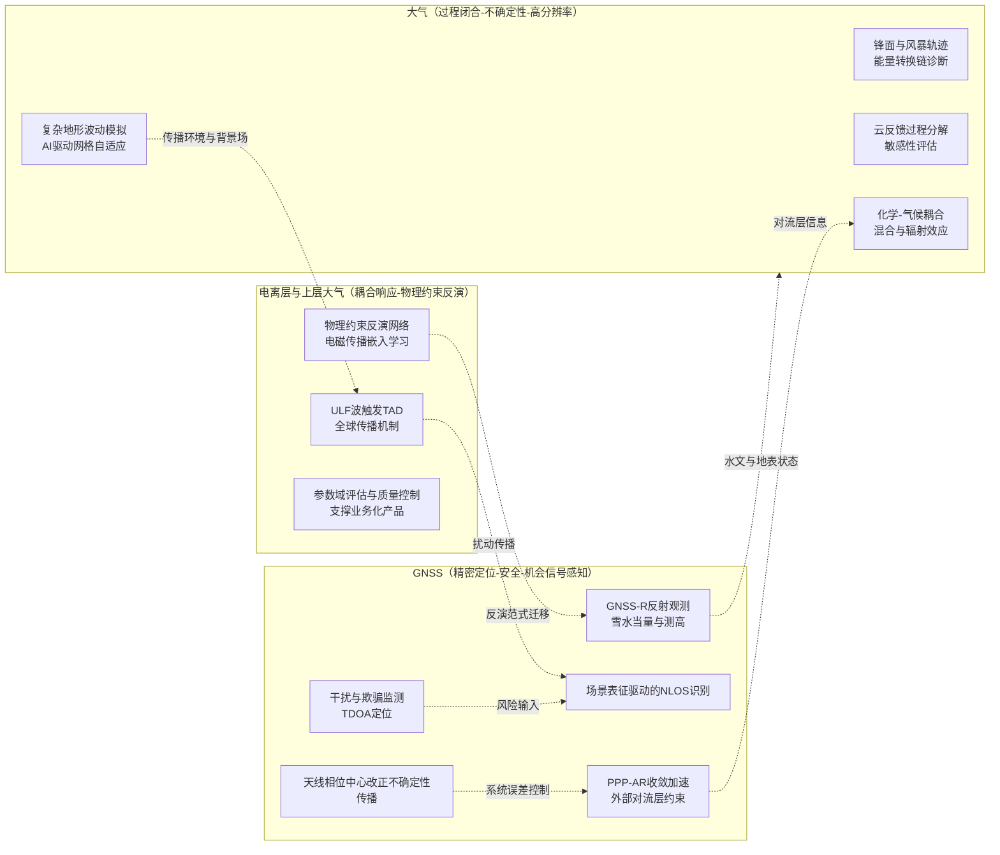
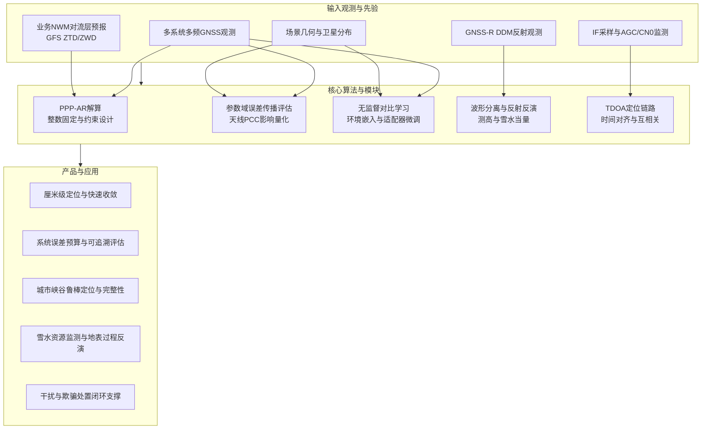
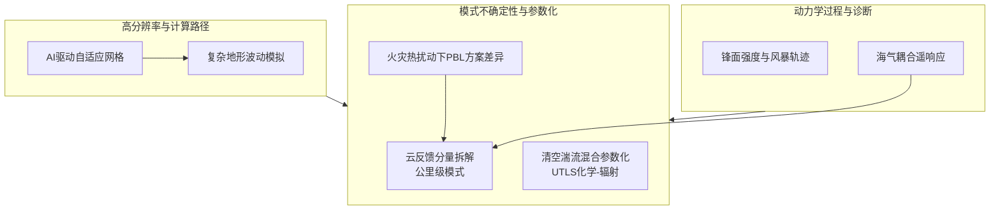
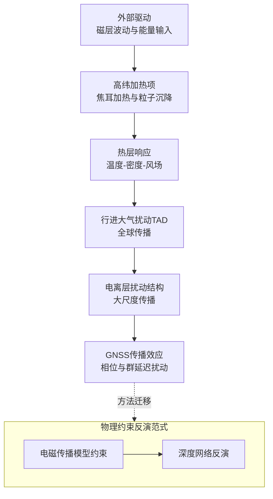
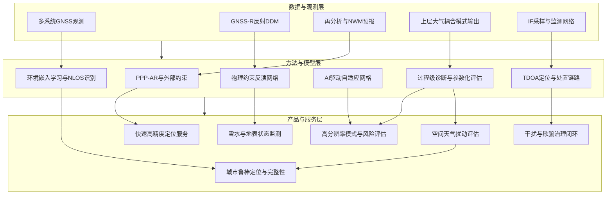
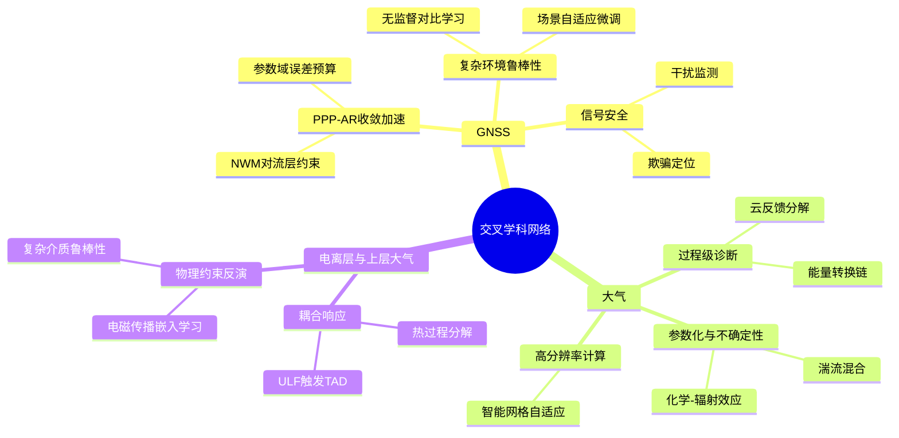

近一周的论文产出在GNSS、大气与电离层相关研究中呈现出较一致的“工程可用性牵引科学问题深化”的特征。GNSS方向的热点集中于若干主线：其一是面向业务与工程部署的精密定位链条压缩，通过外部对流层信息约束、天线相位中心改正不确定性传播评估等手段降低收敛时间与系统误差；其二是“信号环境—场景—算法”一体化的鲁棒定位，利用无监督对比学习与场景自适应微调降低标注依赖，并将环境表征显式纳入NLOS识别；其三是以GNSS-R与UAV/多源遥感为代表的机会信号感知与平台化工具链，将反射波形分离、雪水当量反演、UAV直接地理配准等环节推向可复用、可迁移的软件与模型体系。

大气方向的研究更突出“跨尺度物理闭合与不确定性定量”的路径。一类工作在海气相互作用、极端降水与热浪同步等问题上强调能量转换链与复合风险的动力学解释；另一类工作面向模式可信度与可推广性，通过云反馈的过程级分解、清空湍流混合参数化的不确定性传播、以及面向复杂地形的AI驱动自适应网格等方式，把传统模式的关键误差源转化为可诊断、可替换的模块。

电离层与上层大气方向的论文数量较少，但主题聚焦度较高。超低频波动触发的全球行进大气扰动、以及以MARSIS数据为对象的物理约束反演网络，体现了两条互补路线：一条是以耦合环流模式解析能量注入后的热层与电离层响应路径，另一条是将电磁传播物理作为约束嵌入机器学习反演，以提升复杂介质条件下的可解释性与抗噪性。

## 一、本期研究印记图：从“可用”出发的观测—反演—耦合闭环

本期论文在技术路线层面可以归纳为一个闭环结构。GNSS侧的“定位与授时”不再仅被视为终端输出，而是被拆分为一系列可被外部信息增强、可被不确定性传播评估的子模块，例如对流层延迟的外部约束、天线相位中心改正的参数域评估、以及场景驱动的NLOS识别与适配。大气侧的“模式与观测”则呈现出以过程为单位的模块化诊断倾向，从云反馈、湍流混合到复杂地形波动，都在尝试把误差源定位到可替换的参数化或网格策略。电离层与上层大气侧进一步把这种模块化推进到“能量输入—热力响应—传播扰动”的链条上，通过耦合模式分解焦耳加热、绝热过程与热传导的贡献，从而为导航服务的扰动预警提供可解释的物理边界。

## 二、GNSS方向：精密定位链条压缩与复杂环境鲁棒性

### 2.1 方向综述与研究现状

GNSS方向的论文集中体现了“把不可控环境转化为可建模的约束项”的技术路线。对PPP-AR而言，对流层湿延迟的短时失配仍是收敛时间的关键瓶颈之一。本期研究通过引入全球业务数值天气预报对流层延迟，并构造纬度相关的精度约束模型，在不显著改变稳态定位精度的前提下，系统性缩短收敛时间与首次固定时间，给出了可直接落地到实时服务链路的改造方式。与此对应，另一条“系统误差可解释化”的路线聚焦天线相位中心改正的不确定性传播。与仅在天线增益模式层面对比不同，参数域评估把差异映射到站坐标、钟差与对流层参数上，使得不同标定集差异对解算结果的影响能够在毫米量级上被定量、可复现地比较。

复杂环境鲁棒定位方面，本期工作将“环境表征”提升为与观测量同等重要的学习对象。无监督对比学习通过卫星图多视图增强构建鲁棒环境嵌入，再结合度量学习与场景自适应微调，使NLOS识别在极少标注条件下接近或超过大量标注监督模型的性能。这一方向与城市峡谷、港口与近岸等高反射场景的工程需求高度一致，并且与干扰监测和欺骗定位的快速发展形成互补。针对波罗的海区域的干扰与欺骗事件，本期工作展示了低尺寸重量功耗成本的网络化中频采样器部署，以及在数分钟量级输出发射源位置估计的TDOA链路，进一步推动GNSS风险治理从“事后报告”走向“可定位、可处置”的闭环。

在机会信号遥感与平台化方面，两条进展较为突出。一是天目一号多系统反射数据用于雪水当量反演，通过Transformer与卷积融合的多分支特征融合网络在约5公里分辨率上实现厘米量级的反演误差，并通过多系统融合显著提升覆盖与精度。二是UAV低空GNSS-R测高面临直达与反射波形重叠的问题，波形分离方法在不依赖外部高度先验的条件下实现实时可用的高度反演，指向轻量化载荷与快速部署场景。

### 2.2 代表性研究的技术路线与特点（表）

| 主题 | 技术路线要点 | 技术特点与重要结论线索 | 代表论文 |
| --- | --- | --- | --- |
| 天线相位中心改正影响评估 | 线性化观测模型与卫星分布权重矩阵，将相位中心改正差异传播到参数域并以最小二乘得到偏差统计 | 将“模式层差异”转化为“坐标、钟差、对流层参数偏差”，便于跨站点、跨纬度与跨组合可比评估 | Kröger et al. (2026), GPS Solutions, 10.1007/s10291-026-02056-2 |
| PPP-AR收敛加速 | 引入GFS业务预报对流层延迟并建立纬度相关的约束精度模型，应用于多频多系统PPP-AR | 全球尺度收敛时间系统性降低，改善首次固定时间，对时效性应用具直接收益 | Du et al. (2026), GPS Solutions, 10.1007/s10291-026-02053-5 |
| NLOS识别的低标注学习 | 无监督图对比学习提取环境嵌入，结合度量学习与适配器实现跨场景微调 | 以极少标注实现与大比例标注监督模型相当或更优性能，提升可部署性 | Zeng et al. (2026), GPS Solutions, 10.1007/s10291-026-02044-6 |
| 干扰与欺骗发射源定位 | 低成本IF采样器网络化部署，利用参考信号完成时间对齐并进行互相关，构建TDOA定位 | 将RFI监测从“存在性检测”推进到“分钟级定位”，支撑处置闭环 | Gattis et al. (2026), GPS Solutions, 10.1007/s10291-026-02061-5 |
| GNSS-R雪水当量反演 | 多分支特征融合网络融合Transformer与CNN，利用DDM与几何参数进行反演并做多系统融合 | 多系统融合显著提升覆盖并降低误差，反演精度达到厘米量级 | Zhu et al. (2026), GPS Solutions, 10.1007/s10291-026-02055-3 |

### 2.3 GNSS技术格局结构图（Mermaid）

### 2.4 专题画像：天线相位中心改正差异的参数域传播评估工具

#### （1）技术路线：从PCC差异到参数偏差的线性化传播

该研究提出开源工具PCC-Explorer，用于将天线相位中心改正及其差异传播到站坐标、钟差与对流层参数等解算结果上。技术路线以拓扑清晰的线性化观测模型为核心，在局部坐标系中构建包含北东天、接收机钟差与对流层项的参数向量。为使传播评估具有场景可比性，模型同时引入与高度角相关的随机模型，以及一个反映不同地理位置与观测时段卫星几何分布的权矩阵，从而将“天线模式差异在某一位置与某一时间窗内被怎样的星座几何采样”显式纳入传播。

在求解阶段，工具以最小二乘得到参数偏差并按用户指定的输出间隔进行统计汇总，支持多系统与单频、无电离层组合等常用组合。该路径的关键在于不依赖真实观测数据即可完成“从改正模型到参数域”的前向传播，使对比研究不再受站点数据质量、观测环境差异与处理策略细节的强耦合影响。

#### （2）技术特点：把“模式层争议”转化为“可解释误差预算”

该研究的突出特点在于把天线标定差异的影响量化到用户真正关心的参数上，并给出其随纬度、星座几何与输出间隔变化的规律。结果表明，参数偏差往往在垂向与钟差上更敏感，而水平与对流层项在多数场景中维持在毫米量级。这一结论使天线标定差异的工程意义得以被直接评估，同时也为站网产品的系统误差预算提供了可复用的方法框架。

#### （3）重要结论：垂向分量对标定差异更敏感且呈几何依赖

该研究的重要结论是：**天线相位中心改正差异在参数域中的主要映射对象通常是垂向分量与接收机钟差，且其幅度与纬度相关的星座几何采样密切相关，缩短输出间隔会放大由几何快速变化引入的偏差波动**。这一结论在工程上意味着，对高精度垂向应用与高频产品而言，应优先采用参数域评估来选择标定集与处理策略，并在产品发布中明确给出几何相关的不确定性范围，以提升可追溯性与跨机构一致性。

### 2.5 专题画像：天目一号多系统GNSS-R雪水当量反演与多系统融合策略

#### （1）技术路线：DDM多分支特征提取与几何信息融合

该研究面向雪水当量的连续、高分辨率反演需求，提出MBF-SWENet网络并系统验证天目一号多系统反射数据的可用性。技术路线首先对多星座反射数据进行处理，并与Copernicus雪水当量产品做时空匹配以构建训练与验证数据集。模型结构采用Transformer模块捕获全局空间依赖，卷积模块提取DDM局部纹理特征，并通过特征融合模块将反射信号特征与几何参数共同编码，从而提升对雪分布非均匀与快速变化的适应能力。

实验设计上，研究以不同系统、跨系统泛化与多系统融合为主线，分别评估单系统反演精度、跨系统迁移能力与融合后覆盖提升。该路线使“多系统带来的观测稠密度优势”能够在同一模型框架下被量化，并把融合收益同时体现在覆盖与误差两类指标上。

#### （2）技术特点：把“多系统增量”转化为可度量的覆盖与精度收益

该研究的技术特点在于明确区分三类收益。第一类收益来自模型结构对DDM全局与局部特征的联合表达，第二类收益来自跨系统建模带来的泛化能力，第三类收益来自多系统联合数据的覆盖扩展。研究报告显示，多系统融合在覆盖率提升的同时进一步降低反演误差，说明在同一时间窗内增加观测样本数可以有效缓解局地异常与噪声对反演的影响。

#### （3）重要结论：融合策略同时提升覆盖与精度并达到厘米量级误差

该研究的重要结论是：**基于天目一号多系统反射数据，雪水当量反演在典型雪深范围内可达到厘米量级的均方根误差，多系统融合不仅将时空覆盖显著提升，还可进一步降低误差并保持较高一致性相关性**。这一结论对雪水资源监测的意义在于，GNSS-R可以在相对低成本条件下补充传统微波辐射计与地面站网的稀疏性，形成更高频的水文状态约束，为融雪径流预报与山区水资源调度提供可同化的观测输入。

### 2.6 专题画像：波罗的海干扰与欺骗发射源的TDOA快速检测与定位

#### （1）技术路线：网络化IF采样、参考信号时间对齐与互相关TDOA

该研究面向冲突周边区域不断增多的GNSS射频干扰事件，提出并部署TDOA定位系统以缩短检测与处置链路。技术路线以低成本的中频采样节点为基础，在受影响海域周边构建多点网络。节点端利用监测到的自动增益控制与载噪比变化触发采样，再通过选定的参考GNSS信号完成时间对齐，将对齐后的“受污染”采样上传服务器进行互相关，得到节点对之间的到达时差并构建双曲面约束，从而解算发射源位置。

研究同时展示了对“圆形欺骗”等新型动态欺骗模式的跟踪能力，并给出在数分钟量级内输出定位估计的系统设计目标，为后续扩展到机场、港口与关键基础设施周边的常态化布设提供了可复用的技术范式。

#### （2）技术特点：把监测从“是否发生”推进到“在哪里发生”

该系统的特点在于把通常依赖航空ADS-B数据的宏观监测，转换为具备明确几何约束的发射源定位任务。通过参考信号对齐与中频采样，系统不再仅依赖位置解的异常，而是直接面向干扰信号本身建立时间差测量，从而在定位精度与可解释性上显著增强。对欺骗而言，能够跟踪欺骗信号随时间的结构变化，为构建更具鲁棒性的欺骗检测与对抗策略提供了数据基础。

#### （3）重要结论：分钟级定位能力为RFI治理提供工程化抓手

该研究的重要结论是：**基于网络化IF采样与TDOA互相关的系统可以在数分钟内对干扰与欺骗发射源给出定位估计，并能对更复杂的动态欺骗模式形成可追踪的信号层证据链**。这一结论意味着，GNSS安全治理可以从“依赖报告与经验判断”的事后模式，转向“可观测、可定位、可处置”的工程闭环，尤其适合与海事监管、机场运行与关键基础设施防护体系耦合，形成更短响应时间的风险处置链条。

### 2.7 专题画像：业务数值天气预报约束加速PPP-AR收敛

#### （1）技术路线：GFS对流层延迟外部约束与纬度相关精度模型

该研究针对PPP-AR收敛时间受对流层湿延迟短时失配制约的问题，利用业务数值天气预报产品构造外部约束。技术路线首先对接近400个IGS站的对流层天顶延迟进行统计，评估GFS预报延迟与站网产品的差异，并识别其纬度依赖特征。随后基于该统计构造纬度相关的精度模型，将其作为PPP-AR中的对流层约束项，分别在双频与三频、多系统组合下评估收敛时间与首次固定时间的变化。

该路线的关键在于把外部延迟产品从“可选输入”提升为“自适应精度约束”，使其在不同气候带与季节条件下的有效性能够被一致地利用，同时避免过强约束在热带高变率区域引入系统偏差。

#### （2）技术特点：以全球一致的物理预报替代局地经验约束

与仅依赖历元平滑或经验随机模型不同，该研究利用全球一致的物理预报提供更接近真实的湿延迟先验，使浮点模糊度更快进入可固定区间。研究同时强调该改造对稳态精度影响很小，说明其主要收益来自收敛期的约束增强而非后期解算结构变化，从而更符合实时服务对“快而稳”的需求。

#### （3）重要结论：全球范围收敛时间显著缩短且收益具季节与纬度结构

该研究的重要结论是：**引入GFS对流层延迟并采用纬度相关精度约束后，多系统多频PPP-AR的收敛时间可在全球范围内缩短约两到四成，首次固定时间亦出现分钟量级改善，而稳态精度变化不显著，收益在夏季与中高纬区域更突出**。这一结论的工程意义在于，业务NWM产品可以作为可持续、可扩展的全球外部信息源嵌入PPP-AR服务链路，为车辆导航、应急测绘与无人系统等时效性应用提供更可预期的性能上界。

### 2.8 专题画像：无监督对比学习的环境感知NLOS识别与跨场景适配

#### （1）技术路线：多视图卫星图构建、对比表征学习与度量约束

该研究指出NLOS信号的统计特性随环境变化显著，监督学习方法在跨场景时面临适配困难与标注成本问题。技术路线以卫星图为载体，将观测特征与卫星几何分布构建为图结构，并通过多视图图增强生成对比样本。无监督图对比学习训练编码器提取环境嵌入，使遮挡结构与传播条件被隐式编码。随后引入基于三元组损失的度量学习，在不同场景之间拉开全局特征距离以增强判别性。为进一步适配新场景，研究提出以适配器为核心的场景自适应微调框架，实现部分参数隔离与场景特定调参。

#### （2）技术特点：以极少标注实现可部署的跨场景性能

该方法的特点在于把“环境”作为可学习对象，并通过预训练加少量微调实现跨场景迁移。结果显示，在仅使用少量标注数据的条件下即可获得与大比例标注监督模型相当的静态场景识别精度，并在源场景与目标场景上取得更稳定的提升。这为城市峡谷的车载导航、低空飞行走廊与港口等多反射环境下的鲁棒定位提供了更现实的部署路径。

#### （3）重要结论：环境嵌入与适配器机制显著降低标注依赖并提升迁移鲁棒性

该研究的重要结论是：**基于无监督对比学习获得的环境嵌入在极少标注条件下即可支持较高精度的NLOS识别，并通过适配器的场景隔离机制在跨场景迁移中维持稳定收益，性能可超过以大量标注训练的监督基线**。这一结论意味着，NLOS识别可从“以场景为单位重训模型”的高成本模式，转向“统一预训练模型加轻量适配”的工程范式，为大规模多城市部署与持续迭代提供更可扩展的路线。

## 三、大气方向：过程级诊断、参数化不确定性与高分辨率计算路径

### 3.1 方向综述与研究现状

本期大气相关论文集中体现了三类研究取向。第一类强调动力学过程链条的闭合与诊断，典型如通过再分析与能量预算分解揭示锋面强度与风暴轨迹的能量转换路径，以及在多模式框架下评估南大洋冷却对热带响应的跨盆地差异。第二类围绕模式不确定性与参数化边界，典型如云反馈在公里级云分辨模式中的分量拆解、清空湍流混合对UTLS臭氧与辐射收支的影响，以及火灾热扰动下不同边界层方案对湍流与近地面风温响应的差异。第三类聚焦高分辨率计算与复杂地形问题，AI驱动的三维自适应网格为山地波的精细模拟提供了显著的效率收益，同时也提示未来模式发展将更依赖“智能资源分配”而不仅是盲目加密网格。

### 3.2 代表性研究的技术路线与特点（表）

| 主题 | 技术路线要点 | 技术特点与重要结论线索 | 代表论文 |
| --- | --- | --- | --- |
| 南大洋锋面变率与风暴轨迹 | 基于ERA5识别锋面强度与位置指标，结合能量预算分解与回归诊断风暴轨迹响应 | 以可用势能到涡动能的转换链解释风暴轨迹重组，突出斜压过程作用 | Zhu et al. (2026), JGR Atmospheres, 10.1029/2025JD045901 |
| 南极融水强迫的热带遥响应 | 多模式理想化融水试验，能量收支与云反馈强度关联分析 | 指出跨模式差异与短波云反馈相关，遥相关机制并非在所有模式中稳健 | Zhang et al. (2026), GRL, 10.1029/2025GL120291 |
| 公里级云分辨模式云反馈 | 控制与增暖试验对比，分解高云高度与低云量的反馈贡献 | 以过程级诊断定位偏差来源，为气候敏感性不确定性提供新约束 | Chao et al. (2026), Journal of Climate, 10.1175/JCLI-D-25-0656.1 |
| 火灾—边界层方案耦合 | WRF-Fire个例，高频站点观测评估多PBL方案并做湍流能量预算诊断 | 指出方案对热扰动响应差异显著，强调浮力主导的湍流生成机制诊断 | Wang et al. (2026), GMD, 10.5194/gmd-19-2059-2026 |
| 火箭排氯对臭氧影响 | WACCM6结合再分析约束，评估不同发射增长情景下臭氧耗损的时空结构 | 给出总体小但具有高纬季节性峰值的定量评估，为未来评估提供边界条件 | Li et al. (2026), ACP, 10.5194/acp-26-3621-2026 |

### 3.3 大气研究结构图（Mermaid）

### 3.4 专题画像：电子沉降、NO生成与LEO卫星阻力的耦合效应

#### （1）技术路线：热层背景场建模与电子沉降的蒙特卡洛刻画

该研究面向空间天气事件期间极区上层大气加热与卫星阻力变化的风险问题，构建从能量沉降到密度响应的物理链条。技术路线首先以一维上层大气模式构建事件期间的热层背景结构并考虑X射线、极紫外与红外辐射输入，随后以蒙特卡洛方法模拟极光电子在氮氧背景气体中的碰撞散射与超热原子氮生成过程，从而刻画沉降电子对NO生成效率的影响。最后通过对CHAMP与GRACE阻力响应的对比，讨论NO的红外冷却在事件后期对热层膨胀的抵消作用。

#### （2）技术特点：把化学冷却纳入“阻力预报”误差源清单

该研究的特点在于强调NO生成及其冷却能力并非仅是化学细节，而会改变密度恢复阶段的轨道阻力演化，从而影响经验轨道预报模型的可信度。研究提出在沉降能通量较强时可能出现密度“过冷却”并降低阻力的效应，这对LEO卫星编队维护与再入风险评估具有直接意义。

#### （3）重要结论：沉降诱导NO冷却可在事件后期降低密度并影响轨道预报

该研究的重要结论是：**极区电子沉降可显著增强NO生成并通过红外冷却在空间天气事件后期降低热层密度，从而对LEO卫星阻力产生保护性影响，但该效应强烈依赖沉降能通量，若忽略该过程会降低经验轨道预报模型的预测能力**。这提示上层大气业务建模在能量输入项之外，需要更系统地纳入化学冷却与恢复阶段的不确定性，以提升对“事件后密度回落”的可预报性。

### 3.5 专题画像：南印度洋副极锋对风暴轨迹与平均流的年际调制

#### （1）技术路线：锋面指标构建、滞后回归与能量转换诊断

该研究以ERA5为基础，从海表温度梯度识别南印度洋副极锋并构建强度与位置指标，通过滞后回归分析其对低层斜压性与风暴轨迹活动的调制。能量预算诊断进一步将响应解释为从平均可用势能到涡可用势能再到涡动能的转换链条，突出斜压过程在中低层的主导作用，并在高层以位势高度倾向框架揭示涡度通量强迫对平均流调整的贡献。

#### （2）技术特点：以能量路径串联锋面变率与环流调整

研究将锋面变率从“海表边界条件扰动”推进到“可用势能—涡动能”的可闭合链条，并把平均流的等效正压调整与涡度通量强迫相联系，使年际尺度的海气耦合解释更具可诊断性。这类诊断框架可迁移到其他海盆锋区，有利于比较不同锋面系统对风暴轨迹的调制强度与机制差异。

#### （3）重要结论：副极锋变率通过斜压能量转换重组风暴轨迹并调整平均流

该研究的重要结论是：**南印度洋副极锋的强度与纬向位置年际变率可通过改变低层斜压性重组风暴轨迹，其主导能量路径表现为平均可用势能向涡可用势能再向涡动能的转换，平均流调整主要受涡度通量强迫贡献**。这一结论为南半球中纬度风暴轨迹变化的归因提供了更直接的过程链条，也为改进海气耦合模式对锋面变率的表示提出了明确诊断指标。

### 3.6 专题画像：南极融水强迫的热带响应与云反馈不确定性

#### （1）技术路线：多模式协调试验与能量收支分解

该研究在多模式理想化融水强迫试验中评估南大洋表层冷却对热带气候的遥响应。技术路线对比多个模式对赤道表层冷却与ITCZ位移的共同信号，同时量化不同海盆的温度梯度与偶极结构响应差异，并以能量收支分解追踪风驱动潜热通量与短波通量在不同模式与海盆中的相对贡献。

#### （2）技术特点：把跨模式差异指向可观测的短波云反馈强度

研究发现，当以南大洋冷却幅度归一化后，关键热带响应指标与短波云反馈强度呈正相关，意味着云反馈是决定遥响应幅度的重要不确定性来源。该结果提示对遥响应机制的讨论不能仅停留在某一条经典遥相关路径上，而需要把云辐射反馈纳入核心解释框架，并以过程级诊断进行跨模式对齐。

#### （3）重要结论：热带响应稳健但机制与幅度在模式间差异显著且受云反馈调制

该研究的重要结论是：**南大洋融水导致的表层冷却会在多模式中触发赤道冷却与ITCZ北移等共同信号，但赤道太平洋温度梯度与大西洋偶极等响应在模式间差异显著，归一化后其幅度与短波云反馈强度相关，说明遥响应机制并非跨模式稳健且云反馈是关键不确定性来源**。这对未来评估冰盖融水情景下的热带降水与风暴活动风险具有直接意义，并为观测约束云反馈提供了明确的优先方向。

### 3.7 专题画像：公里级SCREAM模式的云反馈分量诊断

#### （1）技术路线：增暖试验对比与云反馈分量拆解

该研究在3.25公里分辨率的全球云分辨模式SCREAM中，通过控制与海表增暖试验对比评估云反馈，并将总反馈拆分为高云高度变化与低云量和光学厚度变化等分量。研究进一步对比12公里版本的差异，利用逆温强度等诊断量解释不同分辨率下低云反馈的敏感性差异，从而把分辨率与参数化响应联系起来。

#### （2）技术特点：以过程级指标定位气候敏感性不确定性的来源

该研究的价值在于把云反馈这一传统上难以约束的量，转化为可观测、可对照的过程级指标，例如高云顶几乎等温抬升导致的高度反馈增强，以及低云量反馈与逆温强度变化之间的耦合。通过分辨率对比，研究为“云分辨并不自动等价于更可靠的反馈”提供了更细致的诊断框架，有助于在高分辨率投入与物理可信度之间建立更可验证的评价路径。

#### （3）重要结论：正云反馈由高云高度与低云减少共同贡献且分辨率影响低云反馈结构

该研究的重要结论是：**SCREAM在增暖试验中表现为正云反馈，其贡献来自高云高度上升与低云量和光学厚度降低等分量，其中高云高度反馈对总反馈偏强有重要贡献，分辨率变化会显著改变低云反馈对逆温强度的敏感性，从而影响总反馈幅度**。该结论对下一代地球系统模式发展意味着，需要在过程级指标上持续对齐云反馈机制，而不仅以整体敏感性区间作为唯一评价标准。

### 3.8 专题画像：火箭排放氯对平流层臭氧的情景评估

#### （1）技术路线：WACCM6再分析约束与发射增长情景模拟

该研究评估火箭排放氯在不同发射增长情景下对臭氧恢复进程的影响。技术路线采用WACCM6并通过再分析约束引入真实的大气变率，在相对2019年的不同排放增长倍数下模拟柱臭氧损失，并分析其在高纬度的季节性峰值与年际波动结构。

#### （2）技术特点：在“总体影响小”的结论下给出可操作的风险边界

研究不仅给出全球平均影响的量级，还强调高纬度尤其是南极春季与北极春季的峰值结构，以及在冷年气象条件下可能出现更显著损失的情形。这种表达方式更适合进入评估报告与工程决策场景，使排放情景与风险边界能够被明确沟通与复核。

#### （3）重要结论：总体耗损较小但具有显著高纬季节性与气象调制

该研究的重要结论是：**在可预见的发射增长情景下，火箭排氯对全球柱臭氧的平均影响较小，但在高纬度呈现显著季节性峰值并受气象变率强烈调制，可能在特定年份与季节部分抵消臭氧恢复收益**。这一结论提示未来空间活动环境评估需要把推进剂排放纳入气候化学评估框架，并与观测约束和情景管理联动，以保证风险评估的可追溯与可更新。

### 3.9 专题画像：AI驱动三维自适应网格提升复杂地形山地波模拟效率

#### （1）技术路线：非结构网格AMR与LSTM驱动网格细化准则

该研究针对传统地形跟随坐标在陡峭地形下的网格扭曲问题，采用三维非结构网格并引入自适应网格细化以提升复杂地形下的动力学模拟精度。关键创新是用LSTM替代传统细化准则，预测何处需要细化以捕捉山地波生命周期，从而在避免过细化的同时抑制地形附近的数值噪声。研究在理想化与真实地形条件下对比传统AMR与LSTM驱动AMR的效率与精度。

#### （2）技术特点：把计算资源分配变成可学习的决策问题

与单纯提高分辨率不同，该研究把“哪里需要分辨率”转化为可学习的判别任务，使计算资源更聚焦于对结果敏感的区域。结果显示效率提升并不以牺牲关键物理结构为代价，反而通过减少伪噪声与不必要细化增强了数值稳定性。这条路线对未来高分辨率模式发展具有普适意义，尤其适用于边界层湍流、对流触发与地形波等局地强非线性过程。

#### （3）重要结论：在保持物理特征的同时显著提升效率并降低数值噪声

该研究的重要结论是：**LSTM驱动的自适应网格可在复杂地形山地波模拟中在保持关键物理特征与精度的同时显著提升计算效率，并通过抑制地形附近数值噪声减少伪细化，从而提高整体模拟可靠性**。这一结论意味着，高分辨率建模的可扩展路径不仅在硬件与并行，也在“智能网格与智能资源分配”，为下一代大气模式的可承受计算成本提供了新的技术支点。

## 四、电离层与上层大气方向：能量注入、传播扰动与物理约束反演

### 4.1 方向综述与研究现状

本期电离层与上层大气相关论文集中在两类问题。一类是从磁层波动到热层扰动的能量注入与传播路径，强调通过耦合环流模式把焦耳加热、绝热过程与热传导在扰动生成与传播中的相对贡献分离出来。另一类是以行星探测雷达为对象的物理约束反演，将电磁传播模型嵌入深度网络的损失函数，在高损耗介质与噪声条件下提升反演的可解释性与鲁棒性。尽管后者研究对象位于火星地下介质，但其“物理约束嵌入学习”的范式对电离层掩星、雷达电离层校正与地球空间环境反演具有明确的方法学参考价值。

### 4.2 代表性研究的技术路线与特点（表）

| 主题 | 技术路线要点 | 技术特点与重要结论线索 | 代表论文 |
| --- | --- | --- | --- |
| ULF波触发全球TAD | TIEGCM模拟ULF波影响，分解焦耳加热、绝热过程与热传导对TAD生成与传播的作用 | 给出全球传播速度量级与主导物理过程，强调热过程主导并弱季节依赖 | Wu et al. (2026), GRL, 10.1029/2025GL119835 |
| MARSIS数据物理约束反演 | 双分支网络提取频率依赖衰减特征，损失函数嵌入传输线电磁模型约束 | 在噪声与高损耗条件下提升反演精度与可解释性，适合复杂介质 | Shi et al. (2026), Remote Sensing, 10.3390/rs18060863 |
| 天线PCC参数域评估的通用性 | 将PCC差异传播到对流层与钟差等参数，形成可复现的误差预算 | 为高精度应用的系统误差控制提供可追溯评估手段 | Kröger et al. (2026), GPS Solutions, 10.1007/s10291-026-02056-2 |

### 4.3 电离层与上层大气过程结构图（Mermaid）

### 4.4 专题画像：ULF波触发全球行进大气扰动的热过程主导机制

#### （1）技术路线：TIEGCM耦合模拟与过程分解

该研究评估超低频波动对热层—电离层系统的全球影响，重点关注行进大气扰动的生成与传播机制。技术路线基于TIEGCM开展模式试验，模拟ULF波驱动下的热层响应，并对扰动源区与传播区分别进行能量过程分解，比较焦耳加热、绝热过程与热传导在不同阶段的相对贡献，同时检验其对季节条件的敏感性。

#### （2）技术特点：将传播现象与可分解的物理过程一一对应

该研究的特点在于把传统上以现象描述为主的TAD传播，转化为可以在模式中分区、分过程归因的动力热力链条。研究指出，源区内焦耳加热与绝热过程共同作用，而传播区则由绝热过程与热传导主导，这为后续把外部能量输入与传播扰动的可预报性建立联系提供了可操作的诊断框架。

#### （3）重要结论：TAD生成与传播由热过程主导且对季节不敏感

该研究的重要结论是：**ULF波能够触发全球传播的行进大气扰动，其生成与传播主要由热过程主导，在源区焦耳加热与绝热过程起关键作用，在传播区绝热过程与热传导占主导，并且传播特征对季节条件的依赖较弱**。该结论对空间天气业务建模的意义在于，可通过对高纬能量输入与热过程参数化的改进来提升对全球传播扰动的刻画，从而为导航与通信扰动风险评估提供更可靠的物理基础。

### 4.5 专题画像：DBPINet在MARSIS数据上的物理约束反演与复杂介质鲁棒性

#### （1）技术路线：双分支衰减表征与电磁传播物理约束嵌入

该研究面向火星地下雷达探测的层状介质反演问题，提出双分支物理约束反演网络DBPINet。技术路线通过双频雷达信号构造频率依赖的衰减特征提取分支，并在损失函数中嵌入基于传输线模型的电磁传播物理约束，从而在反演层厚、介电常数与损耗角正切时同时保持精度与物理一致性。研究以数值试验与实测数据共同验证，并在MARSIS数据上给出与既有地质解释一致的三层结构反演结果。

#### （2）技术特点：在高损耗与噪声条件下保持可解释反演

该研究的特点在于把物理模型作为学习过程的硬约束之一，从而降低纯数据驱动在高损耗介质中易出现的不适定与不可解释问题。双分支结构使网络能够把衰减信息与结构参数的敏感性解耦，提高对噪声与复杂介质条件的鲁棒性。尽管研究对象是火星地下介质，但其方法学对电离层掩星、雷达电离层校正与复杂传播介质反演具有直接参考价值。

#### （3）重要结论：物理约束嵌入显著提升反演精度并保持地质一致性

该研究的重要结论是：**通过在网络中显式嵌入电磁传播物理约束，并引入能够表征频率依赖衰减的分支结构，反演精度与抗噪性得到显著提升，且在实测MARSIS数据上得到与既有地质解释一致的层状结构结果**。这一结论对地球空间环境反演的启示在于，当观测受传播介质强影响且不适定性突出时，应优先采用物理约束嵌入学习的路线，以在提升精度的同时保留可解释性与可迁移性。

## 五、交叉学科网络图与创新链流程图

GNSS—大气—电离层的交叉融合在本期论文中具有清晰的创新链条。GNSS侧通过引入NWM与环境嵌入学习把定位链条压缩，并通过TDOA将安全治理推进到定位处置；大气侧通过过程级诊断与智能网格把误差源模块化；电离层侧通过耦合模式过程分解与物理约束反演把能量注入与传播扰动转化为可解释、可反演的链条。三者在“传播介质与扰动风险”这一接口上实现了紧耦合，这使得导航服务质量与空间天气预报的联合优化具备更明确的技术落点。

## 六、未来发展趋势与可检验判断

未来一到三年的关键趋势将围绕“可部署性”和“可解释性”的共同约束展开。GNSS定位服务将更依赖外部信息与场景表征，形成以NWM约束、环境嵌入与系统误差预算为核心的可组合模块；在城市与低空等复杂环境中，预训练加轻量适配的学习范式将成为降低标注成本与提升迁移性能的主要路径。与之对应，GNSS安全治理将从统计性报告转向实时监测与快速定位处置，TDOA与IF采样网络将成为关键基础设施之一，并与车载、港口与航空运行体系形成更紧耦合。

大气数值模式的发展将进一步强化过程级诊断与不确定性传播的工程化表达。公里级云分辨模式正在把云反馈的不确定性拆解为可观测的过程指标，为长期敏感性评估提供新约束；化学—气候耦合与湍流混合参数化的工作表明，在UTLS等关键高度层，不确定性传播对辐射收支与气候响应的影响需要在模型开发早期被系统纳入评估。复杂地形与极端事件驱动下的高分辨率模拟将更依赖智能网格与智能资源分配，以在可承受成本下维持物理可信度。

电离层与上层大气方向的一个清晰趋势是把传播扰动的机理解释与可反演路径并行推进。一方面，耦合环流模式的过程分解使得能量注入后的传播扰动能够被更稳定地归因与比较；另一方面，物理约束嵌入学习在复杂介质反演中的成功实践提示，在电离层掩星、雷达传播校正与空间环境参数反演中，物理约束将成为提升可解释性与抗噪性的关键抓手。对导航服务而言，这意味着空间天气扰动风险评估将更可与定位完整性指标形成闭环联动，并以可验证的过程链条支撑工程阈值设定。

## 七、参考文献

1. Kröger, J., Kersten, T., & Schön, S. (2026). PCC-Explorer: An open-source software tool to assess the impact of GNSS antenna phase center corrections on geodetic parameters. *GPS Solutions*, 30, 92. https://doi.org/10.1007/s10291-026-02056-2
2. Zhu, Y., Ma, X., Ge, M., Zhang, X., Zhang, K., Yu, K., & Qu, X. (2026). Preliminary validation of Tianmu-1 multi-GNSS reflections for snow water equivalent retrieval using a MBF-SWENet model. *GPS Solutions*, 30, 94. https://doi.org/10.1007/s10291-026-02055-3
3. Xu, Z., Wang, X., Xia, J., Sun, Y., Liu, C., Wang, Z., Tian, Y., Qiu, T., & Wang, D. (2026). Separation of Overlapped Direct and Reflected Waveforms for Low-Altitude UAV-Based GNSS-R Altimetry. *Remote Sensing*, 18(6), 893. https://doi.org/10.3390/rs18060893
4. Gattis, B., Cydejko, J., & Akos, D. (2026). Baltic sea GNSS jamming and spoofing emitter detection and localization in real-time using a time difference of arrival (TDOA) system. *GPS Solutions*, 30, 96. https://doi.org/10.1007/s10291-026-02061-5
5. Pan, Y., Dong, J., He, M., Yan, Q., Wu, Q., Chen, T., Jiao, J., Lv, Y., & Zhou, L. (2026). Spatial heterogeneity of nonlinear signals, background noise and vertical velocities in GNSS vertical time series across the Tibetan Plateau: A systematic analysis of multi-source loading corrections. *Geophysical Journal International*. https://doi.org/10.1093/gji/ggag104
6. Yang, Y., Xu, C., Yang, Q., Xu, X., Huang, Y., & Dong, H. (2026). Application and Technological Evolution of GNSS in Natural Hazard Research: A Comprehensive Analysis Based on a Hybrid Review Approach. *Remote Sensing*, 18(6), 887. https://doi.org/10.3390/rs18060887
7. Du, S., Wang, J., Cui, B., Tang, L., Chen, X., Huang, G., & Schuh, H. (2026). Accelerating multi-GNSS and multi-frequency PPP-AR convergence using global operational NWM forecasts. *GPS Solutions*, 30, 93. https://doi.org/10.1007/s10291-026-02053-5
8. Zeng, K., Li, Z., & Xie, S. (2026). Environment-aware GNSS NLOS detection via unsupervised contrastive representation learning. *GPS Solutions*, 30, 91. https://doi.org/10.1007/s10291-026-02044-6
9. Bahadur, B., Altuntas, C., Demirel, Y., Ocalan, T., & Türk, T. (2026). PPPH-UAV: an open-source software to process raw GNSS data obtained from unmanned aerial vehicles for generating photogrammetric products. *GPS Solutions*, 30, 95. https://doi.org/10.1007/s10291-026-02051-7
10. Jia, R., Jiang, N., Xu, Y., Li, Z., Wei, S., Feng, B., Xu, T., & Schuh, H. (2026). Enhancing GNSS PPP Through Remote Sensing PWV Augmentation Under Different Geographical Conditions. *Journal of Geophysical Research: Atmospheres*, 131. https://doi.org/10.1029/2025JD045657
11. Scherf, M., Krauss, S., Tsurikov, G., Strasser, A., Shematovich, V., Bisikalo, D., Lammer, H., Güdel, M., & Möstl, C. (2026). The impact of electron precipitation on Earth's thermospheric NO production and the drag of LEO satellites. *Annales Geophysicae*, 44, 209–. https://doi.org/10.5194/angeo-44-209-2026
12. Zhu, S., Cheng, X., Zhou, G., & Qin, J. (2026). Interannual Impact of the South Indian Ocean Subantarctic Front on Storm Track and the Mean-Flow. *Journal of Geophysical Research: Atmospheres*, 131. https://doi.org/10.1029/2025JD045901
13. Zhang, X., Purich, A., Deser, C., & Pauling, A. (2026). Robust Yet Diverse Tropical Responses to Antarctic Meltwater Across Models. *Geophysical Research Letters*, 53. https://doi.org/10.1029/2025GL120291
14. Chao, L.-W., Zelinka, M. D., Terai, C. R., Beydoun, H., Hillman, B. R., Keen, N. D., Caldwell, P. M., Bogenschutz, P. A., & Klein, S. A. (2026). Examining Cloud Feedback Components in the Simple Cloud-Resolving E3SM Atmosphere Model (SCREAM). *Journal of Climate*, 39. https://doi.org/10.1175/JCLI-D-25-0656.1
15. Li, Y., Feng, W., Plane, J. M. C., Wang, T., & Chipperfield, M. P. (2026). The impact of rocket-emitted chlorine on stratospheric ozone. *Atmospheric Chemistry and Physics*, 26, 3621–. https://doi.org/10.5194/acp-26-3621-2026
16. Chau, C. H., Hoor, P., Kaiser, K., & Tost, H. (2026). Parametrizing the mixing by clear air turbulence in the chemistry climate model EMAC and its respective radiative impact. *Atmospheric Chemistry and Physics*, 26, 3637–. https://doi.org/10.5194/acp-26-3637-2026
17. Wang, Y., Yang, C., Shi, L., Yao, Q., & Zhong, L. (2026). Dynamical linkages between planetary boundary layer schemes and wildfire spread processes: a case study using WRF-Fire version 4.6. *Geoscientific Model Development*, 19, 2059–. https://doi.org/10.5194/gmd-19-2059-2026
18. Gan, P., Li, J., Wu, X., Wu, Q., Zou, X., Wang, Z., Zhu, J., Yuan, H., Xie, F., Tang, X., et al. (2026). Tibetan Plateau Mountain Wave Simulation Using AI-Driven 3D Adaptive Mesh Refinement. *Journal of Geophysical Research: Atmospheres*, 131. https://doi.org/10.1029/2025JD045585
19. Wu, H., Wang, W., Shi, X., Lin, D., Hartinger, M. D., Baker, J. B. H., & Chakraborty, S. (2026). Global Impacts of Ultra-Low-Frequency Waves: 1. Thermospheric Responses and Traveling Atmospheric Disturbances. *Geophysical Research Letters*, 53. https://doi.org/10.1029/2025GL119835
20. Shi, R., Guo, L., & Ye, H. (2026). DBPINet: A Physics-Informed Inversion Network for Martian Subsurface Radar Signal. *Remote Sensing*, 18(6), 863. https://doi.org/10.3390/rs18060863

