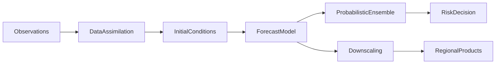

过去三年，数据驱动的全球天气预报从“可用的研究原型”快速推进到“基础模型形态”。ERA5 再分析作为统一训练语料与评测参照[3]，使不同团队能在相近数据分布上比较架构与配方。GraphCast 在 0.25° 分辨率上给出 10 天全球多变量预报，并在多项验证上超过当时主流业务确定性系统[1]；Pangu-Weather 表明三维地球先验下纯学习系统可达强业务竞争力，同时直言回归式训练易呈现平滑倾向并可能低估极端事件[2]。Aurora、NeuralGCM 等进一步把“地球系统基础模型”从叙事推进到跨任务与多时间尺度的实证[4][5]。

与此同时，深度学习整体仍常被描述为“有效但难解释”：工程上大量依赖试配与规模外推。Simon 等人近期系统论证：**一门关于深度学习的科学理论正在成形**——它刻画训练过程、隐表示、终态权重与泛化性能的**可测宏观量**，并强调**可证伪的定量预测**；作者建议将这一纲领称为 **learning mechanics（学习力学）**[24]。本文第二版即以该文为**主骨架**，并吸收流匹配与扩散的**输运/动力学**表述（见 `source/m.md` 整理的科普脉络），对第一版中“数值大模型 ↔ 大语言模型”的叙述作**重写式延伸**：两条“力学”并行——**权重空间中的学习动力学**，与**样本（或场）空间中的生成动力学**。

全文仍用三个可操作的关键词贯穿：**表示空间**、**生成范式**、**计算分配**。它们分别回答：信息以何种几何进入计算图；目标函数是逼近条件均值还是刻画分布与轨迹；在固定算力下训练与推理的预算如何在模块、深度、采样步数之间拆分。

## 1. 学习力学：五条证据线与七个判据

Simon 等人归纳的“理论正在聚拢”的五条线索，可直接当作理解“大模型为何能训、为何能扩”的导航图[24]：

1. **可解的理想化设定**：深线性网络、核回归与 NTK 等情形下，学习动力学可化为可分析对象；它们像物理学里的“氢原子”，为真实非线性系统提供相位、时间尺度与归纳偏置的直觉[24]。  
2. **可处理的极限**：无限宽下的 lazy（特征几乎冻结）与 rich（特征学习）二分、无限深残差网络在不同缩放下的连续极限、以及数据量—参数量的联合标度等；极限把离散超参扫成可微的渐近图像[24]。  
3. **简单的经验宏观律**：神经 scaling law、edge of stability（全批梯度下降下 Hessian 尖锐度与 \(2/\eta\) 的平台）、neural collapse 等；它们像“开普勒式”定律，先于完整第一性原理而存在，却强约束工程外推[24]。  
4. **超参理论**：学习率—批大小缩放、μP 等参数化使“窄模型上试好的优化设定”可迁移到宽模型；本质是找出与宽度、深度解耦的有效变量[24]。  
5. **跨设定普适行为**：不同架构在匹配算力与数据后性能趋同、表示相似性随规模上升等；若存在“普适类”，理论只需抓住少数共享机制[24]。

作者同时提出学习力学应满足的**七个判据**（第一性原理、数学定量、可重复验证、在合适分辨率上完备、直观、对工程与安全有用、并诚实标出适用边界）[24]。这对地球系统机器学习尤为重要：平均场技能与尾部风险未必同一普适类，**在何种评测口径下外推 scaling**，必须随判据第七条一并写明。

## 2. 架构演化作为“可训练离散化”：从 CNN 到 Transformer

若将“能否规模化”视为工程与统计的耦合，决定因素往往在**训练稳定性、并行效率与归纳偏置**是否同时成立——这与学习力学强调**动力学与宏观可测性**一致[24]。CNN 把局部性与平移结构写入归纳偏置；RNN/LSTM 以顺序状态承载时间依赖但牺牲并行；Transformer 以自注意力建立全局依赖，并把**残差与归一化**作为深度堆叠的稳定器[9]。在语言模型路线中，Kaplan 等人的 scaling law[14]与 Hoffmann 等人的计算最优（Chinchilla）结论[15]表明：**损失随算力、数据与参数呈幂律**，但指数与断裂点仍部分开放[24]；Xiong 等对 Post-LN / Pre-LN 的分析说明**归一化位置即动力学问题**[10]，RMSNorm、SwiGLU、RoPE 等则是把计算与表达瓶颈拆开配置的工程组件[11][12][13]。

**残差网络**在这里不仅是“缓解梯度消失”的补丁：在理论侧，**无限深残差在层缩放取不同幂次时可趋向不同连续动力学**（类 ODE 的平滑演化或更带噪声的图像），提示“深度”应被理解为某种**离散化步长**，而非单纯层数计数[24]。这与下文生成侧“用 ODE 近似连续输运”是同一类数学直觉——**离散实现逼近连续对象**，也是 Simon 等人所谓 **Discretization Hypothesis** 的精神：有限宽深网络或可视为某种极限动力学的离散近似，有限步生成或可视为连续输运的时间离散[24]。

## 3. 生成动力学：从静态映射到分布输运

流行科普与教材脉络中（`source/m.md`），生成建模范式常被放在一条清晰轴上对比：

- **静态映射生成**（如经典 GAN、VAE）：用单次前向把简单分布“推”到数据分布，不显式展开中间轨迹；训练常依赖对抗或变分界，对过程可控性与可解释性相对弱。  
- **扩散模型**：用 **SDE** 将数据扰动为噪声，逆过程学习 **score**；密度演化服从 **Fokker–Planck** 图像。采样轨迹带随机性，可类比“在噪声中沿梯度爬坡”。  
- **流匹配（Flow Matching）**：在预设概率路径上直接学习依赖时间的**速度场**，使样本沿 **ODE** 做确定性演化；**连续性方程**给出质量守恒的输运图像。合适路径（如条件最优传输的直线耦合）下，轨迹更“直”，推理步数往往少于多步随机扩散。

更关键的是统一接口：**对给定扩散 SDE，存在概率流 ODE（Probability Flow ODE）**，使得与 SDE **共享各时刻边际分布** \(\rho_t\)；因此“学 score”与“学速度场”可在**同一概率流动**框架下互译——差别多在参数化与采样实现，而非“是否在做测度输运”这一终极目标。对工程读者：这意味着**集合预报里用扩散随机采样**，与**沿概率流 ODE 的确定性积分**，可以在“匹配 \(\rho_t\)”层次对齐，而在“单条轨迹是否随机”上仍须区分。

将“图像”换作“全球格点场”，**高维连续场**仍可看作集中在有效流形附近的随机对象：**生成**即构造 \(\pi_0 \to \pi_1\) 的测度输运；**中期预报与世界模型**天然需要沿时间参数 \(t\) 的轨迹，而非单步映射——这与 `source/m.md` 强调的“视频、物理模拟、长期预测”方向一致，也与气象业务中**集合与路径**思维一致。

## 4. 数值大模型的平滑陷阱：回归是哪一种“生成”？

数值大模型在极端事件上的困难，往往不在于大尺度环流不可见，而在于 **MSE 等回归目标**在统计上偏好**条件均值**，并在谱域通过 double penalty 压低不确定尺度上的振幅[6]，从而**把多解与相位不确定性折叠成光滑场**[2]。在 `source/m.md` 的语言里，这接近**试图用“一步映射”或单一确定性输出概括本质上的多模态与强不确定结构**；在 learning mechanics 的语言里，则是**损失与数据分布共同诱导的隐式偏置**——只是此处偏置主要体现在**输出统计**而非权重几何。

Pangu-Weather 的可视化与讨论将平滑与极端低估具体化[2]；影响导向检验表明，仅看平均技能会掩盖尾部与复合灾害指标的风险[7]。下图仍有助于建立“大尺度一致、细尺度与极端需另验”的直觉。

架构在 ERA5 上“看起来收敛”时，须拆成两层：平均技能可能随数据与算力匹配而趋同[15][16]；**尾部与校准**不自动随平均指标改善[7]。MoE（如 EWMoE）在固定数据预算下展示参数效率的可能增益[8]，但其是否修正尾部，仍需与概率评分与案例评测联合检验[17][7]。

## 5. 从回归均值到显式分布动力学：气象中的扩散与残差式修正

业务数值长期用集合表达不确定性。若学习路线停留在单路径回归，就会把不确定性**折叠成模糊**，而 GenCast 说明：**扩散式集合**可在 CRPS 等规则下优于当时业务集合，并在极端与决策价值指标上体现优势；且**单样本场可保持清晰结构，样本均值可能更糊**——对风速等非线性诊断量，“均值后代入”与“样本后平均”可系统不同[17]。

在生成动力学视角下，GenCast、DiffDA、CorrDiff 等是把**大气状态空间**当作输运终点 \(\pi_1\)：DiffDA 在稀疏观测下生成与动力一致的同化初值[18]；CorrDiff **先回归均值、再以扩散修正残差**，在谱与尾部上补偿高频[19]——这与“静态均值场 + 动力学残差”的两段式分解同构于工程上常见的**主解 + 可学习扰动**，只是扰动在分布意义下显式化。

**计算分配**在此出现两次：训练侧服从 Chinchilla 类最优（参数—token—算力匹配）[15]；推理侧则分配在**扩散步数 / 概率流积分步数 / 是否采用更直 OT 路径**上——流匹配脉络强调后者可减少步数，本质是在**边际不变或近似不变**前提下买推理预算[24]与 `source/m.md` 对 FM 采样效率的叙述。

## 6. 表示空间与统一接口：连续场、离散 token 与普适表示

“数值大模型”和“语言大模型”的差异，主要不在“是否向量”，而在**离散化接口、对齐与目标**。LLM：token 嵌入 → 多层变换 → 词表上的条件分布 → 采样解码。数值：格点、patch 或谱系数块进入同一类序列骨干。VQ-VAE 给出**连续到离散潜**的经典路径[22]；Time-LLM 类工作把时序 patch **重编程**进 LLM 嵌入空间[23]。学习力学进一步问：在**跨架构、跨模态**条件下，表示是否趋向某种共享几何（“普适性”经验）[24]——这为“地球场 + 文本 + 工具”的多模态基础模型提供了理论侧的问题意识：**何种统计结构迫使表示收敛，何种评测度量下收敛成立**。

## 7. 仍未触顶的小模型与混合计算图

“4B 是否到顶”常是否定的：**欠训练**、**数据混合**、**推理上下文与工具**、**架构红利**均可拉开差距。Hoffmann 等强调固定算力下参数与 token 的匹配[15]；Shukor 等将混合数据配比纳入可外推设计[16]。架构上，RetNet、Gated DeltaNet 等探索**廉价状态传播 + 稀疏全局校正**，直接改写**计算分配**曲线[20][21]。在学习力学侧，**scaling 指数的先验预测**、**有限网络与连续极限的严格关系**、**优化器为何在 LLM 上呈现系统性优劣**等仍属开放方向[24]——工程上对应：外推 scaling 时须记录**训练配方与评测口径**，避免把“中间幂律段”误当成无断裂普适律。

## 8. 结语：两条动力学与一个闭环

若将第二版讨论压缩为可执行原则：

1. **学习力学**把深度学习放进“可测动力学 + 宏观律 + 极限”框架；它解释**为何深模型在当代配方下可训、可扩、可部分迁移超参**，并标出**仍开放的指数与普适类问题**[24]。  
2. **生成动力学**把扩散/流匹配/概率流 ODE 统一为**分布输运**；在地球系统任务中，它把 **GenCast / DiffDA / CorrDiff** 与“回归平滑”放进同一对比轴：是否显式展开 **\(\rho_t\) 与轨迹**。  
3. **极端与尾部**仍是**损失—采样—评测**的联合问题；谱域损失修正与案例检验不可替代[2][6][7]。  
4. **表示空间**上，连续与离散的接口决定能否共用骨干；**普适表示**假设提示跨模态对齐的可能性与度量陷阱[24]。  
5. **计算分配**同时作用于训练（算力—数据—参数）与推理（步数、稀疏注意力、递归核等）[15][20][21]。

从数值大模型到大语言模型，更具解释力的桥梁是：**学习力学**约束“训练如何塑造权重与表示”，**生成动力学**约束“权重如何诱导输出分布与轨迹”；二者在 **Simon 等人强调的连续性方程式思维**（对生成）与 **权重更新方程式思维**（对训练）中对称出现[24]。只有当表示接口、概率目标与风险决策链条一致时，基础模型叙事才可能在地球系统等连续场任务中稳定落地。

## 参考文献

1. Lam, R., et al. (2023). Learning skillful medium-range global weather forecasting. *Science*. https://www.science.org/doi/10.1126/science.adi2336  
2. Bi, K., et al. (2023). Accurate medium-range global weather forecasting with 3D neural networks. *Nature*. https://www.nature.com/articles/s41586-023-06185-3  
3. Hersbach, H., et al. (2020). The ERA5 global reanalysis. *Quarterly Journal of the Royal Meteorological Society*, 146(730), 1999–2049. https://doi.org/10.1002/qj.3803  
4. Bodnar, C., et al. (2024). A foundation model for the Earth system. arXiv:2405.13063. https://arxiv.org/abs/2405.13063  
5. Kochkov, D., et al. (2024). Neural general circulation models for weather and climate. *Nature*. https://www.nature.com/articles/s41586-024-07744-y  
6. Subich, C., et al. (2025). Fixing the double penalty in data-driven weather forecasting through a modified spherical harmonic loss function. arXiv:2501.19374. https://arxiv.org/html/2501.19374v2  
7. Pasche, O. C., et al. (2025). Validating deep-learning weather forecast models on recent high-impact extreme events. *Artificial Intelligence for the Earth Systems*. https://doi.org/10.1175/AIES-D-24-0033.1  
8. Gan, L., Man, X., Zhang, C., & Shao, J. (2024). EWMoE: An effective model for global weather forecasting with mixture-of-experts. arXiv:2405.06004. https://arxiv.org/abs/2405.06004  
9. Vaswani, A., et al. (2017). Attention is all you need. arXiv:1706.03762. https://arxiv.org/abs/1706.03762  
10. Xiong, R., et al. (2020). On layer normalization in the Transformer architecture. In *Proceedings of the 37th International Conference on Machine Learning* (pp. 10524–10533). PMLR. https://proceedings.mlr.press/v119/xiong20b.html  
11. Zhang, B., & Sennrich, R. (2019). Root mean square layer normalization. In *Advances in Neural Information Processing Systems 32*. https://papers.neurips.cc/paper/2019/hash/1e8a19426224ca89e83cef47f1e7f53b-Abstract.html  
12. Shazeer, N. (2020). GLU variants improve Transformer. arXiv:2002.05202. https://arxiv.org/abs/2002.05202  
13. Su, J., et al. (2021). RoFormer: Enhanced Transformer with rotary position embedding. arXiv:2104.09864. https://arxiv.org/abs/2104.09864  
14. Kaplan, J., et al. (2020). Scaling laws for neural language models. arXiv:2001.08361. https://arxiv.org/abs/2001.08361  
15. Hoffmann, J., et al. (2022). Training compute-optimal large language models. arXiv:2203.15556. https://arxiv.org/abs/2203.15556  
16. Shukor, M., et al. (2025). Scaling laws for optimal data mixtures. arXiv:2507.09404. https://arxiv.org/abs/2507.09404  
17. Price, I., et al. (2025). GenCast: Diffusion-based ensemble forecasting for medium-range weather. arXiv:2312.15796. https://arxiv.org/html/2312.15796v2  
18. Huang, L., et al. (2024). DiffDA: A diffusion model for weather-scale data assimilation. In *Proceedings of the 41st International Conference on Machine Learning (ICML)*. https://proceedings.mlr.press/v235/huang24h.html  
19. Residual corrective diffusion modeling for km-scale atmospheric downscaling. (2025). *Communications Earth & Environment*. https://www.nature.com/articles/s43247-025-02042-5  
20. Sun, Y., et al. (2023). Retentive network: A successor to Transformer for large language models. arXiv:2307.08621. https://arxiv.org/abs/2307.08621  
21. Yang, S., et al. (2025). Gated Delta Networks: Improving Mamba2 with delta rule. arXiv:2412.06464. https://arxiv.org/abs/2412.06464  
22. van den Oord, A., et al. (2017). Neural discrete representation learning. arXiv:1711.00937. https://arxiv.org/abs/1711.00937  
23. Jin, M., et al. (2024). Time-LLM: Time series forecasting by reprogramming large language models. In *International Conference on Learning Representations (ICLR)*. https://proceedings.iclr.cc/paper_files/paper/2024/hash/680b2a8135b9c71278a09cafb605869e-Abstract-Conference.html  
24. Simon, J. B., Kunin, D., Atanasov, A., Boix-Adserà, E., Bordelon, B., Cohen, J., Ghosh, N., Guth, F., Jacot, A., Kamb, M., Karkada, D., Michaud, E. J., Ottlik, B., Turnbull, J., et al. (2026). There Will Be a Scientific Theory of Deep Learning. arXiv:2604.21691. https://arxiv.org/abs/2604.21691

**说明**：扩散—流匹配—概率流 ODE—连续性方程的直观梳理与对比，另见项目内整理的微信稿 `source/m.md`（含流匹配科普与同一 arXiv 论文的二次传播稿），本文据此提炼与气象/地球系统叙述对齐，不逐段复述留言与转载信息。
