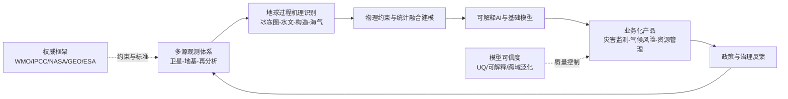
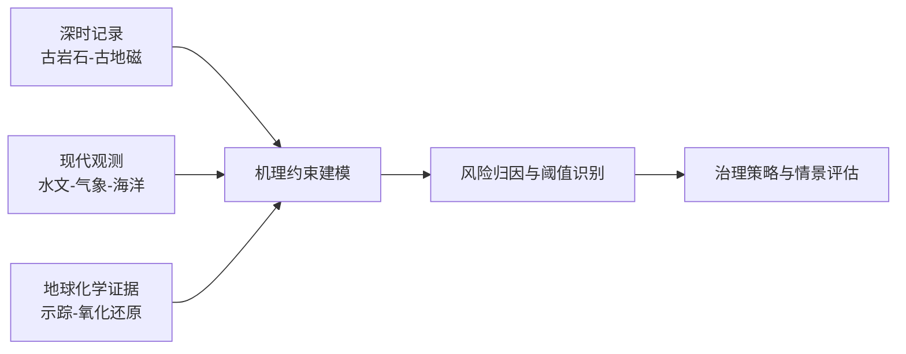
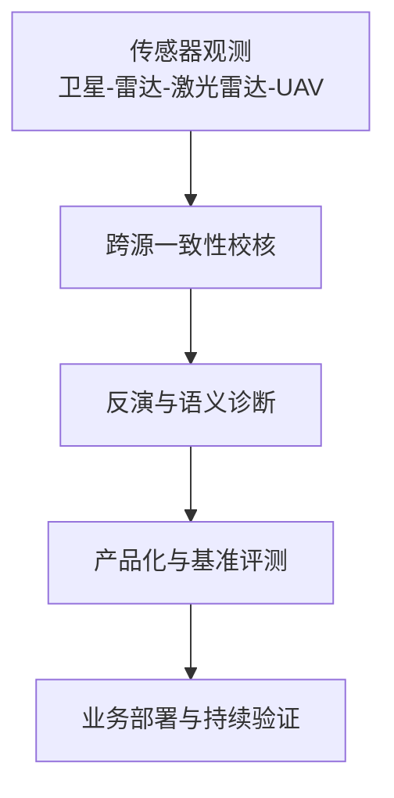
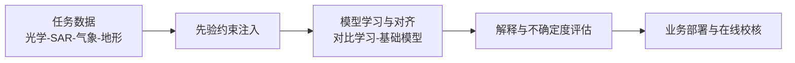
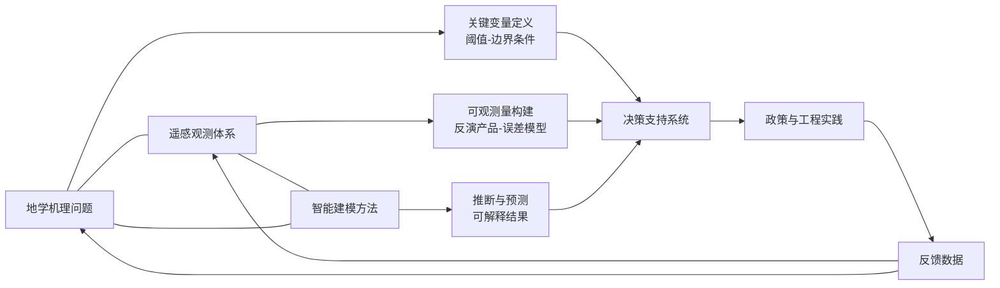
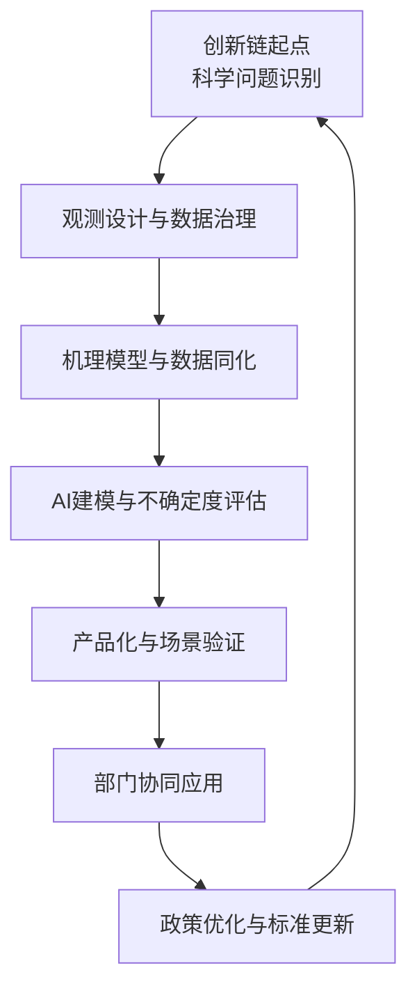

本报告围绕近一周地学、遥感与人工智能相关研究进行综合评述，重点回答三个问题：当前各方向的技术前沿正在向何处收敛，不同方向之间的耦合机制如何形成，以及这些研究如何转化为可执行的监测、预警与治理能力。为保证结论的可追溯性，正文以代表性论文为主线，按“方向综述—逐篇专题画像—交叉网络与创新链—趋势研判”组织内容，统一呈现技术路线、技术特点与重要结论。

在证据使用上，报告优先采用可核验的期刊论文与国际机构公开资料，并强调方法边界、不确定度来源与应用条件。对地学方向，重点关注深时过程对现实风险的约束；对遥感方向，重点关注观测链路质量控制与产品化能力；对人工智能方向，重点关注物理约束、可解释性与跨域迁移稳健性。该写法的目标是把“学术增量”转化为“业务可用增量”，为后续研究选题、系统建设和决策协同提供统一参考框架。

## 一、本期研究印记图

2026年3月中下旬的相关论文显示，地学与遥感研究正在沿“高精度观测—过程机理约束—可解释智能建模—业务化决策支持”这一连续链条加速耦合。地学端的核心增量体现在深时地球过程与当代气候-水文风险的同框研究，例如格陵兰冰盖再生记录、古老地磁与板块运动重建、地下水恢复全球证据、海洋热含量千年尺度重建等成果，构成了从古环境证据到现代风险响应的统一证据框架。遥感端的核心增量体现在多源观测一致性评估与场景化产品能力提升，例如Sentinel-3高度计在南极复杂地形下的性能评估、基于激光雷达的气溶胶层结构归因、多源影像驱动的河道形态量化、洪涝语义分割数据集建设等。人工智能端的核心增量体现在“物理约束+可解释性+跨模态基础模型”三条路径同步推进，尤其在冻土冰川、降水延伸期预报、光学-SAR变化检测、子像元分解与生物量反演等地球系统任务中表现出从“精度优先”向“可泛化、可解释、可迁移”并重的范式转移。

同时，WMO最新年度评估强调全球增暖、海洋热含量和极端事件风险仍处于高位区间，NASA Earth Science to Action战略与GEO Post-2025实施框架均将“观测-模型-决策”闭环与AI融合列为关键能力建设方向，这与本期论文的技术路线高度一致，表明当前研究前沿已从单点算法创新转向跨尺度、跨平台、跨部门的系统性创新。

## 二、地学方向专题画像

### 2.1 方向综述

本期地学方向呈现出“深时过程约束现实风险”的鲜明特征，研究对象覆盖冰盖再生、俯冲系统氧化还原收支、早期板块运动、地下水恢复及突发旱灾触发。与以往偏重单领域过程解释的写法不同，本期论文普遍采用跨圈层证据拼接策略，将地质记录、地球化学信号、再分析资料与现代监测统一到可检验的机理框架中。其共同目标并非仅给出静态结论，而是输出可用于阈值判别、情景推演和治理优先级排序的参数化证据，从而实现“机制认识—风险诊断—管理响应”的闭环。

从技术谱系看，本期地学研究可分为三条互补路径。第一条路径是深时地球过程重建，通过古岩石与古地磁等证据约束地球早期动力学边界条件。第二条路径是当代资源与灾害过程诊断，重点识别地下水恢复机制和突发旱灾触发链。第三条路径是跨尺度耦合建模，将海洋热储与冰冻圈演化的长期背景引入短期风险解释。三条路径在方法层面共享“多源证据一致性检验、敏感性分析、外部数据交叉验证”三类质量控制环节，使结论具备更高的可复核性和区域迁移潜力。

| 序号 | 论文简介（逐篇） | 对应画像小节 |
|---|---|---|
| G1 | 末次间冰期后格陵兰冰盖再生约束，强调冰下证据与过程模型联合验证 | 2.2 |
| G2 | 大陆尺度人工氚示踪河流补给地下水，量化补给路径与更新过程 | 2.3 |
| G3 | 早期板块运动古岩石证据，重建深时地球动力学边界条件 | 2.4 |
| G4 | 地下水恢复全球干预案例，评估治理措施与水文响应关系 | 2.5 |
| G5 | 35亿年前相对板块运动与地核行为，古地磁反演约束早期耦合机制 | 2.6 |
| G6 | 马里亚纳型俯冲系统氧化还原收支转移，定量化深部物质循环 | 2.7 |
| G7 | 三百万年尺度海洋热含量重建，提供长期气候背景约束 | 2.8 |
| G8 | 垂直速度型态突变触发突发旱灾，强化前兆识别与预警解释 | 2.9 |

### 2.2 专题画像：末次间冰期后格陵兰冰盖再生约束

**（1）技术路线** 研究以冰下夹带碎屑与地球物理观测为关键证据，构建冰盖后退与再生的时间约束链条，并与冰动力过程模型耦合验证。其核心流程是从地层与物质来源识别出发，反演冰盖边界变化，再与气候边界条件进行一致性检验。该流程通常还包含样本一致性筛选、参数敏感性分析与独立数据交叉验证三个环节。通过把观测证据、过程约束和统计检验串联，研究能够把不同时间尺度与空间尺度的信息映射到同一解释框架，并减少由单一数据源带来的结构性偏差。实施层面上，这一路线便于在不同区域复制，且可直接输出用于模型初始化、阈值识别和情景模拟的关键参数。

**（2）技术特点** 该工作将传统“单一地貌证据解释”提升为“多证据交叉约束”的过程重建方案，显著降低了由局地样本代表性不足导致的推断偏差。研究还强化了冰盖演化速率与区域气候背景之间的耦合解释，使结论具备更强的物理一致性。与传统仅依赖单变量相关分析的研究相比，该方法强调因果链条与边界条件表达，能够把“现象描述”提升为“机制解释”。其创新点还体现在对不确定度来源的显式管理，包括样本代表性、参数可辨识性与区域迁移风险。由于技术环节具备模块化特征，后续可按研究区数据条件进行裁剪，实现成本可控的扩展部署。

**（3）重要结论** 该研究的重要结论是：**格陵兰冰盖在末次间冰期后存在可识别的再生过程，其动力路径可由夹带物记录与过程模型共同约束。** 该结论为未来海平面变化情景设定提供了边界条件，也为冰盖稳定性评估中的“历史可比期”选择提供了实证依据。进一步看，该结论意味着后续研究应优先加强跨区域复现、关键参数统一定义和长期监测连续性建设，避免结论依赖单次事件或局地样本。对应用端而言，可据此优化观测网络布设、评估阈值设置和干预优先级排序，形成“证据更新—模型更新—策略更新”的迭代机制，从而持续提高决策的稳健性与可执行性。

### 2.3 专题画像：大陆尺度河流补给地下水的人工氚示踪

**（1）技术路线** 研究利用人工氚作为跨流域示踪信号，结合水文地球化学与输运框架，识别河流补给地下水的空间路径和时间尺度。流程包括示踪信号采集、背景订正、混合来源分解及补给年龄估计。该流程通常还包含样本一致性筛选、参数敏感性分析与独立数据交叉验证三个环节。通过把观测证据、过程约束和统计检验串联，研究能够把不同时间尺度与空间尺度的信息映射到同一解释框架，并减少由单一数据源带来的结构性偏差。实施层面上，这一路线便于在不同区域复制，且可直接输出用于模型初始化、阈值识别和情景模拟的关键参数。

**（2）技术特点** 方法优势在于示踪机制具备明确物理含义，可直接连接补给来源与更新速率，相比仅依赖统计相关的方案更具解释力。研究还通过大陆尺度样本设计增强了区域比较能力，提升了结果外推潜力。与传统仅依赖单变量相关分析的研究相比，该方法强调因果链条与边界条件表达，能够把“现象描述”提升为“机制解释”。其创新点还体现在对不确定度来源的显式管理，包括样本代表性、参数可辨识性与区域迁移风险。由于技术环节具备模块化特征，后续可按研究区数据条件进行裁剪，实现成本可控的扩展部署。

**（3）重要结论** 该研究的重要结论是：**人工氚可作为大陆尺度地下水补给过程的有效约束变量，能够量化河流补给贡献及其时空差异。** 这对地下水可持续开采阈值设定、流域联合调度与污染迁移风险评估具有直接应用价值。进一步看，该结论意味着后续研究应优先加强跨区域复现、关键参数统一定义和长期监测连续性建设，避免结论依赖单次事件或局地样本。对应用端而言，可据此优化观测网络布设、评估阈值设置和干预优先级排序，形成“证据更新—模型更新—策略更新”的迭代机制，从而持续提高决策的稳健性与可执行性。

### 2.4 专题画像：早期板块运动的古岩石证据

**（1）技术路线** 研究通过古老岩石样品分析与构造解释框架，建立地球早期板块运动的证据链。其流程强调岩石学信息、地球化学指标与区域构造演化的综合判读，并通过对比不同地体样本来提高稳健性。该流程通常还包含样本一致性筛选、参数敏感性分析与独立数据交叉验证三个环节。通过把观测证据、过程约束和统计检验串联，研究能够把不同时间尺度与空间尺度的信息映射到同一解释框架，并减少由单一数据源带来的结构性偏差。实施层面上，这一路线便于在不同区域复制，且可直接输出用于模型初始化、阈值识别和情景模拟的关键参数。

**（2）技术特点** 技术特点在于将深时地学问题中的“不可重复实验”转化为“可复核证据组合”，即通过多种独立证据相互校验降低单证据误判风险。同时，研究关注证据适用边界，避免将局地过程直接泛化为全球机制。与传统仅依赖单变量相关分析的研究相比，该方法强调因果链条与边界条件表达，能够把“现象描述”提升为“机制解释”。其创新点还体现在对不确定度来源的显式管理，包括样本代表性、参数可辨识性与区域迁移风险。由于技术环节具备模块化特征，后续可按研究区数据条件进行裁剪，实现成本可控的扩展部署。

**（3）重要结论** 该研究的重要结论是：**早期地球已出现可支持相对板块运动解释的地质信号。** 这一发现强化了早期地球动力学演化的连续性认识，并为后续地幔对流与地壳形成机制研究提供了关键约束。进一步看，该结论意味着后续研究应优先加强跨区域复现、关键参数统一定义和长期监测连续性建设，避免结论依赖单次事件或局地样本。对应用端而言，可据此优化观测网络布设、评估阈值设置和干预优先级排序，形成“证据更新—模型更新—策略更新”的迭代机制，从而持续提高决策的稳健性与可执行性。

### 2.5 专题画像：地下水恢复的全球干预案例

**（1）技术路线** 研究汇集多地区管理干预与地下水响应资料，构建跨案例比较框架，识别恢复有效性的关键驱动。流程包含政策与工程措施分类、响应指标标准化、时滞分析与因果归因。该流程通常还包含样本一致性筛选、参数敏感性分析与独立数据交叉验证三个环节。通过把观测证据、过程约束和统计检验串联，研究能够把不同时间尺度与空间尺度的信息映射到同一解释框架，并减少由单一数据源带来的结构性偏差。实施层面上，这一路线便于在不同区域复制，且可直接输出用于模型初始化、阈值识别和情景模拟的关键参数。

**（2）技术特点** 该研究将“地学监测结果”与“治理措施变量”显式联结，使恢复分析从描述性统计提升到可迁移的干预评估。其比较框架便于不同气候区复用，适合形成政策评估的基准模板。与传统仅依赖单变量相关分析的研究相比，该方法强调因果链条与边界条件表达，能够把“现象描述”提升为“机制解释”。其创新点还体现在对不确定度来源的显式管理，包括样本代表性、参数可辨识性与区域迁移风险。由于技术环节具备模块化特征，后续可按研究区数据条件进行裁剪，实现成本可控的扩展部署。

**（3）重要结论** 该研究的重要结论是：**地下水恢复在全球范围内具有可重复的治理路径，但效果受区域水文条件与管理持续性共同控制。** 结论可直接服务于地下水超采区治理优先级排序与阶段性绩效评估。进一步看，该结论意味着后续研究应优先加强跨区域复现、关键参数统一定义和长期监测连续性建设，避免结论依赖单次事件或局地样本。对应用端而言，可据此优化观测网络布设、评估阈值设置和干预优先级排序，形成“证据更新—模型更新—策略更新”的迭代机制，从而持续提高决策的稳健性与可执行性。

### 2.6 专题画像：35亿年前相对板块运动与地核行为

**（1）技术路线** 研究采用古地磁观测与反演方法重建超早期相对板块运动，并结合地核磁场反转特征进行动力学解释。技术链条由样品定向测量、磁化成分分解、构造校正与地球动力学解释组成。该流程通常还包含样本一致性筛选、参数敏感性分析与独立数据交叉验证三个环节。通过把观测证据、过程约束和统计检验串联，研究能够把不同时间尺度与空间尺度的信息映射到同一解释框架，并减少由单一数据源带来的结构性偏差。实施层面上，这一路线便于在不同区域复制，且可直接输出用于模型初始化、阈值识别和情景模拟的关键参数。

**（2）技术特点** 方法核心在于把古地磁信号与构造背景联动解释，减少“仅磁信号解释”可能产生的非唯一性。研究同时讨论了地核发电机不频繁反转情景，为早期地球内部演化提供新约束。与传统仅依赖单变量相关分析的研究相比，该方法强调因果链条与边界条件表达，能够把“现象描述”提升为“机制解释”。其创新点还体现在对不确定度来源的显式管理，包括样本代表性、参数可辨识性与区域迁移风险。由于技术环节具备模块化特征，后续可按研究区数据条件进行裁剪，实现成本可控的扩展部署。

**（3）重要结论** 该研究的重要结论是：**在约35亿年前可识别出相对板块运动信号，并伴随特定地核动力学行为。** 该结果对“板块构造起始时间”与“早期地核-地幔耦合机制”讨论具有基础性意义。进一步看，该结论意味着后续研究应优先加强跨区域复现、关键参数统一定义和长期监测连续性建设，避免结论依赖单次事件或局地样本。对应用端而言，可据此优化观测网络布设、评估阈值设置和干预优先级排序，形成“证据更新—模型更新—策略更新”的迭代机制，从而持续提高决策的稳健性与可执行性。

### 2.7 专题画像：马里亚纳型俯冲系统氧化还原收支转移

**（1）技术路线** 研究通过地球化学过程建模量化俯冲带氧化还原收支在地幔-地壳体系中的传递路径，重点约束输入、转化与输出通量。流程涵盖参数设定、灵敏度检验和机制对比。该流程通常还包含样本一致性筛选、参数敏感性分析与独立数据交叉验证三个环节。通过把观测证据、过程约束和统计检验串联，研究能够把不同时间尺度与空间尺度的信息映射到同一解释框架，并减少由单一数据源带来的结构性偏差。实施层面上，这一路线便于在不同区域复制，且可直接输出用于模型初始化、阈值识别和情景模拟的关键参数。

**（2）技术特点** 技术特点在于把复杂俯冲过程转化为可量化的收支闭合问题，增强不同研究之间的可比性。模型设计强调机制透明性，使关键假设与不确定度来源可追踪。与传统仅依赖单变量相关分析的研究相比，该方法强调因果链条与边界条件表达，能够把“现象描述”提升为“机制解释”。其创新点还体现在对不确定度来源的显式管理，包括样本代表性、参数可辨识性与区域迁移风险。由于技术环节具备模块化特征，后续可按研究区数据条件进行裁剪，实现成本可控的扩展部署。

**（3）重要结论** 该研究的重要结论是：**马里亚纳型俯冲系统存在可辨识的氧化还原预算转移机制，并可被定量描述。** 该结论有助于解释深部挥发分循环和岩浆氧逸度演化，对火山与矿产相关研究也具有间接价值。进一步看，该结论意味着后续研究应优先加强跨区域复现、关键参数统一定义和长期监测连续性建设，避免结论依赖单次事件或局地样本。对应用端而言，可据此优化观测网络布设、评估阈值设置和干预优先级排序，形成“证据更新—模型更新—策略更新”的迭代机制，从而持续提高决策的稳健性与可执行性。

### 2.8 专题画像：三百万年尺度全球海洋热含量重建

**（1）技术路线** 研究整合古海洋代理指标与重建算法，恢复长时间尺度海洋热含量变化，并与气候边界条件联动解释。流程包括代理记录筛选、年代统一、重建融合与不确定度评估。该流程通常还包含样本一致性筛选、参数敏感性分析与独立数据交叉验证三个环节。通过把观测证据、过程约束和统计检验串联，研究能够把不同时间尺度与空间尺度的信息映射到同一解释框架，并减少由单一数据源带来的结构性偏差。实施层面上，这一路线便于在不同区域复制，且可直接输出用于模型初始化、阈值识别和情景模拟的关键参数。

**（2）技术特点** 该研究把“长时段趋势识别”与“短时段风险认知”连接起来，使当前增暖背景可以放置于更长地质历史框架中判断异常性。其不确定度表达较为完整，提升了政策沟通可信度。与传统仅依赖单变量相关分析的研究相比，该方法强调因果链条与边界条件表达，能够把“现象描述”提升为“机制解释”。其创新点还体现在对不确定度来源的显式管理，包括样本代表性、参数可辨识性与区域迁移风险。由于技术环节具备模块化特征，后续可按研究区数据条件进行裁剪，实现成本可控的扩展部署。

**（3）重要结论** 该研究的重要结论是：**海洋长期热储变化对气候系统稳定性与极端风险具有基础控制作用。** 该认识为海平面、海洋生态与热浪风险耦合评估提供了关键背景约束。进一步看，该结论意味着后续研究应优先加强跨区域复现、关键参数统一定义和长期监测连续性建设，避免结论依赖单次事件或局地样本。对应用端而言，可据此优化观测网络布设、评估阈值设置和干预优先级排序，形成“证据更新—模型更新—策略更新”的迭代机制，从而持续提高决策的稳健性与可执行性。

### 2.9 专题画像：突发旱灾的垂直速度型态突变触发

**（1）技术路线** 研究识别大气垂直速度型态突变与地表快速干旱形成之间的联系，结合再分析与区域观测构建触发诊断框架。流程包括事件识别、动力变量追踪、因果路径验证与区域对比。该流程通常还包含样本一致性筛选、参数敏感性分析与独立数据交叉验证三个环节。通过把观测证据、过程约束和统计检验串联，研究能够把不同时间尺度与空间尺度的信息映射到同一解释框架，并减少由单一数据源带来的结构性偏差。实施层面上，这一路线便于在不同区域复制，且可直接输出用于模型初始化、阈值识别和情景模拟的关键参数。

**（2）技术特点** 研究从“结果监测”前移到“触发前兆识别”，强调过程变量而非单一结果指标，提升了预警提前量。其框架可与业务监测系统对接，具备较强工程可实施性。与传统仅依赖单变量相关分析的研究相比，该方法强调因果链条与边界条件表达，能够把“现象描述”提升为“机制解释”。其创新点还体现在对不确定度来源的显式管理，包括样本代表性、参数可辨识性与区域迁移风险。由于技术环节具备模块化特征，后续可按研究区数据条件进行裁剪，实现成本可控的扩展部署。

**（3）重要结论** 该研究的重要结论是：**垂直速度场型态突变可作为突发旱灾形成的重要前兆信号。** 该发现有助于改进旱灾早期预警流程，并支持在区域尺度部署更具针对性的气象-水文联动防御策略。进一步看，该结论意味着后续研究应优先加强跨区域复现、关键参数统一定义和长期监测连续性建设，避免结论依赖单次事件或局地样本。对应用端而言，可据此优化观测网络布设、评估阈值设置和干预优先级排序，形成“证据更新—模型更新—策略更新”的迭代机制，从而持续提高决策的稳健性与可执行性。

## 三、遥感方向专题画像

### 3.1 方向综述

本期遥感方向的核心变化是从“单算法性能优化”转向“观测链路治理与产品级可复用能力建设”。论文主题覆盖极区高度计性能评估、海洋中尺度涡旋动力诊断、激光雷达气溶胶层归因、海表反射率反演、森林结构自动提取、洪涝数据集标准化和活跃河道长期监测。不同任务虽面向海洋、陆地和灾害场景，但方法论呈现高度一致，即先处理观测一致性与误差传播，再开展参数反演和语义识别，最终输出可用于业务部署的数据产品或工作流。该结构与当前国际遥感任务体系强调的连续观测和应用转化方向一致。

本期研究还显示，遥感社区对“可比较性”的重视显著提高。具体体现在以下方面：其一，跨平台与跨时相数据的几何与辐射一致性校核成为标准环节；其二，评价体系不再只报告总体精度，而更强调场景分层误差与不确定度表达；其三，数据集和云端流程被视为与模型同等重要的科研产出。由此，遥感成果正由“论文中的方法”转化为“可长期维护的观测基础设施”，这将直接提升地学诊断和AI建模的输入质量。

| 序号 | 论文简介（逐篇） | 对应画像小节 |
|---|---|---|
| R1 | Sentinel-3高度计南极复杂地形性能评估，聚焦链路级误差诊断 | 3.2 |
| R2 | 地转与旋转地转框架下中尺度涡旋比较，揭示动力假设影响 | 3.3 |
| R3 | 激光雷达Mie散射廓线气象归因，分解边界层阶段主导因子 | 3.4 |
| R4 | 再分析资料支撑海表反射率反演，提升复杂大气下反演稳健性 | 3.5 |
| R5 | UAV与视觉基础模型森林结构参数提取，提高自动化调查能力 | 3.6 |
| R6 | 原始林与次生林碳储差异评估，形成碳汇管理量化依据 | 3.7 |
| R7 | AIFloodSense全球洪涝语义分割数据集，强化跨场景可比评测 | 3.8 |
| R8 | 多源影像与GEE活跃河道提取，支持流域尺度长期形态监测 | 3.9 |

### 3.2 专题画像：Sentinel-3高度计南极复杂地形性能评估

**（1）技术路线** 研究以高分辨率DEM为基准，逐链路评估Sentinel-3高度计在南极不同地形区的测高性能，并分析处理流程关键环节对结果的影响。流程包括坡度粗糙度表征、回波窗口匹配和误差统计。在工程实现中，该路线通常会加入传感器几何一致性校核、辐射或后向散射归一化以及误差传播追踪，以保证跨时相、跨平台结果可比。研究随后通过样本分层验证与外部基准比对，判断模型在复杂地表、复杂气象和极端场景中的稳健性，从而把算法能力转化为可持续的产品能力和可复用流程。

**（2）技术特点** 该研究将性能评估从“结果误差比较”拓展到“处理链机制诊断”，能够定位误差来源而非仅描述误差大小。对复杂地形的分区评估方法具有较强复用性。该技术的突出优势是把“观测质量”作为算法同等重要的设计目标，而不是在结果阶段被动修正。它同时兼顾物理一致性与计算效率，可在保持可解释性的前提下提高跨场景泛化能力。对于业务系统而言，这种设计有助于缩短从科研原型到应用原型的转换周期，并降低跨区域迁移时重新标定的工作量。

**（3）重要结论** 该研究的重要结论是：**在复杂冰面地形下，量测链路参数配置显著影响高度计有效观测率与精度表现。** 结论可用于优化后续极区任务参数设置和产品质量控制策略。在应用层面，该结论提示应同步建设数据标准、质量标识和持续评估机制，避免产品在跨平台或跨季节使用时出现不可控漂移。后续工作可围绕误差可视化、不确定度量化和场景分级验证展开，使遥感成果更容易被水利、生态、应急等部门直接采用，并形成长期可维护的数据服务能力。

### 3.3 专题画像：地转与旋转地转框架下中尺度涡旋比较

**（1）技术路线** 研究基于卫星高度计产品，在多个高能海域对地转与旋转地转平衡下的涡旋统计与动力参数进行系统比较。流程包括涡旋检测、参数反演、分区统计与纬度依赖分析。在工程实现中，该路线通常会加入传感器几何一致性校核、辐射或后向散射归一化以及误差传播追踪，以保证跨时相、跨平台结果可比。研究随后通过样本分层验证与外部基准比对，判断模型在复杂地表、复杂气象和极端场景中的稳健性，从而把算法能力转化为可持续的产品能力和可复用流程。

**（2）技术特点** 方法优势在于把动力假设差异显式纳入同一比较框架，避免不同算法直接对比造成的解释偏差。研究对反气旋与低纬海区的敏感性揭示较为突出。该技术的突出优势是把“观测质量”作为算法同等重要的设计目标，而不是在结果阶段被动修正。它同时兼顾物理一致性与计算效率，可在保持可解释性的前提下提高跨场景泛化能力。对于业务系统而言，这种设计有助于缩短从科研原型到应用原型的转换周期，并降低跨区域迁移时重新标定的工作量。

**（3）重要结论** 该研究的重要结论是：**在低纬高能海域，旋转地转框架对涡旋能量与寿命刻画更敏感，动力假设选择会改变过程解释。** 该结论将影响海洋再分析与涡旋参数化方案的设置。在应用层面，该结论提示应同步建设数据标准、质量标识和持续评估机制，避免产品在跨平台或跨季节使用时出现不可控漂移。后续工作可围绕误差可视化、不确定度量化和场景分级验证展开，使遥感成果更容易被水利、生态、应急等部门直接采用，并形成长期可维护的数据服务能力。

### 3.4 专题画像：激光雷达Mie散射廓线的气象归因分析

**（1）技术路线** 研究结合激光雷达观测、地面气象与ERA5资料，对气溶胶层结构进行聚类识别，并采用特征选择与随机森林归因不同边界层阶段的主导因子。在工程实现中，该路线通常会加入传感器几何一致性校核、辐射或后向散射归一化以及误差传播追踪，以保证跨时相、跨平台结果可比。研究随后通过样本分层验证与外部基准比对，判断模型在复杂地表、复杂气象和极端场景中的稳健性，从而把算法能力转化为可持续的产品能力和可复用流程。

**（2）技术特点** 技术特点在于把廓线形态分类与气象驱动分解联结，实现“结构识别—机制解释”的一体化分析。该框架适用于城市与区域空气质量过程研究。该技术的突出优势是把“观测质量”作为算法同等重要的设计目标，而不是在结果阶段被动修正。它同时兼顾物理一致性与计算效率，可在保持可解释性的前提下提高跨场景泛化能力。对于业务系统而言，这种设计有助于缩短从科研原型到应用原型的转换周期，并降低跨区域迁移时重新标定的工作量。

**（3）重要结论** 该研究的重要结论是：**温湿风场及垂直运动在不同边界层阶段对气溶胶层结构具有差异化主导作用。** 结论可直接支撑分时段污染预报与排放控制策略优化。在应用层面，该结论提示应同步建设数据标准、质量标识和持续评估机制，避免产品在跨平台或跨季节使用时出现不可控漂移。后续工作可围绕误差可视化、不确定度量化和场景分级验证展开，使遥感成果更容易被水利、生态、应急等部门直接采用，并形成长期可维护的数据服务能力。

### 3.5 专题画像：再分析资料支撑海表遥感反射率反演

**（1）技术路线** 研究将大气再分析信息引入海表反射率反演流程，以改进大气校正与反演稳定性。核心步骤包括外部场耦合、反演参数优化和独立验证。在工程实现中，该路线通常会加入传感器几何一致性校核、辐射或后向散射归一化以及误差传播追踪，以保证跨时相、跨平台结果可比。研究随后通过样本分层验证与外部基准比对，判断模型在复杂地表、复杂气象和极端场景中的稳健性，从而把算法能力转化为可持续的产品能力和可复用流程。

**（2）技术特点** 该方法通过“观测+再分析”协同提升了在复杂大气条件下的鲁棒性，降低单一观测反演受噪声放大的风险。流程兼容现有海色处理链，迁移成本较低。该技术的突出优势是把“观测质量”作为算法同等重要的设计目标，而不是在结果阶段被动修正。它同时兼顾物理一致性与计算效率，可在保持可解释性的前提下提高跨场景泛化能力。对于业务系统而言，这种设计有助于缩短从科研原型到应用原型的转换周期，并降低跨区域迁移时重新标定的工作量。

**（3）重要结论** 该研究的重要结论是：**再分析场信息可显著改善海表反射率反演的一致性与稳定性。** 该成果有助于提高海洋生态监测产品的时空连续性。在应用层面，该结论提示应同步建设数据标准、质量标识和持续评估机制，避免产品在跨平台或跨季节使用时出现不可控漂移。后续工作可围绕误差可视化、不确定度量化和场景分级验证展开，使遥感成果更容易被水利、生态、应急等部门直接采用，并形成长期可维护的数据服务能力。

### 3.6 专题画像：UAV与视觉基础模型的森林结构参数自动提取

**（1）技术路线** 研究利用UAV影像构建高分辨率样本，结合视觉基础模型实现森林结构参数自动估计，并通过地面样地或参考数据开展精度评估。在工程实现中，该路线通常会加入传感器几何一致性校核、辐射或后向散射归一化以及误差传播追踪，以保证跨时相、跨平台结果可比。研究随后通过样本分层验证与外部基准比对，判断模型在复杂地表、复杂气象和极端场景中的稳健性，从而把算法能力转化为可持续的产品能力和可复用流程。

**（2）技术特点** 技术特点在于基础模型迁移能力与无人机高分辨率优势结合，减少传统手工特征工程依赖。该方案在复杂林分条件下仍保留较好泛化潜力。该技术的突出优势是把“观测质量”作为算法同等重要的设计目标，而不是在结果阶段被动修正。它同时兼顾物理一致性与计算效率，可在保持可解释性的前提下提高跨场景泛化能力。对于业务系统而言，这种设计有助于缩短从科研原型到应用原型的转换周期，并降低跨区域迁移时重新标定的工作量。

**（3）重要结论** 该研究的重要结论是：**视觉基础模型可有效提升森林结构参数提取效率与一致性。** 结论将推动林业调查从样地密集作业向智能化快速估计转变。在应用层面，该结论提示应同步建设数据标准、质量标识和持续评估机制，避免产品在跨平台或跨季节使用时出现不可控漂移。后续工作可围绕误差可视化、不确定度量化和场景分级验证展开，使遥感成果更容易被水利、生态、应急等部门直接采用，并形成长期可维护的数据服务能力。

### 3.7 专题画像：原始林与次生林碳储差异评估

**（1）技术路线** 研究通过多源观测与统计评估框架比较原始林与次生林碳储差异，并分析潜在生态机制。流程强调样本分层与区域可比性控制。在工程实现中，该路线通常会加入传感器几何一致性校核、辐射或后向散射归一化以及误差传播追踪，以保证跨时相、跨平台结果可比。研究随后通过样本分层验证与外部基准比对，判断模型在复杂地表、复杂气象和极端场景中的稳健性，从而把算法能力转化为可持续的产品能力和可复用流程。

**（2）技术特点** 该研究将生态系统状态分类与碳储量估算并行推进，避免把林型差异简化为单一平均效应。结果解释兼顾过程机制与管理语境。该技术的突出优势是把“观测质量”作为算法同等重要的设计目标，而不是在结果阶段被动修正。它同时兼顾物理一致性与计算效率，可在保持可解释性的前提下提高跨场景泛化能力。对于业务系统而言，这种设计有助于缩短从科研原型到应用原型的转换周期，并降低跨区域迁移时重新标定的工作量。

**（3）重要结论** 该研究的重要结论是：**在评估区域内原始林碳储显著高于次生林，保护高完整性森林对碳汇目标具有关键价值。** 该结论为森林经营与生态补偿政策提供定量依据。在应用层面，该结论提示应同步建设数据标准、质量标识和持续评估机制，避免产品在跨平台或跨季节使用时出现不可控漂移。后续工作可围绕误差可视化、不确定度量化和场景分级验证展开，使遥感成果更容易被水利、生态、应急等部门直接采用，并形成长期可维护的数据服务能力。

### 3.8 专题画像：AIFloodSense全球洪涝语义分割数据集

**（1）技术路线** 研究构建覆盖多地区、多场景的航空洪涝影像数据集，提供统一标注与基线评测流程，支持语义分割和场景理解任务。在工程实现中，该路线通常会加入传感器几何一致性校核、辐射或后向散射归一化以及误差传播追踪，以保证跨时相、跨平台结果可比。研究随后通过样本分层验证与外部基准比对，判断模型在复杂地表、复杂气象和极端场景中的稳健性，从而把算法能力转化为可持续的产品能力和可复用流程。

**（2）技术特点** 数据集设计强调场景异质性与任务可比性，能够降低研究间评测口径不一致问题。其开放基准属性有助于加速算法迭代和公平比较。该技术的突出优势是把“观测质量”作为算法同等重要的设计目标，而不是在结果阶段被动修正。它同时兼顾物理一致性与计算效率，可在保持可解释性的前提下提高跨场景泛化能力。对于业务系统而言，这种设计有助于缩短从科研原型到应用原型的转换周期，并降低跨区域迁移时重新标定的工作量。

**（3）重要结论** 该研究的重要结论是：**标准化洪涝数据资产可显著提升模型比较有效性与跨场景泛化评估质量。** 这为灾害遥感从实验室算法走向业务部署奠定基础。在应用层面，该结论提示应同步建设数据标准、质量标识和持续评估机制，避免产品在跨平台或跨季节使用时出现不可控漂移。后续工作可围绕误差可视化、不确定度量化和场景分级验证展开，使遥感成果更容易被水利、生态、应急等部门直接采用，并形成长期可维护的数据服务能力。

### 3.9 专题画像：多源影像与GEE驱动的活跃河道可扩展提取

**（1）技术路线** 研究在Google Earth Engine环境下融合多源影像，构建活跃河道识别与断面形态量化流程，实现跨流域可扩展处理。在工程实现中，该路线通常会加入传感器几何一致性校核、辐射或后向散射归一化以及误差传播追踪，以保证跨时相、跨平台结果可比。研究随后通过样本分层验证与外部基准比对，判断模型在复杂地表、复杂气象和极端场景中的稳健性，从而把算法能力转化为可持续的产品能力和可复用流程。

**（2）技术特点** 方法优势是云端并行与流程标准化结合，能够在大范围长期序列上保持一致处理逻辑。研究同时强化了形态指标可解释性。该技术的突出优势是把“观测质量”作为算法同等重要的设计目标，而不是在结果阶段被动修正。它同时兼顾物理一致性与计算效率，可在保持可解释性的前提下提高跨场景泛化能力。对于业务系统而言，这种设计有助于缩短从科研原型到应用原型的转换周期，并降低跨区域迁移时重新标定的工作量。

**（3）重要结论** 该研究的重要结论是：**多源影像+云平台方案可稳定支撑活跃河道与断面形态长期监测。** 该成果对流域治理、洪水风险评估和河道演化研究具有直接应用潜力。在应用层面，该结论提示应同步建设数据标准、质量标识和持续评估机制，避免产品在跨平台或跨季节使用时出现不可控漂移。后续工作可围绕误差可视化、不确定度量化和场景分级验证展开，使遥感成果更容易被水利、生态、应急等部门直接采用，并形成长期可维护的数据服务能力。

## 四、人工智能方向专题画像

### 4.1 方向综述

本期人工智能方向呈现出明确的“科学任务驱动”特征，研究重心不再是脱离场景的通用指标竞争，而是面向地学和遥感任务的可信推断能力建设。论文集中在可解释学习、物理约束网络、跨模态变化检测、基础模型迁移与可微物理融合等路线，覆盖冰川末端预测、火灾严重度评估、盐渍化反演、延伸期降水预测、光学-SAR变化检测、子像元分解和生物量反演等关键场景。整体上，模型开发与科学解释、工程部署和风险沟通之间的耦合显著增强。

从技术结构上看，本期AI研究可概括为三层。第一层是先验注入层，通过物理规律、生态约束或机制变量降低模型外推失稳风险。第二层是表征学习层，利用对比学习、基础模型和跨模态桥接策略提高语义对齐能力。第三层是可信输出层，借助SHAP、消融实验和跨区验证形成可审计证据链。该三层结构使模型结果能够从“预测值”升级为“可解释判断”，并可直接服务于预警流程、资源管理和政策评估中的责任链条要求。

| 序号 | 论文简介（逐篇） | 对应画像小节 |
|---|---|---|
| A1 | 可解释机器学习预测冰川末端季节变化，SHAP识别主控因子 | 4.2 |
| A2 | 无监督融合Sentinel-1/2评估火灾严重度，面向低标注场景 | 4.3 |
| A3 | SHAP驱动土壤盐渍化跨区域评估，强调解释稳定性与迁移性 | 4.4 |
| A4 | 语言引导对比学习用于遥感变化检测，抑制伪变化噪声 | 4.5 |
| A5 | 物理约束网络提升东亚延伸期降水预报，增强外推稳健性 | 4.6 |
| A6 | MV-S2CD跨模态基础模型变化检测，提升光学-SAR对齐能力 | 4.7 |
| A7 | 生态约束深度自编码器用于子像元分解，强化物理一致性 | 4.8 |
| A8 | 可微物理模型与深度学习统一生物量反演，兼顾精度与可解释 | 4.9 |

### 4.2 专题画像：可解释机器学习预测冰川末端季节变化

**（1）技术路线** 研究采用XGBoost进行季节性末端位置预测，并使用SHAP解析几何因子与环境变量贡献，建立预测与机理之间的可解释联系。完整流程还包括训练样本质量控制、先验约束注入、消融实验与跨区域外推测试。研究不只比较总体精度，还对不同场景下的误差分布、稳定性和失败模式进行诊断，确保模型在数据稀疏或分布漂移条件下仍可保持可解释的输出结构，并为后续业务部署提供可追踪的技术证据。

**（2）技术特点** 该研究把解释框架直接嵌入建模流程，避免仅输出黑箱预测结果。其特征贡献分析有助于识别不同冰川的主控因子差异。该方法的核心价值在于把模型性能与科学可解释性并行优化，避免了单纯追求指标提升导致的黑箱化风险。技术上通常通过物理约束、结构先验或特征归因机制提升结果可信度，并在跨域测试中验证泛化边界。这使模型输出能够直接支撑科研判断、风险沟通与业务审查，而非仅作为辅助数值结果存在。

**（3）重要结论** 该研究的重要结论是：**可解释机器学习能够在保持预测能力的同时揭示冰川末端季节变化的关键驱动结构。** 这为冰冻圈风险评估与观测资源优化配置提供了可操作依据。从工程转化角度，该结论要求后续体系同时关注模型可解释报告、不确定度表达和在线再训练策略，避免“离线高分、在线失效”。建议在真实业务流程中引入持续验证与人机协同校核，以确保模型在新区域、新季节和新传感器条件下仍能稳定工作，并为管理部门提供可审计、可追溯的证据链支持。

### 4.3 专题画像：无监督学习融合Sentinel-1/2火灾严重度评估

**（1）技术路线** 研究在Google Earth Engine上融合Sentinel-1与Sentinel-2数据，构建无监督火灾严重度识别流程，减少对高质量标注样本的依赖。完整流程还包括训练样本质量控制、先验约束注入、消融实验与跨区域外推测试。研究不只比较总体精度，还对不同场景下的误差分布、稳定性和失败模式进行诊断，确保模型在数据稀疏或分布漂移条件下仍可保持可解释的输出结构，并为后续业务部署提供可追踪的技术证据。

**（2）技术特点** 技术特点在于多模态互补与低标注成本并存，适合快速响应大范围火灾事件。流程的云端可扩展性有利于业务部署。该方法的核心价值在于把模型性能与科学可解释性并行优化，避免了单纯追求指标提升导致的黑箱化风险。技术上通常通过物理约束、结构先验或特征归因机制提升结果可信度，并在跨域测试中验证泛化边界。这使模型输出能够直接支撑科研判断、风险沟通与业务审查，而非仅作为辅助数值结果存在。

**（3）重要结论** 该研究的重要结论是：**在标注受限条件下，无监督多源融合方法可实现具有业务价值的火灾严重度识别。** 该结论支持灾害应急阶段的快速制图与区域优先级判定。从工程转化角度，该结论要求后续体系同时关注模型可解释报告、不确定度表达和在线再训练策略，避免“离线高分、在线失效”。建议在真实业务流程中引入持续验证与人机协同校核，以确保模型在新区域、新季节和新传感器条件下仍能稳定工作，并为管理部门提供可审计、可追溯的证据链支持。

### 4.4 专题画像：SHAP驱动的土壤盐渍化跨区域评估

**（1）技术路线** 研究通过多特征优化与机器学习模型建立盐渍化反演框架，并利用SHAP进行跨区域特征贡献比较与解释一致性检验。完整流程还包括训练样本质量控制、先验约束注入、消融实验与跨区域外推测试。研究不只比较总体精度，还对不同场景下的误差分布、稳定性和失败模式进行诊断，确保模型在数据稀疏或分布漂移条件下仍可保持可解释的输出结构，并为后续业务部署提供可追踪的技术证据。

**（2）技术特点** 该方法在提升预测精度的同时保留特征层可解释性，便于识别不同区域主导因子差异。跨区域验证提高了模型迁移可靠性。该方法的核心价值在于把模型性能与科学可解释性并行优化，避免了单纯追求指标提升导致的黑箱化风险。技术上通常通过物理约束、结构先验或特征归因机制提升结果可信度，并在跨域测试中验证泛化边界。这使模型输出能够直接支撑科研判断、风险沟通与业务审查，而非仅作为辅助数值结果存在。

**（3）重要结论** 该研究的重要结论是：**结合SHAP的盐渍化评估框架可在跨区域场景下保持较好的解释稳定性与应用可迁移性。** 该成果可用于盐渍化治理分区与监测指标优化。从工程转化角度，该结论要求后续体系同时关注模型可解释报告、不确定度表达和在线再训练策略，避免“离线高分、在线失效”。建议在真实业务流程中引入持续验证与人机协同校核，以确保模型在新区域、新季节和新传感器条件下仍能稳定工作，并为管理部门提供可审计、可追溯的证据链支持。

### 4.5 专题画像：语言引导对比学习用于遥感语义变化检测

**（1）技术路线** 研究构建语言引导时序对比学习策略，并配合差异增强机制抑制伪变化噪声，实现变化定位与语义迁移识别一体化。完整流程还包括训练样本质量控制、先验约束注入、消融实验与跨区域外推测试。研究不只比较总体精度，还对不同场景下的误差分布、稳定性和失败模式进行诊断，确保模型在数据稀疏或分布漂移条件下仍可保持可解释的输出结构，并为后续业务部署提供可追踪的技术证据。

**（2）技术特点** 技术特点在于引入语言先验提升时序语义对齐能力，缓解仅视觉差分导致的歧义问题。模型保持较轻量结构，利于部署。该方法的核心价值在于把模型性能与科学可解释性并行优化，避免了单纯追求指标提升导致的黑箱化风险。技术上通常通过物理约束、结构先验或特征归因机制提升结果可信度，并在跨域测试中验证泛化边界。这使模型输出能够直接支撑科研判断、风险沟通与业务审查，而非仅作为辅助数值结果存在。

**（3）重要结论** 该研究的重要结论是：**语言引导机制能够提升遥感变化检测对语义迁移的识别能力并降低伪变化干扰。** 结论对城市更新、灾后评估与土地利用监测具有实用价值。从工程转化角度，该结论要求后续体系同时关注模型可解释报告、不确定度表达和在线再训练策略，避免“离线高分、在线失效”。建议在真实业务流程中引入持续验证与人机协同校核，以确保模型在新区域、新季节和新传感器条件下仍能稳定工作，并为管理部门提供可审计、可追溯的证据链支持。

### 4.6 专题画像：物理约束网络提升东亚延伸期降水预报

**（1）技术路线** 研究将物理约束嵌入深度网络，结合环流背景与降水时空特征，构建延伸期降水预测模型并进行对照实验。完整流程还包括训练样本质量控制、先验约束注入、消融实验与跨区域外推测试。研究不只比较总体精度，还对不同场景下的误差分布、稳定性和失败模式进行诊断，确保模型在数据稀疏或分布漂移条件下仍可保持可解释的输出结构，并为后续业务部署提供可追踪的技术证据。

**（2）技术特点** 该方案通过“动力约束+数据学习”协同减少不合理预测，提高对关键天气型的响应一致性。相比纯数据驱动模型更具外推稳健性。该方法的核心价值在于把模型性能与科学可解释性并行优化，避免了单纯追求指标提升导致的黑箱化风险。技术上通常通过物理约束、结构先验或特征归因机制提升结果可信度，并在跨域测试中验证泛化边界。这使模型输出能够直接支撑科研判断、风险沟通与业务审查，而非仅作为辅助数值结果存在。

**（3）重要结论** 该研究的重要结论是：**物理约束能够显著增强延伸期降水预测的稳定性和可信度。** 该成果可支撑中长期水资源调度与灾害风险提前预警。从工程转化角度，该结论要求后续体系同时关注模型可解释报告、不确定度表达和在线再训练策略，避免“离线高分、在线失效”。建议在真实业务流程中引入持续验证与人机协同校核，以确保模型在新区域、新季节和新传感器条件下仍能稳定工作，并为管理部门提供可审计、可追溯的证据链支持。

### 4.7 专题画像：MV-S2CD跨模态基础模型变化检测框架

**（1）技术路线** 研究利用基础模型构建光学与SAR模态桥接机制，在无监督设置下实现变化检测。流程包括模态对齐、差异表示学习与结果筛选。完整流程还包括训练样本质量控制、先验约束注入、消融实验与跨区域外推测试。研究不只比较总体精度，还对不同场景下的误差分布、稳定性和失败模式进行诊断，确保模型在数据稀疏或分布漂移条件下仍可保持可解释的输出结构，并为后续业务部署提供可追踪的技术证据。

**（2）技术特点** 方法重点是降低跨模态差异带来的误检漏检，提升复杂天气和地表条件下的鲁棒性。框架兼顾性能与可扩展性。该方法的核心价值在于把模型性能与科学可解释性并行优化，避免了单纯追求指标提升导致的黑箱化风险。技术上通常通过物理约束、结构先验或特征归因机制提升结果可信度，并在跨域测试中验证泛化边界。这使模型输出能够直接支撑科研判断、风险沟通与业务审查，而非仅作为辅助数值结果存在。

**（3）重要结论** 该研究的重要结论是：**跨模态桥接策略可有效提升光学-SAR变化检测的一致性与泛化能力。** 该方法适用于高云覆盖或光照受限区域的长期监测任务。从工程转化角度，该结论要求后续体系同时关注模型可解释报告、不确定度表达和在线再训练策略，避免“离线高分、在线失效”。建议在真实业务流程中引入持续验证与人机协同校核，以确保模型在新区域、新季节和新传感器条件下仍能稳定工作，并为管理部门提供可审计、可追溯的证据链支持。

### 4.8 专题画像：生态约束深度自编码器用于子像元分解

**（1）技术路线** 研究提出生态约束自编码器，将地物组分物理可行域引入子像元分解过程，提升干旱与半干旱区地表组分反演质量。完整流程还包括训练样本质量控制、先验约束注入、消融实验与跨区域外推测试。研究不只比较总体精度，还对不同场景下的误差分布、稳定性和失败模式进行诊断，确保模型在数据稀疏或分布漂移条件下仍可保持可解释的输出结构，并为后续业务部署提供可追踪的技术证据。

**（2）技术特点** 技术特点在于通过约束机制控制模型输出偏离物理现实的风险，兼顾精度与解释合理性。对样本稀缺区域表现更稳健。该方法的核心价值在于把模型性能与科学可解释性并行优化，避免了单纯追求指标提升导致的黑箱化风险。技术上通常通过物理约束、结构先验或特征归因机制提升结果可信度，并在跨域测试中验证泛化边界。这使模型输出能够直接支撑科研判断、风险沟通与业务审查，而非仅作为辅助数值结果存在。

**（3）重要结论** 该研究的重要结论是：**生态约束可显著改善子像元分解结果的物理一致性与区域可迁移性。** 这有助于提升干旱区生态监测与退化评估的可靠性。从工程转化角度，该结论要求后续体系同时关注模型可解释报告、不确定度表达和在线再训练策略，避免“离线高分、在线失效”。建议在真实业务流程中引入持续验证与人机协同校核，以确保模型在新区域、新季节和新传感器条件下仍能稳定工作，并为管理部门提供可审计、可追溯的证据链支持。

### 4.9 专题画像：可微物理模型与深度学习统一的森林生物量反演

**（1）技术路线** 研究将水云模型与深度学习通过可微框架统一，形成端到端可训练的生物量反演流程，并在多场景数据上验证性能。完整流程还包括训练样本质量控制、先验约束注入、消融实验与跨区域外推测试。研究不只比较总体精度，还对不同场景下的误差分布、稳定性和失败模式进行诊断，确保模型在数据稀疏或分布漂移条件下仍可保持可解释的输出结构，并为后续业务部署提供可追踪的技术证据。

**（2）技术特点** 该方案把显式物理机制和高维学习能力整合，避免纯经验模型在域外场景失稳。可微结构便于误差回传和机制分析。该方法的核心价值在于把模型性能与科学可解释性并行优化，避免了单纯追求指标提升导致的黑箱化风险。技术上通常通过物理约束、结构先验或特征归因机制提升结果可信度，并在跨域测试中验证泛化边界。这使模型输出能够直接支撑科研判断、风险沟通与业务审查，而非仅作为辅助数值结果存在。

**（3）重要结论** 该研究的重要结论是：**可微物理-数据融合框架能够同时提升森林生物量反演精度与可解释性。** 这一结果为碳汇核算与林业遥感业务化提供了高潜力技术路径。从工程转化角度，该结论要求后续体系同时关注模型可解释报告、不确定度表达和在线再训练策略，避免“离线高分、在线失效”。建议在真实业务流程中引入持续验证与人机协同校核，以确保模型在新区域、新季节和新传感器条件下仍能稳定工作，并为管理部门提供可审计、可追溯的证据链支持。

## 五、交叉学科网络图与创新链流程图

本节给出两张互补示意图。第一张“交叉学科网络图”描述地学机理、遥感观测与AI建模之间的双向耦合关系，强调关键变量定义、可观测量构建与可解释推断在同一决策链上的协同作用。第二张“创新链流程图”描述从科学问题识别到部门应用再到标准更新的闭环路径，用于明确研究成果从论文阶段走向业务化部署所需的中间环节。两图共同服务于一个目标，即把跨学科协同从概念关联转化为可执行流程。

## 六、未来发展趋势与关键挑战

未来阶段的核心趋势是建设“连续观测—机理约束—可信AI—业务决策”闭环。地学侧将持续强化深时证据与现代风险联动；遥感侧将继续推进跨平台一致性与产品级质量控制；AI侧将进一步从高精度模型走向高可信模型。主要挑战仍包括异构数据时空配准成本高、极端样本稀缺、跨域不确定度不可比等。针对这些挑战，优先路径是统一评测基准、强化跨区域迁移测试、建立面向业务部门的生命周期验证机制。

## 七、参考文献

1. Holschuh, N., Christianson, K., Dienstfrey, W., Hills, B., Hoffman, A. O., Paden, J., Winter, K., & Zuraw, R. (2026). Entrained debris records regrowth of the Greenland Ice Sheet after the last interglacial. *Nature Geoscience*. https://doi.org/10.1038/s41561-026-01950-1
2. van Rooyen, J., Vennemann, T., Purtschert, R., Affolter Kast, A., Brennwald, M. S., Kipfer, R., & Schilling, O. S. (2026). Anthropogenic tritium as a continental-scale tracer in river-derived recharge. *Nature Water*. https://doi.org/10.1038/s44221-026-00616-x
3. Nichols, C. (2026). Ancient rocks reveal early plate motions. *Science*. https://doi.org/10.1126/science.aef5648
4. Jasechko, S. (2026). Global cases of groundwater recovery after interventions. *Science*. https://doi.org/10.1126/science.adu1370
5. Brenner, A. R., Fu, R. R., Foley, B. J., Lourenço, D. L., Palma-Gomez, J., Gong, Z., Steele, S. C., Li, J., Flannery, D. T., Brown, A. J., et al. (2026). Paleomagnetic detection of relative plate motions and an infrequently reversing core dynamo at 3.5 Ga. *Science*. https://doi.org/10.1126/science.adw9250
6. Crovia, C., et al. (2026). Modelling reveals redox budget transfer in Mariana-type subduction systems. *Nature Geoscience*. https://doi.org/10.1038/s41561-026-01937-y
7. Shackleton, S., Hishamunda, V., Yan, Y., Carter, A., Morgan, J., Severinghaus, J., Aarons, S., Marks-Peterson, J., Epifanio, J., Buizert, C., et al. (2026). Global ocean heat content over the past 3 million years. *Nature*. https://doi.org/10.1038/s41586-026-10116-3
8. Gingrich, T., & Ramseyer, C. A. (2026). Sudden Vertical Velocity Regime Shifts Initiate Flash Drought in Puerto Rico. *Geophysical Research Letters*. https://doi.org/10.1029/2026gl121772
9. Phillips, J., & McMillan, M. (2026). Assessment of Sentinel-3 altimeter performance over Antarctica using high resolution digital elevation models. *The Cryosphere*. https://doi.org/10.5194/tc-20-1745-2026
10. Zhu, X., Cao, Y., Liu, L., Deng, Y., Liu, R., & You, Z. (2026). Comparative mesoscale eddy dynamics under geostrophic versus cyclogeostrophic balance from satellite altimetry. *Ocean Science*. https://doi.org/10.5194/os-22-979-2026
11. Yu, S., Xie, W., Liu, D., Li, P., & Guo, T. (2026). Meteorological Factors Attribution Analysis of Aerosol Layer Structure Changes in Mie-Scattering Profiles Measured by Lidar. *Remote Sensing*. https://doi.org/10.3390/rs18070967
12. Gao, Y., Li, K., Wang, B., Wang, Q., Li, J., Sheng, Q., Ling, X., & Liu, X. (2026). Retrieval of sea surface remote sensing reflectance using atmospheric reanalysis data. *International Journal of Remote Sensing*. https://doi.org/10.1080/01431161.2026.2648100
13. Ye, Z., Gong, J., Zhang, H., Teng, W., Xu, T., & Jin, T. (2026). Automated structural parameter estimation in planted and natural forests using unmanned aerial vehicles and vision foundation models. *Journal of Applied Remote Sensing*. https://doi.org/10.1117/1.jrs.20.014511
14. Pascual, D., Hugelius, G., Canadell, J. G., Harden, J., Jackson, R. B., Georgiou, K., Jonshagen, A., Lindström, J., Ljung, K., Register, E., et al. (2026). Higher carbon storage in primary than secondary boreal forests in Sweden. *Science*. https://doi.org/10.1126/science.adz8554
15. Simantiris, G., Bacharidis, K., Papanikolaou, A., Giannakakis, P., & Panagiotakis, C. (2026). AIFloodSense: A Global Aerial Imagery Dataset for Semantic Segmentation and Understanding of Flooded Environments. *Remote Sensing*. https://doi.org/10.3390/rs18060938
16. Garrido, V., Caamaño, D., White, D., Alcayaga, H., & Tranmer, A. W. (2026). A Scalable Method to Delineate Active River Channels and Quantify Cross-Sectional Morphology from Multi-Sensor Imagery in Google Earth Engine Using the Photo Intensive System for Channel Observation (PISCOb). *Remote Sensing*. https://doi.org/10.3390/rs18060920
17. Shionalyn, K., Catania, G., Trugman, D. T., Shahin, M. G., Stearns, L. A., & Felikson, D. (2026). Outlet glacier seasonal terminus prediction using interpretable machine learning. *The Cryosphere*. https://doi.org/10.5194/tc-20-1725-2026
18. Riccardi, C. G., Abate, N., & Lasaponara, R. (2026). An Unsupervised Machine Learning-Based Approach for Combining Sentinel 1 and 2 to Assess the Severity of Fires over Large Areas Using a Google Earth Engine. *Remote Sensing*. https://doi.org/10.3390/rs18060956
19. Shi, S., Wang, Y., Wang, J., Yang, J., Bai, Z., & Peng, J. (2026). Soil Salinity Assessment and Cross-Regional Validation Based on Multiple Feature Optimization Methods and SHAP. *Remote Sensing*. https://doi.org/10.3390/rs18060955
20. Hu, Y., Ren, L., Jiang, H., Guo, K., Liu, T., Gao, J., Sun, Y., & Yin, B. (2026). Language-Guided Contrastive Learning and Difference Enhancement for Semantic Change Detection in Remote Sensing Images. *Remote Sensing*. https://doi.org/10.3390/rs18060964
21. Wang, Y., Chen, H., Wu, H., Liu, J., Yuan, H., Cao, S., Wang, T., & Zhuang, B. (2026). Physics‐Constrained Network for Enhanced Extended‐Range Precipitation Forecasting in East Asia. *Geophysical Research Letters*. https://doi.org/10.1029/2025gl120379
22. Shi, Y., Yang, R., Yin, C., Lu, Y., Huang, B., Wen, Y., Zhong, Y., & Gu, Z. (2026). MV-S2CD: A Modality-Bridged Vision Foundation Model-Based Framework for Unsupervised Optical–SAR Change Detection. *Remote Sensing*. https://doi.org/10.3390/rs18060931
23. Zhou, L., Li, L., Li, D., Bo, Y., Li, H., Liu, K., & Wang, S. (2026). ECO-DEAU: An Ecologically Constrained Deep Learning Autoencoder for Sub-Pixel Land Cover Unmixing in Arid and Semi-Arid Regions. *Remote Sensing*. https://doi.org/10.3390/rs18060941
24. Zhao, C., Shi, R., Ji, Y., Zhang, W., Zhang, W., He, X., & Zhao, H. (2026). Differentiable Physical Modeling for Forest Above-Ground Biomass Retrieval by Unifying a Water Cloud Model and Deep Learning. *Remote Sensing*. https://doi.org/10.3390/rs18060912
25. World Meteorological Organization. (2025). *State of the Global Climate 2025*. https://wmo.int/publication-series/state-of-global-climate/state-of-global-climate-2025
26. Intergovernmental Panel on Climate Change. (2023). *Climate Change 2023: Synthesis Report*. https://www.ipcc.ch/report/sixth-assessment-report-cycle
27. NASA Earth Science Division. (2024). *Earth Science to Action Strategy 2024-2034*. https://assets.science.nasa.gov/content/dam/science/esd/earth-science-division/earth-science-to-action/ES2A_Booklet_web.pdf
28. Group on Earth Observations. (2025). *GEO Post-2025 Strategy Implementation Plan*. https://earthobservations.org/storage/events/GEO-Global-Forum/geo-20/GEO-20-3.2(Rev1)_Draft%20GEO%20Post-2025%20Strategy%20Implementation%20Plan.pdf
29. European Space Agency. (2025). *Copernicus Sentinel Expansion missions*. https://www.esa.int/Applications/Observing_the_Earth/Copernicus/Copernicus_Sentinel_Expansion_missions
