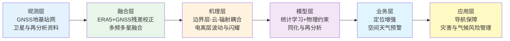
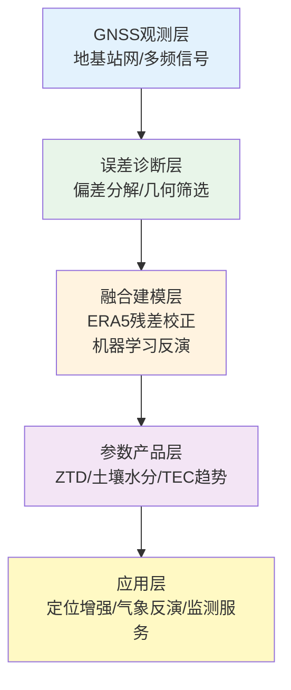
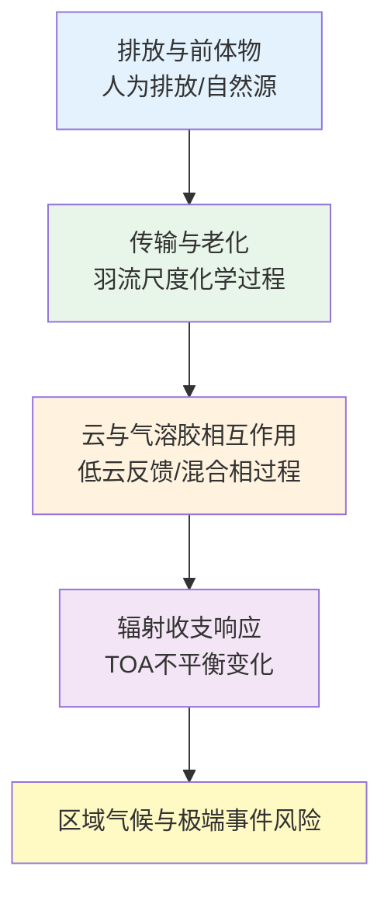
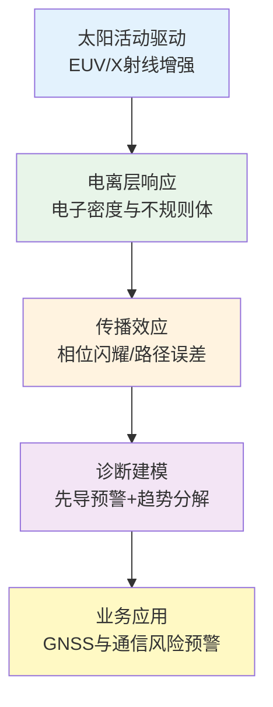
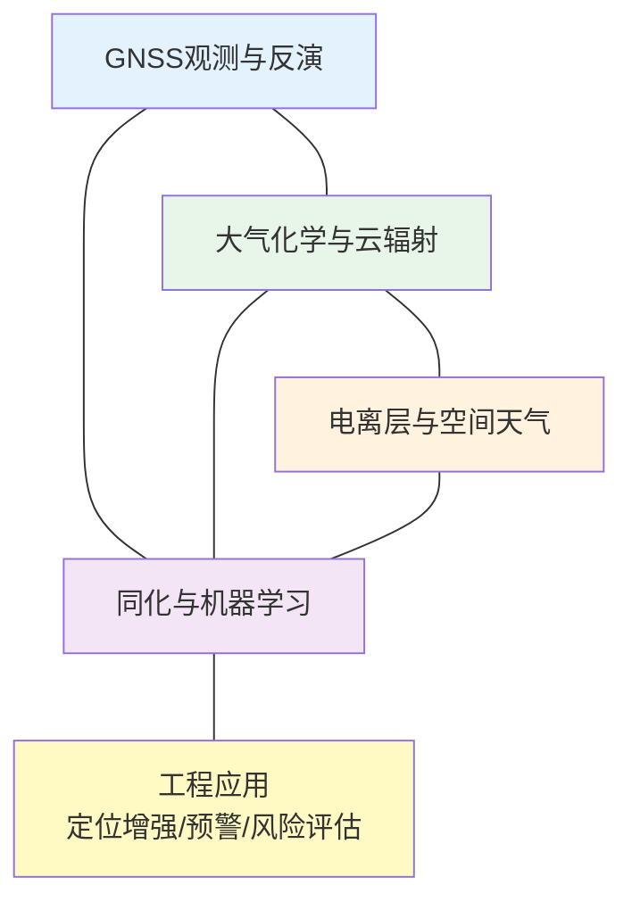
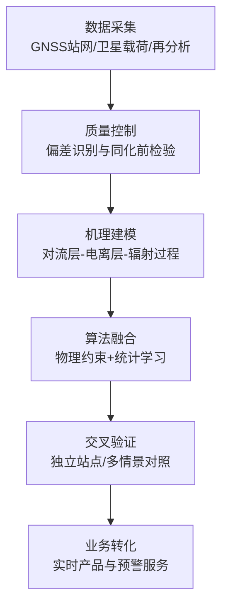

过去一周，GNSS遥感反演、大气过程机理与电离层空间天气研究呈现出同一条主线，即“高分辨率观测—物理约束建模—业务化预警”。GNSS方向的重心集中在对流层延迟与土壤水分反演精度提升，大气方向聚焦气溶胶-云-辐射耦合及观测体系升级，电离层方向强调太阳爆发驱动下的电离层扰动可预报性。结合NOAA空间天气业务说明、IGS实时服务产品框架与WMO温室气体公报，可见该阶段研究已从单点算法改进转向跨系统一致性验证与可部署能力评估。

## 一、本期研究印记图

本期论文集合体现出两个显著特征。第一，数据层的“稀疏站网补偿”已从经验插值升级为再分析场与GNSS观测融合，以降低空间不均匀采样导致的结构性误差。第二，方法层正从“仅追求拟合误差”转向“可解释与可迁移并重”，例如环境因子显式入模、跨纬度电离层长期趋势分解、以及对太阳耀斑先导信号的统计约束。该变化与国际业务系统需求一致，尤其体现在对实时性、鲁棒性与误差边界的同步要求。

## 二、GNSS方向顶刊与特色论文专题画像

本期GNSS方向的研究主要分布在对流层延迟建模、城市复杂环境观测质量控制、GNSS-IR土壤水分反演与电离层长期趋势诊断。`Remote Sensing` 与 `GPS Solutions` 相关论文显示，区域高精度反演正在从“单源观测插值”转向“再分析背景场与地基高精度观测融合”；同时，城市环境中的三维遮挡与多路径问题被前置为可观测性筛选任务，以减少系统误差进入反演链路。土壤水分反演方向则强化了双频融合、环境因子显式入模和自动化参数优化，目标从“提升单站精度”扩展到“跨站点可迁移性与业务稳定性”。

总体上，GNSS方向呈现出从站点级解算向区域化连续场重建、从经验调参向可解释优化、从离线评估向实时产品适配演进的趋势。下表与流程图概括了该方向的代表性技术路线。

**表1 代表性研究的技术路线与特点**

| 研究主题 | 技术路线 | 技术特点 | 重要结论 |
|---|---|---|---|
| ERA5与GNSS融合区域ZTD重建 | ERA5背景场+残差Kriging校正 | 兼顾连续场与站点精度 | 相比原始ERA5显著降误差并提升季节稳定性 |
| 城市GNSS对流层健康区识别 | 三维射线追踪+可观测性筛选 | 将几何遮挡影响前置到质控阶段 | 可提升城市环境下延迟反演可靠性 |
| 多频多星GNSS-IR土壤水分反演 | 熵权双频融合+边际增益选星 | 信息融合与卫星数优化协同 | 卫星数约5至6颗后增益趋缓 |
| Bayesian优化随机森林GNSS-IR | 贝叶斯超参数搜索+随机森林反演 | 降低人工调参与过拟合风险 | 在异质下垫面具备更好迁移性 |
| 全球TEC长期趋势地方时解析 | 多太阳代理回归去驱动+地方时分解 | 长期变化与周期扰动清晰分离 | 全球TEC整体负趋势，正午低纬更强 |

在该框架下，本期GNSS方向的关键共识是，精度提升已不再依赖单一算法改进，而是依赖“观测几何约束 + 多源融合建模 + 外场独立验证”的协同闭环。这一范式为后续GNSS气象服务与环境反演业务化提供了更稳健的技术底座。

### 2.1 专题画像：ERA5与GNSS融合的区域ZTD重建

**（1）技术路线** 研究以GNSS ZTD高精度离散估计为参考场，以ERA5格点ZTD作为连续背景场，先构造两者残差，再用Kriging对残差场建模，最终叠加回ERA5得到修正产品。该方案实质上是“物理背景场 + 统计误差场”的两阶段融合框架。实验在荷兰区域以建模站与独立验证站分离的方式实施，形成严格外检，避免仅在训练样本上评估。

**（2）技术特点** 与单纯GNSS插值相比，该方法通过ERA5提供大尺度连续结构，显著缓解站网稀疏导致的外推失真；与直接使用ERA5相比，又利用站点观测纠正系统偏差。其方法学价值在于将再分析优势与地基实测优势解耦后再耦合，具备跨区域迁移潜力。

**（3）重要结论** 该研究的重要结论是：**融合残差校正后ZTD精度达到毫米量级，RMSE相对原始ERA5显著下降，并在季节与极端天气背景下保持稳定。** 该结论意味着GNSS气象反演可在“有限站网条件”下维持高精度，为区域水汽同化、短临预报与GNSS定位改正提供更稳健的输入场。

### 2.2 专题画像：城市环境下GNSS对流层延迟“健康区”识别

**（1）技术路线** 研究采用三维射线追踪描述城市建筑遮挡、反射和绕射对GNSS信号路径的影响，并据此定义适于对流层参数估计的观测几何条件与空间“健康区”。该流程将城市形态信息显式并入误差传播路径，实现了从站点层经验筛选到三维几何约束筛选的转变。

**（2）技术特点** 方法突破在于把传统“后验残差剔除”前移为“先验可观测性筛选”，减少系统误差进入估计器的机会。对于高层建筑密集区，该策略可显著降低多路径与遮挡诱导偏差，并提升延迟反演参数的稳定性。

**（3）重要结论** 该研究的重要结论是：**城市GNSS对流层延迟估计的误差主导项与局地三维结构强相关，基于射线追踪的健康区筛选可提升参数可解释性与可靠性。** 这对城市气象反演网络布设、站点选址和质量控制流程具有直接工程价值。

### 2.3 专题画像：GNSS-IR土壤水分反演的多频多星增益边界

**（1）技术路线** 研究构建双频相位延迟融合框架，采用熵权策略对不同频段贡献自适应赋权，并通过边际增益准则确定单星座下参与卫星数。随后将NDVI、温度与降水等环境因子嵌入随机森林模型，并与线性模型进行对照验证。

**（2）技术特点** 其核心创新在于“信息融合 + 因子显式化 + 卫星数优化”三位一体。该设计避免了盲目增加卫星数量带来的计算开销与噪声累积，同时把环境扰动从隐式误差项转化为可量化解释变量。

**（3）重要结论** 该研究的重要结论是：**单星座场景下卫星数增益存在明显饱和区，约5至6颗后精度提升趋缓；双频融合和环境因子入模可同步提升精度与稳健性。** 这为低成本地基土壤水分监测系统的配置提供了可操作阈值。

### 2.4 专题画像：Bayesian优化随机森林的GNSS-IR反演框架

**（1）技术路线** 研究以贝叶斯优化自动搜索随机森林超参数，结合GNSS-IR观测特征构建土壤水分反演器，并通过观测—模型闭环评估泛化性能。该方案强调超参数空间的统计探索效率，减少人工调参的不确定性。

**（2）技术特点** 其优势在于将“模型复杂度控制”与“反演精度目标”统一到同一优化过程，兼顾预测性能和过拟合风险。在站点异质性显著的场景中，贝叶斯优化策略通常优于固定经验参数。

**（3）重要结论** 该研究的重要结论是：**自动化超参数优化可提高GNSS-IR土壤水分反演的可迁移性与稳定度，特别适用于不同下垫面条件下的快速部署。** 该结论支持GNSS-IR向区域化业务应用扩展。

### 2.5 专题画像：全球TEC长期趋势及地方时依赖

**（1）技术路线** 研究基于2000至2024年高分辨率GNSS-TEC数据，先用多太阳活动代理量进行两步回归，剥离太阳驱动成分，再按地方时解析长期趋势，形成全天候趋势剖面。

**（2）技术特点** 该工作将“长期变化”与“太阳周期扰动”做了更清晰分离，并首次系统给出地方时维度趋势分布，使低纬正午与夜间差异得到量化。方法上兼顾全球覆盖与地方时细分，适合为电离层气候学研究提供统一基线。

**（3）重要结论** 该研究的重要结论是：**全球TEC在地方时全周期总体呈下降，低纬正午负趋势更强，夜间趋势较弱但仍为负。** 该结果指向热层长期冷却背景下的电离层状态演化，对GNSS误差建模、HF通信与监视系统性能评估均有长期意义。

## 三、大气方向顶刊与特色论文专题画像

本期大气方向的工作集中在污染羽流化学老化、低云调制下的辐射不平衡内部变率、干旱区沙尘排放与辐射强迫耦合，以及南大洋混合相云微物理过程。相关论文共同强调一个方法学变化，即将“排放—传输—云辐射—气候响应”由分段分析改为过程链联评，并通过长时间序列模拟、协同观测和情景试验提高归因稳健性。该方向同时体现出从区域过程研究向全球能量收支约束的延展，尤其关注低云与气溶胶相关不确定度。

总体上，大气方向正在从单变量浓度或通量分析，转向多过程耦合与多尺度一致性验证。下表与流程图概括了本期代表性研究的技术路径。

**表1 代表性研究的技术路线与特点**

| 研究主题 | 技术路线 | 技术特点 | 重要结论 |
|---|---|---|---|
| 韩国排放对对流层O3/CH4影响 | BL-RL-PL-DP三阶段化学输送链 | 显式羽流老化时间敏感性 | 粗分辨率快速扩散会系统高估影响 |
| 低云调制全球辐射不平衡 | 500年耦合模拟+强迫AMIP | 年际和年代际机制分离 | ENSO主导年际，副热带低云主导年代际 |
| 中亚沙尘排放与辐射效应 | MERRA-2+CMIP6+SBDART | 多情景与辐射垂直结构联评 | 排放与政策路径强耦合，辐射加热冷却并存 |
| 南大洋混合相云观测 | 协同机载观测+卫星反演 | 分层/对流云态并行比较 | 云态差异可引起显著顶层反照率变化 |

该流程显示，本期大气研究的共同落点是通过高质量观测与过程约束减少参数化不确定度，并将机理发现转化为可用于模式改进与政策评估的量化证据链。

### 3.1 专题画像：区域排放生命周期对O3与CH4收支的约束

**（1）技术路线** 论文采用边界层-残余层、离岸羽流、背景扩散三阶段框架，按不同老化时间设置诊断净臭氧产生与甲烷损失，构建了“排放—老化—全球化学效应”链条。该设计将传统单阶段化学输送误差源显式拆分。

**（2）技术特点** 方法强调羽流老化时间是关键控制参量，直接关系到对流层氧化能力估计。对分辨率依赖性的量化使该研究具备模式评估意义，尤其适用于解释粗网格模式在O3和CH4响应上的系统偏差。

**（3）重要结论** 该研究的重要结论是：**若忽略合理羽流老化过程而过快扩散，将显著高估人为排放对对流层O3净产生和CH4损失的贡献。** 这对排放控制效益评估和化学气候模式参数化改进具有直接约束作用。

### 3.2 专题画像：低云在全球辐射不平衡内部变率中的作用

**（1）技术路线** 研究利用长时段工业化前耦合模拟与SST约束大气模拟，分析GMTOA与SST相位关系，并分离年际和年代际低云反馈机制，形成“统计相位—动力驱动—辐射响应”的因果链。

**（2）技术特点** 该方案通过超长时间序列提升内部变率统计显著性，避免短观测记录导致机制混叠。其贡献在于将ENSO相关低云异常与副热带低云甲板年代际变率做清晰区分。

**（3）重要结论** 该研究的重要结论是：**全球辐射不平衡的内部变率具有时间尺度依赖，年际尺度主要受ENSO调制，年代际尺度更受副热带低云与外热带随机强迫共同影响。** 该发现可用于改进气候归因与近十年温升波动解释。

### 3.3 专题画像：中亚沙尘排放—沉降—辐射强迫一体化评估

**（1）技术路线** 研究将再分析数据与CMIP6多情景输出耦合，并用辐射传输模型计算清空条件下直接辐射强迫，进而评估不同排放路径下的时空演化。

**（2）技术特点** 其技术亮点在于把排放、沉降、辐射效应放在同一分析框架，给出从源区到受体区的连续诊断，并引入政策情景维度，增强了科学结论对管理决策的可读性。

**（3）重要结论** 该研究的重要结论是：**沙尘排放强度对情景路径高度敏感，且辐射效应在顶层冷却与大气层内加热之间并存。** 该结论提示区域气候评估需同步考虑地表能量收支与边界层热力结构变化。

### 3.4 专题画像：南大洋混合相云云态差异与辐射效应

**（1）技术路线** 研究基于协同机载观测与卫星反演，对锋区冷暖两侧层状与对流混合相云进行并行诊断，结合边界层结构分析解释云微物理差异。

**（2）技术特点** 方法将云态分类、边界层结构和辐射影响联动分析，强化了“过程—信号”对应关系。其对二次成冰过程的讨论为混合相云参数化提供了观测证据。

**（3）重要结论** 该研究的重要结论是：**混合相层状云与对流云的相态与粒子谱差异可导致顶层反照率出现大幅变化，现有再分析对该幅度仍有低估。** 这对南大洋云辐射反馈不确定度收敛具有关键意义。

## 四、电离层方向顶刊与特色论文专题画像

本期电离层方向覆盖“太阳活动先导信号识别—电离层不规则体发育机制—长期背景趋势诊断”三类问题。`Journal of Space Weather and Space Climate` 与 `Geophysical Research Letters` 的研究表明，电离层研究正从事件后解释转向事件前预警与长期变化并行：一方面利用EUV通道提取耀斑X射线临近预报信息，另一方面通过宽经度观测揭示等离子体泡寿命的波状调制机制，并与地方时依赖的TEC长期下降背景形成互补约束。

总体上，电离层方向正在形成“短时扰动预警 + 中尺度结构机理 + 长期气候趋势”一体化研究结构。下表与流程图给出该方向的代表性技术路线。

**表2 代表性研究的技术路线与特点**

| 研究主题 | 技术路线 | 技术特点 | 重要结论 |
|---|---|---|---|
| EUV先导信号用于耀斑临近预报 | GOES/EXIS与XRS联合统计映射 | 业务可获得通道直接接入预警 | EUV多数情况下领先SXR数分钟 |
| 等离子体泡寿命宽经度波状调制 | 多源观测+底侧多尺度波耦合分析 | 统一解释局地触发与区域调制 | 千公里尺度波可调制EPB寿命与高度 |
| TEC长期气候趋势约束 | GNSS全球TEC长序列+地方时分解 | 兼顾全球覆盖与地方时细节 | 低纬白天负趋势更突出 |

在该技术链中，观测、诊断与应用之间的连接更紧密，研究结果可直接服务于GNSS与通信系统的风险评估，并为电离层业务预报模型提供可检验的过程约束。

### 4.1 专题画像：EUV先导信号用于耀斑X射线临近预报

**（1）技术路线** 研究使用GOES/EXIS EUV与XRS SXR联合样本，对M/X级耀斑进行峰值时序、持续时间与强度相关性分析，构建“EUV先导—SXR响应”统计映射。

**（2）技术特点** 该研究把业务可获得的EUV通道转化为预警先导量，且给出不同波段的领先时间和相关系数，具备直接接入业务流程的可执行性。方法强调可解释统计关系而非黑箱分类。

**（3）重要结论** 该研究的重要结论是：**多数事件中EUV峰值先于SXR，领先时间可达数分钟，He II通道对持续时间和强度具有更强指示能力。** 该结果可用于优化短时空间天气预警窗口，降低GNSS与通信系统突发风险。

### 4.2 专题画像：宽经度等离子体泡寿命的千公里波状调制

**（1）技术路线** 研究通过多源观测识别赤道等离子体泡在宽经度上的寿命起伏，结合底侧电离层多尺度波结构，分析种子扰动与PRE调制的耦合机制。

**（2）技术特点** 贡献在于把百公里尺度与千公里尺度波结构放入统一解释框架，说明“局地触发”与“区域调制”并存。该机制解释了同类时段不同经度电离层闪耀强度差异。

**（3）重要结论** 该研究的重要结论是：**千公里尺度波结构可通过调制PRE影响等离子体泡发育高度与寿命，从而形成宽经度波状起伏形态。** 这为低纬电离层不规则体预报与跨经度GNSS性能评估提供了新约束。

## 五、交叉学科网络图与创新链流程图

## 六、近期研究特色变化与未来发展趋势

近期文献显示，GNSS、大气与电离层研究正在形成“多圈层一致性”的方法范式。GNSS不再局限于导航定位，而是向水汽场、土壤水分和电离层气候学延展；大气研究从平均态统计走向过程链可解释诊断；电离层研究则把太阳活动先导信息和传播扰动风险耦合进可预报框架。未来阶段的关键增量将来自以下几个维度。

第一，实时化。IGS实时轨道钟差、偏差与VTEC产品的持续完善，将推动对流层与电离层联合改正从离线评估迈向在线服务。第二，统一误差学。GNSS反演误差、再分析偏差与空间天气扰动需在同一误差传播框架下表达，形成可比较的不确定度指标。第三，跨域验证。面向极端天气和强空间天气事件，研究将更多采用“观测—模式—业务”闭环检验，从而把论文指标转化为系统级可用性指标。

从应用前景看，导航定位增强、灾害预警和气候风险管理将成为最直接受益场景。随着大模型与物理模型协同成熟，研究重点将由“单指标最优”转向“多目标稳健最优”，即同时满足精度、时效、可解释性和资源成本约束。

## 参考文献

1. Cai, Y., Ma, H., Wang, Z., et al. (2026). Fusion-Based Regional ZTD Modeling Using ERA5 and GNSS via Residual Correction Kriging. *Remote Sensing*, 18(6), 963. https://doi.org/10.3390/rs18060963
2. Mehdi, S., Wareyka-Glaner, M. F., Zhang, G., & Rohm, W. (2026). Identifying healthy urban zones for GNSS-based tropospheric delay estimation using 3D ray-tracing. *GPS Solutions*. https://doi.org/10.1007/s10291-026-02065-1
3. Nie, S., Jia, Y., Li, P., Wu, X., & Tang, Y. (2026). Soil Moisture Retrieval Using Multi-Satellite Dual-Frequency GNSS-IR Considering Environmental Factors. *Remote Sensing*, 18(6), 917. https://doi.org/10.3390/rs18060917
4. He, K., Deng, X., Zheng, N., et al. (2026). A GNSS-IR soil moisture retrieval framework using Bayesian-optimized random forest algorithm. *International Journal of Digital Earth*. https://doi.org/10.1080/17538947.2026.2646380
5. Zossi, B. S., Medina, F. D., Duran, T., Zamora, D. J., & Elias, A. G. (2026). Global Long-Term Trends in Ionospheric TEC From GNSS Observations With Local-Time Dependence. *Geophysical Research Letters*. https://doi.org/10.1029/2026GL121731
6. Wilson, C. P., & Prather, M. J. (2026). Life-cycle impacts of South Korean air pollution on tropospheric ozone and methane: sensitivity to dispersion time. *Atmospheric Chemistry and Physics*, 26, 3995-4017. https://doi.org/10.5194/acp-26-3995-2026
7. Miyamoto, A., Xie, S.-P., & Deser, C. (2026). Unforced interannual to decadal variability of global radiation imbalance: Role of low clouds. *Journal of Climate*. https://doi.org/10.1175/JCLI-D-25-0320.1
8. Gan, Y., Zhang, Z., Chu, W., Ding, J., & Ren, Y. (2026). Assessment and prediction of dust emissions, deposition and radiation forcing in Central Asia. *Atmospheric Chemistry and Physics*, 26, 3881-3906. https://doi.org/10.5194/acp-26-3881-2026
9. Ding, S., Liu, J.-W., McFarquhar, G. M., & Gao, S. (2026). Observations of Mixed-Phase Stratiform and Convective Cloud Regimes Over the Southern Ocean. *Journal of Geophysical Research: Atmospheres*. https://doi.org/10.1029/2025JD043931
10. Mthethwa, A., & Snow, M. (2026). Using solar ultraviolet irradiance measurements from GOES/EXIS to nowcast flare X-ray properties. *Journal of Space Weather and Space Climate*, 16, 12. https://doi.org/10.1051/swsc/2026010
11. Sun, W., Otsuka, Y., Li, G., et al. (2026). Thousand-Kilometer-Scale Wavelike Undulations in Ionospheric Plasma Bubble Lifetime and Development Over Wide Longitudes. *Geophysical Research Letters*. https://doi.org/10.1029/2025GL121459
12. World Meteorological Organization. (2025). *WMO Greenhouse Gas Bulletin No. 21*. https://public.wmo.int/resources/publication-series/greenhouse-gas-bulletin/wmo-greenhouse-gas-bulletin-no-21
13. International GNSS Service. (2026). *Products; Real-Time Service (RTS) Products*. https://igs.org/products ; https://igs.org/rts/products
14. NOAA Space Weather Prediction Center. (2026). *Space Weather and GPS Systems*. https://www.swpc.noaa.gov./impacts/space-weather-and-gps-systems
15. ESA Earth Online. (2022). *Ionospheric Plasma IRregularities (IPIR) based on Swarm data*. https://earth.esa.int/eogateway/activities/ipir
