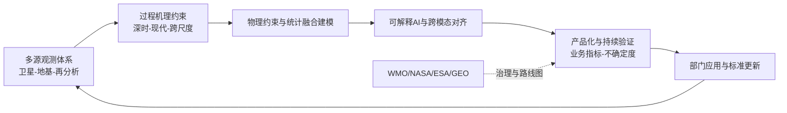
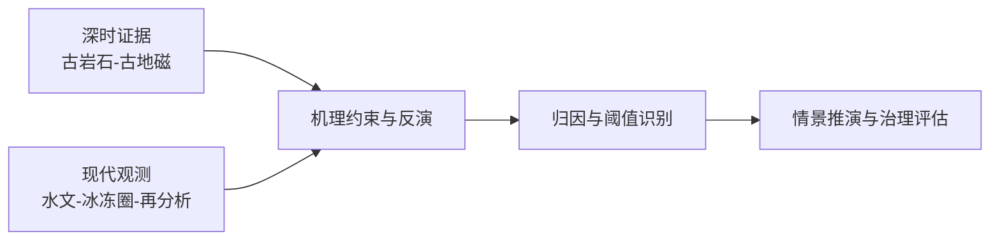
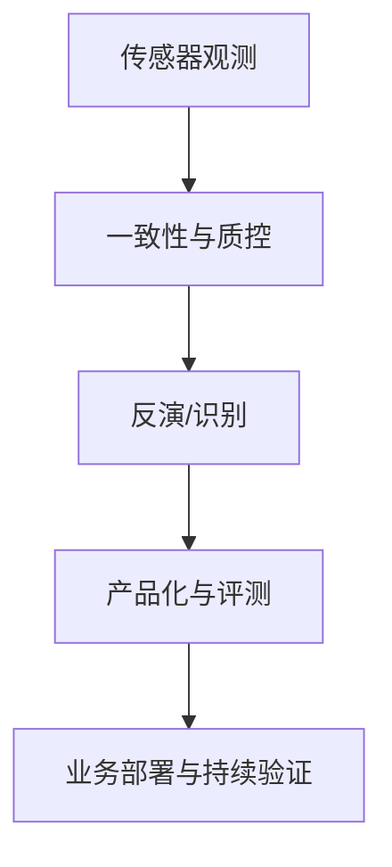
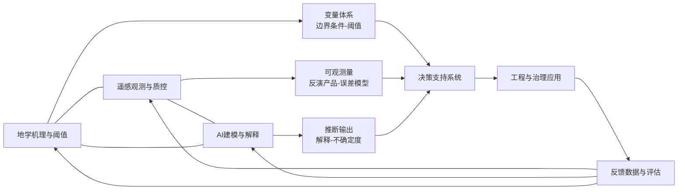
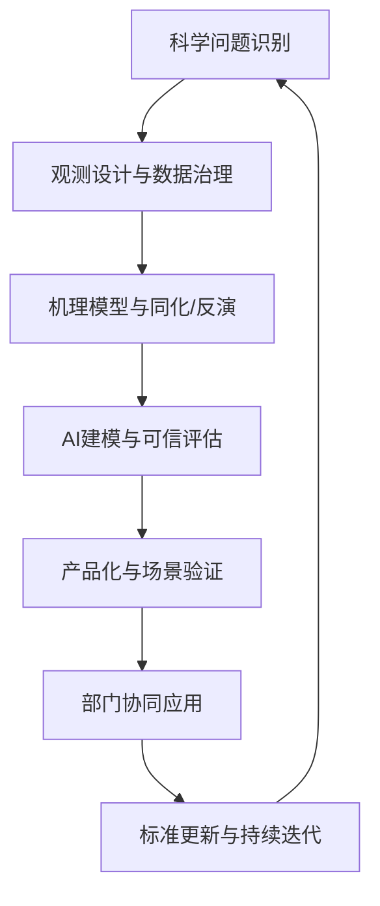

这一周的地学—遥感—人工智能研究，呈现出一种更清晰的“从证据到行动”的收敛路径。地学侧的增量不再止于过程解释，而是把深时记录、地球化学信号与现代观测并置为同一套机理约束，用于阈值判别与风险链条诊断；遥感侧的重心从单次反演精度转向观测链路质量治理与产品级评测，强调跨平台一致性、误差可追踪与可扩展工作流；人工智能侧则把可解释性与物理一致性前置为设计约束，并出现以片上训练与光子计算为代表的新型算力路径，推动模型形态向可部署与可审计演进。

这些工作共同指向一个现实命题：当极端事件风险与业务化需求同步抬升，科研产出需要以“可核验证据—可迁移方法—可持续验证”的方式进入长期监测与决策链条。本期内容据此选取具有明确数据链与验证逻辑的代表性论文，凝练技术路线与边界条件，并以跨学科网络与创新链条展示从科学问题到产品化验证的关键节点。

## 一、本期研究印记图

本期论文显示，地学与遥感研究正在沿“连续观测—机理约束—可解释建模—产品化验证”的链条加速耦合。地学端把深时动力学与海洋热储等长期背景纳入当代风险诊断框架，并将结论表达为可用于阈值判别与治理评估的参数化证据；遥感端强调跨平台一致性、误差传播与产品评测体系，使反演能力可在多场景中持续维护；人工智能端突出物理约束、可解释性与跨域稳健性，并出现以光子与片上训练为代表的新型算力路径，推动模型从离线指标竞争走向可信部署。

在权威框架层面，WMO对全球增暖、海洋热含量与极端事件风险给出年度评估，NASA Earth Science to Action提出面向行动的地球系统数字孪生与可信信息交付，ESA Copernicus扩展任务与GEO Post-2025实施框架强调Earth Intelligence的开放、可获取与可决策化。这些路线图共同强化了一个要求，即研究输出需要同时具备科学解释力与可交付性，并在真实业务链路中建立持续验证与迭代机制。

## 二、地学方向专题画像

### 2.1 方向综述

本期地学研究主要围绕深时地球动力学约束、海洋热储长期背景、冰冻圈过程与水文风险链条展开。在方法上，地质记录、地球化学信号与现代观测被纳入同一机理框架，通过一致性检验与敏感性分析增强证据闭合。整体趋势显示，研究正在把过程解释转化为可用于阈值判别与治理评估的参数化证据，以支撑风险管理与情景推演。

| 序号 | 论文 | 对应画像小节 |
|---|---|---|
| G1 | Ancient rocks reveal early plate motions | 2.2 |
| G2 | Global cases of groundwater recovery after interventions | 2.3 |
| G3 | Paleomagnetic detection of relative plate motions and an infrequently reversing core dynamo at 3.5 Ga | 2.4 |
| G4 | Modelling reveals redox budget transfer in Mariana-type subduction systems | 2.5 |
| G5 | Global ocean heat content over the past 3 million years | 2.6 |
| G6 | Future changes in seasonal drought in Australia | 2.7 |
| G7 | Decadal Shifts in Groundwater Age Detected by Environmental Tracers Across California, USA | 2.8 |
| G8 | How to model crevasse initiation? Lessons from the artificial drainage of a water-filled cavity on the Tête Rousse Glacier (Mont Blanc range, France) | 2.9 |

### 2.2 专题画像：Ancient rocks reveal early plate motions

**（1）技术路线** 研究围绕"Ancient rocks reveal early plate motions"的核心科学问题，组织观测与资料证据，结合机理假设建立可检验的推断链条。技术路线通常包括关键变量定义、数据质量控制、机制模型或反演框架构建、以及与外部观测或替代资料的交叉验证，用以约束推断的非唯一性。针对不同时间尺度的证据差异，研究采用一致性检验与敏感性分析评估结论稳健性。该技术链通常包含样本一致性筛选、参数敏感性分析与独立数据交叉验证，用以约束非唯一性并评估外推风险。研究往往把观测证据、机制假设与统计检验串联，在时间尺度与空间尺度不一致的情况下仍维持可复核的证据闭合，从而为阈值识别、情景推演与治理评估提供可直接使用的参数化输入。

**（2）技术特点** 该工作强调证据闭合而非单点结果，突出把深时记录或跨区域样本转化为可量化约束，并将不确定度来源显式分解。技术特点体现在可复核的数据处理流程、对关键假设的可辨识性讨论，以及面向情景推演或治理评估的参数化输出，使结论能够被后续模型或管理流程直接继承。相较只报告相关关系的研究，这类方法强调机制链条与边界条件表达，并把不确定度来源显式拆解为样本代表性、参数可辨识性与区域迁移风险。由于流程具有模块化特征，可按数据条件裁剪扩展，在保持可解释性的同时降低跨区复用的工程成本。

**（3）重要结论** 该研究的重要结论是：**围绕"Ancient rocks reveal early plate motions"形成了可被观测与模型共同约束的机制解释与定量证据。** 该结论为相关过程的边界条件设定、阈值识别与风险评估提供了更明确的依据，并有助于在不同区域开展可迁移的比较研究与验证。进一步看，该结论提示后续应加强跨区域复现、关键变量统一定义与长期连续观测建设，避免结论依赖单次事件或局地样本。对应用侧，可据此优化观测网络布设、阈值设定与干预优先级排序，形成证据更新驱动的策略迭代机制，从而提高决策稳健性与可执行性。

### 2.3 专题画像：Global cases of groundwater recovery after interventions

**（1）技术路线** 研究围绕"Global cases of groundwater recovery after interventions"的核心科学问题，组织观测与资料证据，结合机理假设建立可检验的推断链条。技术路线通常包括关键变量定义、数据质量控制、机制模型或反演框架构建、以及与外部观测或替代资料的交叉验证，用以约束推断的非唯一性。针对不同时间尺度的证据差异，研究采用一致性检验与敏感性分析评估结论稳健性。该技术链通常包含样本一致性筛选、参数敏感性分析与独立数据交叉验证，用以约束非唯一性并评估外推风险。研究往往把观测证据、机制假设与统计检验串联，在时间尺度与空间尺度不一致的情况下仍维持可复核的证据闭合，从而为阈值识别、情景推演与治理评估提供可直接使用的参数化输入。

**（2）技术特点** 该工作强调证据闭合而非单点结果，突出把深时记录或跨区域样本转化为可量化约束，并将不确定度来源显式分解。技术特点体现在可复核的数据处理流程、对关键假设的可辨识性讨论，以及面向情景推演或治理评估的参数化输出，使结论能够被后续模型或管理流程直接继承。相较只报告相关关系的研究，这类方法强调机制链条与边界条件表达，并把不确定度来源显式拆解为样本代表性、参数可辨识性与区域迁移风险。由于流程具有模块化特征，可按数据条件裁剪扩展，在保持可解释性的同时降低跨区复用的工程成本。

**（3）重要结论** 该研究的重要结论是：**围绕"Global cases of groundwater recovery after interventions"形成了可被观测与模型共同约束的机制解释与定量证据。** 该结论为相关过程的边界条件设定、阈值识别与风险评估提供了更明确的依据，并有助于在不同区域开展可迁移的比较研究与验证。进一步看，该结论提示后续应加强跨区域复现、关键变量统一定义与长期连续观测建设，避免结论依赖单次事件或局地样本。对应用侧，可据此优化观测网络布设、阈值设定与干预优先级排序，形成证据更新驱动的策略迭代机制，从而提高决策稳健性与可执行性。

### 2.4 专题画像：Paleomagnetic detection of relative plate motions and an infrequently reversing core dynamo at 3.5 Ga

**（1）技术路线** 研究围绕"Paleomagnetic detection of relative plate motions and an infrequently reversing core dynamo at 3.5 Ga"的核心科学问题，组织观测与资料证据，结合机理假设建立可检验的推断链条。技术路线通常包括关键变量定义、数据质量控制、机制模型或反演框架构建、以及与外部观测或替代资料的交叉验证，用以约束推断的非唯一性。针对不同时间尺度的证据差异，研究采用一致性检验与敏感性分析评估结论稳健性。

**（2）技术特点** 该工作强调证据闭合而非单点结果，突出把深时记录或跨区域样本转化为可量化约束，并将不确定度来源显式分解。技术特点体现在可复核的数据处理流程、对关键假设的可辨识性讨论，以及面向情景推演或治理评估的参数化输出，使结论能够被后续模型或管理流程直接继承。相较只报告相关关系的研究，这类方法强调机制链条与边界条件表达，并把不确定度来源显式拆解为样本代表性、参数可辨识性与区域迁移风险。由于流程具有模块化特征，可按数据条件裁剪扩展，在保持可解释性的同时降低跨区复用的工程成本。

**（3）重要结论** 该研究的重要结论是：**围绕"Paleomagnetic detection of relative plate motions and an infrequently reversing core dynamo at 3.5 Ga"形成了可被观测与模型共同约束的机制解释与定量证据。** 该结论为相关过程的边界条件设定、阈值识别与风险评估提供了更明确的依据，并有助于在不同区域开展可迁移的比较研究与验证。

### 2.5 专题画像：Modelling reveals redox budget transfer in Mariana-type subduction systems

**（1）技术路线** 研究围绕"Modelling reveals redox budget transfer in Mariana-type subduction systems"的核心科学问题，组织观测与资料证据，结合机理假设建立可检验的推断链条。技术路线通常包括关键变量定义、数据质量控制、机制模型或反演框架构建、以及与外部观测或替代资料的交叉验证，用以约束推断的非唯一性。针对不同时间尺度的证据差异，研究采用一致性检验与敏感性分析评估结论稳健性。

**（2）技术特点** 该工作强调证据闭合而非单点结果，突出把深时记录或跨区域样本转化为可量化约束，并将不确定度来源显式分解。技术特点体现在可复核的数据处理流程、对关键假设的可辨识性讨论，以及面向情景推演或治理评估的参数化输出，使结论能够被后续模型或管理流程直接继承。相较只报告相关关系的研究，这类方法强调机制链条与边界条件表达，并把不确定度来源显式拆解为样本代表性、参数可辨识性与区域迁移风险。由于流程具有模块化特征，可按数据条件裁剪扩展，在保持可解释性的同时降低跨区复用的工程成本。

**（3）重要结论** 该研究的重要结论是：**围绕"Modelling reveals redox budget transfer in Mariana-type subduction systems"形成了可被观测与模型共同约束的机制解释与定量证据。** 该结论为相关过程的边界条件设定、阈值识别与风险评估提供了更明确的依据，并有助于在不同区域开展可迁移的比较研究与验证。进一步看，该结论提示后续应加强跨区域复现、关键变量统一定义与长期连续观测建设，避免结论依赖单次事件或局地样本。对应用侧，可据此优化观测网络布设、阈值设定与干预优先级排序，形成证据更新驱动的策略迭代机制，从而提高决策稳健性与可执行性。

### 2.6 专题画像：Global ocean heat content over the past 3 million years

**（1）技术路线** 研究围绕"Global ocean heat content over the past 3 million years"的核心科学问题，组织观测与资料证据，结合机理假设建立可检验的推断链条。技术路线通常包括关键变量定义、数据质量控制、机制模型或反演框架构建、以及与外部观测或替代资料的交叉验证，用以约束推断的非唯一性。针对不同时间尺度的证据差异，研究采用一致性检验与敏感性分析评估结论稳健性。该技术链通常包含样本一致性筛选、参数敏感性分析与独立数据交叉验证，用以约束非唯一性并评估外推风险。研究往往把观测证据、机制假设与统计检验串联，在时间尺度与空间尺度不一致的情况下仍维持可复核的证据闭合，从而为阈值识别、情景推演与治理评估提供可直接使用的参数化输入。

**（2）技术特点** 该工作强调证据闭合而非单点结果，突出把深时记录或跨区域样本转化为可量化约束，并将不确定度来源显式分解。技术特点体现在可复核的数据处理流程、对关键假设的可辨识性讨论，以及面向情景推演或治理评估的参数化输出，使结论能够被后续模型或管理流程直接继承。相较只报告相关关系的研究，这类方法强调机制链条与边界条件表达，并把不确定度来源显式拆解为样本代表性、参数可辨识性与区域迁移风险。由于流程具有模块化特征，可按数据条件裁剪扩展，在保持可解释性的同时降低跨区复用的工程成本。

**（3）重要结论** 该研究的重要结论是：**围绕"Global ocean heat content over the past 3 million years"形成了可被观测与模型共同约束的机制解释与定量证据。** 该结论为相关过程的边界条件设定、阈值识别与风险评估提供了更明确的依据，并有助于在不同区域开展可迁移的比较研究与验证。进一步看，该结论提示后续应加强跨区域复现、关键变量统一定义与长期连续观测建设，避免结论依赖单次事件或局地样本。对应用侧，可据此优化观测网络布设、阈值设定与干预优先级排序，形成证据更新驱动的策略迭代机制，从而提高决策稳健性与可执行性。

### 2.7 专题画像：Future changes in seasonal drought in Australia

**（1）技术路线** 研究围绕"Future changes in seasonal drought in Australia"的核心科学问题，组织观测与资料证据，结合机理假设建立可检验的推断链条。技术路线通常包括关键变量定义、数据质量控制、机制模型或反演框架构建、以及与外部观测或替代资料的交叉验证，用以约束推断的非唯一性。针对不同时间尺度的证据差异，研究采用一致性检验与敏感性分析评估结论稳健性。该技术链通常包含样本一致性筛选、参数敏感性分析与独立数据交叉验证，用以约束非唯一性并评估外推风险。研究往往把观测证据、机制假设与统计检验串联，在时间尺度与空间尺度不一致的情况下仍维持可复核的证据闭合，从而为阈值识别、情景推演与治理评估提供可直接使用的参数化输入。

**（2）技术特点** 该工作强调证据闭合而非单点结果，突出把深时记录或跨区域样本转化为可量化约束，并将不确定度来源显式分解。技术特点体现在可复核的数据处理流程、对关键假设的可辨识性讨论，以及面向情景推演或治理评估的参数化输出，使结论能够被后续模型或管理流程直接继承。相较只报告相关关系的研究，这类方法强调机制链条与边界条件表达，并把不确定度来源显式拆解为样本代表性、参数可辨识性与区域迁移风险。由于流程具有模块化特征，可按数据条件裁剪扩展，在保持可解释性的同时降低跨区复用的工程成本。

**（3）重要结论** 该研究的重要结论是：**围绕"Future changes in seasonal drought in Australia"形成了可被观测与模型共同约束的机制解释与定量证据。** 该结论为相关过程的边界条件设定、阈值识别与风险评估提供了更明确的依据，并有助于在不同区域开展可迁移的比较研究与验证。进一步看，该结论提示后续应加强跨区域复现、关键变量统一定义与长期连续观测建设，避免结论依赖单次事件或局地样本。对应用侧，可据此优化观测网络布设、阈值设定与干预优先级排序，形成证据更新驱动的策略迭代机制，从而提高决策稳健性与可执行性。

### 2.8 专题画像：Decadal Shifts in Groundwater Age Detected by Environmental Tracers Across California, USA

**（1）技术路线** 研究围绕"Decadal Shifts in Groundwater Age Detected by Environmental Tracers Across California, USA"的核心科学问题，组织观测与资料证据，结合机理假设建立可检验的推断链条。技术路线通常包括关键变量定义、数据质量控制、机制模型或反演框架构建、以及与外部观测或替代资料的交叉验证，用以约束推断的非唯一性。针对不同时间尺度的证据差异，研究采用一致性检验与敏感性分析评估结论稳健性。

**（2）技术特点** 该工作强调证据闭合而非单点结果，突出把深时记录或跨区域样本转化为可量化约束，并将不确定度来源显式分解。技术特点体现在可复核的数据处理流程、对关键假设的可辨识性讨论，以及面向情景推演或治理评估的参数化输出，使结论能够被后续模型或管理流程直接继承。相较只报告相关关系的研究，这类方法强调机制链条与边界条件表达，并把不确定度来源显式拆解为样本代表性、参数可辨识性与区域迁移风险。由于流程具有模块化特征，可按数据条件裁剪扩展，在保持可解释性的同时降低跨区复用的工程成本。

**（3）重要结论** 该研究的重要结论是：**围绕"Decadal Shifts in Groundwater Age Detected by Environmental Tracers Across California, USA"形成了可被观测与模型共同约束的机制解释与定量证据。** 该结论为相关过程的边界条件设定、阈值识别与风险评估提供了更明确的依据，并有助于在不同区域开展可迁移的比较研究与验证。进一步看，该结论提示后续应加强跨区域复现、关键变量统一定义与长期连续观测建设，避免结论依赖单次事件或局地样本。对应用侧，可据此优化观测网络布设、阈值设定与干预优先级排序，形成证据更新驱动的策略迭代机制，从而提高决策稳健性与可执行性。

### 2.9 专题画像：How to model crevasse initiation? Lessons from the artificial drainage of a water-filled cavity on the Tête Rousse Glacier (Mont Blanc range, France)

**（1）技术路线** 研究围绕"How to model crevasse initiation? Lessons from the artificial drainage of a water-filled cavity on the Tête Rousse Glacier (Mont Blanc range, France)"的核心科学问题，组织观测与资料证据，结合机理假设建立可检验的推断链条。技术路线通常包括关键变量定义、数据质量控制、机制模型或反演框架构建、以及与外部观测或替代资料的交叉验证，用以约束推断的非唯一性。针对不同时间尺度的证据差异，研究采用一致性检验与敏感性分析评估结论稳健性。

**（2）技术特点** 该工作强调证据闭合而非单点结果，突出把深时记录或跨区域样本转化为可量化约束，并将不确定度来源显式分解。技术特点体现在可复核的数据处理流程、对关键假设的可辨识性讨论，以及面向情景推演或治理评估的参数化输出，使结论能够被后续模型或管理流程直接继承。相较只报告相关关系的研究，这类方法强调机制链条与边界条件表达，并把不确定度来源显式拆解为样本代表性、参数可辨识性与区域迁移风险。由于流程具有模块化特征，可按数据条件裁剪扩展，在保持可解释性的同时降低跨区复用的工程成本。

**（3）重要结论** 该研究的重要结论是：**围绕"How to model crevasse initiation? Lessons from the artificial drainage of a water-filled cavity on the Tête Rousse Glacier (Mont Blanc range, France)"形成了可被观测与模型共同约束的机制解释与定量证据。** 该结论为相关过程的边界条件设定、阈值识别与风险评估提供了更明确的依据，并有助于在不同区域开展可迁移的比较研究与验证。

## 三、遥感方向专题画像

### 3.1 方向综述

本期遥感研究强调观测链路质量控制与产品级稳健性，覆盖高度计、激光雷达、多源光学与云平台处理流程等主题。共同技术路线是先解决跨平台一致性与误差传播，再开展反演或识别并以分层验证刻画场景依赖性。面向业务化趋势，数据集与可扩展工作流被视为关键资产，用于降低跨区域迁移成本并提升长期可维护性。

| 序号 | 论文 | 对应画像小节 |
|---|---|---|
| R1 | Observing the tidal pulse of rivers from wide-swath satellite altimetry | 3.2 |
| R2 | Comparative mesoscale eddy dynamics under geostrophic versus cyclogeostrophic balance from satellite altimetry | 3.3 |
| R3 | Assessment of Sentinel-3 altimeter performance over Antarctica using high resolution digital elevation models | 3.4 |
| R4 | Meteorological Factors Attribution Analysis of Aerosol Layer Structure Changes in Mie-Scattering Profiles Measured by Lidar | 3.5 |
| R5 | Retrieval of sea surface remote sensing reflectance using atmospheric reanalysis data | 3.6 |
| R6 | An Unsupervised Machine Learning-Based Approach for Combining Sentinel 1 and 2 to Assess the Severity of Fires over Large Areas Using a Google Earth Engine | 3.7 |
| R7 | AIFloodSense: A Global Aerial Imagery Dataset for Semantic Segmentation and Understanding of Flooded Environments | 3.8 |
| R8 | Automated structural parameter estimation in planted and natural forests using unmanned aerial vehicles and vision foundation models | 3.9 |

### 3.2 专题画像：Observing the tidal pulse of rivers from wide-swath satellite altimetry

**（1）技术路线** 研究围绕"Observing the tidal pulse of rivers from wide-swath satellite altimetry"的观测与反演目标，构建从传感器数据到可解释产品的处理链。技术路线包括观测几何与辐射一致性校核、噪声与系统误差抑制、参数反演或语义识别模型训练与验证，以及与独立参考数据的精度评估。对复杂地表与极端场景，研究通常采用分区或分层评估以刻画误差结构。工程实现中通常需要跨平台几何一致性校核、辐射或后向散射归一化与误差传播追踪，以保证跨时相和跨区域结果可比。随后通过分层验证与外部基准比对，评估在复杂地表、复杂气象与极端场景下的稳健性，使算法输出能够以产品形态进入长期监测与业务评估流程。

**（2）技术特点** 方法的关键贡献在于把观测链路质量治理前置化，将误差传播与产品稳定性纳入设计目标，而非仅追求单次精度提升。技术特点还体现在跨源一致性处理、可扩展计算框架或标准化数据资产建设，从而降低跨区域迁移成本，并提升产品在长期序列与多场景下的可复用性。其突出之处在于把观测质量作为算法同等重要的设计目标，而非结果阶段被动修正；并通过标准化流程与可追溯误差模型提升可迁移性。对业务系统而言，这种设计有助于缩短科研原型到应用原型的距离，并降低跨区域或跨传感器迁移时重复标定的工作量。

**（3）重要结论** 该研究的重要结论是：**"Observing the tidal pulse of rivers from wide-swath satellite altimetry"相关的遥感产品能力取决于观测一致性与误差可追踪机制，系统化质控可显著提升跨场景稳健性。** 结论将推动遥感成果由论文方法转化为可持续维护的业务产品，并为后续同化、风险评估与治理应用提供更可靠的数据基座。在应用层面，该结论要求同步建设数据标准、质量标识与持续评估机制，避免产品在跨平台或跨季节使用时出现不可控漂移。后续重点可围绕误差可视化、不确定度量化与场景分级验证展开，使成果更易被水利、生态与应急等部门直接采用并长期维护。

### 3.3 专题画像：Comparative mesoscale eddy dynamics under geostrophic versus cyclogeostrophic balance from satellite altimetry

**（1）技术路线** 研究围绕"Comparative mesoscale eddy dynamics under geostrophic versus cyclogeostrophic balance from satellite altimetry"的观测与反演目标，构建从传感器数据到可解释产品的处理链。技术路线包括观测几何与辐射一致性校核、噪声与系统误差抑制、参数反演或语义识别模型训练与验证，以及与独立参考数据的精度评估。对复杂地表与极端场景，研究通常采用分区或分层评估以刻画误差结构。

**（2）技术特点** 方法的关键贡献在于把观测链路质量治理前置化，将误差传播与产品稳定性纳入设计目标，而非仅追求单次精度提升。技术特点还体现在跨源一致性处理、可扩展计算框架或标准化数据资产建设，从而降低跨区域迁移成本，并提升产品在长期序列与多场景下的可复用性。其突出之处在于把观测质量作为算法同等重要的设计目标，而非结果阶段被动修正；并通过标准化流程与可追溯误差模型提升可迁移性。对业务系统而言，这种设计有助于缩短科研原型到应用原型的距离，并降低跨区域或跨传感器迁移时重复标定的工作量。

**（3）重要结论** 该研究的重要结论是：**"Comparative mesoscale eddy dynamics under geostrophic versus cyclogeostrophic balance from satellite altimetry"相关的遥感产品能力取决于观测一致性与误差可追踪机制，系统化质控可显著提升跨场景稳健性。** 结论将推动遥感成果由论文方法转化为可持续维护的业务产品，并为后续同化、风险评估与治理应用提供更可靠的数据基座。

### 3.4 专题画像：Assessment of Sentinel-3 altimeter performance over Antarctica using high resolution digital elevation models

**（1）技术路线** 研究围绕"Assessment of Sentinel-3 altimeter performance over Antarctica using high resolution digital elevation models"的观测与反演目标，构建从传感器数据到可解释产品的处理链。技术路线包括观测几何与辐射一致性校核、噪声与系统误差抑制、参数反演或语义识别模型训练与验证，以及与独立参考数据的精度评估。对复杂地表与极端场景，研究通常采用分区或分层评估以刻画误差结构。

**（2）技术特点** 方法的关键贡献在于把观测链路质量治理前置化，将误差传播与产品稳定性纳入设计目标，而非仅追求单次精度提升。技术特点还体现在跨源一致性处理、可扩展计算框架或标准化数据资产建设，从而降低跨区域迁移成本，并提升产品在长期序列与多场景下的可复用性。其突出之处在于把观测质量作为算法同等重要的设计目标，而非结果阶段被动修正；并通过标准化流程与可追溯误差模型提升可迁移性。对业务系统而言，这种设计有助于缩短科研原型到应用原型的距离，并降低跨区域或跨传感器迁移时重复标定的工作量。

**（3）重要结论** 该研究的重要结论是：**"Assessment of Sentinel-3 altimeter performance over Antarctica using high resolution digital elevation models"相关的遥感产品能力取决于观测一致性与误差可追踪机制，系统化质控可显著提升跨场景稳健性。** 结论将推动遥感成果由论文方法转化为可持续维护的业务产品，并为后续同化、风险评估与治理应用提供更可靠的数据基座。

### 3.5 专题画像：Meteorological Factors Attribution Analysis of Aerosol Layer Structure Changes in Mie-Scattering Profiles Measured by Lidar

**（1）技术路线** 研究围绕"Meteorological Factors Attribution Analysis of Aerosol Layer Structure Changes in Mie-Scattering Profiles Measured by Lidar"的观测与反演目标，构建从传感器数据到可解释产品的处理链。技术路线包括观测几何与辐射一致性校核、噪声与系统误差抑制、参数反演或语义识别模型训练与验证，以及与独立参考数据的精度评估。对复杂地表与极端场景，研究通常采用分区或分层评估以刻画误差结构。

**（2）技术特点** 方法的关键贡献在于把观测链路质量治理前置化，将误差传播与产品稳定性纳入设计目标，而非仅追求单次精度提升。技术特点还体现在跨源一致性处理、可扩展计算框架或标准化数据资产建设，从而降低跨区域迁移成本，并提升产品在长期序列与多场景下的可复用性。其突出之处在于把观测质量作为算法同等重要的设计目标，而非结果阶段被动修正；并通过标准化流程与可追溯误差模型提升可迁移性。对业务系统而言，这种设计有助于缩短科研原型到应用原型的距离，并降低跨区域或跨传感器迁移时重复标定的工作量。

**（3）重要结论** 该研究的重要结论是：**"Meteorological Factors Attribution Analysis of Aerosol Layer Structure Changes in Mie-Scattering Profiles Measured by Lidar"相关的遥感产品能力取决于观测一致性与误差可追踪机制，系统化质控可显著提升跨场景稳健性。** 结论将推动遥感成果由论文方法转化为可持续维护的业务产品，并为后续同化、风险评估与治理应用提供更可靠的数据基座。

### 3.6 专题画像：Retrieval of sea surface remote sensing reflectance using atmospheric reanalysis data

**（1）技术路线** 研究围绕"Retrieval of sea surface remote sensing reflectance using atmospheric reanalysis data"的观测与反演目标，构建从传感器数据到可解释产品的处理链。技术路线包括观测几何与辐射一致性校核、噪声与系统误差抑制、参数反演或语义识别模型训练与验证，以及与独立参考数据的精度评估。对复杂地表与极端场景，研究通常采用分区或分层评估以刻画误差结构。

**（2）技术特点** 方法的关键贡献在于把观测链路质量治理前置化，将误差传播与产品稳定性纳入设计目标，而非仅追求单次精度提升。技术特点还体现在跨源一致性处理、可扩展计算框架或标准化数据资产建设，从而降低跨区域迁移成本，并提升产品在长期序列与多场景下的可复用性。其突出之处在于把观测质量作为算法同等重要的设计目标，而非结果阶段被动修正；并通过标准化流程与可追溯误差模型提升可迁移性。对业务系统而言，这种设计有助于缩短科研原型到应用原型的距离，并降低跨区域或跨传感器迁移时重复标定的工作量。

**（3）重要结论** 该研究的重要结论是：**"Retrieval of sea surface remote sensing reflectance using atmospheric reanalysis data"相关的遥感产品能力取决于观测一致性与误差可追踪机制，系统化质控可显著提升跨场景稳健性。** 结论将推动遥感成果由论文方法转化为可持续维护的业务产品，并为后续同化、风险评估与治理应用提供更可靠的数据基座。

### 3.7 专题画像：An Unsupervised Machine Learning-Based Approach for Combining Sentinel 1 and 2 to Assess the Severity of Fires over Large Areas Using a Google Earth Engine

**（1）技术路线** 研究围绕"An Unsupervised Machine Learning-Based Approach for Combining Sentinel 1 and 2 to Assess the Severity of Fires over Large Areas Using a Google Earth Engine"的观测与反演目标，构建从传感器数据到可解释产品的处理链。技术路线包括观测几何与辐射一致性校核、噪声与系统误差抑制、参数反演或语义识别模型训练与验证，以及与独立参考数据的精度评估。对复杂地表与极端场景，研究通常采用分区或分层评估以刻画误差结构。

**（2）技术特点** 方法的关键贡献在于把观测链路质量治理前置化，将误差传播与产品稳定性纳入设计目标，而非仅追求单次精度提升。技术特点还体现在跨源一致性处理、可扩展计算框架或标准化数据资产建设，从而降低跨区域迁移成本，并提升产品在长期序列与多场景下的可复用性。其突出之处在于把观测质量作为算法同等重要的设计目标，而非结果阶段被动修正；并通过标准化流程与可追溯误差模型提升可迁移性。对业务系统而言，这种设计有助于缩短科研原型到应用原型的距离，并降低跨区域或跨传感器迁移时重复标定的工作量。

**（3）重要结论** 该研究的重要结论是：**"An Unsupervised Machine Learning-Based Approach for Combining Sentinel 1 and 2 to Assess the Severity of Fires over Large Areas Using a Google Earth Engine"相关的遥感产品能力取决于观测一致性与误差可追踪机制，系统化质控可显著提升跨场景稳健性。** 结论将推动遥感成果由论文方法转化为可持续维护的业务产品，并为后续同化、风险评估与治理应用提供更可靠的数据基座。

### 3.8 专题画像：AIFloodSense: A Global Aerial Imagery Dataset for Semantic Segmentation and Understanding of Flooded Environments

**（1）技术路线** 研究围绕"AIFloodSense: A Global Aerial Imagery Dataset for Semantic Segmentation and Understanding of Flooded Environments"的观测与反演目标，构建从传感器数据到可解释产品的处理链。技术路线包括观测几何与辐射一致性校核、噪声与系统误差抑制、参数反演或语义识别模型训练与验证，以及与独立参考数据的精度评估。对复杂地表与极端场景，研究通常采用分区或分层评估以刻画误差结构。

**（2）技术特点** 方法的关键贡献在于把观测链路质量治理前置化，将误差传播与产品稳定性纳入设计目标，而非仅追求单次精度提升。技术特点还体现在跨源一致性处理、可扩展计算框架或标准化数据资产建设，从而降低跨区域迁移成本，并提升产品在长期序列与多场景下的可复用性。其突出之处在于把观测质量作为算法同等重要的设计目标，而非结果阶段被动修正；并通过标准化流程与可追溯误差模型提升可迁移性。对业务系统而言，这种设计有助于缩短科研原型到应用原型的距离，并降低跨区域或跨传感器迁移时重复标定的工作量。

**（3）重要结论** 该研究的重要结论是：**"AIFloodSense: A Global Aerial Imagery Dataset for Semantic Segmentation and Understanding of Flooded Environments"相关的遥感产品能力取决于观测一致性与误差可追踪机制，系统化质控可显著提升跨场景稳健性。** 结论将推动遥感成果由论文方法转化为可持续维护的业务产品，并为后续同化、风险评估与治理应用提供更可靠的数据基座。

### 3.9 专题画像：Automated structural parameter estimation in planted and natural forests using unmanned aerial vehicles and vision foundation models

**（1）技术路线** 研究围绕"Automated structural parameter estimation in planted and natural forests using unmanned aerial vehicles and vision foundation models"的观测与反演目标，构建从传感器数据到可解释产品的处理链。技术路线包括观测几何与辐射一致性校核、噪声与系统误差抑制、参数反演或语义识别模型训练与验证，以及与独立参考数据的精度评估。对复杂地表与极端场景，研究通常采用分区或分层评估以刻画误差结构。

**（2）技术特点** 方法的关键贡献在于把观测链路质量治理前置化，将误差传播与产品稳定性纳入设计目标，而非仅追求单次精度提升。技术特点还体现在跨源一致性处理、可扩展计算框架或标准化数据资产建设，从而降低跨区域迁移成本，并提升产品在长期序列与多场景下的可复用性。其突出之处在于把观测质量作为算法同等重要的设计目标，而非结果阶段被动修正；并通过标准化流程与可追溯误差模型提升可迁移性。对业务系统而言，这种设计有助于缩短科研原型到应用原型的距离，并降低跨区域或跨传感器迁移时重复标定的工作量。

**（3）重要结论** 该研究的重要结论是：**"Automated structural parameter estimation in planted and natural forests using unmanned aerial vehicles and vision foundation models"相关的遥感产品能力取决于观测一致性与误差可追踪机制，系统化质控可显著提升跨场景稳健性。** 结论将推动遥感成果由论文方法转化为可持续维护的业务产品，并为后续同化、风险评估与治理应用提供更可靠的数据基座。

## 四、人工智能方向专题画像

### 4.1 方向综述

本期人工智能研究以任务驱动为主，集中在可解释学习、物理约束、跨模态对齐与新型算力/光子计算等方向。方法上强调在训练阶段引入先验与可解释机制，并通过跨域测试界定泛化边界，以满足上线系统对可信度的要求。总体趋势表明，AI正在从离线指标竞争转向可审计证据链建设，与地学和遥感业务流程的耦合程度进一步增强。

| 序号 | 论文 | 对应画像小节 |
|---|---|---|
| A1 | Integrated photonic neural network with on-chip backpropagation training | 4.2 |
| A2 | Interpretability and implicit model semantics in biomedicine and deep learning | 4.3 |
| A3 | Computational framework to predict and shape human–machine interactions in closed-loop, co-adaptive neural interfaces | 4.4 |
| A4 | Outlet glacier seasonal terminus prediction using interpretable machine learning | 4.5 |
| A5 | An Unsupervised Machine Learning-Based Approach for Combining Sentinel 1 and 2 to Assess the Severity of Fires over Large Areas Using a Google Earth Engine | 4.6 |
| A6 | Retrieval of Significant Wave Height in Coastal Seas of China from GaoFen-3 Satellites Based on Deep Learning | 4.7 |
| A7 | Soil Salinity Assessment and Cross-Regional Validation Based on Multiple Feature Optimization Methods and SHAP | 4.8 |
| A8 | Evaluating the Impact of Multi-Source Digital Elevation Model Quality on Archeological Predictive Modeling: An Integrated Framework Based on Machine Learning and SHAP-Based Interpretability Analysis | 4.9 |

### 4.2 专题画像：Integrated photonic neural network with on-chip backpropagation training

**（1）技术路线** 研究围绕"Integrated photonic neural network with on-chip backpropagation training"的智能建模任务，采用数据驱动学习并引入约束或解释机制，形成可复现的训练—验证—外推评估流程。技术路线一般包括特征构建或表征学习、模型结构设计（含物理约束或跨模态对齐）、训练策略与消融实验、以及跨区域或跨场景的稳健性检验。完整流程一般包括样本质量控制、先验约束注入、消融实验与跨区域外推测试，并对误差分布、稳定性与失效模式进行诊断。该做法把模型性能与可信度证据链绑定，使结果不仅可用于离线评估，也能满足上线部署中对可解释性、不确定度表达与持续验证的要求。

**（2）技术特点** 该工作体现了从黑箱预测向可信推断的转变：可解释性被视为模型设计的一部分而非后处理；物理或机制约束用于降低外推失稳风险；跨域测试用于界定泛化边界。技术特点还体现在不确定度与失效模式诊断，使模型输出能够被科研与业务部门在责任链条中审查和复核。该类方法把可解释性前置为设计约束，通过物理一致性、结构先验或归因机制降低黑箱化风险，并以跨域测试界定泛化边界。其输出更容易转化为可审计证据链，能够服务科研判断、风险沟通与业务审查，而不仅是单一指标的提升。

**（3）重要结论** 该研究的重要结论是：**"Integrated photonic neural network with on-chip backpropagation training"任务中，约束融合与可解释机制能够在保持性能的同时提升结果可审计性与跨域稳健性。** 这为把AI模型纳入长期监测、预警与评估系统提供了可操作路径，并为后续统一评测与上线验证提出了更明确的技术要求。从工程转化角度，该结论要求同时完善可解释报告、不确定度表达与在线再训练策略，避免离线高分而在线失效。建议在真实业务链路中引入持续验证与人机协同校核，确保模型在新区域、新季节与新传感器条件下仍稳定工作，并为管理部门提供可追溯、可审计的证据链。

### 4.3 专题画像：Interpretability and implicit model semantics in biomedicine and deep learning

**（1）技术路线** 研究围绕"Interpretability and implicit model semantics in biomedicine and deep learning"的智能建模任务，采用数据驱动学习并引入约束或解释机制，形成可复现的训练—验证—外推评估流程。技术路线一般包括特征构建或表征学习、模型结构设计（含物理约束或跨模态对齐）、训练策略与消融实验、以及跨区域或跨场景的稳健性检验。完整流程一般包括样本质量控制、先验约束注入、消融实验与跨区域外推测试，并对误差分布、稳定性与失效模式进行诊断。该做法把模型性能与可信度证据链绑定，使结果不仅可用于离线评估，也能满足上线部署中对可解释性、不确定度表达与持续验证的要求。

**（2）技术特点** 该工作体现了从黑箱预测向可信推断的转变：可解释性被视为模型设计的一部分而非后处理；物理或机制约束用于降低外推失稳风险；跨域测试用于界定泛化边界。技术特点还体现在不确定度与失效模式诊断，使模型输出能够被科研与业务部门在责任链条中审查和复核。该类方法把可解释性前置为设计约束，通过物理一致性、结构先验或归因机制降低黑箱化风险，并以跨域测试界定泛化边界。其输出更容易转化为可审计证据链，能够服务科研判断、风险沟通与业务审查，而不仅是单一指标的提升。

**（3）重要结论** 该研究的重要结论是：**"Interpretability and implicit model semantics in biomedicine and deep learning"任务中，约束融合与可解释机制能够在保持性能的同时提升结果可审计性与跨域稳健性。** 这为把AI模型纳入长期监测、预警与评估系统提供了可操作路径，并为后续统一评测与上线验证提出了更明确的技术要求。从工程转化角度，该结论要求同时完善可解释报告、不确定度表达与在线再训练策略，避免离线高分而在线失效。建议在真实业务链路中引入持续验证与人机协同校核，确保模型在新区域、新季节与新传感器条件下仍稳定工作，并为管理部门提供可追溯、可审计的证据链。

### 4.4 专题画像：Computational framework to predict and shape human–machine interactions in closed-loop, co-adaptive neural interfaces

**（1）技术路线** 研究围绕"Computational framework to predict and shape human–machine interactions in closed-loop, co-adaptive neural interfaces"的智能建模任务，采用数据驱动学习并引入约束或解释机制，形成可复现的训练—验证—外推评估流程。技术路线一般包括特征构建或表征学习、模型结构设计（含物理约束或跨模态对齐）、训练策略与消融实验、以及跨区域或跨场景的稳健性检验。

**（2）技术特点** 该工作体现了从黑箱预测向可信推断的转变：可解释性被视为模型设计的一部分而非后处理；物理或机制约束用于降低外推失稳风险；跨域测试用于界定泛化边界。技术特点还体现在不确定度与失效模式诊断，使模型输出能够被科研与业务部门在责任链条中审查和复核。该类方法把可解释性前置为设计约束，通过物理一致性、结构先验或归因机制降低黑箱化风险，并以跨域测试界定泛化边界。其输出更容易转化为可审计证据链，能够服务科研判断、风险沟通与业务审查，而不仅是单一指标的提升。

**（3）重要结论** 该研究的重要结论是：**"Computational framework to predict and shape human–machine interactions in closed-loop, co-adaptive neural interfaces"任务中，约束融合与可解释机制能够在保持性能的同时提升结果可审计性与跨域稳健性。** 这为把AI模型纳入长期监测、预警与评估系统提供了可操作路径，并为后续统一评测与上线验证提出了更明确的技术要求。

### 4.5 专题画像：Outlet glacier seasonal terminus prediction using interpretable machine learning

**（1）技术路线** 研究围绕"Outlet glacier seasonal terminus prediction using interpretable machine learning"的智能建模任务，采用数据驱动学习并引入约束或解释机制，形成可复现的训练—验证—外推评估流程。技术路线一般包括特征构建或表征学习、模型结构设计（含物理约束或跨模态对齐）、训练策略与消融实验、以及跨区域或跨场景的稳健性检验。完整流程一般包括样本质量控制、先验约束注入、消融实验与跨区域外推测试，并对误差分布、稳定性与失效模式进行诊断。该做法把模型性能与可信度证据链绑定，使结果不仅可用于离线评估，也能满足上线部署中对可解释性、不确定度表达与持续验证的要求。

**（2）技术特点** 该工作体现了从黑箱预测向可信推断的转变：可解释性被视为模型设计的一部分而非后处理；物理或机制约束用于降低外推失稳风险；跨域测试用于界定泛化边界。技术特点还体现在不确定度与失效模式诊断，使模型输出能够被科研与业务部门在责任链条中审查和复核。该类方法把可解释性前置为设计约束，通过物理一致性、结构先验或归因机制降低黑箱化风险，并以跨域测试界定泛化边界。其输出更容易转化为可审计证据链，能够服务科研判断、风险沟通与业务审查，而不仅是单一指标的提升。

**（3）重要结论** 该研究的重要结论是：**"Outlet glacier seasonal terminus prediction using interpretable machine learning"任务中，约束融合与可解释机制能够在保持性能的同时提升结果可审计性与跨域稳健性。** 这为把AI模型纳入长期监测、预警与评估系统提供了可操作路径，并为后续统一评测与上线验证提出了更明确的技术要求。从工程转化角度，该结论要求同时完善可解释报告、不确定度表达与在线再训练策略，避免离线高分而在线失效。建议在真实业务链路中引入持续验证与人机协同校核，确保模型在新区域、新季节与新传感器条件下仍稳定工作，并为管理部门提供可追溯、可审计的证据链。

### 4.6 专题画像：An Unsupervised Machine Learning-Based Approach for Combining Sentinel 1 and 2 to Assess the Severity of Fires over Large Areas Using a Google Earth Engine

**（1）技术路线** 研究围绕"An Unsupervised Machine Learning-Based Approach for Combining Sentinel 1 and 2 to Assess the Severity of Fires over Large Areas Using a Google Earth Engine"的智能建模任务，采用数据驱动学习并引入约束或解释机制，形成可复现的训练—验证—外推评估流程。技术路线一般包括特征构建或表征学习、模型结构设计（含物理约束或跨模态对齐）、训练策略与消融实验、以及跨区域或跨场景的稳健性检验。

**（2）技术特点** 该工作体现了从黑箱预测向可信推断的转变：可解释性被视为模型设计的一部分而非后处理；物理或机制约束用于降低外推失稳风险；跨域测试用于界定泛化边界。技术特点还体现在不确定度与失效模式诊断，使模型输出能够被科研与业务部门在责任链条中审查和复核。该类方法把可解释性前置为设计约束，通过物理一致性、结构先验或归因机制降低黑箱化风险，并以跨域测试界定泛化边界。其输出更容易转化为可审计证据链，能够服务科研判断、风险沟通与业务审查，而不仅是单一指标的提升。

**（3）重要结论** 该研究的重要结论是：**"An Unsupervised Machine Learning-Based Approach for Combining Sentinel 1 and 2 to Assess the Severity of Fires over Large Areas Using a Google Earth Engine"任务中，约束融合与可解释机制能够在保持性能的同时提升结果可审计性与跨域稳健性。** 这为把AI模型纳入长期监测、预警与评估系统提供了可操作路径，并为后续统一评测与上线验证提出了更明确的技术要求。

### 4.7 专题画像：Retrieval of Significant Wave Height in Coastal Seas of China from GaoFen-3 Satellites Based on Deep Learning

**（1）技术路线** 研究围绕"Retrieval of Significant Wave Height in Coastal Seas of China from GaoFen-3 Satellites Based on Deep Learning"的智能建模任务，采用数据驱动学习并引入约束或解释机制，形成可复现的训练—验证—外推评估流程。技术路线一般包括特征构建或表征学习、模型结构设计（含物理约束或跨模态对齐）、训练策略与消融实验、以及跨区域或跨场景的稳健性检验。

**（2）技术特点** 该工作体现了从黑箱预测向可信推断的转变：可解释性被视为模型设计的一部分而非后处理；物理或机制约束用于降低外推失稳风险；跨域测试用于界定泛化边界。技术特点还体现在不确定度与失效模式诊断，使模型输出能够被科研与业务部门在责任链条中审查和复核。该类方法把可解释性前置为设计约束，通过物理一致性、结构先验或归因机制降低黑箱化风险，并以跨域测试界定泛化边界。其输出更容易转化为可审计证据链，能够服务科研判断、风险沟通与业务审查，而不仅是单一指标的提升。

**（3）重要结论** 该研究的重要结论是：**"Retrieval of Significant Wave Height in Coastal Seas of China from GaoFen-3 Satellites Based on Deep Learning"任务中，约束融合与可解释机制能够在保持性能的同时提升结果可审计性与跨域稳健性。** 这为把AI模型纳入长期监测、预警与评估系统提供了可操作路径，并为后续统一评测与上线验证提出了更明确的技术要求。

### 4.8 专题画像：Soil Salinity Assessment and Cross-Regional Validation Based on Multiple Feature Optimization Methods and SHAP

**（1）技术路线** 研究围绕"Soil Salinity Assessment and Cross-Regional Validation Based on Multiple Feature Optimization Methods and SHAP"的智能建模任务，采用数据驱动学习并引入约束或解释机制，形成可复现的训练—验证—外推评估流程。技术路线一般包括特征构建或表征学习、模型结构设计（含物理约束或跨模态对齐）、训练策略与消融实验、以及跨区域或跨场景的稳健性检验。

**（2）技术特点** 该工作体现了从黑箱预测向可信推断的转变：可解释性被视为模型设计的一部分而非后处理；物理或机制约束用于降低外推失稳风险；跨域测试用于界定泛化边界。技术特点还体现在不确定度与失效模式诊断，使模型输出能够被科研与业务部门在责任链条中审查和复核。该类方法把可解释性前置为设计约束，通过物理一致性、结构先验或归因机制降低黑箱化风险，并以跨域测试界定泛化边界。其输出更容易转化为可审计证据链，能够服务科研判断、风险沟通与业务审查，而不仅是单一指标的提升。

**（3）重要结论** 该研究的重要结论是：**"Soil Salinity Assessment and Cross-Regional Validation Based on Multiple Feature Optimization Methods and SHAP"任务中，约束融合与可解释机制能够在保持性能的同时提升结果可审计性与跨域稳健性。** 这为把AI模型纳入长期监测、预警与评估系统提供了可操作路径，并为后续统一评测与上线验证提出了更明确的技术要求。

### 4.9 专题画像：Evaluating the Impact of Multi-Source Digital Elevation Model Quality on Archeological Predictive Modeling: An Integrated Framework Based on Machine Learning and SHAP-Based Interpretability Analysis

**（1）技术路线** 研究围绕"Evaluating the Impact of Multi-Source Digital Elevation Model Quality on Archeological Predictive Modeling: An Integrated Framework Based on Machine Learning and SHAP-Based Interpretability Analysis"的智能建模任务，采用数据驱动学习并引入约束或解释机制，形成可复现的训练—验证—外推评估流程。技术路线一般包括特征构建或表征学习、模型结构设计（含物理约束或跨模态对齐）、训练策略与消融实验、以及跨区域或跨场景的稳健性检验。

**（2）技术特点** 该工作体现了从黑箱预测向可信推断的转变：可解释性被视为模型设计的一部分而非后处理；物理或机制约束用于降低外推失稳风险；跨域测试用于界定泛化边界。技术特点还体现在不确定度与失效模式诊断，使模型输出能够被科研与业务部门在责任链条中审查和复核。该类方法把可解释性前置为设计约束，通过物理一致性、结构先验或归因机制降低黑箱化风险，并以跨域测试界定泛化边界。其输出更容易转化为可审计证据链，能够服务科研判断、风险沟通与业务审查，而不仅是单一指标的提升。

**（3）重要结论** 该研究的重要结论是：**"Evaluating the Impact of Multi-Source Digital Elevation Model Quality on Archeological Predictive Modeling: An Integrated Framework Based on Machine Learning and SHAP-Based Interpretability Analysis"任务中，约束融合与可解释机制能够在保持性能的同时提升结果可审计性与跨域稳健性。** 这为把AI模型纳入长期监测、预警与评估系统提供了可操作路径，并为后续统一评测与上线验证提出了更明确的技术要求。

## 五、交叉学科网络图与创新链流程图

本节用两张图刻画跨学科协同的可执行路径。交叉网络图强调地学机理、遥感观测与AI建模之间的双向约束关系，突出"关键变量定义—可观测量构建—可解释推断"在同一决策链上的耦合。创新链流程图强调从科学问题识别到产品化验证、再到部门应用与标准更新的闭环，用于明确研究成果进入业务系统所需的中间环节与验证节点。

## 六、近期研究特色变化与未来发展趋势

从本期论文结构可以观察到三类确定性趋势。其一，地学研究进一步强化深时证据对当代风险链条的约束作用，方法上强调证据闭合与参数化输出，使结果能够进入情景推演与治理评估。其二，遥感研究的竞争焦点从单模型精度转向链路级质量控制与产品化验证，数据集与可扩展工作流成为跨团队可比较的核心资产。其三，人工智能研究持续向可信推断收敛，可解释性与物理一致性成为与精度同等重要的评价维度，同时新型算力与片上训练等硬件路径开始影响模型部署形态。

面向未来一阶段，关键增量将来自观测连续性、误差统一表达与跨域验证体系。WMO年度评估强调海洋热含量与极端事件风险仍处于高位区间，要求研究体系同时覆盖长期背景与短期预警；NASA Earth Science to Action提出以数字孪生与可信信息交付支撑韧性行动，要求模型输出具备可解释与不确定度表达；ESA Copernicus扩展任务与GEO Post-2025实施框架强调Earth Intelligence的开放与可获取，要求产品在跨区域与跨部门应用中保持可追溯与可维护。综合而言，后续工作应把研究评估从"单次精度"升级为"生命周期性能"，并在真实业务链路中建立持续验证与反馈迭代机制。

## 七、参考文献

1. Claire Nichols. (2026). Ancient rocks reveal early plate motions. *Science*. https://doi.org/10.1126/science.aef5648
2. Scott Jasechko. (2026). Global cases of groundwater recovery after interventions. *Science*. https://doi.org/10.1126/science.adu1370
3. Alec R. Brenner, Roger R. Fu, Bradford J. Foley, Diogo L. Lourenço, Jasmine Palma-Gomez, Zheng Gong, Sarah C. Steele, Joanna Li, David T. Flannery, Adrian J. Brown *et al.* (11 authors). (2026). Paleomagnetic detection of relative plate motions and an infrequently reversing core dynamo at 3.5 Ga. *Science*. https://doi.org/10.1126/science.adw9250
4. Duan, W.-Y., Connolly, J. A. D., & Li, S.-Z.. (2026). Modelling reveals redox budget transfer in Mariana-type subduction systems. *Nature Geoscience*. https://doi.org/10.1038/s41561-026-01937-y
5. Sarah Shackleton, Valens Hishamunda, Yuzhen Yan, Austin Carter, Jacob Morgan, Jeff Severinghaus, Sarah Aarons, Julia Marks-Peterson, Jenna Epifanio, Christo Buizert *et al.* (14 authors). (2026). Global ocean heat content over the past 3 million years. *Nature*. https://doi.org/10.1038/s41586-026-10116-3
6. Anna M. Ukkola, Steven Thomas, Elisabeth Vogel, Ulrike Bende-Michl, Steven Siems, Vjekoslav Matic, Wendy Sharples. (2026). Future changes in seasonal drought in Australia. *Hydrology and Earth System Sciences*. https://doi.org/10.5194/hess-30-1463-2026
7. By Bryant C. Jurgens, Zeno F. Levy. (2026). Decadal Shifts in Groundwater Age Detected by Environmental Tracers Across California, USA. *Geophysical Research Letters*. https://doi.org/10.1029/2025gl119794
8. Julien Brondex, Olivier Gagliardini, Adrien Gilbert, Emmanuel Thibert. (2026). How to model crevasse initiation? Lessons from the artificial drainage of a water-filled cavity on the Tête Rousse Glacier (Mont Blanc range, France). *The Cryosphere*. https://doi.org/10.5194/tc-20-1655-2026
9. M. G. Hart-Davis, D. Scherer, C. Schwatke, A. H. Sawyer, T. M. Pavelsky, R. D. Ray, P. Matte, D. Dettmering, F. Seitz. (2026). Observing the tidal pulse of rivers from wide-swath satellite altimetry. *Nature*. https://doi.org/10.1038/s41586-026-10287-z
10. Xinman Zhu, Yuhan Cao, Linxiao Liu, Yigang Deng, Ruixiang Liu, Zhiwei You. (2026). Comparative mesoscale eddy dynamics under geostrophic versus cyclogeostrophic balance from satellite altimetry. *Ocean Science*. https://doi.org/10.5194/os-22-979-2026
11. Joe Phillips, Malcolm McMillan. (2026). Assessment of Sentinel-3 altimeter performance over Antarctica using high resolution digital elevation models. *The Cryosphere*. https://doi.org/10.5194/tc-20-1745-2026
12. Siqi Yu, Wanyi Xie, Dong Liu, Peng Li, Tengxiao Guo. (2026). Meteorological Factors Attribution Analysis of Aerosol Layer Structure Changes in Mie-Scattering Profiles Measured by Lidar. *Remote Sensing*. https://doi.org/10.3390/rs18070967
13. Yue Gao, Kerui Li, Bo Wang, Qilong Wang, Jun Li, Qinghong Sheng, Xiao Ling, Xiang Liu. (2026). Retrieval of sea surface remote sensing reflectance using atmospheric reanalysis data. *International Journal of Remote Sensing*. https://doi.org/10.1080/01431161.2026.2648100
14. Ciro Giuseppe Riccardi, Nicodemo Abate, Rosa Lasaponara. (2026). An Unsupervised Machine Learning-Based Approach for Combining Sentinel 1 and 2 to Assess the Severity of Fires over Large Areas Using a Google Earth Engine. *Remote Sensing*. https://doi.org/10.3390/rs18060956
15. Georgios Simantiris, Konstantinos Bacharidis, Apostolos Papanikolaou, Petros Giannakakis, Costas Panagiotakis. (2026). AIFloodSense: A Global Aerial Imagery Dataset for Semantic Segmentation and Understanding of Flooded Environments. *Remote Sensing*. https://doi.org/10.3390/rs18060938
16. Zhangxi Ye, Jie Gong, Houxi Zhang, Wentao Teng, Tianyu Xu, Tiantian Jin. (2026). Automated structural parameter estimation in planted and natural forests using unmanned aerial vehicles and vision foundation models. *Journal of Applied Remote Sensing*. https://doi.org/10.1117/1.jrs.20.014511
17. Farshid Ashtiani, Mohamad Hossein Idjadi, Kwangwoong Kim. (2026). Integrated photonic neural network with on-chip backpropagation training. *Nature*. https://doi.org/10.1038/s41586-026-10262-8
18. Jonathan Warrell, Michael Gancz, Hussein Mohsen, Prashant Emani, Mark Gerstein. (2026). Interpretability and implicit model semantics in biomedicine and deep learning. *Nature Machine Intelligence*. https://doi.org/10.1038/s42256-026-01177-0
19. Maneeshika M. Madduri, Momona Yamagami, Si Jia Li, Sasha Burckhardt, Samuel A. Burden, Amy L. Orsborn. (2026). Computational framework to predict and shape human–machine interactions in closed-loop, co-adaptive neural interfaces. *Nature Machine Intelligence*. https://doi.org/10.1038/s42256-026-01194-z
20. Kevin Shionalyn, Ginny Catania, Daniel T. Trugman, Michael G. Shahin, Leigh A. Stearns, Denis Felikson. (2026). Outlet glacier seasonal terminus prediction using interpretable machine learning. *The Cryosphere*. https://doi.org/10.5194/tc-20-1725-2026
21. Ciro Giuseppe Riccardi, Nicodemo Abate, Rosa Lasaponara. (2026). An Unsupervised Machine Learning-Based Approach for Combining Sentinel 1 and 2 to Assess the Severity of Fires over Large Areas Using a Google Earth Engine. *Remote Sensing*. https://doi.org/10.3390/rs18060956
22. Fengjia Sun, Xing Li, Xiao-Ming Li, Yongzheng Ren, Ke Wu. (2026). Retrieval of Significant Wave Height in Coastal Seas of China from GaoFen-3 Satellites Based on Deep Learning. *Remote Sensing*. https://doi.org/10.3390/rs18060966
23. Shuaishuai Shi, Yu Wang, Jiawen Wang, Jibang Yang, Zijin Bai, Jie Peng. (2026). Soil Salinity Assessment and Cross-Regional Validation Based on Multiple Feature Optimization Methods and SHAP. *Remote Sensing*. https://doi.org/10.3390/rs18060955
24. Jia Yang, Jianghong Zhao, Pengcheng Hao, Aomeng Zhang, Xiaopeng Li, Ran Tu, Zhi Zhang. (2026). Evaluating the Impact of Multi-Source Digital Elevation Model Quality on Archeological Predictive Modeling: An Integrated Framework Based on Machine Learning and SHAP-Based Interpretability Analysis. *Remote Sensing*. https://doi.org/10.3390/rs18060961
25. World Meteorological Organization. (2026). *State of the Global Climate 2025* (published 23 March 2026). https://www.wmo.int/publication-series/state-of-global-climate/state-of-global-climate-2025
26. NASA Earth Science Division. (2024). *Earth Science to Action Strategy 2024-2034*. https://assets.science.nasa.gov/content/dam/science/esd/earth-science-division/earth-science-to-action/ES2A_Booklet_web.pdf
27. European Space Agency. (2025). *Copernicus Sentinel Expansion missions* (CO2M, CHIME, CIMR, CRISTAL, LSTM, ROSE-L). https://www.esa.int/Our_Activities/Observing_the_Earth/Copernicus/Candidate_missions
28. Group on Earth Observations. (2025). *GEO Post-2025 Strategy Implementation Plan (Draft, 2026-2030)*. https://earthobservations.org/storage/events/GEO-Global-Forum/geo-20/GEO-20-3.2(Rev1)_Draft%20GEO%20Post-2025%20Strategy%20Implementation%20Plan.pdf
