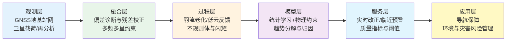
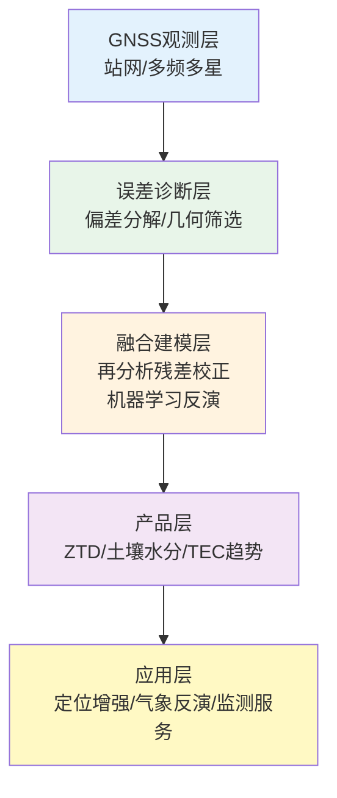
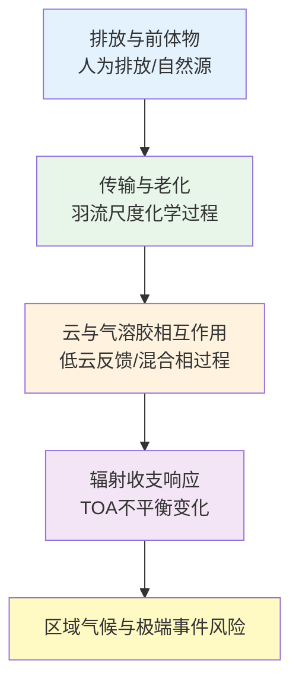
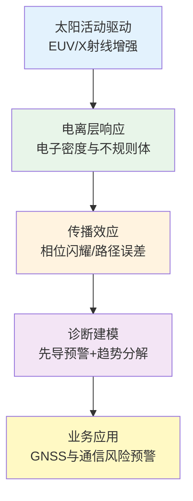
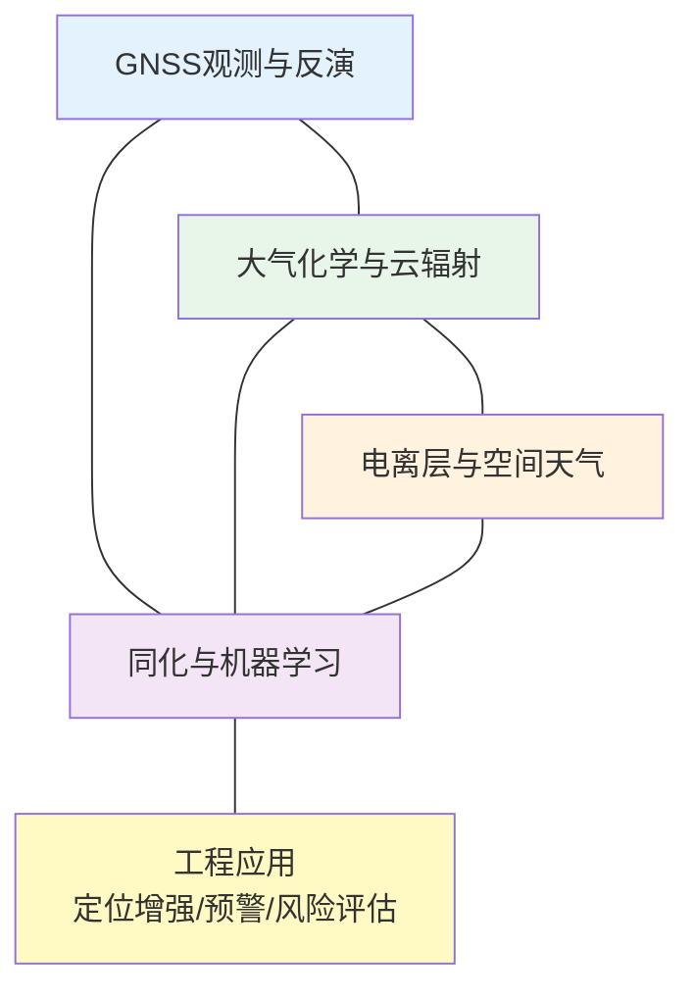
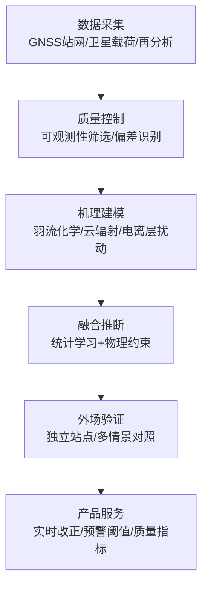

本期统计窗口覆盖的论文时间范围为2026-03-17至2026-03-24。该时间切片中，GNSS反演与改正模型呈现“多源融合—可迁移验证—面向实时”的工程化路径，大气研究围绕气溶胶-云-辐射耦合与排放羽流化学老化展开，电离层研究强调太阳爆发事件的临近预警与不规则体对GNSS的风险链条。结合国际业务系统公开资料，能够观察到一个一致趋势，即研究产出正在从单篇算法改进扩展为可部署产品与可审计误差学框架。

## 一、本期研究印记图

本期论文集合反映出两个结构性变化。其一，GNSS与再分析资料的融合从“用背景场填补稀疏”进一步演化为“用观测约束背景场偏差”，以获得可外推的连续产品。其二，电离层与空间天气研究把“先导量—响应量—传播效应”放在同一链条中讨论，目标从解释个例转向建立可用于预警与风险评估的统计证据链。大气方向则体现出以长期模拟和协同观测收敛低云与沙尘辐射不确定度的努力。

## 二、GNSS方向顶刊与特色论文专题画像

本期GNSS方向的研究主要分布在区域ZTD重建、城市复杂环境下的观测可用性筛选、GNSS-IR土壤水分反演稳健化，以及基于GNSS的TEC长期变化诊断。该方向呈现出明显的工程化链条，即将误差源从“后验残差”前移为“先验可观测性与偏差建模”，并以独立站点或跨环境对照作为必要验证步骤。与IGS实时服务体系的产品化需求相呼应，多频多星、偏差项分解与实时可用性指标正在成为GNSS方法论的共同约束条件。

总体上，GNSS方向正在从单站解算与经验插值走向区域化连续场重建，从手工调参走向可解释优化与自动化搜索，并将结果表达从RMSE等单一指标扩展为“场结构一致性、极端背景稳健性与部署成本”的综合评价。下表与流程图概括代表性技术路线。

**表1 代表性研究的技术路线与特点**

| 研究主题 | 技术路线 | 技术特点 | 重要结论 |
|---|---|---|---|
| ERA5与GNSS融合区域ZTD重建 | ERA5背景场+残差Kriging校正 | 连续结构与站点精度互补 | 误差显著下降且季节稳定性增强 |
| 城市GNSS对流层健康区识别 | 三维射线追踪+可观测性筛选 | 将遮挡与多路径影响前置质控 | 提升城市反演可靠性与可解释性 |
| 多频多星GNSS-IR土壤水分反演 | 双频熵权融合+边际增益选星 | 量化选星阈值与增益饱和 | 单星座约5至6颗后增益趋缓 |
| Bayesian优化随机森林GNSS-IR | 贝叶斯超参数搜索+RF反演 | 降低过拟合与人工调参不确定性 | 异质下垫面迁移性提升 |
| 全球TEC长期趋势地方时解析 | 多太阳代理回归去驱动+地方时分解 | 长期变化与太阳周期扰动分离 | 全球TEC总体下降，低纬正午更强 |

在该框架下，本期GNSS方向的共同落点是以可观测性约束与多源融合共同控制系统偏差，并通过外场验证确保模型可迁移。这一闭环为后续面向实时的ZTD与电离层改正服务奠定了可审计的误差学基础。

### 2.1 专题画像：ERA5与GNSS融合的区域ZTD重建

**（1）技术路线** 研究以GNSS ZTD高精度离散估计作为参考场，以ERA5格点ZTD作为连续背景场，先构造两者差异形成残差集合，再用Kriging对残差场进行空间建模与插值，最后将残差改正叠加回ERA5以获得修正后的高精度ZTD格点产品。实验采用建模站与独立验证站分离的评估设计，从而将“拟合能力”与“外推能力”区分开来。

**（2）技术特点** 该路线的关键在于将误差结构显式拆分为两部分：背景场提供大尺度连续结构与时序一致性，GNSS站点提供高精度锚点用于纠正系统偏差。与单纯GNSS插值相比，它降低了稀疏站网外推的形态失真；与直接使用ERA5相比，它显著抑制了偏差项对区域应用的累积影响。

**（3）重要结论** 该研究的重要结论是：**残差校正后的融合ZTD在独立验证站上达到毫米量级精度，并在季节与极端天气背景下保持更稳定的空间一致性。** 该结果意味着区域水汽反演与同化可以在有限站网条件下获得可用于业务的连续输入场，同时为PPP与对流层改正提供更稳健的先验约束。

### 2.2 专题画像：城市环境下GNSS对流层延迟“健康区”识别

**（1）技术路线** 研究使用三维射线追踪框架显式模拟城市建筑物引起的遮挡与多路径对信号路径的影响，进而定义适于对流层参数估计的空间“健康区”与观测几何约束条件。其流程强调先由城市三维结构筛选观测，再进入参数估计与反演，从源头控制系统误差输入。

**（2）技术特点** 该方法将传统以残差为主的后验剔除策略，转化为基于几何物理的先验筛选策略，使误差控制具备可解释性与可复用性。对于建筑密集区，健康区识别有助于减少多路径偏差对对流层延迟估计的结构性污染，从而提高参数的稳定性与跨时段可比性。

**（3）重要结论** 该研究的重要结论是：**城市GNSS对流层延迟估计的主要误差项与三维结构强耦合，基于射线追踪的健康区筛选能够提升延迟反演的可靠性与可解释性。** 该结论对城市气象反演站点选址、网络质控与产品一致性评估具有直接工程意义。

### 2.3 专题画像：GNSS-IR土壤水分反演的多频多星增益边界

**（1）技术路线** 研究构建双频相位延迟融合框架，并采用熵权策略对双频信息自适应赋权；随后引入边际增益准则确定单星座下参与卫星数量的合理范围，并将NDVI、温度与降水等环境因子显式并入随机森林模型，形成非线性环境调制的反演器。

**（2）技术特点** 该框架把反演稳定性问题拆解为三类可控因素：频段互补信息、参与卫星数的噪声-增益权衡、以及环境因子对反射场的系统调制。相对于仅依赖几何或经验阈值的方案，它给出可操作的选星策略与因子贡献解释，更适合跨站点部署与长期运行。

**（3）重要结论** 该研究的重要结论是：**单星座条件下多星组合存在明显的增益饱和区，参与卫星达到约5至6颗后改进趋缓；双频融合与环境因子入模可同步提升精度与稳健性。** 该结论为低成本连续土壤水分监测的系统配置提供了阈值依据，并可为后续多星座融合提供基线对照。

### 2.4 专题画像：Bayesian优化随机森林的GNSS-IR反演框架

**（1）技术路线** 研究采用贝叶斯优化在超参数空间中自动搜索随机森林的最优配置，使模型复杂度控制与反演目标在同一优化框架内收敛。该流程通过观测—模型闭环评估泛化能力，降低不同站点、不同下垫面条件下的人工调参成本。

**（2）技术特点** 该路线的优势在于把“调参不确定性”转化为可度量的搜索过程，从而在反演精度与泛化能力之间形成可解释的折中。对业务化部署而言，贝叶斯优化可缩短模型迁移周期，并减少因经验参数不一致导致的跨站点产品差异。

**（3）重要结论** 该研究的重要结论是：**自动化超参数优化能够提升GNSS-IR土壤水分反演在异质环境中的稳定性与迁移性，适合快速部署与长期运行场景。** 该结果对面向大范围站网的统一反演策略具有现实意义。

### 2.5 专题画像：全球TEC长期趋势及地方时依赖

**（1）技术路线** 研究基于2000至2024年的GNSS-TEC长时间序列，采用多太阳活动代理量进行两步回归，剥离太阳驱动成分后，进一步按地方时解析长期趋势，形成地方时分辨的全球趋势图谱。

**（2）技术特点** 该工作把“长期变化”与“太阳周期扰动”做清晰分离，并将地方时维度纳入趋势诊断，从而能够区分低纬正午与夜间、不同区域的趋势幅度与一致性。该范式更适合为电离层气候学提供统一基线，并为GNSS改正模型的长期漂移评估提供依据。

**（3）重要结论** 该研究的重要结论是：**全球TEC在地方时全周期总体呈下降，低纬正午负趋势更强，夜间趋势较弱但保持为负。** 该发现指向热层长期冷却背景下的电离层状态演化，并对GNSS误差建模、HF通信与监视系统性能评估具有长期意义。

## 三、大气方向顶刊与特色论文专题画像

本期大气方向的代表性研究集中在排放羽流的化学老化时间尺度、低云对全球辐射不平衡内部变率的调制、干旱区沙尘排放与辐射强迫的情景敏感性，以及南大洋混合相云云态差异的辐射后果。相关论文共同强调将“排放—传输—云辐射—气候响应”从分段分析推进到过程链联评，并借助长时间序列模拟、协同观测与情景试验提高归因稳健性。与WMO温室气体公报中给出的浓度上升与辐射强迫增强背景相一致，大气研究的重点正在转向如何以更可检验的过程证据收敛气溶胶与低云的不确定度。

总体上，大气方向呈现从单变量统计到多过程耦合、从短期个例到长序列约束、从区域过程到全球能量收支一致性评估的演进。下表与流程图概括本期代表性技术路线。

**表2 代表性研究的技术路线与特点**

| 研究主题 | 技术路线 | 技术特点 | 重要结论 |
|---|---|---|---|
| 区域排放对O3/CH4影响 | BL-RL-PL-DP三阶段化学输送链 | 显式羽流老化时间敏感性 | 过快扩散会系统高估影响 |
| 低云调制辐射不平衡 | 500年耦合模拟+SST强迫大气模拟 | 年际与年代际机制分离 | ENSO主导年际，副热带低云主导年代际 |
| 中亚沙尘排放与辐射效应 | MERRA-2+CMIP6+SBDART | 多情景与垂直辐射结构联评 | 顶层冷却与层内加热并存且对情景敏感 |
| 南大洋混合相云观测 | 协同机载观测+卫星反演 | 分层/对流云态并行比较 | 云态差异可引起显著顶层反照率变化 |

该流程表明，本期大气研究的共同落点是通过过程链约束减少参数化不确定度，并将机理发现转化为可用于模式改进与政策评估的量化证据链。

### 3.1 专题画像：区域排放生命周期对O3与CH4收支的约束

**（1）技术路线** 研究采用边界层-残余层、离岸羽流、背景扩散三阶段框架，按不同羽流老化时间设置诊断净臭氧产生与甲烷损失，并通过阶段化积分量化区域排放的全球化学效应贡献。

**（2）技术特点** 该研究突出羽流老化时间尺度对O3与CH4效应估计的控制作用，并将模式分辨率导致的“过快扩散”作为可诊断误差源，具备明确的模式评估意义。其框架能够解释粗网格化学输送模式在O3和CH4响应上的系统偏差来源。

**（3）重要结论** 该研究的重要结论是：**若忽略合理羽流老化过程而过快扩散，将显著高估人为排放对对流层O3净产生与CH4损失的贡献。** 该结论对排放控制效益评估与化学气候模式参数化改进具有直接约束作用。

### 3.2 专题画像：低云在全球辐射不平衡内部变率中的作用

**（1）技术路线** 研究利用长时段耦合模拟与SST约束的大气模拟，分析全球平均顶层辐射不平衡与海温模态的相位关系，并分别识别年际与年代际尺度上低云异常的动力触发机制与辐射效应。

**（2）技术特点** 该工作通过超长时间序列提高内部变率统计显著性，避免短观测记录导致的机制混叠。其关键贡献是将ENSO相关低云异常与副热带低云甲板的年代际变率进行机制分离，为归因与模式评估提供更清晰的过程靶标。

**（3）重要结论** 该研究的重要结论是：**全球辐射不平衡内部变率具有时间尺度依赖，年际尺度主要受ENSO调制，年代际尺度更受副热带低云与外热带随机强迫共同影响。** 该发现有助于解释近十年温升波动，并为低云反馈不确定度收敛提供方向。

### 3.3 专题画像：中亚沙尘排放—沉降—辐射强迫一体化评估

**（1）技术路线** 研究将再分析数据与CMIP6多情景集合用于评估1980至2100年沙尘排放与沉降演化，并用辐射传输模型计算清空条件下的直接辐射强迫，形成排放—辐射的一体化诊断链条。

**（2）技术特点** 该研究把沙尘过程从源区强度、沉降受体到辐射效应放在同一框架内，且引入政策情景维度，使科学结论对风险管理具有更直接的解释路径。其结果能够同时约束地表短波衰减与大气层内加热的垂直结构效应。

**（3）重要结论** 该研究的重要结论是：**沙尘排放强度对情景路径高度敏感，且辐射效应在顶层冷却与大气层内加热之间并存。** 该结论提示区域气候评估需同步考虑能量收支与边界层热力结构变化。

### 3.4 专题画像：南大洋混合相云云态差异与辐射效应

**（1）技术路线** 研究基于协同机载观测与卫星反演，对锋区冷暖两侧的层状与对流混合相云进行并行诊断，并结合边界层结构与相态转化讨论云微物理差异及其辐射后果。

**（2）技术特点** 该工作将云态分类、边界层结构与辐射影响联动分析，使“过程差异—辐射信号”的对应关系可检验。对二次成冰过程活跃度的讨论为混合相云参数化提供了观测证据支撑。

**（3）重要结论** 该研究的重要结论是：**混合相层状云与对流云的相态与粒子谱差异可导致顶层反照率出现大幅变化，现有再分析对该幅度仍有低估。** 该结论对南大洋云辐射反馈不确定度收敛具有关键意义。

## 四、电离层方向顶刊与特色论文专题画像

本期电离层方向聚焦太阳耀斑临近预报的先导量构建与赤道不规则体发育的跨经度调制机制，同时与GNSS-TEC长期趋势诊断形成互补约束。电离层研究正在形成“短时扰动预警 + 中尺度结构机理 + 长期背景趋势”的一体化结构，其关键价值在于把空间天气事件的驱动量、响应量与传播效应放在同一证据链中表达。与NOAA业务说明中关于强扰动条件下GNSS误差显著放大的表述一致，该方向越来越强调可用于风险管理的阈值化指标与产品化接口。ESA Swarm/IPIR不规则体指数产品的存在，也为不规则体的统计诊断与跨系统验证提供了可用数据源。

总体上，电离层方向正在把事件预警与长期趋势研究纳入同一误差学框架，并推动结果向业务可用的风险量化指标演进。下表与流程图概括代表性技术路线。

**表3 代表性研究的技术路线与特点**

| 研究主题 | 技术路线 | 技术特点 | 重要结论 |
|---|---|---|---|
| EUV先导信号用于耀斑临近预报 | GOES/EXIS与XRS联合统计映射 | 业务通道可直接接入预警 | EUV多数情况下领先SXR数分钟 |
| 等离子体泡寿命宽经度波状调制 | 多源观测+底侧多尺度波耦合分析 | 统一解释局地触发与区域调制 | 千公里尺度波可调制EPB寿命与高度 |
| TEC长期气候趋势约束 | GNSS全球TEC长序列+地方时分解 | 全球覆盖与地方时细节兼顾 | 低纬白天负趋势更突出 |

在该技术链中，观测、诊断与应用之间的连接更紧密，研究结论可直接服务于GNSS与通信系统的风险评估，并为电离层业务预报模型提供可检验的过程约束与阈值线索。

### 4.1 专题画像：EUV先导信号用于耀斑X射线临近预报

**（1）技术路线** 研究使用GOES/EXIS的EUV通道与GOES/XRS的软X射线联合样本，对M级与X级耀斑的峰值时序、持续时间与强度相关性进行统计分析，构建EUV先导量到SXR特征量的映射关系，并给出领先时间分布。

**（2）技术特点** 该工作将业务可获得的EUV观测转化为预警先导量，提供可解释的统计证据链，并以不同谱段的差异比较明确“哪些通道更适合作为先导”。相对于黑箱分类，该路线更容易在业务系统中实现阈值化触发与不确定度表达。

**（3）重要结论** 该研究的重要结论是：**多数事件中EUV峰值先于SXR，领先时间为分钟量级，且He II等通道对持续时间与强度具有更强指示能力。** 该结论为短时空间天气预警窗口优化提供依据，并对降低GNSS与通信系统突发风险具有直接意义。

### 4.2 专题画像：宽经度等离子体泡寿命的千公里波状调制

**（1）技术路线** 研究通过多源观测识别赤道等离子体泡在宽经度范围内的寿命起伏，并结合底侧电离层百公里与千公里尺度波结构，分析种子扰动与预恢复电场的耦合机制，解释不同经度上不规则体发育高度与寿命的协同变化。

**（2）技术特点** 该研究把“局地触发源”与“区域调制场”放入统一框架，强调多尺度波结构共存对不规则体演化的控制作用，从而为解释跨经度GNSS闪耀强度差异提供过程解释，而不仅是统计描述。

**（3）重要结论** 该研究的重要结论是：**千公里尺度波结构可通过调制预恢复电场影响等离子体泡发育高度与寿命，形成宽经度波状起伏形态。** 该结论为低纬电离层不规则体预报与跨经度GNSS性能评估提供新的过程约束。

## 五、交叉学科网络图与创新链流程图

## 六、近期研究特色变化与未来发展趋势

近期文献显示，GNSS、大气与电离层研究正在形成面向业务系统的一致方法范式。GNSS方向强调多源融合与可迁移验证，以形成可外推的连续场产品；大气方向强调过程链联评，通过长序列与协同观测收敛低云与沙尘辐射不确定度；电离层方向强调先导量预警与不规则体机理并行，并把风险链条延伸到信号传播与定位误差层面。该范式的共同特征是，将误差源分解、阈值触发与质量指标表达纳入研究成果的一部分，而不是作为后处理附加项。

面向未来，至少有三条确定的演进路径。其一，实时化。IGS实时服务已提供轨道钟差、偏差与电离层VTEC等产品，并以SSR格式发布，为PPP与电离层改正的实时应用提供接口与标准化载体。其二，统一误差学。GNSS反演误差、再分析偏差与空间天气扰动需要在同一误差传播框架下表达，形成可比较的不确定度指标与可触发的风险阈值。其三，跨域验证。面向强对流与强空间天气事件，研究将更多采用观测—模式—服务的闭环检验，把论文指标转化为系统级可用性指标。

从国际背景看，WMO温室气体公报指出2024年全球平均CO2浓度达到423.9±0.2 ppm，且长寿命温室气体的辐射强迫在1990至2024年间增加约54%，为气候风险的长期边界条件提供了权威约束。空间天气方面，NOAA公开资料指出在强地磁扰动下单频GNSS定位误差可显著放大，成为推进电离层预警与实时改正产品的直接需求牵引。多圈层、多源数据与可审计模型将在这一需求牵引下进一步融合。

## 参考文献

1. Cai, Y., Ma, H., Wang, Z., et al. (2026). Fusion-Based Regional ZTD Modeling Using ERA5 and GNSS via Residual Correction Kriging. *Remote Sensing*, 18(6), 963. https://doi.org/10.3390/rs18060963
2. Mehdi, S., Wareyka-Glaner, M. F., Zhang, G., & Rohm, W. (2026). Identifying healthy urban zones for GNSS-based tropospheric delay estimation using 3D ray-tracing. *GPS Solutions*. https://doi.org/10.1007/s10291-026-02065-1
3. Nie, S., Jia, Y., Li, P., Wu, X., & Tang, Y. (2026). Soil Moisture Retrieval Using Multi-Satellite Dual-Frequency GNSS-IR Considering Environmental Factors. *Remote Sensing*, 18(6), 917. https://doi.org/10.3390/rs18060917
4. He, K., Deng, X., Zheng, N., et al. (2026). A GNSS-IR soil moisture retrieval framework using Bayesian-optimized random forest algorithm. *International Journal of Digital Earth*. https://doi.org/10.1080/17538947.2026.2646380
5. Zossi, B. S., Medina, F. D., Duran, T., Zamora, D. J., & Elias, A. G. (2026). Global Long-Term Trends in Ionospheric TEC From GNSS Observations With Local-Time Dependence. *Geophysical Research Letters*. https://doi.org/10.1029/2026GL121731
6. Wilson, C. P., & Prather, M. J. (2026). Life-cycle impacts of South Korean air pollution on tropospheric ozone and methane: sensitivity to dispersion time. *Atmospheric Chemistry and Physics*, 26, 3995-4017. https://doi.org/10.5194/acp-26-3995-2026
7. Miyamoto, A., Xie, S.-P., & Deser, C. (2026). Unforced interannual to decadal variability of global radiation imbalance: Role of low clouds. *Journal of Climate*. https://doi.org/10.1175/JCLI-D-25-0320.1
8. Gan, Y., Zhang, Z., Chu, W., Ding, J., & Ren, Y. (2026). Assessment and prediction of dust emissions, deposition and radiation forcing in Central Asia. *Atmospheric Chemistry and Physics*, 26, 3881-3906. https://doi.org/10.5194/acp-26-3881-2026
9. Ding, S., Liu, J.-W., McFarquhar, G. M., & Gao, S. (2026). Observations of Mixed-Phase Stratiform and Convective Cloud Regimes Over the Southern Ocean. *Journal of Geophysical Research: Atmospheres*. https://doi.org/10.1029/2025JD043931
10. Mthethwa, A., & Snow, M. (2026). Using solar ultraviolet irradiance measurements from GOES/EXIS to nowcast flare X-ray properties. *Journal of Space Weather and Space Climate*, 16, 12. https://doi.org/10.1051/swsc/2026010
11. Sun, W., Otsuka, Y., Li, G., et al. (2026). Thousand-Kilometer-Scale Wavelike Undulations in Ionospheric Plasma Bubble Lifetime and Development Over Wide Longitudes. *Geophysical Research Letters*. https://doi.org/10.1029/2025GL121459
12. World Meteorological Organization. (2025). *WMO Greenhouse Gas Bulletin No. 21*. https://wmo.int/resources/publication-series/greenhouse-gas-bulletin/wmo-greenhouse-gas-bulletin-no-21
13. International GNSS Service. (2026). *RTS Products; RTS Formats*. https://igs.org/rts/products ; https://igs.org/rts/formats/
14. NOAA Space Weather Prediction Center. (2026). *Space Weather and GPS Systems; Total Electron Content; Storm Time Empirical Ionospheric Correction*. https://www.swpc.noaa.gov/impacts/space-weather-and-gps-systems
15. ESA Earth Online. (2022). *Ionospheric Plasma IRregularities (IPIR) characterised by the Swarm satellites*. https://earth.esa.int/eogateway/activities/ipir
