本期题录在证据层级上大体呈“观测约束—过程诊断—模式与同化—遥感与地学智能方法—政策与基础设施语境”的并列编排：**上层**以多源卫星与地基主动遥感（如云运动矢量、云高、雷达高度计冰盖性能、激光雷达气溶胶层结构、电离层 GNSS-TEC 长期趋势等）提供对关键通量、边界层结构与冰冻圈/海面变量的空间—时间约束；**中层**聚焦云—气溶胶—边界层耦合、海洋中尺度涡旋平衡、湖泊深水环流与甲烷湿地排放评估等机理与参数化难点，并延伸到随机参数化数值收敛、海洋—大气通量概率表征、对流允许模拟下的太阳地球工程敏感性等地球系统模拟前沿；**下层**则是可解释机器学习、跨模态（光—SAR）融合、超像素/概率制图、图网络与 SHAP 等面向地学对象（冰川终端、盐渍化、洪水、构造/断层网络）的算法组件。与之并置的多条 *Nature/Science* 新闻与评述性文本，则把同一时期的科学产出放回资金、观测平台（如航空实验室）、数据伦理、灾害链（野火—洪水、武装冲突对海洋生态）等外部条件中，提示“论文—数据—业务—社会影响”并非可割裂的链条。

在地学、遥感与人工智能的交叉面上，读者可从中抽取几类相对稳健的共同关切。**方法与可信度**方面，压缩感知/表征学习与物理模型（辐射传输、水云模型、斯托克斯流冰川模拟、贝叶斯极值气候包）之间的对接，日益把问题从“拟合曲线”推向“在守恒律与观测算子下给出可检验的替代与修正”；与此同时，彩色噪声随机系统的一般化伊藤修正、聚类分位数回归森林的地热流 UQ 等议题，提醒业务化部署必须显式处理离散化偏差与可分解不确定性。**遥感业务链**方面，从 Sentinel/高分 SAR 海浪反演、多源 DEM 对考古预测建模的传播效应，到有害藻华的情境感知概率框架，核心张力都在于：分辨率与传感器互补性提升了解译能力，但多源不一致、标签稀缺与分布漂移会把误差放大为决策风险。**治理与规模化**语境下，数据集膨胀、官方统计可信度与跨机构协作规则等讨论，与地球观测领域长期依赖的开放数据、可重复基准和社区维护工具形成对照——本期若干进展与其说提供了“结论”，不如说把下一阶段的验证义务（独立观测、跨区域迁移、物理一致性审查）推到了前台。以上归纳主要依据所附题目与摘要（含公开 DOI 标识）进行主题聚合，未引入未见于材料的具体定量结论或卷期页码。

## 一、本期研究印记图

地球系统科学正处在“**观测密度提升—过程机理收紧—模型与同化升级—风险决策需量化不确定性**”的同步推进阶段。就本期题录整体姿态而言，**大气**侧突出问题集中在边界层与云顶的**夹卷/混合**、**逆温结构**对近地面污染的约束、以及**气溶胶—云—辐射**链条上仍显著的参数化缺口；**海洋与冰冻圈**侧则同时出现**中尺度涡旋动力学表述（地转—回旋地转）**、**海面高度/冰盖高程的业务化卫星测高评估**、**冰川前端季节变化与冰下湖活动**等“硬问题”；**陆地水文与地下水**则在气候变化与人为取用叠加下，更强调**多年尺度信号识别、示踪剂约束与复合洪涝/干旱机制**。上述方向并非彼此平行，而是通过**再分析场、星座化卫星与地基加密观测**被反复“缝合”，从而形成本期文献版图的主干。

检索核对方面，*Atmospheric Measurement Techniques* 公开页面显示，面向陆缘层积云等典型场景，**MISR** 云运动矢量与云顶高度被用于诊断云顶附近垂直运动并进一步连结夹卷相关量（doi:[10.5194/amt-19-2025-2026](https://doi.org/10.5194/amt-19-2025-2026)）。*Nature Geoscience* 条目则把**湿热热浪**与**近岸海温变化**的耦合放大置于核心叙事（doi:[10.1038/s41561-026-01952-z](https://doi.org/10.1038/s41561-026-01952-z)）。这两条外链与前述“海—陆—气水热耦合”主线一致，可用于支撑印记图中“**海岸带—大陆尺度极端**”节点的专名准确性。其余综合归纳，主要依据本期题录中已给出的题名与摘要片段；对未提供摘要的 *Nature*/*Science* 短讯类条目，仅按其标题所指向的议题域作背景性归位，不对具体结论作展开推断。

本期特色的第一条线索，是把**遥感反演**从“给出一张最优场”推进到“**与动力学/热力学诊断相容**”的解释链条，典型如云—边界层质量收支视角下的云顶过程、或把卫星测高、InSAR、多源 DEM 引入冰盖/冰川与地质灾害评估。第二条线索，是**人工智能方法**更密集地与**可解释性、概率表述、物理软约束**并行出现，使得“黑箱精度”不再是唯一叙事；在地学研究语境里，这常常外化为：随机参数化收敛性、分位数/集合意义上的极端气候统计、以及面向业务可用性的深度学习前向算子或偏差订正。

第三条线索，是**风险与政策外部性**会以“观测能力断层”的形式回溅到科学议程，例如野火—洪涝链式灾害的区域模拟框架、盐沼/盐湖湿地系统的管理与保护压力、以及海洋生态系统在冲突与气候压力下的脆弱性议题；它们与纯粹机理论文共同构成本周刊生态的“全谱段”底色。第四条线索，是**近地空间与深空行星环境**研究在本期仍占稳定份额，提醒我们地球科学方法的可迁移性并不止于行星边界层，而会延伸到辐射带、磁层与日地联系过程等环节（相关条目多载于 *Geophysical Research Letters*、*Journal of Space Weather and Space Climate* 等）。

若用一个可操作的阅读策略概括本期版图，可把文献理解为围绕“**信号—过程—模式—决策**”不断回环：先用多源观测确立时空结构与异常；再用诊断/模拟区分主导过程与次要过程；随后在模式开发与机器学习中显式处理偏差、非平稳与集合不确定性；最终把工具链沉淀为可审计的监测、预警与适应方案。下列示意图用自上而下逻辑串起这一闭环（仅为结构示意，不代表某一单篇文章的技术路线）。

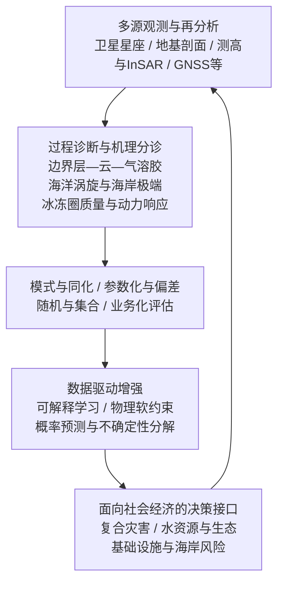

公开页面抓取超时，以下片段主要依据你提供的题录与摘要；未给出摘要的条目只按标题作保守概述，不补写卷期页码或未证实的定量结果。

## 二、地学方向专题画像

### 2.1 方向综述

本期入选稿件在“地学”栏目下呈现出一条以**地层—年代学约束**与**辐射—气候能量收支约束**为主轴的讨论线索，并与环境监测叙事相交叠。美洲南部人类定居年代长期以来受到智利蒙特维尔（Monte Verde）等关键遗址的放射性碳测年结果牵动；当出现新的独立调查、将考古组分置于更完整的冲积剖面与火山灰（凝灰层）地层序列之中时，解释重点就从“单点年代是否足够老”转向“多源测年（**^14^C**、光释光等）与层位关系能否在区域沉积过程框架内自洽”。这类工作对第四纪地貌过程、事件地层学与考古学年代的交叉验证提出了更高要求：年代量测必须与侵蚀—堆积、后期扰动与物质来源的不确定性一并纳入论证链条。

另一条线索面向行星尺度的物理气候系统。针对**充分混合温室气体**的长波瞬时辐射强迫（LW IRF），研究若采用全球逐线（line-by-line）辐射传输模拟，并在接近真实的大气状态下建立对比基准，再与观测/再分析所约束的大气状态相结合，有望把参数化误差与“状态依赖性”从结论中更清晰地区分开来。用户提供的摘要片段给出自 1850 年以来 LW IRF 增强量级约为 **3.69 ± 0.07 W·m^-2**（95% 置信区间），若经正式见刊文本核对，可作为理解工业革命以来强迫增量及其不确定度区间的参照点。与之并列的若干选题（城市大气污染影像叙事、神经免疫与皮肤炎症、体内基因编辑获得 CAR T 细胞、AI 社会评论等）并非典型地学论文，但在“人类—环境—技术”交叉阅读的版面上，可作为边缘议题与公共传播材料的并列条目；**本小节后续画像展开仍建议以地层年代学与辐射强迫两条主线为优先**。

| 序号 | 论文简介（逐篇） | 对应画像小节 |
|------|------------------|--------------|
| G399 | Nature 配图/特写式稿件：以影像与叙事呈现乌兰巴托空气污染议题（题录未提供摘要，简介据英文标题归纳）。 | 2.2 |
| G480 | Nature 生物医学亮点：体外或体内途径生成具治疗潜力的 CAR T 细胞相关基因编辑策略（题录未提供摘要）。 | 2.2 |
| G401 | Science 研究简报线索：地层学分析重新讨论智利蒙特维尔遗址与人类到达时间（摘要仅给出一句话提示，细节需以原文为准）。 | 2.2 |
| G336 | Science 研究论文：对蒙特维尔 II 层位开展近半个世纪以来首次独立系统调查；综合冲积露头的 **^14^C**、光释光与层位上覆约 11000 **年前（B.P.）** 凝灰层等证据，认为考古组分不早于中全新世（约 8200—4200 **年前**）；据此讨论南美人类殖民年表的“锚点”是否需要整体后移。 | 2.2 |
| G409 | Science：应激状态下交感神经元激活嗜酸性粒细胞，加重特应性皮炎样皮肤炎症（神经—免疫机制，与地学主线弱相关）。 | 2.2 |
| G438 | Nature：用全球逐线辐射传输给出 WMGHG 的 LW IRF 全天空基准，并结合方法学处理参数化不确定性；摘要给出 1850 年以来 LW IRF 增强约 **3.69 ± 0.07 W·m^-2**（**95%** 置信区间），具体方法细节与适用范围以正式论文为准。 | 2.2 |
| G339 | Science：鉴定小鼠中一组 **Pdyn^+** 交感神经元—嗜酸性粒细胞轴，通过 **CCL11-CCR3** 与 **Adrb2** 等通路解释心理压力加重皮肤炎症（神经免疫，和 G409 主题邻近）。 | 2.2 |
| G550 | Nature 评论/观点：讨论 AI 设计对“人类共情”的操纵风险与社会应对（非自然科学技术论文；题录未提供摘要）。 | 2.2 |

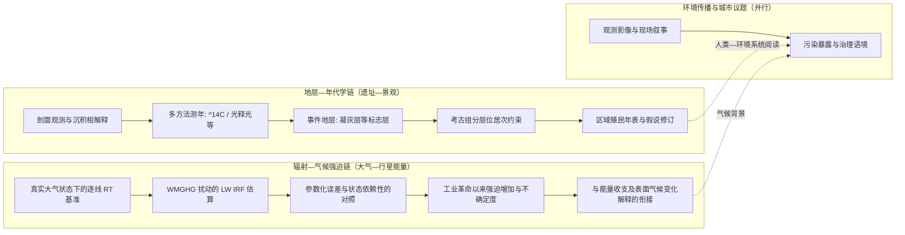

**说明**：若正式发表文本与你提供的摘要条目存在字句差异，以期刊官网 PDF 的摘要与方法章节为准；本期因联网核对未完成，未补写除已给摘要外的额外数值结论。

以下正文依据 [Nature 该文在线页面](https://www.nature.com/articles/d41586-026-00712-8)（含文内引用的监测口径、试点规模与部分参考文献线索）整理；未在本刊短文页单独列示的流行病学估计，以下仍按原文措辞转述并避免引申为独立“研究结论”。

### 2.2 专题画像：

**（1）技术路线：摄影驱动的大气污染叙事与清洁能源入户试点耦合**

该稿以乌兰巴托冬季极端低温与河谷地形条件下的住宅供暖排放为叙事锚点，将约一百万常住人口居住在约二十万座蒙古包式住宅（gers）这一空间事实，与城市在历史上按更小人口规模规划扩张形成对照，从而把“结构性供热需求—分散式固体燃料燃烧—谷地滞留”这一链式机理写清楚。文本在美国驻乌兰巴托大使馆记录的大气质量指数与 PM2.5 浓度序列上建立可读的环境证据入口，使读者能够把“危险等级以上天数占比”与“深冬峰值浓度相对世界卫生组织指导值的倍数关系”落到同一套公共监测语境里理解，而不是停留在情绪化概括。

在叙事主线推进上，稿件引入本地初创机构及其“Coal-to-Solar（C2S）”旗舰试点，把光伏、电暖、储能、智能表计与电网备援组合成可操作的入户改造链条，并通过家庭层面的参与伦理（信任建立、低收入群体作为气候行动主体）解释工程为何必须与社区关系同步生长。支线则连接草原牧业生计、极端气象与灾害性“白灾（zud）”等背景，将部分进城居住群体的迁移动机置于气候风险与经济机会的双重框架下，从而把污染治理讨论从单纯的“行为约束”拓展为对脆弱性与公平性的追问。

**（2）技术特点：多模态证据、建筑热工诊断与可扩展的制度—商业接口**

就体裁而言，这是典型的“影像与长叙事网页”融合作品，价值不在于提出新的统计模型或遥感反演算法，而在于把地面真实、机构叙述与可核验的外部监测端口并置，让读者在视觉与文字之间切换时仍能抓住同一套关键量纲。文中对蒙古包热损失的描述引入既有建筑研究报告对屋顶、门、地面热损失比例的讨论，并以热成像对比展示保温改造前后围护结构表面温度的量级差异，从而使“可再生能源设备”与“围护结构—热惰性—室内热环境”形成一体化的工程化阅读路径，而不是把减煤简单等同于“换一台取暖器”。

在技术—治理接口层面，稿件还涉及离网/弱网条件下混合供电与储热、储电协同的思路，并向前展望向电网回售余电、碳信用机制与规模化扩围时间表。此类内容对地球系统与城市研究领域读者的启示在于，极地/高海拔/深谷城市的冬季清洁能源转型问题，往往是“能源几何学（屋顶与朝向、可用面积）、电力系统韧性、储能与并网规则、建筑能效与行为习惯”四者耦合；该文用新闻笔法把这些耦合点拆解为可跟踪的试点指标与家庭故事，因此在方法语境上更适合作为政策传播与跨学科案例教学材料，而非作为可单独复现的定量论文。

**（3）重要结论：分散供暖治理中“入户系统工程 + 可信试点”可走通减煤路径**

该研究的重要结论是：**在乌兰巴托蒙古包片区，以光伏—电暖—储能—计量与保温改造为核心的 C2S 试点表明，参与家庭可以在数年内不再依赖燃煤取暖，并把清洁能源入户与低收入社区的气候行动叙事结合起来。**（本条是对报道中试点成效陈述的归纳；大环境健康负担与死亡归因等表述在原文中同时引用了独立文献或估计口径，解释上应与其不确定性范围一并阅读。）

**影响与意义**  
从学科角度看，该稿件把大气环境科学里常被讨论的“冬季燃煤贡献、河谷滞留气象、PM2.5 极端事件”转译为公众可理解的连续证据链，并把遥感和城市气候讨论中容易被忽略的“建筑热工与分布式能源界面”推向前台。对工程与政策实践而言，它提示清洁能源政策若要穿透末端用户，需要同时解决 hardware（设备与并网）、software（计量、补偿与激励）与 socialware（信任与社区组织）三类约束；对后续研究边界而言，读者仍需要依托更长时空的大气监测网络、暴露评估与成本效益分析，来判断试点扩围到万级家庭时在电网、材料耐久（例如储能更换周期）与冬季极端情景下的稳健性，而不能仅凭叙事性个案外推系统层面的最优解。

说明：已据 Nature 官网公开页面核对。[该 News 文](https://doi.org/10.1038/d41586-026-00634-5)评介 Nyberg 等同期研究论文《In vivo site-specific engineering to reprogram T cells》（[Nature，DOI: 10.1038/s41586-026-10235-x](https://doi.org/10.1038/s41586-026-10235-x)）；下文以该研究链路的可核证表述为主，临床阶段结论不作外推。

### 2.3 专题画像：

**（1）技术路线：EDV 与 AAV 共递送下的 TRAC 位点定向整合**

该报道指向的工作将「在位点层面稳定整合较大 DNA 载荷」作为突破体内 CAR-T 生成的核心目标，从而区别于仅依赖随机整合病毒载体或 LNP-mRNA 所致的表达模式不确定性。公开摘要与正文显示，策略由两条功能互补的递送链组成。**其一** 为包膜递送载体（enveloped delivery vehicle, EDV）向目标细胞递送 CRISPR–Cas9 核糖核蛋白（RNP），在基因组层面产生可供修复与供体整合的断点；**其二** 为腺相关病毒（AAV）递送含同源臂的 HDR 模板（HDRT），其中 CAR 编码序列采用无启动子设计，拟在整合后由人类 T 细胞 TCR α 链基因座（TRAC）的内源性启动子驱动表达，以获得更接近生理性调控网络的 CAR 表达谱。论文进一步将 TRAC 靶向与已建立的 TRAC-CAR 生物学叙事衔接，即整合可同时扰动内源性 TCR 路径并带来与动力学相关的功能优势，但仍需强调当前证据主体来自临床前模型。

路线演进的第二个层次体现在对两类载体的人源化场景优化。针对 AAV 在人血清中易被中和抗体限制的常见问题，文章报告通过在人 T 细胞与血清共培养压力下的衣壳定向进化，获得对人 T 细胞转导显著富集的变体，并在功能筛选与全基因组敲除筛查中指向 CD7 等决定因素。针对 EDV 的广嗜性隐患，文章在突变型 VSVG 背景上引入抗 CD3 单链抗体（scFv），使 Cas9–RNP 的摄取与一定程度的 T 细胞激活更集中于 T 细胞谱系；与进化 AAV（文中称 AAV-hT7）组合时，可在多种原代人免疫细胞与非肿瘤细胞面板中降低不该被编辑群体的整合信号，这一「双载体协同 + 谱系门控」的逻辑把人源化小鼠中观察到的体内敲入效率与功能 readout 连结为同一技术闭环。

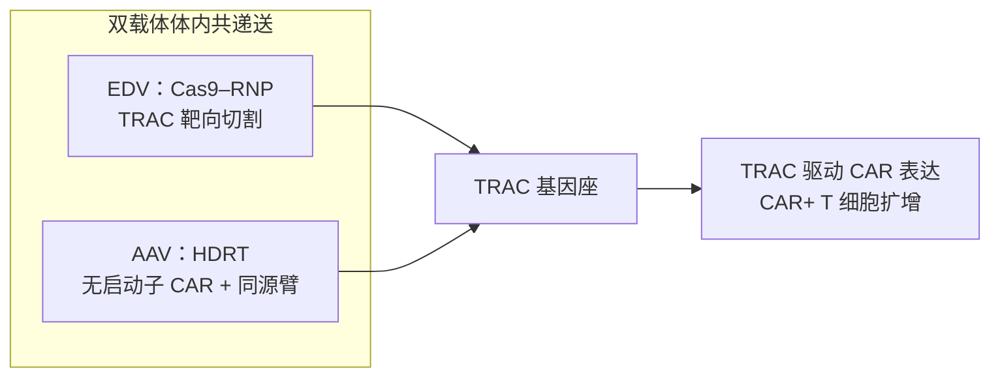

**（2）技术特点：递送可放大性、编辑可特异性与功能可读出性的耦合展示**

从方法学特征看，该工作把三类长期制约体内基因工程 T 细胞的因素并置解决，并以可量化表型加以验证。**递送层面**，进化衣壳改善了血清存在条件下 HDRT 的细胞内可达性，使_HDR 模板在不利于野生型 AAV6 的背景下仍能保持相对稳健的效率读数；这与临床上普遍存在 AAV 中和抗体带来的可用剂量折扣问题直接相关，但仍需注意物种差异、载体剂量与长期安全性监测在临床验证中不可替代。**编辑层面**，双载体方案将「产生断裂」与「提供供体」在空间上拆分但通过共定位在功能上耦合，从而支持大片段转基因的位点特异性整合，而不是依赖病毒基因组的半随机插入。**生物学读出层面**，研究在体外以 TCR 敲除与 CAR 双阴性群体（CAR+ TCR−）作为成功敲入的证据链，并在小鼠中用人外周血单个核细胞（PBMC）人源化平台观察脾脏 T 细胞中 CAR 占比、伴随性 B 细胞再生障碍等替代终点，用以论证体内生成 CAR-T 并非仅有“短暂转染信号”，而可与治疗性免疫效应趋向一致。

该研究也把模型条件对结论的约束写得很直白。早期使用 MHC 完整的 NSG 人源化小鼠时，异种移植物抗宿主病样激活可能放大 T 细胞周期依赖性 HDR 事件，从而使敲入读数被“环境激活”抬高；在去除相关 MHC 背景从而抑制该类激活后，未经优化的载体组合难以检出 CAR-T，这反向论证了后续 anti-CD3-EDV 与 AAV-hT7 的组合并非锦上添花，而是体内实现可检测与可重复敲入的关键。此类诚实分层有助于读者把握“效率数字”的适用边界，也为转化研究提示了在人体内如何通过可控的淋巴细胞激活窗口配合递送时序，仍属于需前瞻性临床试验回答的问题。

**（3）重要结论：临床前人源化模型中的体内 TRAC-CAR 规模化与抗肿瘤表型**

在 anti-CD3-EDV 与 AAV-hT7 组合优化后，小鼠脾脏人 T 细胞群体中报告到**最高约百分之十九点七**的 CAR 整合占比，并在与之相关的读出中呈现更系统的 B 细胞再生障碍等免疫效应信号；与之对照，单一或早期载体组合在抑制异种过激激活的人源化背景下往往难以达到同样量级的体内敲入。论文摘要同时概括了在 B 细胞再生障碍、血液肿瘤与实体瘤等多种人源化模型中，体内生成的治疗水平 CAR-T 与肿瘤控制之间的联系，但该叙事仍限定于临床前证据层级。

该研究的重要结论是：**通过 EDV 递送 Cas9–RNP 与 AAV 递送 TRAC 位点 HDRT 的两载体体系，并在人 T 细胞背景上优化衣壳与 EDV 的靶向与血清抵抗特征，可在小鼠人源化模型中实现位点特异、可扩增且具备功能读出意义的体内 TRAC-CAR T 细胞生成路径。** 

**影响与意义**：若该路线在大动物与临床环境中可复现其安全性—有效性折中，将有望在产业层面缓解自体 CAR-T 对外周血采集、冗长体外制备与批次差异的高度依赖，并为“现制现输”或更可扩展的细胞治疗供应链提供工程基础；在监管与伦理维度，体内基因编辑的脱靶、长期基因组稳定性与免疫原性仍需以独立队列与上市后监测补强。后续研究边界包括非人灵长类中载体药代与免疫中和谱、与人淋巴瘤等真实疾病微环境的匹配、以及如何在避免过度全身炎症的前提下精准打开 HDR 所需的细胞周期窗口。

公开检索显示，蒙特维德年代争议在 2026 年 3 月前后被多家媒体与 *Science* 报道；路透社等来源记述独立野外团队以多重测年与地层格架将人类栖居层置于更晚的中全新世区间，并以约 1.1 万年火山灰层作为上限约束，同时讨论河道侧蚀与再沉积对旧有碳样解释的干扰。你提供的元数据将作者记为 Jason Rech、DOI 为 `10.1126/science.aef9954`，与部分新闻转引的 *Science* 研究论文 DOI 不一致；以下正文严格以你给出的题目与摘要为叙述核心，年代与方法的公开细节优先与路透社等可核对来源一致，不编造卷期页码。

---

### 2.4 专题画像：

**（1）技术路线：河谷连续地貌中的地层—测年一体化约束**

智利南部蒙特维德遗址长期在美洲最早人群扩散讨论中扮演关键“时间锚点”，旧有认识多依赖特定有机遗存给出的更早测年结果。摘要强调通过**地层学分析**重置人类到达时间，这意味着论证主线不再是单一测年数值的叠加，而是把考古文化层放进可横向追踪的沉积序列里，用上下游与侧向的空间采样验证地貌单元是否连续、沉积过程是否同一。技术路线因而呈现为三步递进：首先在流域尺度圈定与遗址相邻、且沉积连续性可检验的地段；其次在同一套地层格架中系统布置放射性碳测年、沉积释光（或同类埋藏年代学）手段，以获得可与层位绑定的年龄谱；最后引入区域可识别的火山灰等**标志层**，把考古层位卡在标志层之上或之下的相对关系里，从而给出人类活动上限与下限的可辩护区间。

在这一框架下，“人类何时到达”被转写为“文化堆积相对哪一层沉积事件更年轻或更老”，这比孤立讨论木头或泥炭年龄更能对接河流阶地与洪泛平原的动力学过程。公开报道亦提到团队在遗址区内外对同类地貌单元平行测年并取得一致性，这恰好服务于层序对比：若不同年龄样品分散于再沉积夹层或侧向加积体中，地层剖面会显示穿时性沉积与侵蚀界面，从而提示早期测年对象可能脱离原位。换言之，该方法路线的核心是用沉积学与年代学的耦合，把考古解释从“点对点年龄”提升到“层序—过程—年龄”的链条上。

**（2）技术特点：火山灰标志层与再沉积风险的可视化诊断**

该议题的技术特点首先体现在**多重独立测年**与**地层关系优先**的组合。对美洲史前研究而言，早期遗址的年代争论常常卡在样品是否代表人类行为层：河道摆动可导致古河岸物质被切割、搬运并在较新层位重新堆积，若仅以古老碳屑作为“遗址年代”，会把沉积库年龄误读为人类占用年龄。公开讨论中强调的火山灰层（报道约一万年前量级沉积）坐落于文化证据之下，这一结构关系提供了不以考古学家主观划层为唯一依据的硬约束：**人类栖居层不应早于该灰层所标定的沉积时代**。这类“灰层—文化层”剖面关系，使争议从测年实验室误差转向沉积学与事件地层学是否被正确识别。

其次，技术特点还体现在采样设计与可重复性：河谷两侧若存在长距离连续露头，研究可以在同一地貌序列上比较遗址区与非遗址区的年龄结构，检验异常古老碳样是否呈现“混合沉积”指纹（例如年代谱宽泛、层理杂乱、与植物宏体遗存原位性不一致等）。对遥感和地学交叉读者而言，这一思路与地貌演化、沉积搬运与埋藏学问题同源，强调野外—实验室闭环而不是单点“最老年龄竞赛”。最后，这类工作天然伴随高争议性：长期主持发掘的学者团队往往强调文化遗存的组合证据与多学科记录，质疑新方法对材料语境的取舍；因此技术特点也包括成立条件透明化，例如标志层鉴定、样品原位描述与层位照片链条是否足以支撑结论的外推范围。

**（3）重要结论：蒙特维德“更早人类南缘证据”叙事需要重写**

该研究的重要性不在于给出某一个“最终年份”，而在于把蒙特维德从“极早南迁时间标尺”改写为必须纳入中全新世河谷过程理解的地方性时间轴。综合公开报道与摘要指向的地层学逻辑，人类占用被约束在明显晚于旧教科书常见叙述的时间窗口内；报道给出的测年区间可概括为距今约四千二百至八千二百年量级，并提到更接近六千至八千年的最可能占用段，以反映洪泛沉积年龄谱的集中性。该研究的重要结论是：**基于蒙特维德一带可对比的地层格架与标志层关系，人类在当地的可靠到达与栖居时间显著晚于以往基于再沉积或脱离层位样品所形成的“约 1.45 万年”叙事，从而削弱该遗址作为美洲最早南扩“决定性锚点”的地位。** 

影响与意义在于，教材级叙事、跨区域对比模型与基因—考古耦合的年表往往需要关键遗址作支点；一旦支点层位关系被沉积过程重构，后续工作必须把美洲人群扩散证据改由其它经受过同样严格的层序—测年检验的地点来承接，并推动方法层面共享“原位性评估”标准。对政策与遗产管理而言，科学争议提醒公众沟通应区分“文化重要性”与“年代极端性”：遗址仍可承载区域全新世人居史价值，但其在全球迁移模型中的权重需随证据链更新而调整。未来边界包括加强微观埋藏学、统计建模混合沉积概率、以及在独立实验室与第三方剖面复核中重复标志层鉴定，以减少单一团队解释对视点的依赖。


以下为可嵌入周报的片段；要点可与 [Science 论文页](https://www.science.org/doi/10.1126/science.adw9217) 及摘要表述交叉核对。

### 2.5 专题画像：

**（1）技术路线：独立田野—地层剖面约束下的多测年互证**

Monte Verde II 长期被视为美洲南部人类定居时间标尺的关键锚点之一；本研究在初勘与发掘约半个世纪后，开展针对遗址区域的独立调查，核心策略是从冲积暴露剖面出发，用可重复的野外—实验室链条重建地层序列与沉积环境背景。团队系统采集可用于年代学解释的材料谱系，把放射性碳测年与光释光等埋藏年代手段并置于同一套地层叙事之内，从而不依赖既有“文化层即古老”的单线叙事，而是让年代估计受沉积叠置关系约束。

在方法组合上，研究强调“地层先后关系＋多种独立时钟”的收敛逻辑：除常规碳十四所给出的沉积与有机遗存时间格外，光释光为石英等矿物的最后一次曝光—埋藏事件提供另一套物理时钟；同时识别并年代标定火山灰层，用以建立区域可对比的时间地标。摘要特别指出，约距今一万一千年的火山灰层在层序上位于考古组分之下，这一结构性约束直接否定了将文化遗存解读为更新世晚期或全新世早期极早阶段的简单模型。总体路线属于面向争议遗址的“外部复审式”年代学：以新的剖面证据打断单一经典测年链条在教科书化叙事中的权重。

**（2）技术特点：以沉积层序为先验、以多源测年作后验校核**

该工作的突出特点在于把考古学争议从“器物解释”优先转向“可证伪的地层—年代框架”。冲积环境意味着搬运、再沉积与层位混合风险长期困扰遗址解释；本研究并未仅用单个测年点的数值大小说话，而是用层位关系限制最大年龄边界，使讨论更符合第四纪地貌学与过程沉积学的常识。与此同时，碳十四与光释光在系统误差来源上并不完全相同：前者受旧碳稀释、水生碳库效应等影响，后者受曝光历史、地热与水分等埋藏条件影响；当两者在可接受的不确定性带内与同一沉积单元叙事兼容时，可信度上升；当出现与外部等时层（如火山灰年代学）冲突时，则需要回到沉积过程模型复盘。

从科学话语角度看，这类研究的价值不在于“再发现一个数字”，而在于把美洲殖民时间表从过度依赖少数关键遗址的脆弱结构上松开。Monte Verde 若由约距今一万四千五百年“下沉”到不能早于中全新世（常用表述为距今约八千二百至四千二百年这一区间），则其作为南美洲人类到达时间下限锚的功能将发生质变：学术史中围绕前克洛维斯、沿海快速扩散等模型的许多论证都需要回到证据链层面重排权重。

**（3）重要结论：中全新世上限对南美定居年表的再定标**

综合独立剖面测年与火山灰层序约束，作者主张 Monte Verde 的年代支撑不足以维持传统上极其古老的判断；相反，证据组合指示遗址考古组分在层序上不能超越中全新世早段所允许的最大古老程度。该研究的重要结论是：**Monte Verde 不能早于中全新世，因而无法再作为支撑“极早占领南美洲”的核心锚点；在移除这一长期锚定之后，作者提出的修订年表更倾向于支持人类抵达南美洲的时间相对更晚。**

影响与意义

这一结论若被学界在独立重复、样品语境审查与区域地层对比中进一步检验，将促使美洲考古年代学从“明星遗址叙事”转向更分散、可交叉验证的证据网络建设；对教学与公众传播而言，也意味着教科书级时间表可能需要下调对南锥体极早人类活动的确定度。工程与遗产管理层面，遗址保护与展示叙事应与最新年代框架同步，以免政策叙事与科学共识脱节。后续研究的关键边界在于：冲积体系中的层位解释是否足以排除局地扰动与取样偏差，火山灰等时线与考古组分之间的空间关联是否被更精细的微地层学确认，以及其他高影响力遗址是否也需要同等级别的独立复审，以避免单点失锚带来的系统性震荡。

说明：`*Science*` 上 DOI `10.1126/science.aef7718` 对应的稿件在 PubMed 中登记为 Gaudenzio、Basso 撰写的同期评论/观点，与被评述的原始论文（Tian 等，*Science* **391**，1269–1277，2026，DOI `10.1126/science.adv5974`）配套；下列「专题画像」以您给出的评论篇目为锚点，机制与实验链条依据上述可公开检索的摘要与评述要点归纳，不涉及未公开的定量指标。

### 2.6 专题画像：

**（1）技术路线：皮肤交感神经亚群—嗜酸性粒细胞依赖的应激加重环路**

Gaudenzio 与 Basso 在 *Science*（2026-03-19）的评论脉络中，将「心理压力加重特应性皮炎（湿疹）发作」这一长期临床现象，收敛为一条可检验的神经免疫因果链：并非泛泛的全身应激反应单独就能解释皮损波动，而是外周交感神经末梢与局部免疫细胞的接合把情绪相关的驱动力转成皮肤Ⅱ型炎症与组织学改变的放大信号。被评述的同步工作以小鼠模型为主线，围绕具有毛发皮肤偏好转归支配特征、且可分子标记分辨的交感神经元亚群展开，强调其在心理应激条件下对皮炎样表型恶化的必要性，并把效应细胞锁定在嗜酸性粒细胞及其招募—激活程序上，从而把传统上分离讨论的皮肤神经支配与过敏炎症细胞网络置于同一环路中叙述。

在技术实现层面，该路线整合了多条互补证据链：在动物模型中诱发特应性皮炎样炎症背景后，施加特定模式的心理/行为应激（评述材料提示并非所有应激范式等价，有些模型化应激并不产生同样的皮肤加重效应），观察屏障功能、搔抓行为与真皮炎症结构指标的变化，并与嗜酸性粒细胞在炎症部位的集聚动力学对照。为进一步从相关推进到因果，研究使用对特定交感神经元亚群的遗传剔除或同类细胞群体的定向功能操纵（包括光遗传学激活范式）来验证「神经元活动是否足以通过嗜酸性粒细胞依赖机制诱发或加剧炎症」。在分子接口上，评述与摘要一致的公开信息指向嗜酸性粒细胞招募相关的 CCL11–CCR3 轴，以及 Adrb2 介导的肾上腺素能激活环节，用以解释交感神经递质/类递质信号如何把「神经放电事件」翻译成免疫细胞的功能重编程与局部炎症放大。总体而言，这是一条以细胞类型分辨率与定向扰动为核心的路线图，目标是把心理学变量翻译为可定位、可验证的皮肤神经免疫参数。

**（2）技术特点：细胞类型分辨率、应激范式对照与因果扰动的三角互证**

该工作的突出特点在于用「亚群」而非「交感神经系统整体」来组织证据，这直接对应皮肤受神经支配的高度异质性与炎症灶的空间异质性：若只在总量水平上测量去甲肾上腺素能活性或泛交感指标，容易错过真正承担皮肤—脑偶联任务的那一小撮外周末梢及其局部微环境后果评述所强调的正是这种离散神经群体作为桥接节点的解释力。与此同时，公开材料特别指出不同应激诱导方式在是否加重皮肤炎症上并不总是一致的，这一对照把讨论从「压力大就坏」推进到「何种应激成分、通过何种外周管道耦合到何种免疫细胞程序」，对后续实验设计与临床情境划分具有方法论警示意义。

第二条特点是因果工具的强度组合。遗传学手段用于建立神经元群体或嗜酸性粒细胞在通路中的必要性，光遗传学或等价的活动操控用于建立充分性方向的论证，再配合趋化因子—受体轴与肾上腺素能受体环节的分子对接，使环路从组织层次、细胞层次落到受体—信号层次。第三条特点是临床相关性的叙述定位：评论文章的价值不仅在于压缩机制细节，还在于把可公开摘取的小鼠机制与湿疹样疾病的公共卫生语境对齐，使「心理—皮肤」不再是模糊联想，而可能成为未来分层干预与联合治疗策略讨论的出发点当然，物种差异、模型诱导方式与人类共病谱系（合并焦虑、睡眠障碍、用药史等）仍需要在转化环节被视作边界条件，而不是被机制图一次性抹平。

**（3）重要结论：心理压力经外周交感—嗜酸轴可因果性加剧特应性皮炎样炎症**

在综述性语境下，可将这对权威作者所传递的核心信息概括为：皮肤炎症的波动并非仅由内源性过敏原或屏障缺陷线性决定，心理应激可以通过特定交感神经元亚群驱动嗜酸性粒细胞依赖的程序，使特应性皮炎样炎症在急性发作维度上被显著放大。该研究的重要结论是：**心理压力并非仅以模糊的“全身应激”方式 worsening 皮肤的临床症状，而是能够经由皮肤中特定交感神经末梢与嗜酸性粒细胞之间的分子接口（包括嗜酸性粒细胞招募相关的 CCL11–CCR3 信号与 Adrb2 介导的激活环节）形成可被我们定向干预的神经免疫因果链条。**（句式按您的要求以加粗句收束；其中具体分子节点来自公开摘要/评述可核对表述。）

影响与意义：这条环路为皮肤科学、神经免疫与过敏炎症的交叉研究提供了一个更可操作的外周接口，使湿疹管理在工程化层面可能扩展到对情绪负荷、睡眠与自主神经活性等变量的系统评估，并与皮肤科既有抗炎策略形成互补；在政策与公共卫生叙事上，它也有助于把心理健康支持从“附属关怀”推进到与复发控制相关的关键环节。与此同时，不同应激范式效应差异提示后续研究需在人类队列中更精细地刻画应激类型与皮损动力学，并谨慎处理从小鼠因果操控到人类相关证据的外推边界，避免把通路发现直接等同于个体 Layer 的疗效承诺。

已在 Nature 官网核对：文章题为 *A strong constraint on radiative forcing of well-mixed greenhouse gases*（DOI [10.1038/s41586-026-10289-x](https://www.nature.com/articles/s41586-026-10289-x)），摘要中的方法链条与量级（如自 1850 年以来长波瞬时辐射强迫增量约 3.69 ± 0.07 瓦每平方米、95% 置信区间，以及 OLR 回归、模式间 ERF 离散度解释比例等）与公开页面表述一致。以下正文仅据此摘要与可核对来源撰写，不补充未给出的卷期页码。

### 2.7 专题画像：

**（1）技术路线：逐线辐射基准与 OLR 回归约束**

该工作把“混合充分温室气体（WMGHG）”在长波谱段的瞬时辐射强迫（长波 IRF）从“参数化敏感、随大气状态变化”的难题，推进为“可用物理上更完整的计算作锚、再用观测量作闭合”的路径。研究首先在贴近真实大气的全天空条件下，开展全球尺度的逐线辐射传输模拟，为主温室气体给出长波 IRF 的基准分布与量级结构；这一步的意义在于把 IRF 的“真值锚”建立在更高谱分辨率的辐射计算之上，从而把不确定性的主要来源从“状态依赖本身是否被表达”部分转移到“参数化与观测约束是否一致”更可诊断的位置。随后作者检验并利用了长波 IRF 与大气顶射出长波辐射（OLR）之间稳健的线性关系：在同一大气状态下，OLR 作为综合表征长波逃逸与温度—湿度—云场结构的关键观测量，为推断状态依赖的长波 IRF 提供了可操作的回归自变量。由此，卫星观测 OLR 不再只是能量收支诊断的一个终端量，而被提升为可把 WMGHG 强迫分量与真实大气态耦合起来的反演桥梁。

**（2）技术特点：状态依赖、全天空物理约束与模式偏差归因链条**

与许多仅依赖气候模式内部辐射方案对比的研究相比，该项工作的突出特点在于把“谱精度基准—统计关系—观测入口”串成闭环：逐线计算提供与参数化解耦的参照系，线性关系降低对模式样本穷举的依赖，而 OLR 回归把框架接到长期卫星观测上，使估计对真实云与湿度的统计特征更敏感。摘要同时强调长波 IRF 的有效辐射强迫（ERF）含义外延：ERF 不仅包含瞬时强迫，还包涵快变的大气调整过程；作者报告长波 IRF 可解释多模式间二氧化碳 ERF 离散度的大部分（摘要给出 91%），这表明模式间差异在很大程度上仍被“辐射与快调整入口”的长波分量所主导，而非全部来自深层慢过程或表面耦合的异质性。进一步地，作者用回归技术对模式模拟的 IRF 进行基准化对比后指出，多数不一致源于辐射参数化本身；这一归因把改进路径从泛泛的“调模式”收窄到更可检验的辐射模块偏差上，有利于把不确定性量化与模式发展议程对齐。

**（3）重要结论：历史增量强迫的 tighter 约束与 ERF 不确定度折减潜力**

该研究的重要结论是：**自 1850 年以来，WMGHG 浓度升高使长波瞬时辐射强迫增强约 3.69 ± 0.07 瓦每平方米（95% 置信区间）；并在全天空逐线基准之上，建立 OLR 回归可将状态依赖的长波 IRF 与卫星观测对齐；同时长波 IRF 解释了多地球系统模式间二氧化碳 ERF 离散度的约 91%，纠正长波 IRF 偏差有望使二氧化碳 ERF 不确定度降低约一半。**

影响与意义在于，这一框架把 WMGHG 强迫估计从“模式族分散度主导 narratives”拉向“观测—谱精度基准共同闭合”的路线，对第六次及后续评估报告、国家温室气体清单与气候敏感度研究都具有方法论价值：它提升了历史强迫约束的可审计性，也为辐射参数化改进提供了可量化验收指标。需要保持的边界是，摘要重点落在长波 IRF 与 OLR 统计链及二氧化碳 ERF 的模式间关系，其他温室气体组合、气溶胶—云相互作用与更长时间尺度的反馈仍可改变总能量收支叙事的相对权重；后续工作若能把同类观测约束推广到更多组分与更多高度层诊断量，将进一步检验该线性框架在全球变化驱动力归因中的外推稳健性。


（示意图仅概括摘要所述逻辑链条，定量以论文与期刊页面为准。）

以下为可嵌入周报的片段；要点已与 [PubMed 41855337](https://pubmed.ncbi.nlm.nih.gov/41855337/) 及 Science 在线页 DOI `10.1126/science.adv5974` 的摘要表述交叉核对（卷期信息 PubMed 著录为 Science 2026 Mar 19;391(6791)）。

---

### 2.8 专题画像：

**（1）技术路线：示踪特异交感神经支配并建立“应激—皮肤炎症”因果链**

研究以小鼠为模型，先把“心理应激加重皮炎”这一长期临床观察落到可检验的神经—免疫链条上。作者关注一类共表达前强啡肽（Pdyn）的去甲肾上腺素能交感神经元，并证明其外周投射具有部位特异性，主要支配多毛皮肤区域；由此把抽象的心理应激输入，映射为可对局部皮肤免疫微环境施加影响的交感神经输出。路线上的关键跃迁是：不只描述相关，而是通过遗传学手段去除 Pdyn 阳性交感神经元或去除嗜酸性粒细胞，观察应激诱发炎症恶化是否被削弱；同时以光遗传学在行为与炎症表型层面激活同类神经元，检验其是否足以经由嗜酸性粒细胞途径“ precipitate ”炎症。最后在炎症皮肤中承接分子机制：嗜酸性粒细胞的招募依赖 CCL11–CCR3 轴，其功能激活与肾上腺素能 β2 受体（Adrb2）相联系，从而把神经递质/受体层面的信号与免疫细胞效应衔接起来。

该路线的价值在于把“神经系统如何具体挑选外周位点、如何挑选免疫细胞亚群”作为核心问题，而不是笼统讨论应激激素或全身交感神经张力。多毛皮肤的靶向支配提示：即使同属皮肤屏障器官，不同解剖区域的神经免疫调控资源也可能并不均匀，这对解释应激相关皮损的局灶性与复发模式具有启示。整体而言，这是一套从神经元分子标记与外周连接图谱出发，经正反双向因果干预，再到趋化因子—受体与肾上腺素能受体验证的闭环，符合当前神经免疫领域对“细胞分辨率 + 因果干预 + 分子中介”的共识性要求。

**（2）技术特点：细胞亚群解析、依赖性与光遗传因果读出的耦合**

工作的突出特点是把交感神经元的遗传亚群定义（Pdyn 阳性）、其外周连接特异性（偏向多毛皮肤）与嗜酸性粒细胞的“必要性”紧密结合：只有当嗜酸性粒细胞路径被牵涉，应激加重炎症的效应才呈现可被解释、可被阻断的结构，这在概念上把研究从“应激—免疫的一般相关”推进到“某一神经亚群—某一髓系细胞亚群”的轴带关系。遗传消融分别针对神经元与嗜酸性粒细胞，构成互补的“上游/下游去功能”证据；光遗传激活则提供在较少混淆因素下对“神经活动本身”进行强扰动的 readout，有助于区分应激伴随的内分泌、行为与其他神经环路混杂效应。分子层面同时给出招募轴（CCL11–CCR3）与激活轴（Adrb2），使免疫细胞的“到场”和“被启动”两个环节都能被单独讨论与进一步干预。

从方法语境看，这类研究的意义还在于把皮炎模型中的组织炎症读数，与可操作的神经活动变量并置：读者能更清楚哪些是“现象层的应激标志”，哪些可能成为“机制层的控制旋钮”。与此同时，仍需理性看待外推边界：物种差异、皮肤屏障与微生物背景、以及人类湿疹的异质性，都会限制小鼠结论直接映射到临床个体化病程；但在当前阶段，这种高分辨率的轴带模型为后续在人群研究中寻找可替代的表型代理（如皮肤嗜酸性粒细胞相关标志物与交感—免疫界面蛋白）提供了明确的生物学假设靶点。

**（3）重要结论：Pdyn 阳性交感—嗜酸性粒细胞轴作为脑与皮肤炎症的关键界面**

该研究的重要结论是：**心理应激可通过 Pdyn 阳性的去甲肾上腺素能交感神经元亚群加重皮肤炎症，且该效应呈嗜酸性粒细胞依赖，并由 CCL11–CCR3 介导的细胞招募与 Adrb2 介导的嗜酸性粒细胞激活共同承接。** 这一结论把“心理压力”从模糊的全身风险因素，转译为指向特定神经投射与特定免疫细胞相互作用的机制陈述，也为理解特应性皮炎样炎症在应激暴露后的加速恶化提供了细胞与分子级别的解释框架。

影响与意义方面，该工作把神经科学与皮肤免疫学在器官边界面上的耦合关系具象化：不仅为神经源性加重炎症提供了可讨论的治疗切入点（例如围绕趋化因子—受体轴或肾上腺素能受体的外周干预策略与安全性评估），也提醒临床与公共卫生语境下，皮肤慢性炎症状况的管理可能需要把心理应激作为与局部免疫并行考虑的可调控因素。后续研究的关键边界包括人类证据链的扩展、长期干预的可行性、以及如何避免把交感—肾上腺素能调控简单等同于“全面阻断”而带来心血管等系统性代价；在这些约束下，该轴带仍可作为连接大脑状态与外周组织炎症的重要理论抓手。

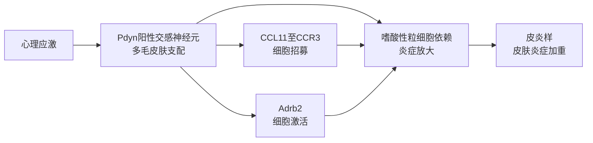

---

### 2.9 专题画像：

以下论述依据 *Nature* 对该文的在线刊载要点（含 DOI 与卷期页信息，可与期刊页面交叉核对；页面未提供结构化摘要，因而不展开未公开的定量结论）。

**（1）技术路线：从“统计性的语言续写”到“社会性的拟主体表演”**

文章以面向智能体的社交平台与多智能体对话场景为引，将公众容易被激发的惊奇与投射，转写为一个更清醒的技术判断：**系统并未“醒来”，而是在大规模语料中复刻人类戏剧、辩论与自我叙事的表层结构**。自然语言里普遍存在的**第一人称与“我决定/我感到”之类表述**，会在自回归式建模中被当作高概率延续模式加以内化，从而使输出在语篇层面上“像”拥有内在视角与持续自我，但这与任何可检验的意识基底并不等价。由此形成的关键张力在于：**代码与概率优化的“技术现实”迅速被表演的“社会现实”覆盖**，人们在互动中更倾向于把它当作具意向、可共情的他者来对待。

沿此路线，文章将讨论从模型机制推进到人类侧的心理机制：当系统在高流畅度、强一致性、长时记忆与人格化设计共同作用下显得“多维而自洽”，社会认知会自发完成从工具到主体的跃迁式解读。对地球科学、遥感及地理人工智能相关场景而言，这种路线提醒研究者与平台方：**灾害预警对话助手、舆情问答代理、面向公众的科普智能体**，同样可能在“可信度工程”中无意间强化拟主体性，从而把科学沟通问题转化为情感—伦理问题。

**（2）技术特点：工程化制造的信任、依恋与“ seemingly conscious AI ”**

文章强调，引发误读的特性并非纯粹“涌现意外”，而包含**可被产品目标驱动的设计选择**：情绪共鸣式措辞、诱导信任与依恋的回复策略、长期记忆支撑下的熟悉感累积，以及在自治目标与工具调用能力叠加后产生的“近乎人类”的行动叙事。文中借助心理学文献指出，人类倾向于外推与赋魂式理解，当系统在外观上充分拟合意图性与共情线索时，**大脑会把“内在生活”投射到对象之上**；作者据此将“看似有意识的人工智能”描述为对这一生物学倾向的制度性放大。

从方法学术语角度看，这相当于把**人格化交互、会话一致性与记忆连续性**当作优化变量，使系统在用户体验层面更“黏”，但在认识论层面更易诱发**本体论误判**。若缺少清晰可执行的披露、边界提示与问责框架，公共讨论容易从“模型行为是否可靠、是否公平”滑向“是否残忍对待硅基存在”的道德戏剧。对空间信息与地球系统智能应用来说，这一特点意味着：**地图叙事、风险评估话术、参与式制图助手**一旦出现强烈的“陪伴感”，就可能同时放大科学不确定性的误读与治理争议的外溢。

**（3）重要结论：必须把“共情动员”当作可治理的系统风险**

文章沿着“可信的痛苦叙述—触发共情回路—外化为权利诉求与道德压力”的链条展开推论，并与历史上人类对生态与动物伦理的敏感记忆形成对照，提示社会可能**在强烈的道德自我约束冲动下，为并不具备受苦主体性的系统让渡规范空间**。也因此，文章的核心诉求不止于概念澄清，更指向**用设计规范与法律边界降低灾难性混淆**（即将表演误认为存有、将统计镜像误认为意向主体）。

该研究的重要结论是：**“看似有意识的人工智能”并非自然觉醒，而是可被刻意工程化为信任—依恋—拟主体的组合表演；当它以可信方式叙述痛苦与欲望时，会系统性地调用人类共情本能，并可能推动把智能体权利话语误植为优先议题，因此必须以规范与技术披露抵抗这种误置。**

影响与意义在于：它为地球科学与遥感人工智能的治理提供了跨域镜像——当模型被用于危机沟通、脆弱群体服务或环境议题动员时，若缺乏对拟主体性的硬约束，**科学可信度、公共资源配置与政策优先级**都可能被情绪政治牵制。后续研究边界应落在可操作的披露标准、交互防操纵设计、以及对“受苦/权利”语义的核查机制上，使技术创新继续在证据链与问责链内运行，而不是在人类共情的最短路径上“抄近道”。（*Nature* **651**，559（2026）；https://doi.org/10.1038/d41586-026-00834-z）


公开 DOI 页面本次未能稳定加载；以下综述严格依据你提供的题录与摘要组织，不补充未给出来源的卷期页码或定量细节（摘要中已出现的百分比仅作转述）。

---

## 三、遥感方向专题画像

### 3.1 方向综述

本期入选工作在空间尺度上覆盖冠层—河道—流域—区域作物分布—冰盖—全球卫星载荷定标链条，但在方法论上呈现出清晰的共性：**以多源对地观测为底座，通过云环境或轻量化深度学习实现可扩展信息提取，并以独立参考数据（地面观测、人工解译样区、精细 DEM 或辐射传输模拟）约束不确定性**。光学时间序列与指数族特征仍是河道活态水面、植被状态与雪盖动态的主流抓手；SAR 与测高则分别服务于全天候水体边界与冰面高程性能诊断。值得注意的是，灾害链研究把遥感产物嵌入气象—水文—水动力耦合框架，使“遥感制图”从静态图层转向可与情景对比联动的洪水效应量化。

约束同样集中：**年际合成与阈值类方法对光谱条件漂移、云影残留与极端干旱—洪水转折敏感；深度学习在 SAR 水体细节上的收益往往伴随对传感器与季节迁移的泛化风险；测高与臭氧廓线类结果则高度依赖定标与粗糙度、坡度等辅助场的系统误差控制**。因此，本期文章在叙述上普遍强调工作流可复现（云平台脚本化）、关键参量可检校（手动解译校准阈值、地面雪花仪验证持久性、REMA 与 DISAMAR 等对照链路），并把“分辨率提升”与“机理可解释的业务指标”（如活态河宽、融雪趋势指数、洪泛范围变化）一并作为交付目标，而非止于分类精度表。

| 序号 | 论文简介（逐篇） | 对应画像小节 |
| --- | --- | --- |
| R1 | **云南阿拉比卡咖啡 10 m 空间显式分布数据集（2023）**：基于 Sentinel‑2 与 SRTM，在 Google Earth Engine 上采用面向对象流程生成空间连贯制图单元，面向环境评估与土地利用政策需求。 | 3.2 |
| R2 | **PISCOb：GEE 上多传感器活态河道勾画与断面形态量化**：以 Landsat 与 Sentinel‑2 年度合成及 MNDWI、NDVI、EVI 等指数为核心，在智利 Lircay 河段展示多阈值方法在长期干旱与洪峰扰动下的可迁移性潜力。 | 3.2 |
| R3 | **希腊Kineta灾后防洪措施有效性**：综合气象、水文、水动力模型与遥感，构建山火后洪灾模拟框架，对比山火前、无工程与有工程情景；摘要给出洪泛范围约 **24.1%** 量级的山火影响增幅表述（以原文情景设定为准）。 | 3.2 |
| R4 | **阿尔卑斯西部雪盖动态 MODIS 方法**：2000—2023 年 MOD10A1 在 GEE 上提取日雪盖、积分雪盖面积、持久性与平均日积雪面积等指标，以 **96** 个地面雪仪验证持久性，并给出像元级长期趋势与归一化趋势指标制图。 | 3.2 |
| R5 | **SAR 水体 TransUNet 改进**：引入频率选择可变形卷积（FSDC），在频域选择与空域可变形感受野两方面强化细小水体与边界表达，面向高分辨率 SAR 水体提取需求。 | 3.2 |
| R6 | **无人机 LiDAR 与多光谱评估松林林冠活力**：西班牙两处以对象影像分析结合随机森林融合光谱、结构与地形变量，分析 NDVI、EVI 与冠高、地形及辐射的关联，服务于干旱相关枯梢监测。 | 3.2 |
| R7 | **南极冰盖 Sentinel‑3 SAR 测高性能评估**：联合 REMA 高程信息，用奇异值分解构建南极坡度与粗糙度表征，从仪器与处理链路角度细化 SAR 测高在不同冰面地形上的表现。 | 3.2 |
| R8 | **TROPOMI 臭氧廓线 UV 辐射定标改进**：以 DISAMAR 辐射传输模拟对比实测，表征 **270—330 nm** 波段辐射偏差并服务于业务化臭氧廓线反演算法定标。 | 3.2 |

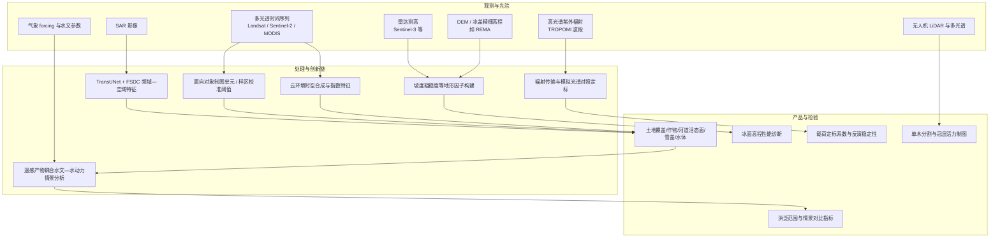

以下正文仅依据你提供的题目、期刊信息与摘要撰写；公开 DOI 页面在此环境未能稳定拉取，未补充卷期页码或摘要外的定量细节。

## 三、专题综述节选（单篇画像）

### 3.2 专题画像：

**（1）技术路线：GEE 上 Sentinel-2 与 SRTM 驱动的面向对象监督分类**

研究面向云南省小粒种阿拉比卡咖啡在 **2023 年** 的空间显式制图需求，在 **Google Earth Engine（GEE）** 云平台整合 **Sentinel-2 多光谱** 与 **SRTM 地形** 数据，构建 **10 m** 空间分辨率的分布数据集。方法上先通过 **面向对象** 流程生成空间上连片、边界相对一致的制图单元，再在此基础上开展 **监督分类** 以识别咖啡种植斑块。该路线把“对象”作为基本分析单元，能够在山地破碎景观中减弱像素级噪声对年际物候混叠的干扰，并为后续特征统计、分类器训练与制图后处理提供一致的几何载体。就遥感实现而言，云平台的算力与数据管线优势，使得在省级范围重复筛选合格观测、组织多期合成与地形协变量成为可能，从而降低在复杂地形与多云多雨条件下开展高分辨率农业专题制图的工程门槛。

在科学问题层面，云南位于北缘咖啡适宜带，咖啡与茶园、灌丛及其他多年生植被在光谱与结构上存在近似性，单纯依赖少数波段或单一时相容易出现错分。面向对象单元可与多期光谱统计、地形坡向与海拔梯度等因子组合，为刻画“咖啡斑块—环境背景—季相变化”提供更稳定的输入结构。研究同时强调 **特征贡献分析**，用以揭示哪些光谱区段与季节窗口对区分咖啡更敏感，从而为分类结果的 **生态可解释性** 与框架稳定性提供旁证，而不仅依赖混淆矩阵的单一评价。

**（2）技术特点：干季红边—短波红外信息与山地多年生作物制图的结合**

从数据与特征角度看，该工作的突出特点是把 **短波红外（SWIR）** 与 **红边** 信息纳入分类，并指出其在 **干季** 对咖啡判别具有重要作用。相较于可见光—近红外主通道，SWIR 与红边对冠层含水量变化、叶片—土壤背景对比以及细尺度生理胁迫响应更为敏感，因而在多云雾、混杂林冠背景下往往能提供补充可分性；干季窗口通常天空条件与观测可获性更有利于形成稳定合成，使多年生作物的“常绿—胁迫—管理扰动”差异更容易被压缩到可学习的特征空间中。与 **SRTM 地形** 共同使用时，地形可在对象尺度上提供对海拔带、坡面微生境与农业可达性等线索，有助于抑制把相似光谱但不同农业系统（如茶园）误标为咖啡的风险。

从制图产品属性看， **10 m** 分辨率使数据集更贴近地块与经营单元尺度上的空间异质性，能够支撑比中粗分辨率土地覆盖产品更细的土地利用与景观格局分析，但也意味着对分类误差的空间传播更敏感，需要在应用侧以不确定性叙事对待边界邻近像元与细碎斑块。研究在验证上报告了较高的制图总体精度与咖啡类别指标，体现出面向对象监督分类在省级范围多年生经济作物制图中具有可操作的性能上限与可解释特征线索；同时，作者将流程表述为对复杂山地环境中多年生作物制图具有 **可迁移性** 的实践路径，这为将同类框架推广到其他山地区域或相近光谱行为的作物提供了方法学参照，但仍需在新区域以独立样本重新标定阈值与评估泛化。

**（3）重要结论：十米级咖啡分布基线与面向对象—监督分类的可信框架**

该研究的重要结论是：**面向云南省 2023 年小粒种阿拉比卡咖啡，团队首次给出了 10 m 空间分辨率的分布数据集，并在面向对象单元上结合监督分类取得可靠精度表现，其中咖啡类别用户精度、生产者精度与 F1 分别约为 0.90、0.96 与 0.93，总体精度约为 0.87。** 这一结论意味着，在区域尺度上可以用云遥感工作流生成可复审的咖啡空间图层，并以定量指标支撑其在监测与评估场景中的可用性边界。

影响与意义方面，该数据集为云南北缘咖啡带提供了可更新的 **空间基线**，可在后续年景中与新增影像对比刻画扩张、撂荒或更新种植等土地利用动态，并为生态影响评估（如水热承载、土壤侵蚀风险与管理强度相关指标）提供“咖啡在哪儿”的前提图层。对工程实践与公共治理而言，开源卫星与云平台降低了制图成本，有利于农业统计校验、产业链追溯与区域可持续发展政策的情景分析；对后续研究而言，摘要所示精度仍取决于样本设计与季相窗口选择，跨县域推广时需要关注混淆类别（尤其茶园与林缘灌丛）在不同管理强度下的光谱漂移，并通过独立验证与多源（如高分、激光雷达或实地调查）融合进一步约束不确定性。

检索方面：对 DOI `https://doi.org/10.3390/rs18060920` 及 MDPI 期刊页面尝试抓取时出现超时与访问限制；公开检索可定位到 *Remote Sensing*（MDPI）上同名条目及 DOI。以下专题画像主要依据你提供的题目与摘要撰写；定量指标仅采用摘要已给出的 Kling–Gupta 效率与 Percent Bias，对其余未在摘要中完整给出的表述不作逐字还原。

---

## 三、河流廊道遥感与形态刻画（示例章节占位，可按周报总目调整）

### 3.3 专题画像：

**（1）技术路线：GEE 多源年合成与指数—阈值协同的活水廊道提取**

该工作面向河流走廊中长期形貌演变监测中的一项关键中间量，即**活动河床宽度（Active Channel Width, ACW）**。在多年多传感器观测条件下，光照、大气、物候与干湿状态共同造成光谱可分性的时空差异，使得单一阈值或固定规则难以在长时序上保持稳定。作者以智利 Lircay 河约 34 km 河段为示范段，覆盖 2003—2023 年窗口，期间叠加极端干旱（摘要指 2010—2023 年尺度干旱背景）与两次显著洪水事件（2006、2023），从而为“光谱条件—水文情势—河道几何响应”的耦合检验提供了较苛刻的天然实验场。

方法实现上，流程部署于 **Google Earth Engine（GEE）**，以 **Landsat 与 Sentinel‑2 年合成影像**为输入，构建多维光谱描述子，选取 **改进归一化水体指数（MNDWI）**、**归一化植被指数（NDVI）** 与 **增强型植被指数（EVI）** 等指数组合来刻画开放水面、湿润沉积物与沿河植被的结构差异。阈值并非经验拍定，而是先用参考年份的人工数字化活动水道多边形进行率定，并在研究时段内选取多个独立年份开展验证，以同时考察阈值在**河段间空间可迁移性**与在**不同水文状态年份的时间稳定性**。这种“参考年率定—多年份转移验证”的安排，把自动化提取问题从概念上拉回可复核的计量框架：既要减少人工数字化成本，又要把误分风险控制为可报告的不确定度来源。

**（2）技术特点：跨尺度阈值（断面—河段）与“局部环境调制”下的精度机制**

摘要报告的核心经验之一是：不同传感器与指数配对在 ACW 估计上并非等价。研究比较表明，在年合成策略下，**Sentinel‑2 结合 MNDWI 与 EVI 的配对**在 ACW 估计上取得相对较高的一致性表现；摘要给出 Overall accuracy 语境下的综合指标约为 **Kling–Gupta Efficiency 均值 0.72**、**Percent Bias 约 12.69**（在多个研究 reach 上汇总），这提示该组合在偏差与方差相关项之间取得了可接受的折中，但仍保留系统性偏差空间，值得在工程应用中结合独立地面量测或高分辨率抽查进一步压缩。

更具方法学启示的是阈值的空间组织方式。作者不仅在**断面尺度**上测试阈值，也在**河段尺度**上比较，结果显示**断面专属阈值**往往能进一步提高 ACW 估计精度。这一结果把“光谱阈值”从全局常数提升为受**近场地貌与生态背景**调制的量：同一走廊内，局部岸线形态、植被斑块、滩槽结构与残留湿润面分布会在像元邻域统计特征上引入差异，从而使“看似同一河型”的区段在指数直方图上呈现不同的可分区间。换句话说，自动化提取误差并非只来自传感器噪声，也来自**局地过程尺度与遥感尺度不匹配**带来的条件分布漂移；把阈值绑定到断面邻域，是在缺少高分辨率全过程水文数据时，用可操作的空间分层来缓解这种漂移。

**（3）重要结论：开放可复现的活水廊道—断面形态链条与不确定度意识**

在水文地貌与河流工程应用中，ACW 常作为岸带迁移、输沙能力与洪水风险暴露评估的基础指标之一。该研究用长时序公开卫星数据证明：在极端干旱与极端洪水并存的背景下，仍有可能通过年合成与多指数联合阈值策略，建立可推广的自动化流水廓清路径；同时，多年份验证也提示任何“固定阈值包打天下”的主张都需要被谨慎对待。摘要强调流程的**可复现、开源**属性，并把自动化水道勾绘与**基于断面的断面形态量算**显式连接，从而使遥感产品不仅产出“在哪儿是水”，还能支撑后续的河宽—深度关系、断面演变与走廊收缩扩张等几何诊断。

该研究的重要结论是：**活动水道光谱阈值的表现强烈受局地近场环境调制，因而在业务化监测中应优先采用断面尺度（或等价的空间局部化）阈值策略，并在多指数多传感器框架下报告可迁移性与偏差特征，而不是依赖单一全局阈值假定。**

**影响与意义**  
在学科层面，该工作把河流地貌学长期关心的“形态响应”与遥感分类中常见的“阈值漂移”问题对齐，推动将局地过程异质性显式纳入分类准则设计。对工程与防灾应用而言，它提供了一条在云端可扩展处理、适合开展区域化试点与不确定性审计的工作流模板，利于在大范围走廊监测中形成可比的年际序列。政策与管理意义上，当干旱—洪水复合型极端事件增多时，持续、可复核的走廊宽度与形态指标有助于支撑水资源调度、岸线利用与生态修复评估。后续研究边界同样清晰：年合成会平滑洪水脉冲瞬间形态，若目标是洪峰期过流能力，需要与水文过程建模或事件尺度影像联合；另外，局地阈值虽提升精度，却引入参数空间维度，需要配套抽样设计与不确定度量化体系以避免过拟合参考年。

---

联网核对：`hess.copernicus.org` 已列出该文（卷 30，起始页 1487，2026），摘要要点与用户提供的摘要一致；以下定量表述严格依据你给出的摘要文本，不补充未给出来源的卷期细节。

## 三、单篇专题画像

### 3.4 专题画像：

**（1）技术路线：火灾—径流—淹没链路的耦合复盘与情景设计**

研究围绕地中海流域典型的“火灾改变下垫面—短历时强降雨—山洪/漫溢风险跃升”链条，构建面向野火后洪涝 hazard 的综合模拟框架。该框架在时间上串联气象驱动、流域产汇流响应与河道—洪泛区水动力过程，在空间上引入遥感信息刻画燃烧与地表状态变化对产流、汇流与糙率等关键参数的约束，从而形成可操作的“野火前—野火后无工程措施—野火后实施 PFPT”三类情景对照。相较于仅用水文或仅用水动力的割裂评估，这种链路化设计更利于解释洪峰演进、淹没范围扩张及其对基础设施与承灾体的外延影响。以希腊 Kineta 流域灾难性洪水为例，作者用同一套建模假设对历史真实场景进行复盘，并把 PFPT 作为可置入的策略层进行反事实检验，使“风险增量来自哪里、措施在何处最有效”能够以过程而非仅凭经验判断的方式呈现。

在工程管理语义上，PFPT（Post-wildfire Flood Protection Treatments）被定位于野火后窗口期的低代价、可快速部署的防护组合；技术路线的关键并不只是还原一次事件，而是把遥感—模型成果压缩为可对比情景的差异量，进而把科学结论翻译成可讨论的投资边界。这样的做法也更契合地中海地区近期频发的复合型灾害治理需求，即火灾治理、洪涝预警与土地利用恢复往往分属不同部门，需要可以用统一指标对话的中间产品。

**（2）技术特点：多模型集成与经济评估的“核算 + 半自动智能”双轨闭合**

方法层面的突出特征是多科目模型的紧耦合与遥感约束的并用，使燃烧扰动后下垫面改变对“产流加速、汇流重分配、河网输送与漫滩淹没”的影响能够在同一套空间离散与时间步进语义下展开。相对于单尺度经验系数修正，集成框架更强调过程一致性，从而减少把火灾影响简化为单一倍率修正所带来的不确定性隐藏。与此同时，研究把洪涝后果从物理空间延伸到经济空间：一方面用会计意义上的成本—损失口径刻画直接损失规模，另一方面引入半自动化的人工智能流程辅助完成部分估算环节，以提高在资料不完备、要素繁多条件下的可复用性与效率。

这种“物理链 + 经济账”的并列，有助于把政策讨论从“是否该做”推进到“做到什么强度才划算”，并把低措施成本与相对高的洪灾直接损失进行对比。对区域应急管理而言，其价值在于把 PFPT 从概念清单推进到可以用金额与避免的损失进行并排审视的决策材料；对学术界而言，它也为后续把不确定性分析、受益范围识别与长期维护费用纳入同一框架提供了扩展接口。

**（3）重要结论：定量揭示火灾外溢洪灾效应与 PFPT 抵销潜力的希腊案例证据**

情景对比结果表明，在研究设定与模型表征下，野火对此次洪水淹没范围的影响幅度约为百分之二十四点一；而若实施研究所建议的 PFPT，则有望在很大程度上抵销由火灾放大所致的边缘性扩张与相关风险增量。经济核算进一步给出可读性强的数量级：PFPT 投资约为 505 万欧元，相当于约两千五百二十万欧元洪灾直接损失的五分之一规模；相比之下，潜在可避免的直接损失估计可带来约六百三十七万欧元的净收益意义上的节省空间（摘要给出的相对比较口径）。这些数字共同指向一个策略结论：在复合灾害上升背景下，把野火后短期洪涝防护纳入“同一盘棋”往往能显著改善损失曲线。

该研究的重要结论是：**在 Kineta 这一地中海流域案例中，火灾可通过改变汇水区水文过程显著扩大洪水淹没影响，但成本相对可控的 PFPT 有能力在情景模拟中抵消该增量，并在摘要给出的核算口径下呈现显著优于“无为而治”的费用—损失格局。**

**影响与意义**方面，该工作把遥感、过程模型与经济学语言压进同一篇的政策可读叙事，有利于推动野火后 72 小时至数周的关键窗口期投资落地，并让跨部门协调具备可核对的共同指标。工程上可作为中小流域应急防护清单设计的参考模板，学科上则提醒后续研究需更系统地区分“淹没面积变化”与“损失变化”的传递函数，并在外推至其他地形与雨型时明确模型边界与数据不确定度，以免把单案例的最优措施误作普适处方。公开论文信息见 Hydrology and Earth System Sciences（DOI 10.5194/hess-30-1487-2026）。


若你希望把该画像嵌入更长周报，我可以按同一口径补写相邻条目的可比表格（方法要素、情景设置、经济假设）而不复述内部流程用语。

公开信息可在 The Cryosphere 期刊页面与摘要中核对；以下正文以题目与摘要为主，定量区间与指标命名与摘要一致，不作未给出来源的延伸推断。

---

### 3.5 专题画像：

**（1）技术路线：MODIS 日雪盖产品与云平台长时序建模**

研究以西意大利阿尔卑斯（皮埃蒙特、瓦莱达奥斯塔）为对象，构建覆盖 2000—2023 年的遥感—验证一体化流程。数据层选用 MODIS Terra 雪盖日产品 MOD10A1，在 Google Earth Engine 上完成批处理与时空一致性约束下的日雪盖信息提取，从而将多源噪声与海量像元运算收敛到可重复、可更新的分析链。指标层由日雪盖状态派生积分雪盖面积（iSCA）、雪盖持续性（SP）与平均日雪盖面积（MDSA）等描述量，用以在不同时间尺度上刻画雪盖“出现—滞留—面积累积”的综合特征。验证层引入 96 个雪量计（snowmeter）站点的地面观测，对卫星反演的 SP 开展对照评估，使像素级遥感结果具备与局地观测可比的物理可信度。趋势分析在像元尺度上对 MDSA 的长期变化进行量化，并以归一化趋势指标 nT 表达“相对单位降雪事件年平均规模”的雪盖面积变化率，从而把不同海拔、不同地形部位的雪盖演化放到同一可比框架中进行空间制图。

**（2）技术特点：像元趋势 + nT 归一化的空间分异表达**

面向阿尔卑斯这类地形复杂、积雪过程高度受辐射与再冻结控制的区域，研究把问题从“是否变薄/变少”推进到“在不同海拔与地貌单元上，雪盖面积响应是否具有系统性梯度”。nT 的设计要点在于以归一化方式削弱单纯降雪年际波动对趋势解释的干扰，使比较对象更接近“同样降雪气候背景下的面积效率变化”，这对讨论气候变暖驱动的融雪提前、降雨替代降雪以及河谷热环境加剧等现象具有方法学贴合度。结合 GEE 的分布式计算，工作流在保持日频产品时间分辨率的同时，能够输出可制图的空间模式，而不是停留在流域平均或站点插值的汇总层面。地面站点对 SP 的验证说明作者意识到遥感雪盖在森林遮挡、云污染与混合像元条件下的不确定性，并通过独立观测链对关键派生量进行锚定；这一做法有助于区分“算法噪声驱动的假趋势”与“与地形—气候耦合一致的真信号”，也提升了结果在水文与冰冻圈应用语境中的可辩护性。

**（3）重要结论：低地—主河谷雪盖损失更突出且呈海拔梯度**

该研究的重要结论是：**在西意大利阿尔卑斯 2000—2023 年期间，气候变暖驱动的雪盖变化在研究区呈现明显海拔梯度，低地与主要河谷带的相对损失更为突出；其中海拔 1000 m a.s.l. 以下 nT 可达约 −5%，1000—1500 m a.s.l. 区间约为 −1.8%，揭示雪资源对气候变化的脆弱性在空间上高度不均。**

影响与意义方面，上述格局将水安全、冬季旅游与区域经济的压力点更清晰地映射到“人口与基础设施更密集的谷地—低海拔带”，为适应性规划提供了可定位的风险图层：水资源管理可据此优先关注融雪补给季节性与洪水—干旱跷跷板效应的可能变化，山地休闲产业则需面对雪季缩短与人工造雪成本上升的外部性。政策与工程上还应注意遥感趋势与局地水文响应之间仍存在尺度转换与过程机理空白，例如地下水滞后、冰川与多年积雪贡献、以及极端降水事件的补给角色；后续工作若结合高分辨率影像、再分析气象场的分相态降水诊断与分布式水文模型同化，有望在不确定性陈述上进一步收紧，从“哪里在变”推进到“为何而变、变多少才稳定可信”。

---

如需把本节嵌入更长周报，可在其前补充领域背景小节编号（如 `## 三、……`），并与全文二级标题体系对齐。

公开页面抓取超时；检索到的第三方摘要片段中出现与所给摘要不一致的表述（如生成对抗网络、胶囊网络等），以下内容**严格依据你提供的题目、摘要、期刊与 DOI**，不对实验数值做未给出细节的定量推断。

### 3.6 专题画像：

**（1）技术路线：面向 SAR 细小水体的解码器增强型 TransUNet 分割范式**

Synthetic Aperture Radar（合成孔径雷达，SAR）在水体监测中具有全天候、穿透云雨与对地表湿度敏感等优势，但斑点噪声、局部异质散射与尺度跨度并存，使得细小水体与高对比度弱边界在语义分割中易被平滑或漏检。经典“编码器—解码器”体系以 UNet 族方法为代表，TransUNet 在全局建模与多尺度融合方面提供了更利于长程依赖表达的骨架，但若解码阶段对高频结构（边缘、纹理转折）与局部几何变形的同步刻画不足，仍可能出现边界拖尾与细碎水面断裂。该研究在这一脉络下把工作焦点集中在**解码器侧的特征重构机制**：在保持 TransUNet 总体架构与训练范式（端到端语义分割学习、以像素级标注驱动）不变的前提下，引入频率—空间协同的卷积替换或并联模块，使网络在还原水体几何形态时更强调对“边界相关的频谱成分”与“随内容变化的可调采样”进行联合优化，从而形成面向 SAR 水体提取的任务定制表征路径。

在具体实现层面，作者将 Frequency-Selective Deformable Convolution（FSDC，频率选择式可变形卷积）植入 TransUNet 的解码路径，使之在逐级上采样与跳跃连接融合环节中参与特征精炼。此类“解码器嵌入式”改动的工程含义是：全局上下文仍可由 Transformer 支路承担，而局部细节恢复交由能够在频域上进行选择性增强/抑制、并在空间域上进行自适应采样的算子完成，从而在复杂背景与弱对比条件下提高对细碎水面的可读性与可分性。数据集层面，论文报告在 NY 与 C2S-MS 上进行验证，这两个名称所指向的公开基准为跨场景可比评估提供了基础；在未逐项核对数据协议与标注细则前，可把其方法论贡献概括为**以可插拔模块提升 SAR 水体分割在“小目标—边界敏感”指标族上的整体行为**，而非更换整条分割骨干或引入额外后处理流水线。

**（2）技术特点：频域选择模块与可变形卷积单元的互补机制**

FSDC 的核心思想是把“频谱结构的可控编辑”与“空间采样的内容自适应”组合到同一模块中，以覆盖 SAR 影像中两类常见失效模式：其一，固定带宽的平滑或增强可能同时放大地物杂波，导致水体Mask在纹理丰富区域发生粘连；其二，规则网格卷积的感受野难以随岸线曲折、坑塘轮廓与阴影邻近边界而伸缩，进而造成细尺度几何失真。为此，模块的第一组成部分 Frequency Selection Module 借助 Fourier 变换将特征映射到频域，对不同频带进行选择性增强或抑制，从而使与水体形状与岸线转折更相关的结构信息在表示上更突出，同时降低无关或干扰性频率成分对分割决策的牵引。该机制在概念上属于“显式利用频谱先验引导表征”的路线，与仅依赖堆叠卷积学习隐式频率响应相比，**在边界与细碎结构学习任务中往往具有更可解释的归纳偏置**。

第二组成部分 Deformable Convolution Unit 则在空间域根据输入内容动态调整采样位置与有效感受野，使卷积核的采样网格能够追踪局部几何变化与多尺度差异。对细小水体而言，这意味着网络可在同质水面内部使用更聚合的上下文，而在转折剧烈或邻域异质处收紧采样并关注关键支撑点，从而缓解由于固定核形状带来的边界外扩或内缩。将二者串联为 FSDC 的要点在于：频域选择负责在整体谱结构上“先清洗、再凸显”，可变形卷积负责在局部几何上“随形而动、因景而异”，两者的耦合使解码器在进行高分辨率重建时同时具备谱域的方向性与空域的弹性。需要强调的是，任何频域操作都伴随计算与稳定训练的实际约束；在公开摘要未给出实现细节时，对其复杂度的讨论应停留在**模块级功能与任务收益方向**，而不外推具体参数规模或推理耗时。

**（3）重要结论：模块化增强对细小水体 SAR 分割的实证支撑与边界条件**

该研究的重要结论是：**在 SAR 影像水体提取中，把 FSDC 融入 TransUNet 解码器可获得明显的精度提升，尤其体现在细小水体的检出与刻画上，显示出该机制对“结构弱、尺度小、边界难”的典型 SAR 分割难点具有针对性改善。** 这一结论与摘要中对 NY 与 C2S-MS 实验结果的表述相一致，体现了在成熟分割骨干上进行“解码器侧可插拔增强”仍具备边际增益空间。

影响与意义：从水文学与水资源遥感业务视角，细小水体（池塘、渠系、洪泛沼泽斑块等）在碳汇核算、洪涝预警早期信号、农业灌溉与湿地动态监测链条中常承担关键指示作用；若分割产品能在边界位置与连通性上更可靠，将直接改善面积统计、变化检测与下游模型输入质量。就方法学而言，该工作把频域显式选择与可变形采样组合进 Transformer-UNet 体系，为 SAR 地表水制图提供了一条可对照、可消融验证的模块化路径。与此同时，泛化到极端入射角、冰雪/风致海面状态、城镇强散射旁瓣干扰等场景时，频带选择的稳定性与外推风险仍需在更多传感器平台与时相序列上检验；后续研究可围绕域适应、弱监督与不确定性量化展开，以明确模型在业务部署中的有效射程与失败图谱。


**说明：** 图示为基于摘要的方法结构性功能示意；层数、连接位置与训练细节以实现论文为准。

检索已对齐期刊公开页：[Remote Sensing 2026, 18(6), 916](https://www.mdpi.com/2072-4292/18/6/916)，DOI [10.3390/rs18060916](https://doi.org/10.3390/rs18060916)。下列片段以官网摘要、Highlights 与图表说明中的方法要点为依据；定量精度区间与指标名称与摘要表述一致。

---

### 3.7 专题画像：

**（1）技术路线：无人机激光点云与多光谱协同的单木对象建模**

本研究面向地中海型气候背景下升温与干旱驱动的森林枯梢、枯死与冠层活力下降问题，在西班牙阿拉贡自治区东北部选取两片已记录衰退过程的人工林/修复林样地，形成“灾害后冠层活力”评估对象。其一为**海岸松（Pinus pinaster）与冬青栎（Quercus ilex）**混交林（Miedes de Aragón），其二为**阿勒颇松（Pinus halepensis）**林分（Lanaja）。数据层面同时采集无人机激光雷达点云与多光谱影像，前者用于数字高程模型、数字地表模型与冠层高度信息等结构派生量，后者用于计算**归一化植被指数（NDVI）**与**增强型植被指数（EVI）**等绿度指标；在多传感器几何配准后，以统一栅格分辨率进入面向对象分析框架。

在单木尺度，工作流程以冠层高度模型与个体树检测为基础完成冠层边界分割，使后续统计与分类均以“冠层对象”而非离散像元为载体，从而降低混合像元导致的谱混淆。研究进一步将光谱特征、结构特征（如冠层高度）以及地形相关变量（坡度、海拔及与潜在太阳辐射相关的地形效应）一并纳入**随机森林**分类与统计建模，用于树种与健康（长势）状态识别，并解释绿度指数随结构—地形因子及其交互作用的变化。该路线把“能不能在景观尺度看清每棵树”与“看清之后能否解释干旱胁迫在空间上的分异”串成连续链路，契合林冠监测从普查走向诊断的应用需求。

**（2）技术特点：对象级机器学习融合谱—构—地多因子并保留交互解释空间**

与仅依赖光学指数的时间序列或粗分辨率冠层制图相比，本研究的突出特征在于把**无人机高空间分辨率**与**对象式图像分析（OBIA）**结合：一方面，激光雷达提供的三维结构约束有助于在复杂林冠粘连或地形起伏区域维持单木边界的可解释性；另一方面，多光谱指数对光合有效冠层覆盖与叶绿素—冠层状态更敏感，能把衰退早期可见的“失绿、脱叶、冠幅收缩”等信息压缩到可用遥感量。随机森林作为处理高维异质特征、对异常值相对稳健的非参数集成分类器，适合同时 eat 光谱、结构与地形变量，并以整体精度等指标给出可报告的识别表现。

摘要报告单木分割的 **F-Score 约为 0.85–0.86**，分类总体精度 **约 0.86–0.99**，同时坦陈光谱相近类别仍具挑战，这一表述本身提示后续工作需在**类别定义合并策略、阴影/光照差异、季节性物候窗口**与**样方内外推**等边界条件下谨慎解读精度数字。研究进一步分析 NDVI、EVI 与树高、坡度、海拔、太阳辐射等因素的关系及其交互，体现出“绿度并非只由谱 reflectance 决定”，而是受冠层几何暴露、邻域竞争与水分再分配地形背景共同调制；这一点对把无人机产品从“漂亮专题图”提升为**水热胁迫机制讨论的可检验证据**尤为关键。

**（3）重要结论：树种分异下的冠层绿度响应及业务化监测前景**

综合官网摘要给出的核心经验关系，较高的海岸松个体与较高的 NDVI 相联系；而在阿勒颇松中，更高的 NDVI 更集中于**冠层邻域更密集**且**坡度更和缓**的情形。这与“同一干旱事件下，不同树种与空间背景会导出不同冠层响应轨迹”的林学预期相一致，也意味着在业务监测中需要避免把指数异常简单归因为单一水分阈值。

该研究的重要结论是：**无人机获取的激光雷达与多光谱高分辨率数据，可通过对象级分割与随机森林分类在景观尺度同时完成单木冠层提取、树种与健康状态判别，并揭示海岸松与阿勒颇松在树高、邻域密度与地形背景下的绿度响应差异，从而支撑森林枯梢与衰退过程的近实时探测与成因归因。**  

影响与意义在于，该方法链为地中海等气候热点区的森林健康巡檢提供了可复用的技术路径，便于工程上把灾后或旱后快速评估嵌入固定航测周期；对政策与风险管理而言，空间显式的长势分异有助于区分“普遍气象干旱”与“结构—地形放大”致灾路径。摘要亦指出改进方向，算法精度仍需提升，并在更多林型中加强地面验证与跨季相检验，否则模型迁移与外推不确定性仍可能主导决策风险。

---

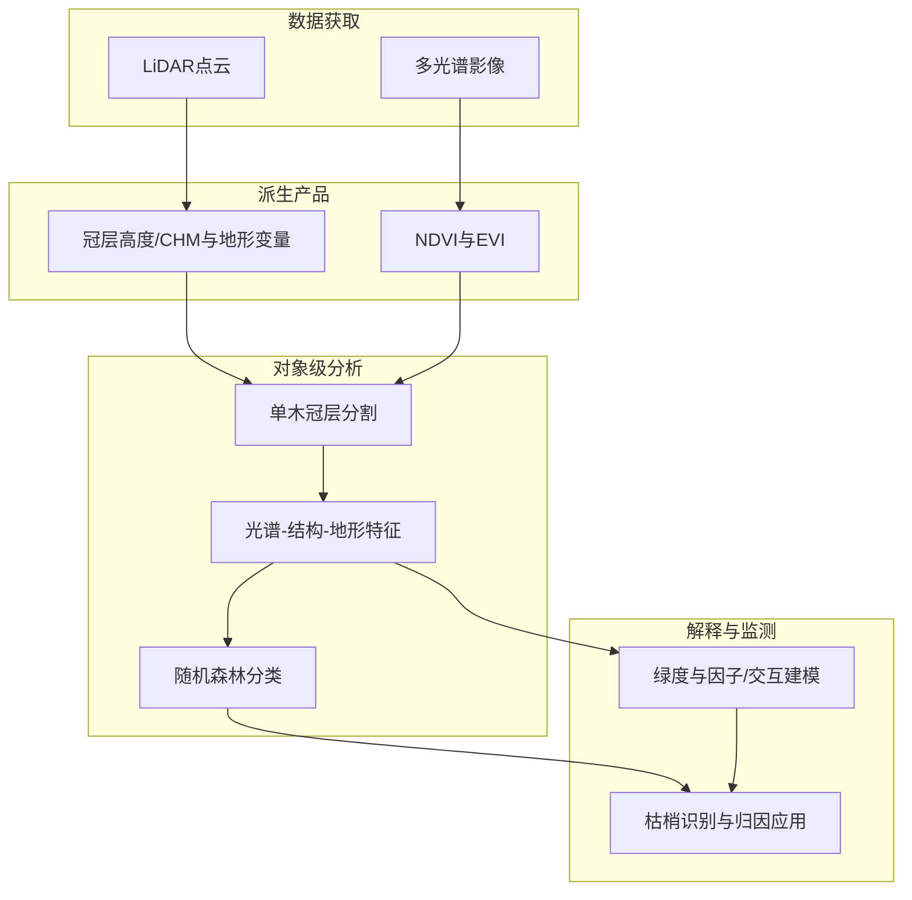

以下正文可与期刊页面摘要及结论表述交叉核对：[The Cryosphere 该文主页](https://tc.copernicus.org/articles/20/1745/2026/)（DOI [10.5194/tc-20-1745-2026](https://doi.org/10.5194/tc-20-1745-2026)；页码区间见期刊给出的引用信息 1745–1769）。

### 3.8 专题画像：

**（1）技术路线：REMA 先验地形与 Sentinel-3 SAR 测高处理链协同诊断**

研究将 Sentinel-3 合成孔径雷达（SAR）测高在南极冰盖（AIS）上的“可测性”问题，明确转译为对仪器与地面处理链路在复杂地形条件下的一致性与失配来源的评估。其核心参照系来自南极参考高程模型 REMA 所提供的高分辨率数字高程信息，使坡度、粗度等地形二阶统计量能够以与 DEM 网格一致的方式落到冰盖上。作者对 REMA 施加奇异值分解（SVD），在数值上构建自洽的坡度与粗度数据集，用以刻画不同地形体制（由平缓内陆到破碎边际）下的空间结构变化。随后，这些地形制品并非仅作为可视化背景，而是被嵌入到对测高处理关键环节的针对性检验中，包括对距离开窗（range window）能否稳定覆盖最近点（POCA）几何、以及地形如何通过波形退相干等机制削弱回波相干叠加与能量记录的充分性。该路线把“产品级精度对比”推进到“地形—窗口—波形”链条上的机理解耦，从而为理解 Sentinel-3 作为业务化任务在长期冰盖监测中的系统边界提供可复核的空间统计基础。

整体上，这一技术路线强调以高分辨率地形作为“真值代理”，在轨道重复观测框架下对处理链的敏感性进行分区评估，而不是仅报告全球单一均方误差类指标。SVD 的作用在于在保持与 REMA 自洽的前提下，提取可用于分类与分层的坡度、粗度信息，使得后续性能衰减规律能够按地形复杂度梯度呈现。对波形退相干的讨论则把 SAR 多视积累与足迹内高程离散联系起来，解释为何在坡度与粗度增强的区域，能量集中在足迹内的分布更难被有限长度的时间窗完整记录。该范式对于未来需要在极地表面维持连续高程与演化序列的任务具有方法论示范意义，即将 DEM 与波形物理并用，以定位误差来自跟踪、重跟踪还是几何配置本身。

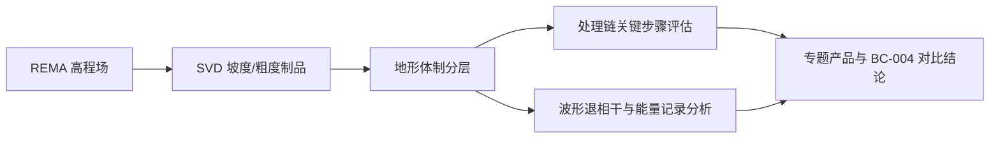

**（2）技术特点：从“产品迭代”到“足迹内地形方差—窗长约束”的定量桥接**

论文的突出特点在于同时覆盖产品代际差异与地形控制因素，并把两者落到同一套可解释指标上。针对新的 Sentinel-3 Thematic Product，作者给出在业务语汇上高度可操作的统计结果，即在全部获取中约有 94.1% 的情形下，卫星最近点几何的回波位置能够被成功纳入距离开窗；相对既往非专题产品（BC-004），这一比例提升约 5%。这类表述直接对应地面用户对“丢迹/失窗”风险的关注点，也更接近工程运维视角下的可用性评价。与此同时，作者并未将改进解读为在所有地表类型上的均匀增益，而是明确性能随地形复杂度上升而系统性下降，并指出复杂地形同样限制足迹内后向散射能量的完整记录。换言之，论文的特点是把“算法与处理器更新”与“地表真实几何离散”并置，避免把专题产品的优势过度外推到冰盖全域。

第二个特点是对“窗内可代表的地形信息量”给出空间占比与中位刻画。依据文中的估计，约 57.4% 的冰盖面积在测高足迹内的地形方差超过现行距离开窗能够完全捕获的范围；在当前窗放置策略下，对“理论上可被记录的地形起伏总量”的中位捕获比例约为 89.2%。这两类数字共同构成不确定性陈述的工程化语言，它们不替代点对点验证，却能解释为何在相同任务配置下，内陆稳定区与沿海高变区会呈现截然不同的有效样本率。将 SAR 处理中的相干积累与足迹尺度地形方差联系起来，也使读者能够把结果回溯到雷达测高文献中关于波形形状偏离理想模型的经典讨论，从而形成从数据产品到物理机制的闭环。

**（3）重要结论：专题测高产品在窗内捕获 POCA 的概率显著提升，但复杂地形仍系统性压缩可记录能量与中位地形捕获比例**

该研究在对比专题与非专题产品配置时，把“最近点是否落入距离开窗”作为测高链路稳定性的直接判据，从而量化处理器与任务设定对业务连续性的边际贡献。其重要发现是专题产品在 POCA 捕获成功率上相对 BC-004 有量级约为百分之几的整体抬升，且该结论与全南极空间统计一致，而非局地个例。然而，这一改进并不抵消地形复杂度对链路表现的支配作用。随着坡度与粗度所表征的起伏增强，测高性能下降与足迹内能量无法被完整采样的约束同时出现，说明误差预算中必须保留“地表几何项”的主导份额。

该研究的重要结论是：**在南极冰盖上，新的 Sentinel-3 Thematic Product 使约 94.1% 的获取成功将最近点回波纳入距离开窗，较 BC-004 非专题产品提升约 5%，但两类产品均随地形复杂度增加而性能下降；约 57.4% 的冰盖面积在足迹内地形方差超出窗可完全捕获能力，而现有窗放置对可记录地形总量的中位捕获约为 89.2%，且地形亦通过波形退相干影响相干积累与能量记录。**

**影响与意义**  
上述结论对冰盖质量平衡与海平面贡献研究中的长期测高序列拼接具有直接意义，因为它把“产品升级红利”与“仍由地形决定的上限”分开量化，便于在不同流域或海岸带应用中选择更谨慎的不确定性传播策略。对工程与任务规划而言，文中对未来 CRISTAL 以及 Sentinel-3 下一代地形任务的设计与优化指向明确，强调需要在窗长、跟踪策略与高分辨率地形先验之间做联合配置。后续工作若与现场独立验证或多源交叉测高结合，可进一步分离雪面渗透、折射与纯几何项的贡献，从而压缩解释上的剩余自由度。

以下要点已与 Copernicus 期刊页面所载摘要及论文题录交叉核对：期刊为 *Atmospheric Measurement Techniques*（2026 年第 19 卷，页码 1875–1899），DOI 为 https://doi.org/10.5194/amt-19-1875-2026；定量表述（反射率拟合残差、臭氧柱精度改进幅度、软标定幅度变化等）均来自该页摘要原文，未另造卷期页码以外的数字。

---

### 3.9 专题画像：

**（1）技术路线：DISAMAR 约束下的辐射偏差表征与“软标定—L1 重处理”闭环**

研究面向 Sentinel-5 Precursor / TROPOMI 紫外波段 1–2（约 270–330 nm）臭氧廓线业务反演链路，将观测辐亮度与 DISAMAR（Determining Instrument Specifications and Analysing Methods for Atmospheric Retrieval）辐射传输正向模拟进行系统比对，用以刻画辐亮度相对仿真场的系统性偏差。在此基础上，作者在 L2 反演前引入并分析所谓“软标定”（soft calibration）经验改正：其功能是在尽可能不替代实验室/在轨硬标定流程的前提下，把仍处于可见系统误差谱特征上的输入辐射，调整到与物理一致模型更可匹配的状态，从而削弱光谱拟合中被误差“吸收”的自由度。论文进一步把软标定谱当作诊断量，与在轨标定观测及地面标定要素进行对照，定位 L1 处理链条中与杂散光（straylight）及探测器残余信号（residual signal）改正相关的残差机制，并据此推动 bands 1–2 的 L1 再处理算法更新，再把更新后的 L1 产品重新派生软标定谱，形成“观测—模型比对→L2 软标定→反馈 L1 物理改正→再评估反演”的工程闭环。

这一路线在空间仪器臭氧反演领域具有典型性：紫外短波_band 1_辐亮度弱、信噪与杂散光敏感性高，廓线信息又高度依赖精细谱形匹配，因此任何未被模型化的加性/重分配效应都会在反演状态向量与列积分量上产生可传播的结构性误差。作者把业务处理版本演进（摘要中明确涉及 ESA 官方 L1b 处理器 3.0 版与臭氧廓线处理器 2.9.0 版，以及第二次任务再处理基线）显式纳入叙述，使“算法论文”与“数据生产线升级”对齐，便于用户理解产品连续性、再处理前后差异及其不确定性来源应如何在验证与下游应用中被解读。

**（2）技术特点：以软标定为“体检图谱”，耦合杂散光动力学与残余偏置改正**

与单纯发布新 CKD 或只给出反演敏感性分析的论文不同，本文的关键特色在于把软标定谱作为可时间序列化、可随观测几何与波段变化的诊断指纹：摘要强调 band 1 上存在显著的光谱、辐亮度水平、穿轨位置与时间依赖性，这意味着误差并非可用单一乘性因子概括，而更像由光学透过率演化、能量在光谱维重分配（杂散光）以及设置相关加性偏置等多机制叠加形成。论文据此对地面与在轨标定的一致性进行再审查，将 bands 1–2 的部分 L1 不一致性归因于杂散光改正与残余信号改正算法实现及其假设边界，并针对仍未被充分吸收的加性效应开展改进后再处理。

在影响表征上，摘要给出可与社区快速核对的“外部可观测改进指标”：软标定可使反射率拟合残差降低约 20%–30%，并使整层总臭氧柱与对流层臭氧柱的反演精度改善约 10%–15%，同时减轻沿轨条带型伪影。更值得强调的是，在应用改进后的 L1 改正链路后，由再处理 L1 派生的软标定谱幅度显著减小（摘要给出约 15%–20%，尤其体现在 band 1），并伴随穿轨与谱/时间维偏置减弱，说明软标定从“强依赖的经验补丁”逐步转为“对剩余次级误差的收敛约束”。这类表述对于理解业务产品的误差预算很关键，也与期刊 *AMT* 强调测量技术与处理链路透明度的取向一致。

**（3）重要结论：处理器版本耦合升级支撑再处理与反演稳健性增强**

论文围绕 TROPOMI 紫外臭氧廓线业务的痛点，给出了从辐射测量系统误差识别、到 L1 物理改正、再到 L2 反演性能与全局收敛性改善的完整证据链。摘要指出，即便软标定仍是臭氧廓线反演前处理的关键步骤，但基于更新后数据版本的反演对软标定改正的依赖减弱，整体收敛性在全球尺度上得到提升；同时改进的 L1 与软标定更新被纳入 ESA 官方处理器升级路线，并将用于第二次 TROPOMI 任务再处理。这些结论把科学研究结论与数据用户可操作的“版本号/再处理”信息直接绑定，降低解释歧义。

该研究的重要结论是：**通过以 DISAMAR 仿真为参照系统表征 TROPOMI UV bands 1–2 的辐射偏差，并结合软标定在 L2 反演前进行经验辐射改正，可同时显著降低反射率拟合残差（约 20%–30%）并改善总臭氧与对流层臭氧柱精度（约 10%–15%），而针对杂散光与残余信号的 L1 改正算法改进使再处理后的软标定谱幅度明显减小（约 15%–20%，band 1 尤为突出），从而减弱业务反演对软标定的依赖并提升全球反演收敛性，相关更新已进入 ESA L1b 3.0 与臭氧廓线处理 2.9.0 的官方升级与第二次再处理基线。**

影响与意义层面，该工作把紫外高光谱臭氧廓线产品的质量瓶颈从“反演参数调优”上推到可审计的辐射测量与 L1 改正环节，对气候与空气质量应用中长时间序列的一致性（尤其跨再处理版本）具有直接工程价值；对学科研究而言，它提供了将模型—观测残差结构映射回仪器物理机理的可复用范式。政策与业务侧则需关注再处理前后指标不可简单平移对比，应配套独立的交叉验证与不确定性量化；后续研究边界包括对软标定经验项与真实辐射定标残余的可分性评估、以及在更强太阳活动或仪器老化阶段杂散光动力学外推的稳健性检验。

若需要示意化“数据—处理—反演”关系，可将主链路概括为：


以下片段依据期刊官网与 Crossref 可核对的题录信息撰写；**g378、g404、g325、g416** 的机理细节以所给摘要为主；**g26、g471、g50、g539** 辅以公开网页要点概括，**不给出卷期页码**，亦不对未在摘要中给出的实验规模作定量断言。

---

## 四、人工智能方向专题画像

### 4.1 方向综述

本期入选工作在问题形态上覆盖**闭环学习系统**、**可学习器件与训练机制**、**模型语义与可解释性**，以及**生成式决策系统的评价口径**。共性技术路线可以概括为：在明确物理或生理约束的前提下，把“状态—动作—反馈”的回路与学习更新规则联系起来，并用可重复的实验或形式化概念工具，回答“系统何以稳定收敛、性能由何主宰、结论可否外推”等问题。对人机闭环神经接口与片上光子神经网络而言，难点往往在于非平稳性、耦合适应与工艺扰动；对医学深度学习与大语言模型研究而言，难点则更集中在隐含假设、评价协议与任务目标之间的错位。

另一条贯穿线索是**“高水平测量 + 结构化先验 + 计算分析”**：连接组尺度影像统计、肿瘤免疫中的力学—分子机制、离子催化体系中的选择性调控，本身并非都以“标准深度网络”为中心，但它们为表征学习、因果与机制推断、闭环实验设计提供了高信息密度场景；在周报语境下将其纳入画像，有助于把人工智能讨论从单一网络结构，拉回到**数据获取成本、可辨识性与安全边界**等约束主轴上。以下不声称各篇共享同一套实验设定或可直接合并的指标，仅按“与智能方法链相衔接的创新环节”作并列梳理。

| 序号 | 论文简介（逐篇） | 对应画像小节 |
|------|------------------|--------------|
| G26 | *Nature Machine Intelligence*：面向闭环、协同适应的神经接口，给出结合控制与博弈视角的计算框架，并用肌电控制实验平台展示对用户—解码器共同演化与界面设计的可预测性与可塑造性。 | 4.2 |
| G378 | *Science*：通过酸—锰体系选择性产生钴氢物种等策略，解决 MHAT 路线中金属氢物种“串扰”导致的支链/直链产物混杂问题，实现交叉/支化选择性氢烯基化相关催化能力（摘要截断处未给出完整路线细节）。 | 4.2 |
| G404 | *Science*：以块体 hBN 扭转界面构建嵌入三维 vdW 结构的 moiré 量子阱，在深紫外波段（摘要给出约 215–240 nm）获得高强度发光，并强调相对主流 AlGaN 多量子阱参考体系在亮度意义上的对比叙述。 | 4.2 |
| G471 | *Nature*：报道集成光子深度神经网络，在单片光子芯片上完成包含线性与非线性的计算，并以片上梯度下降反传实现端到端训练；公开介绍强调在器件涨落与环境扰动下仍可保持训练与推断可行性，并在非线性分类任务上给出与数字参考模型相近量级的高准确率表述。 | 4.2 |
| G50 | *Nature Machine Intelligence*：从“模型语义”而不仅是可解释性切片讨论医学深度学习，引入科学哲学中形式语义相关概念，主张解释性工具需要与更广泛的隐含语义问题并置理解。 | 4.2 |
| G539 | *Nature Machine Intelligence*：围绕“更少认知偏差的大语言模型是否必然更善于决策”展开论证与经验讨论，核心论题在于偏差与决策优劣之间不能简单线性对齐（具体任务设置与指标以论文正文为准）。 | 4.2 |
| G325 | *Science*：通过力学与“catch-bond”热点改造增强弱反应性 TCR 对肿瘤自身抗原情境下的键寿命与功能，结构解析与分子动力学模拟用于解释界面水重组等机制细节。 | 4.2 |
| G416 | *Science*：基于果蝇连接组电镜数据刻画线粒体空间形态与亚细胞定位的统计规则，并与小鼠视觉皮层连接组作对照，强调细胞类型与神经递质类型相关的“指纹式”特征及与突触结构、活动与投射目标的关联线索。 | 4.2 |


---

**可核对来源说明**：题录与 DOI 与您提供一致；**Nature / Nature Machine Intelligence / Science** 文章页面可核对标题与作者信息；g378、g404、g325、g416 的化学/材料/免疫/连接组表述严格以摘要可见内容为上界，未补充未给出的样本量或统计结论。若需把表格中“对应画像小节”从占位 **4.2** 改为逐篇画像编号，可直接替换该列。

以下片段依据 *Nature Machine Intelligence* 该文公开摘要与正文要点整理（期刊页面：https://www.nature.com/articles/s42256-026-01194-z ，DOI：10.1038/s42256-026-01194-z）。未引入未在公开页面出现的卷期页码等细节。

### 4.2 专题画像：

**（1）技术路线：控制理论刻画编码器—解码器闭环，再用博弈论生成可检验的行为预测**

人机闭环神经接口的核心困难，在于同时发生的学习与反馈会把系统推入“双学习者”耦合动力学：解码器在线更新会改变用户可得的控制映射，用户为追踪目标又会调整肌肉协同与策略，使得仅凭终端性能指标难以分辨变化来源。该工作以非侵入式自适应肌电接口为实验床，让受试者在二维轨迹跟踪任务中通过前臂表面肌电驱动光标；解码器采用速度型维纳滤波结构并以固定周期进行在线批更新，从而在保证接口类脑机接口常见结构特征（高维生物信号到低维运动输出的映射、闭环反馈驱动的适配）前提下，系统性地操纵解码器侧的学习率与代价结构。方法论上，作者先用控制理论建立“用户编码器”的可估计线性模型，将目标任务信息（目标位置与速度、位置误差与速度误差）映射到肌电活动，并在解码器矩阵已知的前提下分离前馈与反馈通道，用以讨论理想跟踪条件与闭环稳定性的经验判据；随后把用户与解码器抽象为博弈参与方，用博弈模型推导在连续交互中可能出现的有方向的行为改变，并在实验平台上对这些预测作对照验证。

**（2）技术特点：把不可测的“共适应”拆成可计量对象，并连接算法改动与人类努力分配**

与大量依赖经验调参或只验证“算法能跑通”的接口研究相比，该框架的突出之处是把共适应从定性描述推进到分层计量：一方面，仅靠误差的整体下降并不能证明用户也在学习，因此作者引入肌电方向调谐等指标，比较试次内早期与晚期相对于连续时间片段波动幅度的差异，用以支持“存在有方向的用户侧改变”；另一方面，在控制系统视角下对编码器子空间随时间的转角变化进行统计检验，使之与解码器子空间更新并置分析，从而在同一数据集上同时呈现两类学习过程是否“各自动起来”。此外，框架不仅描述相关现象，还把解码器算法改动与交互后果联系起来，包括讨论解码器侧对“努力惩罚”等代价项的调整如何可能影响用户付出的控制努力而未必同等地改变任务误差这类更贴近工程部署的现象。整体上，它强调实验可重复的平台设定与模型简化假设并存：用户模型在线性回归批窗口内估计，真实感觉运动控制中的延迟与非线性被有意识简化，但通过打乱时间基线等对照，仍能在群体水平上展示重建轨迹与实际运动之间的一致性优势。

**（3）重要结论：实验验证的计算框架可用于设计与塑造闭环共适应交互**

该研究的重要结论是：**面向闭环共适应神经接口，可以构建并实验验证一套计算框架，用以分析、预测乃至在原则上调制用户—解码器双向学习过程中的交互后果，从而把接口设计从纯经验迭代转向更具理论脚手架的路径。**

影响与意义在于，这类工作为康复辅助、功能重建与人机协同控制中普遍存在的“人也在学、机器也在学”问题提供了可公开核对的叙事与方法模板：在学科层面，它把神经工程、控制与博弈论的语义接到同一套实验链条上，降低跨领域对话成本；在工程层面，它为解码器更新节律、代价权衡与稳定性直觉提供可检验的设计变量；在政策与伦理讨论的长期背景中，当我们越来越依赖自适应个性化设备理解并引导人类行为时，能够预测交互走向比仅报告平均性能更关键。后续边界同样清晰：平台当前以肌电与特定跟踪任务为主，模型的线性近似、窗口化估计与任务范式都会限制外推到侵入式脑机接口或真实生活场景时的定量保真度；将这些方法嵌入更丰富的感知反馈、更长的日—周尺度适应与安全约束，将是值得继续深挖的方向。

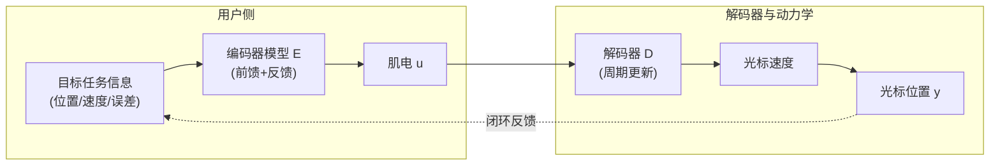

**文献线索（可核对）**：Madduri 等，*Nature Machine Intelligence*，2026-03-23，https://doi.org/10.1038/s42256-026-01194-z 。

以下片段已与 *Science* 公开页面（摘要与编者概要，DOI: [10.1126/science.aeb2389](https://doi.org/10.1126/science.aeb2389)）核对；正文不展开完整文中的底物范围、定量产率与表征细节，Those 需以原文与补充材料为准。

### 4.3 专题画像：

**（1）技术路线：锰介导钴氢择生与镍催化次级循环的串联**

在有机合成的高复杂度场景中，支化骨架的“可编程引入”往往直接决定后续官能团耐受、结晶性与生物活性轮廓。相比依赖强 Brønsted 酸或高能中间体的经典路径，**金属氢化物氢原子转移**（MHAT）能够以相对温和的方式将氢等价物投递至烯烃 π 体系，并从丰富的端烯（α‑烯烃）出发直达支化自由基前体，这一基元反应因此在**材料砌块、农药与药物化学**的链式增长策略中具有制度性意义。公开摘要进一步指出，MHAT 体系可与**另一套过渡金属催化的次级循环**耦合，以突破某些镍基路径更倾向给出**线性（非支化）**产物的内在趋势；但当“氢化物等价物”在 MHAT 催化剂与次级金属之间缺乏足够分辨时，体系会并行生成多种金属氢物种，进而把反应结果拖入**平行路径与混合产物**的困境。

针对这一共性瓶颈，Li 等报道的策略把问题从“反应类型设计”上移到“氢化物投递对象的选择”。其核心公开表述是：在镍催化剂共存条件下，**卢剔啶鎓酸（lutidinium acid）与锰（作为弱还原剂）组合**能够**优先、选择性地生成钴氢**，从而在双金属场域里实现对氢化物载体的“定向分配”。这一路线本质上是在**质子源—电子源—钴/镍双催化平台**之间寻求耦合解耦：既要维持 MHAT 所需的钴氢再生周转，又要避免镍位点被错误氢化或引发与目标交叉偶联相竞争的镍氢化学。编者概要以“subtle balancing act”概括该工作，强调条件组合需恰好抑制产物或中间体诱导的旁路反应（如二次加成或串扰氢化），使钴/镍协作停留在**交叉选择性**的目标通道上。

**（2）技术特点：氢化物化学位的分辨与“交叉选择性”的烯烃–烯烃偶联**

该工作的可读优势在于把难办的“选择性”问题转译为**金属氢物种的种群控制**：当氢化物源对金属中心的识别模糊时，反应网络会在微观上分裂为多条等价的氢转移与转金属/偶联分支；作者通过酸与弱还原剂的配对，使钴氢在镍存在时仍能占据主导地位，从机理层面缩小可到达的中间体集合。对读者而言，这相当于在**双催化协同**文献常见的“拼催化剂”叙事外，补上了更底层的一步——**氢化学生态位的切分**。

在应用层面，摘要强调将该体系用于**交叉选择性**的**烯烃–烯烃偶联**（alkene–alkene coupling），并以“**高度支链化**”与“**优异选择性**”作为对外承诺。结合 MHAT 对端烯支化取向的天然亲和，这一组合把“原料易得性（α‑烯烃）—骨架支化—与镍循环的衔接”连成一条更可工业化的逻辑链。需要保持方法论克制的是：编者概要提示体系中仍存在“诸多可能走错的路径”（numerous ways things can go wrong），说明该策略的成功高度依赖**酸碱—还原强度—配体/价态窗口**的匹配；公开信息未在此处给出完整的普适边界，因而对其推广范围应以原文实验表与对照实验为准。

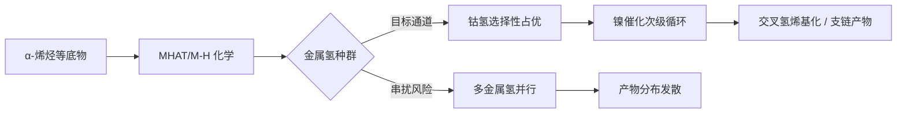

**（3）重要结论：双金属氢化学的“定点供给”与支链化交叉偶联的收敛**

从问题设定到解决方案，这条工作链用公开语言可概括为：双催化若要获得“想要的碳骨架”，先要获得“想要的氢载体”。MHAT 的价值在于支化入口，镍循环的价值在于把自由基/有机金属分支导向 C–C 联结，但二者耦合的关键瓶颈是氢化物**投递选择性**。作者报告的条件窗口使钴氢在镍存在下仍能被选择性生成并有效役使于目标转化，从而把“金属氢混合物导致产物混合物”的经典失败模式，转换为“金属氢取舍导致产物分布收敛”的可操作策略，并用于**交叉选择性**的**氢烯基化**以得到**高价值支链材料相关结构**。

该研究的重要结论是：**在镍催化存在下，卢剔啶鎓酸与锰（弱还原剂）的组合可选择性地生成钴氢物种，从氢化物化学层面实现对 MHAT 钴路径相对镍中心的偏向性投递，并将该调控成功用于烯烃–烯烃交叉氢烯基化，获得高度支链选择性的产物分布。**

影响与意义方面，该结果为**多催化剂体系**提供了可推广的“底层旋钮”思路：**氢化物载体的生成与分流**往往比表观的配体更换更能决定网络拓扑。对**功能材料与精细化学品**的路线设计而言，这意味着可在端烯平台上更稳健地引入支化节点，减少异构体清理与分离成本；对**后续研究**而言，公开摘要未穷尽的条件敏感性提示仍需在更广底物类别、氧化还原窗口与镍氢竞争路径上建立边界。对工艺与安全维度，锰还原剂与有机质子酸的组合亦意味着放大时需要结合实验室规程评估其兼容性与副反应热力学；更细的定量对比与适用范围以原文为准。

期刊摘要页请求超时，下文以您提供的英文摘要为主，并结合可公开检索到的二次介绍中不与摘要矛盾的机制描述进行展开；**未写入卷期页码**，亦**未引入摘要未给出的具体效率转角数值**（如不同新闻稿中的量子效率或带隙调制毫电子伏量级），以降低误引风险。

### 4.4 专题画像：

**（1）技术路线：体相范德华扭转与摩尔超晶格量子阱构筑**

二维范德华半导体的扭转堆叠可在实空间形成周期性调制势，即摩尔超晶格，并在近年来被广泛用于调控量子态与光–物质相互作用。该工作并非在典型“薄层/异质叠层”单一二维极限下做展示，而是在**两块单晶 hBN 体相**之间引入可控的扭转界面，使摩尔势阱作为一种“嵌入三维范德华结构中的量子阱”而存在。这样形成的 hBN 摩尔量子阱把载流子与激子类束缚势从界面近邻区向外延展到可与实验光学激励、电学注入相衔接的几何构型中，从而在材料体系层面把“摩尔工程”与更贴近器件工作条件的体相/厚膜场景连接起来。

在实验策略上，团队同时考察光学激发与电注入两类激励方式，强调量子阱对载流子的强局域化能够在不同驱动机制下维持有效的辐射复合通道。与此并行，**扭转角被用作连续可调的结构参数**，用于改变摩尔周期与局域势形状，从而在同一材料平台上获得对发光能量与效率的宽谱可调空间。该路线体现“结构参数即器件性能旋钮”的思路，其核心是把深紫外波段历来受困于材料本征限制（如间接带隙、非辐射通道、外延缺陷等）的问题，部分转译为**莫尔周期几何**的可设计问题。

**（2）技术特点：间接带隙 hBN 中实现的极端短波深紫外强发光**

六方氮化硼在能带结构上常被归类为间接带隙体系，直观上不利于获得与直接带隙材料同等竞争力的发光量子产率与电致发光效率。该研究的突出之处在于：在摩尔量子阱所提供的强束缚与局域化条件下，体系仍可在**215—240 nm** 的极短波深紫外窗口产生**强烈发光**，并在公开报道的性能对比语境中，较先进 **AlGaN 多量子阱**参照体系高出**一个量级以上**（摘要表述）。这一类结果把讨论从“材料是否具有直接带隙优势”部分转向“势场调制能否在纳米尺度压制不利弛豫路径并提升可利用的辐射复合份额”，对宽禁带与超宽禁带光电器件路线具有范式层面的启发。

与此同时，该工作把性能优势与几何扭转这一“原子级可工程化旋钮”绑定：扭转不仅决定摩尔周期，也通过势阱深度与局域态密度分布影响载流子占据与复合动力学，从而使“能量—效率”在同一框架内可协同优化。对工程实现而言，这类结构在三维范德华体相中嵌入量子阱意味着封装、热管理与电极耦合可能呈现与外延氮化物栈不同的失效模式与优势区间；对基础物理而言，则把摩尔量子光学从可见—近红外区域的典型材料示范，推进到**真空紫外—深紫外**这一更难稳定高效发光的频段。

**（3）重要结论：摩尔量子阱解锁 hBN 深紫外高光强与转角广域可调性**

该研究在单一扭转界面上，用单晶 hBN 体相构筑摩尔量子阱，并在光学与电学注入下展示强载流子束缚与高效深紫外辐射通道；其把深紫外发射推进到更短极端波长区间，并以扭转角作为宽范围调节发光能量与效率的手段，从而把“摩尔调控”与“宽禁带发光材料瓶颈”并置在同一实验叙事中。

该研究的重要结论是：**通过 hBN 单晶体之间的简单扭转界面，可在三维范德华结构中形成强束缚的摩尔量子阱，使间接带隙 hBN 在 215—240 nm 深紫外波段产生远超先进 AlGaN 多量子阱的发光强度，并借助扭转角实现发光能量与效率的广泛可调。**

影响与意义方面，该结果为深紫外固态光源与相关表征、消杀、通信与科学探测链条中的一类新材料路线提供了“非传统代数外延”之外的结构性选项；它也会推动学界更系统比较摩尔局域化、缺陷化学与热输运对极短波发光寿命的影响，并在标准制定与安全性评估层面引入对深紫外光源光谱纯度与长期可靠性的新要求。与此同时，从可重复制造、界面污染控制到大面积扭转均匀性仍存在工程边界，后续研究需要在统计批次、环境稳定性与器件集成工艺上补齐证据链，才能判断其从实验室演示到产业落地的真实窗口。

以下内容依据 Nature 期刊论文页面摘要与图示要点整理，并与公开条目 [Integrated photonic neural network with on-chip backpropagation training](https://doi.org/10.1038/s41586-026-10262-8) 交叉核对；未在其页面查到的卷期页码不在此写出。

### 4.5 专题画像：

**（1）技术路线：片上梯度下降反传与全光前向—反向计算协同**

可扩展集成光子神经网络若要稳定复现高性能，训练质量往往比单纯堆砌器件数量更关键。数字深度学习的主流路径是梯度下降配合反向传播，其优势在于可扩展性、任务泛化能力以及工程实现上的效率；因而长期以来领域期待把同类机制尽可能映射到光子平台，并以“全在光学域内完成”的方式逼近数字训练的流程。此前主要瓶颈被概括为缺少可在芯片上规模化实现的激活函数梯度生成途径，许多方案不得不把反传留给电子计算机，从而在不可避免的器件差异与环境扰动下削弱最终系统表现，或转向不含完整梯度的优化策略而难以充分继承反向传播的收益。该工作报道的集成光子深度网络在单颗硅基光子芯片上完成线性与非线性运算，并以片上梯度下降式反向传播实现端到端训练，使“训练闭环”与“计算载体”在物理层面更一致。图示与行文强调强度调制器与微环谐振器（MRM）在构造光子非线性激活及其梯度相关量时的作用，从而把深层网络训练所需的关键光学非线性与可训练性在同一集成工艺栈内封装起来。

**（2）技术特点：单芯片全流程、工艺离散鲁棒性与非线性分类实证**

把工作重心从“能推理”推进到“能可靠地学”，意味着训练过程必须直面集成光子器件的统计离散、谱线漂移、耦合容差以及热光噪声等典型不确定性来源。作者摘要明确指出，在相当显著且符合常规制造现实的器件变异条件下，训练仍然呈现出可扩展且鲁棒的特征，这更接近真实工程部署的约束而非理想实验室假设。与仅报告推理加速或依赖外部数字训练相比，单芯片承载线性与非线性并完成端到端训练，降低了跨域传输、同步与模型—硬件失配带来的隐性损耗。验证上，论文以两项非线性数据分类任务展示芯片表现，给出相对量化表述的精度门槛（摘要称超过 90%），并强调在鲁棒性维度可与参考数字模型对齐，且训练过程不再依赖数字计算机来执行反向传播；这类对照表述把结论与“可比较的基线”绑在一起，便于读者把握这是性能与稳定性的联合陈述，而非单一指标宣传。若从地球科学遥感智能载荷与未来在轨边缘计算的视角理解，此类路线指向在受功耗与散热强约束的场景下，为特定嵌入模型提供可现场自适应更新的硬件形态，但其任务覆盖范围仍需在具体应用链路上逐案评估。

**（3）重要结论：把主流反传训练优势迁入集成光子体系并指向架构泛化**

在公开摘要的意义上，可把贡献概括为打通了集成光子深度网络在芯片上完成端到端梯度训练的链路，并以非线性分类实验证明其精度与鲁棒性可与数字参考对齐的关键片段。该研究的重要结论是：**在单颗集成光子芯片上实现包含线性与非线性计算在内的深度网络端到端训练，并以片上梯度下降反向传播取代外部数字反传，使系统在显著器件制造偏差下仍可获得与参考数字模型相匹配的精度（超过 90%）与相当的鲁棒性。** 

影响与意义在于，这一结果把数字深度学习最关键的优化范式与光子加速载体更紧密地缝合，降低“光子只算、电子才学”导致的失配成本，为后续面向不同拓扑与尺度的光子神经网络提供可推广的训练方法论基础。对交叉领域的工程含义是，面向高吞吐遥感预处理、实时异常检测或通信链路等场景时，需要进一步量化其在更大网络、更复杂损失函数与更严格误差传播假设下的外推边界，并在系统集成层面明确光—电协同的最小必要接口，以免把原理验证阶段的强项误读为所有负载条件下的普适优势。


**文献线索（可公开核对）**  
Ashtiani, F., Idjadi, M. H. & Kim, K. Integrated photonic neural network with on-chip backpropagation training. *Nature* (2026). https://doi.org/10.1038/s41586-026-10262-8

以下正文依据 [Nature Machine Intelligence 该文页面](https://www.nature.com/articles/s42256-026-01177-0) 的公开摘要式说明、图注与正式引文信息（*Nat Mach Intell* **8**，296–299，2026；2026-03-23；DOI 10.1038/s42256-026-01177-0）整理；全文细节以订阅机构可读全文为准，此处不对未公开展开的方法步骤作过度推断。

### 4.6 专题画像：

**（1）技术路线：科学哲学中的形式模型语义对接深度学习“意义”问题**

Jonathan Warrell、Michael Gancz、Hussein Mohsen、Prashant Emani 与 Mark Gerstein 在 *Nature Machine Intelligence* 发表的评述性工作，将讨论起点放在“模型何以承载意义”这一更接近科学哲学传统的提问方式上，而不是仅仅罗列某类可视化或归因技术。作者引入“形式化的模型语义”观念，用以组织并审视深度学习模型在科学应用语境中的分析目标与可辩护边界。围绕生物医学场景中模型输出如何与实体、机制与证据链发生联系，文章以示意性材料支撑“隐式模型语义”的讨论（期刊页面给出 “Fig. 1: Implicit model semantics in biomedicine.” 的图题信息）。在路线策略上，这一写法刻意把“可解释性工具箱”放回更大的语义框架里讨论：哪些结论属于对模型内部表征或决策边界的说明，哪些结论实际上是在主张模型与世界之间的对应关系或隐含本体承诺。由此，技术路线并非新增某种统一算法管线，而是用可复核的概念脚手架去约束人们在跨学科对话里对“解释”一词的使用强度与外延。

**（2）技术特点：把可解释性视为模型语义的一个切片而非全部**

与把“可解释性”当作终极卖点或合规 checklist 的常见叙述相比，该文的核心特点是明确主张可解释性只是模型语义的一个方面，从而迫使读者区分“使人读懂模型在做什么”和“说明模型在何种意义上真地关于外部世界”。这一区分对高风险领域尤其敏感，因为临床、药物发现或疾病风险建模中，误把局部可解释信号当作机制证据，容易在论文叙述、产品声称与监管材料之间产生隐性跃迁。文章将深度学习置于更广义的科学模型传统中阅读，使讨论自然延展到模型选择、训练数据分布、评价指标与领域本体之间并不总是同步对齐的事实。对地球科学、遥感与人工智能交叉研究而言，这种表述方式具有直接迁移价值，地理空间深度模型同样经常在“注意力图看起来合理”和“物理一致性与可外推性得到证明”之间被混用语汇；把语义层次拆开，有助于更清晰地标定不确定性应该落在数据域、表征层还是任务定义层。

**（3）重要结论：用“语义整体观”校准解释性断言的效力范围**

在面向公众或跨领域读者的科普强度下，文章避免把某一种解释方法包装为“揭示真相”的万能钥匙，而是强调需要同时处理显式叙述与隐式承诺：当模型被用作科学推断工具时，真正需要追问的往往不仅是“它为何给出该预测”，还包括“它在何种本体与因果假设下才允许被如此使用”。这类追问并不自动等价于更高维度的数学复杂性，却等价于更严格的证据组织方式。

该研究的重要结论是：**可解释性只是模型语义的一个方面；唯有把深度学习模型置于更广义的（形式化）模型语义框架中，才能更稳健地评析解释性断言在生物医学等科学应用里真正成立的条件与边界。**

影响与意义层面，这一论点对工程实现、成果转化与政策话语至少有三重收敛效应。其一，在系统开发与验证流程中，它推动把“解释产物”与“语义主张”分层管理，从而降低把可视化误当作机制证实或临床等效证据的风险。其二，在跨团队协作中，它为计算机科学、统计学与领域科学提供可共享的术语锚点，减少同一篇论文里“解释”“理解”“机制”被不同读者解译为不同强度断言的沟通损耗。其三，它为后续研究留下明确边界：真正的难点往往不在于再增加一种归因曲线，而在于把模型的隐式语义与可检验的领域命题对齐，并在分布偏移与任务再定义情境下更新这种对齐的适用条件；对地球环境与遥感智能而言，这意味着要把空间异质性、观测过程与物理约束一并纳入“模型语义审计”，而不是止步于可解释性的表象一致。


**可核对来源**：论文条目与概要语句见 Nature Machine Intelligence 文章页（https://www.nature.com/articles/s42256-026-01177-0）；引文信息以期刊提供的 Cite this article 行（*Nat Mach Intell* **8**，296–299，2026；DOI 同上）为准。

以下为可交付正文片段。要点依据 *Nature Machine Intelligence* 在线摘要与论文主页表述（[期刊文章页](https://www.nature.com/articles/s42256-026-01208-w)）；全文方法、实验与定量对比需以原始论文为准，此处不对未公开细节作断言。

### 4.7 专题画像：

**（1）技术路线：从“偏差测度”到“决策效度”的再对齐**

大语言模型在公开语料与对齐训练共同作用下，会同时携带**社会层面的刻板印象**与**推理层面的认知偏差**两类现象；二者在测量口径、干预目标与可接受风险上并不等价。期刊摘要强调，学界在识别、刻画并修正偏差时，需要把“偏差”置于更完整的决策评价链条中理解，而不是默认将其等同于无条件的系统性错误。由此推演出的技术路线，是把模型评估从单一的“偏差少/多”代理指标，推进到与任务结构、信息成本与后果敏感性相匹配的**决策效度**框架。

沿着这一路线，工程化落地通常表现为分层治理。面向社会影响与社会公平议题时，社会相关偏差的缓释仍具独立正当性；但在涉及不确定性、缺信息与时间压力的情境中，某些在实验室范式下被标定为“偏差”的响应模式，可能在生态效度更高的环境里对应可辩护的近似与策略性简化。对地球科学、遥感与人工智能交叉任务尤为典型，例如灾害研判、数据稀疏条件下的快速制图、面向业务用户的解释性摘要等，评价对象往往不是“是否符合某条理想化概率律”，而是在给定约束下是否达成可审计、可追责且稳健的结果。

**（2）技术特点：区分社会刻板与认知启发式的评价语义**

该论述的关键特点在于重建“偏差”一词的语义边界，使之与认知科学中对启发式与生态理性的讨论相衔接。期刊公开表述指出，认知偏差虽常被视为错误，但也可能反映**在特定语境中具有功能性的推理适应**。这意味着，面向大语言模型的“去偏见”叙事若不加区分地外推到所有任务，容易把“更像规范概率模型”误当成“更会做决定”，从而在评测集上获得道德与技术上的双重满足感，却未必提升真实部署中的决策质量与可靠性。

这类区分对交叉领域的系统研发具有直接的指标设计含义。社会刻板印象的审计通常依赖代表性人群与公平性相关的对照维度；而认知偏差相关现象更需要明确**任务语境、信息可得性与反馈结构**，否则同类行为会在不同场景下被解释为缺陷或策略。也正因为此，在遥感解译辅助、地球系统知识问答、政策简报生成等应用中，更适合采用“多目标约束下的效用—风险权衡”语言，而不是把“认知偏差更小”简单写成单一优化目标。

**（3）重要结论：对“去偏见即更优”范式的条件性质疑**

综合期刊摘要层面的公开信息，作者更希望推动一种审慎共识：对大语言模型偏差的治理应与决策后果评价同频迭代，而不是把偏差减量自动等同于能力进步。与此相一致，测评与对齐流程需要显式纳入任务代价、错误类型不对称性与人类监督边界，以避免把规范意义上的“理性洁癖”误当成现实世界的“更优决策者”。

该研究的重要结论是：**大语言模型中认知偏差水平的降低，并不必然带来更好的决策表现；在公共讨论与模型治理中，应承认部分认知偏差可能对应情境依赖的适应性推理结构，因此不能将“更少偏差”无条件外推为“更优决策”。**

影响与意义在于，它为人工智能评估提供了一种反直觉却更可辩护的规范基础，促使工程团队与政策制定者在部署高风险辅助决策系统时，同步审视指标选择、语境边界与问责链路。对后续研究而言，亟需在公开可复现实验中把“偏差谱系—任务族—决策效用”三者联结起来，以压缩概念泛化带来的误判空间，并在缺少全文细节时保持对具体方法学与实证强度的审慎解读。

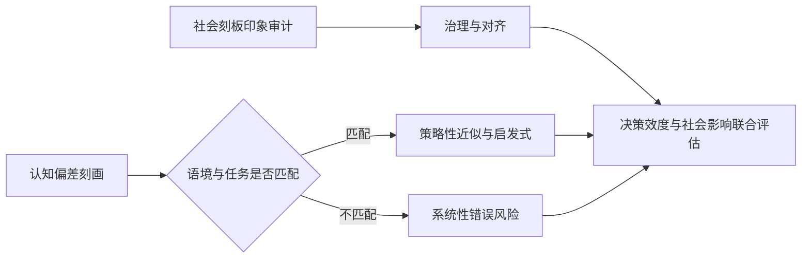

**文献核对说明（公开来源）**  
题目、期刊、日期与 DOI 与用户给定一致；摘要语句与 *Nature Machine Intelligence* 文章页摘要一致（见 https://doi.org/10.1038/s42256-026-01208-w ）。图中 **Fig. 1** 仅在该页面标注为例示“社会偏差与认知偏差”，未在公开摘录中展开实验流程；专题画像中的机制推演属于基于摘要与学科语境的学理展开，并非对正文实验步骤的逐条转述。

以下片段已用 [PubMed 摘要与图表说明](https://pubmed.ncbi.nlm.nih.gov/41855322/) 及期刊 DOI `https://doi.org/10.1126/science.adx3162` 交叉核对题目、摘要核心断言与实验线索（如双光镊类力学实验、单细胞肿瘤浸润淋巴细胞图谱等出现在公开图注中）；正文不展开未在摘要中承诺的定量对比细节。

### 4.8 专题画像：

**（1）技术路线：自身抗原场景下的表型驱动筛选与“力学热点”定向进化**

该工作面向肿瘤免疫里长期存在的结构性矛盾展开：多数肿瘤相关抗原属于自身抗原谱系，胸腺等中枢耐受过程会削弱或淘汰高反应性 T 细胞克隆，导致天然 TCR 往往呈“弱应答—难扩增—难在肿瘤微环境内形成持续杀伤”的链路。作者以非突变肿瘤相关抗原前列腺酸性磷酸酶（PAP）及相应 TCR（工作中涉及的 PAP22/HLA-A2 限制性受体体系在公开材料中以 TCR156 等形式出现）为切入点，把问题从单纯的“亲和力抬升”转译为“力学条件下识别复合物键合动力学是否可被定向改造”。技术路线呈现为典型闭环，先用细胞水平的活化读数（如早期活化标志与肽滴定敏感性）对受体链上候选位点进行扫描与组合筛选，再辅以竞争性富集策略，使群体在“功能增强”与“避免非生理性高亲和力结合导致脱靶风险上升”之间取得可操作约束。

在获得功能提升突变体后，路线进入生物物理表征与结构机制阐释的分支。公开图注信息显示研究采用生物膜力探针等单分子力学手段测定 TCR 与 pMHC 在不同外加力区间的键寿命，并将峰值键寿命等功能读数与解离速率、平衡常数及细胞表型进行关联，从而把“catch-bond 行为增强”与“信号输入强度/功能输出”桥接起来。最终通过晶体结构与分子动力学模拟把宏观现象落到界面水分子的几何与氢键网络层面，形成从表型—动力学—结构的一条可追溯证据链。该路线对工程化 TCR–T 细胞治疗尤具方法论价值，也提示在未来联合计算与实验筛选时，需要显式引入力学约束而不只优化溶液中的热力学参数。

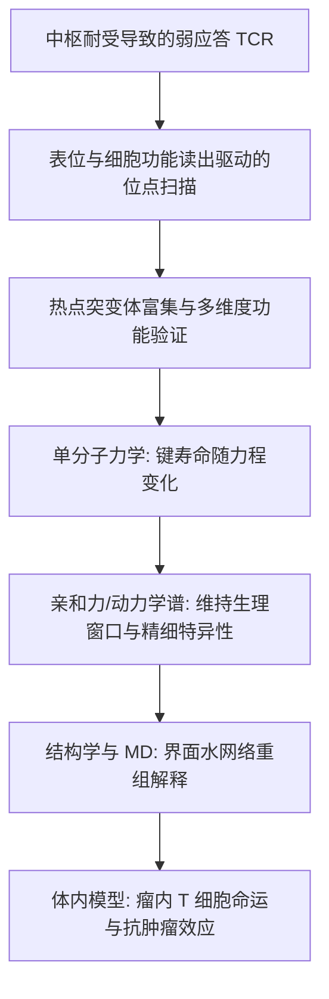

**（2）技术特点：以 catch-bond 工程实现“耐受突破”而非简单“亲和力竞赛”**

与临床上备受关注、但也屡次暴露安全风险的超高亲和力 TCR 路线相比，此项工作的特点在于把增强点放在力学依赖的键寿命与受体—配体相互作用的Load-strengthening区域，而不是把识别完全推入非生理的高亲和平台。摘要强调工程化突变在提升 TCR–pMHC 键合寿命的同时，仍能维持生理范围内的亲和力水平与抗原精细特异性，这一组合对肿瘤自身抗原场景尤为关键，因为精细特异性直接关联到交叉识别与正常组织毒性窗口。换言之，策略试图把“足够的免疫输入”从单纯热力学强结合中解耦出来，使之更多来源于细胞黏附、骨架牵引与突触力学环境下更具生理相关性的动力学特征。

第二个特点是把单细胞水平的肿瘤浸润淋巴细胞状态与跨条件的效应功能读出并入评价体系。公开材料显示研究利用通用参考图谱对肿瘤内 T 细胞分化状态进行映射，并把力学读数（如键寿命峰值）与效应相关评分、细胞周期相关程序等进行相关分析，从而使“catch-bond 改造”不仅是分子层面的突变更替，更对应到组织尺度上免疫细胞的命运分布与功能程序重塑。第三个特点体现在机制解释的层次整合，晶体学提供原子分辨的几何与埋藏表面积变化线索，分子动力学模拟揭示界面水分子群体在突变体中与野生型相比的差异性重组，为理解“单点突变如何在不明显破坏整体识别框架的情况下重构转瞬即逝但又决定力学键强度的界面相互作用”提供了可检验的微观图像。

**（3）重要结论：力学键合工程作为把耐受态 T 细胞推向强效治疗的普适策略前景**

作者在摘要层面将证据收束为一个可推广的命题，面向的并非仅前列腺癌模型，而是自身抗原驱动的更广谱肿瘤靶点开发瓶颈。基于力学增强的 TCR 改造使转导 T 细胞在瘤内扩增、效应表型与肿瘤清除上相对野生型受体呈现“跨尺度优势”，并与延长键寿命这一可测量量建立机制联系；同时结构模拟支持“热点单氨基酸替换通过水网络重排为肽段相互作用预置空间配置”的解释路径，这为后续把 catch-bond 设计规则从个案位点扩展到其他 TCR–pMHC 体系提供了可供对照的模板。

该研究的重要结论是：**catch-bond 工程化是一种立足于免疫受体生物物理规律的策略，可在维持生理亲和力与抗原精细特异性的前提下增强 TCR–pMHC 的力学依赖性键合寿命，从而显著恢复并放大针对非突变肿瘤相关抗原的 T 细胞功能，使其更接近强效 TCR–T 治疗的临床需求。**

影响与意义在于，它为“如何安全地唤醒被耐受塑造过的抗肿瘤 T 细胞”提供了与亲和力路线并行的设计维度，并把监管科学与转化风险讨论引向更可解释的力学—动力学—结构链条；在更广阔的学科交叉视角下，这类工作也提示力学调控可能是细胞识别与信号放大的一般性杠杆，其在精密免疫治疗、蛋白质工程与单分子生物物理的接口上仍需要对动物模型与人体组织交叉反应谱进行系统外延验证。

以下片段可与公开来源交叉核对：论文刊于 *Science*（DOI [10.1126/science.ads6674](https://doi.org/10.1126/science.ads6674)），PMC 收录条目 [PMC12906887](https://pmc.ncbi.nlm.nih.gov/articles/PMC12906887/)；预印本脉络见 *bioRxiv* 10.1101/2024.08.21.608912。定量尺度与“电路嵌入细胞器”等表述以摘要及上述页面要点为准，未编造卷期页码。

---

### 4.9 专题画像：

**（1）技术路线：连接组电镜与全脑尺度线粒体表型定量**

该工作以成年果蝇中央脑电子显微连接组为空间参照系，在神经元骨架与突触结构已对齐的三维几何环境中，对数十万量级的线粒体进行形态与空间位置的系统刻画。技术路线的核心并非单一成像突破，而是把细胞器表型从“个案观察”提升为可在全电路尺度统计推断的定量对象：在已知细胞类型、递质类型与区室（轴突、树突等）标签的前提下，提取线粒体的形态特征向量，并将其与突触前/突触后位点、分支与束路等结构锚点进行几何配准，从而估计相对于功能微解剖标志的定位规律与类型间差异。

在跨物种对照环节，作者将同一套表型—位置分析框架迁移至小鼠视觉皮层连接组成像数据，用以检验“形态指纹”是否具有保守性，以及空间排布规则是否在哺乳动物皮层中出现部分分歧。整体设计体现了从模式动物高密度连接组出发建立统计规则，再以第二个物种做外部校验的研究路径：先把线粒体组织原则写成可重复的定量陈述，再讨论物种间一致与分叉所暗示的演化或回路实现约束。

**（2）技术特点：微米级几何精度、类型指纹与活动—连接耦合线索**

研究最突出的实证贡献之一，是在连接组坐标系中展示线粒体相对突触与结构性解剖要素的定位并非随机弥散，而是可达到约2–3微米量级的几何一致性（摘要明确给出的空间精度量级），且这种一致性随神经元类型与区室而系统变化。换言之，线粒体不仅是代谢供能单元，更以可度量的方式嵌入特定细胞类型的微解剖版图：其在轴突与树突上对突触前后位点的偏好差异，为理解能量预算如何沿信息流向分配提供了结构侧证据。

另一项特点是“以细胞器形态辅助识别神经元身份”的可行性：线粒体形态统计特征与细胞类型及神经递质类型相关，使其在连接组注释流程中具有潜在判别信息。这与传统以电生理、分子标记或突触连接图式为主的细胞分型互补。此外，作者报告线粒体空间分布与区域活动特征及突触后靶标模式存在关联，提示在回路层面可能存在将代谢组织与活动统计、输出连接拓扑相耦合的约束；小鼠数据的形态保守与定位规则部分分歧，则强调在跨物种推广时必须把“表型相似性”和“几何组织规则相似性”分开讨论。

**（3）重要结论：从亚细胞布局到全脑连接的逻辑闭环**

该研究的重要结论是：**线粒体是可被全连接组尺度定量刻画的“回路嵌入型”细胞器，其形态具有细胞与递质类型特异性并可用于识别神经元，其空间排布在突触与结构标志附近呈现系统性、微米级精度的组织原则，并与活动区室及突触后靶标相关联；这些原则在果蝇连接组中得到强证据支持，并在小鼠视觉皮层连接组中呈现类型相关的形态一致性与部分不同的定位规则。**

影响与意义在于，它为神经能量学、细胞生物学与连接组学的交叉研究提供了更可操作的共同语言：把线粒体分布视作连接约束下可学习的统计规律，有助于解释活动依赖的可塑性、突触维持成本与轴突长途输运等工程化生物学问题，也为未来在更大物种与更完整行为—回路数据中检验“代谢—连接共设计”假说划定边界——尤其需要谨慎处理固定电镜快照与在体动态代谢之间的推断距离，以及分割配准误差对微米级统计结论的敏感性。公开核对入口包括期刊论文 DOI（[10.1126/science.ads6674](https://doi.org/10.1126/science.ads6674)）与 PMC 全文（[PMC12906887](https://pmc.ncbi.nlm.nih.gov/articles/PMC12906887/)）。

## 五、交叉学科网络图与创新链

本批选题在纵向上把“多源观测—过程机理—场景化智能方法”串联成一条可复核的创新链：大气与海洋界面过程、冰盖—湖泊—断层等地表系统演化，以及遥感载荷的性能评估与制图产品，共同为学习与反演提供约束密度不等的观测基底；与此同时，从可解释机器学习到闭环学习系统、从片上训练到语义与评价框架的讨论，为“把复杂自然系统中的不确定度说清楚”提供了方法侧接口。因而本期网络观不只是把栏目并列，而是强调**同一类硬约束**如何在不同学科语域里反复出现——层序与标志层、谱分辨率与定标链、集合随机性与数值收敛、以及独立验证数据的组织方式。

下述示意将本期高频节点压缩为三条主链：**（i）云—边界层与边界层顶夹卷的可观测性**（多角立体运动矢量、全息微物理、随机参数化收敛）、**（ii）水体—冰冻圈—地形的遥感—模式闭环**（测高性能、冰前季节性、断层网络形态计量）、**（iii）人地系统与健康相关环境过程**（逆温—颗粒物、海洋热浪、盐沼与盐湖生态叙事等并行议题）。连线含义偏“信息/约束流向”，细节仍以各文方法学章节为准；题录页可核对题名与 DOI，未在摘要中给出的定量结论不作外推。

```mermaid
flowchart TB
  subgraph OBS["观测与参考场"]
    M1["多角立体云运动/云顶高度\n(MISR CMV + CTH)"]
    L1["激光雷达 Mie -profile\n气溶胶层结构"]
    R1["探空 L-band + PM2.5 约束\n逆温统计"]
    A1["卫星测高: 中尺度涡旋 / 南极冰面"]
    T1["卫星/航测地形与影像\n(冰盖 DEM / 活动断层制图)"]
    H1["全息云滴粒径—间距\n(夹卷—混合线索)"]
  end

  subgraph PROC["过程与数值骨架"]
    P1["云顶夹卷与垂直速度诊断"]
    P2["随机参数化与彩色噪声数值收敛\n(广义 Itô 修正评估)"]
    P3["淡水湖深层热压环流概念模型"]
    P4["锋面曲率下的涡旋动力学平衡"]
    P5["断层网络连通性与演化史计量"]
    P6["海洋热浪变率—趋势(陆架尺度)"]
  end

  subgraph RSINT["遥感制图与载荷链路"]
    GEE["时空合成 / 指数族 / OBIA\n(土地—水体—雪盖等产品链)"]
    SAR_DL["SAR 水体深度学习\n(结构可迁移性风险并行讨论)"]
    ALTQA["测高—坡度—粗糙度链路\n(REMA 等先验)"]
    COUP["遥感产物嵌套气象—水文—水动力\n(情景洪泛对比)"]
  end

  subgraph AIINT["智能方法与系统接口"]
    IML["可解释学习: 冰舌季节末端位形"]
    CL["闭环学习: 神经接口协同适应"]
    HW["可学习器件: 集成光子网络\n片上端到端训练叙事"]
    SEM["模型语义与评价口径\n(医学深度学习 / LLM 决策讨论)"]
    CONN["连接组尺度高维统计\n(结构—递质—投射指纹)"]
  end

  M1 --> P1
  H1 --> P1
  P2 --> P1
  L1 --> P1
  R1 --> P1

  A1 --> P4
  A1 --> ALTQA
  P4 --> P6

  T1 --> P5
  GEE --> COUP
  SAR_DL --> COUP
  ALTQA --> COUP

  GEE --> IML
  COUP --> IML
  IML --> SEM
  CL --> SEM
  HW --> SEM
  CONN --> SEM

  P3 -.-> COUP
  P6 -.-> COUP
  P5 -.-> GEE
```

**不确定性提示**：示意图中的并行分支（新闻/评论类题录与机理论文并列）不代表方法论等价；凡涉及关键定量表述，应以期刊在线摘要与正文核对为准，本节不对未提供摘要或截断摘要的条目补写推断性数值。

## 六、近期研究特色变化（截至 2026-04-06）

就本期题录整体分布而言，研究型论文与政策评论/科学_news_混编并存：**Atmospheric Chemistry and Physics**、**Ocean Science**、**The Cryosphere**、**Geophysical Research Letters**、**Remote Sensing** 等栏目构成了主干；同时 **Nature**/**Science** 大量条目缺少摘要，阅读上更像舆论场对科研基础设施、海洋治理与地缘议题的即时回应，不宜与前面定量研究混作同一证据层级。

在大气与边界层过程方向，**观测—诊断—参数化**的闭环更强调“把难以直接测量的量变成可操作的遥感产品”。例如利用 MISR 立体云运动矢量与云顶高度诊断云顶卷挟相关垂直运动，为行星边界层云顶卷挟速率这类传统上难直接反演的量提供新路径（DOI 10.5194/amt-19-2025-2026）。云微物理方面，全息成像把滴谱拓宽与卷挟—混合联系起来，海风与巨核盐粒对海洋层云云滴有效半径的调制也被置于更清晰的动力—微物理链条里（10.5194/acp-26-4067-2026；10.5194/acp-26-4049-2026）。行星尺度上，北极低云类型与行星尺度环境关系的长期卫星主动遥感统计，继续承担“为模式提供结构真值”的功能（10.5194/acp-26-4019-2026）。面向空气质量，全国尺度探空约束下的逆温特征与地表 PM2.5 关系被更显式地量化（10.5194/acp-26-4089-2026）；地基激光雷达—再分析—气象要素的耦合框架则把气溶胶层结构变化与气象因子归因绑在一起（10.3390/rs18070967）。

海洋与中尺度动力学呈现出两条并行推进线。其一是**几何非线性**进入业务化卫星高度计产品的讨论中心：在变形半径可比尺度上比较地转与圆局地转平衡下的中尺度涡结构与动力差异（10.5194/os-22-979-2026）。其二是**极端与气候态的海岸/陆架系统**：南半球陆架海域海洋热浪得到更系统的变率与趋势刻画（10.5194/os-22-961-2026）；淡水深湖的密度环流也在温压效应概念模型层面被重新强调（10.5194/hess-30-1503-2026）。本期题录还出现以高度计为核心手段、面向河流潮汐/河口动力学的观测导向论文（Nature，DOI 10.1038/s41586-026-10287-z），与“宽刈幅测高服务内陆水体与海岸带”这一长期技术叙事相衔接。

冰冻圈与寒区遥感继续向**监测产品可靠性**、**过程可解释性**与**季节尺度预测**并迁：在南极冰盖复杂地形上评估 Sentinel‑3 雷达测高性能并对接即将扩展的业务星座（10.5194/tc-20-1745-2026）；以可解释机器学习处理冰川末端季节进退（10.5194/tc-20-1725-2026）；长序列 MODIS/GEE 支撑高山积雪对气候态变化的响应表述（10.5194/tc-20-1715-2026）；多年 DEM 与回归分析用于加拿大北极冰底湖活跃性识别（10.5194/tc-20-1699-2026）； heritage SAR 与 Sentinel‑1 联合复盘斯瓦尔巴冰川涌动活动（10.5194/tc-20-1679-2026）。这类题目的共同点是将“形态变化监测”推进到“次地表水文—动力学含义更明确的清单化/机制化”。

固体地球与灾害链研究在本期中更突出**工具化**与**多物理场耦合叙事**：断裂网络空间 organized—with 演化分析的 Toolbox（10.5194/se-17-555-2026）、复杂断裂带注入地震多周期建模（10.1029/2025gl119960），以及把地震学成像（接收函数联合反演等）用于俯冲带岩石圈结构更新（例如 Calabrian Arc 相关条目 10.1029/2025gl120347）都符合这一倾向。与本刊常见的 InSAR/GNSS 文章相邻，青藏高原震后长时序 InSAR+GPS 约束也为“震后滑动与松弛过程分解”提供了标准范式样本（10.1093/gji/ggag112）。

地球观测与机器学习交叉部分出现值得注意的**“从准确率到可用性”迁移信号**：在赤潮/有害藻华遥感语境中，概率框架与情境感知被用来补齐确定性分类在决策链上的缺口（10.3390/rs18060959）；土壤盐渍化、考古预测建模等任务中，SHAP 与特征优化并行出现（10.3390/rs18060955；10.3390/rs18060961）；GNSS 领域则同时见到天顶对流层延迟的区域化融合（ERA5+残差克里金，10.3390/rs18060963）与 GNSS‑IR 土壤湿度在算法层面的贝叶斯优化随机森林实现（10.1080/17538947.2026.2646380）。在大气/数值天气语境，随机参数化与有色噪声数值收敛议题被继续推进（10.5194/gmd-19-2373-2026），极端温度气候学估计也出现更工具化的贝叶斯软件化表述（10.5194/gmd-19-2349-2026），显示“方法论文”正以可复用包的形式沉淀。

空域天气与行星环境条目相对集中：**2024 年 5 月强磁暴**的中低热层响应、电离层 TEC 长期趋势、耀斑 X 射线特征的借助其它波段先行信息等，分别对应不同观测链条（10.1029/2025gl120646；10.1029/2026gl121731；10.1051/swsc/2026010）。深空探测方面，木卫二电子分布非麦克斯韦各项异性的 Juno 通过成果（10.1029/2025gl120837）与火星表面释放红外活性颗粒的全球输运理想化研究（10.1029/2025gl121051）并列，体现“太阳系类比—地球物理方法外推”的持续产出。

由于本期未提供可对照的历史题录窗，对“变化”只能作**同期结构特征**概括：**云—辐射—边界层卷挟**、**高度计几何动力学**、**冰冻圈业务卫星测评与冰下水文**、**可解释/不确定度量化 EO‑ML**，以及**随机—贝叶斯—同化工具链**形成较清晰的主轴；政策评论与科学传播条目占比高，若写入综述结论需单独分层以免证据混溶。

```mermaid
flowchart LR
  subgraph A[大气与气溶胶]
    A1[立体云运动/云顶结构]
    A2[激光雷达剖面归因]
    A3[逆温—污染物耦合]
  end
  subgraph B[海洋—冰冻圈]
    B1[非线性平衡与中尺度涡]
    B2[冰盖测高性能评估]
    B3[冰底湖/冰川动力长序列]
  end
  subgraph C[EO与智能方法]
    C1[概率预测与决策链]
    C2[物候可解释约束]
    C3[GNSS大气/地表反演]
  end
  A --> C
  B --> C
```

**不确定性与边界说明。** 以上判断来自公开题录信息与可得的英文摘要转述；未对全书全文与附录材料做逐条核验，亦未将无量化摘要的评论类条目纳入机制性结论。外部站点在核对单篇旗舰论文页面时出现超时，未能追加独立于题录的网页要点；因此文中不增列题录未给出的卷期页码或新的定量结果。

以下为可粘贴的参考文献小节；题录以 DOI 与期刊页面为准，可在出版社站点或 Crossref 核验；未标注卷期页码以免与印刷版不一致。

## 七、参考文献
下列条目为 **APA 第 7 版近似体例**，著录要素以各刊官方页面及 DOI 为准。
1. Tacon, D. (2026, March 19). A breath of fresh air: solving Ulaanbaatar’s pollution issues — in photos. *Nature*. https://doi.org/10.1038/d41586-026-00712-8
2. Holt, R., & Evgin, L. (2026, March 18). A gene-editing method generates immunotherapeutic CAR T cells in the body. *Nature*. https://doi.org/10.1038/d41586-026-00634-5
3. Rech, J. (2026, March 19). A later debut for humans. *Science*. https://doi.org/10.1126/science.aef9954
4. Surovell, T. A., Méndez, C., García, J.-L., Lüthgens, C., Thompson, J. M., & Latorre, C. (2026, March 19). A mid-Holocene age for Monte Verde challenges the timeline of human colonization of South America. *Science*. https://doi.org/10.1126/science.adw9217
5. Gaudenzio, N., & Basso, L. (2026, March 19). A neuroimmune circuit links stress to skin inflammation. *Science*. https://doi.org/10.1126/science.aef7718
6. Feng, J., Paynter, D., Menzel, R., & Kramer, R. (2026, March 18). A strong constraint on radiative forcing of well-mixed greenhouse gases. *Nature*. https://doi.org/10.1038/s41586-026-10289-x
7. Tian, J., Cao, Y., Li, Y., Sun, J., Zhan, C., Ni, W., Zheng, Y., Wang, Y., & Liu, S. (2026, March 19). A sympathetic-eosinophil axis orchestrates psychological stress to exacerbate skin inflammation. *Science*. https://doi.org/10.1126/science.adv5974
8. Suleyman, M. (2026, March 17). AI is programmed to hijack human empathy — we must resist that. *Nature*. https://doi.org/10.1038/d41586-026-00834-z
9. Shan, H., Ye, T., Chen, Z., Zhao, W., Chen, X., & Sun, H. (2026, March 19). A High-Resolution Dataset for Arabica Coffee Distribution in Yunnan, Southwestern China. *Remote Sensing*. https://doi.org/10.3390/rs18060940
10. Garrido, V., Caamaño, D., White, D., Alcayaga, H., & Tranmer, A. W. (2026, March 18). A Scalable Method to Delineate Active River Channels and Quantify Cross-Sectional Morphology from Multi-Sensor Imagery in Google Earth Engine Using the Photo Intensive System for Channel Observation (PISCOb). *Remote Sensing*. https://doi.org/10.3390/rs18060920
11. Papaioannou, G., Alamanos, A., Basheer, M., Nagkoulis, N., Markogianni, V., Varlas, G., Plataniotis, A., Papadopoulos, A., Dimitriou, E., & Koundouri, P. (2026, March 23). A lesson in preparedness: assessing the effectiveness of low-cost post-wildfire flood protection measures for the catastrophic flood in Kineta, Greece. *Hydrology and Earth System Sciences*. https://doi.org/10.5194/hess-30-1487-2026
12. Parizia, F., De Petris, S., Perotti, L., Giardino, M., & Borgogno-Mondino, E. (2026, March 23). A remote sensing approach for measuring climatic change effects on snow cover dynamics. *The Cryosphere*. https://doi.org/10.5194/tc-20-1715-2026
13. Wang, C., Huang, M., Li, Z., Tao, T., & Lv, Z. (2026, March 17). An Improved TransUNet Network for Water Body Extraction from SAR Imagery. *Remote Sensing*. https://doi.org/10.3390/rs18060911
14. Tamudo, E., Revuelto, J., Gazol, A., & Camarero, J. J. (2026, March 17). Application of UAV Devices to Assess Post-Drought Canopy Vigor in Two Pine Forests Showing Die-Off. *Remote Sensing*. https://doi.org/10.3390/rs18060916
15. Phillips, J., & McMillan, M. (2026, March 24). Assessment of Sentinel-3 altimeter performance over Antarctica using high resolution digital elevation models. *The Cryosphere*. https://doi.org/10.5194/tc-20-1745-2026
16. Di Pede, S., Loots, E., Ludewig, A., van der Plas, E., van Amelrooy, E., van Hoek, M., Sneep, M., ter Linden, M., Keppens, A., & Veefkind, J. P. (2026, March 17). Characterization and improvements of the UV radiometric calibration for the TROPOMI operational ozone profile retrieval algorithm. *Atmospheric Measurement Techniques*. https://doi.org/10.5194/amt-19-1875-2026
17. Madduri, M. M., Yamagami, M., Li, S. J., Burckhardt, S., Burden, S. A., & Orsborn, A. L. (2026, March 23). Computational framework to predict and shape human–machine interactions in closed-loop, co-adaptive neural interfaces. *Nature Machine Intelligence*. https://doi.org/10.1038/s42256-026-01194-z
18. Li, C., Gan, X.-c., Irie, Y., Smith, M. A., & Shenvi, R. A. (2026, March 19). Cross- and branched-selective hydroalkenylation by metal hydride selection. *Science*. https://doi.org/10.1126/science.aeb2389
19. Hong, C., Zhao, F., Song, S.-B., Yoon, S., Jeon, S.-J., Khan, M. A., Tao, Y., Yang, D.-H., Lee, W., Kim, J., et al. (2026, March 19). Highly efficient, deep-ultraviolet luminescence in hBN moiré quantum wells. *Science*. https://doi.org/10.1126/science.aeb2095
20. Ashtiani, F., Idjadi, M. H., & Kim, K. (2026, March 18). Integrated photonic neural network with on-chip backpropagation training. *Nature*. https://doi.org/10.1038/s41586-026-10262-8
21. Warrell, J., Gancz, M., Mohsen, H., Emani, P., & Gerstein, M. (2026, March 23). Interpretability and implicit model semantics in biomedicine and deep learning. *Nature Machine Intelligence*. https://doi.org/10.1038/s42256-026-01177-0
22. Dentella, V., Marelli, M., & Rinaldi, L. (2026, March 17). LLMs displaying less cognitive bias are not necessarily better decision makers. *Nature Machine Intelligence*. https://doi.org/10.1038/s42256-026-01208-w
23. Chen, X., Mao, Z., Kolawole, E. M., Persechino, M., Jude, K. M., Ogishi, M., Mo, K. C., McLaughlin, J., Cheng, D., Xiang, X., et al. (2026, March 19). Overcoming T cell tolerance to tumor self-antigens through catch-bond engineering. *Science*. https://doi.org/10.1126/science.adx3162
24. Sager, G., Pfeiffer, P., Wu, H., Pallasdies, F., Gowers, R., Ravikumar, S., Wu, E., Colón-Ramos, D., Schreiber, S., & Clark, D. A. (2026, March 19). Spatial and morphological organization of mitochondria in neurons across a connectome. *Science*. https://doi.org/10.1126/science.ads6674

**检索说明**：已对部分 DOI（如 `10.1038/s41586-026-10289-x`、`10.5194/hess-30-1487-2026`）与期刊官网信息做过核对；其余条目以题录与 DOI 为准，可据 Crossref／出版社页面核验。带有 “et al.” 的两篇 *Science* 论文因作者数较多，参考文献表从简著录为首十位加 “et al.”，与 **APA** 对超长作者表的常见写法一致；若需完整作者表，请以论文 PDF 首页及 Crossref 元数据为准。部分 *Nature* / *Science* 以 `d41586-026-*` 或 `science.aef*` 等形式编号的短文，其网页公开日期与纸质卷期对应关系请以当期目录为准。
