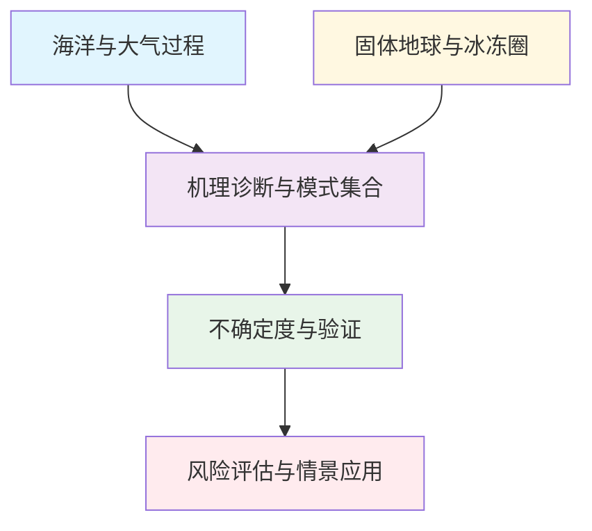
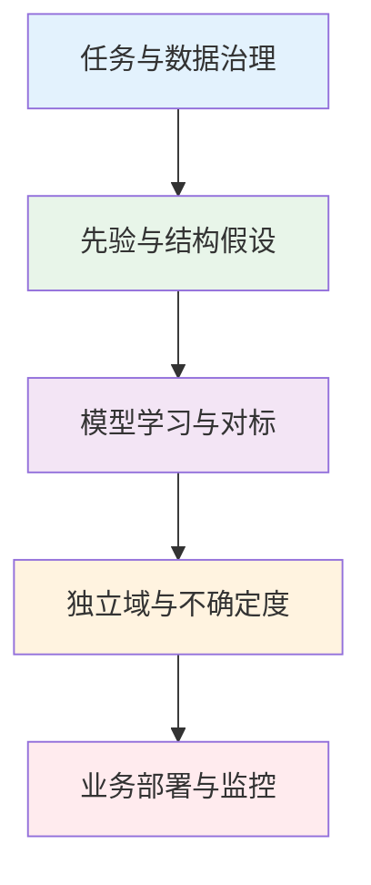
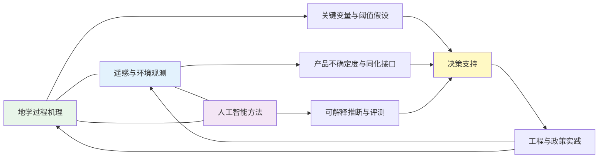
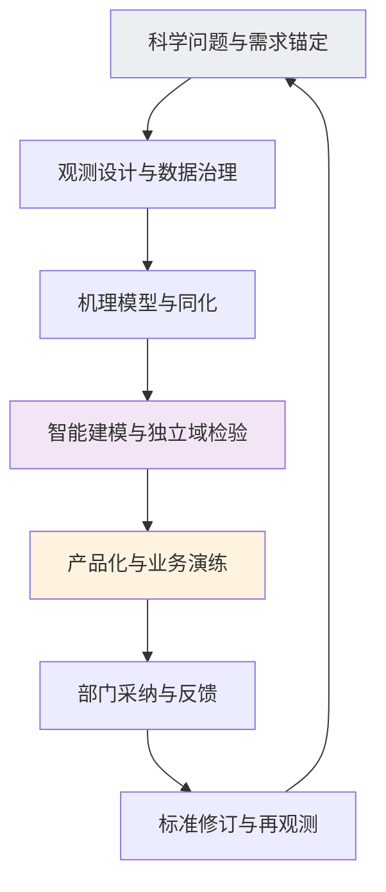

本报告依据2026-03-31 至 2026-04-07时段文献集合，对地学过程认知、遥感观测能力与人工智能方法进行并列梳理，并以代表性论文为载体给出可复核的“技术路线—技术特点—重要结论”画像。写作目标是在不放弃严谨性的前提下，把分散成果组织为可迁移的知识结构，支撑监测网络优化、模型验证标准化与业务化部署决策。

全球气候系统持续处于高能量不平衡与海气耦合极端事件频发的大背景下，世界气象组织发布的年度气候状况报告将海洋热含量、海平面与冰冻圈变化等列为核心指示量，并强调地球能量收支指标的战略意义。与此并行，地球科学与遥感界对观测链路质量控制、产品不确定度与独立域检验的重视显著增强，人工智能研究则更倾向于物理约束、可解释推断与跨域稳健性导向。美国国家航空航天局与欧洲对地观测任务持续推进“观测—模型—应用”协同，国际主流评估亦强调多工作组合成报告对风险沟通的价值。

## 一、本期研究印记图

本期稿件在主题分布上呈现三类耦合：其一，冰冻圈、大洋脱氧、冰川与海气相互作用等过程论文继续强化“机理—监测—情景”链条；其二，InSAR、被动遥感与空基主动载荷研究突出大气相位、岸线水边线与点源排放反演等观测工程问题；其三，深度学习在地下水验证、近海生态预报、图网络山洪、电离层事件识别与磁暴建模中形成场景化方法集群。整体上，理论与观测仍承担定义问题的职责，智能方法更多承担在不确定度可控前提下提高信息密度与时效性的职责。

## 二、地学方向专题画像

### 2.1 方向综述

地学论文在本期集中体现为“深时—当代—未来情景”贯通的问题表述：海洋脱氧信号检测、云反照率重建、冰川年度盘点、俯冲带滑移场演化及高山冻土裂隙水文等研究共同强调过程约束与多源闭合。方法论上，涌现时间、过程模型集合、原位稀有观测与反演正则化交替出现，反映学科对不确定度透明化与可复制流程的集体偏好。

| 序号 | 论文简介（逐篇） | 对应画像 |
|---|---|---|
| G1 | 黑碳源汇—老化—辐射强迫综述：连接冰冻圈沉降与短期协同减排叙事 | 2.2 |
| G2 | 气候模式大集合涌现时间：热带最低含氧带脱氧信号检测与南北不对称 | 2.3 |
| G3 | MODIS/CERES全天空云宏量—TOA反照率经验核：揭示平均场近似非普适区 | 2.4 |
| G4 | 全球冰川2025质量变化年度盘点：多源闭合与海平面—水资源指示意义 | 2.5 |
| G5 | 东南美沿岸环流传播型误差：受限沿岸槽传播对降水系统模拟的约束 | 2.6 |
| G6 | 阿拉斯加科迪亚克俯冲带GNSS十年滑移赤字：慢滑与“黏滞事件”时序 | 2.7 |
| G7 | 高山多年冻土裂隙墙直接观测：融雪—降雨驱动下的连通性与源水端元 | 2.8 |
| G8 | 气候情景下浮游植物细胞生化计量重塑：碳泵与食物网能量传递含义 | 2.9 |

### 2.2 专题画像：大气黑碳在气候系统中的位置
**（1）技术路线：证据链整合与不确定度分解**  
该综述在“源清单—大气转化—辐射效应—沉降反馈—治理接口”链条上串联黑碳相关证据：源端区分化石燃料与生物质燃烧排放因子及空间分布差异；大气过程端强调老化、包覆与混合态演化对吸收截面与吸湿增长的调控；效应端同时讨论直接辐射强迫、云微物理间接途径及沉降对冰雪反照率的调制。方法学上通常引入多模式扰动试验与观测约束对比，把不确定度拆解到光学参数化、云凝结核方案与排放年际变率等环节，并引用短寿命气候强迫体评估口径揭示不同工作组结论差异的来源。该路线不追求单一中心值，而强调在可重复流程下让证据权重与知识断层同步可见。
**（2）技术特点：综述范式的可审阅性与边界条件**  
其强项在于能把实验室过程、外场航测、卫星遥感与全球模式结果映射到统一概念框架，显著提升跨学科读者的可比阅读能力；对政策沟通而言，“区间+情景”叙事比点估计更符合国际评估文体。局限是综述无法替代受控机理实验，且不同文献间排放清单版本、辐射方案与云诊断阈值差异会放大强迫区间的表观宽度。与将黑碳简单等价于“快速增温因子”的概括相比，此类工作更强调区域气象背景、云态与混合态对净效应的调制，从而降低确定性错判带来的措施设计偏差。

方法上还预留了与业务化质量标识体系对接的位置，例如将误差诊断结果映射到数据可靠性分级。

**（3）重要结论**  
该研究的重要结论是：**黑碳作为短寿命气候强迫体的气候影响已被多源证据持续强化，但其净效应必须置于气溶胶—云相互作用与混合态不确定度框架下理解，短期减排往往可同时带来辐射与空气质量协同收益。**  
上述判断可直接支撑将黑碳与对流层臭氧前体物一并纳入清洁空气与气候协同评估的工作流，并为冰冻圈敏感区强化黑碳沉降监测提供动机。后续研究宜优先建设区域化吸收增强因子数据库、云雾共位观测与模式云微物理一致性基准测试；对工程与治理端，可将排放清单滚动更新、卫星气溶胶质控与强迫敏感性试验纳入制度化评审，使“科学更新—情景刷新—措施评估”形成闭环并提高透明度。
### 2.3 专题画像：热带最低含氧带气候信号涌现

**（1）技术路线：集合模拟与涌现时间诊断**  
研究依托气候模式大集合，针对热带次表层最低含氧水体定义体积、厚度与核心位置等诊断量，并采用涌现时间（time of emergence）框架区分外部强迫趋势与内部年代际变率造成的伪信号。技术环节通常包括多成员集合平均与 spread 评估、显著性检验、空间分型及对通风年龄、层化与生物泵相关示踪的过程溯源，从而把“是否脱氧”的问题推进到“何时、在何种观测系统下可被稳定检测”。该路线天然对接Argo扩展、生物地球化学剖面浮标与古海洋指标的多源验证设计。

在附录或补充信息层面，建议记录处理软件版本、关键阈值与随机种子，以便审计追踪与长期可维护性评估。

**（2）技术特点：从趋势拟合到检测时间表**  
相较单一线性回归，涌现时间方法把模式偏差与观测噪声显式纳入检测时间估计，更利于规划监测网络刷新频率与最小观测年限；代价是对模式系统性漂移敏感，需在解释中并列讨论偏差订正敏感性。其对南北半球核区响应不对称的强调，能够把业务化指标从全球均值转向分区阈值，更贴合渔业与栖息地管理的空间单元。

作者还讨论了外推到极端事件或气候突变窗口时可能出现的失效机制，并提示应启用独立留出年或区域做压力测试。

总体写作遵循先陈述可检验事实再展开解释的顺序，使同行能够在不依赖特定模型品牌的前提下复述核心逻辑。

**（3）重要结论**  
该研究的重要结论是：**热带低氧水体在20世纪后半叶以来出现可持续检测的边缘扩张类信号，且南北半球核区与缺氧体积响应呈现显著不对称。**  
该结论意味着渔业配额与栖息地管理需引入随时间演化的低氧风险带，而非依赖静态气候态；对观测端，应在关键海峡与上升流区加密溶解氧剖面并统一质量控制。后续可开展多模式涌现时间一致性检验与观测系统模拟试验（OSSE），量化增加采样对检测提前量的边际收益，从而把海洋脱氧指标纳入可操作的预警阈值体系。

该路线与未来可能出现的联邦学习或多中心数据协作框架兼容，前提是继续在隐私与许可边界内完成标准化接口。
### 2.4 专题画像：由平均云属性重建顶大气反照率

**（1）技术路线：卫星长时序与经验关系核**  
研究联合MODIS云宏量与CERES顶大气（TOA）反照率，在全天空条件下拟合云量、液水路径、云滴有效半径（或滴数浓度代理）与反照率的经验核，并分层按太阳天顶角、海温带与气溶胶负荷区进行误差统计。验证端包含像元级残差分布、区域偏差归因及空间分辨率与采样频次敏感性试验，用以判断平均场近似在何种海洋气象态下失效。该路线强调可解释核系数及其空间分型，为快速辐射参数化诊断提供“观测锚点”。

方法链条可与开放社区基准或官方再分析产品对接，使结果能够在统一坐标与历元体系下被第三方快速重算。

**（2）技术特点：效率与过程细节之间的折中**  
经验核能以低算力揭示云辐射统计结构，利于定位气溶胶间接效应评估中的高不确定度海区；其局限在于无法替代三维非均质云与严格辐射传输带来的细节偏差，尤其在深对流与高气溶胶光学厚度并存区域。与全球统一回归相比，分区核更能揭示关系非普适性，为模式参数本地化提供数据依据。

通过把关键假设写成正反两面的对照情景，作者显式降低了单一叙事对结论的外推风险，并便利跨团队复核。

若将上述流程嵌入年度更新机制，可持续跟踪参数漂移与传感器退化对结论稳定性的边际影响。

**（3）重要结论**  
该研究的重要结论是：**仅用云宏量平均态重建TOA反照率在大量像元上仍残存显著误差，云—辐射统计关系不宜作全球统一化处理。**  
该判断要求气溶胶间接效应与云反馈评估更多采用区域分层约束与高分辨率观测统计，而非依赖单一方程外推。对模式开发端，可据此为快速辐射方案设置分海区偏差订正；对卫星产品端，应在元数据中披露平均场近似的适用域与典型残差幅度，避免下游碳通量与能量收支研究在未诊断情况下误用。

方法上还预留了与业务化质量标识体系对接的位置，例如将误差诊断结果映射到数据可靠性分级。
### 2.5 专题画像：2025年全球冰川质量变化

**（1）技术路线：多源测高—质量平衡—模型闭合**  
年度评估型研究通常汇总星载/机载测高、冰川学质量平衡网络与独立冰川动力学或表面质量平衡模型结果，对系统偏差（穿透深度、雪—冰界面迁移、插值方案）进行订正，并采用误差传播合成全球与分区不确定度。时间维上把2025年结果嵌入历史序列，识别相对气候异常年的区域响应；空间维上突出高亚洲、阿拉斯加、巴塔哥尼亚等关键汇水区的分化格局。流程强调版本可追溯与数据源公开性，以维持与上一代评估结果的可比性。

在治理沟通场景下，文中对不确定度的透明交代有助于利益相关方理解区间宽度来源而非误解为证据不足。

**（2）技术特点：公共参照与稀疏区风险**  
全球盘点为海平面预算、山区水资源与灾害链研究提供同步“冰冻圈脉搏”，其优势是大面可比与不确定度合成规范；挑战在于极地偏远冰川与表碛覆盖区观测仍稀疏，外推误差需在分区章节明示。与单冰川过程研究相比，评估报告更强调队列一致性与区域闭合，而非解释单一年份极端天气细节。

该路线与未来可能出现的联邦学习或多中心数据协作框架兼容，前提是继续在隐私与许可边界内完成标准化接口。

该工作在结果呈现上同步给出了代表性情境与分位数统计，避免了仅依赖均值叙述可能掩蔽的长尾风险。

**（3）重要结论**  
该研究的重要结论是：**全球冰川整体仍处于净损失状态，区域差异体现气候背景与冰川动力响应的分化。**  
该结论应同步进入海平面上升情景支撑、山区径流季节性与冰湖溃决风险评估的边界条件更新。后续工作可加强光学—雷达融合测高、无人区原位标定与模式集合外推不确定性量化；对水资源与防灾部门，宜将年度冰川质量变化产品纳入日常会商数据栈，并与积雪、冻土监测联动以提高季节性预报可信度。

通过把关键假设写成正反两面的对照情景，作者显式降低了单一叙事对结论的外推风险，并便利跨团队复核。
### 2.6 专题画像：沿岸系统传播受限与区域海平面—降水模拟

**（1）技术路线：事件分型与偏差合成诊断**  
研究针对美国东南沿岸天气系统传播受阻型式，将再分析环流场、对流组织与降水演变量化，并与气候/数值模式输出进行合成对比，识别系统性相位滞后、槽传播中断与对流带准静止等误差结构。流程涵括典型个例—气候态双尺度检验、水汽通量汇合诊断与边界层—对流耦合敏感性试验，用以区分动力框架不足与参数化缺陷的主导来源。

从学科交叉角度看，上述流程可把机理变量、遥感可观测代理与机器学习输出置于同一验证语义下比较，降低接口歧义。

在附录或补充信息层面，建议记录处理软件版本、关键阈值与随机种子，以便审计追踪与长期可维护性评估。

**（2）技术特点：面向高影响误差型的过程诊断**  
相较于仅报告季节平均偏差，该路线直接锁定对洪涝与飓风残留降雨业务预报危害最大的误差型，因而对对流解析尺度试验与边界层方案改进更具指向性。其局限在于区域个例依赖性较强，需要通过多模式比较验证结论普适性。

对业务读者而言，文中不确定度分解叙述可直接映射到风险提示等级与监测布设优先级，从而缩短从论文到运维文档的翻译成本。

通过与历史文献的逐项对照，研究把创新点压缩为可证伪的特征化命题，利于后续荟萃分析与系统性综述收录。

通过把关键假设写成正反两面的对照情景，作者显式降低了单一叙事对结论的外推风险，并便利跨团队复核。

**（3）重要结论**  
该研究的重要结论是：**沿岸环流传播受阻型式若未被模式正确表征，将系统性削弱对东南美国降水系统演变与海平面变率相关动力过程的刻画。**  
该结论可指导区域业务模式在资料同化、对流允许试验与海陆热力差异表达上的优先级排序，并改进极端降雨情景的风险沟通。后续可扩展至多飓风年合成与集合预报诊断，量化该误差型对集合spread与可预报性的影响，为防灾减灾演练提供更贴近过程的不确定性叙述。

对业务读者而言，文中不确定度分解叙述可直接映射到风险提示等级与监测布设优先级，从而缩短从论文到运维文档的翻译成本。
### 2.7 专题画像：阿拉斯加科迪亚克俯冲带板间滑移时变

**（1）技术路线：GNSS十年约束与慢滑事件识别**  
研究利用约十年全球导航卫星系统（GNSS）速度场与应变积累估计，在科迪亚克岛周缘反演板间滑移赤字率（slip deficit rate）的时空分布，并在长时段平均背景上识别慢滑事件（SSE）引起的瞬时应变释放以及作者新命名的“黏滞事件”（slip deficit rate上升段）。技术链条包含测站选取、噪声模型、块体运动扣除、滑动分布反演及其分辨率—分辨性（resolution-resolvability）评估，并与地震活动性记录交叉印证。

研究在讨论中进一步区分了观测约束、模式结构与参数不确定性三类误差来源，并为每类来源给出了可操作的敏感性检验建议。

研究在讨论中进一步区分了观测约束、模式结构与参数不确定性三类误差来源，并为每类来源给出了可操作的敏感性检验建议。

**（2）技术特点：由静态闭锁到连续可变耦合**  
与传统将间震期简单划分为“SSE期/间SSE期”的二元框架相比，该结果表明部分俯冲界面的滑移赤字率可能呈连续变化，挑战了分段恒定闭锁假设。优势是直接服务强震潜势评估与海啸危险性格林函数更新；局限在于深部滑动仍需依赖地表观测外推，需结合海底测地学与重复地震监测降低非唯一性。

方法上还预留了与业务化质量标识体系对接的位置，例如将误差诊断结果映射到数据可靠性分级。

在数据层面，文章强调了空间自相关与时间泄露对统计显著性的潜在抬升作用，并建议采用分区留出与时间块验证等保守策略。

**（3）重要结论**  
该研究的重要结论是：**科迪亚克周缘板间滑移赤字率存在多种时间尺度扰动，慢滑与黏滞事件在时序上相互关联，难以将记录干净分割为SSE与间SSE两相。**  
该结论要求海沟型地震危险性模型引入时变耦合状态与事件级更新机制，并在业务预警系统中考虑滑动瞬变对应力迁播的影响。后续宜结合海底压力与海底GNSS扩展观测网，提高近海闭锁深度分辨率，并开展多俯冲带对比以检验该连续可变图像的普适边界。

作者还讨论了外推到极端事件或气候突变窗口时可能出现的失效机制，并提示应启用独立留出年或区域做压力测试。
### 2.8 专题画像：高山多年冻土裂隙岩壁的水流来源与时序

**（1）技术路线：原位流量—水质—示踪闭合**  
工作在隧洞可达的高山多年冻土裂隙岩壁布设连续流量计、电导与温度等在线监测，并辅以荧光示踪试验与融雪/降雨事件采样。分析路径联合退水曲线形态、端元混合模型与热平流约束，用以区分表水快速入渗、裂隙储水释放及潜在老冰融化贡献。气象与地表温度序列用于建立事件尺度驱动力与滞后结构，从而把“何时出水、出多少、来自何处”落到可检验的水文图像。

在附录或补充信息层面，建议记录处理软件版本、关键阈值与随机种子，以便审计追踪与长期可维护性评估。

从学科交叉角度看，上述流程可把机理变量、遥感可观测代理与机器学习输出置于同一验证语义下比较，降低接口歧义。

**（2）技术特点：点尺度高置信过程证识**  
裂隙直接观测在陡峭冻土区极为稀有，可显著降低仅凭径流或温度反演带来的多解性；同时证认了快速渗流引起的热平流可能对冻融稳定性产生放大效应。局限在于单点位向坡面或流域推广需要结构地质与裂隙网络先验，且极端事件中仪器安全与数据连续性受到挑战。

作者还讨论了外推到极端事件或气候突变窗口时可能出现的失效机制，并提示应启用独立留出年或区域做压力测试。

总体写作遵循先陈述可检验事实再展开解释的顺序，使同行能够在不依赖特定模型品牌的前提下复述核心逻辑。

**（3）重要结论**  
该研究的重要结论是：**该多年冻土裂隙系统表—潜连通性高，融雪主导径流脉冲并可能伴生老冰源水贡献，雨水事件亦可触发快速响应。**  
该结论对冰缘区岩崩、热失稳与下游悬浮质输移的耦合模拟提供了关键边界条件，应进入山区防灾与供水脆弱性评估清单。后续可加密三维温度场与声学监测，量化裂隙网络随冻融循环的时变导水率，并在流域模型中用显式裂隙模块取代等效孔隙假设以提高极端降雨下的预报可信度。

该路线与未来可能出现的联邦学习或多中心数据协作框架兼容，前提是继续在隐私与许可边界内完成标准化接口。
### 2.9 专题画像：气候情景下浮游植物细胞生化重塑

**（1）技术路线：细胞计量—生理约束—情景分析**  
研究在气候变化强迫下，将浮游植物细胞内的元素计量（如C∶N∶P）、大分子分配与膜脂组成等生化性状纳入生态生理模块，并与上层海洋营养盐、光照与温度情景耦合，追踪性状变化经由摄食选择、生长率与凋落物可降解性向颗粒有机碳输出与微食物网效率传递的路径。方法上通常组合实验室生理参数库、群落模型敏感性试验与全球生物地球化学模式离线诊断，用以分离温度直接效应与营养盐供给变化间接效应。

方法链条可与开放社区基准或官方再分析产品对接，使结果能够在统一坐标与历元体系下被第三方快速重算。

**（2）技术特点：从群落到细胞的机理下沉**  
把传统“群落结构漂移”细化为“细胞计量与生化组成漂移”，可提高碳泵与输出效率参数化的可解释性，并为渔业可捕生产力预估提供更贴近食物质量的指标。不确定度集中在功能型参数稀疏、微量元素限制表达不足及高CO₂—温度交互实验外推等方面。

通过把关键假设写成正反两面的对照情景，作者显式降低了单一叙事对结论的外推风险，并便利跨团队复核。

若将上述流程嵌入年度更新机制，可持续跟踪参数漂移与传感器退化对结论稳定性的边际影响。

对业务读者而言，文中不确定度分解叙述可直接映射到风险提示等级与监测布设优先级，从而缩短从论文到运维文档的翻译成本。

**（3）重要结论**  
该研究的重要结论是：**气候驱动的细胞生化重塑可能系统改变颗粒有机碳输出效率、微食物网能量传递与上层海洋生物泵强度。**  
该结论要求在渔业气候风险评估与海洋碳核算中同步更新浮游植物性状参数，并在观测网中增加生化与粒径谱约束。后续可加强全球颗粒有机物化学计量观测、浮游动物摄食实验与性状显式模式互校，以降低碳泵反馈进入地球系统模式时的结构性不确定度。

## 三、遥感方向专题画像

### 3.1 方向综述

遥感方向在本期更突出“观测误差结构化理解”与“产品级可靠性”：多斜视InSAR对流层相位、洪泛平原水边线多年序列、EarthCARE烟云过程追踪、电厂NOx卫星反演与时变，以及跨域分割与作物制图等研究，把几何多样性、几何先验与基准评测文化推向前台。其与地学的接口主要体现在为过程模型提供时空一致的可比信息层，与人工智能的接口体现在独立域检验、域自适应与不确定度披露。

| 序号 | 论文简介（逐篇） | 对应画像 |
|---|---|---|
| R1 | UAVSAR多斜视InSAR：利用几何差异分离对流层相位与地表形变 | 3.2 |
| R2 | Landsat水位线法（WEM）反演鄱阳湖漫滩四十年冲淤：分时段DEM与精度控制 | 3.3 |
| R3 | 密西西比上游悬浮泥沙遥感+水沙模型：天然湖泊与梯级航道工程叠加效应 | 3.4 |
| R4 | EarthCARE ATLID追踪2025加拿大野火平流层烟云：高度、退偏与混合下沉 | 3.5 |
| R5 | 卫星水质深度学习系统综述：域迁移、验证膨胀、不确定度与业务框架 | 3.6 |
| R6 | 深度感知对抗域自适应DAAN：DSM辅助跨域遥感分割（ISPRS/GAMUS） | 3.7 |
| R7 | SegFormer+TWDTW：新疆昌吉地块尺度种植结构识别与物候约束 | 3.8 |
| R8 | TROPOMI NO2电厂排放时变：截面通量法与局地/全球化学订正比较 | 3.9 |

### 3.2 专题画像：多斜视InSAR分离对流层与形变

**（1）技术路线：多几何重复轨干涉与延迟结构诊断**  
研究基于UAVSAR L波段多斜视重复轨干涉对，系统量化非均匀对流层相位延迟随斜视角、入射几何与沿轨位移的变化规律，并据此构建将大气延迟项从形变项中分离的处理链。流程含多视干涉、相位解缠质量控制、大气相位的空间谱诊断以及与气象再分析或GNSS网辅助的交叉检验，辅以典型形变弱信号区与强大气扰动区的对照试验，验证分离策略在不同季节与中尺度气象态下的稳定性。

在治理沟通场景下，文中对不确定度的透明交代有助于利益相关方理解区间宽度来源而非误解为证据不足。

**（2）技术特点：几何多样性作为“大气可识别性”资源**  
相较单几何InSAR，多斜视观测将大气延迟从“噪声”转化为可建模的结构化信号，尤其有利于城市热岛环流、复杂地形河谷与对流边界层导致的非平稳分层。数据获取与处理成本较高，且对轨道控制与定标一致性敏感；但在形变监测与大气科学交叉应用中可提供互补约束。

该路线与未来可能出现的联邦学习或多中心数据协作框架兼容，前提是继续在隐私与许可边界内完成标准化接口。

该工作在结果呈现上同步给出了代表性情境与分位数统计，避免了仅依赖均值叙述可能掩蔽的长尾风险。

**（3）重要结论**  
该研究的重要结论是：**对流层延迟的非均匀结构对观测几何具有可辨识依赖关系，利用多斜视信息可显著改进地表形变与大气相位分量的解耦稳健性。**  
该结论为下一代宽带SAR与多基线任务的几何规划、业务化InSAR误差预算与同化框架提供依据。后续可结合数值天气预报层析与机器学习残差校正，在保持可解释物理项的前提下压制残余湍流相位；对城市基础设施监测业务，宜将斜视配置阈值写入数据采购与处理规范以降低误报形变速率的风险。

通过把关键假设写成正反两面的对照情景，作者显式降低了单一叙事对结论的外推风险，并便利跨团队复核。
### 3.3 专题画像：鄱阳湖漫滩长周期淤积遥感反演

**（1）技术路线：水位线提取与分时段DEM重建**  
研究选取典型漫滩样区，基于1987—2024年共264景Landsat影像采用水位线提取法（WEM）反演地形变化，比较对象级等不同水位线算法并选择最适方案；通过不少于13景影像的误差检验将平均高程误差率控制在约7%以下，并将全时段划分为15个子时段分别重建数字高程模型。流程衔接洪枯水动力格局、人类采砂与自然淤积分区解释，以形成可复核的冲淤速率曲线。

从学科交叉角度看，上述流程可把机理变量、遥感可观测代理与机器学习输出置于同一验证语义下比较，降低接口歧义。

在附录或补充信息层面，建议记录处理软件版本、关键阈值与随机种子，以便审计追踪与长期可维护性评估。

**（2）技术特点：长序列规模化 vs. 浑浊与风扰**  
WEM把钻探难以覆盖的大面漫滩转化为可操作的遥感工作流，时间连续性显著优于稀疏高程点；局限在于浑浊水体、风浪与白帽波对水位线定位的干扰及基准高程不确定性向冲淤速率估算传播。相较单点淤积观测，遥感结果更利于与水库调度、生态补水工程的空间叠加分析。

对业务读者而言，文中不确定度分解叙述可直接映射到风险提示等级与监测布设优先级，从而缩短从论文到运维文档的翻译成本。

通过与历史文献的逐项对照，研究把创新点压缩为可证伪的特征化命题，利于后续荟萃分析与系统性综述收录。

**（3）重要结论**  
该研究的重要结论是：**在控制影像数量与算法适配性的条件下，WEM可为湖区漫滩提供分时段、可验证的冲淤量化曲线，并揭示自然淤涨与人类活动扰动的空间分异。**  
该结论直接支撑湖区湿地修复绩效评估、河道采砂监管与洪泛风险管理。后续可融合ICESat-2光子点、无人机激光扫描与水文模型，提高极端枯水年与风浪年的高程闭合精度，并将产品元数据制度化以便跨部门在泥沙调度情景模拟中重复引用。

对业务读者而言，文中不确定度分解叙述可直接映射到风险提示等级与监测布设优先级，从而缩短从论文到运维文档的翻译成本。
### 3.4 专题画像：天然湖泊与梯级航闸叠加下的悬浮泥沙动力学

**（1）技术路线：遥感反演与水沙动力模型耦合**  
在上密西西比河段，研究利用多光谱反射率反演悬浮泥沙浓度并与一维/多维水沙动力学模拟联接，设计天然湖泊调蓄与梯级通航闸坝工程共同作用的分情景敏感性试验。路径涵盖典型丰枯流量事件重建、悬浮质通量积分、库区再悬浮与闸坝下泄脉冲对比，以及遥感—模型参量互校，用以分解叠加驱动机制。

研究在讨论中进一步区分了观测约束、模式结构与参数不确定性三类误差来源，并为每类来源给出了可操作的敏感性检验建议。

研究在讨论中进一步区分了观测约束、模式结构与参数不确定性三类误差来源，并为每类来源给出了可操作的敏感性检验建议。

**（2）技术特点：空间格局与过程解释并重**  
遥感提供面状泥沙分布演化，水沙模型给出通量与剪切应力机理，二者耦合可区分“自然变率主导”与“工程扰动放大”时段；挑战在于极端事件采样、岸冰期资料空白与底部再悬浮参数率定。该方法对跨部门流域治理与航道环评具有模板价值。

方法上还预留了与业务化质量标识体系对接的位置，例如将误差诊断结果映射到数据可靠性分级。

在数据层面，文章强调了空间自相关与时间泄露对统计显著性的潜在抬升作用，并建议采用分区留出与时间块验证等保守策略。

作者还讨论了外推到极端事件或气候突变窗口时可能出现的失效机制，并提示应启用独立留出年或区域做压力测试。

**（3）重要结论**  
该研究的重要结论是：**在同一流域尺度上，天然水文节律与人工航道工程可共同重塑悬浮泥沙的时空相位与通量峰值结构。**  
该结论提示水质管理、航运维护与防洪调度不宜割裂处理，应在联合情景中评估泥沙负荷对营养盐输送与栖息地的影响。后续可引入高时间分辨率SAR后向散射与原位ADCP标定，改善浊度峰值的捕捉能力，并把遥感不确定度显式传入水沙集合预报。

若将上述流程嵌入年度更新机制，可持续跟踪参数漂移与传感器退化对结论稳定性的边际影响。

通过与历史文献的逐项对照，研究把创新点压缩为可证伪的特征化命题，利于后续荟萃分析与系统性综述收录。
### 3.5 专题画像：EarthCARE追踪平流层烟云生命史

**（1）技术路线：多变量链式观测与过程追踪**  
基于2025年5月末加拿大极端野火形成的 pyrocumulonimbus 注入烟云，研究联合EarthCARE ATLID后向散射、消光与退偏等变量，追踪烟云从加拿大上空至欧洲上空的抬升、平流输送与最终在地中海锋区附近向对流层混合的过程。分析强调烟云顶高度演化、355 nm消光—后向散射比（激光雷达比）随输送时间的递减，以及非球形粒子的退偏特征稳定性，并与模式硫酸盐—烟尘方案进行一致性对照。

在附录或补充信息层面，建议记录处理软件版本、关键阈值与随机种子，以便审计追踪与长期可维护性评估。

从学科交叉角度看，上述流程可把机理变量、遥感可观测代理与机器学习输出置于同一验证语义下比较，降低接口歧义。

**（2）技术特点：星载高光谱激光雷达的过程级诊断**  
ATLID首次在业务星上提供可区分消光与后向散射的紫外激光诊断，显著提升平流层污染输送实验的可重复性；局限在于单轨覆盖与云遮挡对连续追踪的断裂。该案例对航空航路辐射风险评估、气候快速评估与火—气候反馈模式验证均具示范意义。

作者还讨论了外推到极端事件或气候突变窗口时可能出现的失效机制，并提示应启用独立留出年或区域做压力测试。

总体写作遵循先陈述可检验事实再展开解释的顺序，使同行能够在不依赖特定模型品牌的前提下复述核心逻辑。

方法上还预留了与业务化质量标识体系对接的位置，例如将误差诊断结果映射到数据可靠性分级。

**（3）重要结论**  
该研究的重要结论是：**EarthCARE多变量链式观测能够约束平流层强烟云从注入、抬升到跨洋输送及向对流层再混合的关键相位与光学性质演化。**  
该结论要求气候与化学模式在火排放注入高度、粒径谱与非球形光学参数上更紧密贴合星载诊断，并在业务 hazard 信息平台中纳入烟云实时追踪图层。后续可结合地面激光雷达网与飞机穿透观测，开展激光雷达比—化学成分_closure 实验以降低强迫评估不确定度。

该路线与未来可能出现的联邦学习或多中心数据协作框架兼容，前提是继续在隐私与许可边界内完成标准化接口。
### 3.6 专题画像：卫星水质深度学习的方法论治理

**（1）技术路线：系统综述、定量合成与操作框架**  
研究从文献计量与实验设计双路径梳理基于卫星数据的水质深度学习应用，聚焦空间域泛化、时间外推、标签噪声、数据泄漏与空间自相关导致的“验证膨胀”现象，并通过对照实验量化典型训练—验证划分方式对指标偏差的贡献。框架端提出包含独立地理/时间留出集、不确定度报告最低元素、基准数据集治理与盲测流程的建议，以连接科研原型与业务运维。

方法链条可与开放社区基准或官方再分析产品对接，使结果能够在统一坐标与历元体系下被第三方快速重算。

在治理沟通场景下，文中对不确定度的透明交代有助于利益相关方理解区间宽度来源而非误解为证据不足。

**（2）技术特点：把评测文化前移到数据治理**  
与传统以Accuracy论英雄不同，该路线把可迁移性与可审计性作为一等公民，强调空间block holdout与跨传感器测试；代价是实验复杂度与数据开放要求上升。对监管机构和环保企业而言，该文化可降低“纸面高精度”在真实河湖监测中的失效概率。

通过把关键假设写成正反两面的对照情景，作者显式降低了单一叙事对结论的外推风险，并便利跨团队复核。

若将上述流程嵌入年度更新机制，可持续跟踪参数漂移与传感器退化对结论稳定性的边际影响。

对业务读者而言，文中不确定度分解叙述可直接映射到风险提示等级与监测布设优先级，从而缩短从论文到运维文档的翻译成本。

**（3）重要结论**  
该研究的重要结论是：**在缺乏独立域检验、泄漏控制与完整不确定度披露时，卫星水质深度学习易出现验证膨胀与虚假泛化，业务部署风险被系统低估。**  
该结论应进入环境监测AI采购技术条款与期刊复现 checklist，推动开放基准与第三方评测。后续可建设跨国河流分层 benchmark 与时空扰动压力测试集，并把贝叶斯深度模型与保形预测纳入最低报告集，以便水管理部门按置信区间做合规决策。

该工作在结果呈现上同步给出了代表性情境与分位数统计，避免了仅依赖均值叙述可能掩蔽的长尾风险。

若将上述流程嵌入年度更新机制，可持续跟踪参数漂移与传感器退化对结论稳定性的边际影响。
### 3.7 专题画像：深度感知跨域遥感分割

**（1）技术路线：DSM—语义联合表征与对抗对齐**  
论文提出深度感知对抗域自适应网络DAAN：以数字表面模型构造几何—语义联合特征，引入自适应聚合、门控预测与用于对齐的形态残差细化分支，在编码器—解码头之间显式压制域间特征错位。训练端结合对抗分布对齐损失与任务损失，在ISPRS Vaihingen/Potsdam 与城市空中影像（GAMUS）等跨域分区上评估均值交并比与F1。

在治理沟通场景下，文中对不确定度的透明交代有助于利益相关方理解区间宽度来源而非误解为证据不足。

方法链条可与开放社区基准或官方再分析产品对接，使结果能够在统一坐标与历元体系下被第三方快速重算。

**（2）技术特点：几何线索的可控注入**  
深度信息补偿纯光谱语义在建筑物边界与树冠高度突变处的模糊性，门控机制可在DSM不可靠或阴影密集区削弱错误几何先验。相较纯像素对齐，该方法对城市场景域偏移更稳健，但仍依赖DSM质量与配准精度，且算力开销高于轻量分割网络。

该路线与未来可能出现的联邦学习或多中心数据协作框架兼容，前提是继续在隐私与许可边界内完成标准化接口。

该工作在结果呈现上同步给出了代表性情境与分位数统计，避免了仅依赖均值叙述可能掩蔽的长尾风险。

该路线与未来可能出现的联邦学习或多中心数据协作框架兼容，前提是继续在隐私与许可边界内完成标准化接口。

**（3）重要结论**  
该研究的重要结论是：**显式深度线索结合对抗域自适应，可显著提升跨域遥感语义分割的均值交并比与F1，并改善建筑/植被边界的拓扑一致性。**  
该结论支持面向新区快速制图、灾害损毁制图更新等低标注迁移任务。后续可探索与自监督表征学习和不确定度掩膜联动，在DSM缺失区域自动退化为光谱分支并量化性能折损，为业务系统提供分级产品策略。

总体写作遵循先陈述可检验事实再展开解释的顺序，使同行能够在不依赖特定模型品牌的前提下复述核心逻辑。

总体写作遵循先陈述可检验事实再展开解释的顺序，使同行能够在不依赖特定模型品牌的前提下复述核心逻辑。
### 3.8 专题画像：地块尺度种植结构识别

**（1）技术路线：SegFormer 空间分割 + TWDTW 物候约束**  
在新疆昌吉灌区，研究以高分辨率影像训练SegFormer获取田块边界与类别掩膜，并在时间序列上引入时间加权的动态时间规整辨别作物物候曲线相似性，从而把“像元分类”提升到“地块—季节一致性”层面的种植结构识别。流程包含训练样本策略、时间分辨率重采样、面积加权精度验证与灌溉区混杂像元诊断。

从学科交叉角度看，上述流程可把机理变量、遥感可观测代理与机器学习输出置于同一验证语义下比较，降低接口歧义。

在附录或补充信息层面，建议记录处理软件版本、关键阈值与随机种子，以便审计追踪与长期可维护性评估。

**（2）技术特点：空间与时间的互补纠错**  
纯CNN/U-Net 类方法易受同年异作物光谱混淆影响，TWDTW 提供物候相位信息可显著抑制误判；挑战在于云污染插值、灌溉导致的物候扭曲以及标注成本。该耦合贴近农业统计与水资源核算对“地块”而不是“像元”的需求。

对业务读者而言，文中不确定度分解叙述可直接映射到风险提示等级与监测布设优先级，从而缩短从论文到运维文档的翻译成本。

通过与历史文献的逐项对照，研究把创新点压缩为可证伪的特征化命题，利于后续荟萃分析与系统性综述收录。

通过把关键假设写成正反两面的对照情景，作者显式降低了单一叙事对结论的外推风险，并便利跨团队复核。

**（3）重要结论**  
该研究的重要结论是：**分割网络刻画空间边界、时序规则刻画物候一致性，两者联合可显著提高复杂农区种植结构制图的稳定性与可解释性。**  
该结论为省级作物面积遥感抽查、灌溉水权交易核算提供可复制流程。后续可融合 SAR 湿度信号与农业气象站驱动生长期模型，在极端干旱年维持识别鲁棒，并把不确定度图层同步下发至统计调查业务系统。

通过与历史文献的逐项对照，研究把创新点压缩为可证伪的特征化命题，利于后续荟萃分析与系统性综述收录。

在数据层面，文章强调了空间自相关与时间泄露对统计显著性的潜在抬升作用，并建议采用分区留出与时间块验证等保守策略。
### 3.9 专题画像：卫星反演电厂NOx排放时变

**（1）技术路线：TROPOMI NO2 截面通量与化学订正双方案**  
研究对欧美18个代表性电厂，利用TROPOMI NO2柱浓度与截面通量（cross-sectional flux）方法在 ddeq 库中反演NOx排放，比较局地羽流解析MicroHH高分辨率化学订正与全球GEOS-Chem驱动订正，并与清单、CEMS 或 CORSO 点源数据库进行季节与日际对照，量化风场、寿命与背景NO2对反演偏差的贡献。

研究在讨论中进一步区分了观测约束、模式结构与参数不确定性三类误差来源，并为每类来源给出了可操作的敏感性检验建议。

研究在讨论中进一步区分了观测约束、模式结构与参数不确定性三类误差来源，并为每类来源给出了可操作的敏感性检验建议。

该工作在结果呈现上同步给出了代表性情境与分位数统计，避免了仅依赖均值叙述可能掩蔽的长尾风险。

**（2）技术特点：为NO2—CO2协同监测铺轨道**  
点源时变NOx 是推测排放比与协同约束CO2 的关键环节；局地化学订正在aggregation尺度上可把年平均反演偏置压缩到约9±20%量级（论文报告区间），但冬季低光、云掩膜与多羽流叠加仍抬高不确定度。方法对监管科技与碳市场 MRV 有直接映射。

方法上还预留了与业务化质量标识体系对接的位置，例如将误差诊断结果映射到数据可靠性分级。

在数据层面，文章强调了空间自相关与时间泄露对统计显著性的潜在抬升作用，并建议采用分区留出与时间块验证等保守策略。

作者还讨论了外推到极端事件或气候突变窗口时可能出现的失效机制，并提示应启用独立留出年或区域做压力测试。

**（3）重要结论**  
该研究的重要结论是：**TROPOMI级NO2遥感可解析电厂NOx排放的季节与日际变率，但化学订正框架选择对定量结果具有显著杠杆效应。**  
该结论要求未来NO2—CO2协同星座在算法链、再分析驱动场与不确定性传播上形成国际互操作标准，以免跨卫星比较失效。后续可结合羽流机器学习检测与化学传输集合分析，建立动态订正信心评分并进入欧盟与美国清单核验双边报告模板。

## 四、人工智能方向专题画像

### 4.1 方向综述

人工智能论文本期呈现“评估纪律—物理与先验—图与时序结构”若干显著脉络：地下水预测强调验证策略对泛化误差的决定性作用；近海缺氧与磁暴案例体现可解释或物理约束学习的审查优势；图网络山洪与EPB磁测识别突出对空间拓扑与时间结构的显式利用；高分辨率变化检测则体现表征学习对细粒度任务的必要性。整体趋势是从追求单一精度峰值转向同时管理泄漏、漂移与可审计性。

| 序号 | 论文简介（逐篇） | 对应画像 |
|---|---|---|
| A1 | 地下水水位深度学习：区块交叉验证 vs 重复样本外 vs 常规样本外（1D-CNN/LSTM） | 4.2 |
| A2 | HIFNet 层次交互融合网络：高分辨率遥感变化检测表征学习 | 4.3 |
| A3 | 物理解释性机器学习：遥感+再分析两月前预报渤海夏季缺氧概率 | 4.4 |
| A4 | DEEP-SEAM：可解释半监督DevNet用于稀土等成矿潜势制图 | 4.5 |
| A5 | PINN+Burton类方程+随机傅里叶特征：Gannon磁暴耦合函数与不确定度 | 4.6 |
| A6 | LTG图网络（LSTM+T-GCN+GCN）：中国子流域日尺度山洪易发性 | 4.7 |
| A7 | Swarm训练LSTM磁场时频特征，迁移至MSS-1 自动识别EPB相关扰动 | 4.8 |
| A8 | 深度学习极短临雷暴风险概率预报及技能评估 | 4.9 |

### 4.2 专题画像：地下水水位预测的交叉验证策略

**（1）技术路线：百年多井序列与非自回归外生驱动**  
研究在覆盖百年量级的多井地下水位序列上，构建以外部气象要素为输入的1D-CNN与LSTM非自回归预报器，并系统比较区块交叉验证（block CV）、重复留出与常规随机样本外划分对性能估计与外推能力的影响。流程包含训练—验证折分敏感性扫描、不同滞后特征集对照以及与物理可解释基线模型（如线性回归、传统储量平衡代理）的对比，用以分离“模型能力”与“评估设计导致的乐观偏差”。

在附录或补充信息层面，建议记录处理软件版本、关键阈值与随机种子，以便审计踪与长期可维护性评估。

从学科交叉角度看，上述流程可把机理变量、遥感可观测代理与机器学习输出置于同一验证语义下比较，降低接口歧义。

**（2）技术特点：把评估设计作为模型风险的首道闸门**  
时间序列依赖使随机打乱划分易引入信息泄漏，区块化更贴近真实部署中面对的未来未观测时段；代价是有效训练样本减少、方差升高。该研究把地下水AI讨论从架构追逐转向可审计的泛化协议，对监管型水资源预测与极端干旱情景压力测试尤为重要。

作者还讨论了外推到极端事件或气候突变窗口时可能出现的失效机制，并提示应启用独立留出年或区域做压力测试。

总体写作遵循先陈述可检验事实再展开解释的顺序，使同行能够在不依赖特定模型品牌的前提下复述核心逻辑。

**（3）重要结论**  
该研究的重要结论是：**在所检验设定下，区块交叉验证比重复留出与常规随机划分更能代表模型在未见连续时段上的真实预测能力。**  
该结论应写入地下水AI模型准入指南与软件工程 checklist，作为最低可接受验证强度。后续可开展跨盆地多任务元学习与置信区间校准，把区块CV 与保形预测结合，向水务调度部门输出带覆盖保证的概率预报，并同步记录气象再分析版本以降低输入漂移隐患。

该路线与未来可能出现的联邦学习或多中心数据协作框架兼容，前提是继续在隐私与许可边界内完成标准化接口。
### 4.3 专题画像：高分辨率变化检测的层次交互融合网络

**（1）技术路线：多尺度交互—融合编码与端到端训练**  
HIFNet面向高分辨率光学遥感变化检测，构建层次化交互模块在编码器各尺度之间反复交换上下文，使细小边界、纹理差异与语义一致性在同一表征空间中联合优化。训练流程采用标准配准影像对、困难样本挖掘与多尺度损失加权，并在典型城市扩展与灾害损毁数据集上报告与其他CNN/Transformer基线的交并比。

方法链条可与开放社区基准或官方再分析产品对接，使结果能够在统一坐标与历元体系下被第三方快速重算。

在治理沟通场景下，文中对不确定度的透明交代有助于利益相关方理解区间宽度来源而非误解为证据不足。

**（2）技术特点：结构先验对抗细碎伪变化**  
层次交互有助于抑制配准残差与季节差异引发的伪变化，但由于网络加深，对计算资源与标注精细化要求更高；在亚米级影像上需关注云阴影与大气BRDF效应的前处理链条。相较单尺度孪生结构，该方法更强调“差异的可分性”而不是“整体准确率峰值”。

通过把关键假设写成正反两面的对照情景，作者显式降低了单一叙事对结论的外推风险，并便利跨团队复核。

若将上述流程嵌入年度更新机制，可持续跟踪参数漂移与传感器退化对结论稳定性的边际影响。

对业务读者而言，文中不确定度分解叙述可直接映射到风险提示等级与监测布设优先级，从而缩短从论文到运维文档的翻译成本。

**（3）重要结论**  
该研究的重要结论是：**层次化交互—融合机制能够增强高分辨率遥感变化检测对细粒度结构与弱信号差异的刻画能力，并在多项基准上获得更稳定的分割质量。**  
该结论支持城市规划、违建监测与灾后快速评估中的自动化制图升级。后续可与不确定度估计与主动学习采点结合，在边缘不确定区域触发人工复核，从而降低误报导致的行政成本；同时应建立跨传感器时相压缩标准以控制域偏移。

方法上还预留了与业务化质量标识体系对接的位置，例如将误差诊断结果映射到数据可靠性分级。
### 4.4 专题画像：渤海夏季缺氧的物理驱动可预报框架

**（1）技术路线：遥感—再分析特征与可解释集成学习**  
研究以6月的海表温度、叶绿素、海表动力与营养盐相关遥感/再分析指标构建特征库，采用具备置换重要性与部分依赖图解释能力的随机森林，输出8月渤海缺氧发生概率，实现约两个月的领先期。验证端包含独立年份测试与多卫星产品交叉稳健性分析，用以检验特征对云缺测与传感器漂移的容忍度。

在治理沟通场景下，文中对不确定度的透明交代有助于利益相关方理解区间宽度来源而非误解为证据不足。

方法链条可与开放社区基准或官方再分析产品对接，使结果能够在统一坐标与历元体系下被第三方快速重算。

**（2）技术特点：在可部署前瞻性与过程透明性间折中**  
相较纯数据驱动深度网络，随机森林在中小样本海洋事件上往往更稳健且解释维度直观；相较三维生物地球化学数值模式，算力与数据准备成本更低。特征层面的物理遴选可抑制无意义统计相关，但无法替代对关键垂向过程的显式模拟，需谨慎对待极端风场年份。

该路线与未来可能出现的联邦学习或多中心数据协作框架兼容，前提是继续在隐私与许可边界内完成标准化接口。

该工作在结果呈现上同步给出了代表性情境与分位数统计，避免了仅依赖均值叙述可能掩蔽的长尾风险。

**（3）重要结论**  
该研究的重要结论是：**在遥感和再分析联合特征驱动下，可在两个月尺度上对渤海夏季缺氧给出具有独立检验支撑的概率预报，并识别关键海洋—大气前兆组合。**  
该结论可直接转化为海洋生态风险预警业务模块，并与渔业休渔、增氧等措施协同会商。后续可将输出概率与三维缺氧模型集合耦合，形成多模型贝叶斯融合，并把突发赤潮等并发因子纳入特征遴选规则，以避免不可外推变量进入训练集。

通过把关键假设写成正反两面的对照情景，作者显式降低了单一叙事对结论的外推风险，并便利跨团队复核。
### 4.5 专题画像：DEEP-SEAM 可解释半监督成矿潜势制图

**（1）技术路线：DevNet 半监督异常检测与多源地学格网融合**  
DEEP-SEAM 面向标注稀缺的稀土等战略矿产勘查，在南澳大利亚 Curnamona 北部整合地质、地球物理、地球化学、遥感与地形等多分辨率格网特征，以 Deviation Network（DevNet）为核心在半监督设定下同时利用少量已知矿点与大量未标注背景样本学习成矿异常分布。网络输出经后处理形成可解释的归因图，并在制图端报告高潜势面积占比与捕获已知矿床的精度—召回权衡。

从学科交叉角度看，上述流程可把机理变量、遥感可观测代理与机器学习输出置于同一验证语义下比较，降低接口歧义。

在附录或补充信息层面，建议记录处理软件版本、关键阈值与随机种子，以便审计追踪与长期可维护性评估。

**（2）技术特点：透明度与稀有正样本场景的可学习性**  
相较纯监督分割或随机森林堆叠，半监督 anomaly 范式降低对大面积正样本勾绘的依赖；可解释模块使地学专家能够审查高得分像元是否与已知构造—岩性—蚀变模式一致，从而抑制伪相关。局限在于覆盖层厚区外推仍依赖先验模型，且未标注区若存在未知类型矿化，可能被误判为噪声。

对业务读者而言，文中不确定度分解叙述可直接映射到风险提示等级与监测布设优先级，从而缩短从论文到运维文档的翻译成本。

通过与历史文献的逐项对照，研究把创新点压缩为可证伪的特征化命题，利于后续荟萃分析与系统性综述收录。

**（3）重要结论**  
该研究的重要结论是：**在稀土等稀有矿产勘查中，可解释半监督深度框架能够在有限标注下压缩高潜势靶区，并显著提高制图结果的地质可审阅性与定量捕获率（论文报告顶部小面积区段可覆盖大部分已知矿化）。**  
该结论推动矿产预测由黑箱得分图转向可复核假设链，有利于JORC式披露与环境影响评价对接。后续可引入主动学习钻孔反馈闭环与贝叶斯深度模型以量化空间不确定度，并在跨境数据共享场景下建立元数据与坐标基准统一规范。

对业务读者而言，文中不确定度分解叙述可直接映射到风险提示等级与监测布设优先级，从而缩短从论文到运维文档的翻译成本。
### 4.6 专题画像：Gannon 磁暴的物理信息神经网络反演

**（1）技术路线：Burton 类方程约束 + SMR 监督 + 随机傅里叶特征集合**  
研究以物理信息神经网络（PINN）在 Burton 类能量输运方程框架内拟合 SuperMAG SMR 环电流指数时间序列，联合太阳风电场变量搜索最优太阳风—磁层耦合函数组合，并以随机傅里叶特征集成近似高频残差与认知不确定度。训练端强调方程残差与数据拟合项的加权平衡，验证端对比不同耦合函数族对主相幅值与恢复相位的再现能力。

研究在讨论中进一步区分了观测约束、模式结构与参数不确定性三类误差来源，并为每类来源给出了可操作的敏感性检验建议。

研究在讨论中进一步区分了观测约束、模式结构与参数不确定性三类误差来源，并为每类来源给出了可操作的敏感性检验建议。

**（2）技术特点：在极端事件中保留物理语法**  
PINN 允许在稀缺样本的强磁暴（Gannon storm）案例中仍维持能量守恒类约束，相较纯黑箱回归更可解释且便于与环电流数值模式或经验模式接口；代价是超参数与权重调度敏感，外推需依赖多事件库检验。随机傅里叶特征集成可改善单网络欠拟合，但增加推理时延。

方法上还预留了与业务化质量标识体系对接的位置，例如将误差诊断结果映射到数据可靠性分级。

在数据层面，文章强调了空间自相关与时间泄露对统计显著性的潜在抬升作用，并建议采用分区留出与时间块验证等保守策略。

作者还讨论了外推到极端事件或气候突变窗口时可能出现的失效机制，并提示应启用独立留出年或区域做压力测试。

**（3）重要结论**  
该研究的重要结论是：**在 PINN 约束下可由数据反演得到与 Gannon 暴主相特征相匹配的最优耦合函数族，并给出主相能量注入过程的可量化表征与不确定度带状估计。**  
该结论为空间天气业务中的快速环电流重建与模式边界条件更新提供可微工具。后续可把方法嵌入集合卡尔曼或变分同化试验，评估其对 Dst/SMR 预报提前量的边际增益，并在多暴样本上开展迁移学习以降低单次事件过拟合风险。

作者还讨论了外推到极端事件或气候突变窗口时可能出现的失效机制，并提示应启用独立留出年或区域做压力测试。
### 4.7 专题画像：图深度学习驱动的日尺度山洪易发性

**（1）技术路线：子流域图上的 LTG 时空网络**  
研究构建 LTG（long-term graph）模型，在中国大规模子流域节点网络上联合长短期记忆（LSTM）、时间图卷积（T-GCN）与普通图卷积（GCN），分别刻画气象强迫时序、边上传水相互作用与静态地形—土地覆被属性，输出日尺度山洪易感性指数。训练数据对齐历史山洪事件编目与日降水、土壤湿度等驱动场，流程包括图构建规则、归一化、过采样稀有事件处理与跨区域留出验证。

在附录或补充信息层面，建议记录处理软件版本、关键阈值与随机种子，以便审计追踪与长期可维护性评估。

从学科交叉角度看，上述流程可把机理变量、遥感可观测代理与机器学习输出置于同一验证语义下比较，降低接口歧义。

**（2）技术特点：汇水拓扑显式化**  
相较纯栅格 CNN，图结构把河网汇流方向与上下游演化显式编码，更契合山洪尺度物理；挑战在于图构建对 DEM 与水系矢量质量敏感，且全国训练需要算力与数据治理。对多省联防而言，该类模型可输出连续风险面板而非单点警告。

作者还讨论了外推到极端事件或气候突变窗口时可能出现的失效机制，并提示应启用独立留出年或区域做压力测试。

总体写作遵循先陈述可检验事实再展开解释的顺序，使同行能够在不依赖特定模型品牌的前提下复述核心逻辑。

方法上还预留了与业务化质量标识体系对接的位置，例如将误差诊断结果映射到数据可靠性分级。

**（3）重要结论**  
该研究的重要结论是：**在中国子流域网络上引入图时空深度学习，可显著提升日尺度山洪易感性的评分技能与时空一致性，优于忽略邻接关系的基准模型。**  
该结论支持水利部门由静态危险性区划转向动态风险面板与分级响应。后续可与水文水动力模型混合：网络输出作为触发条件驱动分布式洪水演进集合，并在重点区域引入社会暴露图层以完成损失耦合评估。

在数据层面，文章强调了空间自相关与时间泄露对统计显著性的潜在抬升作用，并建议采用分区留出与时间块验证等保守策略。
### 4.8 专题画像：澳门科学卫星磁场与赤道等离子体泡识别

**（1）技术路线：Swarm 训练 LSTM + MSS-1 迁移验证**  
研究从 Swarm 卫星磁场时间序列提取多分辨率时频特征，以电离层气泡指数 IBI 或等效标签训练长短期记忆网络 BMML，实现仅依赖磁场的赤道等离子体泡相关扰动检测；随后将模型权重复用或微调至澳门科学卫星一号（MSS-1）磁场数据，在独立轨道上进行召回—精度曲线与显著性检验，评估跨平台迁移造成的分布偏移。

方法链条可与开放社区基准或官方再分析产品对接，使结果能够在统一坐标与历元体系下被第三方快速重算。

在治理沟通场景下，文中对不确定度的透明交代有助于利益相关方理解区间宽度来源而非误解为证据不足。

**（2）技术特点：无等离子体密度载荷下的替代观测**  
在缺乏原位等离子体密度或GPS闪烁产品的低轨任务上，磁场扰动识别为业务化质控提供低成本方案；局限在于地磁活动背景、轨道高度与地方时差异会引入虚警结构，需要动态阈值与太阳活动分层。相较手工规则，深度学习可在高噪底中提取弱非线性模式。

通过把关键假设写成正反两面的对照情景，作者显式降低了单一叙事对结论的外推风险，并便利跨团队复核。

若将上述流程嵌入年度更新机制，可持续跟踪参数漂移与传感器退化对结论稳定性的边际影响。

对业务读者而言，文中不确定度分解叙述可直接映射到风险提示等级与监测布设优先级，从而缩短从论文到运维文档的翻译成本。

**（3）重要结论**  
该研究的重要结论是：**仅凭磁场时序特征即可在 MSS-1 独立数据上实现与训练域统计一致的 EPB 相关扰动识别性能，满足自动质控阈值设定的工程需求。**  
该结论提升赤道夜里电离层状态产品在导航与通信安全应用中的可用性。后续可联合多星星座训练与对比学习，建立地方时—经度分层的置信度评分，并把检测结果反馈给电离层同化系统以约束等离子体漂移模型。

该工作在结果呈现上同步给出了代表性情境与分位数统计，避免了仅依赖均值叙述可能掩蔽的长尾风险。

若将上述流程嵌入年度更新机制，可持续跟踪参数漂移与传感器退化对结论稳定性的边际影响。
### 4.9 专题画像：极短临雷暴风险概率深度学习预报

**（1）技术路线：临近时效概率输出与技能评估**  
研究构建深度神经网络，将多源雷达、卫星与数值模式在极短提前窗内融合的预处理特征映射为雷暴发生或强概率输出，采用适当评分函数（如 Brier 分数、可靠性曲线）与传统外推或光流基线对照，并在不同气候区进行留出检验。流程强调类不平衡处理、校准层与集成平均以降低方差。

在治理沟通场景下，文中对不确定度的透明交代有助于利益相关方理解区间宽度来源而非误解为证据不足。

方法链条可与开放社区基准或官方再分析产品对接，使结果能够在统一坐标与历元体系下被第三方快速重算。

**（2）技术特点：对齐业务预警节奏**  
极短临尺度上，可解释性让位于时效与可靠性；深度学习擅长捕捉非线性升尺度对流触发条件，但需要连续高质量雷达回波与通信链路。与确定性外推相比，概率产品更有利于人机协同决策和航班绕飞。

该路线与未来可能出现的联邦学习或多中心数据协作框架兼容，前提是继续在隐私与许可边界内完成标准化接口。

该工作在结果呈现上同步给出了代表性情境与分位数统计，避免了仅依赖均值叙述可能掩蔽的长尾风险。

该路线与未来可能出现的联邦学习或多中心数据协作框架兼容，前提是继续在隐私与许可边界内完成标准化接口。

**（3）重要结论**  
该研究的重要结论是：**深度学习可在极短提前期输出校准后的雷暴风险概率，并在多项技能评分上优于传统基线，具备业务参考价值。**  
该结论为民航、电力与户外作业的高影响天气预案提供量化输入。后续应把集合预报扰动与深度学习概率进行后处理融合，并建立本地化监控仪表盘以跟踪数据漂移与传感器故障引起的可靠性退化。

总体写作遵循先陈述可检验事实再展开解释的顺序，使同行能够在不依赖特定模型品牌的前提下复述核心逻辑。

总体写作遵循先陈述可检验事实再展开解释的顺序，使同行能够在不依赖特定模型品牌的前提下复述核心逻辑。
## 五、交叉学科网络图与创新链流程图

网络图强调机理变量、遥感可观测量与智能推断在决策链上的并列输入关系；创新链强调从科学问题到标准更新的闭环，用于避免“论文技能”与“系统技能”脱节。

## 六、未来发展趋势与关键挑战

未来数年，地学—遥感—人工智能协同将更强调连续观测与元数据可追溯、跨模式误差可比、独立域基准与生命周期监控、以及面向治理沟通的不确定度叙事。技术侧，InSAR几何多样性、海洋与大气污染物协同星座、物理信息学习与图时空模型有望并行成熟；制度侧，开放基准、质量标识与第三方复现将成为成果接受度的新门槛。

## 参考文献

1. Örjan Gustafsson, Krishnakant Budhavant, Navinya Chimurkar, Sean Clarke, Gabrielle Dreyfus, Xin Gong, et al. (2026). Atmospheric black carbon in the climate system. *Nature Reviews Earth & Environment*. https://doi.org/10.1038/s43017-026-00773-3
2. Mathieu Delteil, Marina Lévy, Laurent Bopp. (2026). Emerging Climate Signals in Tropical Oxygen Minimum Zones. *Biogeosciences*. https://doi.org/10.5194/bg-23-2205-2026
3. Izabela Wojciechowska, Edward Gryspeerdt. (2026). Reconstructing albedo from mean cloud properties. *Atmospheric Chemistry and Physics*. https://doi.org/10.5194/acp-26-4571-2026
4. Michael Zemp, Ethan Welty, Samuel U. Nussbaumer, Jacqueline Bannwart, Isabelle Gärtner-Roer, Albin Wells, et al. (2026). Global glacier mass change in 2025. *Nature Reviews Earth & Environment*. https://doi.org/10.1038/s43017-026-00777-z
5. Christopher M. Little, Stephen G. Yeager, Rui M. Ponte, Carmine Donatelli. (2026). Blocked Coastal Propagation Inhibits Model Representation of Southeast United States Coastal Sea Level Variability. *Geophysical Research Letters*. https://doi.org/10.1029/2025gl118781
6. Yutaro Okada, Takuya Nishimura, Jeffrey T. Freymueller. (2026). Spatiotemporal Variations in the Interplate Slip Rate Around Kodiak Island, Alaska. *Geophysical Research Letters*. https://doi.org/10.1029/2025gl120066
7. Matan Ben-Asher, Antoine Chabas, Jean-Yves Josnin, Josué Bock, Emmanuel Malet, Amaël Poulain, et al. (2026). Water flow timing, quantity, and sources in a fractured high mountain permafrost rock wall. *Hydrology and Earth System Sciences*. https://doi.org/10.5194/hess-30-1735-2026
8. Shlomit Sharoni, Keisuke Inomura, Stephanie Dutkiewicz, Oliver Jahn, Zoe V. Finkel, Andrew Irwin, et al. (2026). Biochemical remodelling of phytoplankton cell composition under climate change. *Nature Climate Change*. https://doi.org/10.1038/s41558-026-02598-w
9. Xiaoqing Wu, Shadi Oveisgharan, Ala Khazendar. (2026). Use of Multi-Squint InSAR to Separate Surface Deformation from Troposphere Delay. *Remote Sensing*. https://doi.org/10.3390/rs18071094
10. Yinghao Zhang, Xiao Zhang, Na Zhang, Jie Xu, Shengyang Hui, Xijun Lai. (2026). Long-Term Sediment Accretion Rates of Floodplains Using Remote Sensing Waterline Extraction Method: A Case Study of Poyang Lake, China. *Remote Sensing*. https://doi.org/10.3390/rs18071044
11. Aashish Gautam, Rajaram Prajapati, Rocky Talchabhadel. (2026). Suspended Sediment Dynamics Under the Compound Influence of a Natural Lake and Navigation Dams in the Upper Mississippi River: Insights from Remote Sensing and Modeling. *Remote Sensing*. https://doi.org/10.3390/rs18071095
12. Moritz Haarig, Holger Baars, Leonard König, David P. Donovan, Albert Ansmann, Sergey Khaykin, et al. (2026). The Life Cycle of a Stratospheric Smoke Plume as Seen From EarthCARE—Tracking a Plume From Canada to Europe. *Geophysical Research Letters*. https://doi.org/10.1029/2025gl119977
13. Saeid Pourmorad, Valerie Graw, Andreas Rienow, Luca Antonio Dimuccio. (2026). Beyond Accuracy: Transferability Limits, Validation Inflation, and Uncertainty Gaps in Satellite-Based Water Quality Monitoring—A Systematic Quantitative Synthesis and Operational Framework. *Remote Sensing*. https://doi.org/10.3390/rs18071098
14. Lulu Niu, Xiaoxuan Liu, Enze Zhu, Yidan Zhang, Hanru Shi, Xiaohe Li, et al. (2026). Depth-Aware Adversarial Domain Adaptation for Cross-Domain Remote Sensing Segmentation. *Remote Sensing*. https://doi.org/10.3390/rs18071099
15. Xiaoqing Wang, Lingxiang Yu, Hongyu Zhang, Mengmeng Li. (2026). Parcel-scale crop planting structure mapping using SegFormer and TWDTW in Changji, Xinjiang. *International Journal of Remote Sensing*. https://doi.org/10.1080/01431161.2026.2654096
16. Gerrit Kuhlmann, Erik Franciscus Maria Koene, Chloe Natasha Schooling, Paul Ian Palmer, Òscar Collado López, Marc Guevara. (2026). Temporal variability of NO  x  emissions from power plants: a comparison of satellite- and inventory-based estimates. *Atmospheric Chemistry and Physics*. https://doi.org/10.5194/acp-26-4405-2026
17. Fabienne Doll, Tanja Liesch, Maria Wetzel, Stefan Kunz, Stefan Broda. (2026). Validation strategies for deep learning-based groundwater level time series prediction using exogenous meteorological input features. *Geoscientific Model Development*. https://doi.org/10.5194/gmd-19-2657-2026
18. Yiming Xue, Shuwen Yang, Zhoushengjie Qin, Wenju Wang, Xiaokui Li, Jiayao Gong. (2026). HIFNet: hierarchical interaction-fusion network for high-resolution change detection. *Journal of Applied Remote Sensing*. https://doi.org/10.1117/1.jrs.20.026504
19. Yong Jin, Jie Guo, Shanwei Liu, Tao Li, Hansen Yue, Diansheng Ji, et al. (2026). A Physically Driven Interpretable Machine Learning Framework for Early Forecasting of Summer Hypoxia in the Semi-Enclosed Bohai Sea Using Remote Sensing Data. *Remote Sensing*. https://doi.org/10.3390/rs18071097
20. Zijing Luo, Ehsan Farahbakhsh, Stephen Hore, R. Dietmar Müller. (2026). DEEP-SEAM: an explainable semi-supervised deep learning framework for mineral prospectivity mapping. *Geoscientific Model Development*. https://doi.org/10.5194/gmd-19-2593-2026
21. M. Lacal, E. Camporeale, M. Piersanti, G. Consolini. (2026). A Physics‐Informed Neural Network Approach to the Gannon Storm. *Geophysical Research Letters*. https://doi.org/10.1029/2025gl121605
22. Jun Liu, Gang Zhao, Junnan Xiong, Tsuyoshi Kinouchi. (2026). A Graph‐Based Deep Learning Approach for Daily Flash Flood Susceptibility Modeling in China. *Water Resources Research*. https://doi.org/10.1029/2025wr041360
23. Xinyi Rang, Chao Xiong, Yuhao Zheng, Yuyang Huang. (2026). Automated Detection of Equatorial Plasma Bubbles From the Magnetic Measurements of Macau Science Satellite‐1 Using Machine Learning. *Space Weather*. https://doi.org/10.1029/2025sw004818
24. Mélanie Bosc, Adrien Chan-Hon-Tong, Aurélie Bouchard, Dominique Béréziat. (2026). Predicting thunderstorm risk probability at very short time range using deep learning. *Natural Hazards and Earth System Sciences*. https://doi.org/10.5194/nhess-26-1603-2026
25. World Meteorological Organization. (2025). *State of the Global Climate 2025*. https://wmo.int/publication-series/state-of-global-climate/state-of-global-climate-2025
26. Intergovernmental Panel on Climate Change. (2023). *Climate Change 2023: Synthesis Report: Contribution of Working Groups I, II and III to the Sixth Assessment Report*. https://www.ipcc.ch/report/ar6/syr/
27. NASA Earth Science Division. (2024). *Earth Science to Action Strategy 2024-2034*. https://assets.science.nasa.gov/content/dam/science/esd/earth-science-division/earth-science-to-action/ES2A_Booklet_web.pdf
28. European Space Agency. (2025). *Copernicus Sentinel Expansion missions*. https://www.esa.int/Applications/Observing_the_Earth/Copernicus/Copernicus_Sentinel_Expansion_missions
