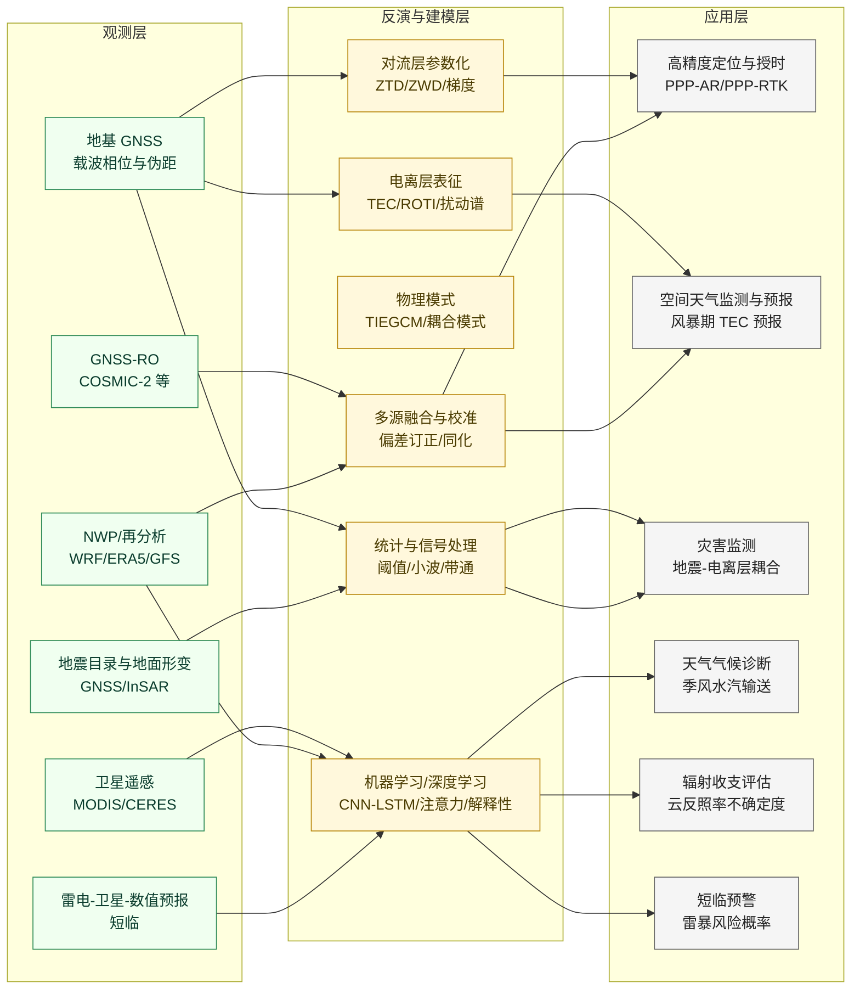
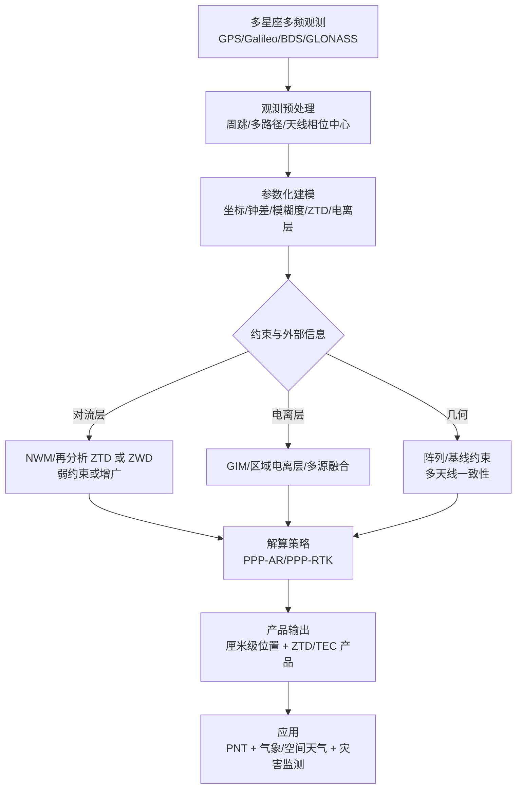
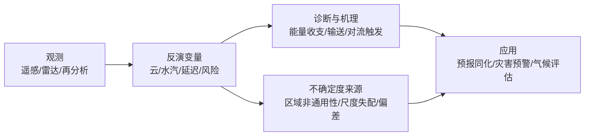
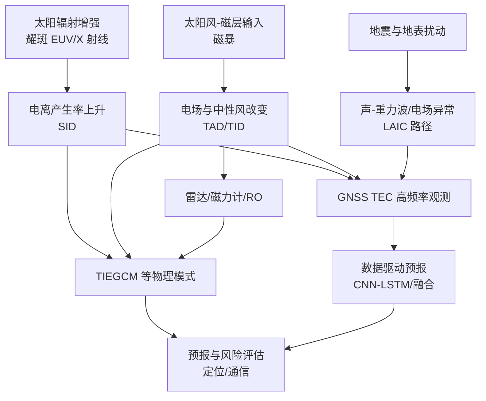
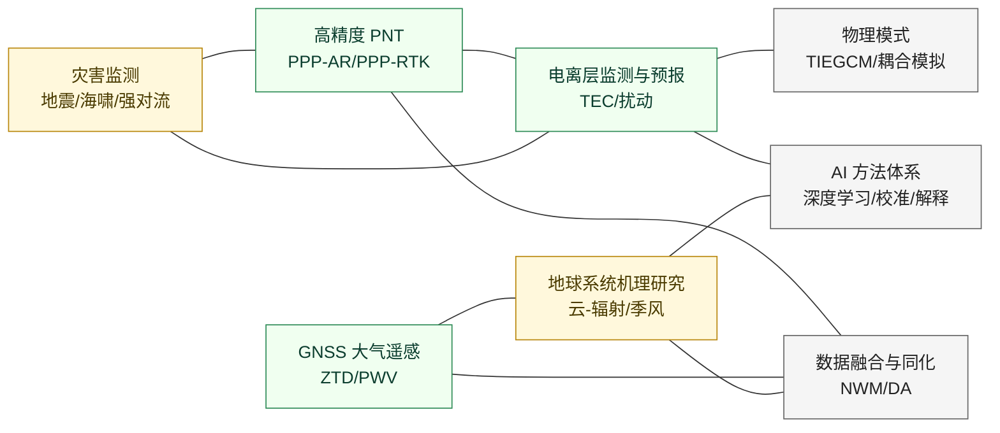

围绕 GNSS 对流层/电离层反演、地震-电离层耦合、季风水汽输送敏感性、海洋低云反照率重建与短临强对流风险预报等主题，归纳近7天代表性论文的技术路线、关键创新与主要结论，并给出跨学科关联示意图与可核验参考文献。

## 一、本期研究印记图

本期论文覆盖三类“观测—模型—应用”链条的集中演化。一类以 GNSS 观测为核心，将信号传播误差（对流层湿延迟、电离层 TEC 与其快速扰动）从“定位误差项”转化为“可同化、可预报的环境变量”，强调多源融合与可操作的产品化（例如风暴期 TEC 预报、对流层延迟与水汽反演、地震相关电离层扰动监测）。第二类以中尺度与天气气候过程为核心，将 ERA5、WRF、NWP 输出与卫星观测（MODIS、CERES）耦合，聚焦不确定度来源与可解释性边界（例如云反照率核函数的区域非通用性、季风水汽输送对海温异常的响应机制）。第三类以“多尺度灾害链”视角贯通地震、强对流与空间天气，呈现出从事件检测走向“机理约束 + 统计稳健”的方法组合趋势（例如 LAIC 框架下的多参数一致性检验、基于注意力机制的概率校准短临风险预报）。

## 二、GNSS 方向研究现状与代表性工作

近阶段 GNSS 研究在方法学上呈现“多星座多频 + 外部环境信息 + 鲁棒不确定度约束”的组合推进。其核心动因来自两方面。一方面，PPP-AR 与 PPP-RTK 的工程化需求要求更短的收敛时间与更稳定的模糊度固定性能，而对流层湿延迟与电离层延迟的不确定性是收敛与完整性的重要限制因素。另一方面，GNSS 作为被动微波链路观测在全球具备连续覆盖优势，使其在灾害监测与地球系统诊断中具有“同一观测体系跨圈层复用”的边际收益。

本期 GNSS 论文的主题集中在两条应用链。一条聚焦对流层延迟参数的高精度估计与可用性提升，面向海上/移动平台等复杂场景对观测几何、天线阵列约束与参数相关性的处理。另一条聚焦“同一事件的固体地球形变与电离层响应的同步观测”，强调将 GNSS 位移与 TEC 扰动统一纳入事件识别与物理解释框架，从而增强地震灾害快速判识与机理归因能力。

### 2.1 代表性研究的技术路线与特点（GNSS）

| 研究主题 | 数据与对象 | 关键方法要点 | 主要贡献指向 |
|:--|:--|:--|:--|
| 船载多天线对流层延迟反演 | 船载多天线 GNSS 观测 | 基线约束 + 共享 ZTD 参数的联合估计框架（题名信息） | 缓解移动平台高度分量与 ZTD 相关性，提升 ZTD 可用性 |
| 地震震动在 TEC 与位移中的同步记录 | GNSS TEC 与地表位移 | 同步时序对齐、频段筛选与事件窗口分析（题名信息） | 提供跨圈层“同震响应”观测证据，服务快速监测 |
| 间震期滑移亏损率的时空变化 | 10 年 GNSS 观测 | 识别慢滑事件与“黏滞事件”，构建时间相关性 | 指向断层耦合状态连续可变的观测约束 |

### 2.2 GNSS 技术路线示意图（定位—大气—电离层的统一处理）

### 2.3 专题画像：船载多天线联合反演对流层延迟（GPS Solutions, 2026）

#### （1）技术路线（船载多天线、基线约束与共享 ZTD）

该研究针对海上移动平台的对流层延迟反演问题构建联合估计框架。船载场景中，平台运动、海面多路径与低仰角观测可用性会强化“高度分量—对流层参数”的相关性，使得单天线独立解算中 ZTD（或 ZWD）在短时窗内更易出现不稳定估计。题名所指的“基线约束多天线”属于阵列辅助思想的一种实现路径，即在同一平台上布设多接收天线，通过已知或可稳定估计的天线间几何关系约束坐标参数，从而把观测几何信息转化为对流层参数可分离性的提升。

在参数建模层面，该框架将对流层路径延迟统一映射为一个共享的天顶方向参数，并在多天线之间施加一致性条件。共享 ZTD 的设定隐含一个关键物理假设，即多天线在空间尺度上足够接近，使得对流层可视作同一湿延迟场对其产生近似一致的天顶延迟贡献。基线约束则为坐标解的稳定性提供额外先验，间接降低对流层参数在滤波更新中的漂移自由度。对于移动平台，基线约束还可视作对“平台刚体”特性的显式编码，使得运动学解算更能抵抗观测几何退化与多路径干扰的叠加效应。

#### （2）技术特点（阵列辅助的可分离性与可操作性）

技术特点体现在两类耦合关系的处理。其一是把通常由外部数值天气模式提供的对流层先验，部分替换为“阵列几何先验”，从而在缺乏高质量气象先验或需要完全自洽解算的场景下增强对流层延迟参数的可观测性。其二是通过共享参数的方式降低参数维数，并利用多天线冗余观测在统计意义上改善估计方差。这类策略与地面固定站的“密集网络约束”思想不同，强调的是单平台内部的结构先验，与海上观测稀疏、外部改正不足的约束条件相匹配。

该路线的潜在边界也具有清晰的物理含义。当多天线间距达到对流层水平梯度可分辨尺度，或平台结构引入显著天线相位中心变化与遮挡差异时，共享 ZTD 的近似将引入系统性偏差。因此，阵列规模、天线布设与梯度项参数化方式是该类方法能否扩展到更复杂平台的关键工程变量。

#### （3）重要结论（面向海上水汽反演与 GNSS 气象产品）

该研究的重要结论是：**通过多天线基线约束与共享对流层参数的联合估计框架，可以在船载等移动平台上增强天顶对流层延迟估计的稳定性与可用性，从而提升海上 GNSS 气象反演链条的可操作性。**

从影响与意义看，这一路线为海洋气象观测提供了“平台内部自洽增强”的新手段。对业务系统而言，它为海上水汽与对流层延迟产品的连续性与质量控制提供了结构化约束来源，有利于在稀疏海洋观测条件下补齐对数值天气预报同化有价值的湿延迟信息。对高精度定位而言，对流层参数稳定性的提升可与 PPP-AR 的外部增广策略形成互补，改善收敛阶段的上向误差传播并增强解算鲁棒性。

### 2.4 专题画像：同震震动在 GNSS TEC 与地表位移中的同步记录（GPS Solutions, 2026）

#### （1）技术路线（事件窗口内的同步观测与频段提取）

该研究以 2024 年花莲地震为案例，题名明确其核心策略是对 GNSS TEC 与地表位移进行“同一事件、同一时间轴”的联合观测与分析。方法链通常包含三步。第一步，在位移侧从高采样率 GNSS 坐标序列或位移时序中提取同震震动与近场运动特征；在 TEC 侧从双频观测推导相位平滑 TEC，并对电离层穿刺点几何引入的时空耦合效应进行处理。第二步，对两类信号采用一致的事件窗口与滤波带宽，确保在谱域上对齐地震激发的声-重力波或瑞利波相关扰动成分。第三步，通过传播时延、方位相关性与空间分布一致性检验，区分地震激发的电离层扰动与同时段的空间天气背景变化。

由于本期论文清单未提供该文摘要，以上技术路线描述严格限于题名所指向的研究对象与该类研究的标准处理链条，具体参数设置与定量结果应以期刊正式版本为准。

#### （2）技术特点（跨圈层同源事件证据链）

该研究的技术特点在于把“固体地球同震形变观测”与“电离层扰动观测”置于同一证据链框架中。就观测系统而言，GNSS 同时提供位移与电离层两类产品，使得观测链条内部的一致性更强，减少跨平台数据融合时的时钟、采样率与质量控制差异。就物理解释而言，同震震动通过大气波动向上传播并扰动电离层电子密度的机制已在大量研究中得到讨论；同步记录的价值在于可为传播速度、频段能量分布与耦合效率提供更直接的观测约束，从而提升事件识别与机理归因的可靠性。

#### （3）重要结论（面向快速监测与预警链）

该研究的重要结论是：**同一强震事件能够在 GNSS 位移序列与 GNSS TEC 序列中形成可同步识别的震动信号或扰动响应，从而为基于 GNSS 的跨圈层灾害监测提供统一的数据证据链。**

其意义在于为灾害监测系统设计提供新约束。面向地震快速评估，位移与电离层扰动的联合判识可在不同距离尺度上互补，尤其在海啸、强震远场与通信受损场景下具有潜在应用价值。面向方法学，如何在事件级产品中显式量化空间天气背景与电离层“常态扰动”的不确定度，是将该类证据链转化为稳定业务算法的关键问题。

### 2.5 专题画像：间震期板块界面滑移率的时空变化（GRL, 2026）

#### （1）技术路线（长期 GNSS 形变序列与瞬态过程识别）

该研究基于 10 年 GNSS 数据监测 Kodiak Island 周边板块界面的间震期滑移亏损率变化，核心流程是把时间序列形变分解为长期平均项与瞬态项，并在瞬态项中识别慢滑事件以及滑移亏损率的阶段性上升过程。研究中提出“sticking events”概念，用于描述在慢滑事件前后出现的滑移亏损率增强现象，并通过时间相关性论证其与慢滑事件存在关联。

#### （2）技术特点（把“间震期”视为连续可变过程）

技术特点是对传统“慢滑—非慢滑”二分叙事的修正。研究结果指向滑移亏损率在时间上连续可变，难以将记录清晰分割为慢滑阶段与非慢滑阶段。这一结论在方法层面要求对瞬态过程采用更连续的状态空间表达与不确定度传播策略，而非仅依赖事件目录式的离散识别。

#### （3）重要结论（断层物性表征与风险评估）

该研究的重要结论是：**在研究区间内，板块界面滑移亏损率呈现与慢滑事件相关的连续变化特征，提示断层耦合状态在时间上持续可变，难以用严格分段的间震期阶段模型刻画。**

该结论对地震风险评估的影响在于，若耦合状态在时间上持续变化，则基于单一时间窗估计的滑移亏损率可能低估或高估未来一段时期的应力积累速率；因此，长期 GNSS 监测与瞬态过程识别应作为断层物性反演与危险性评估的核心观测约束之一。

## 三、大气方向研究现状与代表性工作

本期大气方向论文集中体现了“观测反演的不确定度边界”与“可解释机理链条”的双重诉求。海洋低云的反照率重建问题表面上属于辐射传输与云微物理反演，但其核心挑战是统计关系在高气溶胶负荷区域的非通用性，从而直接牵引到气溶胶—云相互作用的不确定度问题。季风水汽输送敏感性研究则体现了用数值试验隔离因果链的典型路径，即通过对海温异常的敏感性试验分解水汽输送与风场调整机制。短临雷暴风险概率预报论文则代表了深度学习向“概率校准与风险表达”推进的工程化转向，强调不仅要“预测”，还要“可用”。

### 3.1 代表性研究的技术路线与特点（大气）

| 研究主题 | 数据与对象 | 关键方法要点 | 主要贡献指向 |
|:--|:--|:--|:--|
| 海洋低云反照率重建 | MODIS + CERES（2003–2021） | 基于 CF-LWP-Nd 的核函数重建与区域分辨率检验 | 界定关系非通用性与不确定度来源 |
| InSAR 对流层延迟分离 | UAVSAR 多斜视角 | 斜视角依赖的延迟结构识别与分离策略验证 | 改善形变—大气延迟可分离性 |
| 季风水汽输送敏感性 | WRF + SST 敏感性试验 | IVT 分解 + 压力调整机制 + 浮力诊断 | 建立海温异常到降水再分配的机理链 |
| 复合干热事件与小麦减产 | ERA5（1981–2020） | 多干旱与热指标组合敏感性比较 | 定量刻画复合胁迫对产量的影响 |
| 雷暴短临风险概率预报 | 卫星 + NWP | CNN + 注意力机制 + 概率校准（ECE） | 从分类向可校准概率风险图转变 |

### 3.2 大气过程与反演不确定度示意图

### 3.3 专题画像：海洋液态云反照率可由平均云属性重建吗（ACP, 2026）

#### （1）技术路线（核函数重建与尺度敏感性检验）

研究以海洋液态云对短波辐射反照率的控制作用为背景，构建简化核函数，评估顶层大气全空反照率能否由场景平均云属性估计。输入变量包括云量（CF）、液水路径（LWP）与云滴数浓度（Nd），并以 MODIS 与 CERES 的长期资料（近全球海洋，60°S–60°N，2003–2021）为观测基础。研究通过对重建偏差的空间分布统计与方法变体试验，检验引入太阳天顶角上限约束与更高空间分辨率核函数网格能否降低偏差。

#### （2）技术特点（直接量化“非通用性”并定位其结构来源）

该研究的重要技术特点是把“关系不通用”作为可量化对象而非定性描述。结果显示仅在不足 40% 的样本中能将反照率重建误差控制在 10% 以内，提示平均云属性到辐射响应的映射在全球范围受区域气溶胶负荷与观测几何强烈调制。通过分辨率与太阳天顶角约束的改动降低偏差，意味着偏差并非纯随机噪声，而与取样尺度、太阳几何与区域态密切相关。

#### （3）重要结论（气溶胶—云相互作用不确定度的关键环节）

该研究的重要结论是：**场景平均云属性对顶层大气反照率的重建关系在全球范围并不普适；通过考虑太阳天顶角约束与提高核函数空间分辨率可减少偏差，但仍需进一步理解区域差异机理以降低气溶胶—云相互作用不确定度。**

其意义在于为辐射强迫评估提供直接约束。若平均态参数化无法稳定重建反照率，则基于平均云属性推断辐射效应的误差将成为气候敏感性与气溶胶间接效应评估中的主要不确定度环节之一；因此需要更细尺度的区域化参数化、与更一致的观测—模型对齐策略。

### 3.4 专题画像：多斜视角 InSAR 分离形变与对流层延迟（Remote Sensing, 2026）

#### （1）技术路线（斜视角依赖的非均匀延迟结构与分离策略）

研究指出对流层延迟是星载 InSAR 的主要误差源之一，并展示非均匀对流层延迟结构与重复轨观测的斜视角存在依赖关系。通过处理 UAVSAR L 波段数据的三种斜视角观测，研究观察到随斜视角变化的沿轨向位移引起的延迟结构偏移，并据此估计有效延迟层高度。在此基础上，研究提出多种分离形变与大气延迟的处理策略，并使用 UAVSAR 观测与模拟形变对方法进行验证。

#### （2）技术特点（把观测几何作为“可控扰动”用于误差分离）

技术特点在于把斜视角作为控制变量，使对流层延迟的非均匀结构在不同观测几何下产生可追踪的位移，从而为分离提供新的可识别特征。这一路线对星载任务具有可迁移性，因为星载重复轨也会出现斜视角差异或等效几何变化。其关键在于将对流层延迟从“不可控背景”转化为“可利用的几何响应”。

#### （3）重要结论（提升形变监测的可解释误差模型）

该研究的重要结论是：**非均匀对流层延迟结构随斜视角发生系统性沿轨向位移，利用这一几何依赖性可增强形变项与大气延迟项的分离能力，并可推广至星载场景。**

该结论对地表形变监测意义明确。它为复杂地形或湿润对流活跃地区的 InSAR 形变反演提供了新的误差建模维度，有助于在缺乏高质量外部对流层改正产品时提升形变产品的可信度。

### 3.5 专题画像：2023 南亚季风水汽输送对阿拉伯海海温异常的敏感性（JGR: Atmospheres, 2026）

#### （1）技术路线（WRF 敏感性试验与 IVT 分解）

研究围绕阿拉伯海“迷你暖池”在季风爆发前的增暖过程，采用 WRF 构建海温敏感性试验，针对 2023 年季风个例对“海温下降更慢”的反事实情景进行模拟。研究报告在暖池附近离岸降水可增加超过 100%，而北阿拉伯海与印度西海岸降水减少。为解释降水差异，研究对整层水汽输送（IVT）进行分解，分别诊断水汽含量变化与风场变化的贡献，并以压力调整机制解释风速收敛变化；同时用理想化羽流模型的整层浮力诊断区分温度与湿度对不同高度层浮力的贡献。

#### （2）技术特点（将“动力—热力—水汽”链条拆解为可检验分量）

该研究技术特点在于结构化分解。IVT 分解使得“水汽变多”与“风场重分配”两条路径可分别量化，压力调整机制为风场响应提供动力学解释，而浮力诊断将对流增强归因到不同高度层的温湿贡献差异。该链条为季风系统对海温异常的敏感性提供了可复现的因果叙述。

#### （3）重要结论（暖池海温对对流与降水分配的非线性影响）

该研究的重要结论是：**阿拉伯海暖池海温下降速率的改变可显著重分配区域降水；这种重分配由水汽含量与风场调整共同驱动，且湿度变化在中低对流层对浮力增强的贡献可大于温度变化。**

该结论对季风预测与海气耦合理解具有直接意义。它提示在季风前期，海温异常不仅通过局地蒸发改变水汽，还通过压力调整触发风场收敛与水汽再分配，从而产生区域尺度降水响应；因此海温演变的同化与预报不确定度会通过该链条放大到降水预报误差中。

### 3.6 专题画像：深度学习的雷暴短临风险概率预报（NHESS, 2026）

#### （1）技术路线（卫星 + NWP 的时空序列输入与注意力 CNN）

研究面向 1 小时以内、5 分钟更新的闪电/雷暴风险预报，构建以卫星观测与数值预报输出为输入的时空序列，并采用带注意力机制的 CNN 进行风险概率预测。研究强调输出概率的校准性，并报告 5 分钟预测的 F1 约 0.65、30 分钟预测的 F1 约 0.5，同时期望校准误差低于 10%，可生成空间风险概率图。

#### （2）技术特点（从“识别”转向“校准概率”的风险产品）

该研究的技术特点是把“校准”作为核心目标而非附属指标。对航空等高风险行业，概率产品的可用性取决于校准误差而不仅是分类指标。引入注意力机制的价值在于在多源输入中强调对雷暴电活动更敏感的时空特征，从而提升短临预测的稳定性与解释性基础。

#### （3）重要结论（短临风险图的可用性约束）

该研究的重要结论是：**在卫星与 NWP 融合输入下，注意力 CNN 可在分钟级尺度输出校准性较好的雷暴风险概率，从而支持可视化风险图与业务决策。**

其意义在于为“AI 预报产品化”提供了评价范式。若概率输出经校准可控，则风险阈值可根据不同业务场景进行统一配置与后验评估，从而把深度学习模型纳入可审计的风险管理流程。

## 四、电离层方向研究现状与代表性工作

电离层方向本期主题突出两类外强迫。一类来自太阳耀斑与磁暴等空间天气事件，强调高时间分辨率 TEC 观测与物理模式（TIEGCM）对响应形态的联合约束，形成从现象到机理的闭环。另一类来自地震活动，集中体现 LAIC 框架下的多参数一致性检验与事件窗口内的同震声-重力波扰动识别。与此同时，数据驱动模型与多源融合仍是 TEC 预报的主线之一，尤其在风暴期对鲁棒性与可泛化性的要求下，偏差订正、特征融合与可解释性方法正在成为“工程化落地”的关键组成部分。

### 4.1 代表性研究的技术路线与特点（电离层）

| 研究主题 | 数据与对象 | 关键方法要点 | 主要贡献指向 |
|:--|:--|:--|:--|
| 太阳耀斑 SID 的空间展开 | 1 Hz TEC + TIEGCM | 以亚太阳点为起始的展开速率估计 | 修正“瞬时全日侧同时”叙事 |
| 磁暴期间日间密度增强机理 | 雷达 + BDS GEO TEC + TIEGCM | 中性风切变主导的连续性方程诊断 | 给出可检验的主控项 |
| TEC 深度学习融合预报 | GNSS + COSMIC-2 | BWO 优化 CNN-xLSTM 融合 | 提升静稳与风暴期精度 |
| 地震前 TEC 异常与电荷驱动解释 | GNSS TEC | 36 分钟前趋势变化与空间型态 | 加强地震前兆统计样式 |
| LAIC 多参数一致性检验 | GNSS TEC + b 值 + AGW | IDI/ROTI/小波 + b 值时空叠置 | 形成跨域一致性证据链 |
| 磁层-电离层映射模拟 | 混合-Vlasov 模拟 | 重联-流动-场向电流映射 | 解释“斑块电流分布”成因 |

### 4.2 电离层扰动的“驱动—响应—观测”结构图

### 4.3 专题画像：太阳耀斑引发的 SID 并非“全日侧瞬时同时”（GRL, 2026）

#### （1）技术路线（1 Hz TEC 观测与 TIEGCM 10 s 模拟的形态对齐）

研究使用 1 Hz 的 TEC 高采样率数据分析 2003–2023 年 13 次太阳耀斑的电离层响应，并通过 TIEGCM 的 10 秒分辨率模拟复现 SID 的形态演化。研究将 TEC 增强的出现时间与空间分布相对亚太阳点进行表征，得到 SID 先在亚太阳点出现，随后在约 20–25 秒内向晨昏区扩展的形态。

#### （2）技术特点（以太阳天顶角解释“表观传播”而非真实等离子体输运）

该研究的关键技术特点是把 SID 的空间展开解释为太阳天顶角对电离层响应幅度的调制，从而在观测上表现为不同区域 TEC 增强出现的时间差。研究估计表观水平扩展速率为 250–500 km/s，并指出该速率与耀斑谱特性有关。这一解释强调的是辐射驱动的空间非均匀响应，而非需要引入不现实的等离子体快速平流机制。

#### （3）重要结论（高采样率 GNSS 在空间天气快速响应研究中的作用）

该研究的重要结论是：**SID 的最早响应出现在亚太阳点，并以 250–500 km/s 的表观速率向晨昏区扩展；这种扩展由太阳天顶角调制引起，TIEGCM 可复现其形态。**

其意义在于为电离层快速响应的建模与产品化提供新的观测约束。对于空间天气业务系统，高采样率 GNSS TEC 能够在秒级时间尺度刻画辐射驱动的电离层变化形态，为快速扰动识别与短时预报提供可检验的物理边界条件。

### 4.4 专题画像：磁暴期间日间密度增强的主控机制是极向中性风切变（GRL, 2026）

#### （1）技术路线（雷达观测 + GEO TEC + TIEGCM 联合诊断）

研究基于 2025 年 11 月 12 日磁暴期间三亚非相干散射雷达观测到的日间电子密度三倍增强，并结合北斗地球同步卫星 TEC 观测到的中纬度延伸增强，使用 TIEGCM 复现事件。研究进一步在连续性方程框架下分解不同项对密度增强的贡献，并识别与行进大气扰动（TADs）相关的中性风结构。

#### （2）技术特点（将“可观测增强”分解为连续性方程中的主控项）

研究通过对 O+ 连续性方程的项分析指出，密度增强主要由极向经向风的垂直切变主导，水平切变为次要贡献，并强调该主控机制对风向不敏感。这种诊断路径将事件解释从“相关性描述”推进到“主控项识别”，使结论具备更强的可检验性与可迁移性。

#### （3）重要结论（风切变驱动的电子密度积累机制）

该研究的重要结论是：**磁暴期间的显著日间电离层密度增强可由与 TADs 相关的极向经向风垂直切变所主导的积累过程解释，物理模式可复现观测特征。**

该结论对风暴期电离层预报具有直接意义。它提示在风暴期，准确刻画中性风结构与其垂直切变，比单纯依赖经验指数更能约束密度增强的发生条件与时空范围，从而提升 GNSS 定位与通信系统的风险评估能力。

### 4.5 专题画像：多源融合的 TEC 深度学习预报（Space Weather, 2026）

#### （1）技术路线（GNSS + COSMIC-2 融合，CNN-xLSTM 与 BWO 优化）

研究提出 BWO 优化的 CNN-xLSTM 混合模型，将地基 GNSS 观测与 COSMIC-2 掩星数据融合，以 CNN 提取空间特征、xLSTM 表征时间依赖，并以 BWO 对模型结构参数进行优化。评估覆盖静稳与磁扰动条件，比较对象包含 CODE-GIM、IRI 与多种神经网络基线。研究报告在静稳期 RMSE 约 0.924 TECU、MAE 约 0.675 TECU；在磁暴期 RMSE 约 1.173 TECU、MAE 约 0.883 TECU，并指出相对基线模型具有更高稳定性。

#### （2）技术特点（把“数据融合”与“结构优化”同时作为性能来源）

该研究的技术特点不止于模型结构本身，而在于将多源观测融合与超参数/结构优化显式耦合。COSMIC-2 的全球覆盖与垂向信息可补足地基 GNSS 空间分布的不均匀性，而优化算法用于减少人工调参对区域与扰动强度的敏感性。与仅依赖单一数据源的站点模型相比，该路线更适合面向区域推广与风暴期鲁棒性要求。

#### （3）重要结论（风暴期仍可维持可用误差水平）

该研究的重要结论是：**多源融合的深度学习模型在静稳与磁暴条件下均能提供更高精度与更稳定的 TEC 预报，且在磁暴期误差增幅可控。**

其意义在于为电离层预报产品的业务化提供可评估指标。以 TECU 级别误差为目标的预报产品可直接服务于 PPP-AR/PPP-RTK 的电离层改正与完整性评估，也可为电离层扰动监测与预警提供短时先验场。

### 4.6 专题画像：缅甸 Mw7.7 地震前的电离层异常与 LAIC 证据链（GJI, 2026；Remote Sensing, 2026）

#### （1）技术路线（地震前异常识别与多参数一致性检验）

GJI 研究使用 GNSS 接收机观测的 TEC 研究 2025-03-28 缅甸 Mw7.7 地震前的电离层变化，报告在地震前约 36 分钟出现趋势变化，正异常幅度约为背景的 1%，并呈现“中间正、南北负”的空间型态，指向沿磁力线的电子输运与可能的电场驱动机制。

Remote Sensing 研究在 LAIC 框架下引入更系统的多参数分析。研究在 2025-03-25 识别到显著负 TEC 异常（约 30 TECU 量级），并结合 IDI、ROTI 与 AGW 波段能量增强、小波谱特征，同时将长期到短期不同时间窗的 b 值从 1.12 降至 0.58 的趋势与低 b 区域空间叠置，使用 KDE 展示低 b 与低 vTEC 的联合分布聚集，形成跨域一致性证据链。

#### （2）技术特点（从单指标前兆走向“跨域一致性”）

两项研究共同体现的技术特点是把“前兆”从单一时序异常提升为“多域一致性”。在电离层侧，TEC 异常与扰动指数（IDI、ROTI）提供了强度与不规则性的互补量度；在固体地球侧，b 值时空变化与相对危险性指标用于刻画应力积累状态；在耦合机制侧，AGW 波段增强与同震后扰动为向上传播路径提供辅助证据。该组合有助于降低空间天气背景对单一 TEC 异常解释的歧义。

#### （3）重要结论（可审计的 LAIC 事件级分析框架）

该研究的重要结论是：**在该地震案例中，电离层 TEC 异常、扰动指数与固体地球应力指示量（b 值等）在时空上呈现可量化的一致性特征，为 LAIC 框架下的事件级评估提供了更可审计的证据链。**

其意义在于把地震电离层研究从“现象罗列”推进到“证据链工程”。对业务监测系统而言，关键在于建立可复现的质量控制与排除空间天气干扰的程序化流程，并以多参数一致性降低误报率。对科学问题而言，仍需在更大样本上评估一致性强度与地震震级、构造环境、磁暴背景之间的条件依赖关系。

### 4.7 专题画像：混合-Vlasov 全球模拟中磁层过程向电离层的映射（Annales Geophysicae, 2026）

#### （1）技术路线（Vlasiator 全局混合-Vlasov 模拟与场向电流映射）

研究使用全球混合-Vlasov 模拟（Vlasiator）研究内磁层与磁尾动力学及其在电离层中的映射信号，观察到磁重联触发于磁尾电流片晨昏侧并向全局扩展，同时出现方位向周期性的波状密度结构、快速向地流与涡度增强。研究指出向地流与涡度会激发场向电流，并在电离层域形成斑块状电流分布，事件由重联驱动快速流与 ballooning/interchange 不稳定共同驱动。

#### （2）技术特点（以一体化模拟连接“磁尾动力学—电离层电流结构”）

技术特点在于通过自洽模拟把磁尾局地过程与电离层电流结构联系起来，避免仅凭观测相关性推断因果。对电离层扰动解释而言，这类模拟为“上游过程导致的电离层斑块化”提供了可控实验平台，可用于检验不同太阳风输入与磁层不稳定模态对电离层响应的敏感性。

#### （3）重要结论（重联与不稳定共同塑造电离层斑块电流）

该研究的重要结论是：**磁尾重联与 ballooning/interchange 不稳定的耦合可在电离层产生斑块状电流分布，提供了连接磁层动力学与电离层电流结构的机理解释。**

其意义在于为电离层电动力学同化与预报提供物理先验。若斑块化电流结构可由上游过程条件触发，则观测与模式同化可更针对性地约束关键驱动因子，进而提升对高纬扰动与其对 GNSS 应用影响的预报能力。

## 五、交叉学科网络图与创新链流程图

上述网络反映出跨学科创新链的主干路径为“观测产品化—不确定度可控—风险/业务可用”。在 GNSS 侧，对流层与电离层延迟从误差项转为可同化环境变量，并反哺定位性能与灾害监测；在大气与空间环境侧，物理模式与深度学习形成互补，前者提供机理与可解释边界，后者提供多源融合与短时预报能力。对于工程系统，关键约束在于产品的校准性、可审计性与在极端事件条件下的鲁棒性。

## 六、近期研究特色变化与未来发展趋势

### 6.1 研究特色变化

近期研究呈现三个可归纳的变化方向。第一，GNSS 处理策略越来越强调“外部环境信息的可控引入”，包括数值天气模式对对流层改正的增广、对流层参数的物理可行域约束、不确定度权重的系统化设置等，其目标是同时改善收敛速度与稳态精度，并降低极端天气条件下的性能退化。第二，电离层研究在事件级分析中强化“多参数一致性”，尤其在地震相关研究中将 TEC 异常与扰动指数、波动谱与固体地球应力指标联合使用，以提升判识的稳健性与可复现性。第三，机器学习应用从“更高的点预测精度”转向“更可用的产品表达”，例如短临风险概率预报强调校准误差，TEC 预报强调风暴期稳定性与多源融合偏差订正。

### 6.2 未来发展趋势

面向 GNSS 方向，发展趋势集中在多星座多频 PPP-AR/PPP-RTK 的快速收敛与韧性 PNT。公开研究显示，利用业务化数值天气预报对对流层延迟进行增广可显著缩短 PPP-AR 收敛时间，并在全球尺度上呈现季节与纬度依赖性，这为将 NWM 与 GNSS 解算更紧耦合提供了现实路径。同时，电离层延迟的不确定度建模与约束策略将成为 PPP-RTK 稳健性的关键，尤其在电离层梯度剧烈或风暴期条件下，需要避免“过紧约束导致误差传递”的系统性风险。

面向大气方向，未来趋势在于对不确定度的结构化表达与与同化系统的更紧耦合。云辐射反演中“关系非通用性”的量化将推动区域化参数化、观测—模式尺度匹配与偏差订正的体系化发展；短临预报将进一步把可校准概率、可靠性图与决策阈值管理纳入模型评价指标。

面向电离层方向，趋势可概括为“多源观测—数据同化—物理与数据驱动混合预报”。一方面，ICON/MIGHTI 风场等关键观测的同化正在改善耦合模式的风暴期再现能力；另一方面，COSMIC-2 与地基 GNSS 的融合及偏差订正为数据驱动模型提供更一致的训练数据域，结合解释性工具与物理先验，可望提升模型在极端空间天气条件下的泛化与可解释能力。

## 参考文献

1. Wojciechowska, I., & Gryspeerdt, E. (2026). Reconstructing albedo from mean cloud properties. *Atmospheric Chemistry and Physics*. https://doi.org/10.5194/acp-26-4571-2026
2. Wu, X., Oveisgharan, S., & Khazendar, A. (2026). Use of Multi-Squint InSAR to Separate Surface Deformation from Troposphere Delay. *Remote Sensing, 18*(7), 1094. https://doi.org/10.3390/rs18071094
3. Sun, R., Subramanian, A. C., Wolding, B. O., Hsu, T.-Y., Mazloff, M. R., Cornuelle, B. D., Sprintall, J., Miller, A. J., Gopalakrishnan, G., & others. (2026). Sensitivity of the 2023 Asian Summer Monsoon Water Vapor Transport to Arabian Sea Surface Temperature Anomalies. *Journal of Geophysical Research: Atmospheres*. https://doi.org/10.1029/2025JD044185
4. Hu, J., Skalsky, R., Zhang, G., Folberth, C., & Shi, P. (2026). Multi-Indicator Assessment to Assess the Increasing Impacts of Compound Dry and Hot Events on Global Wheat Yield. *Earth's Future*. https://doi.org/10.1029/2025EF007084
5. Bosc, M., Chan-Hon-Tong, A., Bouchard, A., & Béréziat, D. (2026). Predicting thunderstorm risk probability at very short time range using deep learning. *Natural Hazards and Earth System Sciences*. https://doi.org/10.5194/nhess-26-1603-2026
6. Wang, Z., Song, S., Ge, M., Yang, Y., Yan, Z., Zhou, W., Huang, C., He, X., Jiao, G., & Wang, Z. (2026). Enhanced tropospheric delay retrieval using baseline-constrained multi-antenna shipborne GNSS with common ZTD parameter in the western Pacific. *GPS Solutions*. https://doi.org/10.1007/s10291-026-02077-x
7. Rao, H., Chen, C.-H., Sun, Y.-Y., Hsiao, T.-Y., & Zhang, P. (2026). Seismic shaking simultaneously recorded in GNSS TEC and surface displacements: a case study of the 2024 M 7.4 Hualien earthquake. *GPS Solutions*. https://doi.org/10.1007/s10291-026-02067-z
8. Okada, Y., Nishimura, T., & Freymueller, J. T. (2026). Spatiotemporal Variations in the Interplate Slip Rate Around Kodiak Island, Alaska. *Geophysical Research Letters*. https://doi.org/10.1029/2025GL120066
9. Maletckii, B., Astafyeva, E., Pedatella, N. M., & Qian, L. (2026). Sudden Ionospheric Disturbances Generated by Solar Flares—Not so Sudden? *Geophysical Research Letters*. https://doi.org/10.1029/2025GL120816
10. Heki, K., & Zhan, W. (2026). Ionospheric changes immediately before the 2025 March 28 Mw7.7 Myanmar earthquake. *Geophysical Journal International*. https://doi.org/10.1093/gji/ggag124
11. Colonna, R., Nayak, K., Sharma, G., & Romero-Andrade, R. (2026). Evaluation of Seismo-Ionospheric and Seismological Parameters Within the Lithosphere–Atmosphere–Ionosphere Coupling Framework for the 2025 Mw 7.7 Myanmar Earthquake. *Remote Sensing, 18*(7), 1016. https://doi.org/10.3390/rs18071016
12. Jiang, Q., Lei, J., Li, Z., Huang, F., Xia, R., Dang, T., Yue, X., & Luan, X. (2026). Daytime Ionospheric Density Enhancement Driven by Poleward Neutral Wind Shear Associated With Gravity Waves During the November 2025 Geomagnetic Storm. *Geophysical Research Letters*. https://doi.org/10.1029/2026GL121876
13. Li, W., Li, J., Li, J., Chen, G., Zhao, D., Li, L., Meng, X., Zuo, X., & Zhang, K. (2026). A High-Accuracy TEC Model for Low-Mid Latitudes Using a BWO-Optimized CNN-xLSTM Hybrid Model With Multi-Instrument Data Fusion. *Space Weather*. https://doi.org/10.1029/2025SW004656
14. Koikkalainen, V., Grandin, M., Kilpua, E., Workayehu, A., Zaitsev, I., Juusola, L., Tao, S., Alho, M., Pänkäläinen, L., & others. (2026). Mapping transition region flows to the ionosphere in a global hybrid-Vlasov simulation. *Annales Geophysicae*. https://doi.org/10.5194/angeo-44-227-2026
15. Thundathil, R., Zus, F., Dick, G., & Wickert, J. (2025). Assimilation of GNSS zenith delays and tropospheric gradients: a sensitivity study utilizing sparse and dense station networks. *Atmospheric Measurement Techniques, 18*, 4907–4922. https://doi.org/10.5194/amt-18-4907-2025
16. Zhang, M., Hu, X., Zhang, Y., Yan, Z., Liang, H., Yang, J., Xiao, C., & others. (2026). Assimilation of ICON/MIGHTI Wind Profiles into a Coupled Thermosphere/Ionosphere Model Using Ensemble Square Root Filter. *Remote Sensing, 18*(3), 500. https://doi.org/10.3390/rs18030500
17. Wang, L., Li, J., Meng, X., Zhao, D., He, C., Zuo, X., & Zhang, K. (2025). A deep learning model for correcting nonlinear biases between the TEC measurements of COSMIC-2 and GNSS. *Advances in Space Research, 76*(7), 3768–3783. https://doi.org/10.1016/j.asr.2025.05.011
18. Gao, X., Cheng, F., Lu, X., & others. (2026). Forecasting one-day global ionospheric TEC maps based on a modified 3D convolution U-Net incorporating fused index features. *GPS Solutions*. https://doi.org/10.1007/s10291-025-02011-7
