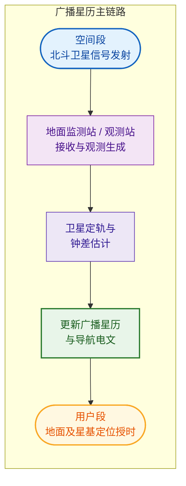
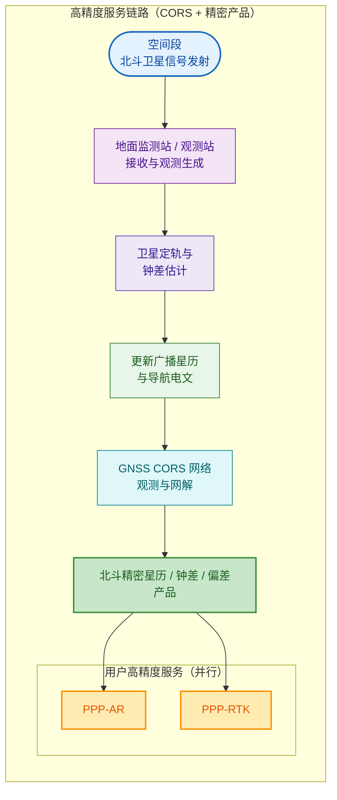

面向北斗系统在轨升级与编配调整窗口，单颗卫星的 PRN 重分配会以“用户通告”形式进入公众与行业的操作视野。此类事件的直接后果往往首先体现在接收端相关器目标序列、观测归档主键与星历关联逻辑之上，继而沿监测网、精密产品与 PPP/RTK 业务链外溢。读者若从事运维、定轨、CORS、分析中心产品或终端算法，可将本文视为把 CSNO 一手通告与 GNSS 公开文献中的“信号—估计—产品”常识对齐的说明性报告。

全文先给出可核查事件事实与写作目标，再集中交代方法卷（双链路模型、情形 A/B、RINEX、推理依据），继之按两条业务链路分述影响，随后汇总适配策略与常见误解，最后结论与参考文献。

## 1 引言与研究目标

### 1.1 背景

北斗系统的在轨升级通常包含卫星载荷与信号体制的状态优化、运行配置调整与地面系统联调联试等环节。北斗网在 2026 年 3 月发布的官方消息指出，北斗系统将于近期实施在轨升级，对部分卫星工作状态进行优化调整，并在升级期间持续开展联调联试与服务性能监测维护，以确保用户体验与服务连续性（见参考文献 1）。

在这一宏观升级窗口内，单颗卫星的可用标识与信号编配调整往往通过“系统用户通告”以可操作的方式对外发布。2026 年 4 月 9 日，CSNO 测试评估研究中心发布北斗系统用户通告（NABU）20260006，通告类型为 `RNSS_GNR_PRN_REALLOCATE`，并给出了明确的事件时间窗与 PRN 重分配信息（见参考文献 3）。

### 1.2 研究目标与问题边界

本文面向高精度应用与监测评估业务链路，围绕 NABU 20260006 所描述的 PRN 重分配事件，形成可复用的影响评估框架，重点回答以下问题。

1. 升级窗口内，PRN 重分配对“卫星信号发射—地面观测站接收—卫星定轨—更新广播星历—用户设备服务”链路的关键节点影响是什么。
2. 在引入 CORS、精密产品与 PPP/RTK/AR 的链路中，PRN 重分配如何触发精密星历、钟差、偏差产品与模糊度状态的重置或不一致风险。
3. 在专业信号处理意义下，地面接收端通过相关锁定与码跟踪识别卫星的机制，决定了“仅改变 PRN 标识”与“改变 PRN 及其附属码结构”两类情形的风险边界。本文以情景分析方式对两类情形分别评估，并明确哪些结论来自通告事实、哪些属于工程推演。

## 2 事件事实与信息来源

### 2.1 NABU 20260006 可核查要点

根据 CSNO 测试评估研究中心发布的北斗系统用户通告（NABU）20260006（见参考文献 3），本次事件的可核查要点包括。

1. 事件类型为 `RNSS_GNR_PRN_REALLOCATE`。
2. 事件时间窗为 2026-04-10 12:00 至 2026-04-10 16:00（UTC）。
3. 卫星信息为 BDS-3 IGSO-01，且“卫星信号 PRN 将由 38 重构为 6”。

### 2.2 通告性质（计划操作语境）

同站点的“用户通告说明”页面将北斗系统用户通告（RNSS 服务）分为计划操作、非计划中断与其他，并对“升级维护”等计划操作类事件进行了解释性描述（见参考文献 2）。NABU 20260006 属于计划操作范畴的工程理解边界，可据此将其视为运维窗口内的编配变更事件，而非不可预期的中断类事件。

## 3 分析框架与方法

### 3.1 双链路模型

本文采用“端到端业务链路 + 关键节点状态量”的方式组织分析。核心思想是将 PRN 重分配视为一个会改变接收端相关器目标序列的操作，并沿两条链路追踪其对观测生成、观测归属、定轨解算、星历产品分发与用户定位解算的影响传播路径。

**广播星历主链路**结构如下。

**高精度服务链路**（以 CORS 与精密产品为核心）结构如下。

> 说明：第二幅图中精密产品节点同时支撑 PPP 与 RTK/RTK-AR（并行消费），与正文节点 F—H 的叙述一致。

### 3.2 情形 A 与情形 B

本次通告中明确出现的是“PRN 重构”。在扩频体制的接收机实现中，PRN 对应相关器所使用的伪随机序列集合，决定了码跟踪与卫星区分的第一道“指纹”。然而，公开通告通常不会逐项披露各信号分量的码结构细节，因此本文以情景分析方式区分两类工程情形。

1. **情形 A（仅 PRN 标识或编配映射改变）**  
该情形下，系统外部呈现为“PRN 编号重分配”，但不引入额外的码结构改变。接收端的主要风险来自跟踪通道的 PRN 分配表更新与观测归属规则变化。
2. **情形 B（PRN 与附属码结构共同调整）**  
该情形下，除 PRN 编号重分配外，还可能伴随数据或导频分量的附属码结构调整，例如二级码长度、重复周期或码组配置发生变化。此时风险不仅是“换号”，还包含“相关峰与码相位结构变化”带来的锁定与解算状态重置效应。对采用 NH 二次码与导航比特共同调制的 B1I 类信号，公开文献中已有从相干积累与频率估计角度讨论二次码所致符号翻转效应对捕获链路影响的独立算例，可用作理解“情形 B 可能显著加重失锁与重捕”的概念依据，但不构成对 NABU 20260006 技术细节的推断，具体文献锚点见 3.4 节。

由于 NABU 20260006 未在公开条目中直接披露“附属码结构是否调整”，本文将情形 A 与情形 B 明确标注为推演假设，用于界定地面适配测试的覆盖范围与验证清单，而非对系统内部实现做事实断言。

### 3.3 数据记录与交换（RINEX）

观测数据交换格式对“卫星编号与信号观测”的组织方式，会影响到 PRN 变化期间数据连续性与后处理策略。RINEX 4.00 作为多系统观测与导航数据交换标准，对“卫星编号（Satellite numbers）”与观测记录组织给出了规范（见参考文献 4）。在工程实践中，PRN 变化往往表现为同一物理卫星在观测文件层面对应的卫星标识发生变化，从而触发数据分段、弧段重启与模糊度重新初始化。

### 3.4 推理依据

下列材料并不取代 CSNO 通告本身，但为本文中“捕获—跟踪—参数估计—产品消费”的推理提供可核查的外部锚点，便于审稿与工程审计。

1. **信号与接收机层面**  
CDMA 体制下卫星分辨依赖伪随机码相关，导航信号结构（导频/数据分量、是否叠加二次调制等）直接约束相干积分长度、捕获与位同步策略。该总体系在 Teunissen 与 Montenbruck 主编的 GNSS 手册中有系统阐述（见参考文献 5）。该手册亦覆盖多系统电文、接收格式与估计理论，适合作为本报告的“术语与概念边界”参照而非具体操作细则。
2. **二次码（NH）与情形 B 的可见度**  
对北斗 B1I 等采用 Neumann–Hoffman（NH）二次码调制的公开服务信号，文献从信号模型角度给出“导航比特与二次码对齐、显著增加码符号翻转概率、从而限制经典相干积累与影响频率估计峰”的分析与算法讨论（见参考文献 6）。据此，若在运维事件中除 PRN 编号外还触及二次码周期、组合关系或与电文比特边沿的对齐关系，地面侧看到的将不单纯是“改星号”，而可能同时触及长积分与跟踪环初始化逻辑，这与情形 B 的工程含义一致。该文献不证明 NABU 20260006 一定包含此类变更，但为“为何需要把情形 B 纳入验证矩阵”提供独立依据。
3. **监测网与国际产品生态**  
IGS MGEX 实验推进了多系统跟踪网、钟轨产品与元数据实践，其综述性工作总结了监测站能力、产品与仍待统一的处理细节（见参考文献 7）。在 PRN 变更语境下，MGEX 文献所强调的“多系统混合处理与产品一致性”问题，可映射为本文 CORS 与精密产品节点上的跨站、跨厂商对齐难度。
4. **卫星相位中心改正的文件绑定规则**  
ANTEX 格式明确卫星条目以系统字母与卫星代码 `sNN` 组织，并对 Compass/BeiDou 等系统说明如何用 PRN 选星（见参考文献 8）。这正是第 5 章强调“PRN 变更后软件必须把新 PRN 映射到正确卫星天线小节”的来源之一，属于实现层约束而非轨道动力学结论。
5. **整周模糊度与弧段语义**  
PRN 切换在参数估计侧常表现为相位观测上的不连续接口。最小二乘模糊度去相关调整（LAMBDA 类方法）所处理的对象是整数模糊度向量及其协方差结构（见参考文献 9）。工程上若不在切换历元显式重启或重构模糊度参数，而把失配当作普通噪声吸收，会在统计上表现为错误固定概率上升或浮点解有偏。
6. **参考架与天线模型版本化**  
IGS 向 IGS20 参考框架与 `igs20.atx` 等产品维护策略迁移的通报，给出了“天线改正文件与产品重处理版本绑定”的运维级先例（见参考文献 10）。这与“ATX 是否随 PRN 事件必更”这一具体问题不同，但为读者提供“何时必须整体更换 ATX、何时仅需软件映射”的制度参照。

### 3.5 验证与不确定度概要

PRN 重分配事件在计量意义上可分解为三类可测试效应。

1. **观测生成层**  
失锁、重捕时延与码噪声增大直接抬高伪距与相位观测的短期方差，影响滤波增益与模糊度验后比。
2. **几何层**  
若星历—观测关联正确，卫星几何未因 PRN 事件改变，精度因子类指标不应出现结构性台阶，除非可用卫星数因设备未适配而下降。
3. **偏差点估计层**  
DCB/OSB、UPD、相位偏差等产品若按 PRN 主键存储，会在切换历元出现“参数继承错误”或需要重新预热估计。

因此验证报告建议同时给出“单站接收机诊断曲线”和“网级残差/固定率曲线”，并在切换历元前后各保留不少于一个完整子夜的弧段做对照，以分离设备因素与几何因素。

## 4 影响分析

### 4.1 广播星历主链路（节点 A—E）

#### 4.1.1 节点 A　卫星信号发射端

从通告事实可确认的是在给定时间窗内，BDS-3 IGSO-01 的“卫星信号 PRN”将由 38 重构为 6（见参考文献 3）。对发射端而言，这意味着信号编配层面的变更会在 UTC 时间边界附近发生切换。

情形 A 下，发射端主要体现为 PRN 资源的重分配与对外编号一致性的更新。情形 B 下，发射端还可能涉及信号生成链的码组参数切换，导致相关峰结构与码相位周期性特征改变，从而使接收机在切换瞬间更容易出现失锁与重捕获。

#### 4.1.2 节点 B　地面观测站接收端

地面观测站通常以 PRN 相关锁定为基础完成捕获、跟踪与观测量生成。PRN 变化的直接后果是原先用于相关的序列不再匹配，从而触发码环与载波环失锁，表现为观测中断或等效的“周跳事件”。在 IGSO 场景下，由于卫星几何相对稳定，观测站可能在同一方向上持续接收该卫星信号，因此失锁的主要触发机制来自码不匹配而非遮挡几何变化。

对监测网而言，关键风险集中在两类错误。

1. 跟踪通道未及时切换而导致观测缺失，进而影响该卫星在定轨解算窗口内的可观测性与可用弧段长度。
2. 更高风险的是观测归属错误，即将“新 PRN 的观测”误认为“旧 PRN 的观测”或反之。该错误会在后续定轨中表现为残差异常、钟差跳变或星历拟合不一致，且可能在产品分发前被误当作随机噪声吸收，带来难以察觉的系统性偏差。

#### 4.1.3 节点 C　卫星定轨与钟差估计

定轨解算对观测连续性、观测归属一致性与动力学模型约束高度敏感。PRN 重分配本身不改变物理轨道，但会改变“观测—卫星实体”的关联索引，从而对定轨处理链产生三类影响。

1. **弧段切分与初值重置**  
若 PRN 变化引发观测弧段中断，定轨系统需要将同一物理卫星的观测弧段切分为两段并分别初始化相关状态。对于钟差估计与相位偏差估计，切分会降低约束强度，使短时钟差噪声与偏差估计的不确定度上升。
2. **解算一致性检查负担上升**  
PRN 切换窗口附近，观测残差统计特征可能显著改变。若质量控制策略不区分“编配变更导致的系统性事件”，可能出现错误剔除或错误平滑，从而影响该卫星在该时段的解算可靠性。
3. **产品发布时效压力**  
对于需要近实时发布的广播星历一致性监测与快速定轨产品，PRN 切换会在短时窗内同时触发“观测中断”与“身份映射更新”两项变更，要求自动化流水线具备明确的状态机与回滚策略，否则容易形成延迟或发布空洞。

#### 4.1.4 节点 D　广播星历与导航电文

广播星历更新本身由系统控制段完成，外部用户通常通过导航电文获得星历与相关参数。PRN 重分配事件对广播星历的关键影响不在于轨道参数本身，而在于“用户侧如何将星历与观测关联到同一 PRN 标识”。

在工程上，PRN 切换窗口可能带来短时的“卫星可用性感知偏差”。例如接收机仍在旧 PRN 上尝试解码导航电文而失败，导致对该卫星健康或可用性的误判；或在重捕获后才恢复电文解码，使可用卫星数在接收机内部短时下降。这一效应在多系统组合定位中可能被其他系统掩盖，但在北斗占比高的应用中会表现为 DOP 增大或定位解算收敛变慢。

#### 4.1.5 节点 E　终端与广域服务（主链末端）

终端影响具有显著的实现差异性。对于消费级接收机，PRN 切换多表现为短时失锁与重新收敛，影响集中在连续导航与授时的短时稳定性。对于高精度终端，影响还包含相位连续性的破坏与模糊度重置，进而在 PPP 或 RTK 模式下表现为收敛时间拉长或固定率下降。

### 4.2 高精度服务链路（CORS 与节点 F—H）

#### 4.2.1 CORS 网络观测与解算

CORS 网络通常承担两类角色，其一是作为高质量观测源支撑精密产品解算，其二是作为差分改正播发源支撑 RTK/AR 服务。PRN 变化窗口内，CORS 的关键挑战在于“跨站一致性”。

当同一卫星的 PRN 发生重分配，如果不同测站、不同接收机固件或不同厂商实现对切换时间的感知存在秒级差异，则网络解算会在切换过渡段出现“部分测站仍在旧 PRN 观测、部分测站已切换到新 PRN 观测”的混合状态。该混合状态会使网络解算的观测方程出现结构性不一致，表现为网络解算残差增大、参考站选择不稳定或改正数质量波动。

#### 4.2.2 节点 F　精密星历、钟差与偏差产品

精密产品链路的首要要求是“同一物理卫星的连续弧段与编号一致性”。PRN 重分配要求精密产品生产方在内部维护“卫星实体标识”与“对外 PRN 标识”的映射版本，并在产品元数据、产品注记与用户接口中显式表达切换事件，否则用户侧容易将两个 PRN 当作两颗不同卫星处理，造成不必要的产品分段与解算不连续。国际多 GNSS 实验网与产品链路的多年实践表明，多系统混合处理在提升 PPP 与科学应用能力的同时，对产品一致性与元数据维护提出更高要求（见参考文献 7），PRN 编配事件正是对这类维护能力的一次集中考验。

对于偏差类产品，风险更为细致。码偏差与相位偏差通常与信号分量、跟踪方式与硬件实现相关。情形 A 下，偏差本体不一定发生物理变化，但由于观测弧段切分与估计重启，偏差估计可能出现数值跃迁或方差上升。情形 B 下，若附属码结构或信号生成参数改变，偏差的统计特性可能发生实质变化，旧偏差模型对新观测不再适用，从而对 PPP 收敛与 RTK 模糊度固定产生更直接影响。

#### 4.2.3 节点 G　PPP 服务

PPP 的核心特征是无基准站差分、依赖精密产品与自身滤波收敛。PRN 重分配对 PPP 的主要影响体现为滤波状态的重置程度。

1. 若接收机将 PRN 切换视为“新卫星出现”，则对应卫星的相位模糊度、对流层映射贡献与相关随机游走状态会被重新初始化，导致收敛速度下降。整数模糊度参数及其去相关与检验策略是 GNSS 高精度估计的基础环节（见参考文献 5、参考文献 9），切换历元可视为模糊度向量接口上的结构化事件而非普通噪声周跳。
2. 若接收机具备“同一物理卫星跨 PRN 的连续性处理”能力，并可通过内部映射将前后弧段拼接，则可以显著降低收敛退化。但这一能力依赖厂商实现与外部映射信息的可用性，不能在工程上默认存在。

#### 4.2.4 节点 H　RTK 与 RTK-AR 服务

RTK/AR 对实时性与相位连续性更敏感。PRN 变化往往等效于一次不可忽略的周跳或卫星更替事件，直接降低模糊度固定率并触发重新初始化。网络 RTK 还叠加了跨站一致性问题，过渡窗口内的“混合观测状态”会使整网固定解出现短时不稳定，用户侧表现为固定解到浮点解的切换或位置解短时跳变。

## 5 适配策略、误解澄清与运维清单

### 5.1 分层概念（物理实体—信号身份—地面产品身份）

PRN 重分配事件的工程处置，建议始终在三条轴上保持对齐，即**同一航天器实体**、**空间信号所呈现的 PRN/SVID**、以及**地面与产品文件中的归档键**。下文问题辨析与 Runbook 均在该分层前提下展开。

### 5.2 常见问题辨析

#### 5.2.1 “本地码与星号一起改”是否等价于未改，是否像突然变轨

首先澄清物理含义。NABU 20260006 指向的是同一颗在轨卫星实体 BDS-3 IGSO-01（见参考文献 3）。PRN 重分配改变的是用户段用于相关识别与数据归档的外部编号体系在某一历元之后的映射关系，并不等价于该卫星在惯性空间中“跳到另一条轨道”。若在某一瞬间出现几何量剧烈跳变，更常见的根因是**星历与观测的 PRN 关联错误或过渡窗口混用旧新两套编号**，而不是轨道本身发生瞬时跳迁。

当接收机内部相关器使用的伪码序列（常被口语化为“本地码”）与控制段发布的导航电文/精密产品中的卫星标识（常被口语化为“星号”，例如 RINEX 三字符卫星号、产品文件中的 PRN 列或内部 SV 键）按同一次运维事件同步切换后，对现场作业而言会回到“可解释的一致状态”。但这并不意味着事件等价于“系统没有发生过变更”。变更至少体现在以下方面，且都需要记录与治理。

1. 历史观测与历史产品在切换历元前后出现**标识不连续**，跨事件做重处理或联合平差时必须引入映射表与分段策略，否则会把同一物理卫星当成两颗卫星或把两颗资源混为一颗。
2. 过渡窗口内各节点升级节奏不同步时，会出现短时**混用旧 PRN 与新 PRN** 的状态，其风险并不因“最终一致”而消失。
3. 若情形 B 成立并伴随码结构或分量组织变化，则即便 PRN 映射一致，相关器与偏差模型的适用性仍可能变化，这与“只是换号”有本质差别。

因此，“本地码与星号一起改”描述的是**用户段闭环一致性恢复**的必要条件之一，但不是充分条件，更不能推出“相当于没改”。

#### 5.2.2 定轨侧是否应丢弃切换前数据、仅保留新 PRN

定轨估计的对象是同一空间飞行体在连续时间上的状态，理想情况下应在内部使用与厂商无关的**稳定卫星实体键**（例如内部数据库主键、平台代号、航天器编号等），再映射到对外的 PRN。对外的 PRN 变化不应被误当作“新航天器入轨”。

工程上更稳健的做法不是简单把切换前的观测“全部丢弃”，而是分层处理。

1. 在切换历元附近设置保护窗，对受失锁、重捕获、通道重配影响的秒级观测提高粗差剔除权重，必要时缩短弧段以保证参数可估性。
2. 将参数时间序列在切换历元处允许存在**卡尔曼状态或分段最小二乘的接口**，对钟差、相位偏差、模糊度等强相关状态在接口处重启或加约束，避免把切换当作动力学断裂。
3. 若处理系统暂时只能以 PRN 作为观测索引，则在切换历元将同一物理卫星拆成“旧 PRN 弧段”和“新 PRN 弧段”两段分别估计，再在轨道层面用实体键拼接连续性约束。直接“删掉切换前所有数据只保留新 PRN”会在切换历元留下更长空白，降低该时段估计强度与外部检核能力，一般只作为应急手段或在数据已不可信时使用。

因此，“清除前序数据以保连续性”这句话需要精确化，应表述为**在参数与模糊度层面分段重启与拼接**，而不是用删除历史观测来伪造几何连续。

#### 5.2.3 仅更新 PRN、不更新重复码时是否主要是“星号重映射”

在情形 A 的界定下，发射信号结构不变或仅编号体系变化，地面与后处理的主要工作量集中在**标识重映射与配置同步**。典型对象包括以下几类。

1. 接收机通道表、厂商私有二进制日志中的 SV 编号、RINEX 写库规则、监测数据库主键。
2. NTRIP/网络 RTK 服务中播发的改正数对象索引、MQTT/JSON 业务载荷中的卫星字段。
3. 精密产品生成脚本的元数据表，把“旧 PRN—新 PRN—同一实体键”三元组固化为版本化表，并在切换历元写入审计日志。

需要强调，重映射不是“改个数字了事”，而是要保证在切换历元前后，同一测站对同一方向的信号不会被错误地接到不同星历条目上。对实时系统而言，还要处理切换瞬间的**双通道短暂并行或空窗**监测，以识别实现差异。

#### 5.2.4 历史设备与在轨/在野设备

是否必须硬件升级取决于设备是否把 PRN 资源表写死在不可更新存储器中，以及是否依赖不可替换的捕获搜索策略。

1. 现代多系统接收机通常可通过固件、配置包或远程升级更新 PRN/SVID 列表与跟踪计划表。此类设备在事件前后应以厂商通告为准完成更新，并在试验场做一次捕获—跟踪—定位回归。
2. 老型号若无法更新 PRN 映射，可能在切换后长期无法跟踪该卫星，这在北斗占比高的应用中会表现为卫星数下降与精度因子恶化。此类风险应在任务设计阶段给出替代星座组合或更换模块计划。
3. “已上设备”若指在轨载荷或专用航天器 GNSS 接收机，同样受 PRN 搜索空间与星历解析规则约束，是否可远程上注决定适配成本。此处属于任务约束而非一般陆地 CORS 可完全类比的场景。

无论哪种设备，事件窗内的可观测现象都应被记录为**构型变更证据**，以便与情形 B 做区分。

#### 5.2.5 天线参数文件 ATX 是否必须更新

IGS 体系下常用的天线改正文件（常称 ATX/ANTEX）描述的是**接收机天线相位中心变化与卫星发射相位中心先验**等偏差模型，其更新动因通常来自天线标定 campaign 更新、卫星块型号修订或模型维护，而不是来自“同一颗卫星仅更换对外 PRN 编号”这一单独事件。ANTEX 技术说明对卫星条目如何编码系统标识与 `sNN` 选星规则有明确定义，其中对 Compass/BeiDou 采用 PRN 与系统旗标共同选星的写法，是软件侧最容易在 PRN 变更后出错的具体落点（见参考文献 8）。

就 NABU 20260006 已公开的信息而言（PRN 由 38 重构为 6，实体仍为 BDS-3 IGSO-01，见参考文献 3），若后续并未发布新的卫星天线模型或并未宣布该星平台天线相位中心标定修订，则**不应把 ATX 文件整体升级列为该事件的必然动作**。更贴近工程实际的要求是下列两条。

1. 处理软件与产品生成链在读取 ATX 时，必须用**实体键或与国际惯例一致的卫星标识**关联到正确的卫星天线小节，避免“换了 PRN 却仍在查询旧 PRN 对应的小节”这类实现缺陷。这属于软件配置与元数据一致性，不等价于必须发布新 ATX。
2. 若某条业务链路历史上把 ATX 查询键错误地绑定在“PRN 号是唯一主键”，则应在该链路修复键设计或增加映射层。修复后通常仍指向**同一颗 IGSO-01** 的既有天线条目。

若在后续官方材料中确认该星信号体制、有效载荷配准或天线标定发生变化，则应回到标准流程评估是否需要等待新一轮 IGS/分析中心 ATX 更新并对精密产品链做配套发布。该判断应以官方接口文件、标定公告或分析中心说明为准。IGS 历史上围绕 `igs14.atx` 向 `igs20.atx` 与再现处理（repro3）切换发布的通报，可作为“天线模型版本必须与分析中心产品代际绑定”的运维先例阅读（见参考文献 10），但不应与本次单星 PRN 事件机械等同。

### 5.3 节点适配 Runbook（汇总表）

下表按节点归纳优先动作、验证信号与回滚要点，便于运维复制。表格避免在行内使用“标题：说明”式列表以降低下游转换工具解析风险。

| 节点 | 优先动作 | 验证信号 | 回滚要点 |
|:---|:---|:---|:---|
| 卫星发射（A） | 按通告维护切换窗，核对 PRN 资源冲突与电文一致性 | 地面监测网的码域相关峰与电文健康字 | 以通告为准执行计划回溯仅适用于控制段业务流程，用户段以新通告为准 |
| 地面接收（B） | 更新通道表与写库规则，切换前后做分钟级缺测统计 | 失锁率、重捕时延、SNR、解码成功率 | 保留旧配置镜像与观测原始码流以便重放 |
| 定轨钟差（C） | 实体键优先，切换历元处分段重启强状态量，加过渡窗 QC | 残差、轨道重叠、钟差谱、弧段长度 | 分段参数可回退到切换前版本并重建产品 |
| 广播星历（D） | 控制段按新规发布，用户段核对 PRN—星历一致 | 用户端 RAIM/一致性统计、多接收机互比 | 用户端缓存星历版本化管理 |
| 终端服务（E） | 固件与星历缓存策略、PPP 滤波保护 | 收敛时间、固定率、保护限 | 降级到浮点解或扩星座组合 |
| CORS | 全网约束同一映射生效时刻，禁止半程混用 | 网内残差、基准站可用性 | 映射版本开关 |
| 精密产品（F） | 产品头文件注记切换，SP3/CLK/偏差键一致 | 与广播几何差、消费端重处理残差 | 发布带版本号的并行产品 |
| PPP（G） | 切换历元重置模糊度或启用实体连续算法 | 收敛曲线与相位残差 | 滤波备份状态 |
| RTK/AR（H） | 网络协方差膨胀、固定门限保守 | 固定率、错误固定告警 | 回退浮点解 |

## 6 结论与建议

NABU 20260006 所描述的 PRN 38→6 重分配事件，具有明确的 UTC 时间窗与卫星对象，可在工程上按“计划操作类编配变更”进行准备与缓释。其对广播星历主链路的主要影响来自接收端相关锁定目标的变化与观测弧段切分，对高精度服务链路的主要影响则来自跨站一致性、精密产品编号一致性与模糊度状态重置风险。

面向升级期与地面适配期，建议形成以下可执行动作。

1. 监测网与 CORS 在事件窗前后启用“PRN 变更监控模式”，对失锁率、观测缺失、残差统计与导航电文解码状态做分钟级统计，并保留切换前后对比报告。
2. 精密产品生产侧显式维护“物理卫星实体—对外 PRN 标识”的版本映射，并在产品元数据或发布说明中标注切换事件，以减少用户侧误解为“卫星更替”导致的无谓重收敛。定轨与钟差估计优先使用稳定实体键并在切换历元分段重启钟差与模糊度等强相关状态，避免用“删光旧 PRN 观测”替代规范的弧段拼接。
3. 清查历史与在役接收机、嵌入式 GNSS 模块与后处理流水线是否存在“仅以 PRN 为主键”的实现，必要时以配置包或固件更新下发映射表，并在试验场完成切换回归。
4. 面向 PPP/RTK/AR 用户侧，在事件窗内对解算状态机设置“异常保护策略”，例如在短时失锁后优先恢复浮点解稳定性、再逐步恢复固定解，避免将切换窗口的观测异常传播为位置跳变。
5. 天线改正文件（ATX/ANTEX）是否更新应跟随天线标定与卫星天线模型是否修订的官方信息，而非跟随 PRN 重分配本身，处理侧重点是把新 PRN 正确关联到既有卫星天线条目或待发布的新条目。
6. 若在切换窗口观测统计显示出超出“仅 PRN 变化”可解释的跟踪退化特征，应将其作为情形 B 的证据线索，触发接收机固件与信号处理策略的专项复核。

## 7 参考文献

1. 北斗网（中国卫星导航系统管理办公室）. (2026). 我国将对北斗卫星导航系统实施在轨升级. http://www.beidou.gov.cn/yw/xwzx/202603/t20260313_29254.html （访问日期：2026-04-09）
2. 中国卫星导航系统管理办公室测试评估研究中心（CSNO-TARC）. (2026). 北斗系统用户通告说明（用户通告类型说明页）. https://www.csno-tarc.cn/userSupport/advisosy （访问日期：2026-04-09）
3. 中国卫星导航系统管理办公室测试评估研究中心（CSNO-TARC）. (2026). 北斗系统用户通告（NABU）20260006（信息通告详情页）. https://www.csno-tarc.cn/notice/noticeDetail?id=1001 （访问日期：2026-04-09）
4. Romero, I. (Ed.). (2021). RINEX The Receiver Independent Exchange Format Version 4.00. IGS/RTCM RINEX Working Group. https://files.igs.org/pub/data/format/rinex_4.00.pdf （访问日期：2026-04-09）
5. Teunissen, P. J. G., & Montenbruck, O. (Eds.). (2017). *Springer handbook of global navigation satellite systems*. Springer International Publishing. https://doi.org/10.1007/978-3-319-42928-1
6. Zhao, L., Liu, A., Ding, J., & Wang, J. (2017). BeiDou signal acquisition with Neumann–Hoffman code modulation in a degraded channel. *Sensors*, *17*(2), 323. https://doi.org/10.3390/s17020323
7. Montenbruck, O., Steigenberger, P., Prange, L., Deng, Z., Zhao, Q., Perosanz, F., Romero, I., Noll, C., Stürze, A., Weber, G., Schmid, R., MacLeod, K., & Schaer, S. (2017). The Multi-GNSS Experiment (MGEX) of the International GNSS Service (IGS)—Achievements, prospects and challenges. *Advances in Space Research*, *59*(7), 1671–1697. https://doi.org/10.1016/j.asr.2017.01.011
8. Rothacher, M., & Schmid, R. (2010, September 15). ANTEX: The antenna exchange format, Version 1.4. International GNSS Service (IGS). https://files.igs.org/pub/data/format/antex14.txt （访问日期：2026-04-09）
9. Teunissen, P. J. G. (1995). The least-squares ambiguity decorrelation adjustment: A method for GPS ambiguity integer estimation. *Journal of Geodesy*, *70*(1–2), 65–82. https://doi.org/10.1007/BF00863418
10. International GNSS Service. (2022, September 19). [IGSMAIL-8238] Upcoming switch to IGS20/igs20.atx and repro3 standards. https://lists.igs.org/pipermail/igsmail/2022/008234.html （访问日期：2026-04-09）
