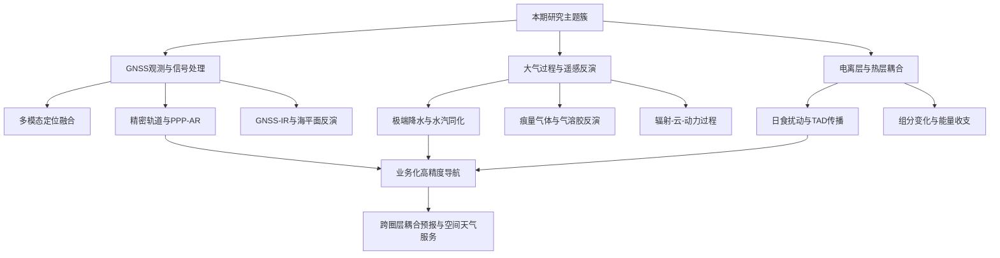
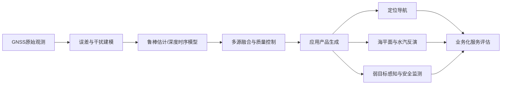
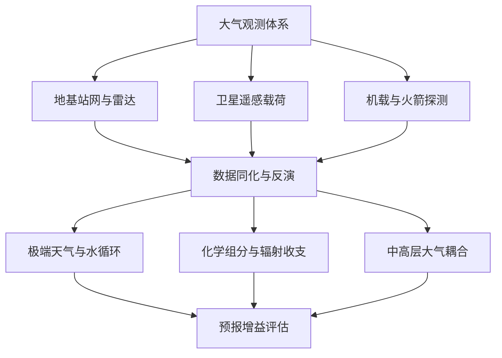
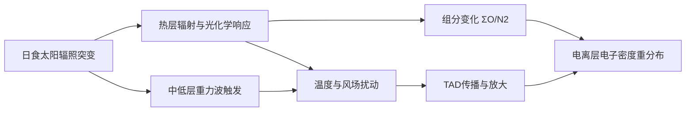
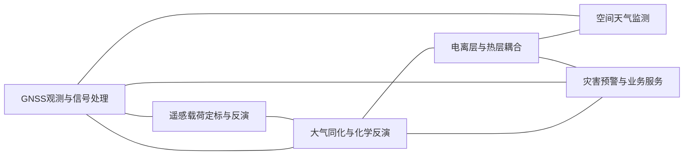
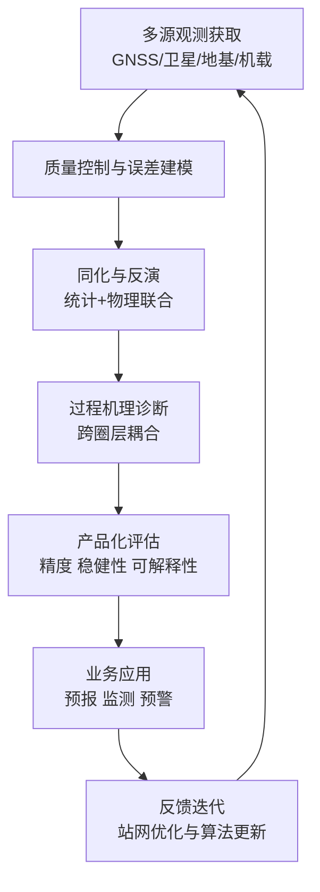

本期周报覆盖 2026 年第 15 周（2026-04-07 至 2026-04-14）新近发表的 GNSS、大气与电离层相关文献，并在综述中辅以国际观测与业务体系的公开资料，便于读者把单篇论文放回全球数据链与预报服务的大图景中阅读。近一周稿件在选题上仍高度贴近工程与业务痛点，例如低成本多源融合定位、区域强降水同化、国产卫星痕量气体反演初版结果，以及日食等突发外强迫下的热层—电离层响应诊断；在方法上则普遍强调误差来源拆解、跨平台交叉验证与复杂场景下的稳健性，而非仅报告平均精度增益。

编者希望本期文字能在两类读者之间架起桥梁。一类是从事导航、遥感与空间天气一线研发的同行，可沿各节专题画像快速对照自身技术路线与评价指标；另一类是关注地球系统观测与预报体系演进的读者，可从印记图与交叉网络图中把握“观测—同化—机理—产品”的闭环如何被新近工作逐段加固。文献浩繁，取舍难免；凡未纳入正文的条目，仍可通过文末参考文献与原始清单追溯。愿开卷有益，亦欢迎指正与补遗。

## 一、本期研究印记图

2026-04-07至2026-04-14时段内，相关论文呈现出“观测网络升级—同化与反演深化—多尺度机理解释加强”的连续技术谱系。GNSS方向重点集中在多源融合定位、轨道预测、GNSS-IR反演与抗干扰；大气方向聚焦高时空分辨率观测、极端天气与辐射-动力耦合、化学过程定量化；电离层方向则继续沿“日食等突发外强迫条件下的热层-电离层耦合响应”推进。结合WMO G3W、IGS PPP-AR工作组、NOAA COSMIC-2业务化评估、NASA GOLD以及COSPAR/URSI IRI-2020标准模型可见，国际研究主线正在从单一数据源解释转向“多平台观测约束 + 物理模型 + 机器学习”的融合范式。

从问题导向看，三类方向共享两个核心需求。第一是不确定度闭合，即观测误差、反演误差与模式误差需在统一框架内传播与校准。第二是业务可迁移性，即算法不仅要在样例中有效，还需在不同纬度带、不同天气型和不同仪器条件下保持稳健。近期论文中大量采用的鲁棒回归、多源交叉验证、再分析对比与场景分层评估，表明研究评价标准正由“平均精度提升”向“复杂场景下的可靠性与可解释性”转变。

## 二、GNSS方向顶刊与特色论文专题画像

### 2.1 方向综述

本期GNSS相关研究显示出明显的“工程场景牵引”特征。与传统只关注静态定位精度不同，论文普遍针对低成本终端、复杂地形、弱信号和干扰环境提出可落地方案。一类工作通过自监督学习、贝叶斯融合或双频双极化联合处理提升观测可用性；另一类工作围绕轨道预测、海平面反演、欺骗识别和信号体制设计构建可部署算法链；还有一类将GNSS作为跨学科观测约束源，直接服务于降水同化与水汽评估，体现“导航数据向地球系统变量扩展”的趋势。

从技术路线看，GNSS研究正在形成三层架构。第一层是信号与观测层，关注多频、多系统、多传感器信息获取与误差抑制；第二层是算法层，强调鲁棒估计、时序网络与可解释融合；第三层是应用层，进入交通、海岸、地下空间与灾害监测等场景。该架构与IGS近年推动的多系统SSR产品和PPP-AR一致，说明学术研究与业务系统的演化方向保持同向。

| 代表性研究 | 技术路线 | 关键技术特点 | 重要结论 |
|---|---|---|---|
| SCDAE多模态定位融合 | 视频+低成本GNSS自监督融合 | 去噪自编码+贝叶斯估计 | 定位误差平均下降56.79% |
| BDS MEO短序列轨道预测 | 时序建模替代长弧动力外推 | 尺度感知卷积+注意力融合 | 三轴残差率显著下降 |
| GNSS-IR海平面反演改进 | 频谱法与鲁棒回归联合 | 阻尼感知修正+归一化IRLS | 多站RMS显著降低，相关性超99% |
| GNSS欺骗态势感知 | 列车定位安全监测 | 深度特征提取与干扰分类 | 提升铁路场景抗干扰能力 |
| DFDP-QuadDiff双频双极化 | GNSS双基地SAR弱目标检测 | 交叉频率配准+极化一致性抑制 | SCR与轨迹连续性同步提升 |
| CMONOC水汽同化 | GNSS ZTD/PWV入WRF-3DVar | 循环同化与动力一致性约束 | 强降水位置与强度模拟改进 |
| 隧道空地协同系统 | GNSS拒止环境自主作业 | UAV+地面装备+数字孪生 | 作业提前50%–80%启动 |
| 新一代GNSS复用信号设计 | 双频恒包络复用体制 | 频谱效率与硬件兼容协同优化 | 面向下一代系统提供体制候选 |

### 2.2 专题画像 低成本GNSS与视频融合定位

#### （1）技术路线
该研究将固定相机视频与低成本GNSS轨迹作为两类噪声特征差异显著的观测源，构建级联去噪自编码架构。流程先在视觉分支中进行无标定条件下的目标几何约束学习，再在GNSS分支中估计噪声统计特性，随后通过自监督损失将两分支映射到统一潜在空间，最后采用贝叶斯最优估计得到目标空间位置。与传统“先标定再融合”的流水线相比，该方法将标定不确定性吸收到端到端训练框架中，减少了人工标定偏差对终端定位的放大。

实验采用公开数据集与多基线方法对比，评价指标覆盖均方误差、稳定性和鲁棒性。作者报告平均误差下降56.79%，说明在低成本接收机噪声较大的条件下，自监督融合可以显著抑制瞬时漂移并保持轨迹连续性。该流程可迁移到移动机器人和道路侧感知节点，具备较强的工程可扩展性。

#### （2）技术特点
该工作的核心创新是把“观测异质性”转化为“表示互补性”。视觉观测在遮挡和检测偏差下易产生离群点，GNSS观测在多路径和低信噪条件下出现随机跳变，模型通过级联去噪和贝叶斯融合分别处理结构误差与随机误差，使两类误差在后端解算前得到分层消化。相较于纯深度回归方法，该方法加入概率估计后，输出具备置信度解释能力，便于业务侧设置质量阈值。

第二个特点是“弱先验依赖”。模型无需高精度外参或密集地面控制点，适合快速部署场景。局限性在于训练数据分布对泛化仍有影响，当场景光照、地物纹理与训练集差异较大时可能产生性能回落，因此后续需要引入域自适应或在线校准机制。

#### （3）重要结论
该研究的重要结论是：在无标定视频与低成本GNSS联合条件下，通过自监督级联去噪与贝叶斯融合可以实现显著精度增益，且在多种基线对比中保持稳定领先。其意义在于，低成本设备组合可以在不显著增加硬件投入的前提下达到更高空间定位可靠性，为大规模城市感知、交通监测和轻量级遥感平台部署提供了可行技术路径。

该结论同时提示GNSS研究正从“单传感器精度极限”转向“多传感器协同可信度优化”。对于后续研究，关键在于建立标准化跨场景测试集，并把定位误差拆分为观测误差、模型误差和域迁移误差三部分进行定量归因。

### 2.3 专题画像 BDS MEO短序列自适应轨道预测

#### （1）技术路线
论文面向卫星自主运行需求，提出短序列输入条件下的轨道误差预测网络。方法以BiLSTM为主干，在前端加入尺度感知混合卷积捕捉不同时间尺度的误差纹理，再以注意力驱动特征融合抑制冗余信息，输出三轴轨道残差修正。该方法避免了对长弧历史数据和复杂动力模型的强依赖，适用于星上或近实时计算链路。

实验对象为BDS C19及相似轨道卫星，评估指标包括X、Y、Z三轴残差率和跨星泛化能力。结果显示三轴残差率由传统方案的高误差水平降至低个位数区间，说明短序列信息在高效特征编码后仍可支持高精度预报。

#### （2）技术特点
该工作的技术优势在于把“时序长度不足”问题转化为“信息密度提升”问题。尺度感知卷积强化局部动态模式识别，注意力融合提高关键段落权重，二者与BiLSTM互补，形成轻量但有效的结构。相比单一时序网络，模型对轨道扰动突变更敏感，具备更好的短时鲁棒性。

其局限性是对训练数据质量和覆盖时段敏感。若太阳活动、姿态控制策略或星上载荷状态发生结构性变化，模型可能出现外推偏差。下一步建议结合物理先验约束损失，构建“数据驱动 + 动力学约束”的混合网络。

#### （3）重要结论
该研究的重要结论是：通过短序列自适应网络可在不依赖长弧观测的条件下显著提升BDS MEO轨道预测精度，并保持跨相似卫星的可迁移性。这对下一代自主导航星座具有直接意义，可减少地面长时弧计算负担并提升星座自主管理能力。

该结果还与IGS近年推进的多频PPP-AR产品形成互补关系。高质量轨道与偏差产品是高精度定位服务的上游基础，轨道短时预测能力提升将直接增强实时高精度服务稳定性。

### 2.4 专题画像 GNSS-IR海平面反演鲁棒优化

#### （1）技术路线
研究在WinLSP框架中引入两项关键改进。第一是阻尼感知高度变化率修正，用于描述海面粗糙导致的振幅衰减对频谱估计的系统偏差；第二是归一化IRLS鲁棒回归，通过残差尺度标准化提高不同站点数据集之间参数可比性。方法在仿真和三个沿海站点实测数据上联合验证。

该流程先执行反射信号频谱估计，再进行高度变化率校正，随后开展鲁棒回归与离群剔除，最终输出海平面时间序列。实验报告RMS在多个站点显著下降，且与验潮站相关性超过99%，证明方法兼顾了精度和稳定性。

#### （2）技术特点
技术亮点在于将海况物理机制直接引入统计修正环节。传统均匀加权忽略了海面粗糙条件下的信号衰减差异，导致高风浪场景偏差增大。阻尼感知项提升了模型对环境状态变化的响应能力。归一化IRLS则减少不同数据尺度引起的权重失真，提高跨区域可复用性。

不足之处在于对极端海况和复杂海岸几何条件仍需更多样本检验。未来可引入波浪再分析或近岸雷达信息，构建动态先验，提高异常天气期间的反演连续性。

#### （3）重要结论
该研究的重要结论是：在GNSS-IR海平面反演中，阻尼感知修正与归一化鲁棒回归可以显著降低系统误差并提高跨站稳健性。该结论对建设低成本、高密度沿海监测网络具有现实价值，尤其适用于验潮站稀疏区域的补充监测。

从业务角度看，GNSS-IR若与卫星高度计、潮位站和数值海洋模式联合，将有望形成高时空分辨率海平面同化产品，对风暴潮预警和港航安全管理具有直接支撑作用。

### 2.5 专题画像 GNSS双基地SAR弱目标检测

#### （1）技术路线
DFDP-QuadDiff框架围绕双频双极化四通道观测构建层级处理链。算法先进行极化一致性驱动的强窗抑制，再执行带内自适应极化合成，随后完成联合时延-多普勒-相位跨频配准，并在分段层面进行Jones漂移校准，最终通过质量感知融合实现弱回波检测增强。该流程在低信噪海面目标场景下强调长时间积累能力。

实验给出SCR中位数、P10分位、轨迹连续性等指标，结果表明框架在弱可见和干扰主导条件下仍能维持正增益。分段漂移标准差明显下降，说明长序列误差链得到有效抑制。

#### （2）技术特点
该方法的特点是将多源不一致误差按层分治。极化不匹配、跨频失配和链路漂移分别在对应层级处理，避免了单层全局优化的病态耦合。与传统单频单极化处理相比，该方案提升了可解释性与调参可控性。

另一方面，方法对通道同步质量和硬件稳定性有较高要求。在设备条件不足或通道失配严重时，前端误差可能向后端融合传播，导致收益衰减。后续可考虑自监督质量评估模块实现自适应降级运行。

#### （3）重要结论
该研究的重要结论是：双频双极化四差分处理可显著提升GNSS-S弱目标检测的稳定性、连续性和积累能力，并在复杂海况与干扰场景下保持鲁棒性能。该结论为被动遥感系统的工程应用提供了清晰技术路径。

其影响在于推动GNSS从导航授时扩展到“感知-监测”功能域。若与AIS、海洋雷达和星基AIS数据融合，可进一步提升海上目标监视和异常行为识别能力。

### 2.6 专题画像 CMONOC水汽同化与强降水模拟

#### （1）技术路线
研究将CMONOC站网的ZTD与PWV产品通过WRF/WRFDA-3DVar进行6小时循环同化，针对四川盆地强降水过程开展控制试验与同化试验对比。评估指标包括雨带位置、峰值强度、分级阈值下TS评分和动力诊断场。流程强调观测-模式增量的一致性，避免单次同化引起的不稳定振荡。

结果显示同化试验在主雨带定位和峰值降水刻画方面优于控制试验，重降水阈值下评分提升更明显。诊断表明同化引入了低层增湿和850 hPa辐合增强，并改进关键时段垂直上升结构。

#### （2）技术特点
本研究体现了GNSS气象应用从“可用性验证”向“复杂地形业务增益评估”演进。技术特点在于站基GNSS产品与区域模式循环同化的耦合，以及在多阈值等级降水上的分层验证。与仅报告平均误差不同，该文强调极端降水类别的改进幅度，更贴近防灾业务需求。

局限性在于样例事件数量仍有限，不同天气型下增益可能差异显著。下一步需扩展季节尺度样本，并评估四维同化和集合同化框架中的增益上限。

#### （3）重要结论
该研究的重要结论是：CMONOC GNSS ZTD/PWV循环同化可为复杂地形强降水模拟提供有效湿度约束，并提升降水空间分布与强度预报表现。该结论直接支持GNSS在短临预报和山区灾害防御中的业务价值。

其意义还在于构建了跨领域数据链路样板。GNSS观测并非仅服务定位，而是可作为大气模式关键约束源，推动导航基础设施与气象服务体系协同升级。

### 2.7 专题画像 GNSS欺骗干扰态势感知

#### （1）技术路线
该工作面向列车定位安全，使用MSCAM-DenseNet构建干扰态势识别框架。流程通常包括信号特征提取、多尺度通道注意力增强、干扰类型判别和风险等级输出。虽然摘要未公开，但从题目与期刊方向判断，该方法重点在提升复杂电磁环境中的识别灵敏度与误警控制。

在铁路场景中，欺骗信号常与多路径和遮挡并发，传统阈值法难以稳定区分。深度特征网络可在时频与统计域联合建模，适合建立多级预警机制。

#### （2）技术特点
该类方法的特点是把“检测”扩展为“态势感知”，即不仅输出是否受干扰，还估计干扰强度、持续时间和影响范围。多尺度注意力有助于捕捉短时突发与长时偏移两类模式。若结合轨道约束和惯导信息，可进一步降低虚警。

潜在风险在于模型可解释性与对抗鲁棒性。实际部署需要配套可解释指标和在线更新策略，防止新型干扰样式导致性能退化。

#### （3）重要结论
该研究的重要结论是：深度多尺度特征融合框架适用于GNSS列车定位场景的欺骗态势识别，有望提升安全监测前瞻性。其影响在于将GNSS安全从“事后纠偏”前移至“实时态势预警”。

工程上建议构建“算法检测 + 规则校核 + 多传感器冗余”的三层防护体系，并在标准化测试场景中量化误警和漏警边界。

### 2.8 专题画像 GNSS拒止环境空地协同机器人

#### （1）技术路线
该研究在隧道爆破后场景建立空地协同自主作业系统，由无人机先行入场完成环境扫描与前端建图，再将共享坐标系传递给地面装载设备，在数字孪生平台统一调度下执行后续作业。系统验证强调低能见度、无GNSS可用和高风险作业条件。

性能指标包含任务启动时间、作业周期压缩率与投资回收周期。结果显示可将作业启动提前50%至80%，并缩短日作业时长。

#### （2）技术特点
技术价值在于构建了“GNSS可用区到拒止区”的能力延拓。系统并未依赖GNSS实时定位，而是利用前期建图与协同控制实现自主运行，体现GNSS技术外溢到多源定位融合与工业自动化。数字孪生界面提高了流程可视化与调度一致性。

局限在于系统复杂度高，对通信链路、传感器标定和安全冗余要求严格。若在更长隧道和多工序并行条件下部署，需要进一步验证系统扩展能力。

#### （3）重要结论
该研究的重要结论是：在GNSS拒止环境中，空地协同与数字孪生驱动的自主作业可显著提升施工效率并降低人员暴露风险。该结论扩展了GNSS研究的应用边界，表明导航技术可通过系统工程方式服务高危工业场景。

这一方向对矿山、地下工程和应急救援均有推广潜力。未来应重点推进标准接口与安全认证，形成可复用产业化方案。

### 2.9 专题画像 新一代GNSS双频恒包络复用信号

#### （1）技术路线
GACE-BOC研究面向新一代GNSS信号设计，目标是在双频条件下实现恒包络复用，兼顾功放效率、频谱兼容性与抗干扰性能。典型流程包括信号构型定义、频谱与相关函数分析、接收端解调可行性评估和与既有体制共存性验证。尽管摘要未公开，GPS Solutions同类研究普遍以理论推导与仿真验证结合为主。

该方向本质是“系统级权衡优化”，需在导航精度、硬件实现复杂度和频谱监管约束之间寻找最优折中。

#### （2）技术特点
恒包络复用的优势是提高发射链路效率并降低非线性失真，对星载平台功耗约束友好。双频复用若能保持良好自相关与互相关特性，将有助于提升抗多径和抗干扰能力。该工作强调“广义化”设计，说明其目标可能是形成可拓展信号族，而非单一固定波形。

潜在挑战在于接收机实现复杂度与向后兼容。若新体制对现有终端改造成本过高，将影响落地速度，因此需要同步评估渐进式部署路径。

#### （3）重要结论
该研究的重要结论是：双频恒包络复用体制在理论上可为下一代GNSS提供兼顾发射效率与信号性能的候选路线。其意义在于为未来星座设计提供可量化的体制优化空间。

后续建议结合硬件在环测试和多系统互操作评估，验证该类信号在真实干扰与多路径环境中的综合收益。

## 三、大气方向顶刊与特色论文专题画像

### 3.1 方向综述

本期大气研究的显著特征是“多圈层过程耦合 + 多平台观测约束”。一方面，重降水、冰雪、野火烟羽、北极云和温室气体通量等问题继续向更高时空分辨率推进；另一方面，FY-3F/OMS、EarthCARE、GOLD、AERONET、ATom及再分析资料的联合使用，推动了从现象刻画到机理约束的转变。论文中普遍强调不确定度来源识别，包括仪器条纹偏差、AMF误差、通道污染、参数化偏差与再分析系统误差。

近期研究还显示出明显的方法融合趋势。统计学习被用于气溶胶光学参数处方与因果推断框架构建，动力模式则继续承担可解释机理检验。观测与模式之间不再是单向验证关系，而是相互校准与共同迭代关系。这与WMO GAW/G3W推动的综合观测与信息系统建设相一致，说明大气领域正在向“可追溯、可同化、可业务化”的数据-模型闭环演进。

| 代表性研究 | 技术路线 | 关键技术特点 | 重要结论 |
|---|---|---|---|
| 非经典重力波参数化 | ICON+MS-GWaM耦合模拟 | 引入横向传播与瞬变效应 | 潮汐与环流模拟显著改进 |
| 野火烟羽自抬升 | 观测约束排放+传输模拟 | 对流层自抬升机制显式刻画 | 烟羽寿命与南极沉降影响增强 |
| 澳大利亚短时极端降水趋势 | 长序列站点统计分析 | 子日尺度极端变化分辨 | 小时尺度极端增强更明显 |
| FY-3F/OMS SO2反演 | DOAS反演与条纹校正 | 针对国产载荷误差源定制校正 | 实现全球SO2柱浓度初版业务产品 |
| EarthCARE CPR PIA估计 | 94GHz雷达反演 | 混合参考NRCS与不确定度表征 | 云降水反演约束能力提升 |
| 热带大西洋臭氧变率 | 卫星+再分析+机载联合 | 多源因子分解与季节对比 | 再分析在部分层次存在系统偏差 |
| UMLT化学加热数据集 | SCIAMACHY+SABER反演 | 主反应贡献分层量化 | 明确潮汐调制与不确定度范围 |
| 北极低云季节改进 | CESM2子网格通量解析 | 开水面-海冰对比机制显式化 | 低云季节位相模拟显著改善 |

### 3.2 专题画像 非经典重力波动力学参数化

#### （1）技术路线
研究在ICON系统中引入MS-GWaM预报型重力波模型，针对传统参数化忽略的三类过程进行修正，包括非平衡流条件、重力波瞬变传播和横向传播通量。通过对比试验评估月平均纬向环流与太阳潮汐分量变化，并与卫星反演潮汐特征进行一致性检验。

方法不再把重力波作用简化为瞬时平衡通量，而是显式保留时空演化过程。该设计提高了中层到低热层动力结构的可解释性。

#### （2）技术特点
该工作的创新在于以“广义参数化”替代传统简化方案，维持计算可承受性的同时显著增强物理过程完整度。相较直接提高模式分辨率，参数化改进在业务模式中更具可实施性。

不足在于参数敏感性仍需跨季节和跨区域检验。未来若结合数据同化约束，可进一步减少参数等效补偿导致的结构误差。

#### （3）重要结论
该研究的重要结论是：同时考虑重力波横向传播和瞬变效应可显著改善中高层环流及太阳潮汐模拟表现。其意义在于为中层大气与电离层耦合研究提供更可靠动力背景场。

这一结论可直接支持空间天气模式边界条件优化，对跨圈层耦合预报有实质贡献。

### 3.3 专题画像 澳大利亚野火烟羽自抬升与南极沉降

#### （1）技术路线
论文针对2019至2020澳大利亚野火，构建排放修正与注入高度设定后的化学传输模拟，重点比较火积云直接注入和平流层外对流层烟羽自抬升两条路径。通过卫星观测约束烟羽演化并估计黑碳在南极沉降通量。

研究发现仅用常规清单难以再现实测烟羽，需要放大排放并考虑低层排放后自抬升过程，说明辐射加热驱动的垂直输送不可忽略。

#### （2）技术特点
该研究将“动力注入”和“辐射自抬升”统一在同一评估框架，避免单机制解释偏差。它强调野火影响并非只局限源区，而可通过跨纬向输送影响极地冰冻圈。

局限性是排放放大因子具有事件依赖性。后续需要建立与火行为参数联动的自适应排放估计体系。

#### （3）重要结论
该研究的重要结论是：对流层烟羽自抬升可显著延长烟羽寿命并增强跨半球输送，导致南极黑碳沉降显著增加。该结论强化了野火-气候反馈链条的定量认识。

其影响在于提示气候风险评估需纳入极端火灾事件的跨区域外部性，对冰冻圈变化研究和碳预算评估均有重要意义。

### 3.4 专题画像 子日尺度极端降水长期变化

#### （1）技术路线
研究基于质量控制后的高时间分辨率雨量站资料，分析澳大利亚1至24小时年最大降水的长期趋势，并分季节检验趋势差异。方法关注时间窗长度对趋势稳健性的影响，避免短样本受内部变率主导。

结果显示小时尺度极端降水在多数区域上升，而接近日尺度时趋势减弱甚至转负，揭示不同时间尺度下的响应机制差异。

#### （2）技术特点
该文的技术价值在于强调“子日尺度”而非仅日尺度极端指标，与城市洪涝风险更直接相关。研究还将趋势不确定性与时间窗选择联系起来，增强了统计结论可解释性。

局限在于站网空间不均衡可能影响区域代表性。后续应与雷达拼图和再分析融合，提升空间连续性。

#### （3）重要结论
该研究的重要结论是：气候变暖背景下，短历时极端降水增强信号较日尺度更突出，且季节性差异明显。该结论对城市排水设计标准和短临预警阈值设定具有直接参考价值。

从方法角度看，未来需要把热力约束与对流触发机制联合建模，以解释尺度依赖的趋势分异。

### 3.5 专题画像 FY-3F/OMS全球SO2反演首批结果

#### （1）技术路线
研究使用FY-3F OMS-Nadir观测开展DOAS反演，针对仪器条纹和跨轨不对称问题设计太阳光谱选择、软校准与背景偏移订正方案。反演结果与TROPOMI DOAS/COBRA产品在洁净海洋、火山和人为排放区域进行对比。

结果显示产品在洁净区具备稳定精度，并能够识别火山烟羽及主要人为排放热点。

#### （2）技术特点
技术特点是面向国产新载荷建立端到端误差抑制链路，强调从L1性能特征出发定制反演校正。该路径对后续国产大气化学载荷业务化具有示范价值。

主要不确定度来自探测器非均匀性与AMF估计。未来可通过辐射传输模型改进和多传感器协同反演进一步降低误差。

#### （3）重要结论
该研究的重要结论是：FY-3F/OMS已具备全球SO2柱浓度监测能力，并在关键场景下与国际主流产品保持可比表现。该结论意味着我国在痕量气体遥感监测链条上获得了新的自主观测支点。

该进展对火山灾害监测、污染追踪和跨境输送评估具有应用意义，并可为区域化学同化系统提供新增观测约束。

### 3.6 专题画像 EarthCARE CPR路径积分衰减估计

#### （1）技术路线
研究介绍EarthCARE 94GHz云廓线雷达在L2A C-PRO产品中的PIA估计方案。算法以归一化雷达散射截面压低量为核心观测量，采用邻域校准点与地球物理模型双路径估计无衰减参考值，同时给出完整不确定度表征。

该方案目标是提升云和降水反演稳定性，并在任务初期具备对雷达定标偏差和气体吸收偏差的鲁棒性。

#### （2）技术特点
与CloudSat时代方案相比，EarthCARE方法强调混合参考策略和误差传播描述，能够在复杂气象背景下保持可解释性。94GHz高灵敏雷达与多载荷协同提供了更强的低层云识别能力。

挑战在于海面风场、海温和微物理假设对参考场估计存在耦合不确定度，后续需通过多任务联合反演进一步约束。

#### （3）重要结论
该研究的重要结论是：PIA混合估计框架为EarthCARE云降水反演提供了关键约束，并提升了业务产品在任务初期的稳健性。该结论对全球云辐射收支评估和模式验证具有基础支撑作用。

其影响在于推动“单载荷反演”向“协同反演”演进，为下一代气候观测任务提供算法模板。

### 3.7 专题画像 热带大西洋对流层臭氧多源归因

#### （1）技术路线
论文将IASI+GOME2协同产品、CAMS与TCR-2再分析、ATom机载实测联合，用于比较不同季节和不同来源条件下对流层臭氧垂直结构。通过分区对比识别生物质燃烧、平流层入侵与人为排放输送对臭氧变率的贡献差异。

方法优势在于把观测真值约束引入再分析评估，避免仅依赖模式内部一致性。

#### （2）技术特点
研究强调“源项分解 + 垂直结构”联合评估，识别出再分析在低层燃烧外流和北半球背景场中的偏差方向。该类证据对化学同化系统参数更新具有直接价值。

局限性是机载航线覆盖有限，仍需更多季节和年份数据拓展统计稳健性。

#### （3）重要结论
该研究的重要结论是：热带大西洋臭氧变率受自然源与人为源共同驱动，再分析在特定季节和高度层存在系统偏差。该结论为改进化学再分析和区域空气质量预报提供了明确诊断线索。

该成果还提示跨洋输送研究需强化多源联合约束，减少单一资料导致的归因偏差。

### 3.8 专题画像 UMLT夜间化学加热率新数据集

#### （1）技术路线
研究基于SCIAMACHY OH(9-6)发射与SABER温度、臭氧廓线，反演七类主要反应在22时地方时的化学加热率。流程包含化学平衡假设、反应参数更新和不确定度评估，并分析纬向-高度分布及季节变化。

结果给出主反应随高度转换规律，量化了H+O3和O+O+M在不同高度层的主导作用。

#### （2）技术特点
该工作将多年观测与更新谱线参数结合，提升了中高层能量收支估计的一致性。对潮汐调制特征的显式提取，使数据集不仅用于均值分析，也可用于过程诊断。

不确定度在不同反应上差异较大，提示后续仍需加强关键反应系数观测约束。

#### （3）重要结论
该研究的重要结论是：UMLT化学加热结构存在显著高度分层与潮汐调制，新数据集可更准确约束中高层能量预算。该结论对热层-电离层耦合模拟边界条件改进具有直接价值。

其意义在于为日食、地磁扰动等事件期间的能量响应诊断提供了更可信的背景场。

### 3.9 专题画像 北极低云季节循环改进机制

#### （1）技术路线
研究在CESM2中引入可解析子网格开水面通量的框架，比较传统网格平均耦合方案与新方案在北极低云季节变化上的差异。通过与观测对比评估相关系数和位相表现，并分析开水面比例对云差异的控制机制。

结果显示相关系数由0.55提高至0.70，冷季在低开水面比例条件下改进更显著。

#### （2）技术特点
技术创新是把海冰-开水面亚网格对比从参数化背景项提升为显式通量输入，增强了模式对边界层热力和湿度梯度的响应。该方案为高纬云偏差治理提供了结构化路径。

局限在于分辨率依赖性仍存在。不同网格尺度下阈值条件和反馈强度可能变化，需要开展多分辨率一致性测试。

#### （3）重要结论
该研究的重要结论是：解析子网格开水面通量可显著改善北极低云季节位相和振幅模拟。该结论为高纬气候反馈评估和海冰预估提供了方法支撑。

该方向将推动模式从“平均态拟合”向“关键过程可解释”转型，对未来气候服务产品可靠性提升具有基础意义。

## 四、电离层方向顶刊与特色论文专题画像

### 4.1 方向综述

本期电离层相关论文数量较少但问题集中，均围绕日食外强迫下热层-电离层扰动的来源与传播机制。研究采用GOLD与TIMED观测联合WACCM-X模拟，能够同时覆盖组分、温度和波动传播特征，体现“事件驱动型机理研究”的典型路径。与IRI-2020等经验模型标准相比，此类研究为事件条件下偏离月均态的快速响应提供了关键补充。

电离层方向的核心科学问题正在从“是否发生扰动”转向“扰动能量主要来自何高度层及其传播效率”。当前证据显示上层热层贡献占主导，但下层大气仍提供可观背景扰动输入，这意味着跨高度层耦合边界条件设置将成为后续模式改进重点。

| 代表性研究 | 技术路线 | 关键技术特点 | 重要结论 |
|---|---|---|---|
| 2023年10月14日日食组分响应 | GOLD观测+WACCM-X模拟 | 观测-模式全时段对比 | 量化模型冷却与组分偏差 |
| 日食诱发TAD来源归因 | WACCM-X源区分解 | 上下层贡献分离评估 | 80%–90%扰动源于80km以上 |

### 4.2 专题画像 日食期间热层组分与温度响应

#### （1）技术路线
研究利用GOLD远紫外成像获取2023年10月14日日食全过程热层响应，并以太阳辐照驱动WACCM-X进行数值重建，再与TIMED观测进行交叉验证。评估指标包括气辉衰减、温度降幅与ΣO/N2变化量，以及扰动恢复过程的时滞特征。

该路线的关键是“观测-模拟双向约束”。观测提供时空分布真值，模式提供机理解释和过程拆分，从而避免单一数据源带来的解释不充分。

#### （2）技术特点
论文展示了事件尺度耦合过程诊断能力。通过比较模型与观测偏差，研究明确指出模型在降温幅度和恢复速度上的不足，揭示了现有参数化在突发辐照强迫条件下的局限。

该工作的局限是事件样本仍单一。不同太阳活动背景、季节和磁纬条件下响应机制可能变化，需通过多事件集合研究提升结论普适性。

#### （3）重要结论
该研究的重要结论是：日食可在短时内引发显著热层冷却与气辉减弱，并伴随可观组分比变化，现有模式虽能再现总体趋势但在振幅和恢复节律上存在系统偏差。该结论为热层-电离层耦合模型校准提供了直接证据。

其意义在于，为空间天气事件响应建模提供高质量基准案例，有助于提升电离层扰动预报可信度和业务解释能力。

### 4.3 专题画像 日食诱发TAD源区归因

#### （1）技术路线
研究在WACCM-X框架下对2019年12月26日日食事件进行TAD来源分解，比较80 km以上热层源与下层大气源对扰动振幅的贡献。通过沿传播路径分析加热率、温度和中性风，估计扰动传播速度与能量分配。

方法强调“源项归因”，不仅给出扰动强度，还量化不同高度层贡献比例。

#### （2）技术特点
技术亮点是把传统波动诊断扩展为贡献率分解。结果显示高层源占主导，可帮助解释为何部分事件中低层波动增强并未对应同等上层响应。该框架可推广到地磁暴等外强迫事件。

局限在于模型物理参数化仍可能影响贡献率绝对值，后续需要引入更多观测约束进行反演一致性检验。

#### （3）重要结论
该研究的重要结论是：日食诱发TAD的主要激发源位于80 km以上热层区域，上层贡献约80%至90%，下层贡献约10%至20%。该结论澄清了长期争议的源区问题。

这一发现对改进上边界条件、优化扰动传播参数化和提升电离层预报系统事件响应能力具有直接指导意义。

## 五、交叉学科网络图与创新链流程图

### 5.1 交叉学科网络图

### 5.2 创新链流程图

## 六、近期研究特色变化与未来发展趋势

近期研究特征可归纳为四点。其一，数据源从单系统走向多系统协同，GNSS、大气遥感和中高层探测正在形成联合约束。其二，方法学从单一精度导向转向稳健性与可解释性并重，论文更强调复杂场景和误差分解。其三，业务导向显著增强，强降水、海平面、安全监测和空间天气均对应明确应用端需求。其四，国产观测载荷与国际任务并行发展，全球资料同化生态更加多元。

未来三到五年的关键趋势包括。

第一是“观测-模式-智能”深度融合。传统经验模型与数值模式将继续与机器学习耦合，形成可微同化和物理约束学习框架。第二是跨圈层一体化预报，特别是对流层-中层大气-电离层连续链条的联合建模。第三是实时高精度服务的标准化升级，IGS多系统PPP-AR与SSR产品、WMO G3W/GAW综合观测体系将持续提升业务能力。第四是不确定度治理将成为核心竞争力，谁能在复杂场景下提供稳定、可追溯、可解释产品，谁就更接近业务主干系统。

从科研组织方式看，未来更需要“事件集 + 长序列”的双轨验证体系。事件集用于机理识别，长序列用于稳健性检验。建议后续周报持续跟踪三类指标，包括跨平台一致性指标、极端场景性能指标和业务迁移成本指标，以支持研究成果从论文走向持续运行系统。

## 七、参考文献

1. Kühner, T., Völker, G. S., & Achatz, U. (2026). Impact of Non-Classical Gravity-Wave Dynamics on Middle-Atmosphere Mean Flow and Solar Tides. Journal of Geophysical Research: Atmospheres. https://doi.org/10.1029/2025JD045506
2. Huang, J., Peng, Y., Guo, Y., et al. (2026). Self-Lofting Drives Tropospheric and Stratospheric Transport of Australian Wildfire Smoke to Antarctic Ice. Geophysical Research Letters. https://doi.org/10.1029/2025GL120904
3. Rafter, T. S., King, A. D., & Lane, T. P. (2026). Trends in Annual Maximum Sub-Daily to Daily Precipitation Over Australia. Journal of Geophysical Research: Atmospheres. https://doi.org/10.1029/2025JD044650
4. Yan, H., Richter, A., Zhang, X., et al. (2026). First results of SO2 columns from FY-3F/OMS instrument observations. Atmospheric Measurement Techniques. https://doi.org/10.5194/amt-19-2279-2026
5. Sasikumar, S., Battaglia, A., Puigdomènech Treserras, B., & Kollias, P. (2026). The estimation of path integrated attenuation for the EarthCARE cloud profiling radar. Atmospheric Measurement Techniques. https://doi.org/10.5194/amt-19-2313-2026
6. Wu, X., Zhu, Y., Smith, A. K., et al. (2026). A new data set of nighttime chemical heating rates in the UMLT derived from SCIAMACHY and SABER. Atmospheric Chemistry and Physics. https://doi.org/10.5194/acp-26-4669-2026
7. Ma, Q., Han, Y., Lei, R., et al. (2026). Improved Simulation of Seasonal Variation of Arctic Low Clouds by Resolving Subgrid Open Water Fluxes to the Atmosphere in CESM2. Geophysical Research Letters. https://doi.org/10.1029/2025GL119467
8. Zeng, X., He, R., Han, S., et al. (2026). Self-Supervised Cascade Denoising Auto-Encoder for Accurate Spatial Positioning of Target by Fusing Uncalibrated Video and Low-Cost GNSS. Remote Sensing. https://doi.org/10.3390/rs18081161
9. Zhao, Y., Ma, Y., Long, H., et al. (2026). An Autonomous Orbit Prediction Approach for BDS MEO Satellites Using a Short-Sequence Adaptive Model. Remote Sensing. https://doi.org/10.3390/rs18081146
10. Altuntas, C., Williams, S. D. P., & Tunalioglu, N. (2026). Improving GNSS-IR sea level retrievals using WinLSP with damping-aware height-rate correction and normalized IRLS. GPS Solutions. https://doi.org/10.1007/s10291-026-02078-w
11. Tang, X., Zhang, C., Wu, A., et al. (2026). Numerical Simulation of a Heavy Rainfall Event in Sichuan Using CMONOC Data Assimilation. Remote Sensing. https://doi.org/10.3390/rs18081126
12. Yang, G., Zhang, T., Chen, Z., et al. (2026). DFDP-QuadDiff: A Dual-Frequency Dual-Polarization Quad-Differential Framework for Weak-Echo Ship Target Detection in GNSS-Based Bistatic SAR. Remote Sensing. https://doi.org/10.3390/rs18081130
13. Arias-Ferreiro, G., Montes-Grova, M. A., Pérez-Grau, F. J., et al. (2026). Integrated Air-Ground Robotic System for Autonomous Post-Blast Operations in GNSS-Denied Tunnels. Remote Sensing. https://doi.org/10.3390/rs18081133
14. Jiao, Y., Liu, J., Cai, X., et al. (2026). Observations and Simulation of Thermospheric Composition Changes During the 14 October 2023 Solar Eclipse. Geophysical Research Letters. https://doi.org/10.1029/2026GL121716
15. Jiao, Y., Liu, J., Li, S., et al. (2026). Do Eclipse-Induced Thermospheric TADs Originate From Above or Below? Geophysical Research Letters. https://doi.org/10.1029/2025GL119407
16. International GNSS Service. (2025). Precise Point Positioning with Ambiguity Resolution Working Group. https://igs.org/wg/ppp-ar
17. International GNSS Service. (2024). New IGS SSR format released. https://igs.org/new-igs-ssr-format-has-been-released
18. WMO. (2024). Global Greenhouse Gas Watch (G3W) overview. https://g3w.wmo.int/site/global-greenhouse-gas-watch-g3w/g3w-overview
19. WMO. (2024). Global Atmosphere Watch Programme (GAW). https://wmo.int/node/33012
20. NOAA NESDIS. (2021). COSMIC-2 Achieves Full Operational Capability. https://www.nesdis.noaa.gov/news/cosmic-2-achieves-full-operational-capability
21. ECMWF. (2020). ECMWF starts assimilating COSMIC-2 data. https://www.ecmwf.int/en/newsletter/163/news/ecmwf-starts-assimilating-cosmic-2-data
22. NASA CCMC. (2020). IRI-2020 model description. https://ccmc.gsfc.nasa.gov/models/IRI~2020
23. NASA GOLD Mission. (2025). Publications and mission science updates. https://gold.cs.ucf.edu/publications/
24. ESA EarthCARE Mission. (2024). Mission and data products overview. https://earth.esa.int/eogateway/missions/earthcare
