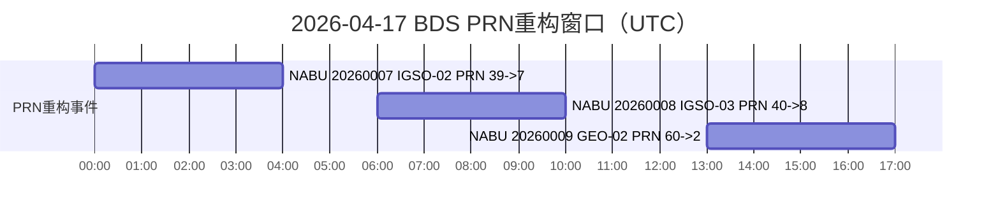

根据北斗系统用户通告（NABU）20260007、20260008、20260009，2026-04-17（UTC）将分三个时段实施在轨升级维护，涉及 BDS-3 IGSO-02、IGSO-03、GEO-02 三颗卫星。三次事件类型一致，均为 `RNSS_GNR_PRN_REALLOCATE`，核心动作是 PRN 重构。

## 1 通告信息整理

| 字段 | NABU 20260007 | NABU 20260008 | NABU 20260009 |
|:---|:---|:---|:---|
| 通告日期 (UTC) | 2026-04-15 13:00 | 2026-04-15 13:00 | 2026-04-15 13:00 |
| 事件开始 (UTC) | 2026-04-17 00:00 | 2026-04-17 06:00 | 2026-04-17 13:00 |
| 事件结束 (UTC) | 2026-04-17 04:00 | 2026-04-17 10:00 | 2026-04-17 17:00 |
| 卫星 | BDS-3 IGSO-02 | BDS-3 IGSO-03 | BDS-3 GEO-02 |
| PRN 重构 | 39 → 7 | 40 → 8 | 60 → 2 |

## 2 工程影响

基于现有讨论信息，此次BDS系统更新为“PRN 与重复码（相关码结构）同步重铸”。当前风险最集中的对象是较早期的北斗模组。此类模组在系统识别逻辑上可能将 1-16 号星优先归入北斗二号框架，导致北斗三号特有信号（如 B2a、B2b、B1C）利用不充分，甚至无法有效进入常规双频解算链。特别是在部分双频模组中，若 B2a 无法被正确识别，解算器会退化为近似单频策略，直接削弱双频电离层改正优势。按当前官方重构推进节奏，重构完成后部分模组可能仅能稳定识别约 7 颗双频可用星，进而出现“可见星数量未必减少但有效双频解算能力下降”的现象，表现为定位精度不升反降。与此同时，大规模嵌入式设备升级存在明显工程门槛，地基与星基设备是否可平滑适配，主要取决于其是否支持软件层升级、固件升级，或进一步的芯片级能力更新。

在研究层面，当前最关键的任务是开展“完整BDS系统升级前后 BDS 支持能力变化”的系统评估，并量化其对空间段与用户段两端的综合影响。对于监测与分析中心，应重点评估地面站 BDS 可用星变化对轨道确定、钟差估计与产品精度、稳定性与连续性的影响；对于应用侧，应重点评估用户端 BDS 可用星及有效双频星变化对定位可用性、收敛时间与服务稳定性的影响。

> 通告类型说明与最新星座状态参考：<https://www.csno-tarc.cn>