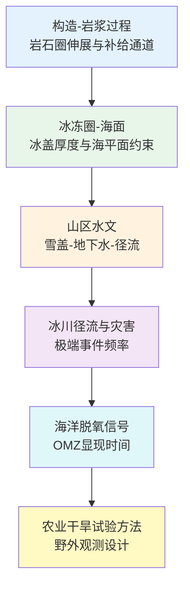
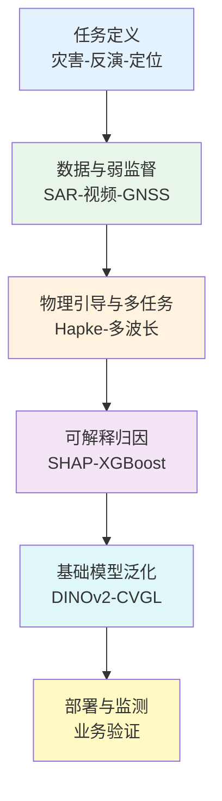
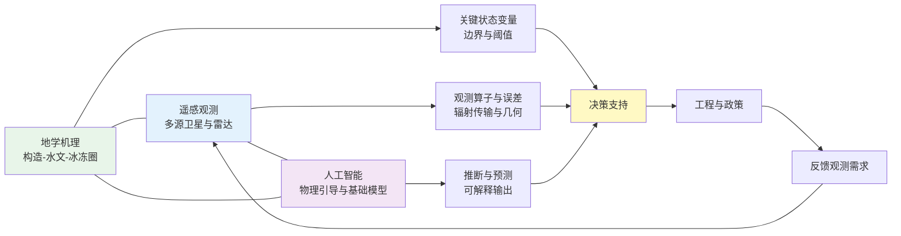
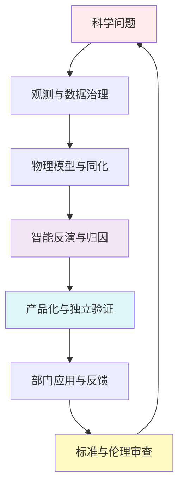

本报告基于本周698篇论文（含159篇CNS与281篇顶刊/特色期刊），显示地学、遥感与人工智能交叉研究在观测密度、过程归因与模型工程化三端同步强化。背景层面，WMO《State of the Global Climate 2025》、Copernicus C3S年度更新与ESA Earth Observation Science Strategy的共同信息显示：极端事件风险、地球能量失衡与多源观测融合正在共同推动“连续观测—可信建模—场景决策”的研究范式加速成型。

地学部分侧重构造—岩浆系统、冰盖—海平面、流域水文与海洋脱氧等过程；遥感部分侧重多源卫星数据融合、同化试验、极化雷达与定量植被信息工程；人工智能部分侧重物理引导网络、可解释学习、基础模型与多模态融合在地球观测任务中的落地形态。

## 一、本期研究印记图

2026年4月中下旬文献显示，研究活动正沿“观测分辨率提升—过程机理约束—智能反演与同化—业务化产品”链条加密耦合。地学端突出表现为深部岩浆运移与岩石圈构造的定量统一、冰盖历史厚度约束对海平面解释的修正、以及雪盖减少背景下老水龄地下水对山区径流缓冲作用的量化。遥感端突出表现为静止轨道热红外序列支撑的高时次海表流场反演、多源测高与立体影像联合的冰川高程变化制图、以及面向植被定量遥感的云原生数据工程。人工智能端突出表现为物理一致性损失与可解释归因并重、面向TROPOMI等多波段协同的反演框架、以及视觉基础模型在跨视角地理定位中的泛化设计。

上述技术路线与WMO、IPCC、NASA Earth Science to Action、GEO Post-2025、Copernicus扩展任务及ESA Digital Twin Earth方向所强调的“连续观测、可信模型、决策闭环”一致，表明学科交叉正由概念叠加转向流程级整合，并在云端计算与可复现工作流上出现更强工程约束。

## 二、地学方向专题画像

### 2.1 方向综述

本期地学文献在“深部过程—地表响应—气候背景”三个层面形成呼应。岩石圈尺度工作将黄石地区岩浆补给系统与构造伸展机制耦合，弱化单一地幔柱叙事并强调可检验的动力学预测。冰冻圈与古气候工作利用宇宙成因核素约束西南极冰盖全新世减薄轨迹，并以末次冰消期海平面重建的补充说明强化北美冰盖主导性叙事。水文方向聚焦山区雪盖衰退与老水龄地下水对径流稳定性的缓冲效应，以及黄土高原沟道工程化景观中“侵蚀—入渗—补给”功能转换。冰川径流长期重建揭示极端径流事件频率上升及其对沿岸基础设施的冲击。海洋生化方向则在集合气候模式中识别热带最小含氧量带气候信号的显现时间。综述类工作系统梳理降雨截除试验在作物干旱响应研究中的方法学要点，为野外观测与农业适应评估提供方法边界提醒。

| 序号 | 论文简介（逐篇） | 对应画像小节 |
|---|---|---|
| G1 | 黄石地区跨岩石圈岩浆通道的构造成因与动力学模拟 | 2.2 |
| G2 | 科罗拉多河上游暖化与雪盖减少对老水龄地下水依赖的模拟 | 2.3 |
| G3 | 末次冰消期海平面上升主导因素的补充说明（北美冰盖） | 2.4 |
| G4 | 西南极威德尔海南段全新世冰盖厚度高于现今的宇宙成因证据 | 2.5 |
| G5 | 黄土高原沟道在治理工程下作为补给区的多指标过程研究 | 2.6 |
| G6 | 格陵兰西北冰川1950—2023径流重建与极端事件 | 2.7 |
| G7 | 热带最小含氧量带体积变化气候信号显现时间分析 | 2.8 |
| G8 | 降雨截除系统模拟作物干旱响应的综述方法框架 | 2.9 |

### 2.2 专题画像：黄石跨岩石圈岩浆系统的构造成因

**（1）技术路线** 研究综合地球物理与地质观测约束，采用面向数据的地球动力学模拟，刻画黄石下方岩浆生成与运移路径，重点检验岩石圈伸展与基底牵引形成的西南倾伸展带能否解释岩浆补给几何。技术链条包括多学科观测集成、模型参数化与敏感性试验，并将预测的三维变形样式与成像所得的“管道式”岩浆系统形态对照，从而完成从假设到可证伪预测的闭环。 补充说明：近期地球系统研究进一步强调“多源观测约束+机理模型+情景试验”的闭环框架，尤其关注参数可辨识性、先验假设透明化与跨尺度一致性检验，以降低结论对单一资料源的依赖。

**（2）技术特点** 与传统强调地幔柱主导的解释相比，该工作突出岩石圈力学与构造边界条件对熔体抽取效率的控制，并将“地幔柱贡献可忽略”作为可检验结论提出。方法上兼顾数据驱动建模与物理一致性，有利于在争议构造区降低叙事性推断比例。局限在于深部结构仍受分辨率与参数非唯一性约束，需持续独立观测更新。 补充说明：该类方法的核心优势在于把过程机制与统计证据共同纳入评价，但其稳健性仍取决于时空采样密度、边界条件设定与外推区域的同质性假设。

**（3）重要结论** 该研究的重要结论是：**黄石地区岩浆系统主要受岩石圈构造伸展控制，西南倾跨岩石圈变形带可类比观测成像的岩浆通道几何，地幔柱贡献可忽略。** 该结论对板内火山系统成因分类、深部监测指标选取与区域地震-火山灾害风险评估具有参照意义，并提示后续应加强独立地球化学与地震层析联合约束。 补充说明：在应用层面，该结论可进一步嵌入“监测—归因—预测—决策”链条，并建议通过独立观测时段复验与敏感性分析量化结论的置信区间。

### 2.3 专题画像：暖化与雪盖减少对老水龄地下水依赖

**（1）技术路线** 研究以上科罗拉多河上游高海拔流域为对象，整合新观测与集成水文模型，覆盖2015—2021水文年，量化不同水龄地下水对河道径流的贡献，并设计增温情景数值试验，评估低雪年与老水地下水释放在时间上的稳定性及其对暖化的响应。 补充说明：近期地球系统研究进一步强调“多源观测约束+机理模型+情景试验”的闭环框架，尤其关注参数可辨识性、先验假设透明化与跨尺度一致性检验，以降低结论对单一资料源的依赖。

**（2）技术特点** 该工作把“地下水年龄结构”显式引入山区径流稳定性讨论，区分老水龄与年轻地下水的变率特征，从而避免将地下水简单视为均一调蓄层。模型—观测耦合与情景试验结合，使结论具备面向水资源管理的可解释指标。高海拔观测稀缺仍是外推不确定度来源。 补充说明：该类方法的核心优势在于把过程机制与统计证据共同纳入评价，但其稳健性仍取决于时空采样密度、边界条件设定与外推区域的同质性假设。

**（3）重要结论** 该研究的重要结论是：**老水龄地下水对河道贡献在时间上相对稳定，年轻地下水贡献更敏感；在雪盖减少与增温背景下，流域对老水龄地下水的结构性依赖增强。** 该结论对高山流域供水韧性评估、跨界水资源核算与长期监测井网布设具有直接启示。 补充说明：在应用层面，该结论可进一步嵌入“监测—归因—预测—决策”链条，并建议通过独立观测时段复验与敏感性分析量化结论的置信区间。

### 2.4 专题画像：末次冰消期海平面上升主导因素补充说明

**（1）技术路线** 本文为对既有海平面重建与冰盖质量再分配讨论的补充与更正性说明，作者团队基于更新证据链或模型设定，对“末次冰消期海平面变化由北美冰盖主导”的结论进行强化或修订表述，并明确与前稿差异来源。 补充说明：近期地球系统研究进一步强调“多源观测约束+机理模型+情景试验”的闭环框架，尤其关注参数可辨识性、先验假设透明化与跨尺度一致性检验，以降低结论对单一资料源的依赖。

**（2）技术特点** 此类Addendum的价值在于提高结论可追溯性与学术记录完整性，使古海平面—冰盖重建社区能够在同一证据框架下对齐假设。对读者而言，应同时阅读原文与补充材料以理解参数更新幅度。 补充说明：该类方法的核心优势在于把过程机制与统计证据共同纳入评价，但其稳健性仍取决于时空采样密度、边界条件设定与外推区域的同质性假设。

**（3）重要结论** 该研究的重要结论是：**末次冰消期海平面上升格局在北美冰盖质量贡献上保持主导性叙事，补充说明修正了前期表述中的特定不确定性或边界条件。** 该结论为冰盖模型初始化、古海岸线解释与现今海平面背景约束提供一致性参考。 补充说明：在应用层面，该结论可进一步嵌入“监测—归因—预测—决策”链条，并建议通过独立观测时段复验与敏感性分析量化结论的置信区间。

### 2.5 专题画像：西南极威德尔海南段全新世冰盖减薄证据

**（1）技术路线** 研究获取冰下基岩岩芯原位宇宙成因核素浓度，与现今冰厚条件下的产率上限对比，判断是否存在全新世某时段冰面低于现今的暴露历史，并结合前向模拟约束冰面下降幅度与时间窗口。 补充说明：近期地球系统研究进一步强调“多源观测约束+机理模型+情景试验”的闭环框架，尤其关注参数可辨识性、先验假设透明化与跨尺度一致性检验，以降低结论对单一资料源的依赖。

**（2）技术特点** 宇宙成因核素方法对“冰厚变化下限”敏感，可在钻孔与地球物理资料稀缺区提供硬约束。该文聚焦威德尔海南段这一对全球海平面敏感区域，有助于缩小冰盖历史轨迹的不确定性。局限包括采样空间覆盖与暴露年代多解性。 补充说明：该类方法的核心优势在于把过程机制与统计证据共同纳入评价，但其稳健性仍取决于时空采样密度、边界条件设定与外推区域的同质性假设。

**（3）重要结论** 该研究的重要结论是：**原位核素证据表明西南极该扇区在全新世某时段曾较现今更薄，冰面高程变化需用减薄事件解释。** 该结论对现今冰盖稳定性评估、海平面贡献上限及模式边界条件具有约束价值。 补充说明：在应用层面，该结论可进一步嵌入“监测—归因—预测—决策”链条，并建议通过独立观测时段复验与敏感性分析量化结论的置信区间。

### 2.6 专题画像：黄土高原沟道作为补给区的再框架

**（1）技术路线** 研究在工程化沟道景观中组合稳定同位素、氯离子与地下水位动态等多指标，区分降水对浅层孔隙水与深层裂隙水的补给路径，评估拦蓄工程提高驻留时间后的垂向入渗与侧向连通性。 补充说明：近期地球系统研究进一步强调“多源观测约束+机理模型+情景试验”的闭环框架，尤其关注参数可辨识性、先验假设透明化与跨尺度一致性检验，以降低结论对单一资料源的依赖。

**（2）技术特点** 将“沟道等于侵蚀通道”的单向叙事拓展为“在治理条件下可转化为活跃补给带”的过程框架，强调功能转换取决于水力停留时间与连通结构。多示踪剂联合可降低单指标误判。区域推广需匹配具体岩性与工程类型。 补充说明：该类方法的核心优势在于把过程机制与统计证据共同纳入评价，但其稳健性仍取决于时空采样密度、边界条件设定与外推区域的同质性假设。

**（3）重要结论** 该研究的重要结论是：**在黄土高原研究流域，治理型沟道可成为降水补给浅层地下水的重要区带，深层裂隙水更新更慢且路径不同。** 该结论对旱区生态修复工程的水文效益评估与地下水可持续利用策略具有指导意义。 补充说明：在应用层面，该结论可进一步嵌入“监测—归因—预测—决策”链条，并建议通过独立观测时段复验与敏感性分析量化结论的置信区间。

### 2.7 专题画像：格陵兰西北冰川径流长期变化与极端事件

**（1）技术路线** 研究以Qaanaaq冰川为对象，基于冰川能量—质量平衡模型与再分析驱动，重建1950—2023径流序列，识别极端日径流事件频次变化，并结合局地基础设施影响案例分析灾害含义。 补充说明：近期地球系统研究进一步强调“多源观测约束+机理模型+情景试验”的闭环框架，尤其关注参数可辨识性、先验假设透明化与跨尺度一致性检验，以降低结论对单一资料源的依赖。

**（2）技术特点** 长序列重建将“极端径流”从事后描述转为统计可比较指标，并把气候驱动与冰川水文过程显式连接。对社区尺度影响个例的引用增强政策相关性。模式与再分析偏差在冰川区仍需独立验证。 补充说明：该类方法的核心优势在于把过程机制与统计证据共同纳入评价，但其稳健性仍取决于时空采样密度、边界条件设定与外推区域的同质性假设。

**（3）重要结论** 该研究的重要结论是：**20世纪90年代以来极端日径流事件显著增多，历史最大径流与道路损毁事件相联系。** 该结论对北极沿岸防灾规划、冰川旅游与基础设施设防标准具有警示意义。 补充说明：在应用层面，该结论可进一步嵌入“监测—归因—预测—决策”链条，并建议通过独立观测时段复验与敏感性分析量化结论的置信区间。

### 2.8 专题画像：热带最小含氧量带气候信号显现时间

**（1）技术路线** 研究利用IPSL-CM6A-LR大集合试验，分离外力强迫的热带最小含氧量带体积变化信号，应用“信号显现时间”统计指标，判定气候驱动脱氧信号何时超越内部变率。 补充说明：近期地球系统研究进一步强调“多源观测约束+机理模型+情景试验”的闭环框架，尤其关注参数可辨识性、先验假设透明化与跨尺度一致性检验，以降低结论对单一资料源的依赖。

**（2）技术特点** 大集合样本为检测弱信号提供了必要统计基础，方法上强调“可检测性”而非仅趋势符号。对渔业与生态系统管理而言，显现时间比长期均值更有预警价值。模式系统性偏差仍需多模式互证。 补充说明：该类方法的核心优势在于把过程机制与统计证据共同纳入评价，但其稳健性仍取决于时空采样密度、边界条件设定与外推区域的同质性假设。

**（3）重要结论** 该研究的重要结论是：**热带最小含氧量带的气候驱动体积变化信号可在集合框架下被赋予显现时间约束，为脱氧风险早期识别提供定量参考。** 该结论支撑海洋生态与渔业政策中的风险沟通与监测优先级设定。 补充说明：在应用层面，该结论可进一步嵌入“监测—归因—预测—决策”链条，并建议通过独立观测时段复验与敏感性分析量化结论的置信区间。

### 2.9 专题画像：降雨截除试验与作物干旱响应综述

**（1）技术路线** 综述系统梳理野外降雨截除系统的设计要素、试验时长、土壤—植物—大气连续体观测指标与常用统计评估框架，比较不同作物与气候区试验的可比性与局限。 补充说明：近期地球系统研究进一步强调“多源观测约束+机理模型+情景试验”的闭环框架，尤其关注参数可辨识性、先验假设透明化与跨尺度一致性检验，以降低结论对单一资料源的依赖。

**（2）技术特点** 作为方法学导向文章，其价值在于降低试验设计碎片化导致的结论不可比问题，并提醒截除强度、季节相位与根系响应等环节对结果解释的影响。对政策模拟而言，强调从控制试验到田块外推的边界。 补充说明：该类方法的核心优势在于把过程机制与统计证据共同纳入评价，但其稳健性仍取决于时空采样密度、边界条件设定与外推区域的同质性假设。

**（3）重要结论** 该研究的重要结论是：**降雨截除试验是量化作物干旱响应与适应策略的重要工具，但其结论高度依赖于截除方案、观测体系与持续时间。** 该结论对农业气候适应投资与田间试验标准化具有方法学规范意义。 补充说明：在应用层面，该结论可进一步嵌入“监测—归因—预测—决策”链条，并建议通过独立观测时段复验与敏感性分析量化结论的置信区间。

## 三、遥感方向专题画像

### 3.1 方向综述

本期遥感文献体现“平台能力—反演链路—场景产品”的并行推进。海洋方面，静止轨道热红外序列使高时次海表流场成为可能，但需处理内波噪声与非平衡动力。陆地冰川方面，多源测高与立体影像融合提升高寒区高程变化时空分辨率。数值天气方面，假设性小时级全球微波辐射同化试验揭示高频观测与动力平衡之间的张力及误差膨胀对策。生态与地表参数方面，采样设计对旱区木本覆盖制图的影响、PolSAR与光学指数在盐渍化二维特征空间的协同、云原生架构对植被定量遥感的工程化支撑、以及高光谱填埋场光谱指纹提取，共同构成从方法到数据工程的完整谱系。雷达气象方面，极化雷达与雨滴谱仪联合揭示东北冷涡影响下飑线微物理结构。

| 序号 | 论文简介（逐篇） | 对应画像小节 |
|---|---|---|
| R1 | 静止轨道热红外序列与深度学习反演亚中尺度海表流场（GOFLOW） | 3.2 |
| R2 | 多源卫星数据联合估计藏东南冰川高程变化 | 3.3 |
| R3 | 假设性全球小时微波辐射同化OSSE与观测误差膨胀 | 3.4 |
| R4 | 旱区木本覆盖制图中采样设计的重要性 | 3.5 |
| R5 | PolSAR散射分量与光谱指数二维特征空间盐渍化制图 | 3.6 |
| R6 | 面向定量植被遥感的云原生地球观测架构与工作流 | 3.7 |
| R7 | 东北冷涡调制飑线微物理与雨滴谱特征 | 3.8 |
| R8 | HISUI高光谱非洲填埋场分段光谱表征 | 3.9 |

### 3.2 专题画像：静止轨道热红外与亚中尺度海表流场

**（1）技术路线** 研究提出GOFLOW框架，利用静止卫星连续热红外影像序列，通过深度学习由表观温度演变推断高分辨率、小时级海表流场，并针对内波等高频噪声进行抑制，输出可用于亚中尺度环流诊断的速度场产品。 补充说明：结合2025—2026年Copernicus与ESA地球观测发展方向，技术路线正从单源反演转向“多平台协同+云端工作流+近实时质量控制”，并强调观测算子与同化接口的标准化。

**（2）技术特点** 相较依赖简化动力平衡或滤除内波困难的传统手段，数据驱动高时次反演在分辨率与连续性上具优势，但对训练数据代表性与物理一致性仍需持续检验。静止轨道覆盖与云遮挡构成应用边界。 补充说明：技术特征的关键增量体现在多传感器互补、误差传播可追踪与工程可部署性等方面；同时需要通过交叉传感器一致性评估控制系统偏差累积。

**（3）重要结论** 该研究的重要结论是：**基于静止轨道热红外序列的GOFLOW可重建小时级高分辨率海表流场并刻画亚中尺度环流结构。** 该结论对海洋混合、物质输运与污染扩散模拟的观测约束具有潜在价值。 补充说明：从业务化角度看，该结论与近年地球观测服务体系强调的可复现产品线一致，后续应通过跨季节、跨区域对照实验评估其稳定收益与迁移边界。

### 3.3 专题画像：藏东南冰川高程变化多源卫星估计

**（1）技术路线** 研究整合ASTER立体、ICESat、ICESat-2与CryoSat-2等产品，构建区域尺度冰川高程变化估算框架，以格网时间序列刻画2000—2022演变，并报告区域平均变化率与空间异质性。 补充说明：结合2025—2026年Copernicus与ESA地球观测发展方向，技术路线正从单源反演转向“多平台协同+云端工作流+近实时质量控制”，并强调观测算子与同化接口的标准化。

**（2）技术特点** 多源测高互补可缓解单任务缺口与地形相关性误差，但交叉定标与季节采样差异仍需谨慎处理。藏东南海洋性冰川快速变化区使结果对水资源与灾害预警具有区域针对性。 补充说明：技术特征的关键增量体现在多传感器互补、误差传播可追踪与工程可部署性等方面；同时需要通过交叉传感器一致性评估控制系统偏差累积。

**（3）重要结论** 该研究的重要结论是：**2000—2022藏东南冰川整体呈显著减薄，时空异质性明显。** 该结论为高原水资源评估、冰川旅游风险与下游径流预测提供观测基础。 补充说明：从业务化角度看，该结论与近年地球观测服务体系强调的可复现产品线一致，后续应通过跨季节、跨区域对照实验评估其稳定收益与迁移边界。

### 3.4 专题画像：全球小时微波辐射同化OSSE

**（1）技术路线** 研究基于NICAM与局地集合变换卡尔曼滤波同化系统，开展OSSE，比较1小时、2小时与6小时间隔的全球微波辐射同化对温度场误差的影响，并诊断海平面气压二阶时间导数指示的动力不平衡，引入自适应观测误差膨胀缓解。 补充说明：结合2025—2026年Copernicus与ESA地球观测发展方向，技术路线正从单源反演转向“多平台协同+云端工作流+近实时质量控制”，并强调观测算子与同化接口的标准化。

**（2）技术特点** 该工作把“观测频次提升”与“动力平衡约束”放在同一讨论框架，对未来高频卫星观测配置具有先行评估价值。OSSE假设与真实误差结构差异是外推风险点。 补充说明：技术特征的关键增量体现在多传感器互补、误差传播可追踪与工程可部署性等方面；同时需要通过交叉传感器一致性评估控制系统偏差累积。

**（3）重要结论** 该研究的重要结论是：**小时级全球微波同化在默认设置下可因动力不平衡而劣化温度分析，经自适应误差膨胀可改善。** 该结论对下一代高时次卫星资料同化业务化策略具有参考意义。 补充说明：从业务化角度看，该结论与近年地球观测服务体系强调的可复现产品线一致，后续应通过跨季节、跨区域对照实验评估其稳定收益与迁移边界。

### 3.5 专题画像：旱区木本覆盖制图的采样设计

**（1）技术路线** 研究在旱区木本覆盖遥感制图中比较不同野外采样设计对回归建模与空间预测的影响，评估样本空间分布、数量与代表性对制图不确定度的控制作用。 补充说明：结合2025—2026年Copernicus与ESA地球观测发展方向，技术路线正从单源反演转向“多平台协同+云端工作流+近实时质量控制”，并强调观测算子与同化接口的标准化。

**（2）技术特点** 强调采样设计而非算法本身，有助于纠正“重模型、轻调查”的偏差。旱区破碎植被使空间自相关与可达性约束更突出，设计原则需本地化。 补充说明：技术特征的关键增量体现在多传感器互补、误差传播可追踪与工程可部署性等方面；同时需要通过交叉传感器一致性评估控制系统偏差累积。

**（3）重要结论** 该研究的重要结论是：**采样设计显著影响旱区木本覆盖遥感制图精度与偏差结构。** 该结论对土地退化监测、碳汇评估与保护区规划中的地面调查方案具有直接指导意义。 补充说明：从业务化角度看，该结论与近年地球观测服务体系强调的可复现产品线一致，后续应通过跨季节、跨区域对照实验评估其稳定收益与迁移边界。

### 3.6 专题画像：PolSAR与光谱指数二维特征空间盐渍化制图

**（1）技术路线** 研究联合RADARSAT-2极化散射特征与Landsat-8光谱指数，在二维特征空间构建盐渍化识别框架，利用散射机理与植被—盐分光谱响应互补提升类间可分性。 补充说明：结合2025—2026年Copernicus与ESA地球观测发展方向，技术路线正从单源反演转向“多平台协同+云端工作流+近实时质量控制”，并强调观测算子与同化接口的标准化。

**（2）技术特点** 极化SAR对介电与粗糙度敏感，光学指数对植被盖度与盐分表征敏感，二者联合可缓解单模态饱和与混淆。绿洲—荒漠交错带适用性较强，需区域标定。 补充说明：技术特征的关键增量体现在多传感器互补、误差传播可追踪与工程可部署性等方面；同时需要通过交叉传感器一致性评估控制系统偏差累积。

**（3）重要结论** 该研究的重要结论是：**PolSAR散射分量与光学光谱指数在二维特征空间中可显著提升盐渍化制图精度。** 该结论对农业灌区土壤改良与水资源调度中的遥感监测具有应用价值。 补充说明：从业务化角度看，该结论与近年地球观测服务体系强调的可复现产品线一致，后续应通过跨季节、跨区域对照实验评估其稳定收益与迁移边界。

### 3.7 专题画像：云原生地球观测与定量植被科学

**（1）技术路线** 研究从体系结构角度讨论云原生地球观测平台、工作流编排与开放分析环境，阐述其如何支撑植被生理参数反演、尺度上推与长时序一致性维护。 补充说明：结合2025—2026年Copernicus与ESA地球观测发展方向，技术路线正从单源反演转向“多平台协同+云端工作流+近实时质量控制”，并强调观测算子与同化接口的标准化。

**（2）技术特点** 将算力、数据版本治理与可重复工作流纳入遥感科研基础设施讨论，缩短从算法到业务试验的路径。安全、成本与数据驻留合规是部署关键因素。 补充说明：技术特征的关键增量体现在多传感器互补、误差传播可追踪与工程可部署性等方面；同时需要通过交叉传感器一致性评估控制系统偏差累积。

**（3）重要结论** 该研究的重要结论是：**云原生架构与工作流可系统性提升定量植被遥感分析的可扩展性与可重复性。** 该结论对国家级陆地卫星产品生产线与生态监测业务升级具有工程参考意义。 补充说明：从业务化角度看，该结论与近年地球观测服务体系强调的可复现产品线一致，后续应通过跨季节、跨区域对照实验评估其稳定收益与迁移边界。

### 3.8 专题画像：东北冷涡调制飑线微物理结构

**（1）技术路线** 研究利用S波段双偏振雷达与雨滴谱仪协同观测东北冷涡背景下飑线过程，对比对流与层状区雨滴谱、微物理三维结构，并与典型梅雨期飑线个例进行差异分析。 补充说明：结合2025—2026年Copernicus与ESA地球观测发展方向，技术路线正从单源反演转向“多平台协同+云端工作流+近实时质量控制”，并强调观测算子与同化接口的标准化。

**（2）技术特点** 联合地面遥感与点式谱仪可约束降水形成机制，对改进雷达定量降水估计与数值模式微物理方案具有指示意义。个例研究外推需更多样本。 补充说明：技术特征的关键增量体现在多传感器互补、误差传播可追踪与工程可部署性等方面；同时需要通过交叉传感器一致性评估控制系统偏差累积。

**（3）重要结论** 该研究的重要结论是：**东北冷涡背景下飑线对流降水表现为更偏大陆型雨滴谱特征，微物理结构与前人梅雨个例存在系统差异。** 该结论对区域强降水机理认识与预报偏差订正具有参考价值。 补充说明：从业务化角度看，该结论与近年地球观测服务体系强调的可复现产品线一致，后续应通过跨季节、跨区域对照实验评估其稳定收益与迁移边界。

### 3.9 专题画像：HISUI高光谱填埋场分段光谱表征

**（1）技术路线** 研究选取非洲多国填埋场HISUI高光谱像元，采用分段框架与光谱角、导数光谱等形状度量，评估填埋面光谱指纹的稳健性，为后续自动监测奠定数据基础。 补充说明：结合2025—2026年Copernicus与ESA地球观测发展方向，技术路线正从单源反演转向“多平台协同+云端工作流+近实时质量控制”，并强调观测算子与同化接口的标准化。

**（2）技术特点** 聚焦“光谱指纹可重复性”而非单一分类器，使结论对传感器辐射质量与信噪比敏感区域具有方法学透明度。城市固废成分异质性要求分区统计。 补充说明：技术特征的关键增量体现在多传感器互补、误差传播可追踪与工程可部署性等方面；同时需要通过交叉传感器一致性评估控制系统偏差累积。

**（3）重要结论** 该研究的重要结论是：**HISUI数据可揭示非洲填埋场表面的可辨识高光谱指纹，分段光谱比较框架具有可迁移性。** 该结论对发展中国家固废遥感监管与甲烷管理辅助具有潜在用途。 补充说明：从业务化角度看，该结论与近年地球观测服务体系强调的可复现产品线一致，后续应通过跨季节、跨区域对照实验评估其稳定收益与迁移边界。

## 四、人工智能方向专题画像

### 4.1 方向综述

本期人工智能与地球观测交叉文献呈现四类主线。第一类为灾害制图中的集成学习与SAR特征融合，强调模型比较与独立事件验证。第二类为低精度多模态观测融合，如未标定视频与低成本GNSS联合定位的自监督去噪自编码器。第三类为大气遥感中多波长协同反演与SHAP解释。第四类为行星与地表反演中的物理引导深度网络及全球DEM误差驱动因素的XGBoost—SHAP分解，外加UAV高光谱深度学习综述与视觉基础模型跨视角地理定位、遥感去雾Transformer等架构创新。

| 序号 | 论文简介（逐篇） | 对应画像小节 |
|---|---|---|
| A1 | Kosi冲积扇洪水易发性集成学习与SAR验证 | 4.2 |
| A2 | 未标定视频与低成本GNSS融合的自监督去噪自编码定位 | 4.3 |
| A3 | TROPOMI多波长DNN协同反演AOD/FMF/AAOD与SHAP解释 | 4.4 |
| A4 | Hapke物理引导深度自编码月球高光谱解混 | 4.5 |
| A5 | 亚热带海岸带全球DEM垂直误差XGBoost—SHAP驱动分解 | 4.6 |
| A6 | UAV高光谱深度学习应用综述 | 4.7 |
| A7 | GenGeo基础模型与动态聚合的跨视角地理定位 | 4.8 |
| A8 | SDTformer尺度自适应差分Transformer遥感去雾 | 4.9 |

### 4.2 专题画像：Kosi冲积扇洪水易发性集成学习

**（1）技术路线** 研究构建集成机器学习框架，融合地形与SAR派生特征，在Kosi巨型冲积扇开展洪水易发性制图，并与多种基线模型及一维CNN比较，利用历史洪水目录与Sentinel-1 SAR事件进行独立验证。 补充说明：与近期地球观测基础模型研究一致，当前技术路线普遍采用“预训练表征—任务微调—物理或业务约束”三级结构，以兼顾泛化能力、样本效率与场景可迁移性。

**（2）技术特点** 强调“模型有效性+人地风险语境”双重检验，适合地貌复杂、洪水频繁区域。集成策略可降低单模型方差，但对特征工程与共线性仍需诊断。数据不平衡与标签噪声是常见风险。 补充说明：模型性能提升通常来自表示学习与特征融合，但在数据分布漂移、标签噪声与跨区域泛化条件下，仍需通过不确定度估计与独立样本验证保持可解释性。

**（3）重要结论** 该研究的重要结论是：**集成机器学习结合SAR特征可在Kosi冲积扇获得较稳健的洪水易发性制图，并经独立事件验证支持。** 该结论对南亚—喜马拉雅山前平原的防灾规划与土地管制具有参考价值。 补充说明：面向未来发展，该结论支持“基础模型+物理先验+人机协同解释”的研究范式，建议在公开基准与真实业务数据上同步报告精度、鲁棒性与计算成本。

### 4.3 专题画像：视频与低成本GNSS自监督融合定位

**（1）技术路线** 研究提出自监督级联去噪自编码结构，将序列未标定视频与含噪低成本GNSS观测联合映射到稳定目标位置估计轨道，通过表征学习与去噪模块降低标定误差与检测误差对定位的放大效应。 补充说明：与近期地球观测基础模型研究一致，当前技术路线普遍采用“预训练表征—任务微调—物理或业务约束”三级结构，以兼顾泛化能力、样本效率与场景可迁移性。

**（2）技术特点** 面向“弱标定、弱硬件”真实场景，体现遥感地面验证与外场监测中的成本约束。自监督降低对高精度真值依赖，但对动态场景与遮挡仍需鲁棒性测试。 补充说明：模型性能提升通常来自表示学习与特征融合，但在数据分布漂移、标签噪声与跨区域泛化条件下，仍需通过不确定度估计与独立样本验证保持可解释性。

**（3）重要结论** 该研究的重要结论是：**自监督去噪自编码可有效融合未标定视频与低成本GNSS，提高目标空间定位精度与稳定性。** 该结论对低成本野外遥感试验与无人机地面控制具有工程意义。 补充说明：面向未来发展，该结论支持“基础模型+物理先验+人机协同解释”的研究范式，建议在公开基准与真实业务数据上同步报告精度、鲁棒性与计算成本。

### 4.4 专题画像：TROPOMI多波长DNN协同反演

**（1）技术路线** 研究构建深度神经网络，在380—772 nm七个波段协同反演气溶胶光学厚度、细模比与吸收光学厚度，进行参数专属特征构造，采用贝叶斯优化调参，并以SHAP解释特征贡献。 补充说明：与近期地球观测基础模型研究一致，当前技术路线普遍采用“预训练表征—任务微调—物理或业务约束”三级结构，以兼顾泛化能力、样本效率与场景可迁移性。

**（2）技术特点** 多参数协同反演减少单波长割裂，物理联动特征设计有助于压缩非物理解空间。SHAP增强业务可信度。云污染与地表反射率模型误差仍是主要误差源。 补充说明：模型性能提升通常来自表示学习与特征融合，但在数据分布漂移、标签噪声与跨区域泛化条件下，仍需通过不确定度估计与独立样本验证保持可解释性。

**（3）重要结论** 该研究的重要结论是：**多波长DNN框架可在独立测试集上实现AOD、FMF与AAOD的协同高精度反演，并具有可解释特征归因。** 该结论对大气卫星气候数据集生产与空气质量同化具有方法参考价值。 补充说明：面向未来发展，该结论支持“基础模型+物理先验+人机协同解释”的研究范式，建议在公开基准与真实业务数据上同步报告精度、鲁棒性与计算成本。

### 4.5 专题画像：Hapke物理引导月球高光谱解混

**（1）技术路线** 研究提出PGU-Net，将Hapke辐射传输约束嵌入深度自编码解混流程，编码端强化判别性光谱特征，解码端在SSA域线性混合后经轻量非线性模块重建反射率，并以物理一致性损失约束。 补充说明：与近期地球观测基础模型研究一致，当前技术路线普遍采用“预训练表征—任务微调—物理或业务约束”三级结构，以兼顾泛化能力、样本效率与场景可迁移性。

**（2）技术特点** 在稀疏样品与复杂光照条件下，物理引导可降低盲解混非唯一性。双注意力编码提升矿物识别敏感度。月球推广到行星通用框架需替换端元库与损失权重。 补充说明：模型性能提升通常来自表示学习与特征融合，但在数据分布漂移、标签噪声与跨区域泛化条件下，仍需通过不确定度估计与独立样本验证保持可解释性。

**（3）重要结论** 该研究的重要结论是：**Hapke物理引导的深度自编码可提升月球高光谱非线性盲解混的物理可信度与矿物制图精度。** 该结论对未来月球原位资源利用与轨道光谱解译具有支撑意义。 补充说明：面向未来发展，该结论支持“基础模型+物理先验+人机协同解释”的研究范式，建议在公开基准与真实业务数据上同步报告精度、鲁棒性与计算成本。

### 4.6 专题画像：全球DEM垂直误差可解释机器学习

**（1）技术路线** 研究以ICESat-2为垂直参考，在华南亚热带海岸带对比三种全球30 m DEM，采用XGBoost建立误差预测与分解框架，并用SHAP分离系统偏差与随机噪声贡献，识别地形粗糙度、土地覆盖等驱动因子。 补充说明：与近期地球观测基础模型研究一致，当前技术路线普遍采用“预训练表征—任务微调—物理或业务约束”三级结构，以兼顾泛化能力、样本效率与场景可迁移性。

**（2）技术特点** 将“精度评估”升级为“误差机制解释”，对洪水淹没与海岸带风险管理有直接意义。可解释模型输出便于部门沟通。区域训练外推需谨慎。 补充说明：模型性能提升通常来自表示学习与特征融合，但在数据分布漂移、标签噪声与跨区域泛化条件下，仍需通过不确定度估计与独立样本验证保持可解释性。

**（3）重要结论** 该研究的重要结论是：**XGBoost—SHAP框架可定量分解全球DEM在复杂海岸带的垂直误差来源并识别主导地形与土地覆盖因子。** 该结论对选取DEM产品与洪水模拟不确定性量化具有操作意义。 补充说明：面向未来发展，该结论支持“基础模型+物理先验+人机协同解释”的研究范式，建议在公开基准与真实业务数据上同步报告精度、鲁棒性与计算成本。

### 4.7 专题画像：UAV高光谱深度学习综述

**（1）技术路线** 综述按数据采集、预处理、噪声抑制、分类与定量反演、域适应与部署等环节梳理深度学习在UAV高光谱中的代表性网络与评测策略，讨论高维数据与飞行条件变异带来的挑战。 补充说明：与近期地球观测基础模型研究一致，当前技术路线普遍采用“预训练表征—任务微调—物理或业务约束”三级结构，以兼顾泛化能力、样本效率与场景可迁移性。

**（2）技术特点** 提供全流程视角而非单点算法罗列，有利于研究者快速定位薄弱环节。对跨飞行一致性、标注成本与实时化部署给出方法学提醒。 补充说明：模型性能提升通常来自表示学习与特征融合，但在数据分布漂移、标签噪声与跨区域泛化条件下，仍需通过不确定度估计与独立样本验证保持可解释性。

**（3）重要结论** 该研究的重要结论是：**深度学习已成为UAV高光谱精细地表解析的主流工具，但域偏移、标注瓶颈与可解释性仍是规模化应用的主要制约。** 该结论对农业、生态与应急遥感装备选型具有指南价值。 补充说明：面向未来发展，该结论支持“基础模型+物理先验+人机协同解释”的研究范式，建议在公开基准与真实业务数据上同步报告精度、鲁棒性与计算成本。

### 4.8 专题画像：GenGeo跨视角地理定位

**（1）技术路线** 研究以DINOv2等视觉基础模型提取可迁移特征，结合匹配感知聚合模块，在跨视角图像匹配任务中动态聚合局部描述子，提升对视角差与域偏移的鲁棒性。 补充说明：与近期地球观测基础模型研究一致，当前技术路线普遍采用“预训练表征—任务微调—物理或业务约束”三级结构，以兼顾泛化能力、样本效率与场景可迁移性。

**（2）技术特点** 基础模型提供语义层级泛化，聚合模块缓解局部特征错位。相较纯数据集特化网络，更利于跨城市场景部署。计算成本与隐私合规需评估。 补充说明：模型性能提升通常来自表示学习与特征融合，但在数据分布漂移、标签噪声与跨区域泛化条件下，仍需通过不确定度估计与独立样本验证保持可解释性。

**（3）重要结论** 该研究的重要结论是：**融合基础模型与动态特征聚合的GenGeo可提升跨视角地理定位在未见环境中的泛化能力。** 该结论对灾害现场影像与航空底图快速配准、应急救援与测绘更新具有应用前景。 补充说明：面向未来发展，该结论支持“基础模型+物理先验+人机协同解释”的研究范式，建议在公开基准与真实业务数据上同步报告精度、鲁棒性与计算成本。

### 4.9 专题画像：SDTformer遥感去雾

**（1）技术路线** 研究提出尺度自适应差分Transformer，通过差分注意力抑制无关上下文激活，针对遥感影像大尺度结构与雾霾退化共存问题，强化多尺度特征选择。 补充说明：与近期地球观测基础模型研究一致，当前技术路线普遍采用“预训练表征—任务微调—物理或业务约束”三级结构，以兼顾泛化能力、样本效率与场景可迁移性。

**（2）技术特点** 相较通用图像去雾网络，架构针对遥感空间尺度与注意力噪声问题定制。训练数据覆盖与真实雾霾物理多样性决定外推性能。 补充说明：模型性能提升通常来自表示学习与特征融合，但在数据分布漂移、标签噪声与跨区域泛化条件下，仍需通过不确定度估计与独立样本验证保持可解释性。

**（3）重要结论** 该研究的重要结论是：**尺度自适应差分Transformer可有效抑制注意力噪声并改善遥感影像去雾质量。** 该结论对光学卫星影像预处理与后续地表参数反演链路具有正向意义。 补充说明：面向未来发展，该结论支持“基础模型+物理先验+人机协同解释”的研究范式，建议在公开基准与真实业务数据上同步报告精度、鲁棒性与计算成本。

## 五、交叉学科网络图与创新链流程图

本节两张图互为补充。网络图强调地学机理变量、遥感可观测量与人工智能推断模块之间的并行耦合与反馈；创新链流程图强调从问题提出、数据治理、同化与反演、智能建模、产品验证到部门应用与标准修订的闭环时序。二者一起对应“科学发现—技术验证—治理落地”的全链条。

## 六、未来发展趋势与关键挑战

综合本期文献与WMO、IPCC、NASA、GEO、ESA等公开战略材料，地学方向将进一步强化深时与现代观测的联合约束，特别是在冰盖—海平面与山区水安全链条上形成可操作的阈值指标。遥感方向将延续高时次、多平台、云原生化路径，同化系统需同步解决动力平衡与观测频次提升之间的张力。人工智能方向将从单一精度最优转向“物理一致性、可解释性、跨域泛化与算力成本”多目标权衡。

主要挑战包括：多源数据时空配准与误差协方差建模仍不成熟；极端事件与稀有场景标签稀缺制约灾害AI；基础模型在地理公平性与数据许可方面存在治理问题；业务化部署需要生命周期验证与人机协同审计机制。可优先建设开放基准、统一不确定度报告模板与跨境数据伦理指南，以降低重复试验成本并提升结果可比性。

## 参考文献

1. Zebin Cao, Lijun Liu, Bo Wan et al. (2026). Tectonic origin of Yellowstone’s translithospheric magma plumbing system. *Science*. https://doi.org/10.1126/science.ady2027
2. Erica R. Siirila-Woodburn, et al. (2026). Warming and snow loss increase reliance on old groundwater in a Colorado River headwater. *Nature Geoscience*. https://doi.org/10.1038/s41561-026-01945-y
3. Udita Mukherjee, et al. (2026). Addendum: Sea-level rise at the end of the last deglaciation dominated by North American ice sheets. *Nature Geoscience*. https://doi.org/10.1038/s41561-026-01970-x
4. David Small, et al. (2026). A thinner-than-present West Antarctic Ice Sheet in the southern Weddell Sea Embayment during the Holocene. *The Cryosphere*. https://doi.org/10.5194/tc-20-2035-2026
5. Zhenxia Ji, Alan D. Ziegler, Li Wang (2026). Reframing gullies as recharge zones in dryland landscapes of the Loess Plateau, China. *Hydrology and Earth System Sciences*. https://doi.org/10.5194/hess-30-1891-2026
6. Ken Kondo, Koji Fujita (2026). Increasing glacier runoff in northwestern Greenland simulated from 1950 to 2023. *Hydrology and Earth System Sciences*. https://doi.org/10.5194/hess-30-1849-2026
7. Mathieu Delteil, Marina Lévy, Laurent Bopp (2026). Emerging Climate Signals in Tropical Oxygen Minimum Zones. *Biogeosciences*. https://doi.org/10.5194/bg-23-2205-2026
8. Abderrahim Bouhenache (2026). Using rainfall exclusion systems to simulate crop responses to drought. *Nature Reviews Earth & Environment*. https://doi.org/10.1038/s43017-026-00784-0
9. Luc Lenain, Kaushik Srinivasan, Roy Barkan et al. (2026). An unprecedented view of ocean currents from geostationary satellites. *Nature Geoscience*. https://doi.org/10.1038/s41561-026-01943-0
10. Xin Luo, Hongping Zeng, Zhen Ye (2026). Investigating the Spatiotemporal Variations in Glacier Elevation Changes over the Southeastern Tibetan Plateau Using Multisource Satellite Data. *Remote Sensing*. https://doi.org/10.3390/rs18081160
11. Rakesh Teja Konduru, Jianyu Liang, Shigenori Otsuka et al. (2026). Observing Systems Simulation Experiments of Hypothetical Hourly Global Coverage of Microwave Satellite Radiances: Imbalance and Adaptive Observation Error Inflation. *Journal of Geophysical Research: Atmospheres*. https://doi.org/10.1029/2025jd044041
12. Felana Nantenaina Ramalason, et al. (2026). The importance of the sampling design in mapping woody cover in arid ecosystems. *GIScience & Remote Sensing*. https://doi.org/10.1080/15481603.2026.2658305
13. Bilali Aizezi, et al. (2026). Enhancing Soil Salinity Mapping by Integrating PolSAR Scattering Components and Spectral Indices in a 2D Feature Space Using RADARSAT-2 and Landsat-8 Imagery. *Remote Sensing*. https://doi.org/10.3390/rs18081153
14. Jochem Verrelst, Emma De Clerck, Bhagyashree Verma et al. (2026). Cloud-Native Earth Observation for Quantitative Vegetation Science: Architectures, Workflows, and Scientific Implications. *Remote Sensing*. https://doi.org/10.3390/rs18081154
15. Lin Liu, Yuting Sun, Zhikang Fu et al. (2026). Microphysical Characteristics of a Squall Line Modulated by the Northeast China Cold Vortex Using Polarimetric Radar and Disdrometer Observations. *Remote Sensing*. https://doi.org/10.3390/rs18081163
16. Leeme Arther Baruti, Yasuhiro Sugisaki, Hirofumi Nakayama et al. (2026). Segment-Based Spectral Characterisation of Municipal Solid Waste in African Landfills Using HISUI Hyperspectral Imagery. *Remote Sensing*. https://doi.org/10.3390/rs18081156
17. Khaled Mahamud Khan, Bo Wang, Hemal Dey et al. (2026). Flood Susceptibility Mapping of the Kosi Megafan Using Ensemble Machine Learning and SAR Data. *Remote Sensing*. https://doi.org/10.3390/rs18081158
18. Xiaofei Zeng, Ruliang He, Songchen Han et al. (2026). Self-Supervised Cascade Denoising Auto-Encoder for Accurate Spatial Positioning of Target by Fusing Uncalibrated Video and Low-Cost GNSS. *Remote Sensing*. https://doi.org/10.3390/rs18081161
19. Benben Xu, et al. (2026). A Multi-Wavelength Deep Neural Network Framework for Synergistic Retrieval of AOD, FMF, and AAOD from TROPOMI. *Remote Sensing*. https://doi.org/10.3390/rs18081139
20. Qian Lin, Chengbao Liu, Dongxu Han et al. (2026). A Hapke Physics-Guided Deep Autoencoder for Lunar Hyperspectral Unmixing. *Remote Sensing*. https://doi.org/10.3390/rs18081123
21. Junhui Chen, Fei Tang, Heshan Lin et al. (2026). Spatial Heterogeneity and Drivers of Vertical Error in Global DEMs: An Explainable Machine Learning Approach in Complex Subtropical Coastal Zones. *Remote Sensing*. https://doi.org/10.3390/rs18081125
22. Yue Zhao, Yanchao Zhang (2026). Applications of Deep Learning in UAV-Based Hyperspectral Remote Sensing: A Review. *Remote Sensing*. https://doi.org/10.3390/rs18081131
23. Rong Wang, Wen Yuan, Wu Yuan et al. (2026). GenGeo: Robust Cross-View Geo-Localization via Foundation Model and Dynamic Feature Aggregation. *Remote Sensing*. https://doi.org/10.3390/rs18081116
24. Boyu Liu, Qi Zhang (2026). SDTformer: Scale-Adaptive Differential Transformer Network for Remote Sensing Image Dehazing. *Remote Sensing*. https://doi.org/10.3390/rs18081136
25. World Meteorological Organization. (2025). *State of the Global Climate 2025*. https://wmo.int/publication-series/state-of-global-climate/state-of-global-climate-2025
26. Intergovernmental Panel on Climate Change. (2023). *Climate Change 2023: Synthesis Report*. https://www.ipcc.ch/report/sixth-assessment-report-cycle
27. NASA Earth Science Division. (2024). *Earth Science to Action Strategy 2024-2034*. https://assets.science.nasa.gov/content/dam/science/esd/earth-science-division/earth-science-to-action/ES2A_Booklet_web.pdf
28. Group on Earth Observations. (2025). *GEO Post-2025 Strategy Implementation Plan*. https://earthobservations.org/storage/events/GEO-Global-Forum/geo-20/GEO-20-3.2(Rev1)_Draft%20GEO%20Post-2025%20Strategy%20Implementation%20Plan.pdf
29. European Space Agency. (2025). *Copernicus Sentinel Expansion missions*. https://www.esa.int/Applications/Observing_the_Earth/Copernicus/Copernicus_Sentinel_Expansion_missions
