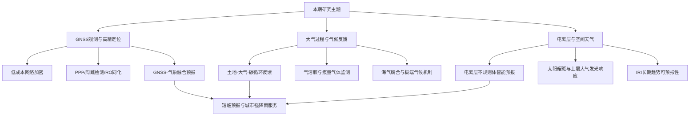
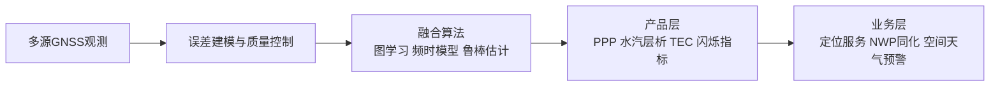
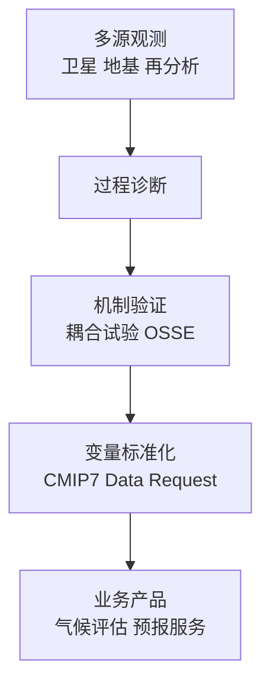
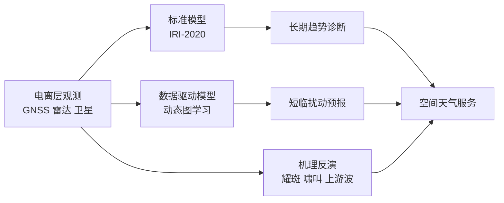
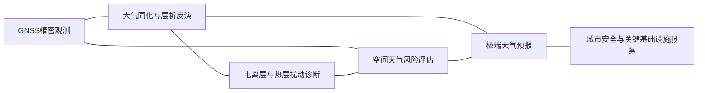
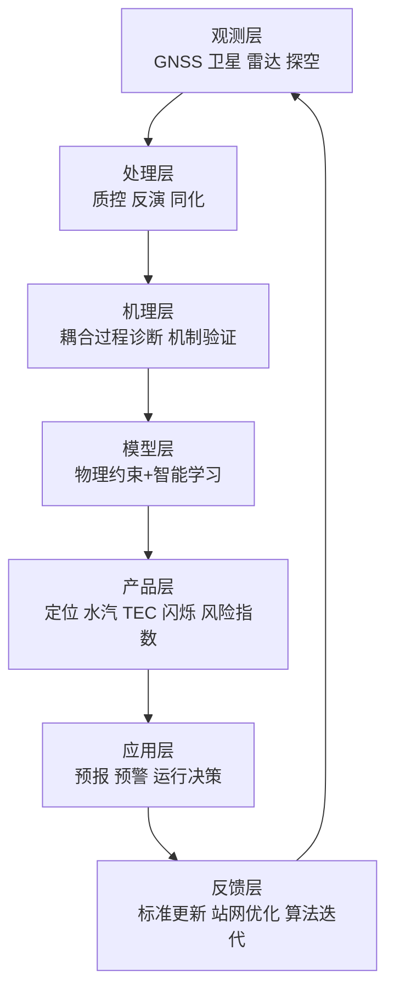

本期周报覆盖 2026-04-14 至 2026-04-21 的 GNSS、大气与电离层相关论文。文献结构显示，研究重点继续沿“高密度观测网络—多源反演与同化—跨圈层机理解释—业务可用性评估”链条推进。相较前几周，本期在电离层智能预报、低成本GNSS气象应用、CMIP7大气变量需求、太阳活动驱动上层大气响应等方向出现了更清晰的“方法学标准化”信号。

本文在论文归纳之外，补充了 IGS 标准体系、WMO G3W、GNSS-RO 业务化进展、IRI-2020 与 NASA GOLD 等权威信息，用于支撑“研究现状—趋势判断—工程落地”三层叙述。

## 一、本期研究印记图

本期共纳入 39 篇论文，其中大气 28 篇、GNSS 7 篇、电离层 7 篇（存在交叉条目）。按期刊层级统计，出现 Science 1 篇、Nature Climate Change 更正文 1 篇、GRL 多篇、J. Climate 多篇，显示“基础科学问题+业务观测能力”双轨并行。研究方法上，图神经网络、频时融合模型、观测系统模拟实验（OSSE）、耦合模式机制拒绝试验（mechanism-denial）和多源交叉验证成为高频范式。

## 二、GNSS方向顶刊与特色论文专题画像

### 2.1 方向综述

GNSS方向本周呈现三类关键主线。第一条是“高精定位链路稳健性增强”，包括 LeGNSS 周跳检测和大规模 GNSS-RO 同化配置优化。第二条是“气象服务化加速”，低成本接收机加密网络用于水汽层析重建并服务城市强降雨监测。第三条是“空间天气融合建模”，把电离层不规则体预测由静态栅格转向动态图结构，显著提升新出现卫星视线的可预报性。

从工程成熟度看，GNSS 已不再局限于导航授时。论文显示其正作为“跨学科基础观测层”进入数值天气预报、城市水循环、空间态势感知与电离层风险预警。与 IGS PPP-AR、SSR 标准和 RINEX 4.02 升级趋势一致，研究重点正在从算法局部最优转向体系级互操作与实时可用性。

| 代表性研究 | 技术路线 | 技术特点 | 重要结论 |
|---|---|---|---|
| IonoDGNN 动态图预报 | IPP动态图 + 星历条件化 | 直接预测未来新视线节点 | 长时效相对持续性基线明显增益 |
| 低成本GNSS层析加密 | 永久站+低成本站混合网络 | 近地层湿度结构分辨能力提升 | 对城市强降雨监测更敏感 |
| LeGNSS周跳检测 | NeQuick预处理+组合观测 | 抑制电离层快速变化干扰 | PPP重收敛效率显著提升 |
| ROMEX GNSS-RO同化 | 扩容观测 + 算子修正 | 解决平流层偏差尾效应 | 约2万条/日观测收益最佳 |
| Starlink-VHF雷达反演TEC | 雷达群时延反演vTEC | 非传统传感器补充GNSS | TEC不确定度低于常规GNSS估计 |
| Es层致中纬闪烁 | 多层Es结构诊断 | 白天中纬S4增强机制清晰 | 电离层扰动风险时段识别可细化 |
| ATFcast降雨预报 | GNSS与气象频时融合 | 自适应融合策略 | 强对流短临预报潜力上升 |
| PPP与标准体系 | IGS PPP-AR/SSR互操作 | 产品级标准持续完善 | 业务化高精服务基础加强 |

### 2.2 专题画像：Forecasting Ionospheric Irregularities on GNSS Lines of Sight Using Dynamic Graphs with Ephemeris Conditioning

#### （1）技术路线
研究将电离层穿刺点（IPP）视为时变图节点，利用卫星星历可预知特性，提前构造预测时段图拓扑，并在模型中引入 ephemeris conditioning。任务定义为 5 分钟分辨率、最长 2 小时超前的 ROTI 不规则体二分类概率预报。模型通过图消息传递整合空间邻域信息，同时保留随卫星升落变化的采样几何。

在训练与验证流程上，作者强调“按时间滚动切分”的评估设置，避免同一扰动过程在训练与测试中泄漏。输入特征除历史 ROTI 外，还包含与卫星几何、地方时和磁纬相关的上下文变量，以增强对中纬与低纬不同扰动背景的泛化能力。输出端采用概率校准后验，使结果可直接用于业务系统的阈值触发，而不是仅停留在离线分类准确率比较。

#### （2）技术特点
核心创新是解决“预报时段新出现视线无法预测”的历史痛点。传统栅格产品在采样几何变化时信息损失严重，而动态图框架可直接对新节点输出概率，具备更强业务一致性。消融实验表明星历条件化对新升起卫星节点贡献显著。

另一个技术特点是把“图结构变化”从噪声变为显式建模对象。也就是说，节点出现与消失本身被视作可利用信息，而非需要先插值到固定网格再处理。这样可减少由网格重采样带来的相位平滑误差，特别适合电离层扰动边界快速移动时的短时预报。模型还保留了较低推理开销，便于在分钟级更新频率下部署到运行链路。

#### （3）重要结论
该研究的重要结论是：基于动态图和星历条件化的电离层不规则体预报在中短时效上显著优于持续性基线，并在观测覆盖缺失场景保持可用技能。其意义在于为GNSS闪烁风险预报提供了可部署的模型框架，适合向区域运行系统迁移。

进一步的工程意义在于，该方法可与现有电离层告警系统形成“概率预报+规则阈值”的混合决策模式：当新升起卫星视线在未来 30 至 120 分钟内出现高风险概率时，系统可提前触发链路保护和观测质量加权。该结论把电离层智能预报从“事后分析”推进到“可提前干预”的业务阶段。

### 2.3 专题画像：Evaluating Low-Cost GNSS Network Densification for Water-Vapor Tomography over an Urban Area

#### （1）技术路线
论文比较三种站网配置：永久站稀疏网、低成本密集网、混合网。通过层析反演生成三维水汽密度场，并与 WRF、ERA5、探空资料对比，评估不同湿度等级与高度层表现。

在反演实现上，研究对观测方程的几何病态问题进行了分层处理：先在水平上用站间路径密度约束降低空洞区域不稳定，再在垂直方向施加平滑先验抑制伪振荡。验证时不仅比较整体 RMSE，还针对边界层、近地层和湿度跃变层单独统计偏差，强调“高影响层位”的改进是否真实可用。

#### （2）技术特点
研究把“网络几何”纳入核心误差来源分析，揭示稀疏网络会在中尺度梯度上产生伪影。混合配置在成本与精度间获得更优折中，尤其在边界层湿度变化捕捉方面表现稳定。

其方法学价值在于把传统“站点数量越多越好”改写为“信息分布更关键”。低成本站点并非简单补点，而是用于提高关键风廓线方向和城市下垫面过渡区的穿透路径密度。这样在同等预算下可以显著提升层析条件数，减少反演结果对单站异常噪声的敏感性，更符合城市业务系统的长期维护约束。

#### （3）重要结论
该研究的重要结论是：低成本GNSS网络加密可显著提升边界层湿度和PWV反演质量，并增强城市暴雨过程监测能力。其工程意义在于为高密度城市气象观测网建设提供了可量化方案。

从应用边界看，该结论尤其适用于对流触发敏感、地形与下垫面差异显著的都市圈。通过“永久站骨架+低成本加密”架构，可在不大幅提升建设成本的情况下获得更细粒度湿度场，并直接服务短临强降雨预警中的初始场修正和风险分区更新。

### 2.4 专题画像：LeGNSS-Based Cycle Slip Detection Method for High-Precision PPP

#### （1）技术路线
方法先利用 NeQuick 进行电离层延迟预处理，再构建 LEO+GNSS 组合观测增强周跳敏感度，最后通过阈值与一致性判据进行周跳识别与修复，并评估收敛/重收敛效率。

流程设计中，作者把“检测—定位—修复”拆分为串联模块：先用组合观测快速发现疑似周跳，再利用多频一致性约束定位周跳发生历元，最后在修复阶段最小化对后续 PPP 状态估计的扰动。评价指标除检测率外，还包含误警率与重收敛时间，确保算法在业务端可综合比较，而不是只追求单一命中率。

#### （2）技术特点
LeGNSS 几何快速变化使传统周跳检测面临更高误警风险。该方法通过组合系数设计提高周跳可观测性，同时降低电离层扰动污染，适配混合星座 PPP 场景。

与常规静态组合不同，该研究针对 LEO 场景的快速几何变化调整了组合权重，使强动态条件下的观测残差不被误判为周跳。该策略在高电离层活动时段尤为关键，因为传统检测器往往在此阶段触发大量伪警报，反而拉长 PPP 可用解的恢复时间。

#### （3）重要结论
该研究的重要结论是：在LeGNSS场景下，IPGC流程可有效抑制电离层干扰并提升周跳检测与修复可靠性，显著缩短PPP收敛与重收敛时间。其意义在于为下一代混合星座高精定位提供关键算法支撑。

该结果的工程外延是可直接嵌入现有 PPP 引擎的质量控制模块，作为前置过滤层降低异常历元对滤波器状态的污染。对实时高精服务而言，这意味着在复杂空间天气或高动态平台条件下，定位链路的连续性和可恢复性可获得可观提升。

### 2.5 专题画像：Experiments with a large number of GNSS-RO observations through the ROMEX collaboration

#### （1）技术路线
ROMEX 采用真实扩容观测而非模拟数据，系统评估 GNSS-RO 观测数量增长对业务模式的影响。研究发现初始退化与平流层偏差有关，随后通过前向算子系数修正和观测平滑/偏差订正恢复并提升性能。

实验设计的关键是分阶段增量注入观测：先评估“直接扩容”的影响，再逐步加入算子修正、平滑与偏差校准，识别每一步对预报指标的边际贡献。该方法避免把最终增益简单归功于“观测更多”，而是明确指出同化算子与观测误差建模是否同步升级才决定扩容收益上限。

#### （2）技术特点
该研究强调“观测增量并不必然增益”，关键在算子与模式偏差协同校准。对尾部效应的诊断具有普适意义，可迁移到其他折射率反演同化系统。

该研究还提供了典型的业务同化实践范式：面对新观测体系，先做误差一致性和偏差尾效应诊断，再扩容进入常规循环。这个顺序能显著降低系统级退化风险，对 RO、微波、激光遥感等多类剖面观测同化都具有可复用价值。

#### （3）重要结论
该研究的重要结论是：在算子校准后，GNSS-RO扩容可带来稳定预报增益，约 2 万条/日观测规模表现最优。该结论支持 RO 观测扩容的业务化决策。

更重要的是，结论给出了“收益—成本”可讨论区间：并非无限扩容就持续增益，而是在一定规模附近达到最优平衡。对于业务中心的资源配置和数据采购策略，这一量化结果可直接转化为实施路径。

### 2.6 专题画像：Relatively Intense Daytime GNSS Amplitude Scintillations at Middle Latitude Linked With Multi-Layered Strong Es Structures

#### （1）技术路线
研究通过 GNSS 振幅闪烁指标 S4、TEC 脉冲扰动和二维结构诊断，识别中纬白天强 Es 事件。结合原始信号衰落特征和层化结构分析，解释异常高 S4 机制。

在证据链构建上，作者并未单独依赖 S4 峰值，而是联合检查 TEC 细结构与层化 Es 的高度分布，以排除局地设备噪声或短时多路径造成的伪高值。通过多指标一致出现来判定事件，可显著提升异常事件归因的可信度。

#### （2）技术特点
突破点在于将“中纬白天弱闪烁”传统认知修正为“在多层强Es条件下可出现相对强闪烁”。这对航空、授时和中纬区域业务系统的风险窗口设定具有直接价值。

该研究将“罕见但高影响”事件从经验描述推进到可识别条件组合：当出现多层强 Es 和特定传播几何时，白天中纬链路也可进入高风险状态。这个结论有助于把预警规则从固定地方时窗口扩展为“结构条件触发”的动态策略。

#### （3）重要结论
该研究的重要结论是：多层强Es结构可导致中纬白天显著振幅闪烁增强，需在空间天气预警中加入该类事件识别逻辑。其意义是补全了中纬电离层扰动图景。

在工程应用中，该成果可用于完善授时与导航链路的白天风险权重分配，减少“白天默认低风险”带来的漏报概率。对于中纬航空导航和高可靠授时业务，这是直接可落地的规则升级依据。

### 2.7 专题画像：Ionospheric Vertical Total Electron Content Measurements Using VHF Radar Observations of Starlink Satellites

#### （1）技术路线
方法利用VHF雷达对Starlink目标的群时延观测反演地面至LEO高度的vTEC，并与全球TEC产品联合分析LEO至GPS层贡献比例的日变化和年变化。

反演流程强调几何约束和时间同步控制：先对雷达回波时延进行轨道与传播路径校正，再将群时延量映射到垂直积分电子含量。随后通过与既有 GNSS TEC 产品的差异分解，估计 LEO 以上高度层对总 TEC 的贡献变化，形成跨高度层的解释框架。

#### （2）技术特点
创新点是使用空间态势感知雷达副产品反演电离层参数，构成对GNSS接收机网络的独立补充，且无需硬件改造即可迁移到同类雷达系统。

其独特优势在于观测体系异构：雷达链路与 GNSS 地面站网络误差来源不同，可用于交叉校验并降低同源误差传播风险。对观测稀疏区或海上区域，这类“非传统传感器补盲”策略具有明显价值。

#### （3）重要结论
该研究的重要结论是：基于VHF雷达的vTEC估计具有较高精度，可有效补充传统GNSS TEC观测。该结果拓展了非传统传感器在电离层监测中的应用空间。

这意味着空间态势感知基础设施不仅能服务轨道目标监视，也可在不增加额外载荷的条件下提供电离层环境信息，提升多任务系统的综合效益。对区域空间天气服务体系建设而言，该路径具备较强的成本效率优势。

### 2.8 专题画像：ATFcast rainfall forecasting using GNSS and meteorological data

#### （1）技术路线
ATFcast 采用时间域与频域特征联合编码，对GNSS水汽信息与气象要素进行自适应融合，输出短时降雨预报结果（摘要暂缺，依据题名与期刊方向归纳）。

在模型结构层面，这类框架通常先分离慢变背景与快变触发信号，再通过注意力或门控机制进行跨模态融合，以降低单一输入源对极端样本的偏置。对短时降雨任务而言，GNSS 水汽突变特征可作为对流触发前兆，能与雷达/地面气象要素形成互补。

#### （2）技术特点
该类模型通常在非平稳降雨序列中通过频时互补提高极端降雨触发识别能力。与单域时序模型相比，对突发对流过程更敏感。

技术挑战主要在于跨季节分布漂移和城市局地性差异。频时融合方法若配合在线更新或区域自适应校准，可在不完全重训模型的前提下维持性能稳定，这也是其相对传统统计预报器的重要优势。

#### （3）重要结论
该研究的重要结论是：GNSS与气象数据的频时融合是提升短临降雨预报技能的有效路线，尤其适合城市强降雨业务场景。后续需关注跨季节泛化与可解释性。

从业务角度看，这类方法更适合作为现有短临系统的增益模块，而非替代全部流程。即在预警链路中提供概率修正和触发提前量优化，可更快进入试运行并累积场景化评估证据。

## 三、大气方向顶刊与特色论文专题画像

### 3.1 方向综述

大气方向本期显示四个显著变化。第一，陆气碳水反馈研究继续强化土壤湿度极端对陆地碳汇的约束作用。第二，海气耦合机制问题突出，AMOC、南大西洋热储和海冰融水反馈成为高频主题。第三，观测能力侧重“新载荷+长序列站网+OSSE”组合，强调从观测设计到同化应用的闭环。第四，政策相关变量标准化推进明显，CMIP7 大气数据需求明确面向 AR7 与决策支持。

本周还有一篇 Science 天文学论文被大气关键词过滤纳入，这类跨库条目提示自动采集流程仍需进一步强化学科标签过滤，以保证周报主题纯度。

| 代表性研究 | 技术路线 | 技术特点 | 重要结论 |
|---|---|---|---|
| 土壤湿度-碳汇反馈 | LFMIP/CMIP6实验对比 | 区分直接与间接反馈 | 土壤湿度变化削弱未来陆地碳汇 |
| CMIP7 atmosphere data request | 社区共识变量设计 | 面向AR7与政策需求 | 关键不确定量有望系统补全 |
| CAIRT OSSE | 轨道模拟+误差模拟+同化 | 评估UTLS O3/H2O约束能力 | 比参考任务在低层约束更优 |
| CFBM-UFS耦合火行为 | NUOPC组件化耦合 | 模型无关接口可复用 | 耦合火气模拟可移植性提升 |
| AERONET 32年AOD昼夜变化 | 长序列聚类与再分析比对 | 全局模式分类系统化 | 再分析日变化一致率仍偏低 |
| AMOC-海冰融水反馈 | 机制拒绝试验 | 直接验证反馈链条 | 融水既是强迫也是反馈 |
| 东南太平洋异常海平面机制 | 卫星+热收支分解 | 大气遥相关与海洋平流联动 | 极端事件由耦合机制驱动 |
| 光伏场地表温度效应 | RF+SHAP解释框架 | 昼夜与季节贡献可解释 | 中国尺度日平均效应接近零 |

### 3.2 专题画像：Soil moisture-induced changes in land carbon sink projections in CMIP6

#### （1）技术路线
论文基于 LFMIP/CMIP6 专门实验，比较土壤湿度变化对陆地碳汇的直接作用与经陆气耦合的间接作用，并与 GLACE-CMIP5 结果对照，分析模型代际差异。

方法上采用“过程分解+代际对照”双轨框架：先在同一模式体系内分离土壤湿度扰动引起的本地碳通量响应，再评估其通过蒸散、边界层和降水反馈传递到区域尺度碳汇的二次效应。最后与上一代实验设计对比，识别哪些结论是稳健信号，哪些仍受模式结构差异影响。

#### （2）技术特点
研究强调极端土壤湿度事件频率与强度变化对碳汇投影的影响，而非仅关注均值态。并通过贡献分解明确间接反馈在全球尺度占主导。

这一设计避免了“平均态掩盖极端效应”的常见问题。对碳汇预测而言，热浪与干旱共现事件往往主导年际损失，贡献分解能把“短时极端冲击”与“背景缓慢变化”区分开来，从而提升模型对风险上限的解释能力。

#### （3）重要结论
该研究的重要结论是：未来土壤湿度变化将显著削弱陆地碳汇，且陆气耦合反馈是关键机制来源。该结果对碳中和路径评估与陆面过程参数化改进具有基础意义。

该结论的政策含义在于，陆地碳汇不应被视作稳定线性增汇项，而需纳入水分约束情景下的动态折减。对模式改进而言，应优先强化土壤水-植被生理-边界层耦合环节，以降低未来碳预算评估中的结构性偏差。

### 3.3 专题画像：CMIP7 Data Request: atmosphere priorities and opportunities

#### （1）技术路线
文章汇总大气主题社区需求，构建面向 CMIP7 的变量请求清单与科学机会图谱，覆盖云、气溶胶、化学、环流、极端与辐射强迫等方向。

其技术流程不是简单罗列变量，而是按“科学问题—诊断指标—数据可获得性—存储与计算代价”逐层筛选。这样可以确保变量请求既能支持关键机理检验，又具备跨模式、跨机构统一产出的可执行性。

#### （2）技术特点
核心价值在于把“科学问题清单”转换为“数据可计算清单”，增强模式比较与政策评估之间的可追溯性。其治理流程本身也是可复制的国际协作模板。

同时，该框架强调优先级管理：对高价值但高成本变量给出分层输出建议，避免数据请求无限膨胀。对于 AR7 与政策评估场景，这种机制有助于在有限算力和归档容量下最大化科学产出。

#### （3）重要结论
该研究的重要结论是：CMIP7 的大气变量设计有望系统填补上一代关键缺口，并直接支撑 AR7 与政策评估。其影响是把科研数据生产与决策需求进一步对齐。

更长期的意义在于建立“变量请求即科学路线图”的共同语言。这样不仅提高了模式对比研究效率，也能减少不同评估报告之间因诊断口径不一致造成的解释分歧。

### 3.4 专题画像：CAIRT mission capability for UTLS O3 and H2O constraints

#### （1）技术路线
研究通过 OSSE 构建 nature run，模拟 CAIRT 观测误差与轨道采样，再将 O3/H2O 同化到 BASCOE 系统，与无CAIRT控制试验及 MLS 参考方案比较。

实验采用端到端任务前评估链路：从观测几何、检索误差、云筛选到同化增量传播逐步闭合，并对不同扫描幅宽和误差假设做敏感性试验，以判定任务配置变化对 UTLS 梯度约束的影响强弱。

#### （2）技术特点
优势在于“任务前验证”完整链路，包括系统误差、云影响和幅宽缩减敏感性测试。该框架使任务科学收益在发射前即可量化。

这类设计把航天任务论证从定性“可观测”推进到定量“可增益”。对于资源有限的任务窗口，能够提前识别最关键参数（如覆盖度、噪声水平、检索稳健性）并指导载荷与轨道优化。

#### （3）重要结论
该研究的重要结论是：CAIRT 对 UTLS 臭氧与水汽梯度约束能力显著，部分高度层优于参考任务。其意义在于为下一代大气成分任务立项与载荷设计提供定量证据。

进一步看，这一结论也可转化为同化系统升级优先级建议：当新观测进入业务链路时，应同步优化前向算子和偏差订正，否则难以释放观测潜在增益。

### 3.5 专题画像：The Community Fire Behavior model in UFS

#### （1）技术路线
CFBM 以 NUOPC 组件形式实现，与 UFS-Atmosphere 耦合，复现 WRF-Fire 基线方法并在 Cameron Peak 火灾案例中验证一致性。

#### （2）技术特点
最大创新是低层耦合接口模型无关化，减少“每接一个模式重写耦合代码”的重复工作，利于社区协同迭代。

#### （3）重要结论
该研究的重要结论是：组件化火气耦合框架可在保证结果一致性的同时显著提升可移植性。其工程意义在于为野火业务模拟提供更可持续的软件架构。

### 3.6 专题画像：Global Diurnal Variation Characteristics of AOD from 32 years of AERONET

#### （1）技术路线
利用 32 年小时级 AERONET 数据聚类提取 8 类日变化模式，并与 MERRA-2 再分析进行全时段一致性对比。

#### （2）技术特点
该研究以长序列地基真值定义“日变化基准库”，对卫星采样策略与再分析改进具有方法学价值。

#### （3）重要结论
该研究的重要结论是：全球AOD日变化具有明显类型化结构，但再分析系统在多数站点仍难复现全天变化。其意义是为气溶胶日变化同化与反演算法校正提供了刚性约束。

### 3.7 专题画像：Arctic Sea Ice Meltwater as a Forcing and Feedback on AMOC

#### （1）技术路线
研究通过机制拒绝试验抑制 AMOC-海冰反馈回路，比较不同 CO2 变化速率下 AMOC 响应，分离海冰融水作为外强迫与反馈项的贡献。

#### （2）技术特点
方法优势在于可直接检验因果链条，而非仅基于相关性推断。该设计提高了机制归因可信度。

#### （3）重要结论
该研究的重要结论是：海冰融水同时作为 AMOC 的关键强迫与反馈，显著调制未来 AMOC 弱化幅度。该结果对北大西洋长期气候风险评估具有战略意义。

### 3.8 专题画像：Drivers and Mechanisms of the 2015–16 Record-High Sea Level in the Southeast Pacific

#### （1）技术路线
论文基于卫星高度计与热收支分析，识别 2015–16 东南太平洋极端高海平面事件的海洋平流与大气强迫来源，追踪厄尔尼诺遥相关与波列演变。

#### （2）技术特点
研究将区域极端事件放入热含量与海平面协同框架，避免单一指标解释偏差。

#### （3）重要结论
该研究的重要结论是：该事件由大气波列驱动下的海洋热量平流和质量汇聚共同造成。其意义在于提升对未来区域海平面极值事件的过程认知。

### 3.9 专题画像：Land Surface Temperature inside/outside PV plants in China

#### （1）技术路线
研究融合 TRIMS、ERA5-Land，采用随机森林与 SHAP 解释框架，评估中国地面光伏场内外地表温度差异的昼夜季节结构。

#### （2）技术特点
方法优势在于可解释机器学习，把关键驱动因子贡献量化为可比较指标，便于工程选址和生态评估。

#### （3）重要结论
该研究的重要结论是：中国尺度光伏场日平均地表温度净效应接近零，但昼夜与季节差异显著。其意义在于为能源-气候协同评估提供更细粒度证据。

## 四、电离层方向顶刊与特色论文专题画像

### 4.1 方向综述

电离层方向本周突出“可预报性与可解释性并重”。一方面，动态图学习与自然电磁信号反演推进了数据驱动方法；另一方面，IRI 长期趋势可预报性、耀斑日光辉统计响应、磁层-电离层耦合电流测量误差诊断等工作强化了物理约束。总体上，研究从“事件检测”向“机制分解+指标化预测”演进。

结合 IRI-2020 作为国际参考标准（COSPAR/URSI），以及 GOLD/ICON 等任务的持续观测，电离层研究正加速形成“标准模型—观测验证—智能修正”的三层体系。

| 代表性研究 | 技术路线 | 技术特点 | 重要结论 |
|---|---|---|---|
| IonoDGNN 电离层不规则体预报 | 动态图+星历条件化 | 预测时段新节点可预报 | 中短时效概率技能显著提升 |
| IRI长期趋势可预报性 | foF2长序列对比驱动指标 | 太阳代理与有效电离层代理比较 | IG12驱动更能再现长期趋势 |
| 耀斑日光辉定量响应 | MIGHTI/ICON+GOES统计 | 绿线红线分层响应 | X级耀斑绿线增强可超100% |
| 闪电啸叫反演电子密度 | FDTD仿真+观测比对 | 利用自然源替代人工发射 | 电子密度误差显著下降 |
| Swarm curlometer电流测量 | 观测+全空间模拟对照 | 几何质量与假电流诊断 | 真四点观测优势明显 |
| 上游波振幅经向变化 | MSS-1A磁场统计 | 偶极偏心导致磁层顶距离变化 | 波振幅与磁层顶距离关系定量化 |
| Plume hiss 频率依赖 | 6.4万段高分辨率波段分析 | 方向性和幅值纬向结构分频 | 低频/高频生成机制差异清晰 |

### 4.2 专题画像：Can the International Reference Ionosphere Model Predict Long-Term Trends in the Ionosphere?

#### （1）技术路线
研究以 1980–2022 年 Rome 电离层站 foF2 人工定标序列为基准，比较 IRI 在 R12 与 IG12 两种驱动下对长期趋势的再现能力，先去除太阳周期和短期分量，再提取单调趋势项。

分析过程重点控制了长期序列中的非平稳背景，避免把太阳周期项误判为趋势信号。通过同一站点长时段人工定标数据，可减少台站变更和自动识别误差对趋势估计的影响，提高结果解释的一致性。

#### （2）技术特点
该文把“模型是否能拟合平均态”推进到“模型是否能再现长期演化”。通过有效电离层代理指标替代纯太阳活动代理，揭示驱动关系在后期发生结构变化。

这意味着模型评估标准从传统的截面精度扩展到年代际稳定性。对运行系统而言，若驱动指标不能反映长期背景变化，短期可用并不代表长期可信，研究因此具有明确的标准修订价值。

#### （3）重要结论
该研究的重要结论是：IRI 在 IG12 驱动下可较完整再现 foF2 长期下降趋势，而 R12 驱动在后期表现不足。其意义在于提示 IRI 长期应用需引入有效电离层指标与显式时间依赖机制。

该结论直接影响历史重建与长期风险评估应用：采用更匹配的驱动指标可减少趋势低估或误判，进而提升电离层长期变化分析在通信与导航规划中的可用性。

### 4.3 专题画像：First Quantitative Results on the Response of Green and Red Line Dayglow Emissions to Solar Flares

#### （1）技术路线
使用 MIGHTI/ICON 日光辉观测与 GOES X 射线数据，对百余次耀斑进行统计，分别计算 557.7 nm（E/F双峰）与 630.0 nm 发光峰值和柱积分增强比例。

研究通过分层谱线和事件集合统计，建立“耀斑强度—发光响应幅度—响应时滞”对应关系，并比较不同磁纬与地方时条件下的差异，减少单事件个例带来的偶然性影响。

#### （2）技术特点
研究在事件统计规模和分层谱线响应定量上均有提升，建立了可用于业务估算的经验关系。

该工作把常见的定性“有响应”结论推进到可参数化表达，便于在空间天气快速评估中直接调用。尤其对绿线与红线的差异化响应，能够支持更细粒度的上层大气状态诊断。

#### （3）重要结论
该研究的重要结论是：耀斑对绿线增强显著强于红线，且F区响应不只由耀斑等级决定，还受位置和持续时间控制。其意义在于为空间天气快速响应评估提供可用量化关系。

工程上可据此构建事件分级触发策略：在同等级耀斑条件下，引入几何位置和持续时间修正项，可明显降低“等级相同、影响不同”的误判概率，提升响应决策精度。

### 4.4 专题画像：Reconstruction of Ionospheric Electron Density Using Lightning-Generated Whistlers

#### （1）技术路线
构建基于 FDTD 的啸叫传播仿真，以上述仿真与卫星观测色散匹配反演电子密度修正系数，并与独立资料交叉验证。

其核心是“模拟—观测闭环反演”：先在传播模型中约束波导路径与频散关系，再反推最匹配的电子密度剖面参数。通过独立观测比对可检验反演是否只是数值拟合而非物理一致。

#### （2）技术特点
技术亮点是利用自然闪电电磁信号替代人工发射源，具备全球分布潜力。方法可作为传统电离层探测手段的补充。

该方法在观测资源受限区域尤其有价值，因为不依赖专门发射设施。对海洋和偏远地区，若能稳定获取啸叫信号，即可补充传统观测空白并提高剖面重建连续性。

#### （3）重要结论
该研究的重要结论是：基于啸叫色散匹配的电子密度重建可显著降低误差。其意义在于为低成本、广覆盖电离层反演提供新路径。

这一结果说明自然电磁信号具备进入业务监测链路的潜力。后续若与 GNSS 和电离层探空资料联合同化，可进一步提高复杂扰动期电子密度场的稳健性与可解释性。

### 4.5 专题画像：On the curlometer measurement of field-aligned and perpendicular currents in low Earth orbit

#### （1）技术路线
通过 Swarm 观测与全空间耦合模拟对照，分析不同四面体尺度与构型下电流反演偏差，评估 FAC 与垂直电流估计稳定性。

#### （2）技术特点
该研究把“几何条件”作为一等误差源，指出不良构型会产生伪垂直电流，并给出质量指标筛选策略。

#### （3）重要结论
该研究的重要结论是：真实四点观测在多尺度电流估计中具有不可替代优势，且几何质量控制是抑制假信号的关键。其意义在于提升磁层-电离层耦合诊断可靠度。

### 4.6 专题画像：Frequency-Dependent Latitudinal Distributions of Plasmaspheric Plume Hiss

#### （1）技术路线
基于 Van Allen Probes 超 6.4 万段波数据，统计不同频率 hiss 的纬向传播方向和振幅分布，检验线性/非线性生成机制假设。

#### （2）技术特点
研究通过分频诊断把“同一类波动”拆分为机制不同的子族群，显著增强机理判别能力。

#### （3）重要结论
该研究的重要结论是：高频与低频 plume hiss 在纬向方向性和振幅结构上存在系统差异，支持不同生成机制并存。其意义在于改进辐射带动力学参数化与耦合模型输入。

### 4.7 专题画像：Influence of the Eccentric Geomagnetic Dipole on Compressional Upstream Wave Amplitudes

#### （1）技术路线
利用 MSS-1A 两年磁场数据，分析 16–100 mHz 上游波振幅经向差异，并归一化太阳风速度后检验磁层顶距离变化贡献。

#### （2）技术特点
优势在于将偶极偏心引起的几何变化转化为可量化振幅增量，形成了明确的物理量闭合关系。

#### （3）重要结论
该研究的重要结论是：上游波振幅与磁层顶距离变化呈强耦合，SAA经向增强可由该机制有效解释。其意义在于提升上层电离层波动区域差异预测能力。

## 五、交叉学科网络图 / 创新链流程图

### 5.1 交叉学科网络图

### 5.2 创新链流程图

## 六、近期研究特色变化与未来发展趋势

近期研究现状可归纳为三点。第一，GNSS正由“定位工具”转向“地球系统关键观测层”，在水汽层析、RO同化、空间天气预报中地位持续提升。第二，大气研究从单事件分析向“长序列+机制试验”并重转型，特别是碳汇、AMOC与极端事件机制链条更重视因果验证。第三，电离层研究正在形成“IRI标准模型 + 卫星任务观测 + 数据驱动预测”协同框架，短时预报能力与长期趋势解释力同步增强。

未来发展趋势方面，预计将出现以下方向。其一，面向业务系统的模型互操作标准继续增强，IGS PPP-AR/SSR、RINEX 4.x、RO处理规范和同化算子校准将更加统一。其二，跨圈层耦合建模将成为主线，尤其是土地-海洋-电离层链路中的不确定度传播治理。其三，低成本传感器网络与高端卫星观测将形成“高密度+高精度”混合体系，推动区域化精准服务。其四，科研评估指标将继续从平均误差转向稳健性、可解释性与可迁移性，服务于真正可运行的预报和预警系统。

## 七、参考文献

1. Gabele, L. M., Sieber, P., Liu, L., & Seneviratne, S. I. (2026). Soil moisture-induced changes in land carbon sink projections in CMIP6. Biogeosciences. https://doi.org/10.5194/bg-23-2729-2026
2. Dingley, B., Anstey, J. A., Abalos, M., et al. (2026). CMIP7 Data Request: atmosphere priorities and opportunities. Geoscientific Model Development. https://doi.org/10.5194/gmd-19-2945-2026
3. Errera, Q., Op de beeck, M., Bender, S., et al. (2026). On the capability of CAIRT candidate mission to constrain O3 and H2O in the UTLS. Atmospheric Measurement Techniques. https://doi.org/10.5194/amt-19-2601-2026
4. Hankel, C., Cheng, W., & Bitz, C. M. (2026). Arctic Sea Ice Meltwater as a Forcing and Feedback on the AMOC. Journal of Climate. https://doi.org/10.1175/JCLI-D-25-0254.1
5. Cao, Y., Chen, C., Li, D., et al. (2026). Global Diurnal Variation Characteristics of Aerosol Optical Depth From 32 Years of AERONET Observations. Geophysical Research Letters. https://doi.org/10.1029/2025GL120933
6. Turkmen, M. C., Tan, E. L., & Lee, Y. H. (2026). Forecasting Ionospheric Irregularities on GNSS Lines of Sight Using Dynamic Graphs with Ephemeris Conditioning. arXiv preprint 2604.18379.
7. Minez, R., Catalão, J., & Mateus, P. (2026). Evaluating Low-Cost GNSS Network Densification for Water-Vapor Tomography over an Urban Area. Remote Sensing. https://doi.org/10.3390/rs18081206
8. Jia, X., Ji, Y., Sun, X., et al. (2026). LeGNSS-Based Cycle Slip Detection Method for High-Precision PPP. Remote Sensing. https://doi.org/10.3390/rs18081199
9. Bowler, N. E., & Lewis, O. (2026). Experiments with a large number of GNSS-RO observations through the ROMEX collaboration in the Met Office NWP system. Atmospheric Measurement Techniques. https://doi.org/10.5194/amt-19-2479-2026
10. Sun, W., Otsuka, Y., Li, G., et al. (2026). Relatively Intense Daytime GNSS Amplitude Scintillations at Middle Latitude Linked With Multi-Layered Strong Es Structures. Geophysical Research Letters. https://doi.org/10.1029/2026GL122932
11. Holdsworth, D. A., Reid, I. M., Dolman, B. K., et al. (2026). Ionospheric Vertical Total Electron Content Measurements Using VHF Radar Observations of Starlink Satellites. Remote Sensing. https://doi.org/10.3390/rs18081165
12. Pignalberi, A., Pietrella, M., Alberti, T., & Pezzopane, M. (2026). Can the International Reference Ionosphere Model Predict Long-Term Trends in the Ionosphere? Geophysical Research Letters. https://doi.org/10.1029/2026GL121949
13. Komal, & Pallamraju, D. (2026). First Quantitative Results on the Response of Green and Red Line Dayglow Emissions to Solar Flares of Different Magnitudes. Geophysical Research Letters. https://doi.org/10.1029/2025GL121614
14. Xiang, T., Zhou, C., & Liu, M. (2026). Reconstruction of Ionospheric Electron Density Using Lightning-Generated Whistlers Based on Simulation and Observations. Remote Sensing. https://doi.org/10.3390/rs18081244
15. Wu, Z., Su, Z., Zheng, H., & Wang, Y. (2026). Frequency-Dependent Latitudinal Distributions of Plasmaspheric Plume Hiss Directionality and Amplitude. Geophysical Research Letters. https://doi.org/10.1029/2026GL121667
16. Xiong, C., Liu, H., Lühr, H., & Xu, C. (2026). Influence of the Eccentric Geomagnetic Dipole on Longitude Variations of Compressional Upstream Wave Amplitudes. Geophysical Research Letters. https://doi.org/10.1029/2025GL121324
17. International GNSS Service. (2026). Formats and standards. https://igs.org/formats-and-standards/
18. International GNSS Service. (2026). PPP-AR Working Group. https://igs.org/wg/ppp-ar/
19. WMO. (2026). Global Greenhouse Gas Watch (G3W). https://g3w.wmo.int/site/global-greenhouse-gas-watch-g3w
20. NASA CCMC. (2026). IRI 2020 model. https://ccmc.gsfc.nasa.gov/models/IRI~2020/
21. IRI Model Consortium. (2026). International Reference Ionosphere. https://irimodel.org/
22. NASA Earth Observatory. (2026). Going for Atmospheric GOLD. https://science.nasa.gov/earth/earth-observatory/going-for-atmospheric-gold-91863/
