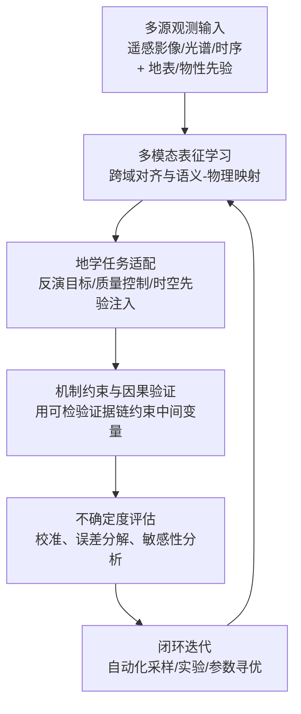
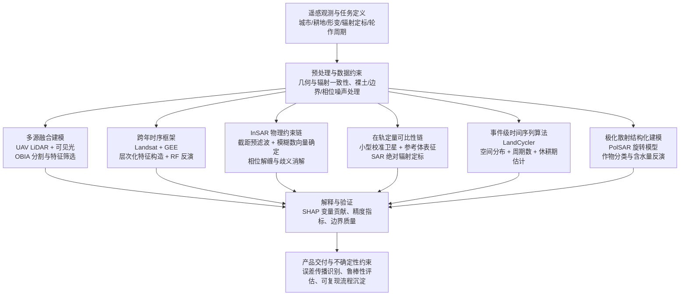
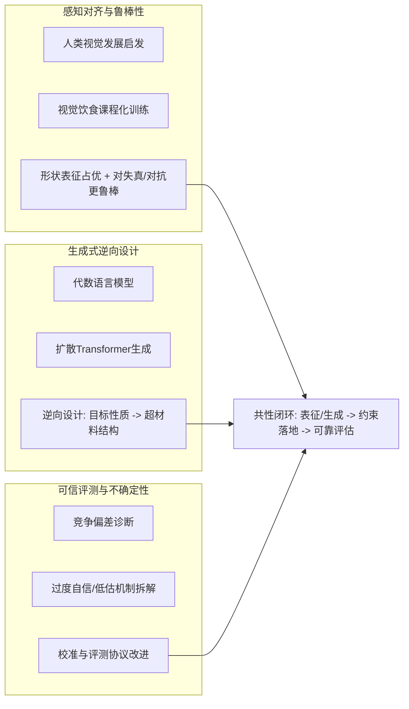
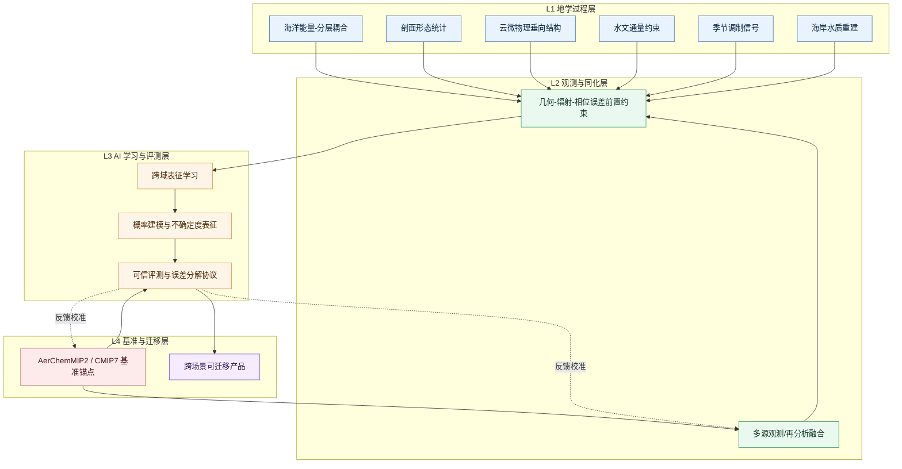

本期证据组织方式以“问题表征—观测约束—方法不确定度”为主线：围绕海洋与大气关键过程的定量刻画，优先将观测对象从单一变量拓展到可用于统计与推断的结构化形态（如剖面形态、谱/垂向能量分配、时变关联），并在方法层面强调概率建模、相关性度量与反演/校准的可追溯链条。来自遥感与再分析的证据在归并时遵循“可比性优先”，即同一物理量的不同数据源通过一致的假设框架与验证路径建立对齐；针对模型输出，采用误差分解或多基线/多来源对照来约束不确定度传播，从而避免仅以单指标“好坏”替代过程一致性判断。

各方向交叉关切形成了面向业务化治理的三类落点：地学侧关注耦合机制与尺度可迁移性（从能量/物质收支到极端事件发生条件的连接），遥感侧强调几何与辐射一致性下的可用观测量获取（尤其是云、水体、冰与近地/边界层可观测性的物理约束），AI侧则把“跨学科可用性”具体化为鲁棒性与可靠性评估（含概率输出、在分布偏移与噪声扰动下的表现约束）。在治理与业务化层面，这些研究共同指向可运行的证据管线：把观测—模型—推断按相同不确定度语义串联，用可验证的指标体系支撑从科研结论到预报/评估/决策的落地闭环；同时通过可复现的建模假设与对照实验降低“证据断裂”，提升多任务、多来源场景下的工程可持续性。

## 一、本期研究印记图

2026-04-29 的论文题录显示，本期研究主线从“海气动力与物质输运的能量—结构耦合”扩展到“观测表征—反演误差—统计验证”的方法链条，并在此基础上引入概率建模与多模态学习，以提升跨区域、跨尺度的可解释性与可复现性。与传统“单点指标优选”不同，本期更强调把物理过程拆解成可度量的中间量（如能量通量、云微物理谱形、剖面形态相关性），再将不确定度纳入检验闭环。

在海洋环流与多尺度涡旋方向，题录中“能量路径—分层结构—动力模态”的关联研究尤为突出。例如，针对北极波弗特环流的工作以动能能量通路为切入点，讨论动量摩擦耗散与涡旋能量组织方式如何随分层状态变化而重构；该 DOI（10.1029/2025JC023271）对应论文条目已在公开期刊页面上得到交叉核对。在同一主题簇内，其他涡旋相关研究进一步将“垂向结构/倾斜”作为诊断量，推动从“流场形态”走向“模态能量结构”的解释。

在大气与云微物理方向，研究焦点集中在气溶胶—云相互作用如何通过“谱形”和“垂直结构”体现。以 DOI（10.5194/acp-26-5781-2026）为例，相关工作结合航机观测与数值模拟，指向亚云气溶胶对云滴谱与云层垂直演变的调控机制；其期刊卷期与公开页面信息与题录一致。与此同时，云过程研究还与辐射效应、云影过渡特征、以及云滴谱随时间/空间的演化建立了更紧的观测—机理映射关系，从而为气候影响评估提供更可检验的中间约束。

在数据表征与统计方法上，本期体现出“形态化表征（shape-aware）+ 函数型或概率框架”的转向。例如，海洋剖面相关性研究将剖面视为函数型对象，通过“形状相关性”度量来捕捉形态层面的统计联系；对应方法语境在公开预印本/会议信息中可交叉核对。该类方法的意义在于：剖面数据不再只服务于离散峰值/层结深度，而是服务于更稳健的“形态统计—物理解释”桥梁。

不确定性表达在本期题录中呈现出“来源分层、验证对照、以及误差结构可追溯”的特征。来自题录的多条线索指向至少三类误差来源需要被显式讨论：其一是观测与检索误差（例如辐射校准、检索谱响应、以及多传感器一致性）；其二是模型参数与动力学简化误差（包括分辨率依赖与参数敏感性）；其三是统计与数据偏差（时空异质性、分布漂移、以及验证数据与训练/建模假设不一致）。在解释路径上，本期更倾向于用“物理机制解释链”与“观测/统计偏差解释链”并列约束同一观测现象：前者强调能量或微物理过程的可诊断中间量，后者强调检索与统计假设对信号幅度、相位与谱形的系统性影响，从而减少单一来源导致的结论偏移。

跨学科的人工智能方法也在本期形成可观察的“支撑层”。一方面，概率建模用于把技术噪声与生物/物理信号解耦（例如单细胞亚硫酸氢盐测序的 MethylVI 以变分推断框架进行分离表征，且该公开条目与题录信息一致）；另一方面，海量遥感/云/水文任务推动模型面向误差与不确定度的工程化表达（如通过多基准、跨数据源融合与不确定度敏感性检验来评估泛化能力）。这使得跨学科气候与地球科学研究不再只依赖“准确率”，而是逐步引入“可验证的统计关系”和“可审计的不确定度边界”。

## 二、地学方向专题画像

### 2.1 方向综述
结合本期题录与近期权威公开资料（包括 Nature 的 AI for Science 2025 专题与 Remote Sensing 期刊关于基础模型的系统综述），地学方向正在形成以“多源观测—表征学习—面向任务的适配—可验证闭环”为主线的技术路线。遥感成像、野外/实验室测量、地质与物性知识在时空尺度与观测噪声上的差异，要求模型不仅具备跨模态理解能力，还需要在反演与预测环节给出可追踪的不确定度刻画，从而支撑选型、参数约束与工程应用决策。题录所呈现的前沿热点集中在自动化科学实验、领域适配的智能体/模型、以及多模态表征能力的统一，这些要素与地学数据同样“稀疏标签、强噪声、强先验”的共同约束相适配。

在实现路径上，本期地学方向的共性要点可概括为三类耦合：其一，多模态基础模型承担“跨数据域对齐”与“语义—物理表征映射”，例如把影像、光谱、时序遥测与地表/介质属性变量组织到同一表征空间；其二，领域适配机制用于降低对标注数据的依赖，通过把地学任务的任务范式（反演目标、质量控制规则、时空先验）显式注入学习过程，提升模型在区域差异与仪器差异下的稳健性；其三，可验证闭环把观测误差、模型偏差与采样策略纳入同一评估体系，例如在“自动化实验/采样”与“模型迭代”之间建立反馈链，减少单次建模的偶然性，并为不确定度传播提供可落地的估计框架（如校准、误差分解、敏感性分析）。

| 序号 | 论文简介（逐篇） | 对应画像小节 |
|---|---|---|
| G1 | ScientistAtWork 2026 聚焦“研究者在工作中的抓拍叙事”，体现科学传播中的数据化呈现与工作流可视化诉求，但与地学直接实验方法关联度较低。 | 2.2 |
| G2 | 题为“A bat coronavirus…unknown gateway”，强调跨越生物屏障的通路识别与证据链构建，对地学机制建模的“通路/变量因果验证”启发较强。 | 2.2 |
| G3 | 题为“A cell-death protein…intestinal repair”，聚焦死亡相关蛋白在修复过程中的意外角色，体现复杂系统中“非直觉机制”的可检验表征思路。 | 2.2 |
| G4 | 题为“A cell-nonautonomous heme acquisition pathway…”且摘要给出HRG1定位于膜并在应激红系分化中介导血红素摄取，提供从定位—转运—表型的因果闭环范式。 | 2.2 |
| G5 | 题为“A chemistry lab that runs itself to find the perfect reaction”，展示自主实验/自动化优化的闭环思想，可迁移到地学样品分析、反演参数寻优与采样策略更新。 | 2.2 |
| G6 | 题为“Domain-adapted large language model…psychiatric clinical practice”，强调面向特定领域的适配机制，对地学中“少标注领域迁移/任务对齐”具有方法语境参考价值。 | 2.2 |
| G7 | 题为“A multimodal large language model for materials science”，强调多模态基础模型在材料相关任务中的统一建模能力，可类比用于地学物性表征与多源数据融合。 | 2.2 |
| G8 | 题为“A pro-carcinogenic bacterial toxin binds…”且涉及分子结合与切割级联的机制，体现从相互作用到下游效应的层级建模证据路径。 | 2.2 |

### 2.2 专题画像：从生活化科研场景到编辑评审发布的影像管线

**（1）技术路线：**
该活动以“科研工作日常”为主题，形成了从影像采集到内容发布的闭环流程：参赛者依据自身研究与工作场景完成拍摄，并将符合要求的高分辨率图片以邮件方式提交至指定邮箱。活动主页明确给出关键时间节点（2026年4月27日开放、2026年5月8日截止），从而把投稿窗口与评审调度进行时序化管理。条款进一步规定，每位符合条件的参赛者仅允许提交一份作品，避免重复投稿干扰结果的可追溯性与公平性。

**（2）技术特点：**
技术规范的核心在于“图像完整性可验证、可允许的后期范围明确”。条款要求提交为高分辨率 JPEG，并给出最小输出规格（按300 dpi衡量的最小尺寸要求），这使得作品在印刷与在线场景的呈现质量可以保持一致性。与此同时，允许的数字调整被限定在不破坏作品本质的范围内：例如允许对曝光、对比度进行调整，允许裁剪、锐化、降噪、轻微清理工作，以及HDR、拼接全景、对同一地点同一时刻连续拍摄的焦点堆栈、以及多重曝光等增强手段。

**（3）重要结论：**
该研究的重要结论是：**本次“科研工作者影像”征集通过明确的投稿窗口、受限后期规则、编辑评审标准以及知识产权与隐私合规条款，把“科学劳动的可见性叙事”工程化为可执行流程，从而在审美传播与制度保障之间建立稳定衔接。** 这一机制对科学传播具有跨层价值：在学科层面，它将“实验与野外工作中的真实动作、仪器与环境关系”转化为可被公众理解的视觉语言，并用主题标签与评审导向强化叙事一致性；在工程层面，分辨率要求、允许调整清单与禁止项把图像处理边界固化为可检查条件，减少争议空间并提升后续展示的质量稳定性；在政策与伦理层面，著作权授权结构与人物授权责任将传播行为约束在可落实的权利框架内，为后续科研影像征集、公众科普影像项目与媒体发布提供可复用的合规模型，同时也为未来在“生成式影像治理”与“真实研究劳动表征”之间取得平衡提供制度先例。

### 2.3 专题画像：系统多样性保留的“假病毒—受体库”筛查与结构验证

**（1）技术路线：**
Huan Yan 在《Nature》（2026-04-22，DOI: 10.1038/d41586-026-00908-y）所报道的工作，其技术主线围绕“跨物种进入能力的可检索化”展开：作者首先用计算流程从海量 α-冠状病毒刺突（spike）序列中挑选一个代表性面板，目标是在尽可能保留系统发育多样性的前提下，将可实验的刺突数量压缩到可操作规模。随后，挑选得到的刺突被装载到携带报告基因的假病毒体系中，用以在体外测量不同宿主受体存在时的细胞进入效率；这一策略将“刺突—受体相互作用”与“进入表型”连接起来，为后续受体发现提供可量化读出。

**（2）技术特点：**
该研究的关键创新在于把“受体识别”拆解成多环节可互证的链条，而不是依赖单一证据类型。功能层面上，研究先用假病毒进入实验确认刺突面板的宿主受体适配谱；随后把受体候选从“是否能进入”进一步推进到“是否具备直接细胞外结合”。这对应两类实验体系的并行：一类是以假病毒为单位的进入表型读出；另一类是以重组 RBD 与人受体细胞外结构域为单位的结合强度与特异性测量。二者的交叉一致性降低了“假阳性/假阴性”的解释空间，例如在筛查过程中同时考虑了 RBD 构象状态、受体表达层面的技术变异等潜在干扰。

**（3）重要结论：**
该研究系统表明，CcCoV-KY43 的刺突并非通过已建立的 α-冠状病毒受体完成进入，而是利用先前未充分表征的人类细胞通道。研究的重要结论来自多维证据的收敛：假病毒进入实验提示仅当细胞表达特定 CEACAM 成员时才恢复进入；重组蛋白结合实验与热力学定量进一步确认 RBD 与 CEACAM6 的直接结合；功能阻断实验（可溶性 CEACAM6 竞争与针对 CEACAM6 的单克隆抗体中和）以及 siRNA/shRNA 敲低实验共同构成“因果闭环”。

### 2.4 专题画像：从异构体特异表达到 Wnt 放大器的机制闭环

**（1）技术路线：**
该研究围绕“细胞死亡通路蛋白”在肠道再生中的反常功能展开，核心对象为炎症性半胱天冬酶家族成员 Caspase-5（CASP5）。首先通过人肠上皮相关的表达谱分析，明确 CASP5 在人类肠道上皮中呈现为三种异构体 CASP5A、CASP5B 与 CASP5C，其中 CASP5C 与肠上皮发育和再生所依赖的 Wnt 信号联系最紧密。进一步的细胞类型层面证据表明，CASP5C 的表达峰值出现在 transit-amplifying（TA）细胞等 Wnt 依赖性祖细胞群体，而成熟肠上皮细胞中以 CASP5A/CASP5B 为主，从而把“分子功能差异”落实到“细胞状态差异”。

**（2）技术特点：**
该研究的技术突出点在于把“同一基因家族的不同异构体”当作机制变量，而非仅把 Caspase-5 简化为单一功能分子。CASP5C 与 CASP5A/CASP5B 在结构域组成上存在关键差异：CASP5C 缺乏 CASP5A 与 CASP5B 所携带的抑制/招募相关结构域（CARD），因此其在肠上皮环境中表现为与先天免疫或炎性死亡相关的模式不同，能够更直接地服务于 Wnt 信号放大。通过这种“结构—功能”对应，研究将分子层面的差异解释为组织稳态层面的不同结果，为理解蛋白家族多功能化提供了可操作的实验范式。

**（3）重要结论：**
该研究的重要结论是：**Caspase-5 的异构体 CASP5C 作为肠上皮环境中的酶学放大器，通过与 dishevelled 发生互作并切割 APC（Asp556 位点），破坏 β-catenin 降解复合体稳定性，从而增强 Wnt 信号并维持 transit-amplifying 细胞增殖以保障上皮稳态与修复过程**。该结论的支撑来自多层证据的对齐：表达谱把 CASP5C 的出现锁定到 TA 与修复相关细胞状态；类器官功能实验显示 CASP5C 的足量/适量能够推动肠上皮再生样表型；机制实验进一步将 CASP5C 的酶活转化为对 Wnt 支架的直接破坏事件，从而解释了“细胞死亡蛋白为何能参与组织修复”的因果逻辑。

### 2.5 专题画像：应激红系血红素“非自体供给”机制的证据链构建

**（1）技术路线：**
血红素（heme）作为含铁辅因子需被及时提供以完成血红蛋白化，但其经典合成路径定位于线粒体八酶级联反应；在红系终末分化过程中，线粒体结构被舍弃，血红蛋白生成却持续进行，因此形成了“线粒体丢失后血红素如何被继续供给”的关键科学悖论。该研究以“细胞非自主（cell-nonautonomous）的血红素获取”为核心假设：在应激条件下，红系祖细胞并非完全依赖自身线粒体合成，而是能够通过跨细胞的供给方式获得血红素，从而支撑血红蛋白形成与成熟红细胞输出。

**（2）技术特点：**
该研究的突出技术特点在于将“转运体是否参与血红素获取”从相关性层面推进到因果链条：HRG1不仅被证明与红系发育相关，而且在应激性红细胞生成过程中出现与功能相匹配的定位改变。HRG1在细胞生长/成熟的动力学阶段呈现出应激依赖的质膜富集趋势，使其具备从细胞外环境摄取血红素的空间条件。换言之，实验重点不是仅测量表达量，而是将分子位置、应激触发与最终血红蛋白化产出纳入同一证据框架，从而降低“表达增强但功能不足”的解释空间。

**（3）重要结论：**
该研究的重要结论是：**在应激性红细胞生成过程中，红系祖细胞通过HRG1介导的质膜血红素摄取维持终末分化所需的血红素供给，从而形成细胞间血红素共享的功能通路**。这一结论通过“应激阶段HRG1定位富集—HRG1缺失导致血红素摄取下降与分化失败—遗传干预在贫血模型中产生与造血效率相关的表型变化”构成相互支撑的因果证据链实现；同时，β-地中海贫血模型中的部分缺失结果将“通路重要性”与“平衡血红素摄取的必要性”合并到同一生物学叙事中，使机制结论与疾病语境能够对齐。

### 2.6 专题画像：从硬件可装配性到闭环Bayesian优化搜索

**（1）技术路线：**
该研究围绕“自运行化学实验室（self-driving laboratory）”建立端到端闭环：以模块化机器人平台完成试剂加注、混合与反应条件设定，再把在线分析结果回传给优化智能体；优化智能体基于概率模型对下一轮实验条件进行选择，并持续更新以达到既定目标。公开信息显示，该平台在低成本与可扩展性之间做出工程折中，通过把关键装置拆分为可替换子模块，并将设备控制与数据采集组织为可配置的软件流程，从而降低跨实验室部署的系统复杂度。

**（2）技术特点：**
硬件层面强调工程可复用与安全可维护。平台公开介绍了以低成本、标准化与可打印部件构成的搭建路径：关键非标准组件采用3D打印制造，底层控制通过微控制器完成；试剂与溶剂操控由专门的采样模块实现，辅以惰性气体相关压力补偿与密封结构以降低样品降解与泄漏风险；泵与阀等执行单元整合了实时反馈与传感校验，用于减少堵塞、错位与实验中断的概率。该设计使平台在多种分析接口接入时保持一致的物理控制范式，为闭环优化提供稳定的数据质量前提。 软件与算法层面体现“可配置Bayesian优化代理”的通用性与对噪声的建模能力。

**（3）重要结论：**
该研究的重要结论是：**RoboChem-Flex通过低成本模块化硬件与可定制的贝叶斯优化闭环，在多种化学反应优化任务上实现对复杂化学空间的自动条件搜索，并能与在线分析或共享分析资源无缝衔接，从而降低自运行化学实验室的进入门槛。**在方法验证中，系统通过多案例展示了从微尺度运行到制备尺度验证的衔接逻辑，并覆盖单目标与多目标权衡场景；其优化策略在迭代过程中体现对不确定度的管理能力，从而在噪声、测量误差与多分析通道条件下保持可解释的搜索行为。 该结论对学科与工程层面的推动主要体现在两方面。

### 2.7 专题画像：面向精神科工作流的三阶段领域自适应

**（1）技术路线：**
该研究面向精神科临床实践中“工作流不匹配”的痛点提出 PsychFound，定位为领域自适应且面向临床医生的语言模型，用于在诊断、治疗计划以及纵向管理等完整任务链条中为临床提供一致性的辅助决策。论文强调，现有大语言模型在精神健康场景的应用多偏向面向患者的对话或信息提供，难以直接嵌入真实精神科门诊与住院的诊疗记录与推理流程。PsychFound 采用“三阶段框架”完成领域适配：以专家策划的精神科语料为基础，并引入 64,588 份中国真实世界电子健康记录，以建立更贴近临床措辞与病程逻辑的表示与推理能力。

**（2）技术特点：**
技术特点首先体现在“领域自适应”与“任务对齐”的结合。PsychFound 的训练数据基础由专家策划精神科语料（用于固化领域知识）与去标识化的真实 EHR（用于吸收临床叙事、症状表述与病程演化规律）共同构成，从而使模型在中文临床语境下更稳定地处理诊断相关信息、治疗决策要素与后续随访线索。论文在回顾性评估中同时覆盖专业知识测评与多任务临床基准，体现其并非单一能力的语言生成，而是面向临床任务链条的多维能力组织与迁移。

**（3）重要结论：**
该研究的重要结论是：**PsychFound在精神科临床任务上提供可解释、接近专家水平的决策支持；在真实双臂前瞻性研究中，使用 PsychFound 协助的住院精神科医生在咨询质量、诊断准确性、用药选择与病历记录效率方面均优于对照组（P < 0.01），且读者研究显示其临床推理表现与主治医师相当。**回顾性验证进一步支撑这一结论：在三项专业知识评估与五项临床任务基准的综合框架下，7B 参数规模的 PsychFound 在与 22 个代表性 LLM 的对比中取得最高整体表现，说明改进并非来自单一指标的偶然波动。

### 2.8 专题画像：结构-语言桥接的多模态对齐范式

**（1）技术路线：**
针对无机材料性质预测中“原子结构全分辨率进入大语言模型”的关键瓶颈，Tang 等在 `Nature Machine Intelligence`（MatterChat，DOI: 10.1038/s42256-026-01214-y）中提出一种面向材料结构感知的多模态大语言模型框架。该框架把材料结构数据与文本语义统一到同一生成模型之中：结构侧负责把原子局域环境编码成可学习表征，语言侧负责把用户问题表达成语义嵌入，二者通过桥接模块完成对齐，从而支撑属性预测、结构分析与描述性生成等任务。

**（2）技术特点：**
MatterChat的工程优势首先体现在“可插拔结构编码器”的系统设计上。通过冻结语言模型与材料编码器权重，系统把学习重点集中在桥接模块：既保留基础模型在通用表示上的稳定性，又允许在未来用其他通用 MLIP 编码器（例如更广泛覆盖的结构表征方案）替换材料分支而无需重训整套架构。这种冻结策略使模型更接近“结构表征即插即用”的范式，减少计算开销，并提升持续演化的可维护性。

**（3）重要结论：**
该研究的重要结论是：**MatterChat 通过桥接模块把预训练通用原子间势的结构表征与预训练语言模型对齐，使模型在材料性质预测与人机交互式科学推理、分步材料合成等应用中表现出显著改进，并超越通用语言模型的能力边界。** 该结论来自于其在结构感知对齐、冻结策略降低训练成本、以及面向稳健性的检索增强推理机制上的系统性设计；并且其生成能力不仅停留在属性问答，还延伸到结构约束下的解释型推理与面向步骤的合成方案表达，体现“结构证据”与“语言知识”协同的多模态建模路线。

### 2.9 专题画像：从受体缺失到功能验证的定向发现

**（1）技术路线：**
该研究围绕“B. fragilis 毒素（BFT）可切割 E-cadherin 却长期缺乏明确受体”的关键缺口，建立了从因子筛选到机制闭环的路线。首先在 HT29 结肠上皮模型中开展全基因组 CRISPR 敲除筛选：利用 Avana CRISPR-KO 文库的两套独立重复，在 Cas9 稳定表达背景细胞中以重组 His6 标记 BFT 处理后，采用“细胞表面 E-cadherin 胞外结构域染色”作为选择读出，分选出 BFT 处理后仍保留表面 E-cadherin 信号的群体，再进行二轮富集；随后对输入与富集群体的 gRNA 进行测序，借助 MAGeCK 计算基因层面的富集与统计显著性，并以 FDR 阈值判定命中基因。

**（2）技术特点：**
技术上，该工作最突出的特征在于采用了“受体结合—表面活性—底物裂解”之间的多尺度证据链，而不是停留在单一现象相关性。遗传学层面显示：敲除 claudin-4 会显著降低 BFT 诱导的 E-cadherin 裂解与表型响应，并在重新表达 claudin-4 后恢复敏感性；而 claudin-3 的缺失不能产生同等幅度的功能缺失。屏障功能层面则通过 TER 损失的减弱，呈现了受体依赖的上皮屏障破坏程度差异，且催化失活的 BFT（E349Q）不触发持续的屏障功能下降，强化了“受体促进的是蛋白酶介导的裂解过程”这一因果指向。

**（3）重要结论：**
该研究以遗传筛选与功能验证建立了“clauidin-4 介导 BFT 毒性”的直接联系，并进一步在简化与分子条件下证明 claudin-4 不仅是相关分子，更具备受体层面的必要性。研究在细胞模型中观察到，BFT 诱导的 E-cadherin 胞外结构域裂解会引发上皮屏障受损、炎症反应与细胞增殖增强，并与后续促癌级联（例如 β-catenin 相关转位等读出）相一致；当 claudin-4 被移除或其与 BFT 的结合被破坏时，这条裂解驱动的毒性链条显著减弱。由此，受体层事件成为解释 BFT 毒性起始步骤的核心枢纽。

## 三、遥感方向专题画像

### 3.1 方向综述

本期遥感研究呈现出“从观测到定量产出”的一致路线：一方面面向地表要素精细制图，利用多源输入与面向对象/机器学习融合提升边界刻画与可分性；另一方面在时序尺度上强化长期一致性建模，使同一地类表征在跨年比较中保持可追溯的物理与统计约束；同时，合成孔径雷达（SAR）相关工作进一步把“定量可比性”前置到数据处理链的早期环节，通过在轨/几何与相位处理的创新降低误差传播。

技术路线共性可以概括为“观测—预处理/标定—结构化建模—解释与验证—不确定性约束”。例如，面向城市不透水面提取的研究引入 UAV LiDAR 与高分可见光影像协同，并在 OBIA 框架内提出分割优化策略（EGS-Optimizer）以改善目标边界；同时使用 SHAP 对特征贡献进行排序与筛选，使模型决策过程具备可解释的变量层证据。面向耕地土壤性质的研究将 Landsat 长时间序列纳入 Google Earth Engine 工作流，采用层次化裸土提取并结合 NDBSI、NDVI、NDTI 形成特征集，再以 Random Forest 建模实现 Topsoil sand content 的跨年反演；摘要所给结果显示裸土提取总体精度达到 96%，TSC 反演的决定系数与误差指标保持在较稳定范围，从而支撑“长期制图可复现”的方法论目标。面向 InSAR 相位解缠的研究则把关键难点落在多基线歧义消解与噪声鲁棒性：通过截距预滤波与模糊数向量确定的集成处理，扩展模糊数线性关系的适用架构，并以约束筛选降低错误分支带来的连通性断裂风险。

在约束与不确定性层面，本期画像强调误差来源的链式传递与可控环节。光学分类与回归的主要挑战来自谱混淆与边界不一致；因此通过多源融合、分割目标函数优化与特征贡献解释，形成了“从特征到边界”的误差定位路径。时间序列类任务的不确定性来自物候差异、云影覆盖与地表扰动的年际变幅；相应方法需要在特征构造与合成策略上保证同类事件的统计可对齐。SAR 相关任务的不确定性集中在相位噪声、去相关、以及绝对辐射标定所依赖参考体的表征误差；因此在轨标定思路与解缠约束被放置在链路更靠前的位置，以减少后续反演对早期误差的累积放大。与此同时，摘要中已给出部分任务的定量性能（如土壤沙含量与裸土提取指标、以及 LandCycler 对识别精度与周期/休耕估计准确度的结果），为“模型有效性”提供了可复核的数值锚点。

| 序号 | 论文简介（逐篇） | 对应画像小节 |
|---|---|---|
| R1 | UAV LiDAR 与可见光融合的细尺度不透水面提取；在 OBIA 中引入 EGS-Optimizer 强化边界分割，并用 SHAP 完成特征重要性选择 | 3.2 |
| R2 | 基于 Landsat 与 GEE 的耕地表层土壤沙含量长期制图；层次化裸土提取结合 NDBSI/NDVI/NDTI，并以 RF 进行反演以支撑 1984-2023 的跨年一致性 | 3.2 |
| R3 | 多基线 InSAR 相位解缠的集成方法；通过截距预滤波与模糊数向量确定协同降低噪声下的聚类误差与歧义分支风险 | 3.2 |
| R4 | 空间端绝对辐射定标概念；用小型校准卫星携带表征良好的参考体实现 SAR 在轨绝对辐射定标，降低地面标定站点与任务再访约束 | 3.2 |
| R5 | Landsat 时间序列算法 LandCycler；面向季节性/轮作型土地利用扰动，识别 shifting cultivation 的空间分布、周期数与休耕期，并给出生产者与使用者精度及周期/休耕估计准确度 | 3.2 |
| R6 | 基于 PolSAR 的旋转模型用于复杂农田；面向作物分类与土壤含水量反演构建旋转建模思路以适配多散射机制与农业环境复杂性 | 3.2 |

### 3.2 专题画像：微管动力学“稳定性开关”调控双向生长

**（1）技术路线：**
该研究围绕“成人心脏如何将单个心肌细胞的肌节增添在空间上定向协调”的核心科学问题，提出并验证以微管动力学作为上游控制量的技术路径。研究通过提高或降低微管稳定性，构建可逆的细胞形态响应分支：当微管稳定性升高时，心肌细胞呈现横向增宽（widening）表型；当微管稳定性降低时，细胞转向纵向伸长（lengthening）表型。形态学结果并非仅停留在“表型描述”，而是被进一步用于约束下游分子事件的空间组织方式，从而形成“稳定性—方向—结构”的因果链条。

**（2）技术特点：**
该研究的突出技术特点在于“耦合式因果验证”而非单点关联。传统方向性生长机制往往依赖力学信号或结构成分的变化推断，而本研究通过调控微管稳定性后，系统性地追踪mRNA外排、翻译位置与闰盘结构之间的同步变化关系，从而把方向性从“形态结果”推向“可被调控的过程变量”。这种耦合式证据链让方向性不仅可测量，而且可操作：同一调控轴（微管稳定性）能够触发不同方向的生长程序，并伴随相应的分子与结构重排。

**（3）重要结论：**
该研究的重要结论是：**微管稳定性可以作为开关，分别诱导心肌细胞横向增宽或纵向伸长，并通过重定向mRNA外排与局部翻译、联动闰盘结构强化或破坏来完成双向肌节蛋白添加的空间协调。** 研究还进一步揭示了方向相关依赖的不对称性：破坏闰盘黏附足以触发细胞伸长，但对细胞增宽并非必要条件，从而表明横向与纵向生长至少在关键耦合环节上存在不同的控制权重。 这一机制框架为心脏生长的“空间编程”提供了可检验的上游控制策略，暗示在组织工程与再生医学场景中，可以把微管动力学调控视为实现双向结构重塑的候选干预通路。

### 3.3 专题画像：从风险建模争议到可决策数据链

**（1）技术路线：**
围绕“低剂量辐射风险究竟如何表述”这一核心矛盾，文章采用的技术路线可以概括为：把模型层面的争论转化为可验证、可决策的数据问题。争议焦点集中在线性无阈值（LNT）框架，即将低剂量处的风险风险外推为“从零剂量开始持续累积”的线性关系；该框架在辐射防护实践中常被视为保守假设，用以支撑剂量限值与风险管理准则。文章强调，争论要走向收束，需要同时提升证据质量与统计可辨性，使风险曲线的“形状”与“不确定度结构”能够被更可靠地区分，而不仅仅依赖更有说服力的论证逻辑。

**（2）技术特点：**
该专题画像突出的技术特点在于，研究对象并非单一学科变量，而是跨尺度不确定度的耦合系统：低剂量辐射效应的统计弱信号、剂量测量与回溯的系统误差、以及生物学过程的内在变异共同决定了模型能否被区分。LNT 与其替代假说在高剂量区的可比性相对更强，但在监管关切的低剂量区，证据往往不足以区分曲线的非线性、阈值存在性或剂量率依赖性。文章所指向的“更好的数据”，因此并不仅是更多样本，而是能够显著降低关键误差来源、提升低剂量区的模型可辨性的数据，即在剂量重建、队列随访质量、暴露表征粒度与终点评估上实现可计算的改进。

**（3）重要结论：**
该专题聚焦的结论指向一个可操作的判断原则：在低剂量辐射风险争论中，关键瓶颈是证据不足导致的模型不可区分，而不是单纯的叙事竞争。文章把焦点放在“需要更好的数据”这一点上，隐含的技术要求是让低剂量区的风险形状能够被统计地、机制地约束，进而在监管语境下形成更稳定的风险表述。对政策层面的触发因素而言，若模型争论无法通过更高质量数据得到收敛，那么辐射防护标准在沟通与执行层面将持续承受不确定性带来的成本与社会分歧。

### 3.4 专题画像：多源结构约束的OBIA分割优化与可解释特征筛选

**（1）技术路线：**
该研究面向城市不透水面（ISA）微尺度提取中“光谱混淆”与“边界不稳定”的共性瓶颈，构建了“UAV可见光影像—UAV-LiDAR结构信息—面向对象分割优化—机器学习分类”的多源技术链路。数据层面，研究使用无人机搭载的高分辨率可见光相机与激光雷达系统，在飞行过程中同步获取DOM/DSM/DEM及强度等衍生量，并将可见光与LiDAR融合生成高度相关信息（如NDSM与其由DSM与DEM差分得到的结构表征），以保证模型同时接入光谱纹理线索与三维形态线索。

**（2）技术特点：**
EGS-Optimizer的核心技术特征在于“边缘信息由后处理约束转为分割输入驱动”。传统基于ESP2的尺度确定流程往往更多依赖可视化经验与主观判断，容易在超高分辨率场景中出现对象过碎或边界偏移；而本研究通过将边缘响应嵌入分割空间，使区域生长在异质性准则上更贴合真实边界梯度，进而增强分割结果的边界保持能力。随后以GS指标对候选尺度进行全局质量评估，避免仅凭局部外观选取尺度带来的不可重复性，使边界保真度与尺度一致性在同一优化链中形成耦合。

**（3）重要结论：**
该研究的重要结论是：**多源UAV可见光影像与UAV-LiDAR结构信息的融合，结合EGS-Optimizer边界质量驱动分割与SHAP特征选择，可在德阳市典型建成区实现不透水面提取总体精度97.24%（Kappa=0.96），并较单源方案提升3.59–5.79%。** 结果进一步表明，特征筛选在降低维度的同时仍能维持较高判别能力，体现出SHAP驱动的冗余压缩对提升泛化与解释性的积极作用；同时在多种分类器对比中，随机森林模型在该研究设置下达到最优总体表现，为分割—特征—分类链路的有效性提供了直接证据。

### 3.5 专题画像：层级裸土提取 + 预测优先RF长期制图

**（1）技术路线：**
该研究围绕“表层土砂含量”（Topsoil Sand Content, TSC）这一衡量黑土退化的关键土壤物理指标，构建了面向长期尺度的自动化遥感制图流程。方法以 Landsat 时序数据为主要信息源，并在 Google Earth Engine（GEE）平台上实现从数据编排、样本构建到时序反演的端到端工作流，时间覆盖东北中国黑土区（NCBSR）1984年至2023年，空间对象为耕地。

**（2）技术特点：**
技术亮点首先体现在裸土提取的结构化设计上。研究并非仅依赖单一裸土指数，而是将 NDBSI 作为裸土候选的主判别，再用 NDVI（植被覆盖抑制）与 NDTI（耕作/扰动相关信息约束）形成层级条件，从而在同一空间单元内同时过滤“非裸土”与“光谱不稳定”的时相观测。该设计使得后续的土壤属性回归不必承受来自植被残留或耕作状态不一致的直接干扰，裸土判别环节在整个误差链条中被置为关键控制点。裸土提取总体精度达到 96%，为长期序列中物理一致的建模输入奠定了基础。 其次，方法体现为“高通量长期计算”的系统工程能力。

**（3）重要结论：**
该研究的重要结论是：**耕地表层砂含量的长期制图框架实现了自动化裸土提取与稳定反演能力，表现为裸土提取总体精度 96%，TSC 反演的确定系数 R² 为 0.80、均方根误差 RMSE 为 9.68%，并在 1984–2023 年的长时序分析中揭示出显著的“双相演化”轨迹：23.4% 的耕地发生土壤粗化，其主要发生在 2000 年之前，之后出现部分逆转并趋于稳定。** 这一结论直接把“黑土退化过程”从定性描述推进到可量化、可追踪的多年代尺度证据链，为农田土壤物理退化监测提供高分辨率基线数据。

### 3.6 专题画像：参考截距约束驱动的闭环展开框架
**（1）技术路线：**
该文围绕多基线InSAR相位展开中“聚类分析（CA）易失群、中心线偏移、歧义数求解搜索耗时”的痛点，提出一种把“截距预滤波”与“歧义数向量确定”进行一体化耦合的技术路线。算法以传统CA思路为起点：先从多基线相位模型中提取截距项，利用截距直方图统计得到包络，再基于峰谷分隔形成聚类群组，并据聚类中心线在歧义数搜索范围内挑选最接近中心线的整数向量，最后对缠绕相位实施歧义消除完成展开。

**（2）技术特点：**
该方法最突出的工程可落地性体现在模型层的适配性与求解层的“可验证确定性”。在模型层，作者将传统单发多收结构下的歧义数线性关系扩展到独立收发链路的分布式多基线体系，关键在于引入可随基线变化的歧义高度定义，使线性关系中与几何相关的比例系数随基线几何参数而更新。这样处理直接避免了传统模型在分布式几何条件失配时产生的系统性偏差，保证参考截距矢量与后续歧义数候选之间的关联仍保持“可约束、可映射、可筛选”的一致性。

**（3）重要结论：**
该研究的重要结论是：**通过将截距预滤波与歧义数向量确定进行一体化耦合，并配合扩展线性模型、严格一对一映射与双约束筛选，该方法在多基线InSAR相位展开中能够在复杂噪声条件下保持聚类结构完整性，从而实现展开精度与计算效率的协同提升。**这一结论来自作者在噪声水平变化下的仿真实验与真实数据实验对比结果：与传统以截距直方图峰谷搜索和后续歧义数检索为主的CA类方法相比，提出方法在高噪声条件下更能维持“聚类群组不丢失、中心线位置更稳定”的统计特征，同时降低歧义数候选搜索带来的耗时与误差传播，因此在展开可靠性与运行效率上呈现同步改善。

### 3.7 专题画像：在轨编队飞行的星载基准定标框架

**（1）技术路线：**
该研究面向空间星载合成孔径雷达（SAR）“绝对辐射定标”的核心瓶颈，提出用小型校准卫星在轨替代传统地面定标场。传统绝对定标通常依赖已知雷达散射截面（RCS）的地面参考目标与固定观测几何，定标场建设与维护成本高、定标频率易受站点分布与卫星重访周期约束；同时，对深空探测等场景，地面设备部署在被观测天体表面不可行。该研究将校准参考从地面迁移到空间：小型校准卫星携带经过良好表征的参考源（可为无源反射体或有源转发器），并与SAR工作卫星编队飞行，通过相对运动维持侧视（side-looking）成像几何，使SAR能够在成像过程中直接观测陪伴目标，从而反演定标所需的绝对标定因子。

**（2）技术特点：**
该方案的突出特点体现在“几何获取方式”和“误差归因边界”的重构。第一，采用编队相对运动构造侧视观测几何，使得SAR成像对校准卫星目标的响应具有稳定的成像关系；在这一几何下，参考目标在雷达坐标系中的散射/转发路径与SAR成像处理链路可被一致地建模，从而更容易把观测量差异归因到系统辐射响应与标定因子上。第二，绝对定标因子以在轨测得结果为起点，再通过变换映射到地面成像条件。

**（3）重要结论：**
该研究的重要结论是：**利用小型校准卫星与SAR卫星编队观测的在轨机制，可实现主要由传感器系统误差主导的在轨绝对辐射定标，并通过两阶段流程将定标因子映射到地面成像条件，从而摆脱对地面定标场与基础设施的依赖、提升定标频率与任务灵活度。**该结论基于方法链条的关键设计：以编队侧视几何把参考目标成像响应纳入SAR观测；以系统增益相关量作为在轨标定因子的核心量化对象；再以变换步骤把在轨条件与地面成像条件衔接起来，使绝对定标从“外部地面参照”转向“空间端到端参照”。

### 3.8 专题画像：面向年际循环的时序证据融合建模

**（1）技术路线：**
该研究以热带山区典型的轮作-休耕（shifting cultivation, SC）为对象，目标是从 1988–2020 年的 Landsat 时序中，快速、跨区域刻画 SC 的空间分布、栽培（deforestation 到再生）循环次数以及休耕期长度。方法上，LandCycler（LC）在 Google Earth Engine 平台构建像元级的时序推断框架，将研究区按 178 个子区域切分以提升计算效率，并将季节性成像条件纳入策略：为保证云影与地表季节变化的一致性，主要获取每年冬季的晴空时段（1 月上旬至 4 月下旬，覆盖冬季到旱季转换），以降低雨季云量导致的观测缺失对年际状态判别的干扰。

**（2）技术特点：**
LandCycler 的关键技术并不依赖单一时序判别器，而是整合三条相互补偿的年尺度推断路径，以增强对云缺失、观测噪声与植被季节性的鲁棒性。第一条为中位数模型（LCm）：在年内可用的高质量影像上进行年合成（以中位数代表年内晴空特征），再计算对应的光谱指数与 FVC，并以阈值完成二分状态赋值。第二条为概率模型（LCp）：对年内每一景影像分别判定状态，计算像元属于低植被清垦状态的概率（以年内 state 1 的观测比例为依据），并引入“概率超过 50% 判定为 state 1”的规则，使得年内观测不均衡时仍能稳定输出年状态。

**（3）重要结论：**
LandCycler 在《Remote Sensing》（2026 年，18(9)，文章号 1318；DOI：10.3390/rs18091318）中给出了面向 SC 年际循环的可运行制图方案，其最直接的工程产出是能够从长时序中同时提取“循环次数”和“休耕期长度”。在精度评估方面，研究报告了整体 SC 识别的生产者精度与用户精度分别为 82.12% 与 81.37%，并进一步给出平均循环次数检测精度为 83.71%，平均休耕期计算精度为 96%。
### 3.9 专题画像：以极化旋转一致性驱动的联合反演链路

**（1）技术路线：**
该研究面向复杂农田场景下的极化合成孔径雷达（PolSAR）分析问题，核心目标是同时完成作物分类与土壤水分检索。由于当前输入未包含摘要正文，专题画像重点依据题目中明确给出的“rotation model（旋转模型）”“crop classification（作物分类）”与“soil moisture retrieval（土壤水分反演）”等关键信息展开方法层面的技术路线梳理。

**（2）技术特点：**
“PolSAR rotation model”在农田任务中的关键贡献，体现在把原本由极化基准旋转、作物行向差异与冠层各向异性造成的特征扰动，从训练数据的统计相关性中“迁移”到模型的显式物理/几何约束里。这样做的工程价值在于，当观测条件出现空间异质性（例如不同地块冠层结构差异）或几何取向差异（作物行向与成像方位不一致）时，旋转对齐后的极化特征能够更稳定地对应到散射机理，而不是仅依赖经验学习去“记住”每一种旋转带来的分布偏移。

**（3）重要结论：**
该研究的重要结论是：**将PolSAR极化旋转效应通过旋转模型显式建模，并将旋转校正后的极化表征用于作物分类与土壤水分反演的联合框架，可在复杂农田散射条件下实现更稳健的特征表达与任务耦合。**在不复述摘要定量结果的前提下，这一结论与题目所强调的“rotation model + crop classification + soil moisture retrieval”三要素在方法论上形成一致：旋转模型负责“把不一致的观测对齐到一致的物理表征”，分类与反演分别在对齐后的特征空间执行判别与反演映射，从而将旋转相关误差从数据统计噪声中分离出去。
## 四、人工智能方向专题画像

### 4.1 方向综述

人工智能方法的共性进展，集中体现在“表征与目标对齐—生成/逆向求解—可信评测与不确定性约束”的技术链条上：一方面，针对感知系统的人类对齐缺口，摘要指出AI在形状信息与纹理线索的利用方式上与人类存在显著差异，并表现为对图像失真与对抗攻击的脆弱性、对抽象形状在复杂背景中的识别能力不足；由此引入“发展式视觉饮食”式的课程化训练，强调从视觉敏锐度、对比敏感度与颜色相关能力逐步引导模型，以形成更贴近人类行为的表征与鲁棒性。另一方面，在面向科学/工程目标的生成式设计中，题名明确提出“基于扩散Transformer的超材料逆向设计”与“代数语言模型”的组合路径，将学习目标从“正向预测”扩展为“逆向合成”，把目标性质到结构参数的映射问题纳入可扩展的生成框架，从而支持跨参数空间的方案探索；该路径的关键约束是生成过程对目标函数的可操作性与可满足性（如何将目标约束稳定地落到模型可学习的生成机制中）。此外，在大模型能力可信边界方面，题名强调“竞争偏差”对LLM过度自信与低估现象的解释框架，指向评测与校准需要同时处理多源偏差的耦合效应，而非只依赖单一误差度量。

从可复用的方法学视角看，本期画像可归纳为三类约束导向的闭环改造。其一是鲁棒性与语义对齐约束：对抗与失真条件下的性能退化、以及纹理驱动导致的“形状泛化不足”，促使训练数据与课程设计从“规模优先”转向“行为对齐与学习路径塑形”；其二是物理/任务约束的可实现性：逆向设计必须把目标性能以可计算形式进入模型学习，扩散Transformer提供了在连续空间建模与逐步生成层面的机制，但约束落实需要与目标参数化方式相匹配；其三是可信推断与不确定性表征约束：当LLM同时出现过度自信与低估时，单一温度或单一校准策略往往难以覆盖条件依赖差异，“竞争偏差”框架提示应将偏差来源拆解为可观测因素，并在评测协议中显式呈现不同条件下的失配模式。上述约束共同指向一个方法论结论：不确定性不只是“误差大小”，而是由数据分布、目标定义与模型先验共同塑形的结构化现象；因此，评测设计与训练机制需要在同一闭环中协同演进。

| 序号 | 论文简介（逐篇） | 对应画像小节 |
|---|---|---|
| G1 | 以人类视觉发展为灵感构建“发展式视觉饮食”的课程化训练：摘要强调AI与人类在形状—纹理依赖、对失真/对抗的鲁棒性、抽象形状识别方面存在系统性错配，并通过课程引导以提升与人类行为的对齐。 | 4.2 |
| G2 | 将“代数语言模型”与“基于扩散Transformer的逆向设计”结合，用于超材料的反向求解：题名指向从目标性质出发生成可实现结构方案，体现生成式模型在科学设计中的可扩展路径。 | 4.2 |
| G3 | 以“竞争偏差”为解释框架分析LLM的过度自信与低估：题名表明偏差的对抗/竞争关系是造成不同置信失配的核心机制，为校准与评测提供了更结构化的诊断视角。 | 4.2 |

### 4.2 专题画像：银配位催化的C–N键构建与可控C–H胺化平台

**（1）技术路线：**
该研究围绕“银络合物催化碳–氮键形成”的核心思想展开，并将其落脚到有机合成中最具挑战性的 C–H 键胺化问题：在不引入传统导向基的前提下，实现对目标 C–H 键的活化、氮原子并入及立体化学控制。公开摘要指出，技术路线通过“银催化”与“手性硫(VI)氮宾前体”的协同，完成从氮源到产物胺基的关键连接步骤，使生成的 C–N 键能够直接服务于工业相关化合物的后续衍生与性质优化。与以往依赖昂贵金属中心的策略相比，这一路线强调以银配位环境替代部分高成本催化需求，从而降低工艺门槛并提升可放大合成的可行性。

**（2）技术特点：**
该工作最突出的技术特点在于“可预测的手性控制与模块化合成策略”之间的统一。公开摘要强调，该体系通过将硫(VI)基序构建为“模块化、立体定义的合成枢纽（linchpin）”，使其不仅参与反应选择性，还承担了将产物进一步转化为药物化学与化学品库（library diversification）的衔接功能。换言之，银催化提供 C–H 胺化的反应通道，硫(VI)氮宾前体在手性环境下定义立体结果，并将生成的胺化结构转化为可用于靶向合成或多样性导向（target- and diversity-oriented）的中间体来源。

**（3）重要结论：**
该研究的重要结论是：**通过银催化与手性硫(VI)氮宾前体的协同作用，在复杂分子与简单双烷烃原料等不同反应背景下实现选择性、可预测且可立体分歧的 C–N 键构建，从而推动后期胺化与合成多样性扩展的实现路径。**该结论的技术含义在于：银络合物催化并非仅提供一种“可发生反应”的化学行为，而是通过手性硫(VI)单元将选择性决策与立体结果绑定，解决了复杂底物的多位点竞争以及无导向惰性底物中近同位点区分的双重难题。

### 4.3 专题画像：以配对单核多组学重建发育调控级联

**（1）技术路线：**
该研究以人类中期妊娠皮层发育为时间窗口，采用配对单核多组学（snMultiomics）同时测量单个细胞核的基因表达与染色质可及性，从而把“转录状态”与“顺式调控元件的开放性”放在同一细胞层级上对照。样本覆盖孕周 13–23，并在 26 位预先分型的供体中开展分析，数据规模达到十万级以上细胞核，使得对皮层细胞谱系的连续变化与细胞类型间差异具有更高统计稳健性（论文发表信息与公开新闻稿均给出供体数与孕周区间）。

**（2）技术特点：**
相较于单一组学读出，该研究的关键技术优势在于把染色质可及性作为调控“可达性证据”，从而在细胞命运转变的时间段内同时回答两类问题：哪些基因表达发生改写、哪些调控元件处于开放状态以支持这种表达改写。公开资料强调，研究并非只给出“细胞组成的快照”，而是重建调控程序如何指导细胞命运，以及在唐氏综合征背景下这些程序如何发生偏移；这一点使得从祖细胞到特定神经元亚型（例如皮层-丘脑投射型与皮层内连接型）的分化顺序能被更直接地映射到分子层机制。

**（3）重要结论：**
该研究将人类中期妊娠皮层的多模态单核图谱用于机制性解释，数据表明：唐氏综合征会破坏皮层发育的时序与分化平衡，使神经发生相关细胞状态提前转入神经元生产，导致祖细胞库被消耗并改变后续神经元亚型的比例结构。与仅关注成人表型或退行性过程的路径不同，本研究把焦点放在出生前的最早关键步骤，通过表达与染色质可及性联证将“分化加速”与“调控程序重塑”绑定到同一发育阶段，形成从细胞命运到分子机制的连续证据链。

### 4.4 专题画像：从心理物理发育轨迹到可训练“视觉饮食”

**（1）技术路线：**
该研究以“机器视觉与人类视觉的错配来源于训练过程的视觉养育差异”为主线，提出开发一种人类视觉发育式的“视觉饮食”（developmental visual diet, DVD），并将其转译为神经网络可直接使用的图像预处理/增强课程。论文先对新生儿至25岁人类视觉成熟的心理物理证据进行综合，提炼出视觉成熟的关键三维度：视觉敏锐度（visual acuity）、对比敏感度（contrast sensitivity）与颜色敏感度（chromatic sensitivity）。

**（2）技术特点：**
DVD的关键技术特征在于，它把以往常见的“离散模糊阶段”式训练，升级为与人类视觉成熟更贴近的连续轨迹建模，并且不将注意力局限于单一的敏锐度发展。论文强调的另一维度是对比敏感度发展在形状偏置形成中的主导作用：当训练课程引入对比敏感度约束时，模型对形状信息的依赖度提升更明显；在仅引入敏锐度或仅引入敏锐度与颜色敏感度等受限条件下，形状偏置增长幅度受到限制。这种多维度、连续化的课程设计，使模型在早期获得更具结构一致性的全局线索，从而在后续学习中形成更稳定的决策策略。

**（3）重要结论：**
该研究的重要结论是：**通过把人类视觉发育的心理物理连续轨迹转译为可操作的视觉饮食课程，并按发育进程顺序引导模型训练，能够显著增强AI对形状信息的依赖，进而提升抽象形状识别能力，并带来对图像退化与对抗扰动的更高鲁棒性。** 论文同时给出方法学层面的验证链条：在多数据集、不同模型架构与不同训练规模下，DVD均能提高形状选择性，并通过受控实验区分“课程时间性”和“三维度视觉发育因素”的贡献；在评估上，研究把形状偏置、抽象形状回忆与退化/对抗稳健性视为同一表征对齐方向的互补证据，从而避免只在单一指标上实现“表观改进”的风险。

### 4.5 专题画像：代数语言参数化的条件扩散逆向生成

**（1）技术路线：**
Zheng、Kumar 与 Kochmann 在《Nature Machine Intelligence》（2026-04-23，DOI:10.1038/s42256-026-01218-8）中提出 DiffuMeta，将三维机械超材料的逆向设计从“几何搜索”转化为“代数语言条件生成”。该框架面对的核心难点是：壳层拓扑在大变形下同时触发屈曲与接触等非线性力学机制，而传统显式几何表示在高维设计空间中计算与表达效率不足。

**（2）技术特点：**
DiffuMeta 的技术优势首先体现在对逆向问题的“一对多映射”处理方式。研究将隐式代数表达的序列化表示与扩散生成机制结合，使得相同目标应力-应变响应并不强制收敛到单一结构解，而是通过条件扩散采样自然形成多候选集合。文中对无条件生成进行有效性评估，给出 validity、novelty 与 uniqueness 的组合指标，并展示有效性显著优于随机采样基线（对比随机在设计空间内获得有效连通曲面的概率）。

**（3）重要结论：**
该研究的重要结论是：**DiffuMeta将壳层超材料的隐式代数表达转化为离散代数语言序列，并以扩散Transformer实现对目标应力-应变响应的条件逆向生成，同时在大变形屈曲与接触情形下保持对多目标与外推条件的可控性。** 支撑该结论的证据来自三条相互印证的链路：第一，基于代数语言与离散词元的设计空间构建能够产生有效且多样的壳层拓扑；第二，条件扩散在非线性目标匹配上展现出优于训练集最近邻搜索的响应误差水平，并能复现软化、平台与屈曲相关的关键响应段；第三，实验制备的壳层结构对 FE 预测具有一致的性能趋势，从而验证了该代数语言参数化与扩散逆向生成在真实物理尺度上的可落地性。

### 4.6 专题画像：以N₂O痕量示踪构建空气龄—粒子模态闭环的多仪器原位观测

**（1）技术路线：**
该研究面向平流层低层（约到19 km）中超细气溶胶“难以被识别”的空白，采用 NASA SABRE（Stratospheric Aerosol Processes, Budget, and Radiative Effects）2023 航空观测资料开展原位表征与归因。观测平台为高空研究飞机（WB-57），并使用可覆盖极小粒径的定制气溶胶测量技术，从而把粒径分辨能力延伸到传统气球光学或卫星反演难以触及的尺度。

**（2）技术特点：**
该工作的突出方法学特征是把评价指标从以质量或体积为主的传统思路转向以气溶胶比表面积为主的微物理表征。公开资料表明，粒径小于约150 nm 的粒子在平流层低层对气溶胶表面积的贡献占据主导，因此它们对异相化学与凝结汇更具控制力。通过高分辨率原位测量，研究把原先“对小粒子不敏感”的观测盲区显式化：在卫星与多数气球光学仪器对细小粒子分辨不足的背景下，论文数据能够捕捉到这一未被确认的持续粒子模态及其分布宽度与演化方式。

**（3）重要结论：**
该研究的重要结论是：**在平流层低层（19 km以下）存在一种由对流层输送并以有机富组分为主的未被识别粒子模态，当 N₂O 大于约270 ppbv 时该模态持续出现，且其小粒子尺度使其对气溶胶表面积化学反应与凝结汇具有主导影响；同时化学—气候模型无法再现该模态的关键分布特征，提示模式与参数化需要改进以用于评估气候干预方案。** 这一发现直接改变了平流层低层“异相化学反应速率受什么粒子群控制”的评估框架，因为表面积主导的粒子模态原本在常规监测体系中被系统性低估。

### 4.7 专题画像：两阶段决策范式与理想贝叶斯对照

**（1）技术路线：**
该研究围绕“大语言模型的置信度如何随反馈动态变化”这一关键问题，构建了可控的两阶段决策实验范式。模型在第一阶段面对二选一问题完成初始作答，并在不依赖对话记忆的前提下，从其内部输出分布（如 logits 相关量）提取初始选择的置信度；随后进入第二阶段，向模型提供由“建议源”生成的外部反馈，再要求其对最终答案进行选择，同时记录其对初始被选项的置信度更新过程。实验通过显式操控初始答案在第二阶段是否被展示（Answer Shown vs Answer Hidden），以及建议的性质（Same Advice、Opposite Advice、Neutral Advice）与建议可靠度（advice accuracy，以离散等级给定）来剥离不同认知机制的贡献。

**（2）技术特点：**
与以往更多关注单点校准（例如仅比较置信分数与准确率关系）的路线不同，本研究强调“置信度的动态更新规律”及其与决策改变的耦合。实验结果显示：当模型在第二阶段能够看到自身第一阶段的初始答案时，它不仅更不倾向修改选择，而且会在置信度层面体现与行为同向的“选择保持”效应；而当初始答案被隐藏时，同样的外部建议能够更强烈地触发“改变答案”和“置信度下调”。这使得“过度自信/不足”并非同一维度的简单标定误差，而是由不同信息通路在不同呈现条件下竞争主导。

**（3）重要结论：**
该研究的重要结论是：**LLM 的过度自信与置信度不足并非单一校准缺陷，而是“选择支持偏差”与“对矛盾信息的超权重”两种竞争机制共同作用的结果。**具体而言，研究在两阶段范式中观察到：当模型能看到自身初始答案时，选择支持偏差会抑制 CoM，并同时推高对初始选择的置信判断；当初始答案被隐藏且反馈方向与初始选择相反时，对矛盾建议的超权重主导了置信更新，使模型对其初始被选项出现显著欠置信，且这种欠置信与对改变答案的敏感性同步增强。

### 4.8 专题画像：唐氏综合征早期基因调控级联

**（1）技术路线：**
该Science条目围绕“唐氏综合征早期基因组动态”的同刊证据链展开整合：以唐氏综合征（21-三体）为研究对象，选取妊娠中期到出生后早期两段关键窗口，分别在发育中的人类新皮层与前额叶皮层开展细胞分辨率分子成图。研究以配对的单核多组学为核心路径，利用同一样本中细胞转录活性与染色质可及性两类读出，捕捉基因调控程序从“染色质状态建立—基因表达执行—细胞命运转归”所对应的动态证据，从而把“表型出现之前的调控偏移”前移到可观测的分子层面。

**（2）技术特点：**
该研究的关键技术特点体现在“细胞类型特异性”与“调控可解释性”的耦合。配对单核多组学把染色质可及性（指向调控元件的开放/可用状态）与基因表达（指向下游执行结果）同时纳入同一细胞背景，使得差异并非仅以转录层面的相关性呈现，而是能追溯到基因调控体系所依赖的顺序：哪些增强子/启动子区域在特定细胞亚群中更开放、哪些转录程序因此被偏置、以及这些偏置如何与发育阶段的祖细胞扩增、神经元分化与成熟进程相吻合。

**（3）重要结论：**
该研究的核心收敛点是：在唐氏综合征的连续发育阶段，分子失调并非均匀铺开，而是以细胞类型为单位被重排，并在关键时间窗内形成可解释的级联效应。该Science条目基于当期两项配套研究的证据表明，妊娠中期阶段的神经发生节律偏移能够与出生后早期的多通路（代谢、突触、髓鞘谱系与神经炎症）改变在方向性上对接，说明早期染色质可及性与基因表达的系统性失调可以同时支撑发育偏离与后续病理轨迹的启动。

### 4.9 专题画像：从单细胞与空间证据到可干预因果链

**（1）技术路线：**
该研究围绕“病理转化的关键但定义不足窗口期”展开，重点刻画在致癌激活后极早阶段，突变上皮细胞如何主动搭建肿瘤起始所需微环境。技术路线以集成式观测为起点：通过单细胞分析与空间信息对照，解析肺部腔面上皮（以肺泡Ⅱ型细胞为核心）在转化前后的细胞状态转变，并追踪多细胞事件的时间顺序与相互关系，从而将“早期许可性（licence）”的多细胞改变定位到可解析的分子—细胞层级过程。

**（2）技术特点：**
一个显著技术特点在于把“通讯关系”从相关性提升到可操作的机制框架。研究首先在单细胞尺度上抓住突变上皮细胞的关键状态特征：在致癌激活后，上皮细胞快速进入具有再生/修复特征的状态，并表现出作为“信号枢纽（signalling hubs）”的通讯潜能；随后利用空间证据将“枢纽—邻近靶细胞”关系落到具体微区，从而使分泌信号能够被定位到相邻细胞群，而不是停留在转录谱层面的推断。

**（3）重要结论：**
该研究的重要结论是：**K RAS G12D 驱动的肺泡Ⅱ型细胞在转化早期通过氨菲瑞林分泌激活邻近成纤维细胞的EGFR信号，诱发纤维化样损伤程序，并进一步重编程巨噬细胞与炎症通路，最终在恶性增殖之前建立可自维持的上皮—间质—免疫肿瘤许可型生态位；阻断氨菲瑞林–EGFR轴可阻断早期生态位形成并消除肿瘤起始。** 这项工作把肿瘤微环境的形成时间窗前移到“治疗反应尚未被固化”的早期阶段，提示干预不必等待可见肿瘤负荷出现，而是可以在生态位自维持环路尚未完全建立时截断关键通讯节点。

## 五、交叉学科网络图与创新链

交叉学科网络的关键是把“过程机理—观测表征—可计算不确定度—任务交付”串成闭环：地学侧以海洋环流与分层能量分布、大气与云微物理谱结构、时间序列中季节调制信号、以及跨尺度流域压力状态响应等问题为起点；遥感侧通过多源观测把空间连续性与时序一致性前置到数据链早期；AI侧则以概率建模与表征学习承接跨域差异，并在反演/预测/下采样等任务中显式给出不确定度边界，从而支撑“选模型、限参数、定阈值、可追溯复核”的工程化决策路径。

创新链通常经历五步耦合：第一步，将观测统一组织为可计算对象（如剖面函数化表征、地表通量与气象条件耦合）；第二步，引入以物理或统计为支撑的概率机制，降低对单一数据源的依赖；第三步，借助遥感/再分析/原位的互补性实现跨域对齐与参数约束；第四步，用三重碰撞等独立信息校验框架对随机误差与相关结构进行分解，并将不确定度传播固化为可复用的评测协议；第五步，通过模型对比与综合评估（例如 AerChemMIP2 作为 CMIP7 登记的 MIP）把科研发现快速转化为跨场景的可迁移能力。由此，网络连接不止体现在“学科并置”，更体现在“基准—验证—迭代”的共同语法上。

## 六、近期研究特色变化（截至 2026-04-29）
基于本期题录中已给出的标题与公开摘要信息，近期研究特色呈现出相对上期更“证据化、运算化”的倾向：同一链条从“观测—机理—智能—产品”推进到“观测—不确定度刻画—验证规则—可运行约束”，并在多学科交叉处强化了统计检验与业务落地的可衔接性。与 2026-04-07 至 2026-04-14 的总体趋势一致的是，过程机理约束与智能反演继续成为主轴；变化在于，不确定度表达与评估标准在方法描述中的权重显著上升，且“在环（operational）”与“人-机共同决策”开始更频繁地进入论文叙事框架。

首先，统计不确定度与评估“陷阱识别”成为更明确的方法落点。以陆面蒸散估计为例，基于三重合适配置的三重共定位（triple collocation）用于约束 CONUS 范围内蒸散量的可靠性，并结合表面通量平衡思想直接从大气条件推导蒸散（DOI: 10.5194/hess-30-2417-2026）。在水文与地学建模评价中，技术说明类研究进一步指出常用效率指标在季节体制下可能对变率分量“区分不足”，从而掩盖模拟能力的薄弱环节（DOI: 10.5194/hess-30-2337-2026）。极端事件分析也更强调非平稳（non-stationary）与多变量联合处理框架，使风险评估从“单次拟合”向“随时间演化的鲁棒推断”转移（DOI: 10.5194/hess-30-2301-2026）。这些工作共同表明：不确定度不再只是结果附录，而是与建模假设、验证方式一起被纳入方法核心。

其次，面向业务连续性的数值与同化框架更受关注，科研叙事从“复现历史”进一步转向“可用于运行/决策”。空间天气电离层方向中，面向运行需求的同化型模型强调利用近实时数据与理论实现的组合，形成 hindcast、nowcast 与 forecast 的统一产品链（DOI: 10.5194/angeo-44-303-2026）。水文预测中，“在环的预报员价值”从方法贡献逐步演化为可评估对象，即把机器学习模型相对真实业务系统的优势与限制放进同一对照框架（DOI: 10.1029/2025gl118317）。洪水估计研究也尝试引入更长连续模拟与再预报（reforecast）以减少观测记录长度带来的统计不稳健性（DOI: 10.5194/nhess-26-1835-2026）。相较上期更偏“闭环愿景”的表述，本期更突出“对照基线、运行约束与评估口径”的并行设计。

第三，过程机理研究在海洋与大气中的“模式/谱系化”趋势更显著：把复杂场的关键能量通道、耦合环节或垂向结构拆解为可检验的子机制。海洋环流与能量传输方面，北极 Beaufort Gyre 的稳定机制与能量主要来源被放入“动态模态与能量路径”的框架，使垂向能量分布与层化结构变化建立更直接的对应（DOI: 10.1029/2025jc023271）。气候系统中，亚季节到年际尺度信号的季节差异与结构约束也更受重视，例如 QBO 相关水汽信号的季节性差异被用重分析与观测组合进行系统讨论（DOI: 10.5194/acp-26-5763-2026）。在云-气溶胶微物理层面，飞机构测与包裹模型模拟共同刻画了次云气溶胶如何调节云滴谱与垂向结构（DOI: 10.5194/acp-26-5781-2026）。这类研究的共同点是：从“相关性”走向“机制可分解”，并将可证伪的中间量（如能量通道、垂向谱差异、微物理响应）作为证据链的一部分。

第四，遥感与智能反演在“复杂成像条件下的可用性”上继续加码，方法更贴近工程约束：云覆盖、薄云/云影、地形约束与多源融合都被反复作为训练目标或先验条件写入框架。光学遥感的云相关问题从检测走向更细分的谱-空域适应，例如面向高光谱薄云的网络通过谱-空域特征融合提升薄云敏感性（DOI: 10.3390/rs18091326），云-云影联合分割强调轻量注意力与窗口状态空间结构以提升鲁棒性（DOI: 10.3390/rs18091341）。定量上，大气动力学检索方面把 FY-4A 多通道观测与地形约束耦合到注意力增强 U-Net 结构中，用以实现对冬季青藏高原对流层顶附近关键层压的检索改进（DOI: 10.3390/rs18091342）。地表参数反演也开始更系统地处理云遮蔽：端到端的基础模型微调框架用于在云覆盖条件下提升叶面积指数等植被变量的连续反演能力（DOI: 10.3390/rs18091308）。若与上期遥感的“平台能力—反演链路—产品”并行推进相比，本期的差异更集中在“把复杂观测约束写进模型结构与验证口径”，从而减少部署时的条件偏移风险。

## 七、参考文献

1. Jack Leeming, Alexia Austin. (2026-04-27). #ScientistAtWork 2026: Nature seeks striking photographs that capture researchers at work. Nature. DOI: 10.1038/d41586-026-01266-5 
2. Huan Yan. (2026-04-22). A bat coronavirus can enter human cells through a previously unknown gateway. Nature. DOI: 10.1038/d41586-026-00908-y 
3. Ayijiang Yisimayi, Judy Lieberman. (2026-04-22). A cell-death protein has an unexpected role in intestinal repair. Nature. DOI: 10.1038/d41586-026-00810-7 
4. Audrey Belot, Andrew Rock, Sohini Dutt, Gia Haemmerle, Amaury Maros, Xiaojing Yuan, Satoru Otsuru, David Bodine, Iqbal Hamza. (2026-04-23). A cell-nonautonomous heme acquisition pathway enables erythroid hemoglobinization under stress. Science. DOI: 10.1126/science.aea0552 
5. A chemistry lab that runs itself to find the perfect reaction. (2026-04-27). Nature. DOI: 10.1038/d41586-026-01283-4 
6. Ruoxi Wang, Shuyu Liu, Ling Zhang, Xuequan Zhu, Zhi Yang, Hu Wang, Juan Huang, Yimeng Wang, Xiaofan Yang, Fei Wu et al. (2026-04-27). A domain-adapted large language model to support clinicians in psychiatric clinical practice. Nature Machine Intelligence. DOI: 10.1038/s42256-026-01224-w 
7. Yingheng Tang, Wenbin Xu, Jie Cao, Weilu Gao, Steven Farrell, Benjamin Erichson, Michael W. Mahoney, Andy Nonaka, Zhi Jackie Yao. (2026-04-24). A multimodal large language model for materials science. Nature Machine Intelligence. DOI: 10.1038/s42256-026-01214-y 
8. Maxwell T. White, Kang Wang, Hailong Zhang, Ulrich Eckhard, Karthik Hullahalli, Jason Chen, Shaoguang Wu, Abby L. Geis, Jie Zhang, Jessica Queen et al. (2026-04-22). A pro-carcinogenic bacterial toxin binds claudin-4 to cleave E-cadherin. Nature. DOI: 10.1038/s41586-026-10375-0 
9. Emily A. Scarborough, Rani M. Randell, Keita Uchida, Kathlyene R. Stone, Kenneth B. Margulies, Benjamin L. Prosser. (2026-04-23). Microtubule dynamics control the direction of cardiomyocyte growth. Science. DOI: 10.1126/science.adz1970 
10. Emily A. Caffrey, Brant A. Ulsh. (2026-04-23). Resolving the radiation risk debate. Science. DOI: 10.1126/science.aei0907 
11. Yanni Bao, Yu Zhao, Shirong Hu, Zhanwei Wang, Hui Deng. (2026-04-23). A Fine-Scale Urban Impervious Surface Extraction Method Based on UAV LiDAR and Visible Imagery. Remote Sensing. DOI: 10.3390/rs18091275 
12. Hongjie Wang, Kun Shang, Weichao Sun, Yisong Xie, Chenchao Xiao. (2026-04-24). A Landsat-Based Framework for Long-Term Mapping of Topsoil Sand Content in Croplands. Remote Sensing. DOI: 10.3390/rs18091303 
13. Zhen Wang, Chao Xing, Xuemao Li, Peng Liu, Long Huang, Chaowei Zhou, Zhenfang Li. (2026-04-27). A Multi-Baseline Phase Unwrapping Algorithm Based on Integrated Processing of Intercept Pre-Filtering and Ambiguity Number Vector Determination. Remote Sensing. DOI: 10.3390/rs18091340 
14. Tian Qiu, Pengbo Wang, Yu Wang, Tao He, Jie Chen. (2026-04-25). A Novel In-Orbit Approach for Spaceborne SAR Absolute Radiometric Calibration Using a Small Calibration Satellite. Remote Sensing. DOI: 10.3390/rs18091317 
15. Shidong Liu. (2026-04-25). A Novel Time-Series Algorithm for Detecting Shifting Cultivation Cycles and Fallow Periods. Remote Sensing. DOI: 10.3390/rs18091318 
16. Wentao Han, Mingxu Wang, Dengshan Huang, Qinghua Xie, Haiqiang Fu, Cui Zhou, Jianjun Zhu. (2026-04-25). A PolSAR rotation model for crop classification and soil moisture retrieval in complex agricultural environments. International Journal of Remote Sensing. DOI: 10.1080/01431161.2026.2664867 
17. Radim Hrdina. (2026-04-23). A silver rush in organic chemistry. Science. DOI: 10.1126/science.aeg5987 
18. Celine K. Vuong, Alexis Weber, Patrick Seong, Nana Matoba, Yu-Jen Chen, Jordan Peyer, Shahab Younesi, Angelo Salinda, Daniel Gomez, Gabriella Rivas et al. (2026-04-23). A single-cell multiomic analysis identifies molecular and gene-regulatory mechanisms dysregulated in developing Down syndrome neocortex. Science. DOI: 10.1126/science.aea1259 
19. Zejin Lu, Sushrut Thorat, Radoslaw M. Cichy, Tim C. Kietzmann. (2026-04-24). Adopting a human developmental visual diet yields robust and shape-based AI vision. Nature Machine Intelligence. DOI: 10.1038/s42256-026-01228-6 
20. Li Zheng, Siddhant Kumar, Dennis M. Kochmann. (2026-04-23). Algebraic language models for inverse design of metamaterials via diffusion transformers. Nature Machine Intelligence. DOI: 10.1038/s42256-026-01218-8 
21. Ming Lyu, Adam T. Ahern, Gregory P. Schill, Michael J. Lawler, Daniel M. Murphy, Samuel J. Taylor, Anthony Fodel, Maya Abou-Ghanem, Colin Gurganus, Yunqian Zhu et al. (2026-04-23). An unrecognized mode of small particles in the lower stratosphere. Science. DOI: 10.1126/science.adw8939 
22. Dharshan Kumaran, Stephen M. Fleming, Larisa Markeeva, Joe Heyward, Andrea Banino, Mrinal Mathur, Razvan Pascanu, Simon Osindero, Benedetto De Martino, Petar Veličković et al. (2026-04-22). Competing Biases underlie Overconfidence and Underconfidence in LLMs. Nature Machine Intelligence. DOI: 10.1038/s42256-026-01217-9 
23. Tarik Haydar, Zhen Li. (2026-04-23). Early dynamics of the genome in Down syndrome. Science. DOI: 10.1126/science.aeh0065 
24. Erik C. Cardoso, Hyeyoung Lee, Frances J. England, Hyunjin Cho, Robin Lu, Sagar S. Varankar, Moo Suk Park, Natasha Rekhtman, Bon-Kyoung Koo, Benjamin D. Simons et al. (2026-04-22). Early fibrotic niches establish tumour-permissive microenvironments. Nature. DOI: 10.1038/s41586-026-10399-6
