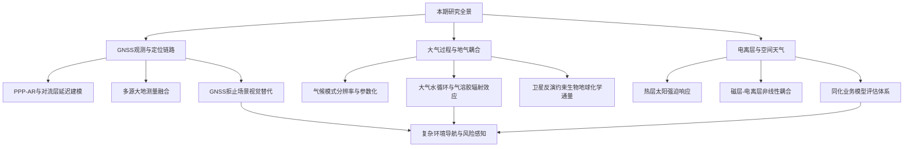
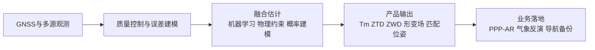
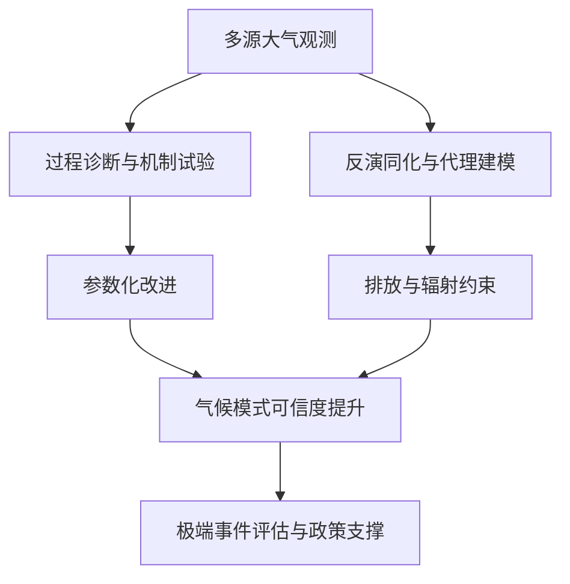
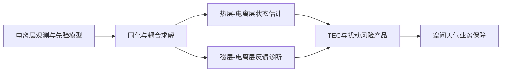
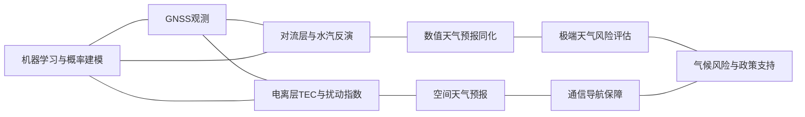
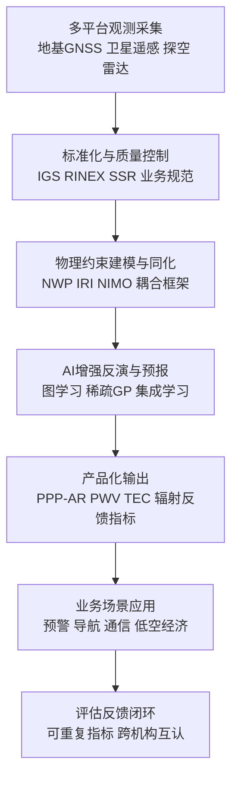

本期统计窗口为 2026-04-22 至 2026-04-29，共纳入 32 篇相关论文。文献分布呈现出清晰的“观测能力提升—多源融合建模—业务化评估”主线，其中大气方向在过程机理与观测反演两端同步推进，GNSS方向集中于实时建模与高精定位鲁棒性，电离层方向强调同化运行与耦合机理的可计算化。与近期国际业务体系进展相呼应，IGS 在 PPP-AR 与 SSR 互操作规范上的持续完善、WMO G3W 对全球温室气体通量业务化监测的推进、NOAA GloTEC 与 IRI 系列模型的协同应用，正在共同推动“地基观测、星载观测、模式同化、风险服务”一体化演进。

## 一、本期研究印记图

从研究问题结构看，本期工作可归纳为三个层级。第一层是观测与反演能力层，重点解决数据密度、观测几何和时空分辨率约束。第二层是机理与模型层，围绕大气边界层夹卷、海气湿能交换、热层太阳强迫响应、磁层—电离层非线性反馈等关键过程开展机制性研究。第三层是应用与服务层，关注高精定位、降水短临预报、空间天气保障与气候风险评估。该分层结构与当前国际组织“观测标准化—产品可比性—业务可复用性”的路线一致，显示领域正在从单点方法优化转向系统工程优化。

## 二、GNSS方向顶刊与特色论文专题画像

### 2.1 方向综述

GNSS 方向本期的核心变化是由“单点改进”转向“链路级稳健性设计”。一类工作面向实时业务，利用 GFS 预报场与 GNSS 反演天顶湿延迟构建区域对流层延迟场，为 PPP-AR 提供先验约束。另一类工作面向多源融合，使用多输出稀疏高斯过程统一 InSAR、LiDAR 与 GNSS 位移观测，显式给出不确定度传播。同时，GNSS 拒止环境下的语义视觉匹配研究说明高精定位体系正在形成“卫星导航与环境感知并行冗余”的技术格局。

| 代表性研究 | 技术路线 | 技术特点 | 重要结论 |
|---|---|---|---|
| VMF1-FC Tm 精化 | VMF1-FC 预报 + 梯度提升集成学习 | 降偏显著且全球泛化稳定 | GNSS-PWV 实时反演精度提升 |
| 区域实时对流层延迟建模 | GFS 与 GNSS-ZWD 融合建模 | 大范围实时更新 + PPP-AR联动 | 定位收敛速度与稳定性改善 |
| 多源大地测量融合 | 多输出稀疏高斯过程 | 近线性扩展 + 置信区间可解释 | 形变场反演一致性提升 |
| 语义视觉匹配替代链路 | 语义一致性筛选 + 几何联合优化 | 适配GNSS拒止场景 | 异构图像匹配鲁棒性增强 |

### 2.2 专题画像：VMF1-FC 预报加权平均温度全球精化

#### （1）技术路线
该研究以 2019 至 2021 年 319 个全球探空站资料为训练基础，将 VMF1-FC 给出的预报加权平均温度作为先验输入，联合经纬度、椭球高、年积日等地理时序特征，构建 XGBoost、LightGBM 与 CatBoost 三个集成学习精化模型。研究流程先对原始 VMF1-FC 误差结构进行分带评估，确认其整体 RMSE 可控但系统偏差仍存在，再通过监督学习将“模式偏差项”显式映射为可校正量。验证阶段采用 2022 年独立样本，避免训练期信息泄漏，确保结果具备外推可信度。

#### （2）技术特点
技术特点在于将传统经验模型与机器学习校准以“可解释输入特征”耦合，而非直接端到端替代。该策略保留 VMF1-FC 的物理一致性框架，同时利用集成树模型处理不同纬度带和不同高程区间的非线性偏差。结果显示三种模型均将偏差压缩到近零水平，且在时间尺度、纬度分区与高程分区上保持稳定。该设计有利于在 GNSS 气象业务系统中快速接入，因为其输入变量均可由现有流程实时获取，工程迁移门槛较低。

#### （3）重要结论
该研究的重要结论是：对 VMF1-FC 进行全球集成学习精化后，Tm 偏差可显著收敛，RMSE 相较原模型与 GPT3 均有明显下降，从而提升基于 ZWD 转换 PWV 的实时可靠性。结论的应用意义在于，GNSS 气象链路中的关键中间变量可通过低代价模型校准获得显著收益，这将直接改善降水临近预报、区域水汽监测和极端天气过程诊断中对 PWV 时效性与一致性的要求。

### 2.3 专题画像：GFS 与 GNSS-ZWD 融合的区域实时对流层延迟建模

#### （1）技术路线
研究围绕“广域实时建模”目标，将 GFS 预报场作为背景场，再将地面 GNSS 反演的 ZWD 作为观测增量进行融合，形成可用于 PPP-AR 的对流层延迟动态格网。整体流程包括背景场构建、增量场估计、时序平滑更新和定位解算验证四个阶段。作者采用面向大区域的统一参数体系，避免城市级经验参数难以泛化的问题，并通过实时更新机制评估模型在不同气象条件下的稳定性。

#### （2）技术特点
该工作的突出特征是把 NWP 先验和 GNSS 近实时观测置于同一建模框架中，使延迟场既具备大尺度动力背景，又具备局地观测敏感性。与纯经验模型相比，该方法在锋面过境和水汽突变条件下更能保持连续性；与仅依赖气象模式的方案相比，GNSS 观测增量可有效修正模式位相偏差。对于 PPP-AR 业务，延迟先验质量直接决定收敛效率与残差稳定性，该研究在链路层面给出了可复制范式。

#### （3）重要结论
该研究的重要结论是：融合 GFS 与 GNSS-ZWD 的区域实时模型能够提升 PPP-AR 在大范围场景下的定位稳定性与时效表现，特别是在复杂天气背景下的解算连续性更优。其意义在于，GNSS 高精定位与气象同化不再是并行孤立流程，而可通过共享延迟场实现双向增益，为智能交通、无人系统与应急导航等高可靠定位场景提供更强支撑。

### 2.4 专题画像：多输出稀疏高斯过程的大地测量融合

#### （1）技术路线
论文将多源形变观测统一为半参数潜在因子模型，使用线性观测映射连接各传感器数据与三维位移场，再以多输出高斯过程描述位移分量空间相关结构。为适应区域尺度大数据，作者并行使用 IVM 活跃集与 SVGP 诱导点两种稀疏策略，前者强调快速信息筛选，后者强调全局变分近似。研究在 Sparta 与 Meinong 地震形变案例中融合 InSAR 与 LiDAR 或 GNSS 资料，验证了融合场在空间连续性与置信区间表达上的优势。

#### （2）技术特点
该方法的核心价值是将“数据融合”从经验拼接提升到概率图模型层面的统一估计框架。传统做法常将不同观测单独反演后再做后处理，难以一致传播不确定度；而多输出稀疏 GP 能在模型内部完成多传感器约束整合，并显式输出空间化误差。其计算复杂度通过活跃集和诱导点压缩到可部署规模，为未来高频时序融合奠定基础，特别适用于地震、火山与地面沉降等需要持续监测的地球动力学场景。

#### （3）重要结论
该研究的重要结论是：多输出稀疏高斯过程可在不依赖预设地球物理过程模型的前提下，实现多源形变数据的高一致性融合并给出稳健不确定度评估。其意义在于，为 GNSS 与遥感、激光测量等观测系统的协同反演提供了可扩展范式，有助于将“监测结果展示”提升为“风险概率表达”，增强灾害链评估的量化能力。

### 2.5 专题画像：SemGeoFrame 语义视觉匹配框架

#### （1）技术路线
该研究针对 GNSS 拒止环境下无人机视觉定位中的异构视角匹配难题，先通过语义分割概率构建先验，再用 Jensen-Shannon 散度进行语义一致性筛选，剔除伪匹配候选。随后引入置信度引导的分区采样策略，保证匹配点在空间与语义类别上的均衡分布，最终在几何约束、语义约束和置信度约束联合优化下完成单应估计。实验在多数据集上与 ORB、SuperPoint、LoFTR 等主流方法对比，评价多时效与多场景鲁棒性。

#### （2）技术特点
技术创新体现在把语义信息从“后验解释变量”前移为“前置筛选约束”，显著降低跨视角尺度变化和纹理退化条件下的误匹配率。该方法还采用可插拔设计，不依赖特定底层特征提取器，因而可与不同视觉里程计链路兼容。对于导航系统工程，SemGeoFrame 的价值不在于替代 GNSS，而在于作为冗余子系统提升失锁场景下的姿态解连续性，符合高可靠导航体系的多模态融合趋势。

#### （3）重要结论
该研究的重要结论是：引入语义一致性与置信度约束后，异构图像匹配准确率和鲁棒性均明显提升，可有效支撑 GNSS 拒止环境下的视觉定位任务。其影响在于，未来综合导航系统将更加依赖“卫星导航 + 感知定位”协同架构，GNSS 研究边界正向环境感知与智能决策延展。

## 三、大气方向顶刊与特色论文专题画像

### 3.1 方向综述

大气方向本期突出两个科学动向。其一是“机制可解释性回归”，例如海气湿能交换过程、边界层夹卷深度依赖、冰过饱和区卷云调整等研究均通过过程试验或 LES 对机制链条进行分解。其二是“观测驱动反演能力提升”，包括 IASI 甲醇反演、NO2 代理反演 N2O 排放、激光雷达与探空联合 PM2.5 预报等。Science 论文关于亚马孙森林损失的全天空 TOA 冷却反馈进一步显示，陆面变化与云辐射反馈已成为气候影响评估中的关键不确定源。

| 代表性研究 | 技术路线 | 技术特点 | 重要结论 |
|---|---|---|---|
| AWI-CM3 分辨率敏感性 | 低中分辨率耦合气候模式对比 | 极区与中尺度过程改善显著 | 中分辨率长期积分可降结构不确定性 |
| 海气湿能交换机制 | 从第一性原理构建传输方程组 | 避免经验能量修正器 | 蒸发过程温度响应更物理一致 |
| 亚马孙森林损失反馈 | 多源卫星长期观测归因 | 云反馈贡献可与地表增亮同量级 | TOA 短波冷却受云过程显著放大 |
| PM2.5 辐射效应与降水 | 地基与卫星联合 + 机器学习解释 | 垂直结构与环流因子并重 | 污染辐射效应在降水中具同等级影响 |
| 青藏高原水循环变化 | 拉格朗日水汽追踪 + 情景模拟 | 外源输送与内源蒸发分解 | 区域水文联系在增暖下增强 |
| IASI 甲醇反演 | 卫星柱浓度 + 化学传输反演 | 偏差订正 + 多观测交叉验证 | 生物源甲醇排放估计上调 |
| NO2 代理反演 N2O | 机载共观测建立排放比 | 卫星 NO2 转换 N2O 区域通量 | 农田 N2O 可由空间代理约束 |
| FORUM 粉尘敏感性 | FIR 伪观测与 Jacobian 分析 | 识别 MIR 之外信息增量 | 高空粉尘监测能力将增强 |

### 3.2 专题画像：AWI-CM3 分辨率敏感性评估

#### （1）技术路线
研究对 AWI-CM3 的低分辨率与中分辨率配置进行平行长期积分，重点比较关键气候变量偏差、海冰变化、海洋环流与海气耦合过程表现。评估体系采用与 CMIP6 多模式均值对照的统一指标，并在极区及强中尺度动力区域进行局地剖面检验，避免仅使用全球平均掩盖关键差异。作者进一步讨论年际变率变化，并提出需通过多成员集合检验其统计稳健性。

#### （2）技术特点
该工作体现“分辨率与参数化协同优化”的现代模式发展理念。中分辨率并非简单网格加密，而是在可承受计算成本下提高对中尺度涡、海冰边缘带和海气交换细节的解析能力。结果显示中分辨率配置对结构性偏差压缩有效，尤其在极区和中尺度活动区表现突出。其方法学优势在于把工程可行性与科学收益同时纳入评估，适配 CMIP7 阶段对长时序、可比较、可复现实验设计的要求。

#### （3）重要结论
该研究的重要结论是：在 AWI-CM3 框架下，中分辨率耦合模拟能够系统改善关键气候过程再现能力，并为降低未来气候投影结构不确定性提供可执行路径。其意义在于，下一代气候模式发展应采用“适度分辨率提升 + 物理过程校正 + 集合评估”组合路线，而非单维度追求极高分辨率。

### 3.3 专题画像：海气湿能交换机制重构

#### （1）技术路线
论文从热力学守恒与相变能量收支的一致性出发，重构海气湿能交换机制，并将新的温度与水质量倾向表达写成简化常微分方程箱体模型，随后与现有 E3SM 机制对照。研究通过机制层面的可解析模型先验证物理合理性，再讨论其向复杂地球系统模型参数化迁移的可行性。该两级策略有助于识别经验修正器掩盖的系统性偏差来源。

#### （2）技术特点
技术上最关键的改进是将蒸发潜热分配和空气温度响应置于一致热力学框架，不再依赖外加能量修正器保持数值稳定。该处理显著增强了过程可解释性，并降低参数化“补丁化”风险。与传统方案相比，新机制更能反映蒸发事件中的瞬态温度变化方向与幅度，为后续云—辐射反馈模拟提供更可靠底层过程支撑。

#### （3）重要结论
该研究的重要结论是：采用第一性原理约束的湿能交换机制可以在保持能量守恒的同时改进蒸发事件中大气温度响应模拟。其影响在于，海气界面参数化有望从经验调参模式转向物理一致模式，从而提高气候模式在极端降水和热浪耦合背景下的可信度。

### 3.4 专题画像：亚马孙森林损失的全天空 TOA 冷却反馈

#### （1）技术路线
该 Science 研究基于二十年多源卫星资料，对森林损失比例与顶层大气短波、长波辐射变化进行协同归因。研究并未仅使用晴空假设，而是显式纳入云反馈，区分地表增亮与云过程贡献，构建“地表—云—辐射”一体化诊断框架。通过分区域损失强度分组，作者获得反馈强度随森林损失比例变化的定量关系。

#### （2）技术特点
该工作的特点在于把生物物理反馈评估从传统地表反照率单因子分析扩展到全天空辐射闭合。结果显示云导致的短波反照率增大可将冷却效应显著放大，这对现有陆面变化气候影响评估框架提出了修正需求。研究强调云反馈不是二级修正项，而是决定反馈符号与幅度的主导过程之一，具有直接方法学启发意义。

#### （3）重要结论
该研究的重要结论是：亚马孙森林损失对应的 TOA 冷却反馈在全天空条件下显著存在，且云过程贡献可与地表亮化同量级甚至更强。其意义在于，森林变化的气候效应评估必须纳入云反馈动态，否则将系统性低估陆地覆盖变化对区域与全球能量收支的影响。

### 3.5 专题画像：渤海地区 PM2.5 重污染辐射强迫与降水作用

#### （1）技术路线
研究整合地基观测、卫星资料与再分析数据，对 2014 至 2023 年秋冬季 PM2.5 重污染过程的辐射强迫进行分层估计，并通过机器学习识别关键控制因子。流程包含污染事件识别、晴空与全天空辐射分量拆解、垂直气象廓线关联分析、区域异质性评估。该设计使“污染—辐射—降水”链路由描述性分析转向可解释因子归因。

#### （2）技术特点
该研究在方法上强调垂直结构信息的重要性，指出不同高度温度逆温、等温层结和高空风场对地表污染与辐射强迫具有差异化作用。相比仅使用地面气象因子的传统统计模型，该框架能更准确捕捉污染过程中的动力与热力耦合。研究还显示在全天空条件下，污染辐射效应对降水的重要性可与垂直速度同量级，这一结论对区域短临预报和气候效应评估均具参考价值。

#### （3）重要结论
该研究的重要结论是：在渤海区域重污染事件中，PM2.5 辐射强迫不仅改变局地能量收支，还可显著参与降水形成过程的调制，且受垂直环流结构强烈控制。其意义在于，污染治理评估与天气业务预报应采用“排放控制 + 立体气象结构”联合诊断框架，才能准确评估污染事件的气象反馈效应。

### 3.6 专题画像：青藏高原大气水循环未来变化

#### （1）技术路线
论文使用拉格朗日水汽追踪方法，在 SSP245 与 SSP585 情景下分解青藏高原水循环中外源水汽输送和内源蒸发回补贡献。分析不仅覆盖高原本地降水变化，还追踪对周边流域的下游影响，从而构建“高原—周边流域”联动视角。通过不同分区统计，研究识别南部外流区与东北内流区的贡献机制差异。

#### （2）技术特点
相较传统欧拉平均诊断，该研究的优势在于能够定量区分水汽来源路径和汇区响应，提高机制解释清晰度。结果显示外源输送增强与本地蒸发增强并行存在，但在不同子区域中的主导权重不同。该结论提示未来高原水资源评估不能仅依据总降水变化，而需要基于来源结构变化评估水文可持续性风险。

#### （3）重要结论
该研究的重要结论是：增暖背景下青藏高原大气水循环显著增强，并强化与周边流域的水文连接，其中外源输送与内源蒸发在不同分区贡献结构存在系统差异。其意义在于，区域适应策略需从单区域管理转向跨流域协同治理，提升对未来水资源重分配风险的预判能力。

### 3.7 专题画像：IASI 反演全球甲醇排放

#### （1）技术路线
研究使用更新后的 IASI 甲醇柱浓度反演，结合 MAGRITTE 化学传输模型进行排放优化，并利用机载观测与多站点 FTIR 数据交叉验证。流程首先进行卫星偏差订正，再在反演框架中估计陆地生物源排放，最后比较与既有自上而下估计的差异。该路径实现了“卫星观测—化学传输—排放反演—独立观测校验”的闭环。

#### （2）技术特点
该工作的关键特点是将偏差订正与干沉降参数修正联动处理，避免将模式结构误差错误归入排放信号。结果提示热带生态系统排放季节性控制因子在现有 MEGAN 参数化中仍有改进空间。其方法学价值在于，痕量气体反演必须同步处理观测偏差与过程参数不确定性，才能获得稳定可解释的排放变化结论。

#### （3）重要结论
该研究的重要结论是：经偏差订正与反演优化后，全球生物源甲醇排放估计高于既有多项研究，并显示热带区辐射与温度控制作用可能被低估。其意义在于，未来大气化学模式需要重新评估关键前体物排放参数化，以提高对臭氧和二次有机气溶胶形成的模拟准确度。

### 3.8 专题画像：基于 NO2 的农田 N2O 排放代理反演

#### （1）技术路线
研究利用机载共观测建立农田 N2O 与 NOx 排放比关系，再将 TROPOMI NO2 反演得到的 NOx 排放转换为 N2O 区域排放估计，并与地面和机载独立研究进行对比验证。该流程通过“可观测代理变量”绕过当前卫星难以直接解析近地 N2O 弱信号的技术瓶颈，形成可操作的通量估计路径。

#### （2）技术特点
方法创新在于将土壤微生物过程导致的共排放机制转化为观测可用关系式，并通过多区域验证降低经验关系外推风险。该方案并未否认直接观测价值，而是提供过渡阶段的规模化监测策略。对于农业温室气体清单核算，该方法可作为独立约束来源，与自下而上清单相互校验，提高区域排放估计可信度。

#### （3）重要结论
该研究的重要结论是：在农田场景下，基于卫星 NO2 的代理反演可得到与独立观测总体一致的 N2O 排放估计，具备区域尺度应用潜力。其意义在于，农业温室气体监测正从点位试验走向空间化、连续化评估，为减排政策效果核查提供新的观测证据链。

### 3.9 专题画像：FORUM 任务对粉尘的远红外敏感性

#### （1）技术路线
研究构建 FORUM 伪观测模拟器，比较远红外与中红外波段对不同粉尘矿物组成、垂直分布和负荷条件的敏感性，通过光谱特征与 Jacobian 分析识别信息增量来源。该框架用于预评估未来载荷在关键大气过程监测中的观测价值，并对干扰气体影响进行情景化测试。

#### （2）技术特点
技术特点是将“任务设计评估”前置到信息内容层面，而非仅比较检索后误差。结果显示在中远程输送且位于自由对流层至上对流层条件下，远红外可贡献显著额外灵敏度，并减弱水汽干扰影响。该认识对下一代气溶胶与辐射耦合观测任务设计具有直接指导价值。

#### （3）重要结论
该研究的重要结论是：FORUM 远红外观测在特定粉尘输送场景中可提供中红外之外的关键信息增量，显著提升高空粉尘识别与定量约束潜力。其意义在于，未来卫星反演体系应采用多波段协同策略，以提升对辐射强迫敏感组分的监测能力。

## 四、电离层方向顶刊与特色论文专题画像

### 4.1 方向综述

电离层方向本期呈现“机理强化与业务评估并重”特征。GRL 两篇研究分别聚焦热层对太阳 27 天旋转强迫的实测响应和磁层—电离层反馈不稳定性的非线性演化，强化了耦合系统的过程认识。Annales Geophysicae 的 NIMO 论文则将同化模型能力验证推进到可重复、可比较的指标体系层面，体现空间天气业务化从“模型可运行”走向“性能可审计”。

| 代表性研究 | 技术路线 | 技术特点 | 重要结论 |
|---|---|---|---|
| ICON/MIGHTI 热层温度响应 | 观测温度剖面与太阳 EUV 对比 | 直接量化 27 天信号幅值 | 低热层太阳强迫可能被低估 |
| M-I 反馈非线性陀螺动理学模拟 | 自洽耦合扰动演化与粒子加速 | 同步描述结构变形与能量转移 | 反馈不稳定性与电子加速协同发生 |
| NIMO 业务同化模型评估 | IDA-4D 同化 + 指标化验证 | 模型无关可复验评估体系 | 业务化电离层预报可比性增强 |

### 4.2 专题画像：地球热层太阳强迫强度评估

#### （1）技术路线
研究基于 NASA ICON 任务 MIGHTI 仪器在 90 至 133 km 的白天温度剖面，分析其与太阳极紫外通量之间的相关关系，并与 TIEGCM-ICON 模型结果对比。作者将重点放在 27 天太阳自转周期信号，通过分高度相关分析与振幅估计识别模型与观测的系统偏差。该流程将“观测证据”直接映射到“模式响应幅值”，可用于检验热层参数化的敏感性配置。

#### （2）技术特点
该研究优势在于使用同一时期、同一物理过程导向的观测与模式并置诊断，避免跨数据源引入额外不一致。结果显示在 133 km 处观测温度振幅明显高于模式，且 110 km 附近模式相关性明显减弱，提示低热层太阳强迫响应仍存在低估。该结论对上层大气能量收支参数化和空间天气响应预报均具有基础价值。

#### （3）重要结论
该研究的重要结论是：低热层对太阳活动 27 天周期强迫的实际响应强度可能高于当前模式预估。其意义在于，热层—电离层耦合模型需要重新审视太阳强迫输入与能量沉积分配参数，以提升对轨道阻力变化、通信链路扰动和电离层状态演化的预测能力。

### 4.3 专题画像：磁层—电离层反馈耦合的非线性陀螺动理学模拟

#### （1）技术路线
论文将非线性陀螺动理学方法引入磁层—电离层反馈耦合系统，联合求解电子密度、电势与场向电流扰动演化，追踪极光结构形成与电子加速过程。模拟从线性增长阶段延展到非线性变形阶段，考察波粒相互作用下电磁场能量向电子动能转移路径。该框架突破了传统线性近似在复杂反馈系统中的适用边界。

#### （2）技术特点
技术特点在于实现结构演化与粒子加速的自洽计算，能够在同一模型中刻画反馈不稳定性、场平行电场增强和电子加速之间的耦合关系。尽管当前加速量级尚不足以完全解释 Alfvén 极光全部特征，但研究已证明模型具备扩展到更完整机制的可行性。其价值在于提供了将微观波粒过程纳入宏观空间天气模型的路径。

#### （3）重要结论
该研究的重要结论是：磁层—电离层反馈不稳定性可在非线性阶段驱动极光结构重构，并同步触发电子加速过程。其意义在于，未来空间天气风险评估可基于更高物理一致性的耦合模型构建，从“经验统计预警”逐步过渡到“机理约束预报”。

### 4.4 专题画像：NIMO 下一代电离层业务模型验证

#### （1）技术路线
NIMO 采用 IDA-4D 同化方案融合近实时电子密度观测，并以 SAMI3 物理框架处理电离层化学与输运过程，实现回报、临近报与预报一体化。研究重点不止于模型结构说明，还构建了模型无关的量化验证指标集，使用公开观测开展可重复评估。该流程强调“同化系统能力”与“评估标准透明”同步建设。

#### （2）技术特点
与上一代耦合系统相比，NIMO 的主要优势在于适应性和可比较性。适应性体现在多源观测接入与并行计算效率，能够满足业务运行时效；可比较性体现在指标体系标准化，使不同经验模型、物理模型和同化模型可在统一基线上进行性能对照。该特点直接回应当前空间天气业务端对“可审计产品质量”的需求。

#### （3）重要结论
该研究的重要结论是：在统一指标框架下，NIMO 展示出较好的业务运行潜力，并为不同类型电离层模型提供了可复现的性能比较基准。其意义在于，电离层业务化将进入“模型竞争与协同并行”的阶段，标准化评估体系将成为提升预报可信度和跨机构互认能力的关键基础设施。

## 五、交叉学科网络图与创新链流程图

### 5.1 交叉学科网络图

### 5.2 创新链流程图

## 六、近期研究特色变化与未来发展趋势

近段时间的共同特征是“标准体系牵引下的模型融合化”。GNSS 侧以 IGS PPP-AR、SSR 与 RINEX 4.02 等标准持续完善为基础，研究焦点从单算法精度扩展到跨星座、跨机构产品互操作。大气侧在 WMO G3W 推进背景下，观测反演研究更加重视通量可核算性与业务时效。电离层侧则出现 NOAA GloTEC 与 IRI 背景模型协同、NASA ICON 观测驱动机理修正、NIMO 指标化评估并行推进的局面。三者共同指向“观测—同化—预报—验证”闭环加速形成。

未来发展趋势可归纳为四点。第一，GNSS 与大气、电离层产品将持续向实时化和概率化升级，单值产品将逐步被“估计值 + 不确定度”表达替代。第二，跨圈层耦合建模将成为主流，尤其在强对流、地磁扰动和极端事件复合场景中，独立单圈层模型难以满足业务需求。第三，AI 方法将更多承担偏差订正、特征提取和快速代理计算角色，但物理一致性约束将成为可部署前提。第四，评估标准化和开源可复现将直接影响成果转化效率，具备统一指标、公开数据接口和工程部署文档的研究更易进入业务链路。

## 七、参考文献

1. Zapponini, M., Semmler, T., Streffing, J., Rackow, T., Roach, L. A., & Jung, T. (2026). Assessing resolution sensitivity in coupled climate simulations with AWI-CM3. Geoscientific Model Development. DOI: 10.5194/gmd-19-3395-2026  
2. Guba, O., Sharma, A., Taylor, M. A., Eldred, C., Bosler, P. A., & Roesler, E. L. (2026). On moist ocean-atmosphere coupling mechanisms. Geoscientific Model Development. DOI: 10.5194/gmd-19-3375-2026  
3. Dror, T., & Feingold, G. (2026). Amazon forest loss: An all-sky biophysical top-of-atmosphere cooling feedback. Science. DOI: 10.1126/science.adz8296  
4. Zhu, J., Wang, Y., Yue, X., Che, H., Xia, X., Lu, X., Tian, C., & Liao, H. (2026). The radiative forcing of PM2.5 heavy pollution and its importance to precipitation in the Bohai Rim during 2014-2023. Atmospheric Chemistry and Physics. DOI: 10.5194/acp-26-5679-2026  
5. Zhang, Y., Zhang, C., Yang, M., & Zhong, D. (2026). Future changes in the atmospheric water cycle over the Tibetan Plateau. Geophysical Research Letters. DOI: 10.1029/2026GL121860  
6. Müller, J.-F., Stavrakou, T., Franco, B., Clarisse, L., Amelynck, C., Schoon, N., et al. (2026). Global atmospheric methanol emissions inferred from IASI satellite measurements and aircraft data. Atmospheric Chemistry and Physics. DOI: 10.5194/acp-26-5375-2026  
7. Adams, T. J., Plant, G., & Kort, E. A. (2026). Deriving cropland N2O emissions from space-based NO2 observations. Atmospheric Chemistry and Physics. DOI: 10.5194/acp-26-5517-2026  
8. Sellitto, P., Eremenko, M., Formenti, P., Alalam, P., Höpfner, M., & Di Biagio, C. (2026). Sensitivity of the FORUM mission to dust aerosols: A pseudo-observations analysis. Atmospheric Measurement Techniques. DOI: 10.5194/amt-19-2751-2026  
9. Cao, L., Sang, J., Li, F., & Zhang, B. (2026). Global ensemble learning-based refined models for VMF1-FC forecasted weighted mean temperature. Remote Sensing. DOI: 10.3390/rs18091315  
10. Cui, B., Du, S., Li, Z., Huang, G., Wang, L., & Zhang, Q. (2026). Real-time tropospheric delay modeling over large areas by integrating GFS forecasts and GNSS-derived ZWD for enhanced PPP-AR positioning. GPS Solutions. DOI: 10.1007/s10291-026-02081-1  
11. Szymanski, E. D., Szymanski, L. J., & Hetland, E. A. (2026). Geodetic data fusion using multi-output sparse Gaussian processes. Geophysical Journal International. DOI: 10.1093/gji/ggag109  
12. Luo, Z., Liu, Y., Liu, C., Kong, M., Yang, D., Zhou, M., & An, C. (2026). SemGeoFrame: A visual matching framework for aircraft based on surface semantic information. Remote Sensing. DOI: 10.3390/rs18091267  
13. Stevens, M. H., Jones, M., Evans, J. S., Harding, B. J., Dhadly, M. S., & Immel, T. J. (2026). On the strength of solar forcing in the Earth's thermosphere. Geophysical Research Letters. DOI: 10.1029/2025GL121012  
14. Watanabe, T.-H., Fujita, K., & Maeyama, S. (2026). Nonlinear gyrokinetic simulation of the magnetosphere-ionosphere feedback coupling. Geophysical Research Letters. DOI: 10.1029/2026GL121734  
15. Burrell, A. G., McDonald, S., Hickey, D., Burleigh, M., Nossa, E., Metzler, C. A., Dhadly, M., Tate, J. L., & Wagner, E. J. (2026). Next-generation ionospheric model for operations: Validation and demonstration for space weather and research. Annales Geophysicae. DOI: 10.5194/angeo-44-303-2026  
16. International GNSS Service. (2025). Formats and standards. IGS. https://igs.org/formats-and-standards/  
17. International GNSS Service PPP-AR Working Group. (2025). Precise Point Positioning with Ambiguity Resolution. IGS. https://igs.org/wg/ppp-ar/  
18. World Meteorological Organization. (2024). Global Greenhouse Gas Watch Programme. WMO. https://wmo.int/activities/global-greenhouse-gas-watch/global-greenhouse-gas-watch-programme  
19. International Reference Ionosphere Team. (2024). International Reference Ionosphere (IRI) model. IRI. https://irimodel.org/  
20. NOAA NCEI. (2025). Total Electron Content (US-TEC and GloTEC). NOAA. https://www.ncei.noaa.gov/products/space-weather/ionospheric-program/total-electron-content  
