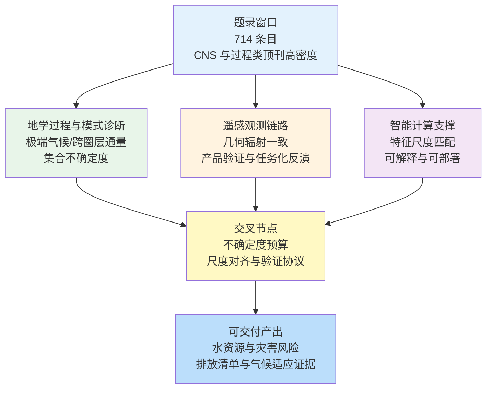
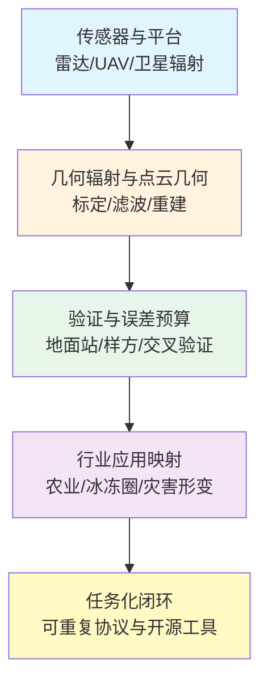
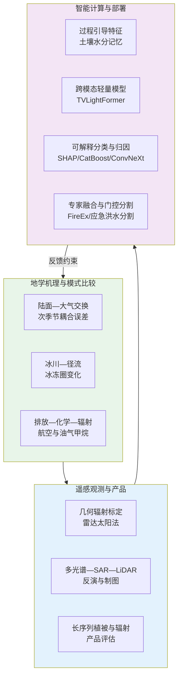

在 2026-04-28 至 2026-05-05 这一周窗口内，题录聚合显示共有 714 篇论文条目，其中 Cell、Nature、Science 系列条目 160 篇，地学与大气海洋类顶刊及遥感特色期刊条目 240 篇。与此前数周相比，本期条目更集中地体现为三类可并行追踪的科学链条：其一，以过程机理与模式比较为核心的地学问题，强调极端事件、跨圈层通量与模式不确定度的同步披露；其二，以几何—辐射—时空一致性为核心的遥感方法学，强调复杂地表条件下的产品验证、误差预算与任务化工程实现；其三，以特征构造、跨模态对齐与部署约束为核心的智能计算方法，强调在缺测、偏移与算力受限条件下仍保持可解释、可审计的推断链条。

## 一、引言

近一周公开题录所呈现的研究活动，在地学一侧继续沿“观测约束—过程分解—模式集合诊断”展开，典型论题包括森林干旱死亡格局、热带上层对流槽与热带气旋环境、冰川与积雪融水对流域水资源的影响、航空排放对臭氧与气溶胶辐射强迫的贡献、亚洲矿物尘钙组分混合状态、油气盆地甲烷强度、火烧严重程度对碳排放估算的约束，以及次季节尺度海气耦合误差来源等。遥感一侧则体现为从传感器网络校准、辐射通量产品评估、作物制图与物候响应，到 InSAR 形变去噪、TomoSAR 城市三维重建、MLS 森林清查与 UAV 点云处理等全链路方法更新。智能计算一侧并非孤立存在，而是与上述链条在“数据选择—尺度匹配—不确定度传播”处发生实质性耦合，例如土壤水分记忆对蒸散与总初级生产力预测的贡献差异、SAR 视觉语言定位的轻量化设计、ICESat-2 与 SHAP 的可解释海岸分类、野火蔓延的专家融合网络、面向卫星互联网终端的洪水分割，以及面向全球建筑洪涝脆弱度的多源遥感指标融合等。

公开文献与综述性资料表明，遥感基础模型正由单模态向多模态与高频时序表征扩展，以缓解数据异质性与任务碎片化带来的适配成本；与此同时，地学模式比较研究更强调在“可重复的多模式协议”下解释集合离散度来源。将题录中的具体研究与上述宏观脉络对齐，有助于把单篇论文的技术贡献放回可检验的科学问题与工程约束之中。

## 二、本期研究印记图

本期题录在时间上覆盖 2026-04-28 至 2026-05-05，在空间与过程尺度上同时触及冠层—大气界面、流域冰川—径流系统、海洋次季节变率、以及油气与航空等人为排放通道。若干研究共同强调“过程异质性必须在数据模型中被显式表达”，例如森林干旱死亡中树皮甲虫聚集死亡的环境指示、或火烧严重程度对即时碳排放与未燃烧死亡生物量的分配效应。遥感产品评估研究则反复回到可比性原则，即在地面辐射站稀缺地区，卫星日平均短波辐照度产品仍普遍存在正偏差，需要通过简单回归校准显著降低偏差与均方根误差。

在方法形态上，题录显示“机理模型与统计学习并行、并在不确定度语义上对接”的趋势加强。机理路径继续通过多模式比较、敏感性试验与预算分解提供可解释的中间量；学习路径则更多以“面向过程的特征工程”出现，例如用土壤水分记忆表征深层根区控制、用形态特征解释高纬度海岸类型判别、或用多专家网络分别吸收燃料与天气模态。公开技术综述亦指出，遥感基础模型需要在跨模态对齐、跨域泛化与能效之间取得新的平衡，从而支撑持续增长的地球观测数据吞吐。

## 三、地学方向

### 3.0 方向综述与结构关系

地学条目在本期题录中突出表现为“极端事件后果的空间异质性”和“人为排放—化学—辐射强迫链条的多模式一致性检验”。森林干旱死亡研究利用卢森堡全国高分辨率单木冠层死亡数据，说明聚集性死亡过程对针叶林格局具有支配意义；热带气旋研究则把未来环境变化重新表述为热带上层对流槽（TUTT）形态变化与可预报模式误差之间的耦合问题。冰川与积雪研究在上阿姆河支流流域给出面积亏损与季节性积雪反照率下降的长期背景；航空排放研究给出 NOx 净有效辐射强迫的模型均值及硝酸盐与硫酸盐负强迫的补偿结构；亚洲尘研究给出细粒子钙组分以可溶涂层形式存在的比例约束；MethaneSAT 研究给出跨盆地甲烷通量与强度量级差异；火烧碳核算研究把混合严重程度引入国家尺度碳监测体系；次季节海气耦合研究用湿静力能收支与格兰杰因果揭示耦合过强及潜热通量误差来源。

**表1 地学方向代表性研究的技术路线与要点**

| 研究主题 | 技术路线 | 技术特点 | 重要结论线索 |
| --- | --- | --- | --- |
| 干旱期冠层死亡驱动 | 全国尺度高分辨率死亡制图 + GAM | 聚集死亡指示生物干扰 | 针叶林格局受树皮甲虫相关聚集过程强烈影响 |
| TUTT 与热带气旋环境 | CMIP6 集合 + d4PDF 高集合 | 模式间离散度与半球不对称海温增暖关联 | 中北太平洋更利于生成发展，北大西洋与墨西哥湾相对不利 |
| 瓦赫什河流域冰川 | 多源遥感 + GIS + 气候趋势 | 涌浪冰川占比高 | 2000—2025 冰川面积减少约 10.94% |
| 航空排放气候效应 | 五模式比较 + 对流层平流层化学 | NOx 与气溶胶强迫符号分离 | NOx 净强迫约 +18.3 mW m⁻²（模式均值） |
| 亚洲尘钙可溶涂层 | 单颗粒自动微分析 + 透析 | 质量与数浓度双指标 | 细粒子中可溶钙涂层占比高，缓冲效应评估需更新 |
| 油气盆地甲烷 | MethaneSAT 反演 + 清单对比 | 高空间分辨率 swath | 盆地间通量差一个量级，清单系统性低估 |
| 火烧严重程度碳排放 | 野外观测 + 卫星烧伤严重度 + 子模型 | 区分未燃烧死亡生物量 | 新方案相对旧方案区域排放可降低 10%—25% |
| MJO 次季节预报 | UFS P8 预报 + MSE 收支 + 因果诊断 | 海气耦合过强 | 潜热通量误差与风场偏差指向分辨率与上层海洋混合 |

### 3.1 专题画像：卢森堡针叶与阔叶林在 2018—2020 夏季干旱期的冠层死亡驱动

**（1）技术路线：从全国连续死亡制图到可加性模型分解**

Schwarz 等（2026）以卢森堡全国范围、单木分辨率且空间连续的冠层死亡数据集为基础，针对 2018—2020 年夏季干旱事件构建广义可加模型，用以量化森林结构、死亡聚集与扩散、地形与土壤等驱动因子对针叶林与阔叶林冠层死亡空间变异的贡献。研究将死亡过程显式区分为生物干扰聚集信号与立地结构信号，并在国家尺度上保持空间可比性，从而避免传统样地外推对空间协方差结构的破坏。

**（2）技术特点：高分辨率数据揭示生物干扰主控格局**

与仅强调地形或土壤干旱暴露度的研究相比，该工作把“聚集性死亡”作为独立解释维度纳入统计框架，使树皮甲虫等生物干扰过程能够在空间上被识别为针叶林死亡的主导组织因子。模型解释率在不同林型间存在差异，提示阔叶林死亡机制更分散、更难用单一结构变量捕捉，这一差异本身构成对管理干预优先级排序的约束。

**（3）重要结论：空间格局由聚集死亡与树高共同塑造**

该研究的重要结论是：**在 2018—2020 年夏季干旱期，针叶林冠层死亡空间变异的约 44.7% 可由模型解释，其中与聚集死亡相关的环境指示因子影响最强，树高在针叶与阔叶两类森林中均与更高死亡风险相关，而地形与土壤相关驱动解释力有限。**

对区域森林适应与灾害监测而言，该结论意味着风险制图不应仅基于地形干旱指数，而应把生物干扰传播路径与林分结构高度一并纳入早期预警系统；对全球变化生态学而言，国家尺度连续死亡数据提供了可外推至中欧其他地区的统计模板，有助于在集合框架下比较不同地区干扰主控因子的相对权重。

### 3.2 专题画像：热带上层对流槽未来变化及其对热带气旋大尺度环境的含义

**（1）技术路线：CMIP6 集合气候态与未来差分叠加高集合可分辨样本**

Chang 等（2026）基于 45 个 CMIP6 模式集合平均，分析全球变暖下太平洋与大西洋热带上层对流槽（TUTT）形态变化，并将其与基于环境指数的潜在热带气旋活动变化相联系。研究进一步引入 d4PDF 高集合、可分辨热带气旋的样本，用以验证观测年际关系中投影结论的稳健性，同时评估 HighResMIP 子集合在 TUTT—热带气旋关系上的系统偏差。

**（2）技术特点：把“槽形态变化”作为理解 TC 环境演变的统一框架**

该框架把中纬度与热带强迫的共同调制显式纳入分析，而不是仅讨论海表温度阈值指标。研究同时强调模式间离散度与半球间海表温度增暖不对称之间的统计联系，从而把投影不确定度与可诊断的大尺度热力结构变化绑定。

**（3）重要结论：太平洋槽收缩与大西洋槽扩展重塑 TC 环境**

该研究的重要结论是：**多模式集合平均显示变暖气候下太平洋 TUTT 收缩、大西洋 TUTT 扩张，对应环境指数表明中北太平洋更有利于热带气旋生成与发展，而热带北大西洋与墨西哥湾环境趋于不利；CMIP6 在 TUTT 变化上存在显著模式间离散度，且 HighResMIP 中显式追踪热带气旋与 TUTT 关系表征不足，需谨慎用于未来风险研判。**

对季节到年代际尺度风险评估而言，该结论提示业务化台风气候预测需要把上层环流型变化纳入集合诊断指标；对模式发展而言，结果直接指向高分辨率试验中热带—中纬度相互作用与对流参数化协同改进的优先级。

### 3.3 专题画像：塔吉克斯坦瓦赫什河流域冰川变化与区域水资源背景

**（1）技术路线：多源遥感冰川编目叠加 GIS 与长序列气候分析**

Nasrulloev 等（2026）在 2000—2025 年窗口内对瓦赫什河流域冰川面积进行遥感监测，并结合 1970 年以来的气温趋势、积雪季节变化与地表反照率演化，讨论冰川变薄与径流过程之间的可能联系。研究同时统计涌浪型冰川的空间占比与前进距离，以刻画帕米尔地区冰川动力学异质性。

**（2）技术特点：把冰川面积亏损与雪冰反照率及吸光杂质趋势并置**

该方法强调冰川变化不仅是面积阈值问题，还与季节性积雪过程及颗粒物沉降相关。对涌浪冰川的识别使流域尺度结果避免被单一“退缩”叙事过度简化。

**（3）重要结论：冰川面积显著亏损且低海拔区变薄突出**

该研究的重要结论是：**2000—2025 年瓦赫什河流域冰川面积由约 4440.9 km² 降至约 3955.2 km²，损失约 485.7 km²（约 10.94%），流域内分布高度受坡向与海拔带控制，且长期变暖与反照率下降背景与冰川消融及融水径流影响相一致。**

对上阿姆河流域水资源规划而言，该结论支持将冰川动力学类型分区纳入长期供水预测；对冰冻圈监测网络设计而言，结果强调需要同时维护面积、厚度变化与季节性积雪遥感产品的一致性。

### 3.4 专题画像：航空 NOx 与气溶胶排放对大气成分与有效辐射强迫的模式比较

**（1）技术路线：五套全球模式开展一致协议敏感性试验**

Cohen 等（2026）组织包含对流层与平流层化学的五模式比较，评估航空 NOx、气溶胶及其前体物排放对臭氧、羟基自由基与气溶胶辐射效应的影响。研究分别给出 NOx 净有效辐射强迫、硝酸盐与硫酸盐形成导致的负强迫区间，并讨论不同气溶胶参数化方案导致的模式间差异。

**（2）技术特点：在臭氧响应上取得跨模式空间型一致**

与早期航空强迫评估相比，该工作把气溶胶直接效应与硝酸盐、硫酸盐间接路径并列，从而解释“NOx 正强迫被气溶胶负强迫大部分抵消”的机制结构。模式间差异被明确归因于气溶胶微物理与化学耦合细节。

**（3）重要结论：NOx 净强迫为正且气溶胶负强迫可大部分补偿**

该研究的重要结论是：**航空 NOx 对臭氧化学的净有效辐射强迫在模式平均上约为 +18.3 mW m⁻²（各模式介于约 +9.4 至 +24.5 mW m⁻²），考虑硝酸盐与硫酸盐粒子形成后分别约降低 35% 与 43%；气溶胶直接有效辐射强迫为负，介于约 −6.5 至 −17.8 mW m⁻²，可补偿大部分 NOx 正强迫，但气溶胶部分模式间离散度显著。**

对气候政策中的航空部门减排组合优化而言，该结论支持把 NOx 与颗粒物减排措施放在同一强迫核算框架内评估；对模式研发而言，研究明确列出需要增加模式数量与专门敏感性试验以压缩气溶胶不确定度。

### 3.5 专题画像：塔克拉玛干与戈壁盐蚀起尘过程中钙矿物的可溶涂层特征

**（1）技术路线：盐蚀起尘实验单颗粒表征结合水透析去除可溶组分**

Hu 等（2026）对两个沙漠盐蚀起尘过程产生的单颗粒样本进行自动微分析，并对透析前后颗粒进行数浓度与质量配比统计，用以识别钙元素在不同矿物相中的赋存形态。研究给出可溶钙占总钙质量分数区间，并统计钙氧富集与钙硫共存颗粒的涂层结构比例。

**（2）技术特点：把单颗粒混合状态与云凝结核缓冲效应评估直接连接**

与传统仅报告元素质量分数的沙尘化学分析相比，该工作强调亚微米模态与涂层结构对可溶钙释放的决定性作用，从而为酸缓冲与云微物理参数化提供更贴近真实混合状态的约束。

**（3）重要结论：细粒子钙大量以可溶涂层形式存在并可被透析去除**

该研究的重要结论是：**透析后 56.9%—88.2%（数浓度）含钙颗粒失去可溶钙组分，可溶钙可占元素钙总质量的约 19.6%—41.9%，且超过 73.2% 的钙氧富集与钙硫颗粒以可溶涂层形式附着于其他矿物表面。**

对区域空气质量与云降水模式而言，该结论要求沙尘化学成分参数化从“均质矿物颗粒”假设转向显式涂层结构；对遥感反演而言，结果提示在细粒子模态上光学—化学闭合需要额外约束可溶组分比例。

### 3.6 专题画像：MethaneSAT 揭示主要油气盆地甲烷排放强度与清单低估

**（1）技术路线：卫星高分辨率柱浓度反演叠加区域聚合统计**

Williams 等（2026）利用 MethaneSAT 在 2024—2025 年的观测，对六个油气产区进行甲烷排放量化，比较盆地之间通量与强度指标，并与 EPA-GHGI、EDGAR 等格网清单对照。研究强调 swath 宽度与像素尺度对识别空间异质排放的意义。

**（2）技术特点：在盆地尺度给出可与清单对齐的空间聚合口径**

与仅报告点源羽流的研究相比，该工作突出区域总量与强度归一化指标，并解释油气比例、基础设施年龄与低产井对强度差异的贡献。

**（3）重要结论：盆地间排放差一个量级且清单系统性偏低**

该研究的重要结论是：**不同油气产区甲烷排放率可相差一个量级以上，例如二叠纪盆地约 408 t h⁻¹（95% 置信区间约 303—516 t h⁻¹）而圣华金盆地约 30 t h⁻¹（约 20—41 t h⁻¹），甲烷强度在气体产量与能量归一化指标上亦呈一个量级差异，且格网清单在多个行政区尺度上系统性低于卫星反演。**

对甲烷减排履约与边际成本评估而言，该结论为“按盆地与行政区定制减排路径”提供观测证据；对排放清单编制而言，结果要求在下沉尺度上引入基础设施结构与生产强度协变量。

### 3.7 专题画像：加拿大森林碳监测体系中引入火烧严重程度的 FireDMs 子模型

**（1）技术路线：野外观测—卫星烧伤严重度—碳库分配耦合建模**

Thompson 等（2026）在国家森林碳监测核算体系（NFCMARS）中构建 FireDMs 子模型，将现场生物质消耗测量与卫星烧伤严重度图结合，区分燃烧消耗、存活与死亡未燃烧生物量库。研究给出不同生态区在低到高严重程度火烧后的即时碳排放范围，并与旧版单一高严重程度假设进行对比。

**（2）技术特点：把混合严重程度从“例外情形”提升为核算主路径**

该设计使火烧后碳释放与未燃烧死亡碳库在时间上可分账，从而更贴近真实火行为谱。与旧参数化相比，新方案在区域尺度上改变总排放估计的系统偏差方向。

**（3）重要结论：混合严重程度降低冠层消耗但增加地表消耗，净效应降低区域排放估计**

该研究的重要结论是：**引入混合严重程度后，直接碳排放总量相对旧方法在多个区域典型降低约 10%—25%，低严重度火烧可低至约 11 t C ha⁻¹，而高严重度太平洋滨海森林可超过约 60 t ha⁻¹，且新方案与火烟羽观测及 2023 火季年尺度排放具有更好一致性。**

对国家温室气体清单与森林经营策略而言，该结论支持把烧伤严重度制图作为碳核算的常规输入；对地球系统模式而言，结果为陆面扰动模块提供了可对比的“燃烧—死亡—残留”三分账结构。

### 3.8 专题画像：UFS P8 次季节预报中 MJO 湿静力能收支误差与海气耦合诊断

**（1）技术路线：再分析与耦合预报并行做 MSE 收支与通量分解**

Choi 等（2026）利用 UFS Prototype 8 次季节预报，对 MJO、开尔文波与赤道罗斯贝波分别构建湿静力能收支，并与 ERA5 对照。研究将表面潜热通量误差分解为风驱动与热力驱动部分，并用格兰杰因果检验海气耦合强度。

**（2）技术特点：把次季节误差归因到潜热通量与 SST 变率过强耦合**

与仅报告 MJO 振幅偏差的研究相比，该工作给出可诊断的通量误差结构，并将其与海岸带分辨率不足及上层海洋垂直混合参数化不确定性相联系。

**（3）重要结论：模式中海气耦合强于观测且 MJO 的 MSE 收支偏差主要源于潜热通量**

该研究的重要结论是：**UFS P8 虽能较好再现 MSE 与 SST 气候平均，但显著高估其季节内变率，尤其在海陆复杂区；MJO 的 MSE 收支相对 ERA5 偏差主要由表面潜热通量误差驱动，格兰杰因果显示 SST 对大气强迫过于敏感，提示上层海洋混合参数化对耦合强度具有重要贡献。**

对次季节预报业务化改进路线图而言，该结论把海洋边界层与海岸带风场偏差并列为优先修复项；对耦合模式物理一致性评估而言，研究提供了可复制的因果诊断模板。

## 四、遥感方向

### 4.0 方向综述与结构关系

遥感条目在本期题录中呈现“从传感器网络到地表参数再到行业应用”的连续闭环。雷达指向标定工作给出太阳扫描三步流程与开源工具链；日平均短波辐照度产品评估工作揭示中非地区卫星产品系统性正偏差及回归校正潜力；作物识别工作强调物候与地形特征联合对高寒河谷破碎农田分类的重要性；TomoSAR 工作以建筑结构先验缓解重访不足；MLS 森林清查工作量化混交林检测与胸径误差；多年 NDVI 工作揭示多年冻土退化对生长季结束期的不对称影响；UAV 沉降模型去噪工作给出分尺度异常与曲率自适应抑制策略；高光谱作物制图工作给出多分类器比较与面积估算。

**表2 遥感方向代表性研究的技术路线与要点**

| 研究主题 | 技术路线 | 技术特点 | 重要结论线索 |
| --- | --- | --- | --- |
| UAV 采动沉降去噪 | 分层区间 + DBSCAN + 曲率多阶段滤波 | 分尺度噪声分解 | RMSE 由约 154 mm 降至约 59 mm |
| 青藏高原河谷作物识别 | GEE + Sentinel-2 + 多特征 + 多分类器 | 物候与地形特征增强 | RF 总体精度约 84.77%，Kappa 约 0.64 |
| 城市 TomoSAR | 干涉辅助轮廓提取 + 垂向结构约束 | 用建筑先验补采样不足 | 仿真与 TerraSAR-X 验证可行 |
| 雷达太阳指向标定 | 太阳扫描序列 + 误差估计 + 逆运动学校正 | 仪器无关框架 | 绝对指向优于约 0.1° |
| 喀麦隆南部辐照度评估 | 三产品对比 + 无截距回归校正 | 揭示区域正偏差 | CAMS-RAD 相关系数最高，校正显著降偏差 |
| MLS 混交林清查 | 点云分割 + DBH 估计 + 误差分析 | 移动平台灵活 | 检测率约 85.2%，DBH RMSE 约 1.98 cm |
| 长江源区物候与冻土 | 长序列 NDVI + 冻融与活动层厚度 + 中介分析 | 水分机制链 | EOS 提前面积占比高，ALT 在冷干区解释 EOS 变率可达约 42.61% |
| UAV DIM 点云滤波 | HSV 选种 + PTD 加密 | 融合光谱与几何 | 总误差约 2.9%—7.8%，DEM 差标准差约 0.02 m |

### 4.1 专题画像：煤矿区 UAV 数字沉降模型分层多尺度去噪

**（1）技术路线：区间分层诊断联合两阶段滤波**

Xi Zhang 等（2026）以西部干旱—半干旱矿区工作面为对象，对数字沉降模型（DSuM）噪声进行分层统计，并采用改进 DBSCAN 去除大尺度离群点，再用曲率自适应多阶段方法抑制小尺度混合噪声。研究使用 20 个地面监测点评价各阶段精度演化。

**（2）技术特点：把形变边界保真与粗差剔除解耦为顺序策略**

该策略避免单一滤波核在抑制条带噪声同时抹平真实沉降边界的问题，并通过地面控制网给出可量化精度增益。

**（3）重要结论：两阶段去噪显著降低 RMSE 并改善边界清晰度**

该研究的重要结论是：**大尺度去噪后 RMSE 由约 154 mm 降至约 86 mm，进一步小尺度去噪降至约 59 mm，总体精度提升约 61.5%，去噪后模型在保持总体形变趋势的同时显著提高空间连续性与沉降边界可解释性。**

对矿山安全与生态修复监管而言，该结论支持把“分层噪声预算”写入 UAV 沉降监测技术规范；对 InSAR—光学—点云多源融合而言，结果为粗差剔除与细节保留之间的权衡提供可复现实证。

### 4.2 专题画像：青藏高原河谷粮油作物多维特征制图

**（1）技术路线：GEE 平台整合 Sentinel-2 与样方调查**

Aoxue Li 等（2026）聚焦日喀则河谷农业区，构建多特征集合并在随机森林、支持向量机与梯度提升树之间比较分类性能，系统评估光谱、物候与地形特征组合对破碎农田与云雪干扰的稳健性。

**（2）技术特点：用特征维度扩展对抗单时相误判**

研究把高寒地区物候不稳定与地形驱动的灌溉格局显式纳入特征工程，从而提升类间可分性。

**（3）重要结论：RF 在全特征下精度最高并获得可解释面积估算**

该研究的重要结论是：**在全部特征输入条件下随机森林总体精度约 84.77%、Kappa 约 0.64，优于 SVM 与 GBT；最优模型估算 2021 年青稞、小麦与油菜种植面积分别约 581.52 km²、295.39 km² 与 386.81 km²，并与河谷阶地与灌溉条件空间耦合一致。**

对高原农业统计与粮食安全遥感监测而言，该结论提供可迁移到其它河谷区的特征构造模板；对云计算遥感工程而言，研究示范了在公开云平台上实现端到端制图与不确定性评估的流程。

### 4.3 专题画像：基于建筑结构特征的空天 TomoSAR 重建

**（1）技术路线：干涉辅助轮廓生长与垂向结构约束联合**

Sisi Dong 等（2026）针对重访周期导致样本不足的问题，提出以建筑水平与垂向结构特征为先验的 TomoSAR 重建流程，通过多点生长与多级融合提取轮廓线，并结合信号消除实现孤立高层建筑的三维重建。

**（2）技术特点：用结构相似像素补采样不足而非简单堆叠影像**

该方法把城市几何先验从外源数据依赖转为由干涉数据自洽提取，降低对第三方矢量数据的耦合成本。

**（3）重要结论：在有限观测次数下仍可恢复建筑三维结构**

该研究的重要结论是：**所提出流程在仿真数据与 TerraSAR-X 实测数据上均验证有效，可在样本数量有限条件下恢复孤立高建筑的垂直结构，为城市 InSAR 三维成像提供可扩展方案。**

对城市沉降与基础设施风险监测而言，该结论意味着可在中等重访卫星条件下仍争取建筑尺度三维信息；对算法研究而言，结果强调结构先验与谱估计稳定性之间的耦合。

### 4.4 专题画像：基于太阳观测的扫描天气雷达指向标定通用框架

**（1）技术路线：太阳扫描测量—序列误差估计—逆运动学校正**

Paul Ockenfuß 等（2026）提出适用于任意两轴云台与抛物面天线的太阳指向标定工作流，分解为单次扫描分析、系列扫描误差估计与指向校正，并发布 SunscanPy 工具库，同时给出逆运动学自动校正方案。

**（2）技术特点：把工程误差项完整参数化并达到亚度级精度**

方法同时估计波束宽度、基座倾斜、轴不对中、编码器零偏、齿隙与时间偏移等误差源，适用于台站网络长期监测。

**（3）重要结论：绝对指向精度优于约 0.1° 且可检测约 0.01° 相对变化**

该研究的重要结论是：**该雷达无关框架可在业务化太阳扫描流程下实现优于约 0.1° 的绝对指向精度，并检测约 0.01° 量级的相对变化，且逆运动学校正可在移动平台减少机械调平频次。**

对雷达定量降水与风场反演业务链而言，该结论把指向误差从“隐性偏差”转为可监控量；对开源社区而言，SunscanPy 为网络一致性维护提供可重复工具。

### 4.5 专题画像：喀麦隆南部高原卫星日平均短波辐照度评估与偏差校正

**（1）技术路线：三产品对比叠加无截距线性回归后处理**

Delphin Aymar Ngah Onana 等（2026）在南喀麦隆高原五个地面站评估 CAMS-RAD、CERES SYN1deg 与 SARAH-3 三种日平均地表短波辐照度产品，报告相关系数、偏差与 RMSE，并基于 CAMS 建立无截距回归校正。

**（2）技术特点：填补中非地区卫星辐射产品系统评估空白**

研究揭示区域系统性正偏差范围，并证明简单回归可显著压缩偏差与 RMSE，为太阳能资源评估与农业蒸散模型提供可用输入。

**（3）重要结论：CAMS-RAD 相关最高且回归校正显著降误差**

该研究的重要结论是：**相关系数介于约 0.59—0.92 且 CAMS-RAD 在各站均为最高；原始产品偏差与 RMSE 显著为正并可达数十 W m⁻²量级；基于 CAMS 的无截距回归可使偏差与 RMSE 至少降低约 30 W m⁻²及约 20% 相对幅度。**

对非洲地区可再生能源项目融资与并网仿真而言，该结论提供可操作的偏差校正模板；对卫星产品开发者而言，结果强调热带对流云与气溶胶场景下系统偏差仍需区域化标定。

### 4.6 专题画像：美国东北部混交林 MLS 单木检测与胸径估计

**（1）技术路线：移动激光扫描点云分割与回归建模**

Hunter Moore 等（2026）在复杂混交林样地评估 MLS 对单木检测与胸径（DBH）估计的精度，并分析胸径、林分密度等因子对检测概率的影响。

**（2）技术特点：把“检出—估测”误差结构拆开报告**

研究同时报告误检率与 DBH RMSE，并指出仅胸径显著影响检测概率，说明当前分割算法对大树更敏感。

**（3）重要结论：MLS 可实现高精度 DBH 但误检限制业务化**

该研究的重要结论是：**MLS 单木检测率约 85.2%，误检率约 23.5%，DBH 的 RMSE 约 1.98 cm（相对约 9.65%），胸径为检测概率唯一显著预测因子，说明在结构复杂林分仍需算法改进以降低假阳性。**

对国家森林碳清单从样地向遥感外推而言，该结论提示应把误检惩罚纳入不确定性预算；对 MLS 硬件与路径规划而言，结果为复杂林分采集策略提供经验阈值。

### 4.7 专题画像：长江源多年冻土退化对春秋季物候不对称影响

**（1）技术路线：长序列 NDVI 与冻融及活动层厚度指标耦合**

Minghan Xu 等（2026）基于中国长时间序列无缝 NOAA AVHRR NDVI 产品提取生长季始末，并结合冻土融冻日与基于 MODIS 地表温度 Stefan 模型估算的活动层厚度，采用偏最小二乘与中介分析分解直接效应与水分中介路径。

**（2）技术特点：用水路径解释冻土—物候非线性**

研究区分冷干与偏湿区对融冻开始期（SOT）响应方向相反，并指出活动层增厚通过水分下迁与养分淋失潜在机制促使生长季结束期（EOS）提前。

**（3）重要结论：EOS 提前面积广而 SOS 变化有限**

该研究的重要结论是：**约 64.33% 区域 EOS 显著提前而 SOS 变化不明显；SOT 对 SOS 的影响取决于水分条件；活动层厚度在冷干区可解释 EOS 变率最高约 42.61%；高山草甸对冻土变化响应强于高寒草原。**

对高寒生态系统碳汇评估而言，该结论警告“变暖即延长生长季”的简化叙事在冻土退化情境可能失效；对生态遥感产品而言，结果强调需要把土壤水分与冻土过程变量纳入物候驱动数据集。

### 4.8 专题画像：融合可见光与渐进 TIN 加密的 UAV DIM 点云地面滤波

**（1）技术路线：HSV 选种 + TIN 渐进加密判别地面点**

Mingmei Zhang 等（2026）针对矿区植被覆盖区几何滤波失效问题，提出 H-PTD 方法，将 HSV 色彩空间的 H 通道用于初始地面种子选择，并通过判断目标点与相邻三角形面片关系迭代加密 TIN，实现地面与非地面判别。

**（2）技术特点：显式引入光谱信息改善植被区地面识别**

与仅依赖局部坡度与高程突变的经典滤波器相比，该方法在植被覆盖矿区提高地面点识别稳健性。

**（3）重要结论：总误差低于约 8% 且 DEM 差标准差约 0.02 m**

该研究的重要结论是：**在三类地形数据上与五种经典方法相比，H-PTD 总误差介于约 2.9%—7.8%，总体低于约 8%，DEM 差标准差约 0.02 m，在过滤精度与地形适应性上优于对比方法。**

对矿山沉降监测与生态修复工程设计而言，该结论提供低成本 UAV 点云处理链路；对摄影测量软件开发者而言，结果支持将“颜色—几何联合判别”作为 DIM 点云滤波的可选模块。

## 五、地球观测智能计算与机器学习范式

### 5.0 方向综述与结构关系

本期题录中智能计算研究并非抽象架构展示，而是紧密围绕地球观测数据的噪声结构、尺度错配与部署约束展开。竹林立木碳储量估算工作把器官尺度异速生长方程与点云结构特征及递归特征消除结合；土壤水分对蒸散与总初级生产力机器学习预测影响的研究揭示不同干旱区对浅层与记忆型土壤水分特征的敏感性差异；TVLightFormer 将轻量双模态编码器与分组查询注意力和无激活特征金字塔结合，用于 SAR 语言引导定位；ICESat-2 海岸分类工作把 SHAP 解释与形态特征耦合；FireEx 采用燃料与天气专家网络加全局融合进行次日野火蔓延预测；洪水分割研究面向卫星互联网终端算力提出 CNN—Transformer 门控融合；全球洪涝脆弱度模型把多源 DEM 与建筑高度深度学习估计与 SHAP 归因结合；Nature Machine Intelligence 论文给出协作约束图扩散分子生成框架（与公开预印本及期刊报道一致的要点）。

公开综述指出遥感基础模型正向多模态与高频时序扩展，以应对数据异质性与任务碎片化；本期题录中的工程型研究则补充了“在边缘终端与应急链路上仍可用”的部署维度。

**表3 地球观测智能计算方向代表性研究的技术路线与要点**

| 研究主题 | 技术路线 | 技术特点 | 重要结论线索 |
| --- | --- | --- | --- |
| 竹林 AGC 反演 | UAV-LiDAR 特征 + ML-RFE + 多模型 | 器官尺度碳含量校正 | 茎、叶 R² 最高分别约 0.82、0.73 |
| 土壤水分与通量预测 | 涡动相关 + 多源土壤水分 + ML | 过程引导特征工程 | 干旱区 GPP 预测可因土壤水分记忆提升约 30% |
| TVLightFormer | MobileNetV3+TinyBERT+GQA+LFPN | SAR 适配与边缘算力 | 平均 mIoU 约 69.8%，参数量约 27.4 M |
| ICESat-2 海岸分类 | CatBoost + SHAP | 可解释形态特征 | OA 约 86.6%，Kappa 约 0.84 |
| FireEx 野火蔓延 | 多专家 U-Net + 平均融合 | 模态感知专家 | F1 约 48.9%，消融显示专家不可缺 |
| 应急洪水分割 | 双分支 CNN+Transformer+门控 | 三重中断场景 | Sen1Floods11 上精度—算力折中最优配置胜出 |
| GFVM 洪涝脆弱度 | 多遥感指标 + ConvNeXt 建筑高度 + SHAP | 全球可运行 | AUC 约 0.855，κ 约 0.493，ρ 约 0.746 |
| CoCoGraph 分子扩散 | 协作约束图扩散 | 化学规则硬约束 | 生成分子化学有效性高且分布接近真实 |

### 5.1 专题画像：UAV-LiDAR 与机器学习驱动的竹林器官尺度碳储量估算

**（1）技术路线：点云结构特征提取、递归特征消除与多模型集成**

Xiaoyu Guo 等（2026）在 1 m² 网格上提取均值与最大值两类点云结构特征，采用机器学习递归特征消除筛选预测因子，并比较随机森林与 XGBoost 等在器官尺度地上碳储量（AGC）反演中的表现，同时使用器官特异性碳含量与异速生长方程降低均匀系数假设带来的偏差。

**（2）技术特点：把“结构—器官—碳含量”链条显式拆开**

该方法避免用统一转换系数把竹秆与叶片碳储量混算，从而提升机理一致性与可迁移性。

**（3）重要结论：Max-PM 特征在茎叶碳储量上优于 Mean-PM**

该研究的重要结论是：**在器官特异性碳含量与异速生长方程约束下，最大聚合特征在茎与叶 AGC 反演中优于均值聚合特征，XGBoost 与随机森林在茎、叶上分别可达约 R²=0.82 与约 0.73，树高百分位与冠层结构指标为主要预测因子。**

对竹林碳汇核算与碳中和项目监测而言，该结论支持把 UAV-LiDAR 作为低成本高频监测手段；对遥感机器学习方法论而言，研究强调聚合统计量选择对冠层结构敏感任务的决定性作用。

### 5.2 专题画像：协作约束图扩散生成真实分布合成分子（CoCoGraph）

**（1）技术路线：图扩散过程嵌入化学可行域约束**

Ruiz-Botella 等（2026）提出协作约束图扩散模型，在生成过程中通过约束与协作机制使分子图演化保持在化学规则可行域内；与公开预印本报道一致，该框架在标准基准上对比现有生成模型，并构建大规模合成分子数据库用于性质分布比较与专家鉴别实验。

**（2）技术特点：把规则约束从后验筛选前移到生成动力学**

相对“生成—再校验”流水线，该策略降低无效采样率并提高性质分布与真实分子一致性。

**（3）重要结论：在分布匹配与专家鉴别任务上表现突出**

该研究的重要结论是：**公开材料表明 CoCoGraph 在多项化学性质分布上更接近真实分子库，并在化学专家参与的鉴别实验中使错误判断比例显著升高，同时模型参数规模相对同类方法更少，说明约束协作扩散可在效率与真实性之间取得更优折中。**

对材料与药物发现中的生成式人工智能应用而言，该结论提示化学约束可成为模型架构的一部分而非外围过滤器；对地球系统科学中生成式数据增强的类比研究而言，结果为“物理可行域内采样”提供可借鉴范式。

### 5.3 专题画像：土壤水分特征选择对蒸散与光合作用机器学习预测的影响

**（1）技术路线：涡动相关通量与多源土壤水分协同建模**

Daniel Power 等（2026）在半干旱至干旱站点比较不同土壤水分表征对机器学习预测蒸散（ET）与光合作用（以 GPP 表征）的增益，区分近地表土壤水分与体现根区记忆的土壤水分特征，并讨论空间尺度匹配与时间记忆匹配两种机制路径。

**（2）技术特点：揭示 ET 与 GPP 对土壤水分控制尺度的差异性**

研究发现两类通量最敏感土壤水分特征不同，说明用单一土壤湿度产品同时服务蒸散与碳通量反演会导致隐性结构误差。

**（3）重要结论：干旱区 GPP 预测可由土壤水分记忆显著提升**

该研究的重要结论是：**在半干旱至干旱站点，近地表土壤水分对 ET 机器学习预测增强显著，而 GPP 预测在最干旱站点可由土壤水分记忆特征带来最高约 30% 的改进，表明 ET 与 GPP 分别受空间尺度匹配与时间深度控制。**

对 FLUXNET 尺度上推与无测站区通量填补而言，该结论要求把土壤水分产品选择写入模型文档；对卫星土壤水分验证而言，研究强调根区代表性误差需要在任务指标中显式量化。

### 5.4 专题画像：TVLightFormer 面向边缘算力的 SAR 语言引导目标定位

**（1）技术路线：轻量视觉骨干 + 小型语言模型 + 分组查询跨模态注意力**

Yuqiao Zhong 等（2026）构建 TVLightFormer，将 MobileNetV3 与 TinyBERT 作为双模态编码骨干，引入分组查询注意力进行跨模态交互，并用无激活轻量特征金字塔缓解 SAR 斑点噪声与弱散射问题，在多个遥感公开数据集统一评估定位 mIoU。

**（2）技术特点：把 SAR 物理扰动因素纳入架构取舍理由**

论文明确讨论斑点、几何畸形与弱标注对损失函数与协议敏感性的影响，使边缘部署评估更贴近业务。

**（3）重要结论：在精度与算力之间取得可量化折中**

该研究的重要结论是：**TVLightFormer 在五个数据集上平均 mIoU 约 69.8%，参数量约 27.4 M、算力约 9.7 GFLOPs，在资源受限平台上实现可用的语言引导 SAR 目标定位性能。**

对灾害应急与海事监管中的机载 SAR 终端应用而言，该结论支持在星地混合链路条件下部署跨模态检索；对遥感基础模型的小型化路线而言，研究提供可复现的轻量化模块组合范式。

### 5.5 专题画像：ICESat-2 光子剖面与可解释梯度提升的高纬度海岸分类

**（1）技术路线：形态特征提取 + CatBoost + SHAP**

Kuifeng Luan 等（2026）从 ICESat-2 ATL03 剖面提取跨岸几何、起伏与坡度变率等多维形态特征，采用 CatBoost 分类器并通过五折交叉验证与样本加权缓解类别不平衡，引入 SHAP 解释判别边界。

**（2）技术特点：把数据驱动分类与地貌过程语言对齐**

SHAP 分析指出海岸宽度、坡度与局部陡度变率在岩岸与堆积岸判别中具有不同贡献，从而支持后续过程建模。

**（3）重要结论：在白令海样本上获得高 OA 与 Kappa**

该研究的重要结论是：**在 447 条剖面样本与分层划分下，总体精度约 86.6%，宏平均召回约 89.4%，Kappa 约 0.84，SHAP 显示海岸宽度对类型判别影响最大，坡度与局部陡度变率为岩岸与沉积岸区分的重要指标。**

对北极与亚北极海岸侵蚀监测而言，该结论提供不依赖光学晴空条件的分类方案；对星载光子遥感算法链而言，研究强调形态特征工程与可解释性应并行交付。

### 5.6 专题画像：FireEx 模态感知多专家网络用于次日野火蔓延预测

**（1）技术路线：燃料专家、天气专家与全通道通才模型独立训练后融合**

Henintsoa S. Andrianarivony 等（2026）基于加拿大与阿拉斯加多源遥感数据集，以过去 24 小时数据预测次日火场增量增长分割，构建 U-Net 型多核卷积专家网络，并通过平均融合形成 FireEx。

**（2）技术特点：用模态感知分解降低单一编码路径的信息瓶颈**

消融实验表明移除任一专家或通才模型均显著降低性能，证明燃料与天气通道应在网络结构层面解耦。

**（3）重要结论：FireEx 在 F1 指标上取得较强表现**

该研究的重要结论是：**FireEx 在次日野火蔓延分割任务上 F1 约 48.9%，消融显示任意专家缺失均导致性能退化，说明模态感知多专家结构对野火蔓延预测具有实质性增益。**

对火险预警与消防资源调度系统而言，该结论支持把专家融合结构作为业务模型选项；对多模态遥感深度学习研究而言，结果为“先分训再融合”提供可检验基线。

### 5.7 专题画像：三重中断条件下卫星互联网终端实时洪水分割的混合架构

**（1）技术路线：并行 CNN 细节分支与紧凑 Transformer 全局分支门控融合**

Yungui Nie 等（2026）面向网络、电力与道路同时受损的应急场景，提出在卫星互联网终端上运行的轻量语义分割框架，采用 U-Net 型 CNN 分支保留边界细节、Transformer 分支建模长程依赖，并引入动态门控融合与质量感知训练，在 Sen1Floods11 SAR 数据集评估。

**（2）技术特点：把应急通信链路的算力与带宽约束写入模型目标**

相对仅追求服务器端精度的模型，该研究明确讨论误报风险敏感指标与可部署性之间的折中。

**（3）重要结论：混合门控与质量感知训练在对比协议中最优**

该研究的重要结论是：**在相同协议下，Hybrid-Gated 配置结合质量感知训练在 mIoU 与 F1 上优于所对比的轻量 CNN 基线与其他融合变体，并在风险敏感误报指标上保持竞争力，从而更契合应急决策者偏好。**

对低轨卫星应急互联网与灾害数字孪生系统而言，该结论为端侧感知模块提供可集成方案；对 SAR 语义分割研究而言，结果强调门控融合训练需与任务风险指标联合优化。

### 5.8 专题画像：全球建筑洪涝脆弱度模型 GFVM 的多源遥感指标与 ConvNeXt 建筑高度

**（1）技术路线：六类遥感派生指标 + 地理背景分类 + ConvNeXt 补缺建筑高度**

Sakiru Olarewaju Olagunju 等（2026）以高程、坡度、地形位置指数、水体距离、建筑高度与地下室深度六类变量构建全球洪涝脆弱度模型，建筑高度由 Global Building Atlas 为主并用 ConvNeXt 在四城 LiDAR 真值上训练补缺，模型在 Google Earth Engine 上以坐标为输入输出五级脆弱度与多致灾分解，并用 SHAP 归因主导因子。

**（2）技术特点：把全球可运行性与物理可解释输出结合**

研究给出跨城市建筑高度误差范围，并用 625 组参数扰动与多分辨率 DEM 实验检验分类稳定性。

**（3）重要结论：在多国独立样本上获得中高 AUC 与显著秩相关**

该研究的重要结论是：**在德国、英国与美国 183 个独立检验点上模型 AUC 约 0.855，加权 Kappa 约 0.493，与 FEMA 分类的 Spearman ρ 约 0.746；敏感性分析显示参数扰动下结果稳定，30 m 全球 DEM 相对高分辨率 DEM 仅导致约 5.3%—8.6% 点位类别重分类。**

对跨境洪涝保险与城市规划而言，该结论提供可快速部署的初筛工具；对多源遥感融合研究而言，结果强调建筑高度深度学习补缺在全球一致框架下的可行边界。

## 六、交叉学科网络图与创新链

地学过程研究为遥感反演提供先验与验证对象，例如冰川与积雪变化、火烧碳分配与甲烷大气负荷均直接决定遥感产品物理解释与排放反演的可比口径。遥感观测则为机器学习模型提供多模态输入与标签噪声结构，例如 SAR 洪水分割、ICESat-2 海岸分类与 MLS 森林结构反演。智能计算方法反向推动遥感产品偏差校正与特征工程，例如土壤水分记忆变量改进通量预测、TVLightFormer 在边缘设备实现跨模态检索、GFVM 在全球尺度实现结构化脆弱度指数。公开综述所描述的遥感基础模型趋势，可在该网络中置于“表征层”，其下游仍依赖机理模型与观测网络提供不确定度闭合。

## 七、近期研究特色变化与未来趋势

本期题录相对此前数周更突出“极端事件后的空间异质性表达”和“排放—化学—辐射强迫链条的多模式一致性披露”，表明地学研究正在把集合离散度与可诊断大尺度结构变化更紧密并列。遥感研究则继续沿“任务化工程闭环”推进，从雷达网络标定、辐射产品区域偏差诊断到 UAV 点云与 InSAR 形变处理，强调可开源、可审计与可对比协议。智能计算研究出现更清晰的“部署切片”，即同一算法在数据中心精度与在卫星互联网终端可用性之间显式取舍。

结合公开综述对遥感基础模型多模态与高频时序扩展的判断，可检验的未来趋势包括：其一，机理模式与基础模型将在中间表征层（如云辐射—对流耦合指标、冻土—水分中介变量）建立更多共享约束；其二，全球一致框架下的建筑与基础设施参数估计将与洪涝、热风险与能源系统模型更深度耦合；其三，次季节预报改进将更多依赖海气耦合强度诊断与海岸带分辨率协同提升。上述判断应以具体模式版本与数据集更新为周期进行复核。

## 参考文献

1. Schwarz, S., Fassnacht, F. E., Hülsmann, L., Ruehr, N. K. (2026). Drivers of drought-induced canopy mortality in conifer and broadleaf forests across Luxembourg. *Biogeosciences*. https://doi.org/10.5194/bg-23-2985-2026
2. Chang, C.-C., Wang, Z., Yan, Z., Zhao, M., Leung, L. R. (2026). Future Projection of Tropical Upper Tropospheric Troughs and Implications for Tropical Cyclone Activity. *Journal of Climate*. https://doi.org/10.1175/jcli-d-25-0579.1
3. Nasrulloev, F., Chen, Y., Gulakhmadov, A., Murodov, A., Zhang, X. (2026). Changes in Glaciers of the Vakhsh River Basin, Tajikistan Under Global Climate Change. *Remote Sensing*. https://doi.org/10.3390/rs18091436
4. Cohen, Y., Hauglustaine, D., Staniaszek, Z., et al. (2026). Impact of present aircraft NOx and aerosol emissions on atmospheric composition and climate: results from a model intercomparison. *Atmospheric Chemistry and Physics*. https://doi.org/10.5194/acp-26-5983-2026
5. Hu, T., Jin, N., Song, Y., et al. (2026). Abundant water-soluble calcium coatings on fine Asian dust particles. *Atmospheric Chemistry and Physics*. https://doi.org/10.5194/acp-26-5947-2026
6. Williams, J. P., Benmergui, J., Knapp, M., et al. (2026). Methane intensity and emissions across major oil and gas basins and individual jurisdictions using MethaneSAT observations. *Atmospheric Chemistry and Physics*. https://doi.org/10.5194/acp-26-5961-2026
7. Thompson, D. K., Whitman, E., Hafer, M., et al. (2026). Incorporating observed fire severity in refined emissions estimates for boreal and temperate forest fires in the carbon budget model CBM-CFS3 v1.2. *Geoscientific Model Development*. https://doi.org/10.5194/gmd-19-3617-2026
8. Choi, N., Stanczak, J., Stan, C. (2026). The Role of Atmosphere-Ocean Coupling on the Prediction of Madden-Julian Oscillation. *Journal of Climate*. https://doi.org/10.1175/jcli-d-25-0247.1
9. Zhang, X., Han, J., Feng, Z., et al. (2026). A Hierarchical Multi-Scale Denoising Framework for UAV-Derived Digital Subsidence Models in Coal Mining Areas. *Remote Sensing*. https://doi.org/10.3390/rs18091423
10. Li, A., Shi, H., Liu, Y., et al. (2026). A Multi-Dimensional Feature-Driven Method for Remote Sensing-Based Identification of Cereal and Oil Crops in the Tibetan Plateau. *Remote Sensing*. https://doi.org/10.3390/rs18091391
11. Dong, S., Yu, W., Wang, J., et al. (2026). A Spaceborne Tomographic SAR Reconstruction Method Based on Building Structural Characteristics. *Remote Sensing*. https://doi.org/10.3390/rs18091398
12. Ockenfuß, P., Köcher, G., Bauer-Pfundstein, M., Kneifel, S. (2026). A novel framework for automatic scanning radar pointing calibration using the Sun. *Atmospheric Measurement Techniques*. https://doi.org/10.5194/amt-19-2961-2026
13. Ngah Onana, D. A., Owona Atangana, P. B., Tcheutchoua, M. M., Nyamsi, W. W. (2026). Assessing Satellite-Based Data Products Estimating Daily Means of Solar Irradiance at Surface over South Cameroon Plateau and Potential Improvements. *Remote Sensing*. https://doi.org/10.3390/rs18091434
14. Moore, H., Ducey, M. J., Fraser, B. T., Fraser, O. (2026). Assessing the Application of Mobile Light Detection and Ranging in Complex Mixed-Species Forest Inventory. *Remote Sensing*. https://doi.org/10.3390/rs18091382
15. Xu, M., Tian, S., Li, Q., et al. (2026). Asymmetric Responses of Spring and Autumn Phenology to Permafrost Degradation in the Source Region of the Yangtze River. *Remote Sensing*. https://doi.org/10.3390/rs18091375
16. Zhang, M., He, Y., Hu, Z., Wang, R., Zhou, D. (2026). A Novel Dense Image Matching Point Cloud Filtering Algorithm Integrating Visible Light and Progressive Triangulated Irregular Network Densification for High-Accuracy Mining Subsidence Monitoring. *Remote Sensing*. https://doi.org/10.3390/rs18091408
17. Guo, X., Wang, W., Xu, Z., et al. (2026). Precision Estimation of Aboveground Carbon Stock in Acidosasa edulis Bamboo Forests: A Fusion Approach with UAV-LiDAR, Allometric Equations, and Machine Learning. *Remote Sensing*. https://doi.org/10.3390/rs18091431
18. Ruiz-Botella, M., Sales-Pardo, M., Guimerà, R. (2026). A collaborative constrained graph diffusion model for the generation of realistic synthetic molecules. *Nature Machine Intelligence*. https://doi.org/10.1038/s42256-026-01229-5
19. Power, D., Rico-Ramirez, M. A., Gentine, P., et al. (2026). Understanding the Influence of Soil Moisture on Machine Learning Predictions of Photosynthesis and Evapotranspiration. *Geophysical Research Letters*. https://doi.org/10.1029/2025gl121483
20. Zhong, Y., Quan, H., Nie, C., et al. (2026). TVLightFormer: A Lightweight Cross-Modal Transformer for Language-Guided Target Localization in SAR Imagery. *Remote Sensing*. https://doi.org/10.3390/rs18091430
21. Luan, K., Li, Y., Li, Y., et al. (2026). A Methodological Framework for High-Latitude Coastal Classification Using ICESat-2 and Explainable Machine Learning. *Remote Sensing*. https://doi.org/10.3390/rs18091414
22. Andrianarivony, H. S., Akhloufi, M. A. (2026). A Modality-Aware Ensemble-of-Experts Model for Wildfire Spread Prediction. *Remote Sensing*. https://doi.org/10.3390/rs18091416
23. Nie, Y., Shi, Z., Li, J., Ge, H. (2026). Gated Lightweight CNN-Transformer Fusion for Real-Time Flood Segmentation on Satellite Internet Terminals Under Triple-Disruption Emergency Conditions. *Remote Sensing*. https://doi.org/10.3390/rs18091418
24. Olagunju, S. O., Sharipova, A., Serikkyzy, A., et al. (2026). Global Flood Vulnerability Model: Building-Level Assessment Using Multi-Source Remote Sensing. *Remote Sensing*. https://doi.org/10.3390/rs18091425
25. Hong, D., Li, C., Li, X., Camps-Valls, G., Chanussot, J. (2026). Foundation models in remote sensing: evolving from unimodality to multimodality. arXiv:2603.00988. https://arxiv.org/abs/2603.00988
26. Huang, Z., Yan, H., Zhan, Q., Yang, S., Zhang, M., Zhang, C., Lei, Y., Liu, Z., Liu, Q., Wang, Y. (2025). A survey on remote sensing foundation models: from vision to multimodality. arXiv:2503.22081. https://arxiv.org/abs/2503.22081
