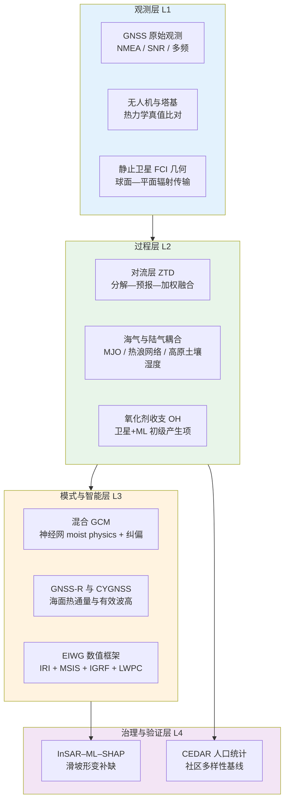
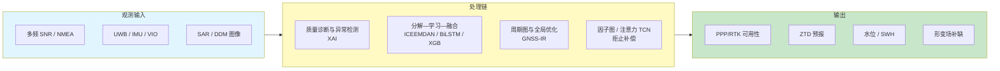
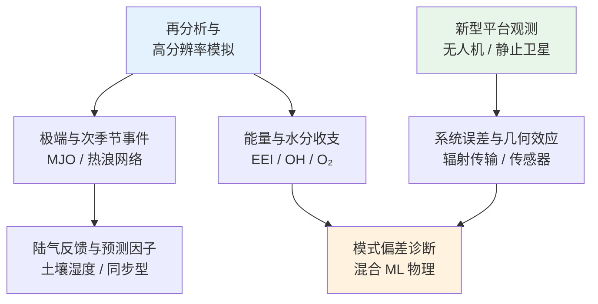
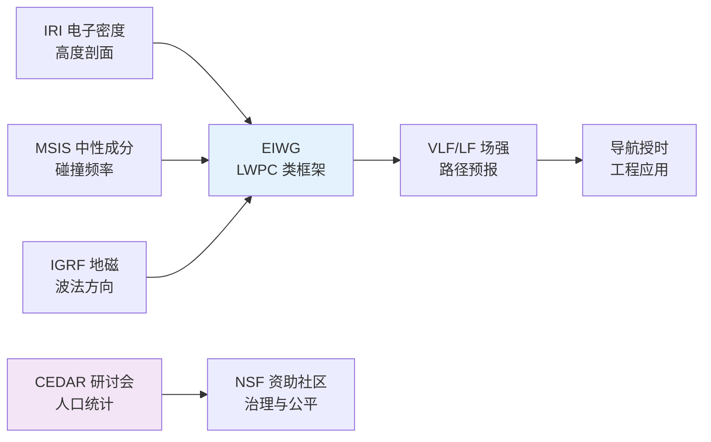
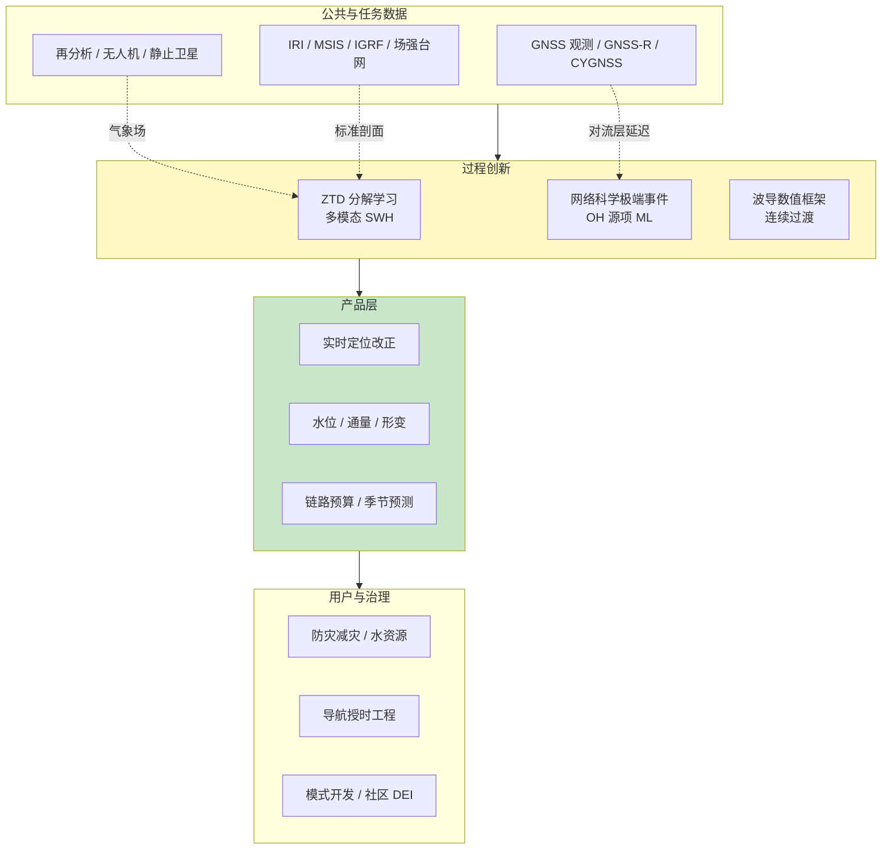

在2026年4月28日至2026年5月5日这一周的时间窗口内，题录库共收录与「Atmosphere」「GNSS」「Ionosphere」检索词相匹配的论文三十五篇，其中大气类二十五篇、GNSS类八篇、电离层类两篇。期刊分布显示，大气方向稿件在《Journal of Climate》《Journal of Geophysical Research》系列、《Geophysical Research Letters》《Atmospheric Measurement Techniques》《Biogeosciences》等刊物上高度分散，主题涵盖次季节预测、极端事件网络、氧化剂收支、混合模式物理与观测系统误差等前沿议题；GNSS方向稿件主要刊于《Remote Sensing》与《GPS Solutions》，技术路线明显向「受限环境下的鲁棒定位」「对流层延迟预报」「GNSS反射信号遥感」与「可解释深度学习反演」汇聚；电离层方向本期题录虽少，却分别触及日地环境研究共同体的治理透明度和地球电离层波导内甚低频与低频传播的可操作数值框架。下文先给出本期研究印记图式的总览归纳，再分方向展开综述、代表性技术路线对照表、结构示意图与单篇专题画像，其后给出交叉学科网络与创新链示意、近期研究特色与未来趋势判断，并列出参考文献。

## 一、本期研究印记图

本周题录在科学问题层面呈现出一种「多圈层耦合中的可预报性与可观测性」并重的格局。大气方向工作一方面继续深挖海气耦合、陆气耦合与次季节至季节尺度可预报性（例如 Madden–Julian 振荡预测、青藏高原土壤湿度与中国东部夏季降水、半球尺度热浪同步网络），另一方面把观测系统拓展到无人机平台热力学性能表征、静止卫星几何与球面大气辐射传输误差量化，以及羟基自由基初级产生项的机器学习约束等细粒度过程。GNSS方向则把导航与遥感应用紧密绑在低层水汽与海面状态参数上，并通过注意力机制、时间卷积网络、可解释集成学习与多模态 Transformer 等架构，显式回应「信号缺失、标签稀缺、误差累积」等工程约束。电离层方向中，长波传播研究将国际参考电离层、中性大气成分模式与地磁场模型嵌入经典传播能力算法，体现了「标准国际模型—工程传播模型—台站场强验证」的闭环；CEDAR 研讨会人口统计学报告则把「谁在做电离层与中高层大气研究」这一问题数据化，为公平性与人才结构政策提供基线。

上述脉络表明，GNSS 与大气科学的交汇点正从传统的对流层延迟改正与数值天气预报同化，扩展到「机器学习预报 ZTD」「微波遥感植被—土壤水系统」「城市大气氧化剂与通量观测」等更广义的地球系统观测链条；而电离层研究在本期窗口内更突出地表现为电波工程与标准模型集成的硬需求，并与日地空间社区治理议题并列出现于题录之中。

## 二、GNSS 与导航遥感应用方向

GNSS 方向本期八篇论文全部来自工程与遥感应用语境，其中《GPS Solutions》一篇聚焦观测数据异常检测的可解释智能框架，《Remote Sensing》七篇分别覆盖室内无人机多传感器融合、区域天顶对流层延迟预报、低成本接收机 GNSS 干涉反射水位反演、拒止环境下无人机捷联惯导组合导航、CYGNSS 海洋感热潜热通量产品更新、InSAR 数据缺口区的可解释形变估计，以及 GNSS 反射信号反演有效波高的多模态 Transformer。整体技术路线可概括为「在复杂几何与电磁环境下维持定位与遥感反演的时序一致性」，并通过分解学习、因子图优化、注意力时间卷积与 XGBoost 特征筛选等模块，把物理先验与数据驱动模块按任务解耦或松耦合拼接。

**表1 GNSS 方向代表性研究的技术路线与特点对照**

| 研究主题 | 技术路线概要 | 技术特点 | 重要结论或性能指标 |
|---------|-------------|---------|-------------------|
| XAI 观测异常检测 | 受限环境下多特征观测流、异常判别与归因解释 | 可解释人工智能与质量控制闭环 | 题录未公开摘要，以正式出版全文为准 |
| 室内无人机融合 | LMDS 锚系重构、Procrustes 对齐、IMU 预积分与 FGO 紧组合 | 一次标校多锚、抗 NLOS 与非同步误差 | 相对松组合，紧组合矩形轨迹 RMSE 约降 38.8% |
| IBX 区域 ZTD 预报 | ICEEMDAN 分解、三频重构、BiLSTM 与 XGBoost 加权融合 | 多时间尺度分离与 RMS 权重 | 1–12 h 平均 RMS 约 14.17 mm，较 BiLSTM 基线约降 22.5% |
| 低成本 GNSS-IR 水位 | NMEA 解析、Lomb–Scargle、VPPSO 反演反射高度 | 免 RINEX 链路、工程化部署友好 | 两场景 RMSE 优于约 6 cm |
| 拒止环境 SINS/GNSS | 注意力增强 TCN 预测误差、为滤波器提供伪参考 | 短时拒止下学习式误差补偿 | 实飞验证优于仅 TCN 或 KF 预测段 |
| CYGNSS 热通量更新 | 辅助场更新、等效中性风、地方太阳时 | 成熟任务的算法演进与再验证 | 与浮标比对支撑气候应用 |
| InSAR 缺口 XAI | SBAS、集成学习、SHAP 归因 | 工程因子与遥感特征联合 | XGBoost R² 约 0.816，GNSS 检核毫米级 |
| MultTransNet SWH | XGBoost 迭代选参、Transformer、DDM 图像与一维参数融合 | 多模态、复杂海况 | 较单模态 Transformer RMSE 再降约 27% |

### 2.1 专题画像：受限环境下 GNSS 观测数据异常检测的可解释框架

**（1）技术路线：从观测流到可解释告警**

Li 等（2026）在《GPS Solutions》发表的论文以受限观测环境为背景，面向城市峡谷多路径、非视距传播、局部遮挡与潜在射频干扰等导致观测统计分布显著非高斯的情形，构建以可解释人工智能为核心的 GNSS 观测数据异常检测框架。公开题录尚未提供完整摘要文本，因而此处从题名与期刊取向出发进行方法学概括，具体网络拓扑、损失函数与评价指标应以正式出版 PDF 为准。一般而言，该类框架需依次完成原始伪距与载波相位及其残差、信噪比与多路径指示量、卫星几何与历元间差分特征等的统一时间对齐与归一化，继而在监督或弱监督范式下训练判别模型，并引入 SHAP、积分梯度或类激活映射等工具，将告警样本映射回卫星通道与历元维度的归因图，以支撑运维人员对「环境所致」与「设备故障所致」进行区分。

**（2）技术特点：工程质量与可审计性的统一**

与仅追求分类准确率的黑箱检测器相比，可解释框架在运营级 GNSS 基础设施中的优势在于可把模型决策与可物理解释的观测特征联系起来，从而降低误报导致的基线重置成本。受限环境带来的核心困难是训练标签稀缺与域漂移显著，因而工作往往需要在跨场景迁移、自监督表征或图结构建模之间做出折中。《GPS Solutions》作为导航工程领域权威刊物，对算法稳定性、计算开销与实时性亦有隐含门槛，这决定了纯大模型堆叠并非主流，更常见的是「轻量骨干网络 + 物理启发特征 + 解释模块」的组合路径。

**（3）重要结论：可解释异常检测对高可靠导航的意义**

该研究的重要结论是：**在几何与电磁环境双重受限条件下，引入可解释人工智能的 GNSS 观测异常检测有望把「告警」从单一阈值事件提升为可审计的证据链，从而改善高精度定位服务的鲁棒性与运维效率**。若正式发表结果给出定量检测率与误报率，则可进一步与基于残差卡方或卡尔曼新息检验的传统基线进行成本—效益对比。对后续研究而言，将该框架与因子图优化或 PPP-RTK 滤波器状态联合建模，或在城市数字孪生中注入射线追踪模拟标签，是值得探索的延伸方向；其适用范围仍受限于所覆盖的场景库与接收机类型，跨设备泛化需独立验证。

### 2.2 专题画像：多锚一次标校与因子图紧组合的室内无人机定位

**（1）技术路线：从测距几何到全局平滑**

Zhao 等（2026）提出将多锚超宽带一次标校与因子图优化相结合，用于室内无人机的多传感器融合定位。流程上，首先利用 Landmark 多维标度从测距数据恢复锚节点与机载标签的相对几何，再通过少量已知坐标锚的刚体 Procrustes 对齐，把相对构型嵌入东—北—天坐标系，实现多锚快速标定与无人机初始位姿估计。随后构建包含惯性测量单元预积分、超宽带测距、激光测距仪高度与视觉惯性里程计位姿约束的紧组合因子图，并以增量平滑求解非线性最小二乘问题，从而在长时间序列上抑制非视距误差与漂移。

**（2）技术特点：标定效率与估计一致性的兼顾**

传统室内定位要么依赖逐锚人工测量，要么在松组合架构下容忍传感器时间基准不一致带来的次优性。该文通过「一次标校 + 紧组合」把几何初始化与运动估计纳入统一图模型，在工程上显著减少部署时间；同时，增量平滑相较批量优化更适合机载算力约束。与纯视觉或纯惯性方案相比，超宽带在视距良好时提供绝对距离锚固，而视觉惯性里程计补充高频姿态与结构信息，形成互补。

**（3）重要结论：紧组合在实飞轨迹上的显著精度收益**

该研究的重要结论是：**在公开数据集与真实矩形轨迹飞行实验中，紧组合因子图相对松组合在代表性轨迹上可将 RMSE 降低约 38.8%，表明多锚一次标校与图优化联合设计对室内无人机任务具有实质性精度与鲁棒性收益**。该结果对仓储巡检、地下空间测绘等 GNSS 不可用场景具有直接参考价值；其意义还在于为后续引入地图先验或动态锚提供了可扩展的图优化骨架。局限在于超宽带非视距污染仍可能在几何退化区域引发局部位姿歧义，需结合异常检测或冗余传感器进一步加固。

### 2.3 专题画像：ICEEMDAN 与 BiLSTM-XGBoost 耦合的区域天顶对流层延迟预报

**（1）技术路线：信号分解、子序列重构与异构学习器融合**

Chen 等（2026）针对多步天顶对流层延迟预报中噪声时变与误差累积问题，提出名为 IBX 的集成模型，串联改进完全集合经验模态分解与自适应噪声、双向长短期记忆网络与极端梯度提升树。首先对原始 ZTD 序列进行 ICEEMDAN 分解，再依据皮尔逊相关、主周期与样本熵三准则，将本征模态函数重组为高、中、低频子序列，以凸显不同物理时间尺度的分量。随后对重组子序列分别配置 BiLSTM 与 XGBoost 进行预测，并按各子序列验证集均方根误差倒数进行加权融合，得到最终 ZTD 预报值。

**（2）技术特点：物理可解释性与深度学习表达力的折中**

相较端到端单网络，分解—重构路径把非平稳 ZTD 拆分为更可学习的分量，减轻单模型同时拟合多尺度动力学的负担；BiLSTM 擅长捕获长程时序依赖，XGBoost 则在表格化特征与非线性阈值决策上表现稳健，二者加权融合降低了单一学习器在特定预报时效上的脆弱性。与近年来 GNSS 气象学中流行的纯 Informer 或 iTransformer 单轨方案相比，IBX 更强调「先验分解 + 异构集成」，在算力受限的台站端可能更易部署。

**（3）重要结论：多时效平均误差显著下降及区域分异规律**

该研究的重要结论是：**基于中国二十七站 2011–2020 年小时 ZTD 的滚动预报试验，IBX 在 1–12 小时预报时效上的平均 RMS 与 MAE 分别约为 14.17 mm 与 10.24 mm，相对 BiLSTM 单模型平均降低约 22.5% 与 21.4%，并在温带季风区与低海拔复杂水汽区表现出更稳定的误差抑制**。这一结论对实时对流层改正、PPP 快速收敛与区域数值天气预报同化均有潜在价值；空间分异分析还提示海拔与区域湿度气候型对预报难度具有调制作用，为台站自适应模型选择提供了经验依据。后续若与数值模式短临预报或水汽层析联合，有可能进一步压缩极端天气过程中的预报残差。

### 2.4 专题画像：基于低成本接收机 NMEA 与多频 GNSS 干涉反射的水位估计

**（1）技术路线：从大众数据格式到反射高度反演**

Gao 等（2026）面向水资源与生态监测需求，提出仅依赖低成本 GNSS 接收机输出的 NMEA 语句进行多频 GNSS 干涉反射水位估计。处理链包括对 NMEA 中卫星高度角、方位角与信噪比序列进行时间域特征增强，以改善可用于干涉分析的有效分辨率；继而基于多频信噪比振荡曲线建立反射高度反演模型，并采用 Lomb–Scargle 周期图方法估计主导频率；最后通过速度暂停粒子群优化求取反射器高度并换算水面高程。

**（2）技术特点：绕过 RINEX 生态的系统集成优势**

传统 GNSS-IR 研究多基于 RINEX 级载噪比归档数据，而 NMEA 路径更贴近现地物联网与大众硬件，有利于布设高密度、低维护成本的岸基或浮标网络。多频联合可在一定程度上缓解单频信噪比曲线混叠与多路径干扰，粒子群优化则针对非凸、多峰目标函数提供全局搜索能力，但计算开销需在实际嵌入式平台上评估。

**（3）重要结论：厘米级水位监测的工程可行性**

该研究的重要结论是：**在两组不同环境实验中，当实测水位变化范围约处于 196.4 cm 至 296.1 cm 时，所提方法的水位估计 RMSE 可优于约 6 cm，为低成本 GNSS-IR 水位仪产业化提供了理论与算法基础**。该结论对洪涝预警、水库调度与湿地生态监测具有应用潜力；其意义还在于缩短从「消费级硬件」到「水文参量产品」的链路。局限包括天线相位中心稳定性、风浪导致的非镜面反射偏差，以及 NMEA 输出率与量化噪声对反演精度的上限约束，需在具体布设中通过共址验潮与波形拟合诊断加以量化。

### 2.5 专题画像：注意力增强时间卷积网络辅助的无人机 SINS/GNSS 融合

**（1）技术路线：拒止段误差预测与组合滤波耦合**

Xu 等（2026）针对无人机捷联惯导与 GNSS 组合导航在卫星信号受遮挡或干扰中断时误差快速发散的问题，提出基于注意力增强时间卷积网络的混合融合方法。网络以惯性测量与惯导解算状态为输入，学习 GNSS 可用时段的误差映射规律，在拒止时段输出伪位置参考，为后端卡尔曼或因子图滤波提供补偿项，从而抑制发散。

**（2）技术特点：时间卷积与自注意力联合建模运动模态**

时间卷积网络通过扩张卷积捕获多尺度时间上下文，自注意力机制强调对关键历元与特征通道的动态加权，二者结合有助于刻画无人机机动引起的复杂误差演化。与仅在滤波器内做状态预测的方法相比，显式学习误差轨迹可在短中断内提供更高精度的软约束，但依赖训练飞行覆盖足够多样的机动与振动谱。

**（3）重要结论：实飞拒止场景下的定位精度提升**

该研究的重要结论是：**利用实采 GPS 与捷联数据对比多种基线，所提注意力增强 TCN 混合融合在特定拒止环境下可显著降低位置误差积累，优于单独 TCN、收敛卡尔曼预测段或纯惯导方案**。该结论对城市物流无人机、电力走廊巡检等短时卫星缺失任务具有直接启示；工程推广时需关注跨机型、跨载荷迁移与在线自适应更新策略，并评估神经网络推断延迟对控制闭环的影响。

### 2.6 专题画像：CYGNSS 海洋表面感热与潜热通量产品的演进与验证

**（1）技术路线：卫星风场反演与通量算法的版本迭代**

Crespo 等（2026）系统总结了 Cyclone Global Navigation Satellite System 海洋表面热通量产品在首版发布后的更新，包括引入新的温湿度辅助数据、算法上吸收 CYGNSS 等效中性风信息，以及增加地方太阳时变量以支持日变化分析。文章将当前版本与浮标等现场资料对比，讨论热带与副热带海域长期观测的气候学意义。

**（2）技术特点：星载 GNSS-R 气候数据集的生命周期管理**

CYGNSS 作为成熟任务，其产品科学价值不仅来自单次算法创新，更来自持续再处理与不确定性溯源。等效中性风的引入有助于在边界层相似理论框架下更一致地连接雷达后向散射与海气动量与热量交换；地方太阳时维度则使研究者能够分离太阳加热与海气稳定性对通量日循环的驱动。

**（3）重要结论：更新后产品对热带海气相互作用研究的支撑作用**

该研究的重要结论是：**通过辅助场与算法修订，CYGNSS 热通量数据集在保持对热带气旋、对流与大气河等现象学应用的同时，提升了与现场观测的一致性与日变化表征能力，为缺乏常规观测的开阔洋区提供了补充约束**。该结论对改进海气耦合模式中的通量参数化、理解极端事件前的海洋热含量变化具有间接意义；长期维护此类数据集亦有助于构建与 Argo、散射计互补的多源观测矩阵。

### 2.7 专题画像：可解释集成学习估计 SAR 覆盖不足区的滑坡地表形变

**（1）技术路线：SBAS-InSAR 与多因子机器学习及 SHAP 归因**

Feng 等（2026）针对滑坡隐患区 InSAR 形变图因影像几何或失相干导致空间空洞的问题，提出将 SBAS-InSAR、集成机器学习与 SHAP 解释结合的可解释框架。研究整合地质与工程因子、遥感派生量与现场调查数据，训练多种梯度提升与随机森林类模型，择优模型用于连续形变估计，并利用 SHAP 量化各因子对预测的贡献。

**（2）技术特点：把「遥感缺口」转化为「多源可学习插值」**

与纯 InSAR 内插或克里金相比，引入高程、道路距离、土地利用与防护工程状态等因子，使模型在物理上更贴近滑坡驱动力与人类活动耦合机制；SHAP 则把黑箱预测转化为可审查的空间模式，有利于与专家判读对齐。

**（3）重要结论：高 R² 与 GNSS 毫米级检核下的可解释形变场**

该研究的重要结论是：**XGBoost 在独立验证上取得约 0.816 的决定系数与约 6.85 mm 的 RMSE，并在两处 GNSS 基准上达到亚毫米级差异，结合 SHAP 揭示高程与工程措施等主导因子，从而在数据稀缺区仍可获得与实地破坏记录一致的形变格局**。该结论对滑坡早期预警与风险区划具有直接支撑价值，并示范了 GNSS 作为真值标定在 InSAR-机器学习闭环中的关键角色。局限在于训练区与推断区的地质可比性假设较强，外推至不同岩性与降雨触发机制区需谨慎。

### 2.8 专题画像：MultTransNet 多模态 Transformer 反演 GNSS-R 有效波高

**（1）技术路线：迭代特征选择、Transformer 编码与二维 DDM 融合**

Cui 等（2026）提出 MultTransNet，以提升 GNSS-R 有效波高反演在复杂海况下的精度。模块上，首先设计基于 XGBoost 的迭代特征选择以降低冗余；其次采用 Transformer 编码器建模时间依赖与全局上下文；再将二维延迟多普勒图与一维辅助参数进行多模态融合，以同时利用成像平面结构与标量海洋状态信息。

**（2）技术特点：多模态相对单模态 Transformer 的显著增益**

传统深度网络多依赖一维时序或手工特征，难以充分利用 CYGNSS 等任务中丰富的 DDM 图像纹理；MultTransNet 显式引入图像模态后，网络可学习风浪破碎、镜面区收缩等空间模式。迭代特征选择有助于抑制共线特征导致的过拟合。

**（3）重要结论：复杂海况下 RMSE 与相关系数的协同改善**

该研究的重要结论是：**仿真试验表明，Transformer 结构相对常规深度神经网络可降低约 8.91% 的 RMSE 并提升约 4.05% 的相关系数，而多模态融合相对单模态 Transformer 进一步降低约 27.05% 的 RMSE 并提升约 7.21% 的相关系数，显示在复杂海况下引入 DDM 图像信息的必要性**。该结论对星载 GNSS-R 海浪业务化反演与极端海况监测具有方法学价值；向实场数据推广时，仍需处理星机几何变化、射频干扰与海面非高斯散射等带来的域偏移问题。

## 三、大气过程、气候网络与氧化收支方向

大气方向本期二十五篇论文在科学问题上高度异质，本节从中选取八篇顶刊与特色工作做深度画像，分别代表次季节海气耦合与 MJO 预报、半球热浪同步网络、青藏高原春季土壤湿度与中国东部夏季降水、城市化区大气氧浓度高分辨率观测、早期二十一世纪地球能量收支趋势的高分辨率模式评估、空间约束羟基自由基初级产生、无人机热力学传感器系统误差表征，以及混合全球气候模式中机器学习湿物理偏差的缓解尝试。整体上，观测—模拟—机器学习三条技术主线交织，且越来越多研究把「网络科学」「可解释机器学习」与「极端事件复合风险」纳入传统气候与大气化学分析框架。

**表2 大气方向代表性研究的技术路线与特点对照**

| 研究主题 | 技术路线概要 | 技术特点 | 重要结论或指标 |
|---------|-------------|---------|----------------|
| MJO 与海气耦合 | UFS P8 次季节预报、湿静能收支、Granger 因果 | 分解潜热通量风驱与热力学分量 | 模式中海气耦合强于观测，SST 对大气强迫过敏感 |
| 半球热浪同步 | 事件同步气候网络、环流型与土壤湿度反馈 | 客观识别热点与遥相关 | 跨纬度同步路径与 Rossby 波列相联系 |
| 高原春季土壤湿度 | 奇异值分解偶极型、陆气持续异常 | 春季信号延续至夏季加热对比 | 与长江中下游及华北降水显著相关 |
| 城市大气氧 | 河谷城与高原背景站同步观测、机制分解 | 区分气溶胶与臭氧控制型机制 | 城市 O₂ 变率整合排放与氧化容量 |
| OH 初级产生 | 机器学习 + 卫星与气象场约束 | 全球可行性与不确定度分区 | 约 68–73% 区域不确定度优于约 25% |
| 无人机热力学 | 九十八架次、八类传感器位置、塔与系留对比 | 非屏蔽传感器的系统偏差量化 | 最优布置昼温 95% 置信约 ±0.83 K 内 |
| 地球能量收支 | CM4X 与 CESM-HR 高分辨率集合 | 短波趋势低估与内部变率 | 集合均值仅捕获观测 EEI 趋势一部分 |
| 混合 GCM 湿物理 | 浅层纠偏网与扩维输入输出对比 | 辐射量与陆分数写入神经接口 | 高纬温湿偏差缓解但热带降水仍顽固 |

### 3.1 专题画像：海气耦合强度与 Madden–Julian 振荡预报偏差

**（1）技术路线：湿静能收支与因果诊断**

Choi 等（2026）利用 ERA5 再分析与 UFS Prototype 8 耦合模式次季节预报，对热带季节内变率（30–90 天）开展湿静能收支分析，重点评估 Madden–Julian 振荡以及开尔文与赤道罗斯贝波分量的模拟特征。研究将表面潜热通量分解为风驱与热力学贡献，并运用 Granger 因果检验量化海温与大气场之间的领先—滞后关系，以识别耦合过强或过弱的模式行为。

**（2）技术特点：从通量分解到耦合路径归因**

相较单一谱功率对比，湿静能收支可把降水、辐射与边界层过程对扰动能量的相对贡献拆开；潜热通量双分解则有助于区分「风场偏差」与「海表温度变率夸大」两类误差源。Granger 因果为统计因果，需在样本长度与季节分区敏感性上谨慎解释，但对定位模式耦合异常仍具指示价值。

**（3）重要结论：模式过强海气耦合与上层海洋混合参数化不确定性**

该研究的重要结论是：**UFS P8 虽能较好再现湿静能与海温气候平均态，但在海洋大陆等区域显著高估季节内变率，其中 MJO 分量的湿静能收支误差主要由表面潜热通量偏差驱动，且模式表现出较观测更强的海气耦合与海温对大气强迫的过度敏感，暗示垂直混合参数化不确定性的重要贡献**。该结论对改进次季节预报系统、尤其是热带对流与海温相互作用模块具有直接针对性；对后续工作而言，结合高分辨率海气耦合或同化海表盐度与混合层深度观测，有望进一步约束耦合强度。模式结果向业务预报迁移时，应注意统计因果结论与过程解析之间的对应关系需在独立事件中复核。

### 3.2 专题画像：北半球同步热浪的气候网络映射

**（1）技术路线：事件同步网络与大尺度环流合成**

Jiang 等（2026）采用事件同步气候网络方法，客观识别北半球夏季同步极端热浪热点及其主导同步型，并通过合成分析揭示相伴的大尺度环流与土壤湿度反馈过程。网络节点为格点热浪事件时间序列，边权反映事件时间对齐统计显著性，从而凸显跨区域遥相关结构。

**（2）技术特点：从单点极值到「空间并发」风险度量**

随着全球变暖，热浪研究从局地强度转向空间并发与持续时间，网络方法提供了超越传统 EOF 的图结构视角。将网络结果与 Rossby 波列或纬向波型联系，有助于把统计上的同步型还原为动力学过程假设。

**（3）重要结论：跨纬度同步热点与土壤湿度正反馈**

该研究的重要结论是：**欧洲大部、西亚东部、东亚、东南亚、北美西部与南部及格陵兰等区对同步热浪高度敏感，东南亚与北美西部同里海、东亚与北美南部同北欧中部等同步型分别与西北—东南向 Rossby 波列及纬向波列相联系，且局地土壤湿度干化通过陆气正反馈提高共发概率**。该结论对跨境电力负荷调度、农业并发减产风险评估与模式极端事件集合预报检验具有启示；政策层面则提示需把「空间并发」纳入热浪适应规划指标。网络方法对阈值与事件定义敏感，不同热浪指标可能改变边结构，需在应用层做敏感性试验。

### 3.3 专题画像：青藏高原春季土壤湿度偶极与中国东部夏季降水

**（1）技术路线：奇异值分解与陆气异常持续性**

Dong 等（2026）应用奇异值分解识别青藏高原春季土壤湿度偶极型（东湿西干），分析其与夏季中国东部降水型之间的联系，并通过夏季感热加热对比与环流异常合成，讨论春季信号如何通过陆气相互作用延续至夏季。

**（2）技术特点：把高原土壤湿度提升为季节预测因子**

传统季节预测多依赖海温指数，该文强调高原春季土壤湿度作为额外预测源，对长江中下游与华南降水型有显著调制，物理图像上通过感热加热东西对比激发反气旋与气旋式异常配对，进而调配水汽辐合区。

**（3）重要结论：春季高原土壤湿度作为夏季降水型的有效预测信号**

该研究的重要结论是：**春季土壤湿度偶极与夏季长江中下游降水正相关约达 0.65、与华南降水负相关约达 0.84，并通过夏季持续土壤湿度异常改变感热加热分布，诱发华北气旋式异常与华南反气旋式异常，从而调制夏季降水型**。该结论为东亚夏季风季节预测提供了可操作的陆面初始场信号，对防汛抗旱决策具有潜在价值；业务应用时仍需与海温、北极振荡等指数做多因子联合建模，并评估模式对高原土壤湿度初始化的敏感度。

### 3.4 专题画像：城市化对大气氧浓度的高分辨率观测证据

**（1）技术路线：河谷工业城与高原背景站同步高精度观测**

Wang 等（2026）在兰州工业河谷城市与珠穆朗玛峰背景站开展同步高精度大气氧观测，通过气象协变量分离与机制分析，揭示两地大气氧变率控制因子的根本差异，并进一步区分气溶胶污染与臭氧污染情景下的氧收支响应。

**（2）技术特点：把大气氧作为排放—化学—气象耦合的整合示踪剂**

大气氧浓度变化长期被粗分辨率模式简化处理，该文利用高时间分辨率观测捕捉城市尺度「物理脱耦」与「化学协同」两种典型机制，为理解燃烧排放、边界层稳定性与二次氧化之间的非线性关系提供实证。

**（3）重要结论：城市氧变率对化学—气象反馈评估的指示意义**

该研究的重要结论是：**背景站大气氧变率主要受温度—气压耦合等气象变率控制，而河谷城市区则体现局地人为排放与大尺度天气型共同调制，并在气溶胶污染期呈现外源输送破坏局地燃烧—氧亏损线性关系的特征，在臭氧污染期呈现温度增强前体氧化与二次转化的化学协同**。该结论强调在城市碳—氧收支与生态系统可持续性评估中需显式考虑化学—气象反馈；对空气质量模式验证而言，氧观测可作为独立约束量。观测站点代表性有限，外推到其他河谷城市时需结合地形与排放结构个案分析。

### 3.5 专题画像：机器学习约束对流层近地面羟基自由基初级产生

**（1）技术路线：多源卫星与气象场驱动的机器学习反演**

Anderson 等（2026）构建结合机器学习、卫星遥感与气象再分析的方法，在全球中纬度对流层近地面约五百米高度上约束由激发态氧与水汽反应产生的羟基自由基初级产生率，并系统量化不确定度空间分布，讨论云与生物质燃烧高不确定区的成因。

**（2）技术特点：从「OH 总浓度」向「收支分项可观测化」推进**

传统 OH 反演多聚焦总浓度或柱含量，该文针对初级产生项这一化学收支关键源项，体现卫星驱动机器学习在分解复杂光化学过程中的潜力；不确定度分区结果为数据融合策略提供优先级。

**（3）重要结论：全球大部分区域初级产生率反演达到可用不确定度水平**

该研究的重要结论是：**方法给出的初级产生率季节变化主要由水汽与臭氧光解率驱动，全球约 68–73% 区域其一倍标准差不确定度优于约 25%，可为后续 OH 趋势与变率归因提供观测锚点，并构成向其他收支项推广的蓝图**。该结论对大气氧化容量长期演变、甲烷寿命评估与模式光化学参数优化具有基础性意义；云与燃烧烟羽区仍需额外卫星产品与时空平均策略以降低噪声。方法依赖训练数据与化学模式先验的一致性，跨模式迁移需独立验证。

### 3.6 专题画像：多旋翼无人机非屏蔽热力学传感器的系统表征

**（1）技术路线：九十八架次飞行与塔基、系留真值比对**

Freeman 等（2026）针对多旋翼无人机上未加专门屏蔽与强迫通风的热力学传感器，在八种安装位置下开展九十八次飞行试验，并以通量塔与携带相同传感器的系留气球为真值，量化温度与水汽混合比的系统误差与置信区间，包含昼夜对比。

**（2）技术特点：面向「捎带观测」与集群部署的质量控制**

随着无人机在大气边界层观测中的普及，安装位置引起的转子尾流与机体热污染成为主要误差源；该文用统计置信区间给出可操作的位置建议，对无法安装复杂进气系统的应用场景尤为重要。

**（3）重要结论：最优传感器布置可显著压缩昼夜温度偏差**

该研究的重要结论是：**在最佳安装位置，白昼温度绝对误差九十五百分位置信区间约介于负零点八三 K 与正零点六一 K 之间，夜间更窄，水汽混合比误差约介于负零点二二与正零点六六克每千克之间，并建议将传感器置于远离机体且受转子有效抽吸的位置**。该结论为无人机组网观测与模式同化提供了可量化误差模型基础；对城市边界层与污染扩散研究而言，有助于降低移动平台观测的系统偏差。试验基于特定机型与下垫面，外推至海上或冰雪下垫面时需重新标定。

### 3.7 专题画像：高分辨率耦合模式对二十一世纪地球能量收支趋势的再现**

**（1）技术路线：CM4X 与 CESM-HR 历史集合的 EEI 趋势对比**

Chen 等（2026）比较两个高分辨率耦合气候模式各十个集合成员在 2001–2024 年期间的地表至大气顶能量收支趋势，与卫星观测对比，并分解热带与南半球中高纬短波趋势贡献，同时分析海冰过程与内部变率对 EEI 趋势离散度的影响。

**（2）技术特点：高分辨率并不自动解决辐射趋势低估**

研究揭示即使水平分辨率提高，模式仍可能系统性低估观测到的地球能量收支增强趋势，且不同模式集合对内部变率放大程度不同；个别成员可通过极端海冰状态「偶然」匹配观测趋势，提示物理解释需谨慎。

**（3）重要结论：热带与南半球中高纬短波趋势低估主导 EEI 偏差**

该研究的重要结论是：**CM4X 与 CESM-HR 集合平均的 EEI 趋势分别仅约为卫星估计观测趋势的 25% 与 55%，主要源于热带与南半球中高纬短波趋势低估，且 CESM-HR 的 EEI 与增温趋势集合离散度约为 CM4X 的两倍，偏差与增温型式差异无简单对应**。该结论对临近十年尺度气候投影与海冰—反照率—云反馈参数化改进具有警示意义；对模式开发者而言，需优先改进云与气溶胶辐射效应的观测约束。观测 EEI 本身亦存在仪器漂移与反演不确定度，多卫星交叉定标仍是长期课题。

### 3.8 专题画像：混合全球气候模式中机器学习湿物理偏差的缓解路径**

**（1）技术路线：三维 CAM5 中卷积残差神经网湿物理与多种纠偏实验**

Han 等（2026）在既有将深度卷积残差网络嵌入 CAM5 湿物理的多年积分基础上，尝试两类减偏策略，其一为训练含或不含相对湿度的浅层纠偏网络，其二为扩展神经网输入输出以纳入辐射相关量与陆海掩膜，以增强陆气耦合与陆海对比表征。

**（2）技术特点：揭示「高纬纠偏」与「热带降水」解耦困难**

混合模式在计算稳定性上已可行，但高纬对流层温度湿度偏差与热带陆地降水干偏差仍顽固；研究表明单纯纠偏网络或扩维辐射量对部分高纬与地表温度有效，但对热带陆地降水改善有限且可能恶化热带海洋降水偏差。

**（3）重要结论：热带降水偏差需更强物理约束或架构升级**

该研究的重要结论是：**浅层纠偏与辐射量扩维可缓解高纬温度湿度与地表温度偏差，但难以同时修复热带陆地降水，且两类方案均可能恶化热带海洋降水偏差，提示残差误差来源超出当前神经接口所能表达的物理子系统**。该结论对下一代混合地球系统模式具有方法论意义，即需将深度学习与对流参数化、边界层与微物理过程更深度耦合，并引入守恒约束与不确定性量化；对应用者而言，不应默认混合模式已在全热带实现无偏降水。后续工作若引入生成式对流集合或物理信息正则，或可部分缓解该解耦难题。

## 四、电离层与电波传播及日地环境社区方向

本期电离层相关题录仅两篇，故本节在综述与结构图之后对两篇论文均给出完整专题画像，以反映「电波工程数值框架」与「学术共同体治理」两类看似分立却同属日地空间研究生态的议题。

**表3 电离层方向题录的技术路线与特点**

| 研究主题 | 技术路线概要 | 技术特点 | 重要结论或指标 |
|---------|-------------|---------|----------------|
| CEDAR 人口统计 | 匿名问卷汇总、2021–2024 趋势 | 治理透明与 DEI 政策数据化 | 职业阶段、性别与种族等分布相对稳定 |
| VLF/LF 传播 | IRI 电子密度、NRLMSIS 中性成分、IGRF-13 地磁嵌入 LWPC | 消除黎明清昏参数跳变 | 白昼相关约升至 0.64–0.964，RMSE 约降至 1.15 dB |

### 4.1 专题画像：CEDAR 研讨会人口统计（2021–2024）报告

**（1）技术路线：匿名化问卷采集与两年周期披露机制**

Burrell 等（2026）汇总美国 NSF 资助的 CEDAR 研讨会自 2021 年起收集的匿名人口统计学信息，涵盖职业阶段、性别认同与种族或族裔等字段，并在 2024 年章程要求下形成面向社区的定期披露报告。分析上对 2023–2024 年新数据与 2021 年以来历史数据进行并列，以识别潜在趋势。

**（2）技术特点：把多样性、公平与包容目标转化为可测指标**

相较于依赖印象判断，系统化人口统计为会议组织方、资助机构与导师群体提供了可比较的基线，有助于评估外展项目、奖学金与议程设置改革的成效；匿名化与自愿填报则涉及统计偏差与代表性问题，需在解读时保持审慎。

**（3）重要结论：短期内多个人口学维度分布相对稳定**

该研究的重要结论是：**在现有四年样本长度下，CEDAR 研讨会在职业阶段、性别认同与种族或族裔等维度上的出席结构未呈现显著漂移，为后续每两年一次的对比评估提供了起点**。该结论对全球其他日地空间会议的人口统计制度化具有示范意义；对政策制定者而言，稳定并不等同于「无需行动」，而应结合具体少数群体占比与话语权结构继续监测。延长序列后若出现突变，需要区分登记流程变化与真实人群变化两类因素。

### 4.2 专题画像：国际参考模型集成以增强长波传播预测能力

**（1）技术路线：IRI、NRLMSIS 与 IGRF-13 耦合进长波传播算法**

Xu 等（2026）针对传统长波传播能力程序在电离层参数静态表示与黎明清昏过渡不连续等方面的局限，提出将国际参考电离层模型用于高分辨率电子密度剖面，与 NRLMSIS 中性大气成分耦合计算电子碰撞频率，并引入第十三代国际地磁参考场更新地磁输入，以改进地球电离层波导内甚低频与低频传播预测。

**（2）技术特点：标准国际模型与工程传播模型的可计算接口**

该框架的亮点在于利用成熟、可公开获取的国际模型替换或细化经验参数化，使反射高度与碰撞频率在时空上连续演化，从而消除原模型在晨昏切换处的非物理跳变；六条传播路径上对 VTX 发射台实测场强的验证为方法可信度提供直接证据。

**（3）重要结论：白昼场强相关与 RMSE 显著改善但夜间增益有限**

该研究的重要结论是：**优化后模型可在黎明清昏过渡期给出物理一致的等效反射高度连续演化，白昼条件下六条路径预测与实测场强的相关系数由约负零点五零五至零点五六六提升至约零点六三八至零点九六四，RMSE 由约二点一一一分贝降至约一点一五四分贝，而夜间改进相对有限**。该结论对远程导航、授时与通信链路预算具有直接工程价值，并为在数字地球框架下统一电离层—中性大气—地磁场数据服务提供了范例。夜间残留误差可能与低电离层精细结构、横向不均匀性及噪声环境有关，需结合实测剖面或同化数据进一步约束。

## 五、交叉学科网络与创新链示意

GNSS、大气与电离层在本期题录中通过多条隐性链条相互连接：对流层延迟预报与数值天气分析共享水汽与温度廓线概念；GNSS-R 海面参数与大气模式中的海气动量与热量通量相互校验；InSAR-机器学习形变估计依赖 GNSS 真值；长波传播模型则显式调用电离层与中性大气国际参考标准。下列示意图从「数据—过程—产品—用户」视角概括创新链位置，而非穷尽所有文献细节。

## 六、近期研究特色与未来趋势展望

本期题录在方法学上呈现出若干可识别的共性转变。其一，大气与 GNSS 应用研究中机器学习的角色从「黑箱拟合」转向「分解—集成—可解释」的结构化使用，强调不确定度分区与物理子过程对齐。其二，极端气候与次季节问题越来越多借助网络科学与因果诊断工具，把空间并发与过程链条同时纳入分析。其三，电离层相关工程研究继续沿着「国际参考标准模型 + 经典电波算法 + 多路径场强验证」路径迭代，与机器学习在低电离层参数预测上的进展形成潜在对接点。展望未来三至五年，GNSS 气象学有望在区域高分辨率数值模式同化与台站端短临 ZTD 预报之间形成更闭合的业务链路；大气氧化剂与能量收支约束将进一步依赖多卫星联合反演与混合模式物理；电离层方向则可能看到 LWPC 类框架与实时数据同化或神经参数化剖面的深度融合，同时学术会议人口统计制度化或将在更大范围推广。

---

## 参考文献

1. Burrell, A. G., Maute, A., Jones, M. (2026). Report and Assessment of the CEDAR Workshop Demographics Between 2021 and 2024. *Earth and Space Science*. DOI: 10.1029/2025ea004620
2. Choi, N., Stanczak, J., Stan, C. (2026). The Role of Atmosphere-Ocean Coupling on the Prediction of Madden-Julian Oscillation. *Journal of Climate*. DOI: 10.1175/jcli-d-25-0247.1
3. Chen, Y.-T., Merlis, T. M., Dinh, T., Griffies, S. M., Krasting, J., Dussin, R., Zadeh, N., Fueglistaler, S. A. (2026). Assessing Earth's Energy Imbalance Trend in the Early 21st Century in Two High‐Resolution Coupled Models. *Geophysical Research Letters*. DOI: 10.1029/2025gl121277
4. Chen, C., Zhao, Y., Zhang, W., Ge, Y., Yuan, J., Hu, C. (2026). A Refined Prediction Model for Regional Zenith Troposphere Combining ICEEMDAN and BiLSTM-XGBoost. *Remote Sensing*. DOI: 10.3390/rs18091381
5. Crespo, J. A., Asharaf, S., Russel, A., Twigg, D., Posselt, D. J. (2026). Updates to the CYGNSS Ocean Surface Heat Flux Product. *Remote Sensing*. DOI: 10.3390/rs18091353
6. Cui, Y., Cai, M., Du, Y., He, S. (2026). MultTransNet: A Novel Multimodal Transformer Network for Retrieving Significant Wave Height Using GNSS-R Data. *Remote Sensing*. DOI: 10.3390/rs18091351
7. Dong, X., Wang, Y., Lai, X., Tan, Z., Yan, X., Dong, L., Zhu, J. (2026). Impacts of Spring Soil Moisture over the Tibetan Plateau on Summer Precipitation in Eastern China. *Journal of Climate*. DOI: 10.1175/jcli-d-25-0362.1
8. Feng, X., Wang, Y., Du, J., Chai, B., Hu, Z., Zhou, C. (2026). Explainable Artificial Intelligence for Estimating Surface Deformation in Landslide Areas with Incomplete SAR Data. *Remote Sensing*. DOI: 10.3390/rs18091363
9. Freeman, S. W., Bukowski, J., Grant, L. D., Marinescu, P. J., Park, J. M., Hitchcock, S. M., Neumaier, C. A., van den Heever, S. C. (2026). Characterizing thermodynamic observations from unshielded multirotor drone sensors. *Atmospheric Measurement Techniques*. DOI: 10.5194/amt-19-2941-2026
10. Gao, Y., Xu, T., Li, Y., Guo, H. (2026). Multi-Frequency GNSS-IR Water-Level Estimation Using NMEA Observations from Low-Cost GNSS Receivers. *Remote Sensing*. DOI: 10.3390/rs18091396
11. Han, Y., Zhang, G. J., Wang, Y. (2026). Exploring Ways to Reduce Biases in a Hybrid Global Climate Model With Machine‐Learned Moist Physics. *Journal of Advances in Modeling Earth Systems*. DOI: 10.1029/2025ms005522
12. Jiang, J., Bao, W., Hu, W., Wu, G., Liu, Y. (2026). Mapping Synchronous Heat Waves in the Northern Hemisphere: Insights from Climate Network Analysis. *Journal of Climate*. DOI: 10.1175/jcli-d-25-0328.1
13. Li, D., Du, Y., Huang, G., Zhang, Q. (2026). An XAI-based framework for GNSS observation data anomaly detection in constrained observation environments. *GPS Solutions*. DOI: 10.1007/s10291-026-02075-z
14. Wang, L., Huang, J., Li, C., Zhao, K., Shi, J., Han, D. (2026). Impacts of Urbanization on Atmospheric Oxygen: High‐Resolution Observational Evidence. *Journal of Geophysical Research: Atmospheres*. DOI: 10.1029/2026jd046394
15. Anderson, D. C., Duncan, B. N., Souri, A. H., Liu, J., Strode, S., Ahn, D. (2026). Toward Closing the Hydroxyl Radical (OH) Budget: Assessing the Feasibility and Uncertainties in Constraining primary OH Production From Space. *Journal of Geophysical Research: Atmospheres*. DOI: 10.1029/2025jd045499
16. Xu, C., Chen, S., Zhao, D., Hou, Z., Jiang, C. (2026). A Hybrid Drone SINS/GNSS Information Fusion Method Based on Attention-Augmented TCN in GNSS-Denied Environments. *Remote Sensing*. DOI: 10.3390/rs18091379
17. Xu, Y., Liu, Y., Wang, Y., Zeng, J., Xiong, W., Xie, S., Chen, Y. (2026). Enhancing Long Wave Propagation Prediction Capability Through the Integration of International Reference Models. *Radio Science*. DOI: 10.1029/2025rs008597
18. Zhao, J., Deng, Z., Su, W., Lou, B., Liu, Y. (2026). Indoor UAV Localization via Multi-Anchor One-Shot Calibration and Factor Graph Fusion. *Remote Sensing*. DOI: 10.3390/rs18091407
