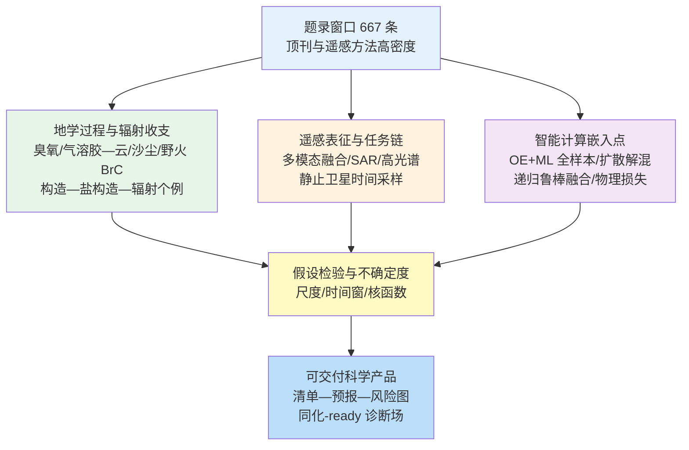
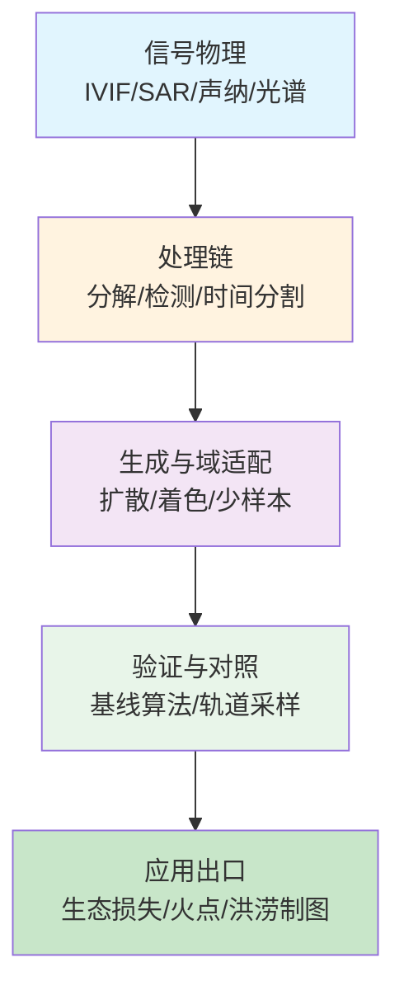
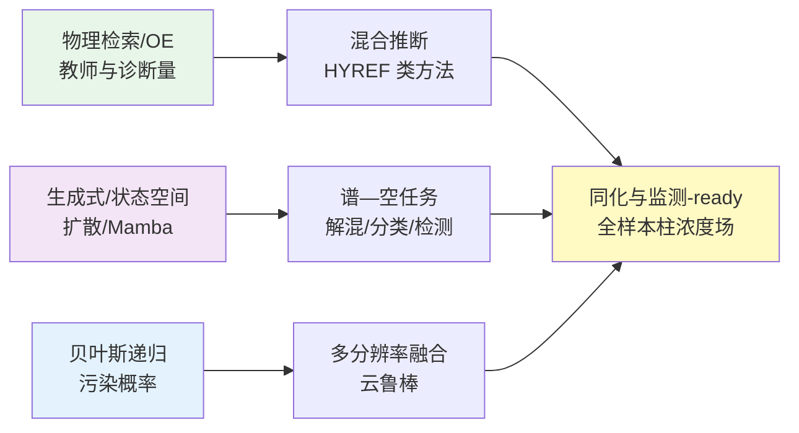
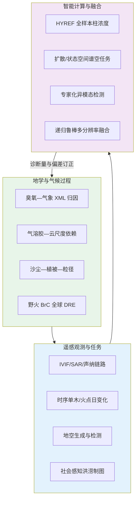

在 2026-05-05 至 2026-05-12 窗口内共有 667 篇论文条目，其中 Cell、Nature、Science 系列条目 160 篇，大气海洋与固体地球等领域顶刊及遥感特色期刊条目 249 篇。与仅统计数量的做法相比，更有信息价值的是条目在科学问题上的聚类方式：地学条目密集指向大气成分—气象耦合、气溶胶—云相互作用尺度依赖、陆面植被对沙尘排放的约束、冰冻圈与火灾碳质辐射效应、以及构造—盐构造对地震危险性评估的改进；遥感条目则沿传感器融合、SAR/高光谱深度网络、地—空跨视角生成、静止卫星揭示的采样时间偏差等工程链条展开；智能计算条目更多以“在物理检索或变分框架下扩展覆盖、在扩散与状态空间模型下处理谱变率、在贝叶斯递归框架下抑制云污染”等形式嵌入观测链路。

近一周题录所呈现的地学研究，在东亚近地面臭氧变率解析、陆地上空液水路径分段调控的气溶胶间接效应、全球沙尘排放对植被拖曳与粒径谱的响应、青藏高原中期气温预报融合、野火暗棕碳全球辐射效应、安第斯前陆盆地壳幔结构、盐构造区活动断层震级上限，以及伊比利亚半岛强沙尘个例长波与净辐射效应分解等方向上形成互补证据链。遥感研究则覆盖红外—可见融合、前视声纳小目标检测、Sentinel-2 单木损失监测、地空生成式建模、SAR 相位感知检测、高光谱 Transformer—Mamba 并行编码、静止卫星揭示的秸秆焚烧日变化偏移，以及社交媒体驱动的可解释城市洪涝易发性制图等主题。智能计算研究突出表现为最优估计与神经网络混合的大气成分柱浓度全样本预测、谱变率约束下的高光谱解混扩散模型、异源光学—SAR 变化检测混合专家、百年尺度历史影像生成与分割、土壤属性制图中的变量选择、多分辨率影像递归鲁棒融合，以及物理成像损失约束下的微震定位深度学习等。

## 二、本期研究印记图

本期印记可概括为“过程约束—观测表征—学习推断”的闭合环路：地学过程研究为气溶胶光学与云微物理参数化提供尺度敏感约束，遥感方法研究为复杂地表与传感器缺陷提供可重复的处理协议，智能计算则在保持检索诊断量或贝叶斯鲁棒性的前提下扩展空间覆盖或压缩推理成本。静止卫星揭示的焚烧时间窗偏移与极轨火点统计背离，提示“采样时间假设”本身应进入大气成分与空气质量模型的误差预算；与此平行，可解释机器学习在臭氧趋势归因中揭示 2019 年前后主导因子由非气象代理项向气象变率转移，为排放控制成效评估提供对照框架。

## 三、地学方向

### 3.0 方向综述与结构关系

地学条目在本期窗口内集中于大气化学—气象耦合诊断、气溶胶—云相互作用对空间尺度的响应、地球系统模式中沙尘排放的陆面过程一致性、复杂地形区中期温度预报的多模式融合、野火排放棕碳的气候效应量化、被动地震成像对造山带前陆结构的约束、蒸发岩软弱层对断层尺度律与震级上限的修正，以及沙尘个例长波与净辐射效应的谱分解与方法论比较。

**表1 地学方向代表性研究的技术路线与要点**

| 研究主题 | 技术路线 | 技术特点 | 重要结论线索 |
| --- | --- | --- | --- |
| 东亚臭氧变率 | 五模型集成 + SHAP 归因 + 去天气化分解 | 算法结构不确定度显式 | 2019 后区域趋势由气象变率主导；正气象臭氧异常强度上升 |
| 气溶胶间接效应尺度 | MODIS/CALIOP + 分段液水路径 + 缓冲区尺度扫描 | 尺度敏感最优窗口 | 高 AOD 期与降 AOD 期敏感性与最优窗口不同 |
| 植被与沙尘排放 | ORCHIDEE 覆盖接入 LMDzORINCA + 多模粒径 | 陆气一致耦合 | 全球排放减约 23%；多指标偏差降约 50%—80% |
| 青藏高原中期气温 | Swin Transformer 空间自适应融合 EC/GFS/盘古/风乌 | 非线性权重随格点变化 | 1—10 天超前偏差降约 29%—38% |
| 野火暗棕碳辐射 | 航测/地面/卫星多平台 + CESM 光学更新 | d-BrC 全球约束 | 野火 BrC 全球平均 DRE 约 +0.097 W m⁻²（敏感性区间约 +0.050—+0.276） |
| 阿根廷 Lerma 谷地壳 | 接收函数 + 背景噪声层析联合反演 | 分层 κ 校正 | 四主要间断面与南向 Moho 倾角 |
| 瓦伦西亚西缘盐构造地震潜力 | 断层几何与长尺度滑动速率 + 宽高比震级 | 盐层解耦双机制 | 盐上破裂最大震级较“均质地壳”法低约 11%—25% |
| 伊比利亚沙尘长波净辐射 | 地基遥感个例 + 细/粗模分离与经典法对照 | 粒径阈值影响长波闭合 | 净冷却以短波为主、长波部分抵消；模分离法在阈值附近系统偏差 |

### 3.1 专题画像：可解释机器学习解析中国东部近地面臭氧日变化及其趋势驱动因子转换

**（1）技术路线：多模型集成训练、SHAP 归因与基于 SHAP 的去天气化分解**

Ye 等（2026）针对华北平原、长三角与珠三角，使用 2013—2023 年日尺度臭氧与 14 个气象变量及时间指示，构建 LightGBM、XGBoost、CatBoost、随机森林与极端随机树集成，并用 SHAP 解释非线性区域差异，进一步将臭氧分解为气候学基线与气象诱导异常（MOA），以分离气象与非气象趋势贡献。

**（2）技术特点：跨算法 SHAP 归因对比与共线性诊断**

在算法族之间比较 SHAP 归因结构以量化多重共线性导致的“解释结构不确定度”，避免将单一树模型的归因当作唯一物理叙述。

**（3）重要结论：趋势阶段划分与极端事件强度变化**

研究指出 2019 年前臭氧上升主要与时间代理所表征的非气象驱动（如排放与化学背景变化）一致，而 2019 年后区域趋势更多受气象变率支配；同时正 MOA 事件强度在 2013—2023 年上升，而频次与持续时间无显著趋势，表明气象条件更常作为“放大器”而非单纯增加污染日数。

该研究的重要结论是：**气象变率在 2019 年后主导区域臭氧趋势，且暖季臭氧污染“强度型”气象放大增强。**

对空气质量达标评估而言，该结论要求在排放控制成效分析中并行报告去天气化序列；对模式验证而言，SHAP 结构差异提醒物理解释需结合多算法稳健性检验。

### 3.2 专题画像：中国东部陆地上空气溶胶间接效应的空间尺度依赖与液水路径分段响应

**（1）技术路线：卫星云—气溶胶配对统计 + 两时段对比 + 缓冲区尺度扫描**

Liu 等（2026）基于 MODIS 与 CALIOP，将 2008—2014（高 AOD）与 2015—2022（AOD 下降）两时段对比，系统估计云滴有效半径对 AOD 的敏感性及其随液水路径（LWP）分段的变化，并在多种缓冲区与区域窗口尺度上重复估计以分离“真实敏感性”与“聚合尺度伪影”。

**（2）技术特点：液水路径分段与缓冲区—窗口尺度的联合扫描**

将 LWP 轴划分为快速上升、下降与缓慢上升三段，仅对前两段作机理解释，以避免高 LWP 端样本不足导致的过度外推。

**（3）重要结论：尺度与时段共同调制敏感性符号与幅度**

结果显示敏感性幅度随空间尺度增大而减弱，且存在约 6°×6°—10°×10° 的最优缓冲区随区域与时段变化；第二时段因气溶胶浓度下降，气溶胶—云相互作用整体减弱，为模式参数化中尺度感知激活与自转化方案提供观测锚点。

该研究的重要结论是：**气溶胶—云敏感性与最优聚合尺度均显著依赖 LWP 区段与 AOD 背景，且 AOD 下降期相互作用整体减弱。**

该结论为区域气候与空气质量耦合模拟中的网格分辨率敏感性试验提供定量边界；对卫星反演产品应用而言，强调区域对比研究必须报告空间聚合协议。

### 3.3 专题画像：植被拖曳与粒径谱表示对全球沙尘排放及其多指标偏差的系统影响

**（1）技术路线：陆面模式 ORCHIDEE 植被覆盖耦合 LMDzORINCA 沙尘方案 + 单模与四模粒径对比**

Xu 等（2026）在地球系统模型一致框架下显式引入植被对起沙的调制，并比较细粒主导单模与覆盖超过 100 微米粗粒的四模方案，对全球沙尘排放、沙尘光学厚度与沉降等多指标进行系统评估。

**（2）技术特点：陆气一致的植被拖曳—起沙耦合表达**

把“植被不是静态掩膜而是动力拖曳分区”落实为可耦合的排放前向算子，从而连接半干旱区土地覆盖变化与气溶胶辐射强迫。

**（3）重要结论：植被引入显著降低全球排放并改善多指标偏差**

纳入植被后全球沙尘排放约降低 23%，半干旱区空间主导格局向稀疏植被沙漠转移；多指标平均偏差可降低约 50%—80%，并指出准确再现沙尘光学厚度需充分表示细粒模态。

该研究的重要结论是：**植被与粒径谱是沙尘模拟偏差的重要共因，耦合后可同时改善排放、光学厚度与沉降的空间型。**

对土地退化与气候变化情景分析而言，该结论支持将动态植被与粒径谱升级纳入耦合试验的最低配置；对模式比较计划而言，为沙尘模块的跨模式差异提供可诊断的陆面—大气接口清单。

### 3.4 专题画像：Swin Transformer 空间自适应融合多源中期预报以改进青藏高原近地面气温

**（1）技术路线：ECMWF、GFS、盘古与风乌预报场作为输入，构建 Swin Transformer Fusion（STF）并与传统多模式平均对比**

Wang 等（2026）针对青藏高原复杂地形下 2 m 气温中期预报难题，采用空间自适应权重使融合权重随区域与超前时效变化，并在 1—10 天超前上进行系统评分与归因分析。

**（2）技术特点：空间自适应门控刻画地形调制下的多模式互补**

融合权重并非简单与单模式评分单调对应，揭示“高技巧模式局部未必高权”的非直觉结构，提示地形与系统性偏差场型对集成贡献的非线性调制。

**（3）重要结论：STF 显著降低偏差并揭示主导模式贡献结构**

STF 在 1—10 天超前将 2 m 气温偏差降低约 29.14%—38.45%，优于传统多模式平均；归因显示风乌对 STF 输出贡献最大，尽管盘古在部分指标上更优。

该研究的重要结论是：**空间自适应深度学习融合可在复杂地形区显著改进中期气温预报，且集成贡献由偏差场型而非单一技巧排名决定。**

该研究为区域数值预报业务中的多模式后处理提供可迁移范式；对 AI 气象模型评估而言，强调应将融合层纳入比较协议而非仅比较原始单模型。

### 3.5 专题画像：野火暗棕碳（d-BrC）全球普遍性及其在气候模式中的直接辐射效应估计

**（1）技术路线：多航次与地面及卫星吸收分离 + CESM 有机气溶胶光学属性更新 + 敏感性试验**

Xu, Lin, Wu 等（2026）综合全球野火烟羽观测，识别在可见波段仍具强吸收的暗棕碳组分，将观测约束的质量吸收效率嵌入 NCAR CESM，并通过强弱吸收边界试验给出辐射效应不确定度范围。

**（2）技术特点：观测约束的 d-BrC 光学属性族与模式参数更新**

把 BrC 吸收从“近紫外弱吸收传统参数化”扩展到可见中波段的观测约束族，直接挑战“野火吸收由黑碳主导”的简化假设；多平台吸收分离结果为一次有机气溶胶光学方案提供映射，敏感性试验给出强迫区间。

**（3）重要结论：全球平均野火 BrC 直接辐射效应量级与不确定度**

在代表中等吸收强度的基准试验中，全球平均野火棕碳直接辐射效应约 +0.097 W m⁻²，敏感性试验范围约 +0.050—+0.276 W m⁻²；上界可超过黑碳分量，并延伸至中高纬包括北极地区，表明气候评估需显式处理 d-BrC 光学属性。

该研究的重要结论是：**暗棕碳是野火烟羽吸收的关键组分，其全球辐射效应在观测约束下可达与黑碳可比或更高的量级。**

对 IPCC 类辐射强迫清单与区域空气质量—气候联合评估而言，该结论要求将 BrC 谱吸收与老化方案纳入一致性框架；对野火排放清单而言，需区分燃烧相态与燃料类型以解释区域 BrC/BC 比例差异。

### 3.6 专题画像：阿根廷西北部 Lerma 谷地壳剪切波速度结构与沉积—结晶地壳分层

**（1）技术路线：地方与远震接收函数联合环境噪声层析反演瑞利波相速度 + CCP 叠加与 κ 分层校正**

Criado-Sutti 等（2026）在 2017—2018 年地方台网数据上联合接收函数与环境噪声成像，反演 1D 剪切波速度剖面并识别 Moho、中下地壳边界与沉积基底，讨论南向 Moho 倾角与南北速度对比。

**（2）技术特点：接收函数—背景噪声联合反演与沉积 κ 分层校正**

在反演链中引入深度依赖 κ 校正以处理沉积层对接收函数波形的影响，提高浅层速度可靠性。

**（3）重要结论：获得分层地壳模型与 Moho 几何新约束**

结果显示约 53—43 km、35—30 km、10—8 km 与 1.5—1.2 km 等处存在主要速度间断，南向 Moho 倾角清晰；南部厚软沉积表现为约 1—2.5 km s⁻¹ 低速，北部地壳更硬可达约 3.5 km s⁻¹；κ 自 Moho 约 1.65 向上增至约 2。

该研究的重要结论是：**Lerma 谷地壳呈显著分层与南向 Moho 倾角，沉积厚度与刚度在南北向对比鲜明。**

对安第斯前陆地震灾害与深部构造演化研究而言，该模型为后续发震层划分与强地面运动模拟提供速度先验；对区域接收函数方法学而言，展示了复杂沉积区联合反演与 κ 校正的组合流程。

### 3.7 专题画像：盐相关力学分层对巴伦西亚西缘活动断层地震潜力与震级上限的影响

**（1）技术路线：三维地震构造解释 + 长期滑动速率估计 + 宽高比震级经验与盐上盐下破裂情景对比**

Martín-Rojas 等（2026）识别 Cullera、Albufera 与 Valencia 等主干断层，量化三叠系蒸发岩软弱层导致的盐上—盐下解耦，并讨论构造滑动与盐撤退驱动的交替位移机制。

**（2）技术特点：盐构造区双破裂域与宽高比震级约束**

将盐构造区“单一均质发震层”假设替换为双破裂域情景，使震级上限估计与经验尺度律脱钩于不切实际的全长破裂假设。

**（3）重要结论：盐上破裂最大震级较传统均质地壳法显著降低**

基于宽高比方法得到 Cullera、Valencia、Albufera 断层盐上破裂最大震级分别约 5.8—6.4、5.1—5.9 与 5.4—6.2，较假设整层发震壳破裂降低约 11%—25%，并阐明解耦对破裂传播与地震危险性含义。

该研究的重要结论是：**蒸发岩软弱层通过部分或完全解耦改变盐上与盐下破裂域及相应震级上限。**

对地中海西北缘海岸带工程地震区划而言，该结论支持在危险性模型中显式编码盐构造；对经验震级—尺度律应用而言，提醒在沉积盐盆地区需校验地质力学分层假设。

### 3.8 专题画像：强撒哈拉沙尘侵入伊比利亚半岛期间细粗模沙尘长波与净直接辐射效应及方法比较

**（1）技术路线：多站地基遥感与辐射闭合 + 细粗模分离与经典总尘法对照**

López-Cayuela 等（2026）在长波与净效应谱段评估细粒与粗粒沙尘在地面与大气顶的直接辐射效应，并给出长波对短波比值及净冷却结构，比较模分离与经典不分离方法的系统差异。

**（2）技术特点：细粗粒分模与经典总尘法的对照实验设计**

将粒径分离阈值对长波闭合的影响定量化，揭示“分离法”相对“总尘法”在长波与净效应上的条件性偏差方向。

**（3）重要结论：短波主导净冷却且长波部分抵消；粒径处理假设影响闭合**

粗粒在长波地面与大气顶增温效应上占主导；净效应在两高度一致为负（净冷却），大气柱净效应为正（净增暖）；细粒对净效应贡献长波约 12%、短波约 30%；经典不分离法在特定细粒半径阈值下会低估长波或高估净效应，地面与大气顶平均相对差分别约 −5%（7%）与 −9%（13%）。

该研究的重要结论是：**沙尘净辐射效应由短波主导并由长波调制，且细粗分离与阈值选择会系统影响长波与净效应闭合。**

对区域再分析与再分析资料同化而言，该结论要求沙尘辐射参数化与卫星反演验证在粒径模态上保持一致假设；对气候模式敏感性试验而言，为气溶胶辐射相互作用提供个例尺度的谱分解基准。

## 四、遥感方向

### 4.0 方向综述与结构关系

遥感条目在本期窗口内突出表现为“跨模态/跨视角表征”“SAR 与声纳物理一致性建模”“时间序列变点检测与算法敏感性分析”“生成式模型缩小地—空域差”，以及“静止卫星时间分辨率对火点监测偏差的揭示”。上述主题共同强调：遥感产品价值不仅取决于算法在标准集上的得分，还取决于是否把采样几何、斑点统计、时间采样窗与域偏移显式写入问题定义。

**表2 遥感方向代表性研究的技术路线与要点**

| 研究主题 | 技术路线 | 技术特点 | 重要结论线索 |
| --- | --- | --- | --- |
| IVIF 融合 | 可逆频带分解 + Haar 残差增强 + 两阶段训练 | 子带差分融合抑冲突 | TNO/RoadScene 上细节与结构平衡优 |
| 前视声纳小目标 | G5S 点扩散模型 + LoG5S-LAD + 形态学清洗 | 各向异性旁瓣显式 | 显著提升 SCR 与弱目标稳健性 |
| 单木大树损失 | S2 时间序列 + 五类变点算法 + 后验验证 | 与 CCDC 基线对照 | 能量分割法+长期中位数验证平衡精度约 73% |
| 地空生成 | LiDAR 几何约束 + 注意力融合 + 条件扩散 | 控制结构漂移 | 缩小地—空域差以利下游任务 |
| SAR 检测 | 双树复小波 + 相位相干去噪 + 自适应聚焦 | 相位显式进网络 | 多公开集精度与泛化提升 |
| 高光谱分类 | SS-ResNet 降维 + 并行 MHSA 与 LEM（Mamba） | 双类 token 融合 | 四基准集 OA 达高分段（文内报告至 96% 量级起） |
| 印度西北部秸秆火 | GEO-KOMPSAT-2A AMI 午后窗 + SWIR 对比算法 | 揭示日变化偏移 | 2022 起大量火信号落于 MODIS/VIIRS 正午窗之外 |
| 城市洪涝易发性 | 社交媒体洪痕 + SDRS 采样 + GeoShapley | 可解释集成 | AUC 约 0.893，高精度区约占 26% 面积 |

### 4.1 专题画像：RIF-Fuse 可逆频带分解与残差增强的红外—可见图像融合

**（1）技术路线：小波结构—细节解耦、Haar 残差路径与两阶段训练**

Anke Yang 等（2026）提出 RIF-Fuse，通过可控频带分解分离低频结构与高频纹理，在高频分支引入 Haar 残差增强以补偿弱纹理损失，并设计子带差分融合以抑制结构冲突，在 TNO 与 RoadScene 等基准上对比主流方法。

**（2）技术特点：频域可逆分解与子带级差分融合策略**

把“频域可逆性”作为融合稳定性的归纳偏置，使训练优化在结构冲突场景更可控。

**（3）重要结论：客观指标与视觉细节同步改善**

实验表明 RIF-Fuse 相较先进方法在细节锐利度与结构自然度上取得更优折中，并在多项客观指标上整体领先，为夜视—可见协同感知提供高保真融合模板。

该研究的重要结论是：**RIF-Fuse 在典型 IVIF 基准上实现细节与结构冲突抑制的更优平衡。**

对夜间搜救与车载感知系统而言，该框架可作为低照度—热红外双通道前端；对多模态遥感预处理而言，为后续检测与分割提供对比度稳定的输入。

### 4.2 专题画像：前视声纳图像小目标检测的 G5S 物理建模与 LoG5S-LAD 局部自适应检测

**（1）技术路线：高斯五元叠加点扩散建模、LoG5S 匹配滤波与海森几何门控**

Yuhang Wei 等（2026）用 G5S 刻画各向异性旁瓣导致的能量泄漏，构建 LoG5S 滤波器与形态学伪迹抑制、连通域筛选及高能量豁免机制，在多种声纳配置仿真与实测上验证。

**（2）技术特点：G5S 参数化 PSF 与 LoG5S 匹配滤波的级联检测链**

相对理想各向同性 PSF 假设，显式引入旁瓣结构使 SCR 提升具有可解释的物理来源。

**（3）重要结论：模型拟合优且弱小目标检测稳健**

G5S 对 PSF 拟合精度高；LoG5S-LAD 在复杂背景下显著提升 SCR 并保持对微弱小尺度目标的稳健检测能力。

该研究的重要结论是：**各向异性 PSF 显式建模是前视声纳小目标检测性能跃升的关键。**

对水下搜救与港口安防工程链而言，该结论支持将物理可拟合 PSF 嵌入检测算子；对声纳硬件标定而言，为在线自适应检测提供与设备配置绑定的参数化模板。

### 4.3 专题画像：Sentinel-2 时间序列结合多算法监测葡萄牙北部人工景观中大树个体损失

**（1）技术路线：GEE 云处理、上包络平滑、去季节化与五种变点检测及三重后验验证**

João Gonçalo Soutinho 等（2026）对 691 株定位大树比较 EVI2、NBR、NDRE、NDVI 等指数，在 BFAST、能量分割、结构变化线性回归、wild-binary segmentation 与变点模型之间系统评估，并与 CCDC 对照。

**（2）技术特点：多指数—多变点算法并行与三重后验验证**

以“保守验证准则下的平衡精度”作为算法选择标准，而非单一检出率极大化。

**（3）重要结论：能量分割与长期中位数验证组合表现最佳**

在保守准则下最高平衡精度约 73%（EVI2 或 NDVI 与能量分割及长期中位数验证组合），对存活树特异性高；CCDC 基线约 62%；不同算法敏感性差异显著。

该研究的重要结论是：**多算法变点框架在个体树尺度损失监测上可达中等但稳健的可检测性，显著优于所选 CCDC 基线。**

对城市林业与生物多样性清单更新而言，该流程提供可扩展到其他欧洲人类化景观的自动化方案；对时间序列方法学而言，强调后验验证规则与指数选择同等重要。

### 4.4 专题画像：GCCG-RSI 以地面 LiDAR 与图像几何约束条件扩散的遥感视角可控生成

**（1）技术路线：LiDAR 测距约束几何、注意力融合纹理—结构表征并驱动扩散生成**

Di Hu 等（2026）针对地—空跨视角生成中结构不稳与遮挡致伪影两类瓶颈，提出 GCCG-RSI，将 LiDAR 距离精度用于几何约束，并以融合表征作为条件信号引导扩散模型合成遥感视角影像。

**（2）技术特点：LiDAR 几何硬约束与注意力条件扩散的协同**

把“几何正确性”与“外观真实性”拆成可监督的中间量，降低跨域生成自由度过高带来的结构坍塌。

**（3）重要结论：较先进方法在真实感与保真度上提升**

实验显示在有限地面视角与点云条件下，GCCG-RSI 较主流方法生成更真实且一致的遥感图像，可显著缩窄地—空域差并利于下游任务迁移。

该研究的重要结论是：**几何约束条件扩散可有效缓解地—空跨视角生成的结构与遮挡伪影。**

对数据稀缺区训练样本增广与跨视角检索而言，该模型提供可审计的生成式预处理选项；对三维城市建模与仿真数据链而言，为卫星影像合成提供与 LiDAR 一致的几何锚。

### 4.5 专题画像：MSPaDet 面向 SAR 目标检测的多尺度相位感知去噪框架

**（1）技术路线：双树复小波分解、SCFRDeno 相位相干重加权与 PaSCA 自适应空间聚焦**

Naxiong Chen 等（2026）在 MSAR、SAR-Aircraft-1.0、SARDet-100K 等基准上系统评估 MSPaDet，将相位相干显式引入子带调制与区域重加权，以在抑制斑点主导响应的同时保留高频结构。

**（2）技术特点：双树复小波子带上相位相干调制**

把“相位作为可学习特征的组织轴”而非后处理阈值，从而与 SAR 物理散射过程更一致。

**（3）重要结论：精度、稳健性与跨场景泛化同步提升**

MSPaDet 在多个公开 SAR 检测数据集上稳定优于先进方法，并保持中等计算开销，适用于对地观测与安全监测部署场景。

该研究的重要结论是：**相位感知多尺度去噪可系统提升 SAR 目标检测在斑点与弱散射条件下的性能。**

对 SAR 业务化检测管线而言，该架构可作为可替换的特征提取头；对深度学习 SAR 物理先验研究而言，为子带相位统计与注意力机制结合提供实证路径。

### 4.6 专题画像：DualMambaFormer 并行混合 Transformer 与 Mamba 的高光谱影像分类

**（1）技术路线：SS-ResNet 光谱嵌入 + 并行 MHSA 与局部增强 Mamba + 双类 token 融合**

Jiang Yu 等（2026）提出双分支并行编码以融合全局自注意力与线性复杂度状态空间序列推理，并在 Indian Pines、Pavia University、Salinas、WHU-HongHu 等基准上验证整体精度优势。

**（2）技术特点：并行 MHSA 与局部增强 Mamba 的互补编码**

规避串行堆叠导致的表征瓶颈，使全局静态相关与动态序列推理在决策层再融合。

**（3）重要结论：多数据集 OA 达到文献高分段**

文中所报告整体精度在四套基准上达到 96% 量级起的领先分段（具体数值以原文表为准），表明并行 Transformer—Mamba 设计可有效缓解高维谱冗余与空间异质性耦合难题。

该研究的重要结论是：**并行 Transformer—Mamba 双编码可显著提升高光谱分类精度并控制复杂度增长路径。**

对精细农业与矿物填图任务而言，该网络结构为高分段精度需求提供可选骨干；对模型压缩研究而言，双类 token 融合为异构表征集成提供可消融模板。

### 4.7 专题画像：静止卫星 AMI 揭示印度西北部秸秆焚烧活动向午后时段迁移及极轨火点低估

**（1）技术路线：GEO-KOMPSAT-2A AMI 多波段火敏感算法 + 与 MODIS/VIIRS 热异常长期序列对照**

Hiren Jethva（2026）利用 2019—2025 年高时间分辨率影像，设计利用约 3.8 微米短波红外与约 11.2 微米热红外对比的火点算法，揭示 2022 年以来大量火信号出现在地方时约 16 时后，落在传统极轨正午窗之外。

**（2）技术特点：静止卫星午后窗火敏感波段组合**

把“轨道地方时采样窗”提升为火排放清单与空气质量耦合模拟的显式误差源。

**（3）重要结论：午后火峰与气溶胶负荷上升并存而极轨火点下降**

AMI 明确显示秸秆焚烧信号自 2022 起向午后迁移并被极轨平台系统性低估；Aqua MODIS 轨道漂移可部分捕捉午后火但仍大量漏报约 16 时后事件。

该研究的重要结论是：**焚烧日变化偏移可在气溶胶负荷上升背景下造成极轨火点与光学厚度趋势的表面矛盾。**

对区域排放清单与化学传输模式而言，该结论要求用火辐射功率日变化先验或静止卫星约束更新燃烧注入时间；对卫星任务规划而言，支持在中纬度污染热点区配置午后观测能力。

### 4.8 专题画像：融合社交媒体洪痕与 GeoShapley 解释的广州城市洪涝易发性集成学习制图

**（1）技术路线：洪涝清单构建、SDRS 非洪样本抽样、异质 Bagging 集成与 GeoShapley 归因**

Yuhan Zhou 等（2026）从社交媒体与新闻提取洪涝位置，提出相似性—多样性代表抽样（SDRS）以平衡非洪样本代表性与覆盖度，并引入 GeoShapley 量化因子贡献与方向效应。

**（2）技术特点：社会感知洪痕与空间可解释集成学习**

将“社会感知数据”以可解释空间统计框架纳入易发性建模，降低仅依赖水文站点稀疏性的偏差。

**（3）重要结论：高精度易发性制图与因子解释一致**

SDRS 策略下 AUC 约 0.893、测试精度约 0.859；高—极高易发性区约占研究区约 26%（约 1897.23 km²）；夜间灯光、不透水面与人口密度等呈强正向关联，全局空间份额约 7.18%。

该研究的重要结论是：**社交媒体—新闻洪痕与 SDRS 抽样及 GeoShapley 可共同支撑高可信城市洪涝易发性空间表达。**

对智慧城市风险管理而言，该框架为数据稀疏特大城市的快速制图提供路径；对可解释 AI 研究而言，GeoShapley 为空间非平稳因子效应提供可发表诊断量。

## 五、地球观测智能计算与机器学习范式

### 5.0 方向综述与结构关系

智能计算在本期题录中主要承担三类角色：其一，以物理检索为教师信号，扩展最优估计在轨覆盖率并输出同化所需诊断量；其二，以生成式与状态空间模型处理谱变率、异模态噪声与域偏移；其三，以递归贝叶斯与学习预测联合抑制云污染异常对融合影像的传递。公开综述强调多模态遥感基础模型在跨任务泛化上的潜力，同时也指出数据对齐、跨模态迁移与算力成本仍是系统瓶颈。

**表3 地球观测智能计算方向代表性研究的技术路线与要点**

| 研究主题 | 技术路线 | 技术特点 | 重要结论线索 |
| --- | --- | --- | --- |
| HYREF 大气成分 | OE（TROPESS）训练 ML 预测 CrIS 子柱 CO + 诊断量 | 全样本覆盖 + 物理一致 | r>0.99，偏差 <0.1%，分钟级全球推理 |
| SVCDM 解混 | Dirichlet VAE 谱库 + 条件扩散 + 线性混合优化丰度 | 谱变率与类别双约束 | 合成 RMSE 0.0371；Samson SAM 0.0309 |
| DMoE 变化检测 | 双编码 + SAR 侧 MoE 门控 + SE/空间注意解码 | 模态感知抑斑 | mIoU 0.855，Kappa 0.836 |
| 百年城市重建 | Pix2Pix 着色 + 少样本 U-Net++ 分割 | 域自适应校准集 | 现代 mIoU 0.9789；历史少样本 0.53—0.65 |
| 粘土制图 | 多期裸土 mosaic + 协变量 + MGFS | 成本—精度权衡 | 最优 R² 0.42，RPD 1.34 |
| 鲁棒递归融合 | 污染概率 + NN 动力学 + 变分递归 | 定位云异常 | 有云 RMSE 降 >20% |
| 微震定位 | CCS 成像物理损失 + 走时一致 + 帕累托动态加权 | 物理约束 DL | 抑制大离群定位误差 |
| SOM 采样优化 | XGBoost + 分层随机减样 | 10% RMSE 约束下减样 | 434 点仍 R²≈0.5 |

### 5.1 专题画像：HYREF 混合最优估计与机器学习以预测 CrIS 大气一氧化碳子柱及检索诊断量

**（1）技术路线：以 TROPESS 最优估计结果为训练标签，预测子柱 CO 与平均核、自由度与误差等诊断量**

Werner 等（2026）提出 HYREF，在保持与 OE 解物理一致的前提下，用机器学习对 Cross-track Infrared Sounder 观测实现全样本高分辨率预测，并输出同化比较所需的平均核与误差结构。

**（2）技术特点：OE 教师标签与 CrIS 全轨样本对齐的训练协议**

明确“扩展覆盖而非替代物理辐射传输”的定位，使机器学习输出仍携带检索语义。

**（3）重要结论：高精度复现 OE 且推理极快**

独立测试集相关系数大于 0.99、相对偏差小于约 0.1%，可再现北美大火期间 CO 场细尺度结构；全球日推理可在单节点分钟级完成。

该研究的重要结论是：**HYREF 可在分钟级实现全球 CrIS CO 子柱与检索诊断量的高保真全样本预测。**

对化学天气同化与排放反演而言，该框架提供高时空覆盖且带核函数的 CO 场；对卫星算法业务化而言，为“精度—时效—成本”三目标提供可部署折中。

### 5.2 专题画像：SVCDM 谱变率与类别约束扩散模型用于无监督高光谱解混

**（1）技术路线：Dirichlet 变分自编码器构建谱库 + 条件扩散学习端元分布 + 线性混合丰度优化**

Mingwei Wang 等（2026）将谱变率与端元类别一致性写入生成过程，通过反向扩散迭代更新端元矩阵并在观测约束下优化丰度，以缓解地形与光照导致的谱形漂移。

**（2）技术特点：Dirichlet VAE 谱库与条件扩散的联合生成式解混**

把“端元提取—丰度反演”从两步启发式改为生成式联合目标，提高非线性扰动下的稳定性。

**（3）重要结论：在合成与真实数据上达到领先误差指标**

报告合成丰度 RMSE 约 0.0371、Samson 数据集端元光谱角约 0.0309，优于对比先进解混方法。

该研究的重要结论是：**谱变率与类别双约束扩散可显著降低无监督解混在复杂场景下的端元—丰度误差。**

对岩矿填图与亚像元物质识别而言，该方法为缺少纯像元先验时的解混提供新基线；对生成式遥感研究而言，展示条件扩散与 Dirichlet 先验的可组合性。

### 5.3 专题画像：DMoE-AttU-Net 面向异源光学—SAR 二元变化检测的双模态混合专家注意 U-Net

**（1）技术路线：双编码器、SAR 流 MoE 门控、解码器 SE 与空间注意及分层跳跃连接**

Seyed Ehsan Khankeshizadeh 等（2026）在光学与 SAR 异质影像上构建 DMoE-AttU-Net，仅在 SAR 分支引入混合专家以自适应抑制斑点噪声并保留光学互补边界信息。

**（2）技术特点：SAR 侧 MoE 门控与解码 SE/空间注意力的层级融合**

模态感知设计避免“对称融合”在 SAR 噪声通道上的过度平均。

**（3）重要结论：高三维交并比与 Kappa**

三数据集平均 IoU 约 0.855、Kappa 约 0.836，优于对比先进方法并在空间一致性上改进显著。

该研究的重要结论是：**SAR 侧混合专家与注意解码的组合可显著提升光学—SAR 异质变化检测精度与边界一致性。**

对灾害损毁与城市扩张监测而言，该网络为异轨异传感器联合监测提供可用骨干；对多模态遥感架构研究而言，为“噪声模态专用专家化”提供实证。

### 5.4 专题画像：深度学习着色与少样本分割重建法国 Les Sables-d'Olonne 百年城市扩张轨迹

**（1）技术路线：注意力增强 Pix2Pix 着色桥接域差 + 少样本 U-Net++ 分割与多时相足迹分析**

Simou 等（2026）将 1920—1971 全色历史航片与 1997 数字航片及 2024 亚米卫星影像链接，通过着色与按年代校准的少样本分割恢复建筑足迹，并进行多尺度扩张分析。

**（2）技术特点：跨世纪辐射域着色与按年校准的少样本分割链**

把“域差”拆分为辐射域（着色）与标注域（按年校准集）两阶段治理，而非单次端到端黑箱映射。

**（3）重要结论：现代影像分割极高精度、历史期经少样本适配可达可用精度**

着色阶段 PSNR 约 35.21 dB、SSIM 约 0.9762；现代影像分割 mIoU 约 0.9789；历史影像经少样本适配后 mIoU 约 0.53—0.65，并揭示向内陆滨后陆（retro-littoral）扩张与植被损失风险。

该研究的重要结论是：**生成式着色与按年代少样本分割可量化百年海岸城市空间锁定与洪涝暴露演化。**

对海岸带气候适应规划而言，该工作把历史航片档案转化为可比空间数据；对计算人文与 GIS 集成而言，为缺少多光谱历史数据的城市研究提供可复用流水线。

### 5.5 专题画像：Sentinel-2 裸土 mosaic 与环境协变量及变量选择优化区域粘土含量制图

**（1）技术路线：26 套时相 mosaic 场景、VIF/RFE/MGFS 与 XGBoost 组合评估**

Suleymanov 等（2026）在俄罗斯南部农田 0—20 cm 粘土制图任务上系统比较多期裸土合成与区域协变量及三种变量选择策略，报告 RMSE、R² 与 RPD 成本—性能权衡。

**（2）技术特点：多期裸土 mosaic 与 VIF/RFE/MGFS 三路径变量选择**

以 RPD 与 RMSE 联合约束回答“采样密度能否在有限预算下保持稳定精度”的管理问题。

**（3）重要结论：MGFS 场景在精度上最优**

最优 MGFS 场景 RMSE 约 8.73%、R² 约 0.42、RPD 约 1.34，NIR 与地形及 Landsat/MODIS 派生量为主要贡献因子。

该研究的重要结论是：**多期裸土 mosaic 与 MGFS 变量选择可显著提升区域粘土预测并可指导降采样策略。**

对数字土壤制图与精准农业施肥分区而言，该结论为 Sentinel-2 时相选择与野外采样设计提供联合优化依据；对特征选择研究而言，MGFS 相对 VIF/RFE 的增益具有可重复比较价值。

### 5.6 专题画像：位置感知神经网络驱动 Landsat—MODIS 多分辨率影像鲁棒递归融合

**（1）技术路线：污染概率建模、神经网络预测像元带动态、变分递归估计高分辨率影像**

Haoqing Li 等（2026）在贝叶斯变分框架下递归估计高分辨率反射率，用小型神经网络刻画时间演化并用污染概率显式处理云与阴影误校正异常。

**（2）技术特点：污染软概率与神经网络动力学耦合的变分递归**

把“云污染”从硬掩膜改为软污染概率，改善递归滤波在间断观测下的稳定性。

**（3）重要结论：有云条件下 RMSE 与误分类率显著下降**

相对经典卡尔曼滤波基准，无云时 RMSE 与误分类率降低超过约 10%，有云时降低超过约 20%，且不损伤无云性能。

该研究的重要结论是：**位置感知神经网络与变分递归融合可显著增强多分辨率影像融合对云异常的鲁棒性。**

对长时序地表监测与洪水动态制图而言，该框架减少云掩膜传递误差；对数据同化文献而言，为“学习动力学 + 概率鲁棒”混合提供遥感实例。

### 5.7 专题画像：物理成像与走时一致性联合约束的深度学习微震震源定位

**（1）技术路线：将互相关叠加成像质量损失与走时一致性损失以帕累托动态权重联合优化**

Li 等（2026）针对低信噪比与复杂速度模型下纯数据驱动微震定位易出现大离群误差的问题，将互相关叠加（CCS）成像物理嵌入网络训练，构建成像质量损失与走时一致性损失的联合目标，并采用帕累托动态加权平衡各损失分量。

**（2）技术特点：CCS 成像质量与走时一致性双损失的帕累托动态加权**

相对纯数据驱动策略，联合约束在优化景观上显式惩罚与走时场不一致的高成像伪峰，从而压缩大误差解集。

**（3）重要结论：Marmousi 模型合成实验量化降误差与加速比**

在 Marmousi 速度模型合成实验中，联合约束方法相对纯数据驱动方法将平均绝对定位误差由约 34.09 m 降至约 27.91 m，最大误差由约 280.18 m 降至约 130.38 m（降幅约 53.5%）；单事件成像预测耗时约 0.04 s，相对约 3 s 的传统 CCS 流程约快 75 倍。

该研究的重要结论是：**CCS 成像与走时一致性联合约束可显著抑制微震定位大离群误差并接近实时推理。**

对非常规油气与诱发地震监测而言，该框架为密集台阵近实时定位提供可部署路径；对物理信息深度学习研究而言，为成像类反问题中多目标 Pareto 训练提供可复现实证。

### 5.8 专题画像：XGBoost 与土壤类型分层随机抽样优化区域土壤有机质制图样本密度

**（1）技术路线：Sentinel-2 春季影像 + 环境协变量 + 成本—性能指标限制 RMSE 增幅低于 10%**

Guo 等（2026）在 2059 样点基准上，用土壤类型分层随机（SR）逐步减样并以 XGBoost 评估精度—成本指数，寻找在 RMSE 增幅不超过 10% 约束下的近似最优样本规模。

**（2）技术特点：分层随机减样与精度—成本联合约束的采样设计**

把采样设计从“经验减半”转为与模型误差曲线绑定的可优化对象。

**（3）重要结论：显著减样仍保持可接受精度**

在 SR 策略下训练样本可降至约 434 个而仍保持 R² 约 0.499、RMSE 约 5.319 g/kg，且空间格局与高密方案高度一致。

该研究的重要结论是：**分层随机减样与春季变量组合可在有限预算下维持区域土壤有机质制图稳定性。**

对农业土壤碳清单与田块尺度管理而言，该结论支持以土壤类型为先验分层进行野外工作量优化；对机器学习土壤制图指南而言，为“减样—稳健性”提供可量化判据。

## 六、交叉学科网络图与创新链

地学过程（臭氧—气象归因、气溶胶—云尺度律、沙尘陆面耦合、野火 BrC 辐射）为遥感反演与监测产品提供物理边界与验证假设；遥感观测（多模态融合、SAR 相位统计、静止卫星时间采样、社交媒体洪痕）为机器学习模型提供结构化输入与标签噪声形态；智能计算（OE+ML 全样本柱浓度、扩散解混、混合专家变化检测、递归鲁棒融合）则将计算效率与不确定度诊断反馈给同化系统与区域模式后处理。公开综述所指出的多模态基础模型趋势，可置于该网络的上游“表征学习层”，其下游仍需机理模式与观测网络完成闭合。

## 七、近期研究特色变化与未来趋势

本期题录相对此前数周更强调“时间采样与算法假设进入误差预算”和“物理检索语义在深度学习输出中的保留”。静止卫星揭示的焚烧活动地方时偏移表明，排放清单与化学传输模式若仍以极轨正午火点为主约束，将在趋势诊断中与气溶胶光学厚度演化出现伪不一致。并行地，HYREF 类工作显示最优估计的平均核与误差协方差可随机器学习扩展至全样本，为资料同化提供与新传感器密度匹配的诊断场。

结合 Hong 等（2026）与 Huang 等（2025）对遥感基础模型从单模态走向多模态的综述判断，可检验的趋势包括：其一，区域模式与 AI 后处理将在空间自适应层上进一步共享训练信号；其二，生成式模型将在跨视角与跨时相数据补全中成为标准预处理模块，但需与物理一致性检验捆绑发布；其三，社会感知与 volunteered geographic information 将进入更多城市灾害制图流程，并与空间可解释方法共同满足审计需求。上述判断应以传感器换代与模式版本更新为周期加以复核。

## 参考文献

1. Ye, X., Zhang, L., Wang, X., et al. (2026). Deciphering the impacts of meteorology on surface ozone variability in eastern China using explainable machine learning models. *Atmospheric Chemistry and Physics*. https://doi.org/10.5194/acp-26-6377-2026
2. Liu, Y., Lin, T., Zhang, J., et al. (2026). Spatial-scale dependence of aerosol indirect effects over land in eastern China: a comparative analysis. *Atmospheric Chemistry and Physics*. https://doi.org/10.5194/acp-26-6351-2026
3. Xu, S., Balkanski, Y., Ciais, P., Sciare, J. (2026). Vegetation drag partition effects redistribute dust globally. *Atmospheric Chemistry and Physics*. https://doi.org/10.5194/acp-26-6321-2026
4. Wang, Y., Zhao, B., Huang, P., et al. (2026). Improving Medium‐Range Temperature Forecast Over the Tibetan Plateau Through Spatially Adaptive Fusion. *Geophysical Research Letters*. https://doi.org/10.1029/2025gl121406
5. Xu, L., Lin, G., Wu, C., et al. (2026). Strong global radiative effects from wildfire dark brown carbon. *Nature Geoscience*. https://doi.org/10.1038/s41561-026-01972-9
6. Criado-Sutti, E. J. M., Olivar-Castaño, A., Krüger, F., et al. (2026). Deciphering the crustal structure of the Lerma Valley (NW Argentina): a multi-method seismic investigation. *Solid Earth*. https://doi.org/10.5194/se-17-711-2026
7. Martín-Rojas, I., Ramos, A., De Ruig, M., et al. (2026). Influence of salt-related mechanical layering on the seismic potential of active faults: Insights from the southwestern Valencia Trough (W Mediterranean). *Natural Hazards and Earth System Sciences*. https://doi.org/10.5194/nhess-26-2203-2026
8. López-Cayuela, M. Á., Córdoba-Jabonero, C., Sicard, M., et al. (2026). Fine and coarse dust radiative impact during an intense Saharan dust outbreak over the Iberian Peninsula – long-wave and net direct radiative effect. *Atmospheric Chemistry and Physics*. https://doi.org/10.5194/acp-26-6257-2026
9. Yang, A., Liu, B., Liu, M., et al. (2026). RIF-Fuse: Invertible Frequency Decomposition with Residual Enhancement for Robust Multimodal Fusion. *Remote Sensing*. https://doi.org/10.3390/rs18101520
10. Wei, Y., Wang, J., Wen, J., et al. (2026). Small Target Detection in Forward-Looking Sonar Images via LoG5S-LAD Framework. *Remote Sensing*. https://doi.org/10.3390/rs18101518
11. Soutinho, J. G., Vierling, K. T., Vierling, L. A., et al. (2026). Using Sentinel-2 Time Series to Monitor the Loss of Individual Large Trees in Humanized Landscapes. *Remote Sensing*. https://doi.org/10.3390/rs18101519
12. Hu, D., Qin, R., Yuan, X., et al. (2026). GCCG-RSI: Ground LiDAR and Image-Guided Geometry-Constrained Controllable Generation for Remote Sensing Image. *Remote Sensing*. https://doi.org/10.3390/rs18101512
13. Chen, N., Xiang, X., Luo, Y. (2026). MSPaDet: A Multi-Scale Phase-Aware Denoising Method for Target Detection in SAR Images. *Remote Sensing*. https://doi.org/10.3390/rs18101513
14. Yu, J., Li, J., Sun, G., et al. (2026). DualMambaFormer: A Parallel Hybrid Transformer–Mamba Network for Hyperspectral Image Classification. *Remote Sensing*. https://doi.org/10.3390/rs18101516
15. Jethva, H. (2026). Timing the Flames — Geostationary Satellite Detection of Diurnally Shifting Stubble Burning in Northwestern India. *Remote Sensing*. https://doi.org/10.3390/rs18101506
16. Zhou, Y., Lu, H., Liu, S., Zhang, S. (2026). An Explainable Ensemble Machine Learning Framework for Flood Susceptibility Mapping Using Social Media Data: A Case Study of Guangzhou, China. *Remote Sensing*. https://doi.org/10.3390/rs18101495
17. Werner, F., Bowman, K. W., Lee, S., et al. (2026). A hybrid optimal estimation and machine learning approach to predict atmospheric composition. *Atmospheric Measurement Techniques*. https://doi.org/10.5194/amt-19-3095-2026
18. Wang, M., Yang, K., Lu, J., Liu, W., Zeng, T. (2026). A Spectral Variability and Class-Constrained Diffusion Model for Unsupervised Hyperspectral Unmixing. *Remote Sensing*. https://doi.org/10.3390/rs18101483
19. Khankeshizadeh, S. E., Mohammadzadeh, A., Jamali, A., Jamali, S. (2026). A Dual-Modal Mixture-of-Experts Attention U-Net (DMoE-AttU-Net) for Change Detection Using Heterogeneous Optical and SAR Remote Sensing Images. *Remote Sensing*. https://doi.org/10.3390/rs18101508
20. Simou, M. R., Maanan, M., Hammadi, A., et al. (2026). Reconstructing a Century of Urban Growth Through Deep Learning-Based Colorization and Segmentation of Historical Aerial and Satellite Imagery: Les Sables-d’Olonne, France (1920–2024). *Remote Sensing*. https://doi.org/10.3390/rs18101517
21. Suleymanov, A., Kriuchkov, N., Asylbaev, I., Suleymanov, R. (2026). Optimizing Bare Soil Mosaics for Clay Prediction via Environmental Covariates and Variable Selection. *Remote Sensing*. https://doi.org/10.3390/rs18101503
22. Li, H., Borsoi, R., Imbiriba, T., Closas, P. (2026). Robust Recursive Fusion of Multi-Resolution Multispectral Images with Location-Aware Neural Network. *Remote Sensing*. https://doi.org/10.3390/rs18101478
23. Li, L., Zhang, J., Zhang, H., et al. (2026). Deep Learning-based Microseismic Source Location with Joint Constraints of Source Imaging and Traveltime Consistency. *Geophysical Journal International*. https://doi.org/10.1093/gji/ggag171
24. Guo, J., Zhang, Y., Kong, D., et al. (2026). Optimization of Sampling Density in Regional-Scale Soil Organic Matter Mapping and Prediction with Machine Learning. *Remote Sensing*. https://doi.org/10.3390/rs18101485
25. Hong, D., Li, C., Li, X., Camps-Valls, G., Chanussot, J. (2026). Foundation models in remote sensing: evolving from unimodality to multimodality. arXiv:2603.00988. https://arxiv.org/abs/2603.00988
26. Huang, Z., Yan, H., Zhan, Q., et al. (2025). A survey on remote sensing foundation models: from vision to multimodality. arXiv:2503.22081. https://arxiv.org/abs/2503.22081
