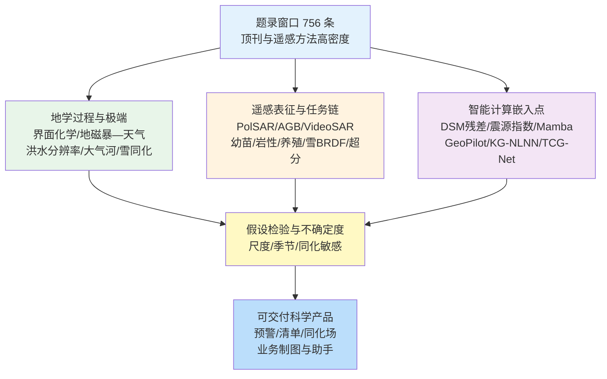
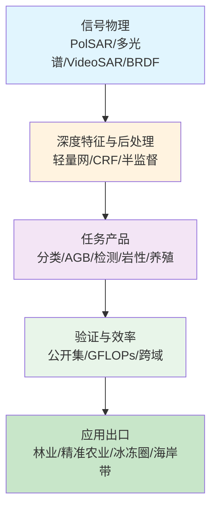
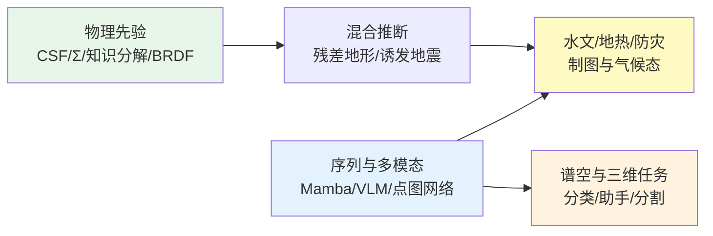
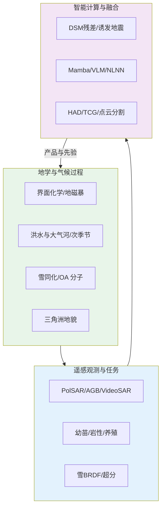

在 2026-05-12 至 2026-05-19 窗口内共有 756 篇论文条目，其中 Cell、Nature、Science 系列条目 176 篇，大气海洋与固体地球等领域顶刊及遥感特色期刊条目 281 篇。与仅统计数量的做法相比，更有信息价值的是条目在科学问题上的聚类方式：地学条目密集指向界面化学与气溶胶分子表征、空间天气—大气耦合、大流域洪水模拟分辨率敏感性、地中海大气河与极端降水、Ku 波段后向散射同化改进雪水当量、流域次季节环流—降水协同预报，以及三角洲对极端径流频率的非线性地貌响应；遥感条目则沿全极化 SAR 轻量深度网络与条件随机场后处理、少样本森林生物量迭代扩样、视频 SAR 动目标阴影检测、无人机多光谱幼苗检测、高原岩性谱—空深度学习、近岸养殖结构时序制图、雪面 BRDF 核驱动模型与轻量超分辨率双分支融合等工程链条展开；智能计算条目更多以“仅 DSM 推理的裸地地形残差学习、地热系统震源指数增强的深度学习预报、局部引导 Mamba 高光谱分类、工具增强遥感视觉语言助手、知识引导非局部土壤水分网络、盲斑 KAN 高光谱异常检测、再分析驱动的热带气旋生成气候态重建，以及 LiDAR 点—图双分支语义分割”等形式嵌入观测与模拟链路。

## 一、概述

近一周题录所呈现的研究互补性体现在多尺度过程与观测—学习接口的同步推进：微滴界面化学为大气二次无机气溶胶生成提供粒子尺度机制；地磁暴区域季节效应为太阳活动—天气联系提供可检验假说；嘉陵江流域小时洪水模拟揭示内部站点对网格分辨率的非线性敏感；地中海西部大气河算法适配为意大利北部极端降水提供气候统计锚点；Ku 波段后向散射同化在北极与湿润大陆性站点显著降低雪水当量集合预报评分；波河平原有机气溶胶分子簇揭示农业农药峰与冬季吸光组分并存；长江中下游 OCPCE 次季节模型在 10—40 天超前显著优于直接动力预报；三角洲极端径流间歇性改变形态指标呈现非单调响应。遥感侧 PolSAR 分类、森林 AGB 半监督扩样、视频 SAR 阴影检测、玉米幼苗缺失检测、西藏 GF-5 岩性制图、福建养殖筏式转型、雪 BRDF RTLSRS 与大角度光照稳定性、以及 DFCFNet 局部—非局部轻量超分共同强调“物理特征进入网络或后处理”。智能计算侧 DSM—DTM 残差、EGS 震源指数、LMamba、GeoPilot、KG-NLNN、BKP-Net、TCG-Net 与 PG-Net 则分别对应地形、诱发地震、谱空分类、多模态对话、土壤水、异常检测、气旋气候态与大规模点云语义等任务链。

## 二、本期研究印记图

本期印记可概括为“界面—过程—观测—推断”的闭合环路：地学过程研究为气溶胶化学、水文极端与冰冻圈同化提供机制与参数敏感边界，遥感方法研究为复杂地表与传感器缺陷提供可重复的处理协议，智能计算则在保持物理先验或工具可调用性的前提下扩展覆盖、压缩推理成本或增强可解释性。地中海大气河检测算法对陆缘几何的适配、嘉陵江内部站点对空间细化的响应、以及静止与极轨火点采样差异的并行讨论（见往期与本期遥感条目）共同提示：采样几何与时间窗本身应进入误差预算。

## 三、地学方向

### 3.0 方向综述与结构关系

地学条目在本期窗口内集中于悬浮液滴界面氧化、地磁暴对北美天气的区域季节效应、大流域小时洪水空间分辨率敏感性、地中海西部大气河检测与意大利极端降水对应、Ku 波段后向散射同化改进雪水当量、波河平原城乡有机气溶胶分子组成对比、长江中下游环流—降水重叠协同次季节预报，以及三角洲对极端径流频率的非线性地貌调整。

**表1 地学方向代表性研究的技术路线与要点**

| 研究主题 | 技术路线 | 技术特点 | 重要结论线索 |
| --- | --- | --- | --- |
| 微滴亚硝酸根氧化 | 光镊单滴拉曼 + 界面 OH 机制 | 体相无反应对照 | 气—水界面驱动硝酸盐自发形成 |
| 地磁暴—天气 | 67 年 Dst + ERA5 北美 | 排除宇宙线主导 | 区域季节效应远大于 TSI 长期均值 |
| 嘉陵江小时洪水 | 五档分辨率 + XGBoost 敏感 | 内部站优于出口 | 面积主导分辨率敏感；粗降水削弱细化收益 |
| 地中海大气河 | 算法陆缘适配 + 60 年气候 | 个例—极端降水对照 | 意大利中北部暴露区识别 |
| Ku 波段 SWE 同化 | SVS2-Crocus-SMRT + 粒子滤波 | 合成观测敏感性 | 北极与湿润大陆性 CRPS 降约 32% |
| 波河平原 OA 分子 | LC-HRMS 非靶向聚类 | 城乡对比一年 | 农药峰与冬季吸光组分并存 |
| 长江 OCPCE 次季节 | 重叠环流—降水 SVD + S2S 融合 | 抑制低技巧长超前 | 10—40 天技巧显著优于 ECMWF-S2S |
| 三角洲极端径流 | pyDeltaRCM 形态指标 | 间歇性非单调 | 中等间歇性三角洲最小、高低间歇性最大 |

### 3.1 专题画像：悬浮水微滴中亚硝酸根自发氧化与气—水界面羟基机制

**（1）技术路线：光镊单滴拉曼时序与 pH、粒径及气氛对照**

Meroni 等（2026）以光镊固定微米级含亚硝酸根水悬滴，利用拉曼光谱追踪 υ1(N–O) 硝酸盐特征峰随时间增强，系统改变 pH、初始亚硝酸根浓度、粒径及空气/氮气气氛，并以硫氰酸根清除界面羟基验证机制。实验在单滴尺度获得硝酸盐生成的时间演化，而在与体相相近的宏观溶液条件下未观察到同类氧化，从而把反应位置锁定在气—水界面。研究进一步利用液滴内产生的二氧化氮与界面羟基相互作用解释氧化路径，为大气二次无机气溶胶生成提供粒子尺度实验证据。

实验在 pH 与粒径梯度上重复测量以排除单纯浓缩效应，并在硫氰酸根存在时观察到硝酸盐信号几乎完全抑制，从而把界面 OH 自由基通道与体相路径区分开来。研究进一步讨论该机制对云凝结核活化后化学 aging 的潜在含义，指出微滴界面反应可能在数分钟至数小时尺度上改变颗粒无机盐组成，而传统箱模式往往假设体相平衡。

**（2）技术特点：单滴界面化学与体相对照实验设计**

该工作将“粒子效应”从经验关联推进到可操控界面的机制验证：通过气氛与 OH 清除剂实验区分界面自由基通道与体相反应，避免仅依赖浓度相关性的外推。光镊—拉曼联用可在真实相对湿度与电解质背景下保持单粒子身份，使时间分辨光谱可直接对应界面过程而非系综平均。

与系综滤膜采样相比，单滴实验避免混合不同粒径与不同反应历史的颗粒，使拉曼峰演化可直接归因于界面过程。该设计对验证“粒子效应”是否具有普适性尤为关键，因为以往许多观测仅能在浓度与粒径相关层面建立统计联系。方法上亦通过氮气气氛对照证明氧化并非单纯由液滴蒸发浓缩驱动。

**（3）重要结论：界面主导硝酸盐生成与 OH 关键作用**

结果表明含亚硝酸根微滴在空气中可自发形成硝酸盐拉曼信号，而氮气气氛与 OH 清除显著抑制该过程；体相溶液在相近化学条件下无对应氧化。该证据支持气—水界面羟基与 NO2 在液滴内的协同作用，是硝酸盐快速生成的关键。

从大气化学视角看，该结果意味着在高湿度、高亚硝酸根背景下，云滴与雾滴可在无额外氧化剂投加的条件下快速生成硝酸盐，从而改变颗粒吸湿性与辐射特性。对模式而言，需要在液滴模块中引入界面反应速率或等效源项，并在敏感性试验中评估其对硝酸盐质量浓度与气溶胶光学厚度的贡献量级。

该研究的重要结论是：**气—水界面羟基驱动的微滴尺度亚硝酸根氧化可自发形成硝酸盐，且该通道在体相中不活跃。**

对云滴化学模式与空气质量模型而言，该结论要求在参数化中区分界面反应速率与体相动力学，并重新评估高湿度颗粒物中二次无机气溶胶的生成潜力；对实验室方法学而言，为单粒子光谱诊断大气界面化学提供可复现流程。

### 3.2 专题画像：地磁暴对北美陆地天气的区域与季节效应及机制甄别

**（1）技术路线：67 年 Dst 指数与 ERA5 小时场统计关联**

Raeder（2026）利用 67 年每小时 Dst 地磁暴指数与 ERA5 再分析大气资料，在北美区域评估地磁暴对地面天气变量的影响幅度，并与长期太阳辐照度变化引起的全球平均地表温度影响量级对照。研究系统检验宇宙线—云量、太阳高能粒子与磁层电子降水等粒子沉降假说与观测的一致性，指出粒子机制与统计结果最不匹配。

分析采用小时分辨率 Dst 与 ERA5 多变量场，在北美子区域按季节分层回归或相关分析，以识别地磁暴发生后数小时至数天的地面响应型。研究将效应幅度与文献中 TSI 11 年周期对应的全球平均地表温度变化量级对照，强调地磁暴影响的区域局地性远强于 TSI 全球平均信号。

**（2）技术特点：多机制假说对照与区域季节分层**

通过把地磁暴影响与 TSI 长期效应分离，研究避免将太阳周期相关性与地磁活动效应混为一谈。区域与季节分层显示影响并非均匀全球分布，而是集中在特定陆区与季节窗，为“顶向下”电离层—平流层—极涡路径提供统计支持。

通过并行检验宇宙线—云量、高能粒子与磁层电子降水等机制，研究提供“多假说—单观测约束”的甄别框架，避免单一机制叙事。区域季节分层显示响应并非全年均匀，提示平流层—极涡调制可能只在特定季节窗打开向下影响通道。

**（3）重要结论：地磁暴天气效应量级与机制指向**

结果显示地磁暴对北美天气的影响可比长期 TSI 全球平均增温效应大两个数量级，且与宇宙线—云量假说不一致；更符合通过电离层或平流层化学—极涡通道的顶向下机制。该结论为空间天气—气候交叉研究提供可反驳的观测约束。

若顶向下机制成立，则空间天气活动应纳入季节预报与极端天气统计的背景场讨论，而非仅作为日侧电离层扰动。对气候模式而言，需要在耦合试验中评估地磁活动指数与平流层环流、地面温度异常的可重复联系，并量化其相对于温室气体与海洋变率的解释份额。

该研究的重要结论是：**地磁暴对北美天气具有显著区域季节效应，且统计上更支持顶向下平流层—极涡路径而非宇宙线—云量机制。**

对空间天气业务与气候归因研究而言，该工作提示地磁活动应作为极端天气统计中的候选外强迫；对模式开发而言，需要在耦合框架中显式或参数化电离层—平流层反馈，并避免将地磁暴效应简单等同于 TSI 变化。

### 3.3 专题画像：嘉陵江大流域小时洪水模拟的空间分辨率敏感性与内部站点差异

**（1）技术路线：五档网格与子流域分辨率 + XGBoost 敏感因子识别**

Ye 等（2026）在 157041 平方千米的嘉陵江流域，比较 1、3、5、10 公里及子流域划分五档空间分辨率下小时洪水模拟，在出口与多个内部水文站评估精度，并用 XGBoost 识别对分辨率敏感的洪水特征及其非线性影响。研究进一步检验在粗降水输入下细化网格是否仍能带来收益，为业务化洪水预报的空间配置提供依据。

洪水特征敏感因子通过 XGBoost 与 SHAP 或等价解释接口识别，将洪峰、涨水率、历时与前期湿润条件等量映射到分辨率收益的非线性响应面。研究在粗降水驱动情景下重复试验，以检验“仅提高陆面离散度”是否在降水场不足时失效，从而给出可操作的配置建议而非绝对最优网格。

**（2）技术特点：内部站与出口响应分离及降水—分辨率交互**

该设计突出“流域尺度平均指标”可能掩盖的内部站点收益：空间细化显著改善内部位置模拟，而出口改善有限。非线性敏感因子分析表明面积是主导因子，而降雨特征与下垫面属性以非线性方式调制最优分辨率，避免单一经验网格推荐。

出口站与内部站分离评估避免业务系统被出口指标误导：许多防洪关注点在支流汇合区与城镇河段，恰处于内部站点密集区。该设计对 15 万平方千米量级流域具有代表性，可推广到其他长江上游支流结构相似的大流域。

**（3）重要结论：分辨率收益的空间异质与降水限制**

结果表明空间细化对内部站点精度提升明显，对出口仅边际改善；强非线性洪水在 1—3 公里细网格最有效，但当降水输入变粗时细化收益迅速衰减，表明不能仅用更高空间分辨率弥补降水信息不足。

对洪水预警业务而言，建议在内部关键控制断面配置与出口同等严格的评分体系；对耦合模式而言，应优先投资降水场时空结构而非盲目全域 1 公里化，以免算力投入与精度收益不匹配。

该研究的重要结论是：**大流域小时洪水模拟中空间细化主要改善内部站点，且收益受流域面积与降水输入分辨率共同约束。**

对国家级洪水预报业务而言，该结论支持按洪水类型与站网布局选择分辨率，而非全域统一细网格；对耦合水文—气象预报而言，强调降水场质量与陆面离散化需协同优化。

### 3.4 专题画像：地中海西部大气河检测算法适配与意大利中北部极端降水气候统计

**（1）技术路线：陆缘几何适配算法 + 60 年 AR 气候与 ArCIS 降水对照**

Davolio 等（2026）针对地中海复杂陆缘与水汽输送形态，改造面向开阔大洋的大气河客观检测算法，并结合额外筛选准则识别影响意大利中北部的大气河事件。研究以 2018 年 10 月与 2020 年 10 月两次强降水个例检验流程，再对近 60 年西部地中海事件做气候统计，并利用 ArCIS 降水数据集分析最强大气河与极端降水的对应关系。

算法改造考虑地中海陆缘阻挡、阿尔卑斯地形强迫以及水汽输送通道弯曲等特点，使“河流状”高湿度带识别阈值与形状判据适应区域气候。个例研究覆盖 2018 与 2020 年两次意大利北部强降水过程，验证检测与后续极端降水的一致性。

**（2）技术特点：陆缘型水汽输送形态与个例—气候双尺度验证**

算法适配强调地中海大气河在几何与湿度结构上可与经典太平洋型事件不同，需避免直接移植海洋算法造成漏检或虚警。个例—气候双尺度验证使流程既可用于实时预警，也可用于长期暴露区制图。

气候统计将近 60 年西部地中海事件与 ArCIS 高分辨率降水资料链接，识别对大气河最敏感的意大利中北部子区。该双尺度验证使方法既可用于实时预警，也可用于长期暴露评估与保险再分析。

**（3）重要结论：意大利中北部暴露区与极端降水对应**

气候分析表明特定区域在大气河出现时更易出现极端降水，为阿尔卑斯前缘与波河平原等高风险区提供统计锚点。该结果连接大尺度水汽输送与区域灾害风险管理需求。

对防灾减灾而言，大气河目录可与水文模型耦合做超前蓄水与泄洪调度；对气候变化研究而言，为评估未来湿度输送增强情景下阿尔卑斯前缘降水极端提供历史基线。

该研究的重要结论是：**适配地中海陆缘的大气河检测可识别影响意大利中北部的长序列事件，并与区域极端降水暴露区对应。**

对地中海极端降水预警与气候归因而言，该工作提供可重复的事件目录；对模式评估而言，为验证动力预报的水汽输送结构提供观测型指标。

### 3.5 专题画像：Ku 波段后向散射同化改进加拿大多气候带雪水当量估计

**（1）技术路线：SVS2-Crocus-SMRT 合成观测 + 粒子滤波点尺度试验**

Leroux 等（2026）面向未来 Terrestrial Snow Mass Mission 双 Ku 波段任务，在 SVS2 陆面模式与 SMRT 辐射传输框架下开展合成同化试验，于北极、湿润大陆性与高山三站三年冬季，将后向散射与 SWE 合成观测分别同化并与开放循环对比，评估连续秩概率评分（CRPS）改善。

粒子滤波在点尺度同化每周 Ku 后向散射与 SWE 合成真值，开放循环作为基准，比较 CRPS 与偏差结构。SMRT 辐射传输连接雪包微物理与后向散射，使同化观测与模式状态变量物理一致。

**（2）技术特点：多站点气候带与扰动气象强迫集合**

试验使用高分辨率加拿大气象模式扰动生成集合，刻画气象强迫不确定度对雪包与后向散射的影响。合成框架可在任务发射前量化同化增益与观测误差阈值的敏感性，为业务系统设计提供先验。

三站代表北极、湿润大陆性与高山气候，覆盖加拿大典型雪季气象强迫扰动集合。试验为 TSMM 任务提供发射前观测误差与增益敏感性清单，并指出厚雪包区需联合其他观测（如重力或微波亮温）以避免后向散射饱和。

**（3）重要结论：后向散射同化与 SWE 观测等效性**

结果显示后向散射同化在北极与湿润大陆性站点可将 CRPS 降低最高约 32%，与较大误差 SWE 直接同化相当；高山站点增益约 5%，因厚雪包后向散射对 SWE 敏感性减弱。

对北方水资源管理而言，同化增益可直接转化为水库入流预报改进；对卫星任务设计而言，支持 500 米周分辨率 Ku 后向散射作为 SWE 业务化核心观测的分级论证。

该研究的重要结论是：**Ku 波段后向散射同化可在多气候带显著改进 SWE 集合预报，但厚雪高山站增益有限。**

对北方水文预报与卫星任务设计而言，该结论支持以 Ku 后向散射作为 SWE 业务同化的核心观测；对辐射传输与雪模式耦合而言，提示需在 SWE 大于约 300 千克每平方米区间重新评估敏感性。

### 3.6 专题画像：波河平原城乡有机气溶胶分子组成对比与农业农药峰

**（1）技术路线：一年 PM2.5 滤膜 LC-HRMS 非靶向聚类**

D'Angelo 等（2026）在波河平原农村农业与城市站点采集一年 PM2.5 滤膜共 250 个样本，采用液相色谱—高分辨质谱非靶向分析，并以聚类算法对有机分子进行分组与来源归因。研究量化 CHO 与 CHOS 氧化产物簇、燃烧相关含氮组分及站点特异性簇的贡献强度与时间变化。

非靶向 HRMS 在正负离子模式下检测数千分子式，聚类后按元素组成与时间序列共变归因。城乡并行采样一整年覆盖四季与农业施药季，使农药峰与冬季燃烧峰可在同一分析框架下比较。

**（2）技术特点：分子级时间序列聚类与吸光组分识别**

城乡对比揭示相同燃烧簇强度占比相近，但农业站出现农药相关簇并在五月 PM2.5 浓度较低时达到峰值，提示“浓度低但毒性风险未必低”的管理悖论。冬季高共轭化合物主导吸光有机气溶胶。

分子级表征揭示 PM2.5 质量浓度低时仍可出现毒性有机物峰值，挑战“浓度达标即安全”的管理逻辑。吸光有机组分与燃烧簇在冬季同步增强，为棕色碳与二次有机气溶胶气候效应提供化学指纹。

**（3）重要结论：氧化产物、燃烧与农药三类主导模态**

氧化产物簇在夏季峰值，占城市与农业站总强度约 31% 与 26%；燃烧相关簇约占 35%；农业站农药簇为站点特异信号。该研究为波河平原首次分子级 OA 表征。

对区域空气质量模型而言，应把农药与燃烧分子标志物纳入源解析验证；对公共卫生研究而言，为波河平原农业—城市复合暴露提供基线分子清单。

该研究的重要结论是：**波河平原有机气溶胶由氧化产物、燃烧与农业农药簇共同主导，低浓度期仍可能出现农药分子峰。**

对欧洲空气质量与农业政策而言，该结论要求将分子级农药排放纳入区域评估；对实验室外推而言，为模式验证提供分子指纹而非仅 PM2.5 质量浓度。

### 3.7 专题画像：长江中下游环流—降水重叠协同演化的次季节预报（OCPCE）

**（1）技术路线：重叠时间窗内观测近期演化与 S2S 可预报环流融合**

Fang Zhou 等（2026）提出重叠环流—降水协同演化（OCPCE）框架，将近期观测环流演化与动力次季节—季节模式中高技巧超前部分在最优重叠窗内融合，通过演化奇异值分解实现降水异常降尺度预报，针对长江中下游强降水与洪水风险。

OCPCE 在最优重叠窗内融合观测近期环流演化与 ECMWF-S2S 等高技巧超前环流场，通过演化 SVD 建立环流—降水联合模态，再投影至降水异常预报。该流程兼顾物理相干性与统计降尺度灵活性。

**（2）技术特点：从单纯动力降尺度到观测—预报重叠集成**

核心创新在于保留有用初值信息同时抑制低技巧长超前预报，使 10—40 天概率预报在流域尺度具有业务可用技巧。该设计与传统仅对模式环流做统计降尺度相比，更贴合次季节可预报性来源的时间结构。

相对直接解读 S2S 降水场，OCPCE 显式利用环流可预报性高于降水的经验事实，并抑制长超前低技巧信息污染。概率预报产品可直接服务流域水库与防汛指挥部风险沟通。

**（3）重要结论：确定性技巧与概率可靠性**

OCPCE 在长江中下游取得统计显著确定性技巧，并在 10—40 天超前提供可靠概率预报，显著优于直接 ECMWF-S2S 降水预测，为早期洪水预警与防灾减灾提供物理一致且可操作的框架。

对次季节预测业务化而言，该框架提供可复制的后处理模块；对气候服务而言，10—40 天窗口技巧提升可转化为更早的物资与人员部署窗口。

该研究的重要结论是：**重叠环流—降水协同演化模型可在 10—40 天超前显著改进长江中下游次季节降水预报。**

对流域洪水防御与水库调度而言，该框架可作为动力预报的统计—动力混合后处理；对 S2S 研究而言，为如何切割与融合超前时效提供可推广模板。

### 3.8 专题画像：三角洲对极端径流频率的非线性地貌响应

**（1）技术路线：pyDeltaRCM 数值实验与形态指标分析**

Prasojo 等（2026）使用 pyDeltaRCM 模型在两数量级极端径流间歇性参数空间内模拟三角洲演化，分析面积、通道数量与宽度、坡度及通道迁移率等指标，提出极端流量频率改变下三角洲调整的概念模型。

pyDeltaRCM 在两数量级极端径流间歇性参数下运行长时间地貌演化，提取面积、通道数、宽度、坡度与迁移率等指标，识别非单调响应区间。概念模型总结驱动因子，连接洪水频率变化与海岸带形态风险。

**（2）技术特点：间歇性参数非单调形态响应**

结果显示中等间歇性下三角洲面积最小、通道最窄最少；低与高间歇性下三角洲更大、通道更宽更多，而通道迁移率对间歇性不敏感、坡度随间歇性单调下降。该非线性响应挑战“极端事件频率单调改变形态”的直觉。

结果表明通道迁移率对间歇性不敏感而坡度单调下降，提示不同地貌指标对强迫的响应时间尺度不同。该分离有助于解释现场观测中“形态变化滞后于水文变化”的现象。

**（3）重要结论：形态指标与驱动机制概念模型**

研究识别控制非线性响应的驱动因子并构建概念模型，为气候变化下洪水频率变化的海岸带地貌投影提供定量化工具。

对三角洲人居区规划而言，不能假设洪水频率单调增加必然导致三角洲萎缩；需结合间歇性结构做情景分析。对数值地貌教学与模型基准而言，提供可重复的非线性响应实验集。

该研究的重要结论是：**三角洲形态对极端径流间歇性呈非线性响应，中等间歇性对应最小三角洲与最窄通道格局。**

对海岸带风险管理与三角洲人居安全而言，该结论提示不能仅用极端事件强度增量推断地貌后果，需同时考虑频率结构变化；对数值地貌学而言，为耦合洪水—泥沙—形态反馈提供基准实验。

## 四、遥感方向

### 4.0 方向综述与结构关系

遥感条目在本期窗口内突出表现为“极化与轻量深度网络结合概率图优化”“少样本迭代扩样提升森林生物量制图”“视频 SAR 阴影语义增强检测”“无人机多光谱幼苗端到端检测”“高原高光谱岩性谱—空统一网络”“近岸养殖深度学习时序监测”“雪面 BRDF 核驱动模型跨平台验证”，以及“局部—非局部双分支轻量超分辨率”。上述主题共同强调：遥感产品价值取决于是否把传感器物理、标注策略与计算效率一并写入问题定义。

**表2 遥感方向代表性研究的技术路线与要点**

| 研究主题 | 技术路线 | 技术特点 | 重要结论线索 |
| --- | --- | --- | --- |
| PolSAR 分类 | LiteDSANet + 极化引导 DenseCRF | 轻量 + 空间一致 | AIRSAR/RADARSAT-2 精度提升 2.14%—15.36% |
| 大兴安岭 AGB | I-QBC 半监督集成 + Sentinel-2 | 迭代自训练扩样 | R2 峰值约 0.88；储量约 1.46—1.71×10^7 Mg |
| Video SAR 阴影 | DSENet DIE/SSFA/DSF | 细节—语义融合 | SNL 数据集 P 92.4%，F1 83.1% |
| 玉米幼苗 | Seedling-DETR 多光谱 | 缺失单株标注 | mAP@0.5 83.1%；缺失 AP 71.7% |
| 西藏岩性 | GF-5 AHSI + SSUN | 谱特征选择 | OA 90.94%，Kappa 0.8917 |
| 福建养殖 | Sentinel-2 + U-Net 时序 | GEE 自动化 | 筏式主导与季节扩张—收缩 |
| 雪 BRDF | RTLSRS 多平台拟合 | 大天顶角稳健 | SZA>80° 仍 RMSE<0.05 |
| 遥感超分 | DFCFNet DBFA+EFFN | 轻量双分支 | 遥感集最优且可迁移自然图像 |

### 4.1 专题画像：LiteDSANet 与极化特征引导 DenseCRF 的全极化 SAR 土地覆盖分类

**（1）技术路线：轻量动态序列轴向网络初始分类 + 极化引导概率图优化**

Huang 与 Liu（2026）提出融合轻量动态序列轴向网络（LiteDSANet）与极化特征引导稠密条件随机场（PFG-DenseCRF）的 PolSAR 分类框架。LiteDSANet 生成初始类别概率图，PFG-DenseCRF 引入极化特征优化空间一致性，在 San Francisco Bay 与 Flevoland 的 AIRSAR L 波段与 RADARSAT-2 C 波段数据上覆盖农业、城市与自然场景。

LiteDSANet 以轻量动态序列轴向注意力提取 PolSAR 极化纹理，PFG-DenseCRF 在概率域引入极化协方差特征作为 pairwise 约束。两阶段流程兼顾深度特征表达与 Markov 随机场空间平滑。

**（2）技术特点：轻量深度网络与概率图后处理协同**

该框架在精度与计算效率之间取得平衡：深度网络处理复杂纹理，CRF 抑制斑点噪声导致的孤立误分类。极化特征进入 CRF  pairwise 项，使优化过程保持物理可解释性。

在 San Francisco 与 Flevoland 多频段数据集上，方法对强噪与异质纹理区保持稳定，说明“深度初始 + 物理后处理”优于单纯加深网络。计算开销适合中等算力集群的业务化处理。

**（3）重要结论：多区域多频段精度提升**

实验显示相较其他方法分类精度提升约 2.14% 至 15.36%，在不同区域环境保持稳定，证明轻量网络与极化引导后处理对 PolSAR 业务制图的适用性。

对国土变更监测与湿地制图而言，该流程提供可复现精度—效率折中；对 PolSAR 机器学习而言，为极化特征进入 CRF 提供工程模板。

该研究的重要结论是：**LiteDSANet 与极化引导 DenseCRF 融合可在多场景 PolSAR 分类中同步提升精度并保持计算效率。**

对国土测绘与灾害监测而言，该流程可作为中等算力平台上的 PolSAR 分类基线；对深度学习遥感而言，为“网络输出 + 物理特征 CRF”提供可复现模板。

### 4.2 专题画像：大兴安岭森林地上生物量半监督集成学习与 I-QBC 样本扩增

**（1）技术路线：Sentinel-2 特征 + 反向查询委员会迭代自训练**

Zhou 等（2026）针对样地稀缺问题，提出基于半监督集成学习（SSEL）的 AGB 估测方法，以反向查询委员会（I-QBC）策略迭代扩充训练样本，并结合递归特征消除交叉验证筛选 GNDVI、PSSRa、坡度与纹理相关等关键变量，在大兴安岭地区开展制图与储量估算。

SSEL 以 I-QBC 主动选择高不确定像元加入训练集，迭代直至 R2 稳定。RFECV 筛选 GNDVI、PSSRa、坡度与纹理相关变量，降低过拟合风险。Sentinel-2 时相组合覆盖生长季关键物候。

**（2）技术特点：迭代自训练与特征选择耦合**

I-QBC 驱动扩样在样本增量 20 与 30 时分别达到稳定 R2 约 0.80 与峰值约 0.88，显著优于传统树模型集成。该方法把“主动选择不确定样本”引入林业遥感，缓解地面样地成本约束。

样地稀缺是温带森林碳监测的普遍瓶颈；迭代扩样把未标注像元转化为伪标签的同时控制误差传播。储量估算给出 1.46×10^7—1.71×10^7 兆克区间，服务区域碳收支报告。

**（3）重要结论：区域储量与最优样本规模**

研究估算研究区 AGB 储量约 1.46×10^7 至 1.71×10^7 兆克，为碳收支监测提供空间显式产品。

对林业部门而言，可在降低样地密度的前提下维持制图精度；对半监督遥感方法论而言，证明 I-QBC 在回归任务中优于随机扩样。

该研究的重要结论是：**I-QBC 半监督集成可在少样本条件下将大兴安岭 AGB 估测 R2 提升至约 0.88 并给出储量区间。**

对国家公园与林业碳汇核算而言，该框架降低对密集样地的依赖；对半监督遥感而言，为迭代扩样策略在回归任务中的稳定性提供实证。

### 4.3 专题画像：视频 SAR 动目标阴影检测的细节—语义增强网络 DSENet

**（1）技术路线：DIE 无损下采样 + SSFA 语义聚合 + DSF 颈融合**

Wu 等（2026）针对视频 SAR 中目标运动导致散焦、需依赖阴影定位实时位置的问题，提出 DSENet，包含细节信息增强（DIE）模块、语义空间特征聚合（SSFA）模块与细节语义融合（DSF）模块，在 Sandia 国家实验室公开数据集上验证。

DSENet 在视频 SAR 序列上联合 DIE 保细节下采样、SSFA 聚合语义上下文与 DSF 融合颈特征，针对阴影低对比与尺度变化设计。训练与测试基于 SNL 公开视频 SAR 数据。

**（2）技术特点：阴影尺度变化与低对比背景**

DIE 减少骨干网络下采样造成的阴影细节损失；SSFA 增强阴影区域上下文语义；DSF 在颈网络融合细节与语义，提高对杂波干扰的鲁棒性。

运动目标散焦使回波定位失效，阴影成为实时跟踪唯一稳定观测；因此阴影检测精度直接决定下游跟踪与识别链路可用性。模块消融验证 DIE、SSFA、DSF 各自贡献。

**（3）重要结论：公开数据集检测指标**

在 SNL 数据集上 DSENet 取得精确率约 92.4%、F1 约 83.1%，对比与消融实验表明各模块均贡献性能增益。

对视频 SAR 监视系统而言，该网络可作为实时阴影检测前端；对 SAR 目标检测研究而言，为“阴影作为目标代理”提供深度基准。

该研究的重要结论是：**DSENet 在视频 SAR 阴影检测上达到 P 92.4% 与 F1 83.1%，优于对比方法。**

对视频 SAR 监视与目标跟踪而言，该网络提供可部署的阴影检测前端；对 SAR 深度学习而言，为运动目标阴影这一特殊目标类提供结构化解法。

### 4.4 专题画像：无人机多光谱玉米幼苗 Seedling-DETR 与缺失苗检测

**（1）技术路线：RT-DETR 改造 + 混合尺度融合 + 通道融合多光谱**

Yang 等（2026）构建多光谱无人机数据集，对缺失幼苗进行单独标注而非间接推断，改造 RT-DETR 特征融合模块并设计通道融合模块，在不专用多光谱骨干的情况下融入多波段信息，在 8:2 随机划分与独立日期验证集上评估。

数据集对缺失幼苗单株标注，改造 RT-DETR 混合尺度融合并设计通道融合模块，使 RGB 与多光谱可在统一骨干下训练。正射镶嵌分析验证田块尺度统计一致性。

**（2）技术特点：端到端检测与缺失苗细粒度标注**

RGB 输入 mAP@0.5 约 83.1%，优于 YOLOv11x 与 RT-DETR；缺失苗 AP@0.5 约 69.3%，多光谱提升至约 71.7%。计算量约 282—418 GFLOPs，参数量约 84—85 百万，仍可田间部署。

缺失苗检测 AP 低于出苗检测，说明细粒度缺失标注策略对模型学习至关重要。多光谱通道融合在不增加专用多光谱预训练骨干的情况下提升缺失苗识别。

**（3）重要结论：田间正射验证**

正射镶嵌分析进一步验证田块尺度可用性，为出苗监测与补种决策提供自动化工具。

对种业与合作社而言，可支持出苗后一周内补种决策；对农业 UAV 软件链而言，提供端到端检测而非后处理推断缺失的范式。

该研究的重要结论是：**Seedling-DETR 在多光谱 UAV 幼苗检测上 mAP@0.5 达 83.1%，缺失苗 AP 多光谱下达 71.7%。**

对精准农业与种业管理而言，该模型支持近实时补种决策；对农业遥感数据集建设而言，强调缺失苗独立标注策略对检测精度的决定性作用。

### 4.5 专题画像：西藏贡觉县 GF-5 AHSI 高光谱岩性 SSUN 谱—空统一分类

**（1）技术路线：全波段/短波红外诊断/特征选择数据集 + 四模型对比**

Liu 等（2026）以西藏昌都贡觉县为试验区，首次系统应用 GF-5 AHSI 数据构建全波段、短波红外诊断波段与特征选择波段三类数据集，对比 SVM、LSTM、MSCNN 与谱—空统一网络（SSUN），评估谱特征选择与深度学习在高原复杂岩性环境下的表现。

GF-5 AHSI 构建全波段、SWIR 诊断波段与特征选择波段三套输入，对比 SVM、LSTM、MSCNN 与 SSUN。SSUN 联合一维谱序列与二维空间卷积，增强岩性边界连续性。

**（2）技术特点：谱序列与空间上下文联合提取**

SSUN 联合提取光谱序列特征与空间上下文，抑制噪声并增强岩性边界连续性；短波红外被确认为岩性判别关键谱段。

高原复杂岩性与噪声背景下，传统 SVM 难以利用空间上下文；SSUN 在降维后仍保持 OA 约 90.94%，说明谱—空联合对业务填图可行。

**（3）重要结论：精度与效率平衡**

SSUN 总体精度约 90.94%，Kappa 约 0.8917，较 SVM 基线（OA 约 74.67%）显著提升，且在降维后仍保持高精度，说明谱—空深度学习可在效率与精度间取得平衡。

对区域地质调查而言，缩短野外验证周期；对国产卫星应用而言，证明 AHSI 在高原岩性填图中的光谱保真度与实用精度。

该研究的重要结论是：**SSUN 在 GF-5 AHSI 高原岩性填图中 OA 达 90.94%，显著优于传统 SVM 与单分支深度模型。**

对青藏高原地质调查与矿产远景预测而言，该流程提供可复制的谱—空分类方案；对国产卫星数据应用而言，验证 GF-5 AHSI 在高原岩性识别中的光谱保真度。

### 4.6 专题画像：福建近岸养殖筏式结构转型的 Sentinel-2 深度学习监测

**（1）技术路线：GEE 多时相 Sentinel-2 + U-Net/DeepLabV3+/RF 对比**

Zhang 等（2026）利用 Google Earth Engine 处理 2017—2024 年 Sentinel-2 影像，对比 U-Net、DeepLabV3+ 与随机森林识别筏式与网箱养殖，选定 U-Net 进行全省尺度制图并量化宁德与漳州双核心时空演变。

GEE 云端处理 2017—2024 年 Sentinel-2，对比 U-Net、DeepLabV3+ 与 RF，选定 U-Net 做全省养殖斑块提取。冬夏对比与年际序列量化宁德、漳州双核心演变。

**（2）技术特点：光学复杂近岸条件下的分割稳定性**

U-Net 在近岸光学复杂条件下表现最稳定，揭示养殖系统从网箱—筏式混合向筏式主导转型，并伴随从近岸向内湾口与开阔水域的空间再分布。

近岸光学复杂性使分割模型稳定性成为首要指标；U-Net 在筏式与网箱混淆区表现最佳。养殖从网箱向筏式转型伴随空间向湾口迁移。

**（3）重要结论：季节与年际变化**

2024 年冬夏对比显示筏式养殖冬扩夏缩，网箱季节变化较小；年际上养殖密度向湾口迁移。

对海洋功能区划与养殖容量管控而言，提供长期、模式分异的观测证据；对环境影响评估而言，支持养殖扩张与近岸水质压力的空间显式分析。

该研究的重要结论是：**U-Net 驱动的 Sentinel-2 监测揭示福建养殖筏式主导与向湾口空间再分布。**

对海洋空间规划与养殖环境风险管理而言，该研究提供模式分异的长期观测证据；对近岸遥感而言，为复杂水体深度学习制图提供省级尺度案例。

### 4.7 专题画像：雪面 BRDF RTLSRS 核驱动模型跨平台与大天顶角稳定性

**（1）技术路线：地基/塔基/航空/卫星多角度数据 + RTLSRS 拟合**

Guo 等（2026）全面评估 RossThick-LiSparseReciprocal-Snow（RTLSRS）模型在不同平台与全光学波段对雪面各向异性反射的重建能力，重点分析大太阳天顶角（SZA）与相对方位角（RAA）偏离主平面时的稳定性，并评估含尘雪面的补充情形。

RTLSRS 在地面、塔基、航空与卫星多角度数据上拟合雪 BRDF，重点评估 SZA 超过 80° 与 RAA 偏离主平面情形，并补充轻杂质雪面。

**（2）技术特点：极端光照几何与杂质雪面扩展**

相较纯雪研究，本工作把模型检验扩展到 SZA 超过 80° 与非主平面观测，以及轻杂质雪面，为业务化雪 BRDF/反照率反演提供误差边界。

大天顶角稳定性对高纬冬季反照率产品尤为关键；传统模型在大 SZA 下易发散。杂质雪扩展使模型适用于粉尘沉降等真实冰冻圈情景。

**（3）重要结论：拟合精度与谱段适用性**

RTLSRS 在多种 SZA 下保持 BRDF 重建 RMSE 低于约 0.05；MODIS 数据 R2 接近 0.5；1300 纳米以下对轻杂质雪散射特征重建有效。

对卫星反照率业务算法而言，支持 RTLSRS 纳入候选核驱动族；对气候模式雪辐射参数化而言，提供多角度观测约束误差上限。

该研究的重要结论是：**RTLSRS 在大 SZA 与非主平面观测下仍保持 BRDF 重建 RMSE 低于约 0.05，具备业务化潜力。**

对冰冻圈辐射收支与卫星雪反照率产品而言，该结论支持将 RTLSRS 纳入业务算法；对极地低太阳高度观测而言，提供辐射校正可靠性依据。

### 4.8 专题画像：DFCFNet 局部—非局部双分支互补融合的遥感图像超分辨率

**（1）技术路线：DBFA 双分支 + EFFN 精炼 + 部分卷积通道混合**

Zhang 等（2026）提出 DFCFNet，包含轻量双分支特征聚合（DBFA）与高效前馈网络（EFFN）。DBFA 中聚焦局部分支（FLFB）用部分卷积通道混合器建模局部模式，非聚焦探索分支（NFEB）用全局方差分析提取非局部特征，实现局部与全局信息互补。

DBFA 并行 FLFB 局部部分卷积与 NFEB 全局方差分支，EFFN 精炼融合特征。网络在遥感超分数据集与自然图像五数据集均验证，证明泛化性。

**（2）技术特点：计算效率与跨任务可迁移**

相较一味堆叠复杂结构的方法，DFCFNet 在遥感超分数据集上取得最优重建质量，同时在计算效率与网络复杂度上表现更优，并成功迁移至五套自然图像超分数据集。

局部—非局部双分支避免仅堆叠 Transformer 带来的算力膨胀，适合星载或边缘端实时增强。部分卷积通道混合降低冗余计算。

**（3）重要结论：遥感与自然图像一致增益**

实验表明双分支互补设计可同时捕获局部纹理与全局上下文，EFFN 进一步精炼 DBFA 输出以利用细节信息。

对遥感智能解译前端而言，超分可提升小目标检测与变化检测输入质量；对轻量网络研究而言，为双分支互补融合提供可消融结构。

该研究的重要结论是：**DFCFNet 在遥感超分上兼顾最优重建质量与轻量复杂度，并可迁移至自然图像任务。**

对星载与无人机实时增强而言，该网络适合资源受限边缘节点；对超分架构研究而言，为局部—非局部显式分支融合提供可消融基线。

## 五、地球观测智能计算与机器学习范式

### 5.0 方向综述与结构关系

智能计算在本期题录中主要承担四类角色：其一，以 DSM 衍生特征与残差学习重建裸地地形；其二，以震源指数等物理参数增强地热系统诱发地震率深度学习预报；其三，以局部引导 Mamba、工具增强视觉语言模型、知识引导非局部网络与盲斑 KAN 处理谱—空与多模态任务；其四，以深度残差网络从再分析重建热带气旋生成气候态，并以点—图双分支网络处理大规模 LiDAR 语义分割。公开综述强调遥感基础模型正从单模态走向多模态，但数据对齐与算力成本仍是系统瓶颈。

**表3 地球观测智能计算方向代表性研究的技术路线与要点**

| 研究主题 | 技术路线 | 技术特点 | 重要结论线索 |
| --- | --- | --- | --- |
| DSM—DTM | 残差 DH 预测 + CSF 先验 + 梯度约束 | 推理仅用 DSM 衍生 | MAE 0.8538 m，优于 FathomDEM |
| EGS 地震率 | 两阶段压力—地震率 + 震源指数 Σ | 物理参数嵌入 DL | Σ 改善瞬变捕捉 |
| LMamba | MACB + 局部引导 2D 扫描 | 线性复杂度谱空 | 三数据集 OA/AA/Kappa 领先 |
| GeoPilot | 工具增强 VLM + 光学/SAR | 规划准确率 92.6% | 跨域对话与检测分割 |
| KG-NLNN | 非局部土壤水 + 四层物理分解 | 可解释权重 | 知识引导更稳更抗噪 |
| BKP-Net | BPP 先验净化 + 盲斑 KAN | 抑制异常泄漏 | 四数据集 HAD 竞争力 |
| TCG-Net | 18 层残差 CNN + MERRA-2 | 欠采样 + 时序富集 | PD F1 0.39，DD F1 0.33 |
| PG-Net | 点分支 LAFA + 图分支 DGFA | 双分支互补 | Toronto3D OA 97.69% |

### 5.1 专题画像：仅依赖 DSM 衍生输入的残差学习 DSM—DTM 重建

**（1）技术路线：Copernicus DEM GLO-30 + CSF 先验与坡度曲率特征 + 残差 U-Net**

Dong 等（2026）预测残差 DH=DSM−DTM 而非直接回归高程，推理阶段所有输入均由 DSM 生成，包括 CSF 滤波先验、坡度、坡向编码、曲率与局部起伏，采用加权 Huber 损失及梯度一致与 DTM 坡度一致约束，在美国中南部多区域与阿肯色州独立区域验证。

训练以 Copernicus DEM GLO-30 为输入，标签来自高质量 DTM，预测残差 DH 后回代得到裸地。损失含 Huber、梯度一致与 DTM 坡度一致项，约束水文可解释地形。

**（2）技术特点：无外部辅助数据推理与多约束损失**

与依赖多源地形校正产品的方法不同，该框架强调部署时仅需单一 DSM 源，适合全球尺度批量裸地提取。剩余误差集中于极陡地形、茂密植被与大残差高度区。

推理阶段不引入激光雷达或土地覆盖等外部产品，使全球批量处理成为可能。阿肯色州独立区验证表明空间泛化性良好，误差仍集中在植被冠层厚、地形极陡区。

**（3）重要结论：相对公开 DEM 产品误差降低**

相较 FathomDEM，研究区测试集平均绝对误差由约 1.0445 米降至约 0.8538 米，均方根误差由约 1.6969 米降至约 1.4697 米，并改进 NMAD、P99 与 5 米召回等指标；独立区域表现与区内测试接近。

对洪水淹没制图与土壤侵蚀模型而言，裸地 DTM 是核心输入；该框架为全球 DSM 用户提供了可部署的校正路径。

该研究的重要结论是：**残差 U-Net 仅用 DSM 衍生特征即可将裸地 DTM 误差降至 MAE 约 0.85 米量级并优于对比公开产品。**

对水文地貌模拟与洪泛区分析而言，该结论支持以全球 DSM 快速生成裸地产品；对深度学习地形校正而言，为“残差 + 物理坡度约束”提供可迁移范式。

### 5.2 专题画像：震源指数增强的犹他 FORGE 与 EGS Collab 诱发地震率深度学习预报

**（1）技术路线：两阶段注入压力预报 + 地震率预报 + 震源指数 Σ**

Zhang 等（2026）定制深度学习模型，先预报注入压力再预报地震率，在场地尺度 Utah FORGE 与矿井尺度 EGS Collab 项目上验证。引入震源指数 Σ 后，模型对地震率瞬变变率的捕捉显著改善，虽无 Σ 时误差已较低。

模型分两阶段：先预报注入压力，再预报地震率；震源指数 Σ 由原始观测计算并作为额外输入。Utah FORGE 与 EGS Collab 跨尺度验证展示可迁移性。

**（2）技术特点：物理参数嵌入数据驱动框架**

该设计表明从原始观测计算的关键物理指标可提升黑箱模型外推能力，为下一代增强地热系统跨尺度预报提供模板。

无 Σ 时误差已较低，加入 Σ 后改善对注入计划突变引起的瞬变捕捉，说明物理指标对黑箱外推至关重要。该混合框架符合增强地热系统监管对可解释预报的需求。

**（3）重要结论：跨尺度适用与瞬变捕捉**

两阶段策略在场地与矿井尺度均成功预报地震率，Σ 的引入改善对注入计划变化引起的瞬变响应，支持物理—数据混合预报业务化探索。

对运营方而言，可支持实时调整注入速率；对地震灾害研究而言，为物理—数据驱动融合提供可复现基准。

该研究的重要结论是：**将震源指数 Σ 嵌入深度学习可显著改善增强地热系统地震率瞬变预报。**

对诱发地震风险管理与注入方案优化而言，该框架提供可解释增强的预报工具；对地热开发监管而言，支持把物理指标作为模型标配输入。

### 5.3 专题画像：局部引导 Mamba 高光谱分类 LMamba

**（1）技术路线：MACB 多尺度聚合压缩 + 局部引导二维扫描 SSM**

Yang 等（2026）提出 LMamba，以多尺度分组卷积 MACB 降低谱冗余并提取多尺度空间特征，以局部引导二维扫描将邻域上下文注入 Mamba 选择性状态空间参数生成，保持线性复杂度同时保留二维结构连续性，在三个高光谱基准数据集验证。

MACB 以多尺度分组卷积压缩谱维并提取空间纹理，局部引导二维扫描将邻域上下文注入 Mamba 状态空间参数。三套公开高光谱基准上对比 CNN、Transformer 与其他 SSM。

**（2）技术特点：谱冗余压缩与 2D 扫描改造**

相较单向一维扫描，局部引导扫描避免空间结构在序列化中损失；MACB 并行多核卷积兼顾效率与多尺度表征。

一维扫描破坏二维邻域结构是 HSI 深度模型常见缺陷；局部引导扫描在保持线性复杂度的同时修复空间连续性。通道压缩缓解谱冗余带来的过拟合。

**（3）重要结论：分类精度对比 CNN/Transformer/Mamba**

LMamba 在 OA、AA 与 Kappa 上稳定优于 CNN、Transformer 与其他 SSM 方法，表明局部上下文条件化对高光谱分类有效。

对高分遥感分类业务而言，LMamba 提供精度—算力折中；对 Mamba 遥感化而言，为输入依赖参数注入邻域信息提供可推广模块。

该研究的重要结论是：**LMamba 通过局部引导二维 Mamba 与多尺度 MACB 在三套高光谱基准上达到领先分类精度。**

对精细农业、矿物填图与军事目标识别而言，该架构提供高精度—效率折中；对状态空间模型遥感应用而言，为输入依赖参数注入邻域信息提供范例。

### 5.4 专题画像：跨域工具增强遥感视觉语言框架 GeoPilot

**（1）技术路线：大规模光学—SAR 指令数据 + 工具调用策略 + GeoPilotBench**

Zhou 等（2026）提出 GeoPilot，可解析用户指令、自主决定是否调用外部工具并综合工具输出，支持光学与 SAR 的视觉 grounding、检测、分割与跨域推理。构建含工具推理轨迹的遥感指令数据集与 GeoPilotBench 基准。

GeoPilot 基于大尺度光学—SAR 指令数据训练工具调用策略，支持检测、分割、视觉 grounding 与跨域问答。GeoPilotBench 评估规划与端到端任务表现。

**（2）技术特点：工具增强与跨域多任务对话**

实验显示整体规划准确率约 92.6%，在 VQA、SAR 理解与指代表达检测等任务上具竞争力，且端到端开销相对独立工具执行增加有限，表明工具策略学习有效。

通用 VLM 在遥感细粒度任务上常缺乏工具链；GeoPilot 通过显式工具决策降低幻觉并提高数值与空间答案可信度。规划准确率约 92.6% 表明指令理解可靠。

**（3）重要结论：规划精度与任务性能**

GeoPilot 在代表性任务上达到强规划与任务性能，为遥感档案智能解译提供可扩展助手范式，缓解通用 VLM 在遥感细粒度任务上的不足。

对灾害应急与城市规划部门而言，可把多源遥感分析封装为对话式工作流；对多模态基础模型研究而言，提供光学—SAR 联合工具学习基准。

该研究的重要结论是：**GeoPilot 工具增强遥感 VLM 规划准确率约 92.6%，并在多任务上具实用性能。**

对环境监测、灾害应急与城市规划而言，该助手可串联检测分割工具完成复合查询；对多模态基础模型研究而言，为光学—SAR 联合指令微调提供数据与评测基准。

### 5.5 专题画像：知识引导非局部神经网络 KG-NLNN 土壤水分预测

**（1）技术路线：嵌入高斯与解耦知识引导非局部操作 + 单时刻多深度同时预报**

Wang 等（2026）将土壤水预测转为单时间步多深度同时预报，提出 SA-NLNN 与 KG-NLNN 两变体。知识引导非局部操作将某深度土壤水影响分解为四层物理过程分量，学习权重可视化层间连通，现场观测验证精度与抗噪性。

KG-NLNN 将土壤水多深度预测转为单时刻联合预报，知识引导非局部算子把垂向影响分解为四层物理过程。权重可视化展示层间连通，现场观测验证精度与抗噪。

**（2）技术特点：可解释非局部权重与物理分解**

KG-NLNN 较纯自注意力版本解释更稳定合理，知识引导显著提升精度、可靠性与噪声鲁棒性，并在多时间尺度场景保持高效。

相对 SA-NLNN，知识分解使解释更符合土壤水分运移概念，且在噪声试验中更稳健。模型在多时间尺度场景保持计算效率，适合嵌入陆面同化试验。

**（3）重要结论：现场验证与噪声试验**

结果表明物理知识嵌入可改善数据驱动土壤水模型的泛化与可解释性，为非局部算子在地球科学中的使用提供范例。

对农业灌溉管理而言，可提供可审计的剖面含水量预报；对物理信息深度学习而言，展示如何把领域方程概念嵌入非局部连接。

该研究的重要结论是：**KG-NLNN 通过四层物理分解的知识引导非局部操作显著提升土壤水分预测精度与可解释性。**

对农业灌溉与陆面同化而言，该模型提供可审计的层间相互作用表征；对物理信息深度学习而言，展示如何把水分运移概念嵌入注意力式连接。

### 5.6 专题画像：盲斑 KAN 背景重建网络 BKP-Net 高光谱异常检测

**（1）技术路线：BPP 背景先验净化 + 盲斑 KAN 重建 + GRR 检测精炼**

Yu 等（2026）针对高光谱异常检测中背景流形非线性与异常泄漏问题，提出 BKP-Net。背景先验净化（BPP）模块通过空间聚类与稳健加权均值抑制异常像素污染先验；盲斑 KAN 重建骨干（BKCN）阻止中心像素信息直通；检测阶段采用分波段引导重建精炼（GRR）。

BPP 模块用聚类与稳健加权均值净化背景先验，BKCN 盲斑 KAN 阻止中心像素直通，GRR 在检测阶段分波段精炼重建。四数据集对比验证竞争力。

**（2）技术特点：数据与模型双侧抑制异常泄漏**

KAN 强非线性能力若不加约束易导致异常被重建，盲斑结构与 BPP 从两侧缓解该问题；可分离卷积与注意融合进一步抑制跨域干扰。

异常泄漏是高光谱重建检测的核心难题；BKP-Net 从数据净化与结构盲斑双侧抑制。KAN 非线性与可分离卷积、注意融合共同提升背景流形拟合。

**（3）重要结论：四数据集对比结果**

在四个高光谱数据集上 BKP-Net 达到与代表性方法竞争的性能，证明先验净化与盲斑 KAN 联合设计的有效性。

对矿产与军事监视而言，提供无目标光谱库异常检测选项；对 KAN 遥感应用而言，给出控制过拟合异常的结构范式。

该研究的重要结论是：**BKP-Net 通过背景先验净化与盲斑 KAN 重建显著缓解高光谱异常检测中的异常泄漏。**

对矿产勘探与军事监视而言，该网络提供无目标先验的异常检测选项；对 KAN 遥感应用而言，为控制过拟合异常提供结构约束。

### 5.7 专题画像：TCG-Net 再分析驱动的西北太平洋热带气旋生成气候态深度学习重建

**（1）技术路线：18 层残差 CNN + MERRA-2 + 过去域与动态域任务**

Le 等（2026）基于 MERRA-2 再分析，用 18 层残差卷积网络 TCG-Net 重建西北太平洋热带气旋生成（TCG）气候态，包含未来 48 小时发生预报的过去域（PD）任务与给定时刻空间分布的动态域（DD）任务，采用不同负样本标注策略、6 小时前置时序富集、随机欠采样与类别加权处理极度不平衡。

TCG-Net 为 18 层残差 CNN，输入 MERRA-2 环境场，分 PD（48 小时发生）与 DD（空间分布）任务。随机欠采样与类别加权处理极度不平衡，6 小时前置时序富集增强特征。

**（2）技术特点：气候态重建与稀有事件学习**

训练期 1980—2016，测试 2017—2022。PD 任务 F1 约 0.39，DD 任务 F1 约 0.33；PD 任务仅需环境变量子集即可稳健，DD 任务全特征更优，暗示存在潜在特征交互。

PD 任务显示少量环境变量即可稳健，与物理认知一致；DD 任务需全特征，暗示空间分布受潜在非线性交互控制。模型再现季节循环与空间型。

**（3）重要结论：季节与空间型再现**

模型再现观测季节循环与空间分布关键特征，为基于再分析的气候态 TCG 研究提供深度学习工具。

对西北太平洋防灾规划而言，提供可更新的 TCG 气候态估计；对稀有事件深度学习而言，为负样本设计与时序富集提供案例。

该研究的重要结论是：**TCG-Net 从 MERRA-2 重建西北太平洋 TCG 气候态，PD 与 DD 任务 F1 分别约 0.39 与 0.33 并再现季节空间型。**

对气候风险评估与长期防灾规划而言，该框架提供可更新的 TCG 气候态估计；对稀有事件深度学习而言，为负样本标注与时间富集提供可复现实验设计。

### 5.8 专题画像：PG-Net 离散点分布与局部图结构融合的大规模 LiDAR 语义分割

**（1）技术路线：点分支 LAFA + 图分支 DGFA + 新聚合损失**

Wang 等（2026）提出 PG-Net，点分支用局部自适应特征增强（LAFA）提取点特征，图分支用动态图特征聚合（DGFA）建模邻域关系并平衡内在与邻域特征，双分支融合并经新聚合损失优化，在 Toronto3D 与 S3DIS 验证。

PG-Net 点分支 LAFA 增强局部特征，图分支 DGFA 动态聚合邻域关系，新聚合损失优化双分支融合。Toronto3D 与 S3DIS 上对比 RandLA-Net 等先进方法。

**（2）技术特点：点—图双分支互补与大规模点云**

针对现有点基与图基方法在上下文丢失、过度依赖局部图构建等问题，PG-Net 显式融合离散点分布与图结构信息，在 Toronto3D 上 OA 约 97.69%、mIoU 约 83.51%，S3DIS 上 OA 约 89.87%、mIoU 约 73.22%，优于 RandLA-Net 等先进方法。

大规模点云语义分割需在效率与上下文间折中；点—图双分支避免单一路线的上下文丢失或图构建过重。消融证明两分支互补。

**（3）重要结论：对比与消融验证**

对比与消融研究表明 LAFA 与 DGFA 均贡献性能，双分支融合优于单分支，证明点—图互补对大规模语义分割有效。

对自动驾驶与城市三维建模而言，提供高精度语义产品；对点云深度学习而言，为离散点分布与图结构联合建模提供架构参考。

该研究的重要结论是：**PG-Net 在 Toronto3D 上 OA 达 97.69%、mIoU 达 83.51%，融合点分布与图结构优于单分支先进网络。**

对自动驾驶与城市三维建模而言，该网络提供高精度语义分割方案；对点云深度学习而言，为点—图双分支与自适应邻域聚合提供可扩展架构。

## 六、交叉学科网络图与创新链

地学过程（微滴界面化学、地磁暴—天气关联、洪水分辨率敏感、大气河极端降水、雪同化、有机气溶胶分子组成、次季节 OCPCE、三角洲地貌非线性）为遥感反演与监测产品提供物理边界与验证假设；遥感观测（PolSAR 轻量分类、半监督 AGB、视频 SAR 阴影、幼苗检测、高原岩性、养殖转型、雪 BRDF、轻量超分）为机器学习模型提供结构化输入与标签形态；智能计算（DSM 残差地形、震源指数地震率、LMamba、GeoPilot、KG-NLNN、BKP-Net、TCG-Net、PG-Net）则将效率、可解释性与工具可调用性反馈给同化、防灾与三维测绘链路。公开综述所指出的多模态基础模型趋势，可置于该网络的上游表征学习层，其下游仍需机理模式与观测网络完成闭合。

## 七、近期研究特色变化与未来趋势

本期题录相对此前数周更强调“观测几何与空间配置进入误差预算”和“物理先验以可计算指标嵌入学习框架”。嘉陵江洪水研究揭示内部水文站对网格细化的响应显著强于出口，提示大流域业务系统不宜仅以出口指标评估分辨率方案；地中海大气河算法适配表明陆缘型水汽输送需要区域性检测协议；Ku 波段 SWE 同化试验则在任务发射前给出后向散射观测的可行性边界。智能计算侧，仅 DSM 推理的裸地重建、震源指数增强的诱发地震预报、工具增强 GeoPilot 与知识引导 KG-NLNN 共同体现“部署约束下的物理—数据混合”。

结合 Hong 等（2026）与 Huang 等（2025）对遥感基础模型从单模态走向多模态的综述判断，可检验的趋势包括：其一，PolSAR 与光学—SAR 联合将在助手型系统中通过工具调用而非单编码器强行融合；其二，高光谱与 LiDAR 任务将继续沿 Mamba 与点—图双分支两条效率路线演进；其三，次季节—季节混合框架（如 OCPCE）与 TCG 气候态深度学习将并行服务防灾与气候风险评估。上述判断应以传感器换代、再分析版本与标注规范更新为周期加以复核。

## 参考文献

1. Meroni, C., Gandolfo, A., George, C. (2026). Nitrite to Nitrate Spontaneous Oxidation in Suspended Aqueous Droplets. *Geophysical Research Letters*. https://doi.org/10.1029/2025gl120957
2. Raeder, J. (2026). Regional and Seasonal Effects of Geomagnetic Storms on Terrestrial Weather. *Geophysical Research Letters*. https://doi.org/10.1029/2025gl121097
3. Ye, L., Li, X., Li, J., Zhang, C., Zhou, H. (2026). The impact of spatial resolution on hourly flood modeling in large watersheds. *Hydrology and Earth System Sciences*. https://doi.org/10.5194/hess-30-2995-2026
4. Davolio, S., Sala, I., Comunian, A., et al. (2026). Detection of atmospheric rivers affecting the western Mediterranean and producing extreme rainfall over northern-central Italy. *Natural Hazards and Earth System Sciences*. https://doi.org/10.5194/nhess-26-2291-2026
5. Leroux, N. R., Vionnet, V., Bayer, C., et al. (2026). Assimilation of synthetic observations of radar backscatters at Ku-band improves SWE estimates. *The Cryosphere*. https://doi.org/10.5194/tc-20-2773-2026
6. D'Angelo, L., Ungeheuer, F., Ma, J., et al. (2026). Contrasting organic aerosol molecular composition between the urban and agricultural environment of the Po Valley. *Atmospheric Chemistry and Physics*. https://doi.org/10.5194/acp-26-6799-2026
7. Zhou, F., Ren, H.-L., Gao, L., et al. (2026). Modeling Circulation‐Precipitation Overlapped Co‐Evolution for Improving Subseasonal Prediction in the Yangtze River Basin. *Geophysical Research Letters*. https://doi.org/10.1029/2026gl122773
8. Prasojo, O. A., Leenman, A., Baynes, E. (2026). Non‐Linear Morphodynamic Response of Deltas to Extreme Events. *Geophysical Research Letters*. https://doi.org/10.1029/2025gl120954
9. Huang, J., Liu, X. (2026). A Method for Land-Cover Classification of Fully Polarimetric SAR Images by Fusing LiteDSANet and Polarization Feature-Guided DenseCRF. *Remote Sensing*. https://doi.org/10.3390/rs18101631
10. Zhou, W., Deng, S., Zang, S., Guo, D. (2026). Sample Augmentation for Tree Above-Ground Biomass Estimation Under Limited Field Data: A Case Study in the Greater Khingan Mountains. *Remote Sensing*. https://doi.org/10.3390/rs18101627
11. Wu, X., Sun, Z., Wu, H., Ji, K. (2026). DSENet: A Detail and Semantic Enhanced Network for Video SAR Moving Target Shadow Detection. *Remote Sensing*. https://doi.org/10.3390/rs18101623
12. Yang, Y., Ye, R., Yin, X., et al. (2026). Seedling-DETR: A Detection Transformer Model for Maize Seedling Monitoring Using Multispectral UAV Images. *Remote Sensing*. https://doi.org/10.3390/rs18101620
13. Liu, H., Huang, X., Wang, W. (2026). Lithological Mapping in Plateau Regions by Integrating Spectral Feature Selection and Deep Learning: A Case Study of the Gonjo Area, Tibet. *Remote Sensing*. https://doi.org/10.3390/rs18101621
14. Zhang, C., Guo, J., Jiang, S., Li, L., Yang, M. (2026). Deep Learning-Enabled Remote Sensing Characterization of the Raft-Dominated Transition of Nearshore Mariculture in Fujian, China. *Remote Sensing*. https://doi.org/10.3390/rs18101616
15. Guo, J., Jiao, Z., Cui, L., et al. (2026). Comprehensive Analysis of Snow BRDF Variations by Assessing the Improved Kernel-Driven BRDF Model. *Remote Sensing*. https://doi.org/10.3390/rs18101619
16. Zhang, M., Wang, Q., Zhang, W., et al. (2026). DFCFNet: A Local–Nonlocal Dual-Branch Feature Complementary Fusion Network for Remote Sensing Image Super-Resolution. *Remote Sensing*. https://doi.org/10.3390/rs18101626
17. Dong, J., Hu, J., Gui, R., et al. (2026). DSM-to-DTM Reconstruction Using Only DSM-Derived Inputs with Residual Learning and CSF Priors. *Remote Sensing*. https://doi.org/10.3390/rs18101625
18. Zhang, S., Xia, X., Ji, Y., et al. (2026). Seismogenic index improves deep learning performance for seismicity rate forecasting in Utah FORGE and EGS Collab projects. *Geophysical Journal International*. https://doi.org/10.1093/gji/ggag190
19. Yang, X., Wei, Y., Tan, J., et al. (2026). LMamba: Local-Guided Mamba with Multi-Scale Filtering for Hyperspectral Image Classification. *Remote Sensing*. https://doi.org/10.3390/rs18101629
20. Zhou, X., Wei, X., Qu, Z., et al. (2026). A Cross-Domain Tool-Augmented Vision–Language Framework for Remote Sensing Image Understanding. *Remote Sensing*. https://doi.org/10.3390/rs18101613
21. Wang, Y., Hu, X., Hu, Y., et al. (2026). Interpretable soil moisture prediction with a knowledge-guided deep learning approach. *Hydrology and Earth System Sciences*. https://doi.org/10.5194/hess-30-2973-2026
22. Yu, L., Liu, Y., Gao, H. (2026). Blind-Spot KAN-Based Background Reconstruction Network with Prior Purification for Hyperspectral Anomaly Detection. *Remote Sensing*. https://doi.org/10.3390/rs18101628
23. Le, D.-T., Dang, T.-B., Hoang Gia, A.-D., et al. (2026). From reanalysis to climatology: deep learning reconstruction of tropical cyclogenesis in the western North Pacific. *Geoscientific Model Development*. https://doi.org/10.5194/gmd-19-4009-2026
24. Wang, Y., Wang, Y., Wang, C., et al. (2026). PG-Net: A Large-Scale LiDAR Point Cloud Semantic Segmentation Network Integrating Discrete Point Distribution and Local Graph Structural Feature. *Remote Sensing*. https://doi.org/10.3390/rs18101624
25. Hong, D., Li, C., Li, X., Camps-Valls, G., Chanussot, J. (2026). Foundation models in remote sensing: evolving from unimodality to multimodality. arXiv:2603.00988. https://arxiv.org/abs/2603.00988
26. Huang, Z., Yan, H., Zhan, Q., et al. (2025). A survey on remote sensing foundation models: from vision to multimodality. arXiv:2503.22081. https://arxiv.org/abs/2503.22081
