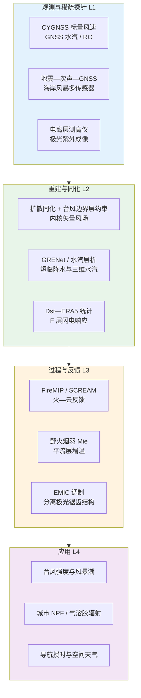
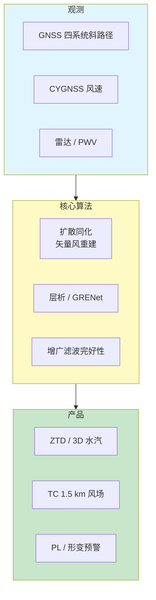
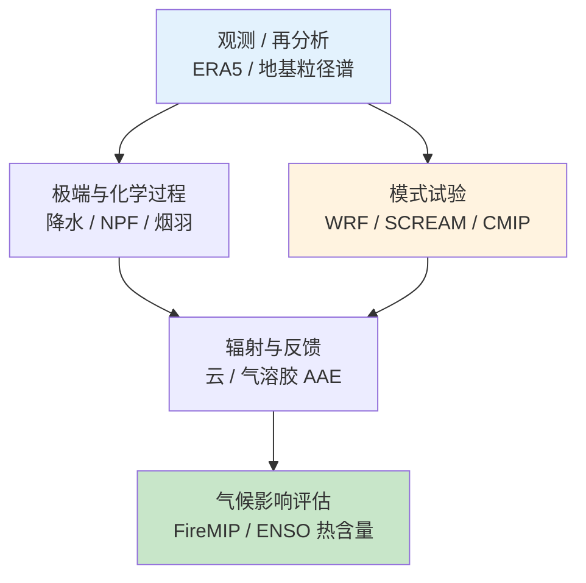
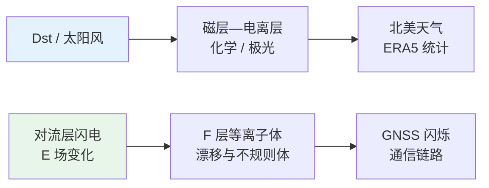
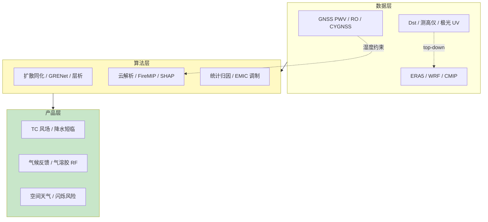

在 2026 年 5 月 12 日至 5 月 19 日这一周的时间窗口内，题录库共收录与「Atmosphere」「GNSS」「Ionosphere」检索词相匹配的论文五十一篇，其中大气类三十五篇、GNSS 类十五篇、电离层类三篇。与上一统计周期相比，GNSS 方向稿件数量明显增加，且《Geophysical Research Letters》占比上升，显示「GNSS 水汽—降水短临预报」「无线电掩星星座对比」「CYGNSS 台风内核风场重建」等议题正从方法验证走向业务化潜力评估；大气方向在《Atmospheric Chemistry and Physics》与《Geophysical Research Letters》上集中出现野火烟羽辐射、北极稳定度、对流系统再分析适用性、火—气候耦合模式比较计划（FireMIP）等跨尺度议题；电离层方向虽题录较少，却同时触及日地空间—对流层天气链、对流层—电离层电动力学耦合与磁层—电离层—极光精细结构三类问题。下文先给出本期研究印记图式的总览归纳，再分方向展开综述、代表性技术路线对照表、结构示意图与单篇专题画像，其后给出交叉学科网络与创新链示意、近期研究特色与未来趋势判断，并列出参考文献。

## 一、本期研究印记图

本周题录在科学问题层面呈现出「稀疏观测—高维场重建」「多源地球物理传感器—环境灾害监测」与「日地耦合—低纬电离层响应」三条并行主线。GNSS 方向中，基于 CYGNSS 标量风速的分数阶扩散同化可将全球六大海盆台风内核的十米矢量风场在约 1.5 千米分辨率上重建，并显著压低最大风速系统偏差；GRENet 生成式网络把 GNSS 可降水水汽与雷达反射率联合用于强降水短临预报；无约束 GNSS 水汽层析在四大星座齐备后首次具备不依赖外部初猜的全年反演可行性，且低轨星座增强有望把水平分辨率推进至五百米量级。大气方向中，FireMIP 进入 CMIP7 全耦合地球系统模式比较，旨在量化火—气候—生态系统反馈；SCREAM 三公里云解析模式给出偏强的正云反馈，提示高分辨率对高云顶抬升反馈的敏感刻画；野火烟羽研究则把粒径与黑碳包壳效应量化为平流层增温与顶大气短波强迫的协同放大。电离层方向中，六十七年 Dst 指数与 ERA5 的统计关联表明地磁暴对北美天气的影响可比长期太阳辐照变化大两个数量级，且与宇宙射线—云假说不相容；海南福科站电离层测高仪首次在五分钟分辨率上捕捉闪电活动与 F 层电子密度扰动的时序对应；午后分离极光弧的锯齿状起伏则与等离子体层边界表面波调制电磁离子回旋波相联系。

上述脉络表明，GNSS 已从「定位与延迟改正」扩展为「高维大气—海洋状态重建与灾害链多传感器融合」的核心数据源；大气科学在观测、模式与机器学习三条路径上同步推进对极端事件、云反馈与气溶胶辐射效应的过程约束；电离层研究则把空间天气效应、对流层电活动与磁层—等离子体层动力学重新编织为可检验的耦合链条。

## 二、GNSS 与导航遥感应用方向

GNSS 方向本期十五篇论文中，八篇特色工作覆盖大陆构造应变、台风内核风场、降水短临预报、水汽层析、完好性监测、采矿塌陷监测、无线电掩星星座评估与海岸风暴多传感器融合。整体技术路线呈现「从单点定位误差控制到二维—三维大气—海洋场重建，再到灾害链多源验证」的层级递进，并与 CYGNSS、低轨增强与生成式深度学习形成紧密耦合。

**表1 GNSS 方向代表性研究的技术路线与特点对照**

| 研究主题 | 技术路线概要 | 技术特点 | 重要结论或性能指标 |
|---------|-------------|---------|-------------------|
| 帕米尔—天山应变场 | 最新 GNSS 速度场、0.75° 网格应变与旋转率 | 数值可靠性验证 | 主压应变约 1.0×10⁻⁷ yr⁻¹，与活动断裂一致 |
| 台风内核矢量风 | 分数阶扩散同化、非线性观测算子、OCS 判据 | 仅 CYGNSS 标量输入、全球六海盆 | Vmax 系统偏差相对 ERA5 降约 79% |
| GRENet 短临降水 | 生成式网络融合 GNSS 水汽与雷达 | 改善初始水汽场 | 强降水个例 CSI 与 FSS 提升 |
| 水汽层析 | 四系统无约束反演、LEO 合成试验 | 无虚拟观测、无初猜 | 里斯本—香港一年反演，LEO 可达 <500 m |
| GNSS/INS 完好性 | 状态增广 GMP、PSD 包络、MHSS | 有色噪声显式建模 | 降低保护水平低估风险 |
| 黑海风暴 | 地震、次声、GNSS PWV、卫星闪电 | 非传统传感器 repurposing | PWV 峰值与强降水同步 |
| 石膏矿塌陷 | SBAS-InSAR、GNSS、微震 | 全生命周期监测 | b 值与能量释放前兆 |
| YUNYAO RO | 改进弯曲角算子、与 COSMIC-2 对比 | 全球覆盖与样本量 | 30 km 以下 YUNYAO 偏差更小 |

### 2.1 专题画像：帕米尔—天山现今地壳应变与旋转率场

**（1）技术路线：从速度场到应变—旋转张量网格化**

Yao 与 Zhu（2026）基于最新、参考稳定欧亚板块的 GNSS 水平速度解，在帕米尔—天山地区以 0.75°×0.75° 网格计算主应变率、最大剪切应变率、膨胀应变率与旋转应变率，并开展数值可靠性验证。研究区为印度—欧亚持续汇聚背景下变形最活跃的内陆造山带之一，分析策略强调与早期不同处理流程所得应变场差异的溯源，以及不均匀测站分布对结果可信度的影响。

**（2）技术特点：应变场多分量联合约束构造解释**

相较仅给出主应变方向的传统图件，该文同时给出膨胀与旋转分量，使塔里木盆地顺时针旋转（约 0.6°/Myr）与帕米尔—天山块体逆时针旋转得以在统一框架下与大型走滑断裂网络对照。峰值压缩应变率（约 1.0×10⁻⁷ yr⁻¹）沿帕米尔前缘逆冲带分布，而帕米尔高原内部则以东西向拉张为主，与正断层地震活动区一致，体现了应变场对局部构造样式的分辨能力。

**（3）重要结论：应变图像与活动构造及震源机制一致**

该研究的重要结论是：**帕米尔—天山地区以 NNW–SSE 缩短为主，剪切高值沿主要活动断裂集中，负膨胀分量指示天山整体挤压环境，旋转场揭示塔里木盆地与帕米尔—天山块体的相反旋转极性，且上述模式与活动构造与震源机制解高度吻合，为区域构造演化与地震危险性评估提供了可靠的现今形变基准**。该结论对理解内陆造山带应变分配与地震复发间隔估计具有基础意义；在应用层面，可为 InSAR 与 GNSS 联合反演提供边界条件。局限在于稀疏区插值仍可能平滑局部断层锁固段，需结合地质滑动速率独立检验。

### 2.2 专题画像：稀疏 CYGNSS 观测重建全球台风内核矢量风场

**（1）技术路线：分数阶扩散同化与非线性观测算子**

Han 等（2026）将分数阶扩散同化推广至非线性观测算子，在仅输入 CYGNSS 无方向标量风速的条件下，联合三类台风边界层物理约束，于约 1.5 千米分辨率重建台风内核十米矢量风场。研究提出基于 CYGNSS 自身观测覆盖充分性（OCS）的可靠性判据，无需外部参考即可标记可信重建个例，并对 2020–2022 年六个活跃海盆共 249 个台风、4955 个快照进行全球统计评估。

**（2）技术特点：填补无飞机侦察海盆的观测空白**

CYGNSS 是唯一能穿透强降水测量内核海面风速的卫星，但业务分析系统尚未同化其观测。该框架通过生成式先验与物理约束，把「标量、稀疏、无向」观测提升为「矢量、稠密、公里级」风场，并展示仅增加 11 个探空仪矢量即可使跨眼廓线 RMSE 再降约 42% 的异质观测融合潜力，为衔接 SFMR、SAR 与散射计数据提供路径。

**（3）重要结论：全球六海盆内核风场精度显著提升**

该研究的重要结论是：**相对 IBTrACS 最佳路径，重建风场使 Vmax 相对 ERA5 与 CCMP 的系统偏差分别降低约 79% 与 75%；在 OCS 充分子样本上，相对尾雷达验证风速 RMSE 约 6.9 m/s，物理约束使风向 RMSE 降低约 60% 而不损害风速精度**。该结论对无例行飞机侦察的西太平洋等海盆台风强度与风暴潮预报具有潜在革命性意义；向业务同化迁移时，需进一步评估 OCS 阈值与计算成本，并在极端不对称台风结构下做独立检验。

### 2.3 专题画像：GRENet 融合 GNSS 水汽与雷达的降水短临预报

**（1）技术路线：生成式网络联合雷达反射率与 GNSS 水汽**

Lu 等（2026）设计 GRENet 生成式网络，将高时间分辨率 GNSS 大气水汽信息与天气雷达反射率融合，用于强降水短临预报。以仅雷达为基线的个例对比显示，GNSS 提供的精细初始水汽结构有助于更准确预测降水中心范围与位置。

**（2）技术特点：把水汽场误差从「间接推断」转为「直接约束」**

雷达外推法难以显式刻画水汽平流与局地增湿，而 GNSS 可降水水汽（PWV）对降水系统发展具有先导指示意义。生成式架构可在保持雷达纹理信息的同时注入水汽场约束，属于「观测驱动 + 物理相关变量」的融合范式，与纯光流或递归神经网络外推形成差异。

**（3）重要结论：GNSS 水汽显著改善临界成功指数与空间技巧评分**

该研究的重要结论是：**在强降水个例中，GRENet 相对仅雷达基线能更准确预测降水中心位置与范围，临界成功指数与分数技巧评分得到改善，表明高时间分辨率 GNSS 水汽对短临降水预报技能具有可量化贡献**。该结论对区域气象业务中已布设大量 GNSS 参考站网络的地区具有直接应用价值；推广至不同气候区需考虑 PWV—降水滞后关系与对流组织类型的差异。与数值模式同化相比，端到端生成式方案的可解释性与极端个例稳健性仍需更多样本验证。

### 2.4 专题画像：四系统 GNSS 无约束水汽层析与低轨增强

**（1）技术路线：无外部约束的一年层析反演与 LEO 合成试验**

Miranda 等（2026）描述一种不需要外部数据、初猜场或虚拟观测的水汽层析模型，利用 GPS、GLONASS、北斗与 Galileo 四系统完整星座，在里斯本与香港两套气候与网型差异显著的区域各开展一年反演。进一步将 GNSS 斜路径观测与基于 WRF 强迫 ERA5 的射线追踪低轨 GNSS 类星座合成斜路径数据联合，评估分辨率提升潜力。

**（2）技术特点：星座完备性使「纯 GNSS 层析」首次可行**

以往层析常依赖无线电探空或数值模式初猜以稳定反演，四系统全球覆盖降低了几何空白，使无约束反演在统计意义上可行；研究表明网型密度是质量关键因子。LEO 增强试验提示对低对流层水汽精细结构的可分辨性可优于五百米，为捕捉边界层锋面与对流触发提供可能。

**（3）重要结论：网型密度决定质量，LEO 可显著提高分辨率**

该研究的重要结论是：**无约束 GNSS 水汽层析在里斯本与香港一年试验中均可运行，但反演质量强烈依赖测站密度；与低轨星座合成数据联合的敏感性试验表明，低对流层水汽结构有望实现优于五百米的水平分辨率**。该结论对下一代 GNSS 气象星座设计与数值天气预报同化具有战略参考价值；真实 LEO 任务需解决星座时钟、轨道与信号体制差异带来的系统误差。无约束方案在稀疏网络区域仍可能出现虚假水汽异常，需保留质量控制和独立验证。

### 2.5 专题画像：状态增广误差建模的 GNSS/INS 紧组合完好性监测

**（1）技术路线：Gauss-Markov 增广与 PSD 包络约束下的 MHSS**

Tang 等（2026）针对城市遮挡与多路径环境下 GNSS 观测误差时间相关、传统白噪声假设导致协方差低估的问题，提出基于状态增广的 GNSS/INS 紧组合完好性监测方法。将星历钟差残差、对流层残差与码多路径等主要有色误差源以一阶 Gauss-Markov 过程增广进滤波状态联合估计，并依据功率谱密度包络进行保守调参，再把增广滤波输出的协方差嵌入多假设解分离框架计算保护水平。

**（2）技术特点：物理误差建模服务航空与自动驾驶完好性**

完好性监测要求保护水平以高置信度覆盖真实定位误差；忽略有色噪声会使保护水平系统性偏低，带来危险可用性。该文强调从功率谱密度角度约束模型参数，使协方差估计与实测误差统计更一致，属于「物理驱动 + 法规框架」的工程导向研究。

**（3）重要结论：显著降低保护水平低估且维持可用性**

该研究的重要结论是：**车载外场试验表明，所提方法改善估计一致性，显著降低复杂环境下保护水平低估风险，在不明显损害定位精度的前提下可靠包络水平误差并保持良好系统可用性**。该结论对城市低空经济与自动驾驶高可靠导航具有直接意义；向航空认证转化时，仍需按标准规范完成更大样本与故障模式测试。方法对 Gauss-Markov 时间常数与 PSD 包络选取敏感，需针对不同接收机与场景维护参数库。

### 2.6 专题画像：黑海创纪录风暴的地震—次声—GNSS 综合监测

**（1）技术路线：非传统地球物理传感器与 ERA5 联合分析**

Petrescu 等（2026）针对 2024 年 8 月罗马尼亚黑海沿岸创纪录风暴，综合地震（高频降水信号与微震海浪频带）、次声阵列、GNSS 可降水水汽、静止卫星闪电与 ERA5 再分析，刻画风暴从酝酿到爆发的时间演化。次声数据经无监督学习区分静寂期与风暴相关活动，并与地震地面运动模式在时间上对应。

**（2）技术特点：把「地震台网」 repurposing 为环境传感器**

该研究示范了在常规气象观测受损或不足时，利用已有地球物理基础设施获取风暴动力学信息。GNSS PWV 显示多日期累积并在主降水阶段达峰，与强降水同步，为水汽输送提供独立约束；次声阵列在 0.6–7 Hz 检测到逾 1100 次信号，与静止卫星闪电一致。

**（3）重要结论：多传感器融合可深化风暴演化理解**

该研究的重要结论是：**高频地震信号可追踪降水，微震频带反映波浪致地面运动，GNSS PWV 峰值与强降水同步，次声—地震—闪电在时间上耦合，表明 repurposing 地球物理台网有助于从整体角度理解海岸极端风暴并为预警研究提供新数据源**。该结论对脆弱海岸带防灾具有方法论启示；业务化需解决台站灵敏度、环境噪声与实时传输标准。各传感器空间代表性不同，融合时应避免简单时间对齐而忽略传播延迟。

### 2.7 专题画像：SBAS-InSAR、GNSS 与微震揭示石膏矿塌陷机理

**（1）技术路线：2015–2025 年长时序地表形变与事件期高频 GNSS**

Wang 等（2026）融合 SBAS-InSAR（2015–2025）、GNSS（2021–2022 塌陷阶段）与微震监测，研究荣兴石膏矿塌陷变形演化与破坏机理。塌陷前以空间非均匀持续沉降为主，微震呈现事件数增加、b 值下降与累积能量加速释放等前兆；塌陷期 GNSS 捕获突发大幅沉降，塌陷后进入沉降与抬升并存的长期调整阶段。

**（2）技术特点：多尺度、多物理过程监测闭环**

InSAR 提供长时序面状形变，GNSS 在关键阶段提供高频三维位移，微震揭示地下破裂扩展。三者联合提出「缓慢沉降—加速变形—塌陷—后期调整」四阶段概念模型，比单一手段更易识别从微破裂贯通到大尺度失稳的转折。

**（3）重要结论：微震前兆与多源监测支撑采矿地质灾害预警**

该研究的重要结论是：**塌陷前微震活动出现可识别前兆信号，塌陷时 GNSS 显示突发大幅沉降，塌陷后形变进入长期应力重分布阶段，四阶段模型表明 SBAS-InSAR、GNSS 与微震联合可有效刻画采空区全生命周期破坏过程**。该结论对矿山地质灾害早期预警与治理具有直接工程价值；推广至其他矿种时需校准介质本构与开采工艺差异。InSAR 在快速形变阶段可能失相干，需以 GNSS 填补。

### 2.8 专题画像：YUNYAO 与 COSMIC-2 无线电掩星弯曲角对比评估

**（1）技术路线：改进弯曲角观测算子与 2024 年 12 月全球对比**

Wu 等（2026）提出改进的弯曲角观测算子，对 YUNYAO 与 COSMIC-2 在 2024 年 12 月的弯曲角观测进行系统评估。比较维度包括全球覆盖、样本量、相对偏差垂直结构及不同 GNSS 信号与 YUNYAO 各接收机性能差异。

**（2）技术特点：中国 YUNYAO 星座纳入全球 RO 业务拼图**

YUNYAO 提供近全球覆盖与高于 COSMIC-2 的观测数量；在重叠区域质量总体可比，但三十千米以上负相对偏差更显著，三十千米以下平均偏差更小。Galileo 信号在上层大气相对 GLONASS 偏差更小，提示信号体制与接收机标定对 RO 气候记录一致性的影响。

**（3）重要结论：YUNYAO 可补充并部分优于 COSMIC-2 低层质量**

该研究的重要结论是：**YUNYAO 实现近全球覆盖且观测量显著多于 COSMIC-2，三十千米以下弯曲角平均偏差小于 COSMIC-2，三十千米以上负偏差更突出，不同信号与接收机间存在可分辨性能差异**。该结论对数值天气预报同化与气候监测中增加 YUNYAO 权重具有数据支撑；长期气候序列构建需开展跨星座偏差稳定度与漂移监测。上层偏差可能与电离层残差及接收机噪声相关，需与电离层校正升级同步评估。

## 三、大气过程、气候反馈与环境效应方向

大气方向本期三十五篇论文在《Atmospheric Chemistry and Physics》《Geophysical Research Letters》《Journal of Climate》《Geoscientific Model Development》等刊物上分布广泛。本节选取八篇顶刊与特色工作作深度画像，涵盖地中海极端降水与海温、FireMIP 与 CMIP7、SCREAM 云反馈、ENSO 海洋热含量再分配、北极稳定度衰减、可解释机器学习气溶胶吸收、野火烟羽辐射强迫以及城市新粒子形成，以代表「极端事件—辐射反馈—化学气溶胶—模式协议」四条主线。

**表2 大气方向代表性研究的技术路线与特点对照**

| 研究主题 | 技术路线概要 | 技术特点 | 重要结论或指标 |
|---------|-------------|---------|----------------|
| 南欧日极端降水 | WRF 2 km、二十个降水事件、SST 情景 | 对流允许、海温敏感性 | 海温升高增加陆地强降水频率 |
| FireMIP CMIP7 | 全耦合 ESM 火模块比较 | 从离线 DGVM 到耦合反馈 | 量化火对气候—生态系统影响 |
| SCREAM 云反馈 | 3 km 与 12 km、+4 K SST 试验 | 云解析、分量诊断 | 正反馈偏强，高云顶抬升主导 |
| ENSO OHC 再分配 | CESM-LE 与 CMIP6、35/25 模式 | 充放电振荡变暖响应 | 南半球热输送增强、垂直结构变浅 |
| 北极稳定度 | ERA5 四十年、极夜分层 | 稳定度—湍流混合指标 | 衰减较全球均值放大，2010 年代中期峰值 |
| 气溶胶 AAE | 多源观测 + SHAP | 可解释机器学习 | 柱 AAE 对顶空辐射强迫可比 SSA |
| 野火烟羽 | 核壳 Mie + 化学输送 + 辐射传输 | 粒径与包壳分责 | 包壳致平流层增温 1–1.5 K |
| 米兰 NPF | 一年粒径谱、轨迹与洁净度 | 城市背景长期观测 | 通风与低污染促进 NPF |

### 3.1 专题画像：地中海海温升高下南欧日极端降水与年总量脱钩

**（1）技术路线：对流允许 WRF 与多情景海温试验**

Senatore 等（2026）以意大利南部为代表性地中海子区域，选取 2019 年 9–12 月二十次连续强降水事件，在 2 千米分辨率 WRF 中由 ERA5 驱动复现，并分别施加近似 1980 年海温与世纪末 SSP3-7.0、SSP5-8.5 海温增幅情景，隔离海温对降水的影响。

**（2）技术特点：解释「年总量减少与日极端增强」并存**

南欧在气候变化下出现年降水总量下降与日极端降水增强的表面矛盾。对流允许模拟可在复杂地形—海气相互作用下分辨气旋路径与降水空间结构，表明海温升高可在其他因子固定时增加陆地强降水频率，但对最强事件的空间平均累积降水因主要落在海上而变化不大。

**（3）重要结论：海温升高增强陆地强降水频率但最强事件陆面总量未必增加**

该研究的重要结论是：**WRF 能准确再现气旋路径与降水型，在固定其他边界条件下增暖海温可使陆地强降水频率上升，然而对分析的最强事件，陆面空间平均累积降水变化不大，因最强降水常发生于海上**。该结论为地中海地区适应规划提供物理依据，强调需同时关注频率与强度指标。向未来气候预估推广时，需耦合大气环流型变化而非仅改海温。

### 3.2 专题画像：FireMIP 进入 CMIP7 的全耦合火—地球系统比较计划

**（1）技术路线：从离线 DGVM 到 CMIP7 耦合 ESM 协议设计**

Li 等（2026）发布 FireMIP 面向 CMIP7 的协议论文，阐明将火模式比较从 2014 年启动的离线动态全球植被模式扩展至全耦合地球系统模式的三项目标，即评估当代火模拟、识别过去—现在—未来火况变化及其强迫与因果路径、量化火及其变化对气候—生态系统—社会的影响。

**（2）技术特点：纳入气候反馈与多初始条件集合**

离线火模式无法捕捉大气—植被—火的三向反馈；进入 CMIP7 后，FireMIP 将利用多模式、多初始条件与多排放情景集合，提供过程基础的不确定性量化，并连接极端火事件上升的全球背景。

**（3）重要结论：为 CMIP7 提供可操作的火模拟与分析框架**

该研究的重要结论是：**FireMIP 在 CMIP7 中将推进全耦合地球系统模式中的火与火相关过程模拟，并通过统一实验设计、模式输入输出与推荐分析框架，为量化火在地球系统中的作用提供定量、全面且基于过程的科学基础**。该结论对理解野火—碳循环—气候反馈及制定减缓策略具有结构性意义；模式间火排放与植被响应差异仍是主要不确定性源。协议实施质量取决于各模式火模块与气候耦合的一致性维护。

### 3.3 专题画像：SCREAM 三公里云解析模式的云反馈分量诊断

**（1）技术路线：+4 K 海温扰动的一年大气模式对比**

Chao 等（2026）在 Simple Cloud-Resolving E3SM Atmosphere Model 三公里全球大气模式中进行控制与海面温度升高 4 K 的一年试验，诊断云反馈各分量，并与 CMIP5/6 及专家评估对比；同时分析十二公里版本差异。

**（2）技术特点：云解析减少参数化不确定性但揭示新高云顶反馈**

SCREAM 三公里正云反馈处于 CMIP5/6 范围上沿，主要由高云顶抬升（近似等温抬升）与低云量减少及光学厚度变化共同贡献。十二公里版本反馈较弱，因低云辐射通量对估计逆温强度（EIS）更敏感，产生更强的负低云量反馈。

**（3）重要结论：高云顶抬升是 SCREAM 偏强正反馈主因**

该研究的重要结论是：**SCREAM 三公里正云反馈偏强且处于传统模式范围上沿，高云顶抬升贡献突出，十二公里版本因更强的负低云量反馈而总反馈较弱，过程诊断为模式改进与专家评估提供依据**。该结论对气候敏感度约束具有直接含义；计算成本限制其尚难直接用于百年尺度集合，但可为参数化开发提供高分辨率锚点。一年试验样本对统计显著性的限制需在更长积分中复核。

### 3.4 专题画像：全球变暖下 ENSO 海洋热含量再分配变化

**（1）技术路线：CESM 大集合与 CMIP6 多模式充放电分析**

Li 等（2026）基于三十五成员 CESM 大集合与二十五个 CMIP6 模式，研究全球变暖下 ENSO 引起的海洋热含量在赤道与离赤道太平洋之间的再分配变化，联系经向热输送、风应力旋度与 ITCZ 降水变化。

**（2）技术特点：充放电振荡垂直结构变浅**

变暖气候下，El Niño 期间 5°–20°N 热收敛减弱，衰减阶段 10°–20°S 热收敛显著增强；经向热输送在北半球减弱、南半球增强并可延伸至更高纬度。位温响应在 10°S–10°N 垂直结构变浅，150 m 以上增强、以下抑制，表明热含量充放电过程在温跃层以上更为重要。

**（3）重要结论：ENSO 热含量再分配在南半球加强且垂直变浅**

该研究的重要结论是：**全球变暖改变 ENSO 驱动的海洋热含量再分配，北半球赤道以北热输送减弱而南半球 10°–20°S 热收敛增强，且充放电相关垂直响应在温跃层以上更为突出**。该结论对理解 ENSO 未来影响区域海平面、热带气旋与海洋生态系统具有意义；不同模式间 ITCZ 降水响应差异仍需约束。与海洋生物地球化学耦合时，需关注浅层增暖对营养盐垂向供应的改变。

### 3.5 专题画像：北极变暖下大气稳定度衰减的放大效应

**（1）技术路线：ERA5 四十年稳定度趋势与区域—垂直分解**

Shi 等（2026）利用 ERA5 再分析，研究北极大气稳定度在过去四十年相对全球均值衰减的放大效应，重点分析极夜季节、巴伦支—喀拉海与楚科奇海区域及垂直延伸高度，并讨论 2010 年代中期前后与北极增暖联系的变化。

**（2）技术特点：稳定度作为湍流混合与地表能量交换的门控量**

大气稳定度衡量气块垂直位移受阻程度；北极增暖背景下大气动力活跃性增强，可能导致稳定度下降、表面感热与污染物混合增强。研究发现全北极平均去稳定强度在 2010 年代中期达峰，极夜去稳定层可扩展至约 700 hPa。

**（3）重要结论：北极稳定度衰减在极夜与关键海区被放大**

该研究的重要结论是：**过去四十年北极大气稳定度下降幅度相对全球均值被放大，主要发生在极夜并集中于巴伦支—喀拉海与楚科奇海，全北极去稳定强度在 2010 年代中期最强，且 2012 年前后与北极增暖的统计联系减弱**。该结论对北极低空急流、雾霾扩散与海冰—大气热量交换具有指示意义；再分析在北极观测稀疏区的可信度需与探空与卫星廓线交叉验证。稳定度变化与云、水汽反馈的耦合机制仍需过程分解。

### 3.6 专题画像：可解释机器学习量化气溶胶光谱吸收（AAE）控制因子

**（1）技术路线：北京近地面与多年柱浓度数据联合 SHAP 分析**

Wang 等（2026）整合多源观测与可解释机器学习（SHAP），分离化学组分与粒径对吸收 Ångström 指数（AAE）的相对贡献，并评估 AAE 对顶空、地面与大气柱辐射强迫的影响。

**（2）技术特点：把「黑箱」光谱吸收预测转为可审查归因**

近地面 AAE 主要受细矿物尘与水溶性无机离子分数影响；柱浓度资料中沙尘负荷最重要，其次为碳质气溶胶，细模态半径累积重要性约 29% 且与黑碳相当。SHAP 显示柱 AAE 对顶空辐射强迫的贡献可与单次散射反照率相当。

**（3）重要结论：AAE 是气溶胶辐射效应评估中不可忽视的维度**

该研究的重要结论是：**化学组分与粒径对 AAE 的控制因子可被 SHAP 定量分解，柱 AAE 对顶空辐射强迫的影响与 SSA 相当，而在地面与大气柱内较弱，有助于降低气溶胶辐射效应评估不确定性**。该结论对东亚雾霾与沙尘复合污染区的气候效应模拟具有参数化价值；机器学习模型外推至不同污染阶段需监测协变量分布漂移。辐射强迫计算仍依赖辐射传输模式对 AAE 参数化的敏感性试验。

### 3.7 专题画像：野火烟羽粒径与包壳对平流层增温与辐射强迫的放大

**（1）技术路线：核壳 Mie 计算耦合化学输送与辐射传输**

Chen 等（2026）基于飞机观测，采用核壳 Mie 理论量化野火烟羽（pyroCb）中较大粒径（数浓度中值半径约 0.25 μm）与黑碳上非吸收物质包壳对消光、吸收、顶空短波辐射强迫与平流层加热的贡献，并与 2019–2020 澳大利亚特大野火事件卫星观测对照。

**（2）技术特点：区分粒径与包壳的相对贡献**

较大粒径使消光约加倍，顶空短波辐射强迫增强约 35%–60%；包壳使平流层加热增强约 1–1.5 K，约为粒径效应的两倍，与注入后前三月卫星温度异常更一致。

**（3）重要结论：包壳效应是平流层增温的关键放大器**

该研究的重要结论是：**野火烟羽较大粒径与厚包壳协同增强消光与吸收，包壳对平流层加热的贡献可达 1–1.5 K，约为粒径效应的两倍，并改善与 2019–2020 澳大利亚 pyroCb 事件后卫星辐射与温度异常的吻合**。该结论对评估野火—气候反馈与地球工程情景中的烟雾气候效应具有重要意义；向其他区域野火推广时需考虑燃料类型与燃烧阶段差异。化学输送模式对包壳组成与老化的表征仍是主要不确定度。

### 3.8 专题画像：米兰城市背景区通风与低污染促进新粒子形成

**（1）技术路线：一年粒径谱观测与气团轨迹—凝结汇分析**

Agrò 等（2026）在米兰城市背景站开展 1.2–480 nm 粒径谱连续一年观测，分析新粒子形成（NPF）发生频率与特征，并结合气象、污染物浓度与气团停留时间评估洁净度与通风条件的影响。

**（2）技术特点：填补 Po 河谷工业密集区城市 NPF 长期观测空白**

Po 河谷农村 NPF 研究较多，而米兰等大城市长期先进仪器观测不足。结果表明更洁净大气（更低污染物、更低凝结汇）与更强通风（尤其西北 Foehn 风）促进 NPF；更长 Po 河谷停留时间与更高人为排放抑制 NPF。

**（3）重要结论：城市「大气清洁」条件可提升 NPF 发生**

该研究的重要结论是：**较低污染物与凝结汇、较强通风（尤其西北风）促进米兰城市背景区 NPF，而气团在 Po 河谷长时间滞留及高人为排放抑制 NPF，使米兰归入「大气清洁促进 NPF」的城市类型**。该结论对城市空气质量管理具有双重含义，即减排降低颗粒物质量浓度的同时可能改变 NPF 对云凝结核的贡献；政策评估需耦合 NPF—云—辐射链条。单站结果向全市推广需考虑空间异质性。

## 四、电离层与日地—对流层耦合方向

本期电离层题录三篇，分别涉及地磁暴对陆地天气的影响、低纬闪电驱动 F 层扰动、以及等离子体层边界表面波调制午后分离极光弧。三篇均给出完整专题画像。

**表3 电离层方向题录的技术路线与特点**

| 研究主题 | 技术路线概要 | 技术特点 | 重要结论 |
|---------|-------------|---------|---------|
| 地磁暴—天气 | 67 年 Dst 与 ERA5 北美 | 与宇宙射线—云假说对照 | 地磁暴影响远大于 TSI 长期效应 |
| 闪电—F 层 | 福科 DPS-4D 与闪电资料 | 5 min 分辨率、低纬首次 | 电子密度与闪电约 5 min 延迟对应 |
| 分离极光锯齿 | DMSP/SSUSI + Arase + 地磁 | 表面波调制 EMIC | 首次观测锯齿状午后分离弧 |

### 4.1 专题画像：地磁暴对陆地天气的区域与季节效应

**（1）技术路线：六十七年 Dst 与 ERA5 北美小时统计**

Raeder（2026）使用 1957 年以来 Dst 指数与 ERA5 北美大气场，评估地磁暴对陆地天气的影响幅度与机制一致性，并与宇宙射线、太阳高能粒子、磁层电子沉降等粒子沉降效应假说对照。

**（2）技术特点：挑战「微小 TSI 变化如何驱动显著气候」之谜**

传统太阳周期—气候相关研究难以确立单一物理机制。该文发现地磁暴对北美天气的影响可比长期全球平均地表温度对太阳活动响应大约两个数量级，且与宇宙射线—云假说预测不符，更符合通过电离层或平流层化学—极涡的 top-down 路径。

**（3）重要结论：地磁暴是需严肃对待的天气调制因子**

该研究的重要结论是：**地磁暴对北美陆地天气的影响显著大于通常归因于太阳总辐照变化的长期全球地表温度效应，粒子沉降机制（尤其宇宙射线—云路径）与统计结果最不一致，而经电离层或平流层化学与极涡的 top-down 机制更为可能**。该结论对空间天气—天气气候交叉研究具有范式意义，提示需在季节预报与气候模式中评估磁活动效应的可检测性。因果识别仍依赖机制模拟与独立数据段验证，不宜仅凭相关推断业务预报增益。

### 4.2 专题画像：闪电活动驱动低纬 F 层扰动的测高仪直接证据

**（1）技术路线：海南福科站 DPS-4D 与闪电监测同步对比**

Cheng 等（2026）将海南福科站五分钟分辨率 DPS-4D 电离层测高仪观测与闪电定位资料对比，研究 2016 年 8 月 16 日一次强对流事件中 F 层电子密度对闪电活动的响应。

**（2）技术特点：首次低纬高分辨率测高仪捕捉闪电—F 层时序**

结果显示 F 层电子密度变化与闪电发生存在约五分钟延迟的时间对应，延迟可能反映雷云内电荷分离相关的电场调制；闪电峰值后出现弱 spread-F 与等离子体漂移速度突升，提示 E×B 漂移与瑞利—泰勒不稳定性参与不规则体生成。

**（3）重要结论：对流层闪电可快速调制低纬 F 层等离子体**

该研究的重要结论是：**F 层电子密度变化与闪电活动在时间上对应（约 5 分钟延迟），闪电峰值后出现 spread-F 与漂移增强，表明闪电通过电场调制驱动 E×B 漂移并产生 F 层不规则体，为低纬对流层—电离层耦合提供直接观测证据**。该结论对短波通信与 GNSS 闪烁预警具有潜在价值；个例向气候统计推广需积累更多雷暴—电离层联合观测。与热重力波机制的贡献分解仍需多仪器协同。

### 4.3 专题画像：等离子体层边界表面波调制午后分离极光弧

**（1）技术路线：DMSP/SSUSI 紫外成像与 Arase 卫星联合分析**

Feng 等（2026）报道 2017 年 9 月 13 日风暴恢复阶段一次午后分离极光弧事件，在 DMSP/SSUSI LBHL 波段首次观测到沿赤道向边界的锯齿状起伏，伴随大于 10 keV 离子沉降与更高纬度的低能电子沉降。Arase 观测表明结构与等离子体层 plume 及其边界表面波相关，地面磁站检测到 Pc1–2 频段脉动。

**（2）技术特点：把精细尺度极光结构与 EMIC 波联系起来**

以往研究未识别此类弧的精细起伏。作者提出表面波扰动 plume 内冷等离子体密度，从而调制电磁离子回旋（EMIC）波，再与高能离子共振产生沉降，形成锯齿状极光结构。

**（3）重要结论：plume 边界表面波—EMIC—离子沉降链调制极光形态**

该研究的重要结论是：**午后分离极光弧赤道向边界首次出现锯齿状起伏，与等离子体层 plume 边界表面波、Pc1–2 脉动及 EMIC 调制离子沉降相一致，揭示磁层—等离子体层—电离层耦合控制亚极光区精细极光形态的新机制**。该结论对理解辐射带粒子沉降与空间天气效应具有基础价值；对 GNSS 用户而言，相关 EMIC 活动可能与亚极光区相位闪烁有关。单次事件机制推断需更多联合观测巩固。

## 五、交叉学科网络与创新链示意

GNSS 水汽与无线电掩星为大气对流允许模拟与短临预报提供边界层—对流层湿度约束；CYGNSS 风场重建与台风研究直接服务海洋—大气界面动量通量；InSAR 与 GNSS 联合监测的地表形变与地震、次声、GNSS PWV 在风暴监测中共同构成「固体地球—大气—水文」传感器网络。电离层研究中，地磁暴—天气统计链与 GNSS 定位、RO 上层偏差诊断相互参照；闪电—F 层耦合则把对流层雷暴活动与 GNSS 电离层闪烁风险联系起来。下列示意图概括数据—算法—产品—用户的创新链位置。

## 六、近期研究特色与未来趋势展望

本期题录相对近期窗口的突出变化包括：GNSS 研究从单站延迟与定位进一步走向「全球高维场重建」与「生成式多源融合」，CYGNSS 与 YUNYAO 等星座使原先稀疏的观测维度显著增密；大气研究在野火—平流层反馈、云解析反馈与火—CMIP7 协议三条战线上同步推进，显示极端事件与气候敏感度问题正在向「过程可解析」阶段迈进；电离层研究则重新强调地磁活动与天气统计关联及对流层闪电的电动力学效应，促使空间天气与低层大气过程在数据与模式两端重新对接。

展望未来三至五年，可检验的技术判断包括：（1）CYGNSS 内核矢量风重建若进入业务同化，将首先改善西太平洋等无飞机侦察海盆的台风强度与结构分析；（2）无约束 GNSS 水汽层析与 LEO 增强若形成业务星座，有望为对流触发与短时强降水提供百米级湿度结构约束；（3）FireMIP CMIP7 集合将为野火—碳—气候反馈提供多模式约束，并反过来要求卫星火排放与烟雾垂直结构观测同步升级；（4）地磁暴—天气与闪电—F 层两类耦合若被独立机制模拟再现，将推动空间天气产品进入季节尺度风险评估讨论，但业务落地仍需更严格的因果与增益检验。

## 参考文献

1. Agrò, M., Bettineschi, M., Melina, S., et al. (2026). Ventilation and low pollution enhancing new particle formation in Milan, Italy. *Atmospheric Chemistry and Physics*. DOI: 10.5194/acp-26-6521-2026
2. Chao, L.-W., Zelinka, M. D., Terai, C. R., et al. (2026). Examining Cloud Feedback Components in the Simple Cloud-Resolving E3SM Atmosphere Model (SCREAM). *Journal of Climate*. DOI: 10.1175/jcli-d-25-0656.1
3. Chen, X., Wang, J., Peterson, D. A., et al. (2026). Large Particle Size and Thick Coating Influence Pyrocumulonimbus Smoke Radiative Forcing and Stratospheric Warming: Insights From the 2019–2020 Australian Megafires. *Geophysical Research Letters*. DOI: 10.1029/2025gl119099
4. Cheng, Z., Zhang, M., Huang, H., et al. (2026). Direct Ionosonde Evidence of F‐Layer Disturbances Driven by Intense Lightning Activity at Low Latitudes. *Geophysical Research Letters*. DOI: 10.1029/2026gl122283
5. Feng, H., Wang, D., Hao, Y., et al. (2026). First Observation of Sawtooth‐Like Undulations in Afternoon Detached Auroral Arcs Modulated by Surface Waves at the Plasmaspheric Plume Boundary. *AGU Advances*. DOI: 10.1029/2025av002234
6. Han, X., Li, X., Yang, J., et al. (2026). Global kilometre-scale tropical cyclone inner-core vector winds from sparse scalar CYGNSS observations. arXiv:2605.18477v1
7. Li, F., Lawrence, D. M., Rogers, B. M., et al. (2026). The Fire Modeling Intercomparison Project (FireMIP) for CMIP7. *Geoscientific Model Development*. DOI: 10.5194/gmd-19-3989-2026
8. Li, H., Zheng, X.-T., Wang, C.-Y., et al. (2026). Changes in ENSO-Induced Ocean Heat Content Redistribution under Global Warming. *Journal of Climate*. DOI: 10.1175/jcli-d-25-0184.1
9. Lu, C., Wang, Q., Zheng, Y., et al. (2026). GRENet: GNSS‐Enhanced Radar Extrapolation Network for Precipitation Nowcasting. *Geophysical Research Letters*. DOI: 10.1029/2025gl120787
10. Miranda, P. M. A., Hajj, G. A., Teixeira, J., Mateus, P. (2026). Unconstrained GNSS Water Vapor Tomography With Real Data and LEO Augmentation. *Geophysical Research Letters*. DOI: 10.1029/2026gl122933
11. Petrescu, L., Antonescu, B., Nistor, S., et al. (2026). Seismo-acoustic and GNSS observations of a record-breaking Black Sea storm: repurposing geophysical sensors for environmental monitoring. *Natural Hazards and Earth System Sciences*. DOI: 10.5194/nhess-26-2227-2026
12. Raeder, J. (2026). Regional and Seasonal Effects of Geomagnetic Storms on Terrestrial Weather. *Geophysical Research Letters*. DOI: 10.1029/2025gl121097
13. Senatore, A., Furnari, L., Nikravesh, G., et al. (2026). Increasing daily precipitation extremes despite declining annual totals in southern Europe: a modeling study on the effects of Mediterranean Sea warming. *Hydrology and Earth System Sciences*. DOI: 10.5194/hess-30-2913-2026
14. Shi, G., Zhang, L., Liu, Y., Zhou, C. (2026). Amplified Decline in Arctic Atmospheric Stability Under Arctic Warming. *Geophysical Research Letters*. DOI: 10.1029/2026gl122375
15. Tang, X., Fang, X., Huang, F. (2026). Research on GNSS/INS Tightly Coupled Integrity Monitoring Method Based on State Augmentation Error Modeling. *Remote Sensing*. DOI: 10.3390/rs18101564
16. Wang, H., Chen, J., Liang, W., Xu, G. (2026). Long-Term Post-Mining Deformation Evolution and Failure Mechanism of the Rongxing Gypsum Mine Revealed by SBAS-InSAR and Microseismic Monitoring. *Remote Sensing*. DOI: 10.3390/rs18101584
17. Wang, W., Tian, P., Zeng, S., et al. (2026). Interpretable machine learning quantifies composition and size influences on aerosol spectral absorption. *Atmospheric Chemistry and Physics*. DOI: 10.5194/acp-26-6471-2026
18. Wu, S., Zheng, Y., Li, F., Zhuang, Z. (2026). Comparative Assessment of YUNYAO and COSMIC-2 Radio Occultation Bending-Angle Observations. *Remote Sensing*. DOI: 10.3390/rs18101566
19. Yao, R., Zhu, S. (2026). Precise Contemporary Crustal Strain and Rotation Rates Derived from GNSS Measurements in the Pamir–Tian Shan Region. *Remote Sensing*. DOI: 10.3390/rs18101618
