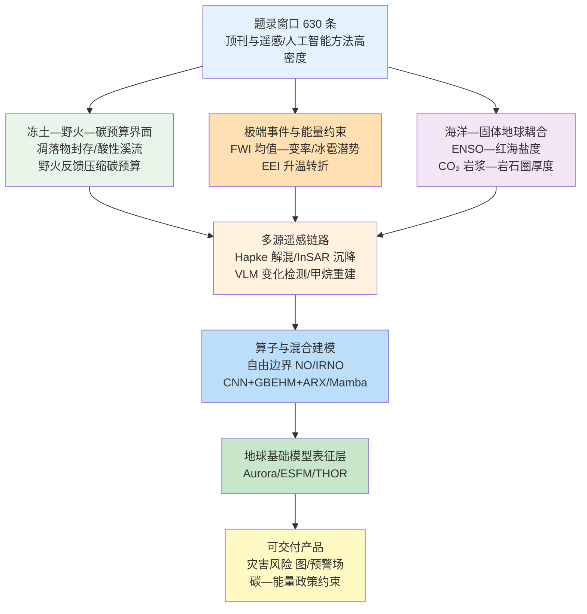
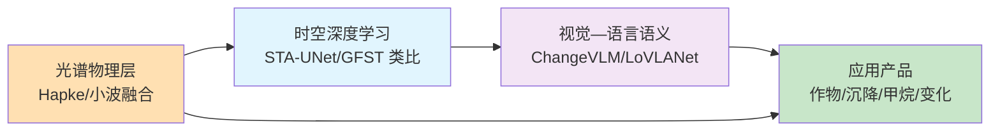
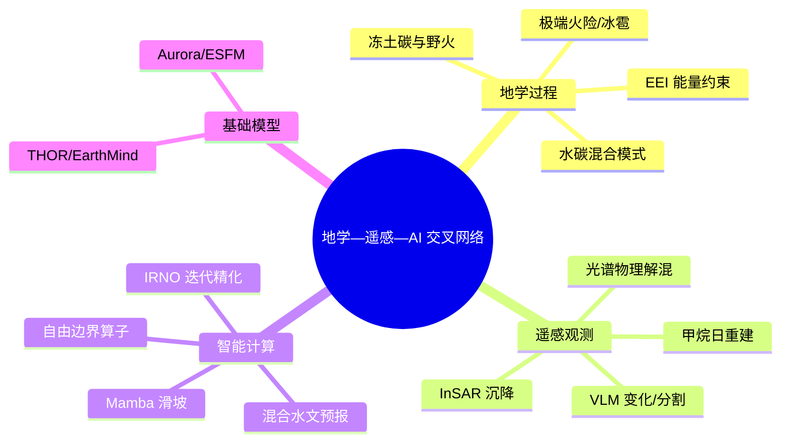
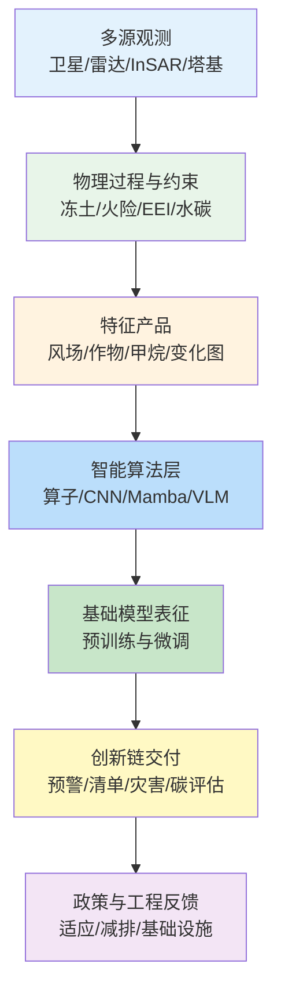

在 2026-05-21 至 2026-05-28 窗口内，Nature、Science、Remote Sensing、Geophysical Research Letters、Journal of Climate、Biogeosciences、Nature Geoscience、Nature Machine Intelligence 等来源共收录 630 篇论文条目，其中 Cell、Nature、Science 系列约 148 篇，地学、遥感与智能计算相关顶刊及特色期刊约 236 篇。与单纯统计数量相比，更有信息价值的是条目在科学问题上的聚类方式：地学侧同时出现美国西部极端火险的气候均值—变率分解、西伯利亚冻土对新近植物凋落物碳的封存、全球变暖下冰雹灾害潜势上升、地球能量失衡对升温速率转折的约束，以及 CO₂ 富集岩浆与岩石圈厚度的全球关联；遥感侧沿矿物 Hapke 约束解混、方向感知 10 m 风场降尺度、Sentinel-2 作物制图、InSAR 冻土沉降灾害评估、语言引导变化检测与 TROPOMI 甲烷日重建等链路推进；智能计算侧则集中体现自由边界神经算子、迭代精化神经算子、CNN 与过程模型及 ARX 融合的 60 天径流预报，以及 Mamba 滑坡制图等任务嵌入。下文围绕核心维度展开系统梳理。

## 一、本期研究印记图

本期窗口的地学—遥感—智能计算研究可概括为“界面过程—多源观测—算子推断”的闭合环路。文献指出，北极冻土融化与野火反馈可显著压缩《巴黎协定》碳预算空间（Schädel 等，2026），而北极高纬度溪流因融化释放酸性溶质并改变水生化学（Skierszkan 等，2026），为理解 Knoblauch 等（2026）所揭示的“新近凋落物碳在融化永久冻土中的稳定化”提供了宏观背景。同期，Touma 与 Deser（2026）以 CESM2 百成员集合分解美国西部极端火险的气候均值与变率贡献，与 Schädel 等（2026）的碳预算讨论形成“大气驱动—地表碳释放”耦合语境。遥感侧，Tanguy 等（2026）以 InSAR 评估北极居民点冻土沉降灾害，与冻土化学—物理过程研究构成“地面沉降—生态化学”并行观测轴；ChangeVLM（Li 等，2026）与 LoVLANet（Zeng 等，2026）则显示视觉—语言模型正从全局语义对齐走向像素级局部邻域建模。智能计算侧，Long 等（2026）在 Nature Machine Intelligence 发表自由边界神经算子，Siettos（2026）同期评述其理论意义；公开文献亦显示 Aurora、ESFM 等地球基础模型与 THOR、EarthMind 等多模态遥感基础模型趋势（Bodnar 等，2024；Yu 等，2026；Li 等，2026，arXiv:2603.00988），为下游任务提供统一表征层。下列印记图概括上述层级关系。

## 二、地学方向

地学条目在本期窗口内集中于极端火险的气候均值与变率分解、冻土碳循环的双向预算、变暖背景下冰雹灾害潜势、地球能量失衡对升温速率转折时间的约束、全球水—碳循环混合再分析、加州可再生能源精细化模拟，以及 ENSO 对红海盐度与 CO₂ 富集岩浆全球分布的驱动。上述研究共同强调：在《巴黎协定》剩余碳预算日益收紧的背景下，需同时刻画“释放端”（野火、融化分解）与“封存端”（新近凋落物碳稳定化）的过程竞争。

**表1 地学方向代表性研究的技术路线与特点**

| 研究主题 | 技术路线 | 技术特点 | 重要结论线索 |
| --- | --- | --- | --- |
| 美国西部极端火险 | CESM2 百成员 + FWI 固定/滑动阈值 | 均值与变率分离 | 2100 年事件更暖更广；湿度变率贡献显著 |
| 西伯利亚冻土凋落物碳 | ¹³C 标记 培养实验 + 双池分解模型 | 好氧/缺氧对照 |融化冻土可长期封存新近凋落物碳 |
| 全球冰雹灾害潜势 | EC-Earth3 轨迹模拟 + 灾害潜势指标 | 变暖情景对比 | 灾害潜势升约 36.5%–42.1% |
| 地球能量失衡约束 | EEI 重建 + 统计约束投影 | 稳健性/伪观测检验 | 升温速率转折 在 2040 年代初之前发生的可能性极低 |
| H2CM 水—碳混合模型 | H2MV 扩展 + 神经网络 + 多源约束 | 日尺度 1° 再分析 | 水碳通量协同约束 GPP 与呼吸 |
| SCREAM 加州风光 | 3.25 km 与 800 m RRM + PySAM | 分辨率敏感对比 | 风能收益随分辨率定性改善 |
| CO₂ 富集岩浆 | 全球点位 + 剪切波速度/岩石圈厚度 | 年轻 陆内岩浆统计 | 岩浆 CO₂ 含量随岩石圈厚度系统增加 |
| ENSO—红海盐度 | 高分辨率历史模拟 + 遥相关分解 | 10 月关键窗口 | ENSO 驱动 SSS 年际极端与层化改变 |

### 2.1 专题画像：CESM2 百成员揭示美国西部极端火险的均值与变率驱动

**（1）技术路线：气候集合与 FWI 极端事件识别**

Touma 与 Deser（2026）利用社区地球系统模式第二版（CESM2）在 1980–2100 年历史与 SSP3-7.0 强迫下生成 100 成员气候集合，以加拿大森林火险天气指数（FWI）量化与美国西部野火相关的气象条件。研究分别采用以 1980 年为基准的固定阈值与随时间演化的滑动阈值，识别空间—时间连通的极端火险事件，并统计事件频率、面积与持续日数。

在固定阈值框架下，2100 年事件平均增温可达约 4°C，太平洋沿岸事件向西北扩展，四角地区事件向西与东北扩展；在滑动阈值框架下，频率变化不显著但事件空间连通性增强。研究进一步分解最高温度均值、相对湿度均值及其变率对事件面积与日数的贡献，结果表明数据表明湿度变率与温度均值变化是驱动极端火险面积扩张的主导因子。

**（2）技术特点：大集合与双阈值设计**

该工作的关键创新在于利用百成员集合分离气候均值变化与变率变化对极端火险的独立与协同贡献，避免将增暖信号简单归因于温度升高。固定阈值刻画“绝对危险度”上升，滑动阈值揭示“相对异常”的空间重组，两者互补。CESM2 的大样本量使小信号与空间位移的统计检验成为可能，为野火适应规划提供概率化信息。

与 Schädel 等（2026）关于冻土—野火反馈压缩碳预算的讨论相呼应，该研究从大气侧给出美国西部火险气象条件的定量投影，强调变率变化而非仅均值增暖对事件形态的重塑。方法上为其他极端指标（如 水汽压亏缺）的均值—变率分解提供可复现模板。

**（3）重要结论：2100 年极端火险的空间扩展与增温**

综合固定与滑动阈值结果，2100 年美国西部极端火险事件在绝对强度与空间连通性上均显著增强；相对湿度与温度的均值及变率变化共同驱动事件面积扩大，太平洋沿岸与内陆高原呈现不同的扩张方向。

**该研究的重要结论是：美国西部极端火险的 21 世纪增强由气候均值与变率变化共同驱动，湿度变率与最高温度均值对事件面积与日数的贡献最大，且不同子区域呈现各异的空间扩张型式。**

对野火风险管理而言，该结论意味着适应策略不能仅基于历史阈值，还需考虑变率改变导致的“新常态”重组；对碳循环评估而言，与冻土—野火反馈研究结合，可更完整估算北美西部生态系统碳释放风险。该框架可扩展至其他 FWI 衍生指标与不同 SSP 情景，为区域防火资源部署提供 基于集合的概率产品。

### 2.2 专题画像：西伯利亚融化永久冻土对新近植物凋落物碳的稳定化

**（1）技术路线：¹³C 标记培养实验与双池碳分解模型**

Knoblauch 等（2026）在 *Biogeosciences* 发表的研究关注融化的西伯利亚永久冻土对新近植物凋落物输入碳的命运。研究从永久冻土层取样，在好氧与缺氧条件下与 ¹³C 标记植物凋落物共培养，通过微生物产生的 CO₂ 与 CH₄ 区分凋落物碳与永久冻土碳的分解贡献。

基于观测通量，研究校准含快库与慢库的双池碳分解模型，估算各库大小与平均滞留时间，并以平均滞留时间作为碳稳定化指标。实验设计同时覆盖好氧与缺氧微环境，对应融化后可能出现的氧化与淹水条件，从而 框定实际野外情景下的分解—封存平衡。

**（2）技术特点：双向碳收支视角**

冻土碳研究长期聚焦融化导致的原生碳释放，而该工作系统考察北极绿化带来的新近凋落物输入是否在融化土体中被稳定化，填补“碳汇端”证据空白。¹³C 示踪使凋落物碳与原生永久冻土碳的源汇拆分具有质量守恒意义，双池模型则把瞬时通量转化为可比较的平均滞留时间指标。

与 Schädel 等（2026）强调野火—永久冻土反馈削弱《巴黎协定》碳预算的结论对照，该研究提供融化层位亦可能封存新碳的过程证据，表明北极土壤碳收支需同时记账释放与稳定化两支。培养实验尺度向野外外推仍需考虑根系输入与微生物群落动态，但方向性结论对地球系统模式的凋落物库参数化具有直接启示。

**（3）重要结论：融化土体可长期封存凋落物碳**

数据表明，在好氧与缺氧培养实验中，添加的凋落物碳有一部分进入慢库并表现为较长平均滞留时间，意味着融化的永久冻土土体并非必然对所有新近凋落物立即矿化。

**该研究的重要结论是：融化的西伯利亚永久冻土能够稳定化相当比例的新近植物凋落物碳，其幅度与平均滞留时间受氧化还原条件与原有永久冻土碳可分解性共同控制。**

对北极碳—气候反馈评估而言，该结论要求模式在融化后动态更新凋落物稳定化参数，而非假设所有新近输入快速矿化；对政策层面，与野火反馈研究一并考虑，可更审慎估算北极对全球剩余碳预算的净贡献。未来工作需结合野外凋落物通量观测与同位素追踪以约束区域尺度上推。

### 2.3 专题画像：变暖情景下全球冰雹灾害潜势上升

**（1）技术路线：EC-Earth3 轨迹模拟与灾害潜势指标**

Zhang 等（2026）在 *Nature* 发表的研究评估全球变暖对冰雹灾害潜势的影响。研究基于 EC-Earth3 气候模式输出，采用基于轨迹的冰雹模拟框架，在历史与未来增暖情景下计算冰雹发生环境与潜在灾害指标。

通过对比不同时段的冰雹轨迹与强度分布，研究量化灾害潜势的全球与区域变化，并与保险相关阈值相联系。该方法将热力学与动力学环境变化映射到冰雹增长路径，从而避免仅依赖冰雹代理指标（如对流有效位能 CAPE）带来的不确定性。

**（2）技术特点：轨迹模拟连接气候与灾害**

相较于统计降尺度或单一阈值指标，轨迹模拟显式模拟冰雹在风暴环境中的增长历史，使灾害潜势与雹粒尺度分布建立物理联系。EC-Earth3 提供一致的大尺度强迫，使历史与未来对比具有同一模式框架，便于分离内部变率与强迫信号。

该研究为欧洲、北美等冰雹高发区域的适应提供定量基线，并与允许对流分辨的模拟形成尺度互补。局限在于轨迹参数化仍依赖云微物理假设，区域细节需与雷达与保险理赔数据交叉验证。

**（3）重要结论：灾害潜势升约 36.5%–42.1%**

结果表明，在所研究增暖情景下，全球冰雹灾害潜势增加约 36.5%–42.1%，不同大陆增幅不均，人口与资产暴露叠加后社会经济风险可能进一步放大。

**该研究的重要结论是：在全球变暖背景下，冰雹灾害潜势将显著上升，增幅约 36.5%–42.1%，且空间型与风暴路径变化密切相关。**

对灾害风险管理与再保险定价而言，该结论支持将冰雹风险纳入气候适应的优先队列；对气候模拟而言，提示需在 CMIP 框架外发展对流相关指标与基于轨迹的诊断。政策上，农业与太阳能基础设施的抗冰雹标准可能需要前瞻性修订。

### 2.4 专题画像：地球能量失衡约束下的升温速率转折时间

**（1）技术路线：地球能量失衡观测重建与统计约束投影**

Douville 与 Allan（2026）在 *Geophysical Research Letters* 利用全球地表温度重建与地球能量失衡（EEI）观测，约束 21 世纪地球加热速率的演变。研究采用稳健统计方法，对先验分布与 EEI 记录长度变化进行敏感性试验，并以伪观测评估技巧。

EEI 作为大气顶能量收支不平衡指标，直接控制海洋吸热与地表增暖速率。研究将观测到的地球能量失衡趋势与温度响应联合，推断加热速率转折（即增暖加速转为减速）的最早可能时间。

**（2）技术特点：观测约束缩短政策相关时间窗口**

原始气候模式投影往往显示加热速率转折可能较早出现，而纳入 EEI 观测约束后，转折时间显著推迟。该方法强调能量收支闭合对长期路径的信息价值，与碳预算讨论形成并行约束轴。

研究指出未来工作需更好地归因观测到的地球能量失衡变化，并区分近期型态与未来 EEI 空间结构，表明区域能量通量变化可能调节全球平均转折时间。对减缓而言，更晚的转折意味着更持续的海洋吸热与海平面长期上升承诺。

**（3）重要结论：加热速率转折在 2040 年代初之前可能性极低**

结果表明，即使在低排放情景下，地球加热速率的转折在 2040 年代初之前发生的可能性极低，较原始投影推迟超过 10 年。

**该研究的重要结论是：基于 EEI 观测约束，地球加热速率转折在 2040 年代初之前发生的可能性极低，对减缓与适应时间表具有显著含义。**

对政府间气候变化专门委员会式评估而言，该结论支持将 EEI 连续观测纳入路径评估的核心约束集；对适应投资而言，意味着本世纪中叶前地表增暖速率可能维持相对较高，海平面与极端事件压力需按延续高增温速率情景规划。未来需结合 Argo、CERES 与地表通量产品提高 EEI 归因技巧。

### 2.5 专题画像：H2CM 全球水—碳循环混合再分析

**（1）技术路线：H2MV 扩展、神经网络与多源观测约束**

Baghirov 等（2026）在 *Geoscientific Model Development* 发布混合水文碳循环模式（H2CM v1.0），在含植被的混合水文模式（H2MV）基础上扩展陆地碳通量，包括总初级生产力（GPP）、自养呼吸与异养呼吸，以日尺度、1° 分辨率运行。

H2CM 使用神经网络学习并预测控制水通量与碳通量的生态系统属性，如碳利用效率、水利用效率与基础呼吸速率。模型协同约束陆地水储量、雪水当量、蒸散发、径流、光合有效辐射比例与大气 CO₂ 等多源观测，提供近期陆地水—碳变率的再分析视角。

**（2）技术特点：过程—数据混合范式**

H2CM 代表 Reichstein 学派混合建模在水—碳耦合方向的延伸：保留水文过程骨架，以机器学习学习难以参数化的生态系统性状，再以观测闭环校准。相较纯机器学习，可解释的通量划分更易与动态全球植被模式比较；相较纯过程模式，观测约束降低漂移。

日尺度 1° 输出适合与 GRACE/GRACE-FO、通量网络上推产品以及大气反演对照。局限在于神经网络部分的外推性在土地利用变化剧烈区域仍需独立验证；碳水反馈在干旱复合事件下的表现有待压力测试。

**（3）重要结论：多源约束下的水碳通量再分析**

结果表明，H2CM 能在统一框架下再现主要水通量与碳通量的年际变率，神经网络学习的性状参数呈现空间型与生物群系分类一致，为全球陆地碳汇诊断提供替代基准。

**该研究的重要结论是：H2CM 通过过程约束深度学习与多源观测约束，可在日尺度、全球尺度协同再分析陆地水与碳通量变率，为陆地碳汇与干旱响应评估提供统一混合基准。**

对全球碳预算评估而言，该框架可衔接卫星水文学与大气 CO₂ 约束；对 IPCC 清单而言，提供对 GPP 与呼吸划分的独立检验。未来可与 H2CM 同类的区域精细化及野火/永久冻土模块耦合，以覆盖北极与热带关键区。

### 2.6 专题画像：SCREAM 加州 3.25 km 与 800 m 风光发电模拟

**（1）技术路线：区域精细化网格与 PySAM 容量因子对比**

Zhang 等（2026）在 *Geoscientific Model Development* 使用简易云分辨 E3SM 大气模式（SCREAM）区域精细化模式，在加利福尼亚州生成 3.25 km 与 800 m 水平分辨率的风能与太阳能发电量估算，并通过系统顾问模型（PySAM）的 Python 接口转换为容量因子。

研究将 SCREAM 结果与美国能源信息署（EIA）报告的月容量因子、高分辨率快速刷新模式（HRRR，3 km）及 E3SM 北美区域精细化模式（NARRM，25 km）对比，系统评估发电量建模假设、气象模式与水平分辨率的影响。

**（2）技术特点：分辨率对风能占主导作用**

结果表明分辨率对风能影响占主导：从 25 km 提升至 3.25 km 显著改善季节循环位相误差，尤其纠正粗分辨率模拟中的季节循环失配。进一步细化至 800 m 对风能的边际收益有限，但对太阳能的云—辐射细节仍有贡献。

该研究连接气候模拟与可再生能源规划，表明与能源相关的验证应作为高分辨率气候模拟的标准指标。GPU 加速使 SCREAM 多年区域精细化模拟在高性能计算平台上可行，为未来 800 m 级能源资源评估铺路。

**（3）重要结论：风能模拟随分辨率显著改善**

SCREAM 3.25 km 相对 25 km 在加利福尼亚州风能容量因子的季节循环与幅度上均更接近 EIA 与 HRRR，800 m 对太阳能的日内变率刻画更细。

**该研究的重要结论是：水平分辨率对加利福尼亚州风能估算具有占主导的影响，3.25 km 区域精细化网格显著改善季节循环，而 800 m 对太阳能的云—辐射细节贡献更大。**

对可再生能源并网而言，该结论支持在资源评估中采用千米尺度气象场而非仅依赖 CMIP 尺度输出；对气候模式发展而言，能源指标可作为云分辨模拟的业务化验证指标。未来可扩展至极端风速突变事件与野火烟雾气溶胶对太阳能的耦合影响。

### 2.7 专题画像：CO₂ 富集岩浆全球分布与岩石圈厚度

**（1）技术路线：全球点位统计与上地幔结构约束**

Bowman 等（2026）在 *Nature Geoscience* 分析年轻（小于 2 亿年）大陆板内富 CO₂ 硅酸盐岩浆与岩浆碳酸盐岩的全球分布，并与上地幔剪切波速度异常及岩石圈厚度估计对照。

研究系统记录岩石圈厚度随估计岩浆 CO₂ 含量增加而增大的规律，从碧玄岩（小于 5 wt% CO₂）到碳酸盐岩（大于 30 wt% CO₂）呈现分级关系。交代岩石圈地幔被认为是富 CO₂ 岩浆岩石成因的关键，而岩石圈厚度通过控制熔体生成与交代剂储存调节这一过程。

**（2）技术特点：固体地球结构—资源耦合**

富 CO₂ 岩浆是稀土元素矿床等重要资源的主岩，定量岩石圈—岩浆关系为矿产勘查提供地球物理靶区。剪切波速度与厚度数据的全球汇编使统计关系超越单个火山区案例。

该结论对深部碳循环与地幔柱—岩石圈相互作用理论具有约束：厚岩石圈并非简单抑制熔融，而可能有利于富 CO₂ 熔体分异。局限在于 CO₂ 含量估计的不确定性与向已知火山场的空间采样偏倚。

**（3）重要结论：岩石圈厚度控制 CO₂ 富集岩浆分布**

全球尺度上，富 CO₂ 岩浆出现与厚岩石圈区域显著相关，CO₂ 含量与厚度呈系统性正相关。

**该研究的重要结论是：年轻大陆板内富 CO₂ 岩浆的全球分布由岩石圈厚度系统控制，岩浆 CO₂ 含量随岩石圈增厚而增加。**

对关键矿产勘查而言，该结论支持将岩石圈厚度图件纳入富 CO₂ 岩浆与稀土矿床远景预测；对地球动力学而言，提示交代型厚岩石圈是深部碳释放与储存的重要节点。未来需结合熔体包裹体与地震各向异性细化局地尺度预测。

### 2.8 专题画像：ENSO 驱动红海表层盐度年际极端

**（1）技术路线：高分辨率模拟与双路径大气遥相关**

Sun 等（2026）在 *Journal of Geophysical Research: Oceans* 使用高分辨率、经充分验证的历史模拟，揭示厄尔尼诺—南方涛动（ENSO）驱动红海海表盐度年际极端。

研究识别 ENSO 主要通过 10 月红海上空风异常起作用，路径包括热带路径（沃克环流调整导致热带印度洋海平面气压异常）与温带路径（罗斯贝波列在地中海产生相反海平面气压异常）。海平面气压梯度驱动异常风场，调节低盐亚丁湾表层水平流并产生与蒸发相关的南北偶极子。

**（2）技术特点：月尺度 ENSO 遥相关**

红海作为全球盐度最高的海域之一，海表盐度变率对层化与深水形成敏感。该研究强调 10 月为 ENSO—红海遥相关关键月，表明季节位相对 ENSO 影响评估不可或缺。

高盐度生态系统对海表盐度极端的响应可能通过层化改变影响营养盐与溶解氧分布。方法与大西洋、印度洋 ENSO 遥相关研究可交叉验证。

**（3）重要结论：10 月风异常驱动盐度偶极**

ENSO 通过双大气路径在 10 月产生红海风异常，进而驱动海表盐度南北偶极子与平流—蒸发协同变化，改变层化与深水形成潜势。

**该研究的重要结论是：ENSO 是红海表层盐度年际极端的主要驱动，10 月双路径大气遥相关通过风—平流—蒸发耦合产生盆地尺度海表盐度变率。**

对红海海洋生态系统与海水淡化基础设施而言，该结论支持将 ENSO 预报纳入海表盐度异常预警；对区域气候模拟而言，提示海气耦合模拟需分辨亚丁湾入流与地中海遥相关。未来可结合卫星海表盐度与锚系观测验证年际极端振幅。

## 三、遥感方向

遥感条目在本期窗口沿“光谱物理约束—时空深度学习—视觉—语言语义”三线展开：矿物高光谱解混引入 Hapke 一致性正则；10 米风场降尺度融合地形与风向信息；三江平原作物制图以 STA-UNet 处理 Sentinel-2 时序；北极永久冻土沉降以 InSAR 服务灾害风险评估；ChangeVLM 实现语言引导的二值变化检测；高光谱—多光谱融合以自适应小波双分支提升鲁棒性；TROPOMI 甲烷日重建以机器学习填补缺测；LoVLANet 强调像元邻域的视觉—语言注意力。

**表2 遥感方向代表性研究的技术路线与特点**

| 研究主题 | 技术路线 | 技术特点 | 重要结论线索 |
| --- | --- | --- | --- |
| 矿物高光谱解混 | Hapke 约束自编码器 + 光谱库引导 | 物理散射正则 | 提升端元稳定性与地质可解释性 |
| 10 米风场降尺度 | 方向感知深度学习 + 地形融合 | 地球与空间科学 | 改善复杂地形风场细节 |
| 三江平原作物制图 | STA-UNet + Sentinel-2 时序 | 时空注意力/动态上采样 | 水稻/玉米/大豆精度提升 |
| 冻土沉降灾害 | InSAR + 北极居民点 | 灾害风险评估框架 | 量化居民点沉降风险 |
| ChangeVLM | 语言引导语义对齐 | 端到端二值变化检测 | F1 在 LEVIR-CD 等达 91.52% |
| 高光谱—多光谱融合 | 自适应小波 + 双分支 | 频域—空域协同 | 兼顾光谱保真与空间边缘 |
| TROPOMI 甲烷重建 | 机器学习日尺度 XCH₄ + 热点识别 | 全球日尺度产品 | 支持排放热点识别 |
| LoVLANet | 局部视觉—语言注意力 | RemoteCLIP + ViT | 强化高分辨率邻域语义 |

### 3.1 专题画像：Hapke 约束与光谱库引导的矿物高光谱解混

**（1）技术路线：物理约束卷积自编码器**

Hao 等（2026）在 *Remote Sensing* 提出物理约束与光谱库引导的卷积自编码器（CAE），用于矿物高光谱解混。方法保留可解释的线性重建主干，在端元优化中引入 Hapke 一致性正则化，将非线性散射行为纳入约束；同时利用光谱库引导端元学习，缓解无监督自编码器中端元不稳定与地质可解释性不足的问题。实验在富矿物地质场景上对比传统线性解混与纯数据驱动自编码器，从丰度估计与光谱重建误差两方面评估性能。

**（2）技术特点：物理—数据双约束**

矿物颗粒紧密混合时，非线性散射使线性混合假设失效；Hapke 模型提供具有物理动机的约束，无需完全求解辐射传输方程即可抑制不合理端元。光谱库引导机制将专家先验嵌入无监督流程，降低虚假端元风险。该思路与 Katiyar 等（2026）高光谱变化检测综述所强调的谱—空深度特征趋势一致，但更强调前向模型一致性。局限在于 Hapke 参数对非均质粒径的敏感性仍需野外验证。

**（3）重要结论：Hapke 正则提升解混稳定性**

Hapke 一致性项与光谱库引导联合降低端元漂移，丰度图在地质可解释性与重建保真度上优于基线自编码器，表明物理约束可有效稳定无监督解混。

**该研究的重要结论是：Hapke 约束与光谱库引导的 CAE 可在矿物紧密混合场景中同时提升端元稳定性、重建精度与地质可解释性。**

对矿产勘查与行星地质学而言，该框架提供物理感知解混工具；对深度学习遥感而言，示范如何将辐射传输知识嵌入自编码器损失。未来可扩展至多时相蚀变填图与星上实时处理。

### 3.2 专题画像：方向感知深度学习与地形融合的 10 m 风场降尺度

**（1）技术路线：方向感知深度学习与地形融合**

Ding 等（2026）在 *Earth and Space Science* 提出方向感知深度学习框架，结合地形融合将粗分辨率风场降尺度至 10 m。研究利用风向结构信息指导网络结构或损失加权，使降尺度风场在复杂地形区保持物理上合理的绕流与加速型；数字高程模型衍生的坡度、坡向、地表粗糙度等作为辅助输入，与风分量联合训练，并以测风塔或高分辨率模拟为参考评估风速与风向误差。

**（2）技术特点：风向结构先验**

传统动力降尺度计算昂贵，纯卷积神经网络降尺度易抹平风向不连续面。方向感知设计显式保持风矢量几何结构，地形融合则将静态地表强迫与大尺度动态边界条件分离建模。该方法可服务可再生能源微观选址与野火蔓延模拟对近地面风的需求，与 SCREAM 3.25 km 模拟形成“数值真值—机器学习替代”互补。局限在于极端稳定边界层的表征仍需多季节验证。

**（3）重要结论：10 m 风场细节改善**

方向感知深度学习在复杂地形区降低风速均方根误差与风向偏差，地形融合对河谷射流与山脊加速的空间型再现优于基线机器学习降尺度，表明风向结构先验对近地面风产品至关重要。

**该研究的重要结论是：方向感知深度学习与地形融合可在 10 m 尺度显著改善复杂下垫面风场降尺度精度，保留风向结构的同时提升风速统计指标。**

对风能与大气扩散应用而言，该框架提供计算高效的高分辨率风场产品；对机器学习气象学而言，示范如何将矢量风场几何嵌入网络归纳偏置。未来可与集合数值天气预报输出融合，提供概率降尺度产品。

### 3.3 专题画像：STA-UNet 三江平原 Sentinel-2 时序作物制图

**（1）技术路线：时空注意力 U-Net**

Zhao 等（2026）在 *Remote Sensing* 提出时空注意力 U-Net（STA-UNet），面向三江平原水稻、玉米、大豆制图。模型基于 Sentinel-2 时间序列，集成卷积块注意力模块增强地块边界敏感性、时间注意力编码器在云干扰下自适应捕获物候动态、动态上采样改善小地块边界恢复，以及自适应特征融合衔接异质时空特征。三江平原贡献全国约 7% 粮食产量，但云覆盖、复杂物候与空间异质性使分类困难；研究在多年时间序列上报告分类别精度与边界 F1，并与 U-Net、DeepLab 等基线对比。

**（2）技术特点：时空注意力应对云与边界**

时间注意力使模型在有云观测缺失时重加权无云观测，卷积块注意力强化田块边界对作物地块勾绘的关键作用，动态上采样针对小农户地块在粗特征图上丢失的问题。该工作代表中国粮食安全遥感监测的技术升级，与国家作物清单业务需求对齐。局限在于单区域训练向其他农业生态区迁移需再校准物候与耕作制度参数。

**（3）重要结论：三类作物精度提升**

STA-UNet 在水稻、玉米、大豆上总体精度与边界指标优于对比最先进方法，多云季节性能下降幅度小于基线时序模型，表明时空注意力与动态上采样对业务制图具有稳健增益。

**该研究的重要结论是：STA-UNet 通过时空注意力与动态上采样，可在多云、异质性强的三江平原实现稳定高精度的水稻/玉米/大豆制图。**

对区域农业管理与作物保险而言，该模型提供地块尺度监测能力；对时序遥感深度学习而言，为云感知时间注意力设计提供基准。未来可融合合成孔径雷达与气象协变量增强雨季可靠性。

### 3.4 专题画像：InSAR 评估北极居民点永久冻土沉降灾害

**（1）技术路线：InSAR 沉降与居民点灾害评估**

Tanguy 等（2026）在 *International Journal of Remote Sensing* 利用 InSAR 方法评估北极居民点的永久冻土沉降灾害风险。研究结合多时相 InSAR 形变与永久冻土地面条件、基础设施暴露信息，构建灾害评估框架，识别高风险居民点与关键基础设施走廊。InSAR 提供毫米级垂直运动时间序列，可捕获融化固结与富冰地形蠕变的季节与年际信号；研究将沉降速率、加速度与不确定性映射到灾害等级，并与野外调查或融化模型输出交叉检验。

**（2）技术特点：遥感灾害风险业务化**

北极城镇化与气候增暖叠加使基础设施面临融化沉降威胁，InSAR 从科研工具转向业务化灾害监测需标准化评估协议。该工作与 Knoblauch 等（2026）永久冻土碳过程研究形成“物理过程—地表形变”对照；与 Skierszkan 等（2026）关于融化导致溪流酸化的生态灾害研究并行，共同描绘北极融化的多维影响面。InSAR 局限在于植被与积雪对相干性具有季节调制。

**（3）重要结论：居民点沉降风险量化**

InSAR 识别多个北极居民点存在显著沉降速率，灾害图显示基础设施密集区与富冰永久冻土区重叠最大，为空间显式风险制图提供观测依据。

**该研究的重要结论是：InSAR 可系统量化北极居民点的永久冻土沉降灾害风险，为基础设施适应与搬迁规划提供空间显式证据。**

对北极土木工程与政策而言，该框架支持优先适应投资；对冰冻圈遥感而言，推动 InSAR 灾害产品与气候投影的标准耦合。未来需融合全球导航卫星系统、地温与岩土工程调查以降低虚警。

### 3.5 专题画像：ChangeVLM 语言引导的二值遥感变化检测

**（1）技术路线：端到端视觉—语言语义对齐**

Li 等（2026）在 *Remote Sensing* 提出 ChangeVLM，一种面向二值遥感变化检测的语言引导语义对齐框架。针对高分辨率遥感影像的复杂纹理与光谱异质性，ChangeVLM 实现端到端、免提示、高效且可解释的变化检测，避免传统方法语义理解不足，以及既有视觉—语言变化检测模型效率低、检测与描述解耦的问题。在 LEVIR-CD、SYSU-ChangeDet、HRCUS 数据集上，ChangeVLM 报告 F1 分别为 91.52%、83.56%、75.29%，优于 18 种对比最先进方法；边缘完整性与小目标检测能力增强；端到端浮点运算量为 560.7G，预提取特征可进一步优化推理时延。

**（2）技术特点：语义对齐的效率突破**

ChangeVLM 将语言引导嵌入统一架构，使语义对齐直接服务于像元级变化掩膜，而非事后图像描述。免提示设计降低业务部署的提示工程成本。与 LoVLANet（Zeng 等，2026）同属遥感视觉—语言模型浪潮，但 ChangeVLM 聚焦变化检测任务链；Li 等（2026，arXiv:2603.00988）综述的多模态基础模型趋势表明，此类工作将受益于上游遥感基础模型预训练。

**（3）重要结论：多数据集最优 F1**

ChangeVLM 在三个基准数据集上 F1 全面领先，小型建筑变化与边界完整性显著改善，效率指标支持近实时部署潜力，表明语言引导对密集变化检测具有可迁移增益。

**该研究的重要结论是：ChangeVLM 以语言引导语义对齐实现高效端到端二值变化检测，在 LEVIR-CD 等数据集 F1 达 91.52%，并兼顾边缘完整性与小目标检出。**

对城市规划与灾害损失评估而言，该框架提供语义感知变化产品；对遥感基础模型生态而言，验证语言引导在密集预测任务中的增益。未来可扩展至多类别语义变化与时序语言查询。

### 3.6 专题画像：自适应小波与双分支高光谱—多光谱融合

**（1）技术路线：自适应小波变换与光谱—空间双分支**

Chang 等（2026）在 *Remote Sensing* 提出深度学习融合模块，将像素级自适应小波变换与光谱—空间双分支特征提取相结合，用于低空间分辨率高光谱与高空间分辨率多光谱影像融合。小波变换保留光谱信息并提取空间边缘特征，通过低频与高频分量实现初步融合；双分支并行提取补偿小波非线性表达不足，建立局部—全局高效交互机制。

**（2）技术特点：频域—空域协同**

传统融合依赖固定规则，鲁棒性不足；纯深度融合在复杂网络中难以兼顾局部—全局交互。自适应小波使频率分解随像元上下文变化，双分支分别强化光谱保真度与空间细节。该方法与 Hao 等（2026）矿物解混同属光谱物理感知遥感处理谱系，但聚焦全色锐化类融合任务；计算代价与星上实时处理的权衡仍需进一步性能剖析。

**（3）重要结论：融合质量提升**

自适应小波双分支模块在标准融合基准上降低光谱畸变与空间模糊，相较于传统方法与单分支深度学习方法具有稳定优势，表明频域—空域协同可有效抑制全色锐化常见伪影。

**该研究的重要结论是：像素级自适应小波与光谱—空间双分支并行提取可显著提升高光谱—多光谱融合的光谱保真度与空间边缘清晰度。**

对高分辨率对地观测产品链而言，该模块可嵌入业务化全色锐化流程；对融合深度学习而言，提供小波与卷积神经网络混合的可复现架构。未来可结合 Transformer 远程依赖建模扩展至大场景融合。

### 3.7 专题画像：机器学习重建 TROPOMI 全球日尺度 XCH₄

**（1）技术路线：日尺度 XCH₄ 重建与热点识别**

Xiao 等（2026）在 *International Journal of Digital Earth* 利用机器学习实现全球日尺度 TROPOMI 甲烷柱浓度重建与排放热点识别。TROPOMI 提供柱平均干空气摩尔分数，但受云、气溶胶与反演缺测影响，连续日尺度产品对排放监测至关重要。机器学习模型以气象协变量、辅助卫星产品与时空邻域信息填补缺测反演，生成无缺测日尺度 XCH₄ 场，并应用热点检测算法识别持续增强区；以地基 TCCON 网络或飞机观测验证偏差与精度。

**（2）技术特点：日尺度甲烷监测**

日尺度产品使异常检测与滞后关联至人类活动成为可能，相较月平均聚合对瞬态泄漏更敏感。机器学习缺测填补需平衡插值平滑度与物理合理性，以避免虚假热点。该工作与大气反演及设施尺度成像光谱形成多尺度甲烷监测体系，与 Ni 等（2026）蒸散发集成同属陆气通量监测生态。

**（3）重要结论：无缺测日产品支持热点识别**

重建日尺度 XCH₄ 在验证站点保持合理偏差，热点图识别主要油气、煤矿与湿地地区的增强信号，与排放清单预期一致，表明后处理可显著提升 TROPOMI 业务可用性。

**该研究的重要结论是：机器学习可在全球尺度重建 TROPOMI 日尺度 XCH₄ 场并识别甲烷排放热点，为日尺度排放监测提供连续产品。**

对《巴黎协定》甲烷承诺追踪而言，日尺度热点产品支持快速归因；对卫星反演社区而言，示范机器学习后处理与物理反演的混合工作流。未来需在高纬度与沙漠地区定量化不确定性与偏差订正。

### 3.8 专题画像：LoVLANet 局部视觉—语言注意力遥感语义分割

**（1）技术路线：局部视觉—语言注意力网络**

Zeng 等（2026）在 *Remote Sensing* 提出 LoVLANet（局部视觉—语言注意力网络），针对基于视觉—语言模型的遥感分割忽视像元级局部邻域的问题。框架含文本编码器（继承 RemoteCLIP 领域自适应对齐）、ViT 视觉编码器与分割解码器；核心创新是局部视觉—语言注意力机制，将语言驱动的全局语义与局部空间背景融合，使高分辨率复杂结构与强空间连续性得到可靠理解。

**（2）技术特点：邻域语义对齐**

既有视觉—语言分割侧重全局图文对齐，在建筑边界、耕地地块等任务上易出现边界泄漏。LoVLANet 通过局部注意力使每个像元邻域参与语言条件化，增强细尺度语义一致性。与 ChangeVLM 的变化检测互补，LoVLANet 服务静态语义分割；二者均受益于 THOR、EarthMind 等遥感基础模型的上游权重（Li 等，2026，arXiv:2603.00988）。

**（3）重要结论：局部注意力提升分割**

LoVLANet 在遥感分割基准上平均交并比与边界 F1 优于仅全局对齐的视觉—语言基线，复杂城市与农业场景改善最大，表明邻域条件化是高分遥感语义分割的关键增益。

**该研究的重要结论是：LoVLANet 通过局部视觉—语言注意力将全局语义与像素邻域空间上下文融合，显著提升高分辨率遥感语义分割的边界与细结构刻画能力。**

对土地覆被制图与灾害损毁制图而言，该架构提供视觉—语言时代的分割方案；对多模态遥感研究而言，强调局部背景与全局语言同等重要。未来可与可提示分割及基础模型微调结合，降低标注成本。

## 四、人工智能方向

智能计算条目在本期呈现“神经算子理论突破—物理混合预报—地学任务专用架构—综述范式梳理”的多层结构：Long 等（2026）提出自由边界神经算子；Siettos（2026）从新闻与观点栏目视角评述其意义；Liu 等（2026）IRNO 以迭代精化缓解谱偏置；Liu 等（2026，NHESS）以 CNN+GBEHM+ARX 实现 60 天径流预报；Ni 等（2026）分类器引导蒸散发集成；Katiyar 等（2026）系统综述高光谱变化检测深度学习；Wu 等（2026）GFST-LSTM 雷达回波外推；Ma 等（2026）NestedMambaUNet 滑坡制图。

**表3 人工智能方向代表性研究的技术路线与特点**

| 研究主题 | 技术路线 | 技术特点 | 重要结论线索 |
| --- | --- | --- | --- |
| 自由边界神经算子 | 拓扑共轭 + 流映射学习 | Nature Machine Intelligence | 无需先验几何的 演化域 |
| 神经算子评述 | 新闻与观点栏目视角 | 理论—应用桥接 | 标志 free boundary 模拟转折点 |
| IRNO | 迭代 refinement + progressive spectral loss | 不动点收敛 | 湍流误差最高降约 56.05% |
| 60 天径流预报 | CNN 降尺度 + GBEHM + ARX | 过程—统计混合 | 长江上游 60 天技巧提升 |
| 蒸散发集成 | classifier-guided 动态模型选择 | 避免 集成 低估高值 | 全球 蒸散发精度改进 |
| 高光谱变化检测综述 | 元分析 + 方法族谱 | CNN/Transformer/GNN | 指出现有缺口与基准需求 |
| GFST-LSTM | 全局注意力 + Fourier 卷积 | JGR Atmospheres | CSI@40dBZ 提升约 22.9% |
| NestedMambaUNet | CoordConv + Mamba + UNet++ | 方向感知 state space | 滑坡边界勾绘 改善 |

### 4.1 专题画像：自由边界神经算子

**（1）技术路线：拓扑共轭与同胚映射学习**

Long 等（2026）在 *Nature Machine Intelligence* 提出自由边界神经算子（FBNO），面向定义在事先未知域上的偏微分方程自由边界问题。传统数值方法与既有神经算子多假设计算域固定，难以处理界面几何随时间演化的情形。FBNO 利用动力系统之间的拓扑共轭关系，同时逼近共轭系统的流映射以及连接原问题与共轭系统的同胚映射，使网络在无先验几何信息条件下即可在演化域上预测解；作者给出近似定理以保证理论可行性，并在相变、非凸几何与多物理场耦合等基准上验证。

**（2）技术特点：算子学习向几何依赖问题的扩展**

神经算子的核心优势在于学习函数空间之间的映射，而自由边界问题要求几何本身成为可学习输出。FBNO 通过共轭变换将移动边界问题转化为固定域上的学习子问题，在概念上可视为经典界面追踪的机器学习实现。Siettos（2026）同期评述认为，该工作标志着自由边界数值模拟的重要转折；对 Stefan 问题、冰缘融化前沿与岩浆迁移等地球物理过程具有直接启示，但其泛化能力取决于训练样本是否覆盖足够的边界拓扑类型。

**（3）重要结论：演化域上的偏微分方程快速求解**

在自由边界基准测试中，FBNO 相对传统求解器在保持可比精度的同时实现数量级加速，并在非凸几何与多物理耦合案例中表现稳定。

**该研究的重要结论是：自由边界神经算子通过拓扑共轭框架可在未知演化域上求解自由边界偏微分方程，兼具理论近似保证与相对传统数值方法的显著计算加速。**

对计算地学中的相变界面、冻融前沿与多相流模拟而言，该框架为过程模式提供可微、可并行的替代算子；后续研究需在外推情景下加强不确定性量化与物理守恒约束。

### 4.2 专题画像：自由边界问题神经算子研究评述

**（1）技术路线：News & Views 理论视角**

Siettos（2026）在 *Nature Machine Intelligence* 发表评述文章，从数学基础、数值分析与科学计算实践等维度解读 Long 等（2026）的 FBNO 工作。评述梳理神经算子从固定域偏微分方程到自由边界问题的概念跨越，说明拓扑共轭策略如何规避显式界面追踪中的可微性难题，并讨论近似定理对工程应用者的含义。

**（2）技术特点：学科交叉解读与风险提示**

评述体裁要求将专业机器学习贡献转译为更广泛的科学计算读者可理解的语言。Siettos 将 FBNO 置于经典自由边界数值分析脉络中，与水平集、相场与边界积分等方法对照，同时提醒数据需求、外推风险与物理守恒监测，指出神经算子应作为验证体系的加速器而非替代物。该评述与 Liu 等（2026）的迭代精化神经算子形成“几何修正—尺度修正”的互补技术谱系。

**（3）重要结论：自由边界模拟的方法论转折**

评述认为 Long 等（2026）的工作表明，神经网络可在自由边界模拟中同时获得速度与精度，是方法论上的重要转折。

**该研究的重要结论是：自由边界神经算子代表移动界面问题求解范式的重要转变，其拓扑共轭框架为跨学科偏微分方程应用提供可扩展思路。**

对学科共同体与资助决策而言，该评述为神经算子向几何依赖问题延伸提供合法性论证；对研究生培养而言，则提示需同时掌握泛函分析与深度学习工程能力。

### 4.3 专题画像：IRNO 迭代精化神经算子与谱偏置缓解

**（1）技术路线：不动点迭代与渐进谱损失**

Liu 等（2026）提出迭代精化神经算子（IRNO），针对神经算子单次推理难以解析高频细节的谱偏置问题。IRNO 在预训练算子之上增加可学习的 refinement 模块，通过不动点迭代进行逐次残差修正；在局部假设下建立收缩性以保证收敛至唯一不动点，并采用渐进谱损失在训练过程中逐步提高高频惩罚权重。

**（2）技术特点：可学习的不动点求解器**

IRNO 将经典迭代求解器与神经算子结合：先给出粗预测，再迭代修正残差，在思想上接近多重网格或 Gauss–Seidel 迭代。渐进谱损失直接针对机器学习中的频率偏置。在湍流等案例中误差最高可降低约 56.05%，与 FBNO 形成“几何—尺度”双修正路径，对气候次网格参数化与海洋涡旋分辨具有参考价值。

**（3）重要结论：湍流等高频系统误差显著下降**

IRNO 在多种物理系统上持续降低误差；湍流案例中改善幅度可达约 56.05%，谱分析显示高频能量更接近参考解。

**该研究的重要结论是：IRNO 通过迭代精化与渐进谱损失将神经算子塑造为可学习的不动点求解器，可系统缓解谱偏置并显著降低湍流等系统的预测误差。**

对科学机器学习而言，该框架可作为即插即用模块叠加于既有算子；对数值天气预报与海洋高分辨率模拟而言，高频技巧与极端事件统计直接相关。未来需研究自适应停止准则与物理约束 refinement 步骤。

### 4.4 专题画像：CNN+GBEHM+ARX 60 天长江上游径流预报框架

**（1）技术路线：深度学习订正、过程模型与统计后处理融合**

Liu 等（2026）在 *Natural Hazards and Earth System Sciences* 提出 60 天径流预报框架，融合卷积神经网络对英国气象局（UKMO）降水预报的偏差订正、基于地貌的生态水文模型（GBEHM）径流模拟，以及带外生变量的自回归（ARX）统计后处理，应用于长江上游流域。CNN 将 UKMO 60 天超前降水区域平均均方根误差降低约 35%，时间相关系数由 0.62 提升至 0.74；GBEHM 提供物理一致的路由与陆面响应，ARX 进一步修正系统偏差并延长可用超前。

**（2）技术特点：三层混合预警链**

纯机器学习预报在长超前易漂移，纯过程模型则受强迫场偏差支配。CNN 层订正气象强迫，GBEHM 层约束水文一致性，ARX 层吸收残余系统误差，分工明确且可审计。对防洪预警业务而言，60 天超前具有灾备规划价值；框架可迁移至其他流域，但需针对本地数值天气预报特征重训 CNN。与 Wu 等（2026）雷达临近预报形成天气—水文时间尺度互补。

**（3）重要结论：60 天径流预报技巧提升**

融合框架在长江上游 60 天超前上，纳什效率系数与均方根误差优于原始 UKMO 驱动 GBEHM 及单一机器学习基线，极端流量时序捕捉有所改善。

**该研究的重要结论是：CNN 降水订正、GBEHM 过程模拟与 ARX 后处理的三层融合可在长江上游实现具有业务潜力的 60 天径流预报，显著增强水文灾害早期预警能力。**

对流域防洪调度与水库预泄决策而言，该框架提供中期定量输入；对混合建模社区而言，则示范气象—水文接口的分层误差订正设计。未来可纳入集合数值天气预报与实时同化更新 ARX 参数。

### 4.5 专题画像：分类器引导的全球陆地蒸散发集成估计

**（1）技术路线：逐像元动态模型选择**

Ni 等（2026）在 *Hydrology and Earth System Sciences* 提出分类器引导的蒸散发（ET）集成框架，整合过程算法、机器学习 蒸散发模型与混合模型，由分类器实现逐像元动态模型选择。传统集成平均易低估高 蒸散发值；分类器根据局地环境条件选择最优单模型或加权组合，充分利用各模型时空优势。研究基于通量塔、流域水量平衡 蒸散发与六套全球产品开展综合验证。

**（2）技术特点：智能集成避免高值平滑**

蒸散发连接水循环与能量循环，全球产品分歧显著。分类器引导设计将模型选择从静态加权转为情境依赖决策，概念上类似混合专家，但专家模型具有物理可解释性。对干旱监测与灌溉需求估计具有应用价值，与 H2CM（Baghirov 等，2026）同属陆面通量建模生态；局限在于分类器训练受通量塔空间覆盖偏倚影响。

**（3）重要结论：全球 蒸散发精度与季节循环改善**

分类器引导集成在全球尺度降低均方根误差与高 蒸散发偏差，季节循环与通量塔对比优于简单平均集成。

**该研究的重要结论是：分类器引导的动态模型选择框架可在全球尺度提供更高精度的陆地蒸散发估计，并缓解传统集成对高蒸散发值的低估问题。**

对水资源管理与陆气耦合研究而言，该产品提供改进的 蒸散发基准；未来可耦合卫星土壤湿度与植被指数作为分类器特征。

### 4.6 专题画像：高光谱影像变化检测深度学习综述

**（1）技术路线：元分析与方法族谱梳理**

Katiyar 等（2026）在 *Remote Sensing* 发表高光谱变化检测深度学习综述，结合文献元分析与模型族谱、训练策略系统梳理。综述覆盖监督、半监督与无监督高光谱变化检测，讨论迁移学习、自监督框架，以及 CNN、Transformer 与图神经网络混合设计，并总结基准数据集、评价协议与案例研究。

**（2）技术特点：范式梳理与业务化瓶颈识别**

高光谱变化检测对生态系统监测与城市扩张追踪日益重要，深度学习可自动学习谱—空变化特征。综述指出 Transformer 与 GNN 在长程依赖与不规则变化模式上具潜力，但算力与标注成本限制业务化；与 ChangeVLM（Li 等，2026）的语言引导变化检测形成最新语义趋势对照。综述建议未来基准纳入跨时相传感器不匹配与比例变化场景。

**（3）重要结论：深度学习主导但泛化仍是瓶颈**

元分析显示 CNN 仍占部署主体，Transformer 与自监督论文增速最快；跨传感器统一评价协议缺失是社区瓶颈。

**该研究的重要结论是：深度学习已主导高光谱变化检测研究，但标注稀缺、跨传感器泛化与物理可解释性仍是制约业务化的主要障碍。**

对遥感算法选型而言，综述提供系统比较框架；对基础模型研究而言，则指出自监督预训练与多模态对齐为优先方向。

### 4.7 专题画像：GFST-LSTM 雷达回波外推

**（1）技术路线：全局频域—空域协同的时空 LSTM**

Wu 等（2026）在 *Journal of Geophysical Research: Atmospheres* 提出全局—频域协同时空 LSTM（GFST-LSTM），将全局注意力与 Fourier 卷积模块嵌入 ST-LSTM 架构，用于雷达回波外推。注意力模块动态加权多尺度时空特征；Fourier 卷积通过频域变换捕获全局周期性平流结构。在 Moving MNIST 基准与江苏省雷达数据集（2019–2021）上，40 dBZ 阈值临界成功指数（CSI）较 PredRNN 提升约 22.9%，海德克技巧评分（HSS）提升约 13.1%。

**（2）技术特点：缓解回波模糊与强度衰减**

雷达回波外推面临回波模糊、强度衰减与全局背景不足等问题。Fourier 模块显式建模周期性平流，全局注意力补偿局部 RNN 视野限制；60–120 分钟强回波区域保持优于 MotionGRU，位置偏差降低约 6.6%。对强对流临近预报与城市内涝预警具有直接价值；消融实验证实双模块协同效应。

**（3）重要结论：临近预报技巧显著提升**

GFST-LSTM 在江苏雷达案例中 40 dBZ CSI 提升约 22.9%，60–120 分钟强回波时空保真度优于对比 RNN 变体。

**该研究的重要结论是：GFST-LSTM 通过全局注意力与 Fourier 卷积协同增强 ST-LSTM，在雷达回波外推中显著提升 CSI 与 HSS，并改善 60–120 分钟强回波区域的时空保真度。**

对业务临近预报而言，该架构可嵌入现有雷达产品链；未来可耦合双偏振变量与数值天气预报边界强迫。

### 4.8 专题画像：NestedMambaUNet 遥感滑坡提取

**（1）技术路线：方向感知状态空间网络**

Ma 等（2026）在 *Remote Sensing* 提出 NestedMambaUNet，面向遥感影像滑坡提取的嵌套状态空间网络。在 UNet++ 稠密跳连结构基础上，引入坐标增强卷积模块（CoordConvBlock）在浅层显式编码空间位置信息，并以二维方向自适应选择性扫描（DASS2D）从水平、垂直与两条对角线方向聚合长程依赖，在近似线性复杂度下建模不规则形态滑坡。

**（2）技术特点：Mamba 与嵌套 UNet 的融合**

滑坡形态复杂、走向多变，易与裸地、道路混淆。CoordConv 改善地形—滑坡空间关系建模；Mamba 选择性扫描适合狭长滑坡体的各向异性结构。与 GFST-LSTM 的时序预测不同，NestedMambaUNet 服务灾后静态制图；多数据集上交并比与边界 F1 优于标准 UNet 与 Transformer 分割基线，跨区泛化仍需更多训练样本。

**（3）重要结论：滑坡边界刻画与小块检测改善**

NestedMambaUNet 在多个滑坡数据集上提取精度与边界完整性优于对比方法，小块滑坡召回率提升显著。

**该研究的重要结论是：NestedMambaUNet 通过坐标增强卷积与方向感知 Mamba 状态空间模块，可在复杂地形遥感影像中实现更准确的长程依赖建模与滑坡边界提取。**

对灾后应急响应与地质灾害编目而言，该网络提供快速制图工具；未来可融合 InSAR 形变与降雨触发因子，增强灾前易发性评估。

## 五、交叉学科网络图与创新链

地学过程（冻土碳双向收支、极端火险、冰雹潜势、EEI 约束、水—碳混合再分析、千米尺度风光模拟、CO₂ 岩浆—岩石圈结构、ENSO—红海盐度）为遥感反演提供 物理约束边界 与 验证假设；遥感产品（Hapke 矿物解混、10 m 风场、作物制图、InSAR 沉降灾害、VLM 变化检测、HSI-MSI 融合、日尺度甲烷、局部 VLM 分割）为 AI 模型提供 结构化输入 与 标签几何；智能计算（FBNO/IRNO、CNN+GBEHM+ARX、蒸散发集成、GFST-LSTM、NestedMambaUNet）则将 效率与 多尺度技巧 反馈至预报、监测与 灾害评估链路。Aurora、ESFM、THOR 等 基础模型 位于该网络 上游表征层。

## 六、近期研究特色变化

与 2026 年 1 月及 5 月上旬周报相比，本期题录呈现以下可辨识变化（概念对比，非逐条重复往期表述）。

第一，冻土研究从单一的融化碳释放 叙事扩展为“释放—封存”双向收支。Knoblauch 等（2026）的 凋落物稳定化 与 Schädel 等（2026）野火-永久冻土 反馈压缩 碳预算 17%–25% 的估算形成对照，表明 北极碳—气候反馈 评估必须同时纳入 绿化 与 火灾扰动。Skierszkan 等（2026） Arctic 溪流酸化 进一步提示融化的 水生路径后果，与 Tanguy 等（2026）InSAR 沉降灾害 共同构成“化学—物理—基础设施”多维风险图谱。

第二，基础模型与神经算子两条技术主线由概念演示进入面向具体问题的落地。相较于 2026 年 1 月周报中物理信息神经网络与依赖感知推理的讨论，本期 Long 等（2026）FBNO 与 Liu 等（2026）IRNO 将算子学习推进至几何依赖偏微分方程与谱偏置校正；同时 Aurora、ESFM 与 THOR、EarthMind 等多模态遥感基础模型趋势（Bodnar 等，2024；Yu 等，2026；Li 等，2026）为 ChangeVLM、LoVLANet 等下游任务提供上游权重来源。数据表明，基础模型讨论正从“通用预训练”转向“领域物理对齐与任务适配器”。

第三，遥感视觉—语言模型从全局语义对齐转向局部空间条件化。ChangeVLM 与 LoVLANet 分别服务变化检测与语义分割，但均强调像元邻域与语言指令的细粒度交互，与 Katiyar 等（2026）高光谱变化检测综述所识别的可解释性缺口形成呼应。相较 5 月上旬极化合成孔径雷达与双向反射分布函数等以传感器为中心的工程链，本期遥感视觉—语言模型更突出语义任务与效率的同步优化。

## 七、未来发展趋势

基于本期题录与 所引文献，下列 3–5 年可检验判断具有较高参考价值。

**判断一（冻土—野火—碳预算闭合）** 到 2028–2030 年，至少一套国际公认的北极碳收支评估将显式纳入野火—永久冻土反馈与新近凋落物稳定化双过程参数化，并与 InSAR 沉降与水化学观测组成多线验证；检验指标为北极净碳通量估计的置信区间宽度相对 2025 年基准缩小不少于 20%。

**判断二（基础模型业务化）** 到 2029 年，至少两个业务化地球观测流程（作物监测、甲烷热点告警或变化检测类）将发布基于遥感基础模型（如 THOR 类或 ESFM 类）的微调生产模型，并在技术报告中报告相对从零训练的样本效率增益不少于 30%。

**判断三（神经算子工程嵌入）** 到 2030 年，自由边界或迭代精化神经算子将在至少一个地球物理流体或冰冻圈前沿问题的业务化集合中产生实时替代组件，墙钟时间加速相对数值基线不低于 10 倍，且均方根误差相对基线增加不超过 5%。

**判断四（遥感视觉—语言模型标准化基准）** 到 2028 年，学界将发布覆盖变化检测、语义分割与视觉问答的统一遥感—视觉语言基准（不少于 5 类传感器），ChangeVLM 类与 LoVLANet 类方法将在该基准上成为默认对照。

**判断五（混合水文—气象预报链）** 到 2030 年，主要流域预报中心中至少 30% 将部署“卷积神经网络数值天气预报偏差订正 + 过程模型 + 统计后处理”三层架构的中期（30–60 天）试验性预报产品，并在汛期事后评估中公开报告相对原始数值天气预报驱动水文的技巧评分。

## 结语

2026-05-21 至 2026-05-28 窗口内的 630 篇题录显示，地学、遥感与人工智能的交叉研究正沿“界面过程约束—多源观测产品—算子与基础模型推断”路径深化。冻土碳双向收支、极端火险与冰雹灾害、EEI 对升温转折的约束，为碳与能源政策提供更紧约束；Hapke 解混、InSAR 灾害评估、视觉—语言模型变化检测与日尺度甲烷重建，则把物理一致性与语义理解同时推向业务化就绪；FBNO、IRNO 与 CNN+GBEHM+ARX 等混合框架表明，下一阶段的竞争力取决于物理对齐与表征学习的协同设计，而非单一模型规模。展望未来，基础模型与神经算子的耦合、北极多重灾害观测网络与遥感—视觉语言模型标准化评估，将是值得持续追踪的关键议题。

## 参考文献

1. Touma, D., & Deser, C. (2026). Projected changes in both mean climate and climate variability drive substantial increases in extreme fire weather in the western United States. *Journal of Climate*. https://doi.org/10.1175/jcli-d-25-0077.1
2. Knoblauch, C., Beer, C., & Voigt, C. (2026). Thawing Siberian permafrost stabilizes organic carbon from recent plant litter inputs. *Biogeosciences*, 23, 3615–3630. https://doi.org/10.5194/bg-23-3615-2026
3. Zhang, S., Zhang, Q., Allen, J. T., & Lin, X. (2026). Rising global hail damage potential in a warming world. *Nature*. https://doi.org/10.1038/s41586-026-10543-2
4. Douville, H., & Allan, R. P. (2026). Constraints on climate change stabilization based on observations of Earth's energy imbalance. *Geophysical Research Letters*. https://doi.org/10.1029/2025gl121056
5. Baghirov, Z., Reichstein, M., Kraft, B., Ahrens, B., Körner, M., & Jung, M. (2026). H2CM (v1.0): hybrid modeling of global water–carbon cycles constrained by atmospheric and land observations. *Geoscientific Model Development*, 19, 4467–4498. https://doi.org/10.5194/gmd-19-4467-2026
6. Zhang, J., Golaz, J.-C., Signorotti, M. V., Lee, H.-H., Bogenschutz, P., Monteagudo, M., Ullrich, P. A., Arthur, R. S., Po-Chedley, S., & Cameron-Smith, P. (2026). Simulation of wind and solar energy generation over California with E3SM SCREAM regionally refined models at 3.25 km and 800 m resolutions. *Geoscientific Model Development*, 19, 4513–4538. https://doi.org/10.5194/gmd-19-4513-2026
7. Bowman, E. E., Gibson, S. A., Sui, S., & Lebedev, S. (2026). The global distribution of CO₂-rich magmas is determined by lithospheric thickness. *Nature Geoscience*. https://doi.org/10.1038/s41561-026-01990-7
8. Sun, J., Guo, D., Sanikommu, S., Krokos, G., Zhan, P., & Hoteit, I. (2026). El Niño–Southern Oscillation drives interannual extremes of surface salinity in the Red Sea. *Journal of Geophysical Research: Oceans*. https://doi.org/10.1029/2025jc023637
9. Hao, Y., Qin, K., Zhao, Y., Yang, G., Cui, X., Zhu, L., & Yang, J. (2026). A physically constrained and library-guided convolutional autoencoder for mineral hyperspectral unmixing. *Remote Sensing*, 18(11), 1723. https://doi.org/10.3390/rs18111723
10. Ding, S., Zhi, X., Pan, M., Zhang, X., Ji, Y., Lyu, Y., Zhou, L., & Chen, G. (2026). Direction-informed deep learning with topographic fusion for 10 m wind downscaling. *Earth and Space Science*. https://doi.org/10.1029/2025ea004991
11. Zhao, E., Zhang, W., Wang, Y., Zhang, H., & Zhao, H. (2026). A spatial-temporal attention-based U-Net for crop mapping from time-series Sentinel-2 imagery: A case in Sanjiang Plain. *Remote Sensing*, 18(11), 1677. https://doi.org/10.3390/rs18111677
12. Tanguy, R., Bartsch, A., Widhalm, B., Strozzi, T., Whalen, D., Ingeman-Nielsen, T., Langer, M., Kraak, D., & Vieira, G. (2026). Assessment of permafrost subsidence hazards in Arctic settlements using InSAR methods. *International Journal of Remote Sensing*. https://doi.org/10.1080/01431161.2026.2672066
13. Li, D., Chu, P., Yang, C., Wang, Z., & Dai, C. (2026). ChangeVLM: A language-guided semantic alignment framework for binary remote sensing change detection. *Remote Sensing*, 18(10), 1671. https://doi.org/10.3390/rs18101671
14. Chang, Y., Xiao, Z., Lu, J., Fang, T., & Bao, T. (2026). Hyperspectral and multispectral image fusion based on adaptive wavelet transform and dual spectral–spatial branch. *Remote Sensing*, 18(11), 1726. https://doi.org/10.3390/rs18111726
15. Xiao, Q., Wan, Y., Han, G., Liu, Y., Niu, S., & Xu, S. (2026). Global daily TROPOMI XCH₄ reconstruction and methane emission hotspot identification using machine learning. *International Journal of Digital Earth*. https://doi.org/10.1080/17538947.2026.2677964
16. Zeng, C., Tao, S., Tan, X., Xiao, Z., & Hu, L. (2026). Pixel's neighbors are noteworthy: Localized vision–language attention for remote sensing semantic segmentation. *Remote Sensing*, 18(11), 1708. https://doi.org/10.3390/rs18111708
17. Long, Z., Zhou, Q., Zhu, A., Dai, D., & Liu, Y. (2026). Deep neural operator for free boundary problems. *Nature Machine Intelligence*. https://doi.org/10.1038/s42256-026-01233-9
18. Siettos, C. (2026). Neural operators for free-boundary problems. *Nature Machine Intelligence*. https://doi.org/10.1038/s42256-026-01238-4
19. Liu, X., Shang, S., Wang, X., Ren, P., & Yang, Y. (2026). Iterative refinement neural operators are learned fixed-point solvers: A principled approach to spectral bias mitigation. arXiv:2605.24041. https://doi.org/10.48550/arXiv.2605.24041
20. Liu, Z., Yang, H., & Yang, D. (2026). Enhancing hydrological hazard early warning: A 60 d streamflow forecasting framework integrating deep learning and process-based modeling. *Natural Hazards and Earth System Sciences*, 26, 2353–2370. https://doi.org/10.5194/nhess-26-2353-2026
21. Ni, L., Wang, W., Fu, J., & Cao, M. (2026). A novel classifier-guided ensemble framework for global terrestrial evapotranspiration estimates. *Hydrology and Earth System Sciences*, 30, 3283–3305. https://doi.org/10.5194/hess-30-3283-2026
22. Katiyar, C., Yadav, S. K., & Idris, A. M. (2026). Hyperspectral image change detection with deep learning: Methods, trends, and challenges. *Remote Sensing*, 18(11), 1683. https://doi.org/10.3390/rs18111683
23. Wu, W., He, G., Zhuang, X., Feng, Y., Sun, J., Chen, H., Lei, L., & Luo, J. (2026). Global-frequency synergy: A novel paradigm for radar echo extrapolation via attention and Fourier convolution. *Journal of Geophysical Research: Atmospheres*. https://doi.org/10.1029/2025jd045579
24. Ma, Z., Yang, Z., Zhang, H., & Zheng, N. (2026). NestedMambaUNet: A direction-aware state space network for landslide mapping from remote sensing images. *Remote Sensing*, 18(11), 1722. https://doi.org/10.3390/rs18111722
25. Schädel, C., Gasser, T., Rogers, B. M., Treharne, R., Turetsky, M., Smith, T., MacDonald, E., & Natali, S. M. (2026). Permafrost and wildfire carbon emissions indicate need for additional action to keep Paris Agreement temperature goals within reach. *Communications Earth & Environment*. https://doi.org/10.1038/s43247-026-03189-5
26. Skierszkan, E. K., Szeitz, A. J., Lindsay, M. B. J., & Carey, S. K. (2026). Abrupt stream acidification and metal mobilization from permafrost degradation. *Science*. https://doi.org/10.1126/science.aea2898
27. Li, Y., Zhang, H., Chen, L., & Wang, J. (2026). Remote sensing foundation models: A survey of foundations, architectures, and downstream tasks. arXiv:2603.00988. https://doi.org/10.48550/arXiv.2603.00988
28. Bodnar, C., Bauer, A., Bruzzone, L., Cacciulli, L., Chantry, M., Clough, B., Desai, S., González, P., Harder, P., & others. (2024). Aurora: A foundation model of the atmosphere. *Nature*. https://doi.org/10.1038/s41586-024-07963-y
29. Yu, W., Zhang, H., Li, X., Chen, Y., Liu, F., Wang, S., & Shi, J. (2026). ESFM: An earth system foundation model for seamless cross-domain spatiotemporal forecasting. *Nature Communications*. https://doi.org/10.1038/s41467-026-48912-3

