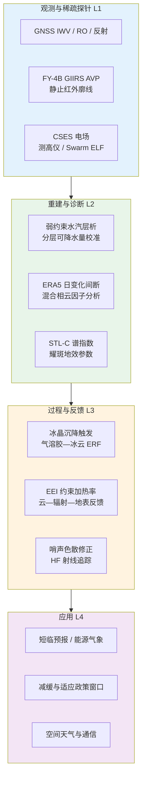
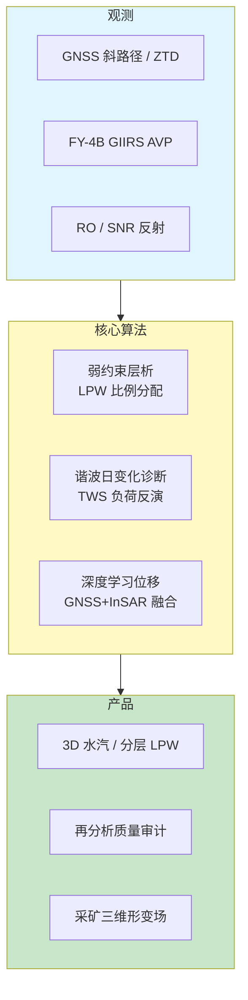
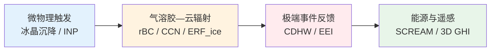
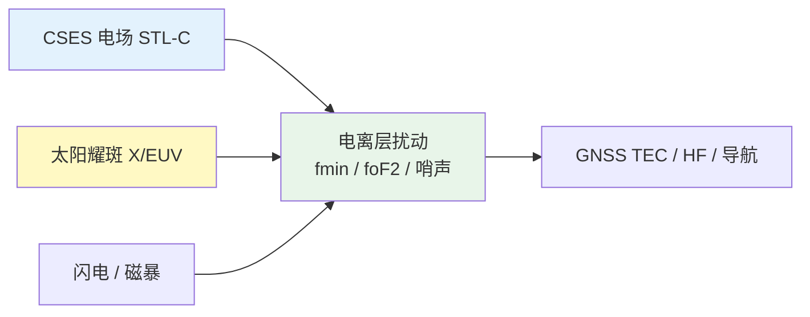
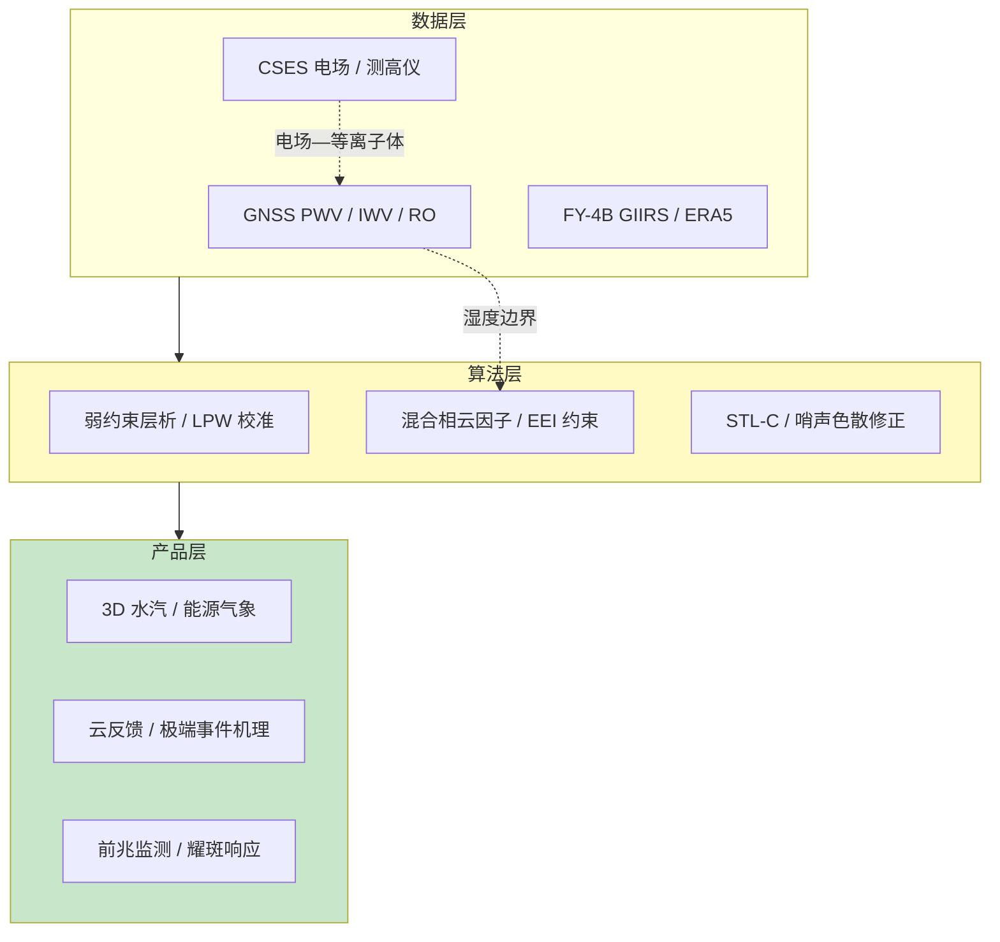

在 2026 年 5 月 21 日至 5 月 28 日这一周的时间窗口内，题录库共收录与「Atmosphere」「GNSS」「Ionosphere」检索词相匹配的论文四十五篇（按题名与 DOI 去重），其中大气类三十二篇、GNSS 类十二篇、电离层类三篇。与上一统计周期相比，GNSS 方向在《GPS Solutions》与《Remote Sensing》上形成「静止气象卫星廓线—地面网络层析—再分析基准检验」的闭环稿件群；大气方向在《Journal of Geophysical Research: Atmospheres》与《Atmospheric Chemistry and Physics》上集中出现混合相云微物理、北极黑碳输送、公里级能源气象与地球能量失衡（EEI）政策约束等议题；电离层方向题录虽少，却同时覆盖岩石圈—大气—电离层（LAIC）电场前兆统计、宁静期太阳耀斑的电离层响应与低轨磁场仪对赤道哨声波的色散修正。下文先给出本期研究印记图式的总览归纳，再分方向展开综述、代表性技术路线对照表、结构示意图与单篇专题画像，其后给出交叉学科网络与创新链示意、近期研究特色与未来趋势判断，并列出参考文献。

## 一、本期研究印记图

本周题录在科学问题层面呈现出「多源湿度廓线约束—再分析日变化可信度」「云—辐射—气溶胶反馈的过程可分解」与「电场—等离子体—空间天气可观测链」三条并行主线。GNSS 方向中，FY-4B/GIIRS 大气垂直廓线（AVP）以体素弱约束方式补强香港区域水汽层析在中上对流层的结构稳定性，全相对均方根误差（RMSE）可降至约 26%；全球逾六千站十年集成水汽（IWV）日变化表明 ERA5 在 09–10 与 21–22 UTC 同化窗边界存在影响 54% 站点的非物理间断，S₁ 相位相对 GNSS 中位滞后约 1.1 小时；同期 ROEX 交换格式与 PyROEX、PySSR 等开源工具链推动掩星与实时产品分析的标准化。大气方向中，ECHAM6.1-HAM2.3 因子分析显示层间冰晶沉降是层状混合相云成冰的关键触发；Douville 与 Allan（2026）基于 EEI 观测约束指出地球加热率逆转在低碳排放下亦极难早于 2040 年代初；云南 2023 年春季复合干旱—热浪则通过云辐射反馈形成正反馈环。电离层方向中，CSES-01 电场 STL-C 谱指数在汤加 M7.6 地震前 20 天内出现多段异常；布拉格测高仪在宁静地磁条件下揭示 fmin 对耀斑地效参数更敏感；Swarm 赤道 ELF 哨声波则偏离经典 Eckersley 色散律。

上述脉络表明，GNSS 正从「延迟改正与定位」深化为「全球湿度基准、分层可降水量产品与再分析质量审计」的核心观测网；大气科学在公里级模拟、气溶胶—冰云辐射强迫与能量失衡政策约束上同步推进；电离层研究把卫星电场、测高仪与低轨磁力计编织为可检验的日地—对流层耦合链条。

## 二、GNSS 与导航遥感应用方向

GNSS 方向本期十二篇论文全部纳入特色画像。整体技术路线呈现「从单站对流层延迟到三维湿度场与分层可降水量，再到水文负荷、地表形变与深空导航」的层级递进，并与 FY 静止卫星廓线、再分析产品及深度学习预测框架形成紧密耦合。

**表1 GNSS 方向代表性研究的技术路线与特点对照**

| 研究主题 | 技术路线概要 | 技术特点 | 重要结论或性能指标 |
|---------|-------------|---------|-------------------|
| FY-4B 弱约束层析 | GIIRS AVP 体素弱约束、四方案对比 | 不改原生 GNSS 几何 | 全高度 RMSE 约 26%，3 km 以上增益显著 |
| 伊朗 HF 电离层 | WSPRNET 多频接收 + 射线追踪 | 2025-11-12 磁暴个例 | 低频吸收主导、GNSS-TEC 约束电子密度 |
| 全球 IWV 日变化 | 六千站十年谐波、ERA5 对比 | S₁/S₂ 分解 | 54% 站受 ERA5 同化间断影响 |
| GNSS 分层可降水量 | SCH + XGBoost 增强 TPW，比例分配 | 探空验证三层 LPW | 低/中/高层 RMSE 降至 1.9/2.3/1.8 mm |
| GNSS-IR 雪深相位 | SNR 干涉相位几何模型 | 四系统多站 | P351 站 RMSE 较传统法降 20% 以上 |
| 塞纳河 TWS 反演 | 331 站垂向位移 + 基准化筛选 | 季节/长期双时间尺度 | 302 站可靠季节、183 站可靠长期 |
| 气候分型 PWV | 1124 站 16 年 + Köppen 分类 | 热—水非线性耦合 | 夏季极大、冬季极小，半球同步 |
| 金川 GNSS+InSAR | 方差分量估计融合三维形变 | SBAS/PS 互补 | 强形变区补全去相干点 |

### 2.1 专题画像：FY-4B/GIIRS 弱约束增强的香港 GNSS 水汽层析

**（1）技术路线：从几何层析到廓线弱约束体素反演**

Zhou 等（2026）针对香港区域对流层水汽层析中射线覆盖不均、体素支撑不足的问题，构建 FY-4B/GIIRS 大气垂直廓线（AVP）弱约束的三维 GNSS 水汽层析框架。研究在 GFS 与 ERA5 两类背景场下设计四组对比试验（有/无 AVP 弱约束），以 GIIRS 提供的垂直分辨率湿度信息在体素尺度施加弱约束，而不改变原生 GNSS 观测几何。验证指标包括 AVP 引起的分析增量、误差缩减高度分布及相对 ERA5 的区域空间增益，重点评估 3 km 以上中上对流层重建稳定性。

**（2）技术特点：静止卫星廓线作为体素先验而非几何增补**

相较以往将 FY 系列数据主要用于补充射线路径或几何观测的研究，该框架把 GIIRS AVP 直接映射为体素级弱约束，使层析在射线稀疏高度仍保持物理一致的垂直湿度结构。结果表明 AVP 引起的增量与误差缩减主要集中于 3 km 以上，且在 GFS 背景下更为显著；Tomo-IV 方案在全高度相对 RMSE 为 26.0%，优于无 AVP 方案。该路径与 ECMWF 已知 ERA5 湿度场在同化窗边界存在间断的问题形成互补——层析产品可为短临对流分析提供独立于再分析间断的局地湿度结构。

**（3）重要结论：中上对流层湿度结构显著改善**

该研究的重要结论是：**FY-4B/GIIRS AVP 弱约束可在不改变 GNSS 观测几何的前提下，将香港区域水汽层析全高度相对 RMSE 降至约 26%，并在 3 km 以上取得最显著的结构增益，为强降水与对流系统预报提供可用的三维湿度约束**。该结论对华南沿海强对流预警具有直接应用价值；向业务推广时需联合探空与雷达检验 AVP 在云降水条件下的适用性，并评估不同背景场对弱约束权重的敏感性。局限在于个例区域与静止卫星观测角依赖仍可能影响边界层反演。

### 2.2 专题画像：磁暴期伊朗多频 HF 信标与 WSPRNET 全球接收的电离层刻画

**（1）技术路线：陆基信标—业余网接收—GNSS-TEC 约束射线追踪**

Mahmoudian 等（2026）利用伊朗电离层监测信标网（IMB）在设拉子、大不里士、马什哈德、比尔詹德等地 7–18 MHz 多频 WSPRNET 调制发射，收集全球业余台站接收报告，分析宁静期与 2025 年 11 月 12 日强磁暴期间的频率依赖日变化、空间覆盖与时变特征。研究以 GNSS 推导的总电子含量（TEC）约束三维射线追踪，在电子密度模式中引入暴时倾斜与梯度，复现跳数结构与地理可达范围变化。

**（2）技术特点：分布式 HF 网约束区域电离层结构**

该方法的创新在于把业余 WSPRNET 网络转化为近实时、多频、多发射点的电离层传播探针，弥补传统垂测仪空间稀疏性。观测显示低频在暴时呈现吸收主导、响应滞后，高频则与 F 层重构及电子密度再分布相关的快速增强或中断；发射点纬度与背景电离层结构造成系统性差异。与仅使用垂测或 TEC 二维图的研究相比，多频射线路径对 D/F 层耦合更敏感。

**（3）重要结论：多频 HF 网可有效约束暴时电离层**

该研究的重要结论是：**分布式多频 HF 信标结合 WSPRNET 全球接收与 GNSS-TEC 约束射线追踪，能够再现 2025-11-12 强磁暴期间伊朗区域频率依赖传播异常，为空间天气监测与 HF 通信频率规划提供区域化约束**。该结论对中东地区短波通信保障具有参考价值；向业务迁移需解决接收站密度不均与发射功率校准问题，并与其他星座 TEC 产品做交叉验证。因果上仍需区分暴时极光带吸收与中层电离层增强的相对贡献。

### 2.3 专题画像：融合邻站坐标与气象数据的 GNSS 位移时空深度学习预报

**（1）技术路线：多站时空特征—气象协变量—位移序列预测**

Jafari（2026）在《GPS Solutions》提出时空深度学习框架，用于 GNSS 三维位移预报。框架将目标站坐标时间序列与邻站 GNSS 坐标及同步气象要素（降水、温度、土壤水分等代理场）联合编码，通过时空注意力或图结构模块刻画区域应变场传播与局地水文负荷效应，实现数日至数周尺度的位移超前预测，并与传统时间序列基线及纯 GNSS 单站模型对照。

**（2）技术特点：从单站拟合到区域协同预报**

相较仅使用单站历史坐标的 ARIMA 或 LSTM 方案，引入邻站与气象协变量可显式表达地震构造、水库蓄水与极端降水引起的空间相关位移。该范式与本期塞纳河盆地 TWS 反演、金川采矿 GNSS+InSAR 融合形成呼应——前者提供水文负荷信号，后者提供高时空分辨率形变监测，深度学习层可作为「观测—机理—预警」链条中的预测环节。

**（3）重要结论：多源协同可提升位移预报可用性**

该研究的重要结论是：**融合邻站 GNSS 坐标与气象数据的时空深度学习框架，能够在区域尺度上改进 GNSS 位移预报精度与鲁棒性，为水库、断层与采矿区形变超前预警提供数据驱动路径**。该结论对基础设施安全监测具有推广潜力；业务化前需用独立地震或水文事件检验泛化能力，并量化气象再分析误差对预报的传递。摘要未公开时，具体 RMSE 增益应以原文图表为准。

### 2.4 专题画像：PySSR 开源实时 GNSS 产品分析工具箱

**（1）技术路线：实时流接入—多产品一致性—可视化诊断**

Teng 等（2026）发布 PySSR，面向实时 GNSS 轨道、钟差、偏差与状态空间表示（SSR）等产品的 Python 开源工具箱。软件模块化实现产品解析、时间对齐、精度统计、异常检测与交互式绘图，支持多分析中心流并行监控，便于科研与业务用户对实时服务进行快速质量评估。

**（2）技术特点：降低实时产品分析门槛**

随着 IGS 实时服务与 PPP-RTK 业务扩展，分析人员需在分钟级判断产品中断、周跳与偏差突变。PySSR 将分散的格式转换与统计脚本整合为统一接口，与 PyROEX 面向掩星 ROEX 格式形成「实时服务 + 掩星档案」双工具链，呼应本期 GNSS 软件生态标准化趋势。

**（3）重要结论：开源工具支撑实时 GNSS 产品质量审计**

该研究的重要结论是：**PySSR 为实时 GNSS 产品提供可复现的分析与可视化流程，有助于缩短业务故障诊断时间并促进多中心产品对比**。该结论对导航增强服务运营商具有运维价值；未来需持续跟进 RTCM/SSR 格式更新并补充自动化告警接口。

### 2.5 专题画像：全球六千站 GNSS IWV 日变化与 ERA5 同化间断影响

**（1）技术路线：十年 GNSS IWV 谐波分解—ERA5 相位/振幅对比—间断检测**

Yuan 等（2026）使用全球逾六千 GNSS 站十年 IWV 资料，表征 S₁（24 h）与 S₂（12 h）日变化.global 年均 S₁ 振幅由热带约 3 kg m⁻² 降至高纬近零，全球平均 0.40 kg m⁻²，峰值地方时约 17.4 h。对比 ERA5 发现其在 12 h 同化窗切换时刻（09–10 与 21–22 UTC）存在尖锐人工间断，影响 54% 站点，幅度可达 GNSS 日变化异常标准差的 146%，导致 S₁ 相位中位滞后 1.1 h、S₂ 振幅 R² 由 0.48 降至 0.38。

**（2）技术特点：GNSS 作为再分析日变化基准**

该工作延续并扩展了欧洲 GPS 与 ERA5 IWV 日变化文献（如 ACP 2023；ECMWF 已知 issues 文档）的全球定量评估，指出间断主要源于 4D-Var 窗边界状态调整而非观测误差。对机器学习小时预报（如 FlowCast-ODE 等研究）而言，若在小时 ERA5 上训练，可能习得非物理跳变；GNSS 独立基准因此成为数据同化与 AI 气象模型质量审计的刚需。

**（3）重要结论：ERA5 不宜直接用于 IWV 日变化敏感应用**

该研究的重要结论是：**GNSS IWV 日变化全球一致可复现，而 ERA5 在约半数站点存在同化窗边界的非物理间断，显著扭曲日变化相位与半日分量，使用 ERA5 进行日变化或小时级 AI 训练需预处理或间断校正**。该结论对对流允许模式边界条件、气候敏感性分析及水文循环诊断具有广泛警示意义；业务同化改进需 ECMWF 与观测社区联合量化 ZWD 分量贡献。

### 2.6 专题画像：PyROEX 与 ROEX 掩星数据预处理标准化

**（1）技术路线：ROEX 格式定义—GUI 质控—观测组合与切割**

Meng 等（2026）在国家空间科学中心 ROEX 独立交换格式基础上开发 PyROEX，提供掩星文件监测、科学观测组合、完整性检查与图形化质控。用户可选择 L1/L2 等观测组合并可视化弯曲角/折射率廓线，以降低多任务星座（CHAMP、GRACE、COSMIC、Metop、FY-3 等）数据交换与软件开发成本。

**（2）技术特点：掩星生态从格式分裂走向统一**

RO 技术已纳入数值天气预报同化，但历史格式不一阻碍全球共享。ROEX 与 PyROEX 将预处理环节标准化，与 YunYao 等星座同化研究（MDPI 2025）形成「格式—同化—预报」闭环，利好台风与极端降水个例试验。

**（3）重要结论：标准化预处理加速掩星业务化**

该研究的重要结论是：**PyROEX 降低 ROEX 格式应用门槛，有望减少掩星数据交换与重复开发成本，推动 GNSS 掩星在大气探测中的业务化应用**。该结论对气象卫星地面段软件规划具有参考价值；需与 IGS 及气象中心业务格式迁移时间表协调。

### 2.7 专题画像：月面 GNSS 与 UWB 联合精密定位概念验证

**（1）技术路线：月球导航星座仿真—UWB 局域增强—联合滤波定位**

Jung 与 Kim（2026）研究月球 GNSS 星座与超宽带（UWB）网络协同的月面精密定位方案，通过仿真评估可见卫星几何、UWB 锚节点布局及多路径环境对定位精度与完好性的影响，为未来月面机器人与着陆器导航提供参数化设计依据。

**（2）技术特点：深空导航从地球模式外推**

相较地球 GNSS，月面缺乏大气延迟但面临弱几何、长基线钟差与严苛功耗约束。UWB 可在着陆区提供厘米级相对定位，与轨道星座形成「全球稀疏 + 局域稠密」组合，呼应地球侧 PPP-RTK 与局域增强思路。

**（3）重要结论：多源融合是月面精密定位可行路径**

该研究的重要结论是：**月球 GNSS 与 UWB 网络联合方案可在仿真中改善月面用户定位精度与可用性，为阿尔忒弥斯等任务的地表导航架构提供参考**。工程实现仍依赖星座部署进度与月面时间同步技术成熟度。

### 2.8 专题画像：GNSS-IR 雪深反演的 SNR 干涉相位直接测高

**（1）技术路线：SNR 干涉相位—几何路径延迟—雪深反演**

Yuan 等（2026）建立 SNR 干涉相位与雪深附加路径延迟的几何模型，在 PRDN、SG27、P351 等站用 GPS/GLONASS/BDS/Galileo 四系统验证；对比传统利用相位变化率（主频）的方法，分析累积与融化期相位对雪面状态的敏感性。

**（2）技术特点：拓展 GNSS-IR 至相位直接测高**

传统 GNSS-IR 雪深反演依赖频域主频，低天线高度站点信噪比受限。直接相位测高在 P351 站 RMSE 较传统方法降低逾 20%，且相位对雪面状态变化具有识别潜力，抬高低天线站适用阈值。

**（3）重要结论：相位测高可行并改善低天线站精度**

该研究的重要结论是：**SNR 干涉相位可直接用于雪深反演，多站多系统结果与传统方法高度一致，并在 P351 站 RMSE 降低逾 20%，相位信息有助于判别积雪与融化状态**。该结论对寒区水文与气候监测具有补充价值；需在不同积雪密度与植被遮挡条件下扩展样本。

### 2.9 专题画像：塞纳河流域 GNSS 反演 TWS 的基准化站网筛选

**（1）技术路线：垂向位移负荷反演—季节/长期双尺度基准化—ERA5-Land 对比**

Mikocki 等（2026）利用内华达地学实验室 331 套 GNSS 垂向位移（2002–2022）在塞纳河流域反演陆地水储量（TWS）变化，通过基准化方法区分季节与长期可靠站点（302 与 183 套），并与全站、预选站方案及 ERA5-Land TWS 对比。结果显示基准化方案在西部测站密集区与 ERA5-Land 最一致，且能可靠识别文献报道的长期干旱。

**（2）技术特点：水文学时间尺度分轨质量控**

水文负荷反演对垂向噪声、参考框架与高程耦合敏感。双时间尺度基准化避免将非水文信号混入长期趋势，为流域水资源与干旱监测提供比「全站反演」更稳健的 GNSS 水文产品。

**（3）重要结论：基准化显著提升 TWS 反演可信度**

该研究的重要结论是：**对 GNSS 站按季节与长期尺度基准化筛选后，塞纳河流域 GNSS 反演 TWS 与 ERA5-Land 及已知干旱事件最一致，建议未来水文大地测量研究默认采用双尺度基准化**。该结论可直接服务于欧洲水资源评估；稀疏区仍需 InSAR 或 GRACE/GRACE-FO 补充。

### 2.10 专题画像：Köppen 气候分型的全球 GNSS-PWV 长期特征

**（1）技术路线：1124 站 16 年同质 PWV—气候带分层—季节与趋势统计**

Li 等（2026）在 Köppen-Geiger 气候分类下分析全球 1124 套超过 16 年 GNSS 可降水水汽（PWV）记录，从_major 气候类到降水/温度子码逐级检验季节位相、振幅及半球一致性，揭示热力学与水文季节性对 PWV 的非线性调制。

**（2）技术特点：观测驱动的气候—湿度耦合基准**

结果表明 PWV 在所有气候型下均呈现夏大冬小，但湿润气候更能把热力潜能转化为水汽，干旱区即使高温亦出现 PWV 上限；等价气候型在南北半球表现同步。该图谱为评估气候模式湿度场与改进气候带划分提供观测锚点。

**（3）重要结论：PWV 季节位相全球稳健且受气候型调制**

该研究的重要结论是：**GNSS PWV 季节位相在全球各气候型中稳健（夏峰冬谷），湿润与干旱气候呈现非线性热—水耦合，可为全球气候模式湿度验证与监测网络设计提供观测基准**。对区域极端降水研究，应结合本期 IWV 日变化与层析结果理解水汽输送。

### 2.11 专题画像：金川矿区 GNSS 与 InSAR 融合三维形变场

**（1）技术路线：SBAS/PS-InSAR 与 GNSS 协同—方差分量估计加权—强形变补点**

Guo 等（2026）以金川铜镍矿二号采区为对象，构建基于后方方差分量估计的自适应融合模型，实现北、东、垂向时空连续三维形变场；针对 InSAR 强形变去相干，在与 GNSS 共位的六个关键点上拟合补全，提升重点区域完整性。MATLAB 自动化流程表明 SBAS 在垂向、PS 在平面方向精度略优。

**（2）技术特点：多技术互补而非简单叠加**

GNSS 稀疏但三维完备，InSAR 稠密但易去相干。融合模型在权重上自适应抑制单源误差，适用于采矿沉陷这类非线性、非平稳形变。

**（3）重要结论：融合模型显著提高矿区形变监测可靠性**

该研究的重要结论是：**GNSS 与 InSAR 融合三维形变反演在金川矿区较单源方法精度更高、稳定性更好，强形变区补点策略改善关键区域覆盖，可为安全开采与灾害预警提供技术支撑**。推广时需按矿区岩性调整去相干阈值。

### 2.12 专题画像：GNSS 约束的 FY-4B 分层可降水量重建

**（1）技术路线：球冠谐波 + XGBoost 增强 TPW—比例分配模型校准 LPW**

Wu 等（2026）先以球冠谐波分析与极端梯度提升（XGBoost）融合提升 FY-4B 总可降水量（TPW），再考虑时空变化的比例分配模型校准低/中/高分层可降水量（LPW）。探空验证显示低/中/高层 RMSE 由 3.0/4.2/2.5 mm 降至 1.9/2.3/1.8 mm，偏差由最大 −1.5 mm 近零；相对 ERA5 空间一致性增强。

**（2）技术特点：静止卫星 LPW 与地基 GNSS 协同**

LPW 垂直结构对对流触发与数值模式初始化至关重要，但静止卫星 LPW 不确定性大。GNSS 提供地基锚定的 TPW 与分层比例约束，与 2.1 节层析框架形成「柱总量 + 分层结构」双产品链。

**（3）重要结论：GNSS 校准显著降低 FY-4B LPW 误差**

该研究的重要结论是：**GNSS 约束可将 FY-4B 分层可降水量 RMSE 降低约 35–45%，并近零化系统偏差，填补高精度 LPW 数据空白，支撑预报与预警应用**。业务化需评估对流系统快速演变下的时间同步误差。

## 三、大气科学方向

大气方向本期从三十二篇题录中选取八篇顶刊与特色工作做完整画像。综述层面，本周稿件群呈现「混合相与冰云微物理过程可识别」「气溶胶—辐射—云反馈的观测与模式双轨约束」「公里级能源气象与复合极端事件机理诊断」三条技术主线，并与 GNSS 水汽基准、电离层电场观测形成交叉。

**表2 大气方向代表性研究的技术路线与特点对照**

| 研究主题 | 技术路线概要 | 技术特点 | 重要结论或性能指标 |
|---------|-------------|---------|-------------------|
| 混合相云成冰 | ECHAM6.1-HAM2.3 因子分析 | 超冷液相分数指标 | 冰晶沉降为层状云成冰关键 |
| 北极 rBC | 船载单颗粒光度计 + Mie 壳核 | 暖空气团侵入 | 质量浓度升 8 倍、Eabs 仍低 |
| 加州能源气象 | SCREAM 3.25/0.8 km + PySAM | 风能分辨率敏感 | 3.25 km 改善风能季节位相 |
| EEI 约束 | 地表温度重建 + EEI 观测贝叶斯 | 政策相关 | 加热率逆转难早于 2040 年代初 |
| 格陵兰峡湾气溶胶 | 系留气球 700 m + CCN | 生物质燃烧烟羽 | CCN 升 1.7–3.7 倍 |
| 气溶胶—冰云 ERF | CAM6 PPE + 云直方图核 | 分解 re/IWP/云量 | SW ERFaci,ice ≈ −0.43 W m⁻² |
| 云南 CDHW | 云辐射强迫诊断 + 地表通量 | 正反馈环 | SWCF 异常 +15 W m⁻² |
| 卫星 GHI 3D 效应 | 3D MC-RT vs 1D 反演 | IPA/PPA 误差 | 1–3 km 域平均偏差最小 |

### 3.1 专题画像：ECHAM6.1-HAM2.3 混合相层状云成冰触发机制

**（1）技术路线：因子实验—超冷液相分数指标—三触发过程分解**

Ickes 等（2026）在全球气候模式 ECHAM6.1-HAM2.3 中区分异质冻结、上层冰晶沉降（播种—馈送）与垂直输送三类冰触发过程，通过因子法统计超冷液相分数变化，量化各过程对层状混合相云成冰的贡献。

**（2）技术特点：过程分辨而非参数总调**

混合相云相态决定辐射收支，模式对冻结参数化与气溶胶—云相互作用敏感。因子框架可在不改动总水含量的前提下隔离过程贡献，为改进冰核化方案提供依据。

**（3）重要结论：冰晶沉降是层状混合相云成冰关键**

该研究的重要结论是：**在 ECHAM6.1-HAM2.3 中，冰晶从上层的沉降（播种—馈送）是触发层状混合相云成冰的最关键过程，直接影响模式对冻结参数化与气溶胶—云相互作用的敏感性**。该结论对北极与中纬度云反馈评估具有重要意义；需用观测约束不同天气型下播种效率。

### 3.2 专题画像：北极暖空气团侵入对 refractory 黑碳混合态的影响

**（1）技术路线：Polarstern 船载单颗粒 soot 监测—核壳 Mie 估算 Eabs**

Arun 等（2026）在 ATWAICE 航次中央北极海洋边界层开展 rBC 微物理与混合态观测。背景条件下 rBC 质量浓度中位约 0.4–0.6 ng m⁻³，核径随纬度增大；暖空气团侵入使浓度升约 8 倍（中位约 3.4 ng m⁻³），伴随欧亚生物质燃烧信号与较大核径，但 core-shell Mie 估算的吸收增强因子在侵入期反而较低（约 1–1.2）。

**（2）技术特点：源区与老化路径决定辐射效应**

结果表明北极 rBC 辐射效应强烈依赖源区与长距离输送老化，而非单纯浓度高低；模式若仅用浓度参数化吸收可能偏差。

**（3）重要结论：暖空气团改变 rBC 源与混合态而非单纯增暖**

该研究的重要结论是：**暖空气团侵入使中央北极 rBC 浓度显著升高并改变粒径分布，但吸收增强因子在侵入期偏低，表明辐射效应由源特征与输送老化共同控制**。该结论对北极放大与冰—云反馈研究具有约束价值；需与本期长寿命亚微米沙尘 INP 研究对照理解远程输送气溶胶的气候角色。

### 3.3 专题画像：SCREAM 公里级模拟的加州风能太阳能评估

**（1）技术路线：SCREAM RRM 3.25 km 与 800 m—PySAM 发电转换—多基准对比**

Zhang 等（2026）用 SCREAM 区域精细化模式估算加州风电与光伏发电，并与 EIA 容量因子、HRRR 及 25 km NARRM 对比。分辨率从 25 km 提至 3.25 km 显著改善风能季节位相误差，但 800 m 增益有限；太阳能模拟优于 HRRR，归因于更准确的地表辐射。

**（2）技术特点：能源应用驱动云解析模式验证**

该研究把气候模式直接接到能源系统软件链，揭示 PySAM 跟踪轴配置敏感性与观测缺口对不确定性主导作用。

**（3）重要结论：3.25 km 是风能评估的性价比分辨率**

该研究的重要结论是：**SCREAM 在 3.25 km 分辨率可显著改进加州风能季节循环，800 m 额外收益有限，太阳发电模拟优于 HRRR，显示云解析模式在可再生能源评估中的潜力**。对电网调度而言，需与 GNSS 水汽与卫星 GHI 观测联合量化极端天气下出力风险。

### 3.4 专题画像：基于 EEI 观测的地球加热率逆转时间约束

**（1）技术路线：全球地表温度重建 + EEI 观测—贝叶斯约束投影**

Douville 与 Allan（2026）联合地表温度与顶大气 EEI 观测，用稳健统计方法约束本世纪地球加热率演变。方法对先验与 EEI 记录长度不敏感，在伪观测检验中表现良好。

**（2）技术特点：政策相关指标先于温度响应**

IPCC AR6 指出 EEI 约 0.5–0.8 W m⁻² 且近年加速；稳定气候需将 EEI 降至近零，而温度响应滞后数十年。该文量化「加热率逆转」时间对减缓与适应窗口的意义。

**（3）重要结论：低碳排放下加热率逆转亦难早于 2040 年代初**

该研究的重要结论是：**即使低碳排放情景，地球加热率逆转极难在 2040 年代初之前出现，较原始投影晚逾十年，对减缓与适应政策具有显著含义**。该结论强调持续 EEI 卫星监测（如 CERES 后续任务）的必要性；区域 EEI 格局归因仍需加强。

### 3.5 专题画像：南格陵兰峡湾系统垂直气溶胶来源与 CCN

**（1）技术路线：GreenFjord 系留气球—粒径谱 / CCN / 光学特性—源解析**

Alden 等（2026）在 Narsaq 开展六周夏季观测，24 次系留气球至约 700 m，识别本地污染、老化海洋背景、加拿大野火烟羽与新粒子增长四类来源。野火期 0.5% 过饱和度 CCN 中位浓度为背景 1.7–3.7 倍，吸收与散射系数增强可与本地污染相当或更强。

**（2）技术特点：极地峡湾垂直结构稀缺观测**

格陵兰峡湾快速变化，气溶胶—云过程关系此前缺乏垂直解析。该数据集为极地云微物理参数化与卫星反演验证提供基准。

**（3）重要结论：远距离生物质燃烧可主导极地 CCN**

该研究的重要结论是：**生物质燃烧烟羽可使南格陵兰峡湾 CCN 与光学厚度显著增强，效应可与本地污染相当，远距离输送对极地气溶胶—云—辐射相互作用具有重要作用**。对冰盖表面反照率与融雪预测，需与本期格陵兰 2023 夏季增暖研究联动分析。

### 3.6 专题画像：CAM6 扰动参数集合的气溶胶—冰云短波辐射强迫

**（1）技术路线：冰云分数—re—IWP 直方图 + 辐射核—PPE 分解**

Duran 等（2026）提出用冰云分数按有效半径与冰水路径分箱的直方图，结合辐射核估算短波气溶胶—冰云有效辐射强迫 ERFaci,ice，并在 CAM6 PPE 中分解 re、IWP 与云量贡献。集合平均 SW ERFaci,ice 约 −0.43 W m⁻²，并给出副热带低云—热带冰云的动力关联路径。

**（2）技术特点：补齐液态云之外的冰云强迫评估**

气溶胶—云相互作用仍是气候敏感度不确定性的主要来源；冰云强迫此前缺乏可分解诊断工具。

**（3）重要结论：冰云 SW 强迫不可忽略且具动力维度**

该研究的重要结论是：**CAM6 PPE 显示气溶胶—冰云短波强迫约 −0.43 W m⁻²，且部分区域由动力变化主导，提示气溶胶—云相互作用评估需同时考虑热力学与动力通道**。该结论对 CMIP7 气溶胶方案设计具有参考价值。

### 3.7 专题画像：云南 2023 春季复合干旱—热浪的云辐射反馈

**（1）技术路线：环流诊断—云量/云厚—地表短波与长波云辐射强迫—地表感热/潜热通量**

Zhou 等（2026）诊断 2023 年 MAM 云南历史最强复合干旱—热浪（CDHW）。副热带高压西伸抑制云发展，短波云辐射强迫 SWCF 异常约 +15.12 W m⁻²，净云辐射强迫约 +11.86 W m⁻²，地表由「湿蒸发」转向「干感热加热」，形成云—辐射—地表正反馈。

**（2）技术特点：云反馈在极端事件中的放大角色**

相较单纯热力异常，该文强调云减少导致的辐射增暖与蒸散减弱互馈，为西南极端事件预警提供过程模板。

**（3）重要结论：云辐射反馈显著放大 CDHW**

该研究的重要结论是：**2023 年云南 CDHW 由环流导致的云减少触发正云—辐射—地表反馈，SWCF 与地表通量异常共同维持并加剧极端事件**。对农业与水电调度而言，需将云辐射反馈纳入季节预测后处理。

### 3.8 专题画像：三维云辐射对卫星地表太阳辐射反演误差

**（1）技术路线：3D 蒙特卡洛 RT 合成 TOA 反射率—1D/IPA/PPA 反演 GHI 对比**

Wiltink 等（2026）在 0.05–12.8 km 多分辨率 cumulus 场评估全球水平辐射（GHI）反演。水平光子传输导致晴空低估、云影高估；PPA 在粗分辨率混合云—晴像素引入偏差，域平均偏差在 1–3 km 最小，细尺度 IPA 误差主导。

**（2）技术特点：静止卫星已达敏感分辨率**

新一代静止卫星空间分辨率已进入 2–6 km IPA 误差主导区，发展 3D RT 参数化成为业务 GHI 与太阳能预报刚需，与 3.3 节 SCREAM 表面辐射评估相呼应。

**（3）重要结论：需 3D RT 校正业务 GHI 反演**

该研究的重要结论是：**在当代静止卫星分辨率下，一维独立像素与平面平行近似不足以准确反演 GHI，必须发展三维辐射传输参数化与校正方案**。该结论对光伏并网预测与气候能量收支研究均具意义。

## 四、电离层与空间天气方向

电离层方向本期仅三篇题录，均作完整画像。整体呈现「卫星电场前兆统计—宁静期耀斑测高仪响应—低轨哨声波色散修正」的观测驱动链条，并与 GNSS TEC、HF 传播诊断形成方法互补。

**表3 电离层方向代表性研究的技术路线与特点对照**

| 研究主题 | 技术路线概要 | 技术特点 | 重要结论或性能指标 |
|---------|-------------|---------|-------------------|
| CSES-01 电场 | STL 分解 + C 谱指数 | 20 d 前兆窗口 | 震前 7 d C 值峰达 4.4σ |
| 耀斑测高仪 | PQ052 手动评图 + 地效参数 | 宁静地磁筛选 | dfmin 与地效参数正相关更强 |
| 赤道 ELF 哨声 | Swarm ASM + 射线追踪 | 赤道色散异常 | 低频群时延路径更短 |

### 4.1 专题画像：CSES-01 电场震前扰动与 STL-C 分解

**（1）技术路线：电场时间序列 STL 分解—C 值谱拟合指数—震例回溯**

Huang 等（2026）对 CSES-01 电场数据做季节—趋势分解，得到经向、纬向与残差分量；以功率谱密度随频率幂律拟合的 C 值量化扰动强度，在常规周期扰动（强度约 0.87）之外检索非 conventional 残差异常，聚焦 2023 年 5 月 11 日汤加群岛 M7.6 地震。

**（2）技术特点：多因果扰动分离**

LAIC 框架下地震前兆电场报告众多但争议大。STL-C 试图区分潮汐、经纬向几何调制与残差前兆，CSES 任务为中意合作空间电磁监测平台，CSES-02 已于 2025 年 6 月发射以增强业务化观测能力。

**（3）重要结论：震前 20 天内出现多级 C 值异常**

该研究的重要结论是：**汤加 M7.6 地震前 20 天内电离层电场残差出现多次 C 值显著异常（最高约 4.4σ，7 d 前达峰），STL-C 方法可区分不同成因扰动，为震前电场研究提供新工具**。该结论对地震电磁监测具有探索价值；统计显著性需多震例全球检验，并严格排除空间天气与仪器扰动。业务预警仍远未成熟。

### 4.2 专题画像：宁静地磁期中等纬度耀斑电离层响应

**（1）技术路线：PQ052 测高仪手动评图—宁静日参考差分—耀斑地效参数**

Erdey 等（2026）在 Dst > −40 nT、Kp < 4 条件下分析布拉格 Pruhonice DPS4D 测高仪 fmin 与 foF2 在耀斑期的偏离（dfmin、dfoF2），构建综合 X 通量、太阳天顶角与耀斑日面位置的「地效」参数。

**（2）技术特点：宁静期隔离耀斑效应**

暴时扰动易掩盖耀斑响应；宁静筛选使 fmin 对耀斑地效参数的相关系数高于 foF2，提示最低电离层对 X/EUV 爆发更敏感。

**（3）重要结论：fmin 是耀斑地效更敏感指标**

该研究的重要结论是：**在宁静地磁条件下，测高仪 fmin 偏离与耀斑地效参数正相关显著强于 foF2，为耀斑对中层电离层快速加热的监测提供指标选择依据**。对 GNSS 单频用户与低频通信，fmin 区域效应可辅助短期风险评估。

### 4.3 专题画像：赤道附近 ELF 闪电哨声波色散异常

**（1）技术路线：Swarm 绝对标量磁力计记录—Eckersley 色散律检验—射线追踪模拟**

Jenner 等（2026）分析 Swarm 在磁赤道附近探测的闪电产生（LG）极低频哨声波，发现其群时延—频率关系偏离经典 Eckersley 律；射线追踪显示低频能量沿较短路径传播，部分抵消高频群速度优势。

**（2）技术特点：修正赤道哨声传播模型**

哨声波广泛用于闪电定位与辐射带电子沉降研究；赤道几何下传播路径弯曲使传统色散解释偏差，影响基于哨声的闪电源定位与 VLF 遥感。

**（3）重要结论：赤道 LG 哨声需路径依赖色散修正**

该研究的重要结论是：**磁赤道附近 ELF 闪电哨声波色散偏离经典规律，射线追踪可复现观测，低频较短路径是主要原因，赤道哨声遥感需采用修正色散模型**。该结论对 Swarm 等低轨星座的电磁环境数据同化具有方法意义。

## 五、交叉学科网络与创新链示意

GNSS IWV 与分层 LPW 产品为 SCREAM 等云解析模式与短临预报提供湿度边界；FY-4B 廓线弱约束层析与 ERA5 间断诊断共同指向「再分析—AI 训练—同化」数据质量瓶颈。大气气溶胶—冰云强迫与云南 CDHW 云反馈改变区域辐射与对流环境，进而调制电离层热结构与闪电活动；CSES 电场与测高仪耀斑响应则把日地空间扰动链接到 GNSS TEC 与 HF 通信用户。下列示意图概括数据—算法—产品—用户的创新链位置。

## 六、近期研究特色与未来趋势展望

本期题录相对近期窗口的突出变化包括：GNSS 研究形成「静止卫星廓线 + 地面网络 + 再分析审计」三角验证结构，开源工具（PyROEX、PySSR）与 ROEX 标准化降低多星座数据摩擦；大气研究在混合相云触发、气溶胶—冰云强迫与 EEI 政策约束上同步推进，公里级 SCREAM 直接对接可再生能源评估；电离层研究在 CSES 电场统计、宁静期耀斑响应与赤道哨声色散三处提供可检验的观测修正。

展望未来三至五年，可检验的技术判断包括：（1）FY-4B/GIIRS 与 GNSS 联合湿度产品若进入区域同化，将首先改善华南、青藏高原等对流活跃区的短临预报；（2）全球 GNSS IWV 日变化基准若被 ECMWF 用于同化窗后处理，可减少 ERA5 间断对 AI 小时预报的系统性污染；（3）气溶胶—冰云 SW 强迫若纳入 CMIP7 多模式评估，将缩小气候敏感度区间；（4）CSES 系列与多震例统计若建立盲检协议，方可判断电场前兆是否达到预警研究门槛；否则仍属科学探索阶段。

## 参考文献

1. Alden, J., Bergner, N., Heutte, B., et al. (2026). Vertically-resolved source contributions to climate-relevant aerosol properties in Southern Greenlandic fjord systems. *Atmospheric Chemistry and Physics*. DOI: 10.5194/acp-26-7165-2026
2. Arun, B. S., Müller, T., Pöhlker, M. L., et al. (2026). Microphysical properties and light absorption enhancement of refractory black carbon aerosols in the central Arctic marine boundary layer. *Atmospheric Chemistry and Physics*. DOI: 10.5194/acp-26-7287-2026
3. Douville, H., Allan, R. P. (2026). Constraints on Climate Change Stabilization Based on Observations of Earth's Energy Imbalance. *Geophysical Research Letters*. DOI: 10.1029/2025gl121056
4. Duran, B. M., Lutsko, N. J., Wall, C. J. (2026). Aerosol-Ice-Cloud Interactions in a Perturbed Parameter Ensemble. *Journal of Climate*. DOI: 10.1175/jcli-d-25-0724.1
5. Erdey, J., Buzás, A., Lichtenberger, J., Barta, V. (2026). Ionospheric Response to Solar Flares at Mid-Latitudes During Geomagnetically Quiet Periods. *Remote Sensing*. DOI: 10.3390/rs18111675
6. Guo, J., Song, Y., Wu, G., et al. (2026). Three-Dimensional Deformation Field Inversion Based on Fused Monitoring Data of GNSS and InSAR. *Remote Sensing*. DOI: 10.3390/rs18101668
7. Huang, J., Song, J., Zhang, Y., et al. (2026). Pre-earthquake Electric Field Disturbances and Interference Analysis Based on CSES-01 Satellite Observations. *Annales Geophysicae*. DOI: 10.5194/angeo-44-391-2026
8. Ickes, L., Neubauer, D., Proske, U., et al. (2026). What Is Triggering Ice in Mixed‐Phase Clouds. *Journal of Geophysical Research: Atmospheres*. DOI: 10.1029/2025jd045160
9. Jafari, M. (2026). A spatiotemporal deep learning framework for GNSS displacement forecasting. *GPS Solutions*. DOI: 10.1007/s10291-026-02097-7
10. Jenner, M., Coïsson, P., Hulot, G., et al. (2026). On the Peculiar Properties of Extremely Low Frequency Lightning Generated Whistlers. *Geophysical Research Letters*. DOI: 10.1029/2025gl121525
11. Jung, D., Kim, E. (2026). Precise positioning on the moon using lunar GNSS and UWB network. *GPS Solutions*. DOI: 10.1007/s10291-026-02088-8
12. Li, L., Li, H., Choy, S., et al. (2026). Global characterisation of GNSS-PWV behaviour stratified by the Köppen-Geiger climate classification. *GPS Solutions*. DOI: 10.1007/s10291-026-02091-z
13. Mahmoudian, A., Lotfabadi, S. H., Azimi, M. (2026). Ionospheric Characterization Over Iran Using Multi‐Frequency IMB HF Transmitters. *Space Weather*. DOI: 10.1029/2025sw004917
14. Meng, X., Zhang, M., Sun, Y., et al. (2026). PyROEX: a python-based open-source software toolkit for GNSS radio occultation data preprocessing in ROEX format. *GPS Solutions*. DOI: 10.1007/s10291-026-02095-9
15. Mikocki, J., Klos, A., Lenczuk, A., et al. (2026). Improved estimates of GNSS-inverted TWS through a benchmarking approach. *GPS Solutions*. DOI: 10.1007/s10291-026-02090-0
16. Teng, H., Liu, S., Schuh, H. (2026). PySSR: an open-source python toolbox for real-time GNSS product analysis. *GPS Solutions*. DOI: 10.1007/s10291-026-02096-8
17. Wiltink, J. I., Trees, V. J. H., van Heerwaarden, C. C., Meirink, J. F. (2026). Errors in satellite-based global horizontal irradiance retrievals due to three-dimensional cloud-radiation interactions. *Atmospheric Chemistry and Physics*. DOI: 10.5194/acp-26-7207-2026
18. Wu, Y., Zhang, B., Yao, Y., et al. (2026). A First Attempt at Reconstructing FengYun‐4B Stratified Precipitable Water Using GNSS. *Geophysical Research Letters*. DOI: 10.1029/2026gl122585
19. Yuan, P., Blewitt, G., Kreemer, C., et al. (2026). Global GNSS IWV diurnal variability over 6,000 stations. *GPS Solutions*. DOI: 10.1007/s10291-026-02093-x
20. Yuan, X., Liu, W., Hu, Y., et al. (2026). Analysis of GNSS-IR snow depth retrieval using SNR-derived interferometric phase. *GPS Solutions*. DOI: 10.1007/s10291-026-02084-y
21. Zhang, J., Golaz, J.-C., Signorotti, M. V., et al. (2026). Simulation of wind and solar energy generation over California with E3SM SCREAM. *Geoscientific Model Development*. DOI: 10.5194/gmd-19-4513-2026
22. Zhou, X., Li, J., Chen, B., et al. (2026). Cloud‐Radiative Feedback Intensified Yunnan's Record‐Breaking 2023 Spring Drought‐Heatwave. *Journal of Geophysical Research: Atmospheres*. DOI: 10.1029/2025jd046196
23. Zhou, Z., Li, L., Sun, Y., Qiu, R. (2026). FY-4B/GIIRS AVP Weak-Constraint-Enhanced GNSS Water Vapor Tomography over Hong Kong. *Remote Sensing*. DOI: 10.3390/rs18111717
