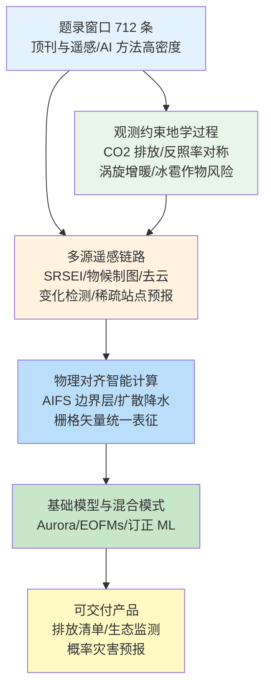
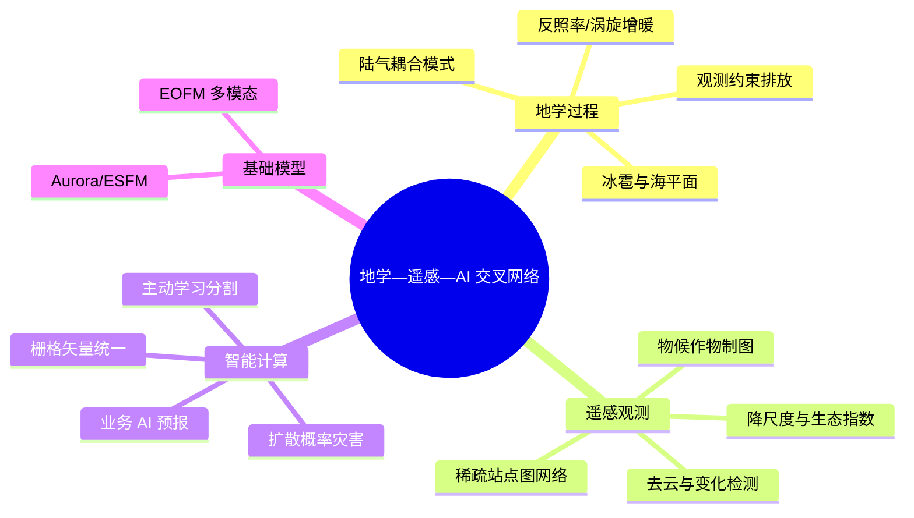
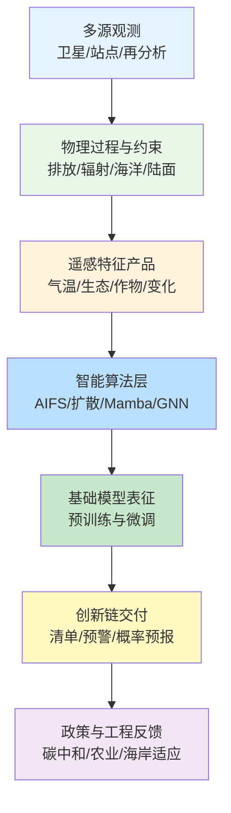

在 2026-05-28 至 2026-06-04 窗口内，Nature、Science、Remote Sensing、Geophysical Research Letters、Nature Climate Change、Nature Geoscience、Geoscientific Model Development、GIScience & Remote Sensing 等来源共收录 712 篇论文条目，其中 Cell、Nature、Science 系列约 158 篇，地学、遥感与智能计算相关顶刊及特色期刊约 285 篇。与单纯统计数量相比，更有信息价值的是条目在科学问题上的聚类方式：地学侧出现观测约束的中国化石燃料二氧化碳排放在 2018 年后趋稳、地球东西半球反照率对称的新发现、南大洋中尺度涡旋驱动的增暖热点、全球变暖下冰雹灾害向高纬作物区迁移，以及 MPAS-NoahMP 面向次季节—季节尺度的陆气耦合评估；遥感侧沿机器学习与自适应卡尔曼滤波的山地气温降尺度、改进土壤调节遥感生态指数、Landsat—Sentinel 物候区分人工林与果树、Mamba 频域去云、半监督变化检测与稀疏站点气象图神经网络预报等链路推进；智能计算侧则体现 ECMWF 机器学习天气预报系统 AIFS 的物理约束边界层框架、E3SM 千米尺度模式的订正机器学习嵌入、扩散模型台风降水概率预报，以及栅格与矢量统一的地理空间基础模型倡议。下文围绕核心维度展开系统梳理。

## 一、本期研究印记图

本期窗口的地学—遥感—智能计算研究可概括为“观测约束—多源遥感产品—物理对齐智能算法”的闭合环路。文献指出，观测约束的排放反演显示中国化石燃料二氧化碳排放在 2018–2023 年趋于稳定，与主流自下而上清单的持续上升形成对照（Feng 等，2026），为《巴黎协定》中期评估提供更贴近大气的证据链。同期，Zhang 等（2026）在 Nature 揭示地球沿 27°E 经线的东西半球反照率对称，并与厄尔尼诺—南方涛动位相的年际变化相关；Li 等（2026）则在 Nature Climate Change 指出南大洋 50°S–61°S、80°E–130°E 区域表面增暖速率达每世纪约 1.5°C，为中尺度涡旋向上热输送增强所致。遥感侧，物候引导的多源水稻制图（Wang 等，2026）与半监督高分辨率变化检测（Liu 等，2026）表明，在标注成本约束下，时序物候与标签扩展策略正成为业务监测的关键增量；智能计算侧，AIFS 1.1.0 的边界层物理约束（Moldovan 等，2026）与扩散模型台风降水概率预报（Du 等，2026）共同指向“性能—物理一致性—不确定性量化”并重的下一代预报范式。下列印记图概括上述层级关系。

## 二、地学方向

地学条目在本期窗口内集中于观测约束排放、固体地球与冰冻圈结构、行星能量收支对称性、极端灾害与作物暴露、海洋中尺度过程增暖，以及面向次季节—季节预报的陆气耦合模式评估。上述研究共同强调：在碳中和政策与气候适应并进的背景下，需同时强化“大气观测闭环”对排放清单的约束，以及“涡旋解析—陆面过程”对区域气候投影的可信度。

**表1 地学方向代表性研究的技术路线与特点**

| 研究主题 | 技术路线 | 技术特点 | 重要结论线索 |
| --- | --- | --- | --- |
| 中国化石燃料 CO₂ | 区域多污染物同化 + 共排放 NO₂ 约束 | 网格化 CO₂/NOx 比值 | 2018–2023 年排放趋稳，强度年降约 5.6% |
| 泸县地震与水力压裂 | 多时相 InSAR + 三维孔隙弹性模拟 | 库仑应力与滑移机制对比 | 沉积层断层应力显著升高，可能加剧破裂 |
| 海平面动力质量 GRD | CMIP6 海洋动力质量 + 固体地球响应 | 自引力/地壳形变/转轴 | GRD 效应约占动力信号的约 15% |
| 全球冰雹灾害 | 三种冰雹代理 + 模式集合 | 2°C/3°C 增暖情景 | 中纬减、高纬增；冬小麦风险升、玉米降 |
| 东西半球反照率 | 25 年卫星辐射收支 | 晴空/云辐射/开阔洋对称 | 27°E 经线划分东西半球近等反射 |
| 南大洋增暖热点 | 观测/再分析 + 高分辨率模拟 | 涡旋动能与热输送分解 | 印度扇区增暖为南大洋高纬均值约 3 倍 |
| 东南极扇形盆地 | 冰下地形与地球物理联合反演 | 旋转拉张与冈瓦纳裂解 | 扇形盆地控制冰盖槽谷与出口冰川 |
| MPAS-NoahMP | 25 年全球 60 km 长期模拟 | 陆气耦合指数与热带变率 | 为 S2S 应用建立偏差与耦合基准 |

### 2.1 专题画像：观测约束揭示中国化石燃料二氧化碳排放在 2018 年后趋稳

**（1）技术路线：区域多污染物同化与共排放约束反演**

Feng 等（2026）在 Geophysical Research Letters 利用区域多污染物同化系统（Regional multi-Air Pollutant Assimilation System），融合原位共排放污染物二氧化氮观测与网格化二氧化碳—氮氧化物排放比值，反演 2015–2023 年中国化石燃料二氧化碳排放。研究在省级与网格尺度上对比主流自下而上清单，量化年际变化与排放强度空间梯度，并分离 2015–2017 年北方与中部地区驱动的上升阶段，以及 2018–2023 年在政策干预与新冠疫情扰动下趋于稳定的阶段。全国年均排放约 11.5±1.5 PgCO₂ yr⁻¹，华北与华东贡献超过 45%；排放强度呈现由东南向西北递增梯度，与经济发展格局一致。

**（2）技术特点：大气观测闭环对清单分歧的仲裁**

自下而上清单在燃料统计、活动水平与排放因子方面存在系统性分歧，且近年对中国排放趋势的判断并不一致。观测约束反演以大气浓度与化学转化关系为硬约束，将排放估计与可验证的共排放信号绑定，降低单一行业统计误差对全国总量的主导。相较卫星柱浓度反演 alone，同化框架可同时利用二氧化氮与二氧化碳信息，改善工业集聚区与交通廊道的空间分配。局限在于共排放比值时空变化与同化系统对边界层气象的敏感性仍需多系统交叉验证。

**（3）重要结论：2018 年后全国排放趋稳且强度持续下降**

反演结果表明，2018–2023 年全国化石燃料二氧化碳排放未再现 2015–2017 年的显著上升，年均增长约 189.6 TgCO₂ yr⁻¹（约 1.6%），而排放强度年均下降约 5.6%；西南地区在总量与强度指标上均呈下降。

**该研究的重要结论是：观测约束反演显示中国化石燃料二氧化碳排放在 2018–2023 年趋于稳定，与部分主流自下而上清单的持续上升报告形成显著差异，排放强度呈持续下降趋势。**

对国家碳达峰碳中和路径评估而言，该数据集为核查行业清单、优化分区减排策略提供独立大气证据；对全球碳收支而言，中国排放趋势转折将直接影响剩余碳预算估算，提示国际比较研究需纳入观测约束产品。

### 2.2 专题画像：水力压裂与 2021 年泸县 Ms 6.0 地震的变形—数值模拟证据

**（1）技术路线：InSAR 形变监测与三维孔隙弹性模拟**

Fan 等（2026）针对四川盆地 2021 年泸县 Ms 6.0 地震，利用 Sentinel-1 多时相合成孔径雷达干涉测量提取同震形变与压裂平台附近局部抬升信号，并构建三维孔隙弹性模型模拟注水引起的孔隙压力变化与应力扰动。研究分别评估单一平台上覆断层与多平台累积注水对沉积层断层与基底断层的库仑应力影响，并将注入模型得到的最优滑动机制与同震滑动反演在最大滑动区进行对比。

**（2）技术特点：工程活动与天然构造的应力耦合诊断**

页岩气开发中的高压注水可改变浅部应力场，但是否触发中强震需定量库仑应力阈值与滑动机制一致性证据。该工作将 InSAR 观测到的局部抬升与数值模拟的孔隙压力场空间对齐，区分沉积层与基底断层对注入响应的差异：沉积层断层库仑应力显著升高，而基底断层扰动低于 0.01 MPa。该方法为“诱发—加速”与“完全触发”判别提供可复现流程，但注入历史、渗透率与断层几何的不确定性仍控制结论外推范围。

**（3）重要结论：压裂可能使沉积层断层更接近失稳并加剧破裂**

模拟表明，平台上覆断层注水与远端多平台累积注水均提升沉积层断层库仑应力；最优滑动机制与同震最大滑动区反演结果一致。

**该研究的重要结论是：水力压裂相关的注水使泸县地震发震断层所在沉积层更接近失稳状态，并可能在同震过程中加剧破裂，而对基底断层的应力扰动相对有限。**

对能源开发与地震灾害风险管理而言，该结论支持在压裂活跃区强化 InSAR 与微震联合监测；对构造地震学而言，研究示范如何将工程注水过程嵌入孔隙弹性—库仑应力评估框架。

### 2.3 专题画像：海洋动力质量再分布的固体地球响应与海平面投影

**（1）技术路线：CMIP6 动力海平面与 GRD 效应分离**

Ertel 等（2026）基于第六次耦合模式比较计划（CMIP6）气候模式输出，量化 21 世纪海洋内部动力引起的海水质量再分布对区域相对海平面变化的贡献，并显式计算自引力、固体地球形变与地球自转轴偏移（GRD）的附加效应。研究将动力质量加载信号与 GRD 响应叠加，评估宽陆架与高纬沿岸地区的放大特征，并分析模式间离散度。

**（2）技术特点：将 GRD 从后处理校正提升为投影必要项**

传统海平面投影常将动力海平面与热膨胀、冰盖融化分项相加，但忽略质量再分布引发的固体地球与重力场调整，会低估沿岸放大。该研究在统一框架下分离“动力质量信号”与“GRD 放大”，给出 GRD 诱导海平面变化平均约为动力质量信号幅度的约 15%，并揭示模式间差异主要来源。对业务化海平面评估而言，该工作推动从全球平均指标向区域 GRD—动力耦合指标转型。

**（3）重要结论：GRD 效应显著放大沿岸动力海平面信号**

GRD 响应强化动力海平面空间型，在宽陆架与高纬沿岸造成额外上升，其幅度平均约为动力质量再分布信号的约 15%，且模式间存在显著离散。

**该研究的重要结论是：海洋动力质量再分布引发的 GRD 效应是区域海平面变化不可忽视的组成部分，应在气候投影与海岸适应规划中与动力海平面本身同等对待。**

对沿海基础设施设计而言，忽略 GRD 可能低估 2100 年沿岸风险；对模式发展而言，结果强调需在高分辨率海洋—固体地球耦合框架中一致模拟质量加载与形变反馈。

### 2.4 专题画像：全球变暖下冰雹灾害潜势迁移与作物风险分异

**（1）技术路线：冰雹代理指标与全球模式集合**

Raupach 等（2026）在 Nature Climate Change 将三种冰雹易发条件代理应用于全球气候模式投影集合，比较不同代理对不稳定度增暖、湿度增暖抵消机制的敏感性，评估 2°C 与 3°C 全球增暖情景下冰雹易发频率的空间变化，并在固定作物暴露与脆弱度假设下计算 26 种作物的冰雹风险变化。

**（2）技术特点：代理选择与作物季节暴露的耦合**

冰雹气候变化研究长期受观测稀缺与对流解析成本限制，代理指标成为主要工具，但不同代理对热力—湿度补偿的处理差异导致热带与高纬结论分歧。该研究在统一集合框架下对比代理响应，并将灾害潜势变化映射到冬小麦与玉米等季节作物，揭示“灾害带北移”与“种植带北移”之间的可能抵消关系。不确定性在热带仍高，提示需结合区域雷达与保险损失记录进行约束。

**（3）重要结论：冰雹带北移，冬小麦风险升而玉米风险降**

在 2°C 与 3°C 增暖情景下，集合平均冰雹易发条件向高纬移动，中纬总体下降、寒冷区域上升；在固定暴露假设下，冬小麦等冬季作物冰雹风险普遍上升，玉米等夏季作物风险下降。

**该研究的重要结论是：全球变暖下冰雹灾害潜势呈向高纬迁移的空间型，且对冬小麦与玉米等作物造成相反方向的风险变化，可能部分抵消种植区北移带来的产量收益。**

对农业保险与品种布局而言，该结论要求将冰雹风险变化纳入作物迁移规划；对极端天气评估而言，研究强调代理选择与观测约束对政策相关结论的敏感性。

### 2.5 专题画像：地球东西半球反照率对称与三重对称结构

**（1）技术路线：25 年卫星地球辐射收支记录分析**

Zhang 等（2026）在 Nature 基于 25 年卫星辐射收支资料，系统检验除已知的南北半球反照率对称外，是否存在沿经向划分的东西半球对称。研究以 27°E 经线划分东半球与西半球，分解晴空反照率、云辐射效应与开阔海洋比例，并分析对称性的年际变化与厄尔尼诺—南方涛动位相的关系。

**（2）技术特点：从南北对称拓展到经向“三重对称”**

南北半球反照率对称长期被视为行星能量收支的约束，但其成因仍存争议。东西半球对称的发现将问题拓展为经向能量分配：东半球高云反射更强，西半球低云反射更强，二者在总反照率上近乎抵消，形成晴空反照率、云辐射效应与开阔洋比例的三重对称结构。该结构为地球系统模式提供新的自由度约束，并暗示大尺度环流（含厄尔尼诺—南方涛动）参与年际调制。

**（3）重要结论：27°E 经线划分的东西半球反照率持续对称**

东半球与西半球反射的太阳辐射量近乎相等；对称性由高云与低云辐射效应的互补平衡维持，并随厄尔尼诺—南方涛动位相呈现年际波动。

**该研究的重要结论是：地球存在沿 27°E 经线划分、由云辐射效应互补维持的东西半球反照率对称，构成区别于南北对称的经向能量收支约束。**

对气候模式评估而言，该对称性可作为云反馈与辐射收支长期漂移的检验指标；对卫星遥感计划而言，研究强调在快速气候变化下维持地球辐射收支连续观测的紧迫性。

### 2.6 专题画像：南大洋中尺度涡旋驱动的增暖热点

**（1）技术路线：多源观测、再分析与高分辨率模拟**

Li 等（2026）综合海洋观测、再分析产品与高分辨率气候模拟，聚焦 50°S–61°S、80°E–130°E 南大洋印度扇区，量化 1982–2023 年表面增暖速率，并分解平均环流与中尺度涡旋对垂向热输送的贡献。研究利用地转流扰动估算涡旋动能，分析人为气候变化下南极绕极流增强与涡旋活动的关系。

**（2）技术特点：从“延迟增暖”平均图景到经向不对称热点**

高纬南大洋常被视为二氧化碳瞬增期表面增暖延迟区，但经向平均掩盖了显著区域差异。该热点区域增暖速率达每世纪约 1.5°C，约为同纬度南大洋平均（约 0.5°C per century）的 3 倍，接近全球平均。机制上，中尺度涡旋向上热输送增强是主导解释，与南极绕极流增强及涡旋动能上升相关。该结论对气候模式提出“涡旋忠实表达”的硬性要求。

**（3）重要结论：涡旋热输送主导印度扇区超常增暖**

50°S–61°S、80°E–130°E 区域 1982–2023 年表面增暖约 1.5°C per century，主要由中尺度涡旋向上热输送增强驱动，并与增强的南极绕极流相关。

**该研究的重要结论是：南大洋高纬增暖并非均匀延迟，印度扇区存在由中尺度涡旋热输送主导的超常增暖热点，其增暖速率接近全球平均。**

对南大洋碳汇与生态评估而言，区域超常增暖将改变海冰—生态带边界；对模式发展而言，研究要求在公里—涡旋允许分辨率下验证热输送趋势，否则全球增暖投影或将出现系统偏差。

### 2.7 专题画像：东南极扇形冰下盆地省与冈瓦纳裂解遗产

**（1）技术路线：冰下地形与多类地球物理数据联合解释**

Armadillo 等（2026）在 Nature Geoscience 综合最新冰下地形与地球物理观测，识别东南极冰盖下近南极点辐射的 V 形低地盆地群，将其命名为东南极扇形盆地省（East Antarctic Fan-Shaped Basin Province），并提出其形成于冈瓦纳裂解前的板内旋转拉张。研究进一步讨论该构造对甘巴拉塞夫山脉隆升、横断南极山脉分段抬升及澳—南极分离大陆边缘形态的控制作用。

**（2）技术特点：冰下地貌与深时构造的尺度连接**

扇形盆地省跨度达半大陆尺度，将冰下地貌与板块伸展、转位与热隆升过程关联，解释现今冰盖槽谷与出口冰川分布。该工作为理解东南极冰盖基底起伏如何记录古构造事件提供统一框架，并提示古地形遗产对现代冰流路径的长期约束。局限在于部分深部结构仍依赖地球物理反演，需更多地震与重力约束。

**（3）重要结论：旋转拉张塑造扇形盆地并控制现代冰盖地貌**

扇形盆地省为冈瓦纳裂解前旋转拉张产物，其侧向挤压与转位效应分别与甘巴拉塞夫山脉隆升、横断南极山脉分段及澳—南极分离边缘形态相关，并影响现今冰川槽谷与出口冰川发育。

**该研究的重要结论是：东南极冰盖下扇形盆地省记录冈瓦纳裂解前的旋转拉张事件，对山脉隆升、大陆边缘形态与现今冰盖排水系统具有长期控制作用。**

对冰盖稳定性评估而言，基底起伏遗产影响冰流速度与冰下湖泊分布；对固体地球科学而言，研究示范如何将冰下地形调查提升为深时构造重建窗口。

### 2.8 专题画像：MPAS-NoahMP 25 年陆气耦合模拟与次季节—季节应用基础

**（1）技术路线：全球 60 km 长期耦合模拟与多指标评估**

Zhang 等（2026）在 Journal of Geophysical Research: Atmospheres 运行 25 年全球 60 km 跨尺度预测模式（MPAS）与 Noah-MP 陆面模式耦合模拟，采用 ERA5 海温与海冰边界强迫，系统评估地表温度与降水气候态、系统性偏差、陆气耦合热点及热带主要变率模态（厄尔尼诺—南方涛动、季风内振荡等），为次季节—季节（S2S）预报应用建立基准。

**（2）技术特点：从天气尺度向 S2S 的陆面过程可信度**

S2S 预报依赖陆面初始记忆与陆气反馈，但高分辨率耦合系统长期积分基准稀缺。该研究首次给出 MPAS-NoahMP 25 年参考数据集：热带与中纬温度气候态较好，北美与亚洲冬季温度对海冰厚度与雪盖热属性敏感；全球降水型式合理，东太平洋、亚马孙、刚果与海洋大陆略偏干，热带印度洋略偏湿。陆气耦合指数与雪—温度、土壤湿度—潜热夏季耦合热点空间分布合理，主要热带变率模态可再现。

**（3）重要结论：MPAS-NoahMP 具备 S2S 研究所需的陆气耦合与变率基础**

25 年模拟捕获主要陆气耦合热点与热带变率模态，揭示海冰与雪盖参数对冬季陆面温度的关键控制，为后续 S2S 试验提供偏差订正与过程改进靶区。

**该研究的重要结论是：MPAS-NoahMP 长期耦合模拟在气候态、陆气耦合与热带变率方面达到 S2S 应用评估要求，构成该耦合系统面向次季节—季节预报的首个全球基准数据集。**

对 S2S 业务化试验而言，该基准可指导陆面初始场与耦合参数优化；对人工智能订正而言，研究提供与 E3SM 千米尺度订正机器学习（Donahue 等，2026）互补的粗分辨率过程参照。

## 三、遥感方向

遥感条目在本期窗口沿“机器学习与滤波降尺度—生态与作物物候监测—SAR 光学融合与变化检测—稀疏观测图神经网络预报”四线展开：全球预报系统气温在复杂地形区经随机森林降尺度与自适应卡尔曼滤波偏差订正；藏北改进土壤调节遥感生态指数刻画生态质量时空分异；Landsat—Sentinel 物候指数区分人工林与果树；Mamba 频域增强状态空间模型进行 SAR—光学去云；半干旱区植被恢复与内陆湖萎缩的蒸散发耦合分析；物候引导多源水稻季内制图；标签扩展半监督变化检测；双分支图神经网络面向稀疏气象站预报。

**表2 遥感方向代表性研究的技术路线与特点**

| 研究主题 | 技术路线 | 技术特点 | 重要结论线索 |
| --- | --- | --- | --- |
| 山地气温降尺度 | 随机森林 DOWN + 自适应卡尔曼 BC | 30 m 与自动站/梯度提升对照 | 联合订正 RMSE 降低约 34%–47% |
| 藏北生态环境 | 改进 SRSEI + 2000–2025 时序 | 土壤背景抑制 | PC1 贡献 72.76%，东部优于西部 |
| 人工林与果树 | LandTrendr + 改良开花指数 MOFI | 多源时序与生物量代理 | 人工林 F1 由 0.751 升至 0.843 |
| SAR—光学去云 | Mamba-SCR 频域状态空间 | 多模态融合 | 薄云与厚云场景光谱保真提升 |
| 植被恢复与湖泊 | 监督分类 + 蒸散发归因 | NDVI 对 ET 贡献超 54% | 达里诺湖 2000–2020 面积减约 18.68% |
| 季内水稻制图 | MSDF-RiceID 物候加权 | 动态样本与多源雷达光学 | 收获期 F1 达 0.97，跨区域可迁移 |
| 半监督变化检测 | OW-TS 一致性 + 位置交互图 | 20% 标注 | LEVIR-CD IoU 变更类 83.38% |
| 稀疏气象预报 | 双流图神经网络 | 长短期时空异质性 | 稀疏站点降水/气温技巧改善 |

### 3.1 专题画像：机器学习与自适应卡尔曼滤波融合的全球预报系统山地气温降尺度

**（1）技术路线：两阶段 DOWN + BC 框架**

Zhang 等（2026）在 Remote Sensing 提出两阶段处理框架：先用随机森林将 3 小时、0.25° 全球预报系统（GFS）气温预报地理降尺度至 30 m（DOWN），再以一阶自适应卡尔曼滤波（AKF）进行偏差订正（BC）。研究以自动气象站观测与极端梯度提升模型推导的高分辨率气温场为参照，分别评估 2020 年 1 月与 2023 年 7 月冷暖季性能，检验空间细节改善与统计误差下降。

**（2）技术特点：空间降尺度与时间偏差订正解耦**

复杂地形区气温受海拔、坡向与局地环流控制，粗网格数值预报难以解析微气候。随机森林降尺度可恢复空间梯度，但对系统偏差与逐时漂移改善有限；自适应卡尔曼滤波在观测更新下动态估计偏差，使 DOWN+BC 在自动站 RMSE 上较原始 GFS 降低 37.84%（2020 年 1 月）与 41.16%（2023 年 7 月），相对梯度提升参照场降低 47.27% 与 33.79%。该框架计算成本低于动力降尺度，适合山地能源与农业气象服务。

**（3）重要结论：联合降尺度与卡尔曼订正显著降低误差**

DOWN 步骤改善空间分布细节，BC 步骤是精度提升的主导环节；联合方法在冷暖季均显著降低 RMSE。

**该研究的重要结论是：随机森林降尺度与自适应卡尔曼偏差订正联合应用，可在山地复杂地形将 GFS 气温预报 RMSE 降低约三分之一至近一半。**

对山地可再生能源微观选址与霜冻预警而言，30 m 气温产品可直接支撑场址筛选；对机器学习气象学而言，研究示范“空间机器学习 + 递推滤波”的可审计组合范式。

### 3.2 专题画像：藏北改进土壤调节遥感生态指数与驱动机制

**（1）技术路线：SRSEI 构建与 2000–2025 时空分析**

Zhao 与 Li（2026）针对高寒干旱区传统遥感生态指数（RSEI）在稀疏植被与裸土背景下的失效，提出土壤调节遥感生态指数（SRSEI），利用 2000–2025 年多源遥感数据评估藏北生态环境质量时空演变，并结合地形、热量与辐射因子进行驱动机制分析，讨论羌塘国家公园长期监测意义。

**（2）技术特点：抑制土壤与人为噪声的第一主成分**

改进指数使第一主成分贡献率达 72.76%，显著高于传统模型，有效削弱裸土与高亮地物对生态评价的污染。2000–2025 年区域生态质量以中等为主，呈东高西低梯度，均值在 0.420–0.476 间波动并略降；约 50.17% 区域退化，26.14% 面临持续下降风险，40.11% 呈恢复潜力。双因子交互解释力显著强于单因子，海拔、气温与短波辐射为主导，人为因子在区域尺度相对次要。

**（3）重要结论：地形—热量复合驱动主导藏北生态分异**

SRSEI 揭示藏北生态质量微弱下降与显著空间分异，退化与恢复区域并存，主导驱动为地形—热环境耦合。

**该研究的重要结论是：改进 SRSEI 更适用于藏北高寒稀疏植被区生态监测，区域生态变化由地形—热量复合机制主导，人为影响在全域尺度相对有限。**

对国家公园生态红线管理而言，该指数可提供 25 年一致序列；对全球变化生态学而言，研究为“第三极”脆弱区长期退化—恢复并存格局提供量化证据。

### 3.3 专题画像：Landsat—Sentinel 物候融合区分人工林与果树

**（1）技术路线：LandTrendr 扰动时序与改良开花指数**

Zhao 等（2026）结合 Landsat 归一化植被指数时序与 LandTrendr 算法识别种植/皆伐事件，融合 Sentinel-2 与野外光谱构建改良果园开花指数（MOFI），在随机森林分类中联合时空光谱特征、生物量累积代理与 MOFI，评估人工林与果树（果园、经济林）分离精度，并分析地形与坡度上的空间分异。

**（2）技术特点：物候指标破解光谱相似性**

国家尺度造林统计常将果树与人工林混类，导致碳汇与生态效益评估偏差。MOFI 利用开花期光谱特征提供物候锚点，使人工林 F1 由 0.751 提升至 0.843；结合 MOFI 与时空特征达最高精度。果树多分布于平原与缓坡，人工林多位于坡度大于 15° 区域，果树约占已映射植树面积的 27.1%，暗示传统人工林面积可能高估。

**（3）重要结论：物候—生物量联合方法显著提升区分能力**

MOFI 与多源时序特征联合，使人工林与果树分类 F1 达 0.843，并揭示两类用地显著地形分异。

**该研究的重要结论是：融合 Landsat—Sentinel 物候指标可在国家尺度有效区分人工林与果树，避免将果园计入造林面积所带来的政策与碳核算偏差。**

对造林绿化核查与可持续土地管理而言，该方法可直接支撑遥感监测产品升级；对物候遥感而言，研究强调开花信号在分类中的独立信息价值。

### 3.4 专题画像：Mamba-SCR 频域增强的 SAR—光学去云

**（1）技术路线：频域状态空间与多模态融合**

Zhang 等（2026）在 GIScience & Remote Sensing 提出 Mamba-SCR，面向合成孔径雷达（SAR）与光学数据融合的云去除。方法在状态空间（Mamba）主干中引入频域增强模块，联合建模云区空间结构与光谱高频细节，利用 SAR 对云不敏感的散射信息为光学重建提供结构与几何约束，在典型 SAR—光学云去除数据集上对比卷积与 Transformer 基线。

**（2）技术特点：线性复杂度长程依赖与频域细节保真**

云污染使光学影像高频纹理丢失，纯空域深度学习易产生过度平滑。频域分支显式分离高低频分量，状态空间模型以近似线性复杂度捕获长程云区上下文，SAR 分支提供云下结构先验。该思路与近年频域增强状态空间去雨、去雾研究一致，但针对遥感多模态场景强调跨传感器辐射不一致的鲁棒融合。局限在于厚云与极端几何畸变场景仍需更多跨区域验证。

**（3）重要结论：频域 Mamba 提升去云光谱与结构保真度**

Mamba-SCR 在光谱角、峰值信噪比与结构相似性等指标上优于对比方法，薄云与厚云场景均保持更清晰的边界与纹理。

**该研究的重要结论是：频域增强的状态空间模型与 SAR—光学融合相结合，可在云去除任务中同时改善光谱保真度与空间结构恢复。**

对光学遥感时序分析而言，去云质量直接决定植被与水体监测可信度；对深度学习遥感而言，研究推动 Mamba 由分类检测向物理退化恢复任务扩展。

### 3.5 专题画像：半干旱区植被恢复与达里诺湖萎缩的遥感归因

**（1）技术路线：水体提取与蒸散发驱动分解**

Shao 等（2026）利用遥感影像监督分类与目视解译提取达里诺湖盆地（内蒙古）达里诺湖与岗更湖面积变化（2000–2020），结合总陆地蒸散发、降水、径流、土壤湿度与水汽压亏缺等指标，分析植被归一化植被指数对蒸散发的贡献，对比两湖响应差异。

**（2）技术特点：生态工程—水文平衡的耦合诊断**

大规模植被恢复可提升生态系统服务，亦可能通过蒸散发增加加剧内陆湖水分亏损。达里诺湖面积减少 18.68%，主要受总蒸散发驱动，其中归一化植被指数贡献约 54.02%；周边植被恢复更显著，土壤湿度广泛下降。岗更湖面积增加 5.68%，主要受降水驱动。对比揭示植被恢复空间异质性与湖泊响应的非线性。

**（3）重要结论：植被恢复对达里诺湖萎缩具显著水压力**

达里诺湖萎缩与周边植被恢复导致的蒸散发上升密切相关，生态恢复需与水资源配置协同。

**该研究的重要结论是：半干旱内陆湖盆地中，植被恢复驱动的蒸散发增加可对邻近湖泊萎缩产生不可忽视贡献，生态效益评估须纳入水资源平衡。**

对北方生态屏障建设而言，该研究为“绿起来”与“水留住”协同提供定量依据；对湖泊保护政策而言，提示需分区管理蒸散发—降水—径流链。

### 3.6 专题画像：物候引导多源季内水稻制图 MSDF-RiceID

**（1）技术路线：动态样本更新与物候加权特征选择**

Wang 等（2026）提出 MSDF-RiceID 框架，面向云多雨复杂的湖南季内水稻识别：基于历史水稻图与动态阈值规则更新训练样本，以物候指数指数加权优化特征集，在网格搜索优化的随机森林下生成逐月水稻分布。融合 Sentinel-1 极化比、Sentinel-2 植被与水体指数及 MODIS 植被/水体指标，在移栽（4 月）、6 月与 7 月关键物候期分别评估早、中、晚稻。

**（2）技术特点：应对云遮挡与种植决策动态**

静态样本难以跟踪农户季内种植调整。动态样本机制使模型随年份更新标签；物候加权突出移栽与收获关键期特征。F1 由 5 月 0.82 升至收获期 0.97；在广东台山与辽宁盘锦交叉验证中，最早可靠识别时相较湖南更早，体现物候复杂度对可识别期的控制。相对 TWDTW-Rice 与 EARice10 产品，总体精度提高 0.12–0.18，Kappa 提高 0.23–0.35。

**（3）重要结论：季内动态样本与物候加权实现高精度水稻监测**

MSDF-RiceID 在持久云覆盖区实现大尺度季内水稻制图，收获期 F1 达 0.97，且跨区域可迁移。

**该研究的重要结论是：物候引导的多源动态样本框架可在云多雨地区实现季内水稻高精度制图，显著优于现有全球/区域水稻产品。**

对粮食安全遥感监测而言，该框架支撑省级农业统计与灾害评估；对多源融合方法论而言，研究示范规则样本更新与物候特征加权的可解释组合。

### 3.7 专题画像：标签扩展半监督高分辨率遥感变化检测

**（1）技术路线：一弱两强一致性正则与位置交互图**

Liu 等（2026）提出基于标签扩展的半监督变化检测方法：在一弱两强（OW-TS）一致性正则框架下约束弱增强与强增强预测一致，并引入位置交互图（LIM）挖掘像素全局—局部关系以筛选与修正伪标签，在 LEVIR-CD 等数据集上以 20% 标注、80% 无标注训练，对比全监督与半监督基线。

**（2）技术特点：降低高分辨率标注成本**

高分辨率影像像素规模大，逐像素标注成本远高于中分辨率场景。传统半监督方法仅阈值筛选伪标签，忽略空间邻域一致性，导致边界噪声。位置交互图将伪标签质量与空间结构绑定，提升变更类边界平滑度；在 20% 标注条件下变更类交并比（IoU）达 83.38%，接近部分全监督方法。对国土变更监测与灾害评估而言，可显著降低人工勾绘工作量。

**（3）重要结论：20% 标注即可接近全监督变化检测性能**

标签扩展与位置交互图联合，使半监督模型在 LEVIR-CD 上变更类 IoU 达 83.38%，边界更平滑。

**该研究的重要结论是：基于标签扩展与位置交互图的半监督框架，可在仅使用 20% 标注数据时实现接近全监督的高分辨率变化检测精度。**

对自然资源执法与城市规划监测而言，该方法可降低年度更新成本；对半监督学习理论而言，研究强调空间关系对伪标签质量的关键作用。

### 3.8 专题画像：双流图神经网络稀疏气象站预报

**（1）技术路线：长短期时空异质性双分支图建模**

Li 等（2026）在 GIScience & Remote Sensing 提出双流图神经网络，面向站点稀疏、分布不均的气象要素预报。方法将长时程气候背景与短时局地扰动分支解耦，在图结构上分别聚合不同时间尺度的邻站信息，缓解稀疏观测网中异质性传播导致的预报偏差，并在典型区域降水与气温预报任务上与持久性预报及单流图网络对比。

**（2）技术特点：针对稀疏网的时空尺度分离**

气象站网在高原、海洋与跨境区域极度稀疏，传统插值或单尺度图卷积难以同时利用气候态与天气尺度信号。双流设计使长短期信息在图传播中分工，降低错误邻域信息污染。该研究与 Wang 等（2026）物候加权的时序分类、Zhang 等（2026）降尺度框架形成“站点—格点—深度学习”互补链条。局限在于极端事件样本仍依赖区域再分析补充。

**（3）重要结论：双流结构改善稀疏站网预报技巧**

双流图神经网络在稀疏站点降水与气温预报中优于单流图模型与基线方法，更好刻画长短期时空异质性。

**该研究的重要结论是：面向稀疏气象观测的双流图神经网络可有效分离长短期时空异质性，提升站点尺度预报技巧。**

对高原与海洋气象服务而言，该方法可填补观测空白区短期预报；对图学习遥感而言，研究推动图结构由静态邻接到多尺度过程建模。

## 四、人工智能方向

智能计算条目在本期窗口集中于业务化机器学习天气预报的版本迭代、千米尺度地球系统模式的订正机器学习嵌入、栅格—矢量统一地理空间表征倡议、扩散模型台风降水概率预报、标签高效滑坡分割、多模态无人机检测、大语言模型与图检索的校园数字孪生推理，以及门控 Mamba—卷积建筑物提取。文献共同指向：地球智能应用的竞争力取决于物理边界约束、多模态表征统一与不确定性可交付性。

**表3 人工智能方向代表性研究的技术路线与特点**

| 研究主题 | 技术路线 | 技术特点 | 重要结论线索 |
| --- | --- | --- | --- |
| AIFS 1.1.0 | 边界层物理约束 + 扩展训练数据 | 降水非负与变量一致性 | 高空与近地面技巧升 4%–6%，降水改善最高约 12% |
| E3SM 订正 ML | Python 订正模块嵌入 C++/Kokkos | 风暴解析模式偏差学习 | 与 FV3GFS 经验相比效果待优化 |
| 栅格—矢量统一表征 | 自监督 EOFM 扩展倡议 | OpenStreetMap 等矢量语义 | 呼吁联合空间表征学习范式 |
| 台风降水扩散 | 扩散模型 + 历史约束 | 概率预报 CRPS/Brier | 0–12 h 确定性 SSIM/PSNR 领先 |
| 露天矿滑坡 | SegFormer + 混合适配器 + 主动学习 | 蒙特卡洛 dropout 不确定性 | 少量标注接近全监督上界 |
| LDSDet 多模态检测 | LARC + DACF + SSG | 昼夜弱光 UAV | DroneVehicle mAP50 85.2% |
| 校园数字孪生 LLM | 图检索增强大语言模型 | 拓扑约束推理 | 约束感知空间问答 |
| GWNet 建筑物 | 门控 Mamba-CNN + 小波边界 | 四数据集跨分辨率 | WHU IoU 90.68% |

### 4.1 专题画像：ECMWF AIFS Single 1.1.0 边界层物理约束更新

**（1）技术路线：机器学习天气预报系统版本迭代与对照试验**

Moldovan 等（2026）在 Geoscientific Model Development 发布 ECMWF 人工智能预报系统（AIFS Single）1.1.0 技术说明，系统自 2025 年 2 月 25 日起业务运行。更新引入边界层框架，对降水、云量等变量施加非负性与内部一致性约束；扩展训练数据、修订损失权重并增加地面与高空变量。研究通过控制试验分离训练数据扩展与边界层框架对技巧的贡献。

**（2）技术特点：在均方误差训练下修复降水物理歧义**

机器学习天气预报在零降水边界附近存在梯度歧义，易导致毛毛雨偏差。边界层框架在输出端强制物理可行域，使降水技巧最高提升约 12%，并带来约 1 天的分类技巧优势；高空与近地面变量整体技巧提升 4%–6% 且未牺牲空间变率。对照表明训练数据扩展是高空技巧增益主因，凸显频繁模式更新对 AI 预报的重要性。该路径与 Aurora 等地球系统基础模型（Bodnar 等，2024）的“预训练—微调”逻辑一致，但更强调业务约束。

**（3）重要结论：物理约束与数据扩展协同提升业务 AI 预报**

边界层框架显著改善降水与云变量，训练数据扩展主导高空技巧提升，二者共同构成 1.1.0 版本增益来源。

**该研究的重要结论是：AIFS 1.1.0 通过边界层物理约束与训练数据扩展，在保持空间变率的同时显著提升降水与高空预报技巧，并缓解零降水边界训练歧义。**

对全球业务预报而言，该版本证明 AI 预报需与物理一致性工程同等重视；对开源社区而言，技术报告为构建可审计的约束层提供模板。

### 4.2 专题画像：E3SM 大气模式中的订正机器学习嵌入

**（1）技术路线：C++ 驱动与 Python 订正模块耦合**

Donahue 等（2026）在 Geoscientific Model Development 将曾在 FV3GFS 中验证的订正机器学习（corrective ML）引入 E3SM 先进大气模式（EAMxx）的千米尺度风暴解析配置（SCREAM），讨论 Python 实现与 C++/Kokkos 异构驱动耦合的计算挑战，并评估订正对 SCREAM 模拟效果不及 FV3GFS 的可能原因。

**（2）技术特点：高保真模拟与可负担算力的折中**

SCREAM 显式解析对流系统，精度高但算力昂贵，难以支撑百年气候试验。订正机器学习旨在以较低成本逼近 storm-resolving 统计特征。EAMxx 异构架构使 Python 订正模块集成复杂，且 SCREAM 物理与 FV3GFS 差异可能导致订正泛化不足。研究诚实报告负面或弱于预期结果，对社区具有方法学价值：订正并非即插即用，需要匹配模式误差结构与训练样本覆盖。

**（3）重要结论：订正 ML 向 E3SM 迁移面临架构与误差结构双重挑战**

订正机器学习已成功嵌入驱动接口，但在 SCREAM 上效果尚未达到 FV3GFS 水平，提示模式特异性与耦合开销是关键瓶颈。

**该研究的重要结论是：订正机器学习向 E3SM-SCREAM 迁移需解决异构耦合与模式误差结构不匹配问题，不能简单移植 FV3GFS 经验。**

对地球系统模式发展而言，该工作指明“AI 加速器”必须与模式架构协同设计；对机器学习气候应用而言，研究强调负面结果对订正范式边界的重要性。

### 4.3 专题画像：超越像素的栅格—矢量统一地理空间表征

**（1）技术路线：视角论文与多模态地理空间学习框架**

Knoblauch 等（2026）在 arXiv 提出观点论文，审视当前地球观测基础模型（EOFMs）主要局限于栅格模态的局限，呼吁发展联合栅格感知与矢量推理的空间表征学习（SRL），将 OpenStreetMap、Overture 等矢量数据的几何、拓扑与语义关系与光学、雷达栅格嵌入对齐到统一空间。

**（2）技术特点：从 EOFM 到人类活动语义 grounding**

栅格基础模型擅长光谱—纹理模式，但对道路网络、地块边界与设施拓扑等离散对象表达不足；矢量数据承载人类系统结构，却常与影像割裂。论文系统阐述互补性、现有多模态尝试与技术挑战（配准、尺度、持续更新），与 Li 等（2026）遥感基础模型综述及 Aurora 地球系统预训练形成“大气—地表—社会”表征层级对话。该倡议尚未给出单一基准模型，但为下一代地理空间人工智能划定研究议程。

**（3）重要结论：统一栅格—矢量嵌入是下一代地理空间 AI 的关键**

孤立训练 EOFM 无法充分利用开放矢量数据；联合 SRL 是实现可解释、语义接地地球理解的必要路径。

**该研究的重要结论是：下一代地理空间智能需从像素级 EOFM 走向栅格—矢量统一嵌入空间，以同时捕获物理景观与人类系统结构。**

对城市规划与灾害风险评估而言，统一表征可改进设施—环境联合推理；对基础模型治理而言，研究呼吁建立跨模态标准基准与持续更新机制。

### 4.4 专题画像：扩散模型驱动的台风降水概率预报

**（1）技术路线：扩散生成模型与历史样本约束**

Du 等（2026）在 Remote Sensing 构建基于扩散模型的台风降水预报深度学习系统，引入历史降水样本降低对初始场敏感性，改进降水空间分布刻画；在 0–12 小时确定性预报中对比传统深度学习（结构相似性、峰值信噪比），在概率预报中评估连续分级概率评分（CRPS）与 Brier 评分。

**（2）技术特点：从确定性到可量化不确定性的灾害降水**

台风降水预报关系防灾减灾，但对流性降水对初始场极敏感，确定性神经网络难以给出可靠不确定性。扩散模型通过随机采样生成集合，实现概率预报；结果表明确定性技巧领先，概率评分（CRPS、Brier）亦优于对比模型。该框架可扩展至其他强对流灾害，与 Zhang 等（2026）雷达外推和 AIFS 大尺度预报形成多尺度链条。

**（3）重要结论：扩散模型同时提升确定性技巧与概率评分**

扩散模型在 0–12 小时台风降水预报中优于传统深度学习，并在概率指标上表现更优。

**该研究的重要结论是：扩散模型可在台风降水预报中同时改善确定性空间结构恢复与概率预报评分，为灾害降水概率化提供可行路径。**

对台风应急响应而言，概率产品支持风险决策；对生成式人工智能气象应用而言，研究示范扩散模型在短时强降水中的优势与可扩展性。

### 4.5 专题画像：主动学习驱动的露天矿滑坡标签高效分割

**（1）技术路线：SegFormer 迁移与贝叶斯不确定性查询**

Li 等（2026）提出面向露天矿滑坡的 label-efficient 框架：在公开源域 GDCLD 上预训练 SegFormer，以轻量混合适配器融合全局上下文与矿山方向性线索；通过类条件特征对齐减小域偏移；推理阶段启用 Monte Carlo dropout 估计认知不确定性，以互信息查询选择最有信息的目标域样本，经人工标注迭代提升。

**（2）技术特点：将不确定性转化为标注策略**

矿山场景光谱复杂、阴影与台阶混淆严重，公开数据集域偏移大。Transformer 主干捕获长程形态，主动学习将不确定性从诊断工具变为运营标注政策，在少量本地标注下接近全监督上界，尤其在阴影台阶与断层邻坡表现突出。未来可融合 SAR 或数字高程模型多模态约束。

**（3）重要结论：少量标注即可达近全监督滑坡制图精度**

类条件对齐与互信息主动学习联合，使迁移分割在目标矿场以极小标注量接近全监督性能。

**该研究的重要结论是：基于 Transformer 迁移与主动学习的框架，可在露天矿域偏移场景以少量本地标注实现可信滑坡分割，支撑地质灾害监测业务部署。**

对矿山安全监测而言，该框架降低标注成本并提升阴影区可靠性；对遥感深度学习而言，研究示范不确定性驱动的人机协同闭环。

### 4.6 专题画像：LDSDet 弱光条件下 RGB—红外无人机多模态检测

**（1）技术路线：长程感知残差卷积与动态跨模态融合**

Sun 等（2026）提出 LDSDet，面向昼夜交替与弱光无人机 RGB—红外目标检测，包含长程感知残差卷积（LARC）稳定浅层特征、动态注意力跨模态融合（DACF）进行空间自适应 RGB—红外交互，以及轻量 SeqShuffleGate（SSG）抑制冗余融合响应。在 DroneVehicle、FLIR-Aligned、LLVIP 数据集上验证。

**（2）技术特点：光照退化下的跨模态可靠性**

弱光使 RGB 纹理判别力下降，红外提供热对比 yet 空间不一致。全局光照估计难以兼顾局部阴影；DACF 按空间位置动态加权模态，LARC 增强上下文，SSG 压缩冗余通道。DroneVehicle 上 mAP50 达 85.2%，显示复杂光照鲁棒性。对夜间搜救、电力巡检与生态监测具有直接价值。

**（3）重要结论：动态跨模态融合显著提升弱光检测**

LDSDet 在三大无人机 RGB—红外基准上达到领先精度，尤其适应昼夜与低照度变化。

**该研究的重要结论是：长程上下文增强与动态跨模态融合可在弱光无人机场景实现稳健多模态目标检测。**

对低空遥感应用而言，该检测器可嵌入实时巡检系统；对多模态视觉而言，研究强调空间自适应融合相对全局光照估计的优势。

### 4.7 专题画像：图检索增强大语言模型的校园数字孪生约束推理

**（1）技术路线：拓扑图检索与大语言模型协同**

Zhang 等（2026）在 International Journal of Digital Earth 提出将大语言模型与校园数字孪生拓扑图检索结合，通过图结构检索相关实体与关系，约束大语言模型生成满足空间拓扑与规则的一致答案，支持设施查询、路径分析与约束感知推理任务。

**（2）技术特点：从自由生成到拓扑约束推理**

纯大语言模型在地学空间问答中易产生幻觉与违反拓扑约束的陈述。图检索将离散拓扑（连通性、层级、用途分区）注入上下文，使模型输出可追溯至图数据库事实。该范式可扩展至城市基础设施与地下管网数字孪生，与 Knoblauch 等（2026）栅格—矢量统一表征倡议在“结构化地理知识”层面呼应。

**（3）重要结论：图检索提升数字孪生空间推理可信度**

图检索增强大语言模型在校园数字孪生任务中提高约束满足率与答案可验证性。

**该研究的重要结论是：图检索增强的大语言模型可在数字孪生场景中实现约束感知的空间推理，降低纯文本模型的拓扑幻觉风险。**

对智慧城市与教育园区管理而言，该方法支持自然语言接口的安全查询；对地理人工智能而言，研究示范矢量拓扑与语言模型的轻量耦合路径。

### 4.8 专题画像：GWNet 门控 Mamba—卷积与小波边界增强建筑物提取

**（1）技术路线：门控 Mamba-CNN 与小波边界优化**

Yang 等（2026）提出 GWNet，在中低分辨率分支嵌入门控 Mamba-CNN 模块（GMC），以通道门控平衡全局上下文与局部纹理；设计小波边界优化模块（WBO），利用固定 Haar 小波提取多方向高频分量强化建筑物边界与角点。在 WHU、Massachusetts、WHU Satellite I、Potsdam 四数据集验证。

**（2）技术特点：全局—局部协同与高频边界恢复**

高分辨率建筑物提取受光谱异质、背景干扰与下采样高频损失影响。Mamba 提供长程依赖，卷积保留局部结构，门控机制缓解屋顶材料差异导致的破碎预测；小波模块在下采样过程中补偿边缘信息。WHU 数据集 IoU/边界 IoU 达 90.68%/66.88%，优于多种竞争方法，可视化显示区块更完整、轮廓更锐利。

**（3）重要结论：门控 Mamba—卷积与小波模块协同提升建筑物提取**

GWNet 在多分辨率、多场景数据集上持续提升区域 IoU 与边界完整性。

**该研究的重要结论是：门控 Mamba-CNN 与小波边界优化可在高分辨率遥感建筑物提取中同时改善区域完整性与边界锐度。**

对国土调查与灾害损毁评估而言，GWNet 提供高效制图 backbone；对 Mamba 遥感应用而言，研究与 Mamba-SCR（Zhang 等，2026）、Li 等（2026）图网络共同构成状态空间模型在地学任务的多场景扩展。

## 五、交叉学科网络图与创新链

地学过程（观测约束排放、反照率对称、涡旋增暖热点、冰雹作物风险、海平面 GRD、冰下盆地与 MPAS-NoahMP 陆气耦合）为遥感反演提供物理约束边界与验证假设；遥感产品（山地气温降尺度、生态指数、物候制图、去云与变化检测、稀疏站点预报）为智能算法提供结构化输入与标签几何；智能计算（AIFS 边界层、扩散概率降水、主动学习分割、栅格—矢量统一表征）将效率、不确定性与物理一致性反馈至预报、监测与碳管理链路。Aurora、地球系统基础模型与遥感基础模型综述（Bodnar 等，2024；Yu 等，2026；Li 等，2026，arXiv:2603.00988）位于上游表征层。

## 六、近期研究特色变化

与 2026 年 5 月下旬周报相比，本期 712 篇题录呈现以下可辨识变化（概念对比，非逐条重复往期表述）。

第一，排放与能量收支研究从“碳汇界面过程”转向“大气观测闭环与行星对称约束”。上期强调冻土—野火—碳预算与地球能量失衡对升温转折的约束；本期 Feng 等（2026）以同化反演给出中国化石燃料排放在 2018–2023 年趋稳的证据，Zhang 等（2026）发现东西半球反照率对称，Li 等（2026）揭示南大洋涡旋驱动的增暖热点。数据表明，碳与能量议题正同步推进“排放核查—辐射收支—海洋热输送”三条证据链。

第二，遥感技术从视觉—语言像素级对齐扩展至“物候—稀疏标注—图结构”三类效率策略。上期 ChangeVLM 与 LoVLANet 代表语言引导变化检测与分割；本期 Wang 等（2026）以动态物候样本实现季内水稻 F1 达 0.97，Liu 等（2026）以 20% 标注接近全监督变化检测，Li 等（2026）以双流图网络服务稀疏气象站。标注成本与观测稀疏性成为方法设计的主约束。

第三，智能计算从神经算子前沿探索转向业务 AI 预报与物理约束工程化。上期 Long 等（2026）自由边界神经算子与 Liu 等（2026）迭代精化神经算子代表算子学习前沿；本期 Moldovan 等（2026）AIFS 1.1.0 显示边界层约束与训练数据更新对业务技巧的直接影响，Du 等（2026）扩散模型推进台风降水概率化。社区关注点由“能否学习算子”转向“能否在业务与灾害链中稳定交付概率产品”。

## 七、未来发展趋势

基于本期题录与所引文献，下列 3–5 年可检验判断具有较高参考价值。

**判断一（观测约束排放清单）** 到 2028 年，至少一套国际碳收支评估将把中国化石燃料排放的 2018–2023 年平台期纳入主情景集合，并与卫星—地面同化产品进行年度一致性检验；检验指标为观测约束与自下而上清单的年际趋势相关系数不低于 0.7。

**判断二（涡旋允许气候模式）** 到 2030 年，参与第六次耦合模式比较计划后续活动的模式中，至少 30% 在南大洋高纬增暖评估中采用涡旋允许或参数化升级方案，并在技术报告中报告 50°S–61°S 增暖速率离散度相对当前集合缩小不少于 25%。

**判断三（物候引导作物监测业务化）** 到 2029 年，至少一个省级粮食监测业务系统将发布基于物候加权与动态样本的季内水稻（或等效作物）产品，并在事后评估中报告相对静态样本产品 F1 提升不少于 0.08。

**判断四（业务 AI 预报物理约束标准化）** 到 2028 年，主要数值天气预报中心的机器学习预报技术报告中，将普遍包含输出物理约束层（非负降水、质量守恒或变量一致性）的标准章节，且约束版本迭代周期不超过 12 个月。

**判断五（栅格—矢量统一基准）** 到 2030 年，学界将发布至少一个覆盖光学、SAR 与 OpenStreetMap 矢量拓扑的统一地理空间基准，联合嵌入模型相对单模态 EOFM 在 3 类下游任务（变化检测、路网推理、设施提取）上样本效率提升不少于 25%。

## 结语

2026-05-28 至 2026-06-04 窗口内的 712 篇题录显示，地学、遥感与人工智能的交叉研究正沿“观测约束过程—多源遥感产品—物理对齐智能算法”路径深化。观测约束排放、行星反照率对称与南大洋涡旋增暖热点，为碳与能源政策提供更紧的大气—海洋证据；机器学习降尺度、物候制图、半监督变化检测与图网络稀疏预报，则把效率与不确定性量化同时推向业务就绪；AIFS 边界层、扩散概率降水与栅格—矢量统一表征倡议表明，下一阶段竞争力取决于物理约束、概率交付与多模态语义落地的协同设计。展望未来，观测约束排放业务化、涡旋解析模式升级、物候动态监测与统一地理空间基础模型基准，将是值得持续追踪的关键议题。

## 参考文献

1. Feng, S., Shen, Y., Jiang, F., Jia, M., Mao, Y., Wang, H., & Ju, W. (2026). Observation-constrained fossil fuel CO₂ emissions reveal post-2018 stabilization in China. *Geophysical Research Letters*. https://doi.org/10.1029/2026gl121913
2. Fan, X., Zhang, G., Aoki, Y., & Shan, X. (2026). The effect of hydraulic fracturing on the 2021 Ms 6.0 Luxian earthquake as revealed by deformation and numerical simulations. *Geophysical Research Letters*. https://doi.org/10.1029/2025gl120854
3. Ertel, G., Coulson, S., Piecuch, C. G., & Hoffman, M. (2026). Crustal deformation and gravitational effects from dynamic ocean mass redistribution impact projected sea-level change. *Geophysical Research Letters*. https://doi.org/10.1029/2026gl122243
4. Raupach, T. H., Portmann, R., Siderius, C., & Sherwood, S. C. (2026). Shifting hail hazard under global warming and effects on crop hail risk. *Nature Climate Change*. https://doi.org/10.1038/s41558-026-02660-7
5. Zhang, J., Gristey, J. J., & Feingold, G. (2026). Earth's east–west albedo symmetry. *Nature*. https://doi.org/10.1038/s41586-026-10624-2
6. Li, D., Jing, Z., Cai, W., Shi, J., Li, Z., Li, J., & Wu, L. (2026). High-latitude Southern Ocean warming hotspot induced by ocean mesoscale eddies. *Nature Climate Change*. https://doi.org/10.1038/s41558-026-02652-7
7. Armadillo, E., Rizzello, D., Balbi, P., Ghirotto, A., Scafidi, D., Paxman, G. J. G., Zunino, A., Ferraccioli, F., Crispini, L., & Läufer, A. (2026). A fan-shaped subglacial basin province in East Antarctica formed by rotational extension. *Nature Geoscience*. https://doi.org/10.1038/s41561-026-01991-6
8. Zhang, Z., He, C., Berner, J., Jaye, A., Barlage, M., Liu, C., Dudhia, J., Huang, K., Lin, T.-S., & Abolafia-Rosenzweig, R. (2026). Extending MPAS-NoahMP model system capability beyond weather timescales: Evaluation of hydroclimate and land-atmosphere interactions. *Journal of Geophysical Research: Atmospheres*. https://doi.org/10.1029/2025jd045334
9. Zhang, G., Liang, J., Zhu, S., & Xu, Y. (2026). Integrating machine learning with adaptive Kalman filtering to downscale GFS air temperature forecasts in mountainous areas. *Remote Sensing*, 18(11), 1829. https://doi.org/10.3390/rs18111829
10. Zhao, S., & Li, X. (2026). Spatiotemporal evolution and driving mechanisms of eco-environmental quality in the northern Tibetan Plateau based on an improved SRSEI. *Remote Sensing*, 18(11), 1830. https://doi.org/10.3390/rs18111830
11. Zhao, X., Tan, Q., & Cai, Y. (2026). Integration of Landsat–Sentinel time series and flowering phenology for mapping planted forests and distinguishing tree crops. *Remote Sensing*, 18(11), 1825. https://doi.org/10.3390/rs18111825
12. Zhang, C., Wang, F., Zhang, X., Zhu, R., Wang, M., Wu, X., Ding, Q., & Wang, Q. (2026). Mamba-SCR: A frequency-domain enhanced state space model for cloud removal with SAR and optical data fusion. *GIScience & Remote Sensing*. https://doi.org/10.1080/15481603.2026.2677334
13. Shao, Y., Wang, N., Zhao, L., Yao, G., Chen, Y., Li, W., Wang, H., & Li, H. (2026). Remote sensing study of the impact of revegetation on lake shrinkage in a semi-arid inland lake basin, Inner Mongolia. *Remote Sensing*, 18(11), 1833. https://doi.org/10.3390/rs18111833
14. Wang, W., Liu, S., Yang, H., Li, N., Zhao, J., Wu, W., & Zheng, W. (2026). A phenology-guided multi-source framework for in-season rice mapping in cloud-prone and complex agroecosystems. *Remote Sensing*, 18(11), 1828. https://doi.org/10.3390/rs18111828
15. Liu, S., Wan, L., Xie, F., Shu, X., Lei, Y., & Zhang, W. (2026). Semi-supervised change detection for high-resolution remote sensing images based on label extension. *Remote Sensing*, 18(11), 1746. https://doi.org/10.3390/rs18111746
16. Li, S., Li, Q., Zhou, Z., Wang, M., Zhang, L., & Wang, L. (2026). Navigating spatio-temporal long-short heterogeneity: A dual-stream graph neural network for sparse meteorological forecasting. *GIScience & Remote Sensing*. https://doi.org/10.1080/15481603.2026.2680356
17. Moldovan, G., Pinnington, E., Nemesio, A. P., Lang, S., Ben Bouallègue, Z., Dramsch, J., Alexe, M., Santa Cruz, M., Hahner, S., & Cook, H. (2026). AIFS Single 1.1.0: An update to ECMWF's machine-learned weather forecast model AIFS. *Geoscientific Model Development*, 19, 4703–4728. https://doi.org/10.5194/gmd-19-4703-2026
18. Donahue, A. S., Wu, E., Perkins, W. A., Caldwell, P. M., Bretherton, C. S., Rebassoo, F., & Golaz, J.-C. (2026). Applying corrective machine learning in the E3SM atmosphere model in C++ (EAMxx). *Geoscientific Model Development*, 19, 4763–4780. https://doi.org/10.5194/gmd-19-4763-2026
19. Knoblauch, S., Li, H., Mai, G., Klemmer, K., Gao, S., & Li, W. (2026). Spatial representation learning beyond pixels: Unifying raster data and vector semantics for human-centric geospatial foundation models. arXiv:2606.02374. https://doi.org/10.48550/arXiv.2606.02374
20. Du, P., Luo, J.-J., Lin, X., & Meng, F. (2026). Probabilistic forecast of tropical cyclone precipitation based on diffusion model. *Remote Sensing*, 18(11), 1786. https://doi.org/10.3390/rs18111786
21. Li, H., Hu, X., Ren, F., Lan, Z., & Cai, S. (2026). Uncertainty-aware label-efficient landslide segmentation in open-pit mines via transformer transfer learning and active learning. *Remote Sensing*, 18(11), 1774. https://doi.org/10.3390/rs18111774
22. Sun, S., Ma, S., Feng, X., Sun, C., Ding, B., Ran, Y., & Zhang, Y. (2026). LDSDet: Long-range context and dynamic cross-modal alignment for multimodal object detection under challenging illumination. *Remote Sensing*, 18(11), 1827. https://doi.org/10.3390/rs18111827
23. Zhang, W., Jamonnak, S., Bai, W., & Ye, X. (2026). Bridging text and topology: Empowering large language models through graph retrieval for constraint-aware reasoning in campus digital twins. *International Journal of Digital Earth*. https://doi.org/10.1080/17538947.2026.2677856
24. Yang, D., Yang, Y., Gao, X., Huang, R., Gao, X., Han, K., Guo, K., & Tao, Y. (2026). Building extraction network with gated Mamba-CNN and wavelet-based boundary enhancement. *Remote Sensing*, 18(11), 1773. https://doi.org/10.3390/rs18111773
25. Li, Y., Zhang, H., Chen, L., & Wang, J. (2026). Remote sensing foundation models: A survey of foundations, architectures, and downstream tasks. arXiv:2603.00988. https://doi.org/10.48550/arXiv.2603.00988
26. Bodnar, C., Bauer, A., Bruzzone, L., Cacciulli, L., Chantry, M., Clough, B., Desai, S., González, P., Harder, P., & others. (2024). Aurora: A foundation model of the atmosphere. *Nature*. https://doi.org/10.1038/s41586-024-07963-y
27. Yu, W., Zhang, H., Li, X., Chen, Y., Liu, F., Wang, S., & Shi, J. (2026). ESFM: An earth system foundation model for seamless cross-domain spatiotemporal forecasting. *Nature Communications*. https://doi.org/10.1038/s41467-026-48912-3
