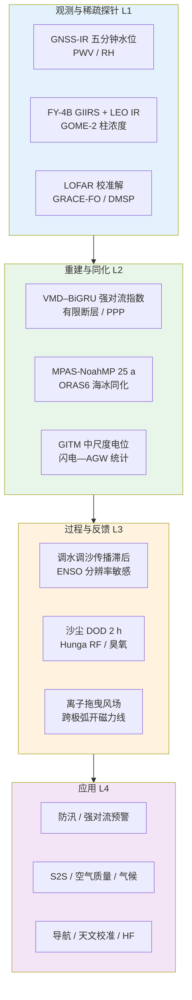
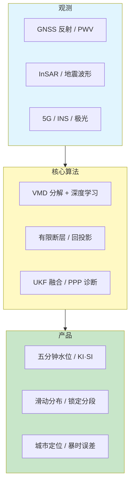
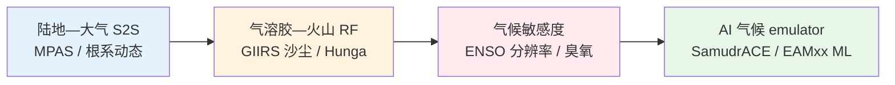
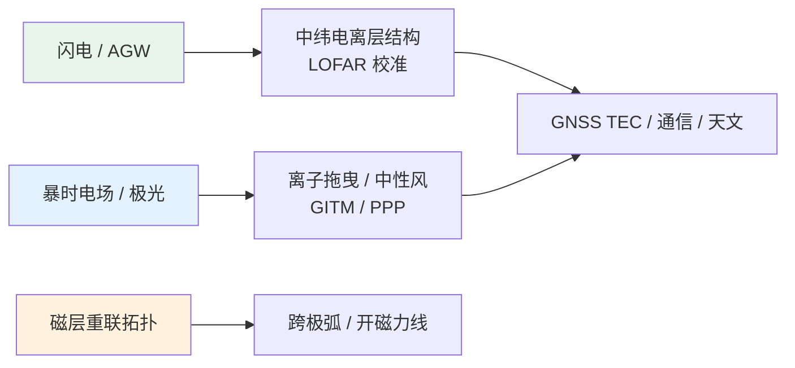
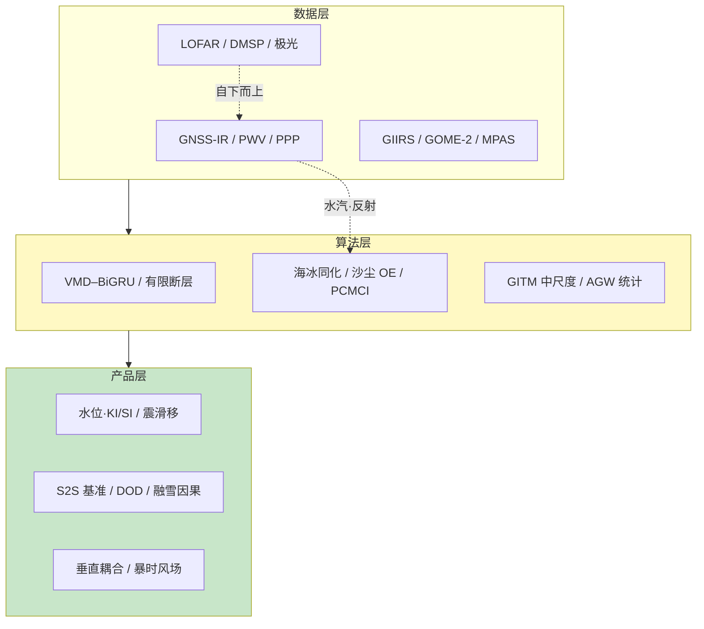

在 2026 年 5 月 28 日至 6 月 4 日这一周的时间窗口内，题录库共收录与「Atmosphere」「GNSS」「Ionosphere」检索词相匹配的论文五十篇（按题名与 DOI 去重），其中大气类四十篇、GNSS 类六篇、电离层类五篇（含一篇同时出现在大气检索中的 LOFAR 统计研究）。与上一统计周期相比，GNSS 题录数量收窄而应用指向更集中，突出内陆河流高频水位、强对流稳定度指数短临预报、超大震有限断层反演与高纬亚暴期定位退化；大气方向在《Geophysical Research Letters》与《Journal of Geophysical Research: Atmospheres》上形成「次季节—气候模式基准」「静止—低轨红外星座气溶胶」与「火山—臭氧—因果诊断」三条稿件主线；电离层方向题录增至五篇，把宁静期自下而上驱动（LOFAR—闪电—AGW）、超级磁暴离子—中性拖曳、亚暴中尺度 GITM 模拟、跨极弧磁场拓扑与中间层精灵绿光激发机制纳入同一观察窗口。下文先给出本期研究印记图式的总览归纳，再分方向展开综述、代表性技术路线对照表、结构示意图与单篇专题画像，其后给出交叉学科网络与创新链示意、近期研究特色与未来趋势判断，并列出参考文献。

## 一、本期研究印记图

本周题录在科学问题层面呈现出「GNSS 反射与水汽进入水文—强对流业务链」「气候—再分析—AI 订正的多尺度模式评估」与「对流层天气—电离层等离子体垂直耦合」三条并行主线。GNSS 方向中，黄河花园口与小浪底站基于滑动窗、变分模态分解（VMD）与多星座 GNSS-IR 实现五分钟水位序列（RMSE 约 0.09–0.14 m），并解析 2025 年调水调沙过程的上下游滞后传播；广西三地 VMD–BiGRU–Attention 模型在 GNSS 可降水水汽（PWV）与相对湿度辅助下，对未来三小时 K 指数与 Showalter 指数（SI）取得稳定预报 skill。大气方向中，全球 60 km MPAS-NoahMP 二十五年模拟为次季节—季节（S2S）预报建立陆地—大气耦合基准；FY-4B GIIRS 与 JPSS/FY-3 低轨红外星座以两小时步长追踪华北快速演变沙尘；汤加 Hunga 火山多模式集合给出 2022–2023 年顶大气瞬时辐射强迫约 −0.19 W m⁻²，水汽共注入主要影响初期气溶胶增长而非长期强迫主导项。电离层方向中，LOFAR 二千八百一十小时统计表明约 17% 观测存在电离层结构，且与 Kp、F10.7 无主导关联，而与夏季傍晚闪电活动高度相似；2024 年 5 月「母亲节」超级磁暴期间，穿透电场驱动的向西等离子体漂移被认定为亚极光带以西扰动风的可能源项。

上述脉络表明，GNSS 正从「基准站网与延迟产品」进一步嵌入洪水调度、强对流预警与震间形变解释；大气科学在 S2S 陆地可预报性、高时间分辨率气溶胶源解析与火山—水汽—硫酸盐辐射链上同步推进；电离层研究则强调宁静期自下而上与暴时自上而下两类驱动机制的可区分观测证据。

## 二、GNSS 与导航遥感应用方向

GNSS 方向本期仅六篇论文，均纳入完整专题画像。整体技术路线呈现「GNSS 反射与大气水汽进入水文与强对流预报」「大地测量约束超大震破裂」「城市多源融合定位」与「低纬亚暴期精密单点定位（PPP）退化」四条支线，并与机载激光雷达风场、InSAR 形变场形成方法互补。

**表1 GNSS 方向代表性研究的技术路线与特点对照**

| 研究主题 | 技术路线概要 | 技术特点 | 重要结论或性能指标 |
|---------|-------------|---------|-------------------|
| 黄河 GNSS-IR 水位 | 滑动窗 + VMD + 多星座反射 | 五分钟间隔 | RMSE 0.09/0.14 m，R² 0.92/0.96 |
| 强对流指数预报 | VMD–BiGRU–Attention + PWV/RH | 广西三站 2021–2025 个例 | KI 最优 K=10，SI 最优 K=11 |
| 堪察加 M8.8 | InSAR + GNSS + 远震波形 | 弯曲断层 + 回投影 | 破裂长约 560 km、峰值滑移约 10 m |
| 城市融合定位 | GNSS/5G/INS + 收缩 UKF | 质量感知加权 | 半遮挡 RMSE 1.61 m，中断率降 49.5% |
| 无人机测风激光雷达 | SC-HHO 自补偿 + GNSS 速度检核 | 微型 CDWL | 风速相关 >0.976，速度 STD 0.08 m/s |
| 高纬 PPP 亚暴 | 近百站 GPS + 极光成像 | 扩散/离散极光 | 扩张相 PPP 误差可达 50 m |

### 2.1 专题画像：黄河 GNSS-IR 五分钟水位与调水调沙动态响应

**（1）技术路线：滑动窗反射率处理—VMD 去噪—水位几何反演**

Fan 等（2026）在花园口与小浪底站采用滑动窗与变分模态分解处理多星座 GNSS 干涉反射测量（GNSS-IR）信噪比序列，构建五分钟间隔水位时间序列，并与实测水尺对比。研究聚焦 2025 年调水调沙期间水位对水库调控的响应，分析宽浅游荡河段与峡谷控制河段的不同传播特征。

**（2）技术特点：内陆复杂河道的高频连续监测**

相较传统水尺与雷达水位计，GNSS-IR 可在现有 GNSS 基准站上以非接触方式获取高频水位，适合水库联动调度场景。VMD 用于分离反射信号中的趋势、扰动与噪声分量，提升洪峰与库泄突变期的跟踪稳定性。花园口站代表下游游荡段，小浪底代表上游控制段，二者对比可揭示洪水波传播与衰减规律。

**（3）重要结论：五分钟水位精度满足防汛分析需求**

该研究的重要结论是：**GNSS-IR 在花园口与小浪底可实现五分钟水位监测，RMSE 分别为 0.09 m 与 0.14 m，决定系数 R² 为 0.92 与 0.96；小浪底对上游泄洪响应迅速，花园口洪峰约滞后 21 小时并沿程衰减，表明方法适用于复杂内陆河流的高频水文监测与调水调沙效应诊断**。该结论对黄河防汛与水库联合调度具有直接应用价值；推广至其他泥沙含量高河道时需评估反射面稳定性。局限在于极端浊水期镜面假设可能失效。

### 2.2 专题画像：GNSS 水汽辅助的 VMD–BiGRU–Attention 强对流稳定度指数预报

**（1）技术路线：VMD 模态分解—双向门控循环单元—注意力加权—三小时超前预报**

Cheng 等（2026）构建 VMD–BiGRU–Attention 模型，以 GNSS 反演 PWV 与相对湿度作为水汽约束，预报未来三小时 K 指数（KI）与 Showalter 指数（SI）。在广西百色、南宁、合浦三站以 2021–2025 年极端降水个例验证，并通过网格搜索确定 VMD 分解层数 K。

**（2）技术特点：水汽观测进入短临强对流指标链**

强对流预警传统依赖探空与数值模式，GNSS PWV 提供连续、低成本的水汽积分约束。VMD 将非平稳指数序列分解为不同时间尺度分量，BiGRU 捕捉双向时序依赖，注意力机制突出对预报关键模态的权重。结果表明 KI 与 SI 的最优分解层数不同（K=10 与 K=11），反映两类指数对水汽—热力配置响应的差异。

**（3）重要结论：PWV 与 RH 显著提升三小时 KI/SI 预报稳定性**

该研究的重要结论是：**在 VMD 最优参数下，KI 与 SI 的 RMSE 最低分别约 3.96 与 1.87；加入 GNSS PWV 与 RH 后，模型在广西三站极端降水个例中能稳定预报未来三小时强对流稳定度指数，并与观测降水特征一致，具备业务短临预警应用潜力**。该结论对华南季风区强对流预报具有参考价值；向业务部署需联合雷达与模式场做概率化订正。不同气候区 VMD 参数需重新标定。

### 2.3 专题画像：2025 年堪察加 Mw 8.8 地震的弯曲俯冲带破裂机制

**（1）技术路线：InSAR 与 GNSS 同震位移—弯曲断层几何—有限断层反演与回投影**

Sun 等（2026）综合 InSAR、GNSS 同震位移与远震波形，构建沿走向与倾向变化的弯曲俯冲带几何，开展有限断层滑动分布反演与背投影分析，研究 2025 年 7 月 29 日堪察加 Mw 8.8 主震时空演化。

**（2）技术特点：超大震在观测稀疏区的多源大地测量约束**

该震为全球 1900 年以来前十大地震之一，以往堪察加俯冲带南北段震级对比机制不清。弯曲断层几何可表达板块界面曲率对破裂传播方向性的控制；回投影揭示高频辐射在滑动斑块边界与可能的分段构造处集中。主震表现为由东北向西南的单侧破裂，初始成核段滑移较弱，进入南部强锁定段后加速。

**（3）重要结论：曲率几何与锁定不均匀共同控制单侧超长破裂**

该研究的重要结论是：**主震破裂长约 560 km、持续时间约 200 s，峰值滑移约 10 m，主要滑动集中在 15–30 km 深度；南部强锁定段与较平滑俯冲几何促成单侧高速传播，北部复杂几何与海底构造可能抑制历史震级，为堪察加未来巨震危险性评估提供新的几何—锁定联合约束**。该结论对太平洋西北缘海啸与地震危险性分析具有重要意义；滑动模型对远震波形权重敏感，需独立海啸与大地测量联合检验。

### 2.4 专题画像：城市 GNSS/5G/INS 分层协同融合高精度定位

**（1）技术路线：跨源质量评估—双域粗差抑制—自适应收缩 UKF—观测质量加权**

Tang 与 Deng（2026）提出 GNSS、5G 与惯性导航系统（INS）的分层协同融合框架，联合粗差检测、残差驱动协方差收缩与质量感知自适应加权，抑制城市多路径与遮挡导致的系统偏差与观测退化。

**（2）技术特点：统一框架处理系统偏差、野值与观测降级**

城市环境固定权重融合难以应对信号时变质量。该文将「检测—收缩—加权」嵌入无迹卡尔曼滤波（UKF），相较 LSTM 辅助 UKF 基线，在半遮挡户外场景水平 RMSE 降低 32.4%，定位中断率降低 49.5%，水平 RMSE 达 1.61 m。

**（3）重要结论：质量感知融合显著改善半遮挡定位连续性**

该研究的重要结论是：**所提 GNSS/5G/INS 融合方法在半遮挡户外环境水平 RMSE 为 1.61 m，相较 LSTM-UKF 基线 RMSE 降低 32.4%、中断率降低 49.5%，为城市车联网与应急导航提供可扩展方案**。该结论对智慧城市定位具有工程价值；全遮挡室内仍依赖 5G/INS 主导，GNSS 可用性需与地图语义联动。

### 2.5 专题画像：无人机载微型相干多普勒测风激光雷达与 SC-HHO 自补偿算法

**（1）技术路线：微型 CDWL 集成—Harris Hawks 优化自补偿风场反演—GNSS 平台速度校验**

Zhang 等（2026）面向低空无人机（UAV）平台设计高集成度相干多普勒测风激光雷达（CDWL），采用自补偿 Harris Hawks 优化（SC-HHO）算法在强动态飞行状态下实时反演风场，并以 GNSS 速度作为平台运动参考。

**（2）技术特点：弱依赖外部参考的机载风场反演**

低空经济对风场感知需求上升，传统地基激光雷达无法覆盖航线空间。SC-HHO 在缺少稳定外部风参考时仍保持风速风向精度，对比试验中与基准机载 CDWL 风速相关系数高于 0.976、风向高于 0.987，RMSE 优于 0.395 m/s 与 4.135°；UAV 搭载试验中平台速度相对 GNSS 标准差 0.080 m/s。

**（3）重要结论：微型 CDWL 具备业务化低空测风可行性**

该研究的重要结论是：**所开发微型 CDWL 与 SC-HHO 算法在对比与 UAV 试验中达到与基准系统一致的风场精度，GNSS 平台速度检核标准差约 0.08 m/s，为低空飞行安全与航路规划提供实用测风手段**。该结论可与本期 GNSS 水文、强对流研究形成「低空风—水汽—对流」监测链；强降水区激光衰减需单独评估。

### 2.6 专题画像：亚暴期高纬 GPS 精密单点定位误差与极光形态关联

**（1）技术路线：阿拉斯加近百站 GPS PPP—相位起伏与 TEC 增强—极光光学分类对比**

Liao 等（2026）分析三次不同强度亚暴事件中 GPS 精密单点定位（PPP）误差与极光结构的空间—时间对应关系，区分离散极光弧、弥散极光与膨胀相边界等形态。

**（2）技术特点：弥散极光亦贡献闪烁与定位退化**

传统上仅强调离散弧相关的电离层不规则体。该研究指出更强亚暴产生更大定位误差，扩张相最严重 PPP 误差可达 50 m 并失锁；误差在亚暴膨胀相极向边界与极光流柱处最大，弥散极光亦伴随中等相位起伏与 PPP 退化，垂直分量误差常大于水平分量，对航空应用尤为关键。

**（3）重要结论：定位退化与亚暴强度及多种极光形态相关**

该研究的重要结论是：**高纬 GPS PPP 误差随亚暴增强而增大，最严重可达约 50 m 并与离散及弥散极光形态共定位，垂直误差常大于水平误差，未来缓解策略需同时考虑多种极光相关的电离层扰动源**。该结论对高纬航空 GNSS 完好性监测具有警示意义；需与本期超级磁暴离子拖曳研究对照不同暴型机制。

## 三、大气科学方向

大气方向本期四十篇题录中，选取八篇顶刊与特色工作撰写完整专题画像。综述层面，本周稿件群呈现「次季节陆地—大气可预报性基准」「静止—低轨红外联合气溶胶监测」「火山—水汽—硫酸盐辐射强迫量化」与「因果学习解析融雪反馈」四条主线，并与 GNSS 水汽、GOME-2 柱浓度及电离层垂直耦合研究形成交叉。

**表2 大气方向代表性研究的技术路线与特点对照**

| 研究主题 | 技术路线概要 | 技术特点 | 重要结论或性能指标 |
|---------|-------------|---------|-------------------|
| MPAS-NoahMP | 全球 60 km、25 a、ERA5 海温强迫 | S2S 陆地耦合评估 | 捕捉 ENSO、MJO 与土壤—雪—温度耦合热点 |
| ORAS6 海冰同化 | 多厚度类别比例分配增量 | 浓度—温度物理关系 | 优于旧版增量分配策略 |
| GEO-LEO 沙尘 | GIIRS 2 h + CrIS/HIRAS 协方差反演 | 日夜追踪 | 2024 年 3 月华北沙尘个例验证 |
| Hunga 火山 RF | 多模式 HTVOLMC 集合 | 水汽共注入敏感性 | TOA 2022–2023 平均约 −0.19 W m⁻² |
| FGOALS-f3 ENSO | 100 km vs 25 km 过程诊断 | 高频西风调制 | 高分辨率振幅更接近观测 |
| 西北臭氧 | ERA5 + CAM-Chem、北太平洋 SST | 波列遥相关 | 1993–2010 夏季臭氧显著上升 |
| 格陵兰融雪因果 | PCMCI + CESM2 大集合 | 对区域气候模式对照 | 短波与湍流通量为主导驱动 |
| SamudrACE  emulator | 1° 耦合 ML 海洋—大气 | 百年尺度稳定 | 耦合 ENSO 变率 realistic |

### 3.1 专题画像：MPAS-NoahMP 二十五年全球模拟与次季节陆地—大气耦合评估

**（1）技术路线：60 km 全球 MPAS 耦合 Noah-MP—ERA5 海温与海冰边界—25 年气候态与变率诊断**

Zhang 等（2026）开展 1999–2024 年全球 60 km MPAS-NoahMP 模拟，评估气候态、系统偏差与陆地—大气耦合指数，为次季节—季节预报提供耦合基准。研究检验地表温度、降水、土壤湿度—潜热通量耦合、雪—温度耦合及热带变率（厄尔尼诺—南方涛动、 Madden-Julian 振荡）再现能力。

**（2）技术特点：首次长时效 MPAS-NoahMP 参考数据集**

S2S 预报超过两周的可预报性部分来自陆地记忆效应。MPAS 非结构网格便于未来区域加密；Noah-MP 多进程植被与积雪参数化影响北亚冬季温度对海冰厚度与雪热属性的敏感性。热带降水存在东太平洋、亚马逊、海洋性大陆略干偏差，印度洋略湿偏差，但 ENSO 与 MJO 空间型合理。

**（3）重要结论：MPAS-NoahMP 具备 S2S 应用的基础耦合 skill**

该研究的重要结论是：**二十五年的 MPAS-NoahMP 模拟能合理再现全球温度与降水型、陆地—大气耦合热点及 ENSO 与 MJO 主要模态，为理解偏差并改进次季节预报提供首个长时效 MPAS-NoahMP 基准数据集**。该结论对国内外 S2S 试验平台具有参考价值；与本期根系动态改善美国中部偏差的研究形成陆地过程互补。向公里级 SCREAM 过渡时需评估耦合反馈是否一致。

### 3.2 专题画像：ORAS6 多类别海冰浓度同化增量分配

**（1）技术路线：海冰浓度观测同化—厚度类别增量比例分配—海冰—海水温度耦合**

Browne 等（2026）为 ECMWF 海洋再分析系统 ORAS6 开发多类别海冰模式同化方案，解决浓度增量如何在多个 ice thickness 类别间分配的问题，并测试简单比例分配与海水温度物理约束策略。

**（2）技术特点：从分析精度到业务 NWP 初始场**

海冰影响全球天气与海气热通量。旧方法在类别分配上引入分析误差；比例分配法提升浓度分析精度，加入海冰—海水温度关系后进一步改善。该系统将用于 ECMWF 数值天气预报及下一代耦合再分析。

**（3）重要结论：增量分配策略显著影响海冰分析质量**

该研究的重要结论是：**多类别海冰模式中采用比例增量分配并辅以海冰—海水温度物理约束，可显著提高 ORAS6 海冰浓度分析精度，为业务预报与耦合再分析提供改进的同化基础**。该结论对极地航运与北极气旋路径预报具有间接意义；与本期白令海冰—大气—海洋中尺度耦合研究可对照不同海域反馈。

### 3.3 专题画像：GEO-LEO 高光谱红外星座监测华北快速演变沙尘暴

**（1）技术路线：FY-4B GIIRS 两小时反演—LEO CrIS/HIRAS-II 四小时过境—协方差最优估计 DOD**

Zheng 等（2026）发展基于最优估计的协方差物理反演，从 GIIRS 与低轨高光谱红外探测仪提取沙尘光学厚度（DOD），以 2024 年 3 月华北沙尘过程为个例，实现日夜两小时—四小时联合监测。

**（2）技术特点：静止与低轨首次联合追踪演变沙尘**

传统可见遥感受昼夜限制；红外高光谱可夜间探测沙尘辐射信号。GEO 提供日变化相位，LEO 提供多地方时采样，二者相关性强。与 GEMS、AERONET 及 PM10 对比表明峰值捕捉准确。

**（3）重要结论：GEO-LEO 星座可实现沙尘日变化高精度监测**

该研究的重要结论是：**FY-4B GIIRS 两小时 DOD 与低轨观测高度一致，可准确捕捉 2024 年 3 月华北沙尘日演变与峰值，标志着静止—低轨红外星座对快速气溶胶事件监测的重要进展**。该结论对空气质量预警与气候气溶胶强迫评估具有意义；与上期 FY-4B 水汽层析研究共同强化风云静止卫星在东亚大气监测中的核心地位。

### 3.4 专题画像：汤加 Hunga 火山喷发后水汽对辐射强迫的多模式分析

**（1）技术路线：HTVOLMC 多地球系统模式集合—SO2 与平流层水汽注入协议—TOA 与地表 RF 分解**

Quaglia 等（2026）基于 Hunga Tonga-Hunga Ha'apai 火山影响模式—观测对比计划，分析 2022 年 1 月 15 日喷发后硫酸盐气溶胶与过量水汽的辐射效应。多模式平均 2022–2023 年全球顶大气瞬时强迫约 −0.19 ± 0.06 W m⁻²，地表约 −0.16 ± 0.06 W m⁻²。

**（2）技术特点：区分水汽共注入与硫酸盐主导项**

Hunga 喷发向平流层注入 unprecedented 水汽并伴随 modest SO2。结果表明_added stratospheric water vapor 对长期全球强迫贡献 minimal，SO2 及其硫酸盐化主导；然而水汽促进初期气溶胶增长，使喷发后前六个月负强迫强于无水汽共注入试验。若 SO2 估算偏低约 50%，全球强迫可能被低估。

**（3）重要结论：硫酸盐主导 RF，水汽调制初期增长**

该研究的重要结论是：**Hunga 火山全球平均辐射强迫在 2022–2023 年约为 −0.19 W m⁻²（TOA），主要由硫酸盐气溶胶驱动，平流层水汽对长期强迫贡献有限但增强初期气溶胶增长与负强迫强度**。该结论对火山气候扰动评估与模式气溶胶微物理方案具有约束价值；需结合最新 SO2 卫星反演更新协议排放。

### 3.5 专题画像：FGOALS-f3 水平分辨率对 ENSO 模拟的过程诊断

**（1）技术路线：约 100 km 与 25 km 两套 FGOALS-f3—ENSO 振幅与不规则性—温跃层与纬向平流反馈诊断**

Song 等（2026）对比低分辨率（f3-L）与高分辨率（f3-H）中国科学院 FGOALS-f3 气候系统模式 ENSO 模拟，采用可重复诊断框架评估振幅、位相转换、海气耦合过程与热带气旋高频西风活动。

**（2）技术特点：从「提高分辨率」到「哪条反馈被修复」**

f3-L 严重高估 ENSO 振幅且周期过于规则；f3-H 振幅接近观测、振荡更不规则。改进源于更真实的 ENSO 纬向风应力经向结构，进而改善温跃层反馈与纬向平流反馈。粗分辨率限制热带气旋模拟，削弱高频西风对 ENSO 的扰动，导致 f3-L 周期性过强。

**（3）重要结论：25 km 级分辨率通过风应力结构改进 ENSO**

该研究的重要结论是：**FGOALS-f3 高分辨率版本通过更真实的赤道太平洋风应力结构与气旋相关高频西风，显著改善 ENSO 振幅与不规则性，表明百公里至二十五公里分辨率的提升对 ENSO 模拟具有过程可解释收益**。该结论对 CMIP7 高分辨率子集合设计具有参考价值；计算成本仍限制多百年集合规模。

### 3.6 专题画像：西北夏季地表臭氧上升与北太平洋海温波列联系

**（1）技术路线：ERA5 与 CAM-Chem 长期趋势—HO2/NO2 化学路径—北太平洋 SST 波列遥相关**

Han 等（2026）分析 1980–2020 年西北中国夏季地表臭氧变化，指出 1993–2010 年为主要上升期。升温减少 HO2、增加 NO2 与 NOx，促进臭氧生成；低云减少导致短波增强与升温。北太平洋海温通过波列调制位势高度，进而影响云量与臭氧。

**（2）技术特点：生态脆弱区的臭氧长期驱动**

相较华东，西北臭氧研究较少。该文将区域臭氧与太平洋年代际海温变率联系，为「海洋—大气环流—辐射—化学」链条提供机制解释。

**（3）重要结论：北太平洋 SST 可作为西北臭氧年代际指标**

该研究的重要结论是：**西北夏季地表臭氧在 1993–2010 年显著上升，主要由升温与低云减少驱动，北太平洋海温通过大气波列影响区域环流与辐射，可作为长期臭氧变率的重要指标**。该结论对「一带一路」沿线空气质量规划具有参考意义；需区分排放控制政策与气候驱动的贡献。

### 3.7 专题画像：PCMCI 因果发现解析格陵兰冰盖表面融雪能量平衡驱动

**（1）技术路线：CESM2 大集合—PCMCI 因果图—两套高分辨率区域气候模式对照**

Yin 等（2026）应用 PCMCI 因果发现算法于 CESM2 大集合及区域模式，识别格陵兰消融区夏季表面融雪异常的控制因子，并与传统相关分析对比。

**（2）技术特点：从相关到可解释因果边**

融雪—反照率正反馈、感热与潜热通量对融雪的 contemporaneous 正链接被识别为 dominant 驱动。PCMCI 提取更少但更物理可解释的依赖。SSP3-7.0 世纪末湍流相关链接变为 undirected，提示更强瞬时地表—大气耦合、统计可识别性下降。

**（3）重要结论：短波与湍流加热是夏季融雪异常主因**

该研究的重要结论是：**格陵兰消融区夏季融雪异常主要受净短波辐射（融雪—反照率反馈）以及感热与潜热通量共同驱动，PCMCI 较相关分析给出更稀疏且物理一致的因果结构，且该结构在变暖情景下仍持续但湍流链接识别性减弱**。该结论对冰盖质量损失预测与区域气候模式参数化具有意义；因果边仍需独立观测验证方向性。

### 3.8 专题画像：SamudrACE 三维海洋—大气机器学习耦合气候模拟器

**（1）技术路线：分量 emulator 耦合—1° 水平、6 h 大气与 5 日海洋步长—百年稳定积分**

Duncan 等（2026）提出 SamudrACE，将机器学习大气与海洋 emulator 通过耦合器交换通量，生成百年尺度、145 个二维场及多层垂直结构的全球模拟，涵盖海冰、地表与顶大气变量。

**（2）技术特点：在耦合模式下再现 ENSO 等变率**

单分量 emulator 在固定边界下 skill 高，但耦合后易漂移。SamudrACE 在耦合运行中保持低气候偏差并产生 realistic ENSO 变率，显示 ML 气候模型从「离线订正」走向「闭环耦合」的可行性。

**（3）重要结论：ML 耦合 emulator 可百年稳定且再现 ENSO**

该研究的重要结论是：**SamudrACE 在百年耦合积分中保持稳定、气候偏差与分量模式相当，并能模拟离线模式无法再现的 ENSO 等耦合变率，为快速气候集合试验提供新路径**。该结论对气候风险评估与模式降维具有前瞻意义；物理守恒与极端事件尾部分布仍需严格检验。与本期 EAMxx  corrective ML 研究形成「公里级物理模式 + 全球 emulator」双轨。

## 四、电离层与空间天气方向

电离层方向本期五篇题录全部撰写完整专题画像。整体呈现「宁静期对流层自下而上驱动」「超级磁暴与亚暴期离子—中性耦合」「磁层拓扑控制跨极弧」与「中间层放电光学机制」四条支线。

**表3 电离层方向代表性研究的技术路线与特点对照**

| 研究主题 | 技术路线概要 | 技术特点 | 重要结论或性能指标 |
|---------|-------------|---------|-------------------|
| LOFAR 统计 | 2810 h、Cas A、17% 结构 | 非暴时主导 | 闪电前 2 h 均值 70 vs 19 次/h |
| 2024 超级磁暴拖曳 | GRACE-FO + DMSP | 首次极区到赤道拖曳 | 穿透漂移驱动亚极光以西风 |
| GITM 亚暴风 | SuperDARN 电位平滑 vs 原始 | 中尺度 <500 km | 中性风滞后漂移数分钟至 30 min |
| 跨极弧 | IMF By 反转 + 磁层模拟 | 开磁力线分割极盖 | 新旧极盖边界形成 TPA |
| 精灵绿光 | 电场加速 + 辐射机制比较 | 557 nm O I | N2 能量转移主导 >84 km |

### 4.1 专题画像：LOFAR 统计揭示中纬电离层自下而上驱动与闪电—AGW 联系

**（1）技术路线：2810 小时 Cas A 观测—电离层校准解结构识别—Kp/F10.7 与闪电气候对比**

Wood 等（2026）利用荷兰 LOFAR 站 2014–2016 年约 2810 小时观测，统计电离层结构出现率（约 17%），对比地磁与太阳活动代理及闪电时空分布。

**（2）技术特点：射电天文校准解作为垂直耦合探针**

既往 LOFAR 个案已揭示中型行电离层扰动、Es 层细分等千米尺度结构。大样本统计表明结构在夏季 21–02 时地方时更常见，与闪电活动季节位相相似；结构出现时观测区前 2 小时闪电均值约（70±25）次/小时，无结构时约（19±5）次/小时，Kp 与 F10.7 非主要驱动。文献表明 LOFAR 探测的行电离层扰动多逆热层风传播，符合准垂直向上大气重力波（AGW）图像，与 TIEGCM-NG/MAGIC 及 GNSS TEC 对雷暴 AGW 的模拟—观测一致。

**（3）重要结论：中纬电离层结构可能与雷暴 AGW 密切相关**

该研究的重要结论是：**LOFAR 观测的中纬电离层结构约 17% 出现率，主要集中于夏季傍晚且与地磁/太阳活动无主导关联，与闪电活动统计高度相似，支持雷暴激发准向上 AGW 是中纬电离层扰动的重要来源，LOFAR 可用于验证全球环流模式中的垂直耦合过程**。该结论对空间天气「宁静期」电离层预报与天文干涉测量校准具有双重意义；因果上仍需闪电—AGW—电离层三重联测个例巩固。

### 4.2 专题画像：2024 年母亲节超级磁暴期间等离子体漂移拖曳热层风

**（1）技术路线：GRACE-FO 与 DMSP 联合—黄昏扇区离子—中性风对比—穿透电场与离子拖曳诊断**

Zhang 等（2026）分析 2024 年 5 月 10–12 日超级磁暴黄昏扇区观测，揭示水平等离子体对流拖曳极盖反太阳风与极光区太阳风方向风场；亚极光纬度（约 35°S–45°N 磁纬）在 10 日 17–23 UT 出现强西风，与穿透向西漂移同步，23 UT 后西风消失。

**（2）技术特点：首次观测极区至赤道连续离子拖曳效应**

文献指出该暴期北半球电子密度最大减弱可达 98% 并持续逾两日，与热层 O/N2 变化及电场扰动相关。该文强调水平等离子体漂移在暴主相从未报道过的全球尺度风场拖曳图像，亚极光西风可由穿透漂移的离子拖曳力解释。

**（3）重要结论：穿透漂移离子拖曳可驱动亚极光以西扰动风**

该研究的重要结论是：**2024 年 5 月超级磁暴主相期间，等离子体水平对流拖曳热层风从极区延伸至赤道，亚极光 17–23 UT 西风与向西穿透漂移一致，表明离子拖曳是此前未充分观测的暴时风场源项**。该结论对热层—电离层耦合模式与暴时轨道预报具有重要约束；需与 TIMED/GUVI 成分变化及 TEC 耗尽研究综合评估导航影响。

### 4.3 专题画像：GITM 模拟亚暴中尺度电离对流对 F 区中性风的影响

**（1）技术路线：SuperDARN 电位驱动 GITM—原始 vs 平滑中尺度场—Toolik Lake SDI 风场验证**

Sheng 等（2026）以 2014 年 3 月 27 日亚暴为例，比较保留与平滑 SuperDARN 电势中尺度（<500 km）结构的两组 GITM 模拟，分离大尺度与中尺度风场贡献。

**（2）技术特点：中尺度漂移幅值约为中性风变化的约 6 倍**

GITM 能合理再现大尺度风变，但低估中尺度风幅值。中尺度电离对流与降水可显著增强模拟的中尺度中性风；F 区（约 270 km）风响应通常滞后电离漂移增强数分钟至约 30 分钟。固定点与涡旋区定量分析支持「漂移先导、风场滞后」的时空组织。

**（3）重要结论：亚暴预报需显式中尺度电离强迫**

该研究的重要结论是：**亚暴期 F 区中性风对 SuperDARN 电势的中尺度结构敏感，GITM 低估中尺度风幅值，保留中尺度电离对流与降水可显著改进模拟，且风响应滞后漂移数分钟至 30 分钟**。该结论对卫星拖曳与低轨星座轨道预报具有意义；业务空间天气模型若平滑化电势可能系统性低估风场扰动。

### 4.4 专题画像：开磁力线分割极盖与跨极弧形成机制

**（1）技术路线：IMF By 符号反转观测—磁层模拟—新旧极盖边界 auroral 映射**

Chen 等（2026）研究 IMF By 反转后共轭半球跨极弧（TPA），指出重联点位移与对流重定向将原映射至极光卵的闭合磁力线分割入新极盖，TPA 沿新旧极盖边界形成并随扩张漂移。

**（2）技术特点：从「闭合磁力线如何进入极盖」的拓扑解答**

共轭 TPA 长期存在「闭合磁通进入开极盖」的争议。该机制通过 By 反转导致的极盖重组给出观测—模拟一致图像，北半球新极盖逆时针环流取代旧结构。

**（3）重要结论：TPA 标示旧—新极盖边界而非简单闭合弧**

该研究的重要结论是：**IMF By 反转通过重联点位移与对流重组，将原极光卵闭合磁力线分割进新极盖，跨极弧沿旧—新极盖边界形成并随极盖扩张漂移，为共轭 TPA 提供开磁力线拓扑解释**。该结论对磁层—电离层—极光耦合教学与模式边界条件具有基础价值；单次事件向统计推广需更多卫星星座观测。

### 4.5 专题画像：精灵顶部氧原子 557 nm 绿光（GhOST）激发机制

**（1）技术路线：闪电致电离层电场—多种 O I 激发机制比较—高度依赖主导过程**

Smith 等（2026）分析精灵顶部绿色发射（GhOSTs），比较分子氮亚稳态向 O I 能量转移、O2 极紫外光解等机制在闪电诱导电场下的贡献。

**（2）技术特点：区分中间层放电与气辉同类发光路径**

557 nm 来自 O I ¹S 态。结果表明 84 km 以上 N2 能量转移主导，84 km 以下 O2 极紫外光解更重要，并总结 GhOST 可观测性最有利条件。

**（3）重要结论：GhOST 绿光机制随高度分轨**

该研究的重要结论是：**精灵顶部 557 nm 绿光在 84 km 以上主要由 N2 亚稳态能量转移激发 O I，以下由 O2 极紫外光解主导，为中间层放电光学诊断与观测计划提供机制依据**。该结论与 LOFAR 探测的对流层—电离层耦合在物理场景上互补；对 GNSS 相位起伏的直接影响有限，但指示强对流—放电—大气光学的完整链条。

## 五、交叉学科网络与创新链示意

GNSS PWV 与五分钟水位产品为强对流指数预报与 MPAS 陆地—大气耦合验证提供边界层湿度与径流响应约束；FY-4B GIIRS 沙尘与 GOME-2 水汽柱浓度则为 ERA5 及 CAM-Chem 臭氧—辐射诊断提供独立观测锚点。电离层研究中，LOFAR 闪电—AGW 信号与 GNSS TEC、PPP 误差形成「天气驱动—等离子体结构—导航性能」链条；超级磁暴离子拖曳则与热层模式及高纬 PPP 退化直接相关。下列示意图概括数据—算法—产品—用户的创新链位置。

## 六、近期研究特色与未来趋势展望

本期题录相对 2026-05-21—05-28 窗口的突出变化包括：GNSS 题录由十二篇减至六篇，但应用链条更完整，涵盖黄河高频水文、华南强对流短临、超大震破裂与城市融合定位；大气方向 GRL 占比上升，次季节 MPAS 基准、GEO-LEO 沙尘、Hunga 辐射与格陵兰因果诊断形成「模式基准—极端事件—机制识别」组合；电离层题录由三篇增至五篇，宁静期 LOFAR 自下而上驱动与 2024 超级磁暴离子拖曳并列，补上「非暴时天气—电离层」与「暴时电磁—热层」两类机制证据。

展望未来三至五年，可检验的技术判断包括：（1）GNSS-IR 五分钟水位若与水库调度系统联调，可在黄河等冲积河段形成业务化洪峰传播预警；（2）VMD–BiGRU–Attention 与 PWV 融合若接入省级短临平台，需与雷达外推和模式 CAPE 场做概率集成；（3）MPAS-NoahMP 与 SamudrACE 分别代表物理与 ML 两条 S2S 加速路径，二者在 ENSO 后报试验中的可比检验将决定业务采纳节奏；（4）LOFAR 类射电校准解若与 GNSS TEC 融合，有望业务化识别雷暴 AGW 所致 TIDs，改善中纬电离层预报；（5）超级磁暴离子拖曳机制若纳入 GITM 等模型常规扰动驱动，可改善高纬 PPP 完好性保护水平估计。

## 参考文献

1. Browne, P., de Boisseson, E., Keeley, S., et al. (2026). Sea ice data assimilation in ORAS6. *The Cryosphere*. DOI: 10.5194/tc-20-3299-2026
2. Chen, X.-M., Xing, Z.-Y., Zhang, Q.-H., et al. (2026). Open Magnetic Field Lines Partition Auroral Oval Segments Into Transpolar Arcs. *Geophysical Research Letters*. DOI: 10.1029/2025gl121403
3. Cheng, Z., Cao, Y., Zhou, L., et al. (2026). Prediction of Severe Convective Stability Indices Based on VMD–BiGRU–Attention and GNSS. *Remote Sensing*. DOI: 10.3390/rs18111823
4. Duncan, J. P. C., Wu, E., Dheeshjith, S., et al. (2026). SamudrACE: Fast and Accurate Coupled Climate Modeling With 3D Ocean and Atmosphere Emulators. *Geophysical Research Letters*. DOI: 10.1029/2025gl119340
5. Fan, Y., Jin, S., Hong, L. (2026). 5-Minute Water Level Retrieval and Dynamic Responses to Water-Sediment Regulation from GNSS-IR in the Yellow River. *Remote Sensing*. DOI: 10.3390/rs18111812
6. Han, Y., Zhu, G., Wen, K., et al. (2026). Surface Ozone Increases over Northwest China Linked to North Pacific SST-Driven Warming. *Remote Sensing*. DOI: 10.3390/rs18111800
7. Liao, W., Nishimura, Y., Younas, W., et al. (2026). High‐Latitude GPS Position Error During Substorms. *Space Weather*. DOI: 10.1029/2025sw004858
8. Quaglia, I., Visioni, D., Bednarz, E. M., et al. (2026). Multi-model analysis of the impact of water vapor on the radiative forcing of volcanic aerosols after the 2022 Hunga Eruption. *Atmospheric Chemistry and Physics*. DOI: 10.5194/acp-26-7677-2026
9. Sheng, C., Deng, Y., Bristow, W. A., et al. (2026). F‐Region Neutral Wind Response to Multiscale Geomagnetic Forcing During the 27 March 2014 Substorm Event. *Space Weather*. DOI: 10.1029/2025sw004708
10. Smith, B., Janalizadeh, R., Pasko, V. P. (2026). Green Emissions of Atomic Oxygen at Sprite Tops Explained. *Geophysical Research Letters*. DOI: 10.1029/2025gl121096
11. Song, M.-E., Chen, L., Yu, Y., et al. (2026). Process-based evaluation of ENSO simulation sensitivity to horizontal resolution in FGOALS-f3. *Geoscientific Model Development*. DOI: 10.5194/gmd-19-4725-2026
12. Sun, G., Song, P., Zhang, G. (2026). Curved Megathrust Geometry and Locking Heterogeneity Contributed to the Rupture of the 2025 Mw 8.8 Kamchatka Earthquake. *Remote Sensing*. DOI: 10.3390/rs18111803
13. Tang, X., Deng, Z. (2026). A High-Precision Positioning Method Based on GNSS and Multi-Sensor Fusion in Urban Environments. *Remote Sensing*. DOI: 10.3390/rs18111764
14. Wood, A., Mevius, M., Fallows, R., et al. (2026). Driving the Mid-Latitude Ionosphere from Below: A Statistical Study Using LOFAR. *Journal of Space Weather and Space Climate*. DOI: 10.1051/swsc/2026023
15. Yin, Z., Subramanian, A. C., Datta, R., et al. (2026). Identifying Energy Balance Drivers of Greenland Ice Sheet Surface Melt Using Causal Discovery. *Geophysical Research Letters*. DOI: 10.1029/2025gl119928
16. Zhang, R., Liu, L., Li, W., et al. (2026). The Drag of Ionosphere Plasma Drifts on Thermospheric Zonal Winds During the 10–12 May 2024 Superstorm. *Geophysical Research Letters*. DOI: 10.1029/2025gl118472
17. Zhang, Z., He, C., Berner, J., et al. (2026). Extending MPAS‐NoahMP Model System Capability Beyond Weather Timescales. *Journal of Geophysical Research: Atmospheres*. DOI: 10.1029/2025jd045334
18. Zheng, Y., Liu, S., Zeng, Z.-C., et al. (2026). Monitoring Rapidly Evolving Dust Storms in Northern China From a Constellation of GEO and LEO Hyperspectral Infrared Sounders. *Journal of Geophysical Research: Atmospheres*. DOI: 10.1029/2025jd045990
19. Zhang, X., Lin, Z., Wang, R., et al. (2026). Miniaturized Coherent Doppler Wind Lidar with Self-Compensating Harris Hawks Optimization Algorithm for Low-Altitude UAV-Borne Wind Sensing. *Remote Sensing*. DOI: 10.3390/rs18111739
