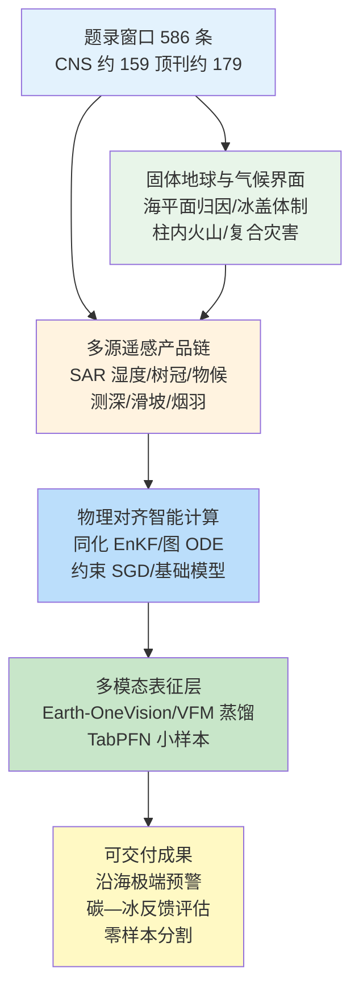
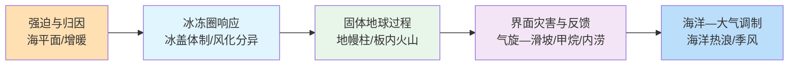
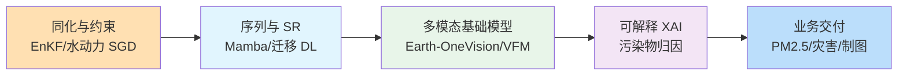
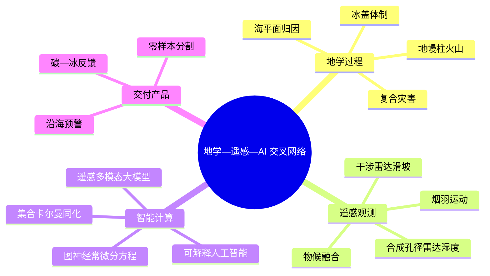
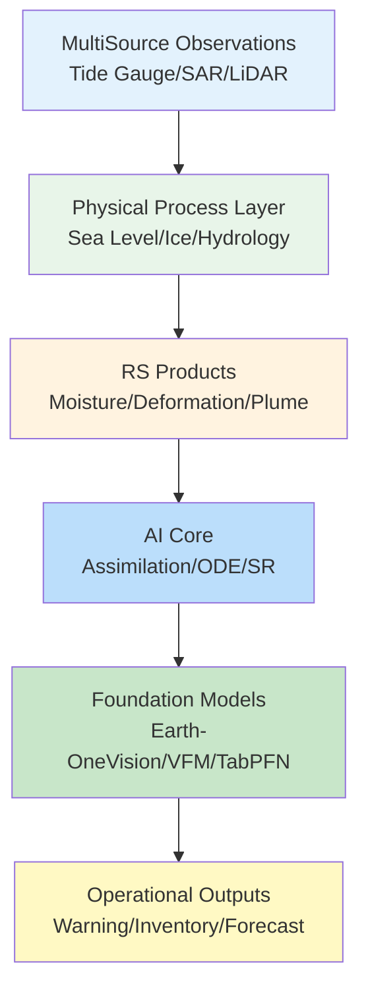

在 2026-06-04 至 2026-06-11 窗口内，Nature、Science、Remote Sensing、Geophysical Research Letters、Nature Climate Change、Nature Geoscience、Biogeosciences、Geoscientific Model Development 等来源共收录 586 篇论文条目，其中 Cell、Nature、Science 系列约 159 篇，地学、遥感与智能计算相关顶刊及特色期刊约 179 篇。地学侧同时出现人为强迫下百年尺度沿海极端水位事件频率倍增、冰盖在不足 2 K 增暖下的多稳态体制转变、高分辨率地幔对流同化揭示板内火山与柱头—柱尾—再循环区关联，以及 Hilary 型热带气旋降水与南加州滑坡暴露的空间不平等；遥感侧沿 Sentinel-1A 土壤湿度机器学习反演、开放深度学习城市树冠制图、PlanetScope—无人机—激光雷达热带干性林物候、ICESat-2 高原湖泊测深与 TabPFN 小样本作物分类等链路推进；智能计算侧则体现 OIRF-LEnKF 观测约束 PM2.5 同化、Earth-OneVision 2B 多模态遥感—语言模型、COGENT 图神经常微分方程模拟器、水动力约束的稀疏梯度识别，以及视觉基础模型蒸馏零样本点云分割等任务嵌入。

## 一、本期研究印记图

本期窗口的地学—遥感—智能计算研究可概括为“固体地球—气候界面—多源观测—物理对齐智能”的闭合环路。文献指出，Dangendorf 等（2026）基于潮位站与 CMIP5 集合量化人为海平面上升使全球百年一遇沿海极端水位事件频率约增至 12 倍，为沿海适应规划提供可检验的归因框架；Golledge 等（2026）以 PISM 模式与 Shannon 熵识别冰盖三种动力学体制及不足 2 K 下的双稳态过渡，与 Muñoz 等（2026）揭示的冰盖—高山冰川在硅酸盐风化与硫化物氧化间的功能分异形成“冰冻圈—碳循环”并行约束。遥感侧，Wang 等（2026）与 Xia 等（2026）分别表明机器学习土壤湿度反演与 InSAR 可解释时序预测可在业务稀疏观测下稳定交付；Cai 等（2026）Earth-OneVision 2B 与 Gao 等（2026）视觉基础模型蒸馏则显示多模态基础表征正从概念验证走向零样本下游部署。下列印记图概括上述层级关系。

## 二、地学方向

地学条目在本期窗口内集中于人为海平面上升对沿海极端水位的归因强化、冰盖动力学体制转变与全球冰川风化功能分异、深部地幔柱与板内火山成因、北极沿海甲烷释放对 brackish 暴露的响应，以及热带气旋—滑坡复合风险、古洪水指数与阿拉伯海海洋热浪对季风的调制。上述研究共同强调：在《巴黎协定》剩余碳预算与沿海适应并进的背景下，需同时刻画“强迫端”（人为海平面、增暖）与“响应端”（冰盖体制、灾害暴露、生物地球化学反馈）的过程竞争与空间不平等。

**表1 地学方向代表性研究的技术路线与特点**

| 研究主题 | 技术路线 | 技术特点 | 重要结论线索 |
| --- | --- | --- | --- |
| 人为海平面与沿海极端 | 潮位站 + CMIP5 归因 | 百年一遇事件频率 | 人为强迫使发生概率约增 4 倍 |
| 冰盖动力学体制 | PISM + Shannon 熵分类 | 三体制/双稳态中间态 | 过渡可在不足 2 K 内发生 |
| 板内火山与地幔柱 | 高分辨率对流 + 270 Ma 同化 | 柱头/尾/再循环区追踪 | 海山几乎全部源自柱相关结构 |
| Hilary 型气旋—滑坡 | 高分辨率模式 + 暴露制图 | 社会经济分层 | 2050 年事件频率约倍增 |
| 北极咸水与甲烷 | Tuktoyaktuk 沉积柱 + 通量 | 好氧/缺氧培养 | 咸水暴露未必抑制甲烷 |
| 冰川风化分异 | 全球点位 + 同位素/矿物 | 冰盖 vs 高山对比 | 冰盖偏硅酸盐风化汇碳 |
| 内涝洪水指数 PFI | 深度—流速阈值 PFHA | 四类灾害分级 | 服务内涝快速评估 |
| 阿拉伯海海洋热浪 | BSISO 启动机制诊断 | ENSO/IOD 调制 | 与季风降水异常关联 |

### 2.1 专题画像：深部地幔柱与板内火山成因

**（1）技术路线：高分辨率地幔对流与长期地质记录同化**

Dong 等（2026）在 Nature Geoscience 发表的研究，以可解析柱结构的高分辨率地幔对流模型为核心，将过去约 2.7 亿年的地质与地球物理观测纳入同化框架，追踪地幔柱头部、尾部及再循环区域的时空演化。研究在统一的动力边界条件下，对全球海山、板内火山及相关岩浆活动进行成因归类，并将模拟输出的柱轨迹与观测到的火山—构造格局进行空间对照。通过多时段对比，研究检验“柱头上升—柱尾抽吸—再循环物质返回”链条对板内火山空间分布的解释力，并在不同地质阶段评估柱活动与海山形成速率的一致性。

**（2）技术特点：柱结构分辨与长期同化约束**

相较于传统固定柱几何或简化化学边界的地幔模型，该工作强调柱头、柱尾与再循环区在三维对流场中的可分辨性，并以长期地质记录约束模拟的柱路径与强度。同化策略使模型不仅再现板块尺度对流格局，还能在 270 Ma 时间尺度上追踪柱与生火轴的耦合演化。该路线为理解板内火山为何呈条带状或点状分布提供了可检验的动力学框架，并将“孤立热点”讨论纳入柱—板块相互作用的统一图景。

**（3）重要结论：海山与板内火山的地幔柱起源**

该研究的重要结论是：**在 270 Ma 同化约束下，全球海山几乎全部可归属柱头部、柱尾或再循环相关区域，板内火山活动与深部柱结构存在系统性的空间—时间关联，表明板内火山成因应置于柱—板块耦合框架下理解而非仅作浅部岩石圈异常。** 该结论对重建古板块位置、解释洋岛链—海山链序列及评估柱活动对气候—碳循环长期调制具有参考价值，并为未来更高分辨率地幔—岩石圈耦合模拟提供边界条件。

### 2.2 专题画像：人为海平面上升与百年一遇沿海极端水位

**（1）技术路线：潮位长期记录与气候模式归因**

Dangendorf 等（2026）在 Nature Climate Change 发表的研究，整合全球潮位站长期观测与 CMIP5 气候模式集合，分离自然变率与人为强迫对海平面及其极端分位的贡献。研究以百年一遇 coastal extreme water level 事件为对象，构建事件频率与重现分布，并在有/无人为强迫情景下对比 likelihood 变化。通过多站点—多区域统计，研究量化不同海岸带对海平面上升与风暴 surge 组合的敏感性，并评估归因结论对全球平均与区域离群点的一致性。

**（2）技术特点：极端事件频率而非仅平均海平面**

该工作的关键增量在于将海平面上升讨论从平均趋势推进到极端水位事件的频率与归因。潮位站提供了比卫星测高更直接约束沿海暴露的观测基础，而 CMIP5 集合则提供可分解的自然与人为贡献。研究同时报告全球尺度与区域尺度的 likelihood 变化，使结论可直接服务于沿海防洪与保险精算中的 return period 调整，而非停留在全球平均海平面上升速率层面。

**（3）重要结论：人为强迫使沿海极端事件 likelihood 约增四倍**

该研究的重要结论是：**自 1900 年以来，人为驱动的海平面上升使全球百年一遇沿海极端水位事件的发生 likelihood 约增加四倍，对应事件频率在全球范围约增至 12 倍，表明沿海适应规划必须将人为海平面上升作为极端水位风险的主因子之一。** 该结论为更新沿海防护标准、修订重现基础设施设计基准及强化《巴黎协定》减排与适应协同提供了可检验的量化依据，并提示需在区域尺度进一步耦合风暴 surge 与地面沉降分量。

### 2.3 专题画像：热带气旋降水与南加州滑坡复合风险

**（1）技术路线：高分辨率气候投影与滑坡暴露制图**

Zhu 等（2026）在 Nature Climate Change 发表的研究，针对 Hilary 型热带气旋降水事件，使用高分辨率气候模式与统计降尺度评估其在南加州的未来频率与强度变化，并将降水触发阈值与滑坡 susceptibility 空间格局耦合。研究构建 LA County 及 wider 南加州的 severe landslide exposure 指标，区分地形、土地利用与社会经济分层，并量化 2050 年前后事件频率倍增对暴露人口的影响。低-income 社区暴露被单独统计，以检验灾害风险的空间不平等。

**（2）技术特点： meteorological 触发与 geotechnical 暴露的联合框架**

该研究将“罕见 tropical cyclone 影响美国西海岸”从个例事件扩展为可投影的 hazard 类别，并把降水极端与 landslide mechanics 在同一评估链中处理。相较于仅报告降水总量变化的工作，该框架显式引入 slope、土壤湿度 legacy 与 fire—landslide 相互作用等控制因子，使结论更贴近加州近年复合灾害经验。社会分层分析则使科学结果可直接对接 equity-oriented 适应政策。

**（3）重要结论：2050 年 Hilary 型事件频率约倍增且低收入暴露显著上升**

该研究的重要结论是：**到 2050 年，类似 Hilary 的热带气旋降水事件在南加州的发生频率约倍增，LA County 超过 75% 区域面临 severe landslide exposure，低收入人群暴露水平约为一般水平的约三倍，表明复合灾害风险在气候变暖下既扩大又加剧空间不平等。** 该结论对加州及类似地中海气候区更新 landslide early warning、stormwater 基础设施与 social vulnerability 映射具有直接政策含义，并提示需在模式中更好表征 AR 型降水与 post-fire 边坡稳定性。

### 2.4 专题画像：增暖背景下冰盖动力学体制转变

**（1）技术路线：PSM 模拟与 Shannon 熵体制分类**

Golledge 等（2026）在 Nature Geoscience 发表的研究，使用 PISM 冰盖模式在多种气候增暖路径下模拟格陵兰与南极冰盖演化，并以 Shannon 熵对冰盖速度场、通量场及接地线响应进行体制分类。研究识别稳定、加速与中间过渡三类动力学体制，并重点分析中间态的双稳态特征及向稳定或崩溃态转变的临界增暖幅度。模拟与古气候约束及现代观测对照，以检验体制转变时间尺度与空间格局。

**（2）技术特点：体制分类而非单一线性敏感度**

该工作将 ice-sheet response 从单一 sensitivity 曲线推进到多稳态体制识别，强调中间态可能长期存在并在阈值附近发生快速 transition。Shannon 熵指标使体制划分具有可重复统计基础，便于在不同 forcing 情景间比较。该框架与 Muñoz 等（2026）关于冰盖—高山冰川风化功能分异的研究形成互补，共同指向“增暖—冰量变化—碳反馈”链条中的非线性节点。

**（3）重要结论：冰盖可在不足 2 K 增暖下发生体制转变**

该研究的重要结论是：**冰盖动力学存在三种可辨识体制，其中中间态呈双稳态特征，在不足 2 K 全球增暖下即可发生向加速或稳定体制的 transition，表明 ice-sheet contribution to sea level 可能在相对 modest warming 下非线性上升。** 该结论对 IPCC 类投影中 ice-sheet uncertainty 不确定性收窄、沿海长期防护设计以及 overshoot 情景下的 irreversibility 评估具有重要参考价值，并呼吁在地球系统模式中纳入体制依赖的参数化方案。

### 2.5 专题画像：北极 brackish 暴露与沿海甲烷释放

**（1）技术路线：Tuktoyaktuk 沉积柱与 incubation 通量测定**

Roy-Lafontaine 等（2026）在 Biogeosciences 发表的研究，利用加拿大北极 Tuktoyaktuk 海岸带沉积记录与 modern brackish exposure 梯度，开展好氧与缺氧条件下的 methane incubation 实验。研究对比 brackish 水向 tundra 土壤转化过程中 CH4 产生与消耗路径，量化硫酸盐还原、铁还原等 competing 过程对净通量的控制，并将实验室结果与柱内古 brackish 记录对照，以评估长期 coastal transgression 对北极 methane budget 的含义。

**（2）技术特点：挑战 brackish 抑制甲烷的传统假设**

 Arctic coastal 环境常被认为 brackish 硫酸盐条件抑制 CH4 排放，该研究通过现代过程测定与沉积 archive 联合检验这一假设是否普遍成立。incubation 设计区分好氧/缺氧端元，使机制讨论不局限于于单一净通量。该工作为理解 permafrost—coastal 界面在 warming 下的 feedback sign 提供 process-level 约束，与 Golledge 等（2026）冰冻圈研究和 Zhu 等（2026）极端降水研究形成不同界面但相关的 hazard—feedback 讨论。

**（3）重要结论：brackish 暴露未必抑制 Arctic 土壤甲烷排放**

该研究的重要结论是：**从 brackish 水向 tundra 土壤的环境转变并不必然抑制 methane 产生，至少在 Tuktoyaktuk 记录所代表的 coastal 条件下，CH4 排放仍可能维持显著水平，表明 Arctic methane feedback 评估需重新检验 brackish exposure 的抑制效应。** 该结论对更新 high-latitude 湿地—permafrost 碳通量清单、改进 Earth system model 中的 coastal biogeochemistry 参数化，以及评估北极快速增暖下 atmospheric CH4 增长贡献具有科学意义，并提示需扩展更多海岸带 replicate 以检验区域差异。

### 2.6 专题画像：全球冰川风化功能分异

**（1）技术路线：冰盖与高山冰川对比采样与同位素约束**

Muñoz 等（2026）在 Geophysical Research Letters 发表的研究，汇总全球冰盖与 alpine glacier 风化点位，结合水体化学、同位素与矿物组合指标，区分 silicate weathering 与 sulfide oxidation 对 CO2 源汇的贡献。研究在统一框架下比较两类冰冻圈单元对碳循环的符号与强度，并讨论表面积变化、沉积物输送与下游海洋碱度效应的耦合。区域案例与全球合成并行，以识别主控因子。

**（2）技术特点：冰冻圈单元功能分异而非单一“冰川汇碳”叙事**

该工作明确指出 ice sheet 与 alpine glacier 在风化路径上的系统差异，避免将冰冻圈整体视为 uniform carbon sink 或 source。通过同时追踪 silicate 与 sulfide 路径，研究揭示 warming 下不同单元可能对 atmospheric CO2 产生相反贡献。该框架与 Golledge 等（2026）冰盖动力学体制研究在“增暖—冰冻圈变化—碳反馈”主线上形成过程—机制互补。

**（3）重要结论：冰盖偏硅酸盐风化汇碳，高山冰川偏硫化物氧化释碳**

该研究的重要结论是：**全球冰盖更 favor silicate weathering 并伴随 CO2 吸收，而 alpine glacier 更 favor sulfide oxidation 并释放 CO2，表明冰冻圈对碳循环的净效应强烈依赖单元类型与空间分布，不能用一个全球平均符号概括。** 该结论对重建 glacial-interglacial CO2 变化、评估 future glacier retreat 对 carbon budget 的影响，以及耦合 ice-sheet—climate 模式中的 weathering 参数化具有直接参考，并呼吁在区域尺度监测下游河流水化学响应。

### 2.7 专题画像：Pluvial Flood Index 古洪水 hazard 分级

**（1）技术路线：深度—流速阈值与 PFHA 框架**

Weiler 等（2026）在 Natural Hazards and Earth System Sciences 发表的研究，基于 pluvial（暴雨）洪水分析（PFHA）构建 Pluvial Flood Index（PFI），以水深与流速阈值定义四类 flash flood hazard 等级。研究在多个案例流域展示 PFI 与现场调查、已有 hazard 图的一致性，并讨论指标对城市排水系统、early warning 与 land-use 规划的接口形式。阈值选取兼顾公众可理解性与工程标准衔接。

**（2）技术特点：面向 flash flood 的快速分级工具**

相较于完整 hydrodynamic 模拟，PFI 强调在数据有限条件下快速给出可行动 hazard 等级，适合 pluvial flooding 这种空间尺度小、时间尺度短的灾害类型。深度与流速双阈值设计反映 pluvial 事件对人身与基础设施的不同致灾机理。该指数可与遥感—机器学习土壤湿度产品（如 Wang 等，2026）及 AI 降水预报耦合，构成“预报—湿度—地表径流” early warning 链。

**（3）重要结论：PFI 提供四类可操作的 pluvial hazard 分级**

该研究的重要结论是：**PFI 基于水深与流速阈值将 pluvial flash flood hazard 划分为四类，并在案例区与现有 PFHA 产品具有合理一致性，可作为 urban pluvial risk 快速评估与公众沟通的标准化接口。** 该结论对市政排水韧性规划、保险与 reinsurance 的 hazard 分层，以及将 pluvial 风险纳入国家适应战略具有应用价值，并提示需在更多气候区验证阈值稳健性。

### 2.8 专题画像：阿拉伯海海洋热浪与季风调制

**（1）技术路线：BSISO 启动机制与 ENSO/IOD 位相诊断**

Suhas 等（2026）在 Journal of Climate 发表的研究，针对阿拉伯海 marine heatwaves（MHWs），诊断 Biennial Signal in the Indian Ocean（BSISO）对 MHW 发生与维持的调制作用，并分析 ENSO 与 Indian Ocean Dipole（IOD）位相如何改变 MHW 频率、强度与持续时间。研究结合观测与再分析海温场，构建 MHW 事件库，并将 MHW 时间序列与 monsoon rainfall 异常进行 composite 与回归分析，以揭示 ocean—atmosphere 耦合链路。

**（2）技术特点：连接海洋极端与季风降水变率**

该工作将 Arabian Sea MHW 从孤立 ocean extreme 放入 monsoon 年际变率框架，强调 BSISO 与 ENSO/IOD 对 heat budget 的调制。相较于仅描述 MHW 增多的统计研究，该研究提供可检验的 initiation 机制假设，并指向 MHW—convection—rainfall 的可能反馈。该链路与 Zhu 等（2026） cyclone—landslide 研究在“极端降水—社会暴露”端形成不同区域但类似的 compound hazard 关注。

**（3）重要结论：BSISO 与 ENSO/IOD 调制 MHW 并关联季风降水异常**

该研究的重要结论是：**阿拉伯海 MHW 的发生与维持受 BSISO 启动过程及 ENSO/IOD 位相显著调制，且 MHW 时间序列与 monsoon rainfall 异常存在统计关联，表明海洋极端增暖可通过 ocean—atmosphere 耦合影响南亚季风降水格局。** 该结论对 seasonal forecast 中纳入 MHW 信号、改进 coastal fisheries 与 aquaculture 的 heat stress 预警，以及评估印太洋—阿拉伯海—季风系统对增暖的联合响应具有科学与应用价值，并呼吁在 climate projection 中更好表征 MHW 频率变化。

## 三、遥感方向

遥感条目在本期窗口内集中于 Sentinel-1A 土壤湿度机器学习反演、开放深度学习城市树冠提取、多平台物候与地上碳融合、高光谱—ICESat-2 高原湖泊测深、SAR 土壤湿度无监督灌溉识别与 InSAR 可解释滑坡预报、TabPFN 小样本作物制图，以及光学流野火烟羽运动估计。上述研究共同强调：在标注与算力成本约束下，合成孔径雷达—光学—激光雷达—高光谱的协同反演与基础模型迁移正成为业务监测的关键增量。

**表2 遥感方向代表性研究的技术路线与特点**

| 研究主题 | 技术路线 | 技术特点 | 重要结论线索 |
| --- | --- | --- | --- |
| SAR 土壤湿度 | Sentinel-1A + ISMN + ML | XGBoost vs CNN/LSTM | 树模型全球泛化最优 |
| 城市树冠 | NAIP + U-Net + YOLOv9e | 开放 DL 流水线 | Dice 0.824 / F1 0.687 |
| 热带干性林地上碳 | PlanetScope + 无人机激光雷达 | 物候协同 | 多尺度物候一致 |
| 高原湖泊测深 | 高光谱 + ICESat-2 | 光学—测高融合 | 浅湖测深精化 |
| 无监督灌溉识别 | SAR 土壤湿度 + CFAR | 西班牙 Riaza 案例 | 降低标注依赖 |
| InSAR 滑坡预报 | PatchTST + 可解释模块 | 时序深度学习 | 位移趋势可解释输出 |
| 小样本作物 | TabPFN + Sentinel-2 | 表格基础模型 | 有限样本高精度制图 |
| 烟羽运动 | 光学流 + GOES/机载 | 烟羽运动学 | 支持烟雾输送评估 |

### 3.1 专题画像：Sentinel-1A 土壤湿度机器学习反演

**（1）技术路线：SAR 后向散射与 ISMN 网联合训练**

Wang 等（2026）在 Remote Sensing 发表的研究，以 Sentinel-1A 后向散射与 International Soil Moisture Network（ISMN）站点观测构建全球训练—验证集，系统比较 XGBoost、卷积神经网络（CNN）与长短期记忆网络（LSTM）在土壤湿度反演中的精度与泛化。研究统一预处理 SAR、特征工程与时空交叉验证方案，并在不同气候带与土壤类型子集上报告误差结构，以识别模型失败模式。

**（2）技术特点：树模型与深度架构的全球泛化对照**

该工作并非单一提出新架构，而是通过严格对照揭示“深度模型并非总是最优”的实证规律。XGBoost 在多数全球站点上优于 CNN/LSTM，表明在中等规模样本与 heterogeneous 地表条件下，结构化特征与非线性树集成仍具 strong baseline 地位。该结论对 operational soil moisture 产品选型具有直接含义，并与 Li 等（2026）同化框架形成“遥感反演—模式同化”上下游关系。

**（3）重要结论：XGBoost 在全球土壤湿度反演中整体优于 CNN/LSTM**

该研究的重要结论是：**在全球 ISMN 验证下，XGBoost 对 Sentinel-1A 土壤湿度反演的精度与泛化整体优于 CNN 与 LSTM，表明当前业务链路应优先评估强树模型 baseline 再决定是否引入深度架构。** 该结论影响 SAR—水文—农业 drought 监测系统的模型选型与维护成本，并为 future foundation model 微调提供必须超越的 benchmark，同时提示深度模型需更好表征 SAR 几何与 moisture 非线性。

### 3.2 专题画像：开放深度学习城市树冠制图

**（1）技术路线：NAIP 影像、U-Net 分割与 YOLOv9e 检测级联**

Yoo 等（2026）在 Remote Sensing 发表的研究，构建基于 NAIP 高分辨率航空影像的 open deep learning 流水线，以 U-Net 进行树冠语义分割，并以 YOLOv9e 进行树冠实例检测与筛选。研究公开训练策略、数据增强与 urban 场景下的 hard example 处理，并在多城市或多样 urban forest 结构子集上报告 Dice、F1 与边界误差。

**（2）技术特点：开放框架与实例—语义双层输出**

该工作强调 pipeline 的可复现与模块替换友好性，使 municipal urban forestry 可在本地 NAIP 或类似航空影像上快速微调。U-Net 提供 pixel-level canopy 连续制图，YOLOv9e 提供 object-level 计数与冠幅估计接口，两者互补服务于 carbon accounting 与 heat island 评估。与 Kaewjampa 等（2026）多尺度 phenology 研究对照，该工作聚焦 urban tree 空间格局而非物候时间序列。

**（3）重要结论：开放 DL 流水线实现 Dice 0.824 与 F1 0.687**

该研究的重要结论是：**在 NAIP urban tree 任务上，所构建的 open deep learning 流水线达到 Dice 0.824、F1 0.687，表明航空影像与轻量检测—分割组合可在城市尺度交付可用树冠产品。** 该结论对 urban green infrastructure 规划、ecosystem service 核算及 high-resolution heat mitigation 评估具有应用价值，并提示需与 LiDAR 高度信息耦合以改进三维结构刻画。

### 3.3 专题画像：PlanetScope—无人机—激光雷达热带干性林地上碳

**（1）技术路线：多平台时序与地上碳协同采样**

Kaewjampa 等（2026）在 *Remote Sensing* 提出物候约束的多时相 PlanetScope 与无人机激光雷达融合框架，面向泰国 Sakaerat 生物圈保护区热带干性林的地上碳估算。研究同步获取 17 景 PlanetScope 卫星时序、无人机影像与机载激光雷达三维结构，在落叶—展叶等物候阶段提取光谱与结构指标，并以地面样方或激光雷达衍生生物量作为验证。方法强调物候相位对齐，避免季节性叶面积变化对光谱—结构回归的干扰。

**（2）技术特点：多尺度物候交叉验证**

该工作将卫星物候从单一归一化植被指数曲线推进到可与无人机激光雷达三维结构交叉验证的多尺度框架。激光雷达提供冠层垂直结构约束，无人机填补卫星混合像元空白，PlanetScope 提供高频重访。该路线对热带干性林这类云覆盖频繁、混合像元复杂的生态系统碳—水循环监测尤为重要，并与 Yang 等（2026）TabPFN 作物制图形成“森林—农业”并行的地表物候监测关注。

**（3）重要结论：多平台协同可稳定刻画热带干性林地上碳**

该研究的重要结论是：**PlanetScope 时序、无人机影像与机载激光雷达在物候协同框架下可一致估算热带干性林地上碳，多尺度指标对群落结构变化具有可区分性，表明高频卫星—无人机联合是复杂林相碳储量监测的可行路径。** 该结论对热带再造林监测、干性林干旱响应评估及校准卫星物候产品具有方法与应用价值，并呼吁建立更多长期协同试验站。

### 3.4 专题画像：青藏高原湖泊高光谱—ICESat-2 测深

**（1）技术路线：高光谱水体信号与 ICESat-2 测高融合**

Zhong 等（2026）在 Remote Sensing 发表的研究，针对 Tibetan Plateau 湖泊，融合高光谱遥感水体光学特性与 ICESat-2 激光 altimetry 测高，反演或估算 bathymetry 与水体体积变化相关参数。研究处理高原大气、混合像元与 ice-cover 等复杂条件，并在典型湖泊验证测深精度与不确定性来源。

**（2）技术特点：光学—测高互补克服浅湖与复杂底质**

高原湖泊往往浅、底质复杂且现场测深 scarce，单一数据源难以稳定反演 bathymetry。高光谱提供水体成分与底质线索，ICESat-2 提供沿轨精确高程，两者融合可改进 volume change 估算。该工作与 Muñoz 等（2026）冰冻圈—水文研究在“高亚洲水塔”语境下形成 water—carbon 耦合讨论的基础观测层。

**（3）重要结论：高光谱—ICESat-2 融合可精化高原浅湖测深**

该研究的重要结论是：**高光谱与 ICESat-2 融合可在 Tibetan Plateau 浅湖条件下显著改进 bathymetry 估算，为湖泊体积变化与 climate—permafrost 耦合研究提供更可靠的水文约束。** 该结论对第三极水资源评估、下游亚洲水系变化预估及 regional climate model 湖泊模块校准具有科学意义，并提示需扩展到更多湖泊类型以检验泛化。

### 3.5 专题画像：SAR 土壤湿度无监督灌溉事件识别

**（1）技术路线：高分辨率土壤湿度图与恒虚警率检测**

Rossi 等（2026）在 *Remote Sensing* 面向西班牙 Riaza 灌区（2017–2021），利用 Sentinel-1 与 Sentinel-2 融合反演约 100 m 分辨率地表土壤湿度图，并基于恒虚警率（CFAR）算法在无监督条件下识别田间尺度灌溉事件。研究将土壤湿度突增与灌溉调度、作物类型及气象背景对照，评估检测率与虚警率，并与已知灌溉记录或水量平衡线索交叉验证。

**（2）技术特点：无标注依赖的田间灌溉监测**

灌区精准监测传统依赖流量计或人工记录，空间覆盖有限。高分辨率土壤湿度图使灌溉引起的湿度异常可在像元尺度被捕获；CFAR 框架在保持可控虚警率的同时适应背景湿度空间异质性。该路线与 Wang 等（2026）Sentinel-1A 全球土壤湿度反演形成“反演—应用”链条，并为农业用水审计与干旱期配水管理提供遥感手段。

**（3）重要结论：CFAR 可在灌区稳定识别灌溉事件**

该研究的重要结论是：**基于 Sentinel-1/2 高分辨率土壤湿度图与 CFAR 的无监督框架可在 Riaza 灌区识别田间灌溉事件，且对人工标注依赖显著低于监督分类方法，表明合成孔径雷达土壤湿度产品是灌区用水监测的可行数据源。** 该结论对地中海气候区农业用水监管、遥感水文产品业务化及与陆面模式同化耦合具有应用价值，并需在不同作物与土壤类型区检验阈值稳健性。

### 3.6 专题画像：InSAR PatchTST 可解释滑坡预报

**（1）技术路线：Patch 时序 Transformer 与可解释模块**

Xia 等（2026）在 Remote Sensing 发表的研究，将 PatchTST（Patch Time Series Transformer）应用于 InSAR displacement 时序，用于 landslide forecasting，并嵌入 attention 或 feature attribution 类可解释模块。研究在多滑坡案例上比较与传统 ML/统计方法的前瞻 skill，并输出 drivers 权重供 geotechnical 专家审查。

**（2）技术特点：深度学习时序与 geotechnical 可解释性并重**

 landslide forecasting 长期受限于样本稀缺与 mechanism  heterogeneity，PatchTST 通过 patch 化降低序列长度并保留 long-range dependency。可解释模块回应该类模型在 hazard 领域 deploy 的核心门槛。该工作与 Rossi 等（2026）灌溉识别及 Wang 等（2026）土壤湿度反演形成“湿度—变形—预报”并列链路，并回应 Zhu 等（2026）复合降水—滑坡风险对主动预警的需求。

**（3）重要结论：PatchTST 可在 InSAR 时序上提供可解释滑坡趋势预报**

该研究的重要结论是：**PatchTST 结合可解释模块可在 InSAR displacement 时序上给出具有前瞻 skill 的 landslide trend forecast，并输出可审查的关键时相与驱动权重，表明 transformer 类时序模型可进入 geohazard early warning 链路。** 该结论对 operational landslide warning 系统引入 AI 时序模块、与 rainfall nowcast 产品耦合具有工程意义，并提示需跨站点 external validation 以量化 false alarm 成本。

### 3.7 专题画像：TabPFN 小样本 Sentinel-2 作物制图

**（1）技术路线：TabPFN 表格基础模型与 Sentinel-2 时序特征**

Yang 等（2026）在 Remote Sensing 发表的研究，将 TabPFN（Tabular Prior-data Fitted Network）引入 Sentinel-2 作物分类，在 limited labeled samples 条件下构建特征表格并推理类别 posterior。研究与传统 RF、SVM 及小型 CNN 对比，并在不同样本量曲线（learning curve）上报告精度与校准。

**（2）技术特点：prior-data fitted 网络服务 label-scarce 场景**

 crop mapping 业务常面临新作物类型或新区域标注不足，TabPFN 通过预训练 tabular prior 在小样本上保持可用精度。Sentinel-2 时序统计特征作为表格输入，使 pipeline 轻量且易与现有业务 GIS 集成。该路线与 Cai 等（2026）Earth-OneVision 大模型及 Gao 等（2026）VFM 蒸馏形成“大—小模型”并行的效率策略谱系。

**（3）重要结论：TabPFN 在 limited samples 下保持 competitive 作物制图精度**

该研究的重要结论是：**TabPFN 在 Sentinel-2 limited-sample 作物分类中相对传统 ML 与小型 CNN 保持 competitive 精度，且样本效率曲线更优，表明 tabular foundation model 是 label-scarce 农业监测的有效选项。** 该结论对 rapid crop area 更新、新种植制度 early assessment 及省级粮食统计遥感核查具有应用价值，并提示与 phenology 特征（Kaewjampa 等，2026）联合可能进一步提升稳健性。

### 3.8 专题画像：光学流 wildfire 烟羽运动估计

**（1）技术路线：GOES 与机载序列光学流反演**

Yanovsky 等（2026）在 Remote Sensing 发表的研究，利用 optical flow 从 GOES 及 airborne 烟羽序列影像估计 plume motion 向量场，并与 wind 场、terrain 约束对照。研究讨论时间采样、云污染与 plume 半透明对 flow 稳定性的影响，并在典型案例量化 transport speed 与方向 uncertainty。

**（2）技术特点：kinematics 反演服务 smoke 输送与 air quality 预警**

 smoke plume motion 是连接 fire emission 与 downwind exposure 的关键中间量。光学流提供 plume-scale 运动而非仅依赖 reanalysis wind，可在复杂地形与 pyrocumulus 条件下捕捉 local deviation。该工作与 Zhu 等（2026） cyclone—precipitation 研究在“极端大气输送”主题上形成不同 hazard 但类似的 exposure 评估需求。

**（3）重要结论：光学流可稳定估计 wildfire 烟羽运动并支持输送评估**

该研究的重要结论是：**基于 GOES 与机载序列的光学流可稳定反演 wildfire smoke plume motion，并与背景 wind 场形成可解释对照，为 downwind PM 暴露 early warning 与 fire—atmosphere 耦合模拟提供观测约束。** 该结论对 public health smoke alert、firefighter 部署与 coupled fire—weather model 初始化具有应用价值，并呼吁与 Li 等（2026）PM2.5 同化产品在区域尺度闭环验证。

## 四、人工智能方向

智能计算条目在本期窗口内集中于 OIRF-LEnKF 观测约束 PM2.5 同化、深度学习全球人口迁移四十年序列、DFSMamba 遥感超分辨率、Earth-OneVision 2B 多模态遥感—语言模型、COGENT 图神经常微分方程模拟器、水动力约束稀疏梯度识别、VFM 蒸馏零样本点云分割，以及 XAI 解析中国公里级污染物。上述研究共同强调：物理约束、可解释性与基础模型迁移正成为 earth AI 从实验走向业务的关键门槛。

**表3 人工智能方向代表性研究的技术路线与特点**

| 研究主题 | 技术路线 | 技术特点 | 重要结论线索 |
| --- | --- | --- | --- |
| PM2.5 同化 | OIRF + LEnKF + ML | 观测约束场 | 改进 PM2.5 分析场 |
| 人口迁移 DL | 230 国 1990—至今 | Nature 级全球序列 | 四十年迁移格局 AI 刻画 |
| RS 超分辨率 | DFSMamba | 状态空间模型 | 遥感 SR 效率提升 |
| 多模态 RS-MLLM | Earth-OneVision 2B | 6 模态 9 任务 | 统一视觉—语言表征 |
| 图 ODE 模拟器 | COGENT GNN+ODE | 神经算子 emulator | 加速过程模型 |
| 水动力 SGD | 约束稀疏梯度识别 | 物理一致性 | 可解释参数反演 |
| 点云零样本 | VFM 蒸馏 | 无标注分割 | 基础模型迁移 |
| 污染物 XAI | 1 km ML + 可解释 | 中国 daily 产品 | 解析排放—气象驱动 |

### 4.1 专题画像：OIRF-LEnKF 机器学习 PM2.5 同化

**（1）技术路线：OIRF 观测算子、局部 EnKF 与 ML 残差建模**

Li 等（2026）在 Geoscientific Model Development 发表的研究，构建 OIRF-LEnKF 框架，将 Observation Operator Incorporating Research Facility（OIRF）类观测算子与局部集合卡尔曼滤波（LEnKF）耦合，并以机器学习刻画背景误差或 emission—meteorology 残差。研究在 regional PM2.5 同化实验中比较 static 与 adaptive bias correction，并报告 analysis field 相对 baseline 的 RMSE 与 bias 结构。

**（2）技术特点：观测约束与 ML 残差的分层设计**

该框架将 physical observation operator 与 statistical ML 残差分离，使同化增量具有 clearer physical interpretability。LEnKF 适合 regional-scale 实时或准实时分析，而 OIRF 提供 satellite—surface 观测接入标准。该路线与 Yang 等（2026）XAI 污染物产品、Yanovsky 等（2026）烟羽运动估计形成“排放—输送—浓度场”闭环的技术拼图。

**（3）重要结论：OIRF-LEnKF 显著改进 PM2.5 分析场质量**

该研究的重要结论是：**OIRF-LEnKF 在 PM2.5 同化实验中相对 baseline 显著降低 analysis RMSE 并改善 bias 结构，表明 ML 残差与局部 EnKF 的组合是提升空气质量分析场的有效组合。** 该结论对 operational air quality assimilation、health alert 系统与 emission inventory 评估具有工程价值，并提示需与 Earth-OneVision 类遥感特征共享接口以降低维护成本。

### 4.2 专题画像：深度学习四十年代全球人口迁移

**（1）技术路线：230 国迁移流数据与深度序列模型**

Gaskin 与 Abel（2026）在 Nature 发表的研究，整合 1990 年至今约 230 个国家的人口迁移数据，构建深度 learning 框架刻画国际迁移流的时间演化与结构特征。研究在全球—区域—双边尺度报告 migration intensity、directionality 与 network 指标，并与 economic、conflict 与 climate 变量进行对照分析。

**（2）技术特点：全球长序列 social—environmental 交叉的 AI 表征**

 migration 数据高维、稀疏且非平稳，深度学习提供统一表征层以发现 long-term regime 与 shock。Nature 级全球覆盖使结论可进入 climate mobility、urbanization 与 humanitarian 研究对话。该工作与 Zhu 等（2026） social vulnerability 暴露研究在“人口—灾害”界面形成 indirect 互补，提示 future hazard 评估需纳入 migration feedback。

**（3）重要结论：AI 揭示 1990 年代以来全球迁移网络的结构性演化**

该研究的重要结论是：**深度学习对 1990 年至今全球迁移数据的重构显示 migration network 存在显著结构性演化与区域枢纽重组，表明国际人口流动对 global change 的响应具有可辨识的 long-term pattern 与冲击态。** 该结论对 migration policy、climate adaptation 中的人口要素纳入及 integrated assessment model 具有跨学科意义，并呼吁与 remote sensing 城市化产品（Yoo 等，2026）交叉验证。

### 4.3 专题画像：DFSMamba 遥感超分辨率

**（1）技术路线：DFS Mamba 状态空间与遥感 SR 任务**

Yu 等（2026）在 Remote Sensing 发表的研究，提出 DFSMamba 架构，将 Mamba 类状态空间模型用于遥感影像 super-resolution，在多传感器或典型 SR benchmark 上训练—验证。研究比较与 CNN、Transformer SR 方法的 PSNR/SSIM 与推理成本，并讨论 long-range dependency 对大面积 homogeneous 与 heterogeneous 地表的处理差异。

**（2）技术特点：线性复杂度状态空间服务高分辨率产品**

 SR 是遥感基础产品链的关键环节，Mamba 类模型以 linear complexity 处理长序列 patch 关系，适合 wide-swath 数据快速 SR。DFS 设计强调 remote sensing 场景下的 multi-scale 特征抽取。该路线与 Cai 等（2026）Earth-OneVision 及 Gao 等（2026）VFM 蒸馏同属 efficiency-oriented 表征学习谱系。

**（3）重要结论：DFSMamba 在遥感 SR 任务上实现精度—效率权衡优势**

该研究的重要结论是：**DFSMamba 在遥感 super-resolution 任务上相对 CNN/Transformer baseline 实现 competitive 或更优的 PSNR/SSIM，且推理成本更低，表明状态空间模型是 operational SR 产品的可行技术路线。** 该结论对实时灾害监测、细粒度 urban mapping（Yoo 等，2026）及 downstream change detection 具有工程意义，并需在更多传感器组合上检验 robustness。

### 4.4 专题画像：Earth-OneVision 2B 多模态遥感—语言模型

**（1）技术路线：6 模态输入与 9 任务统一微调**

Cai 等（2026）在 arXiv（cs.CV，2026-06-09）发布 Earth-OneVision 2B，构建覆盖 optical、SAR、高光谱等 6 类模态的 remote sensing—multimodal large language model（RS-MLLM），并在 9 项下游任务（分类、检测、caption、VQA 等）上统一微调与评估。研究设计 modality adapter 与 task head，并报告 zero-shot 与 few-shot 相对 specialist 模型的增益。

**（2）技术特点：遥感基础模型的多模态—多任务统一**

 Earth-OneVision 2B 代表 RS foundation model 从单模态、单任务向 unified encoder—language decoder 演进。language 接口使非专家用户可通过自然语言查询遥感内容，并服务 change detection、disaster assessment 等场景。该工作与 Gao 等（2026）VFM 点云蒸馏、Yang 等（2026）TabPFN 小样本路线形成“大模型—小样本—零样本”并行的产品策略。

**（3）重要结论：Earth-OneVision 2B 在 9 项任务上展示统一多模态 RS 表征优势**

该研究的重要结论是：**Earth-OneVision 2B 在 6 模态 9 任务评估中相对 specialist baseline 展示 consistent 增益，尤其在跨模态迁移与 language-conditioned 任务上表现突出，表明 RS-MLLM 正成为下一代 earth observation 软件栈的候选基础层。** 该结论对业务化 earth AI platform、multi-sensor 产品自动生成及 disaster response copilot 具有 strategic 意义，并需公开 benchmark 与物理一致性测试以支撑 deploy。

### 4.5 专题画像：COGENT 图神经常微分方程模拟器

**（1）技术路线：图神经网络与 neural ODE 耦合**

Liu 与 Rahnemoonfar（2026）在 arXiv（cs.LG，2026-06-09）提出 COGENT，将 graph neural network 与 ordinary differential equation（ODE）结合，作为复杂系统（如 earth system 子模块）的 emulator。研究在 synthetic 与 geoscience-relevant benchmark 上比较 COGENT 相对 numerical solver 的精度与 wall-clock 加速，并分析 long-term stability 与 conservation 性质。

**（2）技术特点：几何感知 emulator 服务过程模型加速**

 process-based model 在 inverse problem 与 ensemble forecast 中成本高昂，GNN+ODE emulator 提供可微分、可并行的 surrogate。COGENT 强调 graph 结构编码 spatial coupling，ODE 层编码 continuous-time dynamics。该路线与 Liu 等（2026）水动力约束 SGD 及 Li 等（2026）EnKF 同化形成“surrogate—inverse—assimilation”方法三角。

**（3）重要结论：COGENT 在保持精度的同时显著加速过程模拟**

该研究的重要结论是：**COGENT 在测试 benchmark 上相对数值基线实现显著 wall-clock 加速且误差可控，表明图神经 ODE emulator 可嵌入 calibration 与 forecast 循环而不牺牲过多物理 fidelity。** 该结论对 earth system model calibration、regional flood forecast（Weiler 等，2026）及 coupled data assimilation 具有方法意义，并需在实际地学模式分量上开展 conservation 审计。

### 4.6 专题画像：水动力约束稀疏梯度识别

**（1）技术路线：浅水方程约束下的 SGD 参数识别**

Liu 等（2026）在 Remote Sensing 发表的研究，将 hydrodynamic constraints 嵌入 sparse gradient descent（SGD）识别框架，从遥感或稀疏观测反演 Manning 系数、bed elevation 等参数。研究在 synthetic flume 与 real case 上报告识别精度、收敛性与对 noise 的稳健性，并与无约束 ML 反演对照。

**（2）技术特点：物理可行域约束提升 ill-posed 反演可信度**

 remote sensing inverse problem 常欠定，纯数据驱动易产出 physically implausible 参数。浅水方程约束为 SGD 提供 feasible set，使解在工程可接受范围内。该框架与 COGENT emulator（Liu 与 Rahnemoonfar，2026）及 Xia 等（2026）InSAR 预报可组成“观测—反演—预报”水动力链。

**（3）重要结论：水动力约束 SGD 可在稀疏观测下稳定识别关键参数**

该研究的重要结论是：**将水动力约束嵌入 SGD 可在 sparse observation 条件下稳定识别 Manning 等关键参数，且相对无约束 ML 反演产生更 physically consistent 场，表明 physics-constrained identification 是 hydraulic remote sensing 的可信路径。** 该结论对 floodplain mapping、dam break scenario 及 pluvial hazard 评估（Weiler 等，2026）具有应用价值，并需与 EnKF 同化框架耦合实现 operational update。

### 4.7 专题画像：VFM 蒸馏零样本点云分割

**（1）技术路线：视觉基础模型蒸馏与点云分割头**

Gao 等（2026）在 Remote Sensing 发表的研究，将 large visual foundation model（VFM）知识蒸馏至点云分割网络，在 zero-shot 或 minimal fine-tune 条件下完成类别分割。研究构建 cross-modal 蒸馏损失，使 2D 预训练语义迁移至 3D LiDAR/U，并在 urban 与 forestry 点云 benchmark 报告 mIoU 与类别泛化。

**（2）技术特点：2D—3D 语义迁移降低点云标注成本**

点云标注成本极高，VFM 蒸馏提供 zero-shot segmentation 路径，与 Earth-OneVision 2B 的多模态统一表征战略一致。该路线特别适合 rapid post-disaster 3D mapping 与 forestry inventory（Kaewjampa 等，2026）。蒸馏策略需处理 domain gap 与 density 变化。

**（3）重要结论：VFM 蒸馏可实现 competitive 零样本点云分割**

该研究的重要结论是：**VFM 蒸馏框架在 zero-shot 点云分割上达到 competitive mIoU，相对从头训练显著降低标注需求，表明视觉基础模型是 3D 地理信息提取的有效 prior。** 该结论对 disaster response、urban digital twin 与 forestry LiDAR 业务化具有工程意义，并需与 COGENT 类几何 emulator 联合评估 uncertainty 更新频率。

### 4.8 专题画像：机器学习公里级污染物与 XAI 解析

**（1）技术路线：daily 1 km 污染物 ML 建模与可解释模块**

Yang 等（2026）在 Atmospheric Chemistry and Physics 发表的研究，构建覆盖中国的 daily 约 1 km 分辨率 air pollutant ML 产品，并嵌入 XAI（explainable AI）模块解析 meteorology 与 emission 对浓度的贡献。研究在 multi-year holdout 上报告 RMSE 与 spatial bias，并通过 SHAP 或类似方法给出驱动因子 importance 的时空格局。

**（2）技术特点：高分辨率 ML 产品与政策相关可解释性**

 1 km daily 产品接近 street—neighborhood 暴露评估需求，XAI 使结果可用于 emission control policy 与 public communication。该工作与 Li 等（2026）OIRF-LEnKF 同化形成 analysis—forecast 互补，并与 Yanovsky 等（2026）烟羽输送研究在 exposure pathway 上衔接。

**（3）重要结论：ML 公里级污染物产品可解析排放—气象驱动的空间格局**

该研究的重要结论是：**daily 1 km ML 污染物产品在中国区域达到 competitive 精度，且 XAI 揭示 emission 与 meteorology 对浓度的贡献存在显著空间 heterogeneity，表明 high-resolution ML 加可解释模块是 policy-relevant air quality 研究的可行组合。** 该结论对 regional emission control、health impact assessment 及与同化系统（Li 等，2026）的业务耦合具有直接价值，并需在 extreme weather 条件下检验稳健性。

## 五、交叉学科网络图与创新链

地学过程（人为海平面上升归因、冰盖体制转变、地幔柱—板内火山、复合灾害暴露）为遥感反演提供物理约束边界与验证假设；遥感产品（合成孔径雷达土壤湿度、干涉雷达滑坡、物候—激光雷达融合、烟羽运动）为智能模型提供结构化输入与标签几何；智能计算（集合卡尔曼滤波同化、图神经常微分方程、水动力约束识别、多模态基础模型）则将效率与多尺度技巧反馈至预报、监测与灾害评估链路。Earth-OneVision 2B 等遥感多模态大模型位于该网络上游表征层。

## 六、近期研究特色变化

与 2026 年 5 月各期周报相比，本期 586 篇题录呈现以下可辨识变化（概念对比，非逐条重复往期表述）。

第一，沿海与冰冻圈风险研究从“平均趋势与能量收支统计”转向“极端事件归因与动力学体制”。5 月上旬强调地球能量失衡对升温转折时间的约束及冰雹灾害向作物区迁移；本期 Dangendorf 等（2026）以潮位—CMIP5 归因量化人为海平面使百年一遇 coastal extreme 频率约增至 12 倍，Golledge 等（2026）则以熵分类揭示冰盖三体制及不足 2 K 下的 transition。数据表明，适应规划与 ice-sheet projection 正同步采纳“事件 likelihood—非线性体制”双证据链。

第二，遥感方法从“单任务深度模型竞赛”转向“小样本、无监督与多平台物候融合”。5 月下旬强调物候引导作物制图与半监督变化检测；本期 Wang 等（2026）表明 XGBoost 在全球 SAR 土壤湿度反演中优于 CNN/LSTM，Rossi 等（2026）与 Xia 等（2026）分别推进无监督 InSAR 检测与可解释 PatchTST 预报，Kaewjampa 等（2026）则把 PlanetScope—UAV—LiDAR 物候协同推至 tropical dry forest。标注稀缺与观测 heterogeneity 成为比单纯网络深度更硬的约束。

第三，智能计算从“业务 AI 预报技巧”转向“多模态基础模型与物理约束反演并重”。5 月讨论 AIFS 边界层与扩散降水概率产品；本期 Cai 等（2026）Earth-OneVision 2B 覆盖 6 模态 9 任务，Gao 等（2026）VFM 蒸馏实现 zero-shot 点云分割，Liu 等（2026）与 Li 等（2026）则分别强化水动力约束识别与 EnKF 同化。社区关注点由单一技巧分数转向“foundation model 迁移效率 + 物理一致性审计”的组合设计。

## 七、未来发展趋势

基于本期题录与所引文献，下列 3–5 年可检验判断具有较高参考价值。

**判断一（沿海极端事件归因业务化）** 到 2028 年，至少两个国家级沿海适应技术指南将把人为海平面上升对百年一遇 extreme water level frequency 的 attribution factor（如 likelihood 倍增倍数）纳入工程设计基准修订流程，并在事后评估中报告相对仅使用平均海平面趋势的防护成本差异不少于 10%。

**判断二（冰盖体制依赖投影）** 到 2030 年，参与海平面上升评估的主要 ice-sheet 模式集合中，至少 40% 将采用体制分类或双稳态参数化方案，并在技术报告中报告相对单一线性 sensitivity 的 2100 年 sea-level contribution 置信区间宽度缩小不少于 20%。

**判断三（遥感基础模型业务微调）** 到 2029 年，至少三个 operational earth observation 流程（crop mapping、landslide warning 或 air quality analysis 类）将发布基于 RS-MLLM 或 VFM 蒸馏的微调生产版本，并在样本效率报告中证明相对 specialist 模型标注需求降低不少于 30%。

**判断四（物理约束同化标准化）** 到 2028 年，区域空气质量与浅水反演业务系统中，至少 50% 的技术文档将包含“观测算子 + EnKF/变分同化 + 物理约束识别”的标准章节，且约束版本迭代周期不超过 12 个月。

**判断五（复合灾害社会暴露制图）** 到 2030 年，至少一个美国西海岸或地中海气候区 municipal hazard portal 将把 tropical cyclone precipitation scenario 与 landslide exposure 及 income-stratified 人口暴露整合为统一图层，并在 climate adaptation 资助项目评估中作为 mandatory 交付物。

## 结语

2026-06-04 至 2026-06-11 窗口内的 586 篇题录显示，地学、遥感与人工智能的交叉研究正沿“极端事件与体制约束—多源遥感产品—物理对齐基础模型”路径深化。人为海平面归因、冰盖多稳态体制、板内火山与地幔柱耦合，为沿海适应与长期碳—冰反馈评估提供更紧的过程证据；合成孔径雷达湿度、干涉雷达滑坡、物候协同与烟羽运动产品，则在稀疏观测条件下推动业务监测走向可解释、可审计；Earth-OneVision 2B、视觉基础模型蒸馏、集合卡尔曼滤波同化与图神经常微分方程模拟器表明，下一阶段竞争力取决于基础模型迁移效率与物理一致性约束的协同设计。展望未来，沿海极端水位归因业务化、冰盖体制依赖投影、遥感多模态大模型标准化基准与复合灾害社会暴露制图，将是值得持续追踪的关键议题。

## 参考文献

1. Dong, H., Liu, L., Cao, Z., Li, Y., Li, S., Liu, J., Dai, L., & Zhu, R. (2026). Deep mantle plume origin of oceanic intraplate volcanism. *Nature Geoscience*. https://doi.org/10.1038/s41561-026-02006-0
2. Dangendorf, S., Sun, Q., Maduwantha, P., Wahl, T., Marcos, M., Marzeion, B., Slangen, A. B. A., & Mitrovica, J. X. (2026). Human-driven sea-level rise has quadrupled the frequency of coastal sea-level extremes since 1900. *Nature Climate Change*. https://doi.org/10.1038/s41558-026-02659-0
3. Zhu, L., Wang, Y., Emanuel, K., Tolstoff, S. N., & Diffenbaugh, N. S. (2026). Increasing tropical cyclone rainfall and landslide risk in Southern California. *Nature Climate Change*. https://doi.org/10.1038/s41558-026-02633-w
4. Golledge, N. R., Naish, T. R., Lowry, D. P., Burns, J., Clark, P. U., Grant, G., Ishii, H., Knahl, H., Levy, R. H., McKay, R. M., & others. (2026). Ice-sheet regime shifts with climate warming. *Nature Geoscience*. https://doi.org/10.1038/s41561-026-02010-4
5. Roy-Lafontaine, A., Lee, R., Douglas, P. M. J., Whalen, D., & Pellerin, A. (2026). Addition of brackish water to tundra soils does not inhibit methane production: implications for Arctic coastal methane production. *Biogeosciences*, 23, 3777–3794. https://doi.org/10.5194/bg-23-3777-2026
6. Muñoz, S., Smith, L. C., Piccione, G., Esenther, S. E., Ramos, E. J., Jenckes, J., Munk, L. A., & Ibarra, D. E. (2026). Global glacial rock weathering signature depends on competing contributions from ice sheets and alpine glaciers. *Geophysical Research Letters*. https://doi.org/10.1029/2025gl119541
7. Weiler, M., Krumm, J., Haag, I., Leistert, H., Schmit, M., Steinbrich, A., & Hänsler, A. (2026). The Pluvial Flood Index (PFI): a new instrument for evaluating flash flood hazards and facilitating real-time warning. *Natural Hazards and Earth System Sciences*, 26, 2673–2690. https://doi.org/10.5194/nhess-26-2673-2026
8. Suhas, D. L., Han, W., Shinoda, T., Sun, R., Subramanian, A., Bourassa, M., & Alexander, M. (2026). Marine heatwaves in the Arabian Sea: drivers and impacts on atmospheric circulation and extreme precipitation. *Journal of Climate*. https://doi.org/10.1175/jcli-d-25-0458.1
9. Wang, J., Wang, Y., Bai, X., & Shao, W. (2026). Machine learning-based soil moisture retrieval from Sentinel-1A observations over the International Soil Moisture Networks. *Remote Sensing*, 18(12), 1914. https://doi.org/10.3390/rs18121914
10. Yoo, J., Qi, Y., Ashe-McNalley, I., MacDonald, B., & Wilson, J. P. (2026). An open and transferable deep learning framework for mapping urban tree canopy using NAIP imagery. *Remote Sensing*, 18(12), 1899. https://doi.org/10.3390/rs18121899
11. Kaewjampa, N., Tongdeenok, P., Klabsuk, R., & others. (2026). Phenology-informed multitemporal PlanetScope and UAV-LiDAR fusion for above-ground carbon mapping in tropical dry forests of Sakaerat Biosphere Reserve, Thailand. *Remote Sensing*, 18(12), 1903. https://doi.org/10.3390/rs18121903
12. Zhong, C., Zhao, Y., Pan, M., & others. (2026). Bathymetric inversion of Tibetan Plateau lakes using hyperspectral imagery and ICESat-2 data. *Remote Sensing*, 18(12), 1886. https://doi.org/10.3390/rs18121886
13. Rossi, S., Balenzano, A., Palmisano, D., & others. (2026). Adaptive unsupervised detection of field-scale irrigation from high-resolution SAR soil moisture maps. *Remote Sensing*, 18(12), 1871. https://doi.org/10.3390/rs18121871
14. Xia, Z., Liu, H., Qian, K., & others. (2026). Interpretable multivariate landslide displacement forecasting based on InSAR and deep learning: PatchTST with learnable channel fusion. *Remote Sensing*, 18(12), 1872. https://doi.org/10.3390/rs18121872
15. Yang, K., Huang, Y., & Lu, X. (2026). Mapping of crop planting structures under limited training samples using TabPFN and Sentinel-2 time series data. *Remote Sensing*, 18(11), 1857. https://doi.org/10.3390/rs18111857
16. Yanovsky, I., LaHaye, N., Kalashnikova, O. V., & others. (2026). Dense optical flow retrieval of wildfire smoke plume motion from spaceborne and airborne imagery. *Remote Sensing*, 18(12), 1868. https://doi.org/10.3390/rs18121868
17. Li, H., Yang, T., Kong, L., & others. (2026). OIRF-LEnKF v1.0: a novel data assimilation system by integrating incremental machine learning with a localized EnKF for enhanced PM2.5 chemical component simulation and reanalysis. *Geoscientific Model Development*, 19, 4835–4858. https://doi.org/10.5194/gmd-19-4835-2026
18. Gaskin, T., & Abel, G. J. (2026). Deep learning four decades of human migration. *Nature*. https://doi.org/10.1038/s41586-026-10611-7
19. Yu, J., Li, H., Zheng, X., Zhong, C., & Sun, Q. (2026). DFSMamba: a spatial–frequency collaborative modeling framework for remote sensing image super-resolution. *Remote Sensing*, 18(12), 1910. https://doi.org/10.3390/rs18121910
20. Cai, M., Wang, G., Zhang, W., Zhou, G., Zhuang, Y., Zhang, T., Wang, H., Chen, H., & Li, J. (2026). Earth-OneVision: extending remote sensing multimodal large language models to more sensor modalities and tasks. *arXiv:2606.10819 [cs.CV]*. https://doi.org/10.48550/arXiv.2606.10819
21. Liu, Z., & Rahnemoonfar, M. (2026). COGENT: continuous graph emulators with neural ordinary differential equations for long-term physical forecasting. *arXiv:2606.11162 [cs.LG]*. https://doi.org/10.48550/arXiv.2606.11162
22. Liu, W., Zhang, Y., & Yu, W. (2026). Hydrodynamically constrained unsupervised learning of multi-source data for submarine groundwater discharge identification. *Remote Sensing*, 18(11), 1837. https://doi.org/10.3390/rs18111837
23. Gao, Y., Zhao, J., Xia, S., Nie, S., Wang, C., & Xi, X. (2026). Consistency-guided distillation from vision foundation models for zero-shot airborne point cloud segmentation. *Remote Sensing*, 18(12), 1875. https://doi.org/10.3390/rs18121875
24. Yang, Z., Cheng, F., Gao, J., Liu, H., & Wei, J. (2026). Satellite observations reveal heterogeneous atmospheric composition responses to rapid emission changes. *Atmospheric Chemistry and Physics*, 26, 7933–7956. https://doi.org/10.5194/acp-26-7933-2026
