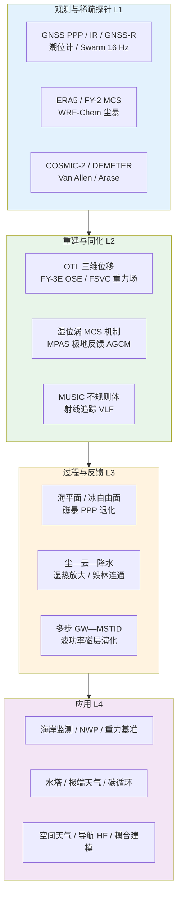
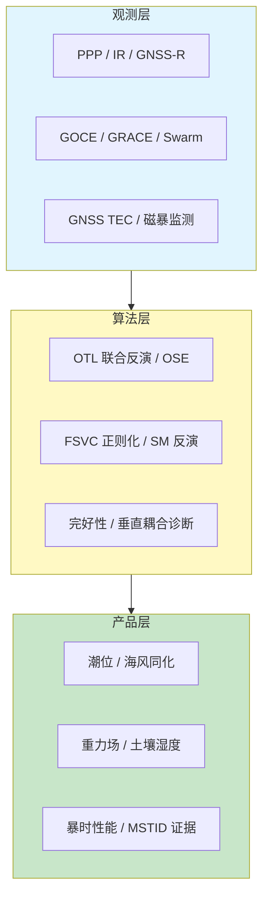
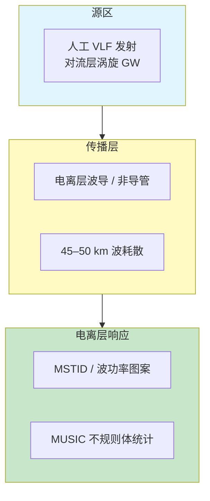
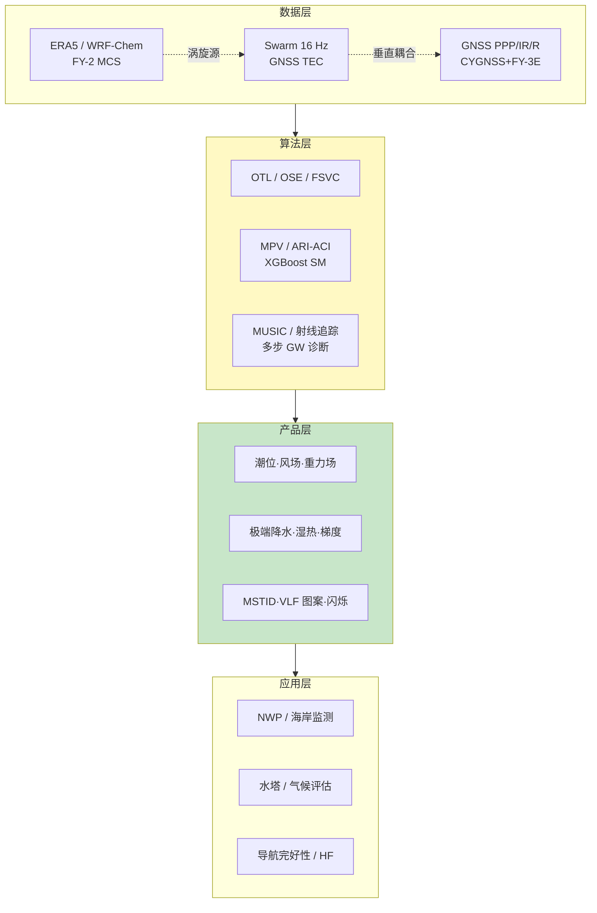

在 2026 年 6 月 4 日至 6 月 11 日这一周的时间窗口内，题录库共收录与「Atmosphere」「GNSS」「Ionosphere」检索词相匹配的论文二十七篇（按题名与 DOI 去重），其中大气类十八篇、GNSS 类八篇、电离层类三篇（含一篇同时出现在三类检索中的青藏高原多步重力波研究）。与上一统计周期（2026-05-28—06-04，五十篇）相比，题录总量收窄，但顶刊与特色期刊稿件的「过程机制—观测约束—业务接口」链条更为清晰：GNSS 从精密定位与反射遥感延伸至数值天气预报同化、固体潮与重力场建模及空间天气期性能诊断；大气科学在人为强迫—气候反馈、极端降水—气溶胶相互作用与陆—气边界层次网格表征上同步推进；电离层研究则强调高分辨率原位产品、VLF 波向磁层传播演化与对流层涡旋驱动的多步垂直耦合。

## 一、本期研究印记图

本周题录在科学问题层面呈现出「GNSS 多源遥感进入海洋—大气—固体地球业务链」「人为强迫与次网格过程重塑气候—天气反馈」与「自下而上多步垂直耦合连接对流层涡旋与电离层 MSTID」三条并行主线。GNSS 方向中，亚得里亚海北部首次实现潮位计、GNSS-IR 与 PPP 三维 OTL 位移的小时分辨率联合评估，相关系数超过 90%；FY-3E GNSS-R 海风在 WRF 同化中静态误差 6 m/s 且无稀疏化时表现最优，单次同化影响可延伸至约 700 hPa；同济大学 Tongji-GMMG2025S-FSVC 重力场在 151–300 阶累计测地误差较 Kaula 约束降低约 9.3%。大气方向中，CMIP6 大集合表明人为气溶胶使热带太平洋东暖西冷梯度加强，而温室气体效应相反；帕米尔高原春尘通过气溶胶—云相互作用使降水增加约 22%；青藏高原西南涡案例揭示初级重力波在 45–50 km 耗散后激发次级波并穿透至电离层。电离层方向中，Swarm 16 Hz 面等离子体密度衍生的 MUSIC 产品刻画多尺度不规则体，低纬谱斜率期望值约 1.97；NWC 甚低频发射机波功率在 DEMETER 与 Van Allen Probes 观测中呈现由同心圆向椭圆外移的演化，非导管传播与初始波法向角弥散最吻合。

上述脉络表明，GNSS 正从「基准站网与延迟产品」进一步嵌入潮汐负荷监测、NWP 同化、重力场建模与暴时完好性评估；大气科学在辐射—云—气溶胶谱重叠、极地放大反馈分解与陆面异质性—边界层反馈上提供可检验机制；电离层研究则把高分辨率不规则体统计、人工 VLF 波传播与天气驱动的 MSTID 纳入同一观察窗口。

## 二、GNSS 与导航遥感应用方向

GNSS 方向本期共八篇论文，均纳入完整专题画像。整体技术路线呈现「多技术潮汐与 OTL 联合反演」「GNSS-R 进入 WRF 同化业务链」「高纬陆架冰 GNSS-IR 水文产品」「卫星重力场 FSVC 正则化」「CYGNSS 与 FY-3E 双星座土壤湿度」与「G4 磁暴期性能—机制诊断」及「对流层涡旋—电离层 MSTID 的 GNSS TEC 约束」等支线，并与潮位计、InSAR 及数值模式形成方法互补。

**表1 GNSS 方向代表性研究的技术路线与特点对照**

| 研究主题 | 技术路线概要 | 技术特点 | 重要结论或性能指标 |
|---------|-------------|---------|-------------------|
| 亚得里亚北部潮汐与 OTL | TG + GNSS-IR + PPP 小时 OTL | 多技术互证 | IR 与 TG 相关 >90%，振幅差 <5 cm |
| 格陵兰 Pituffik GNSS-IR | 陆架冰周期 SNR 反射 | 海平面与冰自由面同步 | 季节陆架冰循环可连续监测 |
| FY-3E GNSS-R 同化 | WRF 静态/动态误差 + OSE | 密集沿轨采样 | 静态 6 m/s 无稀疏化最优，影响至 ~700 hPa |
| G4 磁暴 GNSS 性能 | 多站观测 + 物理机制 | 2024-10 超级磁暴 | 电离层扰动致定位与完好性退化 |
| FSVC 重力场 | GOCE+GRACE+Swarm + FSVC 正则化 | 全信号方差协方差矩阵 | 151–300 阶测地误差降约 9.3% |
| CYGNSS+FY-3E 土壤湿度 | GNOS-II 双星座反射 | 多源 GNSS-R 融合 | 全球陆面湿度产品增强 |
| DIA 估计器订正 | 多维模型误指定 + UAV 安全分析 | PPP/RTK 完好性 | 订正 DIA 估计器理论表述 |
| 青藏高原多步 GW | 再分析 + GNSS TEC + COSMIC-2 | 西南涡触发 | 45–50 km 耗散激发次级波至 MSTID |

### 2.1 专题画像：亚得里亚海北部海洋潮汐负荷与海面变率的多技术 GNSS 评估

**（1）技术路线：潮位计—GNSS-IR—PPP 三维 OTL 的联合反演与谱分析**

Fantoni 等（2026）针对亚得里亚海北部浅海、半封闭几何所形成的大振幅潮汐环境，构建潮位计（TG）、干涉反射测量（GNSS-IR）与精密单点定位（PPP）三位一体的分析框架。研究首先利用 TG 记录验证 M2、S2 等半日分潮在盆地北端能量渐进增强的空间格局，并与 FES2014b 海潮模型进行振幅—相位对比，识别浅海与复杂岸线处的局地偏差。随后在多个海岸站点提取 GNSS-IR 海面高度时间序列，对日潮与半日潮分量进行谐波分析，并与邻近 TG 进行交叉验证。PPP 解进一步提供垂向、南北向与东西向三维海洋潮汐负荷（OTL）位移，时间分辨率达小时尺度，其中垂向分量主要由 M2 半日潮控制，并与模型预测在振幅与相位上高度一致；日潮 K1 分量与 GNSS 轨道周期存在相互作用，系统误差相对更大。

**（2）技术特点：低成本海岸监测与固体地球形变同步捕获**

该研究的关键创新在于将传统 TG 网与现有 GNSS 大地测量站功能叠加，使同一套基础设施同时产出海洋学海面变率与地壳弹性形变产品。GNSS-IR 作为非接触、低维护的海面观测手段，在相关系数超过 90%、振幅差异保持在 4–5 cm 的条件下，可作为 TG 网络的有效补充，尤其适用于 TG 稀疏的岸线段落。PPP 三维 OTL 则把海洋潮汐从「海平面问题」延伸至精密大地测量基准稳定性评估，对跨海桥梁、港口工程与长期海平面变化监测具有直接意义。相较单一技术路径，多技术互证能够分离模型误差、岸线几何与 GNSS 系统误差，提高分潮参数的可信度。

**（3）重要结论：集成 GNSS 可同时刻画海洋变率与 OTL 形变**

该研究的重要结论是：**亚得里亚海北部 TG、GNSS-IR 与 PPP 在半日潮频段高度一致，GNSS-IR 可作为 TG 的有效补充，PPP 小时分辨率三维 OTL 与模型在 M2 垂向分量吻合良好，日潮 K1 仍存在轨道相关系统误差，集成 GNSS 方法可同时支持海岸海平面监测、大地测量基准稳定性研究与气候变化下海平面极端事件评估**。该结论对地中海其他半封闭浅海具有推广价值；业务部署需针对本地潮汐模型与天线多路径环境开展站点级标定。局限在于 IR 反射区对海面粗糙度敏感，极端风暴期有效反射可能减少。

### 2.2 专题画像：格陵兰 Pituffik 陆架冰周期上的 GNSS-IR 海平面与冰自由面监测

**（1）技术路线：SNR 干涉反射—反射高反演—季节陆架冰过程识别**

Xie 等（2026）在格陵兰 Pituffik 地区利用 GNSS 干涉反射测量（GNSS-IR）技术，针对季节性陆架冰（landfast ice）的生消循环开展连续观测。研究从地磁品质 GNSS 站信噪比（SNR）序列中提取反射高度变化，结合 Lomb-Scargle 或类似频谱方法估计天线至反射面距离，并将反射面高程变化与海面高度及冰自由面（ice freeboard）动力学相联系。观测覆盖陆架冰形成、增厚、破裂与消退全过程，旨在区分开阔海面、冰覆盖面与冰—水混合反射区的信号特征，并与现场或独立海冰/水位资料进行季节尺度对比。

**（2）技术特点：极地岸冰环境中反射遥感与大地测量共建站复用**

北极岸冰区传统依赖卫星 altimetry 或现场钻探测量冰厚与自由面，时间分辨率与站点持续性受限。GNSS-IR 可在已有大地测量站上以被动方式获取高频反射高程，特别适合陆架冰与潮汐相互作用的耦合监测。格陵兰 Pituffik 作为高纬军事—科研复合站点，具有长期 GNSS 数据积累与极端海冰环境，是验证 GNSS-IR 在冰—海—气界面过程中的理想试验场。该方法与卫星合成孔径雷达海冰分类产品互补，可提供更密集的时间采样。

**（3）重要结论：GNSS-IR 可同步支撑极地海平面与冰自由面季节监测**

该研究的重要结论是：**在 Pituffik 季节性陆架冰循环中，GNSS-IR 能够捕捉反射面高的系统变化，对应海平面升降与冰自由面调整，为极地海岸带海冰—海洋—大气相互作用研究提供站点级连续约束，并展示现有 GNSS 大地网在极地水文与海冰监测中的拓展潜力**。该结论对北极航道安全、海平面变化与冰架稳定性评估具有参考价值；推广至其他格陵兰站点需考虑天线安装高度、反射区几何与积雪对 SNR 的干扰。冰面粗糙度变化可能导致反射相位模糊，极端暴风雪期需结合质量控制策略。

### 2.3 专题画像：FY-3E GNSS-R 海风同化 WRF 的观测误差规格敏感性

**（1）技术路线：静态与动态观测误差设定—稀疏化试验—OSE 循环评估**

Wang 等（2026）将风云三号 E 星（FY-3E）GNSS 反射测量（GNSS-R）反演的海面风速纳入天气研究与预报（WRF）模式资料同化系统，针对 GNSS-R 沿轨密集采样导致的观测误差规格难题开展系统敏感性试验。研究设计静态误差（固定风速误差标准差）与动态误差（随背景场或观测—背景差调整）两类方案，并比较是否进行数据稀疏化（thinning）。首先开展单次同化案例分析大气分析场从地面至高空的垂直影响深度，再通过观测系统试验（OSE）在循环同化中评估风场、温度与湿度分析的时空延续性。FY-3E 作为中国首颗业务化 GNSS-R 卫星，其低延迟数据为业务 NWP 提供了新的洋面风观测源。

**（2）技术特点：密集 GNSS-R 风场与误差规格—稀疏化权衡**

GNSS-R 海风不受降雨影响，在全球海洋面提供高时空分辨率风场，但沿轨采样密度远高于传统散射计，若误差规格过小将过度牵引分析场，过大则浪费观测信息。文献表明 CYGNSS 与 FY-3E 联合 RO 同化可改善台风生消预报，但业务系统仍需针对国产卫星产品确定误差模型。本研究强调「静态 6 m/s、不进行稀疏化」在本试验配置下最优，说明 FY-3E 密集观测在适当误差包容下可无需过度稀疏化即可改善分析场。该结果与部分散射计同化经验（较小误差配合稀疏化）形成对照，提示 GNSS-R 误差结构具有独特性。

**（3）重要结论：FY-3E GNSS-R 同化需匹配宽松静态误差且可延伸至中低层大气**

该研究的重要结论是：**在所试方案中，静态观测误差 6 m/s 且不进行数据稀疏化时 WRF 分析改进最显著，单次同化影响从地面延伸至约 700 hPa，循环试验进一步扩展了垂直与水平影响范围，为 FY-3E GNSS-R 在 WRF 及其他 NWP 系统中的业务同化提供了可操作的误差规格参考**。该结论对我国风云系列 GNSS 遥感进入数值预报业务具有直接意义；向全球模式推广需结合背景场质量与集合离散度重新标定误差。未考虑风速向量的各向异性误差可能导致近岸与高风况区残余偏差。

### 2.4 专题画像：2024 年 10 月 G4 地磁暴对 GNSS 性能的影响与物理机制

**（1）技术路线：多站 GNSS 观测—电离层扰动指数—定位与完好性评估**

Wang Li 等（2026）针对 2024 年 10 月发生的 G4 级地磁暴（太阳活动第 25 周重大事件之一），系统分析其对全球导航卫星系统（GNSS）定位性能的影响及背后电离层物理机制。研究收集暴前、暴中与暴后多站双频 GNSS 观测，提取总电子含量（TEC）及其变化率指数（ROTI）、载波相位起伏与伪距噪声等扰动指标，并与 Dst、Kp 等地磁活动指数对照。在定位层面评估精密单点定位（PPP）、实时动态（RTK）或标准单点定位的精度退化、收敛时间延长与固定率下降，区分高纬、中纬与低纬响应差异。机制分析联系赤道电离层异常、极光带电子密度增强、相位闪烁与电离层梯度所致几何稀释精度恶化。

**（2）技术特点：超级磁暴背景下导航—电离层耦合的业务化诊断**

2024 年 10 月磁暴由多次耀斑与地球方向日冕物质抛射（CME）触发，Dst 极小值约 −335 nT、Kp 达 9，中纬地区亦出现显著电离层不规则体与闪烁。同期全球 TEC 图显示大范围快速变化，农业精密作业、航空与测绘等高依赖 GNSS 的行业面临可用性风险。该研究将空间天气事件与 GNSS 性能定量关联，为完好性监测与预警提供案例库。与软件无线电（SDR）接收机捕获闪烁的研究相互印证，表明暴时 ROTI 显著升高与相位闪烁同步。

**（3）重要结论：G4 磁暴通过电离层闪烁与梯度导致多纬度 GNSS 性能显著退化**

该研究的重要结论是：**2024 年 10 月 G4 地磁暴期间电离层 TEC 快速变化与闪烁增强导致 GNSS 定位精度下降、模糊度固定困难与完好性风险升高，效应由高纬向中纬扩展，物理上主要源于暴时电场穿透、极光带等离子体结构与中纬梯度共同作用，对 GNSS 用户需提前启用多频无电离层组合或延迟敏感操作**。该结论对空间天气业务化服务与 GNSS 运营商监测阈值设定具有参考价值；不同接收机抗闪烁能力与多路径环境将导致站点级差异。研究亦提示需将磁暴产品纳入实时 PPP 完好性保护框架。

### 2.5 专题画像：GOCE、GRACE 与 Swarm 联合的 FSVC 全信号方差协方差重力场正则化

**（1）技术路线：多卫星正常方程融合—FSVC 正则化矩阵构建—谱域与空间域精度评估**

Chen 等（2026）提出全信号方差协方差（FSVC）正则化方法，联合 GOCE 卫星重力梯度（SGG）、GRACE 与 Swarm 观测估计静态重力场球谐系数（SHC）。传统 Kaula 或对角信号方差约束忽略 SHC 间相关性及不同任务噪声的异质性，FSVC 基于先验重力异常信号幅度构建完整正则化矩阵。研究生成 Tongji-GMMG2025S 系列三解：Kaula 对角约束（KLA）、对角信号方差协方差（DSVC）与 FSVC 正则化解（FSVC），在 151–300 阶比较累计测地误差、全球重力异常标准差及与 XGM2019 的差异。独立验证采用 GNSS/水准联合数据，重点评估加拿大等复杂海陆分布区域。

**（2）技术特点：相关性保留与中高阶噪声抑制**

卫星重力场建模中，中高阶 SHC 噪声放大是长期难题。FSVC 通过保留先验信号的空间相关性结构，更有效地压制观测噪声而不过度平滑真实信号。结果表明在引入陆地重力数据作为先验时 FSVC 优势更明显；即使以 Kaula 解为先验，FSVC 仍在谱域与空间域优于对角方案。印度尼西亚等海陆交界复杂区全球标准差最低约 4.94 mGal，显示对边缘效应的改善。GNSS/水准验证中加拿大区域噪声较 KLA 与 DSVC 分别降低约 9.15% 与 8.53%。

**（3）重要结论：FSVC 正则化显著提升联合卫星重力场中高阶精度**

该研究的重要结论是：**FSVC 正则化在 151–300 阶累计测地误差较 Kaula 与 DSVC 方案降低约 9.28% 与 9.58%，全球重力异常标准差降至 4.94 mGal，GNSS/水准独立验证证实其在复杂海陆区域具有更高精度，证明保留 SHC 相关性的全矩阵正则化是未来多卫星重力任务联合处理的有效路径**。该结论对国家精密水准网、垂直基准统一与地震形变解释具有基础支撑意义；计算成本高于对角正则化，业务化需优化矩阵存储与求解器。低阶长波部分仍受 GRACE 时长与模型差异影响。

### 2.6 专题画像：CYGNSS 与风云三号 E 星 GNOS-II 双星座土壤湿度反演

**（1）技术路线：双星座 GNSS-R 反射率—陆面参数反演—多源验证**

Cao 等（2026）利用 CYGNSS 与风云三号 E 星 GNOS-II 双星座 GNSS 反射测量数据开展全球土壤湿度（SM）反演研究。GNSS-R 对陆面反射信号敏感于表层湿度与粗糙度，CYGNSS 提供热带与副热带密集采样，FY-3E GNOS-II 则扩展了我国业务卫星的反射观测能力。研究构建统一的反射特征与辅助陆面参数（植被、地形、土壤类型等），建立或校准 SM 反演算法，并在国际土壤湿度网络（ISMN）或类似原位资料上验证时空精度与偏差结构，评估双星座融合对覆盖缺口与采样频率的改善。

**（2）技术特点：多源 GNSS-R 互补与国产卫星陆面产品**

土壤湿度连接陆—气能量交换，SAR 与被动微波已有成熟产品，GNSS-R 的优势在于对表层湿度响应与全天候潜力。CYGNSS 与 FY-3E 联合可缓解单星座轨道间隙，提高重访与时空代表性。国产 GNOS-II 业务化数据为区域农业干旱监测与数值模式陆面同化提供新数据源。双星座融合需处理不同接收机灵敏度、入射角分布与地表跟踪策略差异。

**（3）重要结论：双星座 GNSS-R 可提升土壤湿度产品时空覆盖与精度**

该研究的重要结论是：**CYGNSS 与 FY-3E GNOS-II 双星座 GNSS-R 观测联合反演能够改善全球土壤湿度产品的空间覆盖与时间采样，在 ISMN 等网络验证中展现出与单星座相比更稳定的精度与泛化能力，为陆面同化与干旱监测提供了可扩展的被动微波补充数据源**。该结论对区域农业干旱预警与陆面模式边界条件具有应用潜力；复杂植被与冰雪覆盖区仍需结合主动微波或 SAR 进行融合订正。不同星座标定漂移需持续监测以保证长期气候一致性。

### 2.7 专题画像：DIA 估计器与多维模型误指定的 UAV GNSS 定位安全分析订正

**（1）技术路线：完好性监测理论—DIA 估计器—多维误指定敏感性分析**

Ciuban 等（2026）在 GPS Solutions 发表对先前 DIA（Detection and Identification Adjustment）估计器与多维模型误指定（multidimensional model misspecifications）相关论文的订正（Correction）。DIA 估计器广泛用于 GNSS 差分定位中的故障检测与识别，特别是在无人机（UAV）等对导航安全敏感的场景。当观测模型存在维度间耦合的误指定（如未建模的多路径、大气残余或星历误差结构）时，传统完好性边界可能过于乐观。订正文对理论推导、假设条件或数值示例中的表述进行修正，确保多维误指定条件下保护水平（protection level）与安全风险量化的一致性。

**（2）技术特点：低空经济背景下完好性理论的严谨化**

随着 UAV 在城市与近海低空运行规模扩大，GNSS 完好性监测从航空领域扩展至更广泛的应用。多维误指定指故障或误差并非仅影响单一观测分量，而是在码与相位、多频或多系统间存在关联结构。DIA 框架需要在识别阶段正确分配统计检验力，避免误排除或漏检导致的风险低估。该订正虽非新算法，但对引用原论文进行 UAV 安全评估的研究具有规范作用。

**（3）重要结论：订正后的 DIA 理论更可靠支撑 UAV GNSS 安全分析**

该研究的重要结论是：**对 DIA 估计器在多维模型误指定条件下完好性分析的理论订正，消除了原有表述中可能导致保护水平估计偏差的风险，为基于 GNSS 的 UAV 导航安全评估与标准制定提供了更严谨的统计基础，提醒工程应用在复杂多路径与多系统环境下不可简单套用单维误指定假设**。该结论对低空经济监管与接收机算法认证具有规范意义；实际系统仍需结合 IMU 融合与多传感器冗余。订正论文本身不提供新实验数据，应用方需重新核对依赖原结论的安全边界计算。

### 2.8 专题画像：青藏高原西南涡触发多步重力波传播的 GNSS TEC 约束

**（1）技术路线：再分析动力场—COSMIC-2 廓线—地基 GNSS TEC 联合诊断**

Yao 等（2026）以 2022 年 6 月青藏高原西南低涡（SWV）个例为对象，综合 ERA5 等再分析、地基 GNSS 总电子含量（TEC）与 COSMIC-2 大气掩星廓线，研究重力波（GW）生成及向上耦合过程。分析表明涡旋动力扰动在对流层顶附近激发初级重力波并向上传播；初级波在约 45–50 km 高度耗散，动量与能量沉积可能触发次级重力波，并进一步贡献更高阶波的生成。穿透至电离层的波扰动与持续中尺度行进电离层扰动（MSTID）相对应。GNSS TEC 提供电离层电子密度扰动的大范围、连续成像，是连接低层天气与电离层的关键观测桥梁。

**（2）技术特点：GNSS 在大气—电离层垂直耦合中的链路角色**

传统 MSTID 研究依赖全天空成像仪或相干散射雷达，空间覆盖有限。GNSS TEC 网格可捕捉数百千米尺度的电离层扰动传播，与再分析揭示的涡旋—重力波源区在时空上对照。该研究强调「多步」垂直耦合，即不能仅用初级波直达解释电离层响应，需考虑中间层耗散与次级波激发。这对改进电离层数值模式中化源参数化与耦合边界条件具有启示。

**（3）重要结论：GNSS TEC 证实涡旋系统通过多步重力波耦合至 MSTID**

该研究的重要结论是：**青藏高原西南涡个例中，电离层 MSTID 响应不能由对流层扰动单步直达传播解释，初级重力波在 45–50 km 耗散后激发的次级及更高阶波是穿透至电离层的关键环节，地基 GNSS TEC 与 COSMIC-2 廓线为这一多步垂直耦合提供了观测约束，表明 GNSS 数据应纳入天气—电离层联合预报系统**。该结论对区域短临预报中电离层扰动预警与精密定位误差建模具有意义；个例结论向气候态推广需更多涡旋类型样本。TEC 空间分辨率仍不足以解析最小尺度结构细节。

## 三、大气科学方向

大气方向本期十八篇论文中，选取八篇顶刊与特色期刊论文作完整专题画像。综述层面，本周稿件在人为气溶胶与温室气体对热带太平洋梯度趋势的差异化响应、尘暴—云—降水反馈、湿位涡组织对流、土壤湿度异质性—湿热放大、极地放大反馈分解、光谱重叠对云辐射效应的调制、北极低云次网格表征与亚马逊毁林降水连通等主题上形成清晰机制链条。

**表2 大气方向代表性研究的技术路线与特点对照**

| 研究主题 | 技术路线概要 | 技术特点 | 重要结论或性能指标 |
|---------|-------------|---------|-------------------|
| 北极海岸甲烷 | 沉积物培养 + 同位素 | 咸淡水混合带 | 硫酸盐未抑制甲烷生成，海岸带可达 415 nmol cm⁻³ d⁻¹ |
| Sentinel-1 土壤湿度 ML | RF/XGBoost/CNN/LSTM 对比 | ISMN 全球验证 | XGBoost 最优，对入射角不敏感 |
| 三江源 MPV—MCS | FY-2 TBB + ERA5 湿位涡 | 相对湿位涡组织对流 | RMPV 在 500 hPa 锋区最有效 |
| 帕米尔春尘降水 | WRF-Chem 尘—辐射—云 | ARI 抑制、ACI 增雨 | 降水增加约 22%，极端降水面积扩 1–21% |
| 热带太平洋梯度 | CMIP6 大集合 1950–2014 | 气溶胶 vs GHG | 气溶胶东太平洋冷却更强，梯度加强 |
| 土壤湿度湿热 | 耦合陆—气 CRM 理想试验 | 25–150 km 湿斑 | 局地湿热放大 1–4°C，50 km 尺度最强 |
| 极地放大反馈 | AGCM 固定海温/海冰试验 | CMIP6 协调试验 | 约四分之三北极放大来自海冰相关过程 |
| 亚马逊毁林降水 | 水汽追踪 + 森林稳定性 | 大陆尺度连通 | 毁林 alone 不致全域崩溃，但存在热点 |

### 3.1 专题画像：北极海岸咸淡水混合带甲烷生成不受硫酸盐经典抑制

**（1）技术路线：陆—海连续带沉积物采样—厌氧培养—碳同位素示踪**

Roy-Lafontaine 等（2026）在加拿大西北地区图克托亚图克（Tuktoyaktuk）连续冻土带快速演化的海岸带，采集近岸海洋沉积物、潮间带活跃层土壤与内陆土壤剖面，开展厌氧 incubation 实验，并以咸淡水（brackish water）改良模拟海水入侵对有机质分解与甲烷（CH₄）生成的影响。同步进行地球化学分析（硫酸盐、有机物活性等）与 CH₄ 生成速率测定，利用稳定碳同位素区分乙酸发酵（acetotrophy）与氢营养途径对 CH₄ 的贡献。

**（2）技术特点：挑战硫酸盐抑制经典范式**

海平面上升与海岸侵蚀使冻土海岸带更多暴露于咸水环境。经典观点认为海水硫酸盐通过竞争性抑制降低甲烷生成，但微生物群落变化与底物活性可能抵消该效应。该研究在潮间带观测到最高 CH₄ 生成速率（可达 415 nmol cm⁻³ d⁻¹），且咸水硫酸盐未抑制内陆与海岸带培养中的甲烷生成。同位素证据指示海岸带有更高有机质活度与乙酸发酵贡献。这对全球海岸带碳预算中「被忽视的微生物甲烷源」评估具有颠覆性提示。

**（3）重要结论：高硫酸盐环境下北极海岸仍可能是显著甲烷源**

该研究的重要结论是：**在北极快速变化海岸带，咸淡水与沉积物中的硫酸盐并未按经典理论抑制甲烷生成，潮间带 CH₄ 生成速率可达内陆数十倍，表明海岸微生物甲烷生产可能是被低估的大气甲烷源，海平面上升与海水入侵未必降低海岸带甲烷排放潜力**。该结论对北极碳循环模型与气候政策中的自然源排放清单具有修正意义；区域推广需更多纬度与沉积类型样本。室内培养与野外原位排放速率之间仍存在尺度转换不确定性。

### 3.2 专题画像：Sentinel-1A 机器学习土壤湿度反演的全球算法对比

**（1）技术路线：多源特征构建—四类 ML/DL 模型训练—ISMN 全球/区域验证**

Wang 等（2026）在国际土壤湿度网络（ISMN）站点上，系统比较随机森林（RF）、极端梯度提升（XGBoost）、卷积神经网络（CNN）与长短期记忆网络（LSTM）从 Sentinel-1A 合成孔径雷达（SAR）反演土壤湿度的性能。输入特征包括 Sentinel-1A 后向散射、MODIS 植被参数、ERA5-Land 气象与土壤变量以及静态地理信息。在全球与区域尺度分别验证，并专门评估空间泛化能力与对 Sentinel-1A 观测几何（入射角、轨道方向）的鲁棒性。

**（2）技术特点：树模型优于深度学习的全球 SM 反演新证据**

深度学习在遥感反演中广泛应用，但本研究表明在异质性强的全球陆地环境下，树集成方法（RF、XGBoost） consistently 优于 CNN 与 LSTM。XGBoost 综合表现最佳，且对观测几何不敏感，可融合多轨道观测提高时间分辨率而不损失精度。该发现对业务化全球高时空分辨率 SM 产品开发具有方法论指导意义，亦提示并非所有地学问题都需复杂深度网络。

**（3）重要结论：XGBoost 是全球 Sentinel-1A 土壤湿度反演的稳健首选**

该研究的重要结论是：**在 ISMN 验证下 XGBoost 从 Sentinel-1A 反演土壤湿度表现最优，树集成方法在全球与区域尺度均优于深度学习模型，且 XGBoost 对入射角不敏感，支持多轨道融合以提升时间分辨率，为生成可靠的高时空分辨率 SM 产品提供了可复现方案**。该结论对陆面模式同化与农业干旱监测具有直接应用价值；雷达植被与粗糙度参数化仍是湿润林区的主要误差源。深度学习在局部高数据密度区域是否反超仍需针对性研究。

### 3.3 专题画像：三江源湿位涡机制与中尺度对流系统生成

**（1）技术路线：FY-2 卫星 MCS 数据集—ERA5 再分析—湿位涡诊断分解**

Xie 等（2026）基于风云二号系列卫星小时黑体温度（TBB）资料建立 2005–2020 年暖季（5–8 月）三江源（TRS）中尺度对流系统（MCS）数据集，并结合 ERA5 再分析诊断湿位涡（MPV）机制。在中层槽、副热带高压、南亚高压与西风急流等天气系统背景下，分析相对湿位涡（RMPV）、背景湿位涡（AMPV）及 barotropic（ζMPV）与 baroclinic（SMPV）项对 MCS 生成的贡献，并识别低层东风异常的水汽输送信号与 500 hPa 高低空急流辐合的驱动作用。

**（2）技术特点：湿位涡框架下的高原 MCS 动力—热力组织**

三江源作为黄河、长江、澜沧江源区，暖季 MCS 频发且致灾性强。传统研究多关注地形与热力不稳定，该研究将 MPV 引入高原 MCS 生成分析，强调 RMPV 在中层锋区附近对不稳定能量向动能转化的促进作用，以及 AMPV 提供的背景能量环境。加热作为外源加速器参与能量转换，与急流辐合的动力强迫形成配合。该方法为高原强对流数值预报中的对流触发参数化提供观测约束。

**（3）重要结论：RMPV 是三江源 MCS 生成的关键动力转换环节**

该研究的重要结论是：**在三江源暖季，相对湿位涡在中层锋区附近对 MCS 生成具有显著正效应，通过促进湿斜压发展与倾斜上升运动组织对流，500 hPa 西风急流与低空东南急流辐合为主要动力强迫，低层东风异常水汽输送为重要前兆信号，ζMPV 标识生成位置而 SMPV 支撑涡源动力**。该结论对高原防灾减灾与区域气候模式对流参数化改进具有意义；MPV 诊断对再分析湿度场质量敏感，不同再分析产品可能导致定量差异。

### 3.4 专题画像：帕米尔高原春尘暴对极端降水的增强机制

**（1）技术路线：WRF-Chem 全尘效应—ARI 与 ACI 分离试验**

Mao 等（2026）使用 WRF-Chem 模式评估中东与中亚春尘暴对帕米尔高原（PP）降水的总效应，并分离气溶胶—辐射相互作用（ARI）与气溶胶—云相互作用（ACI）。ARI 通过稳定大气与蒸发云滴抑制降水，ACI 通过增加冰云与液云贡献增雨。对比有尘与无尘情景，量化降水总量、极端降水面积扩张及其对中亚水塔水资源的影响。

**（2）技术特点：亚洲水塔区尘—云—降水链的化学—辐射耦合**

帕米尔高原是中亚水塔核心，降水变化牵动下游绿洲农业与跨境水资源分配。春尘暴是区域常见天气背景，此前尘对降水影响机制不清。该研究首次在化学天气模式下系统分解 ARI 与 ACI 的竞争效应，揭示「辐射稳定抑制」与「微物理增雨」之间的净平衡决定最终降水响应。22% 的降水增幅与 1–21% 极端降水面积扩张具有显著水资源与灾害双重含义。

**（3）重要结论：春尘通过 ACI 净增帕米尔降水与极端降水范围**

该研究的重要结论是：**春尘暴使帕米尔高原降水增加约 22%，极端降水面积扩张 1–21%，ARI 抑制降水而 ACI 增雨，净效应为正，表明中亚春尘气溶胶对水塔区降水与水资源具有不可忽视的调制作用，需在气候变化与水资源管理中纳入尘—云—降水反馈**。该结论对中亚干旱区农业规划与跨境水资源谈判具有政策相关性；模式对尘源排放、云微物理方案敏感，定量幅度存在模式依赖不确定性。

### 3.5 专题画像：人为气溶胶对热带太平洋海表温度梯度趋势的影响

**（1）技术路线：CMIP6 大集合历史试验—梯度响应分解—辐射强迫路径分析**

Maher 等（2026）在 1950–2014 年 CMIP6 大集合中分析人为气溶胶对热带太平洋东西海表温度（SST）梯度趋势的响应。观测显示近几十年西太平洋相对东太平洋更暖、梯度加强，而多数气候模式未能重现该强迫响应。研究发现人为气溶胶冷却整个热带太平洋，且东太平洋冷却更强，与温室气体增温效应相反；梯度加强并非仅由气溶胶有效辐射强迫量级或顶层能量失衡决定，区域辐射响应向热带太平洋的能量传输路径至关重要。未来情景下模式一致预测梯度减弱，与历史趋势形成对比。

**（2）技术特点：气溶胶—温室气体对 ENSO 背景场的差异化塑造**

热带太平洋梯度关系 Walker 环流、ENSO 型态与全球遥相关。文献表明 CMIP6 模式在长期梯度趋势上与观测存在系统性偏差，可能与赤道冷舌过强等模式误差有关。该研究将气溶胶与 GHG 强迫分离，揭示气溶胶东太平洋更强冷却对梯度加强的贡献，为理解「观测梯度加强 vs 模式梯度减弱」争议提供新证据。这与仅关注 GHG 增温导致 El Niño 型响应的传统叙事形成补充。

**（3）重要结论：人为气溶胶是热带太平洋 SST 梯度历史变化的重要强迫因子**

该研究的重要结论是：**人为气溶胶在 1950–2014 年冷却热带太平洋且东太平洋冷却更强，有助于加强东西梯度，该效应通过区域辐射—环流路径实现而非仅由全球平均强迫量级决定，对未来梯度减弱预测与历史趋势的差异提示气溶胶减排将显著改变热带太平洋均态结构**。该结论对 ENSO 未来变化预估与东亚季风长期趋势解释具有广泛影响；模式间气溶胶强迫与云响应仍是主要不确定性来源。

### 3.6 专题画像：中尺度土壤湿度异质性对湿热环境的局地放大

**（1）技术路线：耦合云分辨陆—气模式理想试验—湿斑尺度扫描**

Chagnaud 等（2026）在云分辨（约 500 m）、耦合陆—气模式中预设 25–150 km 尺度的湿土斑块，与均匀土壤湿度对照，评估对湿热（湿球温度或相当指标）的局地放大效应。分析土壤湿度诱导的中尺度环流、边界层高度压缩与暖湿空气汇聚机制，并考察背景风与干湿对比度对最优尺度的调制。

**（2）技术特点：次网格土壤湿度异质性进入极端湿热预估**

全球变暖背景下湿热极端对人类健康威胁日增。传统研究多假设均匀土壤湿度，忽略降雨事件后空间异质性触发的中尺度环流。该研究量化 1–4°C 的局地湿热放大，并在约 50 km 湿斑尺度达到最强，与观测土壤湿度空间格局相结合可支持热带城市与县域尺度热浪—湿热预警。

**（3）重要结论：50 km 尺度土壤湿度异质性可显著放大局地湿热**

该研究的重要结论是：**相比均匀土壤湿度试验，中尺度湿土异质性可使局地湿热放大 1–4°C，在约 50 km 特征尺度达到最大，通过湿土诱导的中尺度下沉与浅边界层暖湿空气汇聚实现，背景风与干湿对比度控制放大强度，结合观测土壤湿度格局可改进热带湿热极端的次季节—天气尺度预估**。该结论对城市热健康预警与农业劳动保护标准具有应用价值；理想试验需与真实地形、植被和日变化耦合进一步验证。

### 3.7 专题画像：CMIP6 协调试验下的极地放大与气候反馈 spread

**（1）技术路线：AOGCM 与固定 SST/海冰 AGCM 对比—反馈分解**

Linke 等（2026）利用协调的多模式 AGCM 试验（固定海温与海冰来自单一参考模式 SSP5-8.5 投影），评估极地放大（PA）及其驱动反馈在模式间的 spread 来源。比较耦合模式（AOGCM）与大气模式（AGCM）集合，发现预设海面边界条件可显著缩小 PA 及相关正反馈的离散度，表明耦合投影中大量分歧来自不同变暖与海冰消融格局上的反馈运作。云反馈尤其敏感于南方中纬度局地 SST 型态。剩余 AGCM spread 反映大气模式内在差异，北极云反馈是主要残余不确定性。

**（2）技术特点：边界条件锁定下的反馈归因实验设计**

极地放大是气候变化的稳健特征，但模式间幅度差异大。通过「锁定海温海冰」实验，研究将 spread 分解为「边界条件驱动」与「大气内在」两部分，并进一步指出约四分之三北极放大由海冰相关过程驱动，即使无海冰演化仍存在温度反馈导致的弱化放大。南极放大不确定性仍与历史海冰量及未来轨迹密切相关。

**（3）重要结论：极地放大 spread 主要源于海冰—SST 格局差异而非仅大气参数化**

该研究的重要结论是：**在 CMIP6 框架下，预设海温与海冰边界条件可大幅缩小极地放大及正反馈的模式间 spread，表明耦合投影分歧主要来自不同变暖与海冰消融路径上的反馈差异，约四分之三北极放大由海冰相关过程驱动，北极云反馈是 AGCM 残余不确定性的关键来源**。该结论对缩小气候敏感度评估与北极政策适应规划具有方法论价值；固定边界条件实验无法捕捉耦合演化反馈，需与完整耦合试验对照使用。

### 3.8 专题画像：毁林驱动降水减少与亚马逊森林稳定性热点

**（1）技术路线：水汽追踪模式—毁林情景降水下游响应—森林稳定性评估**

Cattelan 等（2026）使用水汽追踪模式量化南美洲毁林对下游降雨的改变及其对森林稳定性的影响。研究检验「毁林致降水减少引发全流域森林崩溃」假说，识别对上游毁林最敏感的区域热点，并评估东北部恢复对区域降雨与生态稳定的潜在增益。

**（2）技术特点：大陆尺度水汽连通与毁林遥相关**

亚马逊森林稳定性与陆—气反馈密切相关。该研究在大陆尺度水汽连通框架下，发现毁林所致降水变化 alone 不足以导致全流域广泛森林崩溃，但西南部亚马逊（如 Rondônia 州 81% 面积）等热点对上风向毁林高度敏感，西部亚马逊与东部亚马逊—塞拉多过渡带为关键保护热点。东北部恢复可增强区域降雨与生态稳定，提示空间 targeted 保护比均匀减排更有效。

**（3）重要结论：亚马逊毁林降水效应呈热点化而非均匀崩溃**

该研究的重要结论是：**毁林驱动的降水减少 alone 不会导致亚马逊全流域森林普遍崩溃，但西南部等热点对上风向毁林高度敏感可能向非森林生态系统转变，西部与东部过渡带为关键保护优先区，东北部恢复可增益区域降雨与稳定，强调保护大陆尺度水汽连通对维持亚马逊与更广泛水文气候稳定至关重要**。该结论对《巴黎协定》下热带森林保护策略与巴西国内土地利用政策具有直接政策含义；水汽追踪模型对植被参数与大气环流背景敏感，热点位置存在模式间差异。

## 四、电离层与空间天气方向

电离层方向本期仅三篇论文，均作完整专题画像。整体呈现「Swarm 高分辨率不规则体产品业务化」「人工 VLF 波向磁层传播演化」与「对流层涡旋—多步重力波—MSTID 垂直耦合」等多条研究主线，并与 GNSS TEC、DEMETER 与辐射带探测形成多平台证据链。

**表3 电离层方向代表性研究的技术路线与特点对照**

| 研究主题 | 技术路线概要 | 技术特点 | 重要结论或性能指标 |
|---------|-------------|---------|-------------------|
| Swarm MUSIC 产品 | 16 Hz 面等离子体密度 | 多尺度梯度与谱斜率 | 低纬谱斜率期望值约 1.97 |
| NWC VLF 波功率演化 | DEMETER + Van Allen + Arase | 射线追踪三种传播模式 | 非导管弥散波法向角最吻合 |
| 多步 GW—MSTID | 再分析 + GNSS + COSMIC-2 | 西南涡个例 | 45–50 km 初级波耗散激发次级波 |

### 4.1 专题画像：Swarm 高分辨率面等离子体密度的 MUSIC 多尺度不规则体产品

**（1）技术路线：16 Hz 密度序列—多窗口梯度与谱分析—气候态统计**

Jin 等（2026）利用 Swarm 卫星面等离子体密度 16 Hz 高频采样，开发多尺度不规则体产品（MUSIC，MUlti-Scale Irregularities produCt）。算法计算不同窗口尺度的密度梯度、密度变化率指数（RODI）、功率谱密度（PSD）与谱斜率，刻画沿轨等离子体结构从亚千米至数百千米的多尺度特征。基于 Swarm A 约八年可用数据（2014 末至 2025 末），统计太阳活动、季节、地方时与地磁活动对高低纬不规则体的调制规律。

**（2）技术特点：从 IPIR 到 MUSIC 的空间天气高分辨率升级**

相较早期 IPIR 等基于较低采样率的不规则体指数，MUSIC 利用 Swarm 面板探头 16 Hz 数据捕捉以往难以分辨的小尺度结构。高纬地区在磁纬 ±60° 以内外持续存在结构，谱斜率陡降在地方夏季最强、冬季最弱，与极区 E 层电导率季节变化相关。低纬不规则体主要在 19–01 地方时磁赤道附近占主导，谱斜率在 RODI 增强时呈期望值约 1.97 的高斯分布。产品已通过 Swarm  dissemination 服务器向社区开放。

**（3）重要结论：MUSIC 为电离层—磁层耦合与 GNSS 闪烁监测提供新高分辨率基准**

该研究的重要结论是：**MUSIC 产品基于 16 Hz Swarm 面等离子体密度，可系统刻画沿轨多尺度电离层结构与不规则体，高低纬呈现不同的太阳活动、季节与地磁调制规律，低纬增强不规则体时谱斜率期望值约 1.97，为磁层—电离层—热层耦合研究、近地空间环境评估与 GNSS 信号闪烁监测提供了开放的高分辨率数据基础**。该结论对空间天气业务模式中小尺度结构参数化与闪烁预报具有支撑意义；面探头数据非连续可用，长期气候态统计需考虑数据缺口。与地基闪烁观测的定量转换关系仍需区域标定。

### 4.2 专题画像：NWC 发射机 VLF 波功率从顶部电离层向磁层内的演化

**（1）技术路线：多卫星波功率图案对比—射线追踪三种传播模式检验**

Xia 等（2026）研究澳大利亚西北海角（NWC）甚低频（VLF）地面发射机在顶部电离层与内磁层中的波功率分布演化。DEMETER 卫星在经度—L 壳层横截面上观测到明显的同心圆环状波功率图案；Van Allen Probes 与 Arase（ERG）卫星在更高高度仍可见该图案但逐渐模糊，向外壳层移动并更加椭圆化。射线追踪试验比较导管传播、非导管垂直波法向角与非导管弥散波法向角三种情形，结果表明非导管传播配合初始波法向角弥散最能解释观测到的图案演化。

**（2）技术特点：人工 VLF 波作为磁层波传播的天然试验信号**

地面 VLF 发射机主要能量在地球—电离层波导中传播，部分泄漏至磁层，为研究波折射、反射与能量沉积提供可控源。同心圆图案反映波导模式与磁层传播路径的干涉结构。随高度增加图案椭圆化与外移，说明波矢方向分布与背景等离子体梯度共同塑造能量分布。该研究对理解人为 VLF 波对辐射带电子的调制及闪电 whistler 传播具有参照意义。

**（3）重要结论：非导管弥散传播主导 NWC 波功率向磁层演化**

该研究的重要结论是：**NWC 发射机波功率从 DEMETER 观测的顶部电离层同心圆图案向 Van Allen Probes 与 Arase 更高高度演化时向外壳层移动并椭圆化，射线追踪表明非导管传播配合初始波法向角弥散最能再现观测图案，导管传播模型不足以解释演化过程，为 VLF 波在电离层—磁层系统中的传播诊断提供了多卫星约束**。该结论对空间天气中人工 VLF 波对辐射带电子降水效应评估具有机制意义；不同发射机频率与电离层背景条件下传播路径可能差异显著。射线追踪对背景密度模型敏感。

### 4.3 专题画像：青藏高原西南涡触发的多步重力波穿透与 MSTID 生成

**（1）技术路线：再分析涡旋动力诊断—COSMIC-2 温度/风场—GNSS TEC 扰动追踪**

Yao 等（2026）从电离层视角聚焦 2022 年 6 月青藏高原西南涡（SWV）事件，综合再分析、COSMIC-2 掩星廓线与地基 GNSS TEC，重建重力波从对流层顶激发、在中间层耗散并激发次级波直至电离层 MSTID 的多步链条。初级重力波在对流层顶附近由涡旋动力扰动激发并向上传播，在约 45–50 km 耗散并沉积动量与能量，可能触发次级重力波并进一步贡献更高阶波，最终穿透至电离层形成持续 MSTID。

**（2）技术特点：电离层响应不能由单步直达传播解释**

该研究对电离层社区的关键启示是：对流层天气系统（如西南涡）对应的电离层扰动需考虑中间层波破碎与次级波激发，而非假设初级波无损直达。这与近年来冬季风暴、对流系统触发 MSTID 的数值模拟结论一致。COSMIC-2 提供中间层温度与风场结构约束，GNSS TEC 提供 F 层电子密度扰动成像，二者与再分析动力场形成垂直链条证据。

**（3）重要结论：多步垂直耦合是涡旋天气影响电离层 MSTID 的关键路径**

该研究的重要结论是：**青藏高原西南涡个例中，电离层 MSTID 不能由对流层扰动单步向上传播解释，初级重力波在 45–50 km 耗散后激发的次级及更高阶波是穿透至电离层并维持 MSTID 的关键环节，揭示多步垂直耦合在天气—电离层系统中的核心作用，对电离层预报模式的中尺度源参数化提出新的约束**。该结论对区域电离层短临预报与 GNSS 精密定位误差建模具有直接意义；需更多涡旋类型与季节个例验证普适性。电离层侧 Perkins 不稳定等等离子体过程是否与重力波扰动协同仍需区分。

## 五、交叉学科网络与创新链示意

本周题录的交叉关联集中于四条链路：GNSS TEC 与 COSMIC-2 约束的多步重力波—MSTID 链条连接大气涡旋动力与电离层等离子体结构；FY-3E GNSS-R 海风同化与 Sentinel-1/XGBoost 土壤湿度产品共同进入陆—气边界层湿度约束；FSVC 重力场与 Adriatic OTL 评估支撑精密大地测量与海平面监测基准；Swarm MUSIC 不规则体与 G4 磁暴 GNSS 性能退化形成「等离子体结构—闪烁—导航完好性」闭环。下列示意图概括数据—算法—产品—用户的创新链位置。

## 六、近期研究特色与未来趋势展望

本期题录相对 2026-05-28—06-04 窗口（五十篇）的突出变化包括：题录总量由五十篇减至二十七篇，但 GRL 与 Journal of Climate 占比上升，机制类稿件增加；GNSS 题录由六篇增至八篇，从黄河水文与强对流短临扩展至 Adriatic 潮汐 OTL、FY-3E 业务同化、FSVC 重力场与 G4 磁暴诊断，反射与遥感同化双线并进；大气方向由「S2S 陆地耦合—GEO-LEO 沙尘—火山辐射」转向「人为气溶胶—热带太平洋梯度」「尘—云—降水」「土壤湿度异质性—湿热」等气候—天气耦合机制；电离层题录由五篇减至三篇，但 Swarm MUSIC 16 Hz 产品与 NWC 多卫星 VLF 传播演化代表「数据产品升级」与「波传播诊断」两条清晰主线，多步重力波研究则延续并深化了 LOFAR 自下而上驱动议题。

展望未来三至五年，可检验的技术判断包括：（1）FY-3E GNSS-R 在 WRF 中静态 6 m/s 误差方案若扩展至 EC 或 GFS 同化框架，需验证对台风与季风低压风场结构的改进是否具模式无关性；（2）XGBoost–Sentinel-1A 全球 SM 产品若接入陆面同化，应与 SMAP 与 ERA5-Land 做交叉约束以量化干旱区偏差；（3）FSVC 重力场正则化若纳入下一代重力任务规划，有望在中南亚海陆过渡带进一步降低水准网拟合残差；（4）MUSIC 与地基 ROTI 融合有望业务化闪烁概率预报，改善赤道与高纬 GNSS 用户告警阈值；（5）多步重力波机制若嵌入 WACCM-X 或 GAIA 等耦合模式常规试验，可改善青藏高原及周边电离层短临预报中对天气系统响应的滞后与幅度误差；（6）人为气溶胶对热带太平洋梯度加强的证据若与观测第二阶趋势检验结合，将为气溶胶减排后 ENSO 型态转变提供可检验情景。

## 参考文献

1. Cao, Y., Zhang, K., Yu, K., Huang, C., Wang, C., Qian, N., Xu, N., Hao, C., Zhang, K., Zheng, N. (2026). Soil moisture retrieval based on CYGNSS and Fengyun-3E GNOS-II dual-constellation observations. *International Journal of Remote Sensing*. DOI: 10.1080/01431161.2026.2684035
2. Cattelan, L. G., Hirota, M., Baker, J. C. A., De Souza, J. G., Aguiar, A. P. D., Assis, T. O., Huntingford, C., Robertson, E., Sitch, S., Gloor, E. (2026). Impacts of Deforestation-Driven Rainfall Reductions on Amazonia Forest Stability. *Geophysical Research Letters*. DOI: 10.1029/2026gl122705
3. Cavalié, T., Moreno, R., Rezac, L., Herpin, F., Jarchow, C., Hartogh, P., Gallardo, A. C., Goodyear, S., Mancini, P., Schulz-Ravanbakhsh, A., et al. (2026). Juice-SWI during the Lunar-Earth-Gravity-Assist (LEGA) – Part 2: Instrument operations. *Annales Geophysicae*. DOI: 10.5194/angeo-44-461-2026
4. Chagnaud, G., Taylor, C. M., Jackson, L. S., Barber, A., Burns, H., Marsham, J. H., Birch, C. E. (2026). Mesoscale Soil Moisture Heterogeneity Can Locally Amplify Humid Heat. *Geophysical Research Letters*. DOI: 10.1029/2025gl121372
5. Chen, J., Chen, Q., Shen, Y., Zhang, X., Xuan, J., Flury, J. (2026). A Regularized Static Gravity Field Estimation from GOCE, GRACE and Swarm observations based on Full Signal Variance-Covariance Regularization Matrix. *Geophysical Journal International*. DOI: 10.1093/gji/ggag210
6. Ciuban, S., Teunissen, P. J. G., Tiberius, C. C. J. M. (2026). Correction: DIA-Estimator and Multidimensional Model Misspecifications: GNSS-based Positioning Safety Analysis for UAVs. *GPS Solutions*. DOI: 10.1007/s10291-026-02074-0
7. Czarnecki, P., Pincus, R. (2026). How Clear-Sky Spectral Overlap Shapes Radiation in Cloudy Atmospheres. *Journal of Climate*. DOI: 10.1175/jcli-d-25-0589.1
8. D'Aversa, E., Oliva, F., Piccioni, G., Poulet, F., Kolmašová, I., Seignovert, B., Migliorini, A., Filacchione, G., Fletcher, L., Mura, A., et al. (2026). Spectroscopic detection of terrestrial lightning from space by JUICE-MAJIS during Earth Gravity Assist. *Annales Geophysicae*. DOI: 10.5194/angeo-44-435-2026
9. Du, Y., Brown, J. R., Menviel, L., Saini, H., Drysdale, R. N., Hutchinson, D. K., Gould-Whaley, C. N. (2026). Non-linear climatic response to the weakening of the Atlantic Meridional Overturning Circulation during glacial times. *Climate of the Past*. DOI: 10.5194/cp-22-1105-2026
10. Dodson, J. B., Taylor, P. C., Barahona, D. O. (2026). A Path to Improving Simulated Properties of Low Clouds Over the Beaufort Sea Using Airborne in Situ Observations of Subgrid-Scale Variability. *Journal of Geophysical Research: Atmospheres*. DOI: 10.1029/2025jd045279
11. Fantoni, A., Braitenberg, C., Pietrantonio, G., Devoti, R. (2026). Estimating Ocean Tidal Loading and Sea-Level Variability in the Northern Adriatic Using GNSS positioning, Tide Gauges, and GNSS Reflectometry. *Geophysical Journal International*. DOI: 10.1093/gji/ggag219
12. Fogarty, J., Bushuk, M., Calaf, M., Allouche, M., Ghannam, K., Bou-Zeid, E. (2026). Large Eddy Simulations of the Atmospheric Boundary Layer Over Satellite-Sensed Sea Ice Maps. *Journal of Geophysical Research: Atmospheres*. DOI: 10.1029/2024jd042062
13. Jin, Y., Spogli, L., Kotova, D., Wood, A., Urbář, J., Alfonsi, L., Hoque, M. M., Miloch, W. J. (2026). Multi-Scale Irregularities Product for Space Weather Applications Utilizing High-Resolution Swarm Plasma Density Data. *Journal of Space Weather and Space Climate*. DOI: 10.1051/swsc/2026024
14. Kolgotin, A., Müller, D. (2026). Model of Randomly Oriented Spheroids for the Retrieval of Non-Spherical Particle Microphysical Parameters from 3β + 2α + 3δ Lidar Measurements, Part 2: ATLAS (Version 2.0) Retrieval Algorithm. *Remote Sensing*. DOI: 10.3390/rs18121897
15. Li, W., Pan, X., Yang, F., Zhao, D., Zuo, X., Zhang, K. (2026). Impact of the October 2024 G4 geomagnetic storm on GNSS performance: observations and physical mechanisms. *GPS Solutions*. DOI: 10.1007/s10291-026-02101-0
16. Linke, O., Lenhardt, J., Lund, M. T., Merikanto, J., Naakka, T., Nordling, K., Räisänen, P., Samset, B. H., Thomas, J. L., Ekman, A. M. L. (2026). Understanding the spread in climate feedbacks and polar amplification using coordinated multi-model experiments and CMIP6. *Journal of Climate*. DOI: 10.1175/jcli-d-25-0551.1
17. Maher, P., Chadwick, R., Collins, M., Booth, B. B. B., Dittus, A. (2026). Anthropogenic Aerosols Influence Tropical Pacific Sea Surface Temperature Gradient Trends. *Geophysical Research Letters*. DOI: 10.1029/2025gl121248
18. Mao, X., Xing, L., Duan, K., Shang, W., Shi, P. (2026). Spring Dust Storms Increased the Extreme Precipitation Over Pamirs Plateau. *Geophysical Research Letters*. DOI: 10.1029/2025jd045011
19. Muñoz, S., Smith, L. C., Piccione, G., Esenther, S. E., Ramos, E. J., Jenckes, J., Munk, L. A., Ibarra, D. E. (2026). Global Glacial Rock Weathering Signature Depends on Competing Contributions From Ice Sheets and Alpine Glaciers. *Geophysical Research Letters*. DOI: 10.1029/2025gl119541
20. Potapov, A., Kalambkar, P., Bouwman, J., Boersma, C., Terada, H., Rocha, W. R., Linz, H. (2026). First detection of HDO ice in a protoplanetary disk. *Astronomy & Astrophysics*. DOI: 10.1051/0004-6361/202659525
21. Roy-Lafontaine, A., Lee, R., Douglas, P. M. J., Whalen, D., Pellerin, A. (2026). Addition of brackish water to tundra soils does not inhibit methane production: implications for Arctic coastal methane production. *Biogeosciences*. DOI: 10.5194/bg-23-3777-2026
22. Wang, G., Bai, W., Huang, F., Sun, Y., Xia, J., Wang, X., Meng, X., Hu, P., Yin, C., Tan, G., et al. (2026). Impact Study of Assimilating Fengyun-3 GNSS-R Ocean Surface Winds in the Weather Research and Forecasting Model: Sensitivity Analysis on Observation Error Specifications. *Remote Sensing*. DOI: 10.3390/rs18121892
23. Wang, J., Wang, Y., Bai, X., Shao, W. (2026). Machine Learning-Based Soil Moisture Retrieval from Sentinel-1A Observations over the International Soil Moisture Networks. *Remote Sensing*. DOI: 10.3390/rs18121914
24. Xie, Q., Yao, X., Liu, Q., Bao, X. (2026). Moist Potential Vorticity Mechanism for Generation of Mesoscale Convective Systems in Three-river-source Region of China. *Journal of Climate*. DOI: 10.1175/jcli-d-25-0289.1
25. Xie, S., Larson, K. M., Nylen, T. H. (2026). GNSS-interferometric reflectometry for sea level and ice freeboard measurements over the seasonal landfast ice cycles at Pituffik, Greenland. *GPS Solutions*. DOI: 10.1007/s10291-026-02092-y
26. Xia, Z., Chen, L., Horne, R. B., Miyoshi, Y., Kasahara, Y., Matsuda, S., Shinbori, A., Hori, T., Shinohara, I. (2026). Evolution of NWC Transmitter Wave Power Distribution From the Topside Ionosphere Into the Inner Magnetosphere. *Geophysical Research Letters*. DOI: 10.1029/2026gl123087
27. Yao, W., Le, H., Sun, W., Liu, L., Chen, Y. (2026). Multi-Step Gravity Wave Propagation From a Tropospheric Vortex to the Ionosphere Near the Tibetan Plateau. *Geophysical Research Letters*. DOI: 10.1029/2026gl121858
