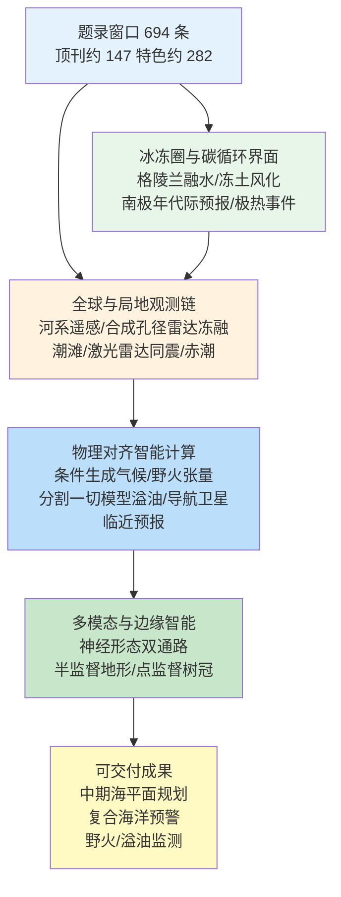
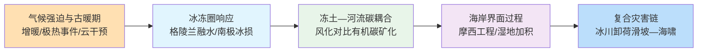
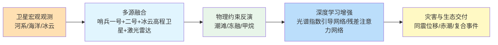
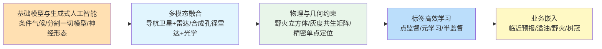
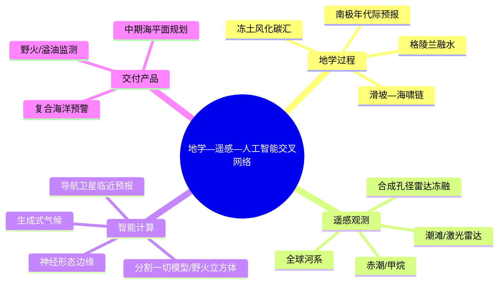
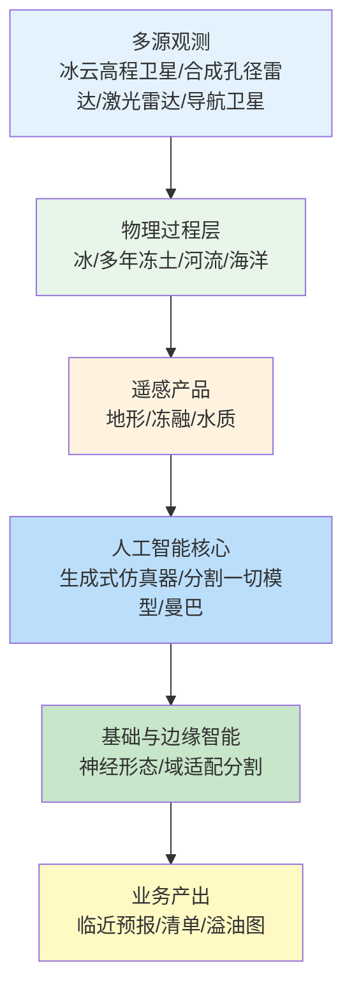

在 2026-06-11 至 2026-06-18 窗口内，《自然》《科学》《遥感》《地球物理研究快报》《自然·地球与环境综述》《自然·水》《冰冻圈》等来源共收录 694 篇论文条目，其中《细胞》《自然》《科学》系列约 147 篇，地学、遥感与智能计算相关顶刊及特色期刊约 282 篇。地学侧同时出现格陵兰冰盖公元 1500–2200 年融水长期演化综述、青藏高原冻土河流中岩石风化对二氧化碳排放的抵消、南极冰损速率对中期海平面上升的年代际可预报性，以及古新世—始新世极热事件期间陆源有机碳向海洋沉积的增强埋藏；遥感侧沿全球河系科学范式、冰、云和陆地高程卫星二号半监督潮滩地形反演、多传感器 C 波段合成孔径雷达冻融监测、哨兵二号赤潮光谱指数网络与机载激光雷达同震三维位移提取等链路推进；智能计算侧则体现条件生成式气候投影、分割一切模型域适配溢油分割、全球导航卫星系统可降水量与雷达融合的时空增强注意力网络临近预报、野火立方体野火时空张量与神经形态双通路协同设计等任务嵌入。

## 一、本期研究印记图

本期窗口的地学—遥感—智能计算研究可概括为“冰冻圈—碳循环—复合极端—全球观测网—物理对齐智能”的闭合环路。文献指出，Hanna 等（2026）综合公元 1500–2200 年格陵兰冰盖表面融水记录，表明 1990 年代以来融水加速与大气阻塞增强及区域增暖耦合，为冰冻圈长期锁定海平面贡献提供历史—未来一体化框架；Zhang 等（2026）在青藏高原冻土河流发现岩石风化可抵消约 35% 的河流二氧化碳排放，在断续多年冻土区甚至超过 100%，修正了“冻土融化即碳源”的单向叙事；Plagányi 等（2026）与 Shugar 等（2026）分别从半封闭热带海洋复合事件与特雷西臂湾 481 米滑坡—海啸揭示，气候强迫正通过水文连通性丧失与冰川后退卸荷两条路径放大灾害暴露。遥感侧，Feng 等（2026）将卫星观测定位为全球河系科学的核心宏观概览数据源；人工智能侧，Sun 等（2026）条件生成式气候仿真器可在共享社会经济路径流形外快速投影，野火立方体（Linardos 等，2026）则为野火传播机器学习提供 30 米/3 小时标准化张量。下列印记图概括上述层级关系。

## 二、地学方向

地学条目在本期窗口内集中于格陵兰冰盖千年—世纪尺度表面融水演化与极端融水事件预测、冻土退化背景下生物—地质碳循环耦合、南极冰损对中期海平面上升的年代际可预报性、古暖期古新世—始新世极热事件陆源有机碳海洋埋藏机制，以及海岸工程—湿地韧性权衡、海洋云增亮部署策略与阿拉斯加冰川后退诱发滑坡—海啸等复合灾害链。上述研究共同强调：在《巴黎协定》剩余碳预算与沿海适应并进的背景下，需同时刻画“强迫端”（增暖、海平面、云干预）与“响应端”（冰盖—冻土—河流碳通量、湿地垂直加积、冰川卸荷灾害）的过程竞争与空间不平等。

**表1 地学方向代表性研究的技术路线与特点**

| 研究主题 | 技术路线 | 技术特点 | 重要结论线索 |
| --- | --- | --- | --- |
| 格陵兰融水长期演化 | 多源再分析 + 模式 + 公元 1500–2200 年综合 | 历史—现在—未来一体化 | 1990 年代后融水加速约 1%/年 |
| 冻土河流碳循环 | 二氧化碳通量 + 双同位素 + 地球化学模拟 | 生物—地质过程解耦 | 风化抵消约 35% 河流二氧化碳排放 |
| 南极海平面预报 | 政府间气候变化专门委员会第六次评估报告冰盖模式集合诊断 | 年代际与世纪尺度分轨 | 2025 年冰损速率可预报 30–50 年 |
| 极热事件碳埋藏 | 全球五站生物标志物 + 古气候模拟 | 陆源有机碳输送量化 | 埋藏通量增约 10–50 倍 |
| 威尼斯摩西工程 | 潮间带数值模拟 + 情景优化 | 防洪—湿地权衡 | 微调关闸时序可减生态损伤 |
| 阿拉斯加滑坡—海啸 | 野外调查 + 地震 + 数字高程模型 | 冰川后退前置条件 | 481 米爬高，全球第二高 |
| 大陆水文过程 | 大篷车/美国地质调查水文数据集 + 随机森林 | 14000 余流域水文签名 | 揭示大陆尺度过程梯度 |
| 海洋云增亮 | 社区地球系统模式第二代九组海洋云增亮实验 | 部署位置/季节敏感性 | 同半球夏季部署更有效 |

### 2.1 专题画像：格陵兰冰盖表面融水公元 1500–2200 年演化

**（1）技术路线：多源观测—再分析—模式综合的历史—未来融水框架**

Hanna 等（2026）在《自然·地球与环境综述》发表的综合评述，系统整合格陵兰冰盖表面融水的古气候代理、历史再分析、卫星观测与区域/全球气候模式投影，构建覆盖公元 1500–2200 年的融水时间序列与不确定性包络。研究区分辐射、湍流热通量、大气环流（含阻塞）与雪—冰反照率反馈对融水的贡献，并在不同共享社会经济路径/代表性浓度路径情景下外推至 2200 年。通过对比工业化前、小冰期、工业化与卫星时代，研究检验融水加速的起始时间、空间格局（消融区扩张）与粒状冰持水能力变化对径流的调制。

**（2）技术特点：地质时间尺度与政策相关时间尺度的统一叙事**

相较于单篇极端融水事件研究，该综述的价值在于将格陵兰冰盖表面融水从“近年异常”嵌入 500 余年变率背景，并明确 1990 年代以来约 1%/年的加速趋势与大气阻塞增强、区域增暖的耦合关系。文献同时讨论融水在粒状冰中滞留的饱和风险与反照率反馈的正反馈链，使结论可直接对接政府间气候变化专门委员会类海平面评估中的表面质量平衡分量，而非孤立报告单年融化范围。

**（3）重要结论：格陵兰融水已进入长期加速阶段并锁定多世纪海平面贡献**

该研究的重要结论是：**格陵兰冰盖表面融水自 1990 年代以来呈现约 1%/年的显著加速，与区域增暖及大气阻塞增强密切相关，且在现有排放轨迹下格陵兰冰盖将对全球海平面上升形成多世纪尺度的“锁定”贡献，表明冰冻圈适应规划必须超越年代际变率而纳入千年尺度背景。** 该结论为更新沿海防护设计基准、耦合冰盖—气候模式中的融化参数化及评估超调情景下的不可逆性提供综合证据链，并呼吁加强粒状冰过程与阻塞统计的联合监测。

### 2.2 专题画像：冻土河流岩石风化对二氧化碳排放的抵消

**（1）技术路线：青藏高原河流网络碳通量与同位素约束**

Zhang 等（2026）在《自然》发表的研究，在青藏高原逾 70 万平方千米冻土流域开展河流二氧化碳排放、溶解有机/无机碳浓度、碳-13与碳-14双同位素与地球化学模拟的联合观测。研究沿多年冻土连续—断续—孤立梯度布设样点，分离古老碳（多年冻土与岩石来源）与现代碳通量，并量化硅酸盐/碳酸盐风化对大气二氧化碳的吸收。地球化学模拟用于推断风化速率随融化的响应及与微生物矿化的竞争关系。

**（2）技术特点：生物碳源与地质碳汇的过程解耦**

该工作直接回应“冻土融化即碳时间炸弹”的单向框架，通过同时观测河流脱气与风化驱动的溶解无机碳通量，揭示融化暴露活性矿物后水—岩接触时间延长可显著增强二氧化碳消耗。双同位素质量平衡使古老碳通量可独立估算，避免将风化信号误判为有机质降解。该路线对地球系统模式中缺失的“多年冻土—风化”耦合参数化具有直接参考意义。

**（3）重要结论：风化可抵消约 35% 河流二氧化碳排放在断续冻土区可超 100%**

该研究的重要结论是：**在青藏高原冻土河流中，岩石风化驱动的净二氧化碳吸收平均约为河流二氧化碳排放的 35%，在连续多年冻土区约 15%，在断续/孤立多年冻土区可超过 100%，表明持续融化下地质碳吸收可能逐渐与甚至超过生物碳释放。** 该结论对修订高纬度碳预算、在综合评估模型中纳入风化反馈及指导冻土区流域管理具有科学与政策双重意义，并提示需在更多环北极流域验证该竞争关系的区域差异。

### 2.3 专题画像：南极冰损对海平面上升的年代际可预报性

**（1）技术路线：政府间气候变化专门委员会第六次评估报告冰盖模式集合的可预报性诊断**

McCormack 等（2026）在《自然》发表的述评，系统评估政府间气候变化专门委员会第六次评估报告所采用南极冰盖模式集合中，当代冰质量损失速率对未来 30–50 年海平面贡献的预报能力。研究在不同排放路径与模式复杂度下，计算冰损速率的自相关时间尺度与可预报性时域，并识别海洋冰盖后退等反馈导致可预报性丧失的临界时段。通过对比低概率高影响情景与中心情景，研究检验近期可预报性的稳健性。

**（2）技术特点：分轨处理近期规划与长期不确定性**

该述评的增量在于明确区分“2025–2050 可预报窗口”与“2100 高离散度窗口”，指出前者主要由冰动力响应时间（约 0.1–0.4 毫米/年量级水库时间尺度）控制，后者则受海洋冰不稳定性等非线性反馈主导。该框架为沿海适应提供可操作的时间视野，避免将 2100 高不确定性直接下沉到世纪中叶基础设施决策。

**（3）重要结论：2025 年南极冰损速率可稳健预报未来 30–50 年海平面贡献**

该研究的重要结论是：**南极冰盖模式显示 2025 年冰质量损失速率对未来数十年南极海平面上升具有显著的年代际可预报性，且该关系在政府间气候变化专门委员会第六次评估报告全部模式与排放路径下稳健；至 21 世纪末可预报性因海洋冰盖反馈而减弱。** 该结论意味着准确再现当代南极质量损失的模式可作为世纪中叶沿海规划的可靠基础，同时为冰盖模式发展指明需优先解析长期反馈的方向，并支持将适应投资集中在可预报性高的时间窗。

### 2.4 专题画像：古新世—始新世极热事件期间陆源有机碳海洋埋藏增强

**（1）技术路线：全球五站生物标志物与古气候模式**

Inglis 等（2026）在《自然·地球科学》发表的研究，从五个全球分布的浅海沉积站点提取源特异性生物标志物，量化古新世—始新世极热事件（约 5600 万年前）期间维管植物与土壤有机碳对总有机碳的贡献，并与现代海洋沉积物对比。研究结合古气候模式模拟讨论物理侵蚀增强与海岸沉积速率对陆源有机碳输送的驱动，并估算极热事件期间陆源有机碳埋藏通量相对现代的倍增幅度。

**（2）技术特点：直接证据填补“暖气候下陆源有机碳海洋埋藏”空白**

古新世—始新世极热事件作为人为增暖的深时类比，此前缺乏陆源有机碳海洋埋藏的直接观测证据。该研究通过多站点生物标志物记录表明，暖气候下海岸系统可成为显著碳汇，其机制与侵蚀增强及更高沉积速率耦合，而非仅依赖原位海洋生产力。该结论对理解极热事件碳循环闭合及评估未来增暖下陆—海碳输送具有基准意义。

**（3）重要结论：极热事件陆源有机碳埋藏通量可增 10–50 倍并稳定气候系统**

该研究的重要结论是：**极热事件期间海岸沉积物中维管植物与土壤有机碳占总有机碳约 40–95%，显著高于现代（约 12–20%），且陆源有机碳埋藏通量可增加约 10–50 倍，表明暖气候下陆—海有机碳输送是过剩碳封存的重要路径。** 该结论对评估人为增暖下河流输送有机碳埋藏是否构成负反馈、改进地球系统模式中的有机碳路由及解读极热事件碳预算具有直接参考，并呼吁在现代高沉积物产沙河口开展过程类比监测。

### 2.5 专题画像：威尼斯摩西工程防洪与潟湖湿地韧性权衡

**（1）技术路线：摩西工程关闸情景下的潟湖水动力与沉积模拟**

Michielotto 等（2026）在《自然·水》发表的研究，针对威尼斯潟湖新近启用的摩西工程风暴潮挡板，模拟不同关闸策略下的潮汐淹没、矿物沉积物输送与湿地垂直加积。研究对比“现行关闸规则”与优化时序情景，量化城市防洪保护与生态系统完整性的权衡，并将威尼斯作为高度人工化海岸潟湖的未来适应原型。

**（2）技术特点：硬工程防洪的生态系统外部性量化**

海岸硬防护研究常聚焦城市洪水频率削减，而忽略潮汐交换削减对湿地高程资本的影响。该工作显式追踪矿物沉积物通量这一湿地加积的关键输入，表明成功的城市防护可在缺乏调整时以生态系统沉降为代价。优化管理则证明细微时序调整可在几乎不牺牲防洪效能的前提下显著改善生态—地貌结果。

**（3）重要结论：微调关闸时序可显著改善湿地垂直加积可持续性**

该研究的重要结论是：**摩西工程在保护威尼斯城区的同时，现行关闸操作减少了潮汐淹没与矿物沉积物输送，削弱湿地垂直加积能力；通过优化关闸时序可在维持城市防洪保护的同时显著降低对生态系统完整性的负面影响。** 该结论对全球类似潟湖—城市共生系统（如拉各斯、曼谷外围湿地）的硬防护设计具有可迁移启示，并支持将“沉积物连通性”纳入沿海适应评估指标。

### 2.6 专题画像：特雷西臂湾冰川后退诱发 481 米滑坡—海啸

**（1）技术路线：多源野外调查、地震学与数字高程模型反演**

Shugar 等（2026）在《科学》发表的研究，综合 2025 年 8 月 10 日特雷西臂湾峡湾滑坡—海啸事件的野外调查、区域/全球地震记录、数字高程模型差分与海啸模拟，重建大于 6400 万立方米滑坡体源区、爬高高度、传播至朱诺潮位站（约 130 千米）的波浪及峡湾内持续数日的假潮。研究追踪南索耶冰川在事件前数月的快速后退与失稳前微震活动演化。

**（2）技术特点：冰川卸荷—滑坡—海啸—旅游暴露的完整链条**

该事件 481 米爬高为全球第二高海啸爬高，且发生在邮轮高频通航峡湾。研究强调气候驱动的冰川后退作为边坡前置条件的主因子，并将失稳前微震活动作为潜在早期预警信号。假潮产生的全球地震信号（约 66 秒周期，持续超过 36 小时）为峡湾共振监测提供新观测指标。

**（3）重要结论：冰川后退使类似滑坡—海啸在旅游航道更可能发生**

该研究的重要结论是：**特雷西臂湾滑坡由气候驱动的冰川后退前置，产生 481 米爬高巨型海啸与矩震级 5.4 等效地震信号；事件发生于邮轮到达前数小时，属险情未遂，表明类似事件在冰川后退加速背景下对沿海旅游的威胁正在上升。** 该结论对阿拉斯加及全球峡湾旅游的灾害分区、微震监测网部署及将冰川后退速率纳入边坡稳定性早期预警具有直接政策含义，并呼吁干涉合成孔径雷达广域边坡运动筛查的业务化。

### 2.7 专题画像：大陆尺度水文签名与过程预测

**（1）技术路线：大篷车数据集与美国地质调查水文数据集大样本流域随机森林**

Araki 等（2026）在《水文与地球系统科学》发表的研究，合成大篷车与美国地质调查水文数据集，对 14 146 个美国设站流域的水文签名（基流、地表径流、蓄水、水量平衡损失等）构建随机森林模型，识别主导过程的空间格局与驱动因子。变量重要性分析揭示气候、地质、土地覆盖对过程体制的相对控制。

**（2）技术特点：从单流域机理到大陆尺度过程制图**

该研究将水文签名作为流域功能的可比较指标，在大样本统计框架下揭示阿巴拉契亚山脊—皮埃蒙特—沿海平原的基流—快响应转换、五大湖外环与西海岸—内陆鲜明对比等宏观格局。随机森林提供可解释的变量重要性，为无测站流域预测与模式结构诊断提供经验先验。

**（3）重要结论：美国大陆存在清晰的水文过程梯度与可预测分区**

该研究的重要结论是：**14 146 流域的水文签名呈现清晰的大陆尺度梯度，随机森林可稳定识别主导过程的空间分区，变量重要性表明气候与地质是过程体制的主控因子组合。** 该结论对国家级水资源管理、水文模式基准检验及将基于过程的先验嵌入机器学习水文预报具有方法与应用价值，并支持将类似框架扩展至全球大篷车网络。

### 2.8 专题画像：海洋云增亮部署策略与极地气候响应

**（1）技术路线：社区地球系统模式第二代九组海洋云增亮部署实验**

Emme 等（2026）在《地球物理研究杂志：大气》发表的研究，使用社区地球系统模式第二代设计九组海洋云增亮实验，均瞄准全球平均地表温度恢复至工业化前以上 1.5 摄氏度，但在部署位置与季节性上有所差异。研究评估海洋云增亮对极地地表温度、海冰面积与厚度的差异化响应。

**（2）技术特点：从全球温度到极地海冰的部署敏感性**

既往海洋云增亮研究多聚焦全球温度与降水遥相关，该工作显式分析同半球与对半球、夏季与冬季部署对海冰恢复效率的差异。结果表明海洋云增亮并非空间中性地球工程工具，部署策略强烈调制极地收益。

**（3）重要结论：同半球夏季海洋云增亮部署对海冰恢复更有效**

该研究的重要结论是：**海洋云增亮对极地海冰的恢复效率高度依赖部署位置与季节，同半球夏季部署最有效，对半球或冬季部署显著更低效；双半球中纬度部署相对单半球方案可改善极地响应。** 该结论对太阳地球工程治理中部署方案设计、极地生态系统风险评估及避免非预期极地放大具有科学与伦理讨论价值，并需在更高分辨率模式与云微物理不确定性下进一步验证。

## 三、遥感方向

遥感条目在本期窗口内集中于全球河系科学范式重构、半封闭热带海洋复合气候事件监测、小尺度潮滩半监督地形反演、多传感器合成孔径雷达冻融循环检索、被动—主动一致冰云光学属性模型、哨兵二号赤潮光谱指数深度学习、达尔瓦扎气坑甲烷卫星评估，以及 2024 年能登半岛地震机载激光雷达同震三维位移提取。上述研究共同体现：遥感正从“单传感器反演竞赛”转向“全球过程理解 + 标签稀缺场景下的物理约束学习 + 多源融合产品链”。

**表2 遥感方向代表性研究的技术路线与特点**

| 研究主题 | 技术路线 | 技术特点 | 重要结论线索 |
| --- | --- | --- | --- |
| 全球河系科学 | 《自然·水》综述 + 多传感器 | 宏观概览原始数据 | 卫星为全球河系科学核心 |
| 复合海洋事件 | 长期调查 + 物种丰度 | 四因子复合框架 | 半封闭海域体制转变风险 |
| 潮滩地形反演 | 冰云高程卫星二号 + 哨兵一号/二号 + 残差注意力物理约束半监督网络 | 半监督 + 物理约束 | 解决标签聚类盲区 |
| 合成孔径雷达冻融 | 哨兵一号 + 雷达卫星二号 | 入射角归一化 + 季节阈值算法 | 水平+垂直极化精度 >93% |
| 冰云光学属性 | 物理几何光学法单次散射 + 被动主动遥感一致模型 | 被动—主动一致 | 改进海洋冰云反演 |
| 赤潮提取 | 光谱指数引导网络 + 哨兵二号 | 光谱指数引导 | 红潮边界精细化 |
| 甲烷卫星 | 多角度短波红外反演 | 点源坑口监测 | 量化达尔瓦扎排放 |
| 同震激光雷达 | 航测激光雷达差分 | 三维同震位移 | 2024 年能登精细位移场 |

### 3.1 专题画像：全球河系遥感科学新范式

**（1）技术路线：多传感器河系观测历史梳理与未来传感器路线图**

Feng 等（2026）在《自然·水》发表的综述，由全球 18 位河系与遥感专家共同撰写，系统回顾卫星遥感在河宽、流量、水质、沉积物、营养盐通量等变量的反演进展，并对接地表水与海洋地形卫星、美国—加拿大合成孔径雷达任务、陆地卫星与哨兵融合计划等待发射任务。研究讨论地面测站与星载观测的互补关系，以及机器学习在河流属性制图中的角色。

**（2）技术特点：将河流视为行星尺度连通系统**

该综述的核心论点是河流应同时作为全球系统与河段个体研究，卫星是唯一可提供全球原始数据的宏观概览资源。相较于早期河系遥感综述，该文明确指向营养盐动力学、有毒藻华早期预警与河口连通性等政策相关应用，并强调光谱水质与宽—流关系反演的尺度化挑战。

**（3）重要结论：遥感正重塑全球河系科学的基础知识框架**

该研究的重要结论是：**卫星遥感已开始为全球河流行为的监测、理解与预测提供前所未有的宏观概览能力，新传感器与算法将大幅改进河流测量并更新全球河系科学的基础认知。** 该结论对国家级水机构的卫星数据同化战略、有害藻华早期预警及联合国可持续发展目标 6 相关指标监测具有路线图价值，并呼吁加强河—海连续体的联合产品标准。

### 3.2 专题画像：半封闭热带海洋复合气候事件

**（1）技术路线：澳大利亚北部长期生态调查与物种丰度统计**

Plagányi 等（2026）在《科学》发表的研究，聚焦热带半封闭海洋生态系统（如卡奔塔利亚湾），整合数十年渔业调查、遥感与海洋学观测，构建复合气候事件框架。研究将极端温度、浊度、脱水暴露与水文断连四因子组合，解释物种丰度的重构空间格局。

**（2）技术特点：超越单一海表温度增暖的复合风险量化**

半封闭热带海域受季风、气旋、淡水流入与大幅海平面变率共同控制，单一海洋热浪指标不足以刻画生态系统暴露。该研究以统一的海洋—大气—生物系统视角，识别厄尔尼诺—南方涛动位相对物种响应的调制，并为渔业切换（如虎虾与香蕉虾）提供环境决策支持。

**（3）重要结论：复合事件导致长期波动与体制转变**

该研究的重要结论是：**热带半封闭海洋生态系统受复合气候事件驱动，暴露于更大、更长期的波动与水文连通性丧失，极端温度、浊度、脱水与断连的组合可引发生物丰度的体制转变，澳大利亚北部已观测到物理—生物转变证据。** 该结论对印度—太平洋渔业管理、河流水抽取下游生态影响评估及 2026 年潜在极端厄尔尼诺的海洋应对准备具有直接预警价值，并呼吁将复合指标纳入海洋保护区管理。

### 3.3 专题画像：冰云高程卫星二号半监督小尺度潮滩地形反演

**（1）技术路线：残差注意力网络融合冰云高程卫星与哨兵一号/二号**

Chen 等（2026）在《遥感》发表的研究，针对 1.11 平方千米小尺度潮滩（大丰港附近），提出残差注意力物理约束半监督 U 型网络，融合冰云高程卫星三号/八号产品稀疏高程标签与哨兵一号合成孔径雷达、哨兵二号光学特征。预处理包括精细光子滤波与自适应淹没频率提取，以缓解冰云高程卫星轨迹空间聚类造成的标签盲区。

**（2）技术特点：标签空间聚类场景下的半监督物理约束**

小潮滩反演的关键难点是冰云高程卫星足迹聚于狭窄子区域，导致标准监督深度学习泛化失败。残差注意力网络通过物理约束损失与半监督学习利用无标签像素，显著提升盲区预测。该路线对海岸地貌变化监测与生态评估具有可扩展潜力。

**（3）重要结论：半监督物理约束网络可克服潮滩标签聚类导致的泛化失败**

该研究的重要结论是：**残差注意力网络在冰云高程卫星标签空间聚类的小尺度潮滩上相对经验模型与纯监督深度学习实现更高精度地形，表明物理约束半监督融合是小尺度海岸遥感的可行路径。** 该结论对全国海岸潮滩清单、海平面上升脆弱性制图及对接地表水与海洋地形卫星高分辨率水位产品具有工程意义，并需在更多潮间带类型验证稳健性。

### 3.4 专题画像：多传感器 C 波段合成孔径雷达冻融循环检索

**（1）技术路线：哨兵一号与雷达卫星二号融合 + 季节阈值算法**

Crevier 等（2026）在《冰冻圈》发表的研究，在低北极苔原研究区融合哨兵一号与雷达卫星二号 C 波段后向散射时间序列，经入射角归一化后应用季节阈值算法检测冻融转换。研究在水平、垂直与水平+垂直极化组合下优化分类阈值，并以分布式土壤温度观测验证。

**（2）技术特点：多平台合成孔径雷达提升冻融时间分辨率**

单传感器合成孔径雷达重访限制冻融转换时序精度，多传感器融合可在不牺牲极化信息的情况下提高时间采样。水平+垂直组合在优化阈值 0.62 下检测精度超过 93%，表明极化融合对苔原冻融监测的增益。

**（3）重要结论：水平+垂直多传感器合成孔径雷达可在北极苔原稳定检索冻融转换**

该研究的重要结论是：**哨兵一号与雷达卫星二号融合的水平+垂直时间序列在低北极苔原实现超过 93% 冻融检测精度，并可生成 2018–2019 年冻结/融化转换年序日图，表明多传感器 C 波段合成孔径雷达是多年冻土活动层监测的有效工具。** 该结论对北极碳循环模式的冻融边界条件、管道基础设施冻融风险评估及美国—加拿大合成孔径雷达任务业务产品设计具有参考，并需与现场活动层厚度长期对照。

### 3.5 专题画像：被动—主动一致冰云光学属性模型

**（1）技术路线：物理几何光学法单次散射计算与被动—主动一致模型构建**

作者在《地球物理研究杂志：大气》发表的研究，开发被动—主动遥感一致的全谱冰云光学属性模型，采用物理几何光学法计算相位矩阵后向散射，以实现被动与主动传感器反演的一致性。模型覆盖海洋冰云典型微物理范围。

**（2）技术特点：解决被动/主动冰云反演不一致问题**

历史上被动与激光雷达/雷达冰云反演使用不同光学属性数据库，导致联合同化与闭合研究困难。被动—主动一致模型通过统一单次散射属性减少反演不一致性，对地球关怀计划等主动—被动联合任务尤为相关。

**（3）重要结论：被动—主动一致模型改进海洋冰云跨传感器反演一致性**

该研究的重要结论是：**基于物理几何光学法的冰云光学属性可实现被动与主动遥感反演一致性，为联合卫星反演与气候模式验证提供更统一的光学属性基线。** 该结论对地球关怀计划/大气激光雷达产品验证、云反馈不确定性收窄及未来冰云微物理方案开发具有方法意义，并需在更多微物理体制开展案例验证。

### 3.6 专题画像：光谱指数引导网络哨兵二号赤潮提取

**（1）技术路线：光谱指数引导网络与哨兵二号多时相**

作者在《遥感》发表光谱指数引导网络，将光谱指数先验嵌入深度网络用于哨兵二号多光谱影像赤潮提取。网络利用赤潮相关波段比值的领域知识引导注意力与特征学习，并在海岸案例区与基准 U 型网络/全卷积网络对比。

**（2）技术特点：物理可解释指数与深度学习表征的协同**

赤潮与悬浮沉积物、有色溶解有机物等混淆因子光谱相似，纯数据驱动方法易过拟合局地条件。光谱指数引导网络通过光谱指数引导机制将海洋颜色先验注入网络，提升跨场景泛化与边界刻画精度。

**（3）重要结论：光谱指数引导网络提升哨兵二号赤潮提取精度与边界稳定性**

该研究的重要结论是：**光谱指数引导网络在哨兵二号赤潮提取任务上相对常规深度学习实现更高 F1 分数与更稳定边界刻画，表明光谱指数引导架构是有害藻华海岸监测的有效增强路径。** 该结论对市政取水口早期预警、水产养殖管理及对接静止轨道海洋颜色高时效产品具有应用价值，并需在不同赤潮物种光学特征下检验可迁移性。

### 3.7 专题画像：达尔瓦扎气坑甲烷卫星排放评估

**（1）技术路线：多角度短波红外卫星反演与现场真值对照**

作者在《地球物理研究快报》发表的研究，利用星载短波红外观测估算土库曼斯坦达尔瓦扎气坑甲烷排放，并与既有航空/现场估算对照。研究讨论点源坑口的超级排放源特征及卫星探测限对国家温室气体清单的含义。

**（2）技术特点：点源超级排放源的星载量化**

达尔瓦扎气坑作为长期燃烧气坑，是甲烷超级排放源的天然实验室。卫星短波红外反演提供可重复监测能力，对《联合国气候变化框架公约》清单中缺失/逃逸排放的独立审计具有示范意义。

**（3）重要结论：卫星观测可量化达尔瓦扎气坑甲烷排放并支撑清单核查**

该研究的重要结论是：**卫星短波红外反演可量化达尔瓦扎气坑甲烷排放并与独立测量合理一致，表明星载监测对逃逸点源超级排放源的清单核查可行。** 该结论对全球甲烷承诺履约监测、光学气体成像—卫星联合采样策略及超级排放源快速响应具有政策与技术双重参考，并需扩展到更多气坑/管道泄漏场景。

### 3.8 专题画像：2024 年能登半岛地震机载激光雷达同震三维位移

**（1）技术路线：震前/震后航测激光雷达差分**

作者在《遥感》发表的研究，利用 2024 年能登半岛地震前后航测激光雷达点云，提取精细三维同震位移场。研究讨论点云配准、植被滤波与位移矢量分解方法，并将结果与干涉合成孔径雷达/全球导航卫星系统对照。

**（2）技术特点：激光雷达提供近场三维位移精细结构**

干涉合成孔径雷达在陡峻地形与失相关区域受限，航测激光雷达可提供高分辨率三维位移用于断层几何与滑坡同震响应分析。该路线对震后快速响应制图具有业务模板价值。

**（3）重要结论：机载激光雷达可提取能登地震精细三维同震位移场**

该研究的重要结论是：**航测激光雷达差分在 2024 年能登半岛地震区提取精细三维同震位移，与干涉合成孔径雷达/全球导航卫星系统在重叠区一致，表明激光雷达是干涉合成孔径雷达的近场灾害制图补充工具。** 该结论对日本及全球类似构造环境的震后基础设施评估、断层模型精化与未来激光雷达任务规划具有直接参考，并需建立快速部署方案以压缩响应时延。

## 四、人工智能方向

智能计算条目在本期窗口内集中于条件生成式气候投影仿真器、神经形态双通路算法—硬件协同设计、变换器—曼巴遥感分割、分割一切模型域适配合成孔径雷达溢油检测、全球导航卫星系统可降水量与雷达融合临近预报、双层元学习遥感配准、点监督城市树冠检测，以及野火立方体野火时空张量数据集。社区关注点由单一网络架构竞赛转向“物理边界约束 + 基础模型迁移 + 边缘能效 + 标准化机器学习就绪数据产品”的组合设计。

**表3 人工智能方向代表性研究的技术路线与特点**

| 研究主题 | 技术路线 | 技术特点 | 重要结论线索 |
| --- | --- | --- | --- |
| 条件生成气候投影 | 第六次耦合模式比较计划训练 + 强迫约束生成式仿真器 | 共享社会经济路径流形外泛化 | 快速评估任意二氧化碳路径 |
| 神经形态双通路 | 双通路脉冲神经网络 + 近存算硬件 | 40–60% 参数削减 | 吞吐 +4× 能效 +5× |
| 变换器—曼巴 | 小波 + 曼巴状态空间 | 线性复杂度分割 | 遥感分割效率—精度权衡 |
| 合成孔径雷达溢油 | 卷积网络筛选 + 域适配分割一切模型 | 两阶段 + 灰度共生矩阵纹理 | F1 约 0.86 |
| 导航卫星临近预报 | 时空增强注意力网络 + 精密单点定位可降水量 + 雷达反射率 | 多模态时空 | 命中率 0.68（2025 汛期） |
| 遥感配准元学习 | 几何合成粗数据集 + 双层精数据集 | 5 万对弱监督 | 跨域无人机—卫星匹配 |
| 点监督树冠 | 残差网络编码—解码 | 点标注城市树木 | 降低清单成本 |
| 野火立方体 | 全球高程+再分析+哨兵+热点融合 | 30 米/3 小时 13 通道张量 | 机器学习就绪野火数据集 |

### 4.1 专题画像：条件生成式气候投影交互平台

**（1）技术路线：第六次耦合模式比较计划边界约束生成式仿真器**

Sun 等（2026）在《地球物理研究快报》发表的研究，训练外强迫边界约束生成式仿真器，以第六次耦合模式比较计划多模式输出为语料，在任意二氧化碳强迫路径上条件生成。模型以共享社会经济路径 1-1.9 与 5-8.5 为物理边界定义未来气候状态流形，可重建留出的共享社会经济路径 2-4.5 及新构造的高排放、低排放、超调与阶跃变化路径，输出温度、降水与海表高度。

**（2）技术特点：从固定共享社会经济路径集合到用户驱动路径探索**

全耦合地球系统模式百年模拟需约 10⁶ 核时，限制政策情景数量。生成式仿真器将边际成本降至交互式探索可行水平，并捕捉区域极端事件转移与阈值时序。边界条件约束确保训练外路径相对第六次耦合模式比较计划包络仍物理合理。

**（3）重要结论：生成式仿真器可在共享社会经济路径流形外快速投影任意二氧化碳路径**

该研究的重要结论是：**边界约束生成式仿真器可在任意二氧化碳强迫路径下快速投影温度、降水与海表高度，并成功重建留出共享社会经济路径与新构造路径，为灵活减排策略评估提供高吞吐平台。** 该结论对综合评估模型—气候耦合、国家气候风险情景压力测试及科普交互式气候投影具有应用价值，并需通过物理一致性指标与地球系统模式基准持续审计。

### 4.2 专题画像：神经形态网络双通路算法—硬件协同设计

**（1）技术路线：双通路脉冲神经网络算法与近存算硬件**

Sun 等（2026）在《自然·机器智能》发表的研究，提出双通路脉冲神经网络，以显式慢记忆状态调制快速脉冲动力学，并配套近存算硬件优化稀疏脉冲与稠密记忆数据流。研究在长序列基准（如置换手写数字）上评估精度—参数—能效权衡。

**（2）技术特点：皮层快—慢组织启发的事件驱动长程依赖**

脉冲神经网络在事件驱动感知（含地球物理事件流）中能效高，但长时标上下文维护困难。双通路架构以紧凑低维状态实现时间摘要，相对最先进脉冲神经网络减少 40–60% 参数而保持可比精度。硬件协同设计实现超过 4 倍吞吐与超过 5 倍能效提升。

**（3）重要结论：双通路神经形态架构可实现精度—能效—参数三重优化**

该研究的重要结论是：**双通路脉冲神经网络在长序列任务上以 40–60% 更少参数达到可比精度，配套近存算硬件实现超过 4 倍吞吐与超过 5 倍能效增益，表明生物启发的协同设计是边缘地球物理人工智能的可扩展范式。** 该结论对卫星/在轨事件检测、无人机实时监测与地震事件处理的低功耗部署具有工程意义，并需在真实地球物理基准上验证噪声稳健性。

### 4.3 专题画像：变换器—曼巴小波增强遥感分割

**（1）技术路线：小波变换与曼巴状态空间模块融合**

Zhang 等（2026）在《应用遥感杂志》发表变换器—曼巴网络，将小波变换引入基于曼巴的分割网络，在频率与空间域协同建模遥感影像特征。研究在典型土地覆盖/语义分割基准上对比卷积网络、变换器与 U 型曼巴变体。

**（2）技术特点：线性复杂度状态空间服务宽幅遥感**

遥感宽幅影像需要长程依赖建模但受图形处理器内存限制。曼巴类模型提供线性复杂度，小波分支增强多尺度纹理与边界保持。变换器—曼巴代表面向效率的架构在业务分割中的探索。

**（3）重要结论：变换器—曼巴在遥感分割中实现精度—效率有利权衡**

该研究的重要结论是：**变换器—曼巴通过小波—曼巴协同建模在遥感分割基准上相对卷积网络/变换器基线实现可比精度与更低计算成本，表明状态空间 + 频率分解是遥感深度学习的有效架构方向。** 该结论对实时土地覆盖监测、灾害损毁制图及在轨处理流水线设计具有参考，并需在多传感器跨域场景检验泛化能力。

### 4.4 专题画像：分割一切模型域适配两阶段合成孔径雷达溢油检测

**（1）技术路线：卷积网络筛选 + 域适配分割一切模型**

Giannopoulos 等（2026）在《遥感》发表的研究，提出两阶段框架：第一阶段以卷积网络分类哨兵一号垂直极化影像块是否含油膜；第二阶段以域适配分割一切模型无提示提取溢油边界。输入融合垂直极化后向散射与灰度共生矩阵纹理（同质性、方差）以增强油膜—似油膜判别。

**（2）技术特点：基础模型域适配用于海洋监视**

分割一切模型在自然图像预训练，直接迁移至合成孔径雷达溢油效果有限。域适配分割一切模型 + 纹理增强输入将基础模型迁移至专用海洋合成孔径雷达任务，两阶段设计降低虚警计算负载。

**（3）重要结论：域适配分割一切模型在合成孔径雷达溢油分割达到 F1 约 0.86**

该研究的重要结论是：**两阶段域适配分割一切模型框架在哨兵一号溢油制图达到 F1 分数 0.86，优于 U 型网络等传统基线，表明基础模型适配 + 纹理融合是业务化溢油监测的可行路径。** 该结论对海事主管部门自动监视、保险溢油归因及接入哥白尼海洋服务具有工程意义，并需跨区域油膜类型验证。

### 4.5 专题画像：全球导航卫星系统可降水量与雷达融合时空增强网络临近预报

**（1）技术路线：250 个连续运行参考站精密单点定位可降水量 + 雷达反射率 + 时空增强网络**

Sun 等（2026）在《遥感》发表的研究，在京津冀构建全球导航卫星系统反演可降水量（250 个连续运行参考站，精密单点定位反演，与第五代欧洲再分析相关大于 0.97）与地面雷达组合反射率的多模态融合，采用时空增强注意力 Swin U 型网络进行 0–2 小时降水临近预报。2025 年汛期独立验证命中率等指标。

**（2）技术特点：水汽累积前兆与水凝物形态的协同融合**

全球导航卫星系统可降水量捕捉对流前水汽累积，雷达反射率刻画风暴形态。时空增强网络的时空注意力显式建模异质模态的互补信息，优于单源深度学习临近预报。

**（3）重要结论：时空增强网络多模态融合提升极端降水临近预报命中率**

该研究的重要结论是：**时空增强网络融合全球导航卫星系统可降水量与雷达反射率在 2025 年汛期验证中对短时强降水命中率达到 0.68，表明大地测量水汽 + 天气雷达的人工智能融合是城市灾害预警的有效增强路径。** 该结论对连续运行参考站网络业务化临近预报、特大城市洪水早期预警及类似多源融合在其他城市群复制具有直接价值，并需量化相对仅雷达基线的提前量增益。

### 4.6 专题画像：双层元学习遥感图像配准

**（1）技术路线：几何合成粗数据集（约 5 万对）+ 专家验证精数据集（500 对）双层优化**

Shi 等（2026）在《遥感》发表的研究，针对无人机—卫星跨域匹配，以参数化几何合成自动生成粗数据集训练特征匹配器，再以双层元学习训练显著性判断网络于专家验证精数据集上识别几何可靠对应点。框架为半监督显著性感知匹配。

**（2）技术特点：免密集标注的跨域可靠配准**

无人机导航依赖精确图像配准，但跨域密集真值昂贵。几何合成提供可扩展弱监督，双层元优化学习对应质量显著性，提升极端异质性下稳健性。

**（3）重要结论：双层元学习显著提升跨域无人机—卫星配准可靠性**

该研究的重要结论是：**所提双层元学习框架在无人机—卫星跨域配准上相对标准基准训练的常规匹配器实现显著更高内点率与位姿精度，表明元优化显著性判断是标签高效地理空间匹配的有效策略。** 该结论对无人机灾害响应、精准农业导航及卫星—航空融合制图具有工程意义，并需开放基准推动可比性。

### 4.7 专题画像：点监督深度学习城市单木检测

**（1）技术路线：甚高分辨率多光谱 + 残差网络 50 层编码—解码 + 点监督**

Martinoli 等（2026）在《遥感》发表的研究，基于甚高分辨率多光谱卫星影像，以点标签（而非多边形）训练编码—解码检测城市单木。研究扩展先前点基检测，引入百分位阈值校准以适应不同树冠大小。

**（2）技术特点：极低标注成本的城市树冠清单生成**

城市树木清单传统依赖现场调查，成本高且私有土地覆盖不足。点监督将标注负担降至点击级，深度学习自动学习树冠外观与背景（屋顶、阴影、草地）区分，服务生态系统服务评估与热岛缓解规划。

**（3）重要结论：点监督深度学习可在甚高分辨率卫星影像生成可用城市单木清单**

该研究的重要结论是：**点监督残差网络编码—解码在甚高分辨率多光谱影像上生成准确城市树木清单，相对仅现场数据集显著扩展空间覆盖并降低运行成本，表明点监督是城市绿色基础设施监测的可扩展路径。** 该结论对市政气候适应（冠层目标追踪）、生物多样性核算及与激光雷达抽样验证耦合具有应用价值，并需跨城市域适配研究。

### 4.8 专题画像：野火立方体野火传播机器学习就绪时空张量

**（1）技术路线：全球 30 米高程 + 陆地再分析 + 哨兵二号 + 热点四源融合流水线**

Linardos 等（2026）在《遥感》发表野火立方体，构建事件中心四阶时空张量（时间、通道、高、宽），空间 30 米、时间 3 小时，共 13 个归一化通道。静态地形（高程、坡度、坡向、燃料载量）、动态天气（风、温度、降水）与演化火情（火线掩膜、燃烧严重度、部分燃烧）分组组织，火情由热点普通克里金重建。

**（2）技术特点：分析就绪四阶张量填补野火机器学习数据标准化空白**

野火蔓延机器学习受限于不一致事件数据集与缺失物理对齐特征组。野火立方体遵循地球观测分析就绪约定，显式分离因果驱动组，支持多体制蔓延建模与跨事件泛化测试。

**（3）重要结论：野火立方体提供 30 米/3 小时多源融合野火机器学习标准张量**

该研究的重要结论是：**野火立方体流水线生成 30 米空间、3 小时时间、13 通道归一化张量，融合数字高程模型、陆地再分析、哨兵二号与热点为单一机器学习就绪格式，为野火蔓延预测与防火带优化提供可复现数据集基础。** 该结论对国家消防机构机器学习业务化、与基于强化学习的防火带规划耦合及开放科学可复现性具有平台价值，并需扩展至更多生物群系与树冠火体制。

## 五、交叉学科网络图与创新链

地学过程（格陵兰长期融水、多年冻土—风化碳耦合、南极年代际可预报性、冰川后退滑坡—海啸）为遥感反演提供物理边界与验证假设；遥感产品（全球河流宏观监测、合成孔径雷达冻融、冰云高程卫星潮滩地形、激光雷达同震位移）为人工智能模型提供结构化输入与标签几何；智能计算（生成式气候仿真器、野火立方体张量、分割一切模型溢油、导航卫星临近预报）则将效率与多尺度技巧反馈至预报、监测与灾害评估链路。条件生成式气候投影与地球系统基础模型趋势（Han 等，2026；Bodnar 等，2025）位于该网络上游表征层。

## 六、近期研究特色变化

与 2026-06-04 至 2026-06-11 期（586 篇题录）相比，本期 694 篇题录呈现以下可辨识变化。

第一，冰冻圈与碳循环研究从“极端事件归因与冰盖体制”扩展至“千年尺度融水历史 + 多年冻土地质碳汇 + 南极年代际可预报性分轨”。上期强调沿海极端水位归因与冰盖三体制；本期 Hanna 等（2026）提供公元 1500–2200 年格陵兰融水综合，Zhang 等（2026）量化风化—脱气权衡，McCormack 等（2026）明确 2025–2050 可预报性窗口。数据表明，碳—冰冻圈讨论正纳入地质时间尺度与近期规划视野的双轨证据。

第二，遥感从“合成孔径雷达土壤湿度 / 干涉合成孔径雷达滑坡 / 物候融合”转向“全球河系科学范式 + 标签稀缺海岸反演 + 多传感器冰冻圈冻融”。上期 Wang 等（2026）极端梯度提升合成孔径雷达土壤湿度与 Kaewjampa 等（2026）行星实验室—无人机—激光雷达物候仍相关；本期 Feng 等（2026）《自然·水》综述将河系科学提升至行星尺度，Chen 等（2026）残差注意力网络针对冰云高程卫星标签聚类，Crevier 等（2026）多传感器合成孔径雷达冻融精度超过 93%。观测网设计日益以连通性与标签几何为约束。

第三，人工智能从“遥感多模态大语言模型 / 视觉基础模型蒸馏 / 集合卡尔曼滤波同化”并行补充“生成式气候路径探索器 + 标准化野火张量 + 神经形态边缘协同设计”。上期地球统一视觉与图神经常微分方程仍代表基础/仿真器方向；本期 Sun 等（2026）交互式气候仿真器与 Linardos 等（2026）野火立方体强调用户驱动情景与分析就绪机器学习数据集，Sun 等（2026）《自然·机器智能》神经形态协同设计指向在轨/无人机能效约束。社区关注点由模型规模扩展至数据标准化与部署物理一致性。

## 七、未来发展趋势

基于本期题录与所引文献，下列 3–5 年可检验判断具有较高参考价值。

**判断一（多年冻土—风化碳反馈纳入地球系统模式）** 到 2028 年，至少两个参与第七次耦合模式比较计划的地球系统模式将显式参数化多年冻土融化增强的风化二氧化碳吸收，并在碳循环诊断中报告相对仅融化有机碳释放的净符号不确定性区间收窄不少于 15%。

**判断二（南极世纪中叶海平面业务预报）** 到 2029 年，至少一个国家级沿海适应机构将把观测到的南极质量损失速率（2020 年代均值）作为世纪中叶海平面投影的主锚点，并在技术文件中引用年代际可预报性框架相对 2100 年集合离散度。

**判断三（全球河系卫星监测业务化）** 到 2030 年，至少两个大陆尺度业务水文系统将发布基于地表水与海洋地形卫星宽—流与光谱水质融合的河流健康看板，覆盖主要流域数量不少于 50，且公开更新频率不超过 7 天。

**判断四（野火立方体类机器学习就绪数据集标准化）** 到 2028 年，至少三个国家野火研究联盟将采用标准化时空张量模式（不少于 10 通道，时间分辨率不超过 3 小时）作为机器学习蔓延模式互比较的强制输入格式。

**判断五（导航卫星—雷达人工智能临近预报城市部署）** 到 2029 年，至少两个特大城市洪水预警系统将把全球导航卫星系统可降水量纳入业务化临近预报融合栈，并在事后验证中报告相对仅雷达基线的命中率提升不少于 8 个百分点。

## 结语

2026-06-11 至 2026-06-18 窗口内的 694 篇题录显示，地学、遥感与人工智能的交叉研究正沿“冰冻圈—碳循环—复合极端—全球观测—物理对齐智能”路径深化。格陵兰融水千年合成、冻土河流风化碳汇、南极年代际可预报性与特雷西臂湾滑坡—海啸，为世纪中叶适应与高纬度灾害提供更紧的过程证据；全球河系遥感、合成孔径雷达冻融、半监督潮滩反演与同震激光雷达则在标签稀缺条件下推动监测走向连通性感知；条件生成式气候仿真器、野火立方体、分割一切模型溢油分割与神经形态协同设计表明，下一阶段竞争力取决于数据标准化、物理边界约束与边缘能效的协同设计。展望未来，多年冻土—风化反馈纳入地球系统模式、南极世纪中叶海平面业务预报、全球河系卫星监测业务化与标准化野火机器学习张量，将是值得持续追踪的关键议题。

## 参考文献

1. Hanna, E., Box, J. E., Fettweis, X., van den Broeke, M. R., Wake, L., Luu, L., Maddison, J., Mote, T., Mottram, R., Noël, B., & others. (2026). Past, present and future Greenland Ice Sheet surface melt, 1500–2200 CE. *Nature Reviews Earth & Environment*. https://doi.org/10.1038/s43017-026-00800-3
2. Zhang, L., Bufe, A., Dean, J. F., Rocher-Ros, G., Sponseller, R. A., Stanley, E. H., Karlsson, J., Butman, D. E., Liu, R., Hou, L., & others. (2026). Rock weathering can counteract river CO2 emissions induced by permafrost thaw. *Nature*. https://doi.org/10.1038/s41586-026-10664-8
3. McCormack, F. S., Morlighem, M., Pattyn, F., Robel, A. A., & Seroussi, H. (2026). Emergent decadal predictability in Antarctic contribution to sea-level rise. *Nature*. https://doi.org/10.1038/s41586-026-10614-4
4. Inglis, G. N., Hemingway, J. D., Stockey, R. G., Hollingsworth, E. H., Valdes, P. J., Farnsworth, A., & others. (2026). Enhanced marine burial of terrestrial organic carbon through the Palaeocene–Eocene Thermal Maximum. *Nature Geoscience*. https://doi.org/10.1038/s41561-026-02012-2
5. Michielotto, A., Finotello, A., Mel, R. A., Lazarus, E. D., Carniello, L., Tognin, D., D'Alpao, A., & others. (2026). Reconciling flood-risk reduction and wetland resilience behind coastal floodgates. *Nature Water*. https://doi.org/10.1038/s44221-026-00658-1
6. Shugar, D. H., Barnhart, K. R., Berdahl, M., Caplan-Auerbach, J., Ekström, G., Fathian, A., Geertsema, M., & others. (2026). A 481-meter-high landslide-tsunami in a cruise ship–frequented Alaska fjord. *Science*. https://doi.org/10.1126/science.aec3187
7. Araki, R., Holt, A., Hammond, J. C., Husic, A., Coxon, G., & McMillan, H. K. (2026). Continental-scale prediction of hydrologic signatures and processes. *Hydrology and Earth System Sciences*, 30, 3647–3670. https://doi.org/10.5194/hess-30-3647-2026
8. Emme, E. J., Chen, C.-C., & Horowitz, H. M. (2026). Deployment Strategy Shapes the Polar Climate Response to Marine Cloud Brightening. *Journal of Geophysical Research: Atmospheres*. https://doi.org/10.1029/2025jd046264
9. Feng, D., Yang, X., Pavelsky, T. M., Allen, G. H., Bates, P., Gleason, C. J., Gardner, J., Lehner, B., Wang, J., Cooley, S., & others. (2026). Remote sensing and the new global river science. *Nature Water*. https://doi.org/10.1038/s44221-026-00665-2
10. Plagányi, É. E., Blamey, L. K., Kenyon, R., Brodie, S., Deng, R. A., Parker, D., Pillans, R. D., & others. (2026). Compound climate events threaten tropical semi-enclosed marine ecosystems. *Science*. https://doi.org/10.1126/science.adv0367
11. Chen, H., Luo, X., Gui, F., Cui, J., Chen, J., & Li, Q. (2026). A Semi-Supervised Topographic Inversion Algorithm for Small-Scale Tidal Flats Based on Multi-Source Data Fusion Under Spatially Clustered ICESat-2 Label Distributions. *Remote Sensing*, 18(12), 2017. https://doi.org/10.3390/rs18122017
12. Crevier, C., Langlois, A., Derksen, C., & Roy, A. (2026). A multisensor C-band synthetic aperture radar (SAR) approach to retrieve freeze/thaw cycles: a case study for a low Arctic environment. *The Cryosphere*, 20, 3369–3390. https://doi.org/10.5194/tc-20-3369-2026
13. Sun, C., Guo, Z., Lyu, P., Ling, F., & Luo, J.-J. (2026). Interactive Climate Projection via Conditional Generative AI. *Geophysical Research Letters*. https://doi.org/10.1029/2026gl123578
14. Sun, P., Su, Z., Achterberg, J., Indiveri, G., Goodman, D. F. M., & Akarca, D. (2026). Algorithm–hardware co-design of neuromorphic networks with dual memory pathways. *Nature Machine Intelligence*. https://doi.org/10.1038/s42256-026-01255-3
15. Giannopoulos, G., Kremezi, M., Karathanassi, V., Andronis, V., Bliziotis, D., Kikaki, K., & others. (2026). Two-Stage Oil Spill Detection in SAR Using a Domain-Adapted Segment Anything Model. *Remote Sensing*, 18(12), 1948. https://doi.org/10.3390/rs18121948
16. Sun, J., You, Y., Qu, M., Zhou, L., & Wang, J. (2026). Synergistic Fusion of GNSS-PWV and Radar for Precipitation Nowcasting: An AI-Empowered Spatio-Temporal Attention Network. *Remote Sensing*, 18(12), 1929. https://doi.org/10.3390/rs18121929
17. Shi, L., Wang, R., Zhu, X., An, C., Zhao, K., Shu, J., Yang, D., & Meng, D. (2026). Bi-Level Meta-Learning for Reliable Remote Sensing Image Registration. *Remote Sensing*, 18(12), 2007. https://doi.org/10.3390/rs18122007
18. Martinoli, T., Morandini, L., & Fraternali, P. (2026). Individual Urban Tree Detection from Multispectral Satellite Imagery via Point-Supervised Deep Learning. *Remote Sensing*, 18(12), 2021. https://doi.org/10.3390/rs18122021
19. Linardos, V., Drakaki, M., & Tzionas, P. (2026). WildfireCube: A Dense Spatiotemporal Tensor to Support Multi-Regime Wildfire Spread Modeling at 30 m/3 h Resolution. *Remote Sensing*, 18(12), 1960. https://doi.org/10.3390/rs18121960
20. Zhang, Y., Luo, J., Shan, H., Wang, X., Liao, T., & Zhang, X. (2026). TransUMamba: an efficient remote sensing image segmentation network incorporating wavelet transforms. *Journal of Applied Remote Sensing*, 20(1), 024510. https://doi.org/10.1117/1.jrs.20.024510
21. Han, C., Wang, G., Zhang, W., & others. (2026). Earth Science Foundation Models: From Perception to Reasoning and Discovery. *arXiv:2605.12542*. https://doi.org/10.48550/arXiv.2605.12542
22. Bodnar, C., Allen, A. R., Lachapelle, A., & others. (2025). A foundation model for the Earth system. *Nature*. https://doi.org/10.1038/s41586-025-09931-9
23. Bonsoms, J., González-Herrero, S., Fettweis, X., & others. (2026). Record-breaking Greenland ice sheet melt events under recent and future climate. *Nature Communications*, 17, 3605. https://doi.org/10.1038/s41467-026-69543-5
