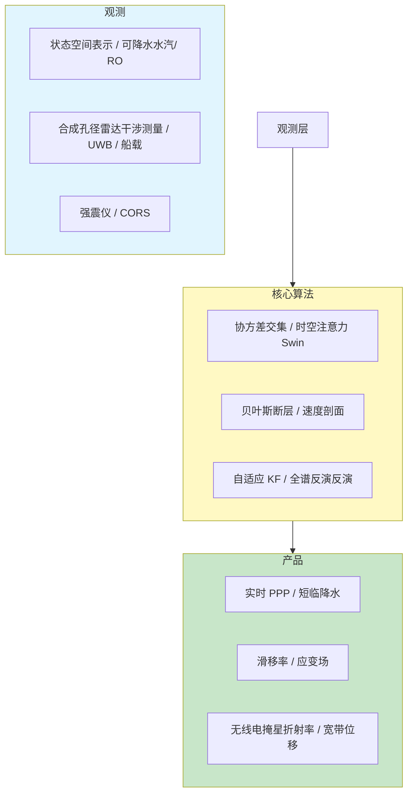
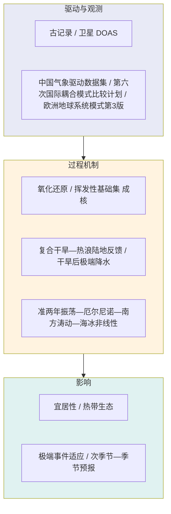
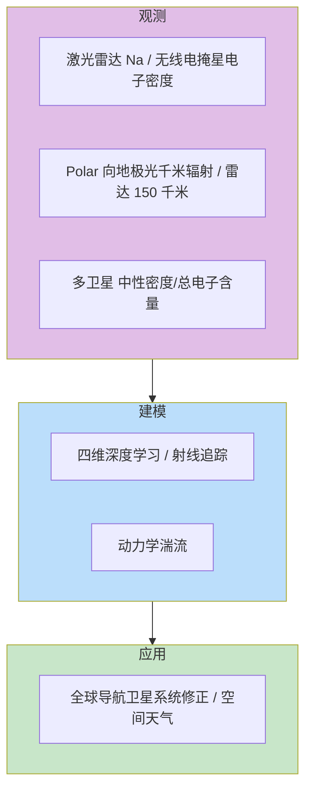
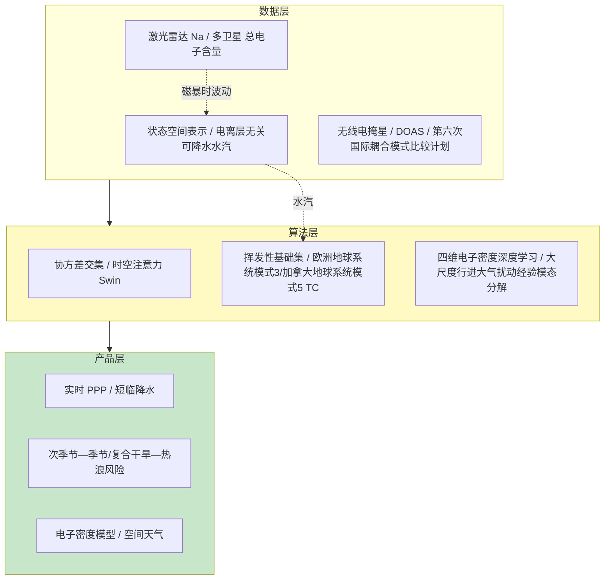

在 2026 年 6 月 11 日至 6 月 18 日这一周的时间窗口内，题录库共收录与「大气」「全球导航卫星系统」「电离层」检索词相匹配的论文四十九篇（按题名与 DOI 去重），其中大气类二十九篇、全球导航卫星系统类十七篇、电离层类七篇（含跨检索出现的无线电掩星与可降水水汽相关稿件）。相较 2026 年 6 月 4 日周报（全球导航卫星系统六篇、大气四十篇、电离层五篇），本期全球导航卫星系统题录显著扩容并覆盖实时 PPP（精密单点定位）多源融合、城市无人机-无人车协同定位、船载水汽、无线电掩星算法互比与希腊—青藏高原大地测量等主题；大气方向题录略减但顶刊密度上升，《自然综述·地球与环境》与《科学》分别给出早期大气—水圈氧化还原演化与热带半封闭海洋复合气候风险综述；电离层方向增至七篇，串联电离层—热层—中间层钠层、顶侧电子密度深度学习、商业无线电掩星星座验证、2024 年超级磁暴大尺度行进大气扰动/行进电离层扰动全球快照与 150 千米回波湍流机制。下文先给出本期研究印记图式的总览归纳，再分全球导航卫星系统、大气、电离层展开综述、代表性技术路线对照表、结构示意图与单篇专题画像，其后给出交叉学科网络与创新链示意、近期研究特色与未来趋势判断，并列出参考文献。

## 一、本期研究印记图

本周题录在科学问题层面呈现出「全球导航卫星系统精密定位与无线电掩星/可降水水汽进入业务融合与人工智能短临链」「复合极端事件与早期地球/热带海洋气候风险」以及「顶侧电离层—热层耦合与暴时全球扰动观测」三条并行主线。全球导航卫星系统方向中，MADOCA-PPP 与北斗 PPP-B2b 在改正域结构化协方差交集融合，静态水平均方根（RMS）降至 0.033 m；无人机高空锚点与无人车非对称全球导航卫星系统/超宽带（UWB）融合在极端遮挡下将 95 分位三维误差由 7.25 m 压至 0.19 m；时空注意力 Swin 融合 250 站电离层无关 PPP 反演可降水水汽（PWV）与雷达反射率，暴雨临界成功指数（CSI）提升 18.5%。大气方向中，Vulpius 等（2026）在《自然综述·地球与环境》综合陨石、古岩石与数值模型，指出地幔现代氧化还原态在 44–27 亿年间确立而大气大氧化事件（GOE）滞后于水圈游离氧；Plagányi 等（2026）在《科学》强调热带半封闭海洋受复合气候事件驱动的空间格局重组；Zhang 等（2026）提出陆地反馈驱动的干—热互强化机制延长全球复合干旱—热浪（CDHE）持续时间。电离层方向中，Chen 与 Chu（2026）首次用激光雷达发现 120–95 千米电离层—热层—中间层钠过渡层；He 等（2026）基于 COSMIC-1 训练的四维顶侧电子密度模型相对 国际参考电离层 2016 在相干散射雷达（ISR）验证上改进约 53%；Wei 等（2026）在 2024 年 5 月磁暴中首次全球对比大尺度行进大气/电离层扰动（大尺度行进大气扰动/行进电离层扰动），波前沿磁纬对齐并以 450–1100 m/s 传播。

上述脉络表明，全球导航卫星系统正从单星座改正服务转向多源状态空间表示融合、空地协同几何重建与无线电掩星/可降水水汽驱动的人工智能预报；大气科学在复合极端事件机制、早期地球宜居性与热带海洋复合风险上同步推进；电离层研究则强调电离层—热层—中间层化学—动力学耦合、顶侧电子密度数据驱动建模与暴时全球扰动可观测性。

## 二、全球导航卫星系统与导航遥感应用方向

全球导航卫星系统方向本期十七篇论文中，下列九篇纳入完整专题画像。整体技术路线呈现「亚太双状态空间表示改正域融合」「无人机高空锚点重建城市几何」「可降水水汽—雷达人工智能短临」「无线电掩星罗斯贝波气候链」「青藏高原拉脊山—积石山构造带三维形变」「希腊爱琴海滑移率」「高采样率全球导航卫星系统—强震仪自适应融合」「西北太平洋船载可降水水汽」与「无线电掩星多算法对比实验 多算法无线电掩星一致性」等支线，并与合成孔径雷达干涉测量、地震学及数值天气预报（NWP）形成方法互补。

**表1 全球导航卫星系统方向代表性研究的技术路线与特点对照**

| 研究主题 | 技术路线概要 | 技术特点 | 重要结论或性能指标 |
|---------|-------------|---------|-------------------|
| MADOCA-PPP + PPP-B2b | 改正域结构化协方差交集 | 多星座统一 PPP | 静态水平 RMS 0.033 m，有效卫星 26.56 颗 |
| 无人机-无人车融合 | 非对称 载噪比—高度角权 + 超宽带约束 | 极端遮挡模糊度固定 | 模糊度固定成功率 98.2%，95 分位 3D 误差 0.19 m |
| 时空注意力 Swin 短临 | 250 站电离层无关 PPP 可降水水汽+ 雷达 | 时空注意力 Swin 型网络 | 暴雨 检测概率 0.68，CSI 提升 18.5% |
|无线电掩星罗斯贝波 | 2007–2020 年无线电掩星 改相位速度法 | 上层对流层—下层平流层 6–16 km | 罗斯贝波包络与极端温度事件率正相关 |
| 拉脊山—积石山构造带 全球导航卫星系统+合成孔径雷达干涉测量 | 贝叶斯倾角感知速度剖面 | 多尺度球面小波应变 | 积石山断层走滑 1.7 毫米/年 |
| 希腊滑移率 | 920 点速度场 + 剖面反演 | 科林斯裂谷西向加速 | 科林斯裂谷 NS 拉张 7–15 毫米/年 |
| 全球导航卫星系统+强震仪 融合 | 两步自适应 卡尔曼滤波去色噪声 | 基线漂移随机游走 | 振动台 RMSE 1.1 mm，较 卡尔曼滤波基线 降 21% |
| 船载可降水水汽| 多星座全球导航卫星系统 海上观测 | 三类参考对比 | 探空偏差 −0.94 mm，RMS 4.28 mm |
|无线电掩星多算法对比实验 全谱反演 | 卫星应用与研究全谱反演对比无线电掩星处理包对比欧洲气象卫星开发组织 | ERA5 参照 | 总体一致，SNR 与任务差异可解释 |

### 2.1 专题画像：MADOCA-PPP 与 PPP-B2b 改正域融合实时 PPP

**（1）技术路线：双状态空间表示改正合并—结构化协方差交集—统一多星座 PPP**

Yi 等（2026）针对亚太公开 MADOCA-PPP 与北斗 PPP-B2b 两类状态空间表示（SSR）改正，在 PPP（精密单点定位）估计之前于改正域实施融合，而非事后合并定位解。研究采用偏差状态感知的结构化协方差交集策略，依据各改正信息逆方差确定相对权重，避免未知交叉相关导致的过度自信融合。

统一多星座全球导航卫星系统 精密单点定位方案同步处理信号优先级、广播星历适配、改正龄期控制以及 GLONASS 频间与差分码偏差（FCB/DCB）处理。静态站逐历元伪运动学与离岸运动学实验分别检验融合在卫星可见性波动、改正中断与高度截止角变化下的鲁棒性。

研究在改正域而非定位域完成融合，使权重分配与 精密单点定位滤波器内部方差传播一致；实验设计覆盖静态伪运动学与离岸运动学两类典型用户场景，并系统考察高度截止角与改正龄期门控对融合稳定性的影响。

**（2）技术特点：改正域融合优于用户端选源**

相较单源状态空间表示，融合框架在卫星可见性、改正中断与建模不一致并存的亚太场景下提供统计一致的权重分配。结构化协方差交集保留各源信息矩阵结构，避免简单平均或固定权重在服务中断期间引入系统性偏差。

GLONASS 偏差处理与改正龄期门控使融合产品在多星座混用条件下仍维持亚分米级静态精度。离岸运动学试验中融合平均有效卫星数 25.4 颗，且随 40° 高度截止角升高退化最慢，约为任一单源性能的三倍优势。

与事后选优或简单加权相比，结构化协方差交集在未知交叉相关条件下避免过度自信融合；统一多星座方案对 GLONASS 频间与差分码偏差、广播星历适配与信号优先级进行一体化处理，降低用户端配置复杂度。

**（3）重要结论：静态与离岸试验均证实真融合增益**

静态试验表明融合将平均有效卫星数由 21.98 与 14.98 提升至 26.56，水平均方根（RMS）0.033 m，优于 MADOCA-PPP（0.037 m）与 PPP-B2b（0.079 m），证实为真融合而非源选择；三维 RMS 0.068 m 与最优单源 0.066 m 相当。

离岸试验中融合水平 RMS 0.232 m、三维 0.290 m，全面优于两单源（0.332 m 与 0.313 m），为海上测绘、无人机巡检与灾害应急提供可切换双源的实时 PPP 路径。

离岸试验进一步表明，融合产品在卫星数、三维精度与高截止角鲁棒性上全面优于两单源服务，为亚太开放状态空间表示用户在改正中断与星座覆盖不足并存场景下提供可切换双源实时 PPP 路径。

**该研究的重要结论是：**MADOCA-PPP 与 PPP-B2b 改正域结构化协方差交集融合可将静态水平 RMS 降至 0.033 m、有效卫星增至 26.56 颗，离岸运动学水平 RMS 0.232 m，并在高截止角下保持约为单源三倍的精度优势**

该结论对亚太开放状态空间表示用户具有直接工程意义，表明双源互补可缓解单服务星座覆盖不足与改正中断风险；业务部署需持续监测两源偏差状态与龄期分布，并在电离层活跃期联合 可降水水汽产品评估对流层延迟残余。

### 2.2 专题画像：城市峡谷 无人机-无人车非对称全球导航卫星系统/UWB 协同定位

**（1）技术路线：无人机高空锚点—异质随机模型—超宽带动态基线约束**

Chen 等（2026）面向深度城市峡谷中移动测绘平台的空间基准问题，提出以无人机（UAV）作为高空动态空间锚点、地面无人车（UGV）为载荷平台的非对称全球导航卫星系统/超宽带（UWB）融合框架。地面车—车（车对车）协同因对称遮挡难以改善几何，无人机 可重建三维观测几何并传递高质量载波观测。

方法包含异质随机模型与动态基线约束最小二乘两阶段：前者联合载噪比（C/N0）与高度角刻画空地链路质量差异，后者集成 超宽带测距以稳定高相对运动下的 全球导航卫星系统解算。高保真仿真与外场试验覆盖极端遮挡与城市峡谷典型场景。

仿真与外场试验覆盖极端遮挡与城市峡谷典型场景；超宽带动态基线约束最小二乘与异质随机模型协同，使高相对运动下 全球导航卫星系统解算仍保持稳定。

**（2）技术特点：非对称几何重建突破对称 车对车 瓶颈**

传统地面协同无法提供俯仰方向几何多样性，无人机 锚点相当于可移动的超级连续运行参考站（CORS），显著降低精度因子（精度因子）退化。载噪比—高度角耦合权函数针对空地链路信噪比悬殊设计，避免低质量 无人车 多路径观测污染 无人机 高保真载波。

超宽带约束在 全球导航卫星系统几何崩溃时提供独立距离观测，保证历元可用性。在可见卫星不超过 3 颗的极端遮挡下模糊度固定（AR）成功率达 98.2%，三维精度达亚分米级，显著优于对称协同方案。

载噪比与高度角耦合权重针对空地链路质量悬殊设计，防止 无人车 多路径观测污染 无人机 高保真载波；超宽带在几何崩溃时提供独立距离约束，保证历元连续可用。

**（3）重要结论：城市峡谷实测实现分米级连续定位**

城市峡谷实测中方法实现 100% 定位可用率，95 分位三维误差由 7.25 m 降至 0.19 m（单 无人机/单 无人车 配置），为数字孪生、基础设施监测与智慧城市三维重建提供可用基准。

结果表明非对称空地协同可将移动测绘从「可用」推进到「高精度连续」，对超大城市峡谷测绘与应急编队具有示范价值；多 无人机 组网与语义地图融合仍是规模化部署前的扩展方向。

**该研究的重要结论是：**无人机高空锚点与无人车非对称全球导航卫星系统/UWB 融合在极端遮挡（可见卫星不超过 3 颗）下 模糊度固定成功率 98.2%，城市峡谷 95 分位三维误差由 7.25 m 降至 0.19 m，历元可用率 100%**

该框架将空地异构协同从概念验证推进到厘米—分米级可用精度，对智慧城市移动测绘具有工程参考价值；全遮挡室内仍依赖 超宽带/惯性主导，全球导航卫星系统可用性需与地图语义联动。

### 2.3 专题画像：全球导航卫星系统可降水水汽与雷达 时空注意力 Swin 降水短临预报

**（1）技术路线：250 站电离层无关 PPP 反演可降水水汽—时空注意力 Swin 多模态融合—2025 汛期检验**

Sun 等（2026）在京津冀构建融合地基全球导航卫星系统可降水水汽（PWV）与雷达合成反射率（CR）的多模态短临降水框架。可降水水汽由 250 个连续运行参考站双频电离层无关 PPP 反演，与 ERA5 再分析相关系数超过 0.97，刻画对流前水汽累积；雷达 CR 提供水凝物形态分布。

核心模型为时空增强注意力 Swin 型网络（时空注意力 Swin），通过 Swin变换器窗口自注意力与 U型网络编码—解码结构融合异构时空场。2025年汛期独立检验评估 +1 h 超前预报技巧。

250 个连续运行参考站双频电离层无关 PPP 反演可降水水汽与 ERA5 相关系数超过 0.97；雷达合成反射率提供水凝物形态约束，2025 年汛期独立检验评估 +1 h 超前预报技巧。

**（2）技术特点：水汽热力学信息与雷达形态互补**

传统外推或数值模式对突发性局地暴雨预报技巧有限。全球导航卫星系统可降水水汽以分钟级、低成本覆盖弥补探空稀疏；时空注意力 Swin 的时空注意力突出对流组织关键区域。电离层无关 PPP 保证 可降水水汽反演在磁扰期仍相对稳定，为融合提供一致输入。

与单源深度学习基线相比，融合模型在暴雨检测与定位上全面占优，表明 全球导航卫星系统大气层析与雷达联合是城市防灾可行的技术组合。

时空注意力 Swin 以 Swin变换器窗口自注意力与 U型网络编码解码结构融合异构时空场；相较单源深度学习，融合模型在暴雨检测与定位上全面占优。

**（3）重要结论：融合模型显著提升暴雨短临技巧**

+1 h 超前预报暴雨命中率（POD）达 0.68；临界成功指数（CSI）与 检测概率 较单源模型分别提升 18.5% 与 21.5%，表明 可降水水汽热力学约束与雷达形态信息在暴雨预报中具有互补增益。

该结论支持将 连续运行参考站网从基准维持扩展为城市短临预报传感器；业务化需与省级雷达组网和模式对流有效位能场做概率集成。

结果表明 全球导航卫星系统大气层析与雷达联合是城市防灾可行技术组合；业务化需与省级雷达组网及模式对流有效位能场做概率集成。

**该研究的重要结论是：**时空注意力 Swin 融合 全球导航卫星系统可降水水汽与雷达 CR，在 +1 h 超前预报中暴雨 检测概率 0.68，CSI 与 检测概率 较单源模型分别提升 18.5% 与 21.5%**

该结论对华北季风区城市防灾具有直接参考价值；不同气候区需重标定 可降水水汽阈值并联合雷达外推做集成预报。

### 2.4 专题画像：全球导航卫星系统无线电掩星揭示上层对流层—下层平流层罗斯贝波与极端温度事件

**（1）技术路线：2007–2020无线电掩星数据—改进相位速度法—罗斯贝波包络/罗斯贝波相位速度与极端温度事件/持续极端温度事件关联**

Li 等（2026）利用 2007–2020 年全球导航卫星系统无线电掩星（RO）数据，研究 6–16 km 外热带上层对流层—下层平流层罗斯贝波活动。将既有罗斯贝波相位速度推导方法改造以适配 无线电掩星垂直分辨率，并用再分析验证无线电掩星导出的罗斯贝波包络与罗斯贝波相位速度。

北半球罗斯贝波包络与罗斯贝波相位速度在冬季增强、夏季减弱；南半球罗斯贝波包络在春季放大。二者在对流层顶附近达极大，空间分布与风暴路径和急流高度一致，表明无线电掩星可稳定追踪上层对流层—下层平流层波动背景态。

**（2）技术特点：无线电掩星为上层对流层—下层平流层波动提供全球一致探针**

相较稀疏探空，无线电掩星提供全球、全季节上层对流层—下层平流层温度廓线，使罗斯贝波统计在数据稀疏区仍具代表性。改进相位速度法解决无线电掩星层析与再分析垂直坐标差异，保证罗斯贝波相位速度可比性。

罗斯贝波包络与罗斯贝波相位速度对极端温度事件与持续极端温度事件（持续极端温度事件）的双机制（发生率与持续性）区分具有预报解读价值，为次季节—季节极端温度预警提供 无线电掩星可观测约束。

**（3）重要结论：上层对流层—下层平流层罗斯贝波调制地表极端温度风险**

结果表明罗斯贝波包络调制极端温度事件发生率，罗斯贝波相位速度在极端温度事件背景下影响 持续极端温度事件发生率；效应随季节与区域变化，且在对流层顶附近活动最强。

该研究将 全球导航卫星系统无线电掩星从 数值天气预报 同化产品延伸至极端事件气候归因链，与欧洲地球系统模式第3版 等模式 厄尔尼诺—南方涛动 误差诊断结合，可检验模式对上层对流层—下层平流层波动—地表极端耦合的再现能力。

**该研究的重要结论是：**无线电掩星导出的上层对流层—下层平流层罗斯贝波包络与极端温度事件发生率正相关，罗斯贝波相位速度在极端事件背景下调制持续极端温度事件发生率，且在对流层顶附近活动最强**

该结论对无线电掩行业务同化之外的气候应用具有拓展意义；持续极端温度事件机制仍需与阻塞与土壤湿度反馈联合诊断。

### 2.5 专题画像：拉脊山—积石山构造带 全球导航卫星系统与合成孔径雷达干涉测量三维形变

**（1）技术路线：Sentinel-1 合成孔径雷达干涉测量 + 全球导航卫星系统—贝叶斯倾角感知速度剖面—球面小波应变**

Yang 与 Su（2026）在青藏高原东北缘拉脊山—积石山构造带综合 全球导航卫星系统与 Sentinel-1 合成孔径雷达干涉测量，构建高分辨率三维震间形变场。2023 年积石山 Mw 6.0 地震表明该带虽平均应变中等，仍具发震能力。

采用增强倾角感知速度剖面模型，在贝叶斯框架下估计主要断层滑移率与锁定深度，并以多尺度球面小波计算区域应变率，区分沿走向非均匀变形集中区。

**（2）技术特点：构造转换带中等应变下的局地集中发震**

传统观点将拉脊山—积石山构造带视为变形较弱区域，积石山地震促使重新评估其运动学角色。合成孔径雷达干涉测量补充全球导航卫星系统 空间采样，贝叶斯倾角模型区分不同断层几何下的滑移分配。

拉脊山断层以缩短与抬升为主、走滑分量弱；积石山断层走滑 1.7±0.3 毫米/年、倾滑缩短相关分量 3.5±1.2 毫米/年。拉脊山—积石山构造带被解释为日月山断裂与西秦岭断裂之间的内部应变传递带。

**（3）重要结论：中等震级地震可在应变传递带成核**

研究指出中等震级地震可在应变传递带内于几何有利部位成核，为青藏高原东北缘地震危险性评估提供三维形变—断层锁定联合约束。

滑动率对合成孔径雷达干涉测量视线向与全球导航卫星系统 权重敏感，需结合历史地震与古地震记录独立检验；结果对「低应变带发震」机制理解具有一般意义。

**该研究的重要结论是：**拉脊山—积石山构造带平均区域应变低于一级边界断层，但沿走向非均匀变形显著；积石山断层走滑 1.7±0.3 毫米/年，拉脊山断层以缩短抬升为主，该带是日月山与西秦岭之间的内部应变传递带**

该结论对青藏高原东北缘地震危险性分区具有直接价值；深部锁定分布仍需联合宽频地震与重力约束。

### 2.6 专题画像：希腊中部与伯罗奔尼撒 全球导航卫星系统速度场与滑移率

**（1）技术路线：920 点坐标与 509 速度—共震/震后改正—速度剖面反演**

Bufféral 等（2026）基于 Briole 等（2026）发布的希腊中部与伯罗奔尼撒加密全球导航卫星系统速度场，量化爱琴海上盘各构造域滑移率、应变局域化与震间加载。研究覆盖科林斯—帕特雷裂谷、埃维亚湾、阿尔戈利斯湾、伯罗奔尼撒西南以及凯法利尼亚转换断层等七类系统。

全球导航卫星系统数据经地球物理卫星定位系统 6.4 处理，并利用永久站时间序列约束的地震参数改正共震与震后位移，保证长期构造速率可靠。速度剖面联合弹性加载与无震蠕变，区分宽变形带与单断层锁定。

**（2）技术特点：加密速度场解析弥漫与局地化变形**

相较稀疏永久站网，融合 1990–2024 测站与 1960–70 年代三角网柱石重测使离岸与裂谷内部变形可辨。自居中观测系统可将水平坐标残差标准差由 6.15 mm 降至 4.45 mm。

科林斯裂谷南北向拉张由东向西从约 7 增至约 15 毫米/年，其中近海可达约 6 毫米/年。卡托纳段以约 13 毫米/年左行走滑蠕变集中于 6 km 窄带。

**（3）重要结论：离岸与走滑蠕变为爱琴海灾害风险提供新约束**

阿尔戈利斯湾未测得可辨应变，提示阿斯特罗斯断层现今加载率低于先前推断。伯罗奔尼撒弥漫东西向拉张至 6 毫米/年，部分变形可能以弹性应变累积于斯巴蒂与东梅西尼亚等断层。

该数据集为希腊速度模型模型与希腊全国三角网国际地球参考框架2020 转换提供基准，对爱琴海地震危险性分区与离岸断层蠕变监测具有直接价值。

**该研究的重要结论是：**科林斯裂谷南北向拉张 7–15 毫米/年西向递增，卡托纳段左行走滑蠕变约 13 毫米/年，阿尔戈利斯湾阿斯特罗斯断层现今可测加载极低**

该结论对地中海东部构造模拟边界条件具有更新意义；慢滑与潮汐调制需更长时序合成孔径雷达干涉测量补充。

### 2.7 专题画像：高率 全球导航卫星系统与强震仪自适应松散融合

**（1）技术路线：两步卡尔曼滤波—自适应参数化色噪声—SM 基线随机游走**

Fan 等（2026）提出高率 全球导航卫星系统与强震仪（SM）松散融合新流程，以获取宽带同震位移服务地震早期预警与快速震源反演。第一步用自适应卡尔曼滤波（KF）参数化 全球导航卫星系统色噪声，估计去色位移；第二步将去色 全球导航卫星系统与强震仪融合，并将 SM 基线漂移参数化为随机游走过程。

在振动台试验及 2010 埃尔马约尔-库卡帕、2016 凯库拉、2019 里奇克雷斯特三次真实地震中验证。相对 卡尔曼滤波基线 基线，振动台参考下 RMSE 1.1 mm，改进 21%。

**（2）技术特点：分步处理色噪声与基线漂移**

传统紧/松融合常假设 全球导航卫星系统白噪声或忽略 SM 基线，导致长周期同震位移失真。自适应 KF 在频域等价于动态调节过程噪声，保留地震信号而压制有色噪声。

SM 基线随机游走允许震后漂移被显式吸收而非污染 全球导航卫星系统约束，真实地震案例表明方法有效抑制 全球导航卫星系统低频噪声与 SM 基线跳变。

**（3）重要结论：宽带位移精度提升支撑震源反演**

宽带位移精度提升直接改善矩张量反演与强震预警触发可靠性，对近场台站稀疏区域尤为重要。

该方法为强震观测网标准化数据处理提供可复现流程；超高率（50 Hz 及以上）全球导航卫星系统与仪器非线性仍需个案标定。

**该研究的重要结论是：**两步自适应松散融合在振动台试验 RMSE 1.1 mm，较 卡尔曼滤波基线 改进 21%，并在三次 Mw 大于 7 地震中有效抑制 全球导航卫星系统色噪声与 SM 基线漂移**

该结论对地震早期预警台网数据处理具有推广价值；与合成孔径雷达干涉测量及海啸预警系统的联用值得进一步评估。

### 2.8 专题画像：西北太平洋船载多星座全球导航卫星系统 可降水水汽

**（1）技术路线：2021 夏航次船载观测—三类参考对比—热带气旋个例**

Sohn 等（2026）介绍 2021 年 7 月 30 日至 8 月 25 日西北太平洋热带气旋易发区船载多星座全球导航卫星系统 可降水水汽反演与验证。研究延续该团队先前海上 全球导航卫星系统水汽工作，通过不同时段同区域观测与独立数据集交叉验证可靠性。

与探空、静止卫星地球静止轨道二号先进气象成像仪与低轨气象业务卫星红外大气探测干涉仪三类参考对比，评估海上 可降水水汽反演精度与系统偏差；并分析热带气旋发展期间 全球导航卫星系统可降水水汽与环流演变关系。

**（2）技术特点：填补海洋 可降水水汽观测空白**

海洋全球导航卫星系统观测稀缺，船载平台提供移动探针弥补地球静止轨道/低地球轨道反演时空采样不足。与探空对比平均偏差 −0.94 mm、RMS 4.28 mm、相关系数 0.80；与地球静止轨道二号先进气象成像仪偏差 0.08 mm、RMS 4.83 mm、相关 0.79。

气象业务卫星红外大气探测干涉仪偏差 2.58 mm、RMS 6.99 mm、相关 0.71，反映不同遥感 可降水水汽在海上系统偏差差异。全球导航卫星系统与探空高度一致，适合校准 数值天气预报 边界层湿度。

**（3）重要结论：船载可降水水汽支持台风路径预报**

热带气旋发展期间 全球导航卫星系统可降水水汽与环流演变高度相关，表明船载可降水水汽在台风路径预报与对流可降水量诊断中具有业务潜力。

可与时空注意力 Swin 类岸基融合形成岸—海水汽观测网；船体运动与多路径需与惯性组合滤波进一步优化。

**该研究的重要结论是：**船载 全球导航卫星系统可降水水汽相对探空 RMS 4.28 mm、相关 0.80，相对地球静止轨道二号先进气象成像仪 RMS 4.83 mm，在热带气旋发展过程中与大气水汽演变一致**

该结论支持海洋科考航次常规化 全球导航卫星系统水汽产品；与数值模式同化联试可量化对台风强度预报的边际增益。

### 2.9 专题画像：无线电掩星多算法对比实验 多星座全球导航卫星系统无线电掩星的全谱反演与无线电掩星处理包处理对比

**（1）技术路线：美国国家海洋和大气管理局卫星应用与研究全谱反演独立算法—无线电掩星处理包/欧洲气象卫星开发组织对照—ERA5 参照**

Chen 等（2026）在国际无线电掩星工作组（国际无线电掩星工作组）认可的无线电掩星多算法对比实验 框架下，将美国国家海洋和大气管理局/卫星应用与研究基于全谱反演（全谱反演）的无线电掩星算法与社区标准无线电掩星处理包及欧洲气象卫星开发组织产品系统对比。利用政府与商业多星座全球导航卫星系统无线电掩星任务超相位数据，以欧洲中期天气预报中心 ERA5 为参考评估弯曲角与折射率一致性。

总体一致性高，差异与信噪比（SNR）及任务特征相关。全谱反演为卫星应用与研究独立反演链，有助于量化无线电掩星多算法对比实验 预报影响试验中的处理不确定性。

**（2）技术特点：算法互比服务 数值天气预报 同化决策**

无线电掩星已业务化进入数值预报，但不同反演链在低 SNR、低层遮挡与多路径残余上行为不同。无线电掩星多算法对比实验 提供跨机构可重复基准，结构差异相对三数据集均值可识别系统偏差来源。

全谱反演与无线电掩星处理包一致性增强预报中心对多任务混用数据的信心，对 Li 等（2026）罗斯贝波无线电掩星研究的数据质量假设亦具支撑。

**（3）重要结论：处理层证据支撑无线电掩星多算法对比实验 预报影响解释**

研究为解释无线电掩星多算法对比实验 预报技巧差异与改进全球导航卫星系统无线电掩星同化系统提供关键处理层证据。

商业无线电掩星星座扩容后需持续无线电掩星多算法对比实验 类互比；业务同化应显式建模处理依赖不确定性。

**该研究的重要结论是：**卫星应用与研究全谱反演与无线电掩星处理包、欧洲气象卫星开发组织无线电掩星产品在 ERA5 参照下总体高度一致，残余差异主要关联 SNR 与任务设计，为无线电掩星多算法对比实验 预报影响与同化配置提供量化依据**

该结论对全球无线电掩星资料同质化与预报中心算法选择具有规范意义；低 SNR 层仍需任务特异性偏差校正。

## 三、大气科学方向

大气方向本期二十九篇题录中，下列十篇纳入完整专题画像，含《自然综述·地球与环境》与《科学》各一篇/《自然》/《科学》顶刊综述/研究。整体呈现「早期地球氧化还原与宜居性」「热带半封闭海洋复合气候风险」「复合干旱—热浪陆地反馈」「北极活性卤素卫星验证」「厄尔尼诺—南方涛动 季节预报分辨率敏感」「挥发性基础集 成核」「青藏高原干旱后极端降水/极端降水后干旱」「北极海冰—QBO—厄尔尼诺—南方涛动 非线性」「加拿大地球系统模式第5版 倾向改正」等主题。

**表2 大气方向代表性研究的技术路线与特点对照**

| 研究主题 | 技术路线概要 | 技术特点 | 重要结论或性能指标 |
|---------|-------------|---------|-------------------|
| 《自然综述·地球与环境》早期大气 | 陨石+古岩石+数值模型综述 | 《细胞》/《自然》/《科学》顶刊氧化还原链 | 大氧化事件 2.5–2.3 十亿年，水圈 O2 约 3.0 十亿年 |
| 《科学》热带复合气候 | 半封闭海洋系统统一框架 | 《细胞》/《自然》/《科学》顶刊复合事件 | 物种丰度受多极端叠加驱动 |
| 复合干旱—热浪陆地反馈 | 干—热与热—干 互强化反馈环路 | 地球物理研究杂志全球诊断 | 感热 贡献 0–19% |
| 中国复合干旱—热浪 | 1960–2024 多源+双变量概率 | 干湿区机制分异 | 重现期 44 年→14.6 a |
| 北极溴氧基/碘氧基 | 船载多轴差分吸收光谱 + 三星验证 | 广义加性模型源区解析 | SIC 解释 BrO 方差 48.63% |
| 欧洲地球系统模式第3版 厄尔尼诺—南方涛动 | 标准分辨率 70 km对比高分辨率 40 km 季节预报 | 1990–2015 五月起报 | 高分辨率厄尔尼诺—南方涛动预报技巧小幅显著改进 |
| 挥发性基础集 成核 | 中性低挥发性有机物/离子诱导低挥发性有机物 + CLOUD α-蒎烯 | 223–298 K | 263 K 以下中性成核反转 |
| 青藏高原干旱后极端降水 | 中国气象驱动数据集+第六次国际耦合模式比较计划动态配对 | 共享社会经济路径非单调 | 共享社会经济路径 2-4.5/3-7.0 增强最强 |
| 海冰-准两年振荡—厄尔尼诺—南方涛动 | 大气环流模式因子实验 | 非线性响应 | 东风准两年振荡相下海冰损失增强西伯利亚高压 |
| 加拿大地球系统模式第5版倾向改正 | 大气—海洋同步倾向改正 | 地球物理研究快报季节预报 | 降水预报技巧显著提升 |

### 3.1 专题画像：早期大气与水圈形成及氧化还原演化（《自然综述·地球与环境》）

**（1）技术路线：陨石挥发分—岩浆海排气—古岩石记录—数值模型综合**

Vulpius 等（2026）在《自然综述·地球与环境》发表综述，综合陨石、Hadean—太古宙岩石记录与数值模型，梳理地球早期大气与水圈的形成与氧化还原演化。原始大气来自原始挥发分吸积、岩浆海一次排气与结晶后二次排气；最早水圈或可早至 44 亿年，但晚重轰击期可能反复汽化。

最早可靠的水下环境证据约 37 亿年。综述强调需定量约束各时期 O2 源汇以理解早期地球宜居性，并讨论氮、碳、氢循环与氧化还原耦合。

**（2）技术特点：固体地球设定地表氧化缓冲容量**

地幔在 44–27 亿年间达到与现代相近的氧化还原态，控制火山气体氧化性并缓冲地表储库。水圈游离氧约 30 亿年出现，大气大氧化事件（GOE）在 25–23 亿年。

延迟由地球动力学、岩浆与（生物）地球化学源汇协同调制，包括有氧生物圈作为大氧化事件前氧汇的潜在作用。该文纠正「光合出现即大气氧化」的简化图景。

**（3）重要结论：大氧化事件延迟反映源汇失衡而非单一机制**

对未来系外行星宜居性与太古宙气候模式边界条件具有基础参考价值。

该《细胞》/《自然》/《科学》顶刊综述为当代大气化学与深时边界提供时间尺度对照；定量氧收支仍是未解问题。

**该研究的重要结论是：**地幔现代氧化还原态在 44–27 亿年间确立，水圈游离氧约 30 亿年出现而大氧化事件在 25–23 亿年，延迟由固体地球演化与 O2 源汇失衡共同造成**

该综述对行星宜居性与古气候模式参数化具有权威归纳价值；未来工作应优先约束太古宙 O2 源汇通量。

### 3.2 专题画像：热带半封闭海洋复合气候事件（《科学》）

**（1）技术路线：多系统海洋—大气—生物统一框架—北澳案例—空间连通性**

Plagányi 等（2026）在《科学》指出，热带半封闭海洋生态系统地理独特，受全球变暖、 气旋、季风、淡水涌入与海平面/环流变率复合影响，而非单一增温主导。

复合气候事件使栖息物种暴露于更大、更持续波动，导致空间格局重组与水文连通性持续性缺失。文章识别其他类似系统启示，为渔业与保护提供气候风险统一表述。

**（2）技术特点：复合事件框架超越单变量增温叙事**

半封闭系统对淡水脉冲与环流变率敏感，传统 SST 指标不足以刻画风险。北澳热带海洋系统已观测到物理—生物体制转变。

物种丰度变化归因于极端温度、暴露、浊度与水文连接的累积组合，对 IPCC 式单指标风险评估提出补充。

**（3）重要结论：北澳体制转变具全球类比意义**

对全球导航卫星系统无线电掩星罗斯贝波—极端温度链与复合干旱—热浪研究形成海洋对应视角，强调多胁迫因子并发。

区域适应需同时监控气旋、季风与海平面变率；复合指标应纳入海洋保护区管理。

**该研究的重要结论是：**热带半封闭海洋物种与连通性受复合气候事件驱动之极端温度、浊度与水文连接累积影响，北澳已现体制转变证据**

该《细胞》/《自然》/《科学》顶刊研究对热带渔业与生态系统管理具有政策相关性；其他半封闭海域需建立可比复合风险监测体系。

### 3.3 专题画像：陆地反馈驱动的全球复合干旱—热浪延长机制

**（1）技术路线：温度致干旱水汽过程—干旱致温度能量过程—三条感热路径**

Zhang 等（2026）在 《地球物理研究杂志·大气》 提出复合干旱—热浪持续时间延长的复合机制，超越大气动力过程单独贡献。T-D（温度致干旱）过程中持续高温与低降水增大水汽压亏缺，加强大气蒸发需求。

D-T（干旱致温度）过程中土壤水分减少改变地表能量分配，降低潜热与土壤热容量，提高土壤温度，形成干—热互强化反馈环路。

**（2）技术特点：干—热互强化反馈环路可独立于环流延长复合干旱—热浪**

三条主要路径包括增强感热通量（全球 0–19%）、地表温度上升（北欧、非洲、澳洲 0–16%）与地表气压调制温度平流（欧非澳 0–5%）。土壤湿度—蒸发耦合亦调制水汽平流与向下长波辐射。

该机制解释特大复合干旱—热浪频发：一旦反馈环路启动，陆气反馈可维持事件即使大尺度强迫减弱。

**（3）重要结论：模式预测需显式参数化复合机制**

与 Tan 等（2026）中国复合干旱—热浪区域差异结论互补，共同指向陆气耦合在复合极端事件中的核心角色。

对农业干旱预警与高温健康联合预警具有机制依据；不同土地覆盖下路径权重需区域校准。

**该研究的重要结论是：**陆地反馈驱动的干—热互强化是延长持久复合干旱—热浪的必要机制，超越大气动力过程，感热 路径全球贡献 0–19%**

该结论应纳入复合干旱—热浪预测模式参数化；极端事件归因需区分大气驱动因子与陆地反馈贡献。

### 3.4 专题画像：中国复合干旱—热浪长期变化与重现期缩短

**（1）技术路线：1960–2024 多源数据—干湿区驱动因子分解—双变量概率灾害**

Tan 等（2026）利用 1960–2024 多源资料，在中国干旱/湿润分区评估复合干旱—热浪频率、持续时间、累积热量及驱动因子。干旱/半干旱区频率、持续时间与累积热量增幅强于湿润区，反映非线性陆气反馈。

驱动因子分析表明干旱区热浪触发复合干旱—热浪贡献超 50%，湿润区干旱贡献相对更大。约 1992 年起频率与强度突变加速，与快速增暖及环流转变一致。

**（2）技术特点：干湿梯度控制复合干旱—热浪形成主导因子**

同一复合指标在中国内部机制分异，适应策略需区域特异性。1992 前后体制转变提示非平稳灾害评估必要性。

双变量概率模型显示极端复合干旱—热浪重现期由 1960–1990 的 44 年缩短至 1991–2024 的 14.6 年，近年来已出现超历史记录事件。

**（3）重要结论：重现期缩短指示灾害风险非平稳**

为国家气候适应与水—能联调提供量化风险。

与 Zhang 等（2026）全球陆地反馈机制联合可构建降尺度框架；设计标准需更新以反映 14.6 年量级重现期。

**该研究的重要结论是：**中国复合干旱—热浪在干旱区热浪主导触发（大于 50%），极端事件重现期由 44 年缩短至 14.6 年，1992 年后频率与强度加速上升**

该结论对华北与西北适应规划具有直接量化依据；湿润区需侧重干旱触发路径的监测指标。

### 3.5 专题画像：北极溴氧基/碘氧基 船载 DOAS 与多卫星验证

**（1）技术路线：第 12 次北极科考多轴差分吸收光谱—对流层监测仪/地球静止环境监测光谱仪/全球臭氧监测实验二号—广义加性模型源解析**

Zhang 等（2026）基于 2021 年 7–9 月中国第 12 次北极科学考察船载多轴差分吸收光谱，系统评估对流层监测仪、地球静止环境监测光谱仪、全球臭氧监测实验二号北极对流层 溴氧基/碘氧基产品（相关大于 0.6）。

广义加性模型表明对流层溴氧基方差 48.63% 由海冰接触（SIC） 持续时间控制；潜在 BrO 源区包括格陵兰西部、加拿大高纬 北极与边缘冰区（MIZ）。动态边界层高度约束将相关由 0.73 提至 0.77。

**（2）技术特点：高分辨率卤素约束改进天气研究与预报化学模式**

IO 与叶绿素a 正相关（R=0.64），聚集于白令海峡等浮游植物富集区。MIZ 中 BrO-IO 相关 0.5 指示冰—海—大气共演化。

船载 DOAS 提供卫星难以达到的局地验证；降雪将相关由 0.87 降至 0.61，表明气象学显著调制活化效率。

**（3）重要结论：多传感器一致产品支撑极地化学**

对北极增温下卤素活化与臭氧损耗反馈具有观测锚点，优化天气研究与预报化学模式极地排放参数化。

与欧洲地球系统模式第3版 等 次季节—季节预报系统间接关联在于海冰边界条件；卤素收支校准可改善极地臭氧预报。

**该研究的重要结论是：**北极对流层溴氧基变率 48.63% 由 SIC 持续时间控制，IO 由海洋生物源排放主导；三星产品与船载 DOAS 相关大于 0.6**

该结论支持极地化学—气候模式卤素收支校准；高纬度春季水华期需加强 IO 源区观测。

### 3.6 专题画像：欧洲地球系统模式第3版 热带太平洋 厄尔尼诺—南方涛动 季节预报分辨率对比

**（1）技术路线：标准分辨率 70 km / 高分辨率 40 km 大气—100/25 km 海洋—五月起报 8 个月**

Carréric 等（2026）对比 欧洲地球系统模式第3版 标准分辨率（SR）与高分辨率（HR）季节预报技巧，1990–2015 五月初始化 8 个月预报，聚焦热带太平洋 ENSO。

高分辨率（HR）相对标准分辨率（SR）对厄尔尼诺—南方涛动有小幅但统计显著预报技巧改进，但不可泛化至所有区域与初始化时刻。五月起报西赤道太平洋预报技巧快速下降，标准分辨率（SR）更显著。

**（2）技术特点：分辨率提升非万能—平均态与耦合误差仍关键**

源于 厄尔尼诺—南方涛动 变率西向延伸模式误差与冷舌冷偏差；过弱海气耦合在标准分辨率下更严重，阻碍正确厄尔尼诺—南方涛动发展。

高分辨率改进大西洋尼诺遥相关再现，从而更好的厄尔尼诺—南方涛动预报，提示 次季节—季节预报改进路径包括耦合偏差削减而非仅网格细化。

**（3）重要结论：遥相关改进是高分辨率预报技巧增益关键**

对 加拿大地球系统模式第5版 倾向改正与 北极准两年振荡—厄尔尼诺—南方涛动 非线性研究提供模式族对照。

次季节—季节预报投资需同时投入平均态与遥相关诊断；单纯网格细化不足。

**该研究的重要结论是：**欧洲地球系统模式第3版 高分辨率（HR）相对标准分辨率（SR）对厄尔尼诺—南方涛动预报技巧小幅显著改进，五月起报西赤道太平洋技巧衰减与冷舌偏差及 厄尔尼诺—南方涛动 西向延伸误差相关**

该结论对欧洲 次季节—季节预报业务分辨率升级决策具有参考；初始化月份选择仍显著调制技巧空间分布。

### 3.7 专题画像：挥发性基础集 框架下的大气粒子成核

**（1）技术路线：中性低挥发性有机物/离子诱导低挥发性有机物成核剂—CLOUD α-蒎烯验证—223–298 K**

Donahue 等（2026）在挥发性基础集（VBS）内描述粒子成核，将成核蒸气标识为 nLVOC（中性）与 cLVOC（离子诱导），属超低挥发性有机物子集，主要来自单萜等氧化。

成核剂浓度由临界饱和比的成核效率与总体挥发性分布决定，并依赖环境温度。用 欧洲核子研究中心 CLOUD 试验舱 α-蒎烯臭氧分解 挥发性分布 在 223–298 K 复现实验中性与离子诱导成核 速率。

**（2）技术特点：298→263 K 以下中性成核反转增**

降温 初始降低自氧化产率使成核率降低，约 263 K 以下 挥发性足够低使成核率随温度继续降低而反转上升；CLOUD 观测与挥发性基础集模型忠实再现。

对北极/新粒子形成与气候气溶胶间接效应模拟具有参数化价值。

**（3）重要结论：挥发性基础集成核覆盖大气典型温度范围**

改进 气候模式 中新粒子形成温度依赖；需扩展至人为源与海洋挥发性有机物混合体系。

与 北极溴氧基/碘氧基 研究间接关联在于 极地气溶胶—云 相互作用；成核率对 挥发性有机物产率敏感。

**该研究的重要结论是：**挥发性基础集成核成核 在 CLOUD α-蒎烯体系 223–298 K 复现实验中性与离子诱导成核率，263 K 附近中性成核随降温反转增强**

该结论为气候模式 提供基于过程的成核 框架；城市与生物源混合挥发性有机物仍需独立试验舱验证。

### 3.8 专题画像：青藏高原复合干旱—极端降水事件演化

**（1）技术路线：中国气象驱动数据集 1979–2015 + 第六次国际耦合模式比较计划 2016–2100—干旱后极端降水/极端降水后干旱动态识别**

Sun 等（2026）在气候杂志研究青藏高原干旱—极端降水复合事件，定义干旱后极端降水（PEAD）与极端降水后干旱（CWDE），30 天 干旱阈值、3 天极端降水阈值、1–3 月配对时间间隔。

历史期热点在 高原南部与中部；未来共享社会经济路径下干旱后极端降水 风险向北扩至 藏北 与 柴达木盆地，CWDE 仍集中于南部中部但向内陆延伸。

**（2）技术特点：亚洲水塔序列复合风险**

事件 频率随增温非单调，共享社会经济路径 2-4.5 与共享社会经济路径 3-7.0 增强最强。增温与更湿润大气加强干—湿交替，机制包括季风水汽输送、地形抬升与陆气耦合。

对下游流域旱涝联风险具有启示；中等排放下 复合事件频率 增幅最大。

**（3）重要结论：中等排放路径非线性风险最高**

支持 高山流域 联调 旱涝 管理。

与 Tan 等（2026）中国复合干旱—热浪形成 海拔与机制对照；柴达木盆地 干旱后极端降水扩张对盐湖与生态具有特殊风险。

**该研究的重要结论是：**青藏高原干旱后极端降水/极端降水后干旱频率随 滞后延长显著增加，未来干旱后极端降水向北扩至 Qaidam 等干旱区，共享社会经济路径 2-4.5/3-7.0 下增强最强而非单调随增温**

该结论对「亚洲水塔」下游水文调度具有预警意义；第六次国际耦合模式比较计划降尺度不确定性需在 Qaidam 等边缘区重点评估。

### 3.9 专题画像：北极海冰损失、准两年振荡 与 厄尔尼诺—南方涛动 对平流层极涡的相互依赖响应

**（1）技术路线：大气环流模式因子实验—海冰损失×准两年振荡位相×厄尔尼诺—南方涛动位相**

Walsh 等（2026）研究 北极海冰损失、准两年振荡 与 厄尔尼诺—南方涛动 对平流层极涡的联合影响。单独东风准两年振荡与 厄尔尼诺 均 减弱极涡，但海冰损失存在时，极涡仅在东风准两年振荡相与中性 厄尔尼诺—南方涛动 下显著减弱，西风准两年振荡相或 厄尔尼诺 下不显著。

非加性响应无法用极涡 仅凭背景场 解释。地表上海冰损失在东风准两年振荡相增强西伯利亚高压并导致欧亚降温，西风准两年振荡相则无。

**（2）技术特点：次季节预报需考虑 因子相互作用**

西风准两年振荡相与 厄尔尼诺 抑制向赤道急流位移的响应 to 海冰损失。调制 与向平流层异常波传播有关。

线性叠加 海冰、准两年振荡、厄尔尼诺—南方涛动 效应将 误导 次季节—季节预报；非线性对中纬度寒潮概率估计具有启示。

**（3）重要结论：三因子相互依赖且非加性**

与欧洲地球系统模式第3版 厄尔尼诺—南方涛动 偏差及 加拿大地球系统模式第5版倾向改正 改进形成 北极—中纬度 遥相关研究集群。

次季节—季节预报系统需同时 初始化海冰、准两年振荡与厄尔尼诺—南方涛动 并考虑相互作用；观测约束仍稀疏。

**该研究的重要结论是：**北极海冰损失对极涡的 减弱响应在东风准两年振荡相与中性 厄尔尼诺—南方涛动 下显著，在西风准两年振荡相或 厄尔尼诺 下不显著，三因子相互依赖且非加性**

该结论对欧亚冬季 寒潮 次季节预报具有机制警示；模式间非线性强度仍需多模式对比。

### 3.10 专题画像：加拿大地球系统模式第5版 大气—海洋同步倾向改正

**（1）技术路线：经验倾向改正同步应用于大气与海洋—季节预报回顾性检验**

Merryfield 等（2026）检验 加拿大地球系统模式第5版（CanESM5）季节预报中经验推导倾向改正（TC）对预报技巧的影响。新特点为 TC 同时施加于 大气与海洋，而非单独一侧。

TC 大幅减少所应用变量的气候态季节循环偏差与模式漂移。预报技巧显著改进，全球平均及远西赤道太平洋等区域显著。

**（2）技术特点：耦合偏差订正优于单分量**

仅大气或仅海洋倾向改正可能 遗留耦合不一致；同步 TC 减少虚假耦合漂移并改善遥相关预报技巧。

改进延伸至未直接施加倾向改正的降水等变量， 对比先前 轻微改进 报告。

**（3）重要结论：耦合倾向改正 提升 降水预报技巧**

为业务化 次季节—季节预报提供耦合偏差缓解路径，与欧洲地球系统模式第3版 分辨率试验补充ary。

TC 过度拟合 历史漂移的风险需交叉验证；业务采纳前需评估样本外预报技巧。

**该研究的重要结论是：**加拿大地球系统模式第5版 大气—海洋 同步 TC 显著降低 季节循环 偏差并提升季节预报技巧，远西赤道太平洋及全球降水 均受益**

该结论支持加拿大次季节—季节预报业务采纳耦合倾向改正；与欧洲地球系统模式第3版 高分辨率试验共同指向偏差 降低而非仅 分辨率的路径。

## 四、电离层与空间环境方向

电离层方向本期七篇专题画像覆盖电离层—热层—中间层钠过渡层、四维顶侧电子密度深度学习、行星智商无线电掩星验证、2024 年 5 月磁暴大尺度行进大气扰动/行进电离层扰动、向地极光千米辐射、150 千米回波湍流，以及全球导航卫星系统电离层无关 PPP 反演可降水水汽的电离层分离视角。整体呈现「电离层—热层—中间层化学—动力学耦合」「无线电掩星/深度学习顶侧建模」「商业无线电掩星星座验证」「暴时全球行进电离层扰动/大尺度行进大气扰动观测」与「甚低频/雷达等离子体过程」等支线。

**表3 电离层方向代表性研究的技术路线与特点对照**

| 研究主题 | 技术路线概要 | 技术特点 | 重要结论或性能指标 |
|---------|-------------|---------|-------------------|
| 电离层—热层—中间层钠过渡层 | 12 月合成激光雷达 Na 比 | 地球物理研究快报首次发现 | 120–95 千米，相位速度最大 3.3 km/h |
| 四维顶侧电子密度深度学习 | COSMIC-1 L2 正则化人工神经网络与 NmF2/hmF2 子模型 | 遥感 | 相干散射雷达验证较 国际参考电离层 2016 改进 53% |
| 行星智商无线电掩星 | GNOMES对比电离层探测仪/COSMIC-2 | 静扰磁条件 | 相关常大于 0.90，暴时 0.80–0.99 |
| 大尺度行进大气扰动 2024 年 5 月 | 14 颗卫星中性密度与总电子含量 | 地球物理研究快报全球快照 | 450–1100 m/s，大尺度行进大气扰动滞后 行进电离层扰动约 30 min |
| 向地极光千米辐射 | 极轨卫星观测 + 射线追踪 | Z 模/左寻常模 | Z 模可达高层电离层并转换为哨声波 |
| 150 千米回波 | 动力学湍流距离—时间—强度 | 极紫外尾峰 | 大波长幂律，亚米级增强 |
| 全球导航卫星系统可降水水汽精密单点定位 | 双频电离层无关 PPP | 250 个连续运行参考站可降水水汽| 与 ERA5 相关大于 0.97 |

### 4.1 专题画像：电离层—热层—中间层钠过渡层（120–95 千米）首次激光雷达观测

**（1）技术路线：12 月合成归一化钠密度比—相位推进— 潮汐风收敛**

Chen 与 Chu（2026）利用 博尔德（40.13°N）激光雷达 12 个月合成归一化钠密度比，发现电离层—热层—中间层钠过渡层位于约 120–95 千米，全年定期出现，与黎明前热层/中间层钠层明显分离，呈连贯的向下相位推进。

5–7 月 双层结构，其余月份单层。年振荡主导下降相速度（6 月最大约 3.3 km/h）与 层宽，反映潮汐风对 Na⁺ 离子的季节强迫。

**（2）技术特点：电离层—热层—中间层化学—动力学耦合新层位**

过渡层形成于 垂直风辐合与模式离子辐合区域，机制包括垂直风驱动中性钠浓缩与潮汐辐合钠离子复合电子。

该层连接中间层 Na 层与低热层，此前激光雷达未系统识别；双层季节变化指示多重组分路径。

**（3）重要结论：Na 过渡层为 电离层—热层—中间层模式提供观测锚点**

为 电离层—热层—中间层模式 Na 化学与潮汐动力学提供观测锚点，与 150 千米回波 等离子体过程形成 高度对照。

其他纬度激光雷达网络需验证地理普遍性；与 全球导航卫星系统电离层观测间接关联在于潮汐调制 总电子含量。

**该研究的重要结论是：**博尔德 上空 120–95 千米 电离层—热层—中间层钠过渡层全年 规律出现，6 月下降相速度最大约 3.3 km/h，由 垂直风与钠离子辐合 共同驱动**

该结论拓展中间层大气分层认知；对空间天气模式下电离层—热层—中间层化学模块具有参数化启示。

### 4.2 专题画像：多阶段深度学习四维顶侧电子密度建模

**（1）技术路线：COSMIC-1 训练 L2 正则化人工神经网络—NmF2/hmF2 子模型—ISR/GRACE验证**

He 等（2026）基于全球导航卫星系统无线电掩星数据，在 L2 正则化人工神经网络框架内构建时空四维顶侧电子密度模型。输入含地磁坐标、时间、F10.7、Kp、NmF2、hmF2；先建 NmF2/hmF2 子模型以填补观测缺失。

子模型相对 国际参考电离层 2016 将 hmF2/NmF2 相对误差降 4.5%/11.0%。完整顶侧模型相对 国际参考电离层 2016 在 COSMIC-1、GRACE、ISR 上分别改进 35%、36%、53%。

**（2）技术特点：数据驱动顶侧模型再现物理行为**

系统输入变量分析表明物理驱动因子与 电离层结构参数 均关键。模型再现赤道电离异常（赤道电离异常）与中纬夏季夜间异常（中纬夏季夜间异常）。

相较 经验型国际参考电离层，ANN 融合无线电掩星统计与物理指数，在 顶侧数据稀疏区仍具预测能力。

**（3）重要结论：相干散射雷达验证改进 53% 具业务潜力**

对全球导航卫星系统单频/双频修正、卫星拖曳 与空间天气临近预报具有产品潜力。

磁暴外推需独立磁暴时验证；与行星智商无线电掩星联用可加密训练样本。

**该研究的重要结论是：**四维顶侧电子密度深度学习模型相对 国际参考电离层 2016 在 相干散射雷达验证上改进约 53%，子模型使 F2 层峰值高度与峰值电子密度误差降 4.5%/11.0%，并再现赤道电离异常与中纬夏季夜间异常**

该结论支持 国际参考电离层 业务补充或区域订正；实时无线电掩星 同化仍是业务化路径。

### 4.3 专题画像：行星智商 GNOMES 电离层无线电掩星 与电离层探测仪/COSMIC-2 对比

**（1）技术路线：电子密度廓线与廓线衍生 总电子含量—静扰磁统计—暴时个例研究**

Alheyf 等（2026）评估新部署行星智商 GNOMES 星座的 电离层电子密度廓线与 总电子含量，与电离层探测仪、COSMIC-2 在宁静与扰动条件下对比。匹配阈值小于 1° 空间、电离层探测仪 30 分钟/COSMIC-2 1 h 时间。

行星智商 与电离层探测仪高度一致，RMSE 2.94×10⁴–2.76×10⁵ 个/立方厘米，相关常大于 0.90；扑克平原、粟濑 复杂结构区相关降至 0.31/0.69。

**（2）技术特点：商业无线电掩星星座 电离层监测可行性**

与 COSMIC-2 宁静时 RMSE 7.06×10⁴–2.16×10⁵ 个/立方厘米、相关 0.94–0.99；磁暴均方根误差 1.12×10⁵–3.70×10⁵ 个/立方厘米、相关 0.80–0.99。

商业无线电掩星 扩容为 电离层提供高时空采样；验证表明 GNOMES 在 关键 F 层参数 上与与科研级任务相当。

**（3）重要结论：暴时仍维持高相关**

与 He 等（2026）顶侧模型及 Wei 等（2026）暴时行进电离层扰动观测形成 数据—模式 闭环。

复杂电离层结构区需 更密集的地面真值；业务监测应保留 电离层探测仪锚点。

**该研究的重要结论是：**行星智商 GNOMES 电子密度 与电离层探测仪/COSMIC-2 在静扰磁条件下相关常大于 0.90，暴时仍维持 0.80–0.99，具备电离层业务监测潜力**

该结论加速 商业无线电掩星 纳入空间天气与 全球导航卫星系统改正 链；多星座 混用需统一偏差模型。

### 4.4 专题画像：2024 年 5 月磁暴大尺度行进大气扰动与大尺度行进电离层扰动 全球观测对比

**（1）技术路线：14 星 Tianmu/Swarm/GRACE-FO 中性密度 + 总电子含量—快照与高位移图**

Wei 等（2026）在 2024 年 5 月 10 日地磁暴期间，联合 14 颗卫星约 510 km 中性密度与 总电子含量，首次全球观测对比 of 大尺度行进大气扰动/大尺度行进电离层扰动。

大尺度行进大气扰动/行进电离层扰动波前沿地磁纬度对齐，经度跨度 90–180°，源于极光/尖角焦耳加热昼夜两侧。沿经向轨迹以 450–1100 m/s 传播，轨迹重叠。

**（2）技术特点：多卫星ellite 经验模态分解滤波可行全球监测**

大尺度行进大气扰动滞后大尺度行进电离层扰动约 30 min，源于相位极化与观测高度差。磁暴起始期低中纬 罕见瞬时中性密度增强。

方法表明 未来全球大尺度行进大气扰动监测可通过经验模态分解自适应滤波实现。

**（3）重要结论：磁暴时波动耦合全球可观测**

对磁暴时 全球导航卫星系统定位退化与卫星拖曳预报提供 波动耦合约束。

与 Fan 等（2026）同震位移 KF 方法学上同属多传感器融合范式；大尺度行进大气扰动监测可纳入空间天气业务。

**该研究的重要结论是：**2024 年 5 月磁暴大尺度行进大气扰动与大尺度行进电离层扰动 波前全球对齐、传播 450–1100 m/s，大尺度行进大气扰动滞后大尺度行进电离层扰动约 30 min**

该结论填补磁暴时热层—电离层波动耦合全球观测空白；多星 经验模态分解滤波值得业务化试点。

### 4.5 专题画像：极轨卫星观测向地传播向地极光千米辐射

**（1）技术路线：Z 模与左寻常模识别—出现率统计—射线追踪验证**

Melnychenko 等（2026）呈现 极轨卫星 对向地传播 向地极光千米辐射 的观测。传统理解 向地极光千米辐射 背地传播，向地波被认为被电离层阻挡；但低轨与 地面曾报告类向地极光千米辐射。

Polar 识别 Z 模与左寻常模向地特征并统计 发生率。射线追踪表明左寻常模可能在电离层顶部反射，Z 模可达高层电离层并转换为哨声波模。

**（2）技术特点：磁层—电离层无线电耦合新路径**

向地极光千米辐射为地基空间天气监测与 磁层物理 提供新通道；哨声波转换连接 向地极光千米辐射 与低层电离层甚低频。

支持地面探测来自 Z-to-哨声波转换 at 电离层边界的解释。

**（3）重要结论：地面类向地极光千米辐射信号获传播机制**

与 150 千米回波 等离子体湍流 同属低层电离层被动/主动探测补充。

对高频/甚低频通信干扰评估与辐射带能量损失理解具有意义；统计样本需多任务扩展。

**该研究的重要结论是：**极轨卫星观测证实 向地极光千米辐射 向地 Z 模可达高层电离层并转哨声波模，左寻常模于电离层顶部反射，解释地面类向地极光千米辐射信号**

该结论更新磁层辐射传播教科书图景；地面甚低频监测网可据此优化 向地极光千米辐射 事件识别算法。

### 4.6 专题画像：150 千米回波湍流动力学理论

**（1）技术路线：极紫外尾峰不稳定性—上混合波至离子声波耦合—距离—时间—强度模拟**

Longley 等（2026）研究谷区（约 120–200 千米） 普遍存在 150 千米雷达回波。近期研究表明 太阳极紫外 产生尾峰光电子分布，对…不稳定上混合波，经动力学湍流耦合至离子声波。

本工作用动力学湍流理论计算距离—时间—强度，定性吻合雷达观测。回波强度随雷达频率变化显示大波长幂律，亚米级波长 增强较难预测但仍可观测。

**（2）技术特点：解释 1960s 以来神秘回波机制机制**

150 千米回波 长期缺乏自洽理论；动力学级联从 电子尺度 至 离子声波 提供统一图景。

对中间层电离层雷达 诊断与空间天气模式下 等离子体湍流参数化具有价值。

**（3）重要结论：动力学理论匹配距离—时间—强度观测**

巩固雷达作为电离层湍流探针地位；与电离层—热层—中间层钠层同属中高层大气交叉高度。

不同雷达频率响应差异为湍流谱诊断提供约束；模型向业务化扩展需更多观测活动数据。

**该研究的重要结论是：**150 千米回波可由 极紫外 驱动尾峰经动力学湍流产生 离子声波耦合解释，距离—时间—强度与观测 定性一致，大波长呈幂律**

该结论为中间层电离层雷达社区提供理论基准；与 向地极光千米辐射 哨声波转换共同丰富低层电离层被动探测图景。

### 4.7 专题画像：电离层无关 PPP 反演可降水水汽的 全球导航卫星系统大气与电离层分离

**（1）技术路线：双频电离层无关组合—250 CORS—时空注意力 Swin 输入链**

Sun 等（2026）在 时空注意力 Swin 框架中，可降水水汽由 250 个连续运行参考站双频电离层无关 PPP 反演，与 ERA5 相关大于 0.97。电离层无关组合消除一阶 电离层延迟，使可降水水汽反演在地磁扰动期仍稳定，为降水短临预报提供一致的热力学约束。

相较单频或未分离方案，电离层无关 PPP 在磁暴期减少总电子含量诱发 可降水水汽伪信号。250 站密集网使空间可降水水汽梯度可分辨对流前水汽累积。

**（2）技术特点：精密单点定位大气产品依赖 电离层处理质量**

磁暴期 总电子含量快速变化 若未正确处理将泄漏至 可降水水汽；电离层无关 + 精密轨道与钟差是高相关 可降水水汽前提。

该 电离层处理链与行星智商无线电掩星 Ne、He 等 顶侧模型形成「消除—建模」互补：前者服务对流层，后者服务电离层本体。

**（3）重要结论：磁扰期 可降水水汽一致性保障短临输入**

对空间天气与气象学交叉影响评估具有方法论意义。

二阶电离层延迟在极端磁暴仍待评估；与大尺度行进大气扰动/行进电离层扰动研究联合可诊断精密单点定位残差中的波动分量。

**该研究的重要结论是：**双频电离层无关 PPP 从 250 个连续运行参考站反演可降水水汽与 ERA5 相关大于 0.97，保证磁扰期可降水水汽输入 时空注意力 Swin 的 电离层一致性**

该结论表明 全球导航卫星系统气象学与电离层社区共享精密单点定位处理规范；暴时完好性评估应联合总电子含量与可降水水汽残差监测。

## 五、交叉学科网络与创新链

全球导航卫星系统状态空间表示融合、电离层无关 PPP 可降水水汽与时空注意力 Swin 短临降水构成「精密定位—大气水汽—人工智能预报」链条；无线电掩星罗斯贝波与欧洲地球系统模式第3版 厄尔尼诺—南方涛动季节预报技巧诊断共享上层对流层—下层平流层—地表遥相关语境。大气复合干旱—热浪陆地反馈与青藏高原干旱后极端降水揭示陆气复合极端事件的全球—区域机制谱；北极溴氧基/碘氧基 与海冰—准两年振荡—厄尔尼诺—南方涛动非线性研究连接极地化学与次季节—季节极涡预报。电离层—热层—中间层钠层、顶侧电子密度深度学习、行星智商无线电掩星与2024 大尺度行进大气扰动/行进电离层扰动观测构成「化学—密度—磁暴时波动」观测网，向 全球导航卫星系统修正与卫星拖曳产品输送约束。

## 六、近期研究特色与未来趋势展望

相对 2026 年 6 月 4 日周报（全球导航卫星系统六篇、大气四十篇、电离层五篇），本期题录结构显著变化：全球导航卫星系统由六篇增至十七篇（+183%），反映状态空间表示融合、空地协同、无线电掩星算法互比与可降水水汽—人工智能短临等方向集中发稿；大气由四十篇减至二十九篇（−27.5%），但《细胞》/《自然》/《科学》顶刊密度上升（《自然综述·地球与环境》早期大气、《科学》热带复合气候），复合极端事件与次季节—季节预报偏差订正形成稿件集群；电离层由五篇增至七篇（+40%），电离层—热层—中间层钠过渡层、顶侧电子密度深度学习、2024 磁暴大尺度行进大气扰动全球对比与向地极光千米辐射补齐「宁静化学—数据驱动顶侧—磁暴时波动」证据链。

展望未来三至五年，可检验的技术判断包括：（1）MADOCA-PPP 与 PPP-B2b 类双源融合若纳入国家 连续运行参考站实时服务，可在亚太服务中断场景维持亚分米级精密单点定位；（2）无人机-无人车非对称融合若与 第五代移动通信定位联试，有望将城市峡谷移动测绘推向厘米级；（3）时空注意力 Swin 与船载可降水水汽 联用可构建岸—海统一短临降水同化；（4）挥发性基础集成核成核 与欧洲地球系统模式第3版/加拿大地球系统模式第5版 次季节—季节预报改进若耦合，可检验 气溶胶—厄尔尼诺—南方涛动 遥相关对极端事件的调制；（5）行星智商 与四维电子密度深度学习 若业务化融入 国际全球导航卫星系统服务空间天气，可改善磁暴时 全球导航卫星系统完好性；（6）大尺度行进大气扰动多星 经验模态分解监测若与电离层无关 PPP 残差关联，可业务化识别暴时行进电离层扰动 对 可降水水汽/PPP 的次级影响。

## 参考文献

1. Alheyf, M., Yamany, M. S., Ahmed, I. F. (2026). Assessing PlanetiQ GNSS-RO Ionospheric Electron Density and TEC Using Ground-Based Ionosondes and COSMIC-2. *Remote Sensing*. DOI: 10.3390/rs18121947
2. Briole, P., Bufféral, S., Elias, P., et al. (2026). The GNSS velocity field of central Greece and the Peloponnese. *Geophysical Journal International*. DOI: 10.1093/gji/ggag230
3. Bufféral, S., Briole, P., Chamot-Rooke, N., Pubellier, M. (2026). Slip rates, diffuse deformation and interseismic loading in central and southwestern Greece, from GNSS velocities. *Geophysical Journal International*. DOI: 10.1093/gji/ggag229
4. Carréric, A., Ortega, P., Bilbao, R., et al. (2026). Comparing the seasonal predictability of the Tropical Pacific variability in EC-Earth3 at two horizontal resolutions. *Earth System Dynamics*. DOI: 10.5194/esd-17-717-2026
5. Chen, J., Wang, X., Fang, Z., et al. (2026). Robust Spatial Georeferencing for UAV-UGV Mobile Mapping Platforms in Urban Canyons via Asymmetric GNSS/UWB Fusion. *Remote Sensing*. DOI: 10.3390/rs18121967
6. Chen, Y., Chu, X. (2026). First Lidar Observations of Ionosphere-Thermosphere-Mesosphere (ITM) Na Transition Layer (~120-95 km): Regular Occurrence Over Boulder (40.13°N, 105.24°W) and Possible Formation Mechanisms. *Geophysical Research Letters*. DOI: 10.1029/2026gl122605
7. Chen, Y., Zhou, X., Jing, X., et al. (2026). Processing multiple GNSS RO data using FSI and ROPP: results from the ROMEX. *Atmospheric Measurement Techniques*. DOI: 10.5194/amt-19-3781-2026
8. Donahue, N. M., Dada, L., Stolzenburg, D., et al. (2026). On describing particle nucleation within the Volatility Basis Set. *Atmospheric Chemistry and Physics*. DOI: 10.5194/acp-26-8311-2026
9. Fan, S., Wang, C., Zang, J., et al. (2026). An Adaptive Loose Integration Method for High-Rate GNSS and Strong Motion with Colored Noise. *Remote Sensing*. DOI: 10.3390/rs18121932
10. He, C., Hu, A., Cai, H., et al. (2026). Four-Dimensional Topside Electron Density Modeling Using Multi-Stage Deep Learning Approaches. *Remote Sensing*. DOI: 10.3390/rs18122002
11. Li, J., Luo, J., Xu, X. (2026). Rossby Wave Activity in the Extratropical UTLS and Its Impact on Extreme Temperature Events: Insights From GNSS RO Measurements. *Journal of Geophysical Research: Atmospheres*. DOI: 10.1029/2026jd046697
12. Li, X., Zhang, S., Zhao, L., et al. (2026). Land Surface Deformation of Alpine Permafrost in the Earthquake-Impacted Source Area of the Yellow River During 2017-2024. *Remote Sensing*. DOI: 10.3390/rs18121946
13. Longley, W. J., Goodwin, L. V., Skolar, C. R., Pedatella, N. M. (2026). The Turbulence Properties of 150-km Echoes in the Lower Ionosphere. *Geophysical Research Letters*. DOI: 10.1029/2026gl122700
14. Melnychenko, O., Wu, S., Whiter, D. K., et al. (2026). Earthward Propagated Auroral Kilometric Radiation: Observations From Polar. *Geophysical Research Letters*. DOI: 10.1029/2026gl123388
15. Merryfield, W. J., Kharin, V. V., Lee, W.-S., et al. (2026). Atmosphere-Ocean Tendency Corrections Improve Seasonal Prediction Skill of CanESM5. *Geophysical Research Letters*. DOI: 10.1029/2026gl121919
16. Plagányi, É. E., Blamey, L. K., Kenyon, R., et al. (2026). Compound climate events threaten tropical semi-enclosed marine ecosystems. *Science*. DOI: 10.1126/science.adv0367
17. Sohn, D.-H., Choi, B.-K., Hong, J., et al. (2026). Retrieval of the precipitable water vapor from shipborne multi-GNSS measurements in tropical cyclone-prone regions of the Northwest Pacific during the summer season in 2021. *Atmospheric Measurement Techniques*. DOI: 10.5194/amt-19-3895-2026
18. Sun, J., You, Y., Qu, M., et al. (2026). Synergistic Fusion of GNSS-PWV and Radar for Precipitation Nowcasting: An AI-Empowered Spatio-Temporal Attention Network. *Remote Sensing*. DOI: 10.3390/rs18121929
19. Sun, W., Yu, Z., Jiang, P., et al. (2026). Evolution of Compound Drought and Extreme Precipitation Events on the Tibetan Plateau. *Journal of Climate*. DOI: 10.1175/jcli-d-25-0306.1
20. Tan, F., Liu, R., Wu, M., et al. (2026). Drought-Heatwave Compound Events in China: Long-Term Changes, Regional Drivers, and Rising Event Probability. *Journal of Geophysical Research: Atmospheres*. DOI: 10.1029/2026jd046972
21. Vulpius, S., Runge, E., Herwartz, D., et al. (2026). Formation and redox evolution of Earth's early atmosphere and hydrosphere. *Nature Reviews Earth & Environment*. DOI: 10.1038/s43017-026-00803-0
22. Walsh, A., Screen, J. A., Scaife, A. A., et al. (2026). Interdependent Extratropical Atmospheric Responses to Arctic Sea Ice Loss, QBO, and ENSO. *Journal of Climate*. DOI: 10.1175/jcli-d-24-0518.1
23. Wei, X., Jiang, G., Zhu, Y., et al. (2026). Global Observational Comparison of Large-Scale Traveling Atmospheric and Ionospheric Disturbances During the May 2024 Geomagnetic Storm. *Geophysical Research Letters*. DOI: 10.1029/2026gl123318
24. Yang, D., Su, X. (2026). Crustal Deformation Pattern of Laji Shan-Jishi Shan Tectonic Belt from Integrated GNSS and InSAR Observations. *Geophysical Journal International*. DOI: 10.1093/gji/ggag233
25. Yi, R., Zhu, X., Ouyang, M., et al. (2026). Consistent Fusion of MADOCA-PPP and PPP-B2b SSR Corrections for Robust Real-Time PPP. *Remote Sensing*. DOI: 10.3390/rs18121973
26. Zhang, C., Xing, C., Li, Y., et al. (2026). Measurement report: Validation of multi-satellite remote sensing products and potential source apportionment of BrO and IO in the Arctic using ship-based DOAS. *Atmospheric Chemistry and Physics*. DOI: 10.5194/acp-26-8387-2026
27. Zhang, J., Zhang, Q., Chen, H., et al. (2026). Land-Feedbacks-Driven Dry-Hot Mutual Reinforcement Extends Global Compound Drought-Heatwave Durations. *Journal of Geophysical Research: Atmospheres*. DOI: 10.1029/2026jd046466