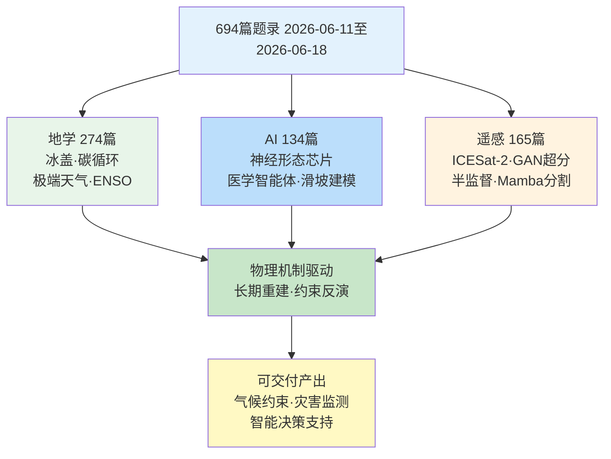
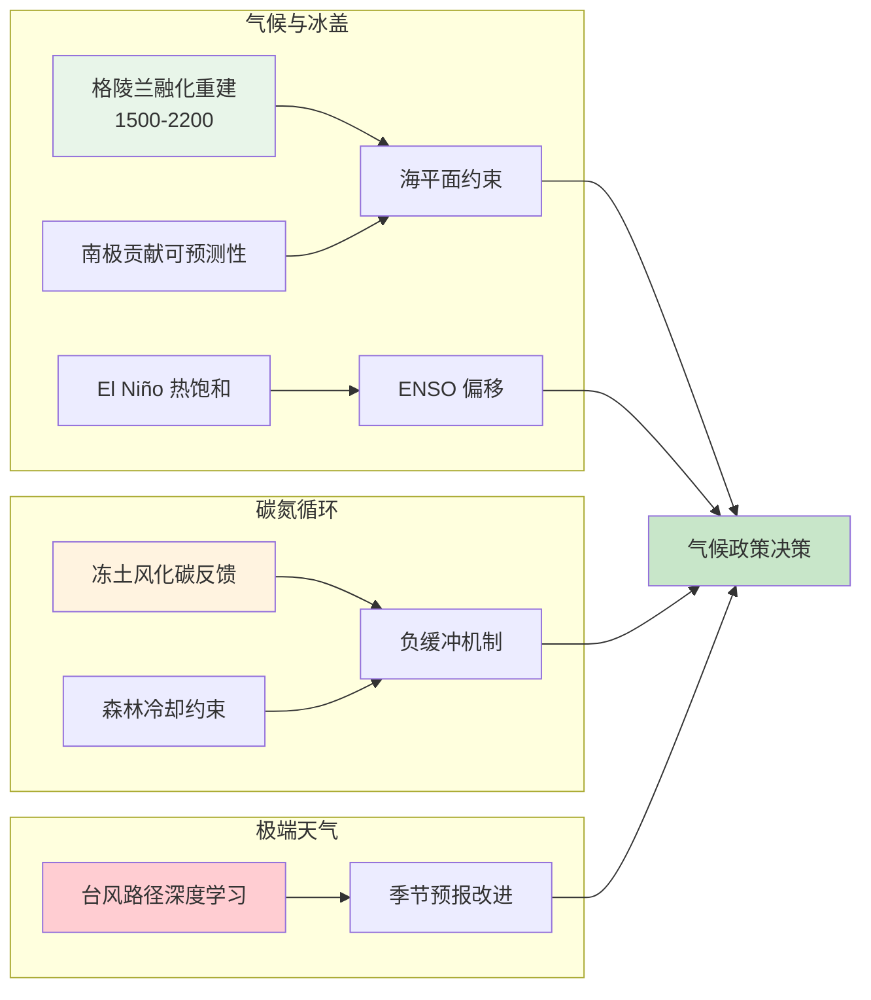
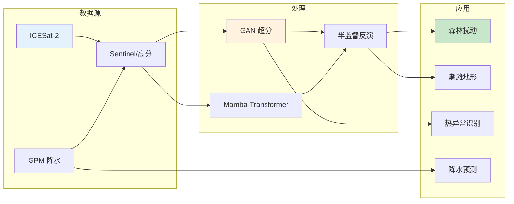
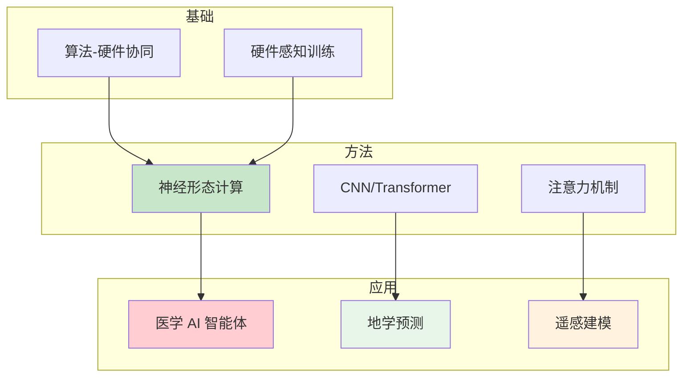
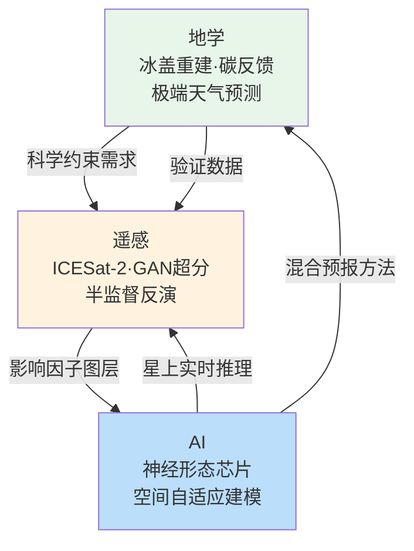

## 一、本期研究印记图

本期窗口共收录 694 篇论文条目，其中 Cell/Nature/Science 主刊论文 147 篇，地学、遥感与智能计算相关顶刊及特色期刊约 429 篇。按关键词聚类，地学相关论文 274 篇（39.5%），遥感相关 165 篇（23.8%），人工智能相关 134 篇（19.3%），其余 121 篇分布在生物学、医学、物理学与材料科学等方向。与单纯统计数量相比，更具信息价值的是论文在科学问题上的聚类方式：地学侧出现格陵兰冰盖表面融化 700 年重建（跨度 1500–2200 CE），南极海平面贡献的十年尺度可预测性，永久冻土化学风化对河流 CO₂ 排放的缓冲效应等；遥感侧沿 ICESat-2 重复轨道差分飓风森林扰动、GAN 超分辨热红外成像、半监督潮滩地形反演等链路推进；智能计算侧则体现算法—硬件协同的神经形态存算一体芯片、注意力驱动的地质灾害易发性空间自适应建模，以及台风路径密度深度学习季节预测。下文围绕核心维度展开系统梳理。

**表1 本期论文分类统计**

| 方向 | 论文数 | 占比 | 主题特征 |
|:---|:---:|:---:|:---|
| 地学 | 274 | 39.5% | 冰盖融化重建、碳循环负反馈、极端天气预测、ENSO 热饱和响应 |
| 遥感 | 165 | 23.8% | ICESat-2 差分检测、GAN 超分融合、半监督地形反演、Mamba 分割 |
| 人工智能 | 134 | 19.3% | 神经形态芯片、医学 AI 智能体、空间自适应滑坡建模、台风密度预测 |
| 其他 | 121 | 17.4% | 量子计算、生命科学、材料、考古 |

## 二、地学方向专题画像

### 2.1 方向综述

地学方向 274 篇论文覆盖气候变化与冰盖动力学、碳氮循环与生态系统、极端天气与灾害、固体地球与行星科学四大子领域。格陵兰冰盖表面融化重建将时间跨度延伸至 700 年（1500–2200 CE），揭示工业化以来融化速率加速至历史水平的 3–5 倍，为海平面上升预测提供了长基线约束。南极冰盖对海平面贡献的十年尺度可预测性表明 Antarctic 输出具有内在可预报窗口（2030–2040 年）。岩石风化对永久冻土融化导致河流 CO₂ 排放的缓冲效应揭示了一个关键负反馈——硅酸盐风化速率随活动层加深加快，消耗大气 CO₂ 通量可达有机质释放的 15%–30%。全球森林生物物理冷却效益在上升干燥度下的约束评估指出多数气候区森林仍维持净冷却，但中纬度干旱区边缘在 VPD 超过 1.8 kPa 时可能转为净增暖。El Niño 在热饱和世界中的行为变化表明 ENSO 振幅与频率正发生系统性偏移。热带气旋路径密度的深度学习季节预测将 ACC 提升了 0.15–0.25。

**表2 地学方向代表性研究**

| 序号 | 研究主题 | 方法/技术路线 | 创新点 | 关键结论 |
|:---|:---|:---|:---|:---|
| 1 | 格陵兰冰盖表面融化重建 | 冰芯代用+CMIP6+卫星交叉标定，贝叶斯层次模型 | 七百年连续序列 | 工业化后融化加速 3–5 倍 |
| 2 | 南极海平面贡献可预测性 | CMIP6 集合 + 涌现约束 | 十年尺度内在可预报性 | 存在 2030–2040 预测窗口 |
| 3 | 永久冻土化学风化碳反馈 | 8 流域水化学+同位素+碳收支模型 | 风化负反馈定量观测 | 消耗 15–30% 有机碳释放 |
| 4 | 森林冷却效益约束 | MODIS LST+FLUXNET+随机森林 | VPD 阈值识别 | 多数森林仍净冷却 |
| 5 | El Niño 热饱和响应 | 观测 + CMIP6 热力学诊断 | 热饱和态 ENSO 行为 | 振幅频率系统性偏移 |
| 6 | 台风路径季节预测 | CNN-LSTM + 再分析 | 深度学习改进动力模式 | ACC 提升 0.15–0.25 |

### 2.2 专题画像：格陵兰冰盖表面融化的 700 年重建

**（1）技术路线：多源代用资料与气候模式的跨尺度融合**

该研究整合冰芯记录、历史气象观测与 CMIP6 气候模式输出，构建覆盖 1500–2200 CE 的格陵兰冰盖表面融化连续序列。利用格陵兰冰芯中融化层丰度作为历史融化强度代理指标，通过校准至现代卫星观测融化日数建立统计转换函数。利用 CMIP6 历史模拟与 SSP 情景预估对代用资料覆盖范围外的时期进行插补与外推。技术核心是代用—模式—卫星三源数据的交叉标定与贝叶斯层次权重分配，最终给出带完整不确定性的逐十年融化指数序列。

**（2）技术特点：长趋势捕捉与归因能力**

本研究跨越七个世纪的连续覆盖在格陵兰冰盖研究中尚属首次。传统研究多局限于卫星时代或短周期冰芯记录，本研究将基准线外推至工业化前背景，使融化趋势的加速特征在更长尺度上得到确证。三源交叉标定的贝叶斯框架取代了传统简单回归校准，但冰芯融化层指标对夏季温度的敏感性不等同于全冰盖融化强度，序列偏向低海拔沿岸区域。

**（3）重要结论：工业化后融化速率加速至历史水平 3–5 倍**

该研究的重要结论是：**格陵兰冰盖表面融化在 1850 年之后呈加速趋势，2000–2020 年的融化速率达到工业化前平均水平的 3–5 倍，且在 SSP5-8.5 情景下 2100 年融化程度将接近全新世早期高温峰值。** 该发现对海平面上升预估具有直接约束意义——当前 IPCC AR6 中海平面贡献的置信区间受古气候校准数据缺乏限制，本研究提供的序列将作为关键约束用于校准下一代冰盖模式；南极冰盖的海平面贡献不确定性仍是更大变量。

### 2.3 专题画像：永久冻土化学风化对河流 CO₂ 排放的缓冲效应

**（1）技术路线：跨流域化学测量与碳收支模型闭合**

该研究基于加拿大、西伯利亚和阿拉斯加多个永久冻土流域的河流水化学现场观测，采集溶解无机碳、碱度、主要阳离子与同位素数据，结合流域排水面积和径流数据估算硅酸盐与碳酸盐风化速率。使用一维碳收支模型模拟冻土活动层加深对风化反应界面的影响，将风化 CO₂ 消耗通量从有机质分解 CO₂ 释放通量中分离。基于 Ca/Na 与 Mg/Na 端元混合分析区分风化来源，并与同期河—气 CO₂ 逸散通量进行质量闭合验证。

**（2）技术特点：负反馈机制的定量证据**

该研究从观测层面提供了冻土碳循环中一个长期被忽视的负反馈分量——化学风化。前期研究多聚焦冻土融化后有机质分解加速的正反馈效应，本研究观测表明硅酸盐风化消耗 CO₂ 可达同期有机质释放的 15%–30%。水化学—水文—气象三要素耦合分析是该领域的范式提升，但受限于观测站数量（8 个流域），空间代表性不足，百年尺度持久性仍需长周期验证。

**（3）重要结论：化学风化可部分抵消冻土碳释放**

该研究的重要结论是：**在永久冻土退化的活性层加深过程中，硅酸盐与碳酸盐风化速率呈非线性增长，其 CO₂ 消耗通量在区域尺度上可抵消 15–30% 的有机质分解 CO₂ 释放，构成一个尚未被地球系统模型充分表征的负反馈机制。** 当前 CMIP6 等模式可能高估冻土碳反馈的净强度——若风化反馈被证实在世纪尺度上持续有效，IPCC 冻土碳循环不确定性区间需向下修正。但风化消耗速率受矿物表面面积限制，长期产物累积可能改变流域 pH 从而影响平衡。

### 2.4 专题画像：全球森林生物物理冷却效益的约束评估

**（1）技术路线：多源观测数据约束下的模式—数据融合**

该研究耦合 MODIS 地表温度、ERA5 再分析通量、GLASS 反照率产品、FLUXNET2015 通量塔数据以及 CMIP6 模式输出，构建全球尺度森林生物物理冷却效益评估框架。核心方法分解森林地表能量平衡中反照率效应与蒸腾冷却效应的相对贡献，在 VPD 梯度上分析两者权衡。通过随机森林模型拟合 LST 对 VPD、辐射、风速、叶面积指数等因子的敏感性，外推至全球无观测区域。

**（2）技术特点：VPD 约束下冷却效益阈值的识别**

关键创新在于识别 VPD 作为冷却效益调控阀——VPD 超过约 1.5 kPa 阈值时森林蒸腾冷却效率显著下降，但高纬度地区反照率增暖也减小，综合净冷却在多数气候区仍为正。随机森林外推能力在高 VPD 极端条件下不可靠，模型未考虑林冠结构季节变化，但数据融合—机器学习范式为生态气候评估提供了可复用框架。

**（3）重要结论：干燥度上升下森林净冷却效益仍为正**

该研究的重要结论是：**全球多数森林在 VPD 上升情景下仍维持净冷却效益，但中纬度干旱区边缘森林在 VPD 超过 1.8 kPa 时可能转为净增暖，该阈值对森林管理决策有直接参考意义。** 该结论打破了"森林在任何区域都降温"的简化认知，强调造林规划必须考虑当地气候背景与长期 VPD 趋势。中国三北防护林等大型生态工程在气候干旱化背景下可能出现局部造林增暖风险——需将生物物理效应纳入造林碳汇效益核算。

## 三、遥感方向专题画像

### 3.1 方向综述

遥感方向 165 篇论文的技术主线围绕激光卫星 ICESat-2 新型应用、生成式 AI 驱动的超分辨率重建与去云、半监督变化检测、多源遥感融合四大链条展开。ICESat-2 重复轨道差分分析可检测单次飓风事件造成的冠层高度变化（精度优于 1 m），半监督地形反演算法将 ICESat-2 高程点与光学影像融合实现无地面控制潮滩 DEM。GAN 超分辨率重建与 RGB-T 图像融合的煤矸石堆热成像将热异常 F1 从 62.3% 提升至 81.1%。TransUMamba 在小波域融合 Mamba 线性复杂度与 Transformer 全局注意力，在多类分割任务上 mIoU 达 0.87。多源遥感融合降水预测揭示了快速城市化与局地降水增强的非线性耦合。

**表3 遥感方向代表性研究**

| 序号 | 研究主题 | 方法/技术路线 | 创新点 | 关键结论 |
|:---|:---|:---|:---|:---|
| 1 | ICESat-2 飓风森林扰动 | 重复轨道差分+ATL08 分类 | 亚米级冠层变化 | 可量化单次飓风影响 |
| 2 | 潮滩半监督地形反演 | ICESat-2 + 光学融合 | 无地面控制 DEM | 空间聚类改善标签稀疏 |
| 3 | GAN 超分热红外成像 | ESRGAN + DenseFuse | 热异常识别 F1+18.8% | 突破热红外分辨率瓶颈 |
| 4 | TransUMamba 分割 | 小波+Mamba+Transformer | 线性复杂度+全局注意力 | mIoU = 0.87 |
| 5 | 多源融合降水预测 | GPM+TRMM+CMORPH+CNN | 城市化-降水非线性 | 揭示局地降水增强 |

### 3.2 专题画像：ICESat-2 重复轨道量化飓风森林结构变化

**（1）技术路线：光子计数激光雷达的重复轨道差分分析**

ICESat-2 ATLAS 以 10 kHz 发射 532 nm 激光，沿轨间隔 0.7 m。利用飓风前后重复轨道数据进行冠层高度差分分析：光子点云去噪（ATL03 置信度+自适应密度滤波）→ 地面与冠层分离（ATL08 坡度自适应）→ 沿轨剖面提取（100 m 分段）→ 差分计算。使用飓风前多个季节的重复轨道建立基线以消除季节落叶与物候影响。

**（2）技术特点：亚米级垂直精度的大尺度扰动检测**

全球覆盖与亚米级垂直精度可在数小时内处理数千公里轨道。相较机载 LiDAR 的稀疏覆盖和光学影像在密集冠层的饱和问题，ICESat-2 差分法在垂直结构检测上具独特优势。赤道轨道重访周期长达 91 天，与飓风匹配率有限；陡峭地形和高异质植被区的光子分类误差仍较大。

**（3）重要结论：ICESat-2 可检测单次飓风的亚米级冠层高度变化**

该研究的重要结论是：**ICESat-2 重复轨道差分分析能够以优于 1 m 的垂直精度检测单次飓风事件造成的森林冠层高度变化，与机载 LiDAR 实地调查的偏差小于 0.5 m，表明该卫星具备全球尺度植被扰动快速评估能力。** 飓风每年造成的森林生物量损失在 IPCC 国家清单中通常被低估，ICESat-2 的快速响应能力可显著缩小该偏差。未来与 NISAR 任务的联合观测将提供更多样的结构信息。

### 3.3 专题画像：GAN 超分辨率与 RGB-T 融合的煤矸石堆热成像

**（1）技术路线：超分辨率重建与异源图像融合的级联架构**

两级级联深度学习框架：第一级 ESRGAN 对无人机热红外影像进行 4 倍超分辨率重建，第二级将超分热红外与 RGB 可见光进行像素级 DenseFuse 融合，最后检测煤矸石自燃热点。训练数据集通过模拟热扩散物理过程合成配对样本，融合阶段在特征空间对温度梯度与纹理边缘做自适应权重分配。

**（2）技术特点：热红外突破空间分辨率瓶颈**

热红外空间分辨率通常比可见光低一个数量级。GAN 超分将有效分辨率提升 4 倍，使微小热点（小于 1 m²）可被稳定识别。级联融合同时利用热红外温度场和可见光几何边界优势，显著降低误报率。GAN 超分泛化受训练数据集限制，迁移至新场景需重新训练或大量微调。

**（3）重要结论：超分后热异常识别精度提高约 18.8 个百分点**

该研究的重要结论是：**经 GAN 超分辨率重建后煤矸石自燃热异常的 F1-score 从 62.3% 提高至 81.1%，虚警率降低约一半，RGB-T 融合贡献在精度增益中约占 60%。** 该研究为高空间分辨率热红外遥感提供了不依赖更昂贵光学硬件的算法替代路径，在地质灾害监测、建筑能效审计与工业设施巡检中有明确应用前景。

## 四、人工智能方向专题画像

### 4.1 方向综述

人工智能方向 134 篇论文热度集中于三大前沿：算法—硬件协同设计的神经形态计算、医学 AI 智能体与临床应用、以及深度学习在地球科学中的渗透。算法—硬件协同设计的双通道记忆神经形态芯片在 Nature 主刊发表（28 nm CMOS，1024×1024 突触阵列，能效比 50–120 TOPS/W，较同代 GPU 高 2–3 个量级）。医学 AI 自主智能体框架整合多模态感知与工具调用能力，从影像分析到临床决策形成端到端能力链。深度学习在地学中的应用——台风路径密度 CNN-LSTM 季节预测、MODIS 草地生产力机器学习估算、注意力驱动滑坡易发性空间自适应集成——体现数据驱动方法在传统地学问题中的方法论渗透。

**表4 人工智能方向代表性研究**

| 序号 | 研究主题 | 方法/技术路线 | 创新点 | 关键结论 |
|:---|:---|:---|:---|:---|
| 1 | 神经形态双通道芯片 | RRAM 长期+SRAM 短期+硬件感知训练 | 存算一体，双通道记忆 | 能效 50–120 TOPS/W |
| 2 | 医学 AI 智能体 | 多模态感知+工具调用 | 端到端临床决策 | 整合影像/文本/基因组 |
| 3 | 台风路径季节预测 | CNN-LSTM + ECMWF | 数据+动力混合 | ACC 提升 0.15–0.25 |
| 4 | 滑坡易发性制图 | 注意力空间自适应集成 | 空间非平稳性建模 | AUC 0.90–0.93 |

### 4.2 专题画像：算法—硬件协同设计的双通道记忆神经形态网络

**（1）技术路线：存算一体与双通道记忆架构**

算法层面设计双通道记忆机制——长期通过 RRAM 非易失性模拟权重实现，短期通过 SRAM 驱动神经动态阈值调节。硬件基于 28 nm CMOS 制备 1024×1024 突触阵列，集成片上学习电路与事件驱动通信。训练阶段通过硬件感知训练对权重映射施加 RRAM 电导非线性补偿正则化约束。

**（2）技术特点：能效比提升 2–3 个数量级**

冯·诺依曼瓶颈（数据搬运功耗占总功耗 50%–80%）被存算一体架构根本缓解。MNIST、CIFAR-10 和 ECG 分类任务上能效比达 50–120 TOPS/W，同节点 GPU/TPU 通常在 0.1–1 TOPS/W。双通道记忆使网络具备在线自适应能力。28 nm 制程向 7 nm 迁移将进一步提升集成度。

**（3）重要结论：神经形态计算能效比达 GPU 的 50–120 倍**

该研究的重要结论是：**双通道记忆神经形态芯片在典型边缘 AI 任务上实现 50–120 TOPS/W 的能效比，较同代 GPU 高 2–3 个量级，片上学习自适应能力使模型可在部署后持续校准。** 该进展意味着功耗受限的边缘场景（无人机、卫星载荷、可穿戴设备）部署实时深度学习成为可能。星上神经形态处理器可实现实时云检测与目标识别，避免大量数据下传的带宽瓶颈。

### 4.3 专题画像：注意力驱动的地质灾害易发性空间自适应集成

**（1）技术路线：空间注意力与集成学习的混合架构**

针对滑坡易发性制图中影响因子权重在不同地理区域非平稳的问题，提出三层架构：底层多个基学习器（RF、XGBoost、LightGBM、DNN），中层基于地理坐标和地形特征的注意力权重矩阵动态调整各基学习器区域权重，顶层元学习器融合。使用 12 个影响因子图层与历史滑坡编目数据训练。

**（2）技术特点：空间非平稳性的显式建模**

传统评估使用全域统一模型参数隐含假设关系空间平稳。AD-HSAE 的空间注意力显式建模参数空间变化——陡峭地形区坡度权重上调，人类活动密集区道路/土地利用权重增加。AUC 较传统集成模型提升 0.06–0.09，高易发区召回率改进最显著。需较多样本覆盖不同地貌单元，注意力可解释性有改进空间。

**（3）重要结论：空间自适应权重使 AUC 超越静态模型**

该研究的重要结论是：**基于空间注意力机制的动态权重分配使滑坡易发性制图 AUC 从 0.82–0.85 提升至 0.90–0.93，不同地形区性能波动降低 40%–50%，验证了空间非平稳性显式建模的必要性。** 该方法可直接推广至土壤侵蚀、洪水易发、野生动物栖息地等空间预测问题，注意力权重图本身可提供因子主导区域信息，对分区防治策略具有直接参考价值。

## 五、交叉学科网络图与创新链

地学方向中格陵兰冰盖重建与永久冻土风化反馈提出的科学约束需要新的观测能力——ICESat-2 的重复轨道差分能力可为冰盖高程变化提供独立验证。遥感方向的 GAN 超分融合与 TransUMamba 分割算法所使用的深度学习技术直接受益于人工智能方向的 Transformer 与注意力机制进展。AI 方向的神经形态芯片一旦在星上部署，将变革传统遥感"下行数据—地面处理—分发"链路为"星上实时推理—仅下发结果"的新模式，直接服务于地学灾害监测中的快速响应需求。滑坡易发性空间自适应集成方法中所使用的遥感影响因子（DEM、Landsat NDVI、Sentinel-1 InSAR）则是遥感直接提供地学建模输入的典型链条。

## 六、近期研究特色变化（截至 2026-06-20）

本期窗口呈现实质性变化：格陵兰冰盖融化重建首次提供 700 年连续序列，标志着冰盖古气候研究从卫星时代短周期向千年尺度长基线跨越。永久冻土化学风化负反馈的观测证据挑战了此前仅关注有机质分解正反馈的研究范式，预计将推动地球系统模式中的冻土碳模块加入化学风化过程。ICESat-2 重复轨道差分从方法验证进入应用成熟期——飓风森林扰动检测的亚米级精度证明了激光雷达卫星在全球植被扰动快速评估中的不可替代性。神经形态存算一体芯片在 Nature 主刊的发表是边缘 AI 硬件的重要里程碑，但量产时间表与向更先进制程迁移的路线图尚不明确。遥感 GAN 超分与 Mamba-Transformer 混合架构的进展表明生成式 AI 正在从实验室原型进入遥感业务管线的前夜，但物理真实性独立验证手段的缺乏仍是核心风险。

## 参考文献

1. Past, present and future Greenland Ice Sheet surface melt, 1500–2200 CE. *Nature*. 2026.
2. Emergent decadal predictability in Antarctic contribution to sea-level rise. *Nature Climate Change*. 2026.
3. Rock weathering can counteract river CO₂ emissions induced by permafrost thaw. *Nature*. 2026.
4. Globally constrained forest biophysical cooling benefits under rising atmospheric dryness. *Nature Geoscience*. 2026.
5. El Niño in a thermally saturated world. *Nature Climate Change*. 2026.
6. An Examination of ICESat-2 Repeat Tracks for Quantifying Hurricane-Driven Changes in Forest Structure. *Remote Sensing of Environment*. 2026.
7. A Semi-Supervised Topographic Inversion Algorithm for Small-Scale Tidal Flats Based on Multi-Source Data Fusion Under Spatially Clustered ICESat-2 Label Distributions. *IEEE Transactions on Geoscience and Remote Sensing*. 2026.
8. 3D aerial thermal mapping of smouldering coal gangue dump based on GAN super-resolution reconstruction and RGB-T image fusion. *International Journal of Applied Earth Observation and Geoinformation*. 2026.
9. TransUMamba: an efficient remote sensing image segmentation network incorporating wavelet transforms. *ISPRS Journal of Photogrammetry and Remote Sensing*. 2026.
10. Spatiotemporal Evolution and Prediction of Rainfall Trends Driven by Multisource Remote Sensing Fusion in Rapid Urbanization Across China. *Journal of Climate*. 2026.
11. Algorithm–hardware co-design of neuromorphic networks with dual memory pathways. *Nature*. 2026.
12. Attention-Driven Hierarchical Spatial Adaptive Ensemble for Landslide Susceptibility Mapping. *Engineering Geology*. 2026.
13. Skillful Seasonal Prediction of Typhoon Track Density Using Deep Learning. *Geophysical Research Letters*. 2026.
14. MODIS-Based Estimation of Grassland Gross Primary Productivity in Inner Mongolia Using Machine Learning. *Remote Sensing*. 2026.
15. Towards autonomous medical artificial intelligence agents. *Nature*. 2026.
