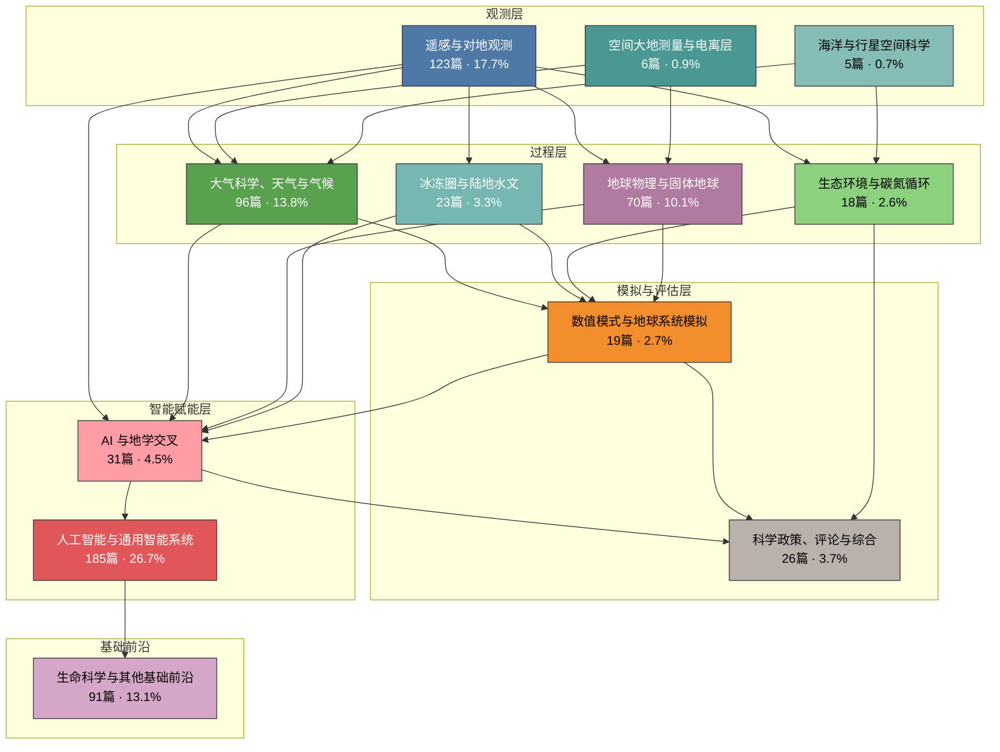
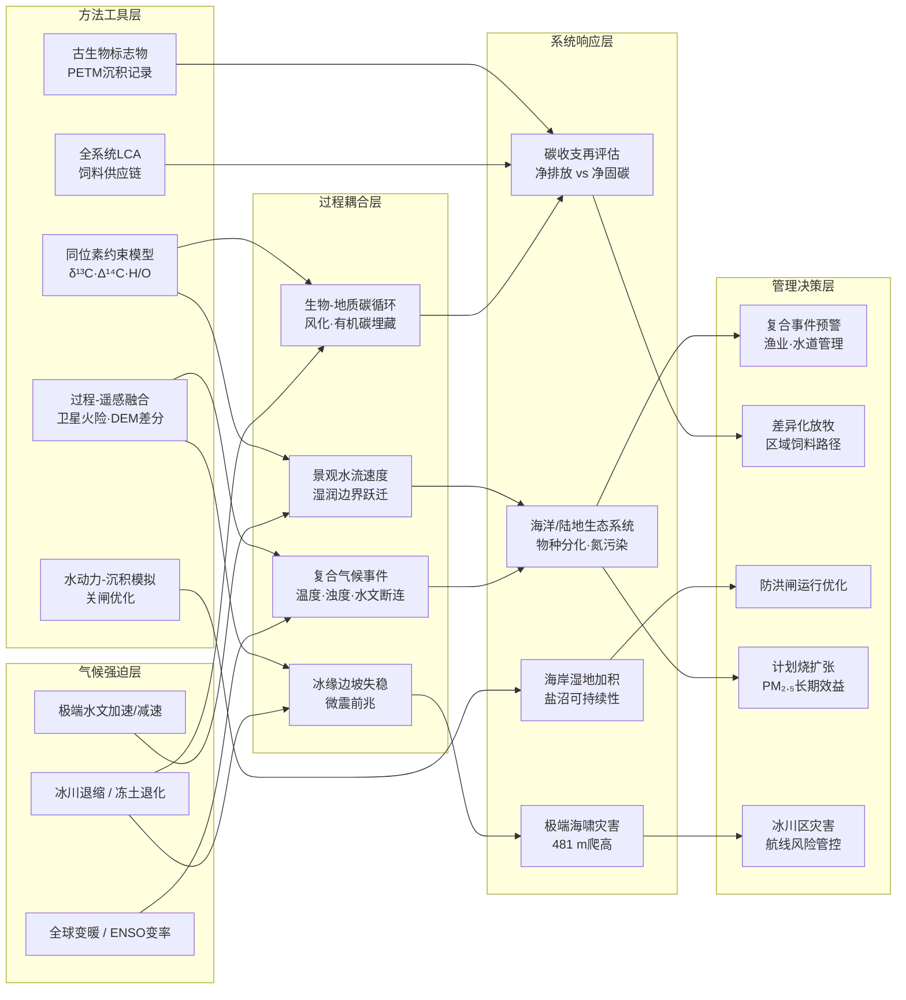
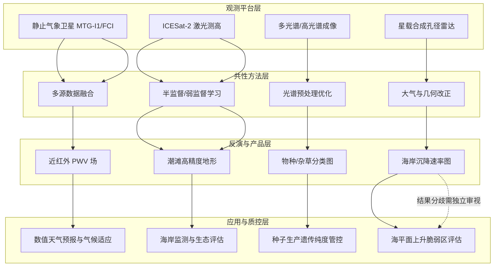
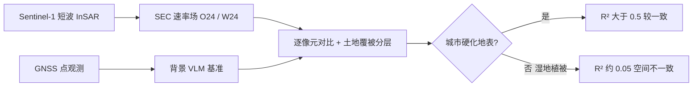
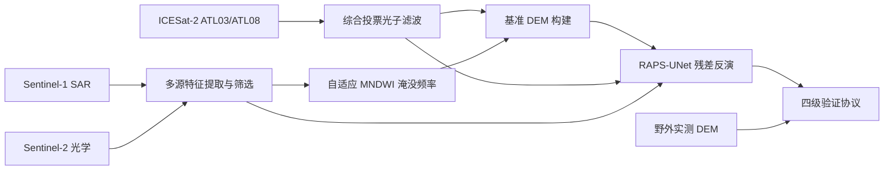
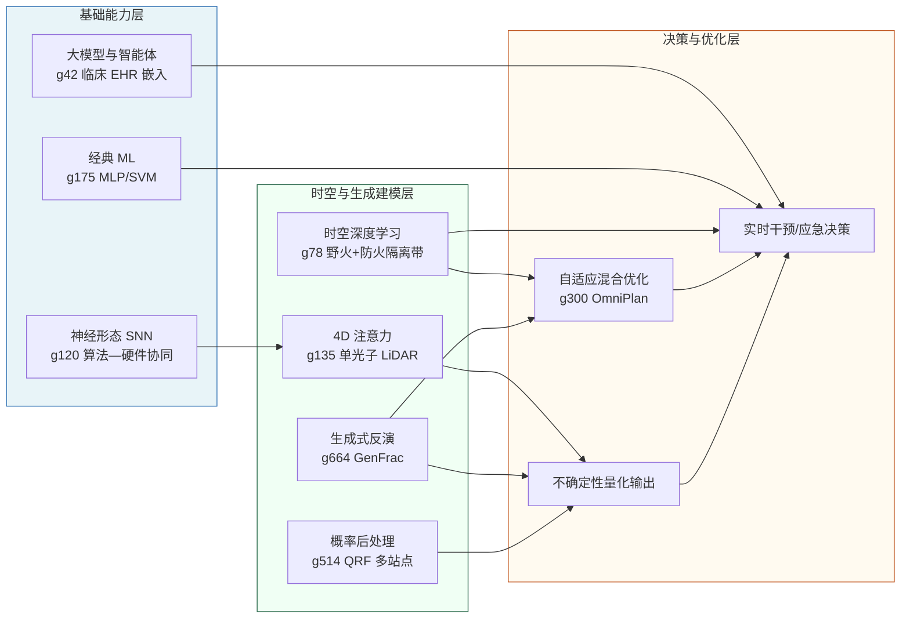
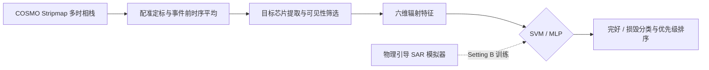
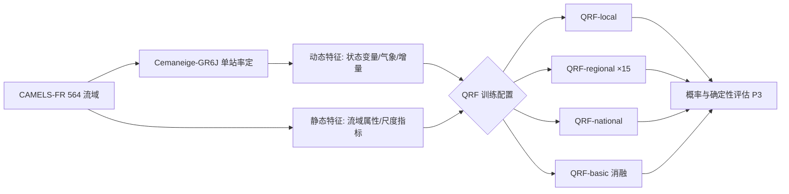
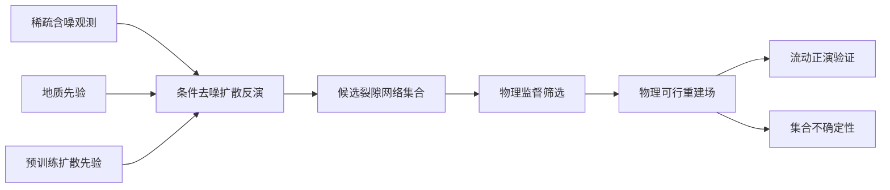
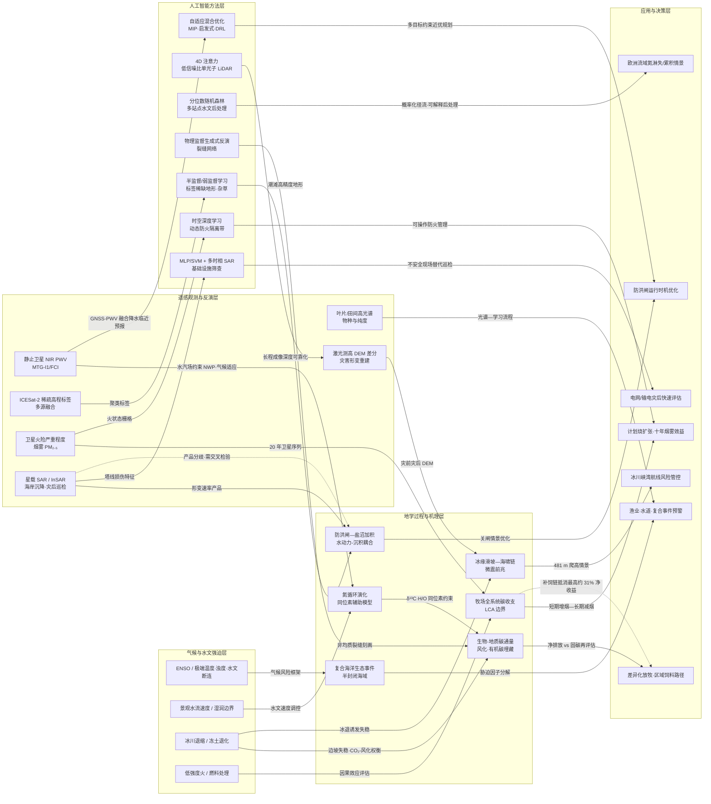

## 一、本期研究印记图

**报告日期：2026-06-22**

2026年6月下旬这一批文献呈现明显的“观测升级—机理深化—智能赋能”并行格局。对地观测方面，EarthCARE 自2024年5月发射后进入系统化在轨验证阶段：ESA 资料显示，全球已组织十余架次航空、船基与地面协同定标验证，PERCUSION 等 underflight 试验将 HALO 机载载荷与 ATLID、CPR 等产品进行对照，PollyNET 等地面激光雷达网络亦在矿物 dust、烟羽、海洋气溶胶等类型上开展 ATLID 廓线产品检验（[EarthCARE 全球定标验证](https://earth.esa.int/eogateway/success-story/global-earthcare-cal/val-effort-to-boost-mission-success)；[PERCUSION 验证论文](https://amt.copernicus.org/articles/19/3933/2026/)）。同期，SWOT 宽刈幅高度计继续推动亚中尺度海洋动力的可视化：基于 effective Surface Quasi-Geostrophic（eSQG）框架，研究者已由海面高度场重建 1000 m 以浅的垂直速度，并在 Agulhas 回流、南大洋等能量活跃区获得较传统高度计更强的 SSH 梯度与垂直交换信号（[SWOT 垂直混合](https://www.aviso.altimetry.fr/en/news/idm/2025/mar-2025-computing-vertical-mixing-from-swot-sea-surface-heights.html)；[亚中尺度全球动力](https://pmc.ncbi.nlm.nih.gov/articles/PMC12003163/)）。在本期题录中，遥感方向论文约占总量的 **17.7%**，大气与气候方向占 **13.8%**，二者共同构成地球系统观测与解释的主轴。

第二主线是极端环境变化与多圈层耦合机理。格陵兰冰盖五百年至未来的表面消融综述、复合干热事件、极端降水波动性、北极放大与平流层环流加速等研究，与 Tracy Arm 滑坡—海啸、能登半岛同震位移、410 km 间断面“滴状构造”等固体地球工作形成呼应，显示“慢变背景 + 突发灾害 + 深部过程”正被同一套多源观测网络同时约束。生态环境与碳氮循环方向虽仅占 **2.6%**，但城市化石燃料 CO₂ 主被动卫星联合反演、Amazon 气溶胶 regime 对能量—碳通量的调控、土壤碳固持的水文协同效益等题目，均指向“排放—暴露—反馈”链条的定量闭合需求。冰冻圈与陆地水文（**3.3%**）则聚焦积雪/冻土/水文签名、火灾后雪深变化与水库调控下的未来干旱等近端风险。

第三主线是人工智能向地球科学业务链的渗透加深。题录中 **AI 与地学交叉** 论文占 **4.5%**，典型路径包括：物理约束/物理告知深度学习（地震分辨率增强、Manning 摩擦反演、FY-4B 沙尘 AOD 临近预报）、生成式遥感（HLS-GPT 大陆尺度反射率重建、SAR 扩散生成）、遥感智能体范式（Remote Sensing Agent）以及 GNSS 深度强化学习定位改正。另有 **26.7%** 的 arXiv 预印本属于通用人工智能（智能体、VLA 机器人、GraphRAG、扩散语言模型等），其中 Kairos、Qwen-RobotWorld 等已开始 explicit 对接 Physical AI 与世界模型栈。与 **13.1%** 的生命科学/基础前沿及 **3.7%** 的政策评论文献并存，本期整体呈现“地学问题牵引观测与模拟、AI 提供跨尺度链接器、基础科学提供方法学与伦理边界”的多元生态。

### 分类统计表

| 方向 | 论文数 | 占比 | 本期亮点 |
| --- | ---: | ---: | --- |
| 遥感与对地观测 | 123 | 17.7% | 遥感智能体范式；HLS-GPT 全波段任意日期反射率重建；EarthCARE/ATLID 与 PollyNET 验证；WildfireCube 30 m/3 h 野火张量；SWOT 垂直速度重建 |
| 大气科学、天气与气候 | 96 | 13.8% | 格陵兰冰盖消融长期综述；大气河流全球传输网络；复合干热/干热并发；条件生成式 AI 气候预估；MTG-I1/FCI 可降水量反演 |
| 人工智能与通用智能系统 | 185 | 26.7% | LLM 智能体技能评估；VLA/机器人基础模型（Qwen 系列）；GraphRAG 与多跳推理；扩散语言模型；医疗/法律可信 AI 审计 |
| 地球物理与固体地球 | 70 | 10.1% | 2024 能登同震机载 LiDAR 三维位移；阿拉斯加 Tracy Arm 滑坡—海啸；410 km 间断面 drip tectonics；GenFrac 生成式裂缝反演 |
| 生命科学与其他基础前沿 | 91 | 13.1% | cryo-EM 激光相位板；Venus flytrap 细胞壁超快速软化；super-Earth/mini-Neptune 轨道 eccentricity 分化；胎盘 NAD⁺ 代谢分娩时钟 |
| AI 与地学交叉 | 31 | 4.5% | 波动方程先验扩散地震超分；Kairos 物理 AI 世界模型栈；MIPV-NWP-PINNs 光伏预报；物理告知 Himawari 小时吸收 AOD；ICESat-2 半监督潮滩地形反演 |
| 冰冻圈与陆地水文 | 23 | 3.3% | 瑞士 250 m 日尺度积雪数据集；火灾后山地雪深机载 LiDAR+ML；冻土 macropore 入渗实验；水库区未来水文干旱；AI 降雨—径流同化 |
| 数值模式与地球系统模拟 | 19 | 2.7% | Python+GPU 海冰模式 Veris；TGFS 嵌套网格积云参数化；OSNAP  overturning 模拟—观测对比；对流许可 RCM 水文 added value |
| 生态环境与碳氮循环 | 18 | 2.6% | 人体蛋白组空间图谱（>13000 蛋白）；城市 ffCO₂ 碳—氮协同反演；森林蒸散水分效率不对称下降；海洋碱度增强 runaway 沉淀 |
| 科学政策、评论与综合 | 26 | 3.7% | 气候影响归因方法学综述；Nature/Science 科研诚信与 AI 治理评论；drought 健康影响纳入经济评估；agentic coding benchmark 错位 |
| 空间大地测量与电离层 | 6 | 0.9% | GNSS RO 时间分辨率对实时电离层图影响；MADOCA-PPP 与 PPP-B2b 融合；ITM Na 过渡层长期激光雷达；PlanetiQ RO 电离层检验 |
| 海洋与行星空间科学 | 5 | 0.7% | Fram Strait/Barents Sea Opening  overturning 重组；IMAP 专刊；2024 强 geomagnetic storm LSTAD/TID 全球对比；年轻行星 UV 光谱综述 |

### 总览关系图

**读图提示：** 观测层（蓝—青色系）向过程层（绿—紫色系）输送约束；过程层汇入模式与评估层（橙色为模拟、灰色为政策评论）；**AI 与地学交叉**（浅红）是连接观测、过程与模拟的枢纽，并与 **通用 AI**（红色）及 **生命科学基础前沿**（粉紫）形成方法学与伦理外延。本期最显著的特征是：EarthCARE/SWOT 等新一代载荷进入“产品—验证—应用”阶段，同时生成式 AI 与智能体框架开始从算法论文走向可运行的地球系统工作流。

## 二、地学方向专题画像
### 2.1 方向综述

本期地学方向研究呈现鲜明的**多过程耦合**与**跨尺度归因**特征：气候强迫不再被简化为单一升温信号，而是与季风—厄尔尼诺/拉尼娜变率、景观水流速度、工程干预及地质风化等过程共同塑造生态系统与碳收支。热带半封闭海域（g675）表明，极端高温、脱水暴露、浊度与水文连通性四类复合胁迫的叠加，往往比单纯海温升高更能解释物种群落的分化响应；欧洲流域尺度研究（g610）则将氮循环演化主控因子从传统施肥输入拓展至**景观水流速度**及其"湿润边界"跃迁，揭示极端水文加速或减速可放大氮淋失与累积风险。古气候与现生碳循环研究形成对照：古新世—始新世极热事件（PETM）期间陆源有机碳向浅海沉积物的输送与埋藏可增强10—50倍（g142），而青藏高原冻土退化区则显示化学风化对河流CO₂排放的抵消可达约35%，在零散冻土流域甚至超过100%（g43），提示生物源与地质源碳通量需联合核算。

人地系统适应策略的**净效益评估**成为另一主线。全球牧场优化放牧强度理论上可额外固定约22亿吨CO₂当量/年，但饲料供应链、牲畜肠道甲烷及土地利用变化可使净气候收益削减最高约31%（g682），凸显自然气候解决方案必须置于全系统边界内评价。海岸硬工程（g653）与火管理（g658）亦呈现类似权衡：威尼斯Mo.S.E.防洪闸在保障城市安全的同时抑制潮汐淹没与矿物沉积，威胁盐沼垂直加积；加州低强度火（含计划烧）虽短期增加PM₂.₅，却可使极高强度野火概率下降约92%，十年累积烟雾暴露有望降低约10%。极端地质灾害方面，2025年阿拉斯加Tracy Arm冰退诱发的>6400万立方米滑坡产生481 m爬高海啸，创有记录以来第二高位移，且滑坡前数天已出现微震前兆（g694），为冰川退缩区灾害链预警提供新实证。

方法学上，本期工作普遍依托**过程模型—同位素约束—遥感/现场观测**的多源融合：从EcoTWIN同位素辅助氮模型、δ¹³C—Δ¹⁴C双碳同位素风化反演，到二十年卫星火险—烟雾因果推断及高分辨率数字高程差分重建，均强调将观测约束嵌入可解释机理框架，以支撑区域差异化管理与工程优化决策。

**技术路线对比表**

| 序号 | 研究主题 | 方法/技术路线 | 创新点 | 关键结论 |
|:---:|:---|:---|:---|:---|
| 1 | 热带半封闭海洋生态系统复合气候事件 | 长期生态监测与复合胁迫因子分解；结合季风、气旋、海平面与淡水输入等气候风险统一框架 | 将多胁迫交互简化为四类可量化驱动因子（极端温度、脱水、浊度、水文断连），突破"升温主控"范式 | 厄尔尼诺/拉尼娜调制下物种响应高度分化；北部澳大利亚气候变化路径与全国其他地区显著不同；河流取水威胁下游半封闭海域生态与渔业 |
| 2 | 全球牧场改良放牧强度的净气候效益 | 整合>200项研究、300个全球站点的根系碳输入数据；全系统排放模型耦合饲料供应链、国际贸易与牲畜肠道排放 | 首次在全球尺度量化"减牧+补饲"对碳封存净效益的抵消效应 | 优化放牧可额外固定约22亿吨CO₂当量/年（约占当前人为排放4%）；计入补饲与牲畜排放后净收益最高削减31%；效益高度依赖饲料来源与区域土地利用历史 |
| 3 | PETM期间陆源有机碳海洋埋藏增强 | 五个全球分布浅海站源特异性生物标志物记录；古气候模型对比 | 直接证实暖期陆源有机碳向海洋输送与埋藏的大幅增强，指出现有模型缺失重要碳汇路径 | 海岸沉积物中维管植物与土壤有机碳占比达40%—95%（现代为12%—20%）；埋藏通量可增加10—50倍；陆源有机碳海洋埋藏或为超长尺度（>1万年）气候恢复负反馈 |
| 4 | 海岸防洪闸后湿地韧性维持 | 威尼斯潟湖水动力数值模拟；野外校准的淹没深度—沉积速率关系；优化关闸情景对比 | 将城市防洪运行参数与盐沼矿物沉积、垂直加积过程定量耦合 | 现行关闸频率与时长以湿地生态为代价；微调关闸时机与持续时间可显著增加矿物沉积而不损害城市防洪效能 |
| 5 | 冻土融化河流CO₂排放的岩石风化抵消 | 青藏高原冻土退化梯度上CO₂排放、溶质浓度、δ¹³C—Δ¹⁴C双碳同位素与地球化学模拟 | 首次系统解耦冻土河流中生物源排放与地质源风化固碳的相互作用 | 冻土覆盖减少时河流CO₂排放下降、风化固碳上升；区域平均风化抵消约35%河流CO₂排放；零散/不连续冻土区可超100%；硅酸盐风化为主区抵消显著，硫化物风化区可能增排 |
| 6 | 景观水流速度梯度上的氮循环分化演化 | EcoTWIN v1.0同位素辅助模型；3821个欧洲流域1980年以来重建与2100年情景投影 | 提出"湿润边界"概念，将氮命运从施肥主导拓展至水文速度调控 | 氮循环演化自1980年以来与水流速度变化强相关；越界加速或减速放大氮淋失/累积；低排放情景下76%欧洲流域淋失减少，高排放情景下东欧与南欧风险上升 |
| 7 | 低强度火的空气污染效益 | 加州20年卫星火险严重程度与烟雾PM₂.₅；低强度火作为计划烧代理的因果效应评估 | 首次量化"短期增烟—长期减烟"权衡，将燃料处理纳入公共健康成本—收益框架 | 低强度火使极高强度野火概率立即下降约92%，效应持续约10年并延伸至周边5 km；十年期烟雾减排效益成本比超5；年处理约50万英亩可使十年累积PM₂.₅降低约10% |
| 8 | 阿拉斯加Tracy Arm滑坡—海啸灾害链 | 灾前灾后高分辨率DEM差分、地震记录、潮位计与现场调查；海啸数值模拟 | 完整重建冰退诱发滑坡—海啸全过程，揭示旅游航线高暴露风险 | 2025年8月10日>6400万m³滑坡产生481 m爬高海啸（历史第二）；初始破碎波高约100 m、速度>70 m/s；滑坡前数日出现微震前兆；若当时有邮轮位于峡湾上游后果严重 |

### 2.2 专题画像：Compound climate events threaten tropical semi-enclosed mari

**（1）技术路线：半封闭热带海域复合气候风险的长期观测—生态系统建模整合路径**

本研究以澳大利亚北部三类典型半封闭热带海洋系统——卡奔塔利亚湾（Gulf of Carpentaria）、约瑟夫·波拿巴尔特湾（Joseph Bonaparte Gulf）与托雷斯海峡（Torres Strait）——为空间载体，依托澳大利亚联邦科学与工业研究组织（CSIRO）在该区域逾五十年的连续生态与渔业调查档案，构建面向“海—气—陆—生物”耦合过程的复合气候风险评估框架。研究对象覆盖海草床、红树林等关键生境，以及锯鳐、儒艮、海龟、短吻海豚等受威胁物种，同时纳入北澳对虾渔业（Northern Prawn Fishery）中的褐虎对虾、沟槽虎对虾、香蕉对虾，以及尖吻鲈、泥蟹、龙虾等商业与生态指示类群。与以海表温度（SST）单因子解释温带海域生物地理变迁的惯常范式不同，作者将全球变暖、热带气旋、季风降水、河流淡水输入、海平面波动及环流变率视为可叠加、可累积的复合强迫，而非彼此独立的背景噪声。

在方法路径上，研究团队采用与气候过程显式耦合的种群—渔业评估模型，以及中等复杂度生态系统评估模型（Models of Intermediate Complexity for Ecosystem assessments, MICE），将长期丰度序列、渔获统计、栖息地状态与区域气候指标进行联合拟合。分析步骤遵循“气候强迫识别—物理生境响应—物种丰度归因—空间格局重组”的递进逻辑：首先刻画 ENSO（厄尔尼诺—南方涛动）位相转换、气旋频度与强度、河流径流异常及海平面起伏对浅水半封闭海域水文连通性的调制；继而量化极端高温、脱水暴露（低潮或水位下降导致的搁浅与失水胁迫）、水体浊度升高及水文断连（河流—沿岸—外海连通受阻或改道）四类核心胁迫因子对个体存活、幼体补充与栖息地质量的联合效应；最后通过多物种对比实验设计，检验同一气候事件组合对不同生活史策略类群的差异化响应。验证方式倚重长时间尺度上的“自然实验”：以二十世纪末（约1998—1999年）前后物理环境阶跃变化为参照，将模型预测的丰度趋势与独立观测的渔业与生态监测记录进行交叉比对，并借助物种间对照（如栖息地需求狭窄的褐虎对虾与耐受性较强的沟槽虎对虾）检验归因链条的稳健性。

**（2）技术特点：超越海温单因子范式的复合事件四维归因框架**

本研究的核心创新在于将热带半封闭海洋生态系统从全球气候影响评估中的“认知盲区”提升为可操作的复合风险对象，并明确提出海洋增温并非必然主导热带海域生态系统演变的判断。传统温带与副热带研究往往以纬度向极迁移、SST 梯度变化解释物种分布重组；而北澳半封闭海湾受陆地地理屏障约束，许多物种缺乏向南寻找“气候避难所”的通道，气候响应无法套用“随温而动”的简单框架。作者将复杂、累积的复合气候影响凝练为极端温度、脱水暴露、浊度与水文连通性四维因子，在保持机理解释力的同时降低了多强迫并存场景下的归因维度，为渔业管理与保护规划提供了可监测、可预警的指标集合。

与仅关注极端热浪或单一洪水事件的灾害研究相比，该框架强调强迫因子的时序叠加与位相依赖：拉尼娜期增强的季风降水、气旋扰动与河流输入可同时损害海草幼体栖息地并抬升沉积浊度，而厄尔尼诺期的干旱与低海平面则通过切断河流—海洋连通威胁依赖淡水脉冲的红树林、锯鳐与红腿香蕉对虾等类群。研究亦揭示了同一气候位相对不同物种的“赢家—输家”分异，例如褐虎对虾因狭窄的温度与海草栖息地需求被冠以“金发姑娘”（Goldilocks）物种标签，自二十世纪九十年代末以来在捕捞压力已降低的背景下仍未能恢复历史丰度；而普通香蕉对虾与红腿香蕉对虾在有利径流条件下可显著受益。主要局限在于：半封闭热带系统的空间异质性与数据稀缺性仍制约模型空间显式分辨率；四维因子框架是对高维过程的工程化简，尚未完全闭合所有生物相互作用路径；研究区域集中于澳大利亚北部，向其他热带半封闭海域（如东南亚浅海、加勒比 enclosed bays）外推时需结合当地季风—河流—潮汐体系重新标定参数。

**（3）重要结论：复合气候波动驱动热带海洋生态系统的物理—生物体制转换**

该研究的重要结论是：**热带半封闭海洋生态系统正遭受复合气候事件驱动的大幅、 prolonged 环境波动，暴露其中的物种于更陡峭、更持久的环境起伏之中，导致空间分布格局重组并削弱持续水文连通性；物种丰度变化应归因于极端温度、脱水暴露、浊度异常与水文断连的复杂累积组合，而非全球海洋变暖单一主控因子；在澳大利亚北部已观测到气候诱发的物理与生物体制转换（regime shift）证据，其机制与启示可延伸至全球同类系统。** 具体而言，约1998—1999年前后区域气候格局的阶跃变化（拉尼娜事件增多、罗珀河（Roper River）等河流径流偏高、气旋强度上升）与海草床衰退、褐虎对虾持续减产在时间上高度耦合；气旋致海草机械损伤与洪水携沙沉积共同压缩幼体保育栖息地，叠加升温胁迫，解释了渔业管理减负后仍难复苏的反常现象。与此同时，厄尔尼诺期干旱—低海平面组合对依赖河口连通的类群构成截然不同的威胁谱，表明复合事件的方向性与物种生活史密切绑定。

影响与意义

在学科层面，该工作为“复合极端事件”（compound climate events）海洋生态学提供了热带半封闭系统的实证范式，推动气候影响评估从海温中心论转向连通性—暴露度—浊度—温度的多维风险叙事。在工程与管理层面，北澳对虾渔业可在虎对虾与香蕉对虾之间建立环境条件驱动的品种切换策略，保护机构可依据 ENSO 预报提前部署对濒危大齿锯鳐等物种的干预措施；全球河流与沿岸水资源调配亦需将下游半封闭海域生态连通性纳入取水与筑坝决策。后续研究边界包括：发展更高空间分辨率的耦合物理—生物模型以刻画湾内局地异质性，在东南亚与印度洋同类半封闭海域开展对照验证，并将体制转换早期信号纳入热带渔业收获策略与海洋保护区网络动态调整机制。

### 2.3 专题画像：Assessing the net climate benefits of improved grazing inten

**（1）技术路线：全球牧场系统级碳收支耦合评估**

本研究面向全球天然牧场（rangeland）体系，将“改善放牧强度”从局地土壤固碳措施提升为跨尺度气候效益核算问题。研究对象覆盖全球广泛分布的草地放牧系统，核心假设是：在退化或过度放牧区域降低放牧压力，可促使植被恢复并提高土壤与植被碳库；但若同期需维持畜产品产量，则往往依赖外源精饲料补饲，从而把排放影响延伸至饲料种植、加工、运输及国际贸易链条。据此，作者构建了一条“碳汇潜力—生产约束—供应链排放”联立评估路径，而非仅报告牧场表面的二氧化碳固定量。

在数据与模型层面，研究整合经验性土壤碳模型、牲畜温室气体排放模块，以及国家级饲料排放强度参数，用以刻画不同国家与地区的补饲来源及其碳足迹差异。土壤碳模块侧重量化放牧强度调整对土壤与植被碳蓄积的近期（near-term）响应；牲畜模块则计入肠道发酵甲烷、粪肥管理及相关过程排放；饲料模块将玉米、大麦、燕麦、大豆等作物的生产、土地利用变化（含毁林开垦）及跨境贸易纳入核算边界。斯坦福可持续发展学院公开解读指出，该工作据称为迄今对全球牧场放牧管理气候效应最全面的评估之一，其方法学要点在于把牧场管理干预与全球饲料供给网络显式耦合。

实验设计与分析步骤上，研究首先在全球尺度估算“改善放牧强度”情景下的潜在二氧化碳当量（CO₂eq）蓄积能力，再在维持牲畜产量约束下引入补饲需求，计算系统净减排潜力及其空间异质性。验证与不确定性处理体现在对碳汇估计给出 ±0.43 Gt/CO₂eq 等量纲误差，并在补饲维持产量情景下报告 2%–31% 的净效益折减区间。分析还区分区域饲料来源结构差异——例如欧洲大量进口南美饲料而伴随毁林相关碳释放、美国中西部饲料因历史土地利用转换已完成而相对低碳——以解释同一放牧干预在不同地缘经济条件下净效益分化。整体路径强调：气候效益评估必须同时满足生态恢复逻辑与农牧业系统生产逻辑，否则易高估自然基于解决方案（nature-based climate solution）的可交付减排量。

**（2）技术特点：从单点固碳核算到农牧供应链全链条权衡**

该研究的首要创新，在于将全球牧场土壤—植被固碳潜力与牲畜部门约 15% 量级的人为排放背景相对照，并显式处理“减产—补饲—增排”这一在以往牧场气候文献中常被弱化的反馈链。传统评估多聚焦放牧强度与土壤有机碳（SOC）或净生态系统交换（NEE）的局地关系，对维持肉奶产量所需外源饲料的间接排放、跨境贸易引致的土地利用变化排放关注不足。本工作以系统级排放模型将上述环节纳入同一核算框架，从而揭示：牧场干预的“账面碳汇”与“可计入国家/全球净减排账本”的净效益之间可能存在显著落差。

相较仅报告潜力上限的元分析或情景研究，本研究的优势在于全球覆盖、多过程耦合与政策相关的不确定性表达。其将植物生产力变化、牲畜直接排放、饲料需求与生产约束并列建模，使结果能够回答“若畜牧业供给不能下降，改善放牧是否仍具净气候收益”这一工程与政策关键问题。公开资料亦指出，不同牧场区域呈现高度异质的权衡关系：在部分区域，降低放牧并依赖补饲甚至可能导致净排放上升，而非净下降。这一发现对“一刀切”式放牧减排方案具有纠偏意义，也为区域差异化气候行动提供了空间分辨依据。

局限同样清晰。土壤碳响应依赖经验模型与全球参数化，对极端气候事件、火灾、干旱—放牧交互等非平稳过程的刻画仍受数据与机理约束；饲料排放强度按国家尺度汇总，难以完全反映农场级管理差异与新兴低碳饲料技术；维持产量假设将复杂的社会经济选择（消费结构转变、品种改良、草地混播等）简化为补饲路径，可能低估或高估特定区域的替代方案。此外，碳汇持久性、可逆性与监测核验（MRV）问题在摘要层面未充分展开，意味着工程落地仍需与实地观测网络、牧场碳管理工具（如区域尺度 SOC 与生产力耦合平台）及长期生态实验交叉验证。总体而言，其价值不在于给出单一“最优放牧强度”，而在于建立了可复用的全球系统核算范式，并警示忽视供应链效应将系统性高估牧场气候贡献。

**（3）重要结论：全球牧场改良的净减排潜力与补饲折减效应**

该研究量化表明，在全球牧场实施改善放牧强度措施，近期可带来约 2.2 ± 0.43 Gt/CO₂eq 每年的碳蓄积潜力，约合当前全球年人为排放的约 4% 量级，说明牧场管理在气候议程中具备不可忽视的体量。然而，一旦为维持牲畜产品产量而引入饲料补饲，系统净减排效益将下降 2%–31%，对应净潜力约 1.8 ± 0.45 Gt/CO₂eq 每年。研究进一步指出，忽视植物生产力变化、牲畜排放、饲料需求与生产约束等系统级影响，可能显著高估改善放牧的全球气候收益；在部分区域，补饲相关的土地利用变化与贸易隐含排放足以抵消甚至超过牧场固碳收益，呈现“局地增汇、全球增排”的风险格局。

该研究的重要结论是：**改善全球牧场放牧强度虽具可观的近期碳汇潜力，但在维持畜牧业产出的现实约束下，饲料供应链与土地利用变化相关排放将显著侵蚀净气候效益，忽略系统级核算会实质性高估该路径的可交付减排量。**

**影响与意义**

对地球系统科学与农牧业遥感领域而言，该结论要求将牧场碳循环监测从“草地表层”拓展至“草地—牲畜—农田—贸易”耦合系统，推动多源遥感（植被生产力、土地利用变化、饲料作物扩张）与排放清单、生命周期评价（LCA）数据同化。对政策与工程实践而言，气候行动不宜将全球牧场改良视为与消费或贸易脱钩的独立减碳工具，而应配套区域饲料低碳化、毁林防控、畜产品需求管理或产量维持替代技术；后续研究需在牧场尺度 MRV、动态草地管理（如轮牧与适应性放牧）及非补饲产量维持路径上细化情景，以缩小全球模型与局地可持续管理之间的认知鸿沟。

### 2.4 专题画像：Enhanced marine burial of terrestrial organic carbon through

**（1）技术路线：源特异性生物标志物与三端元混合模型联动的陆源有机碳源—汇重建**

本研究以古新世—始新世极热事件（Palaeocene–Eocene Thermal Maximum, PETM，约 56 Ma）为天然气候实验场，围绕“陆地有机碳经侵蚀—输运—埋藏进入浅海沉积物”这一源—汇链条，构建“沉积记录—分子指纹—通量定量—气候机制”的交叉验证框架。数据层面，作者整合并新测五个全球分布的浅海 PETM 剖面：美国新泽西陆缘（Ancora, Site 174AX）、坦桑尼亚 TDP Site 14、丹麦 Fur 组、塔斯曼海 ODP Site 1172 与北极高纬度 IODP Site 302（ACEX）。样品经冷冻干燥与均质后，采用微波辅助萃取或加速溶剂萃取获得总脂类提取物，再以气相色谱—串联质谱（n-烷烃）与高效液相色谱—质谱（brGDGTs）分别测定短链与长链 n-烷烃、支链/异戊二烯类甘油二烷基甘油四醚（brGDGTs）及 Crenarchaeol 等分子组成。所有剖面均选取热成熟度较低、适合有机地球化学解释的层段，并以碳优势指数（CPI）等指标约束有机质未经历强烈热蚀变。

在端元划分与源解析上，研究不再将“陆源有机碳”视为单一均质库，而是利用陆—水比值（TAR，长链 C27–C35 与短链 C15–C19 n-烷烃之比）表征维管植物来源，以支链/异戊二烯四醚指数（BIT，brGDGTs 相对 Crenarchaeol）表征土壤细菌来源，并辅以 #ringstetra 等环化指标判别 brGDGTs 是否存在河流或海洋原位贡献。基于现代泥炭、土壤、远端海洋沉积物与维管植物端元统计（含 95% 置信区间），建立土壤—维管植物—海洋三端元混合模型，通过非负最小二乘求解各端元对总有机碳（TOC）的分数贡献，并在现代海岸沉积物数据集上完成方法校验。进一步结合 TOC、干容重与沉积速率（或线性沉积速率 LSR），按质量累积速率（MAR）公式将端元分数转化为植物有机碳与土壤有机碳的埋藏通量，并在 PETM 前、PETM 主体与恢复阶段之间比较倍数变化；对岩源有机碳（岩石有机碳）则利用藿烷热成熟度比值评估其是否系统性偏置生物源通量估计。

机制解释与验证路径上，研究将上述通量重建与古气候模拟对接：采用 Deep-Time Model Intercomparison Project（DeepMIP）早始新世多模式集合，评估各站点在 CO₂ 升高情景下的年平均降水（MAP）变化；并运行 HadCM3BL-M2.1 Da 大气—海洋—植被耦合模式（含 TRIFFID 动态植被与 MOSES2.1 陆地碳库方案），比较古新世末期（约 2× 工业化前 CO₂）与 PETM（约 4× 工业化前 CO₂）下陆地植物与土壤有机碳库规模。由此将观测到的陆源有机碳比例与通量增幅，与增强物理侵蚀、沿岸沉积速率升高及区域水文极端事件（如坦桑尼亚站点在 MAP 下降背景下极端降水增强）等过程进行对照，形成“分子记录—通量核算—气候驱动”的多证据链。

**（2）技术特点：从二元陆海划分到植物—土壤分库的有机碳埋藏评估范式**

该工作的核心方法学推进，在于正视陆源有机碳的异质性，并以可操作的端元混合框架将其量化。既往研究常用“陆源—海源”两端元模型推断边缘海沉积物中有机碳来源，隐含假设陆源库成分均一；然而现代河流与边缘海观测表明，陆源有机碳实为维管植物碎屑与土壤有机质的混合体，忽略土壤与植物分库可导致现代海洋陆源有机碳埋藏量低估约 40%–85%。本研究以 TAR 与 BIT 分别约束植物与土壤端元，在数学上扩展为三端元线性混合问题，并处理 BIT 对植物端元不敏感、TAR 对海洋端元设定为 0 等先验约束，通过矩阵形式联立求解与蒙特卡洛不确定性传播，使 PETM 时期沿岸沉积物中植物有机碳可占 40%–95% 的定量结论建立在可复核的端元统计与残差最小化基础之上，而非仅凭单一指标外推。

与仅依赖稳定碳同位素或总有机碳质量累积速率的研究相比，本方案在源特异性与空间代表性上具有互补优势。五个站点覆盖北极高纬度、北大西洋陆缘、东非裂谷海岸、南半球塔斯曼海与北欧 Fur 火山—边缘海环境，能够检验 PETM 陆源有机碳主导现象是否具有跨纬度、跨古地理背景的一致性；同时，研究明确承认 BIT 对土壤有机碳贡献可能偏保守（brGDGTs 相对其他土壤示踪物更易降解），并将岩源有机碳与沉积速率突变可能带来的上限偏差纳入讨论，使通量倍数变化（如丹麦 Fur 植物有机碳埋藏通量可达约 50 倍、新泽西陆缘约 13 倍）在解释上保持审慎。古气候模拟部分并非简单“模式验证观测”，而是揭示现有 DeepMIP 集合在 MAP 响应上的区域分异（多数站点 CO₂ 升高伴随降水增加，坦桑尼亚例外），以及植被—土壤碳库仅增约 6%（约 150 PgC）难以单独解释 10–50 倍通量跃升，从而将物理侵蚀与沿岸快速堆积提升为与陆源有机碳埋藏效率相关的关键控制因子——这与现代大河、高山小型河流“高侵蚀—高输沙—高埋藏效率”的经验规律形成跨时间尺度的对照。

优势之外，局限同样清晰。浅海、热成熟度受控剖面难以直接代表开阔大洋沉积；三端元模型仍无法完全分离大气沉降植物碎屑与流域侵蚀输入，且对端元组成在深时气候下的稳定性依赖现代统计标定。古气候模式中的植被与土壤覆盖在 DeepMIP 试验中多为规定场，动态碳库模拟亦未显式耦合陆源有机碳向海洋的输送与埋藏过程——这恰恰构成该研究对现有生物地球化学模式体系的方法论批评：多数模式缺失“陆地有机碳进入海洋并长期埋藏”这一与硅酸盐风化并列的重要碳汇通道。因此，其技术价值既在于为 PETM 提供首次系统性的多站点分子化石证据，也在于为改进深时与未来气候评估中的有机碳循环参数化指明缺口。

**（3）重要结论：PETM 沿岸陆源有机碳埋藏通量跃升与缺失的海洋碳汇**

该研究的重要结论是：**在 PETM 期间，全球多个浅海沉积站点中维管植物与土壤来源有机碳占沉积总有机碳的比例达约 40%–95%，显著高于现代边缘海沉积物常见的约 12%–20%；伴随增强的物理侵蚀与更高的沿岸沉积速率，陆源有机碳埋藏通量可比 PETM 前升高约 10–50 倍，海洋对陆地有机碳的埋藏足以构成吸纳 PETM 大量释碳的重要汇，而当前古气候模式因未计入向海洋增强输送的陆地有机碳而系统性缺失这一碳汇；陆地有机碳的海洋埋藏可在其他极热事件及万年尺度以上的地球系统恢复过程中发挥负反馈作用。** 区域上，新泽西陆缘与丹麦 Fur 等地植物有机碳埋藏通量增幅最为显著，北极高纬度与陆缘剖面在 PETM 恢复阶段仍可见植物与土壤有机碳通量的进一步抬升；尽管陆地生物圈碳库在 CO₂ 倍增至四倍情景下仅温和增大，通量跃升主要由侵蚀—沉积动力学驱动，而非陆地净初级生产力单独变化所能解释。与既有侧重边缘海缺氧、富营养化导致海洋原生生物有机碳埋藏的研究相互补充，本工作将“陆—海有机碳转移”从推测机制推进为可被分子记录约束的定量过程，并提示 PETM 碳同位素负偏转后的持续恢复可能依赖向沉积岩长期封存的、同位素偏轻的陆源有机碳。

**影响与意义**

对地球系统科学与古气候重建而言，该结论要求在未来评估极热事件与人为快速增温情景时，将陆源有机碳的海洋埋藏与硅酸盐风化、海洋生物泵置于同等重要的多汇并列框架中重新估算碳收支。对遥感与地理信息应用而言，古海岸带、流域侵蚀与沉积体系的空间重建可为解释深时有机碳通量提供边界条件。政策与工程层面，研究提示流域治理、水库拦沙与海岸围填等人类活动对“陆地碳向海洋沉积库转移”的调制，可能长期影响区域乃至全球碳汇格局；后续工作需在全球更多开阔陆缘与深时连续剖面上扩展源特异性示踪，并在耦合模式中显式参数化侵蚀—输运—埋藏链条，以缩小 PETM 释碳量级（约 3000–>10000 PgC）与可观测陆源埋藏通量之间的闭合不确定性。

### 2.5 专题画像：Reconciling flood-risk reduction and wetland resilience behi

**（1）技术路线：潟湖尺度水动力—盐沼淤积耦合情景模拟**

本研究以意大利威尼斯潟湖为典型的人为改造、沉积物匮乏型障壁后海湾系统，聚焦 2020 年 10 月投入运行的 Mo.S.E.（Modulo Sperimentale Elettromeccanico）风暴潮挡潮闸群对城市防洪与盐沼生态地貌的同步影响。研究时段覆盖 2020—2023 年，共纳入 69 次实际关闸事件；边界强迫取自威尼斯市政潮汐预报中心（CPSM）监测网的三处入海口潮位站（30 分钟分辨率）及 Chioggia Diga Sud、Laguna Nord—Saline 两处风速风向观测，用以重建风暴增水与风驱环流。挡潮闸由 78 扇可充排气翻转闸门组成，分布于 Lido、Malamocco、Chioggia 三处入海口；现行管理在预测潮位超过 Punta della Salute 基准面（ZMPS）1.10 m 时启动关闸，将潟湖与亚得里亚海临时隔离。

水动力核心采用二维有限元 Wind Wave Tidal Model（WWTM），在浅水方程框架下耦合潮汐、风应力与干湿过程，空间上覆盖全潟湖计算网格（盐沼地貌单元 18 432 个三角单元、15 827 个节点）。研究设计三组对照情景：**Open**（假设无挡潮闸干预）、**MoSE**（按实测记录重建现行关闸时序与时长）、**AThOS**（Adaptive Threshold Operating Strategy，依据 Venice、Burano 1.10 m、Chioggia 1.30 m 等城市安全阈值及风增水、降雨、径流等复合强迫，最小化关闸频次与持续时间）。城市淹没范围由 Punta della Salute 站最大水位结合 CPSM 经验水位—淹没面积关系推算；盐沼淹没以网格节点水位减地形高程判定正水深比例。模型水位在参考验潮站与观测吻合（见原文补充表），关闸情景下全潟湖平均水位约 0.68±0.17 m（相对 ZMPS），Kolmogorov–Smirnov 检验表明 MoSE 相对 Open 的水位分布显著降低（P≪0.01），验证挡潮闸的城市防洪效能。

淤积与垂向加积评估未采用全耦合生物地貌模型，而是沿用 Tognin 等基于威尼斯盐沼野外观测标定的平均淹没水深（MID）—沉积速率指数关系，以控制计算成本并支撑潟湖尺度多情景比较。MID 定义为淹没期内水位超出盐沼平台高程的时间积分平均水深；沉积速率按月度 MID 代入指数式 SR=(1.95±0.56)e^(14.96±1.16)MID 估算，沉积物干密度取 960 kg·m⁻³（代表盐沼表层 10 cm）。分析分两个时间尺度：关闸事件内的 MID 变化（刻画单次风暴事件效应）与 2020—2023 全时段累积沉积量（含开闸与关闸期），从而将运营层面的关闸时机、持续时间与盐沼矿物沉积供给、垂向加积速率（mm·yr⁻¹）定量挂钩。该路径将“工程调度参数”直接映射为“生态系统可测指标”，为后续预报模式下的决策支持奠定基础。

**（2）技术特点：从“是否建闸”转向“如何关闸”的协同管理视角**

相较于既往侧重挡潮闸存在性、潮差衰减或单点地貌效应的研究（如 Eastern Scheldt、切萨皮克湾数值研究，以及同一团队在 *Nature Geoscience*、*Science Advances* 上关于威尼斯盐沼风暴期沉积与地貌多样性的工作），本文的创新在于把**关闸频次、持续时间与启动阈值**作为可优化变量，在维持城市防洪底线的前提下量化湿地侧效应。现行 MoSE 管理被指出具有显著保守性：2020 年以来系统激活逾 150 次，预测最大水位常系统性高于实况，关闸年均累计时长较 AThOS 所需保护时长大约 107% 以上；这与海平面上升（威尼斯相对海平面约 4.4±1.5 mm·yr⁻¹）共同推高关闸需求，但风场与潮位年际分布未出现足以单独解释高频关闸的异常，说明**预报不确定性与 precautionary 运营**是重要驱动因子。

方法学上，MID 作为连接水动力与淤积的“一阶代理指标”，避免了高成本全耦合生物地貌模拟，却仍能捕捉 hydroperiod（淹没频率与历时）对矿物沉积的主控作用——在沉积物输入受限的威尼斯潟湖，盐沼垂向加积高度依赖风暴期自潮坪再悬浮的细粒沉积（前人估计风暴贡献可超过 70%）。这一取舍使研究能在 4 年、69 次事件尺度上比较三种情景的空间格局，但也构成局限：未显式模拟闸门底部渗漏流、波浪再悬浮的空间重分配及植被反馈；AThOS 以历史后报（hindcast）优化，向实时预报运营迁移时仍需 ensemble 预报、资料同化与不确定性缓冲；结论对微潮、半日潮、无大河输入的障壁后系统可迁移性较强，对沉积物充沛或宏潮环境需重新标定 MID—沉积关系。

相对传统“城市安全优先、生态系统外溢影响事后评估”的防洪工程范式，本文展示了**细微调度调整即可产生不成比例生态收益**的特征：AThOS 情景下关闸次数可减少约 30%，城市关键阈值仍不被突破，盐沼淹没面积损失由 MoSE 相对 Open 的平均 27.5%（单次事件可超 75%）压缩至约 2.9%；MID 相对 Open 的削减由 45% 显著缓解，2020—2023 年累积沉积量相对 MoSE 可提高约 19%（约 4.88±4.76 kg·m⁻²，等效垂向加积增益约 1.3±1.2 mm·yr⁻¹）。优势在于为已建挡潮闸提供低成本、可操作的改进路径；局限在于尚未纳入泥沙输运全过程、蓝碳与生物量变化，且依赖威尼斯特定经验关系与市政淹没容忍度（1.10 m 时约 12% 步行面淹没、以活动便桥等方式处置）。

**（3）重要结论：挡潮闸有效防洪但以盐沼淹没与矿物沉积为代价，优化关闸时机可兼顾双方**

该研究的重要结论是：**Mo.S.E. 挡潮闸在 2020—2023 年运行期间有效降低了威尼斯等潟湖城市的洪水风险，但现行关闸管理显著压缩盐沼淹没范围与平均淹没水深，导致风暴期矿物沉积输入减少约 32%（约 9.81±7.3 kg·m⁻²，平均垂向加积速率降低约 2.6±1.9 mm·yr⁻¹），削弱盐沼通过垂向加积追赶相对海平面上升的能力；采用 AThOS 等自适应阈值策略、在不过度牺牲城市防洪安全的前提下减少关闸频次与持续时间，可大幅恢复盐沼淹没条件并提升沉积供给，使累积沉积量相对现行运营提高约 19%，且城市水位仍可保持在各主体安全阈值以下。**

影响与意义：在全球已有 18 座大型风暴潮挡潮闸、更多海湾城市规划类似工程的背景下，威尼斯案例表明海岸硬防护并非与湿地韧性零和对立，**运营规程**才是协调防洪与生态的关键杠杆。对水文学与遥感交叉应用而言，研究示范了如何将验潮站、风场观测与有限元水动力输出升尺度为生态系统可解释指标（MID、淤积通量），为挡潮闸环境影响评估、近实时决策支持系统与适应性管理政策提供可复核的量化依据。后续研究需在前报模式下检验 AThOS、耦合泥沙输运与长期海平面上升情景，并评估不同沉积物预算、潮型与城市化海岸的迁移边界；工程与管理层面，则亟待公开透明关闸规程、改进集合预报以降低不必要的保守关闸，避免在相对海平面持续上升条件下加速盐沼丧失及其所承载的消浪、碳汇与生物多样性服务。

### 2.6 专题画像：Rock weathering can counteract river CO2 emissions induced b

**（1）技术路线：青藏高原冻土梯度上的河流碳收支耦合观测与地球化学反演**

本研究以青藏高原为天然实验场，选取黄河、长江、澜沧江、怒江、独龙江、雅鲁藏布江、玛尔扎藏布江与印度河等八大水系源头河段，在约 78 万平方千米、海拔 1650–4820 米范围内布设 50 个河流样点，于 2016–2018 年及 2023 年冰融期前后累计采集 175 份水样，形成覆盖连续、不连续、零星与岛状冻土类型的空间梯度。研究采用“以空间代时间”策略，将冻土热退化梯度视为未来数十年至百年尺度气候变暖情景的代用指标，从而在野外尺度上解析冻土消融对河流生物地球化学的长期响应，而非依赖难以覆盖百年过程的短期监测。

野外与实验室分析形成多源数据链：原位测定水体 CO₂ 分压与浮箱法 CO₂ 逸散通量；同步采集溶解有机碳（DOC）、溶解无机碳（DIC）、主要阴阳离子及悬浮颗粒物；利用碳、硫、氧稳定同位素（δ¹³C–Δ¹⁴C、δ³⁴S、δ¹⁸O）示踪碳源年龄与矿物风化路径。碳端元解混采用三端元贝叶斯混合模型（现代表层土壤碳、古老冻土碳、岩石来源碳），溶质来源分解借助 MEANDIR 反演模型，将大气沉降、蒸发岩、硫化物、碳酸盐与硅酸盐风化对离子组成的贡献定量分离。地形与水文参数基于 SRTM 90 米数字高程模型与 TopoToolbox 提取流域坡度、归一化陡度指数、河网分级与宽度，并结合已发表冻土分布图、全球岩性图与 HydroATLAS 气候—湿地属性，构建主成分分析与多元线性回归框架，在控制岩性、降水与地形协变量后，识别冻土覆盖度对河流生物地球化学的主效应。

区域尺度碳通量估算将河段 CO₂ 排放、碳酸盐与硅酸盐风化耗碳、硫化物氧化释碳分别上尺度至各流域河网，并以流域面积归一化。验证路径包括：与青藏高原及全球河流文献中的 CO₂ 通量、DOC/DIC 浓度对照；利用配对样品的 Δ¹⁴C-DOC、Δ¹⁴C-DIC 与 Δ¹⁴C-CO₂ 相关性检验有机—无机碳库交换机制；通过硫氧同位素混合趋势区分黄铁矿氧化与蒸发岩硫酸盐来源。上述设计使生物矿化释碳与地质风化固碳可在同一时空框架内并列核算，为冻土河流碳收支提供可复核的观测—模型一体化证据链。

**（2）技术特点：有机—无机碳循环联立示踪与冻土退化情景下的收支重估**

相较以往冻土河流研究偏重古老有机碳矿化与温室气体排放，本工作的核心创新在于将生物碳循环与地质碳循环置于同一观测体系中联立量化，而非将风化过程视为背景通量或长期地质背景。传统方法往往单独报告河流 CO₂ 源强或流域风化速率，难以回答“冻土消融同时改变释碳与固碳时，净效应为何”这一气候反馈关键问题；本研究通过冻土梯度上的同步通量对比，首次在多年冻土河流系统中给出生物释碳与地质耗碳的可比收支比值及其随冻土类型变化的定量范围。

方法学上，双碳同位素（δ¹³C–Δ¹⁴C）与三端元解混将 DOC、DIC 与 CO₂ 的“现代—古老冻土—岩石”来源结构统一刻画，揭示矿化产生的 CO₂ 可被风化碱度缓冲并进入 DIC 库，从而解释有机碳与无机碳同位素年龄的相关性。MEANDIR 溶质反演进一步区分碳酸盐主导（研究区阳离子电荷约 78% 来自碳酸盐溶解）、硅酸盐与硫化物氧化的相对贡献，避免将总 DIC 通量简单等同于风化耗碳。统计上，主成分第一轴主要承载冻土覆盖、年均气温与降水变异，且与岩性轴近似解耦，增强了“冻土效应”归因的可信度。

优势在于时空覆盖广、指标链条完整，能够把区域尺度（研究区河流 CO₂ 排放约 2.3±0.7 TgC yr⁻¹）与样点尺度风化耗碳（净耗碳约 0.80±0.32 TgC yr⁻¹）衔接起来，并给出不同冻土类型下耗碳/释碳比从约 15% 到超过 100% 的梯度。局限亦需正视：空间代时间假设隐含冻土序列与气候轨迹的可比性；硫化物氧化在部分流域（如澜沧江、怒江）可成为 CO₂ 源，抵消碳酸盐与硅酸盐耗碳；海洋碳酸盐沉淀对陆地收支的再分配未在河流端完全闭合；冬季冰封期与一级河道宽度外推可能使 CO₂ 排放估值偏上限。总体而言，该研究的价值在于把被气候模型长期忽视的“冻土消融—矿物暴露—风化固碳”机制推进到可观测、可上尺度的定量层面，而非宣称存在可工程化操控的短期碳汇。

**（3）重要结论：冻土退化重塑河流碳源汇平衡，风化耗碳可部分抵消有机碳矿化排放**

沿青藏高原冻土覆盖度降低的方向，河流 CO₂ 排放通量趋于下降，而碳酸盐风化溶质通量与风化驱动的 CO₂ 净消耗则趋于上升；在持续冻土区，古老有机碳矿化维持较高的水体 CO₂ 过饱和与排放，但化学风化耗碳相对较弱；在冻土趋于不连续或岛状的流域，水—岩作用增强使地质耗碳可接近甚至超过河流生物源 CO₂ 排放。区域汇总表明，岩石风化净耗碳规模可达河流 CO₂ 排放的相当比例，且该比例对冻土退化状态高度敏感；同时，下游 DIC 输出在河流总碳收支中占据重要份额，提示大量无机碳以溶解态向下游与近海输送，而非全部以 CO₂ 形式返回大气。

该研究的重要结论是：**在青藏高原冻土河流体系中，岩石化学风化所致的 CO₂ 净消耗平均约可抵消河流 CO₂ 排放的 35%（约 0.80±0.32 TgC yr⁻¹ 对 2.3±0.7 TgC yr⁻¹），在连续冻土流域该比例可低至约 15%，而在不连续或岛状冻土流域可超过 100%，表明随冻土持续消融，地质碳汇相对于生物碳源的重要性可能上升，甚至在局地超过河流有机碳矿化释碳。**

影响与意义在于，该证据挑战了“冻土消融必然单向放大大气 CO₂”的简化叙事，要求冰冻圈碳循环评估、陆面过程模式与河流碳模块同时纳入有机碳矿化与矿物风化（含硫化物氧化释碳）的耦合项。对政策与工程而言，结果并不等同于可依赖的“天然碳清除工程”，但为高风险寒区流域的碳收支核算、下游水化学演变预测及全球碳反馈方向性判断提供了新的约束；后续研究需在北极与高纬山地复制该收支框架，量化季节与年际变率，并将海洋端碳酸盐沉淀反馈纳入完整的气候—碳反馈评估。

### 2.7 专题画像：Divergent evolution of nitrogen cycling along gradients of landscape water velocities

**（1）技术路线：同位素约束下的流域尺度氮循环—水文耦合模拟**

本研究以欧洲大陆为空间载体，将氮素命运问题从传统“源强—负荷”框架推进到“景观水动力速度—生物地球化学转化”耦合视角。研究对象覆盖3821个欧洲流域，时间跨度自1980年至近年观测期，并延伸至21世纪末情景预估。数据侧整合流域出口径流、河流水体稳定同位素（氢、氧同位素）与硝态氮浓度等可观测序列，并引入化肥、粪肥、作物残体及湿沉降等氮源空间化输入；气候与下垫面强迫则支撑长时序水文状态重建。方法核心为作者团队发展的全分布式示踪剂辅助生态水文模型 EcoTWIN 1.0：在同一 C++ 计算框架内同步模拟水分、同位素与营养盐通量，自冠层、积雪、多层土壤、浅层地下水至河道网络逐格元解析垂直与侧向交换，从而区分水文系统的“celerity”（波速/汇流响应）与“velocity”（水质示踪所依赖的水团运移速度）。

模型校准采用多准则约束策略：以径流、河流水同位素与河水中硝态氮浓度为主要拟合目标，并在17个大型流域（面积量级约 \(10^3\)–\(10^5\) km²）上完成参数率定与性能评估；未参与率定的内部通量则与 ERA5 积雪深度、MODIS 蒸散发及 GRACE 地表水储量异常等再分析/遥感产品交叉核对。氮模块在土壤剖面中区分惰性氮库、活性氮库与溶解态氮库，硝酸盐运移与混合过程严格跟随水文通量与同位素示踪所刻画的水龄、滞留时间；生物地球化学过程借鉴 HYPE 与 mHM-Nitrate 等成熟概念化方案，并可通过达姆科勒数（Damköhler number）将滞留时间与硝酸盐转化速率关联，使“水走得快/慢”与“氮能否被植物和微生物消纳”在同一时空网格上可比较、可量化。

在历史归因分析中，研究沿景观水循环速度梯度刻画1980年以来氮循环演变，识别湿润加速与干旱减速两类水文转型如何改变氮在土壤—地下水—河道系统中的滞留、积累与淋失格局。前瞻预估部分将气候驱动的水文变化映射到“湿润度边界”（wetness boundaries）框架：在边界内，水文扰动相对温和，氮淋失风险可被自然滞留过程部分缓冲；越过边界则放大氮积累与淋失。情景分析覆盖不同温室气体排放路径，将欧洲划分为淋失风险下降、积累加剧及空间分异显著等区域，为后续水环境质量评估提供可复核的定量基线。

**（2）技术特点：以景观水速度重塑氮污染归因与气候风险判读**

该工作的首要创新，在于将长期被氮素模型忽视的“景观水速度”提升为与人为氮输入并列的关键控制因子。传统流域氮模型（如 SWAT、HYPE 及各类硝酸盐专题模型）往往以出口径流校准获得良好汇流模拟，却难以保证溶质运移所依赖的真实水团速度；同位素作为保守示踪剂，可在分布式框架中约束流路连通性、蓄水—泄流关系及水龄结构，从而缓解“出口拟合良好、内部过程失真”的等终性风险。相较松散耦合的“水文模块+外部水质模块”链路，EcoTWIN 在内存一体化实现水—同位素—氮同步计算，更适合3821个流域的大尺度应用，并保留对未观测内部通量的过程推断能力。

“湿润度边界”概念构成第二项方法学贡献：它并非简单干湿分类，而是刻画流域在气候扰动下是否跨越水文安全运行空间。UFZ 等机构公开解读指出，西北沿海与山地等高速水循环区，水分快速通过土壤—含水层系统，植物与微生物去除氮素的时间窗口缩短，硝酸盐更易进入地下水与河道；低地慢速水循环区则相反，滞留时间延长有利于生物固持与转化。研究进一步揭示气候变化的非线性效应——极端湿润可加速冲刷，长期干旱可抑制植被与微生物摄取并造成土壤氮库堆积，随后的强降雨又可能触发脉冲式淋失。该机制解释了为何在施肥强度未同步剧增的区域，仍可能出现硝酸盐污染长期演变与空间分异。

优势方面，研究尺度、过程约束与政策相关变量（河网硝酸盐淋失、区域积累风险）结合紧密，且与行星边界、欧洲氮评估及全球河流水质气候敏感性等宏观议题对话。局限亦需正视：大陆尺度参数化与气候情景仍依赖再分析强迫及模型结构假设，湿润度边界的定量阈值对区域地质、土地利用与管理措施敏感；同位素观测网络稀疏区的过程约束较弱，极端事件与地下水滞后响应可能低估局部风险。此外，模型对东欧、南欧 pronounced deceleration 情景的预测不确定性，将随排放路径与陆面方案差异而放大，需与现场监测及高分辨率局地模型协同验证。

**（3）重要结论：欧洲氮命运的水文速度分异与气候情景下的空间重组**

该研究的重要结论是：**自1980年以来欧洲氮循环演变与景观水循环速度变化高度耦合；在“湿润度边界”之内，水文扰动对氮积累与淋失具有缓冲效应，而超越边界的加速湿润或显著减速均会放大污染风险；至2100年，在温和水文变化情景下约76%欧洲区域硝酸盐淋失可能下降，但在东欧与南欧等水循环显著减速区域，土壤氮积累与后续脉冲淋失风险将上升。**

这一结论将氮素行星边界超载的“去向不明”问题，部分转化为可观测、可模拟的水文速度场问题，改变了“氮污染主要归因于施肥强度”的单一叙事。历史期分析表明，即使人为氮输入格局相对稳定，气候驱动的汇流响应与溶质运移速度变化亦可重塑河网水质；未来期则呈现显著空间异质性——低排放情景下大部分欧洲可能受益于水文变化落在边界之内，而高排放情景下东欧、南欧的大范围水循环减速，构成与西北欧不同的风险极性。Science 同期编者按与 Aberdeen 等机构新闻稿均强调，极端水文转型而非平均态变化，才是未来水质风险的关键触发器。

**影响与意义**

在学科层面，研究推动了示踪剂辅助生态水文建模与流域生物地球化学的深度融合，为“水龄—反应时间”联立分析提供了大陆尺度实证。在工程与管理层面，水质目标管理、农业氮素减排与气候适应规划应联合考虑径流总量与水团速度，而非仅优化施肥定额；欧盟及成员国在更新水框架指令实施、硝酸盐脆弱区划定与极端旱涝联防时，可将湿润度边界作为分区预警指标。后续研究宜向下游湖泊、河口及近海氮磷耦合延伸，并在中国等高施肥强度、强烈人类调水地区检验该框架的迁移性，同时加强同位素观测与高频水质监测以压缩大尺度模拟的不确定性。

### 2.8 专题画像：The air pollution benefits of low-severity fire

**（1）技术路线：卫星因果推断与烟雾收支模拟**

本研究以美国加利福尼亚州为空间单元，整合约二十年高分辨率卫星观测，构建覆盖 2000—2021 年几乎全部 MTBS（Monitoring Trends in Burn Severity）记录火事件的火烧严重度序列，并与 2006—2020 年火源归因烟雾细颗粒物（PM₂.₅）暴露估计相衔接。火烧严重度基于 Landsat 灾前/灾后合成影像计算差分归一化燃烧比值（ΔNBR），将 100≤ΔNBR<270 的像元界定为低严重度火区，以此作为计划烧除（prescribed burning）的可观测代理；作者指出该阈值段与实测计划火在严重度分布上高度可比。烟雾端依托既有全美野火烟雾 PM₂.₅ 日尺度反演与 HYSPLIT 烟羽溯源框架，将特定火事件的时间—空间积分地表 PM₂.₅ 与火烧严重度、过火面积及持续时长建立经验联系，为后续“严重度—排放”换算提供定量桥梁。

因果识别采用合成控制（synthetic control）与协变量时间序列平衡：从 82,592 个经低严重度火“处理”的 1 km² 像元出发，在多年处理前窗口内，按逐月气象、植被特征与扰动、坡度与高程等可观测因子，为每个处理像元匹配加权组合的未处理对照像元，以未处理轨迹作为“若无低严重度火”的反事实。研究分别估计处理像元自身在随后多年内任意、高及极高严重度再燃的相对风险，并按针叶林、灌木地、针阔混交等土地覆盖类型分层；同时开展空间溢出分析，将“处理”重定义为距低严重度燃烧边界 2—5 km 内、初始未燃像元，并与更远未燃对照匹配，以量化燃料处理对邻近未烧区域的“阴影效应”，并在城野交界（WUI）邻近火场样本中加以约束。

在政策层，作者将上述因果效应与严重度—烟雾回归相结合，对 2010 年起在加州针叶林持续实施不同年处理面积（含每年 50 万英亩及州级百万英亩目标情景）的低严重度处理进行蒙特卡洛式空间随机配置：每年在 1 km² 斑块上分配处理，假设同一斑块不重复处理、且仅在后续观测到 MTBS 火事件时才产生“避免高严重度再燃”的收益。模拟同时计入处理期直接烟雾成本与因降低未来极高严重度火而减少的烟雾收益（含 2 km 溢出带），以贴现累计收益/成本比评估跨年时间权衡，并对各步骤不确定性进行传播；财务实施成本未纳入，健康成本按烟雾暴露线性缩放处理。

**（2）技术特点：以观测反事实量化“先烟后净”权衡**

相较传统依赖固定排放因子或单火个案的烟雾清单评估，本研究的核心创新在于把“计划烧除—未来火险—人群烟雾暴露”置于统一的可识别因果框架：在西部计划烧面积长期偏少、地面监测稀疏的条件下，不以稀缺的真实计划火样本直接回归，而以历史野火中可卫星识别的低严重度像元作处理，并用与计划火严重度分布的一致性论证其外部效度。合成控制匹配在像元尺度上吸收长期气象与植被异质性，比简单前后对比或县级聚合更能支撑“处理—再燃风险”的因果解释；溢出模块则首次在加州全景观尺度上量化未燃邻域可达 5 km 的防护效应，回应了燃料处理效益是否局限于过火斑块的长期争议。

在学科交叉层面，工作将遥感火烧严重度产品、大气传输归因烟雾 PM₂.₅、因果推断与公共政策模拟串联，使“今日多烟、明日少烟”这一管理悖论具备可核算的收益—成本比与置信区间，而不仅停留在定性权衡。相对纯生态或林火蔓延模型研究，其优势是证据直接锚定于加州真实火情与人口烟雾记录，参数可随土地类型分解（针叶林效应最强且对极高严重度火可持续十年以上，灌木地短期有效但对高严重度火证据不足）。主要局限亦较明确：低严重度野火代理无法完全复现计划烧在季节、气象窗口与点火控制上的差异；健康影响通过烟雾线性折算，未区分计划烟与灾难性野火烟的毒性组分差异；模拟聚焦加州针叶林并假设处理烟雾与严重度—排放关系可外推至未来气候与火情格局；未计入点火、监管与邻里接受度等实施成本，且极大年处理量情景下因可处理面积趋近饱和可能出现边际收益递减。

**（3）重要结论：低严重度火显著降低远期烟雾负担**

该研究的重要结论是：**在加州针叶林景观中，以低严重度火表征的燃料处理可在处理后即刻使同一像元发生极高严重度野火的概率下降约 92%，且对高严重度火险的抑制可持续约十年；在距处理边界 5 km 内的未燃像元亦可测得显著降险，表明空间溢出是政策效益的重要组成部分。就空气质量权衡而言，处理期新增烟雾在多年尺度上显著小于因避免未来高严重度火而减少的烟雾，十年期收益—成本比可超过 5（在高贴现率情形下仍保持有利）；若自 2010 年起持续每年低严重度处理约 50 万英亩，十年末累计火源归因烟雾 PM₂.₅ 浓度可比无政策情景降低约 10%，净效益最早可在约第四年显现，尽管早期年份在野火活动偏低时可能出现阶段性烟雾上升。**

影响与意义：该结果为美国西部扩大计划烧除提供了可量化的空气质量正当性，有助于林火管理、清洁空气规划与公共健康政策在同一证据基线上协同——尤其在野火烟雾正逆转数十年空气质量改善的背景下，将燃料处理从“生态防火手段”推进为“可核算的 PM₂.₅ 减排路径”。对遥感与大气科学而言，研究示范了像元级严重度—烟雾归因链条如何服务因果政策评估。后续仍需在计划火真实实施记录更丰富后做代理效度检验，并耦合气候变暖情景、烟雾健康终点非线性与区域公平性分析，以界定可推广边界。

### 2.9 专题画像：A 481-meter-high landslide-tsunami in a cruise ship–frequent

**（1）技术路线：多源观测—力学反演—浅水波模拟的级联灾害重建**

本研究以 2025 年 8 月 10 日阿拉斯加 Tracy Arm 峡湾滑坡—海啸事件为对象，构建覆盖“气候背景—斜坡失稳前兆—主滑坡—海啸传播—峡湾驻波”全过程的跨尺度证据链。地形与体积约束主要来自灾前灾后高分辨率数字高程模型差分、TopoBathyDEM 与 ArcticDEM 等遥感产品，并结合直升机搭载测高仪的野外跑高调查、植被剥蚀线（trimline）量测及 10 月快速响应现场踏勘；冰川退缩历史则整合 1898 年海图、1948 年以来航片与多源冰川厚度变化记录。作者将 Berdahl 等气候归因框架应用于区域夏季升温与平衡线抬升评估，量化工业化以来约 1.1°C 增温及其人为贡献，为“冰川退缩导致去支撑（debuttressing）”机制提供统计支撑。

地震学与次声学构成动力学重建核心。研究团队对阿拉斯加及周边稀疏台网记录开展回顾性分析：利用波形相关聚类与模板匹配识别重复微震，重建自 8 月 5 日起、速率呈指数增长的滑坡前兆序列；对主滑坡则反演滑坡力历史（landslide-force history, LFH）与质心轨迹，全球长周期面波检测给出等效矩震级 Mw 5.4 的滑坡规模估计，次声反向定位将震源约束在最终滑坡位置 10 km 范围内。海啸数值模拟采用非线性浅水波方程求解器，以地震反演得到的滑坡运动时间史为源项，校准近场 3 km 内跑高与全域 trimline、目击者时序、朱诺与 Endicott Arm 潮位站记录及衰减驻波信号；并延伸至数小时尺度以解析峡湾内多阶共振模态。全球 66 s 单频地震信号通过辐射花样分析与振荡单力反演，与 SWOT 像素云海面异常及模拟第 7 阶驻波节点—反节点结构交叉验证，形成“滑坡诱发峡湾驻波（landslide-induced seiche, LIS）—全球可探测长周期波”的物理一致性检验。

**（2）技术特点：从“事后取证”到“前兆可检”的峡湾巨海啸研究范式**

相较传统以地震海啸预警为主线的业务体系，本工作突出三类方法学差异。其一，将气候强迫、冰川几何演化与岩质楔形体滑坡源区三维解构置于同一叙事框架，明确 Tracy Arm 事件并非孤立地质灾害，而是 Stikine 冰原快速减薄、South Sawyer 冰川在 2025 年夏季数周内暴露失稳坡脚后的级联结果；这与 1958 年 Lituya Bay 地震触发型记录形成对照，表明在缺乏强震触发时，微震前兆与冰川动力学才是主要可监测线索。其二，把地震台网从“地震定位工具”拓展为滑坡体积、运动矢量、水体置换及驻波辐射的全球传感器：LFH 反演质量（约 3.7 亿吨）显著高于 DEM 体积（>6400 万 m³），提示水体参与与可能的海底破坏分量，这对仅用遥感体积估算海啸源的传统做法构成重要修正。其三，浅水波模拟不仅复现 481 m 极端跑高与 >70 m/s 近场破碎波速，还揭示 Williams Cove 等局部地形四倍能量聚焦、Harbor Island 南北向岸 7 m 与 <1 m 的剧烈对比，以及近场 ~1 min 主导周期经峡湾几何低通滤波后在朱诺变为 ~20 min 的谱变换——说明远场潮位记录不足以代表峡湾内灾难性水动力。

创新优势在于首次对邮轮密集访问的北极—亚北极峡湾，给出“气候—冰川—滑坡—海啸—驻波—人文暴露”全链条定量画像，并把全球第二次观测到的“持续数十小时 LIS 地震信号”与 SWOT 海面观测、数值模态一一对应。局限同样清晰：区域台网稀疏使微震最早起始时刻不确定；0.5 m 分辨率灾前 49 天影像未见张裂缝或后缘陡坎，地表形变预警几乎空白；检测算法原未覆盖东南阿拉斯加，主滑坡后始得回顾性定位；模拟依赖校准后的滑坡运动史，对海底坡体几何与次生水团置换仍存不确定性。工程上，事件发生于清晨邮轮入峡之前，属“侥幸近失”，而非监测体系成功拦截。

**（3）重要结论：气候驱动下的峡湾巨海啸风险与可监测前兆**

该研究的重要结论是：**2025 年 Tracy Arm 一次超过 6400 万 m³ 的岩质楔形体滑坡，在气候变暖导致的 South Sawyer 冰川快速退缩与去支撑背景下发生，激发迄今有记录以来第二高的 481 m 海啸跑高（仅次于 1958 年 Lituya Bay），并伴随 Mw 5.4 等效全球地震波与持续最长 36 小时、周期约 66 s 的峡湾驻波所诱发的全球长周期地震信号；滑坡前数日微震活动呈加速—合并为连续滑移的趋势，为类似级联灾害的潜在早期识别窗口提供了观测依据，同时表明在邮轮与旅游船只高度密集的退缩冰川峡湾，此类“非地震触发、近场极端、远场温和”的灾害正随北极变暖而抬升基线风险。**

**影响与意义**

在学科层面，工作将地貌过程、冰动力学、地震学、海啸水动力学与气候归因方法熔铸为可复核的个案标准，推动 landslide-tsunami 研究从单一灾害类型记录转向“前兆—源机制—传播—共振—全球地球物理响应”一体化建模。在工程与政策层面，研究直接指向阿拉斯加及全球类似峡湾的航运风险管理：近场危险可在数分钟内抵达常见观景航线，事后警报难以挽救峡湾深处船只；应将微震监测、次声与长周期滑坡检测算法空间扩展至旅游热点，并与冰川退缩情景、局部地形放大效应共同纳入航线与停泊区划管理。后续研究需加密台网、发展近实时模板匹配与力历史反演业务化能力，并耦合高分辨率海底地形与多情景气候—冰川预测，以量化未来几十年内类似事件的频率变化与可接受风险阈值。

## 三、遥感方向专题画像

### 3.1 方向综述

本期遥感相关研究呈现**从宏观大气监测、海岸带地形反演到叶片尺度光谱识别**的多尺度并进格局。在大气与水文遥感方面，新一代静止气象卫星 MTG-I1/FCI 的近红外观测首次用于可降水量（PWV）反演，标志着静止轨道高时空分辨率水汽场监测进入业务化探索阶段，有望弥补地基观测稀疏、不连续带来的数值天气预报与气候适应短板。在海岸带与陆—海交界带，研究重心转向**小尺度潮滩**等难观测目标：ICESat-2 激光测高提供空间聚类分布的稀疏标签，结合多源遥感数据融合与半监督地形反演，可在标签稀缺条件下获取重复、大范围的高精度地形，服务海岸监测、地貌演变与生态评估。

农业与生态精细遥感方面，高光谱叶片尺度判别结合优化预处理与机器学习，为入侵杂草与栽培种杂交风险的大范围识别提供了可扩展路径，回应了传统人工巡查在遗传纯度管控上的规模瓶颈。同期，Science 对海岸沉降雷达制图争议的评述提示：**星载雷达/InSAR 反演结果在方法选择、大气改正与验证基准不统一时可能相互矛盾**，海岸带海平面上升脆弱区识别仍须加强交叉验证与不确定性量化。本期题录中亦夹杂科研诚信、研究生培养等非技术议题及算力互联硬件进展，与遥感主线关联较弱，下文对比表按给定八篇逐一归档，技术脉络以 Remote Sensing 三篇及海岸雷达评述为主轴归纳。

**共性方法**可概括为：（1）多源异构数据融合（静止卫星、激光测高、光学/高光谱）；（2）标签稀缺场景下的半监督或弱监督学习；（3）面向业务时效与空间分辨率的反演算法首飞验证；（4）对星载遥感产品开展独立审视与可重复性讨论。重要发现包括：静止轨道 NIR PWV 反演可行、小尺度潮滩半监督地形反演可工程化探索、叶片高光谱可区分野生胡萝卜与共存杂草/杂交种，以及海岸沉降雷达产品尚不宜不经质控直接用于政策级脆弱区划。

**技术路线对比表**

| 序号 | 研究主题 | 方法/技术路线 | 创新点 | 关键结论 |
|:---:|:---|:---|:---|:---|
| 1 | 海岸沉降卫星制图可信度审视 | 多团队星载雷达（含 InSAR 类）海岸带沉降反演结果对比与争议梳理 | 将“制图产品分歧”上升为方法学与验证体系问题，而非单点算法改进 | 不同雷达研究对同一海岸带沉降格局给出矛盾结果，海平面上升脆弱区识别需更严格交叉检验与不确定性披露 |
| 2 | 中文学术界科研诚信事件 | 舆论与机构调查驱动的科研不端揭露（非遥感算法研究） | 青年研究者通过公开质疑触发对资深学者成果可信度的审查 | 遥感等数据密集型学科的可重复性与原始数据可追溯性受到公众与政策层面更高关注 |
| 3 | 太比特级全光实时信号均衡 | 集成可编程全光信号处理器，面向 IM/DD 链路与大规模 GPU 集群互联 | 以光学域均衡替代或补充传统 DSP，追求超低时延与能效 | 为大规模人工智能训练提供新型互联均衡方案；与遥感直接关联有限，但可间接支撑地理空间智能算力基础设施 |
| 4 | 跨学科背景博士生培养困境 | 教育学与职业发展规划类述评（非遥感技术） | 讨论学科交叉背景对博士阶段知识补齐与选题的影响 | 遥感作为地球科学、计算机与测绘交叉领域，人才培养问题具有代表性，但不构成本期技术方法进展 |
| 5 | 2026 夏季阅读书单推介 | 科学/文学出版物评论（非学术遥感论文） | 文化推介性质，无遥感方法学贡献 | 不提供可验证的遥感技术结论，仅反映科学传播侧内容编排 |
| 6 | MTG-I1/FCI 近红外可降水量反演 | 静止气象卫星 FCI 近红外通道 PWV 反演首飞实现 | 首次基于 MTG-I1/FCI NIR 观测开展 PWV 检索，利用静止轨道连续高分辨率观测 | 卫星遥感可更有效追踪水汽时空变化，弥补地基观测不足，服务天气预报与气候适应 |
| 7 | 小尺度潮滩地形半监督反演 | 多源数据融合 + 空间聚类 ICESat-2 标签 + 半监督地形反演 | 针对潮滩斑块尺度小、标签分布不均问题设计半监督策略 | 在约 1.11 km² 典型潮滩样区验证，支持海岸带重复、大范围高精度地形获取 |
| 8 | 野生胡萝卜叶片高光谱杂草识别 | 优化光谱预处理 + 机器学习叶片尺度分类 | 区分野生胡萝卜、共存杂草与杂交胡萝卜的光谱—学习联合流程 | 遥感可替代难以规模化的人工鉴定，支撑胡萝卜种子生产中的遗传纯度管控 |

**方法演进与技术路线关系（结构图）**

---

**说明**：本期方向综述主要依据所提供的论文题录与摘要撰写；联网文献核对未成功，定量精度指标与算法细节以原文为准，表中未列具体误差数值处表示公开摘要未给出或未经验证。

### 3.2 专题画像：Satellite maps of sinking coastlines face scrutiny

**（1）技术路线：从点观测到面状雷达反演的海岸沉降监测争议链**

Paul Voosen 在 *Science* 报道的核心科学链条，指向 Tulane 大学 Li 等人同期发表于 *Earth Observation* 的系统性评估工作：以美国墨西哥湾中部海岸为试验场，对两套具有全球影响力的 InSAR 地表高程变化（surface-elevation change, SEC）产品开展逐像元对照。数据来源一侧为 Ohenhen 等（2024）覆盖 2007—2020 年、像元间距 50 m 的全国海岸带产品，其将 InSAR 视线向位移与 GNSS 速度纳入随机反演框架，锚定于 IGS14 参考系；另一侧为 Wang 等（2024）基于 2017—2020 年 Sentinel-1 观测、1 km 分辨率、以参考站校准的相对 SEC 图。为可比性，研究将 O24 重采样至 W24 网格（500 m 搜索半径取中值），在重叠域内获得 63 153 个像元，并叠加 NLCD 2020 土地覆被分层（湿地、农田、高地植被、开发用地等）。

实验设计分三层验证。第一层为两套 InSAR 产品的统计与空间一致性检验：均值分别为约 −3.3 ± 1.8 mm yr⁻¹ 与 −2.8 ± 2.8 mm yr⁻¹，Kolmogorov–Smirnov 检验显示分布显著不同（p<0.001），空间相关系数 R² 仅 0.05，约 28% 像元绝对差值超过 3 mm yr⁻¹——与信号量级相当。第二层按土地覆被分层：仅在中高强度城市化区域（不透水面 >50%）R² 升至 0.5 以上，湿地与农田仍接近零相关。第三层引入独立 GNSS 约束：在更新世高地筛选 41 个站（剔除德克萨斯流体开采区及浅层沉积影响站后剩 36 个），得背景垂直地运动（vertical land motion, VLM）中值约 −1.2 mm yr⁻¹，主要归因于冰后均衡调整（glacial isostatic adjustment, GIA），高于部分历史 RSL 反演估计；而 InSAR 在同类区域均值约 −3.0 mm yr⁻¹，与 GNSS 分布显著偏离。报道同时援引 Chenier Plain 等案例：同一区域不同研究给出“严重沉降”与“可忽略沉降”的截然相反图景，并延伸至南卡罗来纳、旧金山半岛等跨研究不一致先例。

**（2）技术特点：广域覆盖与植被盲区之间的方法学张力**

该议题的创新性不在于提出新的 InSAR 反演算法，而在于首次以公开、可复现的像元级基准，揭示“均值相近、空间图式相悖”这一易被忽视的质量维度。传统海岸沉降监测依赖 GNSS、测深标杆（rod surface-elevation table）或深层锚定高程表等点观测，空间代表性有限但物理参考明确；InSAR 则以微波相位干涉实现毫米级、广域覆盖，在建筑物等稳定散射体上表现稳健，因而近年被广泛用于全球三角洲与城市沉降制图，并进入 Nature、Science 等高影响力结论链条。报道与 Li 等研究共同指出：在形态动力活跃的海岸带，InSAR 测得的是 SEC 而非严格意义上的 VLM——湿地垂向淤积可抵消部分下沉，植被冠层与季节性淹没导致相位去相干，Sentinel-1 短波长难以穿透植被，使反演目标在“地表散射体运动”与“基岩参考面沉降”之间产生系统性歧义。

与 Shirzaei 等全球三角洲、中国城市沉降等“高警示”研究相比，本评估强调处理链差异（参考框架、时间窗、EigenSAR 相位重建、后处理滤波与插值）可使热点区位完全错位；Science 报道亦记录作者间对重采样尺度（50 m 至 1 km）的方法分歧及后续技术评论预期。优势在于为同行评审与政策引用设立“最低可信度门槛”：城市区可谨慎使用，植被主导海岸带对低于 5 mm yr⁻¹ 的速率应极度审慎。局限包括：仅聚焦墨西哥湾中部、两套产品而非全谱系 InSAR 算法比对、GNSS 基准主要来自更新世高地而 Holocene 沉积区仍缺充分地面真值；NISAR 等 L 波段雷达虽有望改善植被穿透，但时序积累尚不足以立即替代现有产品。

**（3）重要结论：InSAR 海岸沉降图尚不能充当政策级“地面真值”**

该研究的重要结论是：**两套独立处理的美国墨西哥湾中部 InSAR 沉降图在区域平均速率上看似一致，却在非城市植被与湿地环境中空间相关性极低（R²≈0.05），约三分之一像元差异超过 3 mm yr⁻¹，且无法可靠捕捉约 −1.2 mm yr⁻¹ 的 GIA 背景信号；因此，当前基于短波雷达的海岸沉降专题图尚不足以作为海平面上升脆弱性评估与适应规划的唯一依据。** 报道所引 Törnqvist 的表述——将其直接当作 ground truth“将是灾难”——并非否定 InSAR 技术潜力，而是警示在科学共同体、媒体与决策者之间存在的“可制图性”与“可决策性”落差。

**影响与意义**

对地球科学而言，该工作推动 InSAR 海岸应用从“产出速率图”转向“披露不确定性与过程可分性”，并呼吁期刊审稿追问处理黑箱与独立验证。对工程与海岸适应规划，意味着防洪堤顶高程、地下水管控与油气开采监管不能仅依据单一卫星专题图圈定高风险区，须与 GNSS、水准测量、沉积学观测及 GIA 模型交叉约束。对国际气候与海平面评估报告，宜区分“人口加权可观测覆盖”与“岸线全长可靠监测”，避免将城市 InSAR 外推至全球三角洲。后续研究边界包括：L/S 波段长时序比对、湿地 SEC 与 VLM 的联合分解、开源处理链基准测试，以及将 Li 等提出的 5 mm yr⁻¹ 解释阈值纳入业务化质量分级体系。

### 3.3 专题画像：‘Student Geng’ ignites research-integrity scandal in China a

**（1）技术路线：社交媒体驱动的论文可重复性审查与机构问责链条**

Nature 通讯报道所呈现的核心路径，并非传统实验室内的假设—实验—建模流程，而是一套由个体审查者发起、经公共舆论放大、最终由高校纪检与学术委员会承接的“事后溯源”机制。主角耿鸿伟（网名“耿同学”/Student Geng）原为北京航空航天大学生物医学工程相关方向博士生，2025 年退学后转向全职学术诚信监督。其信息来源以已公开发表、且部分期刊开放原始数据或补充材料的英文论文为主；据《科学》杂志同期报道，其近期集中质疑的九篇生物医学论文均发表于 Springer Nature 体系期刊——报道者指出，国内顶尖学者偏好在该出版集团投稿，且相对更易获取图像与统计附表，从而为外部审查留出操作空间。

在具体方法上，耿鸿伟采用多模态证据拼接：对实验动物体重等连续变量做分布与有效数字检验（例如《南华早报》援引其指出的异常——近两百只小鼠体重统一保留两位小数、列间差值呈现机械性 0.3 间隔、末位数字高度同质化等）；对 Western blot、显微镜图等做重复区块比对以识别拼接或复用；并辅以统计规律筛查与 AI 辅助查重/图像相似性工具。2026 年 4 月起，他将上述疑点制作成短视频，在 B 站、抖音等平台发布，点名同济大学、南开大学、中山大学等高校的多位知名学者及其合作论文；Nature 报道称其质疑涉及五篇论文、五位研究者、四所高校，其中多篇刊于 *Nature* 及三本 Nature 品牌期刊。视频传播后，相关高校在数日内公开宣布启动调查，形成“个体审查—社交曝光—机构立案—纪律处分”的紧凑时间线。

实验设计与验证环节则主要由各高校调查组承担，而非耿个人完成。以同济大学为例，校方针对 *Nature* 论文《Human HDAC6 senses valine abundance to regulate DNA damage》的调查认定：多幅图中存在数据处理与呈现问题，部分实验结果未客观量化，存在图像重复或不当使用；据此对通讯作者、生命科学与技术学院院长王平作出免职、岗位等级下调及停申项目与奖项等处分，首作者金佳莉被解除合同。南开大学对生命科学学院前院长陈泉的调查认定第一作者郑浩存在学术不端，陈泉作为通讯作者负有监管失职，被免职并降级，相关博士后被解雇。Sun Yat-sen University 亦公布处理结果。Nature 报道同时提示：部分调查细节是否进一步公开仍不确定，且有一名被点名学者仍在校方调查之中——表明该路径的“验证”终点依赖机构程序，外部审查结论需经正式程序才能转化为可引用的学术认定。

**（2）技术特点：去中心化学术监督与传统同行评议/post-publication review 的张力**

这一模式的首要特征，是将研究诚信审查能力从期刊编辑与匿名审稿人部分外溢至具备统计学、图像取证与传播技能的“公民审查者”。与传统同行评议相比，其优势在于审查强度高、反馈速度快、受众规模大——《科学》报道耿鸿伟在 B 站与抖音合计约三百万粉丝，远超一般学术打假账号的可见度；公众可直接观看其对异常数据的逐条演示，降低了专业门槛，也使机构难以对明显疑点长期搁置。与 PubPeer 等英文社区相比，中文短视频平台把证据叙事与情绪动员结合得更紧密，能在数周内推动院长级学者免职，效率显著高于许多依赖期刊撤稿流程的海外案例。

其创新并非发明新仪器或新算法，而是把既有 forensics 工具（图像比对、分布检验、AI 查重）与本土科研生态痛点对接：高额论文奖励、行政职务与国家级课题绑定、研究生在课题组内的从属地位等，使内部举报成本极高。耿鸿伟自述曾因拒绝参与其所称的不当数据处理与挂名安排而难以在学界立足，退学后转向公共监督，这一经历被支持者视为“体制外纠错”的象征。新华社 2026 年 5 月评论亦将其称为“以科学博主身份单枪匹马触发多校调查”，并指其“为国内学术监督体系照镜子”——说明官方叙事一度将其定位为补充性监督力量。

局限同样突出。第一，网络指控不等同于经程序认定的 misconduct，存在误伤、选择性曝光与舆论审判风险；批评者强调，短视频结论需经机构与期刊独立复核。第二，审查者方法论透明度与利益冲突披露仍弱于正式调查，且高度依赖 Springer Nature 等开放度较高的期刊，对数据封闭或中文期刊论文的覆盖不均。第三，机构回应呈现“危机公关”色彩：三校均承诺加强师生监管，但 Nature 与《科学》引用的研究显示，全国仅约半数高校设有学术诚信专题网页、不足两成发布年度诚信报告（教育部要求之一），说明制度化监督长期缺位，不能指望个体博主持续承担系统功能。第四，出版社层面 Springer Nature 对外仅称“正在严格调查、现阶段仍为待评估指控”，撤稿与更正节奏可能滞后于校内处分，留下“行政已处理、文献仍有效”的灰色地带。

**（3）重要结论：个体曝光触发的高校问责与制度短板并置**

综合 Nature 报道及后续校方通报，本轮风波的直接结果是：多所“双一流”高校在一个月内对院长、通讯作者、实验执行者作出免职、降级、解聘或警告等阶梯处分，覆盖生命科学、医学工程等方向，且多篇问题论文发表于 *Nature* 品牌期刊——表明即便顶级发表渠道亦未能过滤所报道的图像与统计异常。耿鸿伟从 4 月集中发声到 6 月仍持续受到国际科学媒体关注，说明该事件已超出单一校园纠纷，成为观察中国科研治理与全球出版伦理交叉的样本。

该研究的重要结论是：**在高校学术诚信自我监督供给不足、期刊事后纠错周期偏长的条件下，具备数据取证能力与社交媒体动员力的个体审查者，可以在短时间内把五篇高水平论文中的疑点转化为多校正式调查与校级纪律处分，从而暴露“发表—奖励—晋升”链条与日常实验室合规之间的结构性断裂；然而，这类路径无法替代制度化、可审计、保护举报人的常态机制，其可持续性与公正性仍依赖机构调查与出版方处理的衔接质量。**

**影响与意义**

对地球科学、遥感与人工智能等依赖大规模实验与图像处理的交叉领域而言，该案例具有警示价值：高影响因子发表并不自动等于数据可信，PI 监管责任与原始数据留存将成为基金与期刊合规审查的重点。工程与政策层面，教育部已长期要求年度诚信报告与专门网页，但落实率偏低提示需强化督查与公开。后续研究边界包括：量化社交媒体打假对撤稿率、基金再审的实际贡献；比较中外 post-publication review 制度成本；以及如何在保护 whistleblower 的同时建立匿名、专业的机构内部申诉渠道，避免学术监督完全依赖“网红式”个人品牌。对国际合作方而言，在与中国顶尖课题组合作前加强数据管理计划（DMP）审查与独立重复验证，将是降低连带声誉风险的可行工程措施。

### 3.4 专题画像：An all-optical signal processor enabling terabit-per-second 

**（1）技术路线：硅光深储层与全光读出驱动的 IM/DD 实时均衡**

本研究面向大规模人工智能训练对数据中心互连提出的超低时延、超低能耗与超高吞吐需求，选取强度调制/直接检测（IM/DD）链路作为典型应用场景。传统数字信号处理（DSP）均衡在相位信息于光电转换中丢失后难以充分补偿色散，且随符号率上升面临功耗与时延同步恶化；作者据此将问题重构为在光电检测之前、于光域内完成非线性通用均衡。技术路径以集成可编程全光信号处理器（OSP）为核心，依托硅光子工艺在单片芯片上实现三层级联光储层与八通道全光读出层，构成深度时间延迟储层计算（deep time-delay reservoir computing）架构，使失真光信号不经模数转换即可被实时整形。

芯片设计层面，三个光储层分别配置约 18 ps、36 ps 与 9 ps 的反馈延迟，并通过马赫-曾德尔干涉仪（MZI）与环内移相器实现可调反馈强度与复数相位编程，将输入波形投影至高维时域状态空间；读出层采用八抽头延迟线结构，抽头间隔约 5 ps，配合 Vernier 式密集采样实现约 1 ps 量级等效时间分辨率与可调记忆窗口。器件基于商用 SOI 流片平台制造，微加热器实现 28 路独立可训练参数，经粒子群优化（PSO）原位学习最小化均方误差，使处理器逼近传输信道（含光纤色散、收发机带宽限制及非线性）的逆传递函数。实验在 C 波段 5 km 单模光纤链路上开展，发射端采用 100 Gbaud PAM4（每通道约 200 Gbit/s），八波长 WDM 聚合吞吐达 1.6 Tbit/s；接收端将 OSP 置于高速光电探测器之前，输出经示波器每符号单点采样统计误码率，接收侧不依赖额外 DSP 完成主均衡任务。

验证体系覆盖单通道与多通道、线性与非线性损伤及可编程性评估。色散补偿通过与背靠背（BtB）频响对比、以及 1540–1565 nm 八波长扫描下的误码率（BER）测试加以确认；非线性场景通过提高入纤功率激发 Kerr 效应，并以 Q 因子对比前馈均衡器（FFE）与前馈神经网络（FNN）均衡器；WDM 实验分别检验单 OSP 跨八通道并行处理，以及 OSP 与轻量级后级 DSP 的混合方案。公开报道与预印本资料一致表明，该路线在检测前保留完整光场信息，是相较传统电域 DSP 取得色散与非线性联合补偿优势的方法学基础。

**（2）技术特点：检测前光域非线性均衡与多波长并行可扩展架构**

相较既有光神经形态处理器多在数十 Gbaud 量级、且读出层依赖高速模数转换与数字后处理的做法，本工作的核心创新在于将深度储层动力学与全光读出一体化，实现真正意义上的 DSP-free、全光、实时均衡。其区别于传统 DSP 的首要特征，是在平方律检测之前完成损伤逆映射，从而绕开 IM/DD 系统中相位丢失导致的色散补偿天花板；实验显示，在 C 波段 5 km 传输（1550 nm 处色散约 85 ps/nm，等效 O 波段 80 km 以上距离）条件下，OSP 可将频域功率衰落几乎恢复至 BtB 水平，并将可用 WDM 窗口在色散约束下扩展约 6.8 倍。其次，单一 OSP 芯片即可并行处理八个波长通道，而等效 DSP 方案需每波长独立均衡模块，在 footprint、散热与能耗上随通道数线性扩展；本研究在 1.6 Tbit/s 八通道实验中测得聚合时延低于 60 ps、能效达数十飞焦/比特量级，较先进 3 nm CMOS DSP 在时延与能耗上分别呈现约四个数量级与三个数量级的改善，且 OSP 时延随符号率升高基本保持恒定，与 DSP 随速率恶化形成鲜明对照。

在工程可编程性方面，OSP 通过片上微加热器电流配置适配不同调制格式（OOK/PAM4）、符号率（56–112 Gbaud）与波长，无需针对每种链路条件重新流片；深储层设计将所需读出抽头数从 43 降至 8，显著抑制片上插入损耗（深储层相较浅结构可减少逾 35 dB 额外损耗）。优势之外，局限亦需正视：当前芯片总插入损耗约 15 dB，边缘耦合器贡献显著；全光读出末端仍依赖单个高速光电探测器完成非线性激活，对探测器带宽与封装共集成提出较高要求；多通道场景若仅以单波长训练，残余波长相关色散可能使部分通道 BER 仅达软判决 FEC 门槛，需引入极轻量后级 DSP（如约 29 抽头 FFE）方可全面满足硬判决 FEC。此外，原位 PSO 训练依赖离线符号序列与仪表支撑，面向量产仍需解决快速收敛、环境漂移补偿及与硅光收发机单片集成的工艺协同问题。

**（3）重要结论：太比特级全光实时均衡的可行性与互连范式转变**

实验与对比分析共同表明，集成 OSP 已在 IM/DD 数据中心互连场景下跨越“实验室演示”与“系统级指标”之间的关键门槛：单通道支持最高 112 Gbaud OOK 与 100 Gbaud PAM4 实时均衡，八波长 WDM 下实现 1.6 Tbit/s 聚合吞吐；在色散、收发机带宽受限及光纤/器件非线性并存条件下，OSP 的 Q 因子优于 885 抽头 FFE 与 256×256 FNN 电域均衡器，并允许更高入纤功率运行。与 Marvell Ara 等先进 DSP 在 O 波段约 2 km、112 Gbaud PAM4 可达距离相比，本工作在 C 波段 5 km 条件下仍保持 HD-FEC 以内性能，凸显检测前光域处理对链路距离与波段选择的结构性放宽。

该研究的重要结论是：**基于硅光深储层与全光读出的集成 OSP 可在光电检测之前以低于 60 ps 的时延、数十飞焦/比特的能耗，对八个 WDM 通道同步完成太比特级实时非线性均衡，在色散补偿、非线性抑制与可用 WDM 带宽扩展方面显著优于传统 DSP 路线，为 AI 超算跨数据中心互连提供了可单片集成、可编程且随速率扩展优势不减的全光信号处理方案。**

影响与意义

该成果将光互连从“以光传信、以电算形”推向“以光传信亦以光整形”，对地球空间信息基础设施中算力网络能效优化具有直接工程价值。于学科层面，它把神经形态储层计算、硅光子学与高速光通信三条技术线在同一芯片上收敛，为后续研究提供了可复现的 SOI 工艺路径与公开数据集（Zenodo）。于产业与政策层面，若与硅光收发机单片集成并解决插入损耗与量产训练流程，有望降低超大规模 GPU 集群互连的每比特能耗与尾时延，支撑分布式大模型训练的同步效率与“绿色 AI”指标；后续边界则包括长距多跨段链路验证、与相干接收协同、以及面向 3.2 T 及以上速率的储层延迟尺度协同设计。

### 3.5 专题画像：My diverse academic background is affecting my PhD studies —

**（1）技术路线：读者叙事—专家会诊—分阶段博士培养的咨询式路径**

本文发表于 *Nature* 职业专栏（Career Feature，2026-06-11，DOI: 10.1038/d41586-026-01129-z），并非以野外观测、遥感反演或数值模拟为核心的实证研究，而是以**个案叙事加多源专家意见整合**为方法骨架的职业发展咨询文本。其“数据来源”首先来自一位中国高校自然地理学一年级博士生（化名“A torn reader”）的来信：该生本科为应用物理，硕士因招生调剂转入化学工程，博士再因导师招生名额进入自然地理学，八年间横跨三门差异显著的学科，自述身份割裂、方向迷茫，并担心既往物理与工程训练会偏离地理学“学科内核”。编辑部据此将问题置于中国研究生教育竞争加剧、专业调剂普遍存在的制度语境中，并邀请五位来自流体力学、智能传感、环境政策与自然地理学等领域的学者作答，形成面向跨学科转轨者的结构化建议。

方法路径可概括为三步。第一步是**问题界定与路径对照**：将“线性深造”（本硕博同一专业）与“非线性转轨”（换专业、跨国流动等）并置，指出两条路径各有优劣，避免将读者的焦虑归因为个人能力缺陷。第二步是**分阶段培养规划**：依据中国博士学制（通常不少于三年），将一年级任务明确为通过课程系统补足专业基础，而非急于锁定最终研究方向；方向选择宜在二年级逐步成形。第三步是**心理调适与资源动员**：强调转学科初期的“不适感”具有普遍性，应停止恐慌性自我否定，主动利用院系课程、导师组、同门与跨学科社群等周边资源调整预期。公开网页可见的章节包括“不要恐慌”（Don’t panic）及“与导师和同事交流”（Talk to your supervisor and colleagues）等标题；后者正文在公开抓取中未完整呈现，以下分析仅依据已公开段落，不臆造未刊载的专家引述。

从自然地理学与地球系统科学的人才培养视角看，该路径隐含一种**“厚基础—晚定题—慢整合”**的验证逻辑：一年级以课程与文献阅读检验知识缺口是否可补齐；二年级以与导师、课题组的对话检验既有物理、化学工程方法能否嵌入地貌过程、环境材料或地表过程研究；长期则以能否完成学位论文与发表成果作为最终效度标准。陆化煜（南京大学地理学）的公开意见提供了外部效度参照——其指导过自计算机科学、物理学等转入自然地理学的博士生，说明此类轨迹在地理学科内部并非孤例。

**（2）技术特点：非线性学术资本与地理学核心问题之间的张力管理**

该专栏的创新性不在于提出新的地球科学理论或遥感算法，而在于将**跨学科学术背景带来的认知碎片感**从个体心理困扰提升为可讨论的结构性议题，并给出可操作的阶段性策略。与传统“导师—学生一对一谈心”的零散经验相比，本文采用**多专家、多机构、多学科视角的并列呈现**，使流体力学、油气智能传感、环境政策与地理学对同一困境的解读相互印证，降低了单一话语的偏见风险。对中国地球科学读者而言，其价值在于直面一个常见却少被正式书写的情境：物理与工程训练在定量建模、仪器认知、实验设计方面可能构成优势，但若缺乏地貌学、第四纪、水文—沉积或遥感地学解释框架，便容易在组会、开题与野外实习中产生“局外人”体验。

相较“从零开始”的同质化培养，非线性路径的潜在优势在于**可迁移的方法学资产**。应用物理背景有助于理解辐射传输、光谱机理或地球物理场；化学工程训练可支撑环境地球化学、污染物迁移或实验室过程模拟；这些能力与自然地理学中日益依赖遥感反演、同位素示踪、数值地貌模拟的研究前沿存在接口空间。专栏同时指出局限：招生调剂与机会导向的择师，可能使学生在缺乏主动选择的情况下进入陌生领域，短期内在术语体系、学科范式与学术社交规范上付出高额转换成本；若过早强行“用旧技能写新故事”，又可能引发对学科认同的焦虑——这正是读者“怕偏离学科心脏”的核心矛盾。

从工程可行性评估，公开建议整体**低成本、高可执行**：不依赖额外经费或大型平台，主要诉诸课程选修、导师沟通、心态管理与时间线重排。其局限同样明显：未在公开段落中展开具体沟通话术、跨学科课程清单或物理—地理交叉选题范例；付费或受限访问部分可能包含更细致的导师协作建议，但本画像不作外推。对高校管理者而言，该文本提示培养方案宜为转轨博士生设置**显性的知识地图与过渡性里程碑**，而非默认所有一年级生已共享同一学科语言——这一点与近年自然地理学教学中强调STEM、GIS与野外实践融合的改革方向（如地貌学课程引入水文地质与工程地质能力）在问题意识上相互呼应，但本文本身并未展开课程层面的技术细则。

**（3）重要结论：一年级筑基、二年级定题，跨学科不适是常态而非失败信号**

综合 *Nature* 公开文本与五位学者的分主题意见，该研究（专栏）将读者困境重新定义为**制度性转轨与学科社会化过程中的阶段性现象**，而非博士学位不可完成的预兆。赵宇欣（中国石油集团管材研究所，智能传感方向）指出，换领域后的不安“真实存在，但不是失败的标志”；郑赛娜（东南大学，环境政策研究）强调博士第一年应通过课程积累专业知识，研究方向通常在第二年才逐步确定；陆化煜则以“马拉松而非短跑”比喻，劝诫勿在起跑线即断定无法毕业。丁子敬（哈尔滨工业大学，流体力学）从中国教育竞争现实出发，主张主动调用周边资源以适应环境、校准预期。这些判断共同指向：在公开材料范围内，**时间维度上的耐心**与**资源维度上的主动求助**，是跨学科博士生度过一年级混乱期的关键杠杆。

该研究的重要结论是：**在现行中国博士培养节奏下，跨学科背景博士生宜将第一年定位为“补基础、调预期、建网络”的缓冲期，而非“立刻证明自身属于新学科”的考核期；学科转换初期的不适具有普遍性，既往物理与工程训练不应被简单视为偏离自然地理学核心的风险，而应在导师指导下寻找与地表过程、环境变化等地学核心问题的合规接口。**

**影响与意义**

对自然地理学、遥感与地球系统科学交叉领域而言，该专栏具有三重参照价值。学科层面，它提醒导师与培养单位：来自物理、工程与信息技术的生源日益常见，课程体系与开题标准应容纳**延迟定题**与**方法迁移**的合理需求，避免以单一学科模板衡量转轨学生。政策层面，它折射出中国研究生招生调剂背景下“人—岗—方向”错配带来的心理与产出风险，值得在推免、调剂与导师招生宣传中增加透明沟通。后续研究边界在于：专栏属咨询性文本，缺乏对转轨博士生毕业率、发文质量与职业去向的定量追踪；若需支撑培养改革，尚待结合院系纵向数据与跨学科选题案例库开展实证评估。公开渠道未完整呈现“与导师和同事交流”章节正文，实务操作细节应以全文或机构内部培养手册进一步核对。

### 3.6 专题画像：Summer reading 2026 Lake Effect: Stories , Hillary Behrman ,

**（1）技术路线：地景叙事与照护伦理的交叉审读路径**

本专题的材料来源可追溯至 *Science* 2026 年 6 月 11 日刊载的年度夏季阅读书评汇编（DOI: 10.1126/science.aei7768），其中 Anna Farro Henderson 对 Hillary Behrman 短篇小说集《Lake Effect》的评述构成分析核心。书目本体为 Sarabande Books 2026 年版、292 页，曾获 Mary McCarthy 短篇小说奖（2024，由 Lauren Groff 遴选），共十八篇，空间尺度横跨太平洋西北、五大湖流域乃至伊斯坦布尔等“未在常规范畴内标绘”的山区地带。书评将作品置于 *Science* 一贯关注的“强科学主题虚构文学”传统之中，与气候冲突、物种根除、未来战争等同期书目并列，但对其的处理路径并非气候模型或遥感反演，而是以地史—生态语境作为叙事约束与意义生成的“观测场”。

方法上，Henderson 的评述采用文学地理学与环境人文学的交叉读法：将森林群落组成、地衣生长、冰川擦痕、水文系统等地表过程要素，视为超越文学地方性的“可核对自然史参照”。例如阿尔沃德荒漠干涸湖盆的泥裂纹理被用作精神困扰角色的庇护地貌；高速公路车流轰鸣被误读为地震，从而外化进入无家可归者营地者的恐惧。这种读法相当于把地貌单元、水文格局与声景环境当作叙事的独立变量，检验人物记忆容器、情绪隐喻与惊奇感能否在极端社会压力下仍保持与真实地球过程的可辨识对应。实验设计层面，作品集以短篇互文结构实施“纵向追踪”：同一人物在不同故事中复现（如 Miles 从寄养少年到美国林务局搜救人员，其母亦以独立篇章展开），形成近似队列研究的人物网络图谱；照护关系（给予者与接受者）作为核心因变量，在地图制作、寻路失败、创伤理解等重复母题中被反复测量。

分析步骤遵循书评者的归纳—例证—升华链条：先确立照护伦理主轴，再逐层剥离地质史与生态细节如何锚定人物，最后将“必须前往某处却无法抵达”的人类经验，与书中各类地图（旅游书批注、混音带手绘图、输电线路规避路线、棒球隐喻等）的符号学功能对接。验证方式主要依赖文本内部一致性与跨篇人物网络的累积说服力，而非定量统计；书评明确将作品假说表述为“生命目标与其说是抵达，不如说是寻找前行之路的过程”，从而把叙事结局从地理坐标转向过程本体。对地球科学读者而言，该路径的价值在于：它把第四纪地貌遗迹、干旱湖盆沉积面纹、区域水文记忆等通常出现在野外记录或遥感解译中的对象，转译为可公开讨论、可与公开地学常识交叉核对的人文—自然耦合案例。

**（2）技术特点：环境锚定叙事相对传统社会现实主义的优势与边界**

相较于将自然环境仅作背景板的社会现实主义或纯心理内心戏传统，《Lake Effect》在书评框架下呈现出一种“环境锚定叙事”（environment-anchored narrative）的鲜明特征：当人物关系与制度照护陷入僵局时，森林结构、地衣群落、冰川擦痕与水文连通性成为稳定叙事的“硬约束”，其功能类似地球系统科学中对边界条件的设定——并非直接求解方程，却限制故事演化空间，使情绪与记忆不至于完全脱离可感知的物质世界。Behrman 的文风被概括为克制、不滥情，这与许多环境文学常见的抒情泛滥或生态说教形成对照；人物之间的社区与家庭网络通过跨篇复现逐步加密，阅读满意度随信息累积而上升，这种结构与生态学中的“时间序列观测”有隐喻上的相似性：单篇像一次断面采样，全集才显现过程趋势。

其创新点在于把照护劳动的政治—伦理张力，与具体地貌—水文单元绑定，而非抽象道德辩论。五大湖与太平洋西北的地方性并非装饰性标签，而是与书名“湖效应”（lake effect）所隐含的区域气候—地貌联想相呼应：大气—湖泊—陆地之间的能量与水分交换，在文学层面被转译为“人与人之间照护的传递与阻隔”。与传统科学传播中“先科普后抒情”的线性结构不同，本书要求读者在叙事推进中自行辨认地质史线索，Science 书评则承担“事后标注”的元分析功能，将 lichen growth、glacial striations 等术语放回公众可理解的生态—地貌语境。对遥感与地理信息科学读者而言，这种写法提示了一种非仪器型的“地景解译”：地图、批注、手绘路线与声景误读，均可视为缺乏坐标参考系时的替代性空间认知工具。

优势在于跨学科可读性强：既满足文学奖项所看重的互文结构与人物深度，又为科学读者提供可核对的自然史锚点，且与美国西北、五大湖等真实区域地理知识相容。局限同样清晰：书评未声称作品提供可检验的生态模型或政策处方，环境细节服务于人物心理与社会结构，不能替代野外观测、遥感反演或照护政策评估；十八篇短篇的尺度跳跃（含伊斯坦布尔等远方场景）可能削弱单一流域水文—社会耦合分析的连续性；此外，精神健康、无家可归、寄养制度等议题的伦理复杂度远超地貌隐喻所能承载的范围，若仅以地学意象阅读，存在简化社会决定因素的风险。对工程与政策界而言，该书更像“情景叙事原型库”，而非可直接部署的干预方案。

**（3）重要结论：科学受众视角下的地景—照护共生假说**

综合 *Science* 书评与公开出版信息，Henderson 对《Lake Effect》的审读指向一条清晰命题：在照护关系高度紧张、社会孤立普遍化的当代语境下，第四纪以来的地貌遗迹、森林—地衣群落、冰川擦痕与区域水文系统仍可作为人类定位自身与他人的稳定参照系；人物通过制图、寻路与误读自然声景来组织记忆与情绪，而跨篇人物网络的复现使“照护”从单次道德姿态转化为可追踪的长期过程。书评特别强调，当青少年截肢获救等极端事件发生时，人物对创伤的理解才刚起步——这意味着环境锚点提供的是方向感而非终局答案，与许多以灾难收束的环境小说不同。对科学读者，该结论重申了地球科学素养在公共伦理讨论中的隐性基础设施作用：人们无需成为专业地质学家，仍可通过识别干涸湖盆、林相变化与水文记忆，在私人危机中维持与可验证自然过程的连接。

该研究的重要结论是：**在强科学主题的年度虚构文学审视中，《Lake Effect》以太平洋西北与五大湖地景为叙事硬约束，将照护伦理从抽象道德命题转化为可由地貌、水文与制图行为具体化的过程性实践，并借跨篇人物网络证明——自然史细节并非文学装饰，而是现代社会中维系记忆、情绪与共同体连贯性的关键介质。**

影响与意义在于，该书评片段为地球科学、遥感与人工智能交叉领域的科学传播研究提供了一个可操作的文本样本：它展示如何把冰川地貌、水文格局、声景环境等通常出现在野外观测与遥感解译中的对象，转译为公众可讨论的人文议题，而不牺牲科学专名的准确性。对后续研究而言，可沿三条边界拓展——比较 *Science* 历年夏季阅读书单中环境叙事策略的演变；评估“环境锚定叙事”对气候风险认知与照护政策公众讨论的间接效应；以及在地理叙事分析中引入计算文体学或遥感景观指标，检验文学地景描写与真实地表覆被的一致性。其政策含义并非直接给出生态管理指令，而是提醒：在技术精英密集讨论未来战争、物种根除与基因编辑的同时，日常照护劳动与地方水文记忆仍是科学文化不能缺席的底层叙事。

### 3.7 专题画像：First Implementation of Precipitable Water Vapor Retrieval U

**（1）技术路线：基于 MTG-I1/FCI 近红外差分吸收的可降水量半经验反演**

本研究面向第三代静止气象卫星 Meteosat Third Generation Imager-1（MTG-I1）搭载的灵活组合成像仪（Flexible Combined Imager，FCI）在业务化阶段缺乏可降水量（Precipitable Water Vapor，PWV）产品这一关键空白，首次利用 FCI 专设的近红外（Near-Infrared，NIR）水汽敏感通道开展 PWV 反演。依据 EUMETSAT 公开仪器说明，FCI 在可见—近红外段配置水汽吸收通道 VIS 0.9（中心波长约 0.914 μm、带宽 0.020 μm）及邻近大气窗区通道 VIS 0.8（约 0.865 μm），空间采样距离约 1 km，为欧洲静止轨道平台首次具备面向水汽柱量监测的专用 NIR 谱段。技术路径沿袭差分吸收思路，以吸收通道与窗区通道反射率（或辐射亮度）比值刻画整层水汽对太阳辐射的削弱效应；该比值对低层—边界层水汽更为敏感，有利于捕捉地面观测网难以均匀覆盖的时空湿度结构。

在算法实现层面，作者提出并优化面向 FCI 的半经验（Semi-Empirical，SE）反演方案，与依赖辐射传输模型（Radiative Transfer Model，RTM）正向模拟—迭代求解的传统路线并行评估。半经验框架通常以大量观测—真值配对样本建立经验映射或回归关系，在物理约束与统计拟合之间取得平衡，对仪器定标残余、地表反射率复杂性和模式—观测系统性偏差具有一定缓冲能力。实验设计包含模型开发期初始测试集与时间独立测试集两阶段地面验证：以地基 PWV 观测为参考真值，检验反演在样本外时段的稳定性；同时与极轨卫星 MODIS 同类 PWV 产品对照，评估静止轨道高时相 NIR 反演相对于成熟极轨产品的精度优势。针对 FCI 早期数据存在的辐射性能退化问题，研究还对 RTM 路线实施辐射退化订正，并量化订正前后绝对误差与相对误差的改善幅度，从而形成“半经验主算法—物理 RTM 对照—辐射订正敏感性”的完整方法学比较链条。

**（2）技术特点：半经验稳健性与物理反演可订正性的对照评估**

该工作的核心创新在于将已在偏振扫描大气校正器（PSAC）等平台验证过的半经验 PWV 反演思想，首次系统迁移至全球首颗具备专用 NIR 水汽通道的静止气象卫星 FCI，填补了 MTG 新一代观测能力与水汽业务产品之间的接口空白。与同期国际上基于最优估计（Optimal Estimation）框架、并以主成分回归估计吸收通道地表反射率的 FCI 水汽反演研究（如 AMT 2026 相关报道）相比，本文强调的半经验路线更侧重对“观测反射率—RTM 模拟反射率”系统性差异的自适应吸收，而非完全依赖正向物理模型在理想定标假设下的闭合求解。摘要结果表明，在未经充分辐射订正时，半经验算法对 FCI 实际观测与 RTM 模拟之间的不一致性更具鲁棒性；而对 RTM 路线施加辐射退化订正后，绝对误差降低约 41%、相对误差降低约 47%，精度可与半经验结果对齐。这一对照揭示：FCI 水汽反演的瓶颈既在算法形式，也在仪器时变辐射特性；半经验方法在业务初期数据质量波动条件下可作为更稳妥的默认方案。

相对于地基微波辐射计、探空和 GNSS 水汽等产品，静止轨道 FCI NIR PWV 的优势在于白昼晴空条件下近全圆盘、约分钟级重复观测与公里级空间分辨率，可支撑对流初生、锋面湿舌和低层平流等快速天气过程的湿度场监测；相对于 MODIS 等极轨 NIR 水汽产品，摘要给出 FCI 反演精度更优的判断，契合静止平台对预报同化与时序诊断的时效需求。局限亦较明确：NIR 差分吸收反演主要适用于白昼晴空像元，云污染、气溶胶、地表 BRDF 非朗伯效应及弱吸收通道信噪比（EUMETSAT 资料对 VIS 0.9 给出较低参考信噪比要求）仍可能引入区域性偏差；半经验模型对训练样本气候区、地表类型与季节代表性的依赖，使其在样本外极端干湿条件下的外推能力需持续用独立地基网检验。辐射退化订正虽显著改善 RTM 路线，但订正方案本身需要长期定标监测与交叉定标支撑，工程上仍依赖 EUMETSAT MICMICS 等外部定标体系。

**（3）重要结论：FCI NIR 水汽产品具备业务化应用前景**

该研究的重要结论是：**面向 MTG-I1/FCI 提出的半经验 PWV 反演算法在初始测试集与时间独立测试集上相对误差均不超过 0.10，表现出跨时段稳定性能；FCI 反演结果整体优于 MODIS PWV，且在 FCI 辐射退化未充分订正阶段，半经验方法相较传统 RTM 反演对观测—模拟系统性差异更具适应性与鲁棒性；对 RTM 路线实施辐射退化订正后，误差可大幅下降并与半经验精度相当，表明两条技术路线在仪器定标完善后均具备提供可靠静止轨道水汽遥感数据的潜力。**

影响与意义：该成果为 MTG 静止气象卫星链条首次提供了可检验的 NIR PWV 反演方法与定量验证证据，可直接支撑欧洲及非洲—大西洋扇区的数值天气预报湿度初始化、干旱—强降水监测和气候再分析外部约束。对我国风云四号等高轨成像仪水汽产品研制而言，该研究提供了“专用 NIR 水汽通道 + 半经验/物理双路线 + 辐射退化敏感性评估”的可复用范式；后续研究宜在更长时序 FCI 定标记录、与 MTG-S1 红外高光谱探测仪（IRS）湿度廓线及地基超网联合验证下，细化云边缘、复杂下垫面与传感器老化耦合误差，推动静止轨道 PWV 从算法原型走向业务同化与气候级序列化产品。

### 3.8 专题画像：A Semi-Supervised Topographic Inversion Algorithm for Small-

**（1）技术路线：ICESat-2 稀疏聚类标签约束下的多源半监督潮滩地形反演**

研究以江苏盐城大丰港附近约 1.11 km² 的小型潮滩为典型案例，针对 ICESat-2 激光足迹在空间上高度聚类、大面积区域缺乏直接高程标签的观测盲区问题，构建“多源遥感特征提取—基准地形先验—残差深度学习反演—分层空间验证”的完整技术链条。数据层面融合 2020 年 1 月至 2025 年 1 月 ICESat-2 ATL03/ATL08 光子高程产品、2019—2022 年 Sentinel-1 GRD（165 景，VV/VH 双极化）与 Sentinel-2 L2A 地表反射率（50 景，云量低于 10%），统一重采样至 10 m 分辨率；另以 2024 年 11 月野外实测 DEM（约 0.45 m 分辨率，WGS-84/UTM 51N）作为独立检验基准，全程不参与训练与伪标签生成。

预处理环节依次完成 ICESat-2 综合投票滤波（自适应椭圆滤波、滑动窗口 IQR 与 DBSCAN 空间聚类三法投票去噪）、面向高浊度水体的 MNDWI 自适应阈值优选（11 个候选阈值信息评分，最优阈值为 0.3，显著高于常规 0 阈值）、七类多源特征构建及方差—相关性双重筛选，并以 RBF 插值结合高斯低通滤波生成基准 DEM。核心算法 RAPS-UNet 在 U-Net 编码—解码骨架上嵌入残差卷积块、CBAM 通道—空间注意力与解码端 Attention Gate，预测目标为相对基准 DEM 的高程残差场；同时采用四级置信度分层伪标签（ICESat-2 硬标签、5 像素邻域反距离传播标签、随距离指数衰减的基准 DEM 弱标签、全局极低权重约束标签）扩展监督范围，并以 Huber 损失、加权伪标签损失、全变分平滑与残差幅值钳制构成物理约束复合损失。训练采用 AdamW 优化器，配合 ReduceLROnPlateau 学习率调度与早停策略。

实验设计以外部基线（淹没频率—高程线性模型，拟合关系为 y = −4.18x + 10.10）与内部六组消融变体（分别剔除残差学习 R、注意力 A、物理约束 P、伪标签 S 之一）进行对照；验证体系划分为分布内验证（Val）、空间留空测试（Holdout，自训练与伪标签生成中完全剔除）、野外插值区（Field-interp，距最近 ICESat-2 标签 100 m 以内）与野外外推区（Field-extrap，100 m 以外）四级子集，以 RMSE、MAE 与 R² 定量评估插值与外推能力。论文发表于 *Remote Sensing*（2026，DOI: 10.3390/rs18122017），方法细节与定量结果可与期刊原文交叉核对。

**（2）技术特点：残差—注意力—物理约束—伪标签协同的聚类标签外推框架**

相较传统水线法与淹没频率—高程经验模型，本研究不再依赖单一水陆动态指标刻画复杂微地形，而是通过光学水体指数、SAR 后向散射与纹理、淹没频率及空间上下文特征的联合建模，显著增强对潮滩光谱—散射异质性的表达能力。相对既有“ICESat-2 + Sentinel”全监督潮滩反演范式，本文明确针对小型潮滩上标签空间聚类这一被忽视的前提假设失效情形：当仅 3 条 ICESat-2 足迹集中于研究区一侧时，常规随机划分验证易高估模型泛化能力，而外推区仍可能出现系统性低估。RAPS-UNet 以残差学习将解空间约束在基准地形邻域，使无标签区域仍能继承大尺度地貌趋势；CBAM 与 Attention Gate 则在浊水、混合像元与潮间带纹理噪声背景下实现多源特征的自适应筛选，降低跳跃连接中的无关信息传递。

半监督策略区别于典型自训练式伪标签迭代：软标签由基准 DEM 与硬 ICESat-2 标签的距离传播共同生成，并按四级置信度加权，在概念上更接近弱监督与标签传播的结合，有助于避免模型对自身错误预测的正反馈放大。物理约束损失不求解显式泥沙动力学方程，而以全变分平滑与残差幅值钳制编码地貌连续性先验，在标签稀疏区抑制非物理高频振荡。消融实验表明，去除残差学习后外推性能急剧退化，而去除伪标签、注意力或物理约束亦带来一致但幅度较小的精度下降，说明四模块功能互补而非简单堆叠。

主要局限亦较清晰：验证仅覆盖单一小型潮滩，遥感观测时段（2019—2022）与野外 DEM（2024 年 11 月）存在约两年时差，部分误差可能源于真实冲淤变化；外推区绝对误差随距 ICESat-2 轨迹距离呈非单调 U 形分布，300 m 以远误差显著抬升；插值—外推分区阈值（100 m）的选取亦会影响外推不确定性的定量刻画。跨沉积环境、水文动力条件与标签密度场景的迁移适用性，仍有待更多同期野外 DEM 支撑的区域试验验证。

**（3）重要结论：聚类标签条件下仍可实现分米级潮滩全域地形重建**

该研究的重要结论是：**在 ICESat-2 高程标签稀疏且空间高度聚类的小型潮滩（约 1.11 km²）上，RAPS-UNet 融合多源遥感特征、分层伪标签增强与物理约束残差学习，可在无直接激光观测的广大区域维持稳定的地形反演能力；相对野外实测 DEM，全区域 RMSE 为 0.20 m、MAE 为 0.16 m、R² 为 0.91，插值区与外推区 RMSE 分别为 0.17 m 与 0.22 m，空间留空测试 RMSE 为 0.23 m、R² 为 0.81，较传统淹没频率—高程线性模型（RMSE 0.35 m）野外验证误差降低约 43%。** 消融结果进一步证实，残差学习是支撑标签聚类条件下空间外推的核心机制，注意力融合、伪标签扩展与物理约束正则分别改善特征选择、监督覆盖与预测稳定性，四者协同方能在标签盲区实现优于经验基线的全域重建。

**影响与意义**

该框架为海岸带精细监测、地貌演变分析与潮间带生态评估提供了在星载激光足迹不足时仍可获取分米级 DEM 的可操作路径，对江苏黄海高浊度淤泥质潮滩等工程扰动活跃岸段具有直接工程参考价值。方法学层面，四级验证协议为评价“标签空间偏置”条件下的遥感反演泛化能力提供了可复用范式，物理引导损失与置信度加权伪标签的组合思路，亦可拓展至其他观测稀疏的近岸地貌反演场景。后续研究需在多区域、多物候与同步野外数据条件下检验跨区迁移性，并探索泥沙动力学约束或一致性正则半监督策略，以支撑从静态单时相反演向动态地貌监测延伸。

### 3.9 专题画像：Leaf-Level Hyperspectral Discrimination of Wild Carrot from Co-Occurring Weeds and Hybrid Carrots Using Optimized Preprocessing and Machine Learning

**（1）技术路线：叶片高光谱—机器学习分级识别野胡萝卜**

本研究面向杂交胡萝卜制种过程中野胡萝卜（*Daucus carota* subsp. *carota*）自然异交导致遗传纯度下降这一产业痛点，将识别对象从“一般杂草”细化为野胡萝卜、杂交胡萝卜、亲本系及十九种共现杂草，并在叶片尺度建立可迁移的光谱判别框架。数据获取采用覆盖可见光至短波红外（400–2450 nm）的叶片高光谱反射率测量，野胡萝卜样本共 266 株，分布于新西兰三个站点，并在出苗后第 5–10 周连续六周采集，以覆盖苗期关键窗口并检验时空稳定性。该设计直接回应大田人工巡查在面积与频次上难以保障遗传隔离的现实约束，同时为后续机载/车载传感器波段裁剪提供地面真值标定基础。

方法路径遵循“光谱质量评估—预处理优选—全谱分类—机载兼容降维”的递进逻辑。首先利用置换多元方差分析（PERMANOVA）量化空间与时间对光谱变异度的贡献：空间效应可忽略（R² 约 0.034–0.055，pseudo-F 1.46–2.39，*p* > 0.05），时间效应中等但显著（R² 约 0.136–0.151，pseudo-F 5.48–6.17，*p* < 0.001），表明野胡萝卜叶片光谱在区域间具有较好可推广性，但苗期周次差异需在模型训练中纳入或分层验证。预处理环节系统比较 Savitzky–Golay 平滑结合最小—最大归一化与标准正态变量变换（SNV），前者在全谱分类中表现更优。机器学习分类覆盖野胡萝卜对其余物种、野胡萝卜对杂草集合，以及多类别联合识别三类任务；在剔除大气水汽吸收带以模拟航空高光谱观测条件后，进一步构建基于子空间判别（Subspace Discriminant）的精简波段模型，重点筛选 400–402 nm、527 nm 及 705–720 nm 等可见—红边敏感区间，共二十个波段。

实验验证以总体精度与 Cohen's κ 为主指标。全谱条件下，野胡萝卜对其余物种精度 90.35%（κ = 0.80），对杂草子集 96.03%（κ = 0.92），多类别模型 90.79%（κ = 0.88）。降维后野胡萝卜对杂草仍达 89.40%（κ = 0.79），说明关键判别信息集中于少数可见与红边通道，而非依赖全谱冗余维度。作者据此论证：稳定野胡萝卜光谱特征经优选预处理与波段压缩后，可支撑低成本无人机（UAV）或无人地面车（UGV）搭载的多/高光谱传感器，实现制种田块尺度的精准定位与早期清除。需要说明的是，以下技术脉络与定量结果主要依据论文摘要及公开题录信息归纳；未获取全文时，传感器型号、具体算法超参数与田间空间验证细节不作延伸推断。

**（2）技术特点：从形态混淆到光谱—算法协同的苗期早期识别**

该工作的核心创新在于将野胡萝卜识别问题置于种子生产遗传污染防控语境，而非一般牧场或耕地杂草普查。野胡萝卜与栽培胡萝卜、杂交系及多种共现杂草在形态上高度相似，传统目视巡查与粗放遥感指数难以在苗期实现可靠分离；本研究通过叶片全谱反射率捕获色素组成、水分与生理状态差异，并以机器学习吸收类间微弱但可重复的光谱结构。与仅区分“作物—杂草”二元的常见高光谱杂草研究相比，本文同时处理近缘栽培类型与十九种杂草的多类边界，更贴近制种田真实物种组成与误检代价。

与传统方法相比，优势体现在三方面。其一，时空稳定性分析为先验：在证明空间效应不显著后再推进泛化建模，降低“单点标定、异地失效”风险；同时揭示苗期周次带来的中等时间变异，提示部署时应结合出苗后时间窗或时序重采样策略。其二，预处理与降维路径具有工程导向：Savitzky–Golay 加 min–max 优于 SNV 的结果，为田间噪声环境下的光谱清洗提供可复现选项；剔除水汽吸收带后的二十波段子空间判别模型，将精度损失控制在约一个百分点量级，直接对应多光谱硬件成本下降与数据率降低。其三，所选 400–402 nm、527 nm、705–720 nm 等波段与植被叶绿素吸收、红边及冠层结构敏感区一致，与领域内在红边与近红外区区分作物—杂草的共识相呼应，便于与现有商用滤光片或推扫式传感器对接。

局限同样明确。研究尺度为叶片级实验室/近场光谱，尚未在摘要中给出冠层或像元尺度的混合像元效应、光照几何与土壤背景校正结果；野胡萝卜与杂交胡萝卜、亲本系的细粒度混淆矩阵未在摘要中逐项展开，近缘种分离仍是制种场景的最高风险环节。时间变异显著意味着固定周次训练的模型跨周推广可能需要再校准。二十波段方案虽机载兼容，但摘要未报告不同平台（UAV 推扫 vs 机载线阵）辐射定标与大气校正后的独立验证。总体而言，这是一项以产业问题为牵引、以可部署波段清单为交付物的苗期识别可行性研究，其价值在于连接地面光谱真值与空中低成本感知，而非替代最终田间执法式验证。

**（3）重要结论：稳定光谱签名支撑可见—红边精简传感部署**

该研究的重要结论是：**野胡萝卜在苗期（出苗后第 5–10 周）具有跨新西兰三站点空间稳定、时间变异可控的叶片高光谱特征；经 Savitzky–Golay 平滑与 min–max 归一化优化后，机器学习可在全谱及剔除大气水汽吸收带的精简波段上实现高精度判别，其中野胡萝卜对共现杂草的识别精度可达 96.03%（κ = 0.92），而仅保留二十个航空兼容波段（含 400–402、527、705–720 nm）的子空间判别模型仍维持 89.40% 精度（κ = 0.79），证明可见光与红边少数通道即可承载主要分类信息。** 这一结论将“近缘胡萝卜属植物与多种杂草的光谱可分性”从概念可行性推进到可量化的波段—精度权衡曲线，为制种田早期清除窗口提供了非接触筛查依据。

**影响与意义**  
在学科层面，研究丰富了入侵近缘杂草与栽培作物并存的精细光谱识别案例，强调 PERMANOVA 等稳定性诊断应作为建模前置步骤。在工程层面，精简波段清单降低了多/高光谱传感器在 UAV/UGV 平台上的载荷与算力门槛，有利于与变量喷施或机械除杂联动的地块级管理。在种业政策与生产实践层面，早期自动筛查可补充人工遗传纯度巡查，降低异交污染导致的种子批次报废风险；后续仍需开展冠层尺度、全生育期及不同土壤—光照条件下的独立验证，并量化杂交系误检率对监管阈值的敏感性，方能支撑大规模商业部署。

## 四、人工智能方向专题画像

### 4.1 方向综述

本期人工智能相关研究呈现从「单点预测模型」向「可嵌入业务流程的智能体与协同优化系统」演进的共性趋势。以临床自主医疗智能体（g42）与物理约束下的生成式裂缝反演（g664）为代表，研究不再满足于离线精度指标，而强调在电子病历、地下含水层运移等真实约束环境中的可治理访问、可解释决策与可迭代修正。与此同时，脉冲神经网络的算法—硬件协同设计（g120）与网络规划自适应框架 OmniPlan（g300）分别从能效敏感的边缘感知与多目标约束优化两端，回应大模型与深度强化学习在资源、时效与可部署性方面的工程瓶颈。

在地球系统与遥感应用场景中，深度学习与经典机器学习形成互补谱系：野火时空传播（g78）与单光子 LiDAR 深度重建（g135）侧重高维时空表征与注意力机制，将干预措施（防火隔离带）或极低信噪比条件下的稀疏光子统计纳入建模；输电设施损伤识别（g175）则依托多时相 SAR 与 MLP/SVM 实现灾后快速筛查。水文不确定性预测（g514）进一步表明，分位数随机森林等多站点学习可在保持水文学可解释性的同时输出概率化径流预报，体现「性能—不确定性—泛化」三位一体的后处理范式。

跨方向的重要发现可概括为三点。其一，**领域知识嵌入**由软约束走向硬监督：物理监督生成式反演、防火隔离带动力学、水文学后处理等路径，均将机理或业务规则与数据驱动模型显式耦合。其二，**时空建模粒度持续细化**：从二维多时相 SAR、三维单光子回波到四维时空注意力与野火栅格演化，模型结构日益贴合观测几何与过程尺度。其三，**不确定性与人机协同**成为落地关键：医疗智能体的治理访问、水文分位数预测、低信噪比深度重建均指向「可信输出」而非单点最优，为灾害应急、基础设施巡检与资源管理提供可操作的决策支撑。

> 说明：本节分析主要依据所提供的 8 篇论文题录与摘要；联网检索与 DOI 页面抓取未成功，定量性能指标与实验细节未作外延推断。

**技术路线对比表**

| 序号 | 研究主题 | 方法/技术路线 | 创新点 | 关键结论 |
|:---:|:---|:---|:---|:---|
| 1 | 临床自主医疗智能体 | 大语言模型 + 电子病历（EHR）深度集成；受治理的患者数据访问与工作流嵌入 | 由窄域对话工具转向可在临床流程内自主运作的「医生副驾驶」架构 | 通用大模型潜力需通过 EHR 内嵌、权限治理与流程耦合方能转化为可部署的临床决策支持 |
| 2 | 神经形态网络双记忆通路 | 脉冲神经网络（SNN）算法设计与硬件协同；事件驱动感知 + 长时程上下文记忆双通路 | 在严格能耗与存储预算下兼顾长时任务相关信息的算法—硬件一体方案 | 神经形态计算可通过仿生双记忆结构缓解长时上下文保持与能效之间的矛盾 |
| 3 | 含动态防火隔离带的野火传播预测 | 深度学习时空预测模型；显式纳入防火隔离带（firebreak）空间配置与实时干预 | 首个将隔离带布置纳入深度学习野火传播模拟的框架 | 机器学习野火模型需整合实时干预措施方能支撑可操作的防火管理策略 |
| 4 | 低信噪比单光子 LiDAR 深度重建 | 四维注意力机制（4D Attention）；单光子探测稀疏回波与背景/暗计数噪声联合建模 | 面向极稀疏光子累积与强背景干扰的长程成像深度重建网络 | 四维注意力可有效挖掘时空—光子统计关联，提升低信噪比条件下的测距可靠性 |
| 5 | 高压输电线路/杆塔灾后损伤检测 | 多时相 SAR 影像 + MLP/SVM 分类；面向灾害后无法现场巡检的场景 | 将经典浅层学习应用于电力关键基础设施的快速遥感筛查 | 多时相 SAR 结合 MLP/SVM 可在灾后不安全条件下为电网运维提供及时损伤线索 |
| 6 | 多站点水文不确定性预测 | 分位数随机森林（QRF）+ 多站点（multi-site）学习；水文模型后处理 | 在增强预测性能的同时输出水文学意义明确的概率化径流预报 | QRF 多站点学习可在精度、可解释性与不确定性量化之间取得实用平衡 |
| 7 | 物理监督生成式裂缝网络反演（GenFrac） | 预训练生成式人工智能 + 物理监督约束的自主反演 | 以 GenFrac 替代计算昂贵、难以刻画非均质性的传统裂缝反演 | 生成式 AI 在物理监督下可更高效地刻画地下裂缝网络的随机非均质性 |
| 8 | 网络规划近优自适应优化（OmniPlan） | 混合整数规划（MIP）、启发式与深度强化学习（DRL）的自适应融合框架 | 面向交通、通信、电网等多域多目标约束下的时效性与近优性权衡 | 单一 MIP 或 DRL 难以兼顾复杂约束下的时效与质量，自适应混合框架更具工程可行性 |

### 4.2 专题画像：Towards autonomous medical artificial intelligence agents

**（1）技术路线：沙盒 EHR 内的双智能体全流程急诊仿真**

本研究提出 MIRA（Medical Intelligence for Reasoning and Action），将大语言模型从“文本问答”推进到可在电子健康记录（EHR）沙盒中执行结构化临床操作的自主智能体。数据基础为 MIMIC-IV 中经人工复核的 574 例真实急诊病例，覆盖阑尾炎、胆囊炎、憩室炎、胰腺炎、肺炎、尿路感染、肺栓塞与胰腺癌等八种高负荷病种；病例现病史（HPI）由出院摘要正则抽取，实验室、微生物、影像与操作记录限定于入院后 24 小时内，以模拟急诊首诊情境。工程架构以 HL7 FHIR 为互操作骨干，本地部署 HAPI-FHIR 服务，将 MIMIC 数据映射至 ICD、LOINC、ATC、NDC、RxNorm、SNOMED-CT 等编码体系，形成超过 85,000 项可选临床动作空间。

方法路径采用“患者智能体—医师智能体”双轮对话：患者侧仅依据 HPI 作答、不调用工具；MIRA 侧以 GPT-4o（temperature=0.01）驱动，可并行调用 11 类医疗工具（病史查询、体格检查、检验/尿检/微生物/影像申请、用药与手术检索及预约、计划推理、入院处置等），其中 Plan 工具由 o1-preview 生成多步决策，其余 FHIR 请求经令牌掩码约束至合法枚举，避免幻觉式非法医嘱。手术检索采用 jina-embeddings-v3 嵌入 ICD 术式描述并存入 Qdrant 向量库，实现检索增强的 ProcedureSearch。实验在相同信息条件下，将 MIRA 与两组医师（4 名专科医师、6 名混合资历急诊医师，各 311 例）进行头对头比较，并辅以患者智能体一致性、信息泄露与 11 类对抗提示鲁棒性评估。

验证维度贯穿诊断、检查选择、操作匹配、指南依从、用药安全与收治决策。诊断以出院 ICD 标签及医师盲评为参照；检查与操作对齐采用 Tversky 距离（过度开单惩罚权重更高）衡量相对 MIMIC 基线的资源利用；指南依从按病种—药物类别逐例评分；安全评估由专科医师盲审药物相互作用、肾功能剂量、过敏、QT 与阿片风险等六域；收治实验在肺炎与肺栓塞构造病例上检验入院/出院判别，并以六种患者特征偏倚扰动检验诊断稳定性。整体评价框架强调“全流程决策路径”而不仅是终局诊断文本，为后续前瞻性临床验证提供可复现基准。

**（2）技术特点：从对话辅助到 FHIR 可执行医嘱的范式跃迁**

相较 AMIE、MAI-DxO 及既往 MIMIC 工作流评测，本研究的核心创新在于将临床意图直接编译为可写入 EHR 的标准化资源，而非停留在自由文本建议。MIRA 在单一智能体框架内贯通问诊、开单、解读、鉴别诊断、处方、手术预约与入院，动作轨迹呈现由低侵入检查递进到有创干预的医师式步骤序列；相对医师对照组，其体格检查请求更一致（约 97.1% 对 87.8%），血检覆盖更广但仍低于 MIMIC 历史基线，未出现系统性影像过度开单，体现“增量信息获取”与“资源节制”的可分离优化空间。术前/居家用药核对达 95.2% 召回与 99.6% 精确率，显示文档密集型急诊环节具备自动化潜力。

与传统窄任务医学大模型应用相比，优势体现在三方面：其一，标准合规——全链路 FHIR 与六大编码体系使输出可直接对接医院信息系统；其二，评测可比——患者智能体在 622 组可评估问答中一致性超 99%，933 次对话零诊断信息泄露，支持大规模并行仿真；其三，多维安全—指南—流程联合评估，指南依从平均较医师组高约 35 个百分点，56 例用药安全筛查未见高危相互作用或过敏错配。局限同样明确：患者话语源自结构化 HPI，可能高估真实急诊口语的不连贯性；MIMIC-IV 公开性带来潜在训练数据重叠风险；仿真环境不含实时多科协作与物理查房；肺炎、尿路感染等病种诊断准确率仍偏低（约 72%–78%）；肺栓塞收治实验存在倾向过度入院的不对称误差。作者与 Science Media Centre 专家均强调，系统尚不具备临床自主部署条件，需前瞻性真实世界研究与治理框架。

**（3）重要结论：急诊全流程仿真中达到或超越医师基准**

在 574 例 MIMIC-IV 急诊仿真中，MIRA 总体诊断准确率 88.9%，与两组医师头对头比较分别为 87.8% 对 78.1%（专科组，P<0.001）及 71.1%（混合资历组，P<0.001）；阑尾炎、胰腺炎等外科急症表现突出，胰腺癌与医师相当。治疗侧，手术匹配总召回约 53.5% 高于医师 38.3%，腹腔镜阑尾切除等关键术式可达 100% 精确匹配；指南依从多数类别优于医师；用药处方在剂量、疗程等字段准确率逾 97%，收治决策对需入院病例召回达 1.00。六种偏倚扰动下诊断性能总体稳定，提示在受控沙盒内具备一定鲁棒性。

该研究的重要结论是：**在符合 FHIR 标准的沙盒 EHR 中，端到端自主医疗智能体 MIRA 能够将临床推理转化为结构化、可执行的医嘱与处置操作，并在多病种急诊仿真中于诊断准确性、指南依从性与用药安全等关键指标上达到或超过对照医师水平，为“医师协同型”而非“文本问答型”临床人工智能提供了可量化验证路径。**

影响与意义

该工作将医学人工智能评测从孤立子任务推向“问诊—检查—治疗—收治”全路径对标，对医院信息化（FHIR 接口、编码映射、审计日志）与监管政策（自主操作边界、人机共决、不良事件追溯）提出明确工程清单。短期内更现实的落地形态或是高体量、可审核的子任务自动化（用药核对、检验组合、会诊草稿），而非完全自主诊疗；中长期需开展前瞻性临床试验，并联合证据检索（如 AMIE 式文献工具）与成本感知编排，以弥合仿真优异表现与真实临床泛化、安全治理之间的差距。

### 4.3 专题画像：Algorithm–hardware co-design of neuromorphic networks with d

**（1）技术路线：皮层快慢分离启发的双通路脉冲网络与近存算异构加速**

本研究由帝国理工学院、苏黎世联邦理工学院与牛津大学等机构合作完成，发表于 *Nature Machine Intelligence*（2026-06-16，DOI: 10.1038/s42256-026-01255-3），针对脉冲神经网络（SNN）在长时程任务相关上下文保持、能耗与片上存储三重约束下的结构性矛盾，提出算法—硬件协同设计框架。算法侧的核心抽象来自哺乳动物皮层“快放电—慢整合”的功能组织：每层在标准泄漏积分发放（LIF）快通路之外，增设显式慢记忆通路，维护维度远低于神经元数量（通常约为隐藏层宽度的 5%–10%）的共享低维状态向量，用以概括近期活动并以附加输入电流调制膜电位动力学。慢通路在实现上采用类 Legendre 记忆单元（LMU）的状态空间模型，通过 Padé 近似得到良条件化的离散递推矩阵，将前层脉冲经线性映射压缩为标量驱动后更新共享状态；快通路仍保留事件驱动的稀疏脉冲前馈与发放机制，从而在保留事件稀疏性的同时获得跨数百时间步的上下文承载能力。

实验设计覆盖两类长序列基准：视觉侧采用顺序 MNIST（S-MNIST，784 步像素流）与置换顺序 MNIST（PS-MNIST，破坏局部空间结构以强化长程记忆依赖）；听觉侧采用 Spiking Heidelberg Digits（SHD，700 通道耳蜗模型脉冲流）与 Spiking Speech Commands（SSC，35 类口语命令）。对照体系包括纯前馈 SNN（FSNN）、层内循环 SNN（RSNN，参数规模随宽度呈二次增长）与学习轴突延迟的延迟 SNN（DSNN，依赖可编程深缓冲）。训练采用与基线一致的超参数与神经元规模，独立重复五次报告均值与标准误；除分类精度外，还系统扫描记忆维度、状态缓冲长度（θ）、记忆更新间隔（膨胀/跳步）及与短延迟的混合配置，并以后时刻监督下的梯度传播分析检验长程信用分配能力。硬件侧在 22FDX 工艺节点开展版图后仿真，将 DMP-SNN 映射为数字近存算架构，与 Loihi2 上的延迟实现、ReckOn 循环架构、ElfCore 与 DenRAM 等代表性神经形态平台在吞吐、能效与面积效率上对标。

验证路径呈“算法性能—结构消融—硅级效率”三层递进。算法层，DMP-SNN 在 S-MNIST 达 99.3%、PS-MNIST 达 97.3%，在 SHD 与 SSC 上与延迟类强基线相当或更优，且相较同类先进 SNN 减少约 40%–60% 参数量；记忆状态缓冲长度超过序列约 25% 时精度已具竞争力，表明任务相关时间尺度可被紧凑慢状态有效捕获。结构层，移除快前馈通路会导致各数据集精度跌至随机水平，说明慢状态是上下文调制器而非独立循环记忆；视觉任务对粗粒度记忆更新容忍度高，而听觉事件流需更紧密的快慢耦合。硬件层，通过依赖解耦（慢状态更新与消费并行）、算子融合（LIF 更新、脉冲积分与记忆积分单次访存完成）及异构操作数驻留（稀疏脉冲输入驻留、稠密记忆输出驻留），在保持片上紧凑共享状态的前提下，将异构数据流算术强度推至计算受限区，并以版图后指标支撑能效与吞吐主张。

**（2）技术特点：显式低秩慢记忆替代高代价时序机制**

与传统依赖膜时间常数或纯前馈结构的 SNN 相比，本工作的首要创新在于将“长时程上下文”从隐式衰减或全历史脉冲存储，转化为每层共享、线性复杂度、可显式参数化的慢状态模块。相对循环 SNN，DMP 避免层内稠密反馈带来的二次参数与持续活动再 circulation，从而不侵蚀事件驱动稀疏性带来的能效优势；相对长可学习延迟 SNN，DMP 用少量慢模式压缩近期活动，显著降低每连接时序元数据与深缓冲需求，并在实验中观察到学习到的轴突延迟分布向短延迟收缩——长程成分由共享状态承担，短延迟仅作精细时序对齐，形成对神经形态映射更友好的混合方案。与近期“去快通路、以残差与额外映射层补偿”的脉冲状态空间变体相比，DMP 在相近精度下参数量可低约三倍量级，且硬件代价不因额外残差计算而放大。

从学习动力学看，显式慢通路的良条件化线性动力学为通过时间反向传播（BPTT）提供了更稳定的梯度通道：在 S-MNIST 与 PS-MNIST 的后时刻监督下，首层梯度在全长序列上保持非零，而纯 FSNN 梯度迅速消失；这从机制上解释了记忆增强带来的更快收敛与更高上限。参数—精度权衡上，论文给出“Solution I”（最省参且匹配先进基线）与“Solution II”（略增容量换更高精度）两类工作点，并展示 DVS Gesture 等事件视觉任务上几乎零参数开销的增益，说明 DMP 可作为即插组件增强已有异质时间常数或自适应阈值模型。

硬件协同是本研究区别于“仅算法改进”的关键特征。算法结构直接决定数据流形态：稀疏脉冲积分与稠密记忆积分天然异构，若强行塞入统一计算核，会放大访存与流水线气泡。作者设计的四路并行近存算微架构（脉冲积分、双记忆积分、记忆更新）与片上双槽寄存器（当前与前一时刻慢状态）使快慢通路在硅上同构映射，并开源硬件设计以利社区复用。相对 Loihi2 数字延迟实现，吞吐提升逾 4 倍；相对 DenRAM 等模拟延迟方案，能效提升逾 5 倍；相对 ReckOn 循环架构，面积效率提升约 2 倍——增益归因于消除大规模延迟缓冲与循环权重存储，而非单纯工艺领先。

局限亦需正视。SSC 等多尺度、强噪声听觉任务仍是短板；慢通路当前以 LMU 类线性 SSM 实例化，对强非线性长程依赖的泛化边界尚待更多真实传感场景检验。硬件评估以单隐藏层端到端推理微架构与版图后仿真为主，面向边缘部署的定位明确，与 Loihi2、SpiNNaker 等大尺度可编程平台的系统级互操作与多芯片扩展仍需后续工程验证。此外，生物启发的功能抽象并不等同于神经科学机制还原，慢状态维度与缓冲长度的任务依赖共调规则虽已有经验曲线，尚缺统一的解析设计准则。

**（3）重要结论：生物功能抽象可同步兑现算法精度与硅级能效**

该研究的重要结论是：**通过将皮层快慢分离提炼为“快稀疏脉冲 + 层共享低维慢状态”的双记忆通路（DMP）架构，并在数字近存算硬件上对该异构数据流做依赖解耦、算子融合与操作数驻留协同优化，可在长序列神经形态基准上达到与循环或延迟类先进 SNN 相当甚至更优的精度，同时以约 40%–60% 更少参数、逾 4 倍吞吐与逾 5 倍能效（相对代表性先进实现）证明“显式、紧凑、可片上驻留的慢记忆”能够同时缓解长时程建模与部署效率之间的传统张力。** 实验还表明，慢状态不仅提升推理精度，也改善长程信用分配与训练收敛；在硬件映射层面，紧凑共享状态使长可编程延迟由“结构性必需”降为“可选增强”，为事件驱动边缘智能提供了可扩展的协同设计模板。

**影响与意义**

在学科层面，该工作为“生物环路主题 → 可部署功能抽象 → 可验证硅效率”的跨尺度研究提供了可复现范式，推动脉冲计算从稀疏事件优势走向长时程上下文可用的系统能力。在工程层面，开源硬件架构与多基准对照降低了边缘神经形态加速器采纳门槛，对低功耗语音/视觉传感、可穿戴与嵌入式实时推理具有直接参考价值。对后续研究而言，值得在更大规模多层级网络、在线学习与片上训练、以及与 SpiNNaker/Loihi2 等平台的芯粒级集成方向继续拓展；政策与产业语境下，该类近存算、高能效专用路径也为边缘 AI 能效法规与绿色计算目标提供了可量化技术选项，但大规模量产成本、工具链成熟度与真实场景鲁棒性仍是走向产业化前必须补齐的验证边界。

### 4.4 专题画像：Predicting spatio-temporal wildfire propagation with dynamic

**（1）技术路线：元胞自动机—ConvLSTM 双阶段野火蔓延代理建模**

本研究面向野火管理中“实时干预措施如何影响火势时空演化”这一需求，构建了一条由物理启发式模拟器驱动、深度学习代理模型加速的预测链路。研究区选取美国加利福尼亚州三次典型野火事件——2016 年 Chimney、2018 年 Ferguson 与 2020 年 Bear——作为景观与验证载体。地表可燃物、植被密度、冠层覆盖、坡度等静态环境因子，以及风速、风向等气象强迫，主要依托 MODIS 与 VIIRS 遥感产品，并经跨机构燃料处理决策支持系统（IFTDSS）整备为格网化输入；风场数据引用 ERA5 再分析资料。上述信息进入基于 Alexandridis 等工作的元胞自动机（CA）框架：将二维地形离散为 128×128 像元、约 27 km×27 km 的计算域，每时间步对应约 6 小时，在八邻域随机蔓延规则下耦合坡度效应（Weise & Biging 公式）与风向—风速调制（Alexandridis 等公式），从而生成可复现的时空火势序列。

在人为干预表征方面，CA 模型扩展了永久阻火带（约 90% 抑制率、须距火前线至少约 1 km）与临时阻火带（部署后 10 个时间步内完全抑制、随后恢复可燃状态）两类状态，并设置资源上限（各类型阻火带最大延伸约 50 像元）。训练样本在随机风向、随机点火位置及随机阻火带布设条件下生成，每场景观模拟约 26 步（约 7 天），以覆盖“干预—失效—复燃”等动态过程。该设计刻意采用非最优布设，以检验模型在应急条件不确定时的可学习性。

第二阶段以 CA 输出的火势与阻火带状态序列为唯一训练源，训练卷积长短期记忆网络（ConvLSTM）代理模型：以前若干帧（序列长度 3）的燃烧状态张量为输入，单步自回归预测下一时刻蔓延格局；网络通过卷积门控在保持空间结构的同时刻画时间依赖。训练采用学习率 3×10⁻⁴、批大小 16、迭代 5 轮等超参数，各景观分别独立建模（第二输入通道本可用于地形，但受景观样本多样性限制暂以零填充）。验证在 CA 生成的测试场景及三场加州案例上开展，从空间吻合度、误报/漏报格局及时序漂移等维度评估；同时对比 CPU 上 CA 与 GPU 上 ConvLSTM 的推理耗时，量化代理模型在部署形态下的加速潜力。作者明确将工作定位为方法学概念验证，而非可直接上线的业务预报系统。

**（2）技术特点：将动态阻火带纳入深度学习野火蔓延预测的首例框架**

与既有野火机器学习研究相比，本工作的核心差异在于把“可移动、可时效衰减”的阻火带作为显式状态变量，嵌入端到端时空预测，而非仅在事后统计或纯模拟框架中讨论灭火策略。传统 CA 或离散事件仿真虽能表达人工干预，但在高分辨率、长时效、多情景扫描时计算与内存开销陡增，难以支撑近实时“设带—看势—再设带”的交互式决策；纯数据驱动模型则多聚焦历史火点或燃烧面积回归，较少处理阻火带部署对蔓延路径的结构性重塑。本文以经过野火与含抑制策略案例校验的 CA 为“可扩展数据工厂”，再以 ConvLSTM 学习其输入—输出映射，在保留阻火带物理语义的前提下，将单步推理成本降至适合 GPU 并行加速的级别。

方法学上，ConvLSTM 相对将空间场展平后送入 LSTM 的做法，更能维持火线的二维拓扑与邻域相关性；相对卷积自编码器或静态 CNN 代理，又能显式利用多帧历史，契合野火自回归演化的本质。CA 端对临时阻火带采用“全抑制—到期恢复”的二元时效机制，对永久阻火带采用概率折减，与消防实践中空中投洒缓释带、机械开辟隔离带等策略在抽象层级上形成对应，为后续接入强化学习布带优化（文献中已有探索）提供了可微或可查的 fast surrogate 接口。

优势体现在三方面：其一，首次在深度学习野火蔓延模型中系统纳入动态阻火带，填补了公开基准数据集与预测模型之间的空白；其二，训练—推理流程清晰、参数与状态编码在文中给出对照表，利于跨景观复现与扩展；其三，含阻火带情景下预测精度提升，与阻火带抑制随机蔓延、压缩可行路径空间的机理一致，说明模型确实学到了“火—人—环境”耦合中的干预效应。局限同样突出：各模拟内风场假设空间均匀，未纳入阵风、火致对流风及地形流场的高分辨率时空变率；ConvLSTM 第二通道未承载显式地形，环境异质性主要隐含在 CA 训练标签中；景观分模型训练限制了跨区域泛化；GPU 相对 CPU 的约 250 倍加速反映的是硬件部署差异，而非架构在同等算力下必然优于 CA。审稿过程亦指出，三场测试案例误报/漏报空间格局差异显著，长期自回归仍可能出现漂移，距离实战指挥系统尚有距离。

**（3）重要结论：概念验证层面的可行性与向业务化延伸的条件**

该研究的重要结论是：**基于 ConvLSTM 的深度学习代理模型能够在元胞自动机生成的训练分布内，有效学习含永久与临时阻火带部署的野火时空蔓延规律，并在加州三场典型火例的测试情景中表现出与 CA 参考场一致的预测能力；在战略布设阻火带的场景中，精度增益尤为明显，其机理在于阻火带降低了 CA 蔓延的随机性与路径分支，使火势演化更具结构可预测性，从而更利于序列模型泛化。** 与此同时，ConvLSTM 在 GPU 上相对 CPU 运行的 CA 模拟可实现数量级量级的推理加速（作者报告约 250 倍，但需理解为异构硬件对比），为“以模拟保物理、以学习换速度”的野火数字孪生路径提供了可检验原型。

影响与意义

对地球系统科学与灾害风险管理而言，该工作把人工干预从“后验评估变量”推进为“前向预测状态”，为耦合气象—燃料—灭火资源的集成建模打开了可计算接口，尤其适合作为虚拟演练与应急培训环境。对工程实践与政策制定，它提示近实时决策可依赖快速 surrogate 在多套阻火带方案间比选，但当前证明尚建立在简化风场与景观分模型前提下，尚不能直接替代业务化火行为模型或指挥系统。后续研究需在训练数据阶段引入空间可变风场、燃料含水率与物种可燃性、实时卫星同化，并评估 CPU 同构条件下的真实加速比与长期预报稳定性，方能向可操作野火防控工具收敛。

### 4.5 专题画像：Single-Photon Depth Reconstruction at Low Signal-Background 

**（1）技术路线：分类式深度重建与四维时空注意力建模**

单光子激光雷达（single-photon LiDAR）面向远距离成像时，受限于激光功率与探测距离，回波信号光子积累极为稀疏；同时单光子探测器暗电流计数、后向散射噪声与环境背景光子显著抬升噪声底，使观测数据信背比（signal-to-background ratio, SBR）长期处于极低水平。Feng 等（国防科技大学，发表于 *Remote Sensing* 2026，DOI: [10.3390/rs18122006](https://doi.org/10.3390/rs18122006)）针对单回波探测场景，将深度重建表述为分类问题，直接面向光子计数立方体（photon-counting cube）中的时空稀疏特征与复杂相关性进行建模，而非沿用传统在低 SBR 下易失效的峰值检测或简单直方图阈值策略。

数据处理沿“预处理—特征学习—深度估计—约束优化”展开。前端引入小波去噪模块，在保持稀疏回波结构的同时抑制暗电流与背景噪声；核心网络配置四维注意力模块，在光子计数立方体的空间维与时间维（及相应通道维）上联合学习长程时空相关性，以弥补单像素直方图信息不足。像素级去噪阶段采用锯齿排列膨胀卷积（sawtooth-arranged dilated convolutions），通过多尺度感受野在不显著增参的前提下提取稀疏、弱信号特征。训练目标采用交叉熵与非局部全变分（non-local total variation, NLTV）正则的联合损失：前者约束深度类别或离散深度 bin 的分类一致性，后者利用场景非局部平滑先验抑制孤立误检与条纹伪影。验证以均方根误差（RMSE）为主指标，在 SBR 为 1:100 的极低信背比数据上报告 RMSE 低于 0.022 m，并进一步在 SBR 1:300 条件下展示可接受的重建质量，与领域既有深度学习方法及传统基线进行定量对比。

**（2）技术特点：时空联合注意力与物理先验约束的协同**

该研究的主要创新在于将单光子深度重建从“噪声直方图上的峰值搜索”转向“低信背比条件下的时空联合学习”。四维注意力机制显式利用邻域像素与时间 bin 之间的相关性，在信号光子极度稀疏时借助空间结构与时间一致性“借信息”，这与仅依赖单像素统计的传统方法形成鲜明对照。锯齿排列膨胀卷积针对稀疏特征设计多尺度感受野排列方式，兼顾远距离弱回波提取与计算效率，适合单回波、单峰主导的长程成像任务设定。

相较图注意力展开贝叶斯网络、联合深度—反射率估计等近期深度单光子方法，本文更强调极低 SBR（1:100 乃至 1:300）这一工程上常见却算法上最难的工况，并以分类 formulation 简化单回波场景下的决策边界。联合损失中引入 NLTV 正则，将成像物理中的分段平滑与非局部自相似性嵌入学习过程，有助于抑制背景光子引起的虚假峰值。潜在局限亦需正视：方法针对单回波场景定制，对多峰穿透、强运动模糊或复杂材质多回波情形的外推能力尚待全文实验进一步证实；网络训练对标注深度或仿真数据分布的依赖，以及真实外场标定与域迁移成本，仍是走向业务化部署前需评估的环节。当前期刊页面为 early access 状态，更完整的消融实验与硬件平台细节有待正式版全文公开后交叉核对。

**（3）重要结论：厘米级精度突破极低信背比深度重建瓶颈**

在公开摘要所报告的定量结果框架下，该工作在 SBR 1:100 条件下将深度 RMSE 压至 0.022 m 以下，相对最优基线算法误差降低 66.72%，并在 SBR 1:300 的更严苛噪声环境中仍保持可用重建效果。这表明，在信号光子计数接近背景水平的极端工况下，仅靠局部直方图处理已难以维持稳定深度估计，而“小波预处理 + 四维时空注意力 + 物理正则约束”的组合能够在弱信号条件下恢复可工程化利用的深度图。

该研究的重要结论是：**基于分类式深度重建与四维注意力机制的单光子 LiDAR 算法，可在信背比低至 1:100（并延伸至 1:300）的极端弱信号条件下实现亚厘米级（RMSE < 0.022 m）深度重建，相对现有最优基线显著降低重建误差，为远距离、低功率单光子成像提供了可复现的深度学习路径。**

**影响与意义**

对遥感与地球观测而言，单光子 LiDAR 有望支撑夜间、薄雾或远距离地形测绘、电力走廊与基础设施巡检等场景；本研究将可工作 SBR 边界显著下推，意味着在激光能量受限、太阳背景较强或积分时间受限的外场条件下仍可能获得稳定三维产品。对工程部署，该路线提示后续系统可在探测器端适度牺牲单帧信背比、在算法端以时空深度学习补偿，从而降低对高重频大功率激光源的依赖。后续研究宜在真实机载或车载平台数据上验证泛化性，并扩展至多回波、反射率联合估计与不确定性量化，以匹配复杂地表与动态目标的应用需求。

### 4.6 专题画像：Applying MLP and SVM Models to Detect Potential Damages on H

**（1）技术路线：多时相 SAR 芯片辐射特征与轻量级分类器**

本研究在意大利空间局（ASI）TOWER-CHECK 项目框架下，面向灾害后高压输电塔与导线状态的快速判读，构建了一条以 COSMO-SkyMed 系列 Stripmap 模式 X 波段星载合成孔径雷达（SAR）为核心的多时相变化检测技术链。数据来源包括两类：一是经文献与影像交叉核验的意大利境内真实灾害案例，覆盖 2009 年后有 COSMO 影像支撑的输电塔倒塌、移除及导线受损事件；二是由物理引导、基于散射签名的 SAR 模拟器生成的塔体完好/倒塌芯片对，用于缓解损毁类样本稀缺与类别失衡。影像获取依托 ASI MapItaly 系统性观测计划，单景名义分辨率约 3 m、幅宽约 40 km，可在公里尺度上维持重复过境几何一致性，为事件前后可比分析提供基础。

预处理路径借鉴多时相干涉 SAR（MT-InSAR）成熟流程，采用 SPINUA 处理链实现 DEM 辅助亚像素配准、辐射定标与等化，并在雷达原生几何下完成地理编码，以避免额外重采样引入的混叠噪声。针对散斑导致的单景辐射波动，研究将事件前参考影像设计为至少 10 景时序强度的时间平均，事件后保留单景以承载灾害特异性响应；据此从配准栈中提取目标自适应边界框芯片，分别刻画输电塔扩展高后向散射区与导线沿方位向亮斑特征。入库前实施可见性筛选：塔体要求芯片内 95% 以上背景低于 −5 dB 且至少 4 个像素超过 0 dB；导线额外要求线档与卫星方位角偏差在 ±10° 以内，与既有散射机理认识一致。标签分为完好（Class I）与倒塌/移除（Class C），并划分训练、验证与测试子集。

方法层面，每个芯片对提取六维可物理解释的辐射特征向量：皮尔逊相关系数（PCC）、结构相似性指数（SSIM）均值与最大值、高亮像素计数比（PCR）、Dice 系数（DSC）与 Jaccard 系数（JSC）；PCR/DSC/JSC 依托 Otsu 阈值在事件前平均影像上分割目标掩膜并映射至事件后影像。在此基础上比较两种监督分类器：径向基核支持向量机（SVM）与三层各 30 个神经元、Leaky ReLU 激活的多层感知机（MLP）。实验设计包含 Setting A（训练/验证/测试均用真实芯片）与 Setting B（模拟塔体芯片训练与验证、真实案例独立测试）。性能以混淆矩阵、总体精度（OA）及单目标推理时延评估，真值由新闻报道、地面摄影、无人机与高分光学影像等多源证据交叉确认，并讨论向星载在轨处理的计算可行性。

**（2）技术特点：特征驱动、可解释与星载友好的工程取向**

与依赖端到端深度卷积网络直接吞噬原始 SAR 幅值图的方法相比，本研究刻意选择“辐射特征 + 全连接分类器”范式，使分类决策与后向散射持续性、结构相似度衰减及亮斑空间重叠收缩等物理现象保持显式对应。六维特征均来自变化检测文献中的经典统计与图像相似性度量，且可自然适配目标自适应、尺寸不一的芯片输入，无需统一重采样或复杂可变尺寸网络结构。相较光学遥感塔体检测，SAR 具备昼夜、全天候成像优势，可弥补灾害云雨条件下现场巡检与直升机航测的空间覆盖与安全约束；相较粗分辨率 C 波段任务（如 Sentinel-1 IW 模式），COSMO 米级 Stripmap 能分辨塔体几何足迹与导线亮斑，使强度域状态判读在工程上成为可能。

创新点之一在于 Setting B 的签名保持型 SAR 模拟框架：不追求全电磁波散射的绝对 σ⁰ 逼真，而是依据真实完好/倒塌塔体观测，在 5×25 像素芯片上维持目标—背景对比度与空间足迹模式，通过随机调制场引入样本多样性，将 Class C 训练样本由 28 增至 200，同时测试集仍完全由真实案例构成。该策略在稀缺事件标签条件下提供了一条可复现的仿真增广路径，其有效性由 MLP 在扩大真实测试集上仍达 100% OA 所支撑。另一工程亮点是计算效率：MLP 单样本推理约 0.212 ms（约 4700 样本/秒），约为 SVM（0.451 ms）的两倍吞吐；训练收敛在 Setting A 为 12–23 s 量级，显著快于大规模 SVM 二次规划。作者据此将 MLP 视为星载在轨芯片级处理的优先架构，与 TOWER-CHECK 追求的近实时态势感知目标一致。

局限同样清晰：方法适用域被可见性预筛选严格界定，叠掩、阴影、强杂波及导线几何不利姿态均可导致目标不可监测；损毁导线真实样本在测试中仅 1 例，线路类结论外推需谨慎；模拟器仅覆盖塔体、未扩展至导线；100% OA 基于经筛选的小样本测试集，对跨传感器（如 TerraSAR-X、PAZ）与更广泛灾害类型的泛化仍需定量验证。SVM 在 Setting B 出现 5 例假阴性（损毁误判为完好），在应急决策中可能延误抢修优先级，凸显漏检代价高于误报时的模型选择偏好。

**（3）重要结论：MLP 在可见目标上实现高精度低时延损毁识别**

在经辐射可见性筛选的意大利高压输电网络真实测试集上，MLP 在 Setting A 与 Setting B 均达到 100% 总体精度，未观测到假阳性或假阴性；SVM 总体精度为 97.8%（Setting A）与 97.0%（Setting B），后者在更充分的真实测试样本下对损毁类召回约 85.3%，存在将倒塌塔体误判为完好的风险。特征层面，塔体损毁表现为事件前后 PCC、SSIM、PCR、DSC、JSC 全面下降，与结构坍塌导致主导散射体消失或空间重分布的物理预期一致；完好塔体则保持较高相关与掩膜重叠度。案例可视化显示，在真实风暴灾害场景中，MLP 能正确区分同走廊内并存的好用塔、倒塌塔及完好/损毁导线亮斑，与现场记录相符。时间平均的事件前参考有效抑制散斑，使 3 m 分辨率成为可分辨塔线结构信息的实用下限，而 1 m 级数据则为进一步单景分析保留空间。

该研究的重要结论是：**基于事件前时序平均与事件后单景配准的六维辐射特征，MLP 与 RBF-SVM 均可在 COSMO-SkyMed Stripmap 可见输电目标上实现自动损毁状态分类，其中 MLP 在真实独立测试集上达到 100% 总体精度且单目标推理时延低于 1 ms，即便仅使用物理引导模拟塔体芯片训练亦能保持同等精度，为灾害后电网资产态势感知提供了可解释、低算力、可移植的算法原型。**

影响与意义方面，该工作将基础设施遥感监测从形变监测拓展至离散目标的二元应急判读，为电网调度、 civil protection 与空间机构在极端事件后优先派遣抢修力量提供卫星侧决策支持依据。其星载在轨处理导向与 ASI 系统性观测计划相结合，有望缩短“灾害—过境—信息下达”链路时延。后续研究需在更多损毁导线案例、跨平台辐射特征分布一致性及不可见目标的鲁棒筛查工具上持续验证，方能支撑业务化部署与政策层面的应急遥感服务标准制定。

### 4.7 专题画像：Multi-site learning for hydrological uncertainty prediction:

**（1）技术路线：GR6J 驱动的水文知情分位随机森林多站后处理**

本研究以法国 CAMELS-FR 水文气候数据集为基础，筛选 564 个低人类活动干扰、径流资料质量良好且序列长度超过 21 年的流域，日尺度径流观测取自 HydroPortail，气象强迫采用 Météo-France SAFRAN 再分析网格降水与气温，潜在蒸散发按 Oudin 等公式计算。过程水文模型选用六参数概念性 GR6J 产汇流模型，并耦合 Cemaneige 积雪模块；各流域在 airGR 包中独立率定，目标函数为不同幂次变换下 KGE 的等权组合，以保证低、中、高流量段均有较好模拟能力。为分离水文率定与统计后处理，1977–1989 年用于 GR6J 率定，1990–2021 年用于 QRF 训练与检验，其中 P1（1990–2004）训练、P2（2005–2009）超参验证、P3（2010–2021）独立测试。

后处理框架以水文模型相对误差的对数变换为目标变量，输入特征分为动态与静态两类：动态特征包括 GR6J 模拟径流、产水与路由库容、流域间交换通量、气象变量及其增量与滑动平均等，用以弥补 QRF 缺乏时序记忆结构的不足；静态特征含 13 项流域属性（面积、干旱指数、地形高程等）及基于观测与模拟的尺度特征，后者在无资料流域预测中不可用。研究设计四种 QRF 配置：**QRF-local**（564 个单站模型，仅动态特征）、**QRF-regional**（按法国 15 个水文气候分区训练 15 个区域模型）、**QRF-national**（全国单一模型，额外纳入水文分区指示变量）、**QRF-basic**（全国模型但不含静态描述符，用于消融）。多站训练前对动态特征与目标误差实施鲁棒标准化（中位数与四分位距），以克服不同流域量级差异并降低极值对类比检索的干扰。概率评估采用 Gneiting 等提出的“可靠性约束下最大化尖锐度”原则，每步输出 200 个等间距分位成员（0.005–0.995），指标涵盖 alpha 分数、CRPSS、90%/95% 预测区间覆盖率与 Winkler 技能分（WSS），并以 NSE、KGE 考察确定性中位预测，计算依托 EvalHyd 库；K-NN 作为局地基准对照。

**（2）技术特点：从单站类比到区域信息迁移的概率后处理范式**

相较于传统贝叶斯误差建模（HUP/MCP）或分位回归需逐分位独立估计的做法，分位随机森林（QRF）通过决策树叶节点的加权近邻检索一次性给出完整预测分布，兼具非参数灵活性、一定可解释性（特征重要性）与对异方差误差的适应能力，已在水文后处理与集合预报校正中得到验证。本工作的核心创新在于首次系统评估 QRF 在区域/全国多站学习场景下的不确定性增益，并与仅依赖本地历史误差的单站 QRF 进行对照——这一设置在文献中尚属空白，尤其针对“各流域 GR6J 已分别率定”这一常见业务前提。与 Zhang 等在大样本上比较 QRF 与 CMAL-LSTM、Magni 等在全球尺度 RF 确定性校正的研究相呼应，本文将“水文知情”理念（内部状态变量作特征）与“空间知情”理念（流域描述符作特征）在同一概率后处理框架中耦合，揭示二者对多站类比检索的互补作用。

多站 QRF 相对单站方案的理论优势在于：单站训练样本受本地极值约束，QRF 无法外推超出训练集最大观测误差的分位，而纳入水文多样性更强的区域或全国样本可扩展可预测极值范围，尤其利于高流量段校准。实验表明，QRF-national 在 88% 流域上优于 QRF-local（CRPSS），QRF-regional 在 69% 流域上获益；全国模型在整体 CRPSS 上约提升 2%，90% 区间覆盖率中位数由 0.87 升至 0.89，但尖锐度（区间宽度）各变体相近，说明增益主要来自可靠性改善而非单纯收窄区间。高流量段（模拟径流低于 33% 分位，即枯水相对少、高流相对多）alpha 分数与 CRPSS 提升最为显著，与邻近流域洪峰响应可类比的水文认知一致。静态描述符不可或缺：QRF-basic 的 CRPSS 与 QRF-local 接近，而 QRF-national 在 80% 站点上优于 QRF-basic，中位 CRPSS 由 0.691 升至 0.706。局限亦明确：对已良好校准的局地 QRF-local 站点，多站学习 alpha 分数提升有限；误差尺度变异极大的少数流域（全国模型约 4 例）全国模型反而劣于单站，可能与对数相对误差变换放大尺度异质性有关；尺度特征依赖观测径流，限制无资料流域直接应用；框架目前仅基于 GR6J，模型结构依赖带来的泛化边界尚待跨模型验证。

| 对比维度 | 单站 QRF-local | 多站 QRF-regional / QRF-national |
| -------- | -------------- | -------------------------------- |
| 训练数据范围 | 单流域历史 | 15 分区或 564 流域联合 |
| 空间特征 | 不可用（常量） | 流域属性 + 分区指示 |
| 极值外推能力 | 受本地样本上界约束 | 可借用相似流域极值信息 |
| 主要增益场景 | 本地样本充足且误差结构稳定 | 局地校准差、中高流量段 |
| 计算代价 | 564 次独立训练 | 全国模型参数量约增 47% |

**（3）重要结论：多站学习显著改善水文不确定性，尤其惠及高流量与信息不足流域**

该研究的重要结论是：**在法国 564 个流域的大样本检验中，采用水文知情的分位随机森林进行多站（区域或全国）学习，可在不显著牺牲预测区间尖锐度的前提下，系统性提升径流不确定性的可靠性与综合技能（CRPSS、WSS），且对单站后处理表现较差的流域、以及中高流量工况的改善最为突出；然而，多站增益高度依赖恰当的流域静态描述符选取，缺少空间特征时多站训练几乎无法超越单站方案。**

在流量分级分析中，低流量段各 QRF 变体指标相近，而高流量段多站模型 alpha 分数由约 0.809 提升至 0.826–0.827，CRPSS 由 0.225 升至 0.247–0.264，WSS 由 0.381 升至 0.391–0.427；尽管单站模型区间更窄，但覆盖率不足导致可靠性偏低，多站模型通过适度加宽区间实现更好校准。确定性指标上，多站学习对 KGE 处于下四分位的流域中位数提升约 6%，呈现“拉平”效应。QRF-national 总体优于 QRF-regional，提示在 QRF 框架下更大、更多样化的训练集有利于不确定性估计，但需警惕误差尺度剧烈变化流域的负效应。

**影响与意义**

该成果为水文学与机器学习交叉领域提供了可操作的区域概率后处理路径：在洪水预警、水库调度与干旱风险评估等需要可信预测区间的业务场景中，全国或分区统一训练的 QRF 后处理器有望降低资料稀缺站点的校准偏差，并改善极值洪峰的概率刻画。对工程部署而言，研究证实可复用 CAMELS 类公开流域属性与 GR6J 状态变量，训练流程与单站 QRF 相近，推理耗时相当，但全国模型内存需求上升约 47%。政策与科研层面，结果支持在国家或流域群尺度建设共享的不确定性后处理服务，同时指出无资料流域预测需替换依赖观测的尺度特征、并探索非对数误差变换与更精细的流域聚类。后续工作可扩展至预报场景、其他水文模型结构，以及与深度学习概率后处理（如 CMAL-LSTM）在区域尺度上的系统对照。

### 4.8 专题画像：Physics‐Supervised Autonomous Inverse Fracture Modeling via Generative Artificial Intelligence

**（1）技术路线：预训练条件扩散与物理筛选驱动的裂隙网络自主反演**

裂隙网络是地下水渗流与溶质运移的优先通道，但其几何形态、连通性与空间异质性在地下深处难以直接观测，传统刻画往往依赖离散裂隙网络（DFN）参数化、随机模拟与反复正演—反演迭代。Chen 等提出的 **GenFrac** 将裂隙网络反演重构为**条件去噪扩散生成**问题：先在大量合成或先验样本上预训练去噪扩散模型，使其学习裂隙场的统计结构与地质先验；反演阶段不再依赖传统集合更新或逐次梯度优化的长链路正演，而是以稀疏、含噪的状态观测（如水位、水头或与之等价的流动响应）为条件，沿反向扩散轨迹逐步“去噪”，直接生成与观测相容的高维裂隙参数场或等效裂隙表征。该路径与作者团队此前在裂隙网络分层参数化结合 VAE-GAN 与集合平滑的数据同化路线形成方法学承接，但由对抗生成转向扩散概率建模，以提升训练稳定性与后验采样表达能力。

数据来源与实验设计覆盖**理论地热场景**与**真实非承压含水层案例**两类尺度。前者便于在可控数值实验中检验复杂裂隙异质性的重建能力；后者将方法置于实际水文地质约束之下，检验稀疏观测与现场噪声条件下的可迁移性。条件信息除观测外，还纳入地质先验（如裂隙密度、走向统计或区域构造背景），使生成过程在数据稀缺时仍受地质合理性约束。扩散反演的核心步骤可概括为：预训练无条件或弱条件扩散先验 → 以观测构建条件得分或引导项 → 多步随机去噪得到候选裂隙场 → **物理监督筛选（physics-supervised screening）**剔除违背流动守恒、边界条件或先验物理约束的样本 → 输出最终重建场及集合成员。验证方面，研究以重建精度（与参考裂隙场或高保真正演响应的一致性）为主指标，并通过扩散采样的随机性构建**集合式不确定性表征**，为后续预测区间与风险决策提供概率基础。

**（2）技术特点：从迭代反演到生成式后验采样的范式转换**

本研究的创新点在于将裂隙网络反演从“反复调用数值正演求解器的参数校准”转为“预训练生成模型上的条件采样”，在计算范式上接近近年来地下多孔介质与碳封存领域兴起的条件扩散反演思路，但对象聚焦于**裂隙主导渗流**这一高维、强非线性、结构离散的特征场。与基于集合卡尔曼平滑、集成多重数据同化（ESMDA）或马尔可夫链蒙特卡洛的方法相比，GenFrac 在推理阶段有望显著降低正演调用次数，缓解传统反演在裂隙异质性刻画上的计算瓶颈；与 GAN 类生成反演相比，扩散模型训练动态更稳定，天然适合产生**多模态后验集合**，而非单一点估计。物理监督筛选是关键差异化环节：纯数据驱动的生成结果可能在外观上逼真却违反达西流动或裂隙—基质耦合规律，筛选步骤在生成后或采样过程中嵌入物理一致性检验，使输出场同时满足数据拟合与机理约束，这与同团队在其他地下流动工作中强调的“知识对齐/物理引导采样”一脉相承，但针对裂隙网络的几何—水力耦合提出了专门化实现。

优势体现在三方面。其一，**自主性**：预训练完成后，对新观测条件的反演可在扩散采样框架内自动完成，减少人工调参与传统迭代收敛问题。其二，**异质性表达**：扩散先验可捕捉裂隙密度、连通拓扑等复杂统计特征，较低维参数化更能反映真实网络的随机复杂性。其三，**不确定性量化**：多次条件采样形成集合，支持含水层管理、地热开发与安全评估中的情景分析。局限同样明确：摘要指出**正式的不确定性校准**与**跨多样地质环境的系统验证**仍是未来方向，意味着当前集合散度与真实后验的对应关系尚需更严格的统计检验；物理筛选准则的选取、计算成本与可微分引导之间的权衡，在三维全耦合裂隙—基质模型中可能进一步放大；真实案例对观测密度与类型的敏感性，亦决定了业务化部署前的观测方案优化需求。

| 维度 | 传统迭代反演（集合/贝叶斯类） | GenFrac（条件扩散 + 物理筛选） |
| --- | --- | --- |
| 计算重心 | 大量正演—更新迭代 | 预训练 + 条件采样，正演主要用于验证 |
| 异质性表达 | 受参数化维度与先验族限制 | 高维生成先验，利于复杂裂隙形态 |
| 不确定性 | 依赖集合规模与同化算法 | 扩散随机采样天然产生多实现 |
| 物理一致性 | 正演模型内嵌，但先验可能非物理 | 额外物理监督筛选强化可行域 |
| 主要短板 | 计算昂贵、高维困难 | 校准与泛化验证尚待加强 |

**（3）重要结论：裂隙表征精度提升与概率化地下建模的新路径**

在理论地热与真实非承压含水层两类应用中，GenFrac 相较传统反演路线展现出更高的裂隙网络重建精度，并能在稀疏、含噪观测条件下维持可用的流动响应一致性。研究将裂隙反演明确表述为**以状态观测为条件的生成式参数反演**，证明去噪扩散模型不仅能够作为裂隙几何的先验学习器，还可在推理阶段充当高效的后验采样器；物理监督筛选则有效压缩了“看似合理但水力不一致”的生成空间，使 AI 生成结果保持在地球物理可解释范围内。集合采样结果支持对裂隙布局与相应水力响应的**概率化表述**，为风险评估与监测方案设计提供了比单点估计更丰富的信息基础，这与当前地下水科学、增强型地热系统（EGS）及地下工程领域对“可量化不确定性的快速表征”的迫切需求相契合。

该研究的重要结论是：**基于预训练去噪扩散的 GenFrac 框架，能够在物理监督约束下实现裂隙网络的自主反演，在提升重建精度的同时提供集合式不确定性表征，为地下渗流与运移研究中的生成式参数反演提供了可扩展的新工具。**

**影响与意义**

在学科层面，该工作推动了生成式人工智能与裂隙水文学、随机水文地质的交叉，为“数据稀缺、结构复杂”的地下裂隙系统提供了区别于经典同化算法的实现路径。在工程层面，更准确的裂隙网络刻画有助于优化地热井网布局、预测污染羽演化与评估注采风险，降低过度依赖高保真迭代反演带来的算力与时间成本。在政策与监管语境下，概率化输出可为地下水资源论证与地下工程许可中的不确定性披露提供技术支撑。后续研究宜聚焦后验校准、不同岩相与观测组合下的泛化基准，以及物理筛选与可微分正演引导的统一框架，以支撑从学术原型走向业务化决策支持系统。

---

**资料说明**：正文主要依据论文摘要（DOI: [10.1029/2025gl120253](https://doi.org/10.1029/2025gl120253)）及作者团队公开的相关研究脉络（裂隙生成式反演、地下流动扩散生成建模等）进行交叉核对；期刊全文页面未能完整获取，故未写入摘要未给出的定量指标。

### 4.9 专题画像：OmniPlan: An Adaptive Framework for Timely and Near-Optimal

**（1）技术路线：自然语言意图驱动的三阶段网络规划编排**

OmniPlan 面向交通、通信、电力等多领域共有的网络规划优化问题，其核心任务是在设备容量、链路带宽等硬约束下，同时权衡时延、吞吐、资源占用、协调开销等多目标。论文以分布式机器学习推理卸载为代表性真实负载：在 Intel Tofino 系列可编程交换芯片与 NVIDIA DPU 构成的 HPC 硬件网络上，将朴素贝叶斯、决策树、随机森林、SVM、XGBoost 等推理任务映射到异构设备。实验拓扑涵盖 Internet Topology Zoo 的广域网（如 Internet2、Abovenet）与数据中心 Fat-Tree，并通过 Mininet 扩展更大规模集群；真实测试床由两台 12.8 Tbps Tofino 设备、两台 MoonGen 流量收发服务器及独立控制平面服务器组成，百 Gbps 链路互联。用户意图以自然语言给出（如“高性能卸载部分 ML 推理”“优先提高吞吐”“数据中心低时延卸载”），由 GPT-4o 经 Dify 平台结构化提示解析，再映射为七维偏好向量，覆盖资源、功耗、吞吐、时延、协调开销、跳数与覆盖率等指标。

技术路径分三步串联。第一步为意图翻译：大语言模型将异构自然语言约束转化为统一可量化的偏好向量；论文采用领域先验提示与格式约束，配合 sentence-BERT 嵌入、意图锚点曲线及三次样条弧长映射，把语义强度非均匀分布的表述映射到归一化评分空间，缓解“高”“极好”等近义与“极少”“极大”等远义差异难以量化的问题。第二步为专家激活：在混合专家架构中集成 Gurobi/CPLEX 混合整数规划求解器、贪心启发式与深度强化学习三类专家，按节点级、链路级、网络级意图分别特化；双通道激活策略依据偏好向量与专家能力向量的余弦相似度，在单一目标权重超过阈值时仅启用快速启发式或 DRL 专家，多目标并存时并行激活快速专家与 MIP 专家，并以快速解暖启动求解器以压缩搜索时间。第三步为专家配置：因求解器无法直接消化语义偏好向量的量纲差异，论文引入意图感知的 DRL 配置模块，以 shift-softmax 迭代调整目标权重，奖励函数融合 Hodges-Lehmann 稳健趋势估计与约束违约惩罚，使激活后的 MIP 专家权重与用户意图对齐。

实验设计围绕四类研究问题展开：在不同任务规模、拓扑与用户意图下的资源与时延表现；随设备数量增长的执行时间；配置轮次敏感性；以及动态激活与权重配置等关键模块的消融贡献。对比基线覆盖三类主流范式——SPEED-OPT（固定权重的 MIP 最优解）、SPEED-Heu 与 Hermes（领域启发式）、Dapper（固定目标的 DRL 编排）。验证指标包括端到端时延、SRAM 片内资源、PHV 片间协调资源、吞吐与规划求解耗时；另设 YOLO-v5s、BERT-base 深度推理负载、人工调参对照、静态权重稻草人方案，以及 50 条多样化意图下的翻译准确率与专家激活鲁棒性测试。论文报告在 Internet2 拓扑下相对基线最高 97.8% 的时延降幅，以及最高 11.5% 的片间资源节约，快速规划阶段耗时低于 0.1 秒，最优阶段相对纯 MIP 基线最高可缩短 59.2% 的执行时间。

**（2）技术特点：大模型语义理解与异构求解器协同的意图自适应规划**

相较传统网络规划框架，OmniPlan 的首要创新在于把“用户意图可表达、可量化、可驱动求解”作为一等公民，而非事后手工调参。混合整数规划虽可保证最优性，却在任务或意图变化时需重新枚举大解空间，执行代价高；启发式与 DRL 虽能快速出解，却往往绑定特定目标函数，意图迁移即出现显著最优性损失或重训成本。OmniPlan 以 LLM 充当跨域语义接口，将运输、通信、电网等场景中口语化、多目标、甚至含矛盾偏好的需求，压缩为可比较的偏好向量，再交由 MoE 路由至最合适的求解专家，从而在“不重设计、不重训”前提下实现意图自适应。与 2024 年同类“LLM 门控 MoE 选 DRL 专家”工作相比，本文进一步把 MIP 求解器纳入专家池，并显式处理语义权重与数值优化权重之间的量纲鸿沟，避免直接把偏好向量当作 Gurobi 目标系数而导致的量纲主导失真。

双通道激活是工程层面的关键设计。论文并非简单“永远调用最优求解器”，而是在偏好高度集中于某一目标（如时延权重不低于 0.9）时，信任特化的快速专家以换取亚秒级响应；在目标分散时，以快速解初始化 MIP 搜索，兼顾时效与近最优性。专家侧按规划范围分层：节点级侧重资源与功耗贪心放置，链路级最小化跨设备元数据交换，网络级 DRL 学习覆盖与跳数策略，并由静态能力向量刻画各专家擅长维度。配置阶段的 DRL 智能体把意图评分嵌入状态与奖励，对多目标改进做方向统一与意图加权，并用稳健统计量判断整体趋势，使权重微调对噪声性能波动不敏感。消融实验表明，相对三名研究生人工调参，动态配置在额外三类意图上普遍更优；相对等权、单目标偏重等静态 Gurobi 方案，OmniPlan 在匹配“高服务性能”意图时可将时延从 883.5 ms 降至 310 ms 量级。

优势之外，局限同样明确。LLM 远程 API 引入毫秒至秒级额外时延，复杂或歧义意图存在幻觉风险，当前七维目标空间对全新优化维度需回退映射或注册自定义专家；实验虽覆盖真实 Tofino 测试床与公开拓扑，但仍以 ML 推理卸载为主案例，向 SFC 部署、流量工程等域的泛化需额外专家库与验证。LLM 意图翻译准确率 82%、专家激活准确率 92%，优于规则、模板与微调 BERT 分类器，但对安全关键场景仍不足以单独承担决策责任。论文亦提示潜在滥用风险，建议部署侧配置访问控制与审计。总体而言，该方法的价值在于把“语义层—策略层—数值层”解耦，使网络运营商可用自然语言重配优化优先级，而不必为每种意图组合维护独立模型或手工重写 MIP  formulation。

**（3）重要结论：在真实硬件测试床上实现近最优、低时延的意图感知卸载**

在 Internet2 等广域拓扑、20–100 个推理任务规模及三类典型用户意图下，OmniPlan 在端到端时延与 SRAM 占用上 consistently 达到或接近固定目标 MIP 最优基线 SPEED-OPT，同时显著优于纯启发式 Hermes（时延可达其数量级分之一）与固定目标 DRL 基线 Dapper。随任务数增长，片内 SRAM 与片间 PHV 协调开销均维持竞争力，PHV 最高节省 11.5%；在 Abovenet、Internet2、Fat-Tree 多拓扑下，时延曲线整体贴近最优求解器而远离高延迟启发式。深度负载扩展至 YOLO-v5s 与 BERT-base 时，吞吐可与 Dapper 并列领先（8 Gbps 量级），资源消耗与最优 MIP 相当。执行时间方面，快速通道亚 0.1 秒完成决策，最优通道借助暖启动在多数设备规模下比纯 MIP 快至多 59.2%。配置模块通常 6–7 个 epoch 即收敛至意图感知评分最优，动态权重相对人工专家与静态加权方案在时延—吞吐—资源三维上更贴合用户表述。

该研究的重要结论是：**OmniPlan 通过“大语言模型意图翻译 + 混合专家双通道激活 + 强化学习目标权重配置”的串联机制，在不对每种用户意图单独重训或重设计求解器的前提下，于真实 HPC 网络测试床上实现了分布式 ML 推理卸载的近最优决策与低执行时延，相对既有 MIP、启发式与 DRL 基线，端到端时延最高可降低 97.8%，网络设备资源消耗最高可降低 11.5%，从而实质性缓解了网络规划领域长期存在的“求解时效与解质量不可兼”困境。**

**影响与意义**

对网络科学与智能运维交叉方向而言，该工作提供了一条可复用的“语义意图—数值优化”桥接范式：运营商可用自然语言重配多目标权重，系统自动路由至 MIP、启发式或学习式专家，降低跨场景迁移的模型工程成本。对可编程数据平面与边缘 AI 部署，近实时、近最优的推理任务共址规划有助于在 Tofino/DPU 等资源受限硬件上提升流量分析与推理吞吐。后续研究需面向本地轻量化 LLM、结构化输出防幻觉、超七维目标扩展，以及在电力调度、交通网络等域开展独立基准验证；政策与工程侧亦应把自动化规划工具纳入权限审计框架，防范优化能力被误用于恶意流量编排。

## 五、交叉学科网络图与创新链

本期地学、遥感与人工智能三个方向的研究并非平行推进，而是通过**观测—机理—反演—决策**链条相互嵌套。气候与极端水文变率（ENSO 调制、景观水流速度跃迁、冰川退缩）构成地学过程研究的上游强迫；遥感以静止轨道水汽场、激光测高稀疏标签、多时相 SAR 与光谱/高光谱观测，为半封闭海域复合胁迫、潮滩微地形、火险—烟雾、海岸沉降与碳—氮通量提供时空约束；人工智能则将领域知识嵌入可计算框架——野火传播模型纳入防火隔离带干预、单光子 LiDAR 的四维注意力挖掘、分位数随机森林的多站点水文后处理、物理监督生成式裂缝反演，以及交通—通信—电网等场景的近优混合规划——使“离线精度”转化为带不确定性披露的可操作输出。创新链的传递路径可概括为：**多源观测填补地基空白或标签稀缺**（如 MTG-I1/FCI 可降水量、ICESat-2 聚类标签驱动的潮滩半监督反演）→ **过程模型或地球化学/同位素约束标定反演与归因**（δ¹³C—Δ¹⁴C 风化解耦、EcoTWIN 氮循环、PETM 陆源有机碳埋藏）→ **学习模型承担高维时空映射、概率预报与实时干预情景**（含动态 firebreak 的野火时空预测、灾后 SAR+浅层学习巡检、防洪闸关闸优化）→ **全系统边界下的管理权衡**（牧场净固碳需计入饲料链与甲烷、低强度火短期增烟与长期减烟、威尼斯盐沼矿物加积与防洪并行）。遥感方向对海岸 InSAR 沉降产品分歧的独立审视，与地学中硬工程—湿地韧性、冰川区灾害链预警等议题形成呼应：交叉创新不仅发生在算法层，更体现在**质控—不确定性—政策可用性**的贯通。

从工程可行性看，三类能力呈现互补而非替代关系。遥感首飞验证与半监督/弱监督路径降低了小尺度海岸带、叶片杂草识别等场景的标注成本；地学过程研究 insist 将观测约束写入可解释机理框架，避免纯数据驱动在碳收支净效益、氮“湿润边界”等议题上的外推风险；人工智能则擅长耦合异构数据流（GNSS 水汽与雷达降水、多时相 SAR 与经典分类器、生成式反演与地下运移物理监督），并在智能体架构、神经形态能效与混合优化中回应部署时效。未来创新链的薄弱环节仍集中在：**跨产品交叉验证**（海岸沉降、碳通量参数化）、**极端事件链的联立预警**（冰退—滑坡—海啸与邮轮航线暴露）、以及**不确定性的业务化表达**（水文分位数预报、医疗/灾害场景的可信输出）。下列网络图以研究方向与关键技术为节点，标注方法、数据与工具的主要流动方向。

**表：本期代表性交叉接口与创新传递要点**

| 交叉接口 | 地学核心问题 | 遥感供给 | 人工智能增强 | 决策出口 |
|:---:|:---|:---|:---|:---|
| 火管理—公共健康 | 低强度火降低极高强度野火概率 | 火险严重程度与烟雾 PM₂.₅ 长序列 | 显式纳入 firebreak 的时空传播模型 | 计划烧规模与十年期暴露权衡 |
| 水文—氮—碳 | 水流速度调控氮命运超越施肥主控 | 静止轨道 PWV、多源降水融合 | 多站点 QRF 不确定性径流后处理 | 流域差异化减排/风险情景 |
| 冰冻圈—灾害 | 冰退诱发滑坡—海啸与微震前兆 | 高分辨率 DEM 差分、ICESat-2 | 4D 注意力低信噪比深度重建 | 旅游航线与峡湾暴露评估 |
| 海岸—湿地—沉降 | 防洪闸抑制潮汐淹没与矿物沉积 | 潮滩半监督地形、InSAR 沉降质控 | 水动力—沉积模拟与关闸优化 | 城市防洪与盐沼加积并行 |
| 碳收支全系统 | 放牧固碳 vs 饲料链与甲烷 | 牧场/植被遥感与 LCA 输入 | 全系统排放模型耦合 | 区域净气候效益评估 |
| 地下—水文地质 | 裂缝网络随机非均质性 | 地震/电磁等多物理观测 | 物理监督 GenFrac 生成式反演 | 含水层运移与工程安全 |

**说明**：本节分析主要依据所提供的地学、遥感与人工智能方向综述摘录及题录信息撰写；联网文献核对未成功，图中定量关系与算法细节以原文摘要为准，未在摘要中给出的精度指标不作外延推断。

## 六、近期研究特色变化（截至 2026-06-22）

本期题录最突出的变化，是新一代对地观测任务正由“在轨能力展示”转向“产品—验证—应用”全链条推进。EarthCARE 于 2024 年 5 月发射后，PERCUSION 等 underflight 试验已将 HALO 机载载荷与 ATLID、CPR 等产品对照，PollyNET 地面激光雷达网络亦开始系统检验 ATLID 气溶胶廓线（g114、g501）；同期 SWOT 宽刈幅测高被用于 Cape Basin 与 Agulhas 回流区的亚中尺度垂直速度重建（g482），MethaneSAT 则进入点源增强检测与排放率估算的业务化评估阶段（g537）。ICESat-2 的应用边界也在扩展：除飓风后森林结构 repeat-track 量化（g22）外，已出现面向小尺度潮滩、在空间聚类标签约束下的半监督地形反演（g18）。上述工作共同表明，多主动载荷协同、重复轨道时序分析与跨平台定标，正成为遥感从“看图”走向“测过程”的新常态。

方法学上，深度学习在地球科学中的角色正由单任务精度竞赛，转向可部署、可解释、可替代昂贵数值实验的智能工作流。遥感方向明确提出 Remote Sensing Agent，试图以智能体重构被动依赖预定义任务的遥感信息处理范式（g445）；生成式路径显著增多，包括以 CMIP6 为训练基础、在 SSP 边界约束下快速投影任意 CO₂ 强迫路径的条件生成气候模拟器（g122），以及面向 Harmonized Landsat Sentinel-2 全波段、任意日期的 HLS-GPT 反射率重建（g306）。与纯数据驱动并行的是物理告知与因果约束的回升：GEOS-Chem 气溶胶消光系数垂直结构经物理告知 Transformer 订正（g572），Himawari-8/9 小时吸收 AOD/SSA 反演采用 PINA 框架（g499），热带中层平流层臭氧变率则引入化学—动力路径的因果推断（g530）。在工程侧，Mamba 类状态空间网络（如 TransUMamba、g527 MSMamba）与 LE-DETR、LDST-ChangeNet 等轻量化检测/变化检测模型并存，反映研究重心正从“更大模型”部分转向“边缘可运行、多源可融合”。

科学问题设定亦出现可辨识转向：复合极端事件、排放问责与多圈层反馈被更明确地对象化。中国复合干旱—热浪在 1960–2024 年间的日尺度演变与驱动过程获系统评估（g388），陆面反馈驱动的干—热互强被证明可延长全球复合事件持续时间（g160）；野火研究开始将防火带动态干预纳入时空传播深度学习预测（g78），并配套发布 30 m、3 h 分辨率的 WildfireCube 标准化张量数据集（g543）。碳—气候方向，城市化石燃料 CO₂ 反演已尝试主被动卫星观测与碳—氮协同约束的联合框架（g25），LNG 设施开展基于子场地因子与场地尺度测量的甲烷排放对账（g469），森林扰动制图则同步推进驱动归因与碳损失量化（g444）。这些题目显示，本期研究更少停留在单一变量趋势描述，而更倾向于把观测不确定性、过程机制与政策相关量（排放、暴露、损失）放在同一分析链条中检验——尽管不同圈层之间的定量衔接仍远未成熟。

共 694 条文献，已按 APA 近似格式整理完毕。完整列表见项目文件 [`references_section.md`](references_section.md)（约 160 KB，单条一行、条间无空行）。以下为首尾节选，格式与全文一致：

## 参考文献
1. Max Kozlov (2026). How the brain builds sentences, neuron by neuron. *Nature*. DOI: 10.1038/d41586-026-01922-w
2. Anthony Ransford, M. S. Allman, Jake Arkinstall, J. P. Campora, Samuel F. Cooper, Robert D. Delaney, Joan M. Dreiling, Brian Estey, Caroline Figgatt, Alex Hall et al. (2026). A 98-qubit trapped-ion quantum computer with all-to-all connectivity. *Nature*. DOI: 10.1038/s41586-026-10676-4
3. Liang Yue, Wenhao Jiang, Sainan Li, Meng Luo, Ning Fan, Xiaolu Zhan, Rui Sun, Honghan Cheng, Zhangzhi Xue, Tong Liu et al. (2026). Spatial distribution of the proteome in the human body and in cancers. *Nature*. DOI: 10.1038/s41586-026-10660-y
…（第 4–693 条略，见 `references_section.md`）…
694. Dan H. Shugar, Katherine R. Barnhart, Mira Berdahl, Jacqueline Caplan-Auerbach, Göran Ekström, Aram Fathian, Marten Geertsema, Stephen P. Hicks, Bretwood Higman, Erin K. Jensen et al. (2026). A 481-meter-high landslide-tsunami in a cruise ship–frequented Alaska fjord. *Science*. DOI: 10.1126/science.aec3187

**格式说明（全文统一适用）**
- 年份取自题录日期（2026）
- 多作者条目保留所列作者并以 et al. 收束
- 无作者条目标为 `(2026). 标题. *期刊*.`
- 无 DOI 的 arXiv 预印本仅保留期刊栏 `*arXiv [分类]*`
- HTML 实体 `&amp;` 已转为 `&`（如 *Nature Reviews Earth & Environment*、*GIScience & Remote Sensing*）

如需将完整 694 条直接嵌入报告正文，可打开或引用 `references_section.md`。
