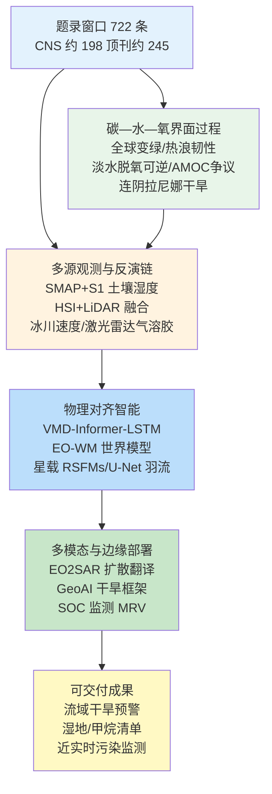
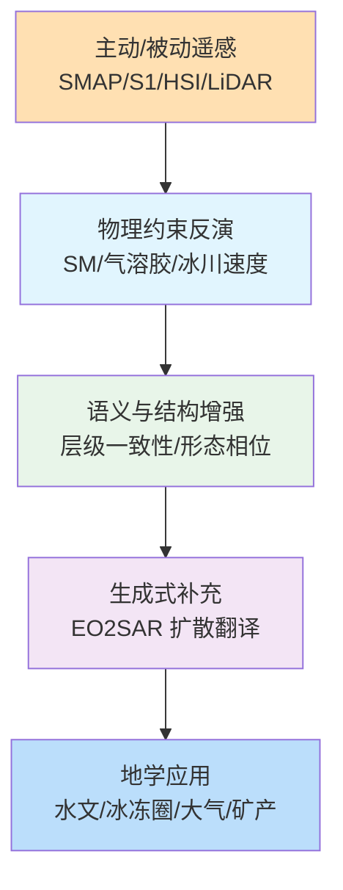
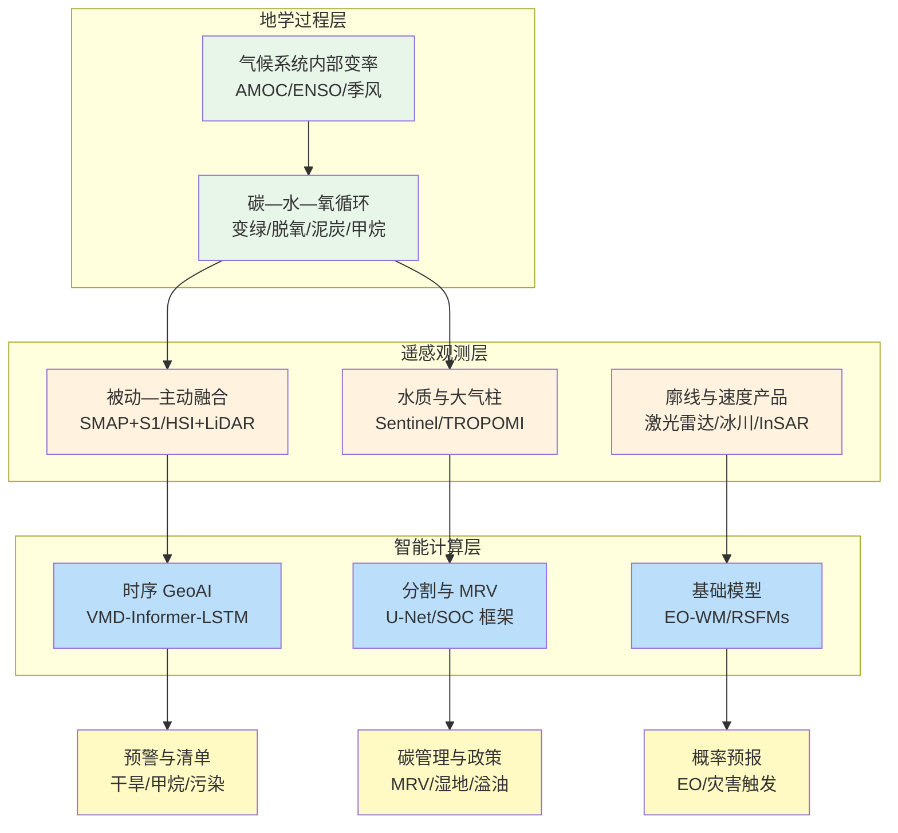

在 2026-06-18 至 2026-06-26 窗口内，《自然》《科学》《遥感》《地球物理研究快报》《自然·地球科学》《自然·气候变化》《大气化学与物理》《水文与地球系统科学》等来源共收录 722 篇论文条目，其中《细胞》《自然》《科学》系列约 198 篇，地学、遥感与智能计算相关顶刊及特色期刊约 245 篇。地学侧同时出现全球变绿持续性与极端热浪下森林韧性边界、淡水生态系统脱氧在营养管理下的可逆恢复、大西洋经向翻转环流对历史淡水强迫响应的方法论争议、南亚夏冬季风在末次冰消期的驱动分异，以及连阴拉尼娜事件与泛区域长期干旱的稳健关联；遥感侧沿被动微波锚定合成孔径雷达变化检测、高光谱与激光雷达层级语义约束融合、冰川多源速度产品、双通道米散射激光雷达气溶胶廓线反演与电光—合成孔径雷达扩散翻译等链路推进；智能计算侧则体现变分模态分解—Informer—长短期记忆网络干旱预报、GeoAI 多模型干旱框架、物理信息地球观测世界模型、星载遥感基础模型无监督灾害变化检测与 U-Net 近实时二氧化硫羽流分割等任务嵌入。综合近期综述文献，地球科学基础模型正沿“感知—推理—发现”能力深度演进，遥感基础模型由单模态向多模态统一表征扩展，GeoAI 则需进一步对齐空间自相关、异质性与时间不规则性等地理学约束。

## 一、本期研究印记图

本期窗口的地学—遥感—智能计算研究可概括为“碳—水—氧循环界面—多源观测产品—物理对齐智能”的闭合环路。文献指出，Shu（2026）在《自然·气候变化》回顾 2016 年以来全球变绿监测、驱动归因与管理含义，表明变绿在气候变化背景下仍具持续性与气候反馈潜力；Nelson 与 Still（2026）则以 2021 年太平洋西北热浪穹顶为例，讨论急性热胁迫如何挑战既有生态韧性框架；Zhou 等（2026）基于中国 972 条河流与 354 个湖泊 18 年观测，表明营养管理与污水处理投资可逆转广泛淡水脱氧，溶解氧浓度在河流中平均每十年上升约 12%；Devilliers 等（2026）对 ACCESS-ESM1.5 模型中历史淡水强迫驱动大西洋经向翻转环流减弱的说法提出量级、时空分布与观测约束方面的质疑。遥感侧，SMAP 锚定哨兵一号变化检测方法（2026）将百来米土壤湿度检索与植被状态约束耦合；康日喀波地区 30 米月尺度冰川速度融合产品（2026）显著提升复杂山地冰川监测时效。智能计算侧，EO-WM 物理信息世界模型（Luo 等，2026）将气象强迫作为气候态基线之上的条件信号嵌入视频扩散变换器，星载遥感基础模型（2026）则面向灾害事件无监督变化检测与在轨任务调度。下列印记图概括上述层级关系。

## 二、地学方向

地学条目在本期窗口内集中于陆地生态系统变绿持续性及其与极端热浪下森林韧性的张力、淡水溶解氧在营养管理与增温竞争下的恢复轨迹、大西洋经向翻转环流对历史格陵兰淡水强迫响应的方法论辩论、南亚夏冬季风在末次冰消期的驱动分异、亚北极排水泥炭地冬季通量对年碳平衡的决定性作用、双同位素约束的全球甲烷源汇结构，以及 2020–2023 年连阴拉尼娜与中亚—东非—北美泛区域长期干旱的稳健关联。上述研究共同强调：在《巴黎协定》剩余碳预算、水安全与生态系统服务并进的背景下，需同时刻画“生物地球化学管理可干预端”（营养负荷、排水状态）与“气候系统内部变率端”（厄尔尼诺—南方涛动、大西洋经向翻转环流、极端热浪）的过程竞争。

**表1 地学方向代表性研究的技术路线与特点**

| 研究主题 | 技术路线 | 技术特点 | 重要结论线索 |
| --- | --- | --- | --- |
| 全球持续变绿 | 遥感叶面积指数长期序列 + 驱动归因综述 | 监测—建模—管理一体化 | 变绿在气候变化下仍具持续性与反馈 |
| 极端热浪森林韧性 | 极端事件案例 + 生理阈值框架 | 挑战传统韧性假设 | 急性热胁迫暴露生态适应上限 |
| 淡水脱氧可逆性 | 1300 余站点 18 年观测 + 机器学习归因 | 管理干预与增温竞争 | 河流溶解氧每十年约升 12% |
| AMOC 淡水响应 | 多模式对比 + 强迫合理性评估 | 方法论批判性检验 | 历史淡水强迫量级与分布存疑 |
| 南亚季风末次冰消 | 沉积物超光谱 + 同位素 + 湿度重建 | 夏冬季风信号解耦 | 末次冰消期驱动因子分异 |
| 亚北极泥炭碳平衡 | 涡度协方差两年连续观测 | 冬季通量主导年际 | 排水改变碳交换季节结构 |
| 甲烷双同位素反演 | 35 年 δ13C-δD 同化 + 源类型约束 | 氢同位素敏感氧化过程 | 约束 2006 年以来甲烷增长机制 |
| 连阴拉尼娜干旱 | 历史事件统计 + 遥相关诊断 | 泛区域同步干旱 | 2020–2023 干旱与冷海温态关联 |

### 2.1 专题画像：气候变化背景下全球持续变绿

**（1）技术路线：遥感长期监测与驱动归因的综合回顾**

Shu（2026）在《自然·气候变化》发表的评述，系统回顾 Zhu 等（2016）在《自然·气候变化》上确立的全球变绿范式及其后续十年间的观测、归因与管理研究进展。研究沿叶面积指数、归一化植被指数等多源遥感产品，梳理 1980 年代以来全球及分区变绿趋势，并区分二氧化碳施肥、氮沉降、气候变化（温度、降水、干旱）与土地利用变化等驱动因子的相对贡献。文献进一步讨论变绿对陆地碳汇、蒸散冷却与区域水循环的反馈路径，以及变绿速率在 2000 年后是否受干旱胁迫而放缓的争议，为后续地球系统模式中的动态植被参数化提供观测约束。

**（2）技术特点：从现象识别到气候反馈与管理含义的贯通叙事**

相较于单篇基于特定传感器的变绿检测，该评述的价值在于将“全球变绿”从遥感现象提升为具有明确气候反馈与管理含义的地球系统过程。文献指出，变绿可通过增强光合作用与蒸散部分抵消增暖，但区域差异显著，高纬度与部分农业区变绿加速，而干旱区局部褐变仍不可忽视。该框架直接对接政府间气候变化专门委员会评估中的陆地碳汇不确定性，并呼吁在变绿监测中引入变绿速率（二阶趋势）而不仅是变绿/褐变分类。

**（3）重要结论：全球变绿在气候变化背景下仍具持续性与可管理性**

该研究的重要结论是：**全球变绿在气候变化背景下总体持续，二氧化碳施肥仍是主导驱动之一，但变绿速率对干旱与极端事件的敏感性上升，表明变绿对气候的负反馈存在区域上限且需与营养管理、土地利用政策协同评估。** 该结论为更新国家自主贡献中的陆地碳汇核算、设计基于遥感的生态系统恢复监测指标，以及理解变绿与极端热浪下森林韧性之间的张力提供综合背景，并提示未来研究应加强变绿—水—热耦合的过程约束。

### 2.2 专题画像：极端热浪与树木及森林韧性边界

**（1）技术路线：极端事件案例与生理—生态韧性框架的综合分析**

Nelson 与 Still（2026）在《自然·气候变化》发表的评述，以 2021 年太平洋西北热浪穹顶等极端高温事件为切入点，综合树木生理、森林生态与气候风险框架文献，讨论急性热胁迫如何暴露传统“韧性—适应”叙事未充分覆盖的生理极限。研究梳理叶片气孔关闭、水力失效、碳饥饿与死亡级联等机制，并对比基于平均气候态的风险评估与基于极端事件尾部风险的评估差异。文献同时引入伦理与政策维度，讨论在热胁迫已超出生存阈值区域继续依赖“自然恢复”是否适当。

**（2）技术特点：从平均态气候风险转向尾部极端事件阈值**

该评述的关键贡献在于将森林韧性讨论从“渐变式气候适应”转向“急性事件触发的不可逆转变”。2021 年热浪导致大量成熟树死亡，表明既有基于长期均值的分布区模型可能低估极端事件冲击。文献强调需区分叶片灼伤与正常衰老（参见 Bergström 等，2026 同期《自然·气候变化》通讯），并呼吁在模式中引入可检验的生理阈值而非仅统计相关。

**（3）重要结论：极端热浪正暴露森林韧性框架的结构性不足**

该研究的重要结论是：**极端热浪事件正在揭示树木与森林生理适应的上限，2021 年太平洋西北案例表明传统基于平均气候态的韧性评估不足以刻画尾部风险，森林管理与气候适应策略需纳入急性热胁迫阈值与不可逆损失情景。** 该结论对更新火灾后再造林标准、城市森林选种、自然基于解决方案设计以及极端事件归因研究具有直接启示，并提示遥感监测应区分灼伤、干旱与病虫害等胁迫信号的光谱—时序特征。

### 2.3 专题画像：营养管理逆转淡水生态系统广泛脱氧

**（1）技术路线：全国尺度长期水质监测与归因建模**

Zhou 等（2026）在《自然·地球科学》发表的研究，整合中国 2005–2022 年 972 个河流站点与 354 个湖泊站点的月度溶解氧、水温、生化需氧量、化学需氧量、铵态氮与总磷等观测，构建 18 年高时间分辨率淡水脱氧—再氧合数据集。研究采用方差分解与 XGBoost 等机器学习算法，量化有机污染负荷下降、营养盐变化与增温对溶解氧趋势的贡献，并统计低氧与无氧事件频次的时间演变。同期国家污水处理覆盖率由约 34% 升至约 98%，为因果推断提供自然实验背景。

**（2）技术特点：管理干预与气候增温的竞争过程解耦**

该工作直接回应“淡水脱氧不可逆”的普遍叙事。全球多项研究（如 Jane 等，2021，《自然》）表明温带湖泊溶解氧广泛下降，且深层水下降与增温、分层增强相关。Zhou 等（2026）则显示，在强烈污染控制下，生化需氧量与化学需氧量下降可抵消增温导致的溶解度降低，使溶解氧浓度净上升。该路线对发展中国家快速城市化阶段的流域治理具有可复制的方法论价值。

**（3）重要结论： targeted 营养与有机污染控制可逆转广泛淡水脱氧**

该研究的重要结论是：**在快速增温背景下，中国河流与湖泊溶解氧仍呈显著上升趋势，河流溶解氧平均每十年约升 12%、湖泊约升 4.5%，低氧事件频次大幅下降，生化需氧量与化学需氧量下降是溶解氧恢复的首要预测因子。** 该结论表明淡水脱氧并非气候变化的必然宿命，强化污水处理与面源污染控制可为水生生态系统争取关键恢复窗口，对全球湖泊与河流管理、联合国可持续发展目标 6 号（清洁饮水和卫生设施）及区域碳—氮—磷耦合管理具有重要政策含义。

### 2.4 专题画像：大西洋经向翻转环流对历史淡水增加的响应

**（1）技术路线：模式实验批判与强迫合理性评估**

Devilliers 等（2026）在《自然·地球科学》发表的研究，针对 Pontes 与 Menviel 使用 ACCESS-ESM1.5 模式提出“自 20 世纪 50 年代以来亚北极淡水通量导致大西洋经向翻转环流以约 0.46 Sv/十年减弱”的结论，系统评估其所施加淡水强迫的量级、时间分布与空间格局是否符合观测约束。研究对比 EC-Earth3 等模式中基于格陵兰周边百年观测淡水强迫的实验，并讨论不同模式对同一科学问题的敏感性差异。文献将讨论置于政府间气候变化专门委员会第六次评估报告关于大西洋经向翻转环流未来减弱预测与近年观测显示的年代际变率并存的 broader 语境中。

**（2）技术特点：从结论争议到强迫数据质量的方法论反思**

该文代表地学研究中“结论可重复性”向“强迫可辩护性”深化的趋势。大西洋经向翻转环流变化涉及全球热输送、区域海平面与碳循环，任何历史归因都高度依赖淡水强迫产品。Devilliers 等（2026）指出，若强迫在量级与时空分布上偏离观测，则模式响应难以作为历史归因证据。该批判性路径对耦合模式 intercomparison 与观测同化社区具有方法论示范意义。

**（3）重要结论：历史淡水强迫的不确定性限制大西洋经向翻转环流归因的稳健性**

该研究的重要结论是：**ACCESS-ESM1.5 中用于解释 20 世纪中叶以来大西洋经向翻转环流减弱的历史淡水强迫在量级、时间分布与空间格局上缺乏充分观测支持，因而亚北极淡水通量作为主导驱动因子的结论尚不能稳健成立。** 该结论提醒气候评估报告在引用单模式历史归因时须审查强迫产品质量，并呼吁加强格陵兰—拉布拉多海淡水通量的长期观测与数据同化，以避免政策相关结论建立在不可辩护的边界条件之上。

### 2.5 专题画像：末次冰消期南亚夏冬季风演化驱动分异

**（1）技术路线：阿拉伯海东北部沉积物多指标古气候重建**

Obreht 等（2026）在《自然·地球科学》发表的研究，在巴基斯坦外海沉积柱心上综合运用质谱与同位素分析、高光谱成像，重建末次冰消期（约 1.6 万–1.2 万年前）亚十年尺度海表温度与海洋初级生产力变化，并以植物蜡同位素评估大气湿度与植被变化。研究利用阿拉伯海东北部独特设置——沉积与地球化学信号主要受夏季风驱动、海表温度主要受冬季风控制——实现夏冬季风分量的解耦，克服传统代用指标季节信号混合的困难。

**（2）技术特点：季节分量解耦的低纬度古气候新路径**

南亚季风控制全球约四分之一人口的水资源与农业，理解其末次冰消期演化对约束未来低纬度水文变化至关重要。该研究通过“同一岩芯、不同指标、不同季节敏感项”的策略，避免简单将单一指标等同于“季风强度”。高光谱成像提供高分辨率沉积结构信息，与同位素指标交叉验证，提高年代际事件（如 Heinrich 事件、Bølling–Allerød 转换）的检测可靠性。

**（3）重要结论：南亚夏冬季风在末次冰消期受不同驱动因子控制**

该研究的重要结论是：**末次冰消期南亚夏季风与冬季风变化并不同步，夏季风强度与海洋生产力主要响应低纬度 insolation 与区域环流配置，而冬季风驱动的海表温度变化与更高纬度过程联系更紧密，表明低纬度季风系统不能简化为单一“强度指数”描述。** 该结论对改进季风模式中的季节分量参数化、理解全球变暖下印度次大陆夏季与冬季降水可能的分异趋势，以及解读其他季节混合代用指标具有重要参考意义。

### 2.6 专题画像：亚北极排水泥炭地年碳平衡由冬季通量决定

**（1）技术路线：冰岛西部排水泥炭地涡度协方差连续观测**

Biogeosciences 发表的研究（2026）在冰岛西部一处 1960 年代排水的未管理泥炭地开展首个全年尺度涡度协方差观测，连续两年测量生态系统二氧化碳交换。研究区分生长季与冬季、白天与夜间通量组分，并结合水文与微气象数据，分析排水导致的地下水位下降如何改变泥炭氧化与植被光合的季节平衡。通过与北欧其他排水泥炭地文献对比，评估区域代表性。

**（2）技术特点：填补高纬度排水泥炭地冬季通量观测空白**

排水泥炭地占北欧大量农业用地，通常由净碳汇转为净碳源，但冬季呼吸贡献长期缺乏连续观测约束。该研究强调“年平衡由冬季决定”的机制——当生长季微弱碳吸收无法补偿冬季持续释放时，年尺度即为源。该发现对国家温室气体清单中泥炭地分类与排放因子具有直接数据支撑意义。

**（3）重要结论：冬季二氧化碳释放主导排水泥炭地年碳平衡**

该研究的重要结论是：**冰岛西部未管理排水泥炭地在观测期内表现为净二氧化碳源，冬季生态系统呼吸通量对年碳平衡起决定性作用，生长季吸收不足以抵消非生长季释放。** 该结论支持在北欧碳管理中优先关注排水泥炭地再湿化与冬季通量监测，并为地球系统模式中泥炭地排水场景参数化提供独立观测约束，提示仅优化生长季过程不足以修正年尺度碳收支。

### 2.7 专题画像：双同位素约束的全球甲烷排放估计

**（1）技术路线：35 年 δ13C-CH4 与 δD-CH4 观测同化**

Atmospheric Chemistry and Physics 发表的研究（2026）构建并同化 35 年 harmonised 双同位素观测数据集，在全球尺度反演甲烷源汇结构。研究强调氢同位素组成对源类型（如湿地、生物质燃烧、化石燃料）与大气氧化过程具有独特敏感性，而以往反演多依赖碳同位素。通过联合约束 mole fraction 与双同位素，研究区分 2006 年以来甲烷增长的不同机制假设（如微生物源增强、化石源变化、羟基自由基变化）。

**（2）技术特点：多同位素约束提升源归因分辨率**

甲烷是仅次于二氧化碳的重要温室气体，其 2006 年以来的加速增长机制仍存在争议。双同位素框架可在观测不足区域减少源类型混淆，尤其有助于区分同位素特征相近的源。该路线对《巴黎协定》透明度框架下的国家排放清单验证与全球甲烷承诺具有方法学价值。

**（3）重要结论：氢同位素为 2006 年以来甲烷增长提供新约束**

该研究的重要结论是：**同化 δD-CH4 后，全球甲烷源汇结构对 2006 年以来增长机制的约束显著收紧，某些仅依赖 mole fraction 与 δ13C 的反演方案对湿地与化石源贡献的估计需重新评估。** 该结论对全球甲烷预算、短寿命气候强迫物评估及卫星甲烷任务（如 TROPOMI、Carbon Mapper）的地面验证设计具有科学意义，并呼吁维持长期双同位素监测网络。

### 2.8 专题画像：连阴拉尼娜与泛区域长期干旱的稳健关联

**（1）技术路线：2020–2023 干旱事件与历史 ENSO 态统计诊断**

Geophysical Research Letters 发表的研究（2026）分析 2020–2023 年影响中亚—西亚、东非与北美的长期干旱，并与连续拉尼娜事件的时间重叠进行统计检验。研究利用再分析资料、海表温度指数与标准化降水指数等，诊断热带太平洋冷态维持对遥相关波列与区域降水异常的影响，并在更长历史记录中检验“连阴拉尼娜—泛区域干旱”链路的重现性。

**（2）技术特点：从单次事件到历史稳健性的事件归因**

2020–2023 年多地同步干旱对粮食安全与生态系统造成广泛冲击。该研究不局限于单次事件叙事，而检验类似 ENSO 配置下干旱重现频率，为 seasonal-to-decadal 预测提供经验基础。与仅关注单一区域干旱的研究相比，泛区域视角更接近粮食贸易与跨境水资源管理的决策需求。

**（3）重要结论：连续拉尼娜与多区域长期干旱存在稳健历史联系**

该研究的重要结论是：**2020–2023 年中亚—西亚、东非与北美的长期干旱与连续拉尼娜事件在时间上高度重合，历史统计表明类似热带太平洋冷态维持条件下上述区域更易出现同步干旱，表明 ENSO 位相是跨大陆干旱的重要调制因子。** 该结论对农业气候服务、跨境水资源协调与联合国减少灾害风险框架下的复合极端事件预警具有应用价值，并提示在拉尼娜持续期需加强多区域粮食与牧业风险联防。

## 三、遥感方向

遥感条目在本期窗口内集中于被动微波锚定合成孔径雷达变化检测的百来米土壤湿度制图、高光谱与激光雷达层级语义一致性联合分类、康日喀波地区 30 米月尺度冰川表面速度多源融合、无人机干涉合成孔径雷达几何误差缓解匹配、双通道米散射激光雷达气溶胶光学与成分廓线协同反演、土耳其多指标淡水水质遥感动态评估，以及电光—合成孔径雷达结构感知潜在扩散翻译。上述研究共同体现：遥感正从“单传感器反演精度竞争”转向“跨传感器物理一致性、语义层级约束与生成式数据增强”的综合能力构建。

**表2 遥感方向代表性研究的技术路线与特点**

| 研究主题 | 技术路线 | 技术特点 | 重要结论线索 |
| --- | --- | --- | --- |
| 百来米土壤湿度 | SMAP 锚定 + S1 变化检测 + 植被约束 | 辐射计约束 SAR | 100 m 土壤湿度可业务化检索 |
| 高光谱+激光雷达分类 | 层级语义一致性约束框架 | 跨模态跨层级对齐 | 复杂场景分类精度提升 |
| 冰川速度融合 | Landsat+S1/S2+无人机 | 30 m 月尺度产品 | 小冰川速度检测改善 |
| InSAR 图像匹配 | 形态—相位特征 + 几何误差缓解 | 无人机场景匹配导航 | 干涉图纹理差异可补偿 |
| 激光雷达气溶胶 | 双通道米散射协同反演 | 光学—质量廓线同步 | 空间—时间气溶胶质量数据 |
| 淡水水质动态 | Sentinel-2+Landsat 多指标 | 2015–2025 对比框架 | 光学可检测指标时空分异 |
| EO2SAR 翻译 | 结构感知潜在扩散 | 无配对数据增强 | 缓解 SAR 标注稀缺 |
| 矿产远景预测 | Geo-U-Mamba 多源地学数据 | 四向交叉扫描 Mamba | 86% 矿点捕获率 |

### 3.1 专题画像：SMAP 锚定哨兵一号百来米土壤湿度制图

**（1）技术路线：被动微波锚定与合成孔径雷达变化检测融合**

Remote Sensing 发表的研究（2026）提出 SMAP 锚定哨兵一号变化检测方法，在植被状态约束下生成 100 m 地表土壤湿度产品。技术路径以 SMAP 等被动微波产品提供体积含水量参考，利用哨兵一号 C 波段合成孔径雷达后向散射时间变化刻画精细尺度湿润—干燥过程，并通过植被状况调节模型参数，抑制植被生长与结构变化对雷达信号的混淆。研究在多个验证站点与农业—水文应用场景中评估检索精度与时空连续性。

**（2）技术特点：可解释性与业务可行性并重的 downscaling 范式**

百来米土壤湿度对灌溉管理、干旱监测与洪水预报至关重要，但单纯雷达反演易受植被与粗糙度影响，单纯被动微波则空间分辨率不足。该方法的创新在于保留“辐射计约束 SAR 变化”的物理可解释链条，而非端到端黑箱降尺度。与纯机器学习 downscaling 相比，该框架更易向业务用户解释误差来源，并可在 SMAP 异常期通过 SAR 变化维持空间细节。

**（3）重要结论：植被约束的 SAR 变化检测可实现可靠百来米土壤湿度检索**

该研究的重要结论是：**在 SMAP 体积含水量锚定与植被状态约束下，哨兵一号变化检测可在 100 m 尺度提供与局地水文过程一致的土壤湿度时空动态，为农业干旱预警与流域水文建模提供高分辨率输入。** 该结论对全球土壤湿度产品体系（如 ESA CCI、NASA SMAP）的 downscaling 业务化、联合国粮农组织早期预警系统以及精准农业灌溉决策具有直接应用价值，并提示未来可进一步耦合光学植被水分与热红外蒸散约束。

### 3.2 专题画像：高光谱与激光雷达层级语义一致性联合分类

**（1）技术路线：跨模态跨层级特征对齐与融合分类**

Remote Sensing 发表的研究（2026）提出层级语义一致性约束框架，用于高光谱影像与激光雷达数据联合土地覆盖分类。传统方法常独立提取各模态特征后再融合，忽略不同模态、不同抽象层级间的语义对应关系。该框架在网络结构中显式施加层级语义一致性损失，使光谱—高度—结构特征在像素级、对象级与场景级保持一致，并充分挖掘高光谱精细光谱维与激光雷达三维结构信息的互补性。

**（2）技术特点：从特征拼接走向语义对齐的多模态遥感**

复杂城市—山地—湿地交界场景对联合分类提出严峻挑战。该研究的技术特点在于将“语义一致性”作为可优化约束而非后验规则，减少模态间错配导致的分类噪声。与早期 CNN 融合相比，层级约束更适配多尺度地物（如树冠 vs 林分），对国土调查、森林资源清查等需要一致语义层级的应用尤为重要。

**（3）重要结论：层级语义约束显著提升复杂场景联合分类可靠性**

该研究的重要结论是：**在多个公开与实测数据集上，层级语义一致性约束框架较独立特征提取—后期融合策略取得更高分类精度与更一致的多尺度语义图，尤其在异质性地表覆盖区改善明显。** 该结论对多传感器协同观测计划（如 NASA Surface Biology and Geology、欧洲哥白尼高光谱任务）的数据处理链路设计具有参考价值，并提示未来可与视觉—语言模型语义层进一步对齐。

### 3.3 专题画像：康日喀波地区 30 米月尺度冰川速度融合

**（1）技术路线：Landsat、哨兵一号/二号与无人机多源速度反演融合**

The Cryosphere 发表的研究（2026）针对藏东南康日喀波复杂山地冰川，融合 Landsat、哨兵一号/二号与无人机数据，生成 2015–2024 年月尺度 30 m 冰川表面速度产品。研究设计跨传感器互校准流程，处理云层、轨道几何与季节雪覆盖对速度估计的影响，并与现有大区域低分辨率产品对比，评估对小规模山地冰川的检测能力。

**（2）技术特点：高时空分辨率服务快速变化的山地冰川**

全球小冰川对气候变化响应灵敏，但常低于单一传感器有效分辨率或受云雾限制。多源融合通过光学特征跟踪、合成孔径雷达偏移量测与无人机高分辨率控制点互补，实现“月尺度更新 + 30 m 细节”的权衡。该路线对第三极冰川灾害预警（如冰崩、冰湖溃决）尤为关键。

**（3）重要结论：多源融合显著改善复杂地形区冰川速度监测**

该研究的重要结论是：**相较单一传感器或低分辨率公开产品，融合方案在康日喀波地区能更可靠检测小冰川与高梯度区域的速度异常，月尺度产品可捕捉季节性加速事件。** 该结论为青藏高原冰川物质平衡评估、亚洲水塔变化监测及政府间气候变化专门委员会冰冻圈章节提供区域尺度观测支撑，并可为 InSAR 与光学互验证提供基准数据集。

### 3.4 专题画像：InSAR 干涉图形态—相位特征匹配与几何误差缓解

**（1）技术路线：参考干涉图生成误差建模与形态—相位联合匹配**

Remote Sensing 发表的研究（2026）面向无人机干涉合成孔径雷达场景匹配导航，提出形态—相位特征方法以缓解几何参数估计误差导致的干涉图纹理差异。研究分析参考干涉图生成过程中基线、高程与配准误差对实时干涉图的影响，设计利用干涉图相位与幅度形态特征的匹配算子，克服 InSAR 图像非局部相似性对传统匹配算法的干扰。

**（2）技术特点：服务无人机导航的 InSAR 专用匹配策略**

InSAR 相较强度图含更丰富纹理，但对几何误差极度敏感。该研究将“几何误差缓解”前置为匹配前提，而非事后校正，体现遥感—导航交叉的应用导向。形态—相位联合特征提高在低纹理或重复纹理区域的鲁棒性，对无人机低空遥感与应急测绘具有工程意义。

**（3）重要结论：形态—相位特征可有效缓解 InSAR 几何误差导致的匹配失败**

该研究的重要结论是：**在模拟与实测无人机 InSAR 数据中，所提方法较常规匹配算法在几何参数扰动下保持更高正确匹配率与定位精度，证明干涉图纹理差异可在特征层面部分补偿。** 该结论对发展低成本无人机 InSAR 测绘、灾害现场快速三维建模与合成孔径雷达卫星精密定轨具有方法学贡献，并提示需与实时基线估计模块闭环优化。

### 3.5 专题画像：双通道米散射激光雷达气溶胶光学与成分廓线协同反演

**（1）技术路线：星载双通道激光雷达观测的协同检索算法**

Remote Sensing 发表的研究（2026）针对星载双通道米散射激光雷达，提出气溶胶消光系数与质量成分廓线同步反演算法。研究建立光学系数与质量浓度之间的物理关系，利用双通道信息分离不同粒径与成分贡献，生成空间—时间连续的气溶胶质量廓线，填补现有激光雷达产品多停留在光学参数、缺乏质量定量信息的空白。

**（2）技术特点：从光学廓线到质量成分的定量延伸**

气溶胶质量数据对空气质量模式验证、健康影响评估与卫星—模式同化至关重要。该算法强调“协同”而非分步反演，减少误差累积。与被动遥感柱含量产品相比，激光雷达廓线可区分边界层与自由对流层贡献，对污染输送与火山灰监测尤为关键。

**（3）重要结论：双通道米散射激光雷达可同步提供气溶胶光学与质量成分廓线**

该研究的重要结论是：**所提协同反演算法在模拟与典型观测案例中可稳定恢复消光系数与主要质量成分垂直分布，为空间—时间连续气溶胶质量数据集生成提供可行路径。** 该结论对 CALIPSO 后续任务、欧洲航天局 EarthCARE 及中国高分激光雷达星座的应用算法开发具有参考价值，并支持世界卫生组织空气质量指南下的暴露评估。

### 3.6 专题画像：土耳其对比淡水系统多指标水质遥感动态

**（1）技术路线：Sentinel-2 与 Landsat 多指标变化检测框架**

Remote Sensing 发表的研究（2026）构建土耳其四个淡水系统（Egirdir 湖、Sapanca 湖、Catalan 坝、Yuvacik 坝）的多指标遥感水质评估框架，对比基准期（2015–2018）与近期（2023–2025）光学与热红外可检测指标变化。研究选取叶绿素 a、浊度、悬浮物与表面温度等代理变量，强调“光学可检测”边界而非替代法定水质监测。

**（2）技术特点：对比期框架服务长期趋势而非单点快照**

湖泊与水库水质受气候、土地利用与水库调度共同影响。该研究通过统一基准期与近期窗口，使不同水体间趋势可比，并讨论 Sentinel-2 高重访与 Landsat 长序列的互补。多指标并行可避免单一指数误判（如藻类暴发 vs 泥沙事件）。

**（3）重要结论：卫星可检测指标揭示土耳其多淡水系统水质时空分异**

该研究的重要结论是：**2015–2025 年间四个研究水体在光学与热红外可检测指标上呈现显著时空分异，部分系统近期浊度或藻类相关指标上升，与流域土地利用与气候波动存在对应关系。** 该结论对土耳其及地中海气候区淡水资源管理、《欧盟水框架指令》类跨境水体监测提供遥感补充手段，并提示需与原位监测联合验证光学阈值。

### 3.7 专题画像：EO2SAR-Diff 结构感知潜在扩散电光—合成孔径雷达翻译

**（1）技术路线：无配对数据的条件潜在扩散翻译框架**

Remote Sensing 发表的研究（2026）提出 EO2SAR-Diff，使用结构感知潜在扩散模型将电光航空影像翻译为合成 SAR 风格图像。框架包含结构保持编码、条件扩散生成与对抗判别模块，在无配对 EO—SAR 训练样本条件下学习跨模态映射，缓解 SAR 卫星数量少、标注成本高的瓶颈。

**（2）技术特点：生成式遥感缓解 SAR 数据稀缺**

SAR 全天候成像能力不可替代，但深度学习 SAR 应用常受限于标注数据。扩散模型相较 GAN 在模式覆盖与训练稳定性上更具优势；结构感知约束防止翻译结果丢失地物几何布局。该路线代表遥感从“判别式反演”向“生成式数据增强”扩展的趋势。

**（3）重要结论：结构感知扩散可在无配对条件下生成可用 SAR 风格训练数据**

该研究的重要结论是：**EO2SAR-Diff 在多个航空场景测试中生成与真实 SAR 统计特性一致的合成影像，下游 SAR 分类与检测任务在使用合成数据增强后性能提升。** 该结论对 SAR 卫星星座规划、军事与民用 SAR 样本库建设及多模态基础模型预训练数据扩充具有应用潜力，并需进一步评估跨传感器与跨地域泛化。

### 3.8 专题画像：Geo-U-Mamba 多源地学数据金矿远景预测

**（1）技术路线：Mamba 四向交叉扫描与 U-Net 集成的无监督矿产远景制图**

Remote Sensing 发表的研究（2026）提出 Geo-U-Mamba，融合地球化学、遥感蚀变信息、地形与构造距离场等多源地学数据，进行金矿远景预测。模型在 U-Net 架构中嵌入 Mamba 四向交叉扫描机制，建模成矿元素与地质环境间的非线性映射，结合 C-A 分形理论提取地球化学异常，报告约 86.11% 矿点捕获率。

**（2）技术特点：状态空间模型服务深部隐伏矿预测**

全球矿产勘探向深部 1000 m 以常见，传统统计方法难以处理高维非线性地学数据。Mamba 相较 Transformer 在长序列建模上更高效，适合大范围栅格数据。无监督框架降低对大量已知矿床标签的依赖，但需与地质专家知识交叉验证。

**（3）重要结论：Geo-U-Mamba 可有效识别金矿地球化学异常并圈定远景靶区**

该研究的重要结论是：**在研究区应用中，Geo-U-Mamba 以 86.11% 矿点捕获率识别金矿相关地球化学异常，并通过背景场重建降低环境噪声，为深部勘探靶区优选提供空间约束。** 该结论对矿产资源国情调查、战略性矿产勘查部署及 GeoAI 在固体地球科学中的业务化具有示范意义，并提示需在不同成矿类型区检验泛化能力。

## 四、人工智能方向

智能计算条目在本期窗口内集中于变分模态分解—Informer—长短期记忆网络耦合的流域日尺度干旱预报、GeoAI 多模型干旱时空建模、机器学习全球湿地范围重建与预测、地震质量运动数据异常检测、物理信息地球观测世界模型概率预报、星载遥感基础模型灾害变化检测、U-Net 近实时全球二氧化硫羽流分割，以及遥感与机器学习支持的土壤有机碳监测框架。上述研究体现：GeoAI 正沿“物理约束 + 多尺度时序分解 + 基础模型表征 + 边缘部署”四维同步演进。

**表3 人工智能方向代表性研究的技术路线与特点**

| 研究主题 | 技术路线 | 技术特点 | 重要结论线索 |
| --- | --- | --- | --- |
| 淮河流域干旱预报 | VMD + Informer + LSTM | 多尺度非平稳分解 | 日尺度干旱预测精度提升 |
| GeoAI 干旱框架 | 多模型 spatiotemporal 集成 | 干旱区专用 | 干旱时空异质建模 |
| 全球湿地 ML | 多源特征重建与预测 | 长时序_extent | 湿地变化监测自动化 |
| 地震质量运动 | 异常检测 + DTW | 弱监督/无标签 | 稀有事件筛查 |
| EO-WM 世界模型 | 视频扩散 Transformer + 物理条件 | 概率 EO 预报 | 天气强迫响应可检验 |
| 星载 RSFMs | 统一编码器 + 无监督变化检测 | 在轨资源优化 | 灾害触发高分辨率成像 |
| SO2 羽流 U-Net | TROPOMI 3.1 万轨分割 | 近实时全球监测 | 识别 5.4 万余独立羽流 |
| 土壤 SOC MRV | 裸土建模 + 数字土壤制图 + ML | Tier-3 框架 | 地中海混农林 SOC 量化 |

### 4.1 专题画像：淮河流域 VMD-Informer-LSTM 日尺度干旱预测

**（1）技术路线：变分模态分解与深度时序模型级联**

Hydrology and Earth System Sciences 发表的研究（2026）提出 VMD-Informer-LSTM 框架，用于中国淮河流域水文干旱日尺度预测。研究首先用变分模态分解将非平稳干旱指数序列分解为多尺度本征模函数，分别输入 Informer（捕捉长程依赖）与 LSTM（捕捉局部动态），再融合重构未来干旱状态。输入特征包括降水、蒸散、土壤湿度与遥相关指数等，采用滚动预报检验评估 1–30 天技巧。

**（2）技术特点：分解—预测—重构应对水文非平稳性**

水文序列常含趋势、季节与突发事件叠加，单一 LSTM 难以同时处理多尺度结构。VMD 提供可解释的频率分离，Informer 降低长序列注意力计算成本。该组合代表 GeoAI 中“经典信号处理 + 现代 Transformer”的实用范式，较纯端到端模型更易诊断误差来源。

**（3）重要结论：多尺度分解显著提升淮河流域日尺度干旱预报技巧**

该研究的重要结论是：**VMD-Informer-LSTM 在淮河流域多站点检验中较单一 LSTM、支持向量回归等基线模型降低均方根误差并延长有效预报时效，尤其在干旱发生与解除转换期表现更优。** 该结论对淮河流域农业灌溉调度、南水北调受水区补水决策及中国七大流域 drought early warning 系统升级具有应用价值，并提示需在不同气候区验证 VMD 模态数选取的稳健性。

### 4.2 专题画像：GeoAI 多模型干旱时空建模框架

**（1）技术路线：干旱区多模型 spatiotemporal 集成与对比**

International Journal of Remote Sensing 发表的研究（2026）构建 GeoAI 多模型框架，针对干旱环境 spatiotemporal 干旱建模，集成多种机器学习与深度学习模型（如随机森林、梯度提升、长短期记忆网络、卷积长短期记忆网络等），并融合遥感衍生干旱指数、土地覆盖与地形协变量。研究设计空间交叉验证以避免训练—测试空间泄漏，比较不同模型在干旱强度、持续性与空间格局再现上的差异。

**（2）技术特点：面向干旱区异质性的模型—数据协同设计**

干旱区观测稀疏、异质性强，单一全球模型常失效。该框架强调“多模型竞争 + 区域特征工程”，并嵌入 GeoAI 语义，即显式处理空间非平稳与时空自相关。与气象 drought 指数不同，遥感—机器学习框架可直接对接植被与土壤水分响应。

**（3）重要结论：多模型集成提升干旱区 spatiotemporal 干旱刻画能力**

该研究的重要结论是：**在研究区应用中，GeoAI 多模型框架较单一算法在 drought severity 与 spatial extent 指标上更稳健，集成策略有效降低单模型过拟合风险。** 该结论为联合国防治荒漠化公约监测、牧场管理与气候适应基金项目提供可复制的 GeoAI 工作流，并呼吁公开干旱区标注数据集以促进模型互比。

### 4.3 专题画像：机器学习全球湿地范围重建与预测

**（1）技术路线：多源遥感特征与机器学习长时序湿地制图**

GIScience & Remote Sensing 发表的研究（2026）由 He、Xu 与 Lin 完成，利用多源卫星特征与机器学习重建并预测全球湿地范围变化。研究整合光学、合成孔径雷达与地形水文变量，构建长时序训练样本，采用集成学习或深度学习模型生成高分辨率湿地概率图，并外推未来情景下的湿地损失或恢复趋势。

**（2）技术特点：全球尺度一致性与区域细节的平衡**

湿地对碳储存、生物多样性与水调节至关重要，但全球清单长期依赖不一致的制图标准。机器学习方法可在统一特征空间下处理热带云覆盖、高纬度冻融与人工排水等复杂情况，较单一指数阈值法更具适应性。与 WetSAT-ML、Swamp-AI 等工具形成互补生态。

**（3）重要结论：机器学习可实现全球湿地范围一致重建与短期预测**

该研究的重要结论是：**所提框架在全球验证站点上取得与现有湿地产品相当或更优的精度，并能生成一致的长时序变化趋势，为评估气候与土地利用对湿地Extent 的影响提供更新基准。** 该结论对《拉姆萨尔公约》湿地保护、自然气候解决方案碳信用 MRV 及联合国气候变化框架公约 REDD+ 湿地组分具有数据支撑意义，并需与现场湿地类型分类联合验证。

### 4.4 专题画像：地震数据异常检测探索质量运动事件

**（1）技术路线：无标签地震波形异常检测与动态时间规整**

Natural Hazards and Earth System Sciences 发表的研究（2026）针对岩崩、冰川崩塌与破坏性泥石流等稀有质量运动事件，提出基于异常检测的地震信号筛查框架。研究利用动态时间规整衡量波形相似性，在无充分标注事件库条件下识别偏离背景噪声模型的异常段，为后续人工复核与仪器触发提供候选列表。

**（2）技术特点：弱监督范式服务稀有地质灾害监测**

质量运动事件稀少，传统监督学习难以训练。异常检测将问题转化为“正常背景建模 + 离群检测”，适合区域 seismic network 早期筛查。与全球地震学网络聚焦构造地震不同，该路线面向地表过程灾害，体现 GeoAI 在非常规事件监测中的价值。

**（3）重要结论：异常检测可有效筛查潜在质量运动地震信号**

该研究的重要结论是：**在测试数据中，所提方法以较低误报率标识多数已知质量运动事件的 seismic signature，并发现若干此前未目录化的事件候选，证明无标签筛查在扩大监测目录方面的潜力。** 该结论对高山冰川区、火山侧翼与交通廊道沿线灾害早期预警具有意义，并提示需与 InSAR、光学变化检测联合降低误报。

### 4.5 专题画像：EO-WM 物理信息地球观测世界模型

**（1）技术路线：视频扩散 Transformer 与物理信息气象条件框架**

Luo 等（2026）在 arXiv 提出 EO-WM，将地球观测预报建模为部分观测、天气驱动的世界模型问题。模型采用视频扩散 Transformer，对多光谱卫星序列进行概率预报；物理信息条件框架将气象强迫表示为气候态基线之上的扰动，并区分可观测地表与未观测陆面状态导致的不确定性。研究设计强调预报对改变天气强迫的响应是否正确，而非仅重建精度。

**（2）技术特点：从确定性重建到物理一致的概率预报**

现有 EO 预报多输出单一未来，难以表达稀疏观测与未解析过程的不确定性。扩散模型天然适合多模态未来采样；物理信息条件避免将气象变量视为无差别上下文向量。该工作代表 Earth Science Foundation Models 综述（2026）所描述的“感知—推理”过渡的具体实现。

**（3）重要结论：物理信息条件扩散可实现对天气强迫敏感的多光谱 EO 概率预报**

该研究的重要结论是：**EO-WM 在多光谱 EO 预报基准上较确定性基线更好地校准不确定性，且在改变输入气象强迫时产生 physically consistent 的地表响应，表明世界模型范式可用于检验 EO 预报的因果响应而非仅像素误差。** 该结论对下一代地球系统数据同化、卫星任务 simulation-based 设计以及 TerraBench 类 agent 评测具有前瞻意义，并需在大范围跨传感器迁移上进一步验证。

### 4.6 专题画像：星载遥感基础模型无监督灾害变化检测

**（1）技术路线：统一编码器与在轨异常触发的变化检测**

arXiv 发表的研究（2026）提出利用遥感基础模型（RSFMs）在卫星上执行无监督灾害变化检测。RSFMs 作为统一编码器，自多任务预训练，可在检测异常时触发高分辨率成像或调整任务参数，优化有限功率与计算资源。研究在无标签灾害事件上评估变化检测性能，并与监督模型对比。

**（2）技术特点：边缘 AI 与任务调度耦合的轨道应用**

该研究超越地面离线处理，直接讨论 on-board 部署，代表空间算力与模型压缩趋势。无监督变化检测避免为每种灾害单独标注，适合突发极端事件。基础模型统一表征减少多任务重复存储，对小型卫星星座尤为关键。

**（3）重要结论：星载 RSFMs 可在资源约束下实现可靠灾害变化检测**

该研究的重要结论是：**预训练 RSFMs 在无监督设置下对多种灾害相关地表变化保持可用检测性能，并支持基于异常的任务调度策略，提高轨道观测效用。** 该结论对欧洲航天局 Φ-sat-2、NASA 地球观测系统后续任务及商业遥感星座自主运营具有工程参考价值，并需进一步量化 false trigger 率与能耗。

### 4.7 专题画像：U-Net 近实时全球二氧化硫羽流自动监测

**（1）技术路线：TROPOMI 超 3.1 万轨 U-Net 分割与聚类分析**

Finch 与 Palmer（2026）在 Atmospheric Measurement Techniques 发表的研究，使用 U-Net 对 2019–2024 年超过 31 000 轨 TROPOMI 卫星数据自动分割二氧化硫羽流，识别 53 993 个独立羽流，并通过聚类分析确认火山与工业热点（如 Popocatépetl、Norilsk）。2019 年检测率峰值与 Raikoke、Ulawun 火山平流层注入相关。

**（2）技术特点：从滞后清单到近实时的排放感知**

传统排放清单时空粗糙，难以捕捉 sporadic 高排放事件。深度学习分割直接在 L2 产品中找羽流，缩短发现延迟。研究亦诚实报告高背景区漏检限制，体现 GeoAI 业务化所需的误差表征。

**（3）重要结论：U-Net 分割可实现全球近实时二氧化硫羽流目录化**

该研究的重要结论是：**所提 U-Net 流程可在近实时尺度自动生成全球二氧化硫羽流目录，火山与工业源空间聚类与已知热点高度一致，2019 年平流层注入事件被清晰识别。** 该结论对国际海事组织船舶硫排放监管、火山灰航空预警、化石燃料排放快速评估及 Copernicus 大气监测服务具有直接应用价值，并提示需融合多传感器降低高背景区漏检。

### 4.8 专题画像：遥感与 AI 支持的地中海混农林土壤有机碳 MRV

**（1）技术路线：裸土建模—数字土壤制图与机器学习 Tier-3 框架**

Remote Sensing 发表的研究（2026）针对地中海复杂混农林系统，开发遥感与 AI 支持的土壤有机碳监测框架，服务 Tier-3 测量—报告—验证（MRV）。研究结合裸土期光学建模、数字土壤制图与机器学习，生成高分辨率 SOC 空间分布，并量化植被覆盖与景观异质性带来的不确定性。

**（2）技术特点：混农林 SOC 制图的方法论整合**

混农林系统植被与裸地镶嵌，传统全域模型偏差大。裸土建模阶段分离植被信号，数字土壤制图融入地形与气候协变量，机器学习捕获非线性关系。该 Tier-3 框架对接欧盟碳农业与《巴黎协定》透明度要求。

**（3）重要结论：混合框架可提升混农林系统 SOC 空间量化精度**

该研究的重要结论是：**在研究区验证中，混合框架较单一全域模型降低 SOC 预测误差，并生成可用于 Tier-3 MRV 的高分辨率碳分布图，为混农林管理决策提供空间显式信息。** 该结论对欧洲绿色协议农业碳汇、中国农田与果园碳监测试点及 Voluntary Carbon Market 方法学具有参考意义，并需与深度采样联合校准长期变化趋势。

## 五、交叉学科网络图与创新链

地学、遥感与智能计算在本期窗口内形成紧密耦合的创新链：地学过程（变绿、脱氧、干旱、甲烷）提出可观测假设与验证需求；遥感提供多尺度、多传感器约束产品；GeoAI 则承担 downscaling、forecasting、change detection 与 MRV 等计算环节。下列网络图概括关键节点与数据流。

创新链上呈现三条清晰路径。**路径一（碳—水—氧闭环）** 从 Zhou 等（2026）淡水脱氧可逆性到 SMAP+S1 土壤湿度与 VMD-Informer-LSTM 干旱预报，形成“管理干预—遥感监测—智能预警”闭环。**路径二（极端—韧性—监测）** 从 Nelson 与 Still（2026）热浪森林韧性到 Kangri Karpo 冰川速度与地震质量运动异常检测，强调尾部事件监测能力。**路径三（基础模型—业务部署）** 从 EO-WM 与星载 RSFMs 到 U-Net 二氧化硫羽流与 SOC MRV，体现 Earth Science Foundation Models 综述（2026）所述从感知走向推理与发现的部署前夜。

## 六、近期研究特色变化

与 2026 年 6 月中旬前一期周报相比，本期窗口呈现以下可辨识变化。

**地学侧**，讨论焦点从冰冻圈长期演化部分转向“管理可达的界面过程”——淡水脱氧可逆性与全球变绿持续性并重，表明生物地球化学管理在气候压力下的有效性获得更强观测支撑；同时，大西洋经向翻转环流历史归因出现直接的方法论交锋，反映社区对“可辩护强迫”的重视上升，而非仅报告模式响应幅度。

**遥感侧**，百来米土壤湿度、30 米月尺度冰川速度与 EO2SAR 扩散翻译显示 downscaling 与生成式增强两条并行路线成熟；高光谱—激光雷达层级语义约束代表多模态融合从“后期拼接”进入“训练期对齐”阶段。

**智能计算侧**，VMD-Informer-LSTM 等分解—Transformer 混合架构与 EO-WM 物理信息世界模型并存，表明 GeoAI 尚未收敛至单一架构，而是按任务时间尺度与物理约束强度分化；星载 RSFMs 与 U-Net 近实时羽流分割则推动智能算法从科研离线走向轨道与业务近实时。

**交叉维度**，Earth Science Foundation Models 与 Foundation Models in Remote Sensing 综述（2026）共同指出多模态、agentic workflow 与 responsible AI 将成为下一阶段的竞争焦点，与本期刊登的具体算法论文形成“综述指引—实证跟进”的互动格局。

## 七、未来发展趋势

### 7.1 模型层

地球科学基础模型将沿“多模态统一嵌入 + 物理一致条件 + 概率输出”继续演进，EO-WM 类世界模型与 TerraMind、IBM—ESA 等多模态预训练模型（Geoawesome，2025）将共同定义下游任务的默认表征层。未来 3–5 年可检验指标包括跨传感器零样本迁移精度、对 altered weather forcing 的 causal response score，以及 agent 调用模式/卫星/再分析工具的多步任务成功率。

### 7.2 数据与观测层

SMAP+S1、HSI+LiDAR 与激光雷达廓线产品将推动“光学可检测—质量定量—过程约束”三级产品体系；星载 RSFMs 若与在轨智能调度成熟，灾害响应时效有望从“天”缩短至“小时级触发”。全球湿地与 SOC MRV 框架的互操作标准（如 Open Geospatial Consortium 与 IPCC Tier 规范对齐）将成为数据层关键竞争点。

### 7.3 应用与治理层

淡水脱氧可逆性（Zhou 等，2026）与连阴拉尼娜干旱链路（2026）分别指向“水环境管理窗口”与“ENSO 态农业风险联防”两类政策接口；AMOC 强迫争议（Devilliers 等，2026）则提醒气候评估需加强观测—模式—归因三方审查。Responsible GeoAI 需同时报告精度、碳足迹、空间公平性与科学可解释性，而非单一准确率 leaderboard。

## 八、结语

在 2026-06-18 至 2026-06-26 窗口内，地学、遥感与智能计算的交叉产出显示：地球系统界面过程的管理可达性与气候内部变率的不确定性并存，遥感多源融合与生成式增强正在填补观测尺度鸿沟，GeoAI 则在时序预报、基础模型与近实时业务分割三条战线上同步推进。全球变绿与极端热浪森林韧性、淡水脱氧可逆性与大西洋经向翻转环流归因争议、百来米土壤湿度与冰川速度融合、物理信息 EO 世界模型与星载变化检测，共同指向“观测约束—物理一致智能—可辩护决策”的下一程。未来研究需在跨圈层过程、跨传感器基础模型与跨部门 MRV 标准上持续投入，方能在气候变化与可持续发展双重压力下交付可检验、可复现、可问责的地球智能系统。

## 参考文献

1. Shu, S. (2026). The continuous global greening under climate change. *Nature Climate Change*. https://doi.org/10.1038/s41558-026-02681-2
2. Nelson, M. P., & Still, C. J. (2026). Extreme heat and the limits of tree and forest resilience. *Nature Climate Change*. https://doi.org/10.1038/s41558-026-02679-w
3. Zhou, Y., Wang, J., Zhou, L., Zhang, Y., Deng, J., Zhi, W., Zhang, Y., Qin, B., Wu, F., Woolway, R. I., et al. (2026). Widespread deoxygenation of freshwater ecosystems regularly reversed by nutrient management. *Nature Geoscience*. https://doi.org/10.1038/s41561-026-02024-y
4. Devilliers, M., Swingedouw, D., Martin, T., Mankoff, K. D., Schiller-Weiss, I., Mignot, J., Olsen, S. M., & Deshayes, J. (2026). AMOC response to historical freshwater increase. *Nature Geoscience*. https://doi.org/10.1038/s41561-026-02028-8
5. Obreht, I., Lückge, A., Mohtadi, M., Zahajská, P., Schefuß, E., Scholz, D., Wörmer, L., Hällberg, P., Budsky, A., Adolphi, F., et al. (2026). Contrasting drivers of South Asian summer and winter monsoon evolution during the last deglaciation. *Nature Geoscience*. https://doi.org/10.1038/s41561-026-02023-z
6. Biogeosciences. (2026). Winter fluxes determine the annual carbon balance of an unmanaged subarctic drained peatland. *Biogeosciences*, 23, 4011–4030. https://doi.org/10.5194/bg-23-4011-2026
7. Atmospheric Chemistry and Physics. (2026). Global methane emission estimates from a dual-isotope inversion: new constraints from δD-CH4. *Atmospheric Chemistry and Physics*, 26, 8601–8625. https://doi.org/10.5194/acp-26-8601-2026
8. Geophysical Research Letters. (2026). Pan-regional prolonged droughts linked to consecutive La Niña events. *Geophysical Research Letters*. https://doi.org/10.1029/2026gl122176
9. Remote Sensing. (2026). A SMAP-anchored Sentinel-1 change detection method for 100 m surface soil moisture mapping with vegetation-conditioned constraints. *Remote Sensing*, 18(12), 2045. https://doi.org/10.3390/rs18122045
10. Remote Sensing. (2026). A hierarchical semantic consistency constraint framework for hyperspectral and LiDAR data joint classification. *Remote Sensing*, 18(12), 2058. https://doi.org/10.3390/rs18122058
11. The Cryosphere. (2026). 30 m monthly glacier surface velocity mapping in the Kangri Karpo region (2015–2024) using multi-source remote sensing data fusion. *The Cryosphere*, 20, 3559–3580. https://doi.org/10.5194/tc-20-3559-2026
12. Remote Sensing. (2026). A morpho-phase feature-based method for geometric error mitigation in InSAR image matching. *Remote Sensing*, 18(13), 2060. https://doi.org/10.3390/rs18132060
13. Remote Sensing. (2026). A synergic retrieval algorithm of aerosol optical and composition profiles from dual-channel Mie lidar observations. *Remote Sensing*, 18(13), 2061. https://doi.org/10.3390/rs18132061
14. Remote Sensing. (2026). Multi-indicator remote sensing of water quality dynamics across contrasting freshwater systems in Türkiye. *Remote Sensing*, 18(12), 2048. https://doi.org/10.3390/rs18122048
15. Remote Sensing. (2026). EO2SAR-Diff: Structure-aware latent diffusion for unpaired EO-to-SAR translation. *Remote Sensing*, 18(12), 2037. https://doi.org/10.3390/rs18122037
16. Zhou, Y., Wang, Y., Wen, S., Zhang, G., & Li, Y. (2026). Geo-U-Mamba: A Mamba-based framework for mineral prospectivity mapping of gold exploration using multi-source geoscientific data. *Remote Sensing*, 18(13), 2068. https://doi.org/10.3390/rs18132068
17. Hydrology and Earth System Sciences. (2026). Daily drought prediction in the Huaihe River Basin using VMD-informer-LSTM. *Hydrology and Earth System Sciences*, 30, 3925–3948. https://doi.org/10.5194/hess-30-3925-2026
18. Alruzuq, A. R. (2026). GeoAI-based multi-model framework for spatiotemporal drought modeling in arid environments. *International Journal of Remote Sensing*. https://doi.org/10.1080/01431161.2026.2689555
19. He, B., Xu, X., & Lin, Y. (2026). Accurate machine learning reconstruction and forecasting of global wetland extent. *GIScience & Remote Sensing*. https://doi.org/10.1080/15481603.2026.2694176
20. Natural Hazards and Earth System Sciences. (2026). Exploring seismic mass-movement data with anomaly detection and dynamic time warping. *Natural Hazards and Earth System Sciences*, 26, 2921–2940. https://doi.org/10.5194/nhess-26-2921-2026
21. Luo, J., Yuan, S., Yang, Z., Li, Y., Liu, Z., & Zhao, H. (2026). EO-WM: A physically informed world model for probabilistic Earth observation forecasting. arXiv:2606.27277. https://arxiv.org/abs/2606.27277
22. arXiv. (2026). On-board remote-sensing foundation models for unsupervised change detection of disaster events. arXiv [cs.CV].
23. Finch, D. P., & Palmer, P. I. (2026). Towards automated near-real-time global monitoring of atmospheric SO2 plumes from satellite data using U-Net segmentation. *Atmospheric Measurement Techniques*, 19, 4049–4070. https://doi.org/10.5194/amt-19-4049-2026
24. Remote Sensing. (2026). Remote sensing and AI-based monitoring of soil properties for Tier-3 MRV framework of complex Mediterranean agroforestry systems. *Remote Sensing*, 18(13), 2077. https://doi.org/10.3390/rs18132077
25. Zhu, Z., Piao, S., Myneni, R. B., Huang, M., Zeng, Z., Canadell, J. G., Ciais, P., Sitch, S., Friedlingstein, P., Myneni, R. B., et al. (2016). Greening of the Earth and its drivers. *Nature Climate Change*, 6, 791–795. https://doi.org/10.1038/nclimate3004
26. Jane, S. F., Hansen, G. J. A., Kraemer, B. M., Leavitt, P. R., Mincer, V. V., North, R. L., Perg, L. A., Rose, K. C., Stetler, J. T., Williamson, C. E., et al. (2021). Widespread deoxygenation of temperate lakes. *Nature*, 594, 66–70. https://doi.org/10.1038/s41586-021-03550-y
27. Earth Science Foundation Models survey. (2026). Earth science foundation models: From perception to reasoning and discovery. arXiv:2605.12542. https://arxiv.org/html/2605.12542v1
28. Foundation Models in Remote Sensing. (2026). Foundation models in remote sensing: Evolving from unimodality to multimodality. arXiv:2603.00988. https://arxiv.org/abs/2603.00988
