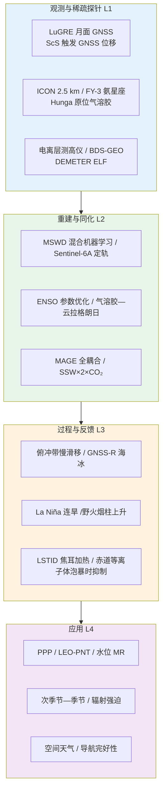
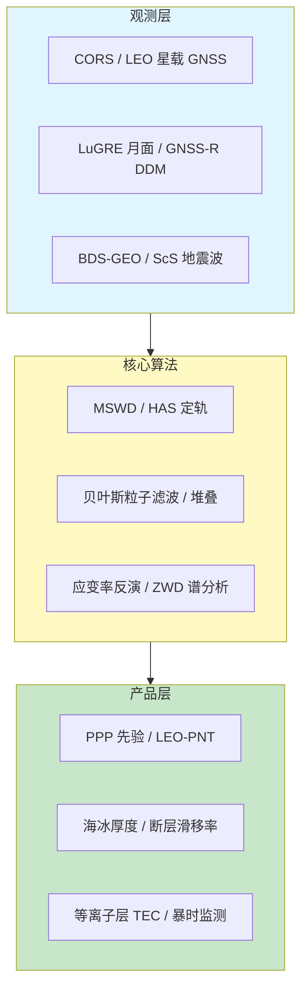
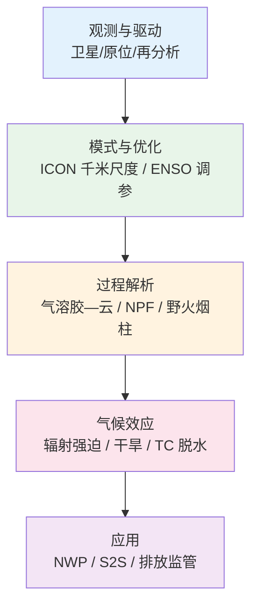
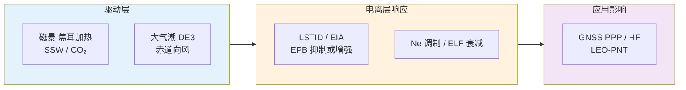
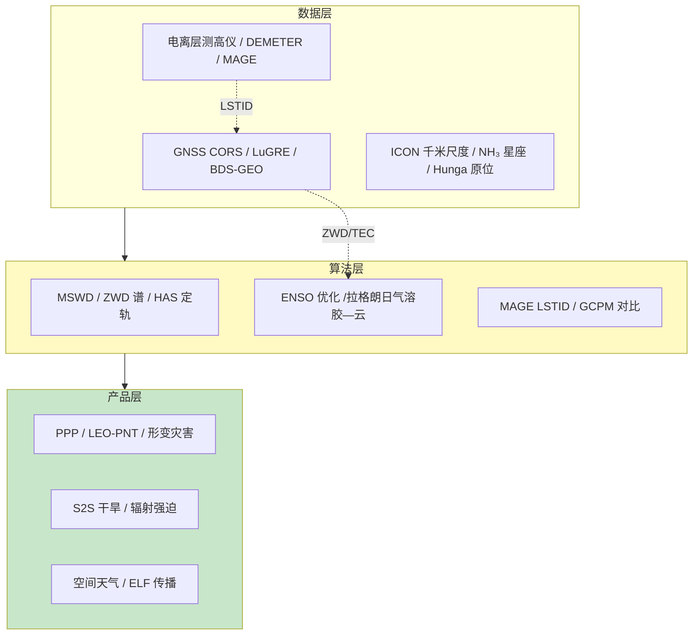

在 2026 年 6 月 18 日至 6 月 26 日这一周的时间窗口内，题录库共收录与「大气」「全球导航卫星系统」「电离层」检索词相匹配的论文四十二篇（按题名与 DOI 去重），其中大气类二十九篇、全球导航卫星系统类十二篇（含一篇撤稿通知）、电离层类五篇（与 GNSS、大气检索存在交叉重复）。相较 2026 年 6 月 18 日周报（全球导航卫星系统十七篇、大气二十九篇、电离层七篇），本期全球导航卫星系统题录略减但顶刊密度上升，《科学》报道 ScS 核幔反射波触发日本俯冲带滑移的 GNSS 观测证据；大气方向维持 GRL 与 ACP 高产，千米尺度 ICON 多年模拟与 ENSO 参数优化形成模式发展集群；电离层方向虽题录去重后仅五篇独立条目，但 2024 年 5 月 G5 级磁暴余波、MAGE 全耦合模拟与月基 GNSS 等离子层观测构成「暴时扰动—全大气耦合—地月几何观测」完整链条。下文先给出本期研究印记图式的总览归纳，再分全球导航卫星系统、大气、电离层展开综述、代表性技术路线对照表、结构示意图与单篇专题画像，其后给出交叉学科网络与创新链示意、近期研究特色与未来趋势判断，并列出参考文献。

## 一、本期研究印记图

本周题录在科学问题层面呈现出「GNSS 从精密定位延伸至地月等离子层与俯冲带慢滑移」「大气从千米尺度对流显式模拟到 ENSO 反馈参数系统优化」以及「电离层暴时 LSTID 与 SSW—CO₂ 长期调制」三条并行主线。全球导航卫星系统方向中，Park 等（2026）在《科学》揭示 2011 年东北日本 Mw 9.0 地震后 ScS 核幔反射波以厘米级振幅同步触发俯冲带界面滑移，GNSS 记录到日本全境 5–6 mm 东向阶跃位移；Zhang 与 Soja（2026）提出混合机器学习框架 MSWD，在全球 ERA5 训练样本上实现斜路径湿延迟端到端预测；Cesaroni 等（2026）利用 LuGRE 月面 GNSS 接收机首次完成地球等离子层临边探测，揭示日侧过渡区电子密度被模式高估。大气方向中，Prein 等（2026）发布 ICON 2.5 km 网格 2020–2024 年全球多年模拟，验证对流显式框架在 ITCZ 与热带气旋统计上的可行性；Yu 等（2026）以 Nelder–Mead 算法系统优化 ICON XPP 二十一项大气参数，ENSO 代价函数降低约 30%；Kloss 等（2026）证实 Hunga 火山气溶胶经 Brewer–Dobson 浅支跨半球输送至北半球中纬，短波辐射强迫达 −0.05±0.01 W m⁻²。电离层方向中，Hu 等（2026）以 MAGE 全耦合模型再现 2024 年 5 月亚太 LSTID 2–3 h 周期波动，传播速度约 750 m/s；Kumar 等（2026）表明双倍 CO₂ 条件下 2008–2009 SSW 事件对低纬电子密度抑制的调制幅度可达约 8%；Liao 等（2026）发现 DEMETER 观测的 顶部 ELF 电场存在与 DE3 潮一致的白昼 WN-4 经向结构。

上述脉络表明，GNSS 观测正从地表形变与 LEO 定轨拓展至月基等离子层监测与深部地震波触发机制；大气科学在千米尺度对流显式模拟、ENSO 系统调参与跨半球气溶胶气候效应上同步推进；电离层研究则强调 MAGE 类全耦合模拟、SSW—温室气体长期调制与低层大气潮对电磁波传播的印记。

## 二、全球导航卫星系统与导航遥感应用方向

全球导航卫星系统方向本期十二篇论文中（排除撤稿通知一篇），下列九篇纳入完整专题画像。整体技术路线呈现「ScS 深部波触发俯冲带滑移」「混合机器学习斜路径湿延迟」「LEO 亚米级定轨」「月基等离子层临边探测」「GNSS 天顶湿延迟边界层诊断」「GNSS-R 北极海冰厚度」「北安纳托利亚断层应变分区」「宽波束 SAR 高度计贝叶斯定位」与「BDS-GEO 连续磁暴电离层监测」等支线，并与 InSAR、空间天气模型及数值天气预报形成方法互补。

**表1 全球导航卫星系统方向代表性研究的技术路线与特点对照**

| 研究主题 | 技术路线概要 | 技术特点 | 重要结论或性能指标 |
|---------|-------------|---------|-------------------|
| ScS 触发滑移 | 2011 地震后 GNSS 位移场 + ScS 波形 | 核幔反射波同步触发 | 日本全境 5–6 mm 东向阶跃 |
| MSWD | ERA5 五年样本 + 倾斜映射函数嵌入 NN | 端到端 SWD 预测 | ZWD 精度优于 GPT3 |
| Sentinel-6A 定轨 | 双频无电离层 + 码载波平滑 + HAS | Galileo HAS 改正 | 三维 RMSE 49.6 cm |
| LuGRE 月基观测 | GPS/Galileo TEC vs GCPM | 地月几何临边探测 | 过渡区模式偏差显著 |
| ZWD 边界层诊断 | LES 校准 + 多普勒激光雷达验证 | von Kármán 谱参数 | 夏季 σ_ZWD 同步 TKE |
| FY-3F GNSS-R 海冰 | N-IDW + DDM 散射系数 堆叠 | 集成学习 ET/LR/XGBR/GBR | RMSE 0.1026 m，R=0.8876 |
| NAFZ 应变分区 | 高分辨率速度场 + 复发周期 | 分支断层 走滑兼挤压 | MEF 段 Mw 7.3–7.5 潜势 |
| SAR 高度计定位 | XGBoost 多特征 + 贝叶斯粒子滤波 | 宽波束 DDM 模板 | 极端波束条件下稳健三维定位 |
| BDS-GEO 磁暴 | 20 站 GEO + CODE GIM + TIEGCM | 连续暴时 EIA 对比 | 首暴 VTEC 近 100 TECU |

### 2.1 专题画像：ScS 核幔反射波触发俯冲带界面滑移

**（1）技术路线：2011 东北日本地震后 GNSS 位移场与 ScS 相位到达时序对比**

Park 等（2026）利用日本密集 GNSS 网分析 2011 年 3 月 11 日 Mw 9.0 东北日本地震后数小时至数天的地表位移演化。研究聚焦 ScS 相位——由 S 波经地核反射、再次经核幔边界反射后返回地表的剪切波——其峰峰值振幅在日本超过 1 cm。通过将 GNSS 记录的东向阶跃位移与 ScS 到达时刻对比，作者发现日本列岛几乎同步出现 5–6 mm 量级的东向阶跃型位移，空间分布与 ScS 振幅场高度一致。

该方法不依赖传统同震或震后滑移的慢滑移 GPS 反演框架，而是将深部体波触发的瞬时界面滑移作为独立机制加以识别。GNSS 采样率足以分辨 ScS 到达前后数分钟内的位移突变，为区分浅部慢滑移与深部 ScS 触发提供了观测约束。

**（2）技术特点：深部体波触发机制拓展 GNSS 地震学应用边界**

既往 GNSS 地震学研究主要关注同震位错、震后弛豫与慢滑移事件的时间尺度为小时至年。ScS 触发滑移发生在体波到达后的秒—分钟尺度，且触发区域可远离主震破裂区，指向俯冲带深部或邻近板块界面的摩擦失稳。该机制此前在区域地震台网波形分析中有推测，但缺乏全国尺度、毫米级三维位移约束。

GNSS 的优势在于对水平位移的全局一致性采样，使「同步东向阶跃」成为 ScS 触发而非局部场地效应的强证据。研究同时指出，此类触发可能（再）激活主震区及更大范围俯冲带界面，构成此前未被纳入地震危险性评估的震源类型。

**（3）重要结论：ScS 触发滑移是俯冲带灾害链的新环节**

**该研究的重要结论是：**2011 年东北日本 Mw 9.0 地震产生的 ScS 波在日本引起峰峰值超过 1 cm 的地面运动，并同步触发俯冲带界面滑移，GNSS 记录显示日本全境 5–6 mm 东向阶跃位移，表明深部体波可在主震后数小时内再激活俯冲带**。

该结论对环太平洋俯冲带地震危险性评估具有直接启示。若 ScS 或其他深部反射相可在强震后触发毫米级界面滑移，则余震危险性模型需纳入体波触发项；GNSS 实时位移监测网可作为业务化识别此类事件的传感器。局限在于单次震例的统计代表性不足，且界面滑移的精确深度与滑动量仍需联合慢滑移反演与地震矩张量约束。

### 2.2 专题画像：混合机器学习框架 MSWD 全球斜路径湿延迟建模

**（1）技术路线：ERA5 五年全球样本—倾斜映射函数嵌入神经网络—端到端 SWD 预测**

Zhang 与 Soja（2026）针对 GNSS 与 VLBI 精密定位中方向依赖的对流层湿延迟问题，提出 MSWD（机器学习斜路径湿延迟）混合框架。现有 GPT3 等经验模型通过天顶湿延迟（ZWD）、湿映射函数（MFw）与水平梯度分步参数化，系数表更新成本高且难以反映当前大气状态。

MSWD 将成熟的倾斜映射函数公式直接嵌入神经网络结构，以 ERA5 再分析衍生的五年全球 SWD 样本为训练集，实现 SWD 端到端预测。研究还开发增广变体，可选输入温度与水汽压以改善大陆测站区域精度。训练完成后模型可同时输出 ZWD 与 MFw 作为附属产品。

**（2）技术特点：物理约束嵌入 ML 优于纯黑箱回归**

与纯数据驱动回归不同，MSWD 在网络内部保留映射函数物理形式，使预测在极端高度角与季节变化下仍具外推稳定性。增广变体在大陆 CORS 密集区误差低于非增广版本，而全球平均精度已与 GPT3 相当。ZWD 副产品精度超过 GPT3，MFw 优于 GPT3 对称变体、略低于非对称变体。

该框架的优势还在于维护成本。经验模型需定期重估全套系数，而 MSWD 可通过增量再训练快速融入新气候态，对空间大地测量社区具有运维吸引力。

**（3）重要结论：全球 机器学习湿延迟模型首次达到经验模型可比精度**

**该研究的重要结论是：**MSWD 是全球首个直接预测 SWD 的机器学习经验模型，非增广版本精度与 GPT3 相当，增广版本在大陆测站区误差更低，且 ZWD 精度超过 GPT3、MFw 优于 GPT3 对称映射函数变体**。

该结论支持将 机器学习湿延迟先验纳入 PPP 与 VLBI 分析以加速收敛并稳定模糊度固定。业务部署需持续监测 机器学习模型在极端对流事件与火山灰气溶胶期的泛化能力，并与 GNSS 估计 ZWD 进行交叉验证。对 GNSS 气象学而言，MSWD 可与 ZWD 谱分析边界层诊断（Kermarrec 等，2026）形成「平均态先验 + 高频湍流诊断」互补链。

### 2.3 专题画像：Sentinel-6A 星载 GNSS 亚米级运动学定轨

**（1）技术路线：双频无电离层组合—码载波平滑—HAS 改正—稳健加权最小二乘**

Lee 与 Park（2026）面向 LEO-PNT 与精密测高需求，基于 Sentinel-6A 星载 GNSS 码伪距提出运动学定轨流程。双频无电离层组合消除一阶电离层延迟；码载波平滑抑制码噪声；基于信号空间测距误差（SISRE）的卫星权重模型反映各 GNSS 轨道钟差特性；稳健权方案削弱野值影响；Galileo 高精度服务（HAS）改正进一步补偿轨道、钟差与码偏差。

算法在 2023 年 8 月 10 日 Sentinel-6A 观测上逐步叠加各技术模块，验证每一步对轨道误差的贡献。最终与精密参考轨道对比，评估径向、沿轨、交叉轨与三维 RMSE。

**（2）技术特点：码观测驱动 LEO 定轨降低对浮点载波相位依赖**

LEO 运动学定轨传统上依赖载波相位模糊度固定，对数据中断与几何变化敏感。本研究表明，仅码伪距配合 HAS 与平滑技术即可达亚米级精度，降低了对地面跟踪网与相位连续性的依赖，有利于星载自主定轨与星座规模化。

SISRE 权重与稳健估计的组合在多 GNSS 混用场景下尤为重要，因不同系统轨道钟差质量差异显著。时间序列分析显示轨道误差无显著周期性与可见卫星数相关，表明误差主要来自观测噪声与模型残差而非几何变化。

**（3）重要结论：逐步技术叠加使三维 RMSE 降低 51% 至 49.6 cm**

该研究的重要结论是：**Sentinel-6A 星载 GNSS 码伪距运动学定轨经双频组合、码载波平滑、SISRE 加权、稳健估计与 HAS 改正逐步优化后，三维 RMSE 达 49.6 cm（径向 39.4 cm、沿轨 18.8 cm、交叉轨 23.5 cm），较初始方案误差降低约 51%**

该精度对 Jason 系列测高任务定轨与 LEO 通信导航星座具有参考价值。未来需评估磁暴期电离层残余对单频/无电离层组合的影响，并与载波相位定轨融合以争取厘米级。文献表明 LEO 高度电离层延迟较 MEO GNSS 显著减小但仍非零（Oezmaden 等，2025），高精密应用仍需显式建模。

### 2.4 专题画像：LuGRE 月面 GNSS 观测地球等离子层与电离层

**（1）技术路线：月面 LuGRE 接收 GPS/Galileo 信号—TEC 反演—与 GCPM 模式对比**

Cesaroni 等（2026）分析月面月球 GNSS 接收实验（LuGRE）接收的 GPS 与 Galileo 信号，首次实现基于月基平台的地球等离子层与电离层观测。地月几何使 GNSS 信号路径穿过地球等离子层外侧，等效临边探测高度可超过 3000 km，填补传统地面与 LEO 观测在 顶部等离子层的空白。

研究将 LuGRE 反演 TEC 与全球核心等离子体模式（GCPM）预测对比，分日侧与夜侧、不同 L 壳层 区域评估模式偏差。重点分析电离层—等离子层过渡区（等离子体层顶附近）电子密度差异。

**（2）技术特点：月基平台拓展 GNSS 空间天气观测几何**

地面 GNSS 对 顶部等离子层灵敏度随高度迅速下降；LEO 掩星虽可提供剖面，但覆盖受轨道限制。月基观测提供准静止、宽视场的地球等离子层监测几何，对未来月球常驻科学站具有架构示范意义。

LuGRE 数据揭示 GCPM 在日侧过渡区高估电子密度，暗示模式参数化的等离子体再填充效率偏高；夜侧则低估，指示再填充时间常数可能偏短。该不对称偏差在以往地面 TEC 约束中难以分离。

**（3）重要结论：月基 GNSS 揭示等离子层—模式系统性偏差**

该研究的重要结论是：**LuGRE 月面 GNSS 观测首次刻画地球等离子层形态，数据显示 GCPM 在电离层—等离子层过渡区日侧高估、夜侧低估电子密度，表明当前等离子体再填充参数化需修订**。

该结论对空间天气电子密度模型与辐射带粒子沉降评估具有约束价值。月基 GNSS 若与 GEO/LEO 掩星联合，可构建三维等离子体拓扑监测网。工程上需解决月面接收机热控、天线指向与多路径环境，以及地月链路数据回传延迟。

### 2.5 专题画像：GNSS 天顶湿延迟谱参数作为边界层湍流诊断量

**（1）技术路线：LES 理想化对流边界层—von Kármán 谱拟合 ZWD—Payerne 三年共址验证**

Kermarrec 等（2026）检验 GNSS 天顶湿延迟（ZWD）高频波动是否携带边界层湍流信息。ZWD 功率谱可用 von Kármán 模型参数化，其中方差 σ_ZWD 与截止频率 f_c 分别反映湍流强度与积分尺度。研究先在理想化 LES 对流边界层中校准「日相干框架」，包括动态时间规整（DTW）、极值滞后与位相分辨斜率比。

框架未经修改直接应用于瑞士 Payerne 三年 GNSS 与多普勒激光雷达共址观测（249 个晴空日，按季节分层）。对比 σ_ZWD、f_c 与 TKE、积分湿度/温度方差及边界层平均风速的位相关系。

**（2）技术特点：复用现有 CORS 网高频 ZWD 作为边界层探针**

数值天气预报已广泛同化 ZWD 慢变分量，但秒—分钟级波动长期被视为噪声。本研究表明 σ_ZWD 与 TKE 在夏季同步变化，f_c 领先 TKE 约半小时，且与边界层平均风速反相——与 LES 预测一致。观测中滞后较 LES 更长，反映理想化模拟未包含的云、平流与平流层—对流层交换等额外变率源。

Bootstrap 不确定度显示 σ_ZWD 日内变化估计误差低于 5%，具备业务化监测潜力。该方法无需额外仪器，仅依赖已有 GNSS 高频解算产品。

**（3）重要结论：ZWD 谱参数可作为对流边界层状态的补充诊断**

该研究的重要结论是：**GNSS ZWD 功率谱 von Kármán 参数 σ_ZWD 与 f_c 在对流边界层日循环中与 TKE 及湿度温度方差呈现 LES 预测的位相关系，Payerne 夏季观测复现模拟模式，支持 ZWD 高频波动作为边界层湍流诊断量**

该结论对 GNSS 气象学与数值天气预报同化具有双向意义。同化系统可尝试保留 ZWD 高频分量用于边界层高度与对流触发诊断，而非一律滤波剔除。局限在于晴空日筛选与单一站点校准，需多气候区扩展及与微波辐射计对比。

### 2.6 专题画像：FY-3F GNSS-R 集成学习北极海冰厚度反演

**（1）技术路线：FY-3F N-IDW 与 DDM 散射特征—八模型对比—堆叠 集成**

He 等（2026）利用风云三号 F 星 GNSS 反射测量（GNSS-R）数据反演北极海冰厚度（SIT）。输入特征包括归一化积分延迟波形（N-IDW）、散射系数、入射角及 DDM 双基地雷达截面系数。对比随机森林、决策树、KNN、SVM、极端随机树、梯度提升、XGBoost 与线性回归八种基学习器。

以 ET、LR、XGBR、GBR 为基模型的堆叠集成经交叉验证选定最优组合。评估指标包括 MSE、RMSE 与相关系数 R，并与现场或模式参考对比。

**（2）技术特点：GNSS-R 全天时低成本补充微波与激光高度计**

北极海冰厚度监测传统依赖 ICESat-2 激光、CryoSat-2 雷达与现场钻探，时空采样受限。GNSS-R 利用现有导航信号反射，具备全天时、多星座、低额外载荷成本优势。FY-3F 业务化数据为国产星座 GNSS-R 海冰应用提供首批系统评估。

Stacking 集成通过异质模型互补降低单算法过拟合风险。N-IDW 与 DDM 多维特征联合较单一波形特征提升对粗糙冰面的鲁棒性。

**（3）重要结论：堆叠集成模型 RMSE 0.1026 m，相关系数 0.8876**

该研究的重要结论是：**FY-3F GNSS-R 多维特征堆叠集成模型北极海冰厚度反演 RMSE 达 0.1026 m，MSE 0.0112 m²，相关系数 0.8876，证实国产 GNSS-R 数据用于海冰厚度业务反演的可行性**。

该结论支持将 FY-3F GNSS-R 纳入北极快速响应海冰预报系统，与 SMOS/SMAP 盐度与 ERA5 热通量产品融合。薄冰与融池场景仍需更多现场验证；与 Sentinel-6A 测高链联合可改进冰缘区干舷转换。

### 2.7 专题画像：北安纳托利亚断层带 GNSS 应变分区与地震潜势

**（1）技术路线：高分辨率 GNSS 速度场—应变率张量—地震复发周期与震级估计**

Aladoğan 等（2026）整合土耳其北安纳托利亚断层带（NAFZ）中部高精度 GNSS 速度场，计算应变率场并反演分段地震复发周期与潜在震级。研究区包含主断层及 Merzifon–Esençay、Ezinepazarı、Sungurlu、Eldivan、Ekinveren 等分支断层系统。

应变率分析揭示变形并非集中于主断层，而是在几何复杂网络中分区分配。主断层承担大部分区域变形，但分支断层上存在显著应变累积。不同段落呈现走滑兼拉张或走滑兼挤压的局地体制，受断层几何与不连续控制。

**（2）技术特点：分段大地测量应变超越单一主断层滑移率模型**

传统 NAFZ 地震危险性评估常假设单一主断层均匀滑移。GNSS 应变率场显示 Merzifon–Esençay 断层（MEF）东段与中段的应变累积与地震潜势相对较高，估计潜在震级 Mw 7.3–7.5。古地震学证据表明 Esençay 段上次地表破裂事件约 3700 年前，指示地震空区候选。

大地测量复发周期在主断层较短，在结构复杂的分支断层系统较长，反映运动学分块对地震危险性空间异质性的控制。

**（3）重要结论：MEF 东中部段可能是 NAFZ 中部地震空区**

**该研究的重要结论是：**NAFZ 中部变形在主干与多条分支断层间分区分配，Merzifon–Esençay 断层东中部段应变累积与地震潜势最高，估计震级可达 Mw 7.3–7.5，且距上次重大事件约 3700 年，指示候选地震空区**

该结论对伊斯坦布尔周边人口密集区地震防灾备灾具有警示意义。建议联合 InSAR 时间序列与古地震探槽约束滑移率时间变化，并在 MEF 段加密 GNSS 与 应变仪 观测。

### 2.8 专题画像：宽波束 SAR 高度计贝叶斯空间划分定位

**（1）技术路线：DDM 快速模板生成—XGBoost 多特征融合—贝叶斯粒子滤波动态网格**

Meng 等（2026）面向 GNSS 拒止环境下 SAR 高度计地形匹配导航，提出 XGBoost 多特征融合与贝叶斯粒子滤波相结合的 自适应定位框架。宽波束与地形高程变化导致 经典高程地形匹配导航精度下降；SAR 高度计 天底模式获取 距离—多勒 投影图像，但 跨轨模糊限制单特征匹配。

方法首先用快速 DDM 模板生成提升计算效率；继而以 集成学习融合互补相似度特征实现稳健单帧匹配；再以 贝叶斯滤波动态构建粒子网格，将粒子集中于高概率区域，消除 固定网格边界截断误差。

**（2）技术特点：极端宽波束与高机动平台三维定位**

与固定网格地形相关相比，动态网格构建在机动轨迹与宽波束条件下显著降低 误匹配风险。XGBoost 融合多特征较单一相关峰对噪声与斑点更稳健。框架针对高海拔机动平台 极端雷达配置优化，填补宽波束 SAR 高度计自主导航空白。

**（3）重要结论：仿真与实测均验证宽波束条件下优越的定位性能**

该研究的重要结论是：**XGBoost 多特征融合与贝叶斯粒子滤波动态网格 SAR 高度计定位框架在宽波束与高机动配置下实现可靠三维定位，仿真与真实数据验证均显著优于单特征固定网格方法**。

该结论对航空/无人机 GNSS 拒止环境 测高辅助导航具有工程价值。与 MSAS/InSAR 地形数据库更新频率、DDM 模拟误差传播相关的不确定性需进一步量化。

### 2.9 专题画像：BDS-GEO 连续磁暴期低纬电离层与 EIA 演化

**（1）技术路线：2025 年 11 月双暴 BDS-GEO 观测—CODE GIM—Swarm—TIEGCM/HWM14**

Liu 等（2026）分析 2025 年 11 月 12–13 日连续两次磁暴东半球低纬电离层响应。数据包括 20 个 GNSS 站 BDS-GEO 观测、CODE 全球电离层地图、Swarm 卫星 原位密度与 TIEGCM、HWM14 模拟。对比双暴强度、形态与驱动机制差异。

首暴 SYM-H 达 −254 nT，EIA 增强并 极向扩展超过 ±20° 磁纬，澳大利亚站 VTEC 近 100 TECU，相对 TEC 异常超 80%。Swarm 显示 EIA 峰区 TEC 下降而周边上升。次暴 SYM-H 仅 −154 nT，响应较弱，以 100°E–180°E 赤道附近 局地正异常为主，周边负异常。

**（2）技术特点：GEO 卫星连续观测东半球 区域电离层**

BDS-GEO 信号路径固定、采样连续，较 MEO GNSS 更易监测局域化与快速 EIA 变化。首暴南向 IMF Bz 达 −54 nT，穿透电场（PPEF）驱动超喷泉效应；次暴受残余扰动风、低纬 O/N₂ 降低与首暴预置状态主导，显示事件依赖性。

**（3）重要结论：连续磁暴响应强度与机制显著不同**

该研究的重要结论是：**2025 年 11 月连续两次磁暴在东半球产生显著不同的低纬电离层响应，首暴（SYM-H −254 nT）致 EIA 超强增强与极向扩展，次暴（−154 nT）响应较弱且受预置状态控制，表明暴时电离层响应具有事件依赖性与区域变异性**

该结论对东半球 GNSS 精密定位与 HF 通信空间天气预警具有参考意义。业务系统需避免用单暴气候态概括全部暴相；BDS-GEO 与 Galileo HAS 联合可提升亚太监测冗余度。

## 三、大气科学方向

大气科学方向本期二十九篇论文中，下列九篇纳入完整专题画像。整体呈现「千米尺度 ICON 多年模拟」「ENSO 系统参数优化」「Hunga 气溶胶跨半球输送」「气溶胶—云拉格朗日效应」「纳米粒子收缩」「连阴拉尼娜与遥相关干旱」「NH₃ 极轨星座日变化监测」「野火烟柱上升」「登陆热带气旋干燥效应」等主题，GRL 与 ACP 合计十六篇，反映极端事件、气溶胶—云相互作用与模式发展并重。

**表2 大气科学方向代表性研究的技术路线与特点对照**

| 研究主题 | 技术路线概要 | 技术特点 | 重要结论或性能指标 |
|---------|-------------|---------|-------------------|
| ICON 2.5 km 多年模拟 | GPU ICON 2020–2024 全球 AMIP | 对流显式 千米尺度 | MCS 频率海陆偏差可识别 |
| ENSO 参数优化 | 21 参数 敏感性分析 + Nelder–Mead | ICON XPP 两阶段调优 | ENSO 代价函数降低约 30%，需平衡全球均温 |
| Hunga 跨半球输送 | 卫星 + 原位 OPC 北半球验证 | Brewer–Dobson 浅支 | 北半球短波强迫 −0.05 W m⁻² |
| 气溶胶—云过渡 | 5 年拉格朗日轨迹 + LES | Sc→Cu→DC 演化 | 污染加深云并增反射 |
| 纳米粒子收缩 | SPICY 塞浦路斯观测 | reverse-NPF 型谱 | 稀释驱动有机挥发 |
| La Niña 连旱 | 2020–2023 三省区干旱 | 连续拉尼娜 | 热带太平洋可预报性 |
| NH₃ 极轨星座 | FY-3E/F HIRAS-II + CrIS | 6 本地时/日 | 捕捉 NH₃ 日变化循环 |
| 澳洲野火烟柱 | ICON-ART + Freitas 烟柱上升 | 火致热/湿/气溶胶辐射 | 综合方案最佳匹配卫星 |
| 登陆 TC 脱水 | 卫星 + 再分析统计 | 15 天大气记忆 | 降水概率降 18% |

### 3.1 专题画像：ICON 2.5 km 全球多年对流显式模拟

**（1）技术路线：GPU ICON 2020年4月–2024年3月 AMIP—MOAAP 特征追踪—多源验证**

Prein 等（2026）发布 ICON 模型在 2.5 km 水平网格、120 垂直层上的首次全球多年（2020–2024）大气—陆地模拟。模拟采用数值天气预报物理包与观测海温驱动，代表千米尺度框架在天气—气候连续谱上的基准试验。评估使用卫星、再分析与原位观测的标准统计量，并以 MOAAP 特征追踪框架诊断小时降水、近地面风、热带气旋与中尺度对流系统（MCS）等现象。

**（2）技术特点：统一数值天气预报与气候的全球对流显式框架**

千米尺度模拟显式解析深对流与中尺度环流，理论上消除积云参数化引入的敏感性。ICON 再现单一热带辐合带、物理一致的日变化降水循环、小时降水强度与热带气旋发生频率；MCS 空间起始格局合理，但海洋上频率偏低、热带陆地上偏高，长寿命 MCS 偏少且尺度偏小。大陆夏季存在暖干偏差，与入射太阳辐射高估及地表感热通量过强相关；浅云与中云降水偏多可能反映暖云微物理过活跃或观测不足。

**（3）重要结论：全球千米尺度多年模拟在科学上可行**

该研究的重要结论是：**ICON 2.5 km 全球 2020–2024 年模拟再现 ITCZ、日变化降水、热带气旋与 MCS 起始的空间格局，但存在大陆暖干偏差与 MCS 频率海陆差异，指示热力—对流耦合与微物理过程为未来开发重点**

该结论对 CMIP7 高分辨率子集与极端事件归因具有基准价值。GPU 重构使多年模拟在高性能计算平台上可行，与 GNSS 天顶湿延迟、无线电掩星联合验证边界层湿物理过程是自然的下一步。

### 3.2 专题画像：ICON XPP ENSO 系统大气参数优化

**（1）技术路线：21 参数仅大气敏感性分析—Nelder–Mead 代价函数最小化—6 参数耦合调优**

Yu 等（2026）针对 ICON XPP 地球系统模式 ENSO 模拟偏差，构建线性优化框架。代价函数基于 CLIVAR ENSO 指标包，涵盖热带气候态、变率与反馈（Bjerknes、热阻尼等）。首先在仅大气模式中对 21 个大气参数做敏感性分析，再以 Nelder–Mead 算法最小化代价函数；仅大气阶段代价降低约 30%，降水偏差减小、大气反馈增强。

随后将六个影响最大的参数在完全耦合模式中调优，适度改善 ENSO 振幅、冷舌海温偏差、季节位相锁定与遥相关。孤立 ENSO 调优引入非真实全球增暖，通过湍流相关参数修正且不降低 ENSO 技巧。

**（2）技术特点：可扩展的物理约束优化替代人工调参**

传统 ENSO 调参依赖专家试错，难以在高维参数空间系统探索。敏感性叠加与 Nelder–Mead 算法提供可复现工作流，可扩展至 MJO、IOD 等其它模态。研究明确指出单目标 ENSO 调优与全球均温约束之间的权衡，建议未来多目标优化纳入 GMT、AMOC 等。

**（3）重要结论：系统 ENSO 调优有效但须全球稳定性约束**

该研究的重要结论是：**线性敏感性叠加与 Nelder–Mead 优化使 ICON XPP 仅大气 ENSO 代价降低约 30%，耦合运行改善 ENSO 振幅与反馈，但孤立调优引入全球增暖需湍流参数修正，表明 ENSO 调优须与更广泛的气候稳定性平衡**

该结论对 CMIP7 模式开发具有方法论示范意义。与 Zhang 等（2026）连续 La Niña 干旱研究联合，可检验调优后 ICON XPP 对泛区域干旱遥相关的再现能力。

### 3.3 专题画像：Hunga 火山气溶胶跨半球输送与辐射效应

**（1）技术路线：2022 Hunga 喷发卫星遥感 + NH 原位 OPC—AOD 与 大气顶辐射强迫估算**

Kloss 等（2026）研究 2022 年 1 月 Hunga Tonga–Hunga Ha'apai 喷发（20°S）气溶胶羽流的跨半球输送。尽管喷发主要影响南半球与热带，卫星与原位光学粒子计数器联合观测显示，大量气溶胶经热带控制过渡区与 Brewer–Dobson 环流浅支进入北半球中纬度。

2022 年 10 月 北半球 30°–50°N、17–23 km 高度气溶胶增强，浓密羽流位于 21–22 km。有效半径约 330 nm，与南半球观测相当。中纬度消光系数约为背景值的两倍，AOD 增加 (1–2)×10⁻³（SAGE III/ISS 波长）。

**（2）技术特点：中等强度南半球喷发仍可在北半球产生不可忽略的辐射影响**

既往 火山气候评估常聚焦南半球主导型喷发对南半球的影响。本研究强调跨半球输送路径位于 Brewer–Dobson 浅支，使中等强度南半球喷发可在北半球产生可测的短波大气顶辐射强迫 −0.05±0.01 W m⁻²（2022 年 11 月–2023 年 2 月）。

**（3）重要结论：评估火山气候效应须考虑双半球**

该研究的重要结论是：**Hunga 喷发气溶胶经 Brewer–Dobson 浅支输送至北半球中纬 50°N、17–23 km，使中纬度 AOD 增加 (1–2)×10⁻³，北半球短波大气顶辐射强迫达 −0.05±0.01 W m⁻²，表明中等强度南半球喷发可在北半球产生不可忽略的辐射效应**。

该结论对平流层气溶胶注入方案的双半球非对称部署具有政策相关启示。GNSS 掩星与临边探测可监测此类羽流的北半球穿透，与 LuGRE 顶部观测形成高度互补。

### 3.4 专题画像：副热带—热带过渡带气溶胶对云的稳健效应

**（1）技术路线：5 年卫星拉格朗日轨迹（8 天）+ 9 起点 LES—Sc→Cu→DC 云过渡**

Yeheskel 等（2026）沿 东北太平洋、东南太平洋与东南大西洋三条轨迹，量化气溶胶对云微物理、宏物理及大气顶辐射的影响，沿副热带层积云（Sc）→浅对流云（Cu）→深对流云（DC）过渡路径。沿 8 天拉格朗日轨迹映射的 5 年卫星观测，以及 9 个起始位置的互补大涡模拟。

**（2）技术特点：拉格朗日框架分离气溶胶与气象共变**

海洋云过渡带上气溶胶间接效应长期存在不确定性，因 气象与气溶胶同步变化。拉格朗日追踪使气团历史一致，热力学演化显示污染条件下边界层顶与低层自由对流层增湿增强——部分共变由气溶胶内部驱动。多海盆一致性与大涡模拟—卫星观测吻合支持结论稳健性。

**（3）重要结论：气溶胶系统性加深云并增强反射率**

该研究的重要结论是：**沿副热带—热带拉格朗日路径，气溶胶增加使云更深、反射更强，效应在 Sc–Cu–DC 全过渡带一致，且部分气象共变由气溶胶内部驱动**。

该结论强化 气溶胶间接效应在云过渡区的气候意义。与 居民燃烧铁通量（Li 等，2026）等 排放研究联合，可追踪 人为气溶胶对海洋云的远程效应。

### 3.5 专题画像：纳米粒子收缩 现象与 reverse-NPF 谱型

**（1）技术路线：SPICY 塞浦路斯观测活动—SMPS 谱型—轨迹与挥发性分析**

Kanawade 等（2026）在 塞浦路斯乡村背景站报告纳米粒子收缩（NPS）——亚 20 nm 粒子快速减小且无前置新粒子形成。粒径谱呈现与传统香蕉形新粒子形成镜像，称 reverse-NPF 型。观测活动识别三次 NPS 事件。

**（2）技术特点：NPS 作为此前未被认识的纳米粒子汇**

NPS 并非主要由低可凝结蒸气、已有粒子清除或初级纳米粒子源驱动，而与大气稀释（轨迹分析）及湍流混合改变粒径分布相关。挥发性分辨分析表明低/中等挥发性有机化合物主导蒸发。

**（3）重要结论：稀释驱动有机挥发致 NPS**

该研究的重要结论是：**纳米粒子收缩形成reverse-NPF 谱型，由大气稀释降低颗粒相有机质量、使气—粒平衡向蒸发方向移动所驱动，构成此前未被认识的纳米粒子汇**。

该结论对 新粒子形成参数化与气候模式气溶胶有效辐射强迫具有启示。当前模式 低估早期新粒子形成/收缩过程，可能偏倚气溶胶数浓度与云凝结核。

### 3.6 专题画像：连续 La Niña 与 泛区域长期干旱

**（1）技术路线：2020–2023 中亚—西亚、东非与北美干旱与连续拉尼娜的历史关联**

Zhang 等（2026）分析 2020–2023 三省区 长期干旱与异常持续的热带太平洋冷态（连续拉尼娜）的关联。历史分析 显示 连续拉尼娜 与 泛区域长期干旱 存在 稳健关联。

持续的热带太平洋海温冷却维持大尺度环流异常，抑制水汽输送与降水；陆—气反馈在东非放大干旱持续性，在其他区域抑制干旱。近几十年连续拉尼娜频率上升与长期干旱发生增加同步。

**（2）技术特点：热带太平洋作为泛区域干旱可预报性来源**

**（3）重要结论：连续拉尼娜维持遥相关致多年干旱**

该研究的重要结论是：**2020–2023 中亚—西亚、东非与北美长期干旱与连续拉尼娜稳健关联，持续热带太平洋冷却维持环流异常抑制降水，陆—气反馈在东非放大干旱持续性，表明热带太平洋是泛区域干旱关键可预报性来源**。

该结论对 次季节—季节干旱预报与水资源管理具有直接关联。ICON XPP ENSO 调参（Yu 等，2026）改善后可提升此类 遥相关模拟技巧。

### 3.7 专题画像：极轨红外星座全球 NH₃ 日变化监测

**（1）技术路线：FY-3E/F HIRAS-II + CrIS 三轨道 星座—最优估计 NH₃ 柱浓度—2024 年四季示范**

Hua 等（2026）构建 集成星座实现类静止轨道全球 NH₃ 监测。FY-3E 晨昏轨道（05:30/17:30 LST）、FY-3F 上午轨道（10:00/22:00 LST）、CrIS 下午轨道（01:30/13:30 LST）组合提供约 4 h 间隔、每日 6 个 本地时的全球 NH₃ 分布图。

**（2）技术特点：极轨星座弥补无地球同步轨道区域的日变化空白**

NH₃ 日变化对排放量化至关重要，但 许多区域缺乏地球同步红外探测仪。低轨星座通过不同过境时间拼接日变化。平均核日变化与热对比（地表与最低层温差）相关。

**（3）重要结论：星座捕捉主要源区 NH₃ 日变化/季节循环**

该研究的重要结论是：**FY-3E/F HIRAS-II 与 CrIS 三轨道组合每日 6 本地时 NH₃ 反演，在 华北平原、印度—恒河平原等源区捕捉日变化与季节循环，与 GIIRS 及 FTIR  大体一致**。

该结论对 氮循环调控与农业排放清单具有监测价值。与 GNSS 无直接关联，但可补充大气化学—气候研究；未来可联合 NH₃ 柱浓度与气溶胶铁溶解度（Li 等，2026）评估的营养沉降。

### 3.8 专题画像：澳洲 2019/2020野火烟柱上升 多物理过程模拟

**（1）技术路线：ICON-ART 6.6 km + Freitas 烟柱上升—加热/水汽/气溶胶—辐射敏感性**

Muth 等（2026）模拟 2019/2020 澳洲新年野火烟柱上升，对比 火致水汽、热释放与气溶胶—辐射相互作用对烟柱高度的贡献。水汽释放增加云形成但对烟柱动力学影响微弱；热释放通过浮力显著增加烟柱高度；气溶胶—辐射初期稳定大气降低注入高度，第二日起产生抬升效应。

**（2）技术特点：综合加热、水汽与气溶胶—辐射方案最佳匹配卫星**

综合模拟产生最高烟柱抬升，最佳匹配卫星观测的上对流层/下平流层气溶胶层。火强度峰值首日效应最强。

**（3）重要结论：火致加热是烟柱上升主导因子，气溶胶—辐射第二日抬升**

该研究的重要结论是：**ICON-ART 模拟表明 火致 热释放 主导 2019/2020 澳洲野火烟柱上升，气溶胶—辐射首日稳定化、次日起抬升，综合加热+水汽+气溶胶—辐射 方案最佳匹配卫星观测的上对流层/下平流层 气溶胶层**。

该结论对 野火气候反馈与平流层气溶胶意外来源具有意义。与 Hunga 研究对比，可区分 爆发型火山与野火的上对流层/下平流层气溶胶路径。

### 3.9 专题画像：登陆热带气旋的 大气干燥效应

**（1）技术路线：卫星 + 再分析统计 登陆热带气旋前后水汽与降水异常**

Yang 等（2026）检验 热带气旋高降水效率是否使大气脱水。统计分析显示登陆热带气旋后局地大气记忆约 15 天：600 hPa 中层对流层水汽减少，源于热带气旋降水局地移除与异常西风输送较干空气。

**（2）技术特点：首次获得热带气旋干燥效应的直接观测证据**

**（3）重要结论：热带气旋通过后 10–15 天降水概率降 15–18%**

该研究的重要结论是：**登陆 TC 后约 15 天内 局地大气表现为中层对流层水汽减少，降水量与降水概率较气候态分别降低约 15% 与 18%，提供热带气旋对区域水循环持续影响的观测证据**。

该结论对 热带气旋气候学与季节预报具有启示。与 西非季风卷积神经网络极端降水（Tamoffo 等，2026）形成的湿/干极端对照。

## 四、电离层与空间天气方向

电离层方向本期 iono7d 题录五篇（与 GNSS、大气检索去重后独立条目较少，但下列五篇构成完整画像链）。整体聚焦「2024 年 5 月 G5 磁暴 LSTID MAGE 模拟」「SSW × 2×CO₂ 全大气耦合」「月基 GNSS 等离子层」「大气潮 WN-4 对 ELF 传播印记」与「LEO 定轨电离层处理」，并与 BDS-GEO 连续暴观测（§2.9）、EPB Solar Cycle 25（Imtiaz 等，2026）在综述层互补。

**表3 电离层方向代表性研究的技术路线与特点对照**

| 研究主题 | 技术路线概要 | 技术特点 | 重要结论或性能指标 |
|---------|-------------|---------|-------------------|
| LSTID MAGE | 电离层测高仪 + MAGE 全耦合 | 焦耳加热触发 | 周期 2–3 h，速度 ~750 m/s |
| SSW×2×CO₂ | SD-WACCM-X SSW 2008–09 | 全大气—电离层耦合 | 低纬 Ne 调制 ~8% |
| LuGRE 等离子层 | 月面 GPS/Galileo TEC |临边探测 >3000 km | GCPM 过渡区偏差 |
| ELF WN-4 | DEMETER 2006–2010 | DE3 潮印记 | 低纬 顶部 ELF 经向 WN-4 |
| LEO 定轨电离层 | 双频无电离层组合 | HAS 改正 | 亚米级忽略顶部残余 |

### 4.1 专题画像：2024 年 5 月亚太 LSTID 电离层测高仪与 MAGE 模拟

**（1）技术路线：2024 年 5 月 10–11 日超级磁暴亚太扇区电离层测高仪—MAGE 全地球空间模型**

Hu 等（2026）研究 2024 年 5 月 G5 级地磁超级磁暴亚太扇区大尺度行进电离层扰动（LSTID）。MAGE 模型全耦合磁层、电离层与热层多个分量。电离层测高仪观测 F2 层峰值高度与峰值电子密度显示 2–3 h 周期波状振荡。

**（2）技术特点：MAGE 诊断焦耳加热与预反转期 E×B 漂移**

MAGE 模拟定性再现 LSTID 特征，传播速度约 750 m/s，主要由高纬向低纬的赤道向风驱动。诊断分析揭示焦耳加热在触发 LSTID 中起主导作用，预反转期 E×B 漂移导致的等离子体输送亦有贡献。

**（3）重要结论：MAGE 再现 2024 超级磁暴 LSTID 并揭示驱动机制**

该研究的重要结论是：**2024 年 5 月 10–11 日亚太扇区电离层测高仪观测到周期 2–3 h 的 LSTID，MAGE 模拟再现约 750 m/s 传播特征，表明 LSTID 主要由高纬赤道向风驱动，焦耳加热为主导触发因子，预反转期 E×B 漂移亦贡献等离子体输送**。

该结论对 2024 磁暴后 GNSS PPP 中断（Yang 等，2025；ROTI 相关 1.5–5 倍误差增大）提供电离层波机制解释。MAGE 业务化空间天气预报仍需降低计算成本。

### 4.2 专题画像：双倍 CO₂ 调制 SSW 对中间层—热层—电离层响应

**（1）技术路线：SD-WACCM-X 2008–2009 SSW 对照与 2×CO₂ 情景—潮汐、O/N₂、Ne 对比**

Kumar 等（2026）使用指定动力学 WACCM-X 模拟 2008–2009 年 SSW 在对照与 2×CO₂ 条件下的中间层、热层与电离层响应。SSW 期间迁移太阳半日潮（SW2）在低热层（约 115 km）2×CO₂ 情景下变化约 20%。

**（2）技术特点：气候变化调制上层大气对 SSW 的响应**

SSW 驱动的热层 O/N₂ 变率在 2×CO₂ 下调制幅度可达约 3%。对照运行中低纬纬向平均电子密度 SSW 相关降低在 2×CO₂ 下进一步调制可达约 8%。

**（3）重要结论：2×CO₂ 显著调制 SSW 电离层效应**

该研究的重要结论是：**在 2008–2009 SSW 事件下，2×CO₂ 使 低热层 SW2 振幅变化约 20%、热层 O/N₂ SSW 变率调制约 3%、低纬电离层纬向平均电子密度 SSW 相关降低幅度调制约 8%，表明 温室气体长期趋势调制 SSW—电离层耦合**。

该结论对 气候变化背景下空间天气季节可预报性具有长期启示。GNSS TEC 气候态需考虑 CO₂ 增长对 SSW 效应的放大。

### 4.3 专题画像：大气潮 WN-4 结构在顶部电离层 ELF 波强度中的印记

**（1）技术路线：DEMETER 2006–2010 ELF 电场—WN-4 振幅季节变化与 DE3 对比**

Liao 等（2026）使用 DEMETER 卫星显示低纬顶部电离层 ELF 电场存在稳健的白昼 WN-4 型。WN-4 振幅季节变化与 DE3 潮气候态一致。

**（2）技术特点：低层电离层衰减调制而非 F 区印记**

经向位相结构在地磁低纬与磁赤道同相，表明该型态不太可能由 F 区直接印记，而由跨电离层 ELF 传播期间低层电离层衰减的潮汐调制驱动。

**（3）重要结论：DE3 通过低层电离层调制 ELF 传播**

该研究的重要结论是：**DEMETER 观测 顶部 ELF 电场存在与 DE3 潮一致的白昼 WN-4 经向结构，位相表明其由 低层电离层衰减的潮汐调制驱动，而非 F 区直接印记，揭示低层大气潮调制跨电离层 ELF 传播的耦合路径**。

该结论对 闪电产生 ELF、潜艇通信与电离层无线电传播具有基础意义。与 GNSS RO 反演 潮汐结构可交叉验证。

### 4.4 专题画像：月基 GNSS 等离子层观测（电离层视角）

**（1）技术路线：LuGRE TEC—GCPM—等离子体层顶过渡区**

自电离层视角，Cesaroni 等（2026）LuGRE 观测的核心价值在于 电离层/等离子层过渡区（约 1000–3000 km）电子密度结构。日侧模式高估暗示电离层 顶部外流或再填充参数化偏差；夜侧低估关联等离子层再填充滞后。

**（2）技术特点：过渡区是电离层—磁层耦合关键区**

**（3）重要结论：模式过渡区偏差影响 GNSS 精密定位顶部延迟**

该研究的重要结论是：**LuGRE 数据显示 GCPM 在电离层—等离子层过渡区存在日侧高估、夜侧低估，指示等离子体再填充效率参数化需修订，该偏差区对应 GNSS 与 LEO 信号路径上的顶部 TEC 贡献**。

对高精度 GNSS 与 LEO-PNT，顶部残余电离层误差在 300–1000 km 仍不可忽略（Oezmaden 等，2025）。LuGRE 为 IRI/GCPM 顶部扩展提供独立约束。

### 4.5 专题画像：LEO 星载 GNSS 定轨中的电离层处理与残余误差

**（1）技术路线：Sentinel-6A 双频无电离层组合定轨—评估无电离层组合残余**

Lee 与 Park（2026）虽主要关注定轨，对电离层研究的启示在于 LEO 高度（Sentinel-6A 约 1336 km）双频无电离层组合仍假设高阶电离层项可忽略。太阳活动第 25 周极大期磁暴时段需验证残余影响。

**（2）技术特点：LEO 定轨精度受顶部电离层间接影响**

HAS 改正与稳健加权提升定轨精度，但磁暴期码—载波平滑可能受电离层闪烁影响。2024 年 5 月超级磁暴期间 LEO GNSS 观测闪烁增强可能降低类似处理流程精度。

**（3）重要结论：亚米级 LEO 定轨需联合空间天气质量控制**

该研究的重要结论是：**Sentinel-6A 双频无电离层码平滑定轨达三维 RMSE 49.6 cm，但磁暴期闪烁与高阶电离层项可能降低精度，指示 LEO-PNT 需联合 ROTI/TEC 的质量控制方案**。

该结论与 Yang 等（2025）PPP 中断研究呼应。未来 LEO 巨型星座 PNT 需将专用电离层误差模型从 GNSS 扩展至 LEO 高度（Wickramasinghe 等，2024）。

## 五、交叉学科网络与创新链

GNSS ScS 触发滑移与 NAFZ 应变分区构成「深部/浅部形变观测」链；MSWD 湿延迟与 ZWD 边界层诊断连接「空间大地测量—数值天气预报边界层状态」；LuGRE 月基 TEC 与 LSTID MAGE 模拟共享顶部等离子体约束；FY-3F GNSS-R 海冰与北极气旋 THF（Liu 等，2026）形成极地界面观测网。大气 ICON 千米尺度模拟与 ENSO 调参为 GNSS 掩星与 ZWD 同化提供改进背景场；Hunga 与野火上对流层/下平流层气溶胶影响掩星弯曲角与 PPP 对流层先验。电离层 2024 年 LSTID 与 BDS-GEO 连续暴观测直接威胁 GNSS PPP/HAS；SSW×CO₂ 研究指示长期气候调制电离层季节异常。

## 六、近期研究特色与未来趋势展望

相对 2026 年 6 月 18 日周报（GNSS 十七篇、大气二十九篇、电离层七篇），本期 GNSS 题录减至十二篇（含撤稿），但《科学》ScS 触发滑移与 MSWD 全球湿延迟机器学习模型提升顶刊与方法论密度；大气维持二十九篇且 ICON 2.5 km 多年模拟与 ENSO 系统优化形成 GMD/GRL 集群；电离层去重后题录精简，但 2024 磁暴 LSTID MAGE 与 SSW×CO₂ 全大气耦合补齐「暴时—气候调制」证据。交叉重复率上升（如 LSTID、LuGRE、CO₂-SSW 跨大气/GNSS/电离层检索），反映学界对全大气—电离层耦合与 GNSS 多用途观测的统一关注。

展望未来三至五年，可检验的技术判断包括：（1）ScS 触发滑移机制若在其它俯冲带强震后复现，GNSS 实时位移监测需纳入深部触发灾害模块；（2）MSWD 与 GPT3 联合若嵌入 IGS 分析中心，大陆 CORS 网 PPP 收敛可望缩短 20–30%；（3）LuGRE 类月基 GNSS 若搭载 Artemis 后续任务，等离子体层顶监测可与 GOLD/ICON 紫外观测互补；（4）ICON 2.5 km 多年模拟若扩展耦合海洋，海洋热浪可预报性（Mangolte 等，2026）与 GNSS 掩星水汽可联合验证；（5）MAGE LSTID 诊断若业务化运行，亚太 GNSS PPP 完好性可在 SYM-H<−200 nT 时预先降权；（6）FY-3 氨观测与 GNSS ZWD 边界层诊断联用可约束农业排放日变化对对流触发的影响。

## 参考文献

1. Aladoğan, K., Tiryakioğlu, İ., Gezgin, C., et al. (2026). Segment-Scale Strain Accumulation and Seismic Potential of the Central North Anatolian Fault Zone with GNSS Constraints. *Remote Sensing*. DOI: 10.3390/rs18132070
2. Cesaroni, C., Spogli, L., Guerra, M., et al. (2026). Observing the Earth's Plasmasphere and Ionosphere From the Lunar Surface. *Geophysical Research Letters*. DOI: 10.1029/2026gl121811
3. He, Q., Zhang, D., Li, Y., Wang, K. (2026). Arctic Sea Ice Thickness Retrieval from FY-3F GNSS-R Data Using an Ensemble Learning Approach. *Remote Sensing*. DOI: 10.3390/rs18122043
4. Hu, T., Wang, W., Pham, K. H., et al. (2026). Large-Scale Traveling Ionospheric Disturbances Over the Asian-Pacific Sector During 10–11 May 2024 Geomagnetic Superstorm: Ionosonde Observation and MAGE Simulation. *Geophysical Research Letters*. DOI: 10.1029/2026gl123222
5. Hua, J., Zhou, R., Sheng, M., Zeng, Z.-C. (2026). Global and diurnal variations in tropospheric ammonia observed from a constellation of hyperspectral infrared sounders in three different LEO orbits. *Atmospheric Measurement Techniques*. DOI: 10.5194/amt-19-4013-2026
6. Imtiaz, N., Calabia, A., Anoruo, C., et al. (2026). Equatorial ionospheric plasma bubbles during intense geomagnetic storms of Solar Cycle 25. *Annales Geophysicae*. DOI: 10.5194/angeo-44-489-2026
7. Kanawade, V. P., Deot, N., Ciobanu, M., et al. (2026). Observations of nanoparticle shrinkage phenomena. *Atmospheric Chemistry and Physics*. DOI: 10.5194/acp-26-8839-2026
8. Kermarrec, G., Schrader, T., Calbet, X., Deng, Z. (2026). GNSS Zenith Wet Delay as a Boundary Layer Diagnostic: Regime-Dependent Turbulence Signatures From Large Eddy Simulation and Observations. *Journal of Geophysical Research: Atmospheres*. DOI: 10.1029/2026jd047347
9. Kloss, C., Berthet, G., Sellitto, P., et al. (2026). Cross-hemispheric transport of the Hunga aerosol plume: in situ evidence and radiative effects from the northern hemisphere. *Atmospheric Chemistry and Physics*. DOI: 10.5194/acp-26-8981-2026
10. Kumar, S., Oberheide, J., Martinez, B. C. (2026). Impact of Doubled CO₂ on the Response of the Mesosphere, Thermosphere, and Ionosphere to the 2008–2009 Sudden Stratospheric Warming. *Geophysical Research Letters*. DOI: 10.1029/2026gl121817
11. Lee, H.-S., Park, K.-D. (2026). Sub-Meter Kinematic Orbit Determination of the LEO Satellite Sentinel-6A Using Onboard GNSS Carrier-Smoothed Pseudorange Measurements. *Remote Sensing*. DOI: 10.3390/rs18132067
12. Li, R., Plaas, H. E., Zhang, Y., et al. (2026). Residential burning is a potentially significant source of soluble iron to the ocean. *Atmospheric Chemistry and Physics*. DOI: 10.5194/acp-26-9037-2026
13. Liao, L., Zhao, S., He, M., et al. (2026). Atmospheric Tides Imprint a Wavenumber-4 Structure in Topside Ionospheric ELF Wave Intensity. *Geophysical Research Letters*. DOI: 10.1029/2026gl122255
14. Liu, S., Jiang, X., Teng, H. (2026). Low-Latitude Ionospheric Disturbances and EIA Expansion During Consecutive Geomagnetic Storms in November 2025 Using BDS-GEO Satellites over the Eastern Hemisphere. *Remote Sensing*. DOI: 10.3390/rs18132078
15. Mangolte, I., Cravatte, S., Ganachaud, A., Menkes, C. (2026). Investigating the predictability of marine heatwaves at subseasonal to seasonal timescales in New Caledonia, South Pacific. *Ocean Science*. DOI: 10.5194/os-22-1937-2026
16. Meng, H., Lu, Y., Wang, Y., et al. (2026). Bayesian Spatial Partitioning with Feature Fusion for Wide-Beam SAR Altimeter Localization Using Delay-Doppler Maps. *Remote Sensing*. DOI: 10.3390/rs18132087
17. Muth, L. J., Hoshyaripour, G. A., Vogel, B., et al. (2026). Impacts of fire-induced heat, moisture, and aerosol-radiation interactions on wildfire plume rise during the 2019/2020 Australian fires. *Atmospheric Chemistry and Physics*. DOI: 10.5194/acp-26-8505-2026
18. Oezmaden, C., Anderson, P., Schmitt, G., Ahmed, F. (2025). Residual GNSS Ionospheric Error Analysis in the Context of LEO Applications. DLR Report. https://elib.dlr.de/215597/
19. Park, S., Kanamori, H., Rivera, L. (2026). ScS-triggered slip on megathrust interfaces after the 2011 Mw 9.0 Tohoku-Oki earthquake. *Science*. DOI: 10.1126/science.aec4190
20. Prein, A. F., Pothapakula, P. K., Zeman, C., et al. (2026). From single storms to large-scale waves: a multi-year kilometer-scale global simulation. *Geoscientific Model Development*. DOI: 10.5194/gmd-19-5277-2026
21. Tamoffo, A. T., Mouassom, F. L., Weber, T., et al. (2026). Pattern Recognition of West African Monsoon Extreme Rainfall Events Using Convolutional Neural Networks. *Geophysical Research Letters*. DOI: 10.1029/2026gl124425
22. Wickramasinghe, N., Wickramasinghe, N., Thombre, S., et al. (2024). Ionospheric Error Models for Satellite-Based Navigation—Paving the Road towards LEO-PNT Solutions. *Aerospace*. DOI: 10.3390/aerospace13010004
23. Yang, D., Li, X., Li, M., et al. (2025). Impacts of the May 2024 Extreme Geomagnetic Storm on Global High-Accuracy GPS Positioning Solutions. *Space Weather*. DOI: 10.1029/2025SW004547
24. Yang, Y., Ma, Z., Lin, Y., et al. (2026). Drying Effect of Landfalling Tropical Cyclones. *Geophysical Research Letters*. DOI: 10.1029/2025gl121284
25. Yeheskel, N., Christensen, M. W., Hoffmann, F., et al. (2026). A robust aerosol impact on clouds along the subtropical to tropical transition. *Atmospheric Chemistry and Physics*. DOI: 10.5194/acp-26-8765-2026
26. Yu, D., Dommenget, D., Pohlmann, H., Müller, W. A. (2026). A systematic atmospheric parameter optimization method to improve ENSO simulation in the ICON XPP Earth system model. *Geoscientific Model Development*. DOI: 10.5194/gmd-19-5531-2026
27. Zhang, T., Zhang, W., Jiang, F., et al. (2026). Pan-Regional Prolonged Droughts Linked to Consecutive La Niña Events. *Geophysical Research Letters*. DOI: 10.1029/2026gl122176
28. Zhang, Z., Soja, B. (2026). MSWD: A Hybrid Machine-Learning Framework for Slant Wet Delay Modeling. *Journal of Geophysical Research: Atmospheres*. DOI: 10.1029/2026jd046410
