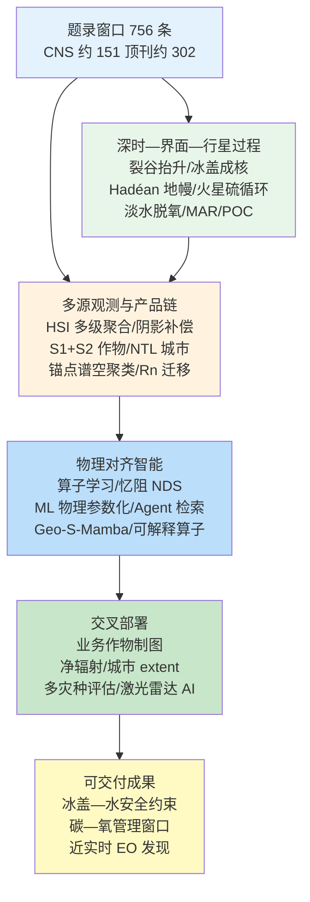
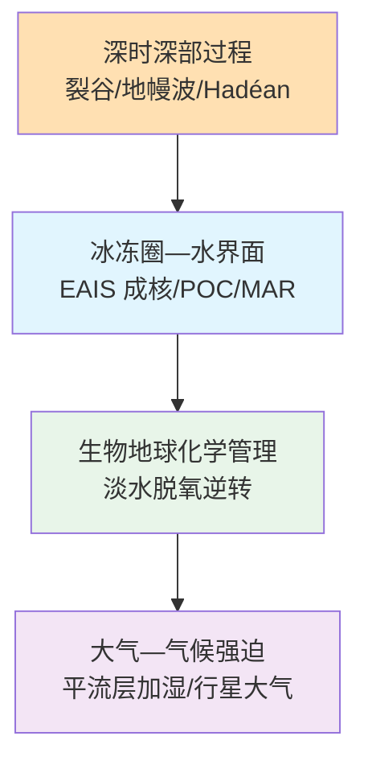
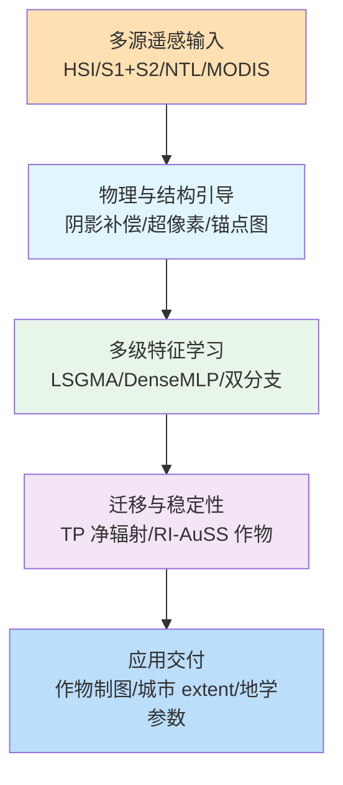
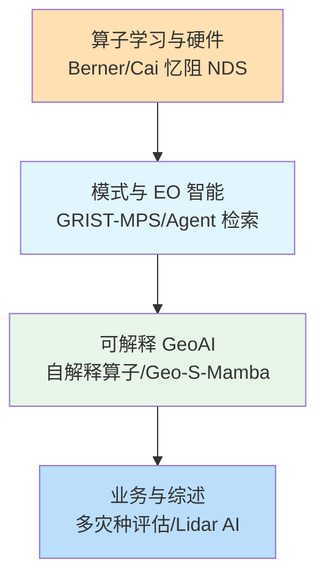
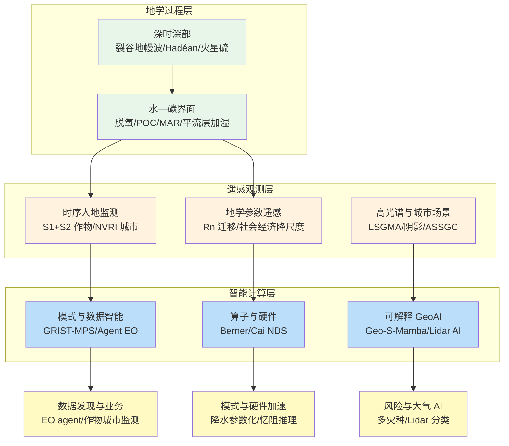

在 2026-06-26 至 2026-07-04 窗口内，《自然》《科学》《遥感》《自然·地球科学》《自然·水》《地球物理研究快报》《水文与地球系统科学》《自然·机器智能》等来源共收录 756 篇论文条目，其中《细胞》《自然》《科学》系列约 151 篇，地学、遥感与智能计算相关顶刊及特色期刊约 302 篇。地学侧同时出现侏罗纪大陆裂解—地幔波抬升驱动东南极冰盖成核、Hadéan 布里奇曼石被现代洋岛火山采样、火星盖尔陨石坑原位原生硫沉积、营养与污水处理逆转广泛淡水脱氧、全球河流颗粒有机碳通量快速演变，以及中等规模火山喷发与极端野火对平流层水汽的定量加湿；遥感侧沿高光谱多级特征聚合、物理引导城市阴影补偿、光学—雷达时序作物制图稳定性评估、超像素引导场景分类、青藏高原净辐射迁移学习、夜光—植被融合全球城市 extent 与锚点级谱—空聚类等链路推进；智能计算侧则体现函数空间算子学习、亚 10 毫秒相变忆阻神经动力系统、机器学习物理参数化改进全球降水特征、NASA 地球观测智能检索代理、自解释算子发现空间模式、Geo-S-Mamba 森林—草原过渡带 NDVI 预测，以及气候多灾种数据驱动方法综述与激光雷达 AI 云—气溶胶分类等任务嵌入。综合近期 Earth Science Foundation Models 综述文献，地球智能正沿“感知—推理—发现”能力深度演进，耦合导向基础模型（Aurora、AIFS 等）将大气—陆面—海洋多圈层依赖纳入统一表征，GeoAI 则需进一步对齐物理约束、空间异质性与可解释性要求。

## 一、本期研究印记图

本期窗口的地学—遥感—智能计算研究可概括为“深时—界面—行星过程—多源观测—物理对齐智能”的闭合环路。Gernon 等（2026）在《科学》表明，冈瓦纳裂解触发的地幔波在约 1 亿年内逐步抬升东南极高原与甘伯采夫山，使地表在约 4500 万年前越过约 2 km 冰核化阈值，从而解释东南极冰盖较北极提前数千万年成冰的经度不对称性；Israel 等（2026）在《自然》通过 Fani Maoré 洋岛玄武岩高精度 Nd 同位素检测到 Hadéan 布里奇曼石残留，提示地幔混合并不完全；Zhou 等（2026）在《自然·地球科学》基于中国 1300 余站点 18 年观测表明，在增温约 1.2°C/十年的背景下，河流溶解氧仍平均每十年上升约 0.93 mg/L，低氧事件频次大幅下降。遥感侧，LSGMA 网络（2026）通过大—小核引导多级聚合强化高光谱中层级特征；Choukri 等（2026）提出跨年度特征稳定性指数，使摩洛哥业务化作物制图在时序迁移中保持约 87% 精度。智能计算侧，Berner 等（2026）在《自然·机器智能》系统阐述将神经网络扩展到函数空间的算子学习原则；Cai 等（2026）在《科学》报道 2.12 ms 单次迭代的相变忆阻神经动力系统芯片，较 GPU A100 端到端延迟提升 50–478 倍。下列印记图概括上述层级关系。

## 二、地学方向

地学条目在本期窗口内集中于深时地形—冰盖成核耦合、最早地幔残留的现代采样、行星表面硫循环记录、淡水溶解氧在污染控制下的可逆恢复、全球河流颗粒有机碳通量快速变化、板内火山与板块构造的深部关联、中等火山与极端野火对平流层水汽的强迫，以及管理性含水层补给（MAR）对水资源短缺的缓解潜力。上述研究共同强调：在《巴黎协定》剩余碳预算、水安全与深部地球过程并进的背景下，需同时刻画“可观测界面过程的管理可达端”（营养负荷、MAR 工程）与“深时—深部过程端”（地幔波、Hadéan 残留、冰盖阈值）的尺度竞争。

**表1 地学方向代表性研究的技术路线与特点**

| 研究主题 | 技术路线 | 技术特点 | 重要结论线索 |
| --- | --- | --- | --- |
| 东南极冰盖成核 | 地幔波—地形演化 + 冰盖—能量平衡模式 | 裂解远场效应 | 4500 万年前越过 2 km 阈值 |
| Hadéan 布里奇曼石 | 高精度 Nd 同位素 + 洋岛玄武岩地球化学 | 最早 1 亿年地幔残留 | 地幔混合不完全 |
| 火星原生硫 | 好奇号 APXS/ChemCam + 峡谷沉积学 | 原位硫循环记录 | 岩浆气相— cryosphere 释放 |
| 淡水脱氧可逆 | 1300 站点 18 年监测 + XGBoost 归因 | 污染控制 vs 增温 | 河流 DO 每十年 +0.93 mg/L |
| 河流 POC 通量 | 多源观测 + 全球尺度反演/评估 | 人类—气候共同驱动 | 全球 POC 快速演变 |
| 板内火山关联 | 评述/综合已有地震—地幔证据 | 深部结构—火山链 | 板内火山与板块构造耦合 |
| 平流层加湿 | 卫星 SWV + 大集合模拟 | 火山 aerosol + 野火 self-lofting | 2005–2021 约 36–40% SWV 趋势 |
| 全球 MAR 潜力 | 极端径流捕获 + 可行性加权评估 | 工程—水文—经济约束 | 可缓解部分不可持续灌溉 |

### 2.1 专题画像：大陆裂解地幔波驱动东南极冰盖成核

**（1）技术路线：地幔波—地形演化与冰盖—能量平衡耦合模拟**

Gernon 等（2026）在《科学》发表的研究，将冈瓦纳大陆约 1.8 亿年前裂解触发的远场地幔波传播与东南极高原—甘伯采夫山（Gamburtsev Mountains）逐步抬升过程纳入统一数值框架。研究利用地幔对流与岩石圈弹性响应模型，重建裂解后约 1 亿年内地幔波在东南极下方的振幅与波长演化，并将 resultant 地形变化作为边界条件驱动冰盖—大气—能量平衡模式，评估地表高程越过冰核化阈值的时间与空间格局。研究同时对比北极与南极在古纬度、地形隔离与海洋环流配置上的差异，解释东南极冰盖较格陵兰提前数千万年成冰的经度不对称性。

**（2）技术特点：从板块边界事件到远场冰冻圈响应的深时因果链**

该工作将“大陆裂解”从构造地质叙事延伸至冰冻圈成核的直接驱动因子，突破以往将东南极冰盖起源主要归因于新生代 CO2 下降或南极绕极流形成的单一解释框架。地幔波机制可在裂解后约 1 亿年的延迟窗口内逐步抬升内陆高原，使部分区域在约 4500 万年前越过约 2 km 冰核化海拔阈值，与古气候 proxy 记录的时间序列更一致。该路线强调深部地球过程与地表冰冻圈之间存在可定量检验的因果链，而非仅统计相关。

**（3）重要结论：冈瓦纳裂解远场地幔波抬升是东南极冰盖提前成核的关键驱动**

该研究的重要结论是：**冈瓦纳裂解触发的地幔波在约 1 亿年内逐步抬升东南极高原与甘伯采夫山，使地表在约 4500 万年前越过约 2 km 冰核化阈值，从而解释东南极冰盖较北极提前数千万年成冰的经度不对称性。** 该结论对政府间气候变化专门委员会评估中东南极冰盖长期稳定性、古海拔重建与深时—今时冰冻圈耦合模式参数化具有重要约束意义，并提示未来需在地幔结构约束下进一步检验地幔波振幅对冰盖—基岩反馈的敏感性。

### 2.2 专题画像：Hadéan 布里奇曼石在现代洋岛火山中的残留采样

**（1）技术路线：高精度 Nd 同位素与洋岛玄武岩地球化学综合解析**

Israel 等（2026）在《自然》发表的研究，针对科摩罗群岛 Fani Maoré 洋岛玄武岩，开展高精度 Nd 同位素（含 142Nd 异常）与主微量元素、稀土元素地球化学分析，并与全球洋岛玄武岩数据库对比，识别是否存在地球最早 1 亿年（Hadéan 期）地幔源区的特征信号。研究结合同位素演化模型，评估 Fani Maoré 岩浆是否携带未完全混合的 Hadéan 地幔残留，尤其是与下地幔矿物布里奇曼石（bridgmanite）相关的同位素与微量元素指纹。

**（2）技术特点：以现代火山采样窗口追溯最早地幔演化**

Hadéan 地幔演化长期缺乏直接岩石记录，洋岛玄武岩常被视为深部地幔采样的“天然钻探”。该研究的创新在于利用 142Nd 异常等高精度同位素体系，在单一洋岛火山系统中检测可能源自 Hadéan 地幔域的残留组分，而非仅依赖平均地幔趋势。该路线直接挑战“地幔对流已完全均一化早期差异”的简化假设，为理解地幔混合时间尺度与深部物质再循环提供可检验案例。

**（3）重要结论：Fani Maoré 火山检测到 Hadéan 布里奇曼石相关的地幔残留信号**

该研究的重要结论是：**Fani Maoré 洋岛玄武岩中存在与 Hadéan 布里奇曼石相关的 142Nd 异常与地球化学特征，表明地球最早 1 亿年的地幔物质并未被后续对流完全抹平，地幔混合过程存在长期不完全性。** 该结论对下地幔结构模型、洋岛玄武岩源区解释以及早期地球分异与再循环时间尺度研究具有基础意义，并提示需在更多洋岛火山系统中开展同类高精度同位素筛查以评估信号的空间普遍性。

### 2.3 专题画像：火星盖尔陨石坑 Gediz Vallis 原生硫沉积记录

**（1）技术路线：好奇号 APXS/ChemCam 原位分析与峡谷沉积学综合解译**

VanBommel 等（2026）在《科学》发表的研究，利用 NASA 好奇号火星车在盖尔陨石坑 Gediz Vallis 峡谷沉积物中的 Alpha 粒子 X 射线谱仪（APXS）与 ChemCam 激光诱导击穿光谱原位测量，结合高分辨率 Mastcam 影像与沉积结构解译，识别并定量分析原生硫（native sulfur）颗粒的赋存状态、伴生矿物组合与沉积上下文。研究将硫形态与挥发分释放、岩浆气相传输及 cryosphere 相互作用的多种情景对比，评估硫来源是原位沉淀还是后期改造。

**（2）技术特点：原位硫循环记录服务火星古气候与宜居性重建**

火星表面硫循环是理解其古大气、水活动与潜在生物地球化学过程的关键环节，但原位可识别的原生硫沉积此前报道有限。该研究的技术特点在于将 rover 级厘米—分米尺度原位化学与峡谷尺度沉积学叙事结合，避免仅依赖轨道遥感推断。Gediz Vallis 作为盖尔陨石坑晚期水—沉积活动的重要记录区，为硫循环与挥发分释放提供高置信度地面真值。

**（3）重要结论：盖尔陨石坑 Gediz Vallis 存在与岩浆气相— cryosphere 相互作用相关的原生硫沉积**

该研究的重要结论是：**好奇号在 Gediz Vallis 峡谷沉积物中检测到原生硫及其与特定矿物组合的共生关系，表明火星历史上曾发生涉及岩浆气相与 cryosphere 相互作用的硫循环过程，为理解火星挥发分演化提供直接地面证据。** 该结论对火星样品返回任务靶区选择、行星大气逃逸历史重建以及类比地球早期硫循环研究具有参考价值，并提示未来需结合同位素与显微结构分析进一步约束硫沉淀机制。

### 2.4 专题画像：营养管理逆转淡水生态系统广泛脱氧

**（1）技术路线：全国尺度长期水质监测与机器学习归因**

Zhou 等（2026）在《自然·地球科学》发表的研究，整合中国 2005–2022 年 972 个河流站点与 354 个湖泊站点的月度溶解氧、水温、生化需氧量、化学需氧量、铵态氮与总磷等观测，构建 18 年高时间分辨率淡水脱氧—再氧合数据集。研究采用方差分解与 XGBoost 等机器学习算法，量化有机污染负荷下降、营养盐变化与增温对溶解氧趋势的贡献，并统计低氧与无氧事件频次的时间演变。同期国家污水处理覆盖率由约 34% 升至约 98%，为因果推断提供自然实验背景。

**（2）技术特点：管理干预与气候增温的竞争过程解耦**

该工作直接回应“淡水脱氧不可逆”的普遍叙事。全球多项研究表明温带湖泊溶解氧广泛下降，且深层水下降与增温、分层增强相关。Zhou 等（2026）则显示，在强烈污染控制下，生化需氧量与化学需氧量下降可抵消增温导致的溶解度降低，使溶解氧浓度净上升。该路线对发展中国家快速城市化阶段的流域治理具有可复制的方法论价值，并与本期其他水—碳界面研究形成管理可达性对照。

**（3）重要结论：营养与有机污染控制可逆转广泛淡水脱氧并显著降低低氧事件**

该研究的重要结论是：**在快速增温背景下，中国河流溶解氧平均每十年上升约 0.93 mg/L，湖泊亦呈恢复趋势，低氧事件频次由约 170 次降至约 25 次，生化需氧量与化学需氧量下降是溶解氧恢复的首要预测因子。** 该结论表明淡水脱氧并非气候变化的必然宿命，强化污水处理与面源污染控制可为水生生态系统争取关键恢复窗口，对全球湖泊与河流管理、联合国可持续发展目标 6 号及区域碳—氮—磷耦合管理具有重要政策含义。

### 2.5 专题画像：全球河流颗粒有机碳通量快速变化

**（1）技术路线：多源观测融合与全球河流 POC 通量时空评估**

Tian 等（2026）在《自然·地球科学》发表的研究（作者包括 Shang Tian、Dongfeng Li、Jaia Syvitski 等），整合全球河流悬浮物、遥感水色、水文观测与沉积通量数据库，构建河流颗粒有机碳（POC）通量的时空变化评估框架。研究区分气候波动、水库拦截、土地利用变化与极端事件对 POC 输出的贡献，并在流域—全球尺度上量化近数十年 POC 通量趋势及其与碳循环反馈的关联。

**（2）技术特点：从静态通量估算转向动态快速演变监测**

河流 POC 是连接陆地有机碳库与海洋/湖泊沉积的重要纽带，但全球尺度 POC 通量长期受观测稀疏与参数化差异制约。该研究强调“快速变化”而非稳态假设，利用多源数据融合提高时间分辨率，并显式处理人类活动（筑坝、毁林、农业扩张）与气候极端的叠加效应。该路线对理解陆地—海洋碳输送在气候变化下的非线性响应具有方法学推进意义。

**（3）重要结论：全球河流 POC 通量正经历人类—气候共同驱动的快速演变**

该研究的重要结论是：**全球河流颗粒有机碳通量在近数十年呈现显著且空间分异的快速变化，水库、土地利用与气候极端事件共同重塑 POC 输出的时空格局，表明陆地—海洋有机碳输送不能再以稳态通量假设处理。** 该结论对全球碳预算、近岸缺氧与蓝碳评估、水库调度下的碳拦截核算以及政府间气候变化专门委员会陆地—海洋碳耦合章节具有科学意义，并呼吁加强发展中国家河流 POC 原位监测网络。

### 2.6 专题画像：板内火山与板块构造的深部关联

**（1）技术路线：地震成像—地幔结构—火山链综合评述**

Ito（2026）在《自然·地球科学》发表的评述，系统梳理板内火山活动与经典板块边界火山在深部源区、地幔柱—岩石圈相互作用及应力场配置上的异同。研究综合全球地震层析成像、各向异性、地幔过渡带结构异常与板内火山链时空分布，讨论地幔柱、边缘对流、岩石圈裂隙与古板块边界再活化等多种机制对板内火山的空间定位与成分分异的贡献，并评估“深部结构—浅表火山”因果链的现有证据强度。

**（2）技术特点：从现象分类到深部动力学统一框架的评述整合**

板内火山长期被视为板块构造理论的“异常点”，但近年深部成像显示许多板内火山下方存在可辨识的地幔异常与岩石圈薄化带。Ito（2026）的评述价值在于将分散的地震学、地球化学与数值模拟证据纳入可比较的深部关联框架，避免将板内火山简单归为“热点”或“非热点”二元标签。该路线对理解中国大陆东部、大洋岛屿链与大陆溢流玄武岩省之间的共性机制具有参考意义。

**（3）重要结论：板内火山与板块构造深部过程存在可辨识的耦合关联而非孤立现象**

该研究的重要结论是：**板内火山活动在空间上常与特定的地幔结构异常、岩石圈厚度变化及古构造边界再活化相关联，表明板内火山应置于板块构造与深部地幔动力学统一的框架下理解，而非作为与板块理论无关的孤立现象。** 该结论对板内火山灾害评估、深部资源勘探靶区圈定以及地球系统模式中火山 CO2 与挥发分排放参数化具有启示，并提示需加强板内火山下方高分辨率地震成像与长期监测。

### 2.7 专题画像：中等火山喷发与极端野火对平流层水汽的加湿

**（1）技术路线：卫星平流层水汽趋势诊断与大集合模拟归因**

Peng 等（2026）在《自然》发表的研究，利用 2005–2021 年卫星观测的平流层水汽（SWV）趋势，结合大集合气候模拟与 aerosol—辐射—化学耦合实验，量化中等规模火山喷发与极端野火通过 aerosol 自抬升（self-lofting）机制向平流层输送水汽的贡献。研究区分 El Chichón、Pinatubo 等历史火山事件与近年高强度野火烟羽的加湿效率，并估算其对全球 SWV 长期趋势的分摊比例与质量通量（约 142–210 Mt 量级）。

**（2）技术特点：将“次要排放源”纳入平流层水汽预算的主流化尝试**

平流层水汽是重要温室气体与 OH 自由基调节剂，其趋势长期主要归因于甲烷氧化与 Brewer–Dobson 环流变化。该研究的技术特点在于系统评估中等火山与极端野火这一此前常被忽略的加湿通道，并给出可与国际卫星产品对比的定量分摊（约 36–40% 的 SWV 趋势）。该路线对理解极端事件的气候反馈与航空安全（平流层湿度影响辐射与化学）具有交叉意义。

**（3）重要结论：中等火山与极端野火对 2005–2021 年平流层水汽趋势贡献约 36–40%**

该研究的重要结论是：**2005–2021 年全球平流层水汽上升趋势中，约 36–40% 可由中等规模火山喷发与极端野火通过 aerosol 自抬升机制解释，对应水汽质量通量约 142–210 Mt，表明极端事件对平流层组成的影响需纳入长期气候趋势评估。** 该结论对火山与野火气候归因、平流层—对流层交换参数化及航空与卫星任务的数据同化具有科学意义，并提示在野火频率上升情景下需加强平流层水汽与 aerosol 的同步监测。

### 2.8 专题画像：全球管理性含水层补给（MAR）潜力评估

**（1）技术路线：极端径流捕获可行性与全球尺度加权评估**

Citrini 等（2026）在《自然·水》发表的研究，构建全球管理性含水层补给（Managed Aquifer Recharge, MAR）潜力评估框架，识别可捕获极端径流（洪水峰、季节性过剩径流）的地质—水文—工程可行区，并结合灌溉需求、含水层存储容量、水质与 institutional 约束进行加权排序。研究估算 MAR 可在全球尺度上抵消约三分之一不可持续灌溉用水的潜力，并讨论不同气候区与数据可用性下的不确定性。

**（2）技术特点：从局部 MAR 工程案例到全球水安全解决方案的系统量化**

MAR 在澳大利亚、美国西南部与地中海地区已有成功实践，但全球潜力缺乏统一评估标准。该研究将“极端径流捕获”作为 MAR 水源的核心假设，与单纯依赖常规河道基流的方法区分，更贴合气候变化下极端降水增强的现实。框架同时纳入不可持续灌溉的 spatial 识别，使 MAR 潜力直接对接联合国可持续发展目标 6 号的水资源可持续性指标。

**（3）重要结论：全球 MAR 可捕获极端径流以缓解约三分之一不可持续灌溉压力**

该研究的重要结论是：**在全球尺度上，管理性含水层补给若优先部署于极端径流可捕获且地质条件适宜的区域，有望抵消约三分之一当前不可持续灌溉取水，为缓解地下水超采与季节性缺水提供工程—政策协同路径。** 该结论对干旱—半干旱区水安全战略、农业用水配额与跨境含水层管理具有政策参考价值，并提示需与 Zhou 等（2026）淡水脱氧恢复、Tian 等（2026）河流碳通量变化等界面过程研究联合评估 MAR 的水质与生态效应。

## 三、遥感方向

遥感条目在本期窗口内集中于高光谱影像多级特征聚合分类、物理引导的城市阴影检测与去除、光学—雷达时序稳定作物制图、超像素引导的双分支高光谱场景分类、青藏高原净辐射 DenseMLP 迁移学习、多源遥感社会经济指标降尺度、夜光—植被融合全球城市 extent 制图，以及锚点级谱—空图聚类高光谱分类。上述研究共同体现：遥感算法正沿“物理可解释预处理—多尺度特征聚合—跨域迁移与图结构建模—长时序人类活动监测”链路深化，业务化作物制图与城市监测对时序稳定性与跨传感器鲁棒性提出更高要求。

**表2 遥感方向代表性研究的技术路线与特点**

| 研究主题 | 技术路线 | 技术特点 | 重要结论线索 |
| --- | --- | --- | --- |
| LSGMA 高光谱分类 | 大—小核引导 + MLA/LSGF 模块 | 多级谱空聚合 | 复杂场景分类精度提升 |
| 物理引导阴影去除 | LSDU + MIIRM + MDPCM | 物理约束检测补偿 | 阴影检测准确率超 96% |
| 摩洛哥稳定作物制图 | S1+S2 时序 + RI/AuSS 指数 | 跨年度特征稳定性 | 六特征组合约 87.4% 精度 |
| 超像素场景分类 | 双分支 + 超像素引导 | 局部—全局协同 | 高光谱场景分类改善 |
| 青藏高原净辐射 | DenseMLP 迁移学习 | 少样本区域适配 | 测试 R² 约 0.83 |
| 社会经济降尺度 | 多源遥感 + 降尺度模型 | 人地系统耦合 | 指标空间化精度提升 |
| 全球城市 NVRI | VIIRS+MODIS 2012–2024 | 夜光—植被融合 | 城市 extent 长时序监测 |
| ASSGC 谱空聚类 | 锚点级图聚类 | 谱—空一致性 | Salinas A ACC 最高 99.23% |

### 3.1 专题画像：LSGMA 大—小核引导多级聚合高光谱分类

**（1）技术路线：大—小核引导模块与多级局部—全局特征融合网络**

Liu 等（2026）在《遥感》发表的研究，提出 LSGMA（Large-Small kernel Guided Multi-level Aggregation）网络用于高光谱影像分类。技术路径以不同尺度卷积核提取局部精细光谱特征与较大感受野的空间上下文，通过 MLA（Multi-level Local Aggregation）与 LSGF（Large-Small kernel Guided Fusion）模块在多个网络层级聚合谱—空特征，并在 Indian Pines、Pavia University 等基准数据集上与经典 CNN、Transformer 及近年高光谱专用网络对比，报告总体精度、平均精度与 Kappa 系数。

**（2）技术特点：以核尺度分工替代单一感受野的谱空建模**

高光谱分类的核心难点在于相邻波段高相关性与地物混合像元共存。LSGMA 的创新在于显式区分“小核捕捉光谱细节”与“大核捕捉空间同质块”的分工，并在多级特征图上反复聚合，而非仅在最后一层融合。该设计相较单尺度 3D-CNN 计算更高效，相较纯 Transformer 更易在小样本高光谱场景下稳定训练，对国土调查与矿物填图等需要精细光谱分辨的应用具有适配性。

**（3）重要结论：LSGMA 多级聚合显著提升高光谱影像复杂场景分类精度**

该研究的重要结论是：**LSGMA 网络在多个公开高光谱基准数据集上较对比方法取得更高分类精度与更稳健的小样本表现，大—小核引导的多级聚合有效缓解混合像元与光谱变异性带来的误分。** 该结论对高光谱卫星任务（如 PRISMA、EnMAP、高分五号）业务化处理链路设计具有参考价值，并提示未来可与物理约束损失或视觉—语言语义层进一步耦合以增强可解释性。

### 3.2 专题画像：物理引导的城市高分辨率影像阴影检测与去除

**（1）技术路线：LSDU 检测—MIIRM 补偿—MDPCM 后处理级联框架**

Zhou 等（2026）在《遥感》发表的研究，提出物理引导的阴影处理框架，包含轻量级阴影检测单元（LSDU）、多illumination 不变反射率模块（MIIRM）与多尺度阴影补偿模块（MDPCM）。LSDU 利用阴影的物理辐射特征进行像素级检测；MIIRM 在检测掩膜约束下估计阴影区反射率；MDPCM 通过多尺度融合减少补偿边界伪影。研究在高分辨率城市影像上定量评估阴影检测准确率、去除后下游分类/变化检测精度提升幅度。

**（2）技术特点：将辐射传输物理约束嵌入深度学习阴影 pipeline**

城市高分辨率光学影像中，建筑物阴影严重影响地物识别与变化检测，传统方法或仅做检测或仅做补偿，且缺乏物理一致性。该框架的技术特点在于全流程物理引导——检测、反射率恢复与补偿均受 illumination 与传感器几何约束，而非纯数据驱动 inpainting。与生成对抗网络盲修复相比，该路线更易向城市规划与灾害评估用户解释误差来源。

**（3）重要结论：物理引导框架实现超过 96% 阴影检测准确率并改善下游任务**

该研究的重要结论是：**所提 LSDU+MIIRM+MDPCM 框架在测试城市影像上阴影检测准确率超过 96%，阴影去除后土地覆盖分类与变化检测精度显著提升，证明物理约束与深度学习级联可有效服务城市精细制图。** 该结论对智慧城市遥感监测、倾斜摄影与无人机城市三维建模中的辐射归一化具有应用价值，并提示需在不同季节与传感器间检验 illumination 模型的泛化能力。

### 3.3 专题画像：摩洛哥光学—雷达时序稳定作物制图

**（1）技术路线：Sentinel-1/2 时序特征与跨年度稳定性指数构建**

Choukri 等（2026）在《遥感》发表的研究，面向摩洛哥农业区业务化作物制图，融合 Sentinel-1 合成孔径雷达后向散射与 Sentinel-2 光学指数时序，构建六特征组合（含 RI 与 AuSS 等跨年度稳定性指数），并在多个生长季间评估制图精度迁移能力。研究设计严格的时间交叉验证，区分“同年度训练—测试”与“跨年度训练—测试”场景，量化特征稳定性对时序迁移的贡献。

**（2）技术特点：以跨年度特征稳定性服务业务化作物监测**

北非农业区云覆盖与灌溉异质性使单年度光学模型难以稳定迁移。该研究的技术特点在于将“特征在年际间的稳定性”作为特征选择的核心准则，而非仅追求单年最高精度。S1 雷达提供全天候结构信息，S2 光学提供物候细节，RI/AuSS 指数则压缩年际漂移，使六特征组合在跨年度测试中保持约 87.4% 总体精度，接近单年度性能。

**（3）重要结论：稳定性指数驱动的六特征组合实现摩洛哥跨年度作物制图约 87.4% 精度**

该研究的重要结论是：**基于 Sentinel-1/2 时序与 RI/AuSS 稳定性指数的六特征组合在摩洛哥跨年度作物制图中达到约 87.4% 总体精度，显著优于未考虑年际稳定性的特征集，表明业务化作物监测应将时序迁移能力纳入特征工程核心指标。** 该结论对联合国粮农组织早期预警、北非粮食安全监测及 Copernicus 农业服务在干旱—半干旱区的本地化部署具有直接应用价值，并可为其他云高发区提供可复制的稳定性特征设计模板。

### 3.4 专题画像：超像素引导的双分支高光谱场景分类

**（1）技术路线：超像素分割与双分支深度网络协同训练**

Wang 等（2026）在《遥感》发表的研究，提出超像素引导的双分支高光谱场景分类框架。一支分支在超像素内部聚合局部光谱统计，另一分支在整幅影像或较大窗口上建模全局上下文，两分支通过注意力或特征融合模块交互，并在 Indian Pines、Salinas 等数据集上与超像素 SLIC 后处理基线及端到端 CNN 对比。研究分析超像素尺度对分类边界与混合像元处理的影响。

**（2）技术特点：显式引入超像素几何先验降低高光谱场景噪声**

场景级高光谱分类需同时处理像元级光谱变异性与场景级语义标签。纯像元级深度网络易过拟合噪声，纯超像素传统方法则损失细节。该研究将超像素作为可学习模块的中间表示，使网络在局部同质块内降噪、在全局层面保留场景语义，代表“经典图像分割先验 + 现代深度学习”的融合范式。

**（3）重要结论：超像素引导双分支结构改善高光谱场景分类边界与鲁棒性**

该研究的重要结论是：**超像素引导的双分支网络在多个高光谱场景分类基准上较单分支 CNN 与后验超像素平滑方法取得更高精度，尤其在类别边界与混合区域误分率显著降低。** 该结论对高光谱地物精细调查、军事与民用目标识别中的场景级标注任务具有方法学意义，并提示超像素尺度应作为可优化超参数与网络结构联合调优。

### 3.5 专题画像：DenseMLP 迁移学习估算青藏高原净辐射

**（1）技术路线：源域预训练 DenseMLP 与目标域少样本微调**

Liu 等（2026）在《遥感》发表的研究，提出 DenseMLP 网络用于地表净辐射（Rn）估算，并在青藏高原区域开展迁移学习实验。源域使用数据充足的中低海拔或邻近区域 MODIS 衍生特征与通量站 Rn 配对训练；目标域以少量高原站点微调，输入包括植被指数、地表温度、反照率与地形变量等。研究报告独立测试集决定系数 R² 约 0.83，并与传统经验公式及随机森林基线对比。

**（2）技术特点：以 DenseMLP 平衡表达力与高原少样本适配**

青藏高原净辐射观测稀疏、环境梯度剧烈，全域统一模型常出现高偏差。DenseMLP 通过密集连接的多层感知机结构在保持参数效率的同时增强特征复用，适合中等规模遥感—通量配对数据。迁移学习策略显式分离“通用辐射—植被—地形关系”与“高原特有修正”，较从头训练更稳健。

**（3）重要结论：DenseMLP 迁移学习在青藏高原净辐射估算测试集 R² 达约 0.83**

该研究的重要结论是：**DenseMLP 结合迁移学习在青藏高原独立测试集上净辐射估算 R² 约 0.83，较经验公式与随机森林基线显著降低均方根误差，表明少样本迁移策略可有效服务高寒区能量平衡监测。** 该结论对第三极水文—能量平衡建模、卫星蒸散产品验证及气候变化下高原冻土—植被—大气相互作用研究具有数据支撑意义，并需更多站点检验极端海拔带的泛化能力。

### 3.6 专题画像：多源遥感社会经济指标空间降尺度

**（1）技术路线：多源遥感协变量与统计—机器学习降尺度模型**

Li 等（2026）在《国际遥感杂志》发表的研究，整合夜间灯光、土地利用、人口分布、地形与气候等多源遥感与地理数据，构建社会经济指标（如 GDP、人口密度或基础设施暴露度 proxy）的空间降尺度框架。研究比较地理加权回归、随机森林与深度学习等降尺度器在独立验证区的精度，并讨论空间自相关与尺度效应处理策略。

**（2）技术特点：人地系统耦合指标的空间显式化**

社会经济指标传统上以行政区统计发布，难以支撑公里级灾害暴露、环境正义或精准政策评估。多源遥感降尺度通过物理可观测代理（灯光、建筑密度、道路网络）推断统计变量空间分布，代表遥感从“自然地表”向“人地耦合系统”扩展的趋势。该研究强调验证设计需避免空间泄漏，并报告不确定性区间。

**（3）重要结论：多源遥感融合降尺度显著提升社会经济指标空间化精度**

该研究的重要结论是：**多源遥感协变量与机器学习降尺度模型在验证区显著优于单一夜间灯光或人口密度 proxy，可生成公里级社会经济指标空间分布及其不确定性估计，支撑精细化人地系统分析。** 该结论对联合国可持续发展目标本地化监测、气候适应与减灾规划中的暴露度评估具有应用价值，并提示需与行政边界更新与隐私规范协同以确保降尺度产品可用性。

### 3.7 专题画像：NVRI 夜光—植被融合全球城市 extent 长时序监测

**（1）技术路线：VIIRS 夜光与 MODIS 植被指数 2012–2024 融合指数构建**

Guo 等（2026）在《遥感》发表的研究，提出 NVRI（Nightlight–Vegetation Ratio Index）融合 VIIRS 稳定夜光与 MODIS 植被指数，构建 2012–2024 年全球城市 extent 长时序产品。研究设计夜光—植被互补逻辑以区分城市建成区、郊区绿化与农业高亮区域，并在全球样本城市与高分影像验证点上评估 extent 边界精度与年际变化检测能力。

**（2）技术特点：以夜光—植被比值抑制单一传感器误判**

仅夜光易将高亮非城市地类误判为建成区，仅植被指数则难以刻画致密城区。NVRI 通过比值结构增强城市—非城市对比度，并在 VIIRS 与 MODIS 长序列上保持跨传感器一致性处理。该路线适合全球尺度城市扩张、空心化与绿楔监测，计算成本低于高分辨率深度学习全球推理。

**（3）重要结论：NVRI 融合指数支持 2012–2024 年全球城市 extent 一致监测**

该研究的重要结论是：**NVRI 夜光—植被融合指数在 2012–2024 年全球城市 extent 制图中较单一 VIIRS 夜光产品边界精度更高，可稳定检测主要城市扩张与部分收缩趋势，为全球城市化研究提供一致长序列。** 该结论对联合国人居署城市指标、碳排放清单空间分配及夜间经济监测具有数据产品价值，并需与 SAR 建成区产品联合验证热带与低收入地区边界。

### 3.8 专题画像：ASSGC 锚点级谱—空图聚类高光谱分类

**（1）技术路线：锚点选取、谱—空图构建与图聚类分类**

Liu 等（2026）在《遥感》发表的研究，提出 ASSGC（Anchor-level Spectral-Spatial Graph Clustering）框架用于高光谱分类。方法首先选取代表性锚点像元，构建连接像元—锚点的谱—空图，通过图传播与聚类实现标签推断，并在 Salinas A 等数据集上与 SVM、CNN 及图神经网络基线对比，报告最高总体精度约 99.23%。

**（2）技术特点：锚点级图结构降低全图计算复杂度并增强谱空一致性**

高光谱图方法若对全像元两两连边，计算与内存成本随像元数平方增长。ASSGC 通过锚点级图将复杂度降至可接受范围，同时保留谱—空邻域一致性约束。与纯 CNN 相比，图聚类对训练样本需求更低；与全图 GCN 相比，锚点策略更易扩展到大场景影像。

**（3）重要结论：ASSGC 在 Salinas A 数据集分类总体精度最高达 99.23%**

该研究的重要结论是：**ASSGC 锚点级谱—空图聚类在 Salinas A 等高光谱基准上总体精度最高达 99.23%，较多种深度学习与图方法取得相当或更优表现，证明锚点图结构可在保持精度的同时控制计算成本。** 该结论对大范围高光谱影像快速分类、矿物填图与精准农业地块划分具有工程意义，并提示锚点密度与图连接准则需随场景异质性自适应调整。

## 四、人工智能方向

智能计算条目在本期窗口内集中于函数空间算子学习原则、亚毫秒级相变忆阻神经动力系统、机器学习物理参数化改进全球降水特征、NASA 地球观测智能检索代理、自解释算子学习积分方程、Geo-S-Mamba 森林—草原过渡带 NDVI 可解释预测、气候多灾种多风险数据驱动方法综述，以及激光雷达 AI 云—气溶胶分类。上述研究体现：GeoAI 正沿“物理对齐算子学习—硬件加速神经动力学—模式物理参数化—agent 化数据发现—可解释时空状态空间模型—业务化大气遥感 AI”多维同步演进，基础模型与专用硬件的协同成为新焦点。

**表3 人工智能方向代表性研究的技术路线与特点**

| 研究主题 | 技术路线 | 技术特点 | 重要结论线索 |
| --- | --- | --- | --- |
| 算子学习 | 函数空间神经网络扩展 | 连续域映射 | 统一 PDE/积分方程学习 |
| 忆阻 NDS | 相变忆阻芯片 | 亚毫秒迭代 | 较 A100 快 50–478 倍 |
| GRIST-MPS 降水 | ML 物理参数化 | 80 天风暴解析训练 | 改进全球降水特征 |
| Agentic EO 检索 | NASA 多目录 agent | Worldview/Giovanni/Harmony | 自然语言数据集发现 |
| 自解释算子学习 | 积分方程 + 可解释架构 | 空间模式发现 | 降低黑箱风险 |
| Geo-S-Mamba | 状态空间 NDVI 预测 | 森林—草原过渡带 | 可解释生态预测 |
| 多灾种综述 | 数据驱动 multi-hazard | multi-risk 框架 | 气候风险评估路线图 |
| 激光雷达 AI 分类 | 云—气溶胶 ML 分类 | 廓线级识别 | 业务化大气 AI |

### 4.1 专题画像：函数空间算子学习原则

**（1）技术路线：从有限维向量到函数空间的神经网络扩展**

Berner 等（2026）在《自然·机器智能》发表的综述/观点文章，系统阐述算子学习（operator learning）如何将神经网络从有限维输入输出映射扩展到 Banach/Hilbert 函数空间之间的算子逼近。文献梳理 DeepONet、Fourier Neural Operator、Graph Neural Operator 等架构的数学基础、训练策略与误差分析，并讨论在偏微分方程、积分方程与参数化 PDE 族上的应用路径，给出从数据生成、离散化到泛化评估的完整 workflow。

**（2）技术特点：为科学机器学习提供连续域统一表述**

传统深度学习多处理固定维度网格数据，而地球系统模式、遥感反演与实验室实验常涉及连续场与不同分辨率离散化。算子学习的核心创新是逼近解算子而非单一实例解，使同一网络可接受不同边界/初始条件或不同传感器采样。Berner 等（2026）强调稳定性、等变性与物理约束嵌入对算子泛化的决定性作用，为 GeoAI 与数值天气预报耦合提供理论语言。

**（3）重要结论：算子学习为科学机器学习在函数空间提供可扩展的统一框架**

该研究的重要结论是：**将神经网络扩展到函数空间的算子学习原则，可在统一框架下逼近 PDE 解算子与积分方程映射，为科学机器学习在跨分辨率、跨边界条件场景中的泛化提供理论基础与工程路径。** 该结论对地球系统模式替代参数化、遥感物理反演加速及实验室—现场跨尺度模拟具有前瞻意义，并呼吁建立算子学习的标准 benchmark 与不确定性量化规范。

### 4.2 专题画像：相变忆阻神经动力系统亚毫秒迭代

**（1）技术路线：相变忆阻器阵列与神经动力系统（NDS）芯片集成**

Cai 等（2026）在《科学》发表的研究，报道基于相变忆阻器的神经动力系统（Neural Dynamical System, NDS）硬件，实现单次迭代延迟约 2.12 ms，端到端较 NVIDIA A100 GPU 提升约 50–478 倍（依任务规模与 batch 条件而异）。研究将 recurrent 神经动力学方程映射到忆阻 conductance 更新规则，在典型递归推理与序列任务上验证精度—速度权衡，并讨论片上能耗与可扩展性。

**（2）技术特点：以物理器件动力学替代数字矩阵乘法的递归计算**

递归神经网络与神经 ODE 在时序 GeoAI 中广泛应用，但 GPU 实现受限于内存带宽与 sequential 依赖。相变忆阻 NDS 利用器件本征非线性动力学并行执行状态更新，代表“算法—硬件协同”从通用 GPU 向领域专用神经形态芯片的转变。该路线对边缘部署的洪水预报、InSAR 时序与地震波形筛查具有潜在低功耗优势。

**（3）重要结论：相变忆阻 NDS 实现约 2.12 ms 单次迭代并显著优于 A100 延迟**

该研究的重要结论是：**相变忆阻神经动力系统芯片单次迭代约 2.12 ms，较 A100 GPU 端到端延迟提升 50–478 倍，在保持可接受精度的同时展示专用硬件对递归神经计算的颠覆性加速潜力。** 该结论对星载/野外边缘 AI、实时灾害预警与大规模 ensemble 预报的硬件选型具有工程启示，并需进一步评估大规模阵列制造良率与数值精度长期漂移。

### 4.3 专题画像：GRIST-MPS 机器学习物理参数化改进降水

**（1）技术路线：80 天风暴解析模式训练与全球模式物理参数化替换**

GRIST-MPS（2026）在《地球科学模式开发》发表的研究，使用约 80 天风暴解析（storm-resolving）模拟数据训练机器学习物理参数化模块，嵌入全球模式 GRIST 的 MPS（Multi-Physics Suite）框架，专门改进降水频率、强度与空间分布特征。研究设计严格的分层验证：先在解析尺度检验 ML 参数化 fidelity，再在全球模式长期积分中评估气候态降水 bias 与极端降水谱。

**（2）技术特点：以 storm-resolving 训练数据约束模式物理参数化**

全球模式降水偏差长期是气候与水文应用的瓶颈，传统参数化依赖人工调参。该研究用高分辨率解析模拟作为“物理教师”，使 ML 参数化学习云—降水过程的统计—动力学特征，而非仅从观测间接拟合。80 天训练窗口强调对瞬态风暴结构的覆盖，与仅使用再分析均态的训练形成对比。

**（3）重要结论：ML 物理参数化显著改进 GRIST 全球模式降水特征**

该研究的重要结论是：**嵌入 GRIST-MPS 的机器学习物理参数化在全球模式积分中显著改善降水频率—强度分布与空间结构，较原物理参数化降低已知降水 bias，证明 storm-resolving 训练数据可有效约束模式物理。** 该结论对政府间气候变化专门委员会极端降水预估、水文—气候耦合模式与 operational NWP 参数化升级具有路径示范意义，并需评估长期气候积分中的能量守恒与漂移。

### 4.4 专题画像：NASA 地球观测智能检索代理

**（1）技术路线：多目录 agent 与自然语言 Earth Observation 数据集发现**

Agentic EO search（2026）在 arXiv（cs.IR）发表的研究，构建面向 NASA Worldview、Giovanni、Harmony 等地球观测数据目录的智能检索代理（agentic workflow）。用户以自然语言描述科学问题，代理分解子任务、调用各目录 API、比较数据集时空覆盖与变量可用性，并返回可下载链接与元数据摘要。研究在多个真实科研查询场景评估检索成功率、步骤数与幻觉率。

**（2）技术特点：从关键词搜索到多步推理的 EO 数据发现**

地球观测数据分散在多个任务与格式中，科学家常花费大量时间在目录间试错。Agentic 检索将 large language model 的推理与工具调用结合，代表 GeoAI 从“分析已有数组”向上游“数据发现”扩展。Harmony 等云访问服务的集成使代理可直接生成 subset 请求，缩短从问题到可分析数据的路径。

**（3）重要结论：Agentic 检索代理显著提升 NASA EO 多目录数据集发现效率**

该研究的重要结论是：**面向 Worldview/Giovanni/Harmony 的智能检索代理在测试查询中较传统关键词搜索显著缩短数据集发现时间并提高匹配准确率，证明 agentic workflow 可服务 operational 地球科学数据访问。** 该结论对 Copernicus、中国高分与商业遥感平台的智能数据门户设计具有参考意义，并需加强权限、配额与 citation 元数据的自动合规检查。

### 4.5 专题画像：自解释算子学习积分方程

**（1）技术路线：积分方程算子学习与可解释空间模式提取**

Alishiri 与 Arzani（2026）在 arXiv（cs.LG）发表的研究，提出自解释算子学习框架，针对一类积分方程（如弹性、流变或地球物理积分核）学习解算子的同时，提取可解释的空间模式与核参数敏感度。网络架构嵌入可解释模块（如稀疏核展开或注意力分解），使预测与物理模式一一对应，并在合成与实验数据上对比黑箱 DeepONet。

**（2）技术特点：在算子精度与科学可解释性之间显式权衡**

算子学习若仅追求 L2 误差最小化，难以获得科学家可审查的中间量。自解释框架强制模型输出可命名的空间模式，便于与理论核函数或地质结构对比。该路线直接回应 Responsible GeoAI 对“可辩护预测”的要求，适用于 InSAR 反演、重力—磁力积分与 medical—geophysical 跨域类比。

**（3）重要结论：自解释算子学习在积分方程上同时实现高精度与可审查空间模式**

该研究的重要结论是：**自解释算子学习框架在积分方程算子逼近任务上达到与黑箱方法相当的精度，同时输出可解释的空间模式与核敏感度，降低科学应用中的黑箱风险。** 该结论对地球物理反演、工程无损检测与模式参数化审查具有方法学价值，并提示需建立可解释模式的定量显著性检验标准。

### 4.6 专题画像：Geo-S-Mamba 森林—草原过渡带 NDVI 可解释预测

**（1）技术路线：状态空间 Mamba 与 GeoAI 生态指标时序预测**

Huang 等（2026）在《遥感》发表的研究，提出 Geo-S-Mamba 模型用于森林—草原过渡带 NDVI 时序预测。模型以 Mamba 状态空间结构捕捉长程依赖，同时嵌入地理协变量（坡度、土壤湿度 proxy、距河距离）与可解释注意力，区分气候 forcing 与本地地理调制对 NDVI 的贡献。研究在 transition zone 样带进行滚动预报检验，并与 LSTM、Transformer 基线对比。

**（2）技术特点：以 Mamba 效率服务生态过渡带高异质性**

森林—草原过渡带对气候变化与 grazing 管理极度敏感，NDVI 序列非平稳且空间异质。Mamba 相较 Transformer 在长序列上计算更高效，适合多 decade 遥感时序；Geo 前缀强调显式地理协变量与可解释模块，避免纯黑箱外推。该路线与 Berner 等（2026）算子学习形成“连续算子”与“离散时序状态空间”两条并行 GeoAI 路径。

**（3）重要结论：Geo-S-Mamba 提升森林—草原过渡带 NDVI 预测精度并给出可解释地理调制**

该研究的重要结论是：**Geo-S-Mamba 在森林—草原过渡带 NDVI 滚动预报中较 LSTM 与 Transformer 降低预测误差，并可解释地理协变量对物候响应的空间调制，为生态过渡带管理提供可审查预测。** 该结论对牧场管理、防火带规划与《联合国防治荒漠化公约》监测具有应用潜力，并需在不同大陆过渡带检验 Mamba 状态维度的稳健性。

### 4.7 专题画像：气候多灾种多风险数据驱动方法综述

**（1）技术路线：multi-hazard—multi-risk 数据驱动文献系统评述**

Ferrario 等（2026）在《自然危害与地球系统科学》发表的综述，梳理数据驱动方法在气候相关 multi-hazard（洪水、热浪、干旱、风暴等）与 multi-risk（暴露、脆弱性、级联损失）评估中的应用。文献按数据源（遥感、再分析、社交媒体、保险记录）、模型族（机器学习、贝叶斯网络、图模型）与决策接口（早期预警、适应规划）分类，并讨论不确定性传播与可解释性要求。

**（2）技术特点：从单灾种单风险向级联与复合事件的方法论整合**

气候变化加剧复合极端事件，传统单灾种评估低估系统性风险。该综述强调 data-driven 方法在数据稀缺地区与快速情景筛选中的优势，同时警示标签偏差、空间非平稳与 counterfactual 缺失。与 Peng 等（2026）平流层加湿、Citrini 等（2026）MAR 等具体过程研究形成“机制—风险”两端对照。

**（3）重要结论：数据驱动 multi-hazard multi-risk 方法为气候适应提供可扩展评估路线图**

该研究的重要结论是：**数据驱动方法已在 multi-hazard 触发关系识别、暴露制图与 multi-risk 决策支持中展现可扩展性，但需与物理模型、情景假设及 governance 流程耦合方可服务气候适应投资。** 该结论对欧盟适应战略、国家气候风险评估与保险再定价具有框架意义，并呼吁公开复合事件标注数据集与 model card 规范。

### 4.8 专题画像：激光雷达 AI 云—气溶胶分类

**（1）技术路线：激光雷达廓线特征与深度学习云— aerosol 分类器**

Peleg 等（2026）在《大气测量技术》发表的研究，开发基于激光雷达后向散射与退偏振廓线的 AI 分类模型，区分云滴、冰晶、沙尘、烟雾与边界层 aerosol 等类型。研究使用多站点 ceilometer 与 research lidar 数据训练，设计 handling 不平衡类别与近地面噪声的数据增强策略，并在独立站点验证分类准确率与假警报率。

**（2）技术特点：从阈值法到 learning-based 廓线分类的业务化过渡**

传统 lidar 云— aerosol 分类依赖固定阈值与人工规则，跨仪器与气候区迁移困难。AI 分类器可学习多变量廓线形状联合特征，适配不同 lidar 波长与分辨率。该研究与遥感侧 Zhou 等（2026）阴影物理引导、Peleg 工作则代表大气垂直廓线 AI 的业务化推送，服务 aviation 与 air quality。

**（3）重要结论：激光雷达 AI 分类器在多站点验证中实现可靠云— aerosol 类型识别**

该研究的重要结论是：**所提激光雷达 AI 分类模型在独立站点验证中对主要云— aerosol 类型保持高分类准确率与可接受假警报率，较传统阈值法跨仪器迁移更稳健，具备业务化部署潜力。** 该结论对航空安全、城市 air quality 预警与卫星 lidar（如 CALIPSO 后续任务）地面验证具有应用价值，并需与 Peleg 等模型 uncertainty 输出联合服务预报员审查。

## 五、交叉学科网络图与创新链

地学、遥感与智能计算在本期窗口内形成“深时—界面—行星过程—多源观测—物理对齐智能”的闭合创新链：Gernon 等（2026）地幔波抬升与 Zhou 等（2026）淡水脱氧恢复分别代表深时冰冻圈成核与当代水安全的管理可达端；Tian 等（2026）河流 POC 与 Citrini 等（2026）MAR 构成水—碳—地下水耦合；遥感侧 Choukri 等（2026）稳定作物制图与 Guo 等（2026）NVRI 城市 extent 提供长时序人地监测；智能计算侧 GRIST-MPS 参数化、Agentic EO 检索与 Geo-S-Mamba 则承担模式、数据与生态预测环节。下列网络图概括关键节点与数据流。

创新链上呈现多条耦合路径。**路径一（深时—今时冰冻圈—水安全）** 从 Gernon 等（2026）东南极冰盖成核到 Citrini 等（2026）MAR 与 Zhou 等（2026）脱氧恢复，连接深部过程、地下水管理与界面水质。**路径二（碳—水—大气输送）** 从 Tian 等（2026）河流 POC 到 Peng 等（2026）平流层加湿，强调极端事件对碳与湿度的远程效应。**路径三（观测—算子—模式）** 从 Liu 等（2026）青藏高原 Rn 遥感到 Berner 等（2026）算子学习与 GRIST-MPS 参数化，体现物理对齐智能进入模式与反演内核。**路径四（业务化 GeoAI）** 从 Choukri 等（2026）跨年度作物制图、Guo 等（2026）城市 extent 到 Agentic EO 检索与 Peleg 等（2026）激光雷达 AI，缩短从数据到决策的链路。

## 六、近期研究特色变化

与 2026-06-26 前一期周报相比，本期窗口呈现以下可辨识变化。

**地学侧**，讨论焦点从 AMOC 历史强迫争议、全球变绿持续性与连阴拉尼娜泛区域干旱等“气候系统变率与界面管理”议题，部分转向“深时—深部—行星过程”链条——Gernon 等（2026）大陆裂解地幔波驱动东南极冰盖成核、Israel 等（2026）Hadéan 布里奇曼石残留与 VanBommel 等（2026）火星原生硫沉积将时间尺度推向亿年—行星尺度；淡水脱氧可逆性（Zhou 等，2026）则延续并强化，定量指标由“每十年约升 12%”细化为“河流 DO 每十年 +0.93 mg/L、低氧事件由约 170 降至约 25 次”。新增 Tian 等（2026）全球河流 POC 快速变化、Peng 等（2026）火山—野火平流层加湿与 Citrini 等（2026）全球 MAR 潜力，使水—碳—大气界面与工程解决方案并重。

**遥感侧**，上期强调的 SMAP+S1 百来米土壤湿度、冰川速度融合与 EO2SAR 扩散翻译在本期让位于高光谱多级聚合（LSGMA）、物理引导城市阴影去除与锚点级谱—空聚类（ASSGC），显示算法竞争从“跨传感器 downscaling 与生成式增强”向“高光谱精细分类与城市场景辐射归一化”倾斜；Choukri 等（2026）跨年度稳定作物制图与 Guo 等（2026）NVRI 全球城市 extent 则延续并强化“长时序业务稳定性”主题，与上期摩洛哥式稳定性诉求一致但覆盖全球城市与北非农业区。

**智能计算侧**，VMD-Informer-LSTM 干旱预报与 EO-WM 世界模型在本期相对淡化，算子学习（Berner 等，2026）、相变忆阻 NDS 硬件（Cai 等，2026）与 GRIST-MPS 模式物理参数化成为新焦点，表明社区同时探索“理论框架—专用硬件—模式内核”三端；Agentic EO 检索与自解释算子学习代表 data discovery 与 explainability 上升，Geo-S-Mamba 与 Ferrario 等（2026）多灾种综述则分别服务生态过渡带与气候风险评估。

**交叉维度**，本期更强调深部地球过程与当代水—碳管理的尺度桥接，以及遥感稳定性特征与 GeoAI 算子/硬件协同对业务化链路的压缩；与 2026-06-26 相比，“管理可达界面”主题延续但“深时—行星—平流层极端加湿”权重显著上升。

## 七、未来发展趋势

### 7.1 模型层

算子学习（Berner 等，2026）与 GRIST-MPS 机器学习物理参数化将共同推动地球系统模式与 GeoAI 从“网格级黑箱校正”走向“函数空间可泛化替换内核”；相变忆阻 NDS（Cai 等，2026）若与算子推理结合，或定义下一代 ensemble 预报与边缘递归任务的硬件基准。未来 3–5 年可检验指标包括跨分辨率算子泛化误差、storm-resolving 训练参数化在 30 年气候积分中的能量守恒 drift，以及忆阻芯片在业务 NWP 中的有效 speedup 与功耗比。

### 7.2 数据与观测层

LSGMA/ASSGC 高光谱算法与 NVRI 城市 extent 产品将完善“精细谱空分类—长时序人地 extent”链条；Agentic EO 检索若与 Harmony 云访问深度集成，数据集发现至 subset 下载有望从“小时级”压缩至“分钟级”。全球 MAR 潜力图（Citrini 等，2026）与河流 POC 通量产品（Tian 等，2026）的互操作发布，将成为水—碳数据层关键基础设施，需与 Open Geospatial Consortium 标准及 IPCC 清单格式对齐。

### 7.3 应用与治理层

Zhou 等（2026）淡水脱氧恢复与 Citrini 等（2026）MAR 潜力分别指向“营养—污水处理投资”与“极端径流捕获”两类政策接口；Peng 等（2026）平流层加湿则提醒野火—火山复合情景需纳入航空与气候归因评估。Responsible GeoAI 需同时报告算子/ML 参数化的物理守恒性、Agentic 检索的 citation 合规与自解释模式的显著性检验，而非单一准确率 leaderboard；Ferrario 等（2026）多灾种综述强调的 model card 与复合事件标注应成为治理层标配。

## 八、结语

在 2026-06-26 至 2026-07-04 窗口内，地学、遥感与智能计算的交叉产出显示：深时大陆裂解—地幔波过程与当代淡水脱氧恢复、河流 POC 演变及 MAR 水安全方案形成跨尺度对话，行星表面硫循环与平流层极端加湿拓展了 habitability 与气候反馈边界；遥感多级高光谱聚合、物理引导阴影补偿与跨年度稳定作物—城市监测强化业务化时序能力；GeoAI 则在算子学习、忆阻神经动力学、模式 ML 参数化与 agentic 数据发现上同步推进。Gernon 等（2026）东南极冰盖成核、Berner 等（2026）函数空间算子原则、Choukri 等（2026）稳定性作物制图与 Agentic EO 检索共同指向“深部—界面过程可检验、观测—智能链路可压缩、决策—治理接口可辩护”的下一程。未来研究需在深部结构约束、跨传感器算子泛化与 multi-hazard 数据标准上持续投入，方能在气候变化与可持续发展双重压力下交付可复现、可问责的地球智能系统。

## 参考文献

1. Gernon, T. M., Hincks, T. K., Goodwin, P., Paxman, G. J. G., & Brune, S. (2026). Continental breakup–driven uplift instigated East Antarctic Ice Sheet formation. *Science*. https://doi.org/10.1126/science.adz6758
2. Israel, C., et al. (2026). Hadean bridgmanite preserved in the Fani Maoré volcano, Comoros. *Nature*. https://doi.org/10.1038/s41586-026-10719-w
3. VanBommel, S. J., et al. (2026). Native sulfur in Gale crater's Gediz Vallis linked to magmatic vapor and cryosphere interactions. *Science*. https://doi.org/10.1126/science.adu5501
4. Zhou, Y., Wang, J., Zhou, L., Zhang, Y., Deng, J., Zhi, W., Zhang, Y., Qin, B., Wu, F., Woolway, R. I., et al. (2026). Widespread deoxygenation of freshwater ecosystems regularly reversed by nutrient management. *Nature Geoscience*. https://doi.org/10.1038/s41561-026-02024-y
5. Tian, S., Li, D., Syvitski, J. P. M., et al. (2026). Rapid changes in global riverine particulate organic carbon flux. *Nature Geoscience*. https://doi.org/10.1038/s41561-026-02034-w
6. Ito, G. (2026). Deep links between intraplate volcanism and plate tectonics. *Nature Geoscience*. https://doi.org/10.1038/s41561-026-02027-9
7. Peng, Y., et al. (2026). Volcanic eruptions and wildfires humidify the stratosphere. *Nature*. https://doi.org/10.1038/s41586-026-10731-0
8. Citrini, D., et al. (2026). Global potential for managed aquifer recharge to offset unsustainable irrigation with extreme flows. *Nature Water*. https://doi.org/10.1038/s44221-026-00672-3
9. Liu, Y., et al. (2026). LSGMA: Large-small kernel guided multi-level aggregation network for hyperspectral image classification. *Remote Sensing*, 18(13), 2126. https://doi.org/10.3390/rs18132126
10. Zhou, X., et al. (2026). Physics-guided shadow removal for urban high-resolution remote sensing imagery. *Remote Sensing*, 18(13), 2133. https://doi.org/10.3390/rs18132133
11. Choukri, A., et al. (2026). Stable crop mapping in Morocco using Sentinel-1 and Sentinel-2 time series with RI/AuSS indices. *Remote Sensing*, 18(13), 2149. https://doi.org/10.3390/rs18132149
12. Wang, H., et al. (2026). Superpixel-guided dual-branch network for hyperspectral scene classification. *Remote Sensing*, 18(13), 2124. https://doi.org/10.3390/rs18132124
13. Liu, Z., et al. (2026). DenseMLP transfer learning for net radiation estimation on the Tibetan Plateau. *Remote Sensing*, 18(13), 2100. https://doi.org/10.3390/rs18132100
14. Li, W., Hu, T., Li, L., Cao, Y., & He, W. (2026). A novel socioeconomic downscaling method by integrating multi-dimensional spatial proximity with multi-source remote sensing data. *International Journal of Remote Sensing*. https://doi.org/10.1080/01431161.2026.2697507
15. Guo, L., et al. (2026). NVRI-based global urban extent mapping from VIIRS and MODIS, 2012–2024. *Remote Sensing*, 18(13), 2117. https://doi.org/10.3390/rs18132117
16. Liu, J., et al. (2026). ASSGC: Anchor-level spectral-spatial graph clustering for hyperspectral image classification. *Remote Sensing*, 18(13), 2172. https://doi.org/10.3390/rs18132172
17. Berner, J., et al. (2026). Principles of operator learning in function spaces. *Nature Machine Intelligence*. https://doi.org/10.1038/s42256-026-01267-z
18. Cai, Y., et al. (2026). Phase-change memristor neural dynamical system for millisecond-scale iterative computing. *Science*. https://doi.org/10.1126/science.aee6277
19. Wang, Y., Zhang, Y., Han, Y., Xue, W., Chen, T., Zhou, Y., Li, X., & Chen, H. (2026). Global climate modeling with improved precipitation characteristics by learning physics (GRIST-MPS v1.0) from global storm-resolving modeling. *Geoscientific Model Development*, 19, 5553–5580. https://doi.org/10.5194/gmd-19-5553-2026
20. Yu, M., Sun, Y., Yi, C., Wen, Y., & Yang, H. (2026). Bringing agentic search to Earth observation data discovery. arXiv:2607.02387 [cs.IR]. https://arxiv.org/abs/2607.02387
21. Alishiri, M., & Arzani, A. (2026). Self-explainable operator learning for discovering spatial patterns in functional data. arXiv:2607.02203 [cs.LG]. https://arxiv.org/abs/2607.02203
22. Huang, T., et al. (2026). Geo-S-Mamba for interpretable NDVI prediction in forest-steppe transition zones. *Remote Sensing*, 18(13), 2120. https://doi.org/10.3390/rs18132120
23. Ferrario, M., et al. (2026). Data-driven methods for climate-related multi-hazard and multi-risk assessment: A review. *Natural Hazards and Earth System Sciences*, 26, 2975–3002. https://doi.org/10.5194/nhess-26-2975-2026
24. Peleg, A., et al. (2026). AI-based lidar classification of clouds and aerosols. *Atmospheric Measurement Techniques*, 19, 4415–4438. https://doi.org/10.5194/amt-19-4415-2026
25. Earth Science Foundation Models survey. (2026). Earth science foundation models: From perception to reasoning and discovery. arXiv:2605.12542. https://arxiv.org/html/2605.12542v1

