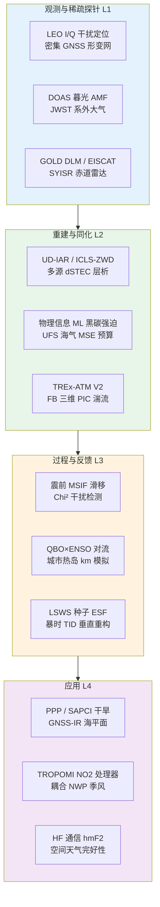
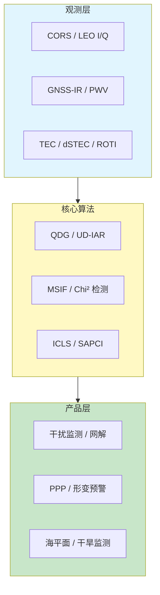
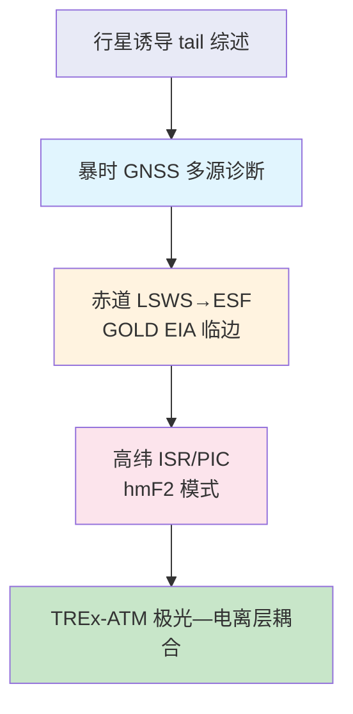
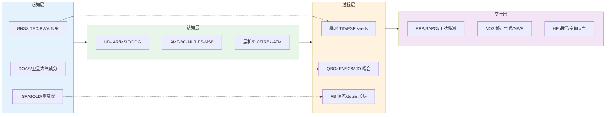

在 2026 年 6 月 26 日至 7 月 4 日窗口内，题录库共收录与「大气」「全球导航卫星系统」「电离层」检索词相匹配的论文五十一篇（按题名与 DOI 去重），其中大气类三十篇、全球导航卫星系统类十五篇（含一篇撤稿通知）、电离层类八篇。第 25 太阳活动周峰值阶段，电离层扰动与 GNSS 精密定位的耦合已成为空间天气与导航韧性研究的共同焦点：2024 年 5 月极端磁暴被文献认定为近四十年来最强事件之一，全球厘米级 GPS PPP 出现大规模失锁与定位中断，北半球 outage 约 15 h、南半球约 20 h，且 outage 强度与 ROTI 及极光卵扩张显著相关（Yang 等，2025；Danilchuk 等，2025）。本期 Yuan 等（2026）对 2025 年 11 月 12 日巴西 sector 强磁暴的多源诊断，可视为上述全球图景在低纬磁赤道区的区域延伸。相较 2026 年 6 月 26 日周报，全球导航卫星系统题录数量略增，干扰监测、精密定位物理约束与 SAPCI 干旱监测等应用支线更为集中；大气方向维持 ACP、AMT 与 GRL 高产，并出现《自然》白矮星行星大气与 NextGEMS 千米尺度城市气候分析等顶刊条目；电离层题录增至八篇，GOLD 暗临边模式 2019–2025 年夜间 EIA 统计与 TREx-ATM V2.0 更新构成观测—模拟—应用闭环。

## 一、本期研究印记图

本期题录在科学问题层面呈现「全球导航卫星系统从精密定轨与抗干扰向气象干旱与多源电离层约束延伸」「大气科学从平流层光化学订正、同位素水循环到千米尺度城市—海洋耦合模拟并行推进」以及「电离层从暴时 TID 层析、赤道 ESF 种子条件到高纬 electrojet 动理学湍流」的交叉格局。全球导航卫星系统方向中，Pojani 等（2026）基于 OPS-SAT PRETTY 在 Jammertest 2025 的 I/Q 数据验证 LEO 准直接干扰源定位；Tang 等（2026）系统比较无差与双差模糊度固定策略，推荐无差方案用于大规模网解；He 等（2026）以不等式约束最小二乘引入天顶湿延迟物理边界，实时 PPP 高程短期精度提升约 30%。大气方向中，MacDonald 等（2026）在《自然》报道白矮星行星 WD 1856 b 大气烃类与气溶胶探测；Pedruzo-Bagazgoitia 等（2026）提出全球千米尺度模拟中城市—乡村温度对比提取框架；Yu 等（2026）以线性优化系统改进 ICON XPP 中 ENSO 模拟。电离层方向中，Yuan 等（2026）联合 GNSS、测高仪与层析分析 2025 年 11 月巴西 sector 暴时响应及对 PPP 收敛的影响；Jiang 等（2026）以三亚非相干散射雷达直接观测 LSWS 与 ESF 生成条件；Karan 等（2026）利用 GOLD 暗临边模式给出 2019–2025 年夜间 EIA 多经度形态。下列印记图概括上述层级关系。

## 二、全球导航卫星系统与导航遥感应用方向

全球导航卫星系统方向本期可用论文十四篇（排除撤稿通知一篇），下列八篇纳入完整专题画像。整体技术路线呈现「LEO 被动射频干扰源准直接定位」「暴时多源电离层观测与 PPP 收敛评估」「密集网多尺度形变滤波与震前滑移反演」「无差模糊度固定全球网解」「Chi 平方 IF 样本干扰检测」「天顶湿延迟物理不等式约束」「低成本 GNSS-IR 海平面监测」与「GNSS 可降水量驱动 SAPCI 干旱指数」等支线，并与 InSAR、数值天气预报及空间天气观测形成方法互补。

**表1 全球导航卫星系统方向代表性研究的技术路线与特点**

| 研究主题 | 技术路线概要 | 技术特点 | 重要结论或性能指标 |
| --- | --- | --- | --- |
| LEO 干扰定位 | QDG 压缩 I/Q + 延迟–多普勒匹配 | SWaP 受限 LEO 机会感知 | Jammertest 2025 实数据验证 |
| 巴西暴时 PPP | TEC/ROTI/层析 + PPP 收敛 | 多源联合诊断 | 垂直分量收敛延迟 |
| 阳漾 MSIF | 多尺度空间分解 + VB-ICA | 密集网震前异常 | Mw 5.5 级滑移可检 |
| UD-IAR | 全球网无差/双差策略对比 | 错误固定与独立模糊度 | UD 优于 DD 网解 |
| Chi² 干扰检测 | IF 样本卡方检验 + GSRx | 多数据集公开验证 | 检测率超 99% |
| ICLS-ZWD | RH 边界 + KKT 不等式约束 | 无需外部 ZWD 产品 | 实时 PPP 高程 +30% |
| GNSS-IR 海平面 | u-blox 多频 SNR 反演 | 低成本替代验潮站 | 相关 >85%，RMSE 7–21 cm |
| SAPCI 干旱 | GNSS PWV + 降水转换指数 | 次季节—传统干旱统一 | 与 SPEI 相关 0.75–0.89 |

### 2.1 专题画像：LEO 准直接 GNSS 干扰源定位

**（1）技术路线：压缩 I/Q 样本—量化时频域延迟–多普勒匹配—单/多天线干涉定位**

Pojani 等（2026）针对低轨卫星在频谱监测任务中下行带宽与星载算力受限的瓶颈，系统分析准直接定位（QDG）算法族。研究首先建立 I/Q 高吞吐样本的压缩策略，再在量化时频域执行快速延迟–多普勒频移匹配与干涉测量，以压缩后的相关特征在位置域进行多源穷尽搜索的加速实现。算法框架给出精度下界，并分别讨论单天线与多天线配置。验证数据来自在 Jammertest 2025 试验期间由 GNSS 反射测量卫星 OPS-SAT PRETTY 采集的 I/Q 样本，覆盖不同信噪比 terrestrial GNSS 干扰源场景。

**（2）技术特点：以极高压缩比释放 SWaP 受限 LEO 星座的 RFI 监测潜力**

相较地面固定监测站，LEO 平台可在全球尺度重复过境 sensing，但传统全样本下传与星载相关处理不可扩展。QDG 通过压缩与快速匹配将计算瓶颈从原始样本域转移至低维特征域，使多数现有 LEO 机会资产具备近实时干扰源定位能力。该路线与欧盟/美国正在讨论的 multi-constellation RFI 监测体系高度契合，并为 GNSS 完好性服务提供空间段补充探针。

**（3）重要结论：LEO QDG 可在极高压缩比下实现 GNSS 干扰源定位**

**该研究的重要结论是：基于 OPS-SAT PRETTY 在 Jammertest 2025 的实测 I/Q 数据，QDG 算法在不同信噪比条件下均具备 terrestrial GNSS 干扰源定位能力，且通过极高压缩比显著降低下行与星载处理负担。** 该结论对构建基于 LEO 星座的 GNSS 干扰监测网络具有工程示范意义，可为民航、关键基础设施与军事频谱管理提供空间段快速溯源手段；局限在于单次试验场景与星座几何仍不足以给出全球业务化精度统计，后续需联合多星协同与地面真值网扩展样本。

### 2.2 专题画像：2025 年 11 月巴西 sector 暴时电离层与 PPP 收敛

**（1）技术路线：多源观测联合—dSTEC 约束层析—PPP 收敛对比**

Yuan 等（2026）以 2025 年 11 月 12 日强磁暴为案例，在巴西 sector 联合分析 GNSS 总电子含量与差分 STEC、ROTI、JPL 全球电离层地图、测高仪 foF2 与 h′F2 以及三维电离层层析。研究区分暴时全球非均匀 TEC 异常背景与区域行进电离层扰动（TID）传播，并以 PPP 收敛时间为应用端指标评估扰动强度。层析重建以 GNSS dSTEC 为约束，重点分析 150–400 km 高度相对扰动结构。

**（2）技术特点：从全球异常到区域 TID 与垂直重构的多尺度诊断框架**

该工作将空间天气研究链条与 GNSS 精密定位性能直接挂钩。相较单一 TEC 地图，联合 ROTI 与测高仪可区分等离子体耗尽与 F 层抬升，dSTEC 层析则给出扰动能量在高度上的集中层（250–350 km）。PPP 分析表明暴日垂直分量收敛时间显著延长，为低纬磁赤道区导航用户提供可量化风险指标。

**（3）重要结论：巴西 ionosphere 暴时多尺度响应关联 PPP 垂直收敛延迟**

**该研究的重要结论是：2025 年 11 月 12 日强磁暴在巴西 sector 激发清晰 TID（约 02:05 UT 起，02:25–03:00 UT 最强），测高仪显示 foF2 降低、h′F2 升高，层析显示 150–400 km 扰动显著，且 PPP 垂直分量收敛时间明显延长。** 该结论呼应第 25 太阳活动周极端磁暴对 PPP 影响的全球评估趋势，提示低纬用户在高精度应用中需联合 ROTI、区域层析与完好性监测；对电离层方向同一案例的专题画像（§4.2）将从 F 区物理机制角度补充解读。

### 2.3 专题画像：密集 GNSS 网多尺度时空滤波与阳漾地震震前形变

**（1）技术路线：区域形变场多尺度分解—变分贝叶斯独立成分分析反演瞬态滑移**

Xu 等（2026）提出多尺度时空反演滤波（MSIF）方法，面向密集 GNSS 网中低信噪比瞬态构造信号提取。首先对区域 GNSS 形变场作多尺度空间分解以识别异常应变积累区，再对目标台站连续观测应用变分贝叶斯独立成分分析（VB-ICA）反演瞬态断层滑移时空演化。数值试验评估探测 Mw 5.5 级滑移事件所需最小台网密度，并应用于 2021 年 Ms 6.4 阳漾地震相关时间序列。

**（2）技术特点：震前慢滑移与应力触发并存的观测—反演一体化**

MSIF 将「区域应变场扫描」与「台站级滑移反演」分层耦合，较传统单台滤波或全局均匀反演更能保留小空间尺度（约 11 km）应变集中信号。反演结果显示震前存在 Mw 5.5 级伸展兼右旋走滑矩释放，库仑应力变化达 0.021–0.036 MPa，支持震前慢滑移与应力触发前震并存的 nucleation 图景。

**（3）重要结论：阳漾地震前检测到小尺度应变积累与 Mw 5.5 级预滑移**

**该研究的重要结论是：MSIF 在阳漾 Ms 6.4 地震准备阶段识别出约 11 km 尺度的应变积累异常，反演预滑移矩达 Mw 5.5，且对前震与主震震源区库仑应力增加 0.021 MPa 与 0.036 MPa，表明震前慢滑移可能促进后续破裂。** 该结论对地震危险性实时评估与密集 GNSS 网业务化异常检测具有参考价值，提示在走滑—伸展复合构造区需联合 InSAR 与地震活动性检验预滑移时空稳定性。

### 2.4 专题画像：无差与双差整数模糊度固定全球网解性能

**（1）技术路线：多策略 DD-IAR 与 UD-IAR 并行处理—卫星轨道、ERP 与测站坐标对比**

Tang 等（2026）在国际 GNSS 服务分析中心常用处理框架下，对比多种双差（DD）与无差（UD）整数模糊度固定（IAR）策略对卫星轨道、测站坐标、地球自转参数（ERP）与地心坐标的影响。通过分解 DD-IAR 性能劣化的来源，量化错误固定模糊度与可固定独立模糊度不足两类效应的贡献比例。

**（2）技术特点：揭示 DD-IAR 在大网中结构性弱点的机理证据**

理论上 DD-IAR 与 UD-IAR 应等价，但大规模全球网中 DD 组合易引入错误固定与独立模糊度不足。结果表明约 40% 的 DD 轨道差异与错误固定相关，45%–71% 的地学参数差异与独立模糊度不足相关；若两类问题均被消除，两者性能趋于一致，但在实际大网中 UD-IAR 更稳健高效。

**（3）重要结论：无差 IAR 推荐用于大规模高精度 GNSS 网解**

**该研究的重要结论是：UD-IAR 在卫星轨道与地学参数估计中稳定优于常规 DD-IAR 策略，且在大规模台网中更具鲁棒性与效率，建议作为高精度 GNSS 应用的首选 IAR 方案。** 该结论对 IGS 分析中心产品一致性、多系统联合定轨与地心运动监测具有直接方法学意义，并为用户选择 PPP-AR 与网络 RTK 服务端策略提供依据。

### 2.5 专题画像：Chi 平方检验 GNSS IF 样本干扰检测

**（1）技术路线：开源 GSRx 接收机—IF 样本卡方统计—多数据集交叉验证**

Bhuiyan 等（2026）在 FGI-GSRx 开源软件定义接收机中实现基于卡方检验的 GNSS 信号异常检测，直接作用于原始 digitized 中频样本，将人为干扰统一定义为异常。评估数据集涵盖社区广泛使用的公开欺骗数据集以及挪威 JammerTest2023 实弹试验数据，覆盖多种传播与干扰场景。

**（2）技术特点：可复现、跨数据集的高检测率开源基准**

该研究强调实验广度与开放可复现性，公开 JammerTest2023 数据集与配置文件，便于与深度学习或其他统计检测器公平对比。方法不依赖特定导航电文或外部 aid，适用于保护频段内的实时 anomaly flagging。

**（3）重要结论：Chi 平方 IF 检测在全部评估场景检测率超 99% 且无虚警**

**该研究的重要结论是：所提 Chi 平方检验方法在所有评估数据集中异常检测率超过 99%，且在测试场景内未观测到虚警，JammerTest2023 数据与 GSRx 配置已公开以支持独立复现。** 该结论为 GNSS 干扰监测算法选型提供统计基线，对民航 ARAIM 与地面参考站完整性监测具有潜在集成价值；局限在于未涵盖全部新型欺骗波形与多径耦合极端场景。

### 2.6 专题画像：天顶湿延迟物理不等式约束实时 PPP

**（1）技术路线：RH–ZWD 关系推导边界—KKT 不等式约束最小二乘—收敛期与收敛后诊断**

He 等（2026）针对 PPP 收敛期天顶湿延迟（ZWD）易出现负值或非物理大值、进而污染高程分量的问题，提出基于相对湿度（RH）与 ZWD 关系计算物理边界，并以 Karush–Kuhn–Tucker 条件在不等式约束最小二乘（ICLS）中施加边界。方法不依赖外部 ZWD 产品或 SSR 改正。收敛后上界约束转为 ZWD 异常诊断指标，用于极端天气监测。

**（2）技术特点：纯物理边界约束改善短时段 PPP 稳定性**

相较经验 ZWD 先验或 GPT 类模型，ICLS 边界来自观测站 RH 与大气物理关系，可在收敛期抑制非物理 ZWD 漂移。GFZ 运营网数据验证显示实时 PPP 高程短期精度提升约 30%，后处理约 20%；极端天气下诊断指标敏感可靠。

**（3）重要结论：ICLS 物理约束显著提升 PPP 收敛期高程精度**

**该研究的重要结论是：基于 RH 的 ZWD 不等式约束在不引入外部 ZWD 产品条件下，使实时 PPP 高程短期精度提升约 30%、后处理约 20%，且 ZWD 上界诊断在极端天气下高敏感可靠。** 该结论对气象灾害预警中 GNSS 水文学应用、移动端 PPP 与低轨星座精密定轨具有方法价值，提示物理约束与随机估计应协同设计而非仅增大 ZWD 过程噪声。

### 2.7 专题画像：低成本 GNSS-IR 海岸海平面监测

**（1）技术路线：u-blox ZED-F9P 多频 SNR 反演—与雷达验潮站同步对比—F 检验方差一致性**

Bojorquez-Pacheco 等（2026）在墨西哥 Altata Bay 码头部署低成本多频 GNSS-IR 系统，与 75 m 外传统雷达验潮站开展五次约 24 h 同步观测。等效海平面由 SNR 干涉反演获得，并进行相关分析与 Fisher F 检验（α=0.05）验证方差一致性。

**（2）技术特点：科学级精度与基础设施成本的数量级折中**

GNSS-IR 已在 geodetic 级接收机上验证，但该研究聚焦 u-blox 消费级硬件，面向发展中国家海岸密集监测网络扩展。相关超过 85%、RMSE 7.0–21.0 cm，F 检验确认与参考验潮站无显著方差差异，表明低成本方案具备业务化潜力。

**（3）重要结论：低成本 GNSS-IR 可作为验潮站科学可靠补充**

**该研究的重要结论是：u-blox 多频 GNSS-IR 与邻近雷达验潮站高度一致（相关 >85%，RMSE 7–21 cm，F 检验无显著方差差异），验证低成本接收机可扩展海岸海平面监测基础设施。** 该结论对气候变暖背景下区域海平面与风暴增水监测具有成本效益启示，可与卫星高度计交叉校准并嵌入早期预警系统；局限在于短期 campaign 尚未覆盖极端事件与不同底质反射条件。

### 2.8 专题画像：GNSS 可降水量驱动 SAPCI 气象干旱监测框架

**（1）技术路线：GNSS PWV 与降水构建 SAPCI—全球 43 年台站/格点验证—ENSO 案例检验**

Li 等（2026）提出标准化前序降水转换指数（SAPCI），联合 GNSS 反演可降水量（PWV）与降水资料，统一表征传统气象干旱（TMD）与次季节气象干旱（SMD）。在全球 1980–2022 年台站与格点尺度，与 SPEI、SPCI、SAPEI 对比相关与空间分布，并以 2015–2016 年 ENSO 影响干旱作案例验证。

**（2）技术特点：GNSS 水文学约束拓展干旱监测时间谱**

SAPCI 将 GNSS PWV 信息嵌入干旱指数构造，弥补仅依赖降水—蒸散指标对次季节水分亏缺响应不足的问题。与 SPEI、SPCI、SAPEI 平均相关系数分别为 0.75、0.89 与 0.80，空间分布一致性良好，显示 GNSS 网可成为干旱监测的补充观测层。

**（3）重要结论：SAPCI 在全球尺度有效统一 TMD 与 SMD 监测**

**该研究的重要结论是：SAPCI 在全球台站与格点与 SPEI、SPCI、SAPEI 高度一致（平均相关 0.75–0.89），并能有效识别 ENSO 调制下的 TMD 与 SMD 空间格局，具备全球业务化干旱监测潜力。** 该结论对耦合 GNSS 气象服务、农业保险与水资源调度具有应用前景，提示需进一步在 PWV 稀疏区联合遥感降水降尺度检验稳健性。

## 三、大气科学方向

大气科学方向本期三十篇论文中，ACP 与 AMT 合计九篇，GRL 与 JGR-Atmospheres 等期刊维持稳定产出，并出现《自然》白矮星行星大气这一跨天体物理条目。整体研究呈现「平流层光化学与卫星订正」「同位素水循环与古气候示踪」「物理信息机器学习辐射强迫」「NextGEMS 千米尺度城市气候与耦合 NWP」「次季节预测中 MJO 海气耦合误差」「QBO 与 ENSO 对热带对流调制」「ICON XPP 系统 ENSO 参数优化」等并行主题，并与电离层 upper atmosphere 模块（Joule 加热、流星头 echo 中性密度）形成垂直耦合延伸。NextGEMS 项目已完成 ICON 与 IFS-FESOM 约 10 km 分辨率、30 年 SSP3-7.0 情景模拟，为 Pedruzo-Bagazgoitia 等（2026）的城市—乡村对比分析提供数据基础（Koldunov 等，2025；Wieners 等，2024）。

**表2 大气科学方向代表性研究的技术路线与特点**

| 研究主题 | 技术路线概要 | 技术特点 | 重要结论或性能指标 |
| --- | --- | --- | --- |
| WD 1856 b 大气 | JWST NIRSpec 透射光谱 | 白矮星系外行星首探测 | CH4 约 7%，Teff 390–412 K |
| 南极暮光 AMF | SLIMCAT 盒模型 + MYSTIC RTM | 球面与光化学耦合 | NO2/OClO 需高时间采样 |
| 三重氧同位素 | 冠层三层水汽同位素年序列 | 17O-excess 陆气交换 | 年尺度水汽—降水接近平衡 |
| 黑碳 TOA 强迫 | RTM + ML + SHAP 归因 | 物理信息可解释 ML | 区域非线性吸收—散射 |
| 城市 km 模拟 | NextGEMS 提取城市—乡村对 | 400+ 城市 LST 验证 | 未来 UHI 可能减弱（冷气候除外） |
| MJO UFS 预测 | MSE 预算 + Granger 因果 | 海气耦合过强诊断 | 潜热通量误差主导 MJO 偏差 |
| QBO×ENSO | 三组 AGCM 敏感性试验 | QBO 周期 ENSO 调制 | El Niño 下 QBO 影响赤道移动 |
| TROPOMI NO2 | 430 nm 波段 gap 处理 | 处理器业务化更新 | 水上 SCD 误差降 10%–20% |

### 3.1 专题画像：白矮星行星 WD 1856 b 大气烃类与气溶胶

**（1）技术路线：JWST NIRSpec PRISM 0.5–5.0 μm 透射光谱—贝叶斯大气检索—轨道迁移重加热模型**

MacDonald 等（2026）在《自然》发表对白矮星行星 WD 1856 b 的首个大气探测。利用 James Webb 空间望远镜 NIRSpec PRISM 获取 0.5–5.0 μm 透射光谱，以贝叶斯框架检索烃类、气溶胶与夜侧热辐射成分，并结合质量—半径与冷却模型约束行星质量 4.3–10.9 木星质量、甲烷丰度约 7% 以及有效温度 390–412 K（远高于 160 K 平衡温度）。

**（2）技术特点：主序后演化行星大气组成的直接光谱证据**

该研究拓展了系外行星大气探测至白矮星宿主阶段，揭示碳富集大气、气溶胶与异常高热状态共存。冷却模型指示行星在白矮星阶段 3.0–5.5 Gyr 发生与轨道迁移相关的重加热事件，与现今 0.02 au 圆轨道一致，为类日恒星巨行星终局提供观测窗口。

**（3）重要结论：WD 1856 b 保留碳富集大气并经历迁移重加热**

**该研究的重要结论是：JWST 光谱以极高置信度检测到 WD 1856 b 大气中的烃类与气溶胶，甲烷丰度约 7%，有效温度显著高于平衡值，指示白矮星阶段迁移相关重加热事件。** 该结论对理解类日恒星系统巨行星生存与大气演化具有里程碑意义，亦为大气质谱检索方法论在极端 irradiation 环境下的极限测试；虽属天体物理语境，其气溶胶—辐射耦合分析范式对地球大气辐射传输研究具有类比参考价值。

### 3.2 专题画像：南极暮光平流层光化学空气质量因子

**（1）技术路线：SLIMCAT 光化学盒模型路径平均—MYSTIC 全球面 RTM—DOAS SCD 验证**

Gómez-Martín 等（2026）针对南极 Belgrano 与 Marambio 站 DOAS 暮光观测，发展同时考虑地球球面效应与暮光快速光化学变化的空气质量因子（AMF）计算方法。以 SLIMCAT 化学输送模式驱动光化学盒模型，沿光学路径对 NO2、O3、OClO、BrO 浓度作路径等效平均，再输入 MYSTIC 一维全球面辐射传输模式计算 AMF，并与 Marambio 2018 年 SCD 观测对比。

**（2）技术特点：暮光 SZA 大于 90° 条件下光化学 AMF 的系统化方案**

传统 AMF 常忽略暮光光化学突变与球面几何，导致活性物种柱量系统偏差。结果表明 O3 与 BrO 月平均 AMF 近似可用，但 NO2 与 especially OClO 在七月需更高时间分辨率采样，与极涡动力学相关。

**（3）重要结论：暮光 AMF 必须联合球面几何与光化学路径平均**

**该研究的重要结论是：南极暮光 DOAS 检索中，球面效应与光化学变化对 NO2、OClO、BrO 的 AMF 量级与 SZA 依赖有显著影响，所提路径平均 + MYSTIC 方案与 NO2、O3、OClO 观测吻合良好。** 该结论对南极臭氧洞长期监测趋势订正与卫星平流层 NO2 验证具有基础意义，提示业务化检索在 vortex 活跃期需提高 AMF 时间分辨率。

### 3.3 专题画像：地中海森林三重氧同位素水汽动态**

**（1）技术路线：O3HP 平台三层冠层水汽同位素年观测—降水与地下水同步— stomatal 与蒸腾辅助**

Voigt 等（2026）在法国 Mediterranean AnaEE-O3HP downy oak 森林，连续测量冠层下、内、上三层大气水汽与降水、地下水的三重氧同位素及氢同位素，并配合 stomatal conductance 与 transpiration 月观测。分析日变化与季节变化中 17O-excess 与 d-excess 的控制因子，检验不同海洋源区与天气型态下的同位素分异。

**（2）技术特点：17O-excess 作为陆—气水分交换示踪的新证据**

三重氧同位素提供独立于传统 d-excess 的水分来源与再蒸发信号。季节尺度上 17O-excessV 与 d-excessV 反映海洋源区蒸发条件；日变化显示植被过程贡献，但日尺度蒸散影响不显著。年尺度上平衡水汽可近似近地面水汽同位素组成，尽管事件尺度降水常偏离平衡。

**（3）重要结论：17O-excess 可跨气候区约束陆气水交换与降水同位素解释**

**该研究的重要结论是：17O-excess 在 Mediterranean 森林冠层内外呈现可解释的季节与日变化，年尺度平衡水汽可靠代表近地面水汽同位素，有助于改进降水同位素机制解释与古气候重建。** 该结论对同位素启用的大气模式参数化、蒸散分割与 paleoclimate 代理校准具有方法价值，提示未来需在全球更多植被型区扩展 triple oxygen 观测网络。

### 3.4 专题画像：物理信息机器学习黑碳顶空辐射强迫

**（1）技术路线：多平台观测约束光学性质—RTM 生成训练标签—ML  surrogate + SHAP—跨区域零样本检验**

Tiwari 等（2026）提出物理信息机器学习框架，估计晴空黑碳（BC）顶空直接辐射强迫（BC TOA）。先以多平台多波段观测约束 BC 光学性质并驱动辐射传输模式生成标签，再训练 ML 代理模型，以 SHAP 分析 BCAOD、柱数浓度与混合态等 predictor 在 cooling–warming 区间的非线性贡献。在徐州与达卡训练，Delhi 零样本合理（Adj. R²=0.91），Mongu 因 microphysical 分布 mismatch 系统性低估，扩展训练后 RMSE 降 68%。

**（2）技术特点：保留物理可解释性的高分辨率 BC 强迫估算**

BC 强迫对 microphysical 演化与柱 loading 高度敏感，传统参数化难以刻画区域 contrast。ML surrogate 在保持 RTM 精度（R²>0.95）同时实现高效空间—时间外推，SHAP 揭示相似 loading 下区域吸收—散射动力学可截然不同。

**（3）重要结论：BC 强迫区域差异由混合态与 loading 非线性共同驱动**

**该研究的重要结论是：物理信息 ML 框架在徐州与达卡 climatological mean BC TOA 与 RTM 一致（约 −17 W m⁻² 量级），SHAP 表明 BCAOD、柱数浓度与混合态贡献随 cooling–warming  regime 非线性变化，且 Mongu 零样本偏差可通过扩展 microphysical 多样性训练显著修正。** 该结论对 AR6 后 BC 强迫减排评估、城市空气质量—气候耦合政策具有量化工具意义，强调全球 BC 清单需按源区 microphysics 分层而非单一 emission factor。

### 3.5 专题画像：全球千米尺度模拟中的城市气候变化分析

**（1）技术路线：NextGEMS km 模拟城市—乡村提取算法—400+ 城市 LST 遥感验证—城市聚类**

Pedruzo-Bagazgoitia 等（2026）在 GRL 提出从全球 km 尺度耦合模拟中提取城市及其乡村参考区的通用方法，并以遥感陆表温度在 400 余城市 hourly 验证，强调空间分辨率对城市信号识别的重要性。展示 NextGEMS 60 年 past/future 模拟中每城市海量 hourly 数据潜力，并以 city clustering 超越单城案例统计。

**（2）技术特点：对流显式全球模拟解锁 urban climate 统计样本**

km 尺度模拟使 city-scale 热环境变化不再依赖 downscaling 参数化。结果显示除寒冷气候聚类外，未来城市热岛强度（UHI）平均可能因乡村增温更强而减弱，挑战“城市永远更热”的简单叙事。

**（3）重要结论：km 全球模拟支持城市热岛未来可能相对减弱**

**该研究的重要结论是：所提城市提取与验证框架在 hourly 尺度与遥感 LST 一致，NextGEMS 模拟显示除寒冷气候外各聚类未来 UHI 强度平均可能下降，反映乡村增温更快。** 该结论对 urban adaptation 规划、绿色基础设施评估与 IPCC 城市气候章节提供 km 模拟证据，提示 UHI 未来变化需按 Köppen 聚类分别讨论而非全球单一趋势。

### 3.6 专题画像：UFS 原型中 MJO 预测的海气耦合误差

**（1）技术路线：ERA5 与 UFS P8 次季节预报 MSE 预算—潜热通量风/热分解—Granger 因果**

Choi 等（2026）评估统一预报系统 UFS prototype 8 对热带 intraseasonal variability（30–90 天）的 MJO 及 Kelvin、Rossby 波模拟。MSE 预算显示 UFS P8 虽再现 MSE 与 SST 气候态，但 intraseasonal 变率显著过估，尤其 Maritime Continent；MJO 误差主要由 surface latent heat flux 误差驱动。Granger 因果分析表明 UFS P8 海气耦合强于观测，SST 对大气 forcing 过敏感，可能与上层 ocean vertical mixing 参数化 uncertainty 相关。

**（2）技术特点：从 MSE 预算到因果诊断的 MJO 模式误差溯源**

该研究将 MJO 预测难题具体化为 coupling strength 与 flux 分解误差，而非仅报告 RMM 相关。Wind-driven flux 误差与分辨率不足的海岸线形态相关，thermodynamic 误差则来自 SST 变率过估。

**（3）重要结论：UFS P8 MJO 误差根源在于过强海气耦合与潜热通量偏差**

**该研究的重要结论是：UFS P8 显著高估 intraseasonal MSE/SST 变率，MJO MSE 预算误差主要由 surface latent heat flux 驱动，Granger 分析显示 SST 对 atmospheric forcing 敏感性超过 ERA5，提示 upper-ocean mixing 参数化是关键改进方向。** 该结论对 NCEP 业务次季节预报升级、印度洋—Maritime Continent 降水预报及 km 尺度海气耦合试验设计具有直接启示，与全球 km 模拟 MJO 挑战 literature 形成互补。

### 3.7 专题画像：ENSO 条件下 QBO 对热带对流调制

**（1）技术路线：气候态/强 El Niño/强 La Niña 三组 AGCM—QBO 相位分类—对流与环流场对比**

Rodrigo 等（2026）在 companion 工作基础上，使用强 El Niño 与 La Niña 边界条件下 AGCM 试验，研究准两年振荡（QBO）对热带对流的影响如何受 ENSO 调制。结果表明 QBO 在所有试验中均影响夏季 tropical convection，但 El Niño 下 deep ascent 赤道向移动，QBO 影响随之 equatorward 偏移；QBO 周期在 El Niño（La Niña）下更短（更长），导致 tropospheric QBO 影响从初夏到夏末符号反转。

**（2）技术特点：分离 QBO teleconnection 与 ENSO 主模态的 factorial 设计**

通过固定 ENSO 态 AGCM 试验，作者揭示 QBO 影响并非 climate-state 不变，而是随 ENSO 调制 mean convection 位置与 QBO 本身 downward propagation 特征而变，为 subseasonal 预测中 QBO 位相权重提供物理依据。

**（3）重要结论：QBO 对热带对流的影响随 ENSO 态发生位置与符号变化**

**该研究的重要结论是：QBO 调制夏季 tropical convection，El Niño 下影响赤道向移动且 QBO 周期缩短导致 tropospheric QBO 效应初夏—夏末符号反转，La Niña 下更接近气候态响应。** 该结论对 stratosphere–troposphere coupling 预测、季风 intraseasonal 预报中 QBO 因子引入及 AGCM QBO 参数化评估具有意义，提示 operational forecast 不应使用单一 QBO composite。

### 3.8 专题画像：TROPOMI/OMI NO2 430 nm gap 检索改进

**（1）技术路线：DOAS 拟合残差诊断 430 nm Fraunhofer 特征—剔除 428–433 nm—SCD/RMS 对比—处理器业务实施**

van Geffen 等（2026）分析 Rotational/Vibrational Raman scattering 导致的 430 nm 特征对 TROPOMI 与 OMI NO2 斜柱量检索的干扰，提出 NO2-gap 方案剔除 428–433 nm 波长。评估显示 open water 上 SCD 与 RMS 误差降 10%–20%，部分陆地场景降 5%–10%，热带 stratospheric NO2 柱平均变化至约 −2 μmol m⁻²，tropospheric 变化约 ±2 μmol m⁻²，不改变 routine validation 总体结论。

**（2）技术特点：处理器级订正提升水上 NO2 与 fit 稳定性**

VRS 无法用 scalable Ring 谱完全吸收，gap 方案简单稳健且已纳入 TROPOMI（2025-11-22 起）与 OMI（2026-04 起）新处理器及 OMI 全 mission 重处理。

**（3）重要结论：NO2-gap 方案改善水上检索并已进入业务处理器**

**该研究的重要结论是：剔除 428–433 nm 的 NO2-gap 方法降低 open water SCD 误差 10%–20% 并改善 fit residual，柱量变化不足以改变 validation 总体结论，但已纳入 TROPOMI 与 OMI 新业务处理器。** 该结论对全球 NOx 排放监测、shipping lane 检测与空气质量趋势分析具有 incremental 但 operational 意义，亦为其他 DOAS 传感器处理 Ring/VRS 干扰提供模板。

## 四、电离层方向

电离层方向本期八篇论文全部纳入专题画像。研究涵盖诱导 magnetotail 比较行星学、低纬暴时 TID 与 PPP、极昼 auroral ionosphere ISR 统计、赤道 LSWS 与 ESF 种子、高纬 electrojet FB 动理学湍流、高纬 hmF2 模式评估、GOLD 夜间 EIA 临边结构以及 TREx-ATM V2.0 极光输运模型，形成「观测统计—过程模拟—GNSS 应用」完整链条。

**表3 电离层方向代表性研究的技术路线与特点**

| 研究主题 | 技术路线概要 | 技术特点 | 重要结论或性能指标 |
| --- | --- | --- | --- |
| 诱导 magnetotail 综述 | Venus/Mars/Titan 任务数据综合 | 行星对比行星学 | 逃逸与 tail 结构仍有多未知 |
| 巴西暴时响应 | 多源 + dSTEC 层析 | GNSS 应用耦合 | TID + F 层抬升 + PPP 延迟 |
| 极昼 auroral ISR | ESR 快速仰角扫描 | OCB 三分区统计 | Te 在 OCB 极侧 F 区增强 |
| LSWS 与 ESF | SYISR + 测高仪连续观测 | 直接 LSWS 观测 | LSWS 为 ESF 前提，PSSR>30 m/s |
| FB 三维 PIC | 整柱 collisional–collisionless | 首整柱 FB 动理学模拟 | conductance +21% |
| 高纬 hmF2 | 九站 + IRI/E-CHAIM | 气候态 monthly median | E-CHAIM 最优 |
| GOLD 夜间 EIA | DLM OI 135.6 nm 临边 | 2019–2025 多经度 | 临边峰较 F 峰低约 40 km |
| TREx-ATM V2 | 与 B3C/GLOW 对比 + 反演 | relativistic 扩展 | 四波长 aurora 反演 conductance |

### 4.1 专题画像：无内禀磁场行星诱导 magnetotail 结构与动力学

**（1）技术路线：金星/火星长期任务粒子与场数据综合—诱导 tail 电流片与拓扑对比—逃逸率统计**

Stergiopoulou 等（2026）在 Space Science Reviews 发表综述，系统比较金星与火星 induced magnetotail 结构、电流片 flapping、开闭 draped 磁力线拓扑及 plasma escape 路径。归纳 Mars 南半球 crustal 磁场造成的 hybrid magnetosphere 复杂性，并讨论 Titan、彗星与 exoplanet 类比意义。

**（2）技术特点：将 planetary tail 研究提升至比较行星学与空间气候史视角**

该文强调 tail 是 atmospheric escape 与 energy transfer 的关键通道，火星 tail twist 与 current sheet mapping 已有初步进展，金星则呈现多型 flapping。与地球 ionosphere 研究的联系在于 induced magnetosphere 形成机制依赖 ionospheric conductivity，与 GNSS TEC 监测的 upper atmosphere 变化在另一行星语境下形成对照。

**（3）重要结论：金星与火星 induced tail 结构差异显著且逃逸机制仍有多未知**

**该研究的重要结论是：金星与火星虽均无 dominant intrinsic dipole，但 induced magnetotail 结构、current systems 与 escape 率对 solar wind/IMF 响应差异显著，火星 crustal 场使 interaction 更复杂，individual process 对 solar driver 响应细节仍未知。** 该结论对未来金星 EnVision、火星 MAVEN 后续分析与 exoplanet space weather 模型提供问题清单，亦提示 Earth ionosphere 作为 induced boundary 的内禀场优势需在国际对比研究中显式强调。

### 4.2 专题画像：巴西 sector 强磁暴电离层垂直重构（电离层视角）

**（1）技术路线：GNSS TEC/ROTI + 测高仪 + dSTEC 层析—F 区参数诊断—TID 相位追踪**

从电离层物理视角，Yuan 等（2026）案例表明暴时 foF2 降低、h′F2 升高指示 electron density depletion 与 apparent F-layer uplift。TID 在 02:05 UT 后发展，02:25–03:00 UT 最强，层析显示 250–350 km 相对扰动最显著，符合 mid-latitude/low-latitude storm-time redistributing 图景。

**（2）技术特点：多源约束层析揭示暴时三维扰动而非仅 TEC 地图**

dSTEC 约束层析较二维 TEC 地图更能定位 perturbation 高度层，对理解 equatorial/low-latitude fountain 与 disturbance dynamo 竞争机制至关重要。ROTI 增强与 TID 传播同步，为 irregularities 预警提供 proxy。

**（3）重要结论：暴时巴西 F 区呈现 depleted–uplifted 结构与显著 mid-altitude perturbation**

**该研究的重要结论是：2025-11-12 强磁暴在巴西 sector 造成 foF2 下降、h′F2 上升及 150–400 km 显著相对扰动，TID 与 ROTI 在 main phase 同步增强，三维结构较全球 TEC 异常更精细。** 该结论对 low-latitude ionospheric storm model 验证、HF 通信频率管理与 GNSS 完好性阈值设定具有区域针对性，建议与 2024 年 5 月亚太磁暴 literature 对照建立 event catalog。

### 4.3 专题画像：EISCAT 极昼 auroral ionosphere 空间特征

**（1）技术路线：ESR 快速 elevation scan—Ne/Te/Ti 高度—纬度剖面—OCB 三分区统计**

Frøystein 等（2026）利用 EISCAT Svalbard Radar 冬季 fast elevation scans，获取 polar dayside ionosphere 电子密度 Ne、电子温度 Te、离子温度 Ti 的高度—纬度结构。以 open-closed boundary（OCB）定位，将 ionosphere 分为 closed、OCB 附近与 polar cap 三区，给出 case 与统计对比。

**（2）技术特点：quantify dayside cusp 附近 Te 增强带的空间 extent**

Te 在 OCB 极侧 F 区增强，11:00–13:00 MLT 最明显，closed 到 open 梯度 peak；Ne 在 OCB 极侧约 300 km 以下增强约 1.2 倍；E-region Ne 向 polar cap 递减。Ti 变率在 open field lines 更大。

**（3）重要结论：极昼 auroral ionosphere 在 OCB 附近呈现 quantified Te/Ne 梯度结构**

**该研究的重要结论是：ESR 统计表明 dayside auroral ionosphere 在 OCB 极侧 F 区 Te 增强可达数度纬向宽度，Ne 在 300 km 附近增强约 20%，E/F Ne 比值在 closed 大于 open，为 solar wind—magnetosphere—I 耦合提供观测约束。** 该结论对 cusp ion outflow 模式边界条件、极区 HF 链路规划与 data-assimilative ionosphere 模型在 polar cap 的参数化具有价值。

### 4.4 专题画像：LSWS 与 post-sunset rise 在 ESF 生成中的作用

**（1）技术路线：三亚 SYISR + 测高仪 2024 年 9–10 月连续观测—LSWS 参数统计—射线追踪模拟 ionogram 卫星迹**

Jiang 等（2026）在 GRL 报告 LSWS 与 post-sunset rise（PSSR）对 equatorial spread F（ESF）生成的连续直接观测。SYISR 显示 LSWS 日际变化大，平均 zonal wavelength 436 km、period 52 min；射线追踪表明 LSWS upwelling 与传播深刻影响 ionogram satellite trace 频率范围与虚高；当 LSWS 存在且 vertical drift 超 30 m/s 时 ESF 发生率约 92.3%。

**（2）技术特点：区分 LSWS 前提条件与 PSSR 有利条件的 factorial 证据**

长期争论 LSWS 是否 ESF 必要 seeds；该 interval 数据表明 LSWS 存在是 ESF 前提，强 PSSR 则是 favorable condition。Direct ISR 观测较 proxy 指标更具 mechanistic 说服力。

**（3）重要结论：LSWS 为 ESF 前提、强 PSSR 为 favorable 条件**

**该研究的重要结论是：2024 年 9–10 月三亚观测表明 LSWS 存在是 ESF 生成前提，vertical drift 超过 30 m/s 且 LSWS 存在时 ESF 发生率约 92.3%，LSWS 上涌与传播显著 modulate ionogram 卫星迹特征。** 该结论对 equatorial plasma bubble 预报、GNSS 低纬 scintillation 预警及 COSMIC/ROTI 业务阈值具有直接启示，提示 seeding 监测需从 drift-only 指标扩展至 LSWS 直接观测或 proxy。

### 4.5 专题画像：高纬 electrojet Farley–Buneman 三维动理学湍流

**（1）技术路线：整柱 ionospheric PIC 模拟 collisional 到 collisionless  altitudes—FB wave 饱和与 cascade—conductance 积分**

Oppenheim 等（2026）首次完成 spanning 整个 high-latitude ionospheric column 的三维 fully kinetic PIC 模拟 FB turbulence。waves 沿 B 形成 km-scale coherent density perturbations，饱和后 energy cascade 至 longer wavelengths；湍流驱动 electron heating 与 anomalous transport，外场 100 mV/m 下 height-integrated conductance 增强 21%。

**（2）技术特点：从 linear 到 nonlinear FB 的整柱 kinetic 基准**

既往 radar/rocket 观测 abundant FB waves，但 nonlinear saturation 与 anomalous conductivity 缺乏整柱 kinetic 基准。该模拟为 space weather 模式中 anomalous conductivity 参数化提供 first-principles anchor。

**（3）重要结论：FB 湍流可使 height-integrated conductance 增强约 21%**

**该研究的重要结论是：三维 PIC 模拟显示 FB turbulence 饱和后 electron heating 与 anomalous transport 显著，100 mV/m 驱动下 height-integrated conductance 增强 21%，将改善 storm-time Joule heating 与 ionospheric electrodynamics 模式 interpretation。** 该结论对 WACCM-X-MAGE 等高分辨率 whole-atmosphere 模型中的 conductance 赋值、极区 GNSS scintillation 与 power grid GIC 间接耦合研究具有 downward 传递价值。

### 4.6 专题画像：高纬 hmF2 四类模式长期评估

**（1）技术路线：九站（>60°N）测高仪 monthly median hmF2—IRI-2020 BSE/AMTB/SHU 与 E-CHAIM 对比**

Li 等（2026）在 Space Weather 评估 IRI-2020 三个 sub-model 与 Empirical Canadian High Arctic Ionospheric Model（E-CHAIM）对 high-latitude hmF2 的 climatological 预测。分析太阳活动、日变化、季节变化下 hmF2 特征及 MAE/RMSE。

**（2）技术特点：强调 monthly median 评估反映 climate 而非 storm 性能**

E-CHAIM 最优，相对 BSE/AMTB/SHU 分别降低 MAE 10.18–11.85 km、RMSE 11.82–12.61 km；BSE/AMTB 随 solar activity 增强而改善。评估 suppress short-term disturbance，专注 HF 通信长期频率规划。

**（3）重要结论：E-CHAIM 为高纬 hmF2 climatology 最优经验模型**

**该研究的重要结论是：在九站 monthly median hmF2 评估中 E-CHAIM 表现最佳，MAE 较 IRI sub-models 降低约 10–12 km，BSE 在高太阳活动年优势更明显，但所有模型对 geomagnetic disturbance 短期变化反映有限。** 该结论对北极 HF 通信、航空 polar route 与 defense spectrum planning 具有 operational reference 价值，提示 storm-time hmF2 仍需 data-assimilative 或 physics-based 补充。

### 4.7 专题画像：GOLD 暗临边模式夜间 EIA 形态

**（1）技术路线：GOLD DLM OI 135.6 nm 2019–2025 临边辐射—WACCM-X+GLOW forward model—经度与太阳 flux 依赖统计**

Karan 等（2026）利用 GOLD Dark Limb Mode 从 geostationary orbit 获取约 33°E 与 128°W 经度 nighttime EIA altitude–latitude cross sections（约 100–430 km）。Forward model 表明 limb radiance peak tangent altitude 较 contributing F-region density peak 低约 40 km。Multi-year 观测显示 limb-to-limb 差异、强 day-to-day variability 与 solar-flux dependence。

**（2）技术特点：geostationary limb 提供 routine nighttime EIA 四维视角**

GOLD 自 2018 运行以来持续拓展 low-latitude F-region 监测；DLM 相较 disk mode 更适于 altitude 结构。与 ISR、Jicamarca 互补，弥补 ground-based 天气与几何限制。

**（3）重要结论：GOLD DLM 揭示夜间 EIA crest 临边结构与日际变率**

**该研究的重要结论是：GOLD DLM 2019–2025 观测显示夜间 EIA 存在经度差异、 pronounced day-to-day variability 与 solar flux 依赖，forward model 表明 135.6 nm 临边辐射 peak 较 F 区 electron density peak 低约 40 km。** 该结论对 equatorial ionosphere 数据同化、EPB  climatology 与 GOLD-NASA 数据产品用户具有基础意义，支持 SIFT 等方法提取 EPB zonal drift 的 further 统计（参见近期 GOLD EPB literature）。

### 4.8 专题画像：TREx-ATM V2.0 极光输运与电离层效应

**（1）技术路线：TREx-ATM V2 与 B3C/GLOW 发射率对比—relativistic 截面扩展—precipitation 电离率 vs WACCM 快算—四波长 optical 反演**

Liang 等（2026）介绍 auroral transport model TREx-ATM V2.0 更新，包括 relativistic energy 扩展、proton aurora 部分支持、ionospheric plasma density 与 electron temperature profile 计算（开源版有限制），以及从四波长 optical data 反演 electron precipitation 参数与 oxygen correction factor 的算法，示范 auroral conductance 数据集生成。

**（2）技术特点：community-oriented ATM 与 optical inversion 一体化**

TREx-ATM 源自 Transition Region Explorer 任务支持模型，V2 缩小与 B3C/GLOW  emission 差异并改进 high-energy precipitation 电离率相对 WACCM 固定 branching ratio 快算的差异，为 MI coupling 模拟提供更灵活工具链。

**（3）重要结论：TREx-ATM V2 提供 relativistic aurora 与 conductance 反演一体化能力**

**该研究的重要结论是：TREx-ATM V2.0 扩展 relativistic 范围、改进 auroral 电离率与 optical emission 一致性，并示范四波长 data 反演 precipitation 与 conductance，为 aurora—ionosphere—thermosphere 定量研究提供 versatile community tool。** 该结论对 storm-time electrodynamics 模拟、ground-based ASI 网络 calibration 及 future auroral mission 模拟 support 具有直接价值，并与 §3 相关 upper atmosphere Joule heating 研究形成模型—观测闭环。

## 五、交叉学科网络与创新链

全球导航卫星系统、大气科学与电离层在本期窗口内通过 GNSS TEC/dSTEC、PWV、ROTI 与 whole-atmosphere 模式形成多重闭合。下列创新链流程图概括数据—算法—过程—应用的跨域链接。

创新链上值得强调的三条路径包括：其一，GNSS 多源观测（TEC、dSTEC、ROTI）与电离层层析、测高仪联合，将 space weather 事件影响定量传递到 PPP 收敛与 HF 通信参数（Yuan 等，2026；Li 等，2026）；其二，GNSS PWV 进入 SAPCI 干旱监测（Li 等，2026），与 atmospheric 水同位素（Voigt 等，2026）及 km 尺度 urban climate（Pedruzo-Bagazgoitia 等，2026）共同构成「水分循环—极端事件—人类活动」多学科证据；其三，upper atmosphere 模块（Joule heating、流星 head echo 中性密度、TREx-ATM aurora 电离）与 lower atmosphere ENSO/MJO 参数优化（Yu 等，2026；Choi 等，2026）在 whole-atmosphere 框架中汇聚，推动第 25 太阳活动周 space weather 与 climate 服务的协同设计。

## 六、近期研究特色变化与未来趋势

相较 2026 年 6 月 26 日周报，本期题录呈现以下特色变化。全球导航卫星系统方向由 ScS 触发俯冲带滑移、月基等离子层等「深部—地月几何」热点，转向 LEO 干扰准直接定位、Chi 平方 IF 检测、ICLS 物理约束 PPP 与 SAPCI 干旱监测等「韧性精密定位—气象应用」集群；电离层题录由五篇增至八篇，2025 年 11 月巴西暴时案例与 GOLD DLM EIA 统计构成 low-latitude 观测亮点，FB 三维 PIC 与 TREx-ATM V2 强化 high-latitude 动理学—光学耦合；大气方向在维持 ACP/AMT 观测订正优势同时，出现《自然》白矮星行星大气与 NextGEMS 城市 km 分析，显示 atmospheric science 与 planetary/exoplanet 及 urban climate 的边界继续拓展。

未来 6–12 个月趋势判断如下。精密 GNSS 方面，第 25 太阳活动周文献表明，双频组合在平静电离层条件下可有效削弱一阶延迟，但在暴时等离子体不规则体导致的载波相位周跳与失锁面前仍不足（Yang 等，2025）；因此 ionospheric scintillation 监测、周跳检测与卫星几何优化需纳入 ARAIM 与 PPP-RTK 完好性框架，区域 slant delay 机器学习改正将由研究原型向 augmentation 试验推进（Danilchuk 等，2025；Park 等，2025）。电离层方面，GOLD DLM 与 SYISR LSWS 连续观测将支撑 ESF 概率预报从 drift-threshold 向 seed-resolved 范式过渡；FB 三维 PIC 与 MAGE 耦合 WACCM-X 等高分辨率模拟将推动 anomalous conductivity 参数化更新。大气方面，km 尺度 global storm-resolving models 的 thermodynamic–convection coupling 差异（ICON 与 IFS 等）仍是 MJO 与 urban precipitation 偏差的关键（Hohenegger 等，2026），系统 ENSO 参数优化（Yu 等，2026）与 UFS 海气耦合诊断（Choi 等，2026）将并行改善 climate 与 NWP 时间尺度谱；nextGEMS 遗产 simulation 将持续喂给 Destination Earth 气候数字孪生，支撑城市适应规划。跨域集成上，GNSS 正由「观测误差源」逐步转为「水—电—磁耦合探针」，whole-atmosphere 模式与 LEO RFI monitoring 星座将成为连接三域的核心基础设施。

## 参考文献

1. Bhuiyan, M. Z. H., Liaquat, M., Islam, S., Pääkkönen, I., Saajasto, M., & Kaasalainen, S. (2026). Implementation and performance analysis of a Chi-Square Test based GNSS signal anomaly detection. *GPS Solutions*, 30, 102. https://doi.org/10.1007/s10291-026-02102-z
2. Bojorquez-Pacheco, N., Martínez-Félix, C. A., Trejo-Soto, M. E., Romero-Andrade, R., & Santiago-Sánchez, L. G. (2026). Comparative Assessment of Low-Cost GNSS Interferometric Reflectometry (GNSS-IR) and Conventional Tide Gauges for Coastal Sea-Level Measurement. *Remote Sensing*, 18(13), 2097. https://doi.org/10.3390/rs18132097
3. Choi, N., Stanczak, J., & Stan, C. (2026). The Role of Atmosphere–Ocean Coupling on the Prediction of Madden–Julian Oscillation. *Journal of Climate*. https://doi.org/10.1175/jcli-d-25-0247.1
4. Danilchuk, E., Yasyukevich, Y., Vesnin, A., Klyusilov, A., & Zhang, B. (2025). Impact of the May 2024 Extreme Geomagnetic Storm on the Ionosphere and GNSS Positioning. *Remote Sensing*, 17(9), 1492. https://doi.org/10.3390/rs17091492
5. Frøystein, I., Spicher, A., & Oksavik, K. (2026). Spatial characteristics of the dayside auroral ionosphere observed by Incoherent Scatter Radar. *Annales Geophysicae*, 44, 577–592. https://doi.org/10.5194/angeo-44-577-2026
6. Gómez-Martín, L., Prados-Roman, C., Chipperfield, M. P., Van Roozendael, M., Puentedura, O., Navarro-Comas, M., Ochoa, H., & Yela, M. (2026). UV/Vis stratospheric air mass factors considering photochemistry at two Antarctic stations. *Atmospheric Measurement Techniques*, 19, 4393–4418. https://doi.org/10.5194/amt-19-4393-2026
7. He, S., Brack, A., Hobiger, T., Takamatsu, N., & Wickert, J. (2026). Physical constraints for zenith wet delay estimation via inequality constrained least squares in real-time PPP. *Journal of Geodesy*, 100, 75. https://doi.org/10.1007/s00190-026-02075-4
8. Hohenegger, C., et al. (2026). Precipitation Characteristics and Thermodynamic‐Convection Coupling in Global Kilometer‐Scale Simulations. *Journal of Advances in Modeling Earth Systems*. https://doi.org/10.1029/2025ms005343
9. Jiang, Q., Lei, J., Yue, X., Huang, F., Xia, R., Dang, T., & Luan, X. (2026). Direct Observations of Large‐Scale Wave Structure and Post‐Sunset Rise of the Ionosphere in the Generation of Equatorial Spread F. *Geophysical Research Letters*. https://doi.org/10.1029/2025gl120013
10. Karan, D. K., Laskar, F. I., Aryal, S., Eastes, R. W., & Evans, J. S. (2026). GOLD Nighttime Limb Observations: A New Data Set for Investigating the Altitude‐Latitude Structure and Temporal Variability of the Equatorial Ionization Anomaly. *Geophysical Research Letters*. https://doi.org/10.1029/2026gl122707
11. Li, H., Zhao, Q., Chang, L., Yao, Y., Liang, H., Ma, Y., Yin, J., Guo, H., Guo, Q., & Zhai, Y. (2026). A Novel Meteorological Drought Monitoring Framework Achieved by Standardized Antecedent Precipitation Conversion Index using GNSS-derived PWV and Precipitation. *Journal of Climate*. https://doi.org/10.1175/jcli-d-25-0585.1
12. Li, J., Donovan, E., Spanswick, E., Gabrielse, C., Chaddock, D., & Houghton, J. (2026). Introduction to TREx‐ATM V2.0: A Versatile Model of Auroral Transport and Its Effects in the Ionosphere. *Earth and Space Science*. https://doi.org/10.1029/2026ea005013
13. Li, T. Y., Yu, Q., Shi, Y. F., Yang, C., Fan, J. Q., & Wang, J. (2026). Performance Investigation of Four Ionospheric Models in Estimating hmF2 in High‐Latitude Regions. *Space Weather*. https://doi.org/10.1029/2026sw005112
14. MacDonald, R. J., O'Connor, C. E., Boehm, V. A., May, E. M., Sing, D. K., Mullens, E., Mayorga, L. C., Foote, T. O., Blouin, S., Pearce, L. A., et al. (2026). Aerosols and hydrocarbons in the atmosphere of a white dwarf planet. *Nature*. https://doi.org/10.1038/s41586-026-10514-7
15. Oppenheim, M., Dimant, Y., Koontaweepunya, R., Green, A. Q., & Evans, S. (2026). First Kinetic 3‐D Simulations of the High‐Latitude Electrojet Spanning an Entire Turbulent Flux Tube. *Geophysical Research Letters*. https://doi.org/10.1029/2025gl121042
16. Park, J., Spogli, L., Azeez, A., Alfonsi, L., Cesaroni, C., Romano, V., et al. (2025). The impact of Mother's Day Storms in May 2024 on Precise Point Positioning at mid-latitudes. *Annals of Geophysics*, 68(2), A214. https://doi.org/10.4401/ag-9161
17. Pedruzo‐Bagazgoitia, X., Sützl, B., Dutra, E., McNorton, J., Tsiringakis, A., & Rüdiger, C. (2026). Unlocking Urban Climate Change Analysis in Global Kilometer‐Scale Climate Simulations. *Geophysical Research Letters*. https://doi.org/10.1029/2025gl120583
18. Pojani, G., Tegedor, J., Fortuny-Guasch, J., Menzione, F., Evans, D., Oerther, T., Henkel, M., & Lindbjor, J. S. (2026). Complexity-Scalable Direct Geolocation and Cancellation of Terrestrial GNSS Jammers: Single-Satellite and Multi-Antenna Experiments in Low Earth Orbit. *arXiv preprint* arXiv:2607.02190. https://arxiv.org/abs/2607.02190
19. Rodrigo, M., García‐Franco, J. L., García‐Serrano, J., Bladé, I., & Palmeiro, F. M. (2026). Mechanisms of the QBO Influence on the Tropical Troposphere: Modulation by ENSO Conditions. *Journal of Geophysical Research: Atmospheres*. https://doi.org/10.1029/2026jd046471
20. Stergiopoulou, K., Andrews, D. J., Curry, S. M., Edberg, N. J. T., Lester, M., Persson, M., Romanelli, N., Xu, S., Aizawa, S., Fowler, C. M., et al. (2026). Structure and Dynamics in the Magnetotails of Unmagnetized and Weakly Magnetized Bodies. *Space Science Reviews*, 222, 1307. https://doi.org/10.1007/s11214-026-01307-5
21. Tang, L., Wang, J., Nie, L., Cui, B., Zhu, H., Ge, M., & Schuh, H. (2026). Undifferenced Integer Ambiguity Resolution in GNSS Network Solutions: Benefits to Satellite Orbits, ERP, Geocenter, and Station Coordinates. *Journal of Geophysical Research: Solid Earth*. https://doi.org/10.1029/2025jb032075
22. Tiwari, P., Cohen, J. B., Gao, H., Lu, L., Wang, J., Dubovik, O., & Qin, K. (2026). Microphysical evolution and column loading drive nonlinear regional contrast in black carbon top-of-atmosphere forcing. *Atmospheric Chemistry and Physics*, 26, 9149–9172. https://doi.org/10.5194/acp-26-9149-2026
23. van Geffen, J., Eskes, H., Sneep, M., ter Linden, M., & Veefkind, P. J. (2026). Improved NO2 spectral fits for TROPOMI and OMI by removing wavelengths around 430 nm. *Atmospheric Measurement Techniques*, 19, 4233–4258. https://doi.org/10.5194/amt-19-4233-2026
24. Voigt, C., Vallet-Coulomb, C., Piel, C., Sauze, J., Reiter, I. M., Orts, J.-P., Chalié, F., Cassou, C., Xueref-Remy, I., & Alexandre, A. (2026). Drivers of diurnal and seasonal dynamics of triple oxygen isotopes in atmospheric water vapor and precipitation at a Mediterranean forest site. *Atmospheric Chemistry and Physics*, 26, 9295–9318. https://doi.org/10.5194/acp-26-9295-2026
25. Xu, K., Liu, X., Gan, W., Zhang, K., Liang, S., Xiao, G., Wang, S., & Zhang, M. (2026). Multi-scale spatiotemporal inversion filter of a dense GNSS observations network: Application to the deformation anomalies detection related to the 2021 Yangbi earthquake of Ms 6.4. *Geophysical Journal International*. https://doi.org/10.1093/gji/ggag257
26. Yuan, Y., Chen, J., Li, J., Ou, M., & Feng, L. (2026). Multi-Source Remote Sensing Observations of Multiscale Ionospheric Disturbances over Brazil During the Intense Geomagnetic Storm of November 2025 and Their Impact on PPP Convergence. *Remote Sensing*, 18(13), 2118. https://doi.org/10.3390/rs18132118
27. Yang, Y., et al. (2025). Impacts of the May 2024 Extreme Geomagnetic Storm on Global High-Accuracy GPS Positioning Solutions. *Space Weather*. https://doi.org/10.1029/2025sw004547
28. Yu, D., Dommenget, D., Pohlmann, H., & Müller, W. A. (2026). A systematic atmospheric parameter optimization method to improve ENSO simulation in the ICON XPP Earth system model. *Geoscientific Model Development*, 19, 5531–5556. https://doi.org/10.5194/gmd-19-5531-2026
29. Koldunov, N. V., et al. (2025). nextGEMS: entering the era of kilometer-scale Earth system modeling. *Geoscientific Model Development*, 18, 7735–7788. https://doi.org/10.5194/gmd-18-7735-2025
