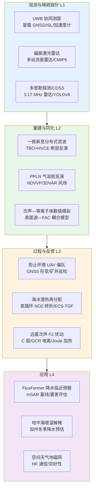
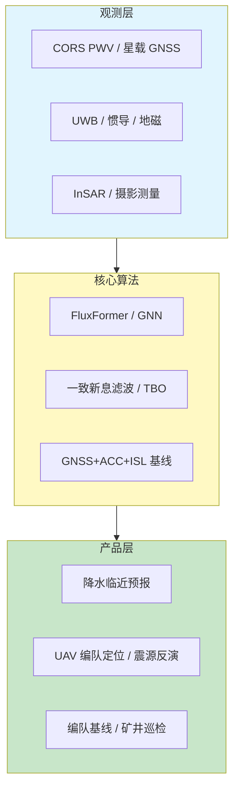
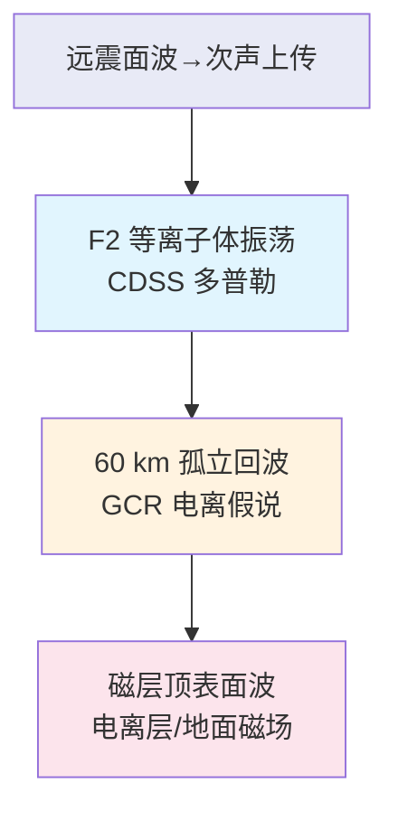
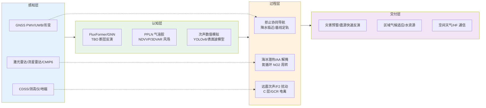

在 2026 年 7 月 5 日至 7 月 9 日窗口内，题录库共收录与「大气」「全球导航卫星系统」「电离层」检索词相匹配的论文十五篇，其中大气类七篇、全球导航卫星系统类五篇、电离层类三篇。相较 2026 年 7 月 4 日周报所覆盖的五十余篇题录，本期样本规模明显收窄，但期刊层级仍集中于 *Atmospheric Chemistry and Physics*、*Journal of Geophysical Research: Atmospheres*、*GPS Solutions* 与 *Remote Sensing* 等方向性刊物，叙事重心由暴时多源电离层诊断与 LEO 干扰定位，转向 GNSS 拒止环境协同导航、星载编队基线定轨、大气垂直耦合观测订正，以及固体地球—大气—电离层跨圈层能量传递的个案深化。背景层面，全球导航卫星系统气象学正沿「密集可降水量观测—深度学习临近预报—数值模式同化」三线并进；电离层研究则把深度学习目标检测、多普勒探测与磁层—电离层—地面耦合数值实验并置，回应第 25 太阳活动周末期对空间天气可解释性与可部署性的共同诉求（Park 等，2025；Danilchuk 等，2025）。大气方向本期突出北极海冰能量收支再分配、人为气溶胶减排下的区域增温解掩，以及中高层大气风场与降水气候预估的不确定性溯源，与全球导航卫星系统水汽反演及电离层垂直扰动传播形成可交叉核对的证据链。

## 一、本期研究印记图

本期题录在科学问题层面呈现「全球导航卫星系统从精密定位与形变反演向拒止环境协同导航、星载编队基线与气象临近预报延伸」「大气科学从北极海冰—气溶胶—中高层风场到氮循环中间体与闪电高能辐射的垂直过程并行推进」以及「电离层从远震次声等离子体扰动、低高度 C 层疑象到磁层顶表面波—地磁耦合」的交叉格局。全球导航卫星系统方向中，Hou 等（2026）以一致新息辅助分布式滤波降低多滑翔机超宽带协同定位通信负担；Teng 等（2026）将树结构贝叶斯优化引入断层几何—滑动联合反演；Shao 等（2026）与 Han 等（2026）分别指向星载多源基线定轨与 FluxFormer 图神经网络降水临近预报两条工程化支线。大气方向中，Liu 等（2026）揭示北极融化季海冰潜热吸收时空再分配；Kalisoras 等（2026）量化地中海人为气溶胶减排对近地表增温的解掩贡献；Zeng 等（2026）以激光雷达验证多站流星雷达三维风场检索。电离层方向中，Chum 等（2026）在约 340 km 高度记录堪察加 M8.8 地震远场共震次声；Krishnakumar 等（2026）以 YOLOv8 系统统计 60 km 附近孤立雷达回波；Archer 等（2026）给出磁层顶表面波在电离层与地面的有限波包效应。下列印记图概括上述层级关系。

## 二、全球导航卫星系统与导航遥感应用方向

全球导航卫星系统方向本期五篇论文全部纳入完整专题画像。整体技术路线呈现「拒止环境分布式协同定位」「深度学习降水临近预报」「星载 GNSS—加速度计—星间测距基线定轨」「树结构贝叶斯优化断层几何—滑动联合反演」与「深井无 GNSS 无人机巡检」五条支线，并与 InSAR 形变监测、数值天气预报及灾害应急响应形成方法互补。需要说明的是，Han 等（2026）与 Shao 等（2026）两篇 *GPS Solutions* 论文在题录中摘要暂不可用，下列画像对技术路线的表述主要依据题名、作者研究脉络与同期文献背景，定量性能指标不作主张。

**表1 全球导航卫星系统方向代表性研究的技术路线与特点**

| 研究主题 | 技术路线概要 | 技术特点 | 重要结论或性能指标 |
| --- | --- | --- | --- |
| 拒止环境协同定位 | 捷联惯导 + UWB 测距 + 联邦滤波 | 一致新息协方差近似 | 位置 RMSE 降 27.14%，通信量降 91.44% |
| GNSS 降水临近预报 | FluxFormer + 图注意力网络 | 时空图结构建模 PWV | 摘要暂不可用 |
| 星载编队基线 | GNSS + 加速度计 + ISL 联合定轨 | 多源几何与非引力补偿 | 摘要暂不可用 |
| 断层联合反演 | TBO + HVCE 权分量估计 | 替代 MCMC 长 burn-in | 合成与阳漾地震验证稳健 |
| 深井 UAV 巡检 | 六旋翼摄影测量 + 后期定位 | 无 GNSS 封闭空间 | 波兰最深矿井案例验证 |

### 2.1 专题画像：拒止环境多滑翔机一致新息辅助分布式协同定位

**（1）技术路线：捷联惯导递推—超宽带测距约束—一致新息分布式量测更新—联邦多源滤波融合**

Hou 等（2026）面向全球导航卫星系统拒止环境下的多滑翔机无人机编队，提出一致新息辅助的分布式协同定位框架。各节点以捷联惯性导航系统为局部状态递推基准，引入节点间超宽带测距作为协同几何约束；在避免显式传播全局交叉协方差的前提下，构造保守的新息协方差近似，实现分布式量测更新。协同定位子滤波进一步与高度、地磁与场景匹配子滤波通过联邦滤波架构集成，并采用自适应矢量信息分配策略。研究建立多滑翔机投放仿真，对比非协同定位、集中式协同定位与精确交叉协方差分布式基线。

**（2）技术特点：在精度—通信—鲁棒性三角约束下实现工程可部署的分布式协同**

相较集中式方案需全局状态管理与高通信开销，以及精确交叉协方差法对链路可靠性的苛刻要求，该工作以一致新息近似在理论上保证滤波一致性边界的同时，将每节点维护对象压缩为局部状态与协方差。联邦架构使异源辅助导航源可按场景权重接入，20% 丢包率下仍保持有界误差，体现面向实际编队通信受限场景的鲁棒性设计。

**（3）重要结论：一致新息分布式协同定位在精度接近精确交叉协方差法的同时显著降低通信负担**

**该研究的重要结论是：相较非协同方案，所提方法使位置、速度与航向均方根误差分别降低 27.14%、21.90% 与 9.68%；相较精确交叉协方差分布式基线，定位精度相当而通信流量约降低 91.44%，且在 20% 丢包率下误差仍有界。** 该结论对拒止环境下无人机群搜索救援、海洋滑翔机集群观测与战术协同导航具有直接工程意义；局限在于仿真场景尚未覆盖复杂城市多径与长时间惯导漂移耦合，外推至真实战场电磁环境仍需半实物试验验证。

### 2.2 专题画像：FluxFormer 与图注意力网络的 GNSS 降水临近预报时空框架

**（1）技术路线：全球导航卫星系统可降水量时空序列—FluxFormer 时序特征提取—图注意力网络空间依赖建模—临近降水预报（据题名与同期文献脉络推断）**

Han 等（2026）在 *GPS Solutions* 发表题为「A spatiotemporal framework for GNSS-based rainfall nowcasting with FluxFormer and attention-based graph neural networks」的研究。**需说明的是，题录与 Crossref、Semantic Scholar 均未提供摘要全文，下列技术路线主要依据题名结构及全球导航卫星系统降水临近预报近期方法学脉络归纳，不作为该文已报告结论。** 从题名可识别，框架以全球导航卫星系统站点或格网化可降水量（PWV）为核心输入，采用 FluxFormer 类时序变换模块刻画水汽时间演变，并以基于注意力的图神经网络表达测站间空间相关与传播结构，目标窗口为 0–6 小时量级的降水临近预报。该路线与 Remote Sensing 与 GPS Solutions 近期将 PWV 与雷达或气象变量融合的深度学习框架（如 STEA-Swin、ATFcast 等）在问题设定上高度同构，但具体损失函数、训练样本、预报时效与检验指标须待摘要或全文核验后方可引用。

**（2）技术特点：将全球导航卫星系统水汽探针嵌入时空图深度学习范式**

全球导航卫星系统 PWV 能敏感反映对流发生前的大气水汽积累，却受站点稀疏与时空采样不均制约。图神经网络通过显式建模测站拓扑或距离加权邻接，有望缓解格点化插值对极端降水信号的平滑；FluxFormer 作为时序模块，则针对 PWV — 降水之间非线性、非平稳滞后关系提供比传统时间序列模型更强的多尺度表征能力。若框架进一步联合地面降水或雷达反射率，可望形成与数值天气预报互补的 0–3 小时区域预警链路。

**（3）重要结论与证据边界：方法定位明确，定量结论待摘要核验**

**在摘要暂不可用的约束下，该研究可确认的贡献定位是提出一套面向全球导航卫星系统 PWV 的 FluxFormer—图注意力网络临近预报时空框架；任何关于临界成功指数、命中率或特定区域改进幅度的表述均不应从题名单独外推。** 该工作若经独立验证成立，将强化全球导航卫星系统气象学从「水汽监测」向「短临灾害预警」的业务化延伸；对读者而言，当前最稳妥的跟进方式是获取出版社摘要后核对训练数据年限、站点密度、是否处理降水零膨胀与极端样本不平衡等关键实验设计。

### 2.3 专题画像：星载 GNSS、加速度计与星间测距联合精密基线确定

**（1）技术路线：星载双频 GNSS 观测—加速度计非引力补偿—星间测距几何约束—鲁棒基线/相对定轨滤波（据题名与作者先前工作脉络推断）**

Shao 等（2026）在 *GPS Solutions* 发表「Robust and enhanced precise baseline determination using spaceborne GNSS, accelerometer and intersatellite ranging measurements」。**摘要暂不可用，下列路线依据题名及作者团队既往编队飞行动力学研究归纳。** 技术链条通常包含：以星载 GNSS 提供绝对轨道几何与钟差约束；以加速度计观测补偿大气阻力、太阳光压等非引力加速度，改善短弧段动力学一致性；以星间测距（如 K 波段或激光链路）提供编队卫星间强相对几何约束。三者联合可在单星 GNSS 几何弱化或观测质量不对称时稳定相对基线，服务干涉合成孔径雷达、重力恢复与量子惯性导航等厘米级基线需求。作者团队此前在 *Journal of Geodesy*（Wei 等，2023）与相关编队卫星任务分析中已验证加速度计对低轨编队基线的增益，本期论文有望在此基础上引入星间测距与鲁棒估计策略。

**（2）技术特点：多源观测互补应对编队任务中观测不对称与粗差污染**

低轨编队任务常面临「一星观测优、一星观测劣」的不对称格局。星间测距可在 GNSS 几何不足时提供独立相对约束；加速度计则缩短动力学参数化自由度，降低经验力模型误差向基线参数的泄漏。若论文采用 M 估计、残差质检或方差分量估计（如 Helmert 型权定标），可进一步抑制相位粗差与码噪声对长基线解算的敏感性——这与 GRACE-FO 实时定轨中联合 GNSS 与星间测距及残差质检的思路一致（Zhang 等，2026）。

**（3）重要结论与证据边界：问题设定清晰，性能指标待全文确认**

**可确认的是，该研究针对星载 GNSS、加速度计与星间测距三源联合的精密基线确定，强调鲁棒性与精度增强；具体毫米级改进幅度、试验卫星平台与处理弧段长度须待摘要或全文发布后引用。** 对干涉合成孔径雷达与空间引力波探测任务规划而言，此类多源融合基线方案是连接「单星精密定轨」与「编队科学产品」的关键环节；在外推时需注意不同轨道高度、天线相位中心改正与星间链路噪声模型的可迁移边界。

### 2.4 专题画像：树结构贝叶斯优化与 HVCE 的断层几何—滑动联合反演

**（1）技术路线：大地测量表面位移—子断层参数化—树结构贝叶斯优化搜索—Helmert 方差分量定权—合成与真实地震检验**

Teng 等（2026）面向全球导航卫星系统与干涉合成孔径雷达等大地测量同震形变，发展树结构贝叶斯优化（TBO）与 Helmert 方差分量估计（HVCE）相结合的断层几何与滑动分布联合反演方法。相较传统依赖马尔可夫链蒙特卡洛采样的贝叶斯推断，TBO 以树结构策略组织参数空间探索，缓解长 burn-in、初值敏感与步长选择导致的收敛低效。HVCE 则为多源大地测量观测提供统计定权，使不同观测类型的方差贡献在反演中自适应平衡。研究设计四类合成试验，覆盖不同断层类型、观测密度、子断层尺度与凹凸体分布，并应用于 2021 年云南漾濞 Mw 6.4 地震。

**（2）技术特点：以全局优化替代高维 MCMC 采样，面向业务化震源快速反演**

地震应急中，断层几何与滑动分布需在数分钟至数小时内稳定产出。TBO 通过结构化搜索降低对初始模型与采样步长的依赖，合成试验显示在多种观测配置与复杂多断层场景下均保持稳健；与现有 MCMC 类方法对比，计算效率与观测拟合残差均具优势。HVCE 的引入使全球导航卫星系统与干涉合成孔径雷达联合反演中的权矩阵不再依赖经验比例，提升多源联合的可重复性。

**（3）重要结论：TBO+HVCE 在合成与阳漾地震中稳定恢复断层几何与滑动分布**

**该研究的重要结论是：树结构贝叶斯优化配合 HVCE 在多种合成配置下均能稳定、可靠地联合反演断层几何与滑动分布，计算效率显著优于常规 MCMC 方案，且对初值敏感性更低；2021 年漾濞 Mw 6.4 地震应用结果与已知断层运动学及地表形变场一致。** 该结论对地震应急快速震级评估、同震应力触发分析与海啸/滑坡次生灾害判定具有方法学价值；局限在于大地测量观测空间分布仍制约深部滑动分辨率，强震复杂破裂若偏离单一矩形断层假设，需扩展几何参数化或引入有限断层动力学约束。

### 2.5 专题画像：深垂直矿井无 GNSS 环境无人机摄影测量巡检

**（1）技术路线：定制六旋翼平台—多相机摄影测量—由概念验证至集成定位系统—高通风量竖井飞行试验**

Rutkowski 等（2026）针对波兰 Kwielice 地区 KGHM GG-1 竖井——该国最深运营矿井——开展无人机结构巡检系统开发与试飞。竖井环境具有强通风气流、狭窄几何空间与全球导航卫星系统信号缺失等约束。研究团队从早期无定位概念机、多相机配置迭代，到最终集成定位系统与六相机阵列，完成高海拔飞行数据采集，以摄影测量生成井壁结构与设施的空间信息，并与传统人工巡检对照。

**（2）技术特点：将消费级/工业级无人机遥感嵌入极端受限地下基础设施运维**

地下竖井巡检长期依赖人工绳降，存在安全风险与主观性评估偏差。该研究展示无人机可在无 GNSS 条件下通过视觉—惯性或局部定位方案获取足够精度的结构异常识别与档案化记录，降低人员暴露风险并提升数据客观性。多相机配置有助于在弱纹理井壁与复杂光照下维持摄影测量网形稳定性。

**（3）重要结论：无人机摄影测量可作为深井常规巡检的补充手段**

**该研究的重要结论是：所开发无人机系统在 GG-1 竖井挑战性条件下获取了足以识别结构不规则、记录基础设施并支持安全监测的空间数据，验证无人机技术可作为传统巡检的补充工具。** 该结论对采矿、隧道与深部地下工程运维具有推广潜力；局限在于单案例试验尚未建立不同井壁材质、粉尘浓度与气流扰动下的精度统计，定位系统在无 GNSS 环境中的长期漂移与闭环控制策略仍需更多工程化验证。

## 三、大气科学方向

大气科学方向本期七篇论文全部纳入专题画像。期刊分布于 *Biogeosciences*、*Geophysical Research Letters*、*Atmospheric Measurement Techniques*、*Atmospheric Chemistry and Physics* 与 *Journal of Geophysical Research: Atmospheres*，呈现「生物地球化学中间过程—高能大气放电—极地海冰能量收支—气溶胶遥感分类—人为气溶胶气候效应—中间层风场观测—区域降水预估不确定性」的并行主题，并与电离层次声传播及全球导航卫星系统气象应用形成垂直耦合接口。

**表2 大气科学方向代表性研究的技术路线与特点**

| 研究主题 | 技术路线概要 | 技术特点 | 重要结论或性能指标 |
| --- | --- | --- | --- |
| 氮循环 NO2 转折 | 氧化还原梯度同位素约束 | 强调中间体而非库量 | 氮命运在 NO2 周转处分流 |
| 陆地伽马射线闪 | THOR+BIMAP-3D 联合观测 | 强负地闪后 TGF | 日本外首次 ECS-TGF 记录 |
| 北极海冰潜热 | 再分析/卫星热收支诊断 | 中心与边缘反向异常 | 融化季潜热吸收增强 |
| 乌尔米湖气溶胶 | 偏振激光雷达 PPLN 反演 | 64 个烟羽分类 | 47% 盐主导型 |
| 地中海气溶胶增温 | CMIP6 ERF 与 TAS 趋势 | 人为气溶胶减排解掩 | 年增温 0.67°C，AA 贡献 49% |
| 流星雷达风场 | NDVVP vs 3DVAR+DIV | 激光雷达 88 km 验证 | 相关系数 0.93，RMS 14 m/s |
| 加州冬季降水 | LOCA2 降尺度 CMIP6 | NPSH 纬度解释 53% 离散 | 北太平洋海气耦合关键 |

### 3.1 专题画像：亚硝酸盐周转控制氧化还原梯度氮循环命运

**（1）技术路线：天然系统氮形态观测—亚硝酸盐动力学诊断—δ15N–δ18O 双同位素约束—氧化还原梯度情景推演**

Sebilo 与 Margalef-Marti（2026）在 *Biogeosciences* 发表观点性研究，提出氮循环解释应以亚硝酸盐（NO2−）周转为核心枢纽，而非仅关注硝酸盐与铵态等主导库量。亚硝酸盐是氧化与还原分支的必经中间体，浓度常接近检测限，却承载高通量、近零库量的动力学签名。研究主张通过 δ15N–δ18O 联合示踪同时约束产生与消耗通量，区分生物与 abiotic 路径，并利用与水的部分氧同位素交换提升 δ15N 对隐蔽周转的诊断能力。

**（2）技术特点：从库量思维转向通量—中间体思维，服务气候与土地利用扰动下的氮预算预测**

传统浓度监测易将快速内部循环掩盖为净信号，导致氮滞留、再循环与大气 N2O 排放路径难以预测。以亚硝酸盐为中心的解释框架，可把氧最小层、湿地与好氧土壤置于统一动力学语言下，为评估氧化还原变率增强对生态系统敏感性的机制基础。

**（3）重要结论：氮命运在亚硝酸盐周转阶段即已分流，低浓度不代表功能次要**

**该研究的重要结论是：氮滞留、再循环与大气损失在亚硝酸盐周转阶段即由竞争路径分配决定；其低浓度反映快速耦合周转而非功能不重要，δ15N–δ18O 联合示踪可为隐藏通量提供机制约束。** 该结论对农业面源减排、沿海富营养化与 N2O 排放清单具有范式意义；局限在于天然环境亚硝酸盐浓度极低，对分析灵敏度与采样策略提出更高要求，定量通量拆分仍需与过程模型和通量测定协同验证。

### 3.2 专题画像：强负地闪触发的陆地伽马射线闪（日本外首次 ECS 型）

**（1）技术路线：THOR 伽马探测器—BIMAP-3D 三维闪电成像—ENTLN 场变化波形—辐射场与光子传播模拟**

Jensen 等（2026）报道美国新墨西哥洛斯阿拉莫斯国家实验室附近一次强负云地闪（−237 kA）触发的陆地伽马射线闪（TGF）。地面 THOR 仪器与 BIMAP-3D 三维宽带干涉成像偏振系统同步观测，ENTLN 提供场变化参考。TGF 出现在回击开始后约 35 μs，电场脉冲可能由 TGF 孤立产生或与闪电通道耦合。辐射场建模与大气光子传播反演表明光子数量级约 1016。

**（2）技术特点：首次在日本以外气候与地形记录「高能紧凑回击」型 TGF**

此前类似 ECS 形态 TGF 主要见于日本冬季海岸闪电。本观测位于不同气候、地形与季节，却呈现极高相似性，暗示 ECS-TGF 可能是比区域个案更普遍的高电流负地闪伴生现象，为闪电高能辐射与云内电场加速机制提供跨气候对比证据。

**（3）重要结论：ECS 型 TGF 可出现在日本以外地区，与超强负地闪紧密伴生**

**该研究的重要结论是：强负地闪（ECS 形态场变化）可在回击后数十微秒触发 TGF，且该现象在美国内陆夏季观测与日本海岸冬季案例高度相似，为 ECS-TGF 的普遍性提供首个日本外证据。** 该结论对卫星伽马暴监测算法、航空电磁环境评估与雷暴云内电场快速演化模型具有意义；单次事件尚不足以建立气候态发生频率，需联合全球地面与低轨伽马探测器扩展统计样本。

### 3.3 专题画像：北极海冰融化季潜热在能量收支中的活化

**（1）技术路线：卫星与再分析海冰热力学诊断—相变潜热通量估算—中心 Arctic 与边缘冰区对比—融化季时间位相演变**

Liu 等（2026）在 *GRL* 分析北极海冰相变潜热在能量收支中的作用。融化季海冰潜热吸收增强，但空间格局呈中心 Arctic 与边缘冰区反向异常：中心区域海冰变薄促进潜热吸收增加，边缘区域海冰体积减少反而限制增强幅度。融化季时间窗口前移并延长，潜热吸收峰值由融化后期向前期迁移。

**（2）技术特点：将潜热过程从海冰热力学次要项提升为一等能量收支因子**

海冰反照率反馈与开路水域扩张已广为人知，相变潜热的时间重分配则揭示热力学过程对季节循环的再塑形能力。该视角对耦合模式中海冰能量守恒与融化季预报具有诊断价值。

**（3）重要结论：北极海冰潜热在融化季变得更活跃且季节位相前移**

**该研究的重要结论是：融化季海冰潜热吸收显著增强，中心与边缘冰区呈反向异常格局，且吸收峰值随融化季提前而前移，表明潜热已成为北极海冰能量收支中日益活跃的组成部分。** 该结论对北极航运窗口、生态生产力与大气边界层水汽输送评估具有启示；需与同期海冰厚度观测及模式敏感性试验交叉验证，以避免再分析产品在海冰边缘区的系统偏差。

### 3.4 专题画像：乌尔米湖干涸湖床盐—尘气溶胶激光雷达分类

**（1）技术路线：532 nm 偏振激光雷达方位扫描—改进两步 PPLN 反演—多尺度层检测—烟羽类型统计**

Alizadeh 等（2026）利用扫描偏振激光雷达调查伊朗乌尔米湖干涸湖床上空近地面气溶胶。2022 年 9 月夜间方位扫描数据经改进的两步偏振激光雷达光度计网络（PPLN）反演，获得尘、盐尘与湿盐气溶胶的后向散射比与质量浓度；多尺度层检测算法隔离烟羽区域。对 64 个独立烟羽的分类显示 47% 为盐主导、25% 尘主导、28% 混合模态。

**（2）技术特点：盐粒低退偏振比却高后向散射，改变干涸湖床辐射效应评估**

即使盐质量分数较低，盐性粒子仍可显著增强后向散射，使干涸湖床源区在区域辐射平衡与云凝结核供给中的角色被低估。PPLN 与层检测联用为复杂近地面烟羽提供可重复分类流程。

**（3）重要结论：乌尔米湖床烟羽以盐主导型为主，盐粒对后向散射贡献显著**

**该研究的重要结论是：干涸湖床上空烟羽多含盐与尘混合物，47% 烟羽呈盐主导型；盐性粒子退偏振比低于纯尘，但可显著增强后向散射，低盐质量分数即可明显改变辐射特征。** 该结论对中亚干旱区气候反馈、公共卫生暴露评估与卫星气溶胶类型反演具有区域针对性；观测限于单季节夜间扫描，日变化与风速阈值效应尚待扩展。

### 3.5 专题画像：CMIP6 人为气溶胶减排下地中海增温放大

**（1）技术路线：CMIP6 地球系统模式 ERF 与近地表温度趋势—1970–1979 与 2005–2014 对比—陆面观测验证—环流变化附加效应**

Kalisoras 等（2026）评估全球人为气溶胶（AA）减排对地中海（MED）近地表增温的放大效应。多模式集合显示，地中海顶空有效辐射强迫与近地表温度在约 1980 年前下降、之后上升，与空气污染控制政策一致。1970–1979 峰值 AA 期至 2005–2014 近期，年均 ERF 变化 2.37±1.06 W m−2，年均近地表温度上升 0.67±0.37°C，其中 AA 贡献年（夏）增温的 49%（39%）。冬季模式高估 1.19°C 增温，AA 贡献 60%。

**（2）技术特点：将「气溶胶掩蔽」从全球平均叙事推进到敏感区域定量归因**

地中海对 AA 变化响应强，源于污染历史、辐射敏感陆面与季节环流调制。研究进一步指出 AA 减排引起的环流变化可再分配区域温度型，使增温机制超越单纯辐射效应。

**（3）重要结论：地中海近期加速增温与全球 AA 减排解掩密切相关**

**该研究的重要结论是：地中海 1970–1979 至 2005–2014 年间增温与 AA 导致的 ERF 减弱显著相关，AA 可解释约半数年尺度增温，冬季贡献更高；环流变化可额外调制空间型。** 该结论对「清洁空气—更快增温」政策协同、区域适应规划与 CMIP7 气溶胶方案设计具有警示意义；多模式冬季仍偏暖，提示需改进地中海环流与气溶胶—云相互作用参数化。

### 3.6 专题画像：多站流星雷达风场检索的激光雷达验证

**（1）技术路线：华东多站流星雷达网（ECMMET）观测—NDVVP 与 3DVAR+DIV 并行反演—同期激光雷达对比—10 min 高时间分辨率评估**

Zeng 等（2026）利用 ECMMET 评估两种三维水平风场检索方法：新发展的体速度处理（NDVVP）与带散度约束的三维变分（3DVAR+DIV）。两种方法在 10 min 分辨率下保持稳定，水平风相关系数超 0.9，平均差异在 1 m/s 内。与 88 km 高度激光雷达对比，3DVAR 区域风相关系数 0.93，均方根差 14.0 m/s。

**（2）技术特点：揭示线性假设与空间网格化对中低热层风场细节的不同取舍**

NDVVP 的线性风假设平滑高阶非线性波动，更适合整体趋势；3DVAR+DIV 通过空间格点更有效捕获细节变化。差异源于方法假设而非观测噪声，提示业务产品应注明「趋势场」或「细节场」适用场景。

**（3）重要结论：ECMMET 可提供可靠高分辨率中间层—低热层风场，两算法互补**

**该研究的重要结论是：ECMMET 反演风与激光雷达高度一致，3DVAR+DIV 更擅空间细节，NDVVP 更擅整体趋势，10 min 尺度稳定可靠。** 该结论对中间层重力波拖曳参数化、火箭与再入飞行器风场输入及与全球导航卫星系统电离层扰动关联分析具有基础观测价值；激光雷达对照站点有限，区域外推需谨慎。

### 3.7 专题画像：加州冬季降水预估与北太平洋副热带高压不确定性

**（1）技术路线：LOCA2-HybridCA 高分辨率降尺度—CMIP6 多模式冬季降水变化—北太平洋副热带高压（NPSH）纬度离散相关—海表温度调制诊断**

Choi 等（2026）评估加州冬季降水未来变化及其模式间不确定性。LOCA2-HybridCA 数据虽校正模式平均偏差并再现地形降水气候态，未来预估仍存在显著离散。沿加州中央海岸，53% 的冬季降水变化模式间差异可由 NPSH 纬度变化差异解释，后者又与 extratropical 北太平洋海表温度变化密切相关。

**（2）技术特点：将降水预估不确定性锚定到可观测的大尺度环流指标**

而非仅报告多模式降水范围，该研究把不确定性源头追溯到海气耦合模态，为观测约束与模式加权提供物理入口。

**（3）重要结论：加州冬季降水变化受北太平洋海气耦合通过 NPSH 调制**

**该研究的重要结论是：加州冬季降水对未来变化的模式间离散，在很大程度上由 NPSH 纬度响应差异驱动，而 NPSH 变化又与北太平洋海表温度密切关联；准确表征北太平洋海洋—大气相互作用是缩小预估不确定性的关键。** 该结论对加州水资源长期规划、水库调度与干旱—洪水风险管理具有政策相关性；降尺度产品对极端降水尾部事件的刻画仍需独立验证。

## 四、电离层方向

电离层方向本期三篇论文全部纳入专题画像，分别覆盖远震次声致 F2 层等离子体扰动、60 km 附近疑似 C 层雷达回波的系统识别，以及磁层顶表面波在磁—电离层—地面系统的有限波包效应，形成「固体地球能量上传—低高度电离结构—太阳风驱动表面波下行」的垂直链条。

**表3 电离层方向代表性研究的技术路线与特点**

| 研究主题 | 技术路线概要 | 技术特点 | 重要结论或性能指标 |
| --- | --- | --- | --- |
| 远震次声电离层 | CDSS+测高仪+数值模拟 | 约 340 km 记录高度 | 0.005 Hz 多普勒振荡 |
| C 层雷达回波 | YOLOv8 四年自动识别 | 58.5 km 中值高度 | 太阳活动极大年发生率降 |
| 磁层顶表面波 | 色散无关数值模型 | 有限波包 FAC 偶极 | 需加密地磁台网 |

### 4.1 专题画像：堪察加 M8.8 地震远场共震次声电离层扰动

**（1）技术路线：捷克—斯洛伐克连续多普勒探测（CDSS）—同期测高仪约束高度—垂直地表运动频谱—大气/等离子体数值模拟**

Chum 等（2026）分析 2025 年 7 月 29 日堪察加 M8.8 地震在中欧产生的电离层扰动。地磁平静条件下，CDSS 在距震中逾 8000 km 处记录到约 340 km 高度的共震次声响应，为以往观测显著更高。多普勒频移振荡频率约 0.005 Hz，出现在地震长周期面波到达后约 12 min。地表垂直运动频谱更宽，0.05 Hz 分量更强，但高频次声在上传过程中衰减，未达观测高度，数值模拟与 CDSS 一致。

**（2）技术特点：强调空气/等离子体压缩对等效粒子速度反演的重要性**

从多普勒频移推算空气粒子速度时，若忽略压缩效应将系统偏差振幅估计。CDSS 与测高仪及数值模拟三联，为远震次声能量上传至 F2 层提供可检验闭环。

**（3）重要结论：远震次声可在逾 8000 km 距离、约 340 km 高度被探测，高频分量受上传衰减选择**

**该研究的重要结论是：M8.8 远震可在安静电离层条件下激发中欧上空约 340 km 的准周期等离子体运动，主频约 0.005 Hz；更高频地表运动虽强，却未穿透至该高度，数值模拟支持上传频率选择机制。** 该结论对地震电离层预警、全球导航卫星系统行波扰动监测及次声—电离层耦合参数化具有示范意义；单次事件对业务化阈值的统计基础仍薄，需积累更多远震—探测站几何配置。

### 4.2 专题画像：YOLOv8 自动识别 60 km 附近孤立雷达回波与 C 层假说

**（1）技术路线：3.17 MHz 单站雷达原始谱图—人工初筛—YOLOv8 深度学习检测—四年统计（极小至极大太阳活动）**

Krishnakumar 等（2026）针对极区白天 60 km 附近孤立、断续雷达回波，开发 YOLOv8 自动检测流程，区分其与普通 D 区连续回波。四年数据显示回波中值高度 58.5 km（σ=3.9 km），层厚约 6 km，功率谱相对狭窄；发生率和强度具显著年变化，夏冬二分明显。2024 太阳活动极大年发生率与强度降低，伴随银河宇宙线（GCR）强度减弱，提示 GCR 可能是重要电离源。

**（2）技术特点：以计算机视觉把「疑似的低高度电离层结构」推进为可统计对象**

传统 D 区下界约 60 km，更低高度的 C 层证据主要来自甚低频观测，缺乏系统雷达统计。YOLOv8 使多年海量谱图的人工不可承受劳动转为可重复检测，为检验 C 层是否存在提供 monostatic 雷达维度的首批系统证据。

**（3）重要结论：58.5 km 孤立回波具季节与太阳活动调制，GCR 电离假说获间接支持**

**该研究的重要结论是：极区白天 58.5 km 附近孤立雷达回波可被自动可靠检测，呈夏冬季节差异；太阳活动极大年发生率下降与 GCR 减弱同步，支持 GCR 参与该层电离的可能。** 该结论若获独立雷达与火箭探空印证，将修订标准电离层分层认知；当前仍为单站、单频率证据，电磁传播路径与流星/噪声误检需进一步排除。

### 4.3 专题画像：磁层顶表面波在磁—电离层—地面耦合中的有限波包效应

**（1）技术路线：无色散磁层顶表面波简化数值模型—场向电流偶极子远场近似—电离层筛选/旋转/涂抹—地面感应电导率依赖**

Archer 等（2026）构建耦合磁层—电离层—地面系统中无色散磁层顶表面波模型，分析有限波包与无限平面阿尔芬波的差异。有限波包可分解为周期波动与慢变趋势；远场行为类似交变场向电流串，在电离层与地面均可用二维电流偶极描述。电离层近场周期扰动随纬度指数衰减，雷达可能难以分辨；地面磁场三分量因波数谱干涉呈现比无限平面波更复杂的上下映射。不同电导率对应不同有效趋肤深度，地面感应从近绝缘到良导体变化，影响观测磁场与地电场。

**（2）技术特点：把上游压力脉动或剪切不稳定驱动的表面波局部化效应定量引入空间天气影响评估**

表面波是磁层顶扰动向下耦合的局域源，可贡献电离层—热层焦耳加热与地面地电场，但纬度尺度可能小于常规地磁台站间距。研究直接回应新一代数字化电离层雷达与 SMILE 任务计划中的共轭观测需求。

**（3）重要结论：典型中尺度表面波影响显著但空间局域，需加密观测网**

**该研究的重要结论是：磁层顶表面波可在电离层与地面对应显著但纬度局域的扰动，有限波包效应使磁场映射复杂化，地面响应强烈依赖电导率；典型中尺度波长下，振幅与极化变化的纬度尺度小于常见地磁台站间距。** 该结论对解释局地地磁脉冲、感应地电场空间天气危害及雷达可探测性评估具有理论指导；简化模型未包含色散与三维不均匀电离层，定量振幅仍需与事件个案对比校准。

## 五、交叉学科网络与创新链

全球导航卫星系统、大气科学与电离层在本期窗口内通过水汽探针、固体地球次声上传、中高层风场与磁层顶电流耦合形成多重闭合。下列创新链流程图概括数据—算法—过程—应用的跨域链接。

创新链上值得强调的三条路径如下。其一，全球导航卫星系统水汽（Han 等，2026；Kalisoras 等，2026）与大气水分循环、区域增温归因并联，使同一套地基延迟观测同时服务临近预报与气候解掩叙事，但两类应用对时间尺度与偏差结构的权重截然不同，不宜混用产品。其二，固体地球形变（Teng 等，2026）与远震次声电离层响应（Chum 等，2026）共享「地表位移—大气/等离子体响应」物理链条，前者面向秒—分钟级形变反演，后者面向分钟—小时级上行声波筛选，联合可构建震后多圈层序列监测原型。其三，中间层风场（Zeng 等，2026）与磁层顶表面波（Archer 等，2026）共同指向中间层—低热层—电离层动力学的观测稀疏问题：流星雷达网提供区域风背景，表面波模型则提示局地电流—磁场扰动可能落在台站间距以下，推动数字化电离层雷达与密集地磁阵列的协同部署。

## 六、近期研究特色变化与未来趋势

相较 2026 年 7 月 4 日周报，本期题录规模由五十余篇收窄至十五篇，但研究深度与过程耦合粒度有所提升。全球导航卫星系统方向由 LEO 干扰定位、Chi 平方检测与 ICLS 物理约束 PPP 等「韧性精密定位」集群，扩展至拒止环境 UWB 协同、星载三源基线与 FluxFormer 降水预报等「多源融合—深度学习」支线；大气方向由千米城市气候与 MJO 海气耦合，转向北极海冰潜热位相迁移、地中海 AA 解掩与氮循环 NO2 中间体机制等过程约束议题；电离层方向由八篇暴时诊断与 GOLD 统计，收敛为远震次声远传、60 km C 层疑象与磁层顶表面波三类机制深化个案。两条 *GPS Solutions* 论文摘要缺失，提示近期出版社元数据滞后可能影响自动化监测流水线，需以 DOI 轮询或作者预印本补全证据链。

结合本期题录与公开文献背景，未来 6–12 个月趋势判断如下。精密全球导航卫星系统方面，拒止环境协同定位将从仿真走向半实物与低空经济法规场景；星载 GNSS、加速度计与星间测距联合定轨将随干涉合成孔径雷达与重力梯度星座部署成为标准配置；降水临近预报框架将继续沿「PWV 图网络 + 雷达/闪电同化」演进，零膨胀与极端样本不平衡处理（参见 RainBalance 等近期工作）将成为模型落地的前置条件。全球导航卫星系统气象学方面，电信基础设施衍生的大规模延迟观测与 AI 赋能同化（Matakos 等，EGU 2026）可能重塑区域水汽同化成本曲线，但需与 ERA5 及业务数值天气预报进行严格偏差审计。电离层方面，深度学习站点化总电子含量预报与单频精密单点定位改正（GPS World，2026；IEEE TAES，2026）将从研究原型进入近实时服务试验；远震次声与表面波两类「固体地球—空间」耦合事件将推动多普勒探测网与密集地磁台网联合告警标准讨论；C 层/GCR 假说若获多站印证，将触发国际参考电离层低高度边界修订。大气方面，人为气溶胶减排的解掩效应将在地中海、东亚等敏感区持续凸显，政策叙事需并行推进温室气体减排；北极海冰潜热活化将倒逼海冰模式相变参数化与融化季预报指标更新；中间层风场长期序列将为 whole-atmosphere 模式提供约束，改善全球导航卫星系统对流层—电离层耦合误差传播分析。跨域集成上，全球导航卫星系统正由单一导航传感器演进为「水—电—磁—形变」多圈层探针，其与数值模拟、深度学习及加密地基网的闭环验证，将是下一阶段最具可操作性的交叉创新界面。

## 参考文献

1. Alizadeh, S., Moradhaseli, R., & Khalesifard, H. R. (2026). Classification of atmospheric aerosols over Urmia Lake based on lidar observations. *Atmospheric Measurement Techniques*, 19, 4477–4498. https://doi.org/10.5194/amt-19-4477-2026
2. Archer, M., Southwood, D., Zhang, S., Sun, Q., & Heyns, M. (2026). Characterising mesoscale magnetopause surface waves within magnetosphere–ionosphere–ground coupling. *Annales Geophysicae*, 44, 595–612. https://doi.org/10.5194/angeo-44-595-2026
3. Choi, J., Ullrich, P. A., Lee, J., Gleckler, P. J., Goodnight, S., & Son, S.-W. (2026). Uncertainty in California Winter Precipitation Linked to Future Projections of North Pacific Large‐Scale Atmospheric Circulation. *Journal of Geophysical Research: Atmospheres*. https://doi.org/10.1029/2025jd045669
4. Chum, J., Mošna, Z., Baše, J., Zedník, J., Schmidt, C., Hannawald, P., Rusz, J., Urbář, J., & Mackovjak, Š. (2026). Co-seismic infrasound in the ionosphere over Central Europe from the M8.8 Kamchatka 2025 earthquake observed by Doppler sounding at record heights. *Atmospheric Chemistry and Physics*, 26, 9559–9570. https://doi.org/10.5194/acp-26-9559-2026
5. Danilchuk, E., Yasyukevich, Y., Vesnin, A., Klyusilov, A., & Zhang, B. (2025). Impact of the May 2024 Extreme Geomagnetic Storm on the Ionosphere and GNSS Positioning. *Remote Sensing*, 17(9), 1492. https://doi.org/10.3390/rs17091492
6. Han, X., Wang, X., Wu, J., Wang, Y., Awange, J., Zhang, B., & Chan, T. O. (2026). A spatiotemporal framework for GNSS-based rainfall nowcasting with FluxFormer and attention-based graph neural networks. *GPS Solutions*. https://doi.org/10.1007/s10291-026-02121-w
7. Hou, Z., Xue, C., Chen, S., Xu, C., Jiang, C., & Niu, J. (2026). Consistent-Innovation-Aided Distributed Cooperative Localization for Multi-UAV Navigation in GNSS-Denied Environments. *Remote Sensing*, 18(14), 2286. https://doi.org/10.3390/rs18142286
8. Jensen, D. P., Smith, D. M., Shao, X.-M., Lapierre, J. L., & Chaffin, J. M. (2026). Terrestrial Gamma‐Ray Flash Following Intense Negative Return Stroke Observed With BIMAP‐3D. *Journal of Geophysical Research: Atmospheres*. https://doi.org/10.1029/2026jd046593
9. Kalisoras, A., Zanis, P., Georgoulias, A. K., Akritidis, D., Allen, R. J., & Naik, V. (2026). Temperature and radiative responses to anthropogenic aerosols over the Mediterranean Basin based on CMIP6 Earth system models. *Atmospheric Chemistry and Physics*, 26, 9413–9434. https://doi.org/10.5194/acp-26-9413-2026
10. Krishnakumar, Y. K., Renkwitz, T., & Ahrens, A. (2026). Automated detection of low-altitude isolated mesospheric radar echoes using YOLOv8: evidence for an ionospheric "C layer" phenomenon below 60 km altitude? *Atmospheric Chemistry and Physics*, 26, 9571–9586. https://doi.org/10.5194/acp-26-9571-2026
11. Liu, Y., Zhang, L., Shi, G., & Liang, X. (2026). Sea Ice Latent Heat Becomes More Active in the Arctic Sea Ice Energy Budget. *Geophysical Research Letters*. https://doi.org/10.1029/2026gl122371
12. Park, J., Spogli, L., Azeez, A., Alfonsi, L., Cesaroni, C., Romano, V., et al. (2025). The impact of Mother's Day Storms in May 2024 on Precise Point Positioning at mid-latitudes. *Annals of Geophysics*, 68(2), A214. https://doi.org/10.4401/ag-9161
13. Rutkowski, W., Szczepaniak, J., Lipecki, T., & Rzonca, A. (2026). UAV-Based Photogrammetric Inspection in Deep Vertical Shafts: A Case Study from the KGHM GG-1 Mineshaft in Poland. *Remote Sensing*, 18(13), 2257. https://doi.org/10.3390/rs18132257
14. Sebilo, M., & Margalef-Marti, R. (2026). Ideas and perspectives: Nitrite turnover controls nitrogen fate across redox gradients. *Biogeosciences*, 23, 4711–4726. https://doi.org/10.5194/bg-23-4711-2026
15. Shao, K., Jiang, T., Wei, C., Yi, B., & Gu, D. (2026). Robust and enhanced precise baseline determination using spaceborne GNSS, accelerometer and intersatellite ranging measurements. *GPS Solutions*. https://doi.org/10.1007/s10291-026-02120-x
16. Teng, J., Xu, C., Zhao, X., & Yuan, F. (2026). Efficient Joint Inversion of Fault Geometry and Slip Distribution via Tree-structured Bayesian Optimization and Helmert Variance Component Estimation. *Geophysical Journal International*. https://doi.org/10.1093/gji/ggag263
17. Wei, C., Shao, K., Gu, D., Zhang, Z., Zhu, J., An, Z., & Wang, J. (2023). Enhanced orbit and baseline determination for formation-flying LEO satellites with spaceborne accelerometer measurements. *Journal of Geodesy*, 97(7). https://doi.org/10.1007/s00190-023-01753-x
18. Zeng, J., Yi, W., Stober, G., Xue, X., Reid, I., Adami, C., Li, T., Fang, X., Lu, J., Ning, B., et al. (2026). A Lidar‐Validated Comparison of Two Multistatic Meteor Radar‐Based Wind Retrieval Methods for Spatially Resolved Horizontal Winds. *Journal of Geophysical Research: Atmospheres*. https://doi.org/10.1029/2025jd046277
19. Zhang, Y., Li, M., Jiang, K., Mu, R., Wang, Z., Lei, J., et al. (2026). GRACE-FO Real-Time Precise Orbit Determination Using Onboard GPS and Inter-Satellite Ranging Measurements with Quality Control Strategy. *Remote Sensing*, 18(2), 351. https://doi.org/10.3390/rs18020351
