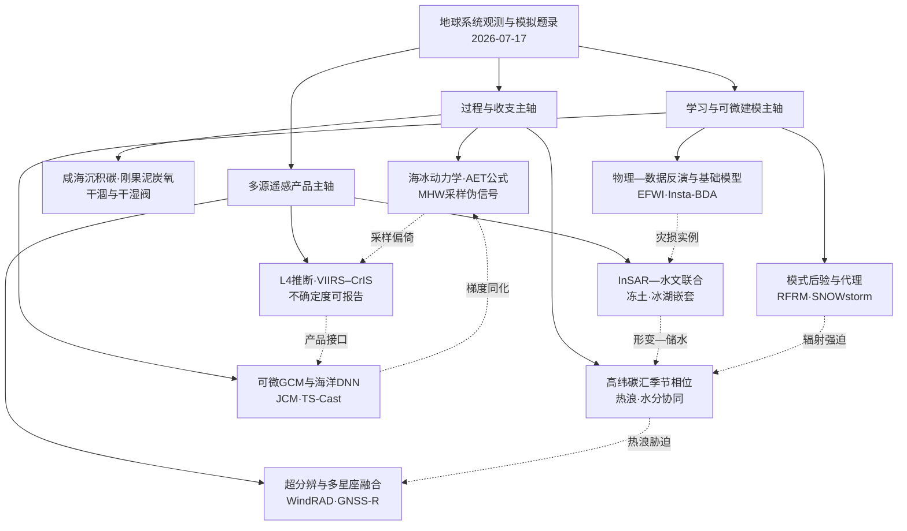
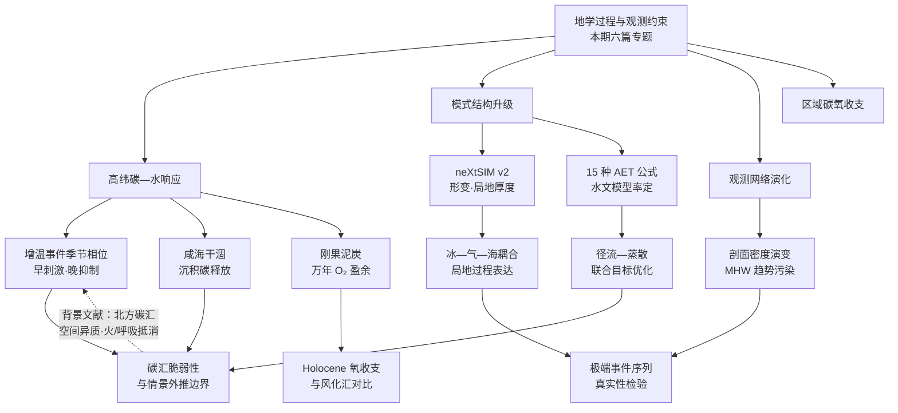
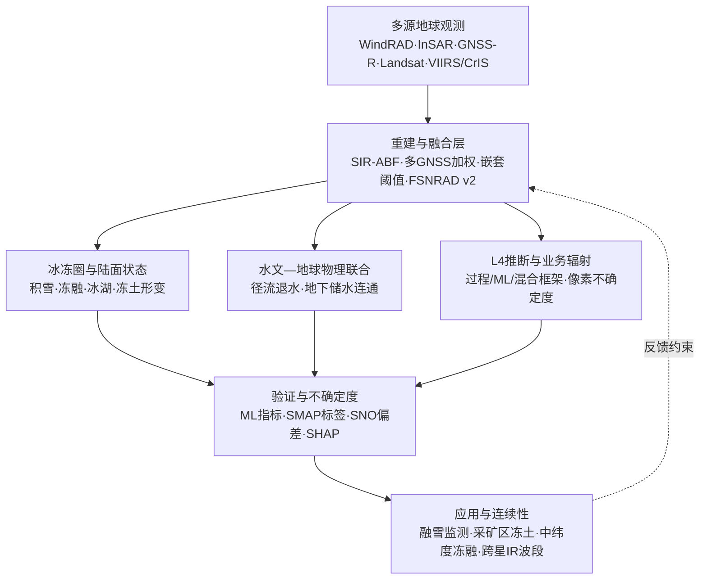
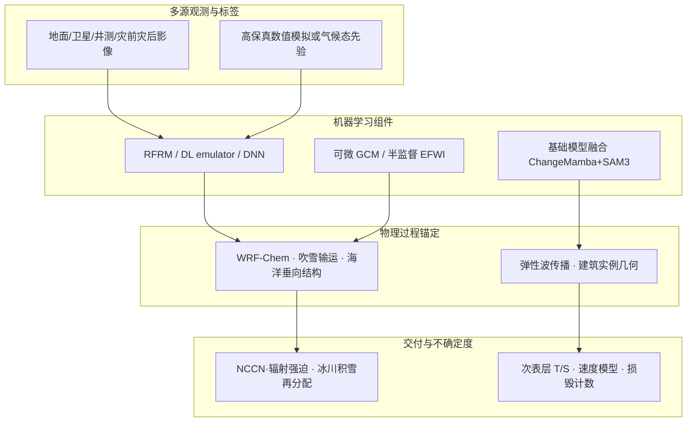
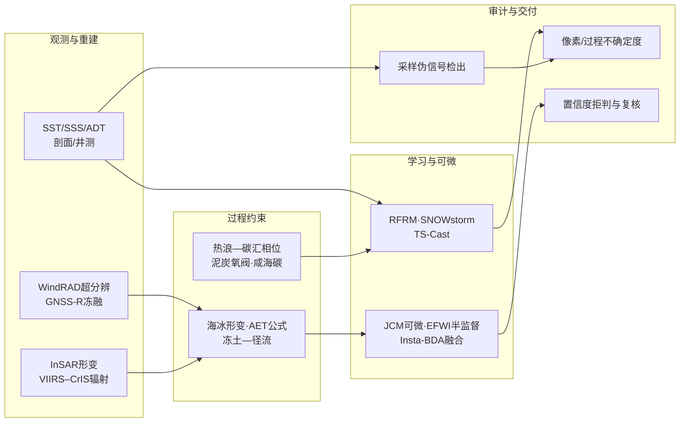

本期周报以 2026-07-17 为截点，依据 2026-07-10 至 2026-07-17 窗口内 514 篇题录，按**地学过程与地球系统约束**、**遥感观测与地球观测产品链**、**人工智能方法及可迁移建模能力**组织证据：前者汇集北极—北方高纬碳汇的季节相位响应、neXtSIM v2 海冰动力学、概念性水文模型中实际蒸散发公式选择、海洋热浪趋势中的观测采样伪信号、咸海干涸沉积碳释放与刚果泥炭地全新世净氧释放；中者覆盖 FY-3E WindRAD 积雪超分辨分类、祁连山采矿区 InSAR—径流联合冻土诊断、天眸一号多 GNSS-R 冻融检测、Level-4 陆面产品推断框架、VIIRS–CrIS 融合辐射不确定度，以及中央喜马拉雅冰湖嵌套提取；后者则聚焦 WRF-Chem 云凝结核随机森林订正、SNOWstorm 吹雪深度代理模型、可微中间复杂度大气模式 JCM、TS-Cast 次表层海洋重建、物理—数据联合弹性全波形反演，以及基础模型融合的实例级建筑损毁评估。正文以方向综述与代表性画像提取可核对主张，对摘要截断处的定量细节保持克制。

跨方向的共同关切集中在**观测能力与过程信号的可分离性**、**物理先验与学习组件的兼容接口**，以及**产品级不确定度向决策链路的可报告传递**。地学侧强调热浪时序、水文干湿转换与采样网络演化对碳—氧—极端事件诊断的一阶影响；遥感侧把分辨率重建、多星座融合与跨代辐射连续性写入同一评价坐标系；人工智能侧则把可微模式、代理模拟与弱监督实例化部署为可审计组件。由此引申的业务与治理含义在于：极端事件气候趋势需并行报告观测密度协变量；Level-4 与跨星辐射产品应携带像素或过程级不确定度；面向碳汇、冻土与灾损决策的智能系统，宜以物理守恒、采样偏倚与人机复核共同约束结论效力。

## 一、本期研究印记图

**周报日期：2026-07-17。** 本期题录横跨陆地与海洋碳循环、海冰与冻土过程、水文蒸散发参数化、多源微波—光学—反射测量解译，以及可微模式、代理模拟与基础模型融合五条主轴。期刊分布上，*Nature*、*Science*、*Remote Sensing*、*Geophysical Research Letters*、*Hydrology and Earth System Sciences*、*Geoscientific Model Development* 与 *The Cryosphere* 等继续分别贡献过程机制、观测产品与模式方法论文；开放获取题录在本窗口统计中为 0/514，正式文本与摘要核验仍以题录 DOI 与摘要证据为限。

背景层面，北极—北方针叶林碳汇的空间异质性与火灾、非生长季呼吸对净汇的抵消，已在近年通量综合与机器学习升尺度研究中反复出现；热浪对高纬植被光合的抑制敏感性亦被独立区域研究强化。与此并行，地球观测 Level-4 产品被明确界定为较低层级观测与模式分析的推断结果而非直接测量，过程—机器学习混合框架（如全球水—碳耦合诊断模式）正把观测约束写入可学习参数与通量闭合。可微大气环流模式则以自动微分支持同化、校准与混合物理参数化，为“方程可导、模块可替换”的下一代试验床提供软件基础。上述背景不替代本期画像中的摘要证据，而用于标定问题边界。

本期特色集中体现在三条可交叉核对的方法学转向。其一，**观测演化与过程趋势的解耦**：全球海洋热浪强度在原位剖面序列上呈现超过 10%/decade 的抬升，而再分析与气候模拟仅给出约一个数量级更弱的趋势，稀疏—密集采样演变被识别为人工强化的主要来源。其二，**重建—融合—物理约束的产品链闭环**：WindRAD 超分辨、多 GNSS-R 加权融合、VIIRS–CrIS 类 MODIS 红外重建，以及冰湖提取中的 AWEI/MNDWI 嵌套阈值，均把几何补全与物理先验并入同一流水线。其三，**可微与代理化的计算降阶**：JCM 提供全链路梯度，SNOWstorm 相对嵌套大涡模拟降低超过五个数量级计算代价，TS-Cast 与随机森林订正则在保留气候态或化学模式骨架的前提下吸收卫星与多源观测。

总体印记可概括为：**过程科学把碳—氧—极端事件置于热浪时序、水文干湿与采样网络的共同约束之下；遥感与人工智能则把超分辨融合、跨代辐射连续性、可微模式与弱监督实例化写入可审计的产品与建模接口。** 下图给出本期知识结构总览。

## 二、地学方向专题画像

### 2.1 方向综述

本期地学专题文献在“过程响应—模式能力—观测约束—碳氧收支”链条上形成相互呼应的证据群。高纬度与陆面碳循环方向，北极—北方高纬生态系统对增温事件的净初级生产力响应呈现明显的季节相位依赖：早季增温可刺激生长，而持续高温叠加低土壤水分则抑制生长季后期固碳能力，提示北方高纬陆地碳汇对热浪时序与持续时间高度敏感。与之并置，咸海干涸通过暴露湖床释放大量历史沉积碳，将中亚流域由既往假定的土地利用变化碳汇改写为净源，显示人类活动驱动的流域—湖泊系统重组可在百年尺度上重塑区域碳收支。古气候与泥炭地方向，刚果泥炭地万年尺度的净氧释放记录表明，水文干湿转换可在数百年内触发氧盈余的骤降与快速恢复，其累积量级与大陆风化耗氧汇及海洋埋藏过程可比，但响应时间尺度远短于后者。

模式与观测方法学侧，新一代海冰模式 neXtSIM v2 针对大尺度模式中形变特征与局地厚度—密集度变化刻画不足的问题，引入 brittle 流变与 Lagrangian 框架以改进冰—气—海耦合所需的局地过程表达；概念性水文模型中对十五种实际蒸散发（AET）公式的系统评估则显示，非线性土壤水分约束方程在澳大利亚七个流域同时改善径流与通量塔 AET 再现，但仍受植被动态缺失限制。海洋极端事件方向，原位剖面观测能力由稀疏向密集的时间演变可在全球海洋热浪（MHW）强度趋势中引入数量级以上的“人工强化”信号，与再分析及气候模拟给出的弱趋势形成鲜明对照，凸显观测网络演化对极端事件长期序列的污染风险。上述六篇工作共同指向：地学结论的可迁移性日益取决于是否同时报告过程时序、模式结构差异、观测采样异质性与古气候约束下的长期收支闭合。

| 序号 | 论文简介（逐篇） | 对应画像小节 |
|------|------------------|--------------|
| G4 | 基于 2000–2022 年北极—北方高纬主要增温事件，解析早季增温刺激与持续高温—低水分抑制对陆地生产力的季节相位效应，并以 2004、2010、2015、2020 等区域案例说明响应异质性 | 2.2 |
| G6 | 公开发布 neXtSIM v2 海冰模式，聚焦冰动力学与运动，采用 brittle 流变参数与 Lagrangian 框架，改进形变特征与局地厚度—密集度变化，并讨论与地球系统模式耦合含义 | 2.3 |
| G12 | 在 GR4J、Simhyd、Vic 三类概念性水文模型中系统测试 15 种由潜在蒸散发与土壤水分换算 AET 的公式，以多目标率定并在澳大利亚 7 个流域对照径流与通量塔 AET | 2.4 |
| G13 | 基于近三十年全球原位海洋剖面，揭示观测剖面数量由稀疏到密集的时间演变可在 MHW 强度趋势中产生超过 10%/decade 的“人工强化”，与再分析及气候模拟弱趋势形成数量级差异 | 2.5 |
| G114 | 以沉积柱芯、CO₂ 通量与遥感“空间换时间”方法，量化 1960 年以来咸海干涸暴露湖床释放 204±53 Tg C，植被抵消不足 1%，并评估再淹没可避免的额外排放 | 2.6 |
| G481 | 对刚果泥炭 10,600 年柱芯开展直接氧化还原滴定，揭示 O:C 化学计量偏离 1:1、干湿相位转换驱动净 O₂ 盈余在数百年内骤降约 80% 及快速恢复，并估算全新世累积氧盈余 | 2.7 |

### 2.2 专题画像：Increasing Warming May Inhibit Land Carbon Uptake in Northern High Latitudes

**（1）技术路线：北极—北方高纬主要增温事件下的季节生产力响应诊断**

该研究面向北极生态系统加速增温与热浪频度上升背景下的陆地碳吸收能力，选取 2000–2022 年间多次重大增温事件作为“自然实验”窗口，系统诊断植被生产力对增温时序与持续性的响应。分析框架以生长季内温度异常的阶段划分为核心：区分早季增温与生长季后期持续高温两类强迫，并追踪其对净初级生产力（NPP）或等价生产力指标的促进与抑制效应。区域案例覆盖西北北美、环北极及东西伯利亚等子区，重点对照 2004 年西北北美高温年、2010 年北极大范围增温、2015 年西北北美与 2020 年东西伯利亚等典型年份，以揭示同一物理强迫在不同区域与不同年份的异质性响应。

技术实施上，研究依托卫星或再分析驱动的陆地生产力产品、区域温度异常序列及伴随的水分条件信息，将“增温—生产力”关系置于季节时间轴上而非年度均值上解读。对于每个重大事件，作者追踪增温自早季向中后期演进过程中生产力信号的转折：早季正异常是否被后期负异常抵消、抑或全程维持正响应。植被类型分层关注针叶林（taiga）与苔原（tundra）等对热量与水分协同限制敏感的类型，以检验持续高温叠加低土壤水分条件下固碳能力衰减的普遍性。该路线将事件导向诊断与生态类型分区结合，使结论可直接服务于北方高纬碳汇对未来热浪频度与持续时间变化的敏感性评估。

**背景文献**：既有北极—北方针叶林 CO₂ 汇评估指出，该区域碳汇在空间上高度异质，且可被火灾排放与土壤呼吸增强所部分或完全抵消（*Nature Climate Change* 及相关文献）。上述外部证据提示，本节基于 G4 摘要的生产力—增温响应结论宜与火灾、呼吸等并行碳通量过程一并解读，不宜将单一生产力信号外推为稳定的区域净碳汇增益。

**（2）技术特点：季节相位分解、区域—年际对照与水分协同约束**

与将北极增温简化为“线性促进生长”的叙事不同，该工作的技术特点在于把增温效应拆分为时间维度上的非单调响应。其一，早季增温被识别为生产力提升的重要触发因子：在热量尚不构成胁迫、且土壤水分尚未耗竭的条件下，温度升高可延长有效生长窗口并加速光合与生长过程。其二，当增温事件演变为生长季后期的持续高温时，生产力响应可转为抑制，且该转折在多个区域年份中反复出现，表明“增温即增产”的假设在季节尺度上并不成立。

其三，区域与年际对照构成方法学亮点。2004 年西北北美高温年在整个夏季维持生产力正响应，显示在水分供应充足或事件结构有利于中后期维持的条件下，增温可全程表现为促进；2010 年北极增温则呈现“早期增益—后期衰减”的典型模式；2015 年西北北美与 2020 年东西伯利亚案例进一步表明，后期衰减往往与水分条件恶化相伴随，提示持续高温与低土壤水分的协同作用是抑制后期固碳的关键机制。其四，生态类型差异被显式纳入讨论：针叶林与苔原等对热—水协同限制更为敏感，在持续热浪下更易出现碳吸收能力削弱。上述特征使该研究在同类北极增温评估中突出“时序结构”与“强迫持续时间”的决定性作用。

**（3）重要结论：早季增温刺激与持续高温—低水分抑制的季节转折**

该研究的重要结论是：**在 2000–2022 年北极—北方高纬主要增温事件中，早季增温普遍有利于提升植被生产力，但当增温演变为生长季后期的持续高温且伴随低土壤水分时，生产力响应可显著转负；2004 年西北北美、2010 年环北极、2015 年西北北美与 2020 年东西伯利亚等案例表明，区域与年际差异显著，针叶林与苔原等对热—水协同限制尤为敏感，持续热浪条件下北方高纬陆地碳汇面临被削弱的脆弱性。**

影响与意义方面，该结论对北极碳汇未来演变评估具有直接启示：若气候变暖导致热浪更频、更久且更易与土壤干旱叠加，则北方高纬陆地可能在生长季后期由碳汇转为碳源或汇强度减弱，从而部分抵消早季增温带来的固碳增益。模式与观测产品后续宜在季节子尺度上分别报告增温促进与热—水胁迫抑制两个分量，并与火灾、异养呼吸等并行过程耦合，以避免将年度或生长季平均信号误读为稳定的碳汇增强。政策与气候评估语境下，北方高纬“绿色化”叙事需与热浪—干旱复合事件的风险并列陈述。

DOI: [10.1029/2026gl122135](https://doi.org/10.1029/2026gl122135)

### 2.3 专题画像：The next generation sea-ice model neXtSIM, version 2

**（1）技术路线：neXtSIM v2 冰动力学核心架构与公开发布文档化**

该研究系统记录新一代海冰模式 neXtSIM（next generation Sea Ice Model）第二版（v2）的设计目标、动力学框架与参数化选择，并以公开版本发布形式向社区提供可复现、可耦合的模式资产。技术路线聚焦海冰动力学与运动过程，而非仅追求冰体积或范围的全局守恒。作者首先梳理当前众多大尺度海冰模式所共用的内部应力表示方案：该类方案在冰体积积分意义下可给出合理结果，但在冰形变特征、局地厚度变化与冰密集度快速调整等关键过程上存在系统性不足，而上述局地过程正是冰—大气—海洋相互作用中控制动量、热量与盐度交换的重要环节。

在此基础上，neXtSIM v2 采用 Lagrangian 框架描述海冰单元运动与变形，并引入 brittle 流变（brittle rheologies）及其参数体系以刻画冰盖在应力下的破裂、Lead 形成与冰脊堆积等离散形变事件。文档化内容涵盖动力学方程、数值离散、边界处理以及与地球系统模式（ESM）耦合时的接口设计含义，包括如何向大气与海洋分量传递局地冰厚、密集度与应力场信息。公开发布路径使该模式可被独立检验、参与模式互比，并作为高分辨率海冰过程研究与业务化耦合试验的基础平台。整条路线以“改进局地过程表达以支撑耦合”为主线，区别于仅调整体积守恒参数的传统调参路径。

**（2）技术特点：brittle 流变、Lagrangian 离散与形变—厚度局地化改进**

neXtSIM v2 的技术特点集中体现在对“形变—局地状态”耦合的显式建模。其一，brittle 流变参数化允许冰盖在超过临界应力时发生破裂与重新分布，从而再现大尺度模式中常被平滑化的 Lead 与冰脊结构；该类结构虽在面积占比上有限，却对表面热通量、动量拖曳及淡水注入具有放大效应。其二，Lagrangian 框架使冰单元可随流场运动并积累变形历史，便于追踪局地厚度与密集度的时序演变，而非仅依赖 Eulerian 网格上的扩散式调整。其三，与同类大尺度模式相比，v2 明确针对“体积守恒但形变特征失败”的共性缺陷设计解决方案，把改进目标锁定在冰—气—海相互作用的敏感过程上。

耦合含义构成另一技术维度。ESM 中大气边界层与海洋混合层参数化往往依赖局地冰密集度、厚度与表面粗糙度的实时反馈；若模式无法产生合理的局地快速调整，则耦合通量将在空间上被错误平滑，进而影响极区季节循环与趋势模拟。neXtSIM v2 的文档化发布为社区提供了检验这类反馈敏感性的工具，并明确了参数化选择与耦合频率、插值方案之间的依赖关系。需要指出的是，摘要未给出与观测或业务产品的定量对比分数，因而 v2 的改进幅度应理解为在过程结构层面的设计目标，具体技巧提升仍需后续独立验证试验确认。

**（3）重要结论：面向形变与局地厚—密变化的下一代海冰动力学平台**

该研究的重要结论是：**neXtSIM v2 作为公开发布的新一代海冰模式，以 brittle 流变与 Lagrangian 动力学框架为核心，针对大尺度模式中普遍存在的形变特征缺失与局地厚度—密集度快速变化刻画不足问题提供系统性解决方案，并明确阐述与地球系统模式耦合时的过程与接口含义，为改进冰—大气—海洋相互作用的局地过程表达奠定可复现的模式基础。**

影响与意义方面，极区气候模拟与短期海冰预报长期受限于粗网格 Eulerian 方案对 Lead 与冰脊的平滑处理；neXtSIM v2 的发布为社区提供了可嵌入高分辨率嵌套或替代传统海冰动力核心的选项。后续工作宜在相同强迫与观测约束下开展与主流业务模式的并排对比，重点评估形变通量、局地热通量与季节冰缘推进对耦合反馈的边际贡献，并明确计算成本与 ESM 集成可行性之间的权衡。

DOI: [10.5194/gmd-19-6467-2026](https://doi.org/10.5194/gmd-19-6467-2026)

### 2.4 专题画像：A systematic evaluation of 15 actual evapotranspiration formulations within conceptual hydrological models

**（1）技术路线：概念性水文模型内嵌十五种 AET 公式的多目标率定与双指标验证**

该研究面向概念性水文模型中“潜在蒸散发（PET）+ 土壤水分 → 实际蒸散发（AET）”这一关键环节的结构不确定性，系统评估十五种不同 AET 计算公式在三种主流模型框架内的表现。模型选取涵盖 GR4J、Simhyd 与 VIC，使结论跨越不同结构假设（储水—径流关系、下渗表述、植被层参数化等），避免结论仅适用于单一模型族。每种 AET 公式代表一种将 PET 按土壤水分状态进行折减的数学形式，差异涵盖线性、非线性、阈值型与渐近型等多类函数关系。

率定策略采用多目标优化：同时针对径流模拟与通量塔观测 AET 设定目标函数，使参数解不再仅服务于单一水文指标最优，而需在“水量平衡闭合”与“蒸散通量真实”之间寻求 Pareto 改进。验证数据来自澳大利亚七个流域，具备径流观测与通量塔 AET 的同步约束，为 AET 公式独立检验提供了难得的双边观测支撑。评估流程对每种公式—模型组合执行统一率定协议，随后比较其在径流 Nash 系数（或等价指标）与 AET 偏差、季节位相等方面的综合表现，以识别是否存在普遍优于其余公式的结构形式，或性能高度依赖流域气候与模型框架的交互。

**（2）技术特点：跨模型族对照、非线性土壤水分折减与双目标 Pareto 改进**

该工作的技术特点首先体现在评估尺度与对照设计。十五种公式 × 三种模型框架的组合矩阵，使“公式优劣”与“模型结构敏感性”可被分解讨论：某一公式若在三种模型中均表现突出，则其结构优势更具可迁移性；若仅在特定模型中领先，则提示公式—结构存在协同匹配关系。摘要表明，多数公式相对默认方案仅有有限改进，仅少数公式显著优于其余候选，说明 AET 折减函数的选择对总模拟质量具有可分辨但非无限的边际贡献。

表现最为突出的公式在结构上呈现非线性土壤水分存储关系：该形式在土壤水分较高时仍对 AET 施加折减，使 AET 即使在饱和或近饱和条件下亦无法达到 PET，从而更贴近通量塔观测中常见的“蒸散饱和上限低于 PET”现象。该结构在双目标率定下同时提升 AET 再现与径流模拟，表明其改善并非以牺牲水量平衡为代价的单边拟合。然而，摘要亦明确指出，即便最优公式仍难以完全复现观测 AET，主要局限来自概念性模型未显式包含植被动态（如 LAI 变化、气孔调节季节循环等），提示 AET 误差的一部分需通过陆面生物物理过程而非仅土壤水分折减函数来吸收。

**（3）重要结论：非线性土壤水分折减公式在澳大利亚流域双指标率定下表现突出**

该研究的重要结论是：**在 GR4J、Simhyd 与 VIC 三类概念性水文模型中，十五种 AET 公式经多目标率定后多数仅相对默认方案有有限改进；一种基于非线性土壤水分存储关系的折减公式在澳大利亚七个流域同时提升径流与通量塔 AET 再现，因其在高土壤水分下仍限制 AET 低于 PET 而更符合观测蒸散特征，但因概念性模型缺失植被动态，对观测 AET 的完全复现仍存在系统性局限，建议在澳大利亚研究中优先采用并开展过程一致性检验。**

影响与意义方面，全球水文模型与水资源评估长期依赖 PET 到 AET 的经验折减，但折减函数选择往往沿用默认方案而缺少流域尺度的双边验证。该研究为澳大利亚语境提供了可操作的公式推荐，并示范了“径流 + 通量塔”联合率定的评价范式。后续工作宜将该非线性折减结构扩展至更多气候区与含动态植被的陆面模式，并通过过程一致性试验检验其在极端干旱与湿润相位转换下的稳定性。

DOI: [10.5194/hess-30-4509-2026](https://doi.org/10.5194/hess-30-4509-2026)

### 2.5 专题画像：Temporal Heterogeneity of In Situ Ocean Observing Capacity Could Cause an Artificial Intensification of Extreme Warm Water Events Globally

**（1）技术路线：全球原位剖面时间序列与 MHW 强度趋势的多源对照**

该研究针对全球海洋热浪（Marine Heatwave, MHW）强度长期变化趋势在观测、再分析与气候模拟之间的显著分歧，提出并检验“观测能力时间异质性”假说。技术路线以近三十年全球原位温度剖面观测序列为起点，计算 MHW 强度（如累积强度或峰值异常）的全球平均趋势，摘要给出原位序列显示超过 10%/decade 的显著上升。与此同时，作者将同一指标在再分析产品与气候模式模拟中进行对照，发现后者给出的趋势量级约小一个数量级，形成“观测强—模拟弱”的悖论。

为解释该悖论，研究构建观测能力时间演变指标：全球及区域剖面数量由早期稀疏向近期密集的变化过程。核心诊断逻辑为：在观测稀疏期，极端暖水事件的峰值与累积强度因采样不足而被系统性低估；随着剖面密度增加，此前被“漏检”的极端信号进入样本，趋势估计向真实强度方向修正，但在统计上表现为强度随时间“增强”的正趋势。作者通过控制观测密度或构造合成采样实验（摘要层面概述为稀疏—密集演变分析），量化该人工趋势对全球 MHW 强度序列的贡献，并与再分析—模拟弱趋势进行量级对比，以判断观测序列中的正趋势在多大程度上可归因于观测网络演化而非真实的极端事件气候响应。

**（2）技术特点：采样偏差机制分解、数量级差异诊断与极端事件序列污染**

该工作的技术特点在于把“数据增多”从通常被视为质量改进的因素，转化为极端事件长期趋势估计的混淆变量。其一，机制分解清晰：早期稀疏采样 → 低估 MHW 强度 → 近期密集采样 → 低估缓解 → 统计趋势人工抬高。该链条不同于随机观测误差，而是与时间相关的系统性偏差，因而常规质控或误差棒难以完全吸收。其二，数量级对照构成判别力：原位趋势超过 10%/decade，而再分析与气候模拟仅给出约一个数量级更弱的趋势，提示若真实物理响应确实接近模拟量级，则观测序列中的强趋势需高度警惕采样演化的贡献。

其三，研究把结论上升至全球极端暖水事件评估的方法论层面：任何依赖长时间原位序列的 MHW 强度变化分析，均须同步报告观测密度协变量或采用对采样变化稳健的统计框架。摘要强调，观测能力的时间异质性可能严重污染对增暖背景下真实极端事件响应的识别，意味着既有基于原位观测的 MHW 趋势结论在重新审计采样演化前不宜直接用于检测归因或阈值设定。需要指出的是，摘要未给出各区域污染份额的完整分区表，区域差异应作为后续正式正文的重要补充维度。

**（3）重要结论：观测剖面密度演变可在全球 MHW 强度趋势中引入人工强化**

该研究的重要结论是：**近三十年全球原位温度剖面序列显示 MHW 强度上升超过 10%/decade，而再分析与气候模拟给出的趋势约小一个数量级；该悖论主要由观测剖面数量由稀疏向密集的时间演变所致——早期采样不足系统性低估 MHW 强度，观测加密后低估缓解并在统计上表现为人工正趋势，观测能力的时间异质性可严重污染对增暖背景下真实极端暖水事件响应的识别。**

影响与意义方面，MHW 对海洋生态、渔业与珊瑚系统的影响评估日益依赖长期强度趋势作为背景场；若该趋势部分乃至主要源自采样演化，则基于原位观测的检测归因、返回期估计与早期预警阈值均面临系统性偏乐观风险。业务与科研社区宜在 MHW 气候监测产品中并行发布观测密度调整序列或采用对采样变化非敏感的估计器，并以再分析—模拟一致弱趋势作为物理基准进行交叉约束。

DOI: [10.1029/2026gl123043](https://doi.org/10.1029/2026gl123043)

### 2.6 专题画像：Drying of the Aral Sea reshapes the anthropogenic carbon inventory of Central Asia

**（1）技术路线：咸海干涸“空间换时间”框架下的沉积柱芯—通量—遥感综合评估**

该研究量化 1960 年代以来咸海（Aral Sea）急剧干涸对中亚人为碳收支的重组效应，采用“空间换时间”（space-for-time）策略：以不同暴露程度的湖床区域作为干涸历史阶段的空间代理，整合沉积柱芯、CO₂ 通量测量与遥感反演，重建暴露湖床有机碳的释放历史与当前通量格局。技术路线首先通过沉积柱芯获取湖床沉积物中的碳储量与年龄结构，识别干涸暴露后可供氧化释放的碳库规模；其次在代表性地段开展 CO₂ 通量观测或估算，刻画暴露面在当下大气—土壤界面的实际排放强度及其空间分异；遥感提供湖床暴露范围、植被覆盖与地表状况的时序扩展，使柱芯与通量点观测能够升尺度至整个咸海流域尺度。

时间基准锚定于 1960 年代大规模灌溉引水导致入湖径流锐减、湖面持续退缩的历史节点。研究将“暴露湖床碳释放”与同期可能的植被固碳抵消并行核算，以评估净效应是否改变流域整体的人为碳收支符号。该综合路线区别于仅依赖土地利用变化（LUC）清单的常规核算：咸海干涸导致的碳释放源自历史湖泊沉积而非典型森林—农田转换，因而可能在 LUC 框架下被遗漏或误分类。空间换时间设计使研究人员能够在缺乏完整历史通量监测的条件下，利用当下不同暴露年龄的空间梯度推断过去六十年的累积释放。

**（2）技术特点：沉积碳库量化、植被抵消有限与流域碳收支符号反转**

该研究的技术特点突出表现在定量约束与收支闭合逻辑。其一，暴露湖床自 1960 年以来累积释放碳量估计为 204±53 Tg C（1 Tg = 10¹² g），不确定性区间通过柱芯采样与通量升尺度误差传播给出，属于可直接纳入区域碳清单的量级。其二，同期植被恢复或新生植被对排放的抵消贡献被估计为不足 1%，表明在评估时间尺度与空间范围内，生物固碳几乎未能缓冲沉积碳氧化，这与暴露面严酷环境、稀疏植被与短恢复时间相一致。

其三，纳入该释放项后，咸海流域由既往研究假定的 LUC 碳汇转变为净碳源，构成“碳收支符号反转”的核心科学发现：若不显式纳入湖床沉积碳释放，区域人为碳评估将系统性偏向汇侧。其四，研究进一步评估再淹没（reflooding）情景：若恢复部分湖面，可阻止额外 165±13 Tg C 的潜在释放，为流域生态修复与气候协同效益提供量化依据。空间换时间方法的风险在于空间代理区与真实时间序列在微气候、沉积物性质上的差异尚未被摘要完整的敏感性分析约束；在现有柱芯—通量—遥感证据下，该方法仍构成数据条件允许的可行路径。

**（3）重要结论：咸海干涸暴露湖床释放大量沉积碳并反转中亚流域人为碳收支**

该研究的重要结论是：**1960 年以来咸海干涸导致暴露湖床向大气释放 204±53 Tg C，同期植被固碳抵消不足 1%；将该项纳入核算后，咸海流域由既往假定的土地利用变化碳汇转变为净碳源；再淹没情景可阻止额外 165±13 Tg C 的潜在释放，表明大型内陆湖干涸是通过释放历史湖泊沉积碳而重组区域人为碳收支的重要机制。**

影响与意义方面，全球范围内大型内陆湖因灌溉取水与气候叠加而干涸的案例并非孤例；该研究量化的排放量级提示，类似事件应在国家与区域碳清单中设立独立核算类别，而非隐含于一般 LUC 条目。生态修复政策若包含再淹没，其气候协同效益可依据 165±13 Tg C 的避免排放潜力进行成本—效益评估，但需与水资源分配、盐尘暴风险及生态系统响应一并权衡。

DOI: [10.1126/science.aeb2344](https://doi.org/10.1126/science.aeb2344)

### 2.7 专题画像：Hydroclimate controls Congo peatland net oxygen release over the past 10,600 years

**（1）技术路线：刚果泥炭万年柱芯直接氧化还原滴定与 O:C 化学计量偏差诊断**

该研究面向全球泥炭地在全新世氧收支中的角色空白，选取刚果盆地泥炭地一根覆盖过去 10,600 年的沉积柱芯，采用直接氧化还原滴定（redox titration）方法测定沉积有机质在形成与分解过程中的净氧释放（net O₂ release）通量历史。技术路线区别于依赖间接代用指标（如碳同位素、孢粉或分子生物标志物）推断氧化还原状态的路径：滴定法可在化学计量层面直接约束 O₂ 产生或消耗相对于碳固定的偏离程度。研究首先检验 O:C 化学计量是否维持 1:1 的经典假设；摘要指出存在系统性偏离，表明泥炭地碳积累过程伴随额外的净 O₂ 盈余或亏损，需在氧收支方程中单独列项。

在万年时间序列上，作者将净 O₂ 盈余的变化与古水文气候记录（如干湿相位转换）进行位相对照，识别是否存在快速状态转换。年龄模型基于柱芯深度—年代关系，使全新世不同阶段的水文控制可被分解为数百年尺度的响应窗口。该路线把泥炭地从传统“碳汇”叙事拓展为“碳—氧并行收支”叙事，为全球全新世氧循环闭合检验提供直接沉积证据。

**（2）技术特点：干湿转换的骤变 O₂ 盈余变化、快速恢复与全新世累积量级**

该研究的技术特点集中体现在时间分辨率与响应幅度。其一，较干燥相位可在数百年内触发净 O₂ 盈余相对湿润相位骤降约 80%，表明泥炭地氧化还原状态对水文强迫高度敏感，且转变速度远快于大陆风化或海洋埋藏等长周期氧汇过程。其二，当水文条件恢复湿润时，净 O₂ 盈余可迅速恢复，显示系统存在可逆性而非单向锁定，这对理解泥炭地对未来降水变化的响应具有启示。

其三，全新世累积净 O₂ 盈余估计为 83 [68–100] Pg O₂ equivalents（1 Pg = 10¹⁵ g），不确定性区间由柱芯采样与滴定误差综合给出。该量级被摘要置于全球尺度对比语境：与大陆风化耗氧汇在全新世累积量级相当，亦与海洋埋藏过程可比，但泥炭地 O₂ 产生/释放的时间尺度远短于海洋埋藏，意味着其可在数百年尺度上调节大气氧含量，而海洋信号更平滑地作用于更长时间轴。其四，O:C 化学计量偏离 1:1 的发现本身具有方法学意义：若广泛存在于全球泥炭地，则现有仅基于碳积累的氧收支估算可能系统性偏倚。

**（3）重要结论：水文控制刚果泥炭全新世净氧释放，量级与风化耗氧汇可比**

该研究的重要结论是：**刚果泥炭 10,600 年柱芯的直接氧化还原滴定显示 O:C 化学计量偏离 1:1；较干相位可在数百年内使净 O₂ 盈余骤降约 80%，湿润恢复后快速反弹；全新世累积净 O₂ 盈余为 83 [68–100] Pg O₂ equivalents，全球泥炭地净氧产生量级与大陆风化耗氧汇相当，与海洋埋藏过程可比但响应时间尺度远更短。**

影响与意义方面，全新世大气氧含量变化长期被归因于有机碳埋藏与风化链的慢速平衡；该研究提示泥炭地水文波动可在数百年尺度上注入显著的 O₂ 盈余变率，应被纳入地球系统模式中的氧循环模块与古气候解释框架。对未来气候情景，刚果等热带泥炭地若因降水减少而进入更频发的干燥相位，其 O₂ 盈余下降与碳释放可能并行发生，构成碳—氧—气候反馈的潜在耦合点。

DOI: [10.1038/s41561-026-02031-z](https://doi.org/10.1038/s41561-026-02031-z)

## 三、遥感方向专题画像

### 3.1 方向综述

本期遥感方向六篇工作沿「观测重建与多源融合—冰冻圈与陆面状态反演—产品级推断与业务辐射连续性」链条展开，题录与 DOI 以所给摘要为准。共性技术路线可概括为：其一，以分辨率重建、多系统加权融合与嵌套阈值策略提升原始观测或中间产品的空间可解释性，典型如 FY-3E WindRAD 由 10 km 重建至 3.125 km 的积雪分类、天眸一号多 GNSS 反射加权融合冻融检测，以及中央喜马拉雅冰湖提取的两级嵌套约束；其二，以 InSAR 形变时序与径流退水曲线等水文—地球物理观测联合约束，把地表沉降、季节形变与多年冻土退化及地下储水连通性置于同一证据框架；其三，面向 Level-4（L4）陆面产品推断与跨传感器辐射融合，分别系统梳理过程模式—机器学习—混合框架的方法谱系，并以 VIIRS+CrIS 业务化融合辐射产品 v2 给出像素级不确定度与跨星连续性方案。方法工具上，SIR-ABF 超分辨重建、数据约束 SBAS-InSAR、贝叶斯优化 XGBoost、SHAP 可解释性、SNO 辐射交叉比对与 AWEI/MNDWI 多时相稳定水体合成并存，反映出遥感算法正从单传感器精度竞赛转向跨平台一致性、物理约束与不确定度可报告的业务化路径。

要点与约束同步显现。重建与融合能显著改善破碎地物边界与跨系统一致性：WindRAD 重建后 SVM 总体精度 91.64%、Macro-F1 86.47%、Kappa 0.730，对东北春季融雪期碎片化积雪与过渡带边界刻画优于 10 km 原生产品；天眸一号在无雪/有雪条件下 AUC 分别为 0.853 与 0.959，总体精度 77.3% 与 89.3%，多系统融合优于单 GNSS。冰冻圈监测侧，祁连山大通河源采矿扰动后沉降速率 −15 至 −5 mm a⁻¹、季节形变约 20–60 mm，与径流退水曲线减缓共同指向多年冻土加速退化与地下储水连通性增强；中央喜马拉雅 1990–2025 年冰湖在增温、降水增多与相对湿度降低背景下扩张，1990–2020 年面积变化受强温度—风场相互作用控制，夏季变率高于冬季。产品级链条上，L4 推断综述强调尺度错配、非线性算子与时间采样对地球观测约束的根本限制，并指出需构建尺度感知、不确定度可报告的一致推断系统；FSNRAD v2 在 12 个红外波段以 MODIS+AIRS 类比不确定度评估，与 Aqua MODIS 的 SNO 比对偏差通常小于 0.5 K，支撑 SNPP/NOAA-20/21 相对 Terra/Aqua 的业务连续性。**【外部背景（非本期画像定量来源）】** 美国国家航空航天局（NASA）对 L4 产品的界定是：由较低层级观测与模式分析生成的模型输出级产品；2026 年前后的水—碳混合模型（如 H2CM）进一步显示过程约束与机器学习耦合在业务产品链中的扩展趋势，该背景仅作领域参照，不并入下文各篇数值。

| 序号 | 论文简介（逐篇） | 对应画像小节 |
|------|------------------|--------------|
| R20 | 以 SIR-ABF 将 FY-3E WindRAD Ku 波段由 10 km 重建至 3.125 km，经相关性与多重共线性特征筛选，比较四种机器学习模型，SVM 积雪分类总体精度 91.64%、Macro-F1 86.47%、Kappa 0.730，改善碎片化积雪与过渡边界，与既有产品一致并刻画东北春季融雪 | 3.2 |
| R31 | 祁连山大通河源区联合数十年 InSAR 与径流退水分析，数据约束 SBAS 融合 Sentinel-1 与 ALOS-2 速率参考，多传感器 C/L 波段 1997–2023，揭示采矿期前后沉降 −15 至 −5 mm a⁻¹、季节形变 20–60 mm 及冻土加速退化，采矿后径流退水减缓指示地下储水连通性增强 | 3.3 |
| R67 | 天眸一号多 GNSS 反射（GPS/BDS/Galileo/GLONASS）按镜面点计数加权融合，以反射率为主、土壤含水量/粗糙度/积雪为辅，SMAP 冻融标签与贝叶斯优化 XGBoost，无雪 AUC 0.853、OA 77.3%，有雪 AUC 0.959、OA 89.3%，SHAP 显示积雪贡献最大 | 3.4 |
| R85 | 综述 L4 陆面产品（GPP、ET、生物量、产量）推断的过程模式同化、机器学习与混合框架，比较动力一致性、可解释性、可扩展性、泛化与不确定度，讨论地球观测尺度错配与非线性算子约束，提出需尺度感知且不确定度可报告的一致推断系统 | 3.5 |
| R124 | NASA 业务化 VIIRS+CrIS FSNRAD v2 在 VIIRS 750 m 全刈幅重建类 MODIS 红外吸收波段，以 MODIS+AIRS 类比评估 12 波段像素级不确定度，与 Aqua MODIS 的 SNO 偏差通常小于 0.5 K，定制波段构造并减小探测器间辐射差异 | 3.6 |
| R125 | 中央喜马拉雅冰湖提取采用两级嵌套：全局多时相 AWEI 稳定水体 P80 合成并施加 NDSI、坡度与红波段约束，局部等面积缓冲区内 MNDWI 出现频率与 Otsu 分湖阈值；1990–2025 年 Landsat 与气象资料显示增温降水背景下湖体扩张及温度—风场控制 | 3.7 |

### 3.2 专题画像：Snow Cover Classification Using High-Resolution Reconstructed FY-3E WindRAD Data

**（1）技术路线：SIR-ABF 超分辨重建与机器学习积雪分类链**

该研究面向风云三号 E 星（FY-3E）WindRAD Ku 波段微波散射计原生约 10 km 分辨率难以刻画破碎积雪与过渡带边界的问题，首先采用 SIR-ABF（超分辨重建结合自适应贝叶斯滤波思想的路径）将 Ku 波段后向散射与相关辅助场由 10 km 重建至 3.125 km，使像元尺度更接近积雪斑块与融雪锋面的空间异质性。重建产品在保持与原始 WindRAD 物理辐射特征一致的前提下，为后续分类提供更高空间频率的结构信息。特征工程阶段并非简单堆叠全部通道，而是引入相关性分析与多重共线性诊断，筛除冗余或高度共线变量，以降低模型过拟合风险并提升跨时相稳定性。分类环节并行比较四种机器学习模型，在统一训练—验证划分与相同特征子集下评估总体精度、宏平均 F1 与 Kappa 系数，最终确定支持向量机（SVM）为最优分类器。验证设计强调与既有积雪产品的空间一致性对照，并选取中国东北地区春季融雪期作为关键试验窗口，以检验重建分辨率对融雪过程中碎片化积雪边界与过渡带识别能力的增益。全文技术链条可概括为「原生 WindRAD → SIR-ABF 3.125 km 重建 → 特征筛选 → 多模型对比 → SVM 积雪制图 → 区域融雪期应用验证」，DOI: 10.3390/rs18142377。

**（2）技术特点：分辨率增益、特征约束与破碎积雪边界刻画**

相较直接使用 10 km 原生 WindRAD 产品，SIR-ABF 重建的核心价值在于把 Ku 波段对积雪深度与含水状态的敏感性映射到更细空间网格，从而缓解大像元内混合地物导致的类别模糊。摘要报告的最优 SVM 结果——总体精度（OA）91.64%、宏平均 F1（Macro-F1）86.47%、Kappa 0.730——表明在重建尺度上积雪与非积雪及过渡状态的判别仍具较高一致性。空间表现上，重建产品对碎片化积雪斑块与融雪过渡边界的刻画明显优于 10 km 原生产品，这对春季快速变化的融雪锋面监测具有直接方法学意义。特征筛选通过相关性与多重共线性双重约束，使模型输入保留物理相关变量同时抑制统计冗余，有助于提升四类机器学习模型对比的可解释性与公平性。与既有积雪产品的一致性检验进一步说明重建并未引入系统性偏离，而是在空间细节上提供增量信息。研究区聚焦东北春季融雪，契合 Ku 波段对湿雪—裸土过渡带敏感、且高分辨率对斑块化积雪尤为重要的应用场景；方法特点因而体现为「物理重建 + 统计特征约束 + 稳健分类器选择」的组合，而非单一网络结构迭代。

**（3）重要结论：重建 WindRAD 显著提升破碎积雪与过渡带识别能力**

该研究的重要结论是：**经 SIR-ABF 将 FY-3E WindRAD Ku 波段由 10 km 重建至 3.125 km 后，在相关性与多重共线性约束的特征子集上，SVM 积雪分类取得 OA 91.64%、Macro-F1 86.47%、Kappa 0.730 的最优表现，相对 10 km 原生产品更优地刻画碎片化积雪与过渡边界，并与既有积雪产品保持一致，在中国东北春季融雪期验证中显示出可操作的监测增益。**

影响与意义方面，该工作为国产微波散射计产品在积雪业务监测中的空间细化提供了可复现的重建—分类路径，对春季融雪水资源预报、牧区雪灾评估及气候模式积雪参数化验证具有参考价值。后续仍须在不同积雪类型、地形复杂区与传感器噪声年际变化下检验 SIR-ABF 重建误差向分类不确定度的传播，并评估跨星 WindRAD 序列迁移时的特征稳定性与阈值漂移。

### 3.3 专题画像：Long-term InSAR and streamflow recession analysis reveal accelerated permafrost degradation in the mining area of the Qilian Mountains

**（1）技术路线：多传感器 InSAR 时序与径流退水联合诊断**

该研究以祁连山脉大通河河源区为案例，针对 2000 年代至 2010 年代初高强度采矿扰动背景，构建「数十年 InSAR 形变时序 + 径流退水曲线分析」的联合诊断框架，以揭示多年冻土退化及其水文响应。InSAR 侧采用数据约束的小基线子集（SBAS）策略处理 Sentinel-1 序列，并引入线性—周期约束以分离长期趋势与季节循环；速率参考借助 ALOS-2 观测，形成跨传感器 C/L 波段 1997–2023 年的长时序形变场。该方法强调在观测稀疏与大气残差并存条件下，通过物理合理的周期项与速率锚定提高沉降速率估计的可比性。径流侧选取同源流域的退水（recession）分析，刻画采矿前后基流衰减特征变化，并与 InSAR 揭示的地下连通性信号相互印证。时间轴上明确划分采矿前、采矿中及采矿后阶段：采矿前形变极小，采矿期及之后出现显著沉降与增强的季节形变，从而把人类工程扰动、冻土热力学变化与地表—地下水分交换置于同一证据链。DOI: 10.5194/tc-20-3933-2026。

**（2）技术特点：长时序多波段 InSAR 约束与冻土—水文耦合证据**

本工作的突出特点在于把 InSAR 从「单点沉降监测」推进到「冻土退化过程 + 水文响应」的跨学科约束。数据约束 SBAS 结合线性—周期分解，可在采矿扰动引起的非线性沉降背景中仍提取具有物理意义的年速率（摘要给出 −15 至 −5 mm a⁻¹）与季节形变幅度（约 20–60 mm），后者被解释为与活动层冻融循环相关的周期性信号增强。多传感器 C/L 波段覆盖 1997–2023 年，使结论不依赖单一平台或单一波段，降低轨道几何与波长差异带来的系统偏差。径流退水曲线在采矿后呈现减缓趋势，与 InSAR 指示的地下储水增加及连通性增强相一致，形成「形变—储水—径流」三角互证。相对仅报告沉降幅度的工程监测研究，该框架把采矿扰动明确置于多年冻土加速退化的气候—人类活动耦合语境，并强调季节形变量级（20–60 mm）对识别活动层加深与冰富层衰减的指示意义。方法边界在于 SBAS 对大气、轨道误差与参考点选择的敏感性，以及退水分析对降雨事件剔除与基流分离算法的依赖；摘要未给出全流域逐子区统计，因而区域外推需结合更多水文站与钻孔地温验证。

**（3）重要结论：采矿扰动区多年冻土加速退化并伴随地下储水连通性增强**

该研究的重要结论是：**在祁连山大通河河源采矿区，1997–2023 年多传感器 C/L 波段 InSAR 显示采矿前形变极小，采矿期及之后出现 −15 至 −5 mm a⁻¹ 的沉降与约 20–60 mm 的季节形变，指示多年冻土加速退化；采矿后径流退水减缓与 InSAR 信号共同表明地下储水与连通性增强，揭示工程扰动下冻土—水文系统的耦合响应。**

影响与意义方面，该结果为高寒采矿区冻土环境监管、沉降风险预警及流域水资源长期评估提供了遥感—水文联合证据，对「先污染后治理」场景下的生态恢复监测具有政策参考。后续宜补充地面地温、活动层厚度与同位素水文追踪，以量化退水减缓中冻土融释水与工程排水各自的贡献，并在更多祁连山子流域检验 SBAS 速率与退水指标的可迁移性。

### 3.4 专题画像：Freeze–Thaw State Detection over the Mid-to-High Latitudes of the Northern Hemisphere Using Tianmu-1 Multi-GNSS-R

**（1）技术路线：天眸一号多 GNSS 反射加权融合与 SMAP 监督分类**

该研究面向北半球中高纬度冻融状态遥感监测，利用天眸一号（TM-1）多全球导航卫星系统反射（multi-GNSS-R）观测，覆盖 GPS、北斗（BDS）、Galileo 与 GLONASS 等系统的镜面反射信号。融合策略按各系统有效镜面点计数进行加权，以提升稀疏观测条件下的空间代表性与信噪比。特征构建以反射率（reflectivity）为主变量，并引入土壤体积含水量（VWC）、表面粗糙度与积雪等辅助因子，以刻画冻融转换期地表介电与几何散射变化。训练标签采用 NASA SMAP 冻融（F/T）产品，分类器选用经贝叶斯超参数优化的 XGBoost，以在非线性特征空间中拟合冻融边界。评估设计区分无雪与有雪两类子集，分别报告受试者工作特征曲线下面积（AUC）与总体精度（OA），并与单 GNSS 系统结果对照，以量化多系统融合增益。摘要提及独立原位对比试验，但公开摘要截断未给出完整原位指标，下文定量结论仅采信摘要已报告数值。DOI: 10.3390/rs18142369。

**（2）技术特点：多 GNSS 加权、积雪条件分层与 SHAP 机理解释**

相较依赖单一 GNSS 星座的反射观测，按镜面点计数加权的多系统融合可在过境几何与反射事件密度不均的情况下稳定估计区域冻融状态。摘要在无雪条件下给出 AUC 0.853、OA 77.3%，且优于单 GNSS 方案；在有雪条件下 AUC 0.959、OA 89.3%，显示积雪层对微波反射路径的调制被特征体系部分捕获并提升判别性能。SMAP F/T 标签提供大尺度弱监督约束，使 GNSS-R 站点/轨迹级观测与卫星土壤水分产品的冻融语义对齐；贝叶斯优化则缓解 XGBoost 对超参数敏感、跨季节泛化不足的问题。SHAP（SHapley Additive exPlanations）分析表明积雪变量贡献最大，与冻融转换期表面能量状态及季节背景高度耦合，为「物理变量进入统计模型」提供可审计解释。方法特点因而体现为「多源 GNSS 几何互补 + 物理相关辅助特征 + 弱监督标签 + 可解释集成学习」。需强调：有雪/无雪分层评估揭示算法对积雪覆盖的依赖，跨纬度迁移时须重新审视 SMAP 标签与 GNSS-R 采样不一致带来的域偏移；原位对比细节因摘要截断不在此展开。

**（3）重要结论：多 GNSS 融合显著提升中高纬度冻融检测精度**

该研究的重要结论是：**基于 TM-1 多 GNSS-R 按镜面点计数加权融合，以反射率为主、VWC/粗糙度/积雪为辅，在 SMAP 冻融标签与贝叶斯优化 XGBoost 框架下，无雪场景 AUC 0.853、OA 77.3%（优于单 GNSS），有雪场景 AUC 0.959、OA 89.3%；SHAP 分析表明积雪对冻融判别贡献最大，符合其物理与季节语境。**

影响与意义方面，该工作为地面 GNSS 网络向冻融监测业务化拓展提供了多星座融合与可解释特征模板，对寒区碳循环、生态过程与春季径流预报中的冻融 onset 识别具有潜在支撑。后续应在摘要未完整给出的原位试验基础上补充独立验证，并在 SMAP 标签不确定性、GNSS-R 足迹与像元标签空间错配方面开展系统敏感性分析，以明确业务部署阈值。

### 3.5 专题画像：Earth Observation-Driven Inference for Level-4 Terrestrial Products: Process-Based, Machine Learning, and Hybrid Frameworks

**（1）技术路线：L4 陆面产品推断的方法谱系梳理与维度对照**

该文为 Remote Sensing 综述，系统梳理由地球观测（EO）驱动 Level-4（L4）陆地产品推断的技术谱系，涵盖总初级生产力（GPP）、蒸散发（ET）、生物量与产量等典型变量。作者将现有路径归纳为过程模式与数据同化、纯机器学习，以及二者耦合的混合框架，并在统一的问题设定下对照动力一致性、可解释性、可扩展性、泛化能力与不确定度表征五个评价维度。地球观测约束被明确拆解为三类结构性挑战：尺度错配（观测像元与模式网格/过程尺度不一致）、非线性算子（辐射传输与生理过程的前向映射高度非线性），以及时间采样不均（卫星过境与过程快速变化不同步）。过程—同化路线以物理方程与状态更新为核心，强调时间演化与守恒约束；机器学习路线以数据驱动映射为主，强调高维特征提取与端到端训练；混合路线则讨论如何在保持过程结构可识别的前提下嵌入学习组件。综述还指出，当前业务与科研社区缺乏跨方法、跨产品的统一不确定度报告协议，制约 L4 产品互比与下游决策接入。DOI: 10.3390/rs18142371。**【外部背景（非本篇定量来源）】** NASA 将 L4 定义为基于较低层级观测与分析的模型输出级产品；2026 年前后水—碳混合模型（如 H2CM）显示过程—机器学习耦合正进入业务产品链，该趋势仅作领域参照。

**（2）技术特点：三类框架的能力边界与 EO 约束的共性瓶颈**

过程模式与数据同化分支的优势在于动力一致性与物理可解释性：状态变量遵循明确方程约束，便于与碳—水循环模块耦合及情景反演；摘要同时指出其计算代价高，且对模式结构性误差敏感——参数化或过程缺失不会被同化单次更新自动消除。机器学习分支具备强可扩展性与对高维 EO 特征的拟合能力，但在域偏移、样本稀缺区域往往泛化不足，且难以保证长期积分过程中的质量与能量平衡等动力一致性。混合框架被描述为在兼容性得以保持时可调和上述矛盾：例如以过程模式提供物理边界或中间状态，以神经网络学习残差或子网格参数，但前提是接口变量、时空尺度与误差协方差定义一致，否则混合系统仍继承两类方法的复合偏差。综述特别强调 EO 侧的三类约束并非某一方法独有，而是 L4 推断的共性瓶颈：尺度错配导致反演问题不适定，非线性算子放大观测噪声，时间采样则使快速事件（如暴雨后 ET 峰值）在 L4 时间序列上被平滑。由此，作者主张未来系统应同时具备尺度感知（scale-aware）与不确定度可报告（uncertainty-aware）能力，而非仅追求单点精度提升。

**（3）重要结论：L4 推断需走向尺度感知且不确定度可报告的一致系统**

该研究的重要结论是：**地球观测驱动的 L4 陆面产品推断在过程同化、机器学习与混合框架之间呈现清晰的能力分工——过程路线物理一致但成本高且对结构误差敏感，机器学习可扩展但域依赖强且动力一致性弱，混合框架可在兼容性保持时实现互补；面对 EO 尺度错配、非线性算子与时间采样约束，社区亟需构建尺度感知、不确定度可报告且跨产品一致的下一代推断系统。**

影响与意义方面，该综述为 L4 产品算法选型、业务链设计与多产品联合同化提供了概念坐标系，对碳监测、农业估产与干旱评估等依赖 GPP/ET/生物量/产量的应用具有方法论指引。后续工作宜在统一基准数据集上开展三类框架的可比实验，并将不确定度从后验方差估计推进到可操作的决策区间；混合模型需用独立观测与物理守恒诊断检验「兼容性保持」假设，避免将训练期拟合优势误读为长期预报能力。

### 3.6 专题画像：Fusion of VIIRS and CrIS observations to generate MODIS-like infrared absorption band radiances at VIIRS spatial resolution: version 2 fusion radiance product, part I: pixel-level uncertainty

**（1）技术路线：VIIRS+CrIS FSNRAD v2 业务融合辐射与像素级不确定度评估**

该研究聚焦美国国家航空航天局（NASA）业务化 VIIRS 与 CrIS 融合光谱近红外辐射（FSNRAD）产品第二版（v2），目标是在 Suomi NPP（SNPP）、NOAA-20 与 NOAA-21 等极轨平台上，于 VIIRS 750 m 全刈幅空间分辨率重建类 MODIS 红外吸收波段，以延续 Terra/Aqua MODIS 时代建立的红外辐射基准与下游算法链。技术路线包括：基于 VIIRS 可见—近红外与 CrIS 高光谱信息的融合反演，定制波段构造以匹配 MODIS 同类吸收通道；在 12 个红外波段上建立像素级不确定度估计框架，采用 MODIS+AIRS 融合类比产品与实测 MODIS 辐射的对比统计，作为 v2 不确定度参数化的参考。验证环节使用同步观测（SNO）策略，将 SNPP/NOAA 系列与 Aqua MODIS 在轨交叉比对，量化系统偏差与波段一致性。产品设计还针对 VIIRS 探测器间辐射差异（detector–detector radiometric differences）实施减小处理，以提升全刈幅辐射均匀性与时间序列稳定性。该文为系列第一部分，专论像素级不确定度；业务连续性动机明确指向 MODIS 在轨老化后跨代红外产品的无缝衔接。DOI: 10.1117/1.jrs.20.038504。

**（2）技术特点：全刈幅 MODIS-like 波段重建、类比不确定度与 SNO 交叉验证**

FSNRAD v2 的方法学特点在于把「高光谱 CrIS 信息注入宽刈幅 VIIRS 几何」与「MODIS 兼容波段构造」结合，使既有依赖 MODIS 红外通道的陆面与大气算法可在新平台上低改动迁移。像素级不确定度并非单一全局常数，而是借助 MODIS+AIRS 融合类比产品与观测 MODIS 的差异统计，为 12 个红外波段提供可报告误差结构，支撑下游反演与同化中的权重设定。SNO 与 Aqua MODIS 的比对显示，各波段偏差通常小于 0.5 K，表明 v2 在系统偏差控制上达到业务级要求。定制波段构造与探测器差异校正针对 VIIRS 阵列辐射不均匀这一业务痛点，直接改善大区域合成与长期趋势分析中的条带噪声风险。相对第一版或单一传感器插值方案，v2 强调跨星（SNPP/NOAA-20/21）一致性与对 Terra/Aqua 基准的可追溯比对，而非仅单次场景拟合。方法边界在于：类比不确定度继承 MODIS+AIRS 产品自身误差结构，高纬度、高海拔或极端大气状态下的外推须依赖后续业务检验；12 波段覆盖范围与摘要所述 MODIS-like 吸收集一致，其他通道扩展不在本篇论证范围内。

**（3）重要结论：FSNRAD v2 实现全刈幅 IR 波段重建与小于 0.5 K 量级的跨星一致性**

该研究的重要结论是：**VIIRS+CrIS FSNRAD v2 在 750 m 全刈幅重建类 MODIS 红外吸收波段，通过 MODIS+AIRS 类比框架为 12 个 IR 波段提供像素级不确定度，与 Aqua MODIS 的 SNO 比对显示各波段偏差通常小于 0.5 K；定制波段构造与探测器差异校正提升辐射一致性，为 SNPP/NOAA-20/21 相对 Terra/Aqua 的业务连续性提供可操作产品基础。**

影响与意义方面，该工作对 MODIS 后时代的陆面温度、大气总可降水量及依赖红外吸收通道的业务反演链具有基础设施价值，不确定度报告为同化与气候记录续接提供权重依据。后续应开展长时序漂移监测、极端场景 SNO 稀疏条件下的偏差上界评估，并与 L4 推断体系（见 R85 综述）在尺度与误差协方差接口上对齐，以避免产品级精度提升被下游尺度错配抵消。

### 3.7 专题画像：A Coupled Spatiotemporal Stability and Multi-Source Physical Constraint Method for Glacial Lake Extraction: A Case Study in the Central Himalayas

**（1）技术路线：两级嵌套稳定水体合成与分湖自适应阈值**

该研究针对中央喜马拉雅冰湖扩张监测，提出耦合时空稳定性与多源物理约束的提取方法，采用两级嵌套结构。全局层：基于多时相自动水体指数（AWEI）构建稳定水体合成，取多时相累积分布的第 80 百分位（P80）作为稳健水像元候选，并施加物理约束——归一化差值雪指数（NDSI）、坡度小于 10°、红波段反射率介于 0.3 与 1.6 之间——以抑制冰雪、陡坡阴影与异常反射地物。局部层：对每个候选湖体建立等面积缓冲带，在缓冲区内计算改进归一化差值水体指数（MNDWI）出现频率，并采用 Otsu 法为单个湖泊自适应确定阈值，从而适应不同湖体背景与季节亮度差异。数据侧整合 Landsat 长时间序列与气象资料，时间跨度 1990–2025 年，以分析增温、降水与相对湿度变化下的湖体面积动态。方法链条强调「全局稳健候选 + 局部自适应细化」，避免单一全局阈值在高海拔复杂地形中的系统漏检与虚警。DOI: 10.3390/rs18142370。

**（2）技术特点：P80 稳定合成、物理约束与温度—风场调控的时空分异**

全局 P80 AWEI 稳定合成可在云污染与单时相异常下保留反复出现的水体信号，比单景最大水体法更抗噪声。NDSI、坡度与红波段区间约束把冰湖搜索空间限制在物理 plausible 的寒区水体环境，降低冰川表碛、湿地与阴影的混淆。局部等面积缓冲与 MNDWI 出现频率结合 Otsu 分湖阈值，使同一区域内不同湖体的背景反射率差异得以消化，提升小湖与岸线形态复杂湖的边界稳定性。长时序（1990–2025）与气象驱动分析表明，湖体扩张与区域增温、降水增多及相对湿度降低相一致；在 1990–2020 年面积变化解析中，强温度—风场相互作用构成主导控制因子，且夏季变率高于冬季，指示季节性能量—动力耦合对冰湖体积—面积响应的调制。相对全局固定阈值的冰湖 inventories，该框架在时空稳定性与物理先验之间取得可解释平衡；摘要未给出逐湖数量与总面积定量清单的完整表格，因而下文结论侧重方法性能与驱动因子诊断，而非全球尺度库存统计外推。

**（3）重要结论：嵌套约束法支撑中央喜马拉雅冰湖长时序扩张与气候—动力控制诊断**

该研究的重要结论是：**在中央喜马拉雅，全局多时相 AWEI P80 稳定水体合成结合 NDSI、坡度与红波段物理约束，并在局部等面积缓冲带内以 MNDWI 出现频率与 Otsu 分湖阈值细化，可有效提取冰湖并构建 1990–2025 年序列；湖体在增温、降水增多与相对湿度降低背景下扩张，1990–2020 年面积变化受强温度—风场相互作用控制，且夏季变率显著高于冬季。**

影响与意义方面，该工作为「第三极」冰湖溃决风险清单更新与气候变化归因提供了高时间分辨率遥感路径，对跨境水资源与下游洪涝预警具有区域安全含义。后续宜与冰坝稳定性、湖体积估算及实地测深数据耦合，检验 P80 与 Otsu 阈值对云量、传感器换轨的敏感性，并在东喜马拉雅、天山等 morphoclimatic 差异显著区域开展迁移实验以界定方法泛化边界。

## 四、人工智能方向专题画像

### 4.1 方向综述

本期人工智能方向六篇文献共同指向地球系统与灾害响应中“物理过程约束—多源观测融合—可微/代理建模”的交叉演进：大气化学与云微物理（A26）、山地风场与吹雪过程（A40）、可微大气环流模式（A42）、卫星约束的海洋次表层重建（A102）、井—震联合的全波形反演（A109）以及灾后面状—实例级建筑损毁评估（A339），分别覆盖从区域污染—辐射反馈、冰川质量平衡、模式同化与参数估计、海洋状态重建、地下结构成像到应急遥感的完整应用谱段。方法学上，随机森林回归、深度神经网络 emulator、JAX 可微模式、不确定性感知深度网络、半监督物理驱动反演与基础模型融合构成互补工具箱；共性在于以观测或高保真数值解为训练锚点，在保留过程语义的前提下压缩计算成本或补齐观测盲区。定量改进均来自各摘要报告：NCCN 模拟偏差由约 −59% 降至约 −31%、云辐射强迫高估由 1.89±0.78 降至 0.81±0.63 W m⁻²；SNOWstorm 相对嵌套 LES 计算代价降低超过五个数量级；TS-Cast 在黑潮延伸体上层 500 m 温度 RMSE 低于 1°C、盐度低于 0.1 psu；Insta-BDA 仅需像素级监督即可实现建筑级损毁量化。约束同样明确：emulator 外推受训练域与驱动场分辨率限制；可微模式尚处 T31 验证阶段；EFWI 摘要未给出完整定量指标；灾损实例分割依赖基础模型零样本能力及其与变化检测的融合策略。对地学—遥感—模式开发交叉场景而言，本期价值在于把机器学习从“替代数值模式”推进到“与物理方程、观测链路与反演目标同构的可审计组件”。

| 序号 | 论文简介（逐篇） | 对应画像小节 |
|------|------------------|--------------|
| A26 | 随机森林回归融合多源数据改进 WRF-Chem 云凝结核浓度模拟，华北平原污染大气下 NCCN 偏差由约 −59% 降至约 −31%，云辐射强迫不确定性显著收窄（*Geoscientific Model Development*，DOI: 10.5194/gmd-19-6403-2026） | 4.2 |
| A40 | SNOWstorm v1.0 以 Δx=50 m 数值模拟训练深度学习 emulator，由粗/中尺度大气变量驱动，预测近地面风、吹雪质量变化、升华与输运，阿尔卑斯冰川案例计算代价较嵌套 LES 降低超过五个数量级（*Geoscientific Model Development*，DOI: 10.5194/gmd-19-6497-2026） | 4.3 |
| A42 | JCM v1.1 基于 Python/JAX 的开源可微中间复杂度大气模式，耦合 Dinosaur 动力核与 SPEEDY 默认物理，支持梯度敏感性分析、校准与在线学习，T31 分辨率下与 Fortran SPEEDY 对照验证（*Geoscientific Model Development*，DOI: 10.5194/gmd-19-6451-2026） | 4.4 |
| A102 | TS-Cast 以不确定性感知深度网络，利用 31 步卫星 SST/SSS/ADT 序列调整月气候态剖面先验，西北太平洋约 155000 个 Argo 与船测剖面训练，系泊验证上层 500 m 温度 RMSE 低于 1°C、盐度低于 0.1 psu（*Ocean Science*，DOI: 10.5194/os-22-2161-2026） | 4.5 |
| A109 | JPM-MSDD EFWI 通过 CMP 道集与一维速度剖面标签缓解井测与二/三维模型不匹配，半监督融合井侧标注与模型驱动伪标签，整合井测、多分量地震与空间信息（*Geophysical Journal International*，DOI: 10.1093/gji/ggag264） | 4.6 |
| A339 | Insta-BDA 融合 ChangeMamba 变化检测与 SAM3 零样本建筑实例分割，置信度引导融合，仅像素级监督即可实现建筑级损毁量化与计数（*Remote Sensing*，DOI: 10.3390/rs18142347） | 4.7 |

### 4.2 专题画像：Machine learning significantly improves the simulation of hourly-to-yearly scale cloud nuclei concentration and radiative forcing in polluted atmosphere

**（1）技术路线：随机森林回归耦合 WRF-Chem 的多源 NCCN 订正链**

面向污染大气中云凝结核（NCCN）浓度从小时到年际尺度的模拟偏差，该研究在华北平原（NCP）构建“数值模式输出—多源观测—机器学习订正—辐射反馈评估”的闭环。核心数值基线为 WRF-Chem，其原生 NCCN 参数化在复杂人为排放与气溶胶—云相互作用场景下系统性低估浓度；作者引入随机森林回归（RFRM），以模式场、排放清单、气象与观测派生特征等多源信息为输入，对 WRF-Chem 输出的 NCCN 进行后验订正。训练与验证锚定地面与卫星可及的观测约束，使订正器学习“模式结构性偏差—观测真值”之间的非线性映射，而非替代完整云微物理方程组。订正后的 NCCN 场回接至 WRF-Chem 辐射计算模块，进而评估云辐射强迫（cloud radiative forcing）不确定性的变化。时间维度覆盖 2014–2018 年排放控制政策实施期，以检验 RFRM 能否捕捉长期 NCCN 下降趋势及其空间异质性。该路线把机器学习定位为“过程模式的可审计后处理层”，保留 WRF-Chem 的动力—化学框架，仅在 NCCN 状态量上引入数据驱动修正，便于与现有区域空气质量业务链路对接。论文发表于 *Geoscientific Model Development*（DOI: 10.5194/gmd-19-6403-2026）。

**（2）技术特点：多源特征融合、污染梯度敏感增益与辐射强迫误差传导抑制**

RFRM 相对纯模式输出的首要特点，在于利用随机森林对高维、非线性、多源异质特征的稳健拟合能力，同时保持特征重要度可诊断，便于追溯订正贡献来自排放、气象还是模式结构性缺陷。摘要报告，相对观测的 NCCN 偏差由 WRF-Chem 单独运行的约 −59% 改善至 RFRM 订正后的约 −31%，精度提升约 1.6 倍；增益在极高污染与极清洁两类极端情形下最为显著，说明订正器对模式在不同气溶胶加载区间的系统偏差具有分区适配能力。空间维度上，RFRM 能再现 NCCN 的空间变率，而非仅做全域均匀缩放。时间维度上，订正结果与 2014–2018 年排放控制导致的 NCCN 长期下降趋势一致，表明机器学习订正未破坏政策—排放—云微物理链条的可解释方向。辐射效应方面，云辐射强迫的高估由 1.89±0.78 W m⁻² 降至 0.81±0.63 W m⁻²，显示 NCCN 浓度订正可向下游辐射计算传递并收窄不确定度区间。该设计的关键技术边界在于：RFRM 为后验订正而非在线耦合，外推至训练域外排放情景或不同区域时需重新标定；辐射强迫改善幅度仍保留 ±0.63 W m⁻² 的不确定度，提示云—辐射反馈对 NCCN 订正误差仍具放大敏感性。

**（3）重要结论：NCCN 订正精度倍增并显著收窄云辐射强迫高估**

该研究的重要结论是：**在华北平原污染大气中，随机森林回归融合多源数据对 WRF-Chem 云凝结核浓度进行订正，可将相对观测偏差由约 −59% 改善至约 −31%（精度提升约 1.6 倍），在极高污染与极清洁场景增益最大，并能再现空间变率与 2014–2018 年排放控制下的长期 NCCN 下降趋势；订正后的 NCCN 场使云辐射强迫高估由 1.89±0.78 W m⁻² 降至 0.81±0.63 W m⁻²。**

影响与意义在于，该工作为区域空气质量—云微物理—辐射反馈耦合模拟提供了可快速部署的机器学习订正范式，使业务化 WRF-Chem 在不重写云微物理方案的前提下获得更接近观测的 NCCN 状态。对排放政策评估与气候—污染交互研究而言，长期趋势的可再现性增强了“排放削减—云凝结核变化—辐射效应”链条的可检验性。后续边界包括：订正器对模式版本、排放清单更新与跨区域迁移的稳健性需独立验证；后验订正与在线机器学习参数化之间的误差传播差异；以及云辐射强迫仍存的不确定度对能源平衡评估的外推限制。

### 4.3 专题画像：SNOWstorm (v1.0) – a deep-learning based model for near-surface winds and drifting snow in mountain environments

**（1）技术路线：高分辨率数值模拟训练的山地吹雪深度学习 emulator**

SNOWstorm v1.0 面向中—高纬度冰川化山地环境中近地面风场与吹雪（drifting snow）过程的快速预测，采用“高保真数值模拟预计算—深度学习 emulator 离线训练—粗/中尺度驱动场在线推理”的标准 surrogate 路线。训练数据来自水平分辨率 Δx=50 m 的半理想化数值模拟，覆盖复杂地形诱导的流场、风驱雪质量变化、吹雪升华与水平输运等过程。Emulator 的输入为粗网格或中尺度模式提供的大气驱动变量，输出为细尺度近地面风、吹雪质量收支与再分配场。该设计使业务或气候尺度模式在缺乏解析地形细结构的情况下，仍可获得类似嵌套大涡模拟（LES）的地表风—雪相互作用细节。阿尔卑斯冰川应用案例将 SNOWstorm 与嵌套 LES 对照，并进一步评估多季节积雪再分配对冰川质量平衡的贡献。论文发表于 *Geoscientific Model Development*（DOI: 10.5194/gmd-19-6497-2026）。

**（2）技术特点：地形诱导流场再现、五数量级计算降阶与积雪再分配跨季节记忆**

SNOWstorm 的第一项特点在于以深度学习压缩 Δx=50 m 数值实验所编码的地形—流场—吹雪耦合非线性，能够再现地形诱导的加速、偏转与积雪堆积/侵蚀空间格局，这是粗网格驱动场无法直接提供的。摘要指出，阿尔卑斯冰川案例中 SNOWstorm 与嵌套 LES 结果可比，而计算代价降低超过五个数量级，使多年代际、多季节积雪再分配试验在常规计算资源下成为可行。第二项特点是把吹雪升华与输运作为与近地面风并列的预测目标，从而把质量平衡相关的源汇项纳入 emulator 输出，为冰川表面物质平衡参数化提供过程级约束。第三项特点是对驱动场分辨率的容忍：emulator 由相对粗的中尺度或区域模式场驱动，通过离线学习的升尺度—降尺度映射恢复细尺度过程，适合嵌入区域气候或数值天气预报的后处理链路。局限亦需明示：训练基于半理想化模拟，真实三维地形复杂度、积雪变质与冰面反照率反馈是否在训练集中充分覆盖，将决定外推边界；emulator 不替代边界层动力方程，其物理一致性依赖训练数值实验的可信度与驱动变量的代表性。

**（3）重要结论：与嵌套 LES 可比且计算代价降低超过五个数量级**

该研究的重要结论是：**SNOWstorm v1.0 以 Δx=50 m 数值模拟训练的深度学习 emulator，在由粗/中尺度大气变量驱动下，能够预测近地面风、风驱雪质量变化、吹雪升华与输运，并再现地形诱导流场与积雪再分配；阿尔卑斯冰川案例中其结果与嵌套 LES 可比，而计算代价降低超过五个数量级，支持多季节积雪再分配对冰川质量平衡的评估。**

影响与意义在于，该工具为冰川化山地地区的吹雪—积雪再分配快速评估提供了可嵌入业务链路的 surrogate，有望改善冰面物质平衡模式中细尺度风—雪过程参数化的空间代表性。对极地与高山水文—冰川耦合模拟而言，五个数量级的降阶使集合试验与长期气候积分中的吹雪反馈成为可计算项。后续边界包括：半理想化训练域向全球山地多样地形的迁移验证、驱动场误差向吹雪通量的传播量化，以及与观测（雪坑、吹雪通量塔、无人机积雪厚度）的系统对照。

### 4.4 专题画像：JCM v1.1: a differentiable, intermediate-complexity atmospheric model

**（1）技术路线：JAX 可微中间复杂度大气模式与混合物理—机器学习接口**

JCM（JAX Circulation Model）v1.1 以 Python/JAX 实现的开源中间复杂度大气环流模式（intermediate-complexity atmospheric model）为核心，面向“模式本身可微、便于与机器学习混合”的科学目标。动力核采用 Dinosaur，物理参数化默认耦合 SPEEDY 方案，并通过灵活接口允许替换或扩展物理模块。可微性使模式状态对参数、边界条件或物理倾向项的梯度可通过自动微分（automatic differentiation, AD）高效获得，从而支持敏感性分析、参数校准、变分同化与在线学习等任务。验证在 T31 谱分辨率下进行，与 Fortran 版 SPEEDY 对照，确保可微重写未引入不可接受的系统性偏差。作者规划向可微地球系统模式（differentiable ESM）扩展。背景上，可微 GCM 社区已显示 AD 在同化、混合物理—ML 参数化中的潜力，JCM 将该能力落实为可复现的开源软件栈。论文发表于 *Geoscientific Model Development*（DOI: 10.5194/gmd-19-6451-2026）。

**（2）技术特点：Dinosaur–SPEEDY 模块化耦合、全链路梯度与 FOSS 可复现生态**

JCM 的首要技术特点是把“可微”作为与“可运行”并列的一等公民：JAX 数组编程与函数式变换使前向积分与伴随模式共享同一代码路径，降低手写切线线性/伴随模式的工程门槛。Dinosaur 动力核与 SPEEDY 物理的接口化设计，使研究者可在保持动力框架稳定的前提下，逐模块试验机器学习参数化或物理倾向订正，并把梯度信号反传至网络权重或物理参数。第二项特点是中间复杂度定位：相对全物理 AGCM，JCM 计算负担可控，适合作为混合建模与同化算法的试验床；相对纯数据驱动 emulator，JCM 保留显式动力框架，使物理约束与机器学习修正的分工可审计。第三项特点是开源（FOSS）与 Python 生态互操作，便于与观测数据处理、优化器与神经网络库在同一语言栈内闭环。T31 与 Fortran SPEEDY 的对照验证提供了基准可信度，但亦标明当前分辨率与物理包仍属概念验证阶段，向更高分辨率、完整湿过程与耦合海洋/陆面扩展时，梯度稳定性与数值噪声需单独评估。

**（3）重要结论：T31 分辨率下可微 JCM 与 Fortran SPEEDY 验证一致并支撑混合建模**

该研究的重要结论是：**JCM v1.1 作为基于 Python/JAX 的可微中间复杂度大气模式，通过 Dinosaur 动力核与 SPEEDY 默认物理的灵活耦合，提供面向敏感性分析、校准与在线学习的全链路梯度能力，并在 T31 分辨率下与 Fortran SPEEDY 对照验证通过，为向可微地球系统模式演进奠定开源软件基础。**

影响与意义在于，JCM 降低了地球系统建模社区试验“物理方程 + 机器学习”混合方案的准入门槛，使同化、参数估计与物理参数化机器学习可在同一可微模式上闭环优化，而非依赖离线 emulator。对模式开发与 AI4Science 交叉团队而言，FOSS 栈有利于复现实验、共享基准与社区共建物理模块。后续边界包括：更高分辨率与完整物理包下的梯度信噪比、混合参数化的物理守恒性检验，以及从大气中间模式向含海洋、海冰、生物地球化学耦合的可微 ESM 扩展时的计算与数值稳定性挑战。

### 4.5 专题画像：TS-Cast: deep learning for subsurface ocean reconstruction from satellite observations in the northwestern Pacific

**（1）技术路线：卫星序列约束的月气候态剖面深度网络订正**

TS-Cast 面向西北太平洋次表层温盐结构的重建，核心思路是以月气候态垂向剖面作为物理先验，再由不确定性感知的深度神经网络（DNN）利用卫星观测时间序列进行订正。输入为 31 时间步的卫星海表温度（SST）、海表盐度（SSS）与绝对动力地形（ADT）序列，网络学习卫星面观测与次表层三维温盐场之间的非线性映射，输出订正后的垂向 profile。训练集规模约 155000 个 Argo 浮标与船舶观测剖面，覆盖西北太平洋主要温盐结构类型。验证重点放在黑潮延伸体（Kuroshio Extension）区域系泊观测上，以独立仪器约束评估上层 500 m 的温盐误差。该方法把传统同化或统计订正中“背景场 + 观测增量”的逻辑转化为“气候态先验 + 深度网络序列融合”，在保留物理先验垂向结构的同时，吸收卫星时序对斜温层与盐指等次表层特征的约束。论文发表于 *Ocean Science*（DOI: 10.5194/os-22-2161-2026）。

**（2）技术特点：不确定性感知架构、31 步时序融合与 Argo 尺度训练**

TS-Cast 的第一项技术特点是不确定性感知 DNN：网络不仅给出温盐订正值，还量化预测不确定度，为业务化次表层产品提供可审计的误差条，而非单点确定性映射。第二项特点是 31 步卫星序列输入，使模型能够利用 SST/SSS/ADT 的时序演变识别中尺度涡旋、锋面迁移与混合层深度变化，从而改善仅依赖瞬时快照的次表层重建。第三项特点是以约 155000 个 Argo 与船测剖面构成的大规模训练集，使网络在西北太平洋温盐气候态与异常模态上具有充分统计覆盖。系泊验证显示，上层 500 m 温度 RMSE 低于 1°C、盐度 RMSE 低于 0.1 psu，且性能与数值同化及统计模型相当或更优，说明深度网络在该区域已具备业务替代或补充的误差水平。局限在于：训练与验证聚焦西北太平洋，向其他洋盆迁移需重新评估气候态先验与卫星序列特征的可迁移性；系泊站点代表性与 Argo 空间不均匀性可能使 RMSE 指标在部分离岸区域高估或低估泛化性能。

**（3）重要结论：黑潮延伸体上层 500 m 温盐 RMSE 达 1°C / 0.1 psu 量级**

该研究的重要结论是：**TS-Cast 以不确定性感知深度网络，利用 31 步卫星 SST/SSS/ADT 序列订正月气候态垂向剖面先验，在约 155000 个 Argo 与船测剖面上训练后，于黑潮延伸体系泊验证中实现上层 500 m 温度 RMSE 低于 1°C、盐度 RMSE 低于 0.1 psu，性能与数值同化及统计模型相当或更优。**

影响与意义在于，TS-Cast 为仅具面观测的卫星海洋遥感提供了次表层温盐场的快速重建路径，可服务中尺度涡监测、渔业水团分析与气候模式评估中的独立对照产品。不确定度输出有利于业务系统在锋面活跃区给出风险加权的产品说明。后续边界包括：洋盆外推、极端事件（如深层混合）下的误差放大、以及与 operational 同化系统融合时的信息冗余与偏差传播评估。

### 4.6 专题画像：Joint physical-model- and multi-source-data-driven elastic full waveform inversion

**（1）技术路线：井—震联合的半监督弹性全波形反演（JPM-MSDD EFWI）**

弹性全波形反演（EFWI）旨在由地震波形估计地下弹性参数，但井测一维速度剖面与二/三维地下结构之间的尺度不匹配长期制约标签可用性与反演稳定性。JPM-MSDD EFWI 提出以共中心点（CMP）道集与一维速度剖面作为对应标签，把井测信息映射到可大规模生成的地震道集表示，从而缓解“井少—道集多”的监督瓶颈。反演框架采用半监督策略：井旁或井侧区域使用实测速度剖面作为有标签样本；无标签区域由物理模型驱动的 EFWI 生成伪标签，扩充训练覆盖。网络输入整合井测曲线、多分量地震记录与空间位置嵌入（position embedding on traces），使模型同时利用振幅/相位波形特征与几何先验。该路线把物理正演/反演引擎与多源数据驱动网络耦合，而非纯数据驱动黑箱映射。论文发表于 *Geophysical Journal International*（DOI: 10.1093/gji/ggag264）。摘要指出，即使缺乏低频地震数据，方法仍可取得良好结果；摘要截断，未给出完整定量误差指标，下文不另行补充未报告数值。

**（2）技术特点：CMP 道集—一维剖面标签对齐、伪标签半监督与多分量空间嵌入**

JPM-MSDD 的第一项技术特点是通过 CMP 道集与一维速度剖面的配对，把井测的高可信度垂向信息转化为与地震采集几何一致的训练标签，直接针对“一维井—二维/三维地下”维度不匹配问题。第二项特点是半监督伪标签：物理模型驱动的 EFWI 在无井区生成速度模型作为伪监督，使网络学习在标签稀疏区仍受物理波动方程约束，降低纯监督过拟合风险。第三项特点是多源融合：井测、多分量地震与道集空间位置嵌入共同输入，使反演能够区分波形相似但几何位置不同的结构，提高对断层、薄互层等横向变化的分辨能力。第四项特点是对低频缺失的稳健性：摘要明确报告在缺少低频地震数据时仍可获得良好反演结果，这对实际采集带宽受限的工区具有工程意义。需保留的方法边界是：伪标签质量受初始 EFWI 与物理模型误差影响，可能在复杂构造区引入系统性偏差；摘要未提供完整 RMSE 或相关系数，定量优势比较应以原文全文为准。

**（3）重要结论：井—震联合半监督框架缓解维数不匹配并适应无低频场景**

该研究的重要结论是：**JPM-MSDD EFWI 通过 CMP 道集与一维速度剖面标签缓解井测与二/三维模型不匹配，以井侧标注与物理模型驱动 EFWI 伪标签的半监督策略融合井测、多分量地震与道集空间信息，在缺少低频地震数据的条件下仍可取得良好弹性全波形反演结果。**

影响与意义在于，该框架为油气勘探、碳封存监测与地震成像中“稀疏井控 + 宽频带缺失”的常见工区提供了可扩展的反演路径，把物理波动方程约束与深度学习表示能力结合，而非以网络替代正演。对多源地球物理联合成像而言，CMP 道集标签化思路可推广至其他道集类型。后续边界包括：伪标签偏差传播的可诊断指标、复杂各向异性介质下的泛化验证，以及摘要未报告定量指标的全文独立核对。

### 4.7 专题画像：Insta-BDA: Instance-Aware Building Damage Assessment and Counting via Foundation Model Fusion

**（1）技术路线：变化检测与零样本实例分割的置信度引导融合**

Insta-BDA 面向灾后建筑损毁评估与计数，目标是从像素级监督出发，获得建筑实例级的损毁量化，而无需实例级人工标注。管线融合两类基础模型能力：ChangeMamba 负责灾前灾后影像的变化检测，提供损毁相关像素级信号；SAM3（Segment Anything Model 3）以零样本方式生成建筑实例掩膜，提供对象级几何边界。二者输出经置信度引导融合（confidence-guided fusion）整合，得到实例感知的损毁判定与计数。作者实现两种融合策略：基于规则的 Insta-BDA-RB 与可学习的 Insta-BDA-MLP，以比较启发式融合与数据驱动融合在像素—实例鸿沟上的差异。整体路线属于“强基础模型组合 + 轻量融合头 + 弱监督（仅像素级标签）”，降低灾后快速制图对昂贵实例标注的依赖。论文发表于 *Remote Sensing*（DOI: 10.3390/rs18142347）。

**（2）技术特点：仅像素监督的实例级输出、双基础模型分工与 RB/MLP 融合对照**

Insta-BDA 的首要特点是把监督成本控制在像素级变化标签，而交付对象为建筑实例级损毁等级与数量，适合应急遥感在时效压力下的部署条件。ChangeMamba 作为变化检测骨干，擅长捕捉灾前灾后光谱—纹理差异，但对实例边界与单栋建筑计数需额外模块；SAM3 零样本实例分割提供建筑轮廓，却需与变化信号交叉验证以避免将未变化建筑误计为损毁。置信度引导融合在两者冲突或低置信区域进行加权或拒判，降低单一模型失误对计数的影响。Insta-BDA-RB 与 Insta-BDA-MLP 的对照，使规则可解释性与可学习融合的非线性拟合能力形成互补实验轴，便于业务单位在“可审计规则”与“精度优先”之间选择。局限包括：SAM3 零样本建筑实例在 dense urban、临时棚屋或严重遮挡场景下的漏检/过分割；变化检测对配准误差与光照差异敏感；像素级标签若仅区分“变化/未变化”而未区分损毁机理，实例级量化仍需依赖融合逻辑假设。

**（3）重要结论：基础模型融合实现无实例标注的建筑级损毁量化**

该研究的重要结论是：**Insta-BDA 融合 ChangeMamba 变化检测与 SAM3 零样本建筑实例分割，经置信度引导融合（含 Insta-BDA-RB 与 Insta-BDA-MLP 两种策略），在仅需像素级监督、无需实例标注的条件下，实现建筑级损毁量化与计数，服务灾后应急操作。**

影响与意义在于，Insta-BDA 为灾后快速制图提供了“弱标注—强实例输出”的可部署范式，可缩短从卫星/航空影像到可行动损毁清单的链路时延，支撑救援资源分配与保险初步核损。基础模型融合思路可扩展至其他地物实例（道路、桥梁）与多灾种变化检测。后续边界包括：跨传感器与跨城市域偏移下 SAM3 实例质量的稳定性、配准误差对变化—实例交集的影响量化，以及像素级标签语义与真实结构安全等级之间的业务对齐标准。

## 五、交叉学科网络图与创新链

本期地学、遥感与人工智能文献在证据链上形成可对接而非简单并列的创新网络。地学侧沿“热浪—碳汇季节相位、海冰局地形变、蒸散发公式结构、观测采样伪信号、湖床沉积碳与泥炭氧阀”推进，把过程时序与观测能力演化写成一阶不确定性来源；遥感侧以超分辨重建、多 GNSS 反射融合、InSAR—径流联合、Level-4 推断谱系、跨代红外融合辐射与冰湖嵌套约束，补齐冰冻圈—陆面—辐射产品的空间细节与业务连续性；人工智能方向则把随机森林订正、吹雪代理、可微大气模式、次表层海洋重建、半监督全波形反演与基础模型实例融合，部署为可审计的计算组件。多条脉络在**北极/高纬碳—冻土—积雪—吹雪**、**海洋极端事件的观测真实性**、**卫星面观测到次表层/地下参数的推断**，以及**灾损与灾害链的弱监督实例化**等节点上交汇，使“观测补缺—物理/化学约束—学习订正或代理—不确定度报告”成为跨方向可复用的方法学骨架。

创新链可概括为四段递进。第一段为**状态可观测化**：WindRAD、GNSS-R、InSAR、VIIRS–CrIS 与卫星 SST/SSS/ADT 把积雪、冻融、形变与红外吸收信息推到更高分辨率或跨代连续窗口。第二段为**过程可诊断化**：neXtSIM 的 brittle 形变、AET 非线性折减、刚果泥炭 O:C 偏离与咸海沉积碳释放，分别约束冰—气—海、水文蒸散与碳—氧收支的结构假设。第三段为**推断可校准化**：RFRM 订正 NCCN 与辐射强迫、TS-Cast 订正气候态剖面、JPM-MSDD 融合井—震标签，以及 L4 混合框架讨论，均强调物理先验与学习残差的接口兼容。第四段为**决策可审计化**：MHW 采样伪信号警示趋势外推边界；FSNRAD 像素级不确定度与 Insta-BDA 置信度融合把误差条与拒判写入产品交付。

需要同步约束外推边界。跨方向优势多建立在特定区域（华北平原、西北太平洋、祁连山、中央喜马拉雅、澳大利亚流域）、特定传感器世代或摘要已报告的指标之上；开放获取比例为零的本窗口亦限制全文方法细节的独立复核。对地学—遥感—人工智能交叉部署而言，更稳妥的路径是把热浪季节相位、采样密度协变量与物理守恒诊断，同可微梯度、代理外推域与弱监督实例质量并联，使产品输出始终携带可核验的不确定度陈述。

## 六、近期研究特色变化（截至 2026-07-17）

与前一期（2026-07-11，题录窗口约 2026-07-05 至 2026-07-09）对照，本期在问题设定与方法接口上呈现可核对的迁移，而非简单的期刊数量波动。

**证据窗口与选题重心。** 前一期以 CMIP6/CMIP5 北极净初级生产力代际对比、南极海冰厚度同化、中国极端干旱事件依赖技巧、二氧化碳生理对缺水评估的调节，以及异源变化检测、先验匹配评价与可审计智能体为主轴。本期则把北极碳问题从“多模式情景投影”推进到“热浪事件季节相位下的陆地生产力转折”，并以咸海干涸沉积碳与刚果泥炭净氧释放把区域人为碳清单与全新世氧收支并入同一碳—氧叙事。海洋极端事件方面，前一期侧重模式集合与路径可解释性；本期突出**原位观测能力时间异质性对海洋热浪强度趋势的污染**，使“数据加密是否等于信号增强”成为可检验命题。

**遥感产品链。** 前一期强调异源伪变化抑制、SAR—测高联合与街景蒸馏等业务评价协议；本期更集中于**国产与新体制观测的分辨率/星座补全**（FY-3E WindRAD、天眸一号多 GNSS-R）以及 **MODIS 后时代红外吸收波段的跨代融合不确定度**（VIIRS–CrIS FSNRAD v2）。冰冻圈侧，前一期的厚度同化与冰缘误差季节选择性，在本期延伸为采矿扰动下的 InSAR—径流联合冻土诊断与喜马拉雅冰湖嵌套提取，把工程扰动与气候驱动写入同一形变—水文证据链。Level-4 推断综述则把过程同化、机器学习与混合框架的能力边界显式对照，呼应前一期对物理一致性与生成保真张力的关切，但把落点从智能体安全阶梯转向**产品级推断系统的尺度感知与不确定度报告**。

**人工智能与可微建模。** 前一期密集讨论稀疏注意力、世界模型可准入阶梯、物理引导扩散与代理式科学机器学习审计；本期代表性工作更贴近地球系统数值链路：**可微中间复杂度大气模式、吹雪 LES 代理、化学模式后验订正、海洋次表层重建与井—震半监督反演**。换言之，学习组件更多以“模式后处理层、可微试验床或物理伪标签扩增”出现，而非以纯生成式世界模型作为主叙事。灾损评估上，Insta-BDA 的弱监督实例化与前一期相干损毁时序指标形成互补：前者强调基础模型融合与计数交付，后者强调相干物理相位分解。

**趋势判断（有证据处陈述，无证据处标明）。** 综合两期题录，可观察到：（1）高纬碳汇评估正从“年度/生长季平均增汇”转向“热浪时序、火灾与呼吸并行约束”；（2）极端事件气候学正被迫正视观测网络演化带来的人工趋势；（3）地球观测业务链正把超分辨、多星座融合与跨代辐射不确定度作为连续性工程问题；（4）人工智能在地球系统中的落点，由通用生成/智能体安全讨论，部分回流到可微模式、代理模拟与同化—反演接口。上述判断仅基于所给两期周报题录与摘要证据；更长窗口的期刊占比变化、开放获取比例与全文方法复现率，本窗口不足以支持定量外推。

## 七、参考文献

1. Increasing Warming May Inhibit Land Carbon Uptake in Northern High Latitudes. *Geophysical Research Letters*, 2026. https://doi.org/10.1029/2026gl122135
2. The next generation sea-ice model neXtSIM, version 2. *Geoscientific Model Development*, 2026, 19: 6467. https://doi.org/10.5194/gmd-19-6467-2026
3. A systematic evaluation of 15 actual evapotranspiration formulations within conceptual hydrological models. *Hydrology and Earth System Sciences*, 2026, 30: 4509. https://doi.org/10.5194/hess-30-4509-2026
4. Temporal Heterogeneity of In Situ Ocean Observing Capacity Could Cause an Artificial Intensification of Extreme Warm Water Events Globally. *Geophysical Research Letters*, 2026. https://doi.org/10.1029/2026gl123043
5. Drying of the Aral Sea reshapes the anthropogenic carbon inventory of Central Asia. *Science*, 2026. https://doi.org/10.1126/science.aeb2344
6. Hydroclimate controls Congo peatland net oxygen release over the past 10,600 years. *Nature Geoscience*, 2026. https://doi.org/10.1038/s41561-026-02031-z
7. Snow Cover Classification Using High-Resolution Reconstructed FY-3E WindRAD Data. *Remote Sensing*, 2026, 18(14): 2377. https://doi.org/10.3390/rs18142377
8. Long-term InSAR and streamflow recession analysis reveal accelerated permafrost degradation in the mining area of the Qilian Mountains. *The Cryosphere*, 2026, 20: 3933. https://doi.org/10.5194/tc-20-3933-2026
9. Freeze–Thaw State Detection over the Mid-to-High Latitudes of the Northern Hemisphere Using Tianmu-1 Multi-GNSS-R. *Remote Sensing*, 2026, 18(14): 2369. https://doi.org/10.3390/rs18142369
10. Earth Observation-Driven Inference for Level-4 Terrestrial Products: Process-Based, Machine Learning, and Hybrid Frameworks. *Remote Sensing*, 2026, 18(14): 2371. https://doi.org/10.3390/rs18142371
11. Fusion of VIIRS and CrIS observations to generate MODIS-like infrared absorption band radiances at VIIRS spatial resolution: version 2 fusion radiance product, part I: pixel-level uncertainty. *Journal of Applied Remote Sensing*, 2026, 20: 038504. https://doi.org/10.1117/1.jrs.20.038504
12. A Coupled Spatiotemporal Stability and Multi-Source Physical Constraint Method for Glacial Lake Extraction: A Case Study in the Central Himalayas. *Remote Sensing*, 2026, 18(14): 2370. https://doi.org/10.3390/rs18142370
13. Machine learning significantly improves the simulation of hourly-to-yearly scale cloud nuclei concentration and radiative forcing in polluted atmosphere. *Geoscientific Model Development*, 2026, 19: 6403. https://doi.org/10.5194/gmd-19-6403-2026
14. SNOWstorm (v1.0) – a deep-learning based model for near-surface winds and drifting snow in mountain environments. *Geoscientific Model Development*, 2026, 19: 6497. https://doi.org/10.5194/gmd-19-6497-2026
15. JCM v1.1: a differentiable, intermediate-complexity atmospheric model. *Geoscientific Model Development*, 2026, 19: 6451. https://doi.org/10.5194/gmd-19-6451-2026
16. TS-Cast: deep learning for subsurface ocean reconstruction from satellite observations in the northwestern Pacific. *Ocean Science*, 2026, 22: 2161. https://doi.org/10.5194/os-22-2161-2026
17. Joint physical-model- and multi-source-data-driven elastic full waveform inversion. *Geophysical Journal International*, 2026. https://doi.org/10.1093/gji/ggag264
18. Insta-BDA: Instance-Aware Building Damage Assessment and Counting via Foundation Model Fusion. *Remote Sensing*, 2026, 18(14): 2347. https://doi.org/10.3390/rs18142347
