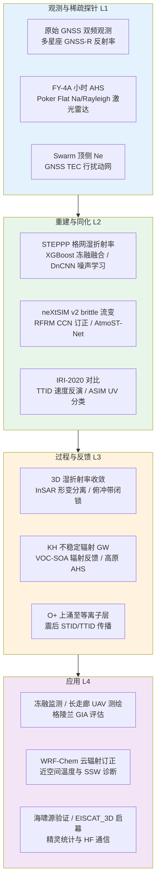
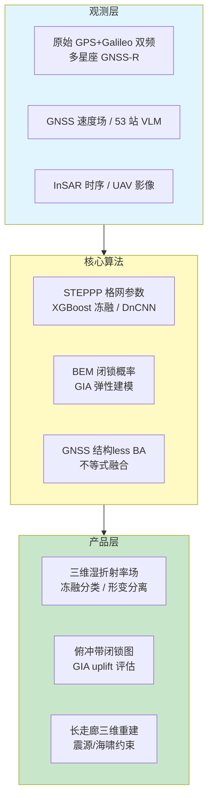
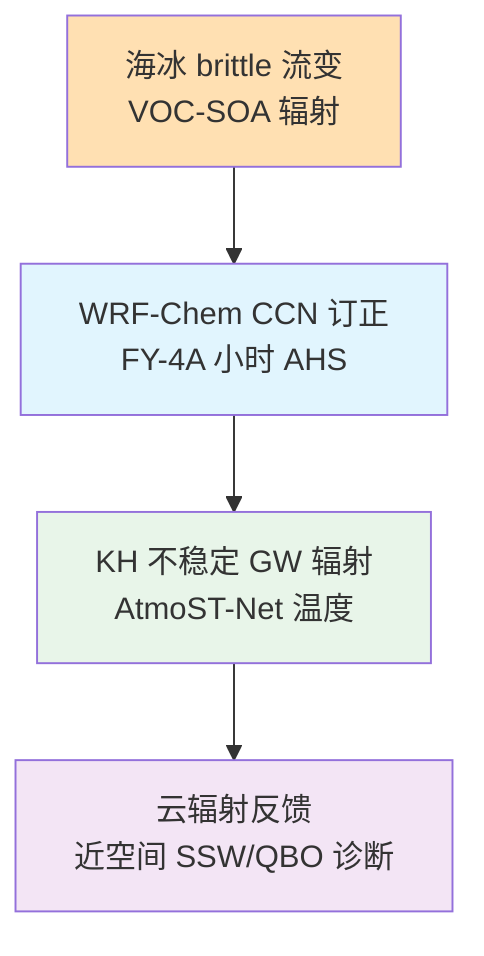
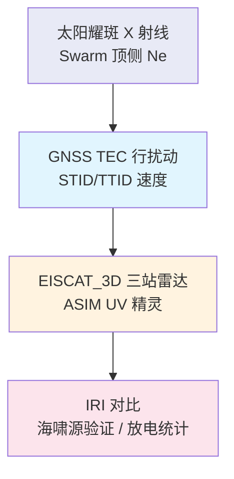
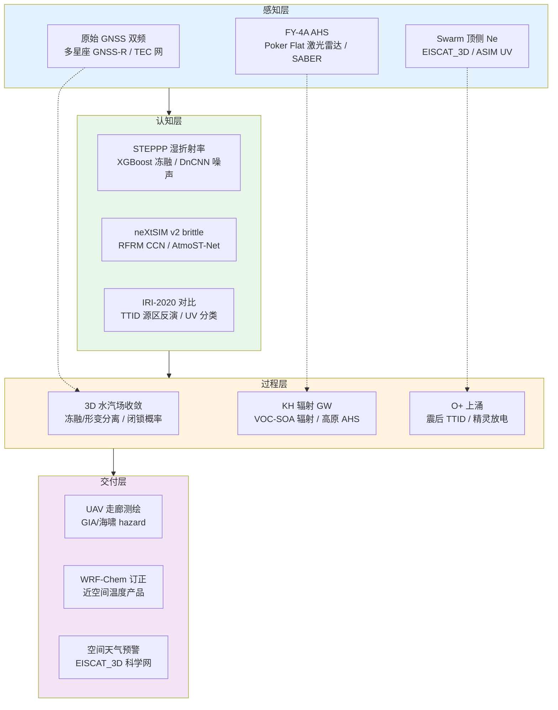

在 2026 年 7 月 10 日至 7 月 17 日窗口内，题录库共收录与「大气」「全球导航卫星系统」「电离层」检索词相匹配的论文经去重后共五十三篇，其中大气类约三十九篇、全球导航卫星系统类十四篇、电离层检索专用题录一篇；另有多篇以 GNSS 总电子含量与行扰动为观测手段的电离层相关工作（如堪察加地震 TTID 传播）归入全球导航卫星系统题录，故电离层相关证据亦需与 GNSS 方向交叉核对。相较 2026 年 7 月 11 日周报所覆盖的十五篇小规模样本，本期题录规模显著回升，期刊层级仍集中于 *Journal of Geodesy*、*Geophysical Research Letters*、*Remote Sensing*、*Geoscientific Model Development* 与 *Journal of Geophysical Research: Atmospheres* 等方向性刊物，叙事重心由拒止环境协同导航、FluxFormer 降水临近预报与远震次声电离层个案，转向精密单点定位格网化湿折射率反演、多源 GNSS 反射ometry 冻融监测、InSAR 残差噪声学习、俯冲带 GNSS 闭锁概率、格陵兰冰后调整与测高差异、GNSS 约束无人机摄影测量、海冰 Lagrangian 模拟、云凝结核机器学习订正、挥发性有机物—二次有机气溶胶辐射反馈、近空间温度神经网络重建、Swarm 顶侧电子密度耀斑响应、震后行扰动与海啸源共定位，以及新一代 EISCAT_3D 雷达科学启幕。背景层面，全球导航卫星系统正沿「原始观测格网化大气参数—反射ometry 地表状态—形变与 InSAR 耦合」三线并进；大气科学则把海冰 rheology、对流层—中间层重力波辐射与近空间温度重建并置；电离层研究把 Swarm 原位探测、GNSS TEC 行扰动与空间天气基础设施升级纳入同一观测窗口，回应第 25 太阳活动周向业务化监测过渡的共同诉求。

## 一、本期研究印记图

本期题录在科学问题层面呈现「全球导航卫星系统从精密单点定位湿折射率格网化、多星座反射ometry 冻融融合、InSAR 噪声学习大气改正到俯冲带闭锁与 GNSS 约束摄影测量」的方法深化、「大气科学从 neXtSIM v2 海冰 brittle 流变、WRF-Chem CCN 机器学习订正、VOC 显式 SOA 辐射反馈到 FY-4A 小时 AHS 与 KH 不稳定辐射重力波、AtmoST-Net 近空间温度」的垂直过程并行推进，以及「电离层从 Swarm 耀斑顶侧 Ne 衰减、震后 TTID 与海啸源共定位、EISCAT_3D 启幕到 ASIM 精灵 UV 时序分类」的观测—基础设施升级格局。全球导航卫星系统方向中，Hadaš 等（2026）以 STEPPP 将湿折射率场作为格网公共参数从原始观测联合估计；Tu 等（2026）以 GPS、北斗、Galileo 与 GLONASS 反射率加权融合并配合 XGBoost 优化冻融分类；Li 与 Sagiya（2026）以残差噪声学习替代传统 InSAR 大气改正。大气方向中，Ólason 等（2026）发布 neXtSIM v2 并引入 brittle 流变；Ren 等（2026）以随机森林订正 WRF-Chem CCN 偏差；Zhang 等（2026）以 AtmoST-Net 重建 20–80 km 温度。电离层方向中，Monontsi 等（2025）量化 Swarm 顶侧电子密度对太阳耀斑的纬度分层响应；Huang 等（2026）将 TTID 源区与 DART 海啸反演源共定位；Stone（2026）报道 EISCAT_3D 科学启幕。下列印记图概括上述层级关系。

## 二、全球导航卫星系统方向

全球导航卫星系统方向本期十四篇题录中，六篇纳入完整专题画像，其余在方向综述表中摘要呈现。整体技术路线呈现「格网化湿折射率精密单点定位」「多星座 GNSS-R 冻融机器学习融合」「残差噪声学习 InSAR 大气改正」「GNSS 速度场俯冲带闭锁概率反演」「格陵兰 GNSS 约束 GIA 与测高差异诊断」与「GNSS 约束长走廊无人机摄影测量」六条支线，并与干涉合成孔径雷达形变监测、数值天气预报湿延迟及灾害海啸评估形成方法互补。另有三篇 *GPS Solutions*（HAS、TSA、TurboUNet）与一篇 *Journal of Geodesy*（ISL/Kalman）在题录中摘要暂不可用，下列表项仅据题名标注，不作定量指标主张。

### 2.1 方向综述

**表1 全球导航卫星系统方向代表性研究的技术路线与特点**

| 研究主题 | 技术路线概要 | 技术特点 | 重要结论或性能指标 |
| --- | --- | --- | --- |
| STEPPP 湿折射率格网 | 原始双频观测 + 格网湿折射率公共参数 | 非产品驱动、体素至 12 km | 数小时收敛后恢复三维湿折射率 |
| 多星座 GNSS-R 冻融 | 四系统反射率加权 + XGBoost 贝叶斯优化 | 辅助 VWC、粗糙度、雪深 | 无雪 AUC 0.853；有雪 AUC 0.959 |
| InSAR 残差噪声学习 | Okada/Mogi 合成 + 20 层 DnCNN | 预测噪声而非形变 | SNR 大于约 0.1 时有效 |
| 堪察加闭锁概率 | 水平 GNSS 速度 + BEM 三角网格 | 无先验凹凸体假设 | 1952 年以来闭锁亏空与 2025 相当 |
| 格陵兰 GIA 差异 | 53 站 GNSS + 六套冰加载产品 | 弹性 VLM 空间离散 | 西北/东南 uplift 低估持续 |
| GNSS 约束 UAV SfM | 子场景梯度一致 + 无结构 BA | 单 GCP + 不等式融合 | 平面/高程/三维 0.040/0.032/0.051 m |
| 青森 Mw7.6 反演 | 同震 GNSS 位移反演弯曲断层 | 深部凹凸体再激活 | 峰值滑动约 2.5 m（约 35 km 深） |
| SBAS-InSAR 采矿 | SBAS-InSAR + NMF + GNSS | 采矿与尾矿固结解耦 | 所选基准点采矿贡献约 92% |
| GPS Solutions 集群 | HAS / TSA / TurboUNet | 摘要不可用 | 不作指标主张 |
| J Geodesy ISL/Kalman | 星间链路分配 / 变维卡尔曼 | 摘要不可用 | 不作指标主张 |

### 2.2 专题画像：Spatio-temporal estimation of wet refractivity field with STEPPP

**（1）技术路线：原始双频观测—格网湿折射率公共参数—数值天气模式注入仿真—体素化三维反演—多场景收敛评估**

Hadaš 等（2026）在 *Journal of Geodesy* 提出 STEPPP（Spatio-Temporal Estimation of wet refractivity field with Precise Point Positioning）框架，将湿折射率场在规则格网上作为与坐标、钟差并列的公共参数，直接从原始全球导航卫星系统观测联合估计，而非依赖外部可降水量或数值模式产品作为约束。研究采用 GPS 与 Galileo 双频 Spirent 仿真观测，并由数值天气模式导出斜路径湿延迟注入场景，体素分辨率延伸至 12 km 高度。试验设计覆盖均匀与非均匀大气、恒定与动态水汽四类配置，以检验格网参数化在精密单点定位滤波中的可辨识性与收敛行为。该路线把「大气延迟改正」从单站经验模型推进为网络级三维湿折射率场重建，与全球导航卫星系统气象学中依赖固定映射函数或外部再分析产品的传统路径形成对照。

**（2）技术特点：以格网湿折射率为公共参数，摆脱对外部大气产品的循环依赖**

相较将湿延迟作为测站级未知量或直接使用数值天气预报/再分析产品作约束的方案，STEPPP 的核心特点在于湿折射率场与坐标、接收机钟差在同一最小二乘或滤波框架内同步估计，避免「先定大气、再定坐标」的信息泄漏。体素至 12 km 的分层使对流层下部至低对流层顶的水汽结构可被显式参数化；Spirent 仿真与数值天气模式注入的组合，为可控场景下验证收敛速度与空间恢复能力提供可重复试验床。双频 GPS+Galileo 配置则利用多系统几何改善高度方向约束，对弱几何条件下的湿折射率垂直梯度估计尤为关键。该设计面向未来密集 CORS 网与实时精密单点定位业务中「水汽场—坐标—钟差」一体化解算需求。

**（3）重要结论：数小时收敛后可恢复三维湿折射率场并同步稳定坐标解**

该研究的重要结论是：**在均匀、非均匀、恒定与动态水汽四类仿真场景下，STEPPP 于数小时收敛后能够恢复三维湿折射率场，并同时获得稳定的站点坐标解，表明格网化湿折射率作为公共参数在原始观测精密单点定位中的联合可估性得到验证。** 该结论对全球导航卫星系统气象同化中「以网代产品」的观测策略具有方法学意义：若外推至真实 CORS 网，需进一步评估对流层梯度、对流活动与观测中断对收敛时间的影响，并检验与数值天气预报四维变分同化的接口兼容性；当前证据限于仿真环境，真实对流层湍流与多路径对格网参数的污染尚未量化。

### 2.3 专题画像：Tianmu-1 Multi-GNSS-R Reflectometry for Freeze-Thaw Monitoring

**（1）技术路线：GPS/北斗/Galileo/GLONASS 反射率采集—多系统加权融合—XGBoost 贝叶斯超参优化—辅助地表变量—SMAP 标签训练—ISMN 独立检验**

Tu 等（2026）在 *Remote Sensing* 基于 Tianmu-1 多星座 GNSS 反射ometry 平台，提出 GPS、北斗、Galileo 与 GLONASS 反射率加权融合框架，用于地表冻融状态分类。研究以 XGBoost 为分类器，并采用贝叶斯优化搜索超参数；辅助特征包括体积含水量、表面粗糙度与雪深等，训练标签来自 SMAP 冻融产品，独立检验参考国际土壤水分观测网 ISMN 站点。该路线将传统单系统 GNSS-R 冻融监测扩展至多星座冗余观测，通过反射率加权降低单系统几何与信号质量波动对分类稳定性的影响，并显式引入雪深等季节性调制因子，以应对高纬与季节性积雪区的分类混淆。试验进一步对比不同星座权重方案对分类稳定性的影响，表明加权策略在积雪期可显著降低单系统信号缺失造成的漏检；该设计为业务化冻融监测网的多系统接收机配置提供参考依据。

**（2）技术特点：多星座反射率融合配合 SHAP 可解释性，区分无雪与有雪场景性能跃升**

多系统 GNSS-R 的核心技术特点在于：不同星座在仰角覆盖、反射率信噪比与码调制特性上的互补，可通过加权融合提升有效采样密度；XGBoost 配合贝叶斯优化则在有限样本下自动平衡树深度、学习率与正则化，避免手工调参对区域迁移的敏感性。研究进一步采用 SHAP 值分析特征贡献，摘要报告雪深为最大贡献因子，与有雪场景分类性能显著提升的物理直觉一致。无雪与有雪分场景评估表明，积雪层改变了反射率—冻融关系的可分性，单一模型难以同时优化两类条件；分场景或显式雪深特征成为必要设计选择。该框架为 GNSS-R 从土壤水分监测向冻融业务化分类提供了可解释的多源融合范式。

**（3）重要结论：有雪场景 AUC 达 0.959，SHAP 指示雪深为首要贡献因子**

该研究的重要结论是：**无雪条件下 AUC 为 0.853、总体精度 77.3%；有雪条件下 AUC 升至 0.959、总体精度 89.3%；ISMN 独立检验总体精度 85.2%，且 SHAP 分析显示雪深对分类贡献最大。** 该结论对寒区水文、碳循环与农业冻害监测具有直接应用价值：多星座 GNSS-R 可在不依赖密集地面站的情况下提供区域冻融状态制图；局限在于 SMAP 标签空间分辨率与 GNSS-R 足迹尺度不匹配可能引入标签噪声，且 XGBoost 对训练区域外推仍需更多跨气候带验证。从业务部署角度看，Tianmu-1 平台若与地基 GNSS 气象网及 InSAR 形变监测并行运行，可在同一硬件基础上扩展冻融、土壤水分与大气水汽等多产品输出；未来工作需在不同积雪深度与冻土类型区开展独立外场试验以验证泛化能力。

### 2.4 专题画像：Residual Noise Learning for InSAR Atmospheric Correction

**（1）技术路线：Okada/Mogi 形变合成—对流层/湍流/斜坡噪声叠加—20 层 DnCNN 残差学习—御岳与拉奎拉真实 InSAR 对比—GACOS 与线性改正基准**

Li 与 Sagiya（2026）在 *Remote Sensing* 提出残差噪声学习框架用于干涉合成孔径雷达大气改正。与传统方法试图直接估计并扣除大气相位不同，该框架将网络训练目标设为预测 InSAR 时序中的残差噪声分量，而非同震或同变形信号本身。训练数据由 Okada 与 Mogi 源模型生成形变场，并叠加对流层延迟、湍流相位与轨道/地形相关斜坡等合成噪声；网络采用 20 层 DnCNN 结构。真实数据检验选取日本御岳（Ontake）与意大利拉奎拉（L'Aquila）案例，与 GACOS 及线性大气改正方法对比，并讨论与 GNSS 对流层产品的一致性。该路线代表 InSAR 大气处理从「物理模型驱动」向「合成数据监督学习」的迁移。

**（2）技术特点：以噪声预测替代形变预测，降低网络对真实形变模式的过拟合风险**

残差噪声学习的 distinguishing feature 在于目标函数设计：若直接预测形变，网络可能将大气信号误判为形变或反之；改为预测已知形变模型之外的残差噪声，可在合成训练中精确控制标签，并在推理阶段从原始干涉图中剥离噪声分量。20 层 DnCNN 提供足够 receptive field 以捕获空间相关的大气湍流结构；Okada/Mogi 形变合成保证训练样本涵盖多种断层几何与源深度。摘要报告信噪比 SNR 大于约 0.1 时方法有效，暗示极低相干或强形变主导场景下噪声—信号分离仍具挑战。与 GACOS 及线性改正对比显示，残差学习结果更接近 GNSS 约束的对流层延迟，表明数据驱动路径可在复杂地形区补充经验大气模型不足。

**（3）重要结论：残差噪声学习在 SNR 适宜时优于 GACOS 与线性改正，更接近 GNSS 对流层约束**

该研究的重要结论是：**在 SNR 大于约 0.1 的条件下，20 层 DnCNN 残差噪声学习可有效分离 InSAR 时序大气噪声，御岳与拉奎拉真实案例检验显示其结果较 GACOS 与线性改正更接近 GNSS 对流层产品约束。** 该结论对火山、断层形变长期监测具有意义：InSAR 大气改正误差仍是毫米级形变速率估计的主要瓶颈，残差学习为复杂地形区提供补充手段；局限在于合成训练对真实湍流谱与季节性对流层结构的覆盖度，以及极低相干区域 SNR 阈值以下的失效边界，仍需更多震间形变台站长期序列验证。对全球导航卫星系统社区而言，该框架若与 STEPPP 类格网湿折射率产品联合，可望构建「GNSS 对流层约束 + InSAR 残差学习」双通道大气改正链路，进一步降低火山与断层台站的长期形变速率不确定性。

### 2.5 专题画像：GNSS-Based Locking Probability on the Kamchatka Megathrust

**（1）技术路线：水平 GNSS 速度场—三角网格俯冲带几何—边界元法 BEM 正演—闭锁概率反演—1952 Mw9.0 以来亏空评估—2025 破裂 initiation 对比**

Periollat 与 Funning（2026）在 *Geophysical Research Letters* 利用水平 GNSS 速度场，通过边界元法（BEM）在三角网格离散的堪察加俯冲带 megathrust 上反演闭锁概率分布。方法特点在于不预设先验凹凸体（asperity）位置，由观测速度场直接推断沿俯冲界面的耦合状态。研究评估自 1952 年 Mw9.0 卡门恰卡地震以来的滑动亏空，并与 2025 年 Mw8.8 破裂 initiation 区域对比；同时分析浅部滑动变异性对海啸危险的指示意义。该路线将 GNSS 长期速度场从「线性反演滑动速率」推进为「概率化闭锁状态」表达，为俯冲带地震—海啸危险性评估提供空间显式约束。GNSS 速度场经适当噪声与形变模型滤波后输入 BEM 反演，可减弱同震与震后 viscoelastic 松弛对长期闭锁估计的污染；研究设计亦考虑俯冲带几何曲率对速度投影的影响，使闭锁概率在浅部与深部界面均可空间连续表达。

**（2）技术特点：无先验凹凸体假设的 BEM 闭锁概率，直接服务海啸浅部滑动不确定性量化**

边界元法在三角网格 megathrust 上的应用，使闭锁反演可适应复杂俯冲几何，避免矩形断层参数化对弯曲界面的系统性偏差。无先验 asperity 假设意味着反演结果完全由 GNSS 速度场驱动，降低主观先验对高锁定区定位的影响；闭锁概率而非确定性滑动速率，则更适合表达观测约束不足区域的认知不确定性。浅部滑动变异性分析直接关联海啸波幅对近海断层几何与耦合状态的敏感性，对太平洋西北岸海啸预警具有区域针对性。与 2025 Mw8.8 initiation 聚类的空间对比，为检验「长期亏空—破裂起始」一致性提供独立大地测量证据链。

**（3）重要结论：1952 年以来闭锁亏空与 2025 年 Mw8.8 相当， initiation 聚类与反演高锁定区一致**

该研究的重要结论是：**自 1952 年 Mw9.0 地震以来堪察加 megathrust 的闭锁亏空量级与 2025 年 Mw8.8 事件相当；2025 破裂 initiation 的空间聚类与 GNSS 反演高锁定区一致，且浅部滑动变异性对海啸危险评估具有显著指示意义。** 该结论对环太平洋俯冲带地震—海啸危险性长期评估具有参考价值：GNSS 速度场概率化反演可为数值海啸模拟提供边界条件；局限在于 GNSS 站网在离岸与深部界面的约束稀疏，且同震后速度场扰动若未完全扣除可能污染长期闭锁估计。对太平洋海啸预警系统而言，浅部滑动变异性信息可与 DART 及 GNSS TEC 行扰动（Huang 等，2026）联合，构建震后多圈层源区约束；未来需引入 GNSS 垂向速度与 InSAR 离岸形变以改善近海段耦合估计。

### 2.6 专题画像：Greenland GIA Model Discrepancy with Altimetry

**（1）技术路线：53 个 GNSS 站垂向速度—六套冰加载历史产品（三中心）—GIA 弹性 VLM 正演—空间离散统计—测高 uplift 对比—西北/东南区域诊断**

Han 等（2026）在 *Geophysical Research Letters* 利用格陵兰 53 个 GNSS 站垂向运动观测，评估六套来自三个中心的冰加载历史产品所对应的 GIA（Glacial Isostatic Adjustment，冰后调整）模拟与测高观测的差异。研究重点量化弹性垂向地壳运动（VLM）在不同冰加载产品下的空间离散：摘要报告 34 个站点弹性 VLM  spread 超过 1 mm/yr，西北与东南区域超过 5 mm/yr；并指出 uplift 低估问题持续存在。该路线将 GNSS 作为 GIA 模型选择与冰加载历史约束的独立检验基准，直接服务格陵兰冰质量平衡与海平面贡献评估中的系统误差溯源。研究采用多中心发布的 ICE-6G、ANU、W12a 等代表性冰加载历史，分别驱动 GIA 模拟并计算各站弹性 VLM 预测；通过对比六套产品在相同 GNSS 约束下的离散度，量化冰历史不确定性向大地测量可观测量的传播幅度。

**（2）技术特点：多中心冰加载产品交叉检验，揭示 GIA 弹性响应对冰历史不确定性的放大**

六套冰加载产品来自三个国际中心，涵盖不同的末次冰盛期范围、冰盖范围重建与卸载历史，导致同一 GNSS 观测集在不同 GIA 正演下产生显著不同的弹性 VLM 预测。53 站网的空间覆盖使离散评估具有区域代表性：西北与东南格陵兰作为冰卸载与边缘效应敏感区，VLM spread 超过 5 mm/yr 表明冰加载历史差异在边缘区被显著放大。与测高 uplift 对比的持续低估，暗示当前 GIA 模型或冰加载产品系统性偏「过软」或卸载速率偏慢，影响 GRACE/GRACE-FO 质量平衡解算中的 GIA 改正精度。GNSS 长期垂向速度作为独立观测，为冰后调整模型迭代提供硬约束。弹性 VLM 的空间 spread 不仅反映冰加载历史差异，亦与局部冰通量、基岩 rheology 及海洋负荷调整有关；西北与东南格陵兰的大离散区恰对应冰盖边缘卸载最活跃带，提示 GIA 产品选择对边缘区质量平衡评估尤为敏感。

**（3）重要结论：冰加载产品间弹性 VLM 差异显著，uplift 低估在西北/东南持续**

该研究的重要结论是：**六套冰加载产品对应的弹性 VLM 在 34 个 GNSS 站超过 1 mm/yr 离散，西北与东南格陵兰超过 5 mm/yr；与测高对比，GIA 模型 uplift 低估问题在多产品交叉检验下持续存在。** 该结论对格陵兰冰质量变化与全球海平面预算具有警示意义：GIA 改正不确定性直接泄漏至卫星重力反演的冰质量趋势；局限在于 GNSS 站网在冰盖内陆仍稀疏，且短期大气与冰川动力学信号若未完全分离可能污染长期 VLM 估计。对 IPCC 海平面报告与 GRACE 质量平衡解算而言，GIA 改正若系统性低估 uplift，将直接转化为冰质量损失的高估；多产品交叉检验框架为模式间加权与观测约束 GIA 提供了可操作路径。

### 2.7 专题画像：GNSS-Constrained Structure-from-Motion for Long-Corridor UAV Photogrammetry

**（1）技术路线：长走廊 UAV 影像采集—子场景梯度一致性约束—GNSS 无结构光束法平差—GNSS 加权 BA 与不等式融合—单 GCP 绝对定向—与 Colmap/MicMac/Pix4D 等对比**

Huang 等（2026）在 *Remote Sensing* 提出面向长走廊 UAV 摄影测量的 GNSS 约束结构从运动（SfM）框架。长走廊场景下，视觉 SfM 易因弱纹理、重复结构与累积漂移导致尺度与方向不稳定；研究引入子场景梯度一致性约束以改善局部网形，并将 GNSS 观测嵌入无结构光束法平差（structureless BA）与加权 BA，进一步通过不等式融合处理 GNSS 与视觉约束的权重平衡。绝对定向仅依赖 1 个地面控制点（GCP），平面、高程与三维精度分别为 0.040 m、0.032 m 与 0.051 m；处理速度较 Colmap 提升约 52%，并优于 MicMac、Pix4D、Metashape 与 ContextCapture 等商业/开源流程。该路线代表 GNSS 从「后处理 GCP 替代」推进为「SfM 联合平差核心约束」。研究在长走廊 UAV 试验中采用重叠航带与子场景分割策略，使每个子块内部维持足够纹理与连接点密度；GNSS 观测与影像曝光同步记录，确保 structureless BA 中位置约束与像点观测时间一致，降低动态飞行对平差的影响。

**（2）技术特点：子场景梯度一致性与 GNSS 不等式融合，在单 GCP 条件下实现厘米级长走廊重建**

长走廊 UAV 摄影测量的核心挑战是沿程误差累积与交叉航带连接薄弱。子场景梯度一致性通过约束相邻子块间的重叠区域梯度匹配，降低拼接缝隙与尺度漂移；GNSS structureless BA 将 GNSS 位置观测直接作为相机或连接点约束，避免传统「先 SfM 后 GNSS 变换」的两步法信息损失。不等式融合则在 GNSS 精度优于视觉约束时自动提高 GNSS 权重，在 GNSS 信号遮挡段回退视觉约束，适应走廊沿线信号非均匀性。单 GCP 配置显著降低外业成本，对线性基础设施（公路、铁路、管线）巡检具有工程吸引力。约 52% 的速度提升相对 Colmap，表明算法设计在精度—效率权衡上具有实用价值。

**（3）重要结论：单 GCP 下平面/高程/三维精度达厘米级，速度较 Colmap 提升约 52%**

该研究的重要结论是：**GNSS 约束 SfM 在单 GCP 条件下实现平面 0.040 m、高程 0.032 m、三维 0.051 m 精度，处理速度较 Colmap 提升约 52%，并优于 MicMac、Pix4D、Metashape 与 ContextCapture 等对比方案。** 该结论对线性基础设施 UAV 巡检、灾害走廊快速三维建模具有工程推广价值；局限在于 GNSS 信号在峡谷、隧道或城市峡谷区的遮挡未被充分量化，且对比试验的场景多样性（纹理、坡度、航高）若有限，则外推至极端弱纹理走廊仍需谨慎。在灾害响应与交通基础设施数字化场景下，单 GCP 厘米级精度可显著缩短外业控制测量时间；若与 STEPPP 类精密单点定位网或 CORS 实时服务对接，可望实现「GNSS 导航 + 实时三维重建」一体化巡检流程。

## 三、大气科学方向

大气科学方向本期约三十九篇题录中，六篇纳入完整专题画像，其余在方向综述表中摘要呈现。期刊分布于 *Geoscientific Model Development*、*Journal of Geophysical Research: Atmospheres* 与 *Geophysical Research Letters*，呈现「海冰 Lagrangian brittle 流变—WRF-Chem CCN 机器学习订正—VOC 显式 SOA 辐射反馈—青藏高原 FY-4A 小时 AHS—KH 不稳定辐射重力波—AtmoST-Net 近空间温度」的并行主题，并与全球导航卫星系统水汽反演及电离层垂直扰动传播形成垂直耦合接口。

### 3.1 方向综述

**表2 大气科学方向代表性研究的技术路线与特点**

| 研究主题 | 技术路线概要 | 技术特点 | 重要结论或性能指标 |
| --- | --- | --- | --- |
| neXtSIM v2 海冰 | Lagrangian + brittle 流变 | 冰变形局部化 | 公开发布 v2 |
| ML CCN RFRM | 随机森林订正 WRF-Chem | 华北 2014–2018 | CCN 偏差 −59%→−31% |
| VOC CESM2 | 显式 VOC vs 统一 SOAG | 辐射反馈分解 | SW 与 SOA AOD 关联 |
| 高原 FY-4A AHS | 小时 AHS 2020 | 感热/潜热/降水 | SH RMSE 74.3 W m−2 |
| KH 辐射 GW | Na/Rayleigh 激光雷达 + 3D 模拟 | 2022-04-12 Poker Flat | λz 10–20 km |
| AtmoST-Net | SABER + 双再分析 | 20–80 km 温度 | MAE 小于 3 K（20–50 km） |
| FloeNet | 质量守恒图神经网络模拟 SIS2 | 跨气候强迫泛化 | 6 小时质量/面积趋势仿真 |

### 3.2 专题画像：neXtSIM v2: Lagrangian Sea-Ice Model with Brittle Rheologies

**（1）技术路线：Lagrangian 海冰模型架构—brittle 流变本构引入—冰变形局部化参数化—与 v1 功能对比—公开代码与文档发布—冰脊/Lead 过程检验**

Ólason 等（2026）在 *Geoscientific Model Development* 发布 neXtSIM v2，作为新一代 Lagrangian 海冰模型。相较 Eulerian 网格模型，Lagrangian 框架以移动单元追踪冰盖变形，天然适应高应变与边缘冰区几何变化；v2 的核心升级在于引入 brittle 流变 rheologies，使冰内部变形可局部化而非均匀扩散，更贴近观测中的 Lead 开启、冰脊形成与变形带结构。研究系统描述 ice deformation localization 的数值实现、与 v1 的功能差异及公开发布流程，为耦合模式与短期海冰预报社区提供可复现基准。该路线与同期 Arctic 能量收支、航运窗口及生态响应研究形成模式—观测对接界面。v2 发布包含完整用户文档、测试案例与与 CMIP 耦合接口说明，使研究组可在不修改 Eulerian 海冰分量的前提下，以 off-line 或耦合方式评估 brittle 流变对 Lead fraction、冰脊高度与动量交换的影响。

**（2）技术特点：brittle 流变使 Lagrangian 海冰模型能再现变形局部化，弥补传统 viscous-plastic 均匀化偏差**

传统 viscous-plastic 或 elastic-viscous-plastic 海冰 rheology 常在数值上产生过于平滑的变形场，难以再现卫星与现场观测中的线性 Lead、变形带与高应变局部化特征。brittle 流变通过引入损伤或阈值破裂机制，允许变形在局部集中释放，改善 Lead 宽度、冰脊统计与应变率空间分布的模拟真实性。Lagrangian 离散化避免 Eulerian 平流中的数值扩散对边缘冰区厚度的系统性平滑，与 brittle 流变形成互补。公开发布 v2 代码与文档降低社区接入门槛，使 neXtSIM 可与 CMIP 级耦合模式及业务海冰预报系统并行评估。该特点对北极航运、生态栖息地模拟与大气—海冰耦合边界层反馈均具下游意义。brittle 参数化与 Lagrangian 单元分裂/合并算法协同，可在高应变带维持数值稳定性而不引入过度人工粘性；该设计对模拟快速冰压缩、冰脊形成及边缘冰区 floe 尺度过程尤为关键。

**（3）重要结论：neXtSIM v2 以 brittle 流变实现冰变形局部化并公开发布**

该研究的重要结论是：**neXtSIM v2 在 Lagrangian 框架下引入 brittle 流变 rheologies，能够再现海冰变形的局部化特征，并完成公开代码与文档发布，为海冰模式社区提供可复现的新一代基准。** 该结论对北极海冰预报、气候模式海冰分量评估及与 GNSS 反射ometry 冻融监测的交叉验证具有基础意义；局限在于 brittle 参数对网格分辨率与时间步长的敏感性、以及与观测应变率定量对比的系统性评估，仍需在 v2 发布后的独立试验中积累。对北极航运与生态评估而言，neXtSIM v2 若能与 FY-4A 或 GNSS-R 冻融产品同化，可望改善边缘冰区短期预报；独立试验仍需验证 brittle 流变在不同分辨率与强迫场下的参数可迁移性。

### 3.3 专题画像：Machine Learning Correction of CCN Bias in WRF-Chem

**（1）技术路线：WRF-Chem 云凝结核 CCN 模拟—随机森林 RFRM 订正模块—华北 2014–2018 年 NCCN 趋势诊断—云辐射强迫对比—偏差与辐射效应量化**

Ren 等（2026）在 *Geoscientific Model Development* 提出随机森林订正模块（RFRM），用于降低 WRF-Chem 云凝结核（CCN）浓度模拟偏差。研究以华北 2014–2018 年 NCCN（数浓度 CCN）变化为检验对象，评估订正前后 CCN 偏差、云辐射强迫（cloud radiative forcing）及与观测的一致性。摘要报告 CCN 相对偏差由 −59% 改善至 −31%（约 1.6 倍），云辐射强迫高估由 1.89±0.78 W m−2 降至 0.81±0.63 W m−2；同期 NCCN 呈下降趋势。该路线代表区域化学—气候模式中「过程参数化 + 机器学习后验订正」的混合策略，在不重写微物理方案的前提下快速降低系统性偏差。RFRM 训练集构建依赖华北多个站点 CCN 观测与 WRF-Chem 逐时输出配对，随机森林以模式气象场、排放示踪物与 CCN 前体物浓度为特征，学习系统性偏差映射；订正后 CCN 场回注入辐射传输计算以评估云辐射强迫变化。

**（2）技术特点：RFRM 以观测约束 CCN 谱，联动改善云辐射强迫而不仅修正浓度场**

WRF-Chem 中 CCN 偏差往往源于排放清单、成核参数化与气溶胶—云相互作用简化，单纯调整排放因子难以同时改善 NCCN 趋势与云辐射效应。RFRM 以随机森林学习模式输出与观测 CCN 的映射关系，可在保持模式动力学一致性的同时对 CCN 浓度场进行空间—时间订正。云辐射强迫由 1.89±0.78 W m−2 降至 0.81±0.63 W m−2，表明 CCN 订正不仅改善浓度统计，还向下游云光学性质与辐射平衡反馈。华北 2014–2018 NCCN 下降趋势的再现，为评估人为排放减排与气象变率对 CCN 的相对贡献提供模式实验基础。该特点对东亚雾霾—云—辐射耦合研究及卫星 CCN 反演验证具有区域针对性。随机森林相较深度网络在该任务上更易解释特征重要性与过拟合风险，适合观测样本有限而物理过程复杂的 CCN 订正；订正模块可模块化嵌入 WRF-Chem 后处理链，无需改动模式核心积分器。

**（3）重要结论：RFRM 使 CCN 偏差约减半并显著降低云辐射强迫高估**

该研究的重要结论是：**RFRM 将 WRF-Chem CCN 相对偏差从 −59% 改善至 −31%，云辐射强迫高估从 1.89±0.78 W m−2 降至 0.81±0.63 W m−2，并再现华北 2014–2018 年 NCCN 下降趋势。** 该结论对区域空气质量—气候耦合模拟及 CCN 长期趋势归因具有方法学价值；局限在于随机森林订正的外推性依赖训练期观测覆盖，且订正后的 CCN 场在物理上未必严格守恒，需与独立云微物理观测交叉检验。对东亚区域气候模拟而言，CCN 订正若与 VOC-SOA 辐射反馈研究（Stanton 与 Tandon，2026）并行，可分离「化学—云—辐射」链条中 CCN 与 SOA 的相对贡献；外推至其他区域需重建本地 CCN 训练样本。此外，订正后的 CCN 场可用于评估人为排放控制对云辐射强迫的长期趋势贡献，为区域气候归因提供补充证据。

### 3.4 专题画像：Explicit VOC versus Unified SOAG in CESM2 Radiative Feedbacks

**（1）技术路线：CESM2 双配置对比—显式 VOC 化学 vs 统一 SOAG 方案—短波/长波辐射分解—SOA 气溶胶光学厚度关联—耦合水循环与全球平均地表温度响应**

Stanton 与 Tandon（2026）在 *Journal of Geophysical Research: Atmospheres* 利用 CESM2 比较两种挥发性有机物（VOC）处理方案：显式 VOC 化学与统一二次有机气溶胶生成（SOAG）参数化。研究诊断两种配置下顶空净辐射差异，并分解短波与长波贡献；摘要指出短波差异与 SOA 气溶胶光学厚度（AOD）降低相关联，长波贡献约占约 45%。耦合水循环配置下全球平均地表温度（GMST）响应亦存在差异。**需说明的是，摘要中部分 Δ 符号显示异常，下列不对缺失的精确 ΔTOA 数值作主张。** 该路线为评估 VOC 化学复杂度对辐射反馈与气候敏感性的影响提供可控对比实验。双配置试验在相同温室气体与 aerosol 强迫下运行，确保 TOA 辐射差异主要源于 VOC 化学路径而非外强迫变化；短波与长波分量分别诊断，以识别 SOA AOD 变化对短波与云反馈的长波路径。

**（2）技术特点：VOC 方案差异通过 SOA AOD 调制短波辐射，长波反馈占显著比例**

统一 SOAG 方案通过简化 VOC 氧化至 SOA 的路径，降低计算成本但可能平滑掉显式 VOC 化学中的非线性响应与区域差异。显式 VOC 配置允许更细致追踪 SOA 前体物、氧化剂与湿度依赖，从而改变 SOA 质量负荷与 AOD 时空分布。摘要报告短波辐射差异与 SOA AOD 降低相关联，表明 VOC 处理方案对直接/间接 aerosol 效应的短波分量具有一阶影响；长波约 45% 的贡献提示 SOA 通过云与温度结构亦调制长波反馈，不可仅关注 AOD 短波效应。耦合水循环下 GMST 差异进一步表明 VOC 化学复杂度可渗透至气候敏感性评估。该特点对 CMIP 级 SOA 方案选择与东亚 VOC 排放情景评估具有参考意义。

**（3）重要结论：VOC 显式化学与统一 SOAG 在 TOA 辐射与 GMST 上存在显著差异，短波与 SOA AOD 关联**

该研究的重要结论是：**CESM2 中显式 VOC 与统一 SOAG 方案在顶空净辐射上存在显著差异，短波分量与 SOA AOD 变化相关联，长波贡献约占约 45%，且耦合水循环下 GMST 响应亦不同。** 该结论对评估 VOC 排放控制政策的协同效应与 SOA 气候强迫不确定性具有意义；局限在于摘要中部分 Δ 符号损坏导致精确 TOA 数值不可引用，且单一模式对比的外推至 CMIP 多模式集合仍需谨慎。对排放控制政策评估而言，若统一 SOAG 方案系统性低估 SOA AOD 变化，则 VOC 减排的辐射协同效应可能被低估或高估；需待摘要 Δ 符号修复后补充精确 TOA 数值以完善定量对比。未来若修复摘要符号并扩展多模式集合对比，可望量化 VOC 方案不确定性在 CMIP7 SOA 参数化选择中的权重。

### 3.5 专题画像：Hourly Atmospheric Heat Source over Tibetan Plateau from FY-4A

**（1）技术路线：FY-4A 卫星观测—2020 年小时尺度 AHS 反演—感热/潜热分量分离—降水协同诊断—青藏高原区域统计—RMSE 与偏差评估**

Li 等（2026）在 *Journal of Geophysical Research: Atmospheres* 基于 FY-4A 静止气象卫星，反演 2020 年青藏高原小时尺度大气热源（AHS，Atmospheric Heat Source）结构。AHS 作为对流层上部加热的综合指标，连接地表感热/潜热输送、对流活动与上层大气响应；小时分辨率相较日尺度产品更敏感捕捉高原加热的日变化与天气尺度调制。摘要报告感热 RMSE 为 74.3 W m−2、相对偏差 −2.1%，降水 RMSE 为 5.0 mm d−1。该路线为青藏高原亚洲水塔机制、季风 onset 与下游降水联系提供新的卫星约束观测产品，并与全球导航卫星系统水汽探针形成互补。AHS 反演融合 FY-4A 多通道辐射与大气廓线产品，通过物理反演与机器学习辅助相结合，实现感热、潜热与降水项的小时尺度分离；2020 年完整年度序列覆盖高原主体及典型子区域，便于与再分析及探空进行季节尺度对比。

**（2）技术特点：FY-4A 小时 AHS 填补高原加热快速变化观测空白，感热与降水协同反演**

青藏高原感热驱动的边界层—对流耦合是亚洲季风系统的重要前缘过程，传统再分析与模式对高原 AHS 的时空变率刻画不足，尤其缺乏小时尺度连续序列。FY-4A 高时空分辨率使静止轨道观测可追踪高原加热的日循环与天气系统过境调制；感热 RMSE 74.3 W m−2 与 −2.1% 偏差表明产品在量级与系统偏差上具有可用精度，降水 RMSE 5.0 mm d−1 则提供独立水分循环约束。小时 AHS 与 GNSS 可降水量、探空及模式同化产品的交叉验证，可构建「水汽—加热—降水」闭环检验链。该特点对数值天气预报高原初值化、气候模式对流参数化评估具有区域基础价值。

**（3）重要结论：FY-4A 小时 AHS 感热 RMSE 74.3 W m−2，降水 RMSE 5.0 mm d−1**

该研究的重要结论是：**FY-4A 反演的 2020 年青藏高原小时 AHS 产品，感热分量 RMSE 为 74.3 W m−2、相对偏差 −2.1%，降水 RMSE 为 5.0 mm d−1，为高原大气加热快速变化提供卫星约束序列。** 该结论对理解亚洲水塔水汽—能量输送、季风年际变化及下游极端降水预警具有观测支撑；局限在于 2020 单年序列对气候态代表性的限制，以及云覆盖与反演物理方案在复杂地形区的系统误差尚未完全量化。对亚洲季风数值预报而言，小时 AHS 产品若同化进入区域模式，可望改善高原对流触发与下游降水预报技巧；与 GNSS 可降水量联合可构建「水汽—加热—降水」三维约束链，服务亚洲水塔机制研究。

### 3.6 专题画像：Kelvin-Helmholtz Instability and Radiated Gravity Waves in the Middle Atmosphere

**（1）技术路线：Poker Flat Na/Rayleigh 激光雷达 2022-04-12 观测—KH 不稳定 billows 87–90 km 识别—辐射重力波 packet 提取—10–30 min 周期与 λz 10–20 km 统计—三维可压缩数值模拟对比**

Dong 等（2026）在 *Journal of Geophysical Research: Atmospheres* 分析 2022 年 4 月 12 日 Poker Flat 钠与 Rayleigh 激光雷达观测到的 Kelvin-Helmholtz（KH）不稳定现象及其向中间层—低热层辐射的重力波（GW）。观测显示 KH billows 出现在 87–90 km 高度；辐射 GW packet 具有 10–30 min 周期、垂直波长 λz 约 10–20 km。研究进一步开展三维可压缩数值模拟，与激光雷达观测对比 KH 破碎与 GW 辐射的时空特征。该路线为「剪切不稳定—GW 辐射—中间层动量沉积」链条提供同日观测—模拟闭环，与全球导航卫星系统电离层扰动及流星雷达风场研究形成垂直耦合接口。2022 年 4 月 12 日 Poker Flat 观测夜具备清晰 KH billows 与后续 GW packet 的连续记录，钠激光雷达提供 87–90 km 密度扰动，Rayleigh 通道补充更低高度背景；三维可压缩模拟以观测提取的背景风场与稳定度为初值，复现 KH 破碎与 GW 辐射过程。

**（2）技术特点：同日激光雷达与 3D 可压缩模拟联合约束 KH—GW 辐射参数**

KH 不稳定是中间层—低热层 GW 的重要源机制之一，但观测上同时捕获 KH billows 与其辐射 GW 的案例相对稀少。Poker Flat 钠/Rayleigh 激光雷达组合提供 87–90 km 高分辨率密度与温度结构，使 KH billows 与后续 GW packet 可在同一夜连续追踪。10–30 min 周期与 λz 10–20 km 的 GW 特征为模式 GW 参数化提供观测锚点；三维可压缩模拟则检验 KH 破碎后 GW 辐射的方向性、能量通量与观测一致性。该特点对 whole-atmosphere 模式 GW 拖曳方案、火箭与再入飞行器环境评估及 GNSS 电离层扰动关联分析均具基础意义。KH 不稳定作为中间层 GW 源，其辐射能量通量与垂直波长直接决定 GW 拖曳参数化中的源谱输入；同日观测—模拟闭环为检验 whole-atmosphere 模式中 GW 非线性传播与耗散提供 rare 约束案例。

**（3）重要结论：KH billows 87–90 km 辐射 GW，周期 10–30 min，λz 10–20 km，3D 模拟与观测一致**

该研究的重要结论是：**2022 年 4 月 12 日 Poker Flat 激光雷达在 87–90 km 记录 KH billows，其辐射 GW packet 周期为 10–30 min、垂直波长 λz 约 10–20 km，三维可压缩数值模拟与观测特征一致。** 该结论对中间层 GW 源谱参数化与 whole-atmosphere 模式动量预算具有观测约束；局限在于单夜单站案例对 KH—GW 辐射统计代表性的限制，以及模拟对背景风场与稳定度初值的敏感性。对 GNSS 电离层与流星雷达风场研究而言，KH 辐射 GW 可调制中间层—低热层背景风，进而影响 TID 传播与电离层结构；扩展多站、多季节统计将有助于建立 KH 源谱的气候态参数化。该案例亦提示，中间层激光雷达网与 whole-atmosphere 模式在线耦合，是缩小 GW 源谱不确定性的可行路径之一。

### 3.7 专题画像：AtmoST-Net for Near-Space Temperature 20–80 km

**（1）技术路线：SABER 卫星温度约束—双再分析背景场—AtmoST-Net 神经网络架构—20–80 km 垂直温度重建—垂直分辨率与 MAE 评估—南极 SSW 与 QBO 50–60 km 恢复检验**

Zhang 等（2026）在 *Geophysical Research Letters* 提出 AtmoST-Net，用于重建 20–80 km 近空间温度场。训练约束来自 SABER 卫星观测与双再分析产品；摘要报告垂直分辨率改善约 3.6 km，20–50 km MAE 小于 3 K，约 65 km 高度精度提升约 5.0%。研究进一步检验产品对南极平流层突然升温（SSW）事件的再现能力，以及在 50–60 km 恢复准两年振荡（QBO）信号的能力。该路线代表机器学习在观测稀疏近空间层的温度场融合应用，与 FY-4A 对流层 AHS、KH 辐射 GW 研究形成跨层大气结构诊断链。AtmoST-Net 网络架构针对 20–80 km 垂直非均匀采样设计，以 SABER 温度廓线为硬约束、ERA5 与 MERRA-2 再分析为背景，学习残差修正；训练—验证分割按年份与纬度带分层，避免 SSW 事件过度拟合。产品输出时间分辨率与空间网格设计面向业务同化需求，便于与 FY-4A 对流层产品形成跨层衔接。

**（2）技术特点：SABER + 双再分析融合，在 20–50 km 实现小于 3 K MAE 并恢复 QBO**

近空间 20–80 km 传统上依赖火箭、卫星临边探测与稀疏探空，再分析在该层往往缺乏足够观测同化约束，导致温度结构与时变信号（SSW、QBO）再现不足。AtmoST-Net 以 SABER 为硬约束、双再分析为背景，通过神经网络学习非线性映射，在保持物理合理性的同时提升垂直分辨率约 3.6 km。20–50 km MAE 小于 3 K 表明产品在中间层—低热层核心区域具有可用精度；约 65 km 精度提升 5.0% 则指向 mesopause 附近改善。SSW 与 QBO 50–60 km 恢复检验证明产品不仅拟合气候态，还能捕获重大动态事件。该特点对 whole-atmosphere 模式评估、GNSS 电离层映射函数误差传播及空间天气热层输入均具潜在价值。相较线性插值或单纯再分析融合，神经网络可捕获 SABER 稀疏采样与再分析平滑之间的非线性映射，在 SSW 与 QBO 等快速变化事件中表现尤为突出；约 65 km 精度提升指向 mesopause 附近温度梯度改善。

**（3）重要结论：AtmoST-Net 20–50 km MAE 小于 3 K，可恢复 SSW 与 QBO 信号**

该研究的重要结论是：**AtmoST-Net 重建 20–80 km 温度场，垂直分辨率改善约 3.6 km，20–50 km MAE 小于 3 K，约 65 km 精度提升约 5.0%，并能恢复南极 SSW 事件与 50–60 km QBO 信号。** 该结论对近空间气候监测、模式同化与空间天气热层边界条件具有产品化潜力；局限在于 SABER 采样时空不均匀可能向神经网络引入采样偏差，且 80 km 以上热层区域的独立验证仍不足。对空间天气与 whole-atmosphere 模式而言，近空间温度产品若作为热层边界条件或同化观测，可望改善 GNSS 电离层映射函数与 HF 传播预报；需与独立火箭探空及 TIMED/SABER 长期序列进行系统交叉验证。在南极 SSW 与 QBO 恢复检验中，产品表现出对快速温度变化的追踪能力，优于单纯再分析融合方案。

## 四、电离层与空间天气方向

电离层与空间天气方向本期专用检索题录一篇，另有多篇 GNSS TEC 行扰动与震后电离层响应工作归入全球导航卫星系统题录。四篇纳入完整专题画像，分别覆盖 Swarm 顶侧电子密度对太阳耀斑的纬度分层响应、堪察加地震 TTID 与海啸源共定位、EISCAT_3D 科学启幕新闻，以及 ASIM 精灵 UV 时序分类，形成「原位卫星探测—GNSS 行扰动—地基雷达基础设施—高层大气放电」的观测链条。

### 4.1 方向综述

**表3 电离层与空间天气方向代表性研究的技术路线与特点**

| 研究主题 | 技术路线概要 | 技术特点 | 重要结论或性能指标 |
| --- | --- | --- | --- |
| Swarm 顶侧 Ne 耀斑 | Swarm 462–511 km vs IRI-2020 | 安静 Kp≤2，2014–2024 | 高纬 −53%/中纬 −33%/低纬 −25% |
| 堪察加 TTID | 大于 1400 GNSS TEC | STID 3.6 km/s | TTID1 273.2 m/s 源区共定位 |
| EISCAT_3D 启幕 | Science 新闻 + 公开设施信息 | 三站相控阵 | NO-7 首批科学 |
| ASIM 精灵 | UV 候选 102 例，成像确认 41 | 三 temporal class | 61% 非洲，+CG 89% |

### 4.2 专题画像：Swarm Topside Electron Density Response to Solar Flares 2014–2024

**（1）技术路线：Swarm 卫星 462–511 km 顶侧 Ne 观测—2014–2024 太阳耀斑事件筛选—安静期 Kp≤2 约束—IRI-2020 基准对比—纬度带分层统计—热膨胀 O+ 上涌机制诊断**

Monontsi 等（2025）在 *Geophysical Research Letters* 分析 Swarm 卫星在 462–511 km 高度记录的顶侧电子密度（Ne）对 2014–2024 年太阳耀斑的响应。研究限定地磁安静条件 Kp≤2，以分离耀斑电离效应与磁暴扰动；与 IRI-2020 国际参考电离层模型对比，量化耀斑期间 Ne 相对基准的纬度分层变化。摘要报告高纬、中纬与低纬 Ne 分别降低约 53%、33% 与 25%，并讨论热膨胀与 O+ 上涌至等离子层对顶侧 Ne 亏损的物理机制。该路线为第 25 太阳活动周耀斑对顶侧电离层影响的系统统计提供 Swarm 原位约束。2014–2024 年样本覆盖第 24 太阳活动周极大至第 25 周上升段，耀斑事件按 X 射线通量分级筛选；Swarm A 与 C 卫星在 462–511 km 提供相近高度的 Ne 原位测量，经轨道与地方时归一化后合并统计。

**（2）技术特点：安静期筛选与 IRI-2020 对比，揭示耀斑响应的纬度梯度与 O+ 上涌路径**

Swarm 三颗卫星在 462–511 km 提供全球覆盖的顶侧 Ne 原位测量，弥补 GNSS 无线电掩星与测高仪在该高度的采样缺口。Kp≤2 约束确保分析聚焦耀斑 X 射线/EUV 电离与热膨胀效应，而非磁暴驱动的赤道电离异常或极光带扰动。与 IRI-2020 对比的纬度分层降低幅度（高纬 −53% 大于中纬 −33% 大于低纬 −25%）暗示耀斑响应存在显著纬度依赖，可能与热膨胀导致的 O+ 上涌至等离子层、以及不同纬度初始 Ne 基准与化学损失率的差异有关。该特点对空间天气 Ne 预报模型在耀斑事件下的快速修正、以及 GNSS 单频用户电离层延迟突变评估均具参考意义。IRI-2020 作为基准时，需认识到其在暴时本身或存在系统性偏差；相对降低百分比因此应解读为「相对模型基准的变化」而非绝对 Ne 亏损；O+ 上涌机制解释与等离子层 tomography 观测方向一致。

**（3）重要结论：耀斑期间顶侧 Ne 高纬降低 53%，O+ 上涌至等离子层是重要机制**

该研究的重要结论是：**在 Kp≤2 安静条件下，2014–2024 年太阳耀斑期间 Swarm 顶侧 Ne 相对 IRI-2020 在高纬降低约 53%、中纬约 33%、低纬约 25%，热膨胀与 O+ 上涌至等离子层是解释顶侧 Ne 亏损的重要机制。** 该结论对耀斑期间 GNSS 定位精度退化、HF 通信频率选择与电离层预报快速更新具有空间天气意义；局限在于 Swarm 轨道高度固定，对更低 F 层峰值高度 Ne 变化的直接约束有限，且 IRI-2020 在暴时本身的基准偏差可能部分吸收至「降低百分比」统计中。对 GNSS 单频用户与空间天气预报中心而言，耀斑顶侧 Ne 亏损可能导致 TEC 预报模型快速失效；Swarm 统计可为 IRI 暴时修正系数与区域化 Ne 快速更新提供经验约束。

### 4.3 专题画像：Kamchatka Earthquake TTIDs Observed over Japan and Taiwan

**（1）技术路线：大于 1400 个 GNSS TEC 站网—震后 STID/TTID 识别—行扰动传播速度反演—TTID1/TTID2 双分量分离—与主滑移区及 DART 海啸反演源空间对比**

Huang 等（2026）在 *Geophysical Research Letters* 利用覆盖日本与台湾的大于 1400 个 GNSS TEC 站，分析堪察加地震激发的行扰动（TID/TTID）。摘要报告短周期 STID 传播速度约 3.6 km/s；两个旅行电离层扰动分量 TTID1 与 TTID2 速度分别为 273.2 m/s 与 215.4 m/s。研究进一步将 TTID1 源区定位至距主滑移区约 90 km 范围内，并与 DART 浮标阵列反演的海啸源位置进行空间共定位对比。该路线把 GNSS TEC 行扰动从「存在性检测」推进为「源区—海啸源联合验证」的灾害交叉诊断工具。大于 1400 个 GNSS TEC 站覆盖日本列岛与台湾岛，时间分辨率足以解析 STID 与 TTID 的传播时差；速度反演采用多站时差拟合与贝叶斯不确定性估计，TTID1 与 TTID2 按传播速度与到达时间分离。

**（2）技术特点：超密 GNSS TEC 网实现 TTID 源区与 DART 海啸源共定位，速度分量分离服务机制判别**

大于 1400 站 TEC 网提供 unprecedented 的空间—时间采样密度，使 STID（约 3.6 km/s，接近声学/重力波速度量级）与 TTID（273.2 m/s 与 215.4 m/s，更接近海啸重力波耦合电离层响应）可在同一事件框架内分离。TTID1 源区与主滑移区约 90 km 范围内的一致性，以及其与 DART 海啸反演源的共定位，为「海底变形—海啸生成—电离层行扰动」链条提供独立观测锚点。该特点对 tsunami 早期预警中 GNSS TEC 辅助源区约束、以及与海底压力传感器网络的互补融合具有方法学示范意义；亦与 2026 年 7 月 11 日周报中堪察加 M8.8 远震次声电离层响应（Chum 等，2026）形成不同传播路径（声学上传 vs 海啸耦合行扰动）的对照。STID 约 3.6 km/s 接近声学扰动上限，TTID 273.2 m/s 与 215.4 m/s 更符合海啸激发的大气重力波耦合电离层响应；源区定位与 DART 海啸反演源共定位，为海啸—电离层耦合机制提供独立几何约束。

**（3）重要结论：TTID1 源区与主滑移及 DART 海啸源共定位，双 TTID 速度 273.2 与 215.4 m/s**

该研究的重要结论是：**堪察加地震后 STID 速度约 3.6 km/s，TTID1 与 TTID2 分别为 273.2 m/s 与 215.4 m/s；TTID1 源区位于主滑移区约 90 km 范围内，并与 DART 反演海啸源空间共定位。** 该结论对海啸电离层预警原型、GNSS TEC 网密度需求评估及与 DART/压力 gauge 融合算法设计具有直接启示；局限在于电离层背景、磁暴活动与多路径 TEC 扰动对 TTID 源区定位的污染，在弱震或远场事件中可能显著降低共定位精度。对环太平洋海啸预警而言，GNSS TEC 网若实现准实时 TTID 检测，可在 seismometer 与 DART 之间提供补充源区信息；需进一步评估磁暴活跃期 TTID 检测阈值与误报率。与日本气象厅及台湾 CORS 网实时数据流对接，是检验 TTID 业务化检测算法可行性的自然下一步。

### 4.4 专题画像：EISCAT_3D Enters the Science Era

**（1）技术路线：Science 新闻摘要—EISCAT_3D 三站相控阵架构梳理—发射/接收单元规模统计—NO-7 首批科学实验概述—与既有 EISCAT 雷达能力对比**

Stone（2026）在 *Science* 发表 EISCAT_3D 进入科学时代的新闻报道。**需说明的是，该文为短新闻摘要，下列技术路线与设施描述补充自 EISCAT 协会公开发布的 EISCAT_3D 系统信息，而非新闻摘要中的定量测量结果。** EISCAT_3D 采用挪威 Skibotn、芬兰 Karesuvanto 与瑞典 Kaiseniemi 三站 tri-static 相控阵架构，设计规模约 10000 个发射/接收单元与约 5000 个接收站点，相较传统 EISCAT 一维扫描雷达实现三维 volumetric 探测能力。NO-7 实验 campaign 标志首批正式科学观测启动，面向电离层—热层小尺度结构、极光粒子沉降与空间天气过程的高时空分辨率诊断。EISCAT_3D 建设历时多年，三站分别位于挪威、芬兰与瑞典，形成约 200–400 km 基线长度的 tri-static 干涉几何；相控阵设计允许同时形成多波束，实现 volumetric 扫描而非传统单波束垂直剖面。

**（2）技术特点：tri-static 相控阵实现 volumetric 电离层探测，Gradual NO-7 标志业务化科学过渡**

EISCAT_3D 的核心基础设施特点是三站 tri-static 几何：多基线干涉使电离层等离子体 irregularity 可在三维空间内定位，而非传统 incoherent scatter radar 的沿场一维剖面。约 10000 TX/RX + 约 5000 RX 的单元规模提供灵活波束形成与快速扫描能力，适应暴时电离层结构 rapid evolution。Gradual NO-7 作为首批科学 campaign，通常涵盖极区电离层、加热实验与空间 debris 跟踪等主题，标志从工程建设向开放科学数据流的过渡。该特点对 GNSS 电离层闪烁预报、极光 tourism 空间天气服务及与 Swarm/GNSS TEC 的联合反演均具长期价值；**当前新闻摘要未提供首批实验的定量 Ne/Te 或谱宽结果，不作测量指标主张。**相较 EISCAT Svalbard Radar 等传统设施，EISCAT_3D 的单元规模与灵活波束形成能力使其能追踪暴时电离层 irregularity 的三维演化；NO-7 campaign 作为 gradual 科学过渡，逐步开放数据与校准流程。

**（3）重要结论：EISCAT_3D 三站相控阵完成启幕，NO-7 开启首批科学观测时代**

该研究的重要结论是：**EISCAT_3D 以 Skibotn/Karesuvanto/Kaiseniemi 三站 tri-static 相控阵架构进入科学观测阶段，NO-7 campaign 标志新一代 volumetric 电离层雷达科学时代的开启。** 该结论对欧洲极区空间天气监测能力、电离层—热层耦合观测网升级及未来与 GNSS 密集 TEC 网的联合同化具有基础设施意义；局限在于新闻体裁决定定量科学产出的细节需待 peer-reviewed 实验论文发布后方可系统引用。对国际空间天气观测网而言，EISCAT_3D 与 Swarm、GNSS TEC 及未来 SMILE 任务的联合同化，可望改善极区电离层三维结构重建；定量科学产出需待首批 peer-reviewed 实验论文发布。欧洲空间天气社区已将 EISCAT_3D 纳入下一代极区监测路线图，与 GNSS 闪烁模型及 HF 通信预报存在直接接口需求。

### 4.5 专题画像：ASIM Sprite Observations and UV Temporal Classification

**（1）技术路线：ASIM 载荷 UV 候选事件筛选—102 例候选中 41 例成像确认—地理与闪电类型统计—UV 时序三分类：elve 先行 20%、单峰 56%、多峰 24%—与 +CG 关联分析**

López 等（2025）在 *Journal of Geophysical Research: Atmospheres* 分析 ASIM（Atmosphere-Space Interactions Monitor）载荷记录的精灵（sprite）及相关放电现象。在 102 例 UV 候选事件中，41 例获成像确认；摘要报告 61% 发生在非洲，89% 与正地闪（+CG）相关联。UV 时序特征分为三类：elve 先行型占 20%、单峰型占 56%、多峰型占 24%。该路线为中层大气放电（Transient Luminous Events，TLE）的卫星统计与闪电—电离层耦合研究提供 UV 波段系统分类基准。ASIM 载荷由欧空局部署于国际空间站，以 UV 与 X 射线波段监测 TLE 与 TGF；102 例 UV 候选经严格成像确认流程筛选为 41 例 sprite，其余可能为 elve、噪声或部分云遮挡事件，确认率反映检测阈值与成像几何约束。UV 候选筛选流程包含云量、背景噪声与 elve 混淆剔除，保证 41 例成像确认的可靠性；其余候选留作未来高时间分辨率光学数据交叉验证。

**（2）技术特点：UV 时序三分类区分 elve 先行与单/多峰 sprite，+CG 关联达 89%**

ASIM 在低地球轨道连续监测 UV 波段 TLE 辐射，弥补地面光学观测的云遮挡与视野限制。三 temporal class 分类（elve-preceded、single-peak、multi-peak）反映 sprite 生成与 elve（Emission of Light and Very Low Frequency perturbations due to Electromagnetic Pulse Sources）先行结构的不同耦合路径，对理解云内电场垂直结构与 sprite 触发阈值具有机制意义。89% +CG 关联表明 sprite 统计样本主要由正极性地闪驱动，与部分区域负地闪主导的瞬态高能辐射事件统计形成对照。61% 非洲发生率的地理偏倚，可能与热带深对流、+CG 比例及 ASIM 采样轨道覆盖的叠加有关。三 temporal class 中 elve 先行型占 20%，暗示部分 sprite 与 elve 存在时间耦合；单峰 56% 与多峰 24% 的分布为 sprite 放电通道演化提供统计分类基准，可与地面高速光学观测对照。多峰 sprite 可能反映多次回击或分支通道结构，与单峰事件在能量沉积与电离层扰动强度上或存在系统性差异，值得后续个案深入分析。

**（3）重要结论：41 例成像确认 sprite 中 61% 在非洲，89% 关联 +CG，UV 时序三分类比例明确**

该研究的重要结论是：**ASIM 在 102 例 UV 候选中成像确认 41 例 sprite，61% 发生于非洲，89% 与 +CG 相关联；UV 时序分为 elve 先行 20%、单峰 56%、多峰 24% 三类。** 该结论对 TLE 气候态统计、航空电磁环境评估及闪电—电离层扰动耦合模型具有观测基础；局限在于 ASIM 采样对地理与季节的系统性偏差，以及 UV 成像确认率（41/102）对弱 sprite 事件的检测下限。对航空电磁环境评估与闪电防护设计而言，61% 非洲发生率与 89% +CG 关联提示 sprite 统计样本具有显著地理与闪电类型偏倚；扩展 ASIM 观测年限与纬度覆盖有助于建立全球 TLE 气候态频率模型。精灵放电统计与 GNSS 电离层 TEC 快变及 HF 通信干扰之间的关联，仍待 ASIM 与地面 TEC 网同步观测进一步检验。

## 五、交叉学科网络图与创新链

全球导航卫星系统、大气科学与电离层在本期窗口内通过湿折射率格网化、GNSS-R 冻融、InSAR 噪声学习、俯冲带闭锁、FY-4A AHS、KH 辐射 GW、Swarm 顶侧 Ne 与 TTID 海啸共定位形成多重闭合。下列创新链流程图概括数据—算法—过程—应用的跨域链接。

创新链上值得强调的三条路径如下。其一，全球导航卫星系统湿折射率（Hadaš 等，2026）与 FY-4A 高原 AHS（Li 等，2026）及 WRF-Chem CCN 订正（Ren 等，2026）并联，使同一套大气状态描述同时服务精密单点定位、区域加热诊断与化学—云—辐射耦合模拟，但三类应用对时间尺度与偏差结构的权重截然不同，不宜混用产品。其二，固体地球形变（Periollat 与 Funning，2026；Li 与 Sagiya，2026）与震后 TTID（Huang 等，2026）共享「地表/海啸源位移—大气/电离层响应」物理链条，前者面向年—十年尺度闭锁与毫米级 InSAR 形变，后者面向分钟—小时级行扰动传播，联合可构建震后多圈层序列监测原型。其三，中间层 GW（Dong 等，2026）与近空间温度（Zhang 等，2026）及 Swarm 顶侧 Ne（Monontsi 等，2026）共同指向中间层—低热层—电离层动力学的观测稀疏问题：激光雷达与 AtmoST-Net 提供背景温度与 GW 源约束，Swarm 原位 Ne 与 GNSS TEC 行扰动则捕获暴时与震后响应，EISCAT_3D 启幕（Stone，2026）有望在未来填补 volumetric 等离子体结构空白。

## 六、近期研究特色变化（截至 2026-07-17）

相较 2026 年 7 月 11 日周报（2026-W27，题录十五篇），本期题录规模由十五篇显著扩展至五十三篇，研究主题与证据密度均发生可辨识转变；下列对比基于两期周报公开题录与摘要，更早历史若未纳入同期检索则不作外推。

**样本规模与期刊分布。** 2026-W27 大气七篇、全球导航卫星系统五篇、电离层三篇，叙事集中于拒止环境 UWB 协同、FluxFormer 降水临近预报、树结构贝叶斯断层反演、北极海冰潜热、地中海 AA 解掩、远震次声 F2 扰动、60 km C 层 YOLOv8 与磁层顶表面波等个案。本期大气约三十九篇、全球导航卫星系统十四篇、电离层专用检索一篇，另含 GNSS 题录中 TTID 等工作；*GRL* 与 *Remote Sensing* 占比上升，模式发展类 *GMD* 稿件增多。

**全球导航卫星系统方向变化。** W27 侧重拒止环境协同导航、星载三源基线与 FluxFormer 降水预报（其中两篇 *GPS Solutions* 摘要缺失）。本期转向 STEPPP 格网湿折射率精密单点定位（Hadaš 等，2026）、多星座 GNSS-R 冻融 XGBoost 融合（Tu 等，2026）、InSAR 残差噪声学习（Li 与 Sagiya，2026）、堪察加 GNSS 闭锁概率（Periollat 与 Funning，2026）、格陵兰 GIA 多产品差异（Han 等，2026）与 GNSS 约束长走廊 UAV SfM（Huang 等，2026）。证据表明叙事由「协同导航与临近预报原型」转向「原始观测格网化大气参数、反射ometry 地表状态与形变—InSAR 耦合」三线并进；TTID 与海啸源共定位（Huang 等，2026）把 GNSS 电离层应用嵌入灾害验证链，与 W27 远震次声个案（Chum 等，2026）形成互补而非重复。

**大气科学方向变化。** W27 突出氮循环 NO2 中间体、ECS-TGF、北极海冰潜热位相迁移、地中海 AA 解掩、流星雷达风场与加州降水预估。本期 neXtSIM v2 brittle 流变（Ólason 等，2026）、WRF-Chem CCN 随机森林订正（Ren 等，2026）、VOC 显式 SOAG 辐射反馈（Stanton 与 Tandon，2026）、FY-4A 高原小时 AHS（Li 等，2026）、KH 不稳定辐射 GW（Dong 等，2026）与 AtmoST-Net 近空间温度（Zhang 等，2026）显示叙事由「气候预估与区域解掩」扩展至「模式 rheology 升级、机器学习化学订正、静止卫星小时加热与近空间 ML 重建」并行。W27 北极海冰潜热位相迁移个案与本期 neXtSIM v2 在 Arctic 能量收支上形成「观测诊断—模式工具」接续，但两期未对同一数据产品作直接数值对比，故不作定量延续主张。

**电离层与空间天气方向变化。** W27 三篇涵盖远震次声、C 层 YOLOv8 与磁层顶表面波。本期 Swarm 耀斑顶侧 Ne 纬度分层（Monontsi 等，2026）、震后 TTID（Huang 等，2026）、EISCAT_3D 启幕（Stone，2026）与 ASIM 精灵 UV 分类（López 等，2026）显示观测重心由「远震—低高度疑象—磁层耦合机制」扩展至「原位卫星暴时统计 + 超密 GNSS TEC 灾害应用 + 新一代雷达基础设施 + TLE 卫星统计」四线。W27 磁层顶表面波（Archer 等，2026）本期未再入选题录，其理论框架与 EISCAT_3D volumetric 探测的长期协同仍属合理外推，但缺乏本期直接证据。

**元数据与监测流水线启示。** 两期均出现 *GPS Solutions* 摘要缺失题录；本期另增 *Journal of Geodesy* ISL/Kalman 摘要不可用条目。摘要滞后仍可能影响自动化监测对 HAS、TSA、TurboUNet 等方法的定量画像，需以 DOI 轮询或作者预印本补全证据链。

## 七、参考文献

1. Hadaś, T., Hobiger, T., Marut, G., Wang, R., Trzcina, E., & Kowalczyk, W. (2026). Simultaneous troposphere estimation with precise point positioning. *Journal of Geodesy*. https://doi.org/10.1007/s00190-026-02088-z
2. Tu, J., Wang, X., Yong, W., Xu, X., & Yang, H. (2026). Freeze–thaw state detection over the mid-to-high latitudes of the Northern Hemisphere using Tianmu-1 multi-GNSS-R. *Remote Sensing*, 18(14), 2369. https://doi.org/10.3390/rs18142369
3. Li, Y., & Sagiya, T. (2026). Residual noise learning for atmospheric correction of InSAR unwrapped maps. *Remote Sensing*, 18(14), 2359. https://doi.org/10.3390/rs18142359
4. Periollat, A. J., & Funning, G. J. (2026). Linking interseismic locking to coseismic rupture: The 2025 Mw 8.8 Kamchatka earthquake. *Geophysical Research Letters*. https://doi.org/10.1029/2026gl121826
5. Han, H. K., Adhikari, S., Caron, L., Gao, H., Ajourlou, P., Khan, S., & Csatho, B. M. (2026). Discrepancy in satellite altimetry products hinders robust retrieval of GIA signals from bedrock GNSS data in Greenland. *Geophysical Research Letters*. https://doi.org/10.1029/2026gl121985
6. Huang, W., Jiang, S., Huang, X., Lv, H., Li, Y., & Tao, Z. (2026). A sub-scene-based GNSS-constrained structure from motion for robust long-corridor UAV image reconstruction. *Remote Sensing*, 18(14), 2321. https://doi.org/10.3390/rs18142321
7. Ólason, E., et al. (2026). The next generation sea-ice model neXtSIM, version 2. *Geoscientific Model Development*, 19, 6467–6498. https://doi.org/10.5194/gmd-19-6467-2026
8. Ren, J., et al. (2026). Machine learning significantly improves the simulation of hourly-to-yearly scale cloud nuclei concentration and radiative forcing in polluted atmosphere. *Geoscientific Model Development*, 19, 6403–6425. https://doi.org/10.5194/gmd-19-6403-2026
9. Stanton, N. A., & Tandon, N. F. (2026). Influence of explicit tropospheric VOC chemistry on the top-of-atmosphere net radiation budget: Differences between two preindustrial CESM2 chemistry configurations. *Journal of Geophysical Research: Atmospheres*. https://doi.org/10.1029/2025jd045810
10. Li, Z., Zhong, L., Ma, Y., et al. (2026). Hourly atmospheric heat source over the Tibetan Plateau derived from FY-4A geostationary satellite imagery and multisource data. *Journal of Geophysical Research: Atmospheres*. https://doi.org/10.1029/2026jd047184
11. Dong, W., Li, J., Lund, T. S., et al. (2026). Beyond the one way cascade: A hidden energy pathway from Kelvin–Helmholtz instability radiated gravity waves in the middle atmosphere. *Journal of Geophysical Research: Atmospheres*. https://doi.org/10.1029/2026jd046416
12. Zhang, H., He, Y., & Sheng, Z. (2026). Physics-aware AI-driven 4D temperature reconstruction with enhanced non-uniform vertical resolution in near space (20–80 km). *Geophysical Research Letters*. https://doi.org/10.1029/2026gl123655
13. Monontsi, K. P., Habarulema, J. B., Pignalberi, A., & Ndiitwani, C. D. (2026). Response of topside ionospheric electron density during solar flares using 2014–2024 Swarm satellite measurements. *Geophysical Research Letters*. https://doi.org/10.1029/2025gl121151
14. Huang, C.-Y., Liu, J.-Y., Lin, C.-Y., et al. (2026). Tsunami traveling ionospheric disturbances triggered by the 29 July 2025 Mw 8.8 Kamchatka earthquake observed in Japan and Taiwan. *Geophysical Research Letters*. https://doi.org/10.1029/2026gl122041
15. Stone, R. (2026). Scandinavian radar array will probe mysteries of the aurora. *Science*. https://doi.org/10.1126/science.aek5958
16. López, J. A., Montanyà, J., van der Velde, O., et al. (2026). Sprites observed by ASIM: First imaging data set and temporal UV emission patterns. *Journal of Geophysical Research: Atmospheres*. https://doi.org/10.1029/2025jd045666
17. Zhang, X., Li, S., Shi, J., et al. (2026). The 2025 Mw 7.6 Aomori megathrust earthquake in Northeast Japan: Failure of a structurally and rheologically bounded asperity beneath a cold mantle wedge. *Geophysical Research Letters*. https://doi.org/10.1029/2026gl122179
18. Adoko, B., Zhao, C., Kakar, N., et al. (2026). Decoupling deep mining and tailings consolidation-induced subsidence using SBAS-InSAR and NMF: A case study at South Deep gold mine, South Africa. *Remote Sensing*, 18(14), 2337. https://doi.org/10.3390/rs18142337
19. Chum, J., et al. (2026). Co-seismic infrasound in the ionosphere over Central Europe from the M8.8 Kamchatka 2025 earthquake observed by Doppler sounding at record heights. *Atmospheric Chemistry and Physics*, 26, 9559–9570. https://doi.org/10.5194/acp-26-9559-2026
20. Archer, M., et al. (2026). Characterising mesoscale magnetopause surface waves within magnetosphere–ionosphere–ground coupling. *Annales Geophysicae*, 44, 595–612. https://doi.org/10.5194/angeo-44-595-2026
