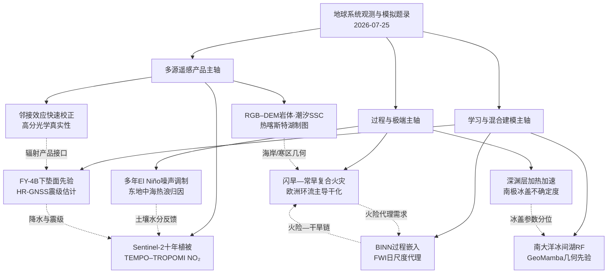
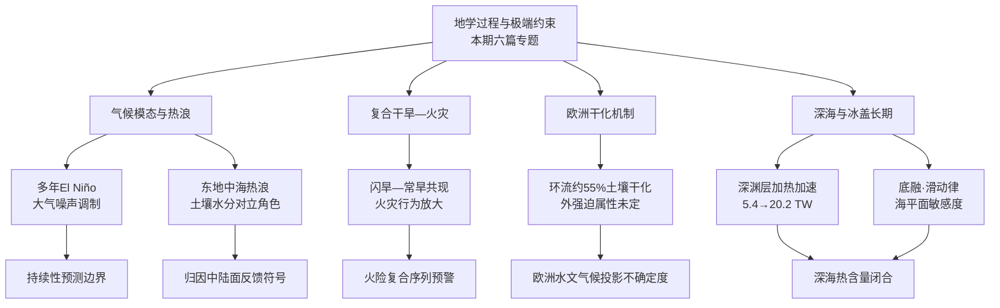
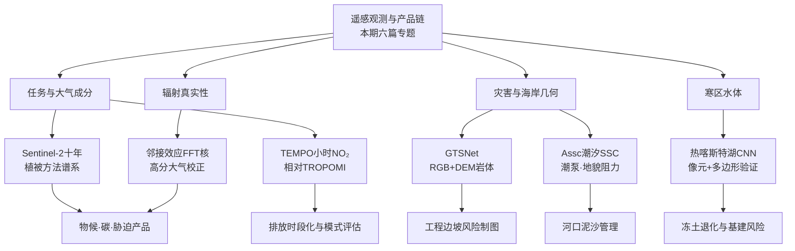
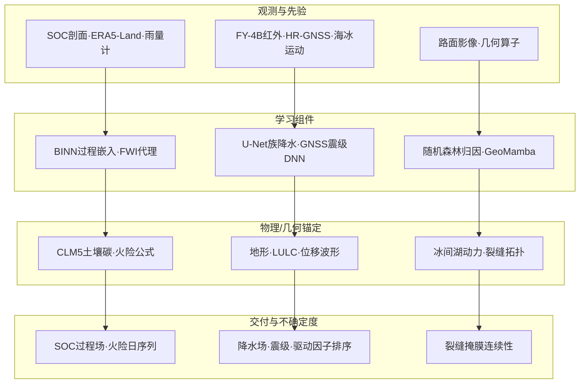
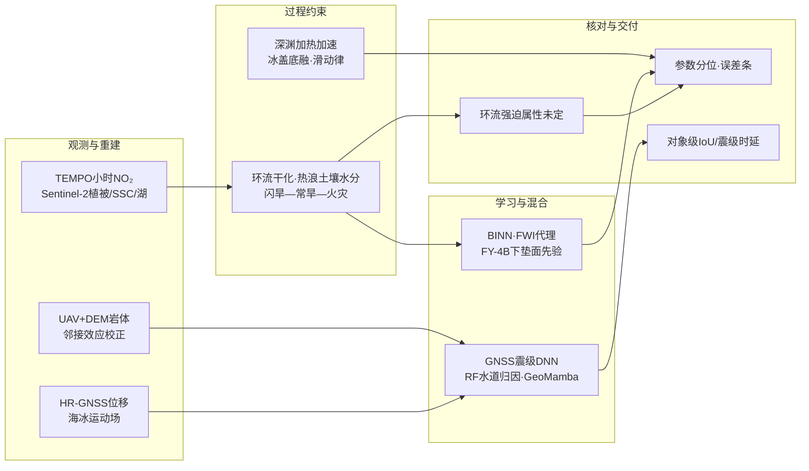

地学侧主要看多年 El Niño 的大气噪声调制、2024 年 6 月东地中海热浪归因里土壤水分的对立角色、闪旱与常旱共现如何抬升火灾行为、深渊层加热率加速、欧洲夏季干化中环流约占土壤水分下降 55%，以及南极冰盖至 2300 年及以后的参数与结构不确定度。遥感侧包括 Sentinel-2 十年植被监测综述、TEMPO 相对 TROPOMI 的对流层 NO₂ 日变化、UAV–DEM 不稳定岩体分割、潮汐悬沙不对称指数、青藏工程廊道热喀斯特湖，还有高分光学邻接效应的快速校正。人工智能侧则是嵌入 CLM5 的 BINN、火险天气指数的日尺度深度学习代理、带下垫面先验的 FY-4B 降水反演、近场高采样率 GNSS 震级估计、南大洋冰间水道的随机森林归因，以及几何先验注入的 Visual Mamba 裂缝分割。数字以摘要与 DOI 可核对处为准；摘要截断处不补造。

## 一、本期研究印记图

覆盖 ENSO 持续性与热浪归因、干旱—火灾复合、深海与南极冰盖、光学—大气成分—海岸与寒区制图，以及物理知情网络、气候指数代理和灾害早期预警。期刊以 *Nature*、*Science*、*Remote Sensing*、*Geophysical Research Letters*、*Nature Geoscience*、*The Cryosphere*、*Geoscientific Model Development*、*Journal of Geophysical Research: Atmospheres* 为主。本窗口开放获取统计为 0/414，主张仍以 DOI 与摘要为准。

欧洲夏旱与反气旋变频、闪旱加速燃料干燥、Deep Argo 收窄深渊热含量误差，这些在近年文献里并不新鲜；TEMPO 与 TROPOMI 的对照则给北美 NO₂ 日变化和排放时段化多了一扇窗。陆面过程方程嵌进神经网络、用日尺度气象代理瞬时火险、在红外降水里加 DEM/LULC，也在往“过程还能认出来、残差还能校准”的方向靠。这些只是读题录时的背景，具体数字以各篇画像为准。

读下来比较醒目的几处。欧洲夏季干化里，环流大约解释土壤水分下降的 55%、水汽压亏缺增加的 42%；东地中海热浪里，人为强迫与自然变率对土壤水分的作用符号相反；闪旱叠常旱则把火灾的蔓延、持续和面积一并推高。Sentinel-2 植被工作已从植被指数转向机器学习、混合辐射传输和多源融合；邻接效应 FFT 校正和 RGB–DEM 分割把辐射与地形语义绑在同一条处理链上。BINN 相对 PRODA 快五十倍以上，过程空间型相关约 0.86；火险代理去掉降水输入后极端分位仍站得住；Ridgecrest 上 HR-GNSS 网络大约 30 s 内把震级误差压到 0.15 以内。

## 二、地学方向专题画像

### 2.1 方向综述

地学六篇大致沿着气候模态持续性、极端事件归因、复合灾害，再到深海与冰盖长期演化往下读。Interactive Ensemble 耦合试验表明，温跃层相关大气噪声增强会使赤道暖水体积在首次 El Niño 峰值后泄放不充分，从而提高多年事件频率；随机充放电振荡器敏感性试验将更大的风应力噪声振幅与更高的多年 El Niño 频率系统关联。2024 年 6 月东地中海破纪录高温中，人为强迫约贡献温度异常一半，土壤干化经土壤水分—温度反馈放大热浪；自然变率一侧几乎全是异常反气旋（大于 90%），前期偏湿土壤反而带来轻微冷却，土壤水分在两个分量里符号相反。火灾方面，2002–2021 年全球卫星数据表明，闪旱先于或重叠常旱后再起火的序列，火灾往往蔓延更快、持续更久、面积更大。

欧洲干化与深海—冰盖一侧，被“推动”的环流模拟显示，自 1980 年代以来中纬欧洲夏季土壤水分下降约 55%、大气水汽压亏缺增加约 42% 可归因于环流变化，且更频繁的反气旋暖干型进一步放大热力学干化；若历史环流趋势部分来自外强迫，则环流驱动的干化或将延续，若主要为内部变率，则未来环流可能部分抵消热力学干化。深渊层（4000–6000 dbar）全球平均加热率由 1988 年的 5.4±4.9 TW 升至 2018 年的 20.2±3.9 TW，而深层（约 2000–4000 dbar）加热率变化不具统计显著性。南极冰盖 MPAS-Albany 配置在 ISMIP6-Antarctica-2300 框架下显示，冰架底融参数在 5–95 百分位之间可造成相对基线约 ±40% 的海平面贡献变化，线性底滑律相对非线性基线可削减海平面贡献 51%–73%，且 Amundsen 海湾在 2300 年后（SSP1-2.6）或更晚（控制试验）出现快速后退窗口。六篇合起来看，地学结论能不能搬到别处，往往取决于有没有同时交代环流强迫属性、陆面反馈符号、复合事件的时间结构，以及冰盖/深海参数和观测网的不确定度。

| 序号 | 论文简介（逐篇） | 对应画像小节 |
|------|------------------|--------------|
| G1 | Interactive Ensemble 与随机充放电振荡器试验揭示温跃层相关大气噪声增强抑制首次峰值后泄放，提高多年 El Niño 频率 | 2.2 |
| G7 | ERA5 与 HadGEM3-A-N216 归因显示 2024 年 6 月东地中海热浪中人为强迫与自然变率约各半，土壤水分角色符号相反 | 2.3 |
| G18 | 2002–2021 全球干旱—火灾数据表明闪旱与常旱共现序列产生蔓延更快、持续更久、面积更大的火灾 | 2.4 |
| G38 | 全深度 CTD 二阶多项式拟合显示深渊层加热率由 1988 年 5.4±4.9 TW 升至 2018 年 20.2±3.9 TW | 2.5 |
| G228 | 环流推动试验估计欧洲中纬夏季土壤水分下降约 55%、VPD 增加约 42% 由环流变化贡献，并放大热力学干化 | 2.6 |
| G17 | MPAS-Albany 南极冰盖 2300+ 集合显示底融参数 ±40% 量级海平面敏感度，滑动律结构可削减 51%–73% 贡献 | 2.7 |

### 2.2 专题画像：Atmospheric Noise Forcing Increases Multiyear El Niño Events

**（1）技术路线：Interactive Ensemble 耦合与随机充放电振荡器敏感性试验**

多年 El Niño 为何变多，机制仍不完整。作者采用 Interactive Ensemble（IE）耦合策略，在保留海洋动力框架的同时调控大气噪声强迫强度，以分离确定性海气耦合与随机风应力扰动对赤道暖水体积（warm-water volume）充放电循环的影响。分析聚焦首次 El Niño 峰值之后的泄放效率：当温跃层相关随机强迫增强时，赤道暖水体积泄放减弱，正充放电异常更易跨年持续，从而抬高次年再次发展暖事件的概率。为检验机制的可迁移性，作者进一步在随机充放电振荡器（Stochastic Recharge Oscillator）模型中开展敏感性试验，将诊断得到的风应力驱动大气噪声对温跃层深度异常的振幅参数与多年事件频率建立系统联系。做法上以“噪声振幅—泄放效率—跨年持续性”为主线，区别于仅强调平均态温跃层深度或季节相位锁定的传统解释。论文发表于 *Geophysical Research Letters*（DOI: 10.1029/2026gl123553）。

**（2）技术特点：噪声路径显式化、充放电持续性诊断与简化模型交叉验证**

与把多年 El Niño 归因于单一慢变模态或外部强迫趋势的叙事，该工作把大气噪声提升为可调制频率的关键因子。IE 试验允许在相同平均态耦合结构下改变随机强迫强度，从而把“噪声增强 → 首次峰值后泄放不足 → 正充放电残留 → 多年事件”写成可检验链条。随机充放电振荡器敏感性试验则提供低维对照：更大的噪声振幅参数与更高的多年事件频率呈系统关联，表明该路径不依赖特定复杂模式的参数化细节。仍要注意：摘要未给出完整的观测诊断振幅分位数或区域对比表，因而噪声路径的气候态相对贡献仍需在再分析与多模式集合中独立量化；IE 对大气噪声的构造方式亦可能影响结果对真实天气噪声谱的代表性。

**（3）重要结论：温跃层相关大气噪声增强可抬高多年 El Niño 频率**

该研究的重要结论是：**Interactive Ensemble 试验表明，温跃层相关大气噪声强迫增强会使赤道暖水体积在首次 El Niño 峰值后泄放不充分，从而提高正充放电跨年持续并发展为多年事件的可能性；随机充放电振荡器敏感性试验进一步显示，更大的风应力噪声振幅参数与更高的多年 El Niño 频率系统相关，揭示随机大气变率调制 El Niño 持续性的一条此前认识不足的路径。**

往下推一步，多年 El Niño 对全球降水、农业与灾害链具有累积冲击；若噪声路径在观测中可被稳健诊断，则季节到年际预测系统需并行评估噪声振幅的时变特征，而非仅依赖平均态充放电指标。后续宜在多模式 IE 与观测约束下量化该路径相对温跃层平均态、西风爆发与印度洋偶极子等因子的相对权重。

### 2.3 专题画像：Attribution of the Record‐Breaking June 2024 Eastern Mediterranean Heatwave: Contrasting Roles of Soil Moisture in Anthropogenic Forcing and Natural Variability

**（1）技术路线：ERA5 与 HadGEM3-A-N216 事件归因框架下的环流—土壤水分分解**

该研究针对 2024 年 6 月东地中海自 1960 年以来最热 6 月事件，使用 ERA5 再分析与 HadGEM3-A-N216 归因模拟，估计人为强迫与自然变率对温度异常的相对贡献，并显式分离大气环流与土壤水分的作用通道。人为强迫通道同时包含温室气体诱导的背景增温与土壤干化通过土壤水分—温度反馈对热浪的放大；自然变率通道则识别由上游波列驱动、并与北大西洋海温正异常相联系的异常反气旋，以及前期降水偏多导致的偏湿土壤所产生的冷却效应。该设计使“同一状态量（土壤水分）在不同归因分量中符号相反”成为可陈述的核心发现，而非被平均进单一陆面反馈系数。论文发表于 *Geophysical Research Letters*（DOI: 10.1029/2025gl121002）。

**（2）技术特点：约各半的强迫—变率分割、反气旋主导自然分量与土壤水分符号对立**

摘要估计人为强迫约贡献温度异常一半，其余一半归因于自然变率，其中异常反气旋贡献大于 90%。土壤水分在人为强迫分量中作为放大器出现，在自然变率分量中则因前期偏湿而产生轻微冷却，部分抵消环流诱导的升温。该对立角色表明，若仅报告区域平均土壤湿度异常而不区分归因分量，将掩盖“干化放大人为信号”与“偏湿抑制自然环流信号”的并行过程。方法边界包括：单模式归因框架对环流遥相关与海温强迫的结构性依赖，以及摘要未展开的多模式稳健性检验；对业务预警而言，需同时监测上游波列与前期土壤水分距平，而非单一热浪指数阈值。

**（3）重要结论：人为强迫与自然变率约各半，土壤水分角色符号相反**

该研究的重要结论是：**对 2024 年 6 月东地中海破纪录热浪，人为强迫约贡献温度异常一半（含温室气体增温与土壤干化反馈放大），自然变率约贡献另一半且由异常反气旋主导（大于 90%）；自然变率分量中前期偏湿土壤产生轻微冷却，与人为强迫分量中的土壤干化放大作用形成对立，表明该事件中土壤水分在不同归因通道中角色相反，偏湿土壤阻止了热浪进一步加剧。**

对应用侧而言，地中海热浪风险评估若忽略土壤水分在强迫与变率通道中的符号差异，将低估或高估陆面反馈的净效应。适应策略宜把土壤湿度监测与上游环流诊断并入同一预警链路，并在归因公报中分通道报告陆面状态。

### 2.4 专题画像：Co‐Occurring Flash and Standard Droughts Amplify Global Fire Behavior

**（1）技术路线：全球干旱—卫星火灾四类事件分层与统计稳健性检验**

闪旱（快速起旱、高温低湿强化）在变暖背景下增多，但对野火行为的影响此前不清楚。研究整合 2002–2021 年全球干旱与卫星火灾数据，将火灾划分为基线条件、仅闪旱、仅常旱，以及闪旱先于或重叠常旱后再起火的复合序列四类，比较蔓延速度、持续时间与过火面积等指标。统计分析检验区域与指标间差异的稳健性，并识别极端尾部事件在复合干旱条件下的富集。做法上强调“干旱时间结构”而非仅干旱强度，把快速起旱与持续干旱的序列组合作为火险评估的关键自变量。论文发表于 *Geophysical Research Letters*（DOI: 10.1029/2026gl123991）。**【外部背景】** 近年关于闪旱与生态影响、热—干并发抬升植被火概率的研究，为把复合干旱序列写入火险系统提供了领域语境，但不替代本篇全球分层统计结论。

**（2）技术特点：四类事件对照、跨区域一致放大与极端尾部富集**

若只比较“有旱/无旱”的二元框架，四类分层可区分闪旱独有的快速燃料干燥效应、常旱的持续水分亏缺，以及二者叠加后的非线性放大。摘要指出，在跨区域与多火灾指标上，复合干旱条件一致产生蔓延更快、持续更久、面积更大的火灾，且最极端事件富集于复合序列。该结果对火险天气指数与业务预警具有直接含义：仅监测季节尺度干旱指数，可能漏检闪旱触发后与常旱重叠的高风险窗口。摘要层面的限制是：卫星火灾产品对云遮挡、小火与管理火的探测偏差，以及闪旱定义对检测算法的敏感性（不同蒸发胁迫或根区湿度阈值可改变空间足迹），需在区域校验中显式报告。

**（3）重要结论：闪旱—常旱共现一致放大全球火灾行为**

该研究的重要结论是：**基于 2002–2021 年全球干旱与卫星火灾数据，闪旱先于或重叠常旱的复合干旱序列相较基线、仅闪旱或仅常旱条件，一致对应蔓延更快、持续更久、面积更大的火灾，且最极端事件富集于复合条件；统计差异跨区域与多指标稳健，表明火险评估与气候适应策略需显式纳入快速演变的干旱动力学。**

实际含义是：野火管理与再保险模型若仍以单一季节干旱指数驱动，将系统性低估复合序列下的蔓延与持续时间风险。后续宜与火险天气指数代理模型（见人工智能方向）耦合，检验日尺度代理能否捕捉闪旱起旱阶段的燃料湿度骤降。

### 2.5 专题画像：Observed Multi‐Decadal Acceleration of Globally Averaged Abyssal Ocean Warming

**（1）技术路线：全深度 CTD 空间分箱二阶多项式趋势率估计**

该研究针对深海与深渊层历史资料稀疏、既往全球尺度仅能估计多年代温度趋势的局限，利用自约 1970 年起的全深度 CTD 剖面、1990 年代首轮全球船基调查以及约 2016 年起 Deep Argo 区域试点阵列，在局地空间箱内对温度时间序列拟合二阶多项式，以估计多年代趋势率本身的时间变化。分析分别报告深渊层（4000–6000 dbar）与深层加热率及其不确定性，从而把“是否加速”从定性叙述推进为可给出置信区间的定量命题。论文发表于 *Geophysical Research Letters*（DOI: 10.1029/2026gl124104）。**【外部背景】** 既有 Deep Argo 与船基 CTD 融合研究已给出深渊层约 12.9±1.8 TW 量级的年代际热含量趋势估计，为理解本期“加速”结论的观测基础提供参照。

**（2）技术特点：趋势率的时间导数估计、深渊—深层分异与 Deep Argo 约束收窄**

二阶多项式拟合使加热率可随时间演化，而非假定常数趋势；深渊层加热率由 1988 年 5.4±4.9 TW 升至 2018 年 20.2±3.9 TW 且具统计显著性，而深层加热率在相应年份为 29.4±22.1 TW 与 25.0±17.5 TW，变化不显著。该分异提示南极底层水形成与深西边界流输运路径上的信号，与北大西洋深层水控制区的冷却斑块可能在全球平均中部分抵消深层信号。方法边界包括：早期稀疏采样对多项式曲率估计的杠杆效应，以及区域箱映射对南极边缘加速信号的空间平滑；完整空间型需结合 Deep Argo 加密后的填图产品解读。

该加速信号与南极底层水形成区及深西边界流通量变化的既有图像相一致，提示全球平均深渊层加热率上升并非单一海盆假象，而可能反映高纬深水形成与沿程输运的系统调整。与此同时，深层全球平均变化不显著，并不排除南大洋深层显著增温与北大西洋部分海域冷却并存的空间补偿。因此，在引用全球平均加热率时，宜同步给出区域填图与深度层分解，以免把深渊加速误读为整层深海均一加速。

**（3）重要结论：全球平均深渊层加热率在约三十年间显著加速**

该研究的重要结论是：**对全深度 CTD 剖面在局地空间箱内拟合二阶多项式显示，深渊层（4000–6000 dbar）全球平均加热率由 1988 年的 5.4±4.9 TW 显著升至 2018 年的 20.2±3.9 TW；同期深层加热率变化不具统计显著性（1988 年 29.4±22.1 TW，2018 年 25.0±17.5 TW），表明观测到的加速主要体现在深渊层而非深层全球平均。**

接下来更要紧的是，地球能量不平衡闭合高度依赖深海热含量；深渊层加速升温将抬升对南极底层水变化与海平面热膨胀贡献的关注优先级。业务与科研监测宜持续扩展 Deep Argo，并在能量预算中分深度层报告趋势率及其加速项。

该结论把深海热含量研究的焦点从“是否变暖”推进到“变暖是否加速、加速发生在哪一层”，为地球能量不平衡闭合与海平面热膨胀分量分解提供新的观测约束。后续工作应在 Deep Argo 持续加密条件下更新多项式拟合窗口，并检验早期稀疏采样对曲率估计的杠杆效应是否随资料增加而减弱。

### 2.6 专题画像：European summer drying largely driven by atmospheric circulation changes since the 1980s

**（1）技术路线：环流推动大气模式模拟分离动力与热力学干化分量**

欧洲近几十年干旱变多变强，环流位移和热力学增温—蒸发需求上升各自贡献多少，一直说不清。只靠观测相关很难分清因果，作者于是把观测环流“推动”（nudged）进大气模式，用来隔离环流诱导的水文气候变率与长期趋势。对照自由运行与环流约束试验，可以估出 1980 年以来中纬欧洲夏季土壤水分下降和水汽压亏缺增加里、有多少能归到环流，并看更频繁的反气旋暖干型是否顺带放大热力学干化。论文发表于 *Nature Geoscience*（DOI: 10.1038/s41561-026-02050-w）。公开报道与作者团队说法和摘要一致：环流变化大约能解释观测夏季土壤干化趋势的 55%。

**（2）技术特点：因果分离环流贡献、反气旋型放大热力学项与投影不确定度显式化**

摘要给出环流诱导效应约占中纬欧洲自 1980 年以来夏季土壤水分下降约 55%、大气水汽压亏缺增加约 42%，并证明与这些环流变化相联系的更频繁反气旋暖干条件会放大热力学干化分量。该结果把既往“干旱与环流型共变”的相关叙述推进为模式因果分解。同时，研究强调未来欧洲水文气候投影高度不确定，因为未来环流变化约束不足：若历史环流趋势部分外强迫，则环流驱动干化或将延续；若主要为内部变率，则未来环流倾向甚至可能部分抵消热力学干化。不宜外推过远之处在于：推动试验依赖再分析环流的质量，模式对陆面水文的结构误差仍进入土壤水分诊断；外强迫与内部变率的判别需结合大型集合与检测归因框架，本篇未给出最终判决。

**（3）重要结论：欧洲夏季干化约一半由环流变化驱动并放大热力学效应**

该研究的重要结论是：**环流推动试验表明，自 1980 年代以来中纬欧洲夏季土壤水分下降约 55%、大气水汽压亏缺增加约 42% 可由环流变化解释，且更频繁的反气旋暖干型天气放大热力学干化；由于未来环流变化约束不足，欧洲水文气候投影仍高度不确定——历史环流趋势若部分外强迫则干化或将延续，若主要为内部变率则环流可能转而部分抵消热力学干化。**

若落到业务或评估里，农业、水资源与能源系统对欧洲夏旱的适应规划，不宜把热力学增温外推为唯一确定路径，而应在情景中显式包络环流趋势的两种强迫属性。模式发展需优先改进对欧洲夏季环流长期趋势的再现能力，否则陆面干旱投影的置信度将被环流误差主导。

### 2.7 专题画像：Evolution of the Antarctic Ice Sheet from 2000–2300 and beyond: model sensitivity and uncertainty analysis using MPAS-Albany Land Ice

**（1）技术路线：ISMIP6-Antarctica-2300 配置、延拓积分与 GPU 集合方差分析**

该研究系统描述提交至 ISMIP6-Antarctica-2300 试验的 MPAS-Albany Land Ice 南极冰盖配置，并新增三组试验：强迫试验延拓至 2500（控制试验至 2775）；对底滑与冰架底融参数以及能量/应力平衡结构选择的敏感性分析；在 GPU 上运行的 72 成员集合与方差分析，以识别海平面贡献不确定性的主要来源。延拓积分用于捕捉 2300 年之后 Amundsen 海湾等地的快速后退窗口；参数扰动覆盖底融校准目标的 5–95 百分位；结构选择对照线性与非线性底滑律及不同滑动指数。论文发表于 *The Cryosphere*（DOI: 10.5194/tc-20-4061-2026）。

相对只提交标准 2300 年节点结果的单次积分，延拓试验专门用于捕捉临界后退可能出现在标准时间窗之外的情形；敏感性试验则把参数不确定性与模式结构选择分开扰动，避免将滑动律形式差异误归为单一参数标定误差。GPU 集合使数十成员的方差分解在可接受墙钟时间内完成，从而把“不确定度主源识别”落实为可重复的计算实验，而非定性列举。真正要回答的是：在给定强迫情景下，海平面贡献的尾部风险主要来自冰架底融、底滑律，还是能量/应力平衡结构。

**（2）技术特点：百年延拓揭示临界窗口、底融 ±40% 敏感度与滑动律结构主导差异**

摘要报告，SSP1-2.6 强迫下约 2300 年后、控制试验约 2500 年后出现以 Amundsen 海湾为主的快速后退；底融参数在 5–95 百分位间可导致相对基线约 ±40% 的海平面贡献变化；采用线性底滑律相对指数为 1/5 的非线性基线，海平面贡献减少 51%–73%；滑动指数取 1/3 与 1/10 时，至 2300 年总体差异约 10% 量级，但 Amundsen 区域对滑动指数呈强非线性依赖。72 成员集合的方差分析把参数与结构不确定性分解为可排序贡献源，为 ISMIP6 类多模式互比提供单模式内部不确定度基准。方法边界包括：强迫场与冰架融化参数化的外生不确定性未完全内生；摘要截断处未完整展开全部方差分量排序，区域细节应以全文为准。

**（3）重要结论：2300 年后快速后退窗口与滑动律—底融参数主导海平面不确定度**

该研究的重要结论是：**MPAS-Albany 南极冰盖在 ISMIP6-Antarctica-2300 及延拓试验中，于 SSP1-2.6 约 2300 年后与控制试验约 2500 年后出现以 Amundsen 海湾为主的快速后退；底融参数 5–95 百分位扰动可造成相对基线约 ±40% 的海平面贡献变化，线性底滑律相对非线性基线可削减 51%–73% 贡献，滑动指数在 Amundsen 区域呈强非线性敏感；GPU 72 成员集合方差分析用于识别投影不确定度主源。**

这一点的直接后果是：海平面情景若仅报告多模式均值而不分解单模式参数与结构选择，将低估 Amundsen 等关键扇区的尾部风险。冰盖—海洋耦合与观测同化需优先约束底融与滑动律，并把 2300 年后窗口纳入长期适应规划的时间视野。

## 三、遥感方向专题画像

### 3.1 方向综述

遥感六篇从 Sentinel-2 十年能力、TEMPO/TROPOMI 日变化，一路看到岩体、潮汐悬沙、热喀斯特湖和高分辐射校正。Sentinel-2 自 2015 年起以 10–20 m 分辨率、小于 5 天重访和红边/短波红外配置，把植被监测从粗分辨率绿度推到物候、生物量/碳和胁迫；Scopus 初检 1700 篇、筛选后 1097 篇的综述显示，2018 年后增速很快，方法也从植被指数挪向机器学习、混合辐射传输和多传感器融合，而且没有哪一种方法在所有目标和生态系统上稳赢。TEMPO 相对 TROPOMI，重叠时刻空间格局大体一致，但清洁区偏低、污染区略高，主因是空气质量因子（AMF）假设不同；换成几何 AMF 后星间差明显缩小。小时序列与地面大致同相位，振幅偏弱、晨间下降偏慢，并露出化学输送模式城市早晨偏低、午后偏高的时段偏差。

GTSNet 把 UAV 光学与 DEM 地形语义经多尺度 Topography-aware Fusion 注入分割网络，在中国七处高山峡谷水电工程区不稳定岩体数据集上取得 Acc 90.14%、F1 75.75%、IoU 60.97%，优于同输入设置下六种对照网络；Sentinel-2 结合 ACOLITE DSF 重建三门湾表层悬沙，并定义归一化悬沙浓度不对称指数 Assc，揭示深槽潮泵与潮滩地貌阻力的空间分异控制；青藏工程廊道 2020 年消融季 Sentinel-2 十六特征 CNN 制图热喀斯特湖，像元验证总体精度 98.04%、F1 97.18%，多边形验证 IoU 0.79。高分邻接效应的 FFT 加速核校正，在气溶胶光学厚度约 0.4 时相对实测 MAE 低于 0.006；1024×1024 影像、501 像元窗口跑完低于 4 s。合起来看，遥感结果要进业务，至少得说清：方法技巧是否随目标变量而变、星间差能不能追到 AMF 或辐射核，以及几何产品有没有像元和对象两级验证。

| 序号 | 论文简介（逐篇） | 对应画像小节 |
|------|------------------|--------------|
| R20 | 综述 Sentinel-2 十年植被监测：1097 篇筛选文献显示物候、生物量/碳与胁迫为主域，方法转向机器学习、混合辐射传输与多源融合 | 3.2 |
| R50 | TEMPO 与 TROPOMI 对流层 NO₂ 对照：重叠时刻格局一致但存在 AMF 驱动系统差；小时观测约束日变化与模式时段偏差 | 3.3 |
| R60 | GTSNet 融合 UAV RGB 与 DEM，地形感知多尺度融合分割不稳定岩体，Acc 90.14%、F1 75.75%、IoU 60.97% | 3.4 |
| R13 | Sentinel-2/ACOLITE 重建三门湾 SSC，提出 Assc 指数诊断大小潮与涨落潮不对称及潮泵—地貌阻力分异 | 3.5 |
| R379 | Sentinel-2 十六特征 CNN 制图青藏工程廊道 2020 年热喀斯特湖，像元 OA 98.04%，多边形 IoU 0.79 | 3.6 |
| R395 | FFT 加速邻接效应校正用于高分光学，AOD≈0.4 时 MAE 低于 0.006，1024²/501 窗口耗时低于 4 s | 3.7 |

### 3.2 专题画像：A Decade of Remote Sensing for Vegetation Monitoring with Sentinel-2

**（1）技术路线：Scopus 系统检索、主题筛选与方法谱系综合**

该综述以 Sentinel-2 自 2015 年发射以来在中等分辨率植被监测中的作用为对象，强调 10–20 m 空间分辨率、小于 5 天重访以及红边与短波红外波段配置如何把光学植被监测推进到超越粗分辨率绿度产品的阶段。技术路线采用系统 Scopus 检索（初检 1700 篇），经主题与方法学筛选保留 1097 篇，从物候与生长动态、生物量与碳估计、植被胁迫检测及方法发展等维度综合证据。分析同时刻画期刊与区域产出分布、云处理平台与和谐化产品对研究增长的支撑，以及方法由植被指数向机器学习、混合辐射传输与多传感器融合的迁移。论文发表于 *Remote Sensing*（DOI: 10.3390/rs18152448）。

**（2）技术特点：2018 年后指数增长、欧美亚主导与“无普适最优方法”结论**

综述显示 2018 年后 Sentinel-2 植被研究快速增长，反映其成为云平台支持下的主流数据源；产出集中于有限期刊与区域，欧洲与亚洲贡献突出，其他地区代表性不足。物候/生长、生物量/碳与胁迫分析构成三大应用域。跨主题的方法学迁移表明，不存在对所有目标变量与生态系统稳定最优的单一路径，性能依赖目标量、生态特征与观测不确定度处理方式。摘要亦指出不确定度量化与区域代表性等挑战仍存。该“条件依赖最优”的结论，对业务算法选型具有直接约束：基准测试必须按生态系统与目标变量分层，而非追求单一排行榜。

**（3）重要结论：Sentinel-2 重塑植被监测方法谱系但挑战仍存**

该研究的重要结论是：**在筛选后的 1097 篇文献证据下，Sentinel-2 通过中等分辨率、高重访与红边/SWIR 配置，推动植被物候、生物量/碳与胁迫的空间显式评估；2018 年后研究快速增长，方法由植被指数转向机器学习、混合辐射传输与多传感器融合，且无单一方法在所有情景下稳定最优；区域产出不平衡与不确定度处理等挑战仍然存在。**

后续若要接着做，该综述为全球植被产品算法路线图与能力建设优先级提供文献计量与方法学坐标，提示对代表性不足地区加大数据与样本投入，并把观测不确定度报告纳入产品规范，以避免把单一试验区精度外推为全球业务能力。

### 3.3 专题画像：Contrasting the TEMPO and TROPOMI Views of Tropospheric NO₂: Implications for Diurnal Variability and Model Evaluation

**（1）技术路线：重叠观测星间对照、几何 AMF 试验与 CAMx 日变化评估**

该研究评估北美静止轨道 TEMPO 对流层 NO₂ 反演相对极轨 TROPOMI 的一致性，并突出小时观测对亚日变化表征的附加价值。TEMPO 对北美各地可提供多达约 12 次每小时观测。技术路线包括：在时空重叠窗口比较两星空间格局与量级；诊断清洁区与污染区系统差并追溯至 AMF 假设（地表反照率、先验 NO₂ 廓线等）；对两数据集施加几何 AMF 以检验星间差是否缩小；将 TEMPO 日变化与地面 NO₂ 及 CAMx 模拟对照，识别模式在城市早晨与午后的时段偏差。论文发表于 *Journal of Geophysical Research: Atmospheres*（DOI: 10.1029/2026jd046905）。

该设计把“星间差是否来自真实大气场分歧”与“是否来自反演假设分歧”明确拆开：若几何 AMF 对齐后偏差大幅收缩，则后续融合产品应优先统一 AMF 输入，而非直接平均柱浓度。日变化评估则利用 TEMPO 的静止轨道优势，把一次过境的极轨快照扩展为可与排放时段化、边界层发展对照的连续曲线。对模式评价而言，重点不在总体偏差符号，而在早晨上升支与午后衰减支是否被正确再现，因为这两段直接关联交通与工业排放的时间分配及混合层增长。

**（2）技术特点：AMF 驱动系统差可解释、日变化振幅偏弱与模式时段偏差暴露**

重叠时刻 TEMPO 与 TROPOMI 空间一致性强，但 TEMPO 在清洁区偏低、污染区略高，主因 AMF 假设差异；几何 AMF 显著缩小星间差，表明相当部分偏差来自反演假设而非真实大气场分歧。TEMPO 揭示的柱浓度日变化大体追随地面观测，但振幅较弱、晨间下降较慢；在乡村地区可监测野火、土壤与长距离输送相关的 NO₂ 日变化。相对 CAMx，TEMPO 再现大部分时空变率，但午后更平坦的柱浓度行为与模式对比鲜明，模式低估城市早晨、高估傍晚 NO₂，指向 NOx 排放时段化或边界层演变表征偏差。方法边界包括：高太阳天顶角时段反演质量、云与气溶胶对小时序列的调制，以及单模式对照的普适性。

**（3）重要结论：TEMPO 小时 NO₂ 在星间一致基础上提供日变化与模式约束**

该研究的重要结论是：**TEMPO 与 TROPOMI 在重叠观测上空间格局总体一致，系统差主要由 AMF 假设驱动且可被几何 AMF 显著缩小；TEMPO 小时序列揭示与地面大致同位相但振幅偏弱、晨间下降偏慢的对流层 NO₂ 日变化，并能监测乡村野火、土壤与输送信号；与 CAMx 对照暴露模式低估城市早晨、高估傍晚 NO₂ 的时段偏差，为排放时段化与边界层过程评估提供观测约束。**

换句话说，北美空气质量预报与排放清单更新可优先吸纳 TEMPO 中午时段约束，并对早晨/傍晚反演偏差保持审慎；星间融合产品应在 AMF 假设对齐后再开展趋势分析。

该结论表明，静止轨道气溶胶—污染气体观测的增益不只是时间更密，还在于能检验排放时段化和边界层过程。业务上，清单同化可优先使用中午质量较稳的 TEMPO 场，并对高太阳天顶角时段单独设定权重；科研上，星间融合前应公开 AMF 假设差异诊断，以免把反演系统差写入长期趋势。

### 3.4 专题画像：GTSNet: A Global Topography-Aware Segmentation Network for Remote Sensing Identification of Unstable Rock Masses

**（1）技术路线：UAV 光学与 DEM 双模态、多尺度地形感知融合分割**

崎岖地形里做不稳定岩体分割，阴影、复杂背景和模糊边界很容易把纯光学模型打穿。作者提出 Global Topography-aware Segmentation Network（GTSNet），融合高分辨率无人机影像与 DEM，经多尺度 Topography-aware Fusion Module 将 DEM 派生地形语义注入光学特征建模，并以高阶地貌上下文自适应重标定低阶空间细节，以改善边界表达并抑制复杂背景干扰。实验数据来自中国七处高山峡谷水电工程区汇编的不稳定岩体数据集，对照六种同为 RGB+DEM 输入的语义分割网络。论文发表于 *Remote Sensing*（DOI: 10.3390/rs18152445）。

双模态设计的关键不在于简单堆叠通道，而在于让地形语义在多尺度上调制光学特征响应：在阴影与陡坡区，DEM 派生的坡度与起伏可抑制把暗色植被或水体误判为岩体的倾向；在岩体边界模糊区，高阶地貌上下文可帮助恢复连续轮廓。七处工程区汇编数据覆盖不同峡谷走向与日照几何，使网络在训练阶段即面对多样阴影形态。对照实验固定 RGB+DEM 输入，从而把性能差异归因于融合模块与网络结构，而非输入信息量不等。

**（2）技术特点：地形语义重标定、漏检—虚警平衡与工程区实测基准**

GTSNet 在 Acc 90.14%、F1 75.75%、IoU 60.97% 上优于对照网络，Precision 74.87% 与 Recall 76.66% 显示漏检与虚警更为平衡。地形感知融合把坡度、起伏等地貌上下文作为光学特征的门控信号，而非简单通道拼接，有助于区分阴影区岩体与暗色植被/水体。边界也很清楚：数据集集中于水电工程高山峡谷，向城市边坡或不同岩性区迁移需重新标注与域适应；DEM 分辨率与 UAV 配准误差将直接进入融合模块。

Precision 与 Recall 接近，表明模型未以牺牲某一端为代价追逐单一指标，这对工程巡检很实际：过高虚警会浪费复核资源，过高漏检则直接威胁边坡安全。地形感知融合相对通道拼接的优势，体现在能够按地貌上下文自适应调整局部特征权重，而不是对所有像元施加同一套光学判别边界。仍需指出，水电工程区岩体出露与人工开挖面并存，标签定义若混入工程开挖坡面，将影响“天然不稳定岩体”语义的纯度，迁移应用前应核对标注规范。

**（3）重要结论：RGB–DEM 地形感知融合提升不稳定岩体分割综合指标**

该研究的重要结论是：**GTSNet 通过多尺度地形感知融合将 DEM 语义注入 UAV 光学特征，在七处高山峡谷水电工程区数据集上取得 Acc 90.14%、F1 75.75%、IoU 60.97%，并在同 RGB+DEM 输入设置下优于六种对照分割网络，Precision/Recall 更为平衡，表明全局上下文与地形感知融合有助于改善复杂地形中不稳定岩体识别。**

往下推一步，该框架可为水电与交通边坡巡检提供可复现的双模态基线，后续宜开展跨工程区迁移测试，并把不确定性图写入巡检优先级排序。

该结论为复杂山地工程区的岩体灾害遥感识别提供了可复现基线，表明在光学信息受阴影与背景干扰时，把 DEM 作为语义门控而非仅作附加通道，能够同时改善边界完整性与漏检—虚警平衡。后续若与 InSAR 形变速率或降雨触发阈值联动，有望从“静态易发体识别”走向“动态风险排序”，但跨岩性与跨气候带的泛化仍需独立测试集支撑。

### 3.5 专题画像：Quantifying Tidal Asymmetry of Suspended Sediment Concentration in Macro-Tidal Embayments: A Sentinel-2 Based Framework

**（1）技术路线：ACOLITE DSF 悬沙反演与归一化不对称指数 Assc**

该研究以中国三门湾这类浅水强潮海湾为对象，利用 Sentinel-2 MSI 影像经 ACOLITE Dark Spectrum Fitting 大气校正重建表层悬沙浓度（SSC）空间分布，并引入归一化悬沙浓度不对称指数 Assc，定量诊断大小潮与涨落潮周期上的泥沙响应不对称。进一步通过定量趋势面拟合与分层回归，区分深基岩潮汐通道中的潮泵控制与潮滩/浅潮下带由地貌阻力调制、对微小水深变化高度敏感的动力机制。论文发表于 *Remote Sensing*（DOI: 10.3390/rs18152450）。

ACOLITE DSF 用于抑制沿海高气溶胶与浅水环境对水面反射率的干扰，使多时相 Sentinel-2 快照在辐射上尽可能可比。Assc 的构建把涨潮—落潮或大潮—小潮相位上的 SSC 差异归一化，从而在空间场上直接显示何处“涨潮输沙占优”、何处“落潮输沙占优”。趋势面与分层回归则把海湾按深槽、浅滩等水动力—地貌单元剖分，避免用单点潮位站结论代表全湾。该框架的目标是把离散过境影像转化为可支撑疏浚与湿地管理的连续诊断图层。

**（2）技术特点：离散卫星快照到连续动力诊断、双控制机制空间分异**

Assc 把多时相遥感快照转化为空间连续的潮汐不对称诊断场，使过程河口学中的潮泵与地貌阻力理论可与卫星观测对接。深槽与潮滩的空间分异结果表明，同一海湾内净输沙控制机制不可用单一断面结论外推。方法边界包括：光学反演对高浊度与浅水底质反射的敏感性、潮时采样对 Sentinel-2 过境相位的依赖，以及 Assc 阈值在不同海湾的可迁移标定。

光学遥感难以连续跟踪潮周期，但通过挑选覆盖不同潮时的影像集合并计算 Assc，仍可恢复不对称性的空间结构。深槽潮泵机制与潮滩地貌阻力机制并存，意味着净淤积格局对水深微小变化高度敏感的区域，在海平面上升或疏浚改变断面后可能首先发生输沙转向。方法上，Assc 对大气校正残差与悬浮物粒径假设敏感，业务使用时应同步给出 SSC 反演不确定度，并避免在云影与太阳耀斑污染像元上解释不对称信号。

**（3）重要结论：Sentinel-2 框架揭示强潮海湾悬沙潮汐不对称的双控制机制**

该研究的重要结论是：**基于 Sentinel-2/ACOLITE 重建的三门湾表层 SSC 与归一化不对称指数 Assc，可诊断大小潮与涨落潮尺度上的泥沙响应不对称，并揭示深基岩通道以潮泵为主、潮滩与浅潮下带受地貌阻力调制且对微小水深变化高度敏感的空间分异双控制机制，也为强潮海湾的海岸工程和生态管理提供可复现的遥感诊断。**

对应用侧而言，航道疏浚、湿地保护与污染物输运评估可借助 Assc 场识别净淤积/冲刷优势区；后续宜与现场 ADCP/浊度链同步，量化光学 SSC 不确定度向不对称指数的传播。

该结论表明，强潮海湾的泥沙管理不能依赖单一“全湾平均涨落潮优势”指标，而需按深槽—潮滩分异制图。Assc 图层可直接服务于航道维护周期选择与生态补沙方案比选；若进一步与现场浊度链和三维泥沙模式耦合，可检验遥感不对称指数对净通量方向的指示技巧，并量化光学反演误差的传播。

### 3.6 专题画像：Mapping Thermokarst Lakes Using Sentinel-2 Imagery in the Qinghai–Tibet Engineering Corridor in 2020

**（1）技术路线：十六特征数据集与 CNN—传统机器学习对照及双重验证**

青藏工程廊道要摸清热喀斯特湖分布，难点在于中等分辨率影像上湖泊偏小破碎、季节变化大且与湿地、阴影及其他水体光谱混淆。作者以 2020 年消融季 Sentinel-2 构建融合光谱、水体指数、纹理与地形变量的十六特征数据集，比较卷积神经网络与五种传统机器学习分类器；像元验证之外，采用吉林一号目视解译多边形独立验证。论文发表于 *Remote Sensing*（DOI: 10.3390/rs18142414）。

十六特征同时纳入光谱、水体指数、纹理与地形，旨在缓解热喀斯特湖与湿地、阴影、融雪斑的光谱混淆。CNN 与传统分类器在同一特征集上对照，使架构差异可被分离；像元验证衡量分类器判别力，吉林一号多边形验证则检验对象级边界与面积是否满足工程制图需求。消融季影像选择对应湖泊最大暴露窗口，有利于提高小湖可探测性，但也意味着结果代表季节峰值而非年平均状态，解释时需注明物候相位。

**（2）技术特点：CNN 抑制椒盐噪声、SHAP 归因分异与冻土环境协同分布**

像元验证中 CNN 总体精度 98.04%、F1 97.18%；多边形验证 IoU 0.79，漏检率 0.15、虚警率 0.09。CNN 更有效抑制椒盐噪声、减少破碎锯齿边界并提升水体空间连续性。SHAP 显示 CNN 预测与水体指数及纹理关联更强，而随机森林更依赖近红外与短波红外波段。热喀斯特湖在高含冰量、缓坡、较厚活动层与较高年平均地温区域面积占比与密度更高，与冻土退化物理预期一致。方法边界：单年消融季快照对季节极值敏感；工程廊道样本向青藏高原腹地迁移需警惕域偏移。

CNN 在空间上的卷积归纳偏置有助于输出连通水体斑块，减少传统像元分类常见的椒盐噪声，这对后续面积统计与密度制图很要紧。SHAP 归因显示不同模型依赖不同特征族，提示“高精度”背后机制并不唯一，业务迁移时应检查目标区主导特征是否仍为水体指数与纹理。湖泊更倾向于高含冰量、缓坡、厚活动层与较高地温区的分布格局，与热喀斯特发育的物理条件相符，可为走廊工程选线中的冻土风险分区提供旁证，但仍属空间相关而非严格因果。

**（3）重要结论：CNN 十六特征制图在像元与多边形双重验证下可靠刻画热喀斯特湖**

该研究的重要结论是：**在青藏工程廊道 2020 年消融季 Sentinel-2 十六特征框架下，CNN 像元验证 OA 98.04%、F1 97.18%，吉林一号多边形验证 IoU 0.79（漏检 0.15、虚警 0.09），较传统机器学习更好抑制破碎噪声并保持岸线连续；湖泊面积占比与密度在高含冰量、缓坡、厚活动层与较高地温区更高，为冻土退化与基建风险监测提供空间基线。**

实际含义是：该清单可支撑廊道工程地质评估与冻土碳—水文过程研究；后续应扩展多年时序以分离气候与工程扰动贡献。

该结论为青藏工程廊道提供了 2020 年可复核的热喀斯特湖基线，双重验证降低了仅依赖像元精度而忽视对象形态误差的风险。后续若扩展为多年时序，可区分气候暖湿波动与线性工程热扰动的相对贡献，并把湖泊扩张速率纳入路基与管线维护的预警指标；跨盆地迁移时则需重新评估阴影几何与湿地光谱混淆结构。

### 3.7 专题画像：A Fast Adjacency Effect Correction Algorithm for High-Spatial-Resolution Optical Satellite Imagery

**（1）技术路线：双向加权 APSF 核、有限窗截断补偿与 FFT 卷积加速**

该研究针对高空间分辨率光学影像大气校正中邻接效应（AE）突出、传统大气点扩散函数（APSF）方法依赖简单局地平均或距离加权背景近似、在高度异质场景不足且计算昂贵的问题，提出结合向内与向上加权核、并将局地反射率约束纳入环境反射率估计的快速算法。无限域积分被改写为带截断补偿的有限窗计算，经快速傅里叶变换（FFT）卷积加速，再以少量迭代完成反射率反演。验证使用高分二号全色影像，并在多景高分二号与高分多模数据上扩展试验。论文发表于 *Remote Sensing*（DOI: 10.3390/rs18142394）。

传统邻接效应校正在高度异质城镇与海岸场景中，常因环境反射率估计过于平滑而低估亮暗对比边界处的交叉辐射。本方法通过向内与向上加权核，并引入局地反射率约束，使环境反射率估计更能反映真实背景亮度结构。有限窗截断补偿保证与无限域积分的等价性不因窗口截断而系统性偏离，FFT 卷积则把计算复杂度从窗口尺寸的二次增长中解放出来，使大窗口高质量校正在业务时延内可执行。

**（2）技术特点：异质场景 AE 强度表征、MAE低于0.006 与秒级计算**

在气溶胶光学厚度约 0.4 时，该方法相对实测取得对比方法中最优表现，MAE 低于 0.006，清晰度与对比度约提升 99.0% 与 97.9%，NIIRS 提升超过 0.3；对 1024×1024 影像、501 像元 AE 窗口直径，运行时间低于 4 s，且 FFT 避免直接空域卷积对窗口尺寸的二次依赖。技术要点在于以核加权形式保留环境反射率估计的同时完成有限窗等价，使业务化高分预处理可在可接受时延内完成。方法边界：极端气溶胶或复杂云影场景的外推、多光谱各通道核参数一致性，需在更多传感器上验证。

在气溶胶光学厚度约 0.4 的验证条件下，相对地面实测的平均绝对误差低于 0.006，同时清晰度与对比度接近倍增、NIIRS 提升超过 0.3，校正既改善辐射定量，也抬高目视解译潜力。对 1024×1024 影像、直径 501 像元窗口，耗时低于 4 秒，使归档数据批量重处理与应急快反可以共用同一算法。多景高分二号与高分多模扩展试验用于检验传感器与场景迁移性，但极端沙尘或厚烟条件下的核参数是否需自适应，仍有待专项评估。

**（3）重要结论：FFT 加速邻接效应校正在精度与效率上同时改善高分光学产品**

该研究的重要结论是：**所提双向加权核与局地反射率约束的邻接效应校正，经有限窗截断补偿与 FFT 卷积，在 AOD≈0.4 的高分二号全色验证中取得 MAE 低于 0.006、清晰度/对比度大幅提升与 NIIRS 增幅超过 0.3，并在 1024×1024、501 像元窗口下于 4 s 内完成，显著低于既往 APSF 类方法耗时，为高分光学大气校正业务链提供可部署算法。**

接下来更要紧的是，城市与海岸等高异质地表的定量遥感依赖 AE 校正质量；秒级算法使批量归档重处理与近实时应急制图成为可行。后续宜与地表反射率真值网及交叉定标任务联动，建立多气溶胶条件下的不确定度查找表。

## 四、人工智能方向专题画像

### 4.1 方向综述

人工智能六篇大致落在四块：过程方程能否嵌进网络、气候指数能否用日尺度代理、卫星反演要不要加下垫面先验、灾害信号能不能近实时给出。具体包括：土壤有机碳的生物地球化学知情网络（BINN）、伊比利亚半岛火险天气指数的深度学习日尺度代理、融合 DEM/LULC 的 FY-4B 降水反演、近场高采样率 GNSS 深度震级估计、南大洋冬季冰间水道与冰间湖驱动因子的随机森林归因，以及几何先验注入的可变形 Visual Mamba 路面裂缝分割。定量改进均来自各摘要：BINN 与 PRODA 过程空间型平均相关系数约 0.86，计算效率提升逾 50 倍；火险代理在空间精度、时序保持与极端火险识别上显著优于传统日聚合 Proxy，且可在排除降水输入时仍维持极端分位技巧；GTSNet/GeoMamba 等分割网络给出明确 mIoU/F1；HR-GNSS 网络在 Ridgecrest 序列约 30 s 内将震级误差控制在 0.15 以内。约束同样明确：ERA5-Land 训练的火险代理不以地面真值为目标；降水反演中 DEM 与 LULC 简单拼接未必增益；震级模型在复杂多断层场景依赖预定义断层邻域；随机森林归因不替代动力因果。放到地学—遥感交叉里看，这些工作更像在问：过程还能不能认出来、哪些输入可以删、时延能不能写进指标。

| 序号 | 论文简介（逐篇） | 对应画像小节 |
|------|------------------|--------------|
| A35 | BINN v1.0 将向量化 CLM5 土壤碳过程嵌入神经网络，25925 条美国 SOC 剖面上与 PRODA 过程空间型相关约 0.86，效率提升超过50倍 | 4.2 |
| A163 | 深度学习以日尺度输入代理伊比利亚参考 FWI，相对 Proxy 改善空间/时序/极端技巧，降水可剔除且极端分位仍稳健 | 4.3 |
| A385 | FY-4B 多通道红外+CTT 降水反演比较四类 U-Net 变体，显式评估 DEM/地形/LULC 先验；轻量与深层网络分别敏感离散 LULC 与连续地形 | 4.4 |
| A152 | 模拟破裂波形训练的深度学习模型基于近场 HR-GNSS 位移估计震级，Ridgecrest 约 30 s 内误差低于0.15 | 4.5 |
| A314 | 随机森林+置换重要度解析南大洋冬季冰间水道/沿岸冰间湖驱动，泛南极 r=0.70，纬向风等五因子约占 68% 重要度 | 4.6 |
| A4 | GeoMamba 以多尺度可变形状态空间扫描与 Sobel/Laplace 几何先验门控跳跃连接分割裂缝，DeepCrack mIoU 83.79%、F1 89.27% | 4.7 |

### 4.2 专题画像：Biogeochemistry-Informed Neural Network (BINN v1.0) for improving accuracy of model prediction and scientific understanding of soil organic carbon storage

**（1）技术路线：向量化 CLM5 土壤碳过程嵌入神经网络与参数恢复试验**

BINN v1.0 面向从大数据中提取土壤有机碳（SOC）贮存机制知识的挑战，将 Community Land Model 第 5 版（CLM5）土壤碳循环过程向量化并无缝嵌入神经网络结构，使网络前向计算同时满足过程方程约束。技术路线包括：在合成数据上开展参数恢复试验以验证可辨识性；引入 Monte Carlo dropout 生成参数后验以量化不确定度；在美国本土 25925 条观测 SOC 剖面上推断调节土壤碳循环的六大过程分量，并与基于贝叶斯推断的 PRODA（PROcess-guided deep learning and DAta-driven modeling）结果对照。论文发表于 *Geoscientific Model Development*（DOI: 10.5194/gmd-19-6777-2026）。

与把过程模式仅作标签生成器或后处理约束的浅层耦合不同，BINN 将 CLM5 土壤碳过程写成可向量化、可与神经网络层交错执行的计算图，使梯度能够同时更新数据驱动参数与过程相关参数。合成数据上的参数恢复试验用于证明在理想可辨识条件下网络不会陷入不可逆混叠；真实剖面推断则检验该方法在观测噪声与空间异质性下是否仍能给出与贝叶斯路径一致的过程空间型。MC dropout 提供近似后验，使参数场可带不确定度交付。

**（2）技术特点：过程可识别、与 PRODA 空间型一致及数量级效率增益**

BINN 与 PRODA 检索的过程空间型平均相关系数约 0.86，表明其捕获机制知识的能力与既有贝叶斯路径一致；同时计算效率提升超过 50 倍，使大陆尺度参数场推断更易迭代。MC dropout 后验为参数提供可报告不确定度，区别于点估计黑箱映射。仍要注意：过程嵌入深度依赖 CLM5 结构假设，缺失过程不会被网络自动“创造”；美国本土训练向全球迁移需重新评估剖面代表性与气候空间覆盖。

平均相关系数约 0.86 表明，BINN 并非以牺牲机制可解释性换取速度，而是在统计上逼近 PRODA 的过程格局；超过 50 倍的效率提升则使全国尺度反复试验、交叉验证与情景扰动成为常规操作。对碳监测与陆面模式校准而言，这意味着可以把“大数据约束过程参数”从少数示范流域扩展到大陆尺度网格。需要保持审慎的是：一致性度量针对过程空间型而非站点通量技巧，通量塔与土壤呼吸观测的独立检验仍是必要闭环。

**（3）重要结论：BINN 在保持机制一致性的同时大幅提升 SOC 过程推断效率**

该研究的重要结论是：**BINN v1.0 将向量化 CLM5 土壤碳过程嵌入神经网络，在参数恢复试验中表现高准确度，并通过 MC dropout 量化参数不确定度；在 25925 条美国 SOC 剖面上推断的六大土壤碳过程空间型与 PRODA 平均相关约 0.86，计算效率提升超过 50 倍，表明该框架可在保持机制可解释性的同时显著加速大尺度土壤碳循环理解。**

若落到业务或评估里，BINN 为地球系统模式参数校准与碳监测提供了可扩展的过程知情学习模板，后续可迁移至其他生物地球化学模块，并以独立通量观测检验过程场的外推效力。

该结论把物理知情学习从概念验证推进到可扩展的土壤碳过程推断工具，为地球系统模式中土壤碳模块的区域化参数提供高效路径。后续若在其他国家土壤剖面库与不同陆面模式结构上重复实验，可检验过程嵌入接口的可移植性；若结合遥感植被与气象驱动的时变约束，还有望从静态 SOC 格局推断走向动态碳通量约束。

### 4.3 专题画像：Deep Learning Emulation of Multivariate Climate Indices: A Case Study of the Fire Weather Index in the Iberian Peninsula

**（1）技术路线：日尺度输入深度学习代理参考 FWI 并对照 Proxy**

火险天气指数（FWI）综合正午气温、相对湿度、风速与降水等近地面变量，但气候投影库常缺乏瞬时正午场，业务上多用日聚合量代入同一公式形成 Proxy，已知在极端与时序动态上存在局限。该研究在以地中海气候为主、火险突出的伊比利亚半岛，训练深度学习模型仅用日尺度输入代理参考 FWI，数据采用 ERA5-Land 以保持受控互比；目标不是对地面观测验证 FWI，而是评估深度学习相对 Proxy 再现参考 FWI 的能力。论文发表于 *Natural Hazards and Earth System Sciences*（DOI: 10.5194/nhess-26-3417-2026）。

参考 FWI 通常需要正午瞬时气象场，而气候模式输出与许多再分析产品更易提供日最高/平均气温、日降水等聚合量。传统做法是把聚合量直接代入 FWI 公式形成 Proxy，但会平滑极端火险的峰值与快速起伏。本工作以同一 ERA5-Land 数据源构造参考 FWI 与日尺度输入，训练深度学习映射，从而在输入信息受限的前提下比较“公式 Proxy”与“学习代理”的相对技巧，避免把数据源差异误认为方法差异。

**（2）技术特点：极端分位保持、时序保真与降水可剔除的稳健性**

结果显示，相对对应 Proxy，深度学习在空间精度、时序保持与极端火险事件识别上均有实质改进。输入变量消融表明，降水可被剔除而不显著损害精度——尤其在分布上尾——这对气候模式降水偏差大的情景很有用。方法边界：ERA5-Land 非观测真值，代理技巧不自动等价于真实火险技巧；伊比利亚训练向其他气候型迁移需重新标定。

对火险应用而言，分布上尾（极端危险日）的识别往往比平均误差更关键；深度学习在极端事件检测上的改进，意味着代理输出更适合驱动阈值预警。时序保真则保证火险指数的持续性与间歇性不被日聚合公式扭曲。降水可剔除仍保持极端分位技巧，直接回应气候模式降水偏差大的痛点：在投影应用中可降低对不可靠降水场的依赖。必须强调，该稳健性成立于 ERA5-Land 受控互比，外推到真实观测火险时仍需地面检验。

**（3）重要结论：日尺度深度学习代理显著优于 Proxy 并可弱化对降水的依赖**

该研究的重要结论是：**在伊比利亚半岛 ERA5-Land 受控试验中，深度学习以日尺度输入代理参考 FWI，相对传统日聚合 Proxy 在空间精度、时序保真与极端火险识别上显著改进；消融显示降水可剔除而极端分位技巧仍大体保持，从而提升 FWI 在缺乏正午瞬时场或降水不可靠的气候投影情景中的可用性。**

这一点的直接后果是：该代理可与闪旱—常旱复合火灾诊断衔接，为气候情景下的火险评估提供可计算接口；业务部署仍需以独立地面火险与过火面积记录作外样本检验。

该结论为在气候投影与缺乏正午场的数据环境中计算可用火险指数提供了方法选项，尤其利于与闪旱快速起旱阶段的燃料干燥诊断衔接。业务转化下一步应在独立火场与站点气象上评估代理误差的季节与区域结构，并明确拒绝外推的气候型范围，以免把受控互比优势误认为普遍火险预报技巧。

### 4.4 专题画像：Improving FY-4B Satellite Precipitation Retrieval over Coastal Complex Terrain of Eastern China: Deep Learning Approaches with Multi-Source Underlying Surface Data

**（1）技术路线：四类 U-Net 变体统一框架下评估下垫面先验贡献**

该研究提出基于风云四号 B 星（FY-4B）多通道红外亮温与云顶温度（CTT）的深度学习降水反演框架，系统比较 DS-UNet、SmaAt-UNet、U-Net 与 Attention U-Net，并在统一框架内显式评估 DEM、坡度/粗糙度及土地利用/覆被（LULC）等下垫面信息对反演的贡献，验证对照 IMERG 与雨量计。与既往主要强调云顶特征的 FY-4B/深度学习研究不同，本工作把下垫面先验作为一等实验因子。论文发表于 *Remote Sensing*（DOI: 10.3390/rs18142397）。

统一框架意味着除网络结构与是否加入 DEM/LULC 等因子外，训练样本、损失与验证协议保持一致，从而避免“不同论文不同设定”导致的先验贡献不可比。研究区选在中国东部海岸复杂地形，红外亮温—降水关系受海陆风、地形抬升与下垫面热力差异共同影响，恰好适合检验云顶信息之外的地表先验是否必要。对照 IMERG 与雨量计，分别提供面状与点状两套参考，有助于识别模式是否仅拟合某一参考源的偏差结构。

**（2）技术特点：轻量网络敏感离散 LULC、深层网络编码连续地形、简单拼接未必增益**

结果表明，引入下垫面信息可改善降水探测；架构强烈调制增益——轻量模型对离散 LULC 边界更敏感从而提供更清晰空间约束，深层模型更有效编码连续地形梯度。DEM 与 LULC 简单组合未必提升技巧，或与热力强迫及空间尺度错配有关；多因子协同引入更有助于缓解冲突。方法边界：复杂海岸地形样本的代表性、红外反演固有的暖云/冷云歧义，以及 IMERG 本身误差对“真值”的污染。

该分化结果表明，下垫面先验不是“加得越多越好”，而需与网络感受野与特征层级匹配：轻量网络更依赖清晰的类别边界提供空间约束，深层网络则更能吸收缓变地形梯度。DEM 与 LULC 冲突时，可能引入相互矛盾的空间模态，反而损害泛化。对业务算法选型，这意味着应先做因子—架构交叉试验，再固化输入清单，而不是固定网络后盲目堆叠地理图层。

**（3）重要结论：下垫面先验与网络容量匹配决定 FY-4B 降水反演增益**

该研究的重要结论是：**在 FY-4B 红外+CTT 深度学习降水反演统一框架下，融入 DEM、地形因子与 LULC 可改善降水探测；轻量 U-Net 变体更受益于离散 LULC 约束，深层变体更受益于连续地形梯度，而 DEM 与 LULC 简单拼接未必增益，多因子协同更有效，表明海岸复杂地形降水监测需将下垫面先验与模型容量匹配设计。**

后续若要接着做，该结论为静止轨道红外降水业务算法提供可操作的先验选型指南，后续宜在台风与梅雨等不同降水型上分层报告技巧。

该结论对静止轨道红外降水业务化具有直接操作含义：在海岸与复杂地形区，地表先验应作为标准实验维度写入算法评估表，并按降水型（对流/层状）与季节分层报告。后续可探索物理约束损失（如地形强迫抬升倾向）与注意力门控，使 DEM/LULC 以可解释方式进入解码，而非通道级硬拼接。

### 4.5 专题画像：Rapid Strong Earthquake Magnitude Estimation Based on Near-Field High-Rate GNSS Data Using Deep Learning

**（1）技术路线：大规模模拟破裂波形训练的近场 HR-GNSS 震级网络**

强震近场宽频带地震仪易削波，有限 P 波窗导致震级显著低估。高采样率 GNSS（HR-GNSS）直接记录地表位移，可规避削波。该研究通过模拟大量地震破裂及其 HR-GNSS 位移波形训练深度学习模型，实现近实时震级估计：单断层情景下对中等以上地震（Mw 6.3+）表现高准确度；多断层情景下无需先验震源位置，即可基于预定义断层附近的 GNSS 位移波形快速估计重大地震（Mw 7.0+）震级。论文发表于 *Remote Sensing*（DOI: 10.3390/rs18152444）。

模拟破裂库的规模与多样性决定模型能否覆盖不同震级、机制与台站几何；将位移波形直接作为输入，使网络学习与峰值位移回归不同的非线性特征组合。单断层与多断层情景分开评估，旨在检验在复杂破裂与无需精确震源定位条件下的可用性，这更接近真实强震早期的信息状态。与依赖未削波 P 波振幅的传统方法相比，HR-GNSS 路径在近场大位移阶段仍保持线性测量优势。

**（2）技术特点：约 30 s 收敛、误差低于0.15 及相对 Pd/回归基线的时延优势**

在 2019 年 Ridgecrest 序列测试中，约 30 s 内估计震级稳定接近实际，误差小于 0.15 个震级单位，相对基于宽频带地震波的峰值位移（Pd）方法与 HR-GNSS 回归方法具有时效与精度优势。方法边界：多断层情景对预定义断层几何的依赖、模拟破裂库对真实复杂破裂的覆盖度，以及台网密度不足区域的外推风险。

约半分钟量级给出稳定震级，对预警广播、工业急停与海啸初判的时间预算具有实际意义；误差小于 0.15 个震级单位表明在 Ridgecrest 测试条件下已达可用精度带。相对 Pd 方法，其优势在于规避近场削波；相对简单 HR-GNSS 回归，深度网络更能利用波形形态信息。局限在于测试事件有限，且多断层情景对预定义断层位置的依赖可能在盲断层事件中削弱性能，需在更多地震上扩充检验。

**（3）重要结论：HR-GNSS 深度学习可在半分钟量级给出可用强震震级**

该研究的重要结论是：**基于大量模拟破裂 HR-GNSS 波形训练的深度学习模型，可在近场位移约束下近实时估计震级；Ridgecrest 序列测试显示约 30 s 内估计稳定且误差小于 0.15 个震级单位，相对传统 Pd 与 HR-GNSS 回归方法在时效与精度上更具优势，为中强震应急响应提供可部署路径。**

换句话说，该技术可嵌入地震早期预警与海啸初判链路，与光学灾损实例评估形成“震源参数—工程影响”闭环；业务化仍需多事件、多台网密度的独立演练。

该结论显示，GNSS 高采样率数据与深度学习结合，可在强震近场提供与地震学路径互补的震级通道，尤其适用于宽频带仪器饱和的情形。若与光学灾损快速评估、烈度场模拟联动，有望缩短从“发生大震”到“定量影响预估”的链路；业务化前仍需多台网、多震级段的盲测与失败案例分析。

### 4.6 专题画像：Investigating the drivers of wintertime Southern Ocean sea-ice leads using random forest algorithms

**（1）技术路线：九预测因子随机森林回归与置换重要度区域分解**

海冰水道与沿岸冰间湖调控海—气能量交换，但其在南大洋的主导驱动因子此前缺乏定量排序。该研究对 2003–2023 年冬季（4–9 月）采用随机森林回归结合置换重要度，整合风速、纬向/经向风、风散度、海平面气压、表层流速、冰速、冰散度及月份等九类预测因子，在泛南极与分区尺度识别主控因子，并开展沿岸带专项分析。论文发表于 *The Cryosphere*（DOI: 10.5194/tc-20-4017-2026）。

预测因子覆盖大气动力、海洋表层与海冰运动学，并加入月份以吸收季节基线，使模型在冬季半年度内仍能区分早冬与晚冬背景。置换重要度通过打乱单因子后观测技巧下降来排序贡献，相对杂质重要性更稳健于共线。泛南极与扇区、沿岸距离带的分层评估，用于揭示“全域平均重要度”可能掩盖的区域机制差异，避免把单一主控因子错误推广到所有海盆。

**（2）技术特点：泛南极 r=0.70、五因子约占 68% 重要度与扇区分异**

独立测试集上泛南极相关系数 r=0.70，分区 r=0.63–0.82。纬向风（17.7%）、流速（13.9%）、风速（12.9%）、经向风（12.2%）与冰散度（11.2%）合计约占置换重要度 68%。Weddell 海主控为纬向风与海流，印度洋与太平洋扇区更受风向强迫，Bellingshausen–Amundsen 受海流与经向风影响；沿岸 0–50 km 带流速占主导。方法边界：随机森林揭示统计关联而非严格动力因果；再分析风场与海冰产品误差将进入重要度排序。

中等偏高的相关水平表明，冬季水道变率的大部分统计结构可由风—流—冰运动变量解释，但仍有约三成以上变率落在未纳入因子或非线性相互作用中。扇区分异与南大洋各海盆环流及海冰输出路径差异相符：例如 Weddell 海对纬向风与海流更敏感，而太平洋扇区更受风向强迫。沿岸带流速主导，提示近岸冰间湖监测应优先保证海流与潮汐余流产品的质量。解释时须避免把重要度直接等同于动力因果强度。

**（3）重要结论：风—流—冰运动因子主导南大洋冬季水道变率且扇区分异显著**

该研究的重要结论是：**2003–2023 年南大洋冬季冰间水道/沿岸冰间湖的随机森林模型在泛南极取得 r=0.70，纬向风、流速、风速、经向风与冰散度合计约占置换重要度 68%，并呈现清晰扇区与沿岸距离分异，从而为海冰动力过程诊断与模式评估提供可定量的驱动因子排序。**

往下推一步，海冰模式验证可按扇区对照上述因子敏感性；与深渊层加热加速研究并读时，水道/冰间湖介导的海气热交换变化构成潜在联系环节，但仍需动力诊断确认。

该结论为海冰模式的过程评估提供了可对照的观测统计靶标：模式若无法再现扇区特异的风—流敏感性，则其对冬季海气热交换的模拟可信度应下调。与深渊层加热加速研究并置时，水道与冰间湖变化可能构成连接海冰动力与深层水性质的统计线索，但仍需过程导向的通量诊断加以证实，而不能由重要度排序单独推出热含量因果链。

### 4.7 专题画像：GeoMamba：Geometric-Prior-Infused Multi-Scale Deformable Visual Mamba for Crack Semantic Segmentation

**（1）技术路线：多尺度可变形状态空间扫描与解析几何先验门控融合**

路面裂缝分割面临复杂背景噪声与高度变化的拓扑结构；新兴 Visual Mamba 擅长长程上下文，但其一维序列展平损害局部二维空间连续性。GeoMamba 提出多尺度可变形视觉状态空间（MDVSS）模块，经可变形扫描提取多尺度上下文并动态适配曲折裂缝路径；同时以无参数解析算子（Sobel、Laplace）提取多尺度结构先验，经门控跳跃连接自适应注入 Mamba 解码器，在重建裂缝拓扑的同时抑制伪结构噪声。论文发表于 *Remote Sensing*（DOI: 10.3390/rs18152449）。

可变形扫描使状态空间模型的一维遍历路径能够沿裂缝走向局部弯曲，从而在保留长程建模能力的同时减轻对二维邻域连续性的破坏。Sobel 与 Laplace 作为无学习参数的边缘与曲率算子，提供与训练数据无关的几何线索，经门控跳跃连接注入解码器，相当于在每层特征融合时询问“当前数据驱动特征是否与解析结构一致”。该设计针对路面标线、接缝阴影等伪裂缝干扰，力图在抑制噪声的同时保持细长裂缝的连通性。

**（2）技术特点：DeepCrack mIoU 83.79%/F1 89.27% 与跨材料泛化**

在 DeepCrack 与 Concrete3K 上，GeoMamba 优于九种对照方法；DeepCrack 上 mIoU 83.79%、F1 89.27%，并表现更优拓扑连续性与跨路面材料稳健性。可变形扫描缓解标准 Mamba 序列化伪影，几何先验提供与数据驱动特征互补的确定性边缘/曲率线索。方法边界：训练域对标线、接缝与潮湿反光等干扰的覆盖度，以及向无人机倾斜成像的域适应。

在 DeepCrack 上取得的高峰指标，结合 Concrete3K 上的对照优势，说明改进并不只是拟合某一个数据集的纹理。拓扑连续性对工程计量很要紧：断裂的裂缝掩膜会导致长度与宽度统计偏差。跨路面材料的稳健性意味着沥青与水泥等不同光谱—纹理背景下仍可维持分割质量。局限在于公开基准与真实巡检视频之间仍存在域差距，雨天反光、修补痕迹与密集标线场景需要额外增强或主动学习。

**（3）重要结论：几何先验与可变形 Mamba 扫描显著提升裂缝语义分割**

该研究的重要结论是：**GeoMamba 通过多尺度可变形视觉状态空间扫描与 Sobel/Laplace 几何拓扑先验的门控注入，在 DeepCrack 上取得 mIoU 83.79%、F1 89.27%，并在 Concrete3K 上优于九种先进方法，显示在复杂噪声与多变裂缝拓扑下更优的语义分割、拓扑连续性与跨材料泛化能力。**

公路巡检可以直接拿它出连续性更好的裂缝图斑，再排修补优先级；思路上和岩体分割一类“解析先验 + 状态空间骨干”的做法相近，堤岸裂缝、冰裂隙等细长地物也可试。若再配上车载 GNSS/IMU，有望铺成路网台账，但上线前仍要在本地路况上校准，并设好拒识阈值，避免把标线或接缝阴影当成病害。

## 五、交叉学科网络图与创新链

地学、遥感和人工智能这几组题录对得上，而不是各说各话。地学把噪声调制的多年 El Niño、热浪里土壤水分的分通道角色、闪旱—常旱叠加热的火灾、欧洲环流主导的干化、深渊加热加速和冰盖参数结构不确定度摆在一起，核心是环流强迫属性和陆面反馈符号能不能说清楚。遥感补的是 Sentinel-2 十年谱系、TEMPO 小时 NO₂、RGB–DEM 岩体、潮汐悬沙、热喀斯特湖和邻接效应校正。学习方法一侧则是 BINN、FWI 代理、FY-4B 下垫面先验、HR-GNSS 震级、南大洋水道因子排序和 GeoMamba。交叉点大致落在热浪—干化—火险、深海—海冰—冰盖，以及日变化大气成分与光学几何灾害产品。

可以顺着四步看：先把 TEMPO、Sentinel-2、UAV–DEM 和高分 AE 校正把状态测出来；再用环流推动、分通道归因、干旱序列分层和深渊加热率去诊断过程；接着用 BINN、FWI 代理、下垫面先验降水和随机森林排序做可校准推断；最后用冰盖参数分位、震级时延误差、对象级 IoU 这类指标把交付说清楚。

外推别太猛。多数定量结果绑在东地中海、欧洲中纬、伊比利亚、中国东部海岸、青藏廊道或南大洋扇区，传感器世代也各不相同；本窗口开放获取为 0，全文细节复核仍受限制。比较稳妥的做法，是把环流强迫属性、复合干旱序列和深海/冰盖参数分位，与过程嵌入效率、代理输入可否删减、震级时延误差放在同一张检查表里。

## 六、近期研究特色变化（截至 2026-07-25）

前一期绕着北极热浪季节相位下的陆地生产力、neXtSIM v2、十五种实际蒸散发公式、海洋热浪趋势里的采样伪信号、咸海沉积碳和刚果泥炭氧释放展开。本期把干热极端推到环流分量的因果分离（欧洲夏季干化约 55% 由环流解释）和热浪归因里土壤水分的分通道对立，并补上闪旱—常旱叠加热火灾、多年 El Niño 的噪声路径。海洋与冰冻圈上，前一期盯采样伪信号和海冰形变；本期更突出深渊层加热加速，以及南极冰盖 2300 年之后的参数—结构不确定度。

遥感上，前一期是 WindRAD 超分辨积雪、多 GNSS-R 冻融、InSAR—径流冻土、L4 推断谱系、VIIRS–CrIS 不确定度和喜马拉雅冰湖提取。本期换成 Sentinel-2 十年回顾、TEMPO–TROPOMI 日变化，以及潮汐悬沙、热喀斯特湖、邻接效应这类几何—辐射环节。冻土监测从冻融/积雪状态延到热喀斯特湖对象；大气成分则从跨代红外连续性延到亚日 NO₂ 对排放时段化的约束。

人工智能一侧，前一期多见可微中间复杂度大气模式、吹雪 LES 代理、化学模式后验订正、次表层海洋重建、井—震半监督反演和建筑损毁基础模型融合。本期更贴 BINN 过程嵌入、FWI 日尺度代理、下垫面先验降水、HR-GNSS 近实时震级，以及可变形状态空间加解析几何先验的裂缝分割；随机森林仍用来给南大洋水道驱动因子排序。学习组件的落点，从可微试验床和灾损实例，多挪了一截到碳过程推断、火险情景代理和震级时延指标。

能说得比较实的几条：欧洲与东地中海的干热评估在离开“只谈增温”的单一叙事；火灾研究开始同时看闪旱时间结构和火险指数代理；深海与冰盖评估越来越要求报出加速项和滑动律/底融结构选择；地球观测在超分辨和跨代辐射之外，补日变化成分与海岸—寒区几何；地球系统里的 AI 继续往过程嵌入、代理指数和近实时灾害参数收。这些只基于两期题录与摘要；更长窗口的期刊占比、开放获取和全文复现率，这里不够做定量外推。

## 七、参考文献

1. Bai, K., Jin, Y., Zhang, W., Lin, X., & Kirtman, B. Atmospheric Noise Forcing Increases Multiyear El Niño Events. *Geophysical Research Letters*, 2026. https://doi.org/10.1029/2026gl123553
2. Ma, K., Yu, H., Guo, R., Bai, D., & Fu, M. Attribution of the Record‐Breaking June 2024 Eastern Mediterranean Heatwave: Contrasting Roles of Soil Moisture in Anthropogenic Forcing and Natural Variability. *Geophysical Research Letters*, 2026. https://doi.org/10.1029/2025gl121002
3. Dikshit, A., & Evans, J. P. Co‐Occurring Flash and Standard Droughts Amplify Global Fire Behavior. *Geophysical Research Letters*, 2026. https://doi.org/10.1029/2026gl123991
4. Johnson, G. C. Observed Multi‐Decadal Acceleration of Globally Averaged Abyssal Ocean Warming. *Geophysical Research Letters*, 2026. https://doi.org/10.1029/2026gl124104
5. Dunkl, I., Bastos, A., & Sippel, S. European summer drying largely driven by atmospheric circulation changes since the 1980s. *Nature Geoscience*, 2026. https://doi.org/10.1038/s41561-026-02050-w
6. Hillebrand, T. R., Hoffman, M. J., Han, H. K., Perego, M., et al. Evolution of the Antarctic Ice Sheet from 2000–2300 and beyond: model sensitivity and uncertainty analysis using MPAS-Albany Land Ice. *The Cryosphere*, 2026, 20: 4061. https://doi.org/10.5194/tc-20-4061-2026
7. Mulualem, G. M., Unnisa, Z., Paramanik, S., & Dash, J. A Decade of Remote Sensing for Vegetation Monitoring with Sentinel-2. *Remote Sensing*, 2026, 18(15): 2448. https://doi.org/10.3390/rs18152448
8. Goldberg, D. L., Johnson, J., Shah, T., Nawaz, O., Kerr, G. H., et al. Contrasting the TEMPO and TROPOMI Views of Tropospheric NO₂: Implications for Diurnal Variability and Model Evaluation. *Journal of Geophysical Research: Atmospheres*, 2026. https://doi.org/10.1029/2026jd046905
9. Lyu, B., Li, S., Liu, C., Zhang, H., Hu, G., & Wang, X. GTSNet: A Global Topography-Aware Segmentation Network for Remote Sensing Identification of Unstable Rock Masses. *Remote Sensing*, 2026, 18(15): 2445. https://doi.org/10.3390/rs18152445
10. Wu, S., Yang, W., Yang, Q., Zhang, F., Yang, J., & Li, Z. Quantifying Tidal Asymmetry of Suspended Sediment Concentration in Macro-Tidal Embayments: A Sentinel-2 Based Framework. *Remote Sensing*, 2026, 18(15): 2450. https://doi.org/10.3390/rs18152450
11. Ma, S., Chen, J., Zhao, J., Mei, Q., Dong, T., Hou, X., et al. Mapping Thermokarst Lakes Using Sentinel-2 Imagery in the Qinghai–Tibet Engineering Corridor in 2020. *Remote Sensing*, 2026, 18(14): 2414. https://doi.org/10.3390/rs18142414
12. Sui, T., Xiang, G., Xu, B., Sun, L., Chen, F., Liu, Z., et al. A Fast Adjacency Effect Correction Algorithm for High-Spatial-Resolution Optical Satellite Imagery. *Remote Sensing*, 2026, 18(14): 2394. https://doi.org/10.3390/rs18142394
13. Xu, H., Fan, J., Tao, F., Jiang, L., You, F., Houlton, B., et al. Biogeochemistry-Informed Neural Network (BINN v1.0) for improving accuracy of model prediction and scientific understanding of soil organic carbon storage. *Geoscientific Model Development*, 2026, 19: 6777. https://doi.org/10.5194/gmd-19-6777-2026
14. Mirones, Ó., Bedia, J., Soares, P. M. M., Gutiérrez, J. M., et al. Deep Learning Emulation of Multivariate Climate Indices: A Case Study of the Fire Weather Index in the Iberian Peninsula. *Natural Hazards and Earth System Sciences*, 2026, 26: 3417. https://doi.org/10.5194/nhess-26-3417-2026
15. Jin, X., Yang, Z., Shu, S., Dong, M., Xu, H., Zhang, C., et al. Improving FY-4B Satellite Precipitation Retrieval over Coastal Complex Terrain of Eastern China: Deep Learning Approaches with Multi-Source Underlying Surface Data. *Remote Sensing*, 2026, 18(14): 2397. https://doi.org/10.3390/rs18142397
16. Zhang, G., Huang, C., Shan, X., Zhang, D., & Kuang, W. Rapid Strong Earthquake Magnitude Estimation Based on Near-Field High-Rate GNSS Data Using Deep Learning. *Remote Sensing*, 2026, 18(15): 2444. https://doi.org/10.3390/rs18152444
17. Dubey, U., Willmes, S., & Heinemann, G. Investigating the drivers of wintertime Southern Ocean sea-ice leads using random forest algorithms. *The Cryosphere*, 2026, 20: 4017. https://doi.org/10.5194/tc-20-4017-2026
18. Li, S., Liu, B., Guan, H., Ma, L., Yu, Y., & Xu, Y. GeoMamba: Geometric-Prior-Infused Multi-Scale Deformable Visual Mamba for Crack Semantic Segmentation. *Remote Sensing*, 2026, 18(15): 2449. https://doi.org/10.3390/rs18152449
