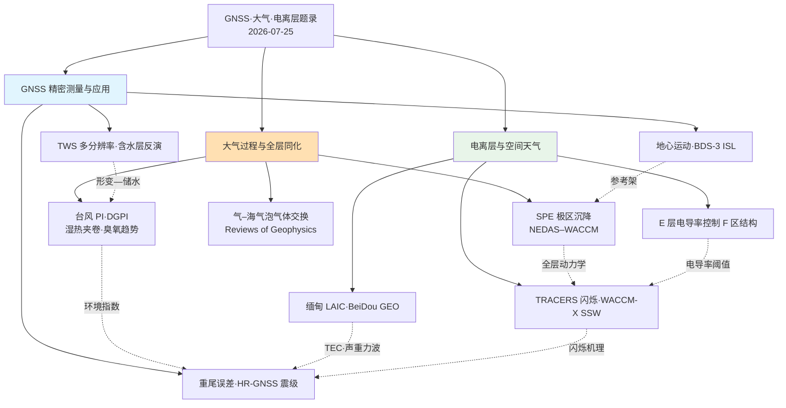
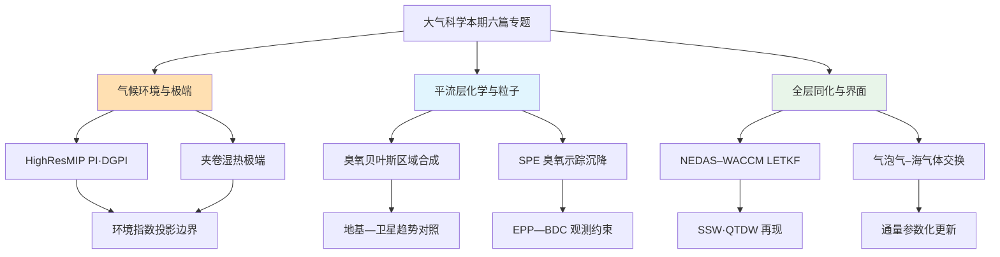
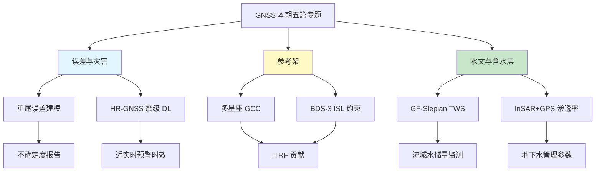
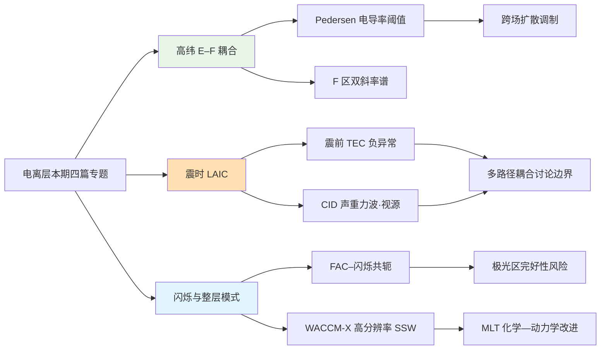
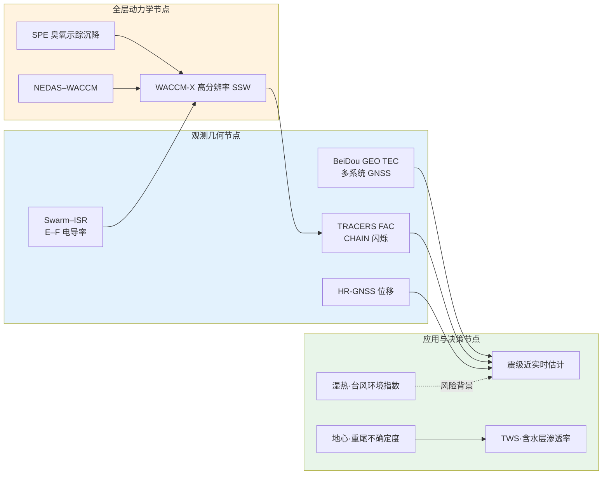

大气侧主要看台风环境指数（HighResMIP 的 PI/DGPI）、地基臭氧趋势合成、温带湿热极端的夹卷机制、太阳质子事件（SPE）驱动的极区沉降、NEDAS–WACCM 集合同化，以及气–海气泡气体交换综述。GNSS 侧包括定位误差重尾建模、近场高采样率震级深度学习、多星座地心运动与北斗三号星间链路、陆地水储量多分辨率估计，以及 InSAR–GPS 含水层渗透率反演。电离层侧则是极光区 E 层电导率对 F 区结构的控制、2025 年缅甸走滑地震的岩石圈—大气—电离层耦合（LAIC）、TRACERS 与地基 GPS 闪烁共轭，还有高分辨率 WACCM-X 对 2018–2019 年平流层突然增温的化学—动力学模拟。定量数字以摘要与 DOI 可核对处为准；摘要截断处不补造细节。

## 一、本期研究印记图

覆盖对流层极端与台风环境指数、平流层臭氧与 SPE 沉降、整层同化、气–海界面气体交换；GNSS 一侧则有误差统计、高采样率震级、地心运动与星间链路、陆地水储量、含水层形变—渗透率反演；电离层延伸到 E–F 耦合、震时扰动与闪烁共轭。期刊以 *Reviews of Geophysics*、*Journal of Climate*、*Atmospheric Chemistry and Physics*、*Journal of Geophysical Research: Atmospheres*、*Geophysical Research Letters*、*GPS Solutions*、*Remote Sensing*、*Geophysical Journal International* 为主。本窗口开放获取统计为 0/36，主张仍以 DOI 与摘要为准。

GNSS 近期工作大致落在误差模型、灾害位移产品、参考架（含地心）和形变约束水文参数几块。大气侧把台风热力学/动力学环境指数、臭氧趋势合成、湿热夹卷与太阳—平流层动力学放在一起看。电离层则继续依赖 Swarm—非相干散射雷达、北斗地球静止轨道 TEC 与 TRACERS—CHAIN 这类共轭配置；第 25 太阳活动周升高后，业务化监测压力更明显。WACCM / WACCM-X 仍在啃两块老毛病：冬季高纬中间层西风偏强、突然增温后一氧化氮向下输送偏弱。这些只是读题录时的背景，具体数字以各篇画像为准。

读下来比较醒目的几处变化。共轭观测更密：TRACERS 场向电流对上 CHAIN 闪烁，Swarm 对上 Tromsø 雷达的电导率—密度谱，北斗 GEO 则盯住缅甸地震前后的 TEC。整层模式不再只堆代理模型——NEDAS–WACCM 把对流层到低热层温度误差相对自由积分砍掉七成以上，约 0.25° 的 WACCM-X 则同时缓解西风偏差和 NO 下传不足。大地测量输出也更“参数化”：震级、陆地水储量、含水层渗透率，而不只是坐标和沉降图。

## 二、大气科学方向专题画像

### 2.1 方向综述

本期大气专题大致落在气候环境指数、平流层臭氧趋势、湿热极端机制、太阳—平流层动力学、整层同化和气—海界面。热带气旋方向，HighResMIP 配对分辨率多模式评估显示，潜势强度与动态生成指数的盆地尺度气候态可被再现，但潜势强度系统性偏低、动态生成指数及其变率系统性偏高，且分辨率提升对盆地聚合误差的改善有限，提示大尺度热力学偏差与强迫响应仍主导未来环境指数投影。平流层臭氧方向，基于五种地基技术的区域贝叶斯合成相对加权平均可将趋势估计平均不确定度降低约 9.4%，上平流层为正趋势、中平流层偏负、下平流层不显著的分层格局为卫星合并产品提供地基参照。温带湿热极端方面，干空气夹卷被识别为破坏近中性约束并强化湿热极端的关键机制，可与自由对流层饱和湿静力能、低层饱和差及有效 bulk 夹卷率联合解释增温情景下的极端响应。

太阳—平流层与整层模式侧，太阳质子事件被用作天然实验，以臭氧亏损轨迹约束极区上平流层下沉速度约 150–570 m/day，并显示下沉速率与积分质子通量显著相关且受准两年振荡位相调制；NEDAS–WACCM 集合同化则将平流层温度均方根误差压至 5 K 以下、中间层—低热层压至 15 K 以下，相对自由积分削减误差逾 70%，并改善突然增温期中间层冷却与南半球准两日波再现。气–海界面方面，*Reviews of Geophysics* 对气泡路径气体交换的批判性综述为气候重要气体通量参数化提供机制边界。合起来看，外推这些结论前最好同时交代：分辨率改进与平均态偏差谁占主导、地基合成相对卫星趋势的不确定度、粒子沉降与动力学是否可分，以及界面通量公式到底检验到哪一步。

| 序号 | 论文简介（逐篇） | 对应画像小节 |
|------|------------------|--------------|
| A4 | HighResMIP 配对分辨率评估台风潜势强度与动态生成指数气候态及本世纪中叶变化，强调分辨率效应次于平均态偏差与大尺度强迫响应 | 2.2 |
| A5 | 以 BASIC 贝叶斯算法合成地基臭氧分柱区域时间序列，相对加权平均降低趋势不确定度约 9.4%，给出 2000–2024 分层趋势格局 | 2.3 |
| A8 | 以再分析与气候模式揭示干空气夹卷强化温带湿热极端，并用零浮力羽流模型解释增温情景下的湿热极端变化 | 2.4 |
| A12 | 以太阳质子事件臭氧亏损轨迹量化极区上平流层下沉，建立下沉速率与积分质子通量相关及准两年振荡位相差异 | 2.5 |
| A16 | 构建 NEDAS–WACCM Python 集合同化框架，显著降低对流层至低热层温度误差并改善突然增温与准两日波再现 | 2.6 |
| A26 | 批判性综述气泡在气–海气体交换中的作用，厘清气泡路径与界面路径并行机制及气候气体通量参数化缺口 | 2.7 |

### 2.2 专题画像：HighResMIP Tropical Cyclone PI and DGPI Assessment

**（1）技术路线：HighResMIP 配对分辨率多模式—ERA5 对照—潜势强度与动态生成指数气候态评估—本世纪中叶变化诊断—热力学与动力学分解**

Wu 等（2026）在 *Journal of Geophysical Research: Atmospheres* 对七组 HighResMIP 仅大气模式配对分辨率试验开展协调评估，以 ERA5 为参照检验 1980–2014 年台风季节潜势强度（PI）与动态生成指数（DGPI）的气候态，并诊断半球台风季节内本世纪中叶（2030–2049 相对 1995–2014）的投影变化。研究将 PI 作为热力学环境度量、DGPI 作为动力学生成有利度度量，在盆地尺度上比较高低分辨率集合的偏差结构。结果表明高低分辨率集合均可再现盆地尺度格局，但 PI 总体低估而 DGPI 及其变率总体高估，在西太平洋等动力活跃盆地尤为明显。分辨率提升对盆地聚合 PI 误差仅带来有限改善，与 PI 主要受高低分辨率共享的大尺度热力学结构约束相一致。投影方面，PI 变化空间异质且总体温和，主要受与对流有效位能相关的热力学不平衡塑造；DGPI 变化则强烈依赖盆地，西太平洋与南太平洋偏减、东太平洋与北大西洋部分区域偏增，并与 500 hPa 气压垂直速度变化密切关联。

**（2）技术特点：配对分辨率设计分离“分辨率效应”与“平均态偏差”，揭示动力学指数对大尺度垂直运动的敏感性**

配对分辨率框架使同一模式在相近物理配置下对比高低分辨率，从而把分辨率带来的改进与共享平均态偏差区分开来。摘要强调，对上述环境诊断量而言，分辨率效应次于平均态偏差及强迫的大尺度热力学与动力学响应。DGPI 对 500 hPa 垂直速度的紧密依赖，表明未来生成有利度投影的不确定性很大程度上来自大尺度环流与对流组织的模式差异，而非单纯水平网格加密。PI 对热力学不平衡的主导响应则提示，即便海表温度贡献总体为正，CAPE 相关项仍可主导空间异质的强度环境变化。该设计为台风气候评估社区提供了可复现的“环境指数—分辨率—偏差归因”模板，避免将高分辨率等同于必然更优的环境投影。

**（3）重要结论：分辨率对 PI/DGPI 的改善有限，投影受平均态偏差与大尺度强迫主导**

该研究的重要结论是：**HighResMIP 配对试验显示 PI 系统性低估、DGPI 及其变率系统性高估，分辨率提升对盆地聚合误差改善有限；本世纪中叶 PI 变化总体温和且空间异质，DGPI 变化强烈依赖盆地并与 500 hPa 垂直速度变化密切相关，表明对环境诊断量而言分辨率效应次于平均态偏差与强迫的大尺度响应。** 看区域台风风险和环境指数投影时，应先报模式平均态偏差和动力学环流不确定度，别只吹水平分辨率。下一步还得在耦合海气试验里看海洋反馈会不会改写这套归因，并和观测生成频率对一下。盆地尺度偏差表若能随产品发布，适应规划引用时更省事。

### 2.3 专题画像：Bayesian Regional Composite of Stratospheric Ozone Trends

**（1）技术路线：五种地基臭氧技术—CAMS 再分析定义区域—BASIC 贝叶斯合并—LOTUS 多元线性回归—与加权平均对照**

Mirallie 等（2026）在 *Atmospheric Chemistry and Physics* 针对单站地基记录不确定度大、下平流层趋势难显著的问题，构建基于相关性的区域合成时间序列。研究整合探空气球、傅里叶变换红外光谱、Dobson Umkehr、激光雷达与微波辐射计五类技术，将月平均廓线积分到两组各四个独立分柱，并以 Copernicus Atmosphere Monitoring Service 再分析划分空间相干区域。区域序列由适配后的 BAyeSian Integrated and Consolidated（BASIC）算法合并，该算法传播测量不确定度并以主成分分析衡量各序列一致性；趋势以 LOTUS 模型在 2000–2024 年估计，并与传统加权平均对照。结果显示，加权平均在仪器共识低的时段难以刻画变率，而 BASIC 对异常值更稳健，并在所选区域将趋势估计平均不确定度相对加权平均降低约 9.4%。分层趋势支持上平流层偏正、中平流层偏负、下平流层不显著的格局，并为全球卫星臭氧趋势产品提供可合并的地基参照。

**（2）技术特点：以区域相干性与贝叶斯一致性加权替代简单平均，显式处理时空与垂直分辨率异质**

地基臭氧观测在时间采样、垂直分辨率与仪器漂移上高度异质，按纬度带简单合并易引入时空混叠。BASIC 通过传播不确定度与主成分一致性约束，在低共识时段仍能给出更具代表性的合成序列，避免加权平均被少数异常仪器主导。CAMS 再分析定义的区域边界把空间异质性转化为可操作的合并单元，使趋势估计更贴近过程尺度而非行政或等纬度划分。对下平流层这一趋势信号弱、噪声高的层次，不确定度削减约 9.4% 具有统计上说得通：它不保证趋势转显著，但提高了“不显著”结论的统计可解释性。该框架可对着卫星合并产品的独立检验与臭氧恢复评估。

**（3）重要结论：BASIC 降低趋势不确定度约 9.4%，支撑上正、中负、下不显著的分层格局**

该研究的重要结论是：**相对加权平均，BASIC 区域合成将所选区域臭氧趋势估计的平均不确定度降低约 9.4%，并支持 2000–2024 年上平流层正趋势、中平流层偏负趋势与下平流层不显著趋势的分层格局，也建立了可用于对照全球卫星臭氧趋势的地基合并参照。** 讨论《蒙特利尔议定书》成效、以及下平流层臭氧是否“恢复停滞”时，这类地基合成用得上。区域边界仍绑在再分析相干性上，分柱定义一变，中下平流层趋势符号也可能动，还得换区域复验。下一步宜把 BASIC 合成和卫星合并产品做逐层残差，把仪器漂移和真过程分开。

### 2.4 专题画像：Entrainment Framework for Extratropical Moist Heat Extremes

**（1）技术路线：再分析诊断近中性约束破裂—不同夹卷率气候模式试验—零浮力羽流模型解释—增温情景湿热极端分解**

Jha 与 Byrne（2026）在 *Geophysical Research Letters* 指出，夏季温带大陆大气接近湿对流中性，近地面湿静力能受到自由对流层饱和湿静力能的紧密约束；但在极端湿热事件中，近地面湿静力能常超过该限制，表明近中性约束破裂。研究结合再分析与全球气候模式，检验干空气夹卷在该破裂及湿热极端强化中的作用。不同对流夹卷率的模拟显示，干空气夹卷会强化温带湿热极端；作者以零浮力羽流模型给出物理解释，并将增温情景下湿热极端变化分解为自由对流层饱和湿静力能变化、低层饱和差变化与有效 bulk 夹卷率变化的组合。该路线把温带湿热极端从经验阈值统计推进为可检验的夹卷—羽流理论框架，为热浪湿球温度类指标的物理归因提供机制接口。

**（2）技术特点：以夹卷率可控试验连接观测诊断与羽流理论，避免仅用统计相关解释极端增强**

湿热极端研究常依赖环流型或土壤湿度相关分析，对对流尺度夹卷的显式作用刻画不足。该工作通过改变模式夹卷率并对照零浮力羽流解析关系，使“干空气夹卷强化湿热极端”成为可证伪的机制命题。将增温响应分解为自由对流层饱和湿静力能、低层饱和差与有效夹卷率，有助于识别何种过程在未来投影中主导不确定性：若有效夹卷率对增温敏感，则对流参数化差异可放大区域湿热风险投影分歧。该特点对公共卫生热应激评估与城市适应规划要紧，因其直接连接可物理解释的大气状态量而非纯统计指数。

**（3）重要结论：干空气夹卷强化温带湿热极端，增温响应可由羽流框架分解解释**

该研究的重要结论是：**干空气夹卷会强化温带大陆湿热极端；在零浮力羽流框架下，增温情景中湿热极端变化可由自由对流层饱和湿静力能、低层饱和差与有效 bulk 夹卷率的组合变化解释，并为近中性约束破裂提供物理一致的机制说明。** 热浪指标若只盯地表温湿度，恐怕不够；自由对流层湿度和夹卷相关垂直结构或许能提高湿热极端的诊断力。再分析在边界层、浅对流上的误差，以及单模式夹卷扰动能外推多远，仍要靠多模式和外场探空一起核对；公共卫生与城市适应场景引用时也宜写明这一外推边界。

### 2.5 专题画像：Solar Proton Events as Tracers of Polar Stratospheric Descent

**（1）技术路线：冬季太阳质子事件天然实验—臭氧亏损轨迹示踪—下沉速度估计—与质子通量及准两年振荡位相相关分析**

Wang 等（2026）在 *Geophysical Research Letters* 利用冬季太阳质子事件作为天然实验，以臭氧亏损轨迹作为动力学示踪，量化极区上平流层下沉速率。摘要报告下沉速度约 150–570 m/day，与一氧化碳/一氧化氮示踪研究及 WACCM 模拟一致。研究进一步发现下沉速度与积分质子通量显著相关（相关系数 0.54，p=0.01），表明更强的粒子沉降伴随臭氧亏损示踪物的更强极区下沉，并伴随臭氧、温度、纬向风与行星波强迫的协同变化。准两年振荡西风位相期间行星波强迫更强，使太阳质子事件相关动力学响应呈现位相差异。该路线为 Brewer–Dobson 环流下降支这一观测上难直接量化的环节提供了事件约束路径，并把高能粒子沉降与平流层动力学变率显式联系起来。

**（2）技术特点：事件尺度天然实验弥补气候态环流诊断不足，揭示粒子沉降与准两年振荡的联合调制**

传统 Brewer–Dobson 环流评估多依赖季节平均残余环流或长寿命示踪物，对短时强扰动下的下沉加速约束有限。太阳质子事件提供可重复的“脉冲强迫”，使臭氧亏损轨迹在事件后成为可追踪的标记。将下沉速率与积分质子通量及准两年振荡位相联合分析，避免把粒子化学效应与动力学传输混为一谈，并为化学—气候模式中高能粒子沉降模块的检验提供观测靶点。该特点对空间天气影响中层大气化学—动力学耦合的评估用得上，也与整层模式在突然增温期的一氧化氮向下输送问题形成对照接口。

**（3）重要结论：SPE 增强极区上平流层下沉，速率与质子通量相关并受准两年振荡调制**

该研究的重要结论是：**冬季太阳质子事件期间由臭氧亏损轨迹导出的极区上平流层下沉速度约为 150–570 m/day，并与积分质子通量显著正相关；相关动力学响应在准两年振荡西风位相更强，并为高能粒子沉降与平流层动力学变率的联系提供观测约束。** 中层化学传输和臭氧短时扰动归因可以拿它当观测锚点。事件样本不算多，轨迹又吃背景臭氧梯度；相关到因果还得靠模式敏感性试验。把同类事件嵌进 WACCM/WACCM-X，看粒子沉降参数化能不能再现观测到的下沉加速，会更有说服力，也便于和突然增温期一氧化氮下传偏差对照。

### 2.6 专题画像：NEDAS Ensemble Data Assimilation for WACCM

**（1）技术路线：NEDAS–WACCM 本地化集合变换卡尔曼滤波—多平台温度与风场同化—2018–2019 冬春季循环—相对自由积分与指定动力学对照**

Liu 等（2026）在 *Journal of Geophysical Research: Atmospheres* 提出将 Next-generation Ensemble Data Assimilation System（NEDAS）与 Whole Atmosphere Community Climate Model（WACCM）耦合的 Python 整层集合同化框架，采用本地化集合变换卡尔曼滤波同化对流层至低热层多平台温度与风观测。在 2018 年 12 月至 2019 年 2 月循环试验中，独立温度检验显示 WACCM+NEDAS 全球均方根误差在平流层降至 5 K 以下、中间层—低热层降至 15 K 以下，相对自由积分削减误差逾 70%，相对指定动力学 WACCM 削减逾 50%。系统成功再现北半球重大平流层突然增温及抬升平流层顶的温度与纬向风演变，与 MERRA-2 及 JAGUAR-DAS 整层中性大气再分析一致，并在突然增温期中间层冷却方面显著优于指定动力学试验；南半球夏季中间层—低热层准两日波活动亦得到再现，而自由积分与指定动力学均难以捕获。

**（2）技术特点：Python 可移植整层同化框架打通对流层—低热层观测入口，改善指定动力学难以约束的中间层波动**

指定动力学试验通常在对流层—下平流层强约束气象场，对中间层—低热层自由演化约束不足，易导致突然增温期中间层冷却与波动活动偏差。NEDAS 以集合卡曼滤波直接同化延伸至低热层的温度与风，使中间层状态受到观测更新而非仅由下边界强迫间接影响。Python 实现降低了整层同化系统的工程门槛，便于更换观测算子与定位方案。对准两日波的成功再现表明，集合同化不仅降低均方根误差，还能恢复夏季中间层关键的波动气候态，这对依赖波动驱动的热层—电离层耦合研究要紧。该框架亦便于与独立雷达风场及卫星温度产品开展分高度层检验，从而把误差削减归因到具体高度带与波动模态。

**（3）重要结论：NEDAS–WACCM 大幅降低整层温度误差并改善突然增温与准两日波再现**

该研究的重要结论是：**WACCM+NEDAS 将平流层与中间层—低热层温度均方根误差分别压至 5 K 与 15 K 以下，相对自由积分削减误差逾 70%，并在重大突然增温演变及南半球准两日波再现上显著优于自由积分与指定动力学配置。** 整层再分析和空间天气背景场可以走这条技术路线。眼下只跑了一个冬季，低热层观测也不匀；集合膨胀和定位尺度怎么扯波动振幅，还得拉长评估期。和高分辨率 WACCM-X 对照时，同化与分辨率不妨并行，分别对付西风和化学传输老偏差。业务背景场最好换多个冬季、多套观测组合再循环一遍，确认误差削减和波动再现是否站得住。

### 2.7 专题画像：Bubbles in Air–Sea Gas Exchange — Critical Review

**（1）技术路线：界面路径与气泡路径并行机制梳理—气候重要气体通量证据综合—参数化缺口与观测约束评估—对气候与生物地球化学含义讨论**

该文由 *Reviews of Geophysics* 刊出，对气–海气体交换中气泡作用开展批判性综述。气–海交换调控二氧化碳等气候重要气体在海洋与大气间的通量，进而影响气候与海洋生物地球化学。表层下气泡通过与界面传输并行的附加路径增强交换；尽管实验室、外场与模式研究已积累大量结果，气泡贡献的定量分割、风速—海况依赖及不同气体溶解度体制下的参数化仍存在显著分歧。综述系统梳理气泡生成、注入、溶解与再出气过程，对照界面层流与破碎波机制，并评估现有大宗通量公式对气泡项的处理是否充分。该路线不以单一新观测取胜，而以证据层级与参数化可检验性为标准，为地球系统模式气体交换模块更新提供审查框架。

**（2）技术特点：以机制并行与参数化可证伪性组织文献，避免将气泡效应简化为风速经验订正**

许多气候模式仍以风速或摩擦速度的经验函数概括气–海交换，气泡贡献常被隐式吸收。批判性综述强调气泡路径与界面路径在物理上并行，其相对权重随气体溶解度、气泡尺度谱与海况变化，因此不能用单一系数外推至所有示踪气体。通过对实验室气泡羽流、白浪覆盖率遥感与惰性气体约束等证据的分层评估，综述标出“高置信机制”与“定量仍分歧”的边界，有助于模式开发者识别优先观测与敏感性试验。该特点对南大洋等高风速海域的碳汇评估要紧，因为气泡增强在低溶解度气体与强破碎波条件下可占主导。

**（3）重要结论：气泡构成与界面并行的关键交换路径，通量参数化仍需按溶解度与海况可检验更新**

该研究的重要结论是：**气泡在海表之下引入与界面传输并行的气体交换路径，对气候重要气体的气–海通量具有不可忽略的贡献；现有参数化在气泡贡献定量分割及不同溶解度—海况体制下的可迁移性方面仍存在关键缺口，需以机制可检验的方式更新地球系统模式通量公式。** 全球碳预算和海洋生物地球化学模拟会碰到这篇综述划出的边界。证据质量取决于既有文献；极端海况和沿岸高浊度区观测仍稀。下一步宜把气泡显式方案和高风速航次通量、白浪遥感对着打，先把南大洋一类关键碳汇区的不确定度压一压。

## 三、GNSS方向专题画像

### 3.1 方向综述

本期 GNSS 专题覆盖误差统计、近场高采样率震级、多星座地心与参考架、陆地水储量，以及形变约束含水层参数。定位误差统计方向，长时序低成本接收机纬度残差检验显示显著偏离正态，Student-t 与高斯—Student-t 混合较高斯模型更好刻画上尾，提示在不确定度评估中继续沿用高斯假设将低估风险。灾害应用方向，基于大量破裂仿真训练的深度学习模型可在无需先验震中的条件下，于约 30 s 内将 2019 Ridgecrest 序列估计震级稳定至误差小于 0.15 级，对矩震级 7.2 以上事件在 40 s 内达到约 99% 准确率。参考架方向，北斗三号星间链路与 L 波段联合处理相对纯 L 波段可将地心坐标 Z 分量标准差降低约 23%–67%，并削弱与轨道及光压参数的相关及龙年伪信号。

水文与含水层方向，基于 2839 站的 Green 函数与 Slepian 基多分辨率陆地水储量估计表明，有效分辨率取决于站网密度、信号相干性与正则化而非单纯格网间距，0.25° 加密在多数流域降低与 GRACE/GRACE-FO 一致性；InSAR 与 GPS 形变进入多孔弹性贝叶斯推断后，单幅 InSAR 形变图对渗透率横向变率的信息量显著高于多站 GPS 时间序列。产品形态已不止坐标和速度：重尾误差、星间链路约束、形变—水文参数后验都开始进报告。能不能用，仍取决于不确定度模型、龙年类伪信号有没有压住，以及观测几何的信息量有没有说清楚。

| 序号 | 论文简介（逐篇） | 对应画像小节 |
|------|------------------|--------------|
| G28 | 对低成本接收机 48 h 纬度残差开展正态性检验与重尾建模，Student-t 类模型优于高斯假设 | 3.2 |
| G29 | 以破裂仿真高采样率位移训练深度学习模型，实现近实时强震震级估计并在 Ridgecrest 序列验证 | 3.3 |
| G31 | 评估多星座地心运动及北斗三号星间链路对地心 Z 分量稳定性与龙年伪信号的抑制 | 3.4 |
| G32 | 以 Green 函数与 Slepian 基在多分辨率下估计北美 GNSS 陆地水储量并与 GRACE/GRACE-FO 对照 | 3.5 |
| G35 | 将 InSAR 与 GPS 形变嵌入多孔弹性贝叶斯框架推断含水层渗透率横向变率 | 3.6 |

### 3.2 专题画像：Normality Tests and Heavy-Tailed GNSS Positioning Errors

**（1）技术路线：48 h 静止观测纬度残差—图形与七种参数检验—蒙特卡洛自助法功效评估—Student-t 与高斯—Student-t 混合建模**

Bantu 等（2026）在 *Remote Sensing* 以低成本接收机连续 48 h 静止观测的纬度残差为一维案例，系统评估全球导航卫星系统定位误差对正态假设的偏离。分析组合直方图、箱线图、Q–Q 图、偏度与峰度及七种参数正态性检验；并在超过 16 万样本上实施蒙特卡洛自助，针对多种样本量与显著性水平各重复 1 万次，估计经验功效与中位 p 值。结果表明残差显著偏离正态，Shapiro–Wilk 与 D’Agostino 检验对中小样本最为敏感。进一步以 Student-t 分布及高斯—Student-t 混合拟合经验分布，二者在上尾刻画上优于高斯模型。该路线把“检验是否正态”与“用何种重尾模型替代”衔接为同一证据链，对着基于定位残差的不确定度量化与假设检验有效性评估。

**（2）技术特点：以长时序实测残差刻画检验功效，强调重尾替代模型对上尾风险的改进**

许多导航与形变应用仍默认高斯观测噪声以推导置信区间与假设检验阈值。该工作指出，在真实重尾体制下，正态性检验表现此前缺乏充分表征，而自助法功效评估揭示不同检验对样本量的敏感性差异。Student-t 与混合模型对上尾的改进意味着极端残差不再被高斯模型系统性低估，这对完好性监测、形变速率显著性判断与低成本接收机网络质量控制要紧。技术路线不依赖仿真噪声，而以静止观测残差作为可重复基准，便于其他接收机类型与多维坐标分量扩展验证。对完好性与形变业务而言，重尾参数的季节稳定性与多路径环境依赖性仍应纳入例行质控指标。

**（3）重要结论：GNSS 纬度残差显著非正态，重尾模型优于高斯假设**

该研究的重要结论是：**低成本接收机长时序纬度残差显著偏离正态，Shapiro–Wilk 与 D’Agostino 检验最为敏感；Student-t 与高斯—Student-t 混合较高斯模型更好表征经验分布尤其是上尾，表明继续沿用高斯假设可能低估全球导航卫星系统分析中的不确定度。** 精密单点定位、形变监测和完好性算法选误差模型时，这篇绕不开。眼下只是一维纬度和单一接收机；多路径、大气异常、动态载体下重尾参数能不能搬，还要另做试验。业务不确定度报告不妨高斯与重尾并行，并在多维坐标、多种接收机上复验上尾分位数。季节分段再估重尾自由度，也有助于质控告警阈值设定。

### 3.3 专题画像：Deep Learning Magnitude Estimation from Near-Field HR-GNSS

**（1）技术路线：大量破裂与高采样率位移波形仿真—深度学习近实时震级模型—单断层与多断层情景—Ridgecrest 序列检验—与 Pd 及回归方法对比**

Zhang 等（2026）在 *Remote Sensing* 针对强震近场宽频带与强震仪限幅及 P 波时窗不足导致震级低估的问题，利用高采样率全球导航卫星系统直接记录地面位移的优势，结合深度学习开展近实时震级估计。研究通过模拟众多地震破裂及其高采样率位移波形训练模型：在单断层情景对中等以上地震（矩震级 6.3+）表现较高精度；在多断层情景下无需先验震源位置，即可基于位移波形快速估计预设断层附近的重大地震（矩震级 7.0+）震级。2019 Ridgecrest 序列检验显示，约 30 s 内估计震级可稳定接近真值且误差小于 0.15 级；相对基于宽频带的峰值位移方法与高采样率回归方法，该途径在时效与精度上更优且不依赖震中先验。不确定度测试表明，对矩震级 7.2 以上大震，方法在 40 s 内达到约 99% 准确率；对 6.3–7.2 适用性有限，低于 6.3 稳定性不足。

**（2）技术特点：以位移波形端到端估计震级，绕开近场限幅与震中先验依赖**

传统快速震级依赖地震波初至幅值或有限时窗，强震近场易饱和；高采样率全球导航卫星系统提供不饱和位移，但既有回归方法常需震中或断层几何先验。深度学习模型在仿真破裂库上学习波形—震级映射，使多断层复杂破裂亦可在无震中先验条件下给出可用估计。将性能按震级分段报告，避免把大震优势外推至中小事件，没把大震优势往中小震硬推。与 Pd 及回归基线的对比提供了时效—精度坐标系，便于地震预警系统评估是否引入全球导航卫星系统通道。分段震级适用边界的显式报告，有助于避免将大震优势错误外推至中小事件预警场景。

**（3）重要结论：HR-GNSS 深度学习可在约 30 s 内稳定估计强震震级且大震准确率高**

该研究的重要结论是：**基于仿真训练的深度学习模型利用近场高采样率位移，可在约 30 s 内将 Ridgecrest 序列估计震级稳定至误差小于 0.15 级，对矩震级 7.2 以上事件在 40 s 内约 99% 准确，且无需先验震中；方法对 7.2 以上最优，对 6.3–7.2 有限适用，低于 6.3 稳定性不足。** 强震应急和海啸预警抢时效时用得上。训练库是仿真破裂，真实多路径、站网几何和噪声还得靠更多事件外推；中小震边界必须在业务里写成硬阈值。多震级、多构造区盲测，再和地震学快速震级拼联合不确定度，会更稳。站网几何和噪声水平差异大的地区，还应单独给失效样例，避免只报均值精度。

### 3.4 专题画像：Multi-GNSS Geocenter Motion and BDS-3 Inter-Satellite Links

**（1）技术路线：单系统与多星座 L 波段地心坐标—先验光压模型影响评估—北斗观测加入稳定性检验—L 波段与星间链路联合解—与卫星激光测距对照**

Yang 等（2026）在 *GPS Solutions* 系统评估多星座全球导航卫星系统地心运动估计现状及北斗三号星间链路收益。L 波段解显示，先验太阳光压模型可使北斗地心坐标 X、Y、Z 分量标准差分别约降 17%、20% 与 69%；加入北斗观测显著改善单系统稳定性，GPS、GLONASS 与 Galileo 单系统地心 Z 标准差分别降低 3.1 mm、7.0 mm 与 0.7 mm。北斗/GPS/GLONASS/Galileo 组合地心坐标最为可靠，尤其降低高频（2–40 天）与龙年（40–150 天）频带散射。相对纯 L 波段，L 波段与星间链路联合处理提升北斗地心与卫星激光测距一致性，地心 Z 标准差视光压模型降低约 23%–67%；北斗地心 Z 形式误差约降 50%，并显著削弱与轨道 Z 向及光压参数 D0、Bc1、Dc2 的相关。额外星间链路有助于抑制地心时间序列中的虚假龙年信号，对三次谐波与高频伪信号影响尤为显著。

**（2）技术特点：以星间链路削弱地心 Z 与光压—轨道参数相关，从观测几何上压制龙年伪信号**

地心 Z 分量长期受太阳光压经验参数与轨道径向误差相关困扰，导致龙年假信号污染参考架产品。星间链路提供星间几何约束，降低对地基网与光压参数的依赖，从而在观测层面削弱相关并压制伪信号，而非仅在事后频谱上滤波。多星座组合进一步通过系统间误差平均降低散射，使高频与龙年频带更稳定。该特点对着国际地球参考架维持与海平面—冰盖质量平衡中对地心运动改正的需求，也与北斗三号星座运维能力向大地测量参数域的外溢一致。将相关削弱与频谱伪信号抑制同时报告，有助于区分“精度提升”与“系统误差结构改善”两类收益。

**（3）重要结论：BDS-3 星间链路显著改善地心 Z 稳定性并抑制龙年伪信号**

该研究的重要结论是：**L 波段与北斗三号星间链路联合解相对纯 L 波段可将北斗地心 Z 标准差降低约 23%–67%，形式误差约降 50%，并显著削弱与轨道及光压参数的相关；星间链路有助于抑制北斗与多星座地心时间序列中的虚假龙年信号。** 多星座进国际地球参考架、地心业务产品，这篇的数字对得上。光压模型一换，改善幅度还会晃；长期外符合仍要和卫星激光测距、流体负荷模型对着看。业务地心产品若能并行发“含/不含星间链路”两套序列，用户更容易做敏感性评估。龙年频带功率若能随产品附带，参考架用户排查假信号也更直接。

### 3.5 专题画像：Multi-Resolution GNSS Terrestrial Water Storage Estimation

**（1）技术路线：2839 站 GNSS—Green 函数与 Slepian 基—1°/0.5°/0.25° 格网—十三大流域对照 GRACE/GRACE-FO**

Nasiri 等（2026）在 *Remote Sensing* 基于 2010 年 9 月至 2024 年 9 月美国本土及加拿大南部 2839 个全球导航卫星系统站，分别用 Green 函数与 Slepian 基在 1°、0.5° 与 0.25° 格网估计陆地水储量变化，并在十三大流域与 GRACE/GRACE-FO 对照。两种方法均能捕获主导季节变率，在积雪主导流域一致性较强。将分辨率提至 0.25° 在多数流域降低一致性，但密站区可反映局地变率，而稀疏站区则因约束不足出现噪声放大。总体相关介于 −0.37 至 0.92，均方根误差约 3.40–15.08 cm。哥伦比亚河流域 1° 下 Green 函数与 Slepian 相关分别达 0.92 与 0.88，0.25° 降至 0.86 与 0.82；大西洋沿岸相关接近零；太平洋沿岸 0.25° 下 Green 函数均方根误差 12.86 cm、Slepian 为 8.93 cm，显示 Green 函数对细尺度局地变率更敏感。研究强调有效分辨率取决于站网密度、水文信号相干性与正则化，而非格网间距本身。

**（2）技术特点：双基函数与多分辨率交叉揭示“加密不等于更优”，分辨率选择要看站网几何**

陆地水储量反演常以更细格网追求细节，却忽略反问题正则化与站网空穴。该工作在同一站网下并行 Green 函数与 Slepian 基并扫描三种间距，使“分辨率—一致性—噪声放大”关系可被定量讨论。流域尺度异质性结果（积雪区高相关、大西洋沿岸近零相关）表明水文信号空间结构与站网匹配度决定可恢复性。对全球导航卫星系统水文学而言，该方法学结论比单一流域高精度个例更具推广价值：业务制图应先评估站网密度与信号相干，再选择格网与基函数，而非统一追求最高标称分辨率。流域尺度诊断表可为水资源管理机构选择产品分辨率提供可操作依据。

**（3）重要结论：有效 TWS 分辨率由站网与正则化决定，0.25° 加密常降低与 GRACE 一致性**

该研究的重要结论是：**Green 函数与 Slepian 基均可再现北美主要季节性陆地水储量变率，但将格网加密至 0.25° 在多数流域降低与 GRACE/GRACE-FO 的一致性；有效分辨率取决于站网密度、信号相干性与正则化而非格网间距本身。** 流域水资源监测和干旱评估选产品时，别只看格网标称间距。沿岸和人类活动强的地方信号容易搅在一起，GNSS 垂向里非水文分量若剥不干净，也会脏掉对比。密站区和稀站区宜用自适应分辨率或分区正则，产品说明里最好附上与重力卫星对比的流域级相关和均方根误差。大西洋沿岸一类近零相关流域，宜在图例里单独标出不宜加密制图。

### 3.6 专题画像：Bayesian Aquifer Characterization with InSAR and GPS

**（1）技术路线：抽水试验地表形变—InSAR 与 GPS 观测—多孔弹性正演—贝叶斯渗透率推断—数据信息量对比**

Alghamdi 等（2026）在 *Geophysical Research Letters* 针对地下水超采背景下含水层模型预测不确定度制约管理的问题，将地表形变观测嵌入贝叶斯推断框架，在多孔弹性模型中推断含水层渗透率。研究以内华达抽水试验为示范，联合干涉合成孔径雷达与全球定位系统形变数据，高空间分辨率地推断渗透率横向变率，并识别各数据集信息贡献。结果表明，对该案例而言，单幅 InSAR 地表形变图提供的信息量显著多于多站 GPS 时间序列。随着全球 InSAR 数据持续增长，基于大地测量形变的地球力学反演有望成为含水层刻画与管理的重要技术。该路线把全球导航卫星系统与雷达形变从“沉降监测产品”推进为“水文地质参数后验”，直接对接地下水可持续管理需求。

**（2）技术特点：以贝叶斯框架量化 InSAR 与 GPS 相对信息量，避免经验性数据堆叠**

多源形变融合若缺乏信息量评估，易导致稀疏 GPS 被高密度 InSAR 淹没或反之权重失当。该工作在统一多孔弹性—贝叶斯框架内比较单幅 InSAR 与多站 GPS 时间序列的信息贡献，为观测设计提供可定量依据：在渗透率横向变率推断目标下，空间连续的形变场优于时间密集但空间稀疏的点观测。这一结论并不否定 GPS 在时间基准、绝对形变与大气/轨道误差控制中的作用，而是强调针对特定参数目标应优化观测几何。卫星大地测量在往水文地质参数反演挪。反演流程里先做信息量评估，可避免在观测日益丰富时仍以经验权重堆叠多源数据。

**（3）重要结论：单幅 InSAR 对含水层渗透率推断的信息量显著高于多站 GPS 时间序列**

该研究的重要结论是：**在内华达抽水试验的多孔弹性贝叶斯框架下，可高空间分辨率推断含水层渗透率横向变率；就该案例而言，单幅 InSAR 形变图的信息量显著多于多站 GPS 时间序列，表明随着全球 InSAR 增长，地球力学反演将成为含水层刻画的有力手段。** 地下水管理布网和采购时，别默认“GPS 时间序列越多信息越多”。结论绑在特定抽水试验几何和先验上；多层含水层、非线弹性、地面裂缝能不能照搬，还要换场地验证。联合设计里 GPS 的时间基准和绝对参考仍要留。更多灌区、城市沉降区复验后，才能看 InSAR 信息量优势稳不稳。

## 四、电离层与空间天气方向专题画像

### 4.1 方向综述

本期电离层与空间天气专题围绕 E–F 电导率耦合、震时 LAIC、场向电流—闪烁共轭，以及高分辨率整层化学—动力学。高纬耦合方向，Swarm 与 Tromsø 非相干散射雷达在中等磁暴期间的 11 次共轭表明，当 E 层 Pedersen 电导率高于约 3 S（基于线性拟合）时，F 区等离子体结构功率谱趋于双斜率，可用高电导 E 区增强小尺度结构的跨场扩散解释。震时耦合方向，2025 年缅甸矩震级 7.9 走滑地震个例结合北斗地球静止轨道与多系统全球导航卫星系统，识别震前三日孕震区相关负总电子含量异常及赤道共轭结构，同震扰动以 2–8 mHz 声重力波频段内约 1.2 km/s 的声波类扰动为主并呈东南向不对称，同时提出空间密度加权的扰动视源定位方法。

闪烁与模式方向，TRACERS 与 CHAIN 在 2025 年 8 月 9 日夜间极光区亚暴中共轭观测到约 1–16 km 尺度、超过 150 的丝状场向电流与极端相位/幅度闪烁及约 10 dB-Hz 强度下降，形态与电急流相关提示 Farley–Buneman 过程可能主导，并叠加场向电流驱动与梯度漂移不稳定性；高分辨率（约 0.25°）WACCM-X 在 ERA5 约束下模拟 2018–2019 年突然增温，缓解低分辨率长期存在的冬季高纬中间层西风偏差与突然增温后一氧化氮向下输送不足，并更好再现流星雷达揭示的中间层—低热层逐日风变率。要落到业务，至少得看两件事：共轭观测能不能把电导率—不规则体—闪烁串起来；高分辨率与同化能不能真把中高层风场和化学传输偏差压下去。

| 序号 | 论文简介（逐篇） | 对应画像小节 |
|------|------------------|--------------|
| I36 | Swarm 与 Tromsø 非相干散射雷达共轭，定量比较 E 层 Pedersen 电导率与 F 区电子密度结构功率谱 | 4.2 |
| I10 | 北斗地球静止轨道与多系统 GNSS 分析 2025 缅甸地震震前 TEC 异常与同震扰动并讨论 LAIC | 4.3 |
| I33 | TRACERS 与 CHAIN 共轭揭示小尺度场向电流与极端 GPS 闪烁的时空对应及不稳定性解释 | 4.4 |
| I24 | 高分辨率 WACCM-X 交互化学模拟 2018–2019 突然增温，改善中间层西风与一氧化氮向下输送偏差 | 4.5 |

### 4.2 专题画像：E-Region Conductance Control of F-Region Plasma Structures

**（1）技术路线：中等磁暴期 Swarm—Tromsø 非相干散射雷达共轭—E 层 Pedersen 电导率估计—F 区电子密度结构功率谱—十一事件线性拟合阈值**

Jin 等（2026）在 *Geophysical Research Letters* 利用高纬近垂直磁力线使 E 区与 F 区强耦合的几何条件，在 2025 年 3 月末中等磁暴期间组织 Swarm 卫星与挪威 Tromsø 非相干散射雷达的共轭观测，首次定量比较 E 层 Pedersen 电导率与 F 区电子密度结构及不规则体功率谱。十一次共轭结果一致显示：当 E 层电导率高于约 3 S（基于十一事件线性拟合）时，F 区等离子体结构倾向于呈现双斜率功率谱。物理解释指向：当 F 区与下方高电导 E 区沿磁力线连通时，小尺度等离子体结构的跨场扩散增强，谱形随之改变。该路线把电导率这一电动力学量与密度结构谱这一不规则体统计量纳入同一共轭事件集，为高纬闪烁与结构生成理论提供可观测阈值。

**（2）技术特点：共轭几何实现 E–F 同时直接关联，给出可操作的电导率阈值而非纯概念耦合**

既往高纬 E–F 耦合讨论多依赖模式或间接指标，缺乏电导率与 F 区谱的同时直接对照。该工作以卫星—雷达共轭克服单点观测的高度分离，并使“电导率高于约 3 S”成为可在其他雷达—卫星配置中复验的定量陈述。双斜率谱作为小尺度扩散增强的统计指纹，为解释极光区闪烁间歇性与谱指数变化提供电动力学入口。技术特点强调过程阈值的可移植性，对空间天气模式下边界电导率参数化与闪烁预报特征选择接得上业务特征。将电导率与谱型阈值化，有助于在业务中把“高电导条件”作为 F 区结构分类的协变量而非事后解释。

**（3）重要结论：E 层电导率高于约 3 S 时 F 区结构倾向双斜率功率谱**

该研究的重要结论是：**在所分析的十一次数共轭中，当 E 层 Pedersen 电导率高于约 3 S 时，F 区等离子体结构倾向于出现双斜率功率谱，可用高电导 E 区增强小尺度结构跨场扩散加以解释。** 高纬完好性和雷达—卫星联合监测可以拿约 3 S 当工作阈值，但别把它当物理常数。拟合样本有限，强磁暴、地方时和季节一变，阈值可能挪；电导率反演误差也得跟进谱分类。业务上宜把 E 层电导率与 F 区谱型一起报，并在独立磁暴集上再测一遍 3 S 是否站得住。电导率反演用的碰撞频率与中性密度假设，也最好在附录里写清，方便跨雷达对比。

### 4.3 专题画像：Myanmar 2025 Strike-Slip Earthquake LAIC with BeiDou GEO

**（1）技术路线：北斗地球静止轨道与多系统 GNSS TEC—滑动四分位距结合太阳地球环境参数—小波与带通提取同震扰动—空间密度加权视源定位**

Chen 等（2026）在 *Geophysical Journal International* 以 2025 年缅甸矩震级 7.9 走滑地震为个例，利用中国大陆构造环境监测网络北斗地球静止轨道观测与多系统全球导航卫星系统，在岩石圈—大气—电离层耦合框架下分析震前异常与同震扰动。结合滑动四分位距方法与 F10.7 等太阳地球环境参数，识别出震前三日与孕震区相关的负总电子含量异常，其赤道共轭结构与多路径耦合情景相一致。小波变换与带通滤波提取的同震电离层扰动，在 2–8 mHz 声重力波响应内以约 1.2 km/s 的声波类扰动为主，并呈东南向不对称。研究提出空间密度加权的扰动视源定位方法，结果提示断层走滑、地磁几何与赤道电急流或共同影响扰动能量分布。作者强调北斗地球静止轨道与多系统组合增强了弱异常与快速同震演化捕捉能力，同时指出推广至地震监测前仍需更广泛统计验证。

**（2）技术特点：地球静止轨道连续穿刺点提升弱信号可检测性，视源定位连接断层几何与电急流背景**

相对倾斜轨道卫星快速扫过，地球静止轨道提供近似固定穿刺几何，有利于追踪弱震前异常与同震扰动的连续演化。将太阳地球环境参数纳入异常识别，降低把空间天气扰动误判为震前信号的风险。空间密度加权视源定位尝试从扰动场反推表观源区，使走滑断层、地磁与电急流背景进入同一解释框架，而非停留在扰动形态描述。技术特点在于观测几何创新与解释边界并陈：既展示方法增强，也明确统计外推限制，符合震时电离层研究对可重复性的要求。将视源定位与断层走滑、地磁及电急流背景联立讨论，有助于避免把扰动不对称性单一归因于震源。

**（3）重要结论：震前三日负 TEC 异常与约 1.2 km/s 同震声波类扰动为 LAIC 讨论提供约束**

该研究的重要结论是：**该个例在震前三日识别出与孕震区相关的负总电子含量异常及其赤道共轭结构，同震扰动以 2–8 mHz 频段内约 1.2 km/s 的声波类扰动为主并呈东南向不对称；北斗地球静止轨道与多系统全球导航卫星系统组合增强了弱异常与快速同震演化的捕捉能力，但在推广至地震监测应用前仍需更广泛统计验证。** 走滑型强震的多圈层耦合讨论，这篇给出了观测约束。更要紧的是方法示范，而不是立刻当预警判据。独立样本上的检出率、虚警率和空间天气混杂控制还没做够；单次赤道共轭结构，不够升格成监测标准。

### 4.4 专题画像：TRACERS FACs and Intense Nightside Auroral GPS Scintillations

**（1）技术路线：TRACERS 小尺度磁场扰动—CHAIN GPS 闪烁—亚暴期共轭—电急流与 dTEC 对照—不稳定性机制讨论**

Shen 等（2026）在 *Geophysical Research Letters* 报告 2025 年 8 月 9 日夜间极光区风暴时亚暴期间，Tandem Reconnection and Cusp Electrodynamics Reconnaissance Satellites（TRACERS）与加拿大高纬电离层网（CHAIN）的共轭观测。旋转横向磁场扰动可达约 1000 nT，对应空间尺度约 1–16 km、强度超过 150 的丝状场向电流，与极端局地极光闪烁（相位闪烁指数大于 10 rad、幅度闪烁指数大于 0.3）及约 10 dB-Hz 强度下降共位。最强闪烁持续约 1.5 s，并与极光电急流峰值、Pi2 脉动及增强差分总电子含量（约 12 TECU）同时出现。片状形态及与电急流的时空相关提示 Farley–Buneman 过程或起主导作用，并叠加场向电流驱动与梯度漂移不稳定性贡献。该路线把原位磁场—电流结构与地基全球定位系统闪烁首次在该任务框架下紧密共轭，给极光区完好性风险提供了事件级证据。

**（2）技术特点：卫星原位场向电流与地基闪烁秒级共位，支撑多不稳定性并存的机理解释**

闪烁研究常以指数统计或雷达回波间接推断不规则体，缺少与小尺度场向电流的直接共位。TRACERS 提供千米尺度磁场扰动，CHAIN 提供秒级闪烁与差分总电子含量，使“电流丝—电急流—闪烁”链条可在同一亚暴中检验。提出 Farley–Buneman 主导并保留场向电流与梯度漂移贡献，没有把锅全扣给单一不稳定性。航空与高纬完好性模型挑预报因子时，可以先看电流丝、电急流和闪烁有没有一起涨。秒级共位说明这三项值得进后续统计模型当协变量，而不只是描述形态；地方时和电急流强度分段后再估权重会更稳，也便于和雷达回波类代理指标交叉核对。

**（3）重要结论：千米尺度强场向电流与极端 GPS 闪烁共位，Farley–Buneman 过程或起主导**

该研究的重要结论是：**在该亚暴事件中，约 1–16 km 尺度、超过 150 的丝状场向电流与极端 GPS 相位/幅度闪烁及约 10 dB-Hz 强度下降共位，最强闪烁约 1.5 s 并伴随电急流峰值、Pi2 与约 12 TECU 的差分总电子含量增强；片状形态与电急流相关提示 Farley–Buneman 过程或起主导，并叠加场向电流驱动与梯度漂移不稳定性。** 事件把机理钉住了，但只是一次风暴时亚暴。要分清 Farley–Buneman、场向电流驱动和梯度漂移谁在何种地方时、电急流强度下占上风，还得攒共轭样本。极光区完好性模型真正需要的，是可检验的驱动排序，以及 Farley–Buneman 主导时大概能预报多远。CHAIN 与 TRACERS 时间对齐若能业务化对齐，秒级共位样本会攒得更快。

### 4.5 专题画像：High-Resolution WACCM-X Chemistry–Dynamics during SSW

**（1）技术路线：约 0.25° WACCM-X 交互化学—ERA5 约束至约 10 hPa—2018–2019 突然增温—卫星与地基及两套整层同化对照**

Pedatella 等（2026）在 *Journal of Geophysical Research: Atmospheres* 采用含交互化学且气象场受约束的高分辨率整层模式，模拟 2018–2019 年平流层突然增温。试验使用约 0.25° 的 Whole Atmosphere Community Climate Model with thermosphere-ionosphere eXtension（WACCM-X），并以 ERA5 将气象约束至约 10 hPa。相对卫星、地基及两套整层资料同化系统的比较表明，高分辨率模拟缓解了低分辨率（约 2°）WACCM-X 长期存在的两项偏差：冬季高纬中间层—低热层西风偏差，以及突然增温后一氧化氮向下输送不足。模拟亦能捕获流星雷达所见中间层—低热层风场的大部分逐日变率。该工作被概括为首次在充分交互化学条件下开展气象约束的高分辨率整层模拟，并表明高分辨率可显著改进突然增温期间中高层动力学与化学变率的表征。

**（2）技术特点：分辨率提升与交互化学同时作用于动力学偏差和一氧化氮传输，把中间层—低热层检验串起来**

低分辨率整层模式中，冬季高纬西风偏差与突然增温后一氧化氮向下输送不足是影响电离层—热层化学耦合评估的长期障碍。高分辨率配置通过改善波动与平均流相互作用，动力学和示踪物传输一起改善，而非仅优化单一诊断量。将流星雷达逐日风变率作为检验，使改进不止于气候态平均，而延伸到天气尺度变率。该特点为空间天气背景建模提供“分辨率—化学—观测检验”完整例子，并与 NEDAS–WACCM 同化路径形成互补：一侧重分辨率与过程，一侧重观测更新。将流星雷达逐日变率纳入检验，可防止仅用气候态平均掩盖天气尺度偏差。

**（3）重要结论：高分辨率 WACCM-X 显著改善 SSW 期中间层西风与一氧化氮向下输送表征**

该研究的重要结论是：**约 0.25° 且含交互化学、并以 ERA5 约束气象场的 WACCM-X 模拟，能够缓解低分辨率配置下冬季高纬中间层—低热层西风偏差与突然增温后一氧化氮向下输送不足，并更好再现流星雷达揭示的逐日风变率，表明高分辨率整层模拟可显著改进突然增温期间中高层动力学与化学变率表征。** 靠一氧化氮下传和中间层风场做电离层—热层化学评估时，这篇高分辨率试验是可用底子。眼下仍是单次突然增温，上边界和约束层怎么选也会牵动结果，还得换事件、做自由运行气候试验。若再叠集合同化，分辨率带来的过程改进和观测带来的误差削减或许可兼得。

## 五、交叉学科网络图与创新链

交叉主要发生在观测几何、整层动力学，以及灾害/水文应用之间。几何上，北斗 GEO 的 TEC、TRACERS—CHAIN 闪烁、Swarm—ISR 电导率谱，和高采样率位移震级，都靠 GNSS 或其共位网把事件钉在同一时空框里。动力学上，SPE 臭氧示踪沉降、NEDAS–WACCM 与高分辨率 WACCM-X 分别从粒子强迫、观测更新和分辨率切入，约束中间层—低热层风场、化学传输和波动，也就是电离层下边界和热层化学真正用得着的那一层背景。应用上，重尾误差、星间链路地心、TWS 多分辨率和含水层渗透率反演，让大地测量结果更接近能写进应急与水资源文件的参数；湿热极端、台风环境指数则提供大气风险侧的对照。

流向可以画得很直白：共轭几何用来检验弱信号和闪烁机理；同化与高分辨率用来削中高层老偏差；形变—水文参数化和近实时震级则把坐标解接到应急与资源管理。见下图。

## 六、近期研究特色变化（截至 2026-07-25）

上一期（2026-07-17）还在写 STEPPP 湿折射率格网、多星座 GNSS-R 冻融、InSAR 残差噪声学习、俯冲带闭锁、格陵兰 GIA、neXtSIM、CCN 订正、Swarm 耀斑 Ne 与震后行扰动—海啸源共定位。本期题录缩到三十六篇，重心也换了：GNSS 侧是高采样率震级深度学习、星间链路地心、TWS 有效分辨率、含水层贝叶斯参数；大气侧是台风环境指数的分辨率—偏差归因、臭氧区域贝叶斯合成、湿热夹卷、SPE 沉降、NEDAS 与气泡气—海综述；电离层则从基础设施启幕、精灵统计，转到 E–F 电导率阈值、缅甸 LAIC 个例、TRACERS 闪烁共轭和高分辨率 WACCM-X 的突然增温化学动力学。

灾害产品从震后行扰动源区，推进到近实时不饱和位移震级，并且按震级段写清能不能用。参考架把 BDS-3 星间链路的收益落到地心 Z 标准差和龙年伪信号。水文学把话说死了：格网加密不等于有效分辨率提高。整层模式也不再主要靠近空间温度神经网络这类代理重建，而是用集合同化和高分辨率交互化学去削突然增温期的中间层偏差；空间天气观测则从单一 Swarm 统计，扩到场向电流—闪烁与电导率—密度谱共轭。对比材料只有 07-17 周报与本期题录，中间漏检文献不在此列；谈更长趋势仍需连续多窗口。

## 七、参考文献

1. Wu, Q.-M., Li, Z.-B., & Zhan, Z.-X. (2026). Simulated and Projected Tropical Cyclone Potential Intensity and Dynamic Genesis Potential Index in HighResMIP. Journal of Geophysical Research: Atmospheres. https://doi.org/10.1029/2026jd046628
2. Mirallie, L., Maillard Barras, E., Jonas, C., Vigouroux, C., Van Malderen, R., Petropavlovskikh, I., Godin-Beekmann, S., Leblanc, T., Steinbrecht, W., Vadès, A., et al. (2026). Ozone stratospheric trends from regional Bayesian composite of ground-based partial columns. Atmospheric Chemistry and Physics. https://doi.org/10.5194/acp-26-10303-2026
3. Jha, R., & Byrne, M. P. (2026). Entrainment-Based Framework for Understanding Extratropical Moist Heat Extremes. Geophysical Research Letters. https://doi.org/10.1029/2026gl122678
4. Wang, Y., Li, H., Li, Y., Pan, Y., Xu, W., Ni, B., & Wang, C. (2026). Solar Proton Events Enhance Polar Upper Stratospheric Downward Transport: Evidence From Ozone-Traced Descent. Geophysical Research Letters. https://doi.org/10.1029/2025gl120368
5. Liu, Y.-X., Gu, S.-Y., Ying, Y., Qin, Y., Chen, H., Wei, Y., & Dou, X. (2026). Application and Evaluation of a Novel Python-Based Ensemble Data Assimilation Framework NEDAS in Whole Atmosphere Community Climate Model (WACCM). Journal of Geophysical Research: Atmospheres. https://doi.org/10.1029/2025jd045622
6. Dong, Y., Jähne, B., Woolf, D. K., Krall, K. E., Yang, M., Czerski, H., Liang, J., Brooks, I. M., McNeil, C. L., Wanninkhof, R., et al. (2026). The Role of Bubbles in Air-Sea Gas Exchange: A Critical Review. Reviews of Geophysics. https://doi.org/10.1029/2025rg000903
7. Bantu, A., Krauze, O., & Wiora, J. (2026). Empirical Evaluation of Normality Tests and Heavy-Tailed Error Models for NMEA-Derived GNSS Positioning Data from a Low-Cost Receiver. Remote Sensing. https://doi.org/10.3390/rs18152446
8. Zhang, G., Huang, C., Shan, X., Zhang, D., & Kuang, W. (2026). Rapid Strong Earthquake Magnitude Estimation Based on Near-Field High-Rate GNSS Data Using Deep Learning. Remote Sensing. https://doi.org/10.3390/rs18152444
9. Yang, C., Guo, J., Mi, X., Liu, X., Wang, L., Xu, S., Zhao, Q., & Chen, W. (2026). Geocenter motion estimation from multi-GNSS: current status and benefits of BDS-3 Inter-satellite links. GPS Solutions. https://doi.org/10.1007/s10291-026-02117-6
10. Nasiri, M., Fatolazadeh, F., & Goïta, K. (2026). Multi-Resolution Estimation of GNSS-Based Terrestrial Water Storage Changes Using Green’s Function and Slepian Basis Function Methods. Remote Sensing. https://doi.org/10.3390/rs18142392
11. Alghamdi, A., Hesse, M. A., Chen, J., & Ghattas, O. (2026). Advancing Aquifer Characterization Through the Integration of Satellite Geodesy, Geomechanics, and Bayesian Inference. Geophysical Research Letters. https://doi.org/10.1029/2025gl117023
12. Jin, Y., Ivarsen, M. F., Cai, L., Vanhamäki, H., Virtanen, I., Kotova, D., Spogli, L., Urbář, J., Wood, A., Pedersen, M., et al. (2026). Controlling of the F Region Plasma Structures by the E Region Conductance in the Auroral Ionosphere. Geophysical Research Letters. https://doi.org/10.1029/2026gl122043
13. Chen, J., Xiong, P., Ruan, Q., Zhang, X., Lin, Y., Zhang, X., Zhang, T., Wang, K., & Shen, X. (2026). Cross-sphere Coupling and Source Inversion of Ionospheric Disturbances Associated with the 2025 Myanmar Strike-slip Earthquake from BeiDou GEO and Multi-GNSS Observations. Geophysical Journal International. https://doi.org/10.1093/gji/ggag294
14. Shen, Y., Strangeway, R. J., Cao, H., Weygand, J. M., Wu, J., McCaffrey, A., Jayachandran, P. T., Billett, D., Ivarsen, M. F., Watson, C., et al. (2026). TRACERS Small-Scale Field-Aligned Currents and Intense GPS Amplitude and Phase Scintillations in the Nightside Auroral Region. Geophysical Research Letters. https://doi.org/10.1029/2026gl123732
15. Pedatella, N. M., Liu, H.-L., Harvey, V. L., Datta-Barua, S., Gulbrandsen, N., Jacobi, C., Latteck, T., Renkwitz, T., Tsutsumi, M., & Chau, J. L. (2026). High Resolution Simulations of the Chemistry and Dynamics of the Mesosphere and Lower Thermosphere During the 2018-2019 Sudden Stratosphere Warming. Journal of Geophysical Research: Atmospheres. https://doi.org/10.1029/2026jd046764
