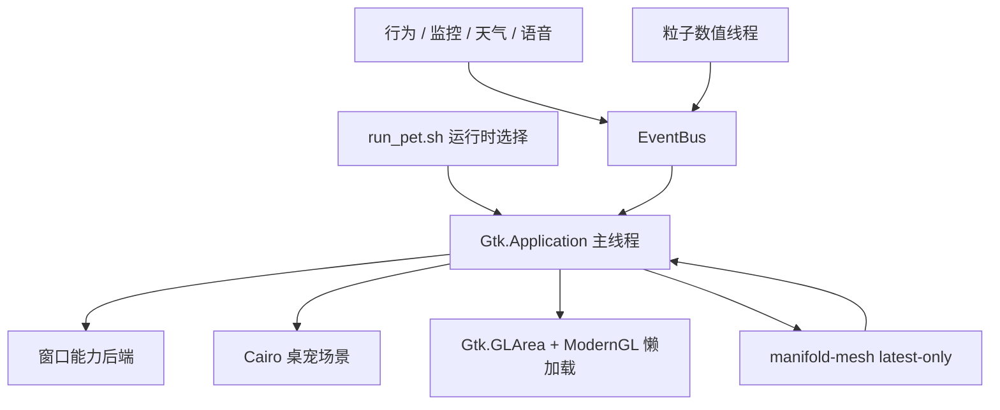
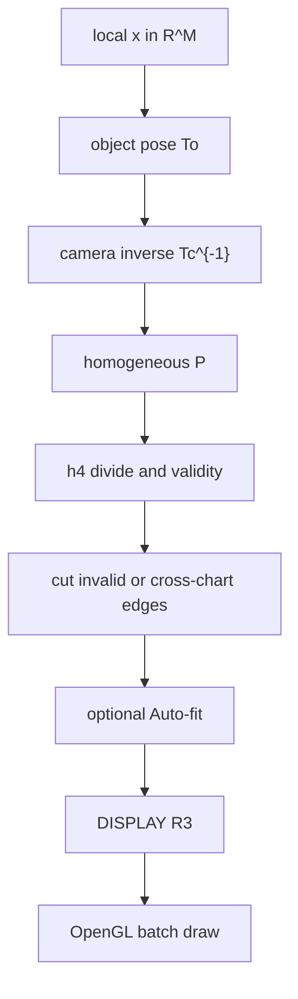

Linux Pet（仓库 [Mapoet/linux-pet](https://github.com/Mapoet/linux-pet)，Apache-2.0）是单进程 GTK4 桌面应用：默认路径提供透明桌宠、Cairo 特效、离线语音与硬件监控；可选路径在首次打开时加载 NumPy/Numba/ModernGL，构成独立的流形几何实验室。本文依据 2026-07-28 公开主分支源码、架构文档与本地回归测试，梳理它如何从几天内的桌宠试验，落到一条可测试的 M 维观测链上，并写清数值画面与数学命题之间的边界。

## 从兴趣试验到多年未写完的那张草图

这几天动手写 Linux Pet，最初并不是为了发一个“又一个桌面宠物”。触发点很具体：很多人用 Codex 一类代理把桌宠做出来了，我想知道在 Linux 上、用自己熟悉的 Python/GTK 栈，这件事能做到什么程度——透明窗口、按像素命中、省电档、Wayland 降级，以及不把 Electron 拖进常驻进程。

做着做着，更早的一条线被重新接上。我一直有一个数学物理方向的执念：不是把高维对象“画成好看的三维雕塑”就算完，而是要能在环境空间 $\mathbb{R}^{M}$ 里同时摆两样东西——几何体自己的刚体运动，以及一台真正工作在 $\mathbb{R}^{M}$ 里的相机。相机动了，视野里的物体相对坐标跟着变；再经齐次投影映到 $\mathbb{R}^{3}$，人才能用熟悉的三维漫游去“看”那个本来看不见的高维场面。草图在脑子里放了好多年，公式也断断续续推过，缺的是一块愿意把 $T_{o}$、$T_{c}$、$P$ 和显示相机拆开写、拆开测的工程台面。

桌宠于是成了壳，流形实验室成了核。壳负责每天还愿意打开它：拖一下、说一句话、看一眼 CPU。核负责把那张旧草图写成代码契约——视口拖动绝不能偷偷改写 M 维外参。公开仓库里的 `docs/MANIFOLD_LAB.md` 和 `compute/camera.py`，本质上是在固定这件事：可视化可以娱乐，观测链不能糊。

## 背景：Linux 桌宠的工程现实

Linux 桌宠长期卡在显示协议分裂上。X11 还能谈根坐标移动和 `XGrabKey`；原生 Wayland 的 `xdg_toplevel` 没有可移植的全局定位 API；layer-shell 与全局快捷键又分别依赖合成器扩展或 Desktop Portal。多数娱乐向实现会在透明度、置顶、快捷键和内存占用之间做粗折中。Linux Pet 的第一阶段选择很明确：普通用户权限、PyGObject/GTK4/Cairo、按实际 GDK display 能力降级，不引入 Electron 或 Qt。

## 项目定位与代码规模

仓库描述为 “Lightweight GTK4 Linux desktop pet with Cairo effects and a ModernGL manifold laboratory”，许可证 SPDX 为 Apache-2.0。可识别人物头像不在该许可证覆盖内，由 `ASSET_NOTICE.md` 单独约束。

对本地检出（排除 `.runtime`、虚拟环境与缓存）统计：`linux_pet/` 约 1.46 万行，`manifold_visualizer/` 约 1.71 万行，`tests/` 约 0.82 万行，合计约 4.0 万行。最大文件集中在组装与几何热路径：`linux_pet/app.py`（约 2481 行）、`game_ui/window.py`（约 2273 行）、`compute/generator.py`（约 2196 行）、`rendering/gl_area.py`（约 1443 行）。工程重心已经从“画一个会动的头像”偏到“目录—采样—位姿—投影—上传—面板”整条链。

| 子系统 | 主要职责 | 代表性路径 |
|:-------|:---------|:-----------|
| 启动与运行时 | Python/GTK 探测、麒麟便携运行时、拒绝 root | `run_pet.sh`, `run_pet.py` |
| 桌宠 | 透明窗口、行为、Cairo、语音/监控 | `linux_pet/` |
| 流形实验室 | 31 对象、M 维相机、投影、GL、闯关 | `manifold_visualizer/` |
| 桌面集成 | GNOME/KWin/Hyprland/Sway/XFCE 模板 | `integrations/` |
| 回归测试 | 数学、渲染契约、生命周期、服务 | `tests/` |

## 总体架构

单 `Gtk.Application`，多后台线程。GTK 主线程独占窗口、输入、Cairo 与 OpenGL；行为、监控、天气、语音、头像预处理、粒子积分、流形网格生成只回传不可变载荷。`EventBus` 容量 512，入队前递归冻结，满则丢最旧事件，避免音频或监控线程被 UI 卡死。



四条硬约束写在架构文档里：拒绝 root；按真实 display 降级而不是只信环境变量；工作线程不持有 GTK 对象；空闲用按需帧循环。实验室第一次打开才导入科学计算栈——只养桌宠时，不会白白拉起网格线程和 GL 上下文。这和我自己的使用方式一致：平时它是宠物；想推高维公式时，再按 `Ctrl+Alt+G` 打开实验台。

## 桌宠子系统：把“愿意每天开”做扎实

### 窗口能力与输入穿透

`detect_runtime_capabilities()` 先看实际 GDK display。Wayland 会话里强设 `GDK_BACKEND=x11` 会被标成 XWayland，而不是原生 Wayland。后端在 X11/XWayland、`gtk4-layer-shell` 与基础 Wayland 之间切换；失败则降级并记日志。透明像素命中只改本应用 surface 的输入 region。

| 会话后端 | 定位与置顶 | 全局观察 | 快捷键 |
|:---------|:-----------|:---------|:-------|
| X11 | 根坐标；置顶为 EWMH hint | 指针与 EWMH | `XGrabKey` |
| XWayland | 合成器可能改写 | 仅可靠观察 XWayland 世界 | Portal 或降级抓键 |
| Wayland + layer-shell | 输出锚点与 overlay | 仍需扩展 | Portal 或合成器绑定 |
| 基础 Wayland | 无通用全局坐标 / keep-above | 依赖扩展 | Portal 或桌面模板 |

### Cairo 场景、性能档与本地服务

绘制顺序固定：透明背景 → 拖动残影 → 头像 → 霓虹 → 粒子 → 光点小游戏 → 气泡 → 硬件面板。`OnDemandFrameLoop` 用 `FrameReason` 合并需求；没事就不排下一帧。`power` / `full` 是运行时策略，不永久覆盖单项偏好。文档给出的 `power` 空闲目标是平均 CPU ≤0.5%、无 Vosk 时参考 RSS ≤80 MB，并写明这是目标机验收值，不是跨机保证。

头像路径保留有意义 alpha，近白连通背景做羽化；低置信度不透明图退回椭圆羽化——不是语义分割。语音走本地 Vosk；天气只读 `weather.json`；锁屏经 D-Bus / logind `LockedHint` 隐藏窗口，解锁只恢复先前可见者。

实验室与桌宠还有一层轻联动：切换流形时弹出约 3 秒科普气泡；$S^{3}$、$\log$、$\sqrt{\,\cdot\,}$、Möbius 等场景可驱动紫色几何粒子；闯关积分解锁流光密度、公式漂浮与限定气泡。对我来说，这些不是“游戏化包装”，而是让高维对象在日常桌面上留下一点可感知的痕迹——否则实验室窗口一关，那条数学线又容易沉回笔记里。

## 流形可视化想解决的物理—几何问题

微分几何与近代数学物理里，流形很少天生住在我们眼睛习惯的 $\mathbb{R}^{3}$ 里。位形空间、约束面、规范势、自旋与纤维丛，经常迫使人们在高维环境空间中思考，却又只能在纸上画二维示意图，或把某个特定投影的结果当成“本体”。我想做的可视化，针对的正是这种错位：

1. **物体在 $M$ 维里动**：$T_{o}=(R_{o},t_{o})\in SE(M)$，用 Givens 平面旋转叠成 $SO(M)$，平移分量按轴可编。
2. **相机也在 $M$ 维里动**：$T_{c}$ 与 $T_{o}$ 同构但状态独立；观测只依赖相对位姿 $T_{c}^{-1}T_{o}$。物体主动转与相机被动转必须都能单独拧，不能预先捏成一个“总旋转滑条”。
3. **投影是单独的仪器**：四种模式共用 $P\in\mathbb{R}^{4\times(M+1)}$ 与同一套齐次除法/奇异处理，避免每种投影私自定义一套 NaN 语义。
4. **三维漫游只是目镜**：界面标签 `DISPLAY` $\mathbb{R}^{3}$ 的 yaw/pitch/roll、距离、FOV、near/far、比例只改 OpenGL 矩阵。它解决的是“怎么把已投影的点看清楚”，不是“高维世界发生了什么”。

把这四层写进面板分组（物体 / 相机 / 投影 / 显示）之后，我自己调试时最直观的收益是：再也不会出现“我以为在转 $S^{3}$，其实只是在转投影后的壳”这种概念事故。对教学演示同样关键——学生拖视口时，状态栏和参数面板不会撒谎。

## 观测链的数学与实现细节

### 符号

| 符号 | 含义 |
|:-----|:-----|
| $d$ | 对象实内禀维数 |
| $M$ | 规范源嵌入的实环境维数 |
| $x\in\mathbb{R}^{M}$ | 物体局部坐标 |
| $x_{c}\in\mathbb{R}^{M}$ | M 维相机坐标 |
| $y\in\mathbb{R}^{3}$ | 投影后三维数值坐标 |
| $T_{o},T_{c}\in SE(M)$ | 物体与相机刚体位姿 |
| $P\in\mathbb{R}^{4\times(M+1)}$ | 齐次投影矩阵 |

例如 $S^{3}\subset\mathbb{R}^{4}$ 是 $d=3,M=4$；$T^{3}=(S^{1})^{3}\subset\mathbb{R}^{6}$ 是 $d=3,M=6$。界面上的 `DISPLAY` $\mathbb{R}^{3}$ 绝不是在宣称原对象是三维流形。

### 相对位姿与齐次投影

$$
x_{c}=R_{c}^{\top}(R_{o}x+t_{o}-t_{c}),\qquad
h=P\begin{bmatrix}x_{c}\\ 1\end{bmatrix},\qquad
y=\left(\frac{h_{1}}{h_{4}},\frac{h_{2}}{h_{4}},\frac{h_{3}}{h_{4}}\right).
$$

实现用行向量批量存储，NumPy 写为 `(x @ R_o.T + t_o - t_c) @ R_c`，与列向量公式等价。`HighDimensionalPose` 保存有序 `[axis_i, axis_j, angle]` Givens 序列（最多 32 个）与平移向量；物体自动角与相机自动角互不共享。全特效下，M 维自动重生成上限约为每 10 秒一次（$\leq 0.1\,\mathrm{Hz}$），中间帧只转三维显示矩阵——这是桌面常驻进程能负担的折中，也是我刻意接受的：高维链要算对，但不和 60 FPS 霓虹抢同一套预算。



### 四种投影模式

| 模式 | 构造要点 | 使用注意 |
|:-----|:---------|:---------|
| `orthographic` | $h_{1,2,3}=A^{(M)}x_{c}$，$h_{4}=1$；$A$ 取 DCT-II 前三行并 Gram–Schmidt | 丢失坐标 $r=(I-A^{\top}A)x_{c}$ 编码残差，不是曲率 |
| `stereographic` | 先对深度轴做有理映射，再必要时 $A^{(M-1)}$ 降到三维 | 仅共球且半径匹配时第一步才是真球极图；平移会破坏条件 |
| `pinhole` | 三可见轴焦距 + 独立深度轴与偏移 | 可见轴互异，深度轴不得与之重复；$M\geq 4$ |
| `general` | 完整 $4\times(M+1)$ 行优先矩阵 | 维数不匹配时休眠旧矩阵并回退派生正交，不让后台崩溃 |

投影前会去掉 $P$ 的全局数值尺度；奇异判定采用相对阈值，使 $\lambda P$ 与 $P$ 同坐标、同有效掩码。无效样本以有限零占位，并切断边、折线与 Hopf 纤维，避免伪线段穿过奇点。

`auto_fit_enabled=true` 时，对有效 $y_{i}$ 做中心化与 98% 分位半径缩放。探索外形方便，但会抹掉绝对平移与尺度；要核对 $T_{c}^{-1}T_{o}$、焦距或复现实验坐标时必须关掉。这一点是我自己踩过的坑：Auto-fit 开着时，“相机推近”的视觉变化会被吃掉一大半。

### 曲率与截面

对参数曲面 $X(u,v)$，由有限差分估第一、第二基本形式，再算

$$
K=\frac{eg-f^{2}}{EG-F^{2}},\qquad
H=\frac{Eg-2Ff+Ge}{2(EG-F^{2})}.
$$

普通周期轴用环绕中心差分；Klein / 莫比乌斯扭转接缝不用普通周期邻点。目录用 `curvature_semantics` 区分：原生曲面是源浸入 $K/H$；$S^{3}$/$T^{3}$ 是显示切片曲率；Möbius 定义域着色通道是辐角与对数模长；点云与多胞体无线框曲率。不可定向曲面没有全局连续法向，带符号 $H$ 只在局部图内有意义。

源空间切片在投影前切 $x_{i}=h$；显示裁剪在 Auto-fit 后用片元丢弃。超立方体与 cross-polytope 可精确构造截面 1-skeleton；缺二维面关联的线框只保证交点精确；连续流形点云则保留近平面的有界薄层样本。两者不可互换解读。

## 三十一对象：我想“看见”的那些东西

`catalog.py` 只依赖标准库，是菜单、配置、生成器、渲染能力与省电上限的唯一事实源。31 个 ID 按类为：曲面 8、多胞体 8、高维 7、通用族 5、复分析 3。

### 经典曲面与最小曲面

$S^{2}$、$T^{2}$、双曲抛物面提供曲率色图的直观课。Klein 瓶保留三维浸入自交，并实现扭转接缝 $(u,v)\sim(u+2\pi,-v)$。莫比乌斯带、悬链面、螺旋面补上单侧带与最小曲面（$H=0$）对照。双环面用两个 torus 隐式场的平滑最小值采样点云——画面可暗示亏格 2，但实现明确不提供三角拓扑证明。

### 复分析：有限分支片，而不是假装缝合完成

$\log z$ 默认取 $k\in\{-1,0,1\}$ 三层，$\sqrt{z}$ 取两层。每层内部满足函数方程，层间切口不做跨 cut 粘合，也不把分支点做成商空间。三维显示往往只抬 $\mathrm{Im}\,w_{k}$，因此不同分支还可能在 $\mathbb{R}^{3}$ 重合。文档坚持叫它们 **finite branch patches**：我想看见分支跳跃的几何直觉，但不想用网格连通性去“证明”黎曼曲面定理。Möbius 变换定义域着色用辐角色相与 $\|f|\$ 的周期环纹；当前面板未暴露 $a,b,c,d$，默认恒等变换，数值侧仍按相对条件检查 $ad-bc\neq 0$。

### $S^{3}$、Hopf 纤维与 $T^{3}$

把 $\mathbb{R}^{4}$ 看作 $\mathbb{C}^{2}$，Hopf 坐标给出 $S^{3}$ 上的圆纤维。开启纤维后，固定预算内的样本显式闭合；碰上投影奇点或跨 chart 则按有效段切开——画面上的断开表示坐标图边界，不是源圆不闭合。单位四元数左右乘给出 $S^{3}\times S^{3}\to SO(4)$ 的二重覆盖，用于四维旋转，而不是把单个列向量误叫成 $SO(4)$ 元素。$T^{3}$ 自然嵌入 $\mathbb{R}^{6}$，可视化对若干固定相位的 $T^{2}$ 切片三角化后再走统一相机链：这是有限切片，不是体素。

对我个人而言，Hopf 纤维是这条可视化线里情绪浓度最高的一幕。纤维两两相链的事实写在教科书里已经很久；当真的在独立 M 维相机下拧一下 $SO(4)$，再在球极投影里看那些圆如何纠缠，那种“公式终于肯站起来”的感觉，正是我多年想要的，而不是又一张静态示意截图。

### 高维球面、环面、乘积与多胞体

$S^{n}$、$T^{n}$、球面乘积用固定点数预算采样（桌面 UI 维数夹在 3–8），附加至多若干大圆或坐标圆路径；不建指数网格，不宣称同调。多胞体侧提供 5-cell、超立方体、16-cell、24-cell、五维族及 $\Delta^{2}\times\Delta^{3}$，一律只画 1-skeleton。Helmert 坐标构造正单纯形，保证 $\|v_{i}\|=1$ 且 $v_{i}\cdot v_{j}=-1/n$（$i\neq j$）。超立方体在核心层硬限制维数上限，防止 $2^{n}$ 误操作拖垮桌面进程。

| 数值表示 | 能支持的判断 | 不能据此声称 |
|:---------|:-------------|:-------------|
| 参数三角网格 | 局部有限差分、$K/H$ | 自动正确的全局定向或最小剖分 |
| 有限分支片 | 单层函数值与显示图面 | 完整覆盖、跨 cut 缝合 |
| 分层切片 | 若干二维显示片 | 三维流形体网格 / 内禀三维曲率 |
| 有界点云 | 样本分布 | 邻接、同调、亏格 |
| 多胞体线框 | 规范顶点与完整 1-skeleton | 高维胞腔实体填充 |

## 交互、闯关与“把概念练熟”

自由探索不计分，可连续拧流形、投影、曲率、截面与 Hopf。闯关分四类题目（基础曲面、拓扑、高维投影、复分支），每类入门到专家四档；本局分可因答错变负，永久积分只在答对时增加。提示扣 5 分但不跌破 0；50 / 120 / 200 分分别解锁流光、公式漂浮与限定气泡。Hopf 连续观察 30 秒、Klein 截面按偏移穿越三区，会触发短时宠物侧彩蛋——省电档保留状态但跳过重动画。

这些机制的目标很务实：高维几何的概念密度高，只靠面板滑条很容易“看过即忘”。用桌宠壳做一点轻量反馈，是把实验台留在日常生活里的办法。

## 渲染、线程与性能边界

`GenerationWorker` 单线程、latest-only：新 generation 取消旧 token；NumPy 段不可强杀，但阶段间 `checkpoint()`。`GLib.idle_add` 回主线程后再次核对 generation 与签名。隐藏只暂停帧循环；关闭则先释放 VAO/VBO/着色器，再异步排空数值线程。

ModernGL 绑定 GTK 当前自定义 framebuffer，着色器为 GLSL 330 core。软件光栅（llvmpipe 等）下即使 `full` 也降网格，但仍允许 ≤0.1 Hz 的 M 维自动旋转；显式 `power` 或 GL 丢失才停。`LINUX_PET_COMPUTE_THREADS` 默认 1、上限 4，避免常驻进程被 BLAS/Numba 按逻辑 CPU 拉爆线程。

## 验证结果

在分析主机上对几何核心子集执行：

```bash
python3 -m pytest \
  tests/test_manifold_camera.py \
  tests/test_manifold_projections.py \
  tests/test_manifold_high_dimensional.py \
  tests/test_manifold_core.py \
  tests/test_manifold_catalog.py \
  tests/test_manifold_analysis.py \
  tests/test_manifold_generator.py -q
```

结果为 **135 passed**（约 5.4 s），覆盖相对位姿、四种投影、高维采样边界、目录不变量、曲率/截面与生成器入口。仓库另有 GL 契约、生命周期、桌宠服务与集成模板等，合计 35 个测试文件。窗口协议与真实 GPU 验收仍须在目标会话上单独做：X11 成功推不到原生 Wayland EGL，软件光栅也推不到硬件加速。

## 讨论

**作为个人研究台面。** 把桌宠和观测链放进同一进程，是我故意选的形态：数学线需要一个每天还在跑的壳，壳也需要一个配得上长期维护的核。目录驱动的能力声明、generation 一致性、以及把“不能从点云读同调”写进文档，都是在保护那条线不被演示效果带偏。

**作为公开软件的边界。** 分层切片不是体网格，有限分支片不是完整黎曼曲面，Auto-fit 会吃掉尺度，Wayland 基础会话会限制窗口几何。画面可以激发直觉，也可以误导命题。项目选择把边界写在用户能读到的手册里，而不是只写在作者的脑子里。

两条评价标准可以并存：交互是否自洽，是工程问题；画面能支撑何种数学断言，是认识论问题。我更在意后者不被前者吞掉。

## 结论与下一步

Linux Pet 用几天公开开发，接上了一件搁置很久的事：让 M 维物体与 M 维相机在同一套可测试公式里运动，再投影到三维里慢慢看。桌宠证明这条链路愿意留在桌面上；实验室证明公式愿意被拆开拧。源码上最值得留下的，不是特效密度，而是 $T_{o}$、$T_{c}$、$P$ 与 `DISPLAY` $\mathbb{R}^{3}$ 的分离，以及 31 对象目录对表示语义的强制对齐。本地核心几何回归 135 项通过，只是起点。

几何侧若继续推进，仍会优先：在真实 GPU 与目标 Wayland/X11 矩阵上做协议—渲染器验收；为球极/针孔补可复现基准数据；在不破坏常驻预算的前提下加强截面拓扑重建；并把资产许可与模型摘要校验收进发行硬门禁。观测链的诚实性不能退。

更近的一条产品线，是把现有桌宠壳接成 **语音 Agent 助手**。当前 Vosk 路径只能做唤醒与少数本地口令；下一步计划接入 LLM，并以 MCP 暴露桌宠控制、流形实验室参数、系统侧只读工具，再挂上可组合的 Skills（写作、检索、几何讲解、日常事务等）。目标形态很直接：它仍是桌面上那只宠物——能听、能说、能执行工具调用——同时也可以回答我的问题，而不必再开一个单独的聊天窗口。工程上需要守住几条边界：Agent 逻辑与 GTK 主线程隔离；工具权限默认最小、可审计；离线口令与云端/本地 LLM 会话分层，避免把常驻宠物变成不可控的后台代理。娱乐壳、几何核与对话 Agent 可以长在同一进程家族里，但各自的失败域要分得开。

## 参考文献

1. Mapoet. *Linux Pet* source repository. https://github.com/Mapoet/linux-pet
2. Linux Pet. *Architecture notes* (`docs/ARCHITECTURE.md`), 2026-07-28.
3. Linux Pet. *Manifold laboratory manual* (`docs/MANIFOLD_LAB.md`).
4. freedesktop.org. *xdg-shell protocol specification*.
5. wlroots contributors. *wlr-layer-shell-unstable-v1*.
6. XDG Desktop Portal. *GlobalShortcuts*.
7. freedesktop.org. *Extended Window Manager Hints*.
8. Alpha Cephei. *Vosk models*. https://alphacephei.com/vosk/models
9. Hopf, H. Über die Abbildungen der dreidimensionalen Sphäre auf die Kugelfläche. *Mathematische Annalen*, 104, 637–665 (1931).
10. do Carmo, M. P. *Differential Geometry of Curves and Surfaces*. Prentice-Hall, 1976.
11. Spivak, M. *A Comprehensive Introduction to Differential Geometry*. Publish or Perish.
12. Nakahara, M. *Geometry, Topology and Physics*. IOP Publishing.
