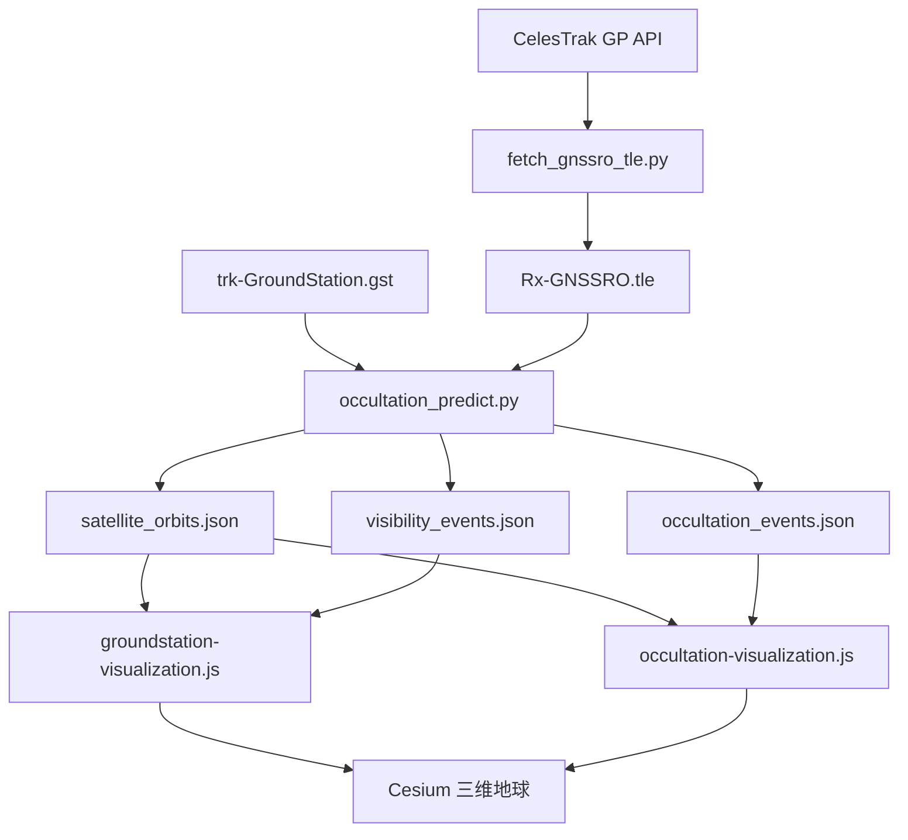
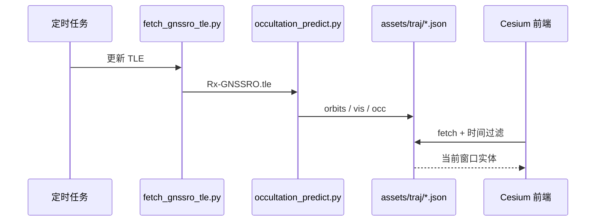

## 摘要

本报告以本站两套三维可视化工具——[地面站可视性可视化](/tools/groundstation-visualization/)与[掩星事件可视化](/tools/occultation-visualization/)——及其后端脚本 `scripts/fetch_gnssro_tle.py`、`scripts/occultation_predict.py` 为线索，把“卫星在哪里、地面站何时看见它、GNSS 与低轨接收机何时形成掩星”拆成可计算的几何与动力学问题。内容覆盖二体问题与轨道根数、两行轨道根数（TLE）与 SGP4 传播、格林尼治恒星时驱动的 ECI→ECEF 旋转、WGS84 椭球上的 ECEF↔LLH 迭代、站心 ENU 系中的方位角/高度角判定，以及 GNSS 无线电掩星的直线切点近似与电离层/大气层事件分类。文中公式与阈值选取与仓库实现保持一致，便于读者对照代码复现。

**关键词**：TLE；SGP4；ECI/ECEF/ENU；地面站可视弧段；GNSS 无线电掩星；切点高度；Cesium

---

## 1. 引言与问题设定

地球附近的人造卫星服从近似二体引力，但短期预报若要达到工程可用精度，通常改用经验摄动模型（如 SGP4）消化大气阻力、地球非球形与第三体扰动的平均效应。GNSS 无线电掩星（Radio Occultation, RO）则在此基础上更进一步：低轨（LEO）接收机在 GNSS 信号掠过大气边缘时记录载波相位与振幅，用以反演折弯角乃至折射率、电子密度剖面。预报“何时、何地发生一次掩星”，本质上是在给定发射机与接收机星历后，判断 GNSS–LEO 视线与地球椭球外切点高度是否落入大气或电离层窗口，并满足方位角约束。

本站工具链的数据流可概括为下图。TLE 由 CelesTrak 按 NORAD 目录号拉取；`occultation_predict.py` 以固定步长传播轨道，并行判别可视弧段与掩星事件，输出 JSON；前端 Cesium 脚本按时间窗口过滤并渲染轨道、可视弧与切点轨迹。



报告结构按物理层次展开：第 2 节回顾轨道力学；第 3 节给出坐标系统与变换；第 4 节说明 TLE 星座配置；第 5–6 节分别推导地面站可视与掩星预报；第 7 节对应前端时间过滤与渲染；第 8–9 节讨论误差来源与结论。

---

## 2. 轨道力学基础：从开普勒到 SGP4

### 2.1 二体问题与比角动量

设中心天体质量 \(M\) 远大于卫星质量 \(m\)，引力常数积 \(\mu = GM\)。相对位置矢量 \(\mathbf{r}\) 满足

$$
\ddot{\mathbf{r}} = -\frac{\mu}{r^3}\mathbf{r},\qquad r=\|\mathbf{r}\|.
$$

对上式叉乘 \(\mathbf{r}\) 并积分，得比角动量守恒

$$
\mathbf{h} = \mathbf{r}\times\mathbf{v} = \text{const},\qquad h=\|\mathbf{h}\|.
$$

\(\mathbf{h}\) 垂直于轨道平面，因而二体轨道是平面曲线。再引入 Laplace–Runge–Lenz 矢量

$$
\mathbf{e} = \frac{\mathbf{v}\times\mathbf{h}}{\mu}-\frac{\mathbf{r}}{r},
$$

其模 \(e=\|\mathbf{e}\|\) 即偏心率。轨道方程写成极坐标形式为

$$
r = \frac{p}{1+e\cos\nu},\qquad p=\frac{h^2}{\mu},
$$

其中 \(\nu\) 为真近点角，\(p\) 为半通径。椭圆情形 \(0\le e<1\)，半长轴 \(a=p/(1-e^2)\)，周期由开普勒第三定律给出

$$
T = 2\pi\sqrt{\frac{a^3}{\mu}}.
$$

对近地圆轨道，取 \(\mu\approx 3.986004418\times 10^{14}\,\mathrm{m}^3\mathrm{s}^{-2}\)，高度 \(H=800\,\mathrm{km}\) 时

$$
a = R_E+H \approx 7178\,\mathrm{km},
$$
$$
n=\sqrt{\frac{\mu}{a^3}}\approx 1.04\times 10^{-3}\,\mathrm{rad\,s}^{-1},
$$

对应轨道周期约 101 分钟，与风云三号（FY-3）系列太阳同步轨道量级一致。

### 2.2 经典轨道根数

工程上常用一组六元根数 \(\{a,e,i,\Omega,\omega,M_0\}\) 或等价的 \(\{n,e,i,\Omega,\omega,M_0\}\) 描述瞬时开普勒椭圆：\(i\) 为轨道倾角，\(\Omega\) 为升交点赤经，\(\omega\) 为近地点幅角，\(M_0\) 为历元平近点角。由平近点角 \(M=M_0+n(t-t_0)\) 解开普勒方程

$$
M = E - e\sin E
$$

得偏近点角 \(E\)，再经

$$
\tan\frac{\nu}{2}=\sqrt{\frac{1+e}{1-e}}\tan\frac{E}{2}
$$

得到真近点角，最后由旋转矩阵序列将轨道面坐标映到惯性系。

真实地球并非质点。\(J_2\) 项引起的升交点进动与近地点进动分别为

$$
\dot{\Omega} = -\frac{3}{2}n J_2\left(\frac{R_E}{p}\right)^2\cos i,
$$

$$
\dot{\omega} = \frac{3}{4}n J_2\left(\frac{R_E}{p}\right)^2(5\cos^2 i-1).
$$

太阳同步轨道要求 \(\dot{\Omega}=2\pi/\mathrm{yr}\)，由此反推倾角与半长轴的匹配关系；FY-3D/E/F 的倾角接近 \(98.7^\circ\)–\(99.0^\circ\)，正是这一约束的结果。COSMIC-2 倾角约 \(24^\circ\)，则服务于低纬加密观测。

### 2.3 TLE 与 SGP4

两行轨道根数（Two-Line Element）把平均根数、弹道系数 \(B^*\)、平均运动及其导数等压缩为固定列格式。本站 `fetch_gnssro_tle.py` 按 NORAD 目录号请求

```text
https://celestrak.org/NORAD/elements/gp.php?CATNR={id}&FORMAT=TLE
```

并写入 `assets/traj/Rx-GNSSRO.tle`。文件中每颗星以注释行标明短名与类型，例如 `# FY3D (LEO)`，其后两行为标准 TLE。

SGP4（Simplified General Perturbations 4）以这些平均根数为初值，在模型内部展开地球非球形、大气阻力与部分日月摄动的解析近似，输出地心惯性系（TEME，常近似当作 ECI）位置速度，单位通常为 \(\mathrm{km}\) 与 \(\mathrm{km\,s}^{-1}\)。实现中调用 `sgp4.api.Satrec.twoline2rv` 与 `satrec.sgp4(jd, fr)`：

$$
(\varepsilon,\mathbf{r}_{\mathrm{ECI}},\mathbf{v}_{\mathrm{ECI}}) = \mathrm{SGP4}(\mathrm{TLE};\, JD,\, f_r),
$$

其中 \(JD+f_r\) 为儒略日及其日分数，\(\varepsilon=0\) 表示成功。对预报窗口 \([t_s,t_e]\) 以步长 \(\Delta t=30\,\mathrm{s}\)（代码常量 `TIME_STEP`）生成时间序列，再并行传播全部 GNSS 与 LEO。

需要强调：TLE/SGP4 给出的是适合空间态势感知的公里级精度，而非精密定轨厘米级星历。掩星几何预报与地面站过境预报在此精度下通常足够；若用于相位级反演，应改用精密星历（如 IGS、北斗精密产品）。

---

## 3. 坐标系：从恒星时到站心 ENU

可视化与可视判定都在“地球固连”坐标中进行。完整链路为

$$
\mathrm{TLE}\xrightarrow{\mathrm{SGP4}}\mathrm{ECI/TEME}
\xrightarrow{R_3(\theta_{\mathrm{GAST}})}\mathrm{ECEF}
\xrightarrow{\mathrm{迭代}}\mathrm{LLH}
\xrightarrow{R_{\mathrm{ENU}}}\mathrm{站心}.
$$

### 3.1 ECI 到 ECEF：格林尼治视恒星时

设惯性系位置 \(\mathbf{r}_{\mathrm{ECI}}=(x,y,z)^\mathrm{T}\)。绕 \(z\) 轴旋转格林尼治视恒星时 \(\theta=\theta_{\mathrm{GAST}}\)：

$$
\begin{pmatrix}x\\y\\z\end{pmatrix}_{\mathrm{ECEF}}
=
\begin{pmatrix}
\cos\theta & \sin\theta & 0\\
-\sin\theta & \cos\theta & 0\\
0 & 0 & 1
\end{pmatrix}
\begin{pmatrix}x\\y\\z\end{pmatrix}_{\mathrm{ECI}}.
$$

代码 `gast_approx` 采用以 J2000.0 为历元的近似多项式（单位：度，再取模 \(360^\circ\)）

$$
\begin{aligned}
\theta &= 280.46061837
+360.98564736629\,(JD-2451545.0)\\
&\quad +0.000387933\,T^2-\frac{T^3}{38710000},\\
T &= \frac{JD-2451545.0}{36525}.
\end{aligned}
$$

该式把 UTC 近似当作 UT1，并省略完整岁差–章动–极移链。对数小时预报窗口，由此引入的方位误差通常在亚度到数度量级，可视弧段起止时刻可能偏移数十秒；精密应用应改用 IAU 2000/2006 CIO 基或 Astropy/`astropy.coordinates` 的完整变换。速度分量对 \(x,y\) 施加同一旋转，\(v_z\) 不变，与位置处理一致。

### 3.2 ECEF 与大地经纬高（WGS84）

WGS84 椭球长半轴与扁率为

$$
a=6378137\,\mathrm{m},\qquad
f=\frac{1}{298.257223563},\qquad
e^2=f(2-f).
$$

由大地纬度 \(\varphi\)、经度 \(\lambda\)、高程 \(h\) 到 ECEF 的正向变换为

$$
\begin{aligned}
N(\varphi)&=\frac{a}{\sqrt{1-e^2\sin^2\varphi}},\\
X &= (N+h)\cos\varphi\cos\lambda,\\
Y &= (N+h)\cos\varphi\sin\lambda,\\
Z &= \bigl(N(1-e^2)+h\bigr)\sin\varphi.
\end{aligned}
$$

逆向变换无解析闭式。代码采用迭代：先令

$$
\varphi^{(0)}=\arctan\!\frac{Z}{p(1-e^2)},\qquad p=\sqrt{X^2+Y^2},
$$

再更新

$$
N=\frac{a}{\sqrt{1-e^2\sin^2\varphi}},\quad
h=\frac{p}{\cos\varphi}-N,\quad
\varphi\leftarrow\arctan\!\frac{Z}{p\bigl(1-e^2\frac{N}{N+h}\bigr)},
$$

直至 \(|\varphi-\varphi_{\mathrm{prev}}|<10^{-12}\) 或迭代满 10 次。经度直接取 \(\lambda=\mathrm{atan2}(Y,X)\)。SGP4 输出以公里计，转换前先乘 \(10^3\) 化为米，输出高度再除回公里，与 JSON 字段 `alt` 的单位约定一致。

### 3.3 站心东–北–天（ENU）

地面站 \((\lambda_s,\varphi_s,h_s)\) 的 ECEF 位置记为 \(\mathbf{r}_s\)。卫星 ECEF 位置 \(\mathbf{r}\) 相对站心矢量为 \(\Delta\mathbf{r}=\mathbf{r}-\mathbf{r}_s\)。ENU 旋转矩阵

$$
R_{\mathrm{ENU}}=
\begin{pmatrix}
-\sin\lambda_s & \cos\lambda_s & 0\\
-\sin\varphi_s\cos\lambda_s & -\sin\varphi_s\sin\lambda_s & \cos\varphi_s\\
\cos\varphi_s\cos\lambda_s & \cos\varphi_s\sin\lambda_s & \sin\varphi_s
\end{pmatrix}
$$

把 \(\Delta\mathbf{r}\) 映到 \((e,n,u)^\mathrm{T}=R_{\mathrm{ENU}}\Delta\mathbf{r}\)。方位角（自北向东）与高度角定义为

$$
A=\mathrm{atan2}(e,n)\bmod 360^\circ,\qquad
E=\arctan\!\frac{u}{\sqrt{e^2+n^2}}.
$$

这正是 `calc_sat_vis` 的实现。高度角 \(E\) 与仰角极限 \(\beta_{\lim}\)（站文件字段 `betalim`）比较，决定是否进入可视状态。

### 3.4 坐标误差的量级估计

设 GAST 误差 \(\delta\theta\)（弧度），赤道附近切向位置误差约为 \(a\cos\varphi\cdot\delta\theta\)。取 \(\delta\theta\sim 10^{-4}\,\mathrm{rad}\)（约 \(20''\)），则位置误差约 \(640\,\mathrm{m}\)。对高度角

$$
\delta E \approx \frac{\|\delta\mathbf{r}_\perp\|}{\rho},
$$

其中 \(\rho\) 为斜距。LEO 过境 \(\rho\sim 1000\,\mathrm{km}\) 时，\(\delta E\sim 0.04^\circ\)；GNSS 斜距更大，角误差更小。因此坐标近似对“是否高于 \(5^\circ\) 仰角”这类粗判影响有限，但对弧段边界秒级对齐仍不可忽视。

---

## 4. 星座与地面站配置

### 4.1 卫星字典

`SATELLITE_DICT` 将 NORAD 号映射为短名与类型。当前清单包括：

| 类别 | 示例 | 轨道特征 | 在掩星中的角色 |
|:---|:---|:---|:---|
| 风云三号 LEO | FY3D/E/F/G | SSO 或倾斜低轨 | GNSS-RO 接收端 |
| COSMIC-2 | C2E1–C2E6 | 低倾角 \(\sim 24^\circ\) | 热带加密 RO |
| GPS | G01–G32 | MEO \(\sim 20200\,\mathrm{km}\) | 发射端 |
| 北斗 BDS-2/3 | Cxx | GEO/IGSO/MEO 混合 | 发射端 |
| Galileo | Exx | MEO | 发射端 |
| GLONASS | Rxx | MEO，倾角 \(\sim 64.8^\circ\) | 发射端 |

类型字段 `GNSS` / `LEO` 决定后续分支：掩星只在 GNSS–LEO 对上计算；可视性则对全部卫星与全部地面站配对。

### 4.2 地面站文件

`trk-GroundStation.gst` 以空白分隔表给出站名、国家、椭球高 \(h\)（米）、大地纬度 \(\varphi\)、经度 \(\lambda\) 与仰角门限 \(\beta_{\lim}\)。示例站七台河、喀什、三亚均取 \(\beta_{\lim}=5^\circ\)，对应低仰角多径与遮挡的工程折中：过低则弧段虚增，过高则丢失可用过境。

---

## 5. 地面站可视弧段预报

### 5.1 状态机判定

对每个卫星–地面站对，在粗网格时间 \(\{t_i\}\)（步长 30 s）上计算 \((E_i,A_i)\)。分类函数为

$$
\mathrm{vis\_type}=
\begin{cases}
\mathrm{deep}, & E<\beta_{\lim},\\
\mathrm{vis}, & E\ge\beta_{\lim}.
\end{cases}
$$

当状态由非 `vis` 进入 `vis`，或由 `vis` 离开，或到达序列末尾仍处于 `vis`，则闭合一段可视弧。进入细化阶段后，在区间两端向外各回退一个粗步长，以步长 `VIS_STEP=10 s` 线性插值 ECEF 位置（位置与速度六分量分别一维插值），重新计算仰角，仅保留 \(E\ge\beta_{\lim}\) 的采样点，写入

```json
{"type":"vis","satellite":"...","station":"...","start":"...","end":"...","points":[...]}
```

每个点含 `lon,lat,alt,elev,azim`。该“粗判 + 边界加密”策略把 \(O(N_{\mathrm{sat}}N_{\mathrm{st}}N_t)\) 的主体计算控制在 30 s 网格上，又保证弧段端点时间分辨率达到 10 s。

### 5.2 几何直观：地球掩蔽与最小仰角

若把地球当作半径 \(R\) 的球体、站在表面、卫星在半径 \(r_s\) 的圆轨道，则几何地平线对应的地心半角 \(\alpha\) 满足

$$
\cos\alpha=\frac{R}{r_s},
$$

对应仰角 \(E=0\)。要求 \(E\ge\beta_{\lim}\) 等价于视线与当地水平面夹角不小于门限，可视弧在地心投影上缩短为一段更窄的中央角。对太阳同步 LEO，单站每日过境次数约为 2–4 次（视纬度与轨道面相位而定）；对 GNSS MEO，因角运动慢、高度高，单站几乎持续多星可见，可视“弧段”更长，在三维场景中表现为缓慢扫过天空的黄线。

### 5.3 前端时间窗口渲染

`groundstation-visualization.js` 读取 `satellite_orbits.json` 与 `visibility_events.json`，用 Cesium `JulianDate` 驱动时钟。当前时刻 \(t\) 下，仅显示落在 \([t-T_w,t]\) 内的轨道点与可视弧，其中 \(T_w=2\,\mathrm{h}\)。GNSS 轨道着黄色，LEO 着绿色，可视弧用较粗的随机色折线强调；地面站为红色点。快捷键 `L`/`G` 分别切换 LEO/GNSS 显示，便于对比两类星座的过境密度差异。

---

## 6. GNSS 无线电掩星：切点几何与事件分类

### 6.1 直线近似下的切点

设 GNSS 发射机 ECEF 位置 \(\mathbf{r}_T\)，LEO 接收机位置 \(\mathbf{r}_R\)、速度 \(\mathbf{v}_R\)。单位视线

$$
\hat{\boldsymbol{\ell}}=\frac{\mathbf{r}_T-\mathbf{r}_R}{\|\mathbf{r}_T-\mathbf{r}_R\|}.
$$

忽略折射时，信号沿直线传播；与地心相关的“冲击参数矢量”可取接收机位置在垂直于视线方向上的投影：

$$
\mathbf{r}_{\mathrm{tp}}=\mathbf{r}_R-(\mathbf{r}_R\cdot\hat{\boldsymbol{\ell}})\,\hat{\boldsymbol{\ell}}.
$$

将 \(\mathbf{r}_{\mathrm{tp}}\) 转为 LLH，得到切点经纬高 \((\lambda_{\mathrm{tp}},\varphi_{\mathrm{tp}},h_{\mathrm{tp}})\)。同时定义两个辅助角（与代码一致，单位度）

$$
E_{\mathrm{occ}}=\arcsin(\hat{\mathbf{r}}_R\cdot\hat{\boldsymbol{\ell}})\cdot\frac{180}{\pi},
$$
$$
A_{\mathrm{occ}}=\arcsin(\hat{\mathbf{v}}_R\cdot\hat{\boldsymbol{\ell}})\cdot\frac{180}{\pi},
$$

其中 \(\hat{\mathbf{r}}_R=\mathbf{r}_R/\|\mathbf{r}_R\|\)，\(\hat{\mathbf{v}}_R=\mathbf{v}_R/\|\mathbf{v}_R\|\)。\(E_{\mathrm{occ}}>0\) 表示 GNSS 仍在 LEO“上方”一侧的几何配置，不构成对大气的掠射；\(|A_{\mathrm{occ}}|>\mathtt{AZIM\_WIDTH}\)（默认 \(50^\circ\)）则剔除偏离轨道面法向过大的斜掩星，以贴近侧视掩星接收机的视场约束。

上述 \(\mathbf{r}_{\mathrm{tp}}\) 是直角几何切点，并非光学意义上的折射切点。真实 RO 中，射线在球对称折射率场 \(n(r)\) 下满足 Bouguer 公式

$$
a = n(r)\,r\sin\psi = \text{const},
$$

折弯角

$$
\alpha(a)=-2a\int_{r_t}^{\infty}\frac{1}{\sqrt{n^2 r^2-a^2}}\frac{\mathrm{d}\ln n}{\mathrm{d}r}\,\mathrm{d}r,
$$

其中 \(r_t\) 为射线最低点半径。预报阶段用直线切点高度 \(h_{\mathrm{tp}}\) 作为影响高度的零阶代理，足以做事件发现；反演阶段必须用相位导出的折弯角 \(\alpha(a)\) 取代几何高度。

### 6.2 电离层 / 大气层分类

分类规则（与 `classify_occultation` 一致）为

$$
\mathrm{type}=
\begin{cases}
\mathrm{none}, & E_{\mathrm{occ}}>0\ \mathrm{或}\ |A_{\mathrm{occ}}|>50^\circ,\\
\mathrm{iono}, & 60\,\mathrm{km}<h_{\mathrm{tp}}<500\,\mathrm{km},\\
\mathrm{atm},  & -50\,\mathrm{km}<h_{\mathrm{tp}}\le 60\,\mathrm{km},\\
\mathrm{deep}, & h_{\mathrm{tp}}\le -50\,\mathrm{km}.
\end{cases}
$$

负高度对应视线已“穿入”椭球内部的直角几何假象，表示深掩或遮挡；`deep` 不输出为产品事件。电离层事件在状态翻转时以 `IONO_STEP=20 s` 加密，大气事件以 `ATM_STEP=5 s` 加密——对流层底部切点高度变化更快，需要更密采样。

事件记录包含 `nav`（GNSS 短名）、`leo`、标称时刻与切点序列 `points`。前端 `generateOccultationLabel` 将其格式化为接近业务产品的文件名风格，例如

```text
ionPrf_C2E1.2026.223.14.05.G17_0001.0001_nc
```

青色轨迹表示电离层掩星，橙色表示大气掩星；时间窗口默认 1 小时，与地面站工具的 2 小时窗口相区别，以匹配掩星事件短促、空间散布广的特点。

### 6.3 掩星发生的动力学条件

对圆轨道近似，LEO 轨道角速度 \(n_L\)，GNSS 近似不动（相对）。掩星持续时长大致为切点高度穿过大气层厚度 \(\Delta h\sim 100\,\mathrm{km}\) 所需时间：

$$
\Delta t \sim \frac{\Delta h}{v_{\perp}},\qquad v_{\perp}\sim n_L r_L\sin\gamma,
$$

其中 \(\gamma\) 为视线与轨道面法向夹角相关的几何因子。典型大气上升/下降掩星持续约 1–2 分钟，故 5 s 采样给出数十个切点，足够在三维地球上勾出一条连贯轨迹。

### 6.4 与波动光学反演的接口

本报告止于几何预报。一旦事件发生，接收机记录的复信号 \(s(t)\) 进入波动光学处理（相位匹配、滑窗相位匹配、CT 等），由

$$
S(a)=\int s(t)\,e^{-j\phi(a,t)}\,\mathrm{d}t
$$

一类积分提取折弯角谱。几何预报给出的 \((t,\lambda_{\mathrm{tp}},\varphi_{\mathrm{tp}},h_{\mathrm{tp}})\) 可为反演提供初值与质量控制门限：若预报切点远离海面或进入深掩区，则对应弧段应降权或剔除。相关波动光学细节见本站前文《近三年关于 GNSS 掩星波动光学、极化和滑窗谱方法的文献综述》。

---

## 7. 数值实现与可视化架构

### 7.1 并行策略

轨道传播对每颗卫星独立，事件判别对每颗 GNSS（掩星）或每颗卫星（可视）独立，因此主程序用 `ProcessPoolExecutor` 做进程级并行。粗时间轴一旦算完 ECEF 序列，后续插值与分类不再调用 SGP4，避免重复摄动计算。

### 7.2 线性插值的误差

六分量分段线性插值在步长 30 s 下，对近圆 LEO 的位置截断误差量级为

$$
\delta r \sim \tfrac{1}{8}\,n^2 r\,(\Delta t)^2
\approx \tfrac{1}{8}\,(1.04\times 10^{-3})^2\cdot 7.1\times 10^6\cdot 900
\approx 0.9\,\mathrm{m}.
$$

对可视与掩星分类远小于几何阈值本身的不确定性。大气掩星边界再加密到 5 s，插值误差进一步下降一个数量级以上。

### 7.3 Cesium 中的时空一致性

前端把 `lon,lat,alt(km)` 经 `Cartesian3.fromDegrees` 转为地固笛卡尔坐标，与后端 ECEF/LLH 约定一致。时钟使用数据元数据中的 `start_time`/`end_time`，`ClockRange.LOOP_STOP` 使演示循环播放。掩星页还通过 `manifest.json` 的 `updated_at` 轮询热更新，便于定时任务刷新 TLE 与预报后无需重载页面逻辑。



---

## 8. 讨论：误差、近似与改进路径

**正解释路径。** 直角切点 + 仰角/方位角门限能够在单一 Python 依赖（`sgp4`、`numpy`）下稳定产出全球尺度事件表，并与 Cesium 演示闭环。对教学、态势展示、任务规划粗筛，该链路成本低、可解释性强：每一个 JSON 字段都能回溯到第 3–6 节的某个公式。

**负解释路径。** 直线大气、近似 GAST、TLE 老化与忽略地球遮挡的精确椭球射线求交，会使低仰角可视弧与低层大气掩星边界出现系统性偏差。电离层在黎明昏影与磁暴期间强烈偏离球对称，几何 `iono` 标签并不等于可反演的高质量 ionPrf。负高度 `deep` 分类依赖椭球与直线模型，可能把真实超低层大气事件误伤。

改进可按精度阶梯推进：（1）用 IERS 约定替换 `gast_approx`；（2）用 WGS84 椭球射线求交精化切点；（3）引入简单指数折射率作一阶折弯修正；（4）对业务卫星改用精密星历；五）把遮挡地形 DEM 纳入 \(\beta_{\lim}\) 的站相关修正。每一步都保持“粗网格发现 + 边界加密”的计算骨架，以免组合爆炸。

---

## 9. 结论与使用建议

本报告把本站卫星可视化工具背后的数学结构写成一条可核对的链条：开普勒与摄动给出运动学，SGP4 消化 TLE，恒星时与 WGS84 把轨迹钉在地球上，ENU 仰角决定地面站可视弧，直角切点高度与方位约束决定电离层/大气掩星事件，Cesium 再把 JSON 变成可 scrub 的时间场景。

实践上建议的操作顺序是：先运行 `fetch_gnssro_tle.py` 刷新星历，再运行 `occultation_predict.py` 生成近 6 小时窗口产品，最后打开两个工具页对照黄/绿轨道、粗可视弧与青/橙掩星轨迹。阅读公式时，可直接在 `occultation_predict.py` 中定位同名函数——`gast_approx`、`ecef_to_llh`、`calc_sat_vis`、`calc_tangent_point`、`classify_occultation`——逐项对照。

若需把预报精度推进到业务级，优先替换时间系统与星历源；若需服务科研反演，则将本报告的几何事件表作为波动光学流水线的触发器，而不是折射率产品的替代物。

---

## 参考文献

[1] Vallado D. A. *Fundamentals of Astrodynamics and Applications*. 4th ed. Microcosm Press / Springer, 2013.

[2] Hoots F. R., Roehrich R. L. Spacetrack Report No. 3: Models for Propagation of NORAD Element Sets. Aerospace Defense Command, 1980.

[3] Vallado D. A., Crawford P., Hujsak R., Kelso T. S. Revisiting Spacetrack Report #3. AIAA/AAS Astrodynamics Specialist Conference, 2006.

[4] NIMA. Department of Defense World Geodetic System 1984. TR 8350.2, 3rd ed., 2000.

[5] IERS Conventions (2010). IERS Technical Note No. 36. Frankfurt am Main: Verlag des Bundesamts für Kartographie und Geodäsie, 2010.

[6] Kursinski E. R., Hajj G. A., Schofield J. T., Linfield R. P., Hardy K. R. Observing Earth’s atmosphere with radio occultation measurements using the Global Positioning System. *Journal of Geophysical Research*, 1997, 102(D19): 23429–23465.

[7] Hajj G. A., et al. CHAMP and SAC-C atmospheric occultation results and intercomparisons. *Journal of Geophysical Research*, 2004, 109: D06109.

[8] Melbourne W. G., et al. The application of spaceborne GPS to atmospheric limb sounding and global change monitoring. JPL Publication 94-18, 1994.

[9] CelesTrak. NORAD GP Element Sets. <https://celestrak.org/>

[10] Cesium GS, Inc. CesiumJS Documentation. <https://cesium.com/learn/cesiumjs/ref-doc/>

[11] Mapoet. 三维地球卫星-地面站可视性可视化. <https://mapoet.github.io/tools/groundstation-visualization/>

[12] Mapoet. 三维地球掩星事件可视化. <https://mapoet.github.io/tools/occultation-visualization/>

---

## 附录 A：主要符号

| 符号 | 含义 | 单位 |
|:---|:---|:---|
| \(\mu\) | 地球引力常数 | \(\mathrm{m}^3\mathrm{s}^{-2}\) |
| \(a,e,i,\Omega,\omega,M\) | 经典轨道根数 | — |
| \(\theta_{\mathrm{GAST}}\) | 格林尼治视恒星时 | rad |
| \(\varphi,\lambda,h\) | 大地纬度、经度、高程 | deg, deg, m |
| \(E,A\) | 站心高度角、方位角 | deg |
| \(\beta_{\lim}\) | 仰角门限 | deg |
| \(h_{\mathrm{tp}}\) | 直角几何切点高度 | km |
| \(a\)（掩星） | 冲击参数 | m |
| \(\alpha(a)\) | 折弯角 | rad |

## 附录 B：代码常量一览

| 常量 | 值 | 作用 |
|:---|:---|:---|
| `TIME_STEP` | 30 s | 轨道粗采样 |
| `VIS_STEP` | 10 s | 可视弧加密 |
| `IONO_STEP` | 20 s | 电离层掩星加密 |
| `ATM_STEP` | 5 s | 大气掩星加密 |
| `AZIM_WIDTH` | 50° | 掩星方位角半宽 |
| 预报窗口 | 近 6 h | `occultation_predict` 默认 |
| 前端可视窗口 | 2 h / 1 h | 地面站 / 掩星页 |
