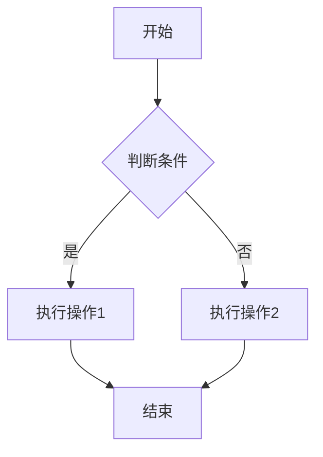
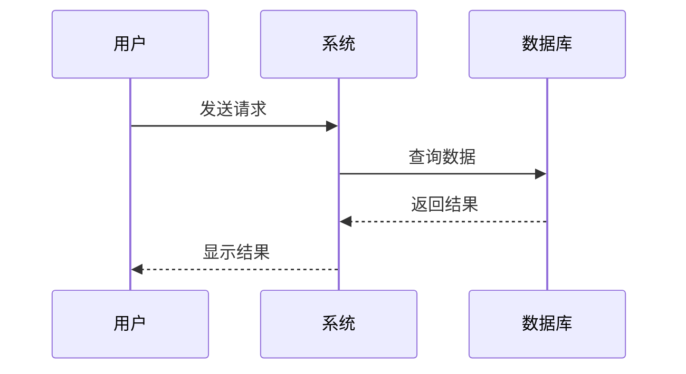
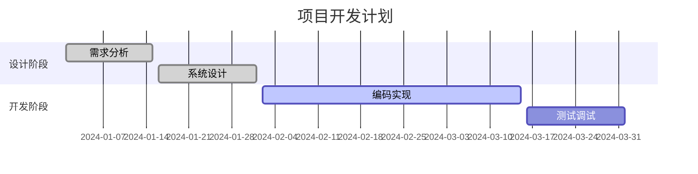
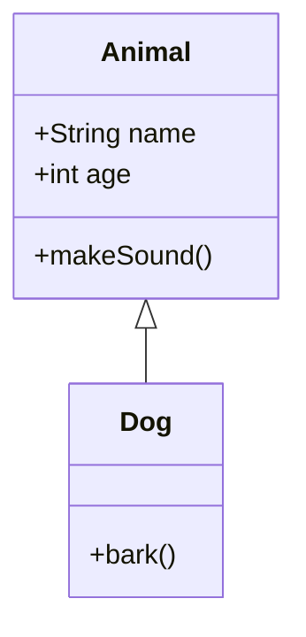

# Mermaid图表配置说明

本文档详细说明了如何在Jekyll站点中配置和使用Mermaid图表。

## 配置概述

我们已经为您的Jekyll站点添加了完整的Mermaid支持，包括：

1. **CDN引用**：使用最新版本的Mermaid库
2. **自定义样式**：优化的显示效果
3. **JavaScript处理**：自动渲染markdown和HTML中的图表
4. **响应式设计**：支持移动设备
5. **错误处理**：友好的错误提示

## 文件结构

```
├── _includes/
│   ├── head/
│   │   └── custom.html          # 添加了Mermaid CDN和配置
│   └── scripts.html             # 引入了mermaid-init.js
├── assets/
│   ├── css/
│   │   └── mermaid-custom.css   # Mermaid自定义样式
│   └── js/
│       └── mermaid-init.js      # Mermaid初始化脚本
└── _pages/
    └── mermaid-test.md          # 测试页面
```

## 使用方法

### 1. 在Markdown中使用

#### 流程图
```markdown

```

#### 序列图
```markdown

```

#### 甘特图
```markdown

```

#### 类图
```markdown

```

### 2. 在HTML中使用

#### 基本用法
```html
<div class="mermaid">
graph TD
    A[开始] --> B[结束]
</div>
```

#### 带标题的图表
```html
<div class="mermaid" data-title="我的流程图">
graph TD
    A[开始] --> B[结束]
</div>
```

#### 自定义样式
```html
<div class="mermaid" style="background: #f0f0f0; padding: 20px;">
graph TD
    A[开始] --> B[结束]
</div>
```

## 支持的图表类型

### 1. 流程图 (flowchart)
- 支持多种方向：TD, BT, LR, RL
- 支持节点形状：矩形、圆形、菱形等
- 支持连接线样式：实线、虚线、箭头等

### 2. 序列图 (sequenceDiagram)
- 参与者定义
- 消息传递
- 激活状态
- 注释和分组

### 3. 甘特图 (gantt)
- 任务定义
- 时间轴
- 依赖关系
- 进度显示

### 4. 类图 (classDiagram)
- 类定义
- 属性和方法
- 继承关系
- 关联关系

### 5. 状态图 (stateDiagram)
- 状态定义
- 状态转换
- 条件分支
- 嵌套状态

### 6. 饼图 (pie)
- 数据标签
- 百分比显示
- 颜色配置

### 7. Git图 (gitGraph)
- 提交历史
- 分支管理
- 合并操作

### 8. 实体关系图 (erDiagram)
- 实体定义
- 关系类型
- 属性描述

### 9. 用户旅程图 (journey)
- 阶段划分
- 用户行为
- 满意度评分

### 10. 需求图 (requirement)
- 需求定义
- 风险等级
- 验证方法

## 配置选项

### 主题设置
```javascript
mermaid.initialize({
  theme: 'default', // 可选: default, forest, dark, neutral
  // 其他配置...
});
```

### 流程图配置
```javascript
flowchart: {
  useMaxWidth: true,
  htmlLabels: true,
  curve: 'basis' // 可选: linear, basis, step, stepBefore, stepAfter
}
```

### 序列图配置
```javascript
sequence: {
  useMaxWidth: true,
  diagramMarginX: 50,
  diagramMarginY: 10,
  actorMargin: 50,
  width: 150,
  height: 65
}
```

### 甘特图配置
```javascript
gantt: {
  titleTopMargin: 25,
  barHeight: 20,
  barGap: 4,
  topPadding: 50,
  leftPadding: 75,
  fontSize: 11,
  fontFamily: '"Open-Sans", "sans-serif"'
}
```

## 故障排除

### 1. 图表不显示
- 检查浏览器控制台是否有错误信息
- 确认Mermaid库已正确加载
- 检查图表语法是否正确

### 2. 样式问题
- 检查CSS文件是否正确加载
- 确认没有CSS冲突
- 尝试刷新浏览器缓存

### 3. 响应式问题
- 检查移动设备上的显示效果
- 确认图表容器有正确的样式
- 测试不同屏幕尺寸

### 4. 性能问题
- 减少图表复杂度
- 使用异步加载
- 优化图表配置

## 最佳实践

### 1. 图表设计
- 保持图表简洁明了
- 使用有意义的标签
- 避免过于复杂的布局

### 2. 性能优化
- 限制图表节点数量
- 使用适当的图表类型
- 避免不必要的动画效果

### 3. 可访问性
- 提供图表描述
- 使用高对比度颜色
- 确保键盘导航支持

### 4. 维护性
- 使用清晰的命名
- 添加必要的注释
- 定期更新图表内容

## 更新和维护

### 更新Mermaid版本
1. 修改`_includes/head/custom.html`中的CDN链接
2. 测试所有图表功能
3. 更新配置选项（如需要）

### 自定义样式
1. 编辑`assets/css/mermaid-custom.css`
2. 测试样式效果
3. 确保响应式兼容性

### 添加新功能
1. 修改`assets/js/mermaid-init.js`
2. 更新配置选项
3. 添加相应的样式

## 测试页面

访问 `/mermaid-test/` 页面可以查看所有图表类型的示例和测试结果。

## 参考资源

- [Mermaid官方文档](https://mermaid-js.github.io/mermaid/)
- [Mermaid语法指南](https://mermaid-js.github.io/mermaid/#/flowchart)
- [Mermaid在线编辑器](https://mermaid-js.github.io/mermaid-live-editor/)
- [Mermaid GitHub仓库](https://github.com/mermaid-js/mermaid) 