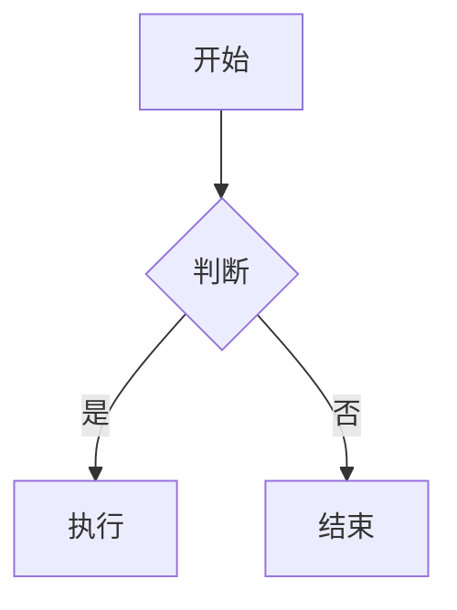

# Mermaid 图表配置说明

本文档说明本站 Mermaid 的接入方式、视觉主题与维护入口。

## 设计目标

图表应与学术站点整体气质一致：**青灰主色**（对齐 `$info-color: #52adc8`）、纸面卡片容器、柔和节点与克制连线，避免默认 `theme: default` 的廉价感，并禁止暗色模式下的 `filter: invert`（会导致色相失真）。

## 文件结构

```
├── _includes/head/custom.html   # Mermaid CDN + mermaid-init.js
├── assets/
│   ├── css/mermaid-custom.css   # 纸面卡片与响应式样式
│   └── js/mermaid-init.js       # 主题变量与图表布局参数
└── docs/mermaid-setup.md        # 本说明
```

工具页 `assets/tools/md-to-image/` 使用同一套青灰 `themeVariables`，保证预览/导出与正文一致。

## 当前技术选型

| 项 | 值 |
| --- | --- |
| 库版本 | Mermaid **10.9.1**（jsDelivr） |
| 主题引擎 | `theme: "base"` + 自定义 `themeVariables` |
| 加载方式 | `defer`；`startOnLoad: false`，由 init 转换 `pre > code.language-mermaid` 后 `mermaid.run()` |
| 字体 | 系统 UI 栈 + PingFang / 微软雅黑 / Noto Sans SC |

## 使用方法

### Markdown

````markdown

```mermaid
flowchart TD
    A[开始] --> B{判断}
    B -->|是| C[执行]
    B -->|否| D[结束]
```
````

### HTML

```html
<div class="mermaid">
flowchart LR
    A --> B
</div>
```

## 主题与布局要点（`mermaid-init.js`）

- **节点色**：浅青灰填充 `#e8f4f8`，描边 `#5a9bb0`，正文墨色 `#243447`
- **连线**：`#6b7c8a`，`curve: "basis"`，节点间距约 48 / 52
- **注释块**：暖纸色（序列图 note），与主流程青灰区分
- **饼图**：12 档青灰渐变，避免高饱和彩虹
- **暗色系统偏好**：图表仍落在浅色纸面卡片上，保证对比度

微调颜色时优先改 `LIGHT_THEME`；微调外边距/圆角/顶部分割线时改 `mermaid-custom.css`。

## 故障排除

1. **不显示**：控制台是否报 Mermaid 语法错误；确认 CDN 与 `mermaid-init.js` 均已加载  
2. **仍是默认蓝**：强刷缓存；确认未残留旧的内联 `theme: 'default'`  
3. **暗色发灰/反色**：旧版 CSS 的 `filter: invert` 应已移除  
4. **移动端过窄**：容器允许横向滚动；勿强行压小 SVG 字号导致糊字  

## 维护

1. 升级版本：改 `custom.html`（及 md-to-image 的）CDN，回归若干典型帖（flowchart / sequence / pie / gantt）  
2. 改视觉：同步 `mermaid-init.js` 与 `md-to-image.js` 的 `themeVariables`  
3. 改外框：只动 `mermaid-custom.css` / md-to-image.css  

## 参考

- [Mermaid 文档](https://mermaid.js.org/)
- [Live Editor](https://mermaid.live/)
- [GitHub: mermaid](https://github.com/mermaid-js/mermaid)
